# Exploring Concept Depth: How Large Language Models Acquire Knowledge and Concepts at Different Layers?

Mingyu Jin<sup>1</sup>, Qinkai Yu<sup>2</sup>, Jingyuan Huang<sup>1</sup>, Qingcheng Zeng<sup>3</sup>, Zhenting Wang<sup>1</sup>, Wenyue Hua<sup>1</sup>, Haiyan Zhao<sup>4</sup>, Kai Mei<sup>1</sup>, Yanda Meng<sup>2</sup>, Kaize Ding<sup>3</sup>, Fan Yang<sup>5</sup>, Mengnan Du<sup>4</sup>, Yongfeng Zhang<sup>1</sup> <sup>1</sup>Rutgers University, <sup>2</sup>University of Exeter, <sup>3</sup>Northwestern University, <sup>4</sup>New Jersey Institute of Technology, <sup>5</sup>Wake Forest University,

{mingyu.jin, chy.huang, yongfeng.zhang}@rutgers.edu , qy269@exeter.ac.uk , mengnan.du@njit.edu ,

## Abstract

Large language models (LLMs) have shown remarkable performances across a wide range of tasks. However, the mechanisms by which these models encode tasks of varying complexities remain poorly understood. In this paper, we explore the hypothesis that LLMs process concepts of varying complexities in different layers, introducing the idea of “Concept Depth” to suggest that more complex concepts are typically acquired in deeper layers. Specifically, we categorize concepts based on their level of abstraction, defining them in the order of increasing complexity within factual, emo tional, and inferential tasks. We conduct ex tensive probing experiments using layer-wise representations across various LLM families (Gemma, LLaMA, Qwen) on various datasets spanning the three domains of tasks. Our find ings reveal that models could efficiently conduct probing for simpler tasks in shallow layers, and more complex tasks typically necessitate deeper layers for accurate understanding. Additionally, we examine how external factors, such as adding noise to the input and quantizing the model weights, might affect layer-wise representations. Our findings suggest that these factors can impede the development of a conceptual understanding of LLMs until deeper layers are explored. We hope that our pro posed concept and experimental insights will enhance the understanding of the mechanisms underlying LLMs. Our codes are available at https://github.com/Luckfort/CD.

## 1 Introduction

LLMs such as GPT-4 (Achiam et al., 2023) and LLaMA (Touvron et al., 2023) have impressive generation and reasoning capabilities (Chang et al.,

2023; Su et al., 2024a,c). It is widely accepted that these models embed substantial knowledge in their parameters, with performance improving as the number of parameters increases (Ju et al., 2024; Jin et al., 2024a; Zhou et al., 2024), also known as emergent abilities (Wei et al., 2022a). For instance, GPT-3 (Brown et al., 2020) shows a large increase in performance after scaling up to 13B parameters, and a similar phenomenon was also observed for LaMDA (Thoppilan et al., 2022) after exceeding 68B parameters (Wei et al., 2022b). However, it is not well understood how LLMs accurately grasp the concept of knowledge. In this paper, we investigate the following research question: Can shallow layers in LLMs capture meaningful features ofsimple knowledge, while complex concepts need deeper layers to capture their meaningful features? like Figure 2. We hope to explore the connection between the depth of language models’ neural networks and their conceptual understanding ability by studying this question.

Recent studies on understanding the reasoning abilities of LLMs focus on two main strategies: probing representations and model pruning. Probing involves using linear classifier probes to analyze the performance of hidden layer representations; for instance, Duan et al. (2024) examines changes in LLMs’ internal representations during hallucinations, while Ju et al. (2024) investigates the performance of different layers in the LLaMA series using synthetic counterfactual datasets. On the other hand, model pruning removes redundant parameters based on their importance in seeing if performance is significantly affected. This method, although effective, can be complex and time-consuming. For example, Zhang et al. (2023) uses gradient information to decide the pruning components, and Gromov et al. (2024) even requires QLoRA fine-tuning (Dettmers et al., 2024) to do the pruning. Given these complexities, Our work primarily analyzes the representations obtained through probing techniques. Building upon previous work, we aim to gain a more comprehensive understanding of the layer representations within LLMs.

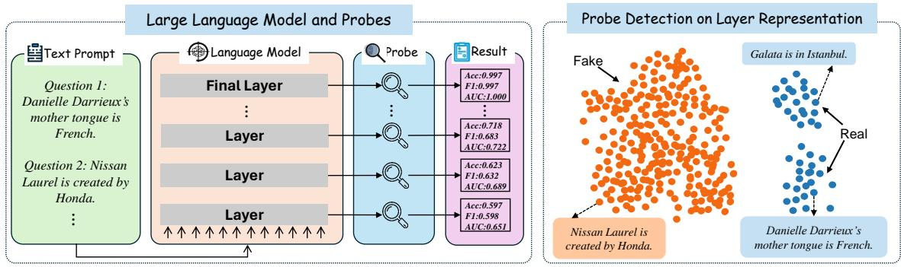  
Figure 1: The left figure provides an overview of our analysis process. LLMs respond to text prompts, and the probing process assesses the optimal performance achievable by the current LLM layer. The right figure illustrates a demonstration of layer-wise representations by probe detection. In this demonstration, orange points represent fake samples, while blue points represent real samples. In this case, the probe tries to classify between two categories.

Our general framework is shown in Figure 1. We trained independent linear probes for each layer of LLMs to predict the binary label, thereby determining the optimal performance achievable with the representations of each respective layer. Drawing from our empirical findings, we propose the notion of “Concept Depth” as a novel metric to evaluate the capability of different models in comprehending varying levels of knowledge across their layers. This is the first time such a concept has been introduced in the relevant literature.

Our empirical results ranging from 3 popular LLMs families (Gemma (Team et al., 2023), LLaMA (Touvron et al., 2023), and Qwen (Bai et al., 2023)) and 9 datasets reveal that “Concept Depth” is widely applicable in existing mainstream LLMs. Besides, we conducted comprehensive robustness analyses, introducing random strings as the noise or quantization, to further understand how the reasoning of LLMs is sensitive to noise. To conclude, our main contributions could be summarized as follows:

• Concept Depth. We introduce the idea of “Concept Depth” to measure different layers’ abilities to learn different levels of concepts. We first anchored the difficulty of the dataset using LLaMA-3-8b-Instruct (Dubey et al., 2024) and then tested “Concept Depth” with other models. Our results show that simpler concepts are often learned at shallower levels, while complex concepts require deeper levels to understand like Demo 2. This phenomenon has been observed across LLMs of different model families and different sizes.

• Experiments on understanding capabilities of LLMs. We experimented with multidimensional datasets (fact, emotion, and reasoning) to analyze variations in the conceptual depth of LLMs. We observed these differences across various datasets, model parameter counts, and model families (Gemma (Team et al., 2023), LLaMA (Touvron et al., 2023), and Qwen (Bai et al., 2023)), providing a concise understanding of their impact on LLM performance and comprehension.

• Robustness from Concept Depth perspective. We provide a new perspective on LLMs robustness. We conduct ablation experiments on model weight quantization and add random noise to the input that may affect the accuracy of LLMs inference. Details can be found in Appendix A.3. The results show that after adding the noise or conducting the quantization on the weights, the LLMs end up learning the concepts at slower paces and deeper layers.

## 2 Related Work

## 2.1 Concepts Representation in DNNs

Identifying similarities across various examples to form concepts, plays a crucial role in human decision-making (Armstrong et al., 1983). Many studies have explained DNNs’ (Deep Neural Networks) decision-making based on a conceptual perspective, describing the global behavior of DNNs in a human-understandable way (Su et al., 2022; Räz, 2023; Ren et al., 2023; Deng et al., 2021; Wen et al., 2024a; Wen, 2024; Wen et al., 2024b). For example, (Yeh et al., 2019) demonstrated that DNNs exhibit conceptual representations through the activation patterns observed in their hidden or output layers. Further, Räz (2023) indicates that DNNs learned not only conceptual representations of predicted categories but also indirect concepts that contribute to the prediction. A notable study reveals the existence of a representation bottleneck, highlighting a cognitive disparity between DNNs and humans. This phenomenon is characterized by DNNs’ tendency to grasp representations of concepts that are either too simple or overly complex, while they often struggle with acquiring representations of concepts of moderate complexity (Deng et al., 2021). Motivated by previous work, our paper aims to cover concepts of different complexities to understand concepts within LLMs further.

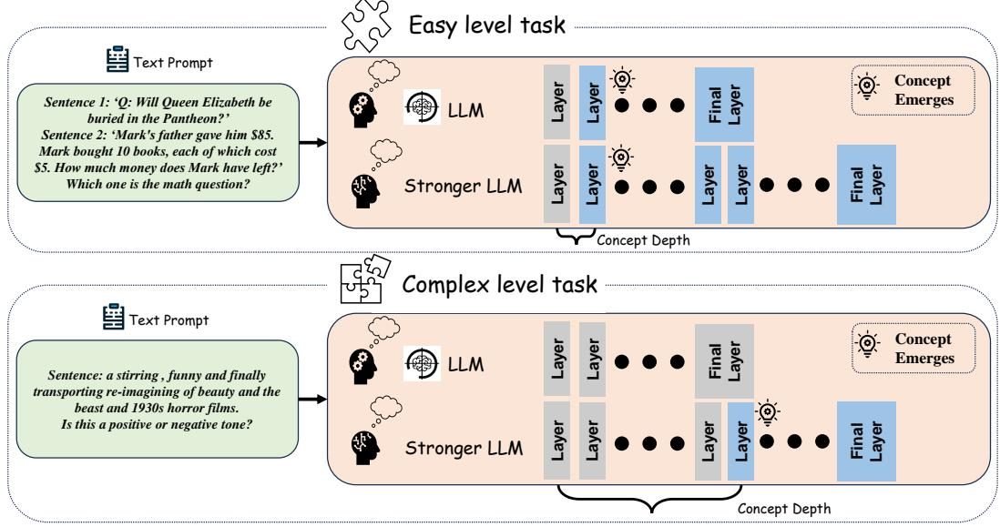  
Figure 2: The LLMs are trying to understand easy tasks and complex tasks. The more complex the task, the deeper layers an LLM needs to understand. The stronger the LLM is, the more complex the task level it can learn.

## 2.2 Knowledge and Concepts in LLMs

The impressive performance of the LLMs in various downstream tasks (e.g. LLMs can predictfactual statements about the world based on prompts (Meng et al., 2022)) has led to a great discussion about whether these capabilities are ‘stochastic parrots’ or LLMs understands these concepts. Pioneeringly, Gurnee and Tegmark (2023) showed that LLMs internally store concepts like latitude, longitude, and time. Similarly, another work showed that the internal states of LLMs can detect the truth of a statement (Azaria and Mitchell, 2023; Su et al., 2024b). Geva et al. (2023) also came to similar conclusions by artificially blocking or “knocking out" specific parts of the LLMs to observe their effects on the inference process. These related studies show the existence of structures for understanding concepts within LLMs, motivating us to explore how concepts at various complexities are encoded within various depths of LLMs.

## 2.3 Explorations of Interpretability in LLMs

Many related studies have deconstructed the inner layers of LLMs from various perspectives to understand the mechanisms inside such models (Zhao et al., 2024; Jin et al., 2024b). Fan et al. (2024) computes stopping signals by evaluating key features to early stop the LLM inference and get the internal performance of the LLMs, concluding that not all layers are necessary. Through pruning the LLMs, Gromov et al. (2024) found that the parameters of some layers were not utilized correctly. Men et al. (2024) also shows a high level of redundancy in the LLMs’ architecture. Probes trained with logistic regression are a well-established method (Alain and Bengio, 2016) that has been applied in classifying the truthfulness of LLMs and has been validated in many studies (Marks and Tegmark, 2023; Azaria and Mitchell, 2023; Li et al., 2024). The latest work detects different layers in the Llama series responding to facts or counterfactuals by probing techniques (Ju et al., 2024). Inspired by these works, we propose Concept Depth to summarize these phenomena. Our work focuses on the Concept Depth that appears in the LLMs, analyzing it experimentally by training linear classifier probes, which makes our work different from others.

## 3 Analyzing Method

In this paper, we design a probing framework to understand how concepts at various levels are encoded within LLMs and investigate whether the

internal representations are robust to concepts. For instance, Figure 1 demonstrates the representation project of the Counterfact dataset.

## 3.1 Linear Classifier Probing

Probe technology (Alain and Bengio, 2016) is a method for analyzing and evaluating the internal representations of a neural network by applying a specific probe task, typically a classification or regression task, to a particular layer of the model. This technique measures the layer’s ability to represent information for the given task, thereby revealing the features and information captured by different layers of the model. Our approach involves extracting the representations from each layer of the large model, training a binary classifier on these representations, and validating its accuracy.

For one specific task w that contains n questions, the hidden feature set in LLMs is $\boldsymbol { x } \in \mathbb { R } ^ { n \times d _ { m o d e l } }$ where n denotes number of samples, and $x ^ { ( i ) }$ ∈ $\mathbb { R } ^ { 1 \times d _ { m o d e l } }$ represent the representation at a certain layer, where $d _ { m o d e l }$ donate the dimension for the hidden layer representation. Binary label $\boldsymbol y ^ { ( i ) }$ is set as 0 or 1. The objective function of such a binary Logistic regression classifier probes with L2 regularization can be written as:

$$
J ( \theta ) = - \frac { 1 } { n } \sum _ { i = 1 } ^ { n } C o s t ( \sigma ( x ^ { ( i ) } ) , y ^ { ( i ) } ) + \frac { \lambda } { 2 n } \sum _ { j = 1 } ^ { m } \theta _ { j } ^ { 2 }\tag{1}
$$

$$
\begin{array} { r l } & { C o s t ( \sigma ( x ^ { ( i ) } ) , y ^ { ( i ) } ) = y ^ { ( i ) } \log \Big ( \sigma ( \theta ^ { T } x ^ { ( i ) } ) \Big ) } \\ & { \qquad + ( 1 - y ^ { ( i ) } ) \log \Big ( 1 - \sigma ( \theta ^ { T } x ^ { ( i ) } ) \Big ) } \end{array}\tag{2}
$$

where θ is the parameter in this Logistic regression model, λ is the regularization parameter. The linear model predicts LLM’s response to the test set, compared with the true label. This yields a quantification of how well LLMs understand the current depth. If the binary model gets good accuracy at a certain layer, that means the LLM can distinguish true or false in this layer.

## 4 Experimental Setting

Our experiments used nine datasets containing three aspects (emotion understanding, reasoning, and fact-checking). We categorized these nine datasets from easy to complex levels according to the performance of LLaMA3-8B-Instruct (Dubey et al., 2024), GPT-4o-mini (OpenAI, 2024), and QWen2-7B-Instruct (Yang et al., 2024) on each dataset (see Section 4.2.1) to anchor the difficulty of the datasets. Specifically, the datasets in which the linear probes can obtain high classification accuracy at the initial or middle depth of the LLMs are categorized as easy levels. Other datasets where linear probes can only accurately classify at a deeper layer of the model or even fail to classify accurately are categorized as complex levels. The average accuracy of these datasets on the three models was consistent with the probe results and had a significant correlation. In Section 4.1, we introduce the LLMs used for experiments. The nine datasets are described in Section 4.2.

## 4.1 Models

In this paper, we employ three open-source model families: Gemma (2B, 7B) (Team et al., 2024), LLaMA-2 (7B, 13B) (Touvron et al., 2023), and Qwen (0.5B, 1.8B, 4B, 7B, and 14B) (Bai et al., 2023) to support our analysis. Table 1 shows the number of layers in each model. We choose a linear classifier probe for the experiments during the probing analysis. The ratio of the training set to the test set is 8:2, following the usual approach of LLMs probing classifier (Duan et al., 2024; Pal et al., 2023). We extract feature representations from the final layer in the transformer at each layer of LLMs(e.g. 14-th ’post\_attention\_layernorm’ in Llama2-7B (32 Layers in total)) as input to the probing classifier. The other series of models follow a similar processing pattern.

<table><tr><td>Model</td><td>Layer</td><td>Model</td><td>Layer</td><td>Model</td><td>Layer</td></tr><tr><td>Gemma-2B</td><td>18</td><td>Qwen-4B</td><td>40</td><td>LLaMA-7B</td><td>32</td></tr><tr><td>Qwen-0.5B</td><td>24</td><td>Gemma-7B</td><td>28</td><td>Qwen-14B</td><td>40</td></tr><tr><td>Qwen-1.8B</td><td>24</td><td>Qwen-7B</td><td>32</td><td>LLaMA-13B</td><td>40</td></tr></table>

Table 1: Number of layers in each LLM.

## 4.2 Datasets

Table 4 presents the nine datasets we use, on Fact (Cities (Marks and Tegmark, 2023), Common-Claim (Casper et al., 2023), Counterfact (Meng et al., 2022)), Emotion (STSA (Kim, 2014), IMDb (Maas et al., 2011), Sarcasm (Misra and Arora, 2023), HateEval (Manolescu et al., 2019)), and Reasoning (StrategyQA (Geva et al., 2021), Coinflip (Wei et al., 2022b)) for our experiments. A detailed description of the dataset can be found in the Appendix A.2.

## 4.2.1 Anchoring Difficulties of Each Dataset

To ascertain the learning difficulty of each dataset, we have utilized the LLaMA3-8B-Instruct (Dubey et al., 2024), GPT-4o-mini (OpenAI, 2024), and QWen2-7B-Instruct model (Yang et al., 2024). Our approach involves testing each sample in the datasets as a binary classification problem via a prompting way. The model generates a response for each sample, from which we infer a judgment, categorizing it as either "Yes" or "No". By comparing these judgments with the actual labels, we compute the accuracy for each dataset.

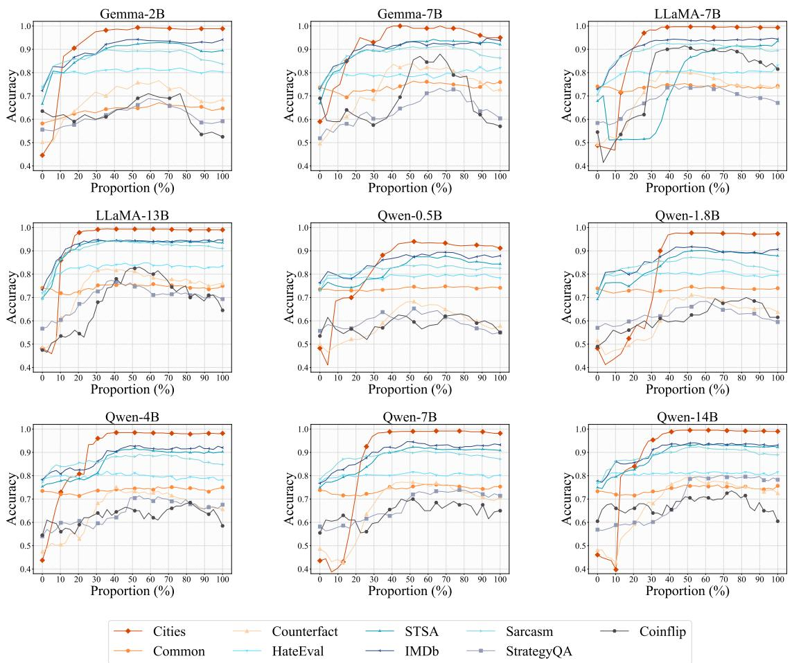  
Figure 3: Analysis diagrams of Section 5.1. Linear probing accuracy of three LLM families (Gemma, LLaMA, Qwen) on nine datasets.

Table 2 presents the results of this analysis. The dataset with the highest accuracy is deemed the easiest dataset to classify. Conversely, the dataset with the lowest accuracy is considered the most difficult to classify. This method quantitatively measures the learning difficulty associated with each dataset.

## 4.3 Metrics for Accuracy Variation

Definition 1 (Variation Rate) Given an LLM probing classifier $M = \left\{ q , y , z , d \right\} ( q , y , z$ , and d are the input question, ground truth binary label, predicted label and total amount of layers, respectively), it has the accuracy α<sub>i</sub> at i-th layer:

$$
\alpha _ { i } = \frac { 1 } { | z | } * \sum _ { k = 1 } ^ { | z | } [ y _ { k } = z _ { k } ] , i \in \{ 0 , 1 , 2 , . . . , d - 1 \}
$$

<table><tr><td rowspan=1 colspan=3>Dataset     Accuracy</td></tr><tr><td rowspan=1 colspan=1>Coinflip</td><td rowspan=1 colspan=1>0.5920</td><td rowspan=1 colspan=1></td></tr><tr><td rowspan=1 colspan=1>Common</td><td rowspan=1 colspan=1>0.6487</td><td rowspan=8 colspan=1></td></tr><tr><td rowspan=1 colspan=1>Sarcasm</td><td rowspan=1 colspan=1>0.6597</td></tr><tr><td rowspan=1 colspan=1>StrategyQA</td><td rowspan=1 colspan=1>0.6969</td></tr><tr><td rowspan=1 colspan=1>Counterfact</td><td rowspan=1 colspan=1>0.7126</td></tr><tr><td rowspan=1 colspan=1>HateEval</td><td rowspan=1 colspan=1>0.7640</td></tr><tr><td rowspan=1 colspan=1>STSA</td><td rowspan=1 colspan=1>0.9116</td></tr><tr><td rowspan=1 colspan=1>Cities</td><td rowspan=1 colspan=1>0.9204</td></tr><tr><td rowspan=1 colspan=1>IMDb</td><td rowspan=1 colspan=1>0.9380</td></tr></table>

Table 2: Average accuracy on nine datasets based on LLaMA3-8b-Instruct, GPT-4o-mini and QWen2-7B-Instruct. Accuracy based on each model is shown in Table 5.

We denote the variation rate $\beta _ { i }$ where

$$
\beta _ { i } = \alpha _ { i } / \alpha _ { i - 1 } , i \in \{ 1 , 2 , . . . , d - 1 \}
$$

We introduce two metrics to capture variations in accuracy: the jumping point and the converging point and define them by the given definition of variation rate.

Definition 2 (Jumping point) We denote the

jumping point

$$
J ( M , D ) = \operatorname* { m i n } \{ \frac { i } { d } \}
$$

$$
s . t . \beta _ { i } > = 1 . 1 , i \in \{ 1 , 2 , . . . , d - 1 \}
$$

where M and $D = \left( q , y \right)$ are the LLM classifier and the dataset.

When a noticeable boost in accuracy is observed, the jumping point signals the model’s recognition of a dataset’s critical patterns.

Definition 3 (Converging Point) We denote the converging point

$$
C ( M , D ) = \operatorname* { m a x } \{ \frac { i } { d } \}
$$

$$
s . t . | \beta _ { i } - 1 | < 0 . 0 3 , i \in \{ 1 , 2 , . . . , d - 1 \}
$$

where M and $D = \left( q , y \right)$ are the LLM classifier and the dataset.

As the accuracy plateaus or starts declining, the converging point indicates the model’s learning saturation or peak learning capacity from the dataset. Analyzing these metrics offers deeper insight into the model’s learning dynamics and adaptability to various data types.

## 5 Experimental Analysis

We conduct experiments to answer the following research questions about the Concept Depth:

RQ1: Do different LLMs’ Concept Depths behave consistently in the same dataset? (Section 5.1)

RQ2: Do different size LLMs in the same family (e.g., the LLaMA family) have consistent Concept Depth? (Section 5.2)

RQ3: Do LLMs’ Concept Depth of the same size behave consistently? (Section 5.3)

## 5.1 Comparison Among the Datasets

We delve into an evaluative performance comparison across a range of datasets, utilizing Figure 3 to detail the layer-wise accuracy of all nine LLMs over nine distinct datasets. Table 3 shows the detailed numerical results for Figure 3, as well as the F1-score and AUC. A performance threshold of 0.7 accuracy is applied to assess the models’ effective comprehension of concepts. This examination leads to two general observations. Firstly, regarding different concepts, LLMs exhibit varying accuracy trends across their layers. For example, Cities approaches perfect accuracy fast; in contrast, datasets requiring high-level reasoning such as StrategyQA will not reliably converge to accuracy above 0.7, indicating that they have different “Concept Depth”. Within individual concepts, however, different LLMs tend to display consistent accuracy patterns across these layers. Secondly, in tasks that require varying levels of conceptual understanding, the LLMs demonstrate their understanding across different layers, indicating a layered approach to processing complex concepts.

Significant variations in trends are observed across the models among the three factual concept datasets. Cities exhibits a sharp increase in comprehension at lower layers, stabilizing in higher layers, indicating a strong grasp of the concept. CommonClaim has become stable in early layers. Besides, the accuracy improvement of the nine LLMs trained on Counterfact was relatively difficult to achieve, utilizing deeper layers, and the accuracy was lower than that of many other datasets. Therefore, we can conclude that Counterfact is more complex.

In datasets centered on emotional concept comprehension (STSA, IMDb, Sarcasm, and HateEval), despite varying levels of understanding, all models demonstrate a rise in accuracy at the initial layers, with convergence occurring in the intermediate layers. Although HateEval essentially reaches stable at the initial layers, its accuracy reaches up to 0.8, suggesting that LLMs primarily aggregate representations from lower layers to grasp emotional concepts. Meanwhile, StrategyQA and Coinflip, which demand specific reasoning skills, tend to display a bell-shaped accuracy trajectory in all models, with peak accuracy observed in the middle layers. Such patterns underscore the intricate complexity associated with reasoning tasks.

## Remark 1

We categorize the performances into three types. 1) For Cities, STSA, IMDb, and Sarcasm, the LLMs suddenly understand the tasks at intermediate layers. 2) For CommonClaim and HateEval, the LLMs have already understood the tasks in shallower layers. 3) For Counterfact, StrategyQA, and Coinflip, The tasks are more difficult to understand compared with others. Therefore, we consider the tasks in type 1 and 2 easy tasks, and those in type 3 are complex.

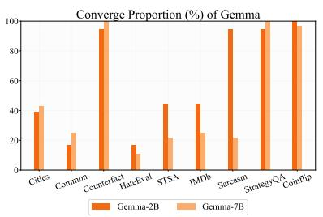

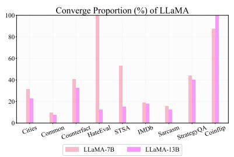

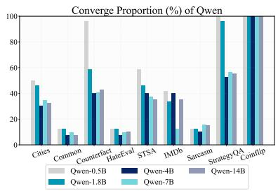  
(a) The converging point of each dataset on Gemma, LLaMA, and Qwen represented by the percent depth proportion.

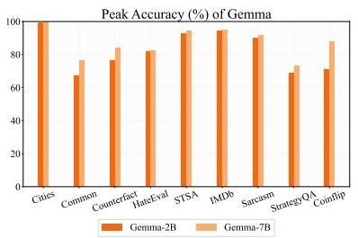

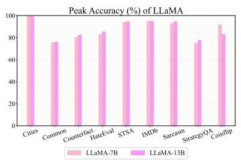

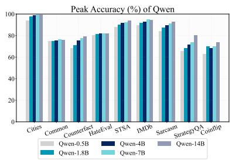  
(b) The peak accuracy of each dataset on Gemma, LLaMA, and Qwen represented by the percent depth proportion.

Figure 4: Analysis diagrams of Section 5.2. The converge proportion and peak accuracy of each model over the nine datasets. (a) shows the converged proportion over the datasets. (b) shows the peak accuracy over the datasets.

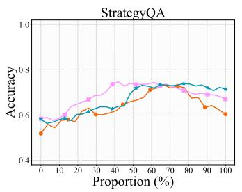

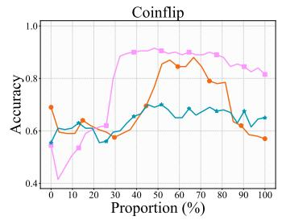

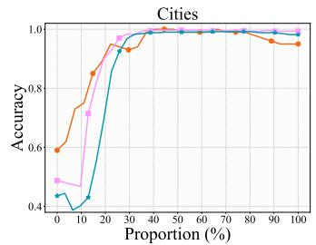

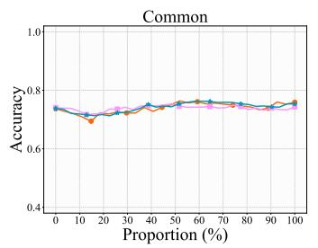

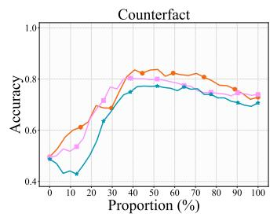

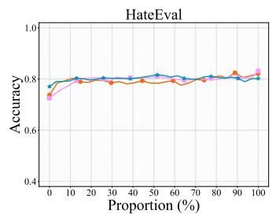

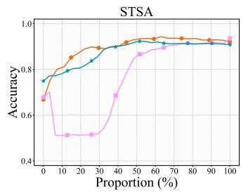

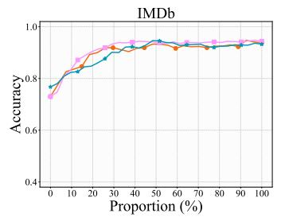

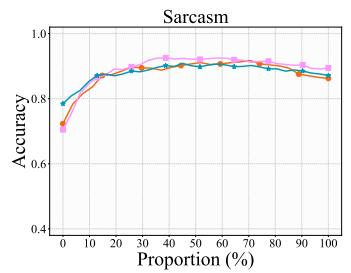  
Figure 5: Analysis diagrams of Section 5.3. Linear probing accuracy of Gemma-7B, LLaMA-7B, Qwen-7B on nine datasets.

## 5.2 Comparison Among the Number of Parameters

This section offers a comparative analysis of LLMs within their respective families, examining both accuracy levels and converging points across the models. Figure 4 reveals two recurring patterns within these families: for tasks with accuracy improves dramatically by model learning, larger models tend to show converging points at earlier layers, suggest-

Cities

ing they achieve their own peak comprehensions of concepts at lower layers; for tasks with accuracy changes little, all LLMs show the converging points at early layers.

Two notable exceptions to this trend appear in the Qwen family over the Coinflip and IMDb datasets. For Coinflip, larger models exhibit delayed convergence. This deviation underscores the complexity of the reasoning required, illustrating how this task challenges even the larger models to extend their depth of understanding further. For IMDb, converging points fluctuate with the increasing size of the model because the number of layers is different among different sizes of LLMs, which amplifies the differences. These exceptions are also found in the Gemma family.

Furthermore, in Figure 4, we explore the peak accuracy levels across all layers for LLMs of differing sizes. The overarching trend indicates that larger models consistently achieve superior peak performance. This observation not only supports that scaling up models enhances their effectiveness but also suggests that larger models develop more robust internal representations, validating the benefits of training models with greater capacity.

## Remark 2

We have two observations by comparing different sizes of models from the same LLM family. 1) As the number of parameters increases, peak accuracy gradually increases, and the converging point gradually advances. 2) Larger models grasp the concepts earlier and better.

## 5.3 Comparison Among the LLM Families

We examine how LLMs from various families, possessing a similar parameter count, process concepts as reflected by their converging points and peak accuracies. The overarching trends are highlighted in Figure 6, with detailed statistics on a layer-by-layer basis provided in Figure 5. Our findings reveal that while LLMs across different families may reach nearly identical peak accuracies, the layers at which they converge to these peaks can vary. For instance, in the HateEval and Counterfact datasets, we observe models converging at significantly deeper layers. This variation suggests that despite similar parameter scales, different models may employ varied mechanisms to tackle the same problems, reflecting the diversity in how models interpret and process complex information.

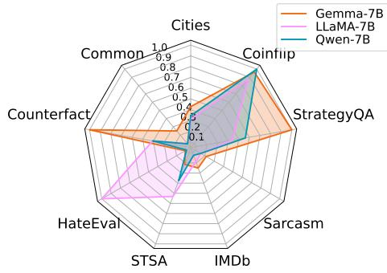

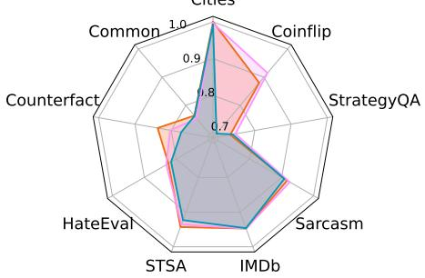  
Figure 6: The upper radar image is the converging point of each dataset on Gemma-7B, LLaMA-7B, and Qwen-7B, represented by the percent depth proportion. The bottom radar image is the maximum accuracy of each dataset on Gemma-7B, LLaMA-7B, and Qwen-7B, represented by the percentage depth proportion.

## Remark 3

With the same number of model parameters, the models generally have a comparable understanding of the datasets.

## 5.4 Ablation Study

To quantify the robustness of the LLMs concerning their internal representation, we conducted ablation studies on noise perturbation and bit quantization. The result shows that adding noises or reducing model weights to 8 bits can make the accuracy converge slower. Compressing the LLMs to 16 bits doesn’t harm the understanding process too much. Details can be found in Section A.3.

## 6 Conclusions

This paper proposes Concept Depth, the phenomenon that different concepts are learned in different layers of LLMs, i.e., more difficult concepts are fully acquired with deeper layers. We conducted several experiments around Concept Depth using probe techniques. Our research suggests that LLMs tend to effectively categorize easy tasks, indicating that these concepts are learned in the first few initial layers. In contrast, complex tasks may only be recognizable (if at all) in deeper layers, and LLMs of the same size perform largely consistently across datasets regarding Concept Depth. Compressing the model weight to 16-bit representations for future LLMs’ designs is also a promising method for saving computation memory.

## 7 Limitations

The paper presents several opportunities for further exploration. Firstly, the datasets employed might not encompass the full spectrum of language tasks, offering a chance to expand the scope of the findings in a multilingual environment. Secondly, We did not experiment with very large open-source language models, thus allowing future researchers to investigate how scaling up the model size affects concept acquisition across different layers and enhances robustness. Moreover, we should also try different kinds of classifiers, including nonlinear models and neural network-based classifiers, to acquire more profound insights into how LLM representations differ across layers. These aspects highlight promising directions for continued advancement in the field. We will continue to explore intermediate representations to help us better understand the inner side of LLMs, as this challenge may also be open to other researchers in this field.

## Acknowledgement

We thank Taowen Wang, Fei Sun, Wujiang Xu, and Guangyan Sun for their valuable discussions and suggestions during the project.

## References

Josh Achiam, Steven Adler, Sandhini Agarwal, Lama Ahmad, Ilge Akkaya, Florencia Leoni Aleman, Diogo Almeida, Janko Altenschmidt, Sam Altman, Shyamal Anadkat, et al. 2023. Gpt-4 technical report. arXiv preprint arXiv:2303.08774.

Guillaume Alain and Yoshua Bengio. 2016. Understanding intermediate layers using linear classifier probes. arXiv preprint arXiv:1610.01644.

Sharon Lee Armstrong, Lila R Gleitman, and Henry Gleitman. 1983. What some concepts might not be. Cognition, 13(3):263–308.

Amos Azaria and Tom Mitchell. 2023. The internal state of an llm knows when its lying. arXiv preprint arXiv:2304.13734.

Jinze Bai, Shuai Bai, Yunfei Chu, Zeyu Cui, Kai Dang, Xiaodong Deng, Yang Fan, Wenbin Ge, Yu Han, Fei

Huang, Binyuan Hui, Luo Ji, Mei Li, Junyang Lin, Runji Lin, Dayiheng Liu, Gao Liu, Chengqiang Lu, Keming Lu, Jianxin Ma, Rui Men, Xingzhang Ren, Xuancheng Ren, Chuanqi Tan, Sinan Tan, Jianhong Tu, Peng Wang, Shijie Wang, Wei Wang, Shengguang Wu, Benfeng Xu, Jin Xu, An Yang, Hao Yang, Jian Yang, Shusheng Yang, Yang Yao, Bowen Yu, Hongyi Yuan, Zheng Yuan, Jianwei Zhang, Xingxuan Zhang, Yichang Zhang, Zhenru Zhang, Chang Zhou, Jingren Zhou, Xiaohuan Zhou, and Tianhang Zhu. 2023. Qwen technical report. Preprint, arXiv:2309.16609.

Tom Brown, Benjamin Mann, Nick Ryder, Melanie Subbiah, Jared D Kaplan, Prafulla Dhariwal, Arvind Neelakantan, Pranav Shyam, Girish Sastry, Amanda Askell, et al. 2020. Language models are few-shot learners. Advances in neural information processing systems, 33:1877–1901.

Stephen Casper, Jason Lin, Joe Kwon, Gatlen Culp, and Dylan Hadfield-Menell. 2023. Explore, establish, exploit: Red teaming language models from scratch. Preprint, arXiv:2306.09442.

Yupeng Chang, Xu Wang, Jindong Wang, Yuan Wu, Linyi Yang, Kaijie Zhu, Hao Chen, Xiaoyuan Yi, Cunxiang Wang, Yidong Wang, Wei Ye, Yue Zhang, Yi Chang, Philip S. Yu, Qiang Yang, and Xing Xie. 2023. A survey on evaluation of large language models. Preprint, arXiv:2307.03109.

Huiqi Deng, Qihan Ren, Hao Zhang, and Quanshi Zhang. 2021. Discovering and explaining the representation bottleneck of dnns. arXiv preprint arXiv:2111.06236.

Tim Dettmers, Artidoro Pagnoni, Ari Holtzman, and Luke Zettlemoyer. 2024. Qlora: Efficient finetuning of quantized llms. Advances in Neural Information Processing Systems, 36.

Hanyu Duan, Yi Yang, and Kar Yan Tam. 2024. Do llms know about hallucination? an empirical investigation of llm’s hidden states. arXiv preprint arXiv:2402.09733.

Abhimanyu Dubey, Abhinav Jauhri, Abhinav Pandey, Abhishek Kadian, Ahmad Al-Dahle, Aiesha Letman, Akhil Mathur, Alan Schelten, Amy Yang, Angela Fan, et al. 2024. The llama 3 herd of models. arXiv preprint arXiv:2407.21783.

Siqi Fan, Xin Jiang, Xiang Li, Xuying Meng, Peng Han, Shuo Shang, Aixin Sun, Yequan Wang, and Zhongyuan Wang. 2024. Not all layers of llms are necessary during inference. arXiv preprint arXiv:2403.02181.

Mor Geva, Jasmijn Bastings, Katja Filippova, and Amir Globerson. 2023. Dissecting recall of factual associations in auto-regressive language models. arXiv preprint arXiv:2304.14767.

Mor Geva, Daniel Khashabi, Elad Segal, Tushar Khot, Dan Roth, and Jonathan Berant. 2021. Did Aristotle Use a Laptop? A Question Answering Benchmark

with Implicit Reasoning Strategies. Transactions of the Associationfor Computational Linguistics, 9:346– 361.

Andrey Gromov, Kushal Tirumala, Hassan Shapourian, Paolo Glorioso, and Daniel A Roberts. 2024. The unreasonable ineffectiveness of the deeper layers. arXiv preprint arXiv:2403.17887.

Wes Gurnee and Max Tegmark. 2023. Language models represent space and time. arXiv preprint arXiv:2310.02207.

Mingyu Jin, Weidi Luo, Sitao Cheng, Xinyi Wang, Wenyue Hua, Ruixiang Tang, William Yang Wang, and Yongfeng Zhang. 2024a. Disentangling memory and reasoning ability in large language models. arXiv preprint arXiv:2411.13504.

Mingyu Jin, Qinkai Yu, Dong Shu, Haiyan Zhao, Wenyue Hua, Yanda Meng, Yongfeng Zhang, and Mengnan Du. 2024b. The impact of reasoning step length on large language models. arXiv preprint arXiv:2401.04925.

Tianjie Ju, Weiwei Sun, Wei Du, Xinwei Yuan, Zhaochun Ren, and Gongshen Liu. 2024. How large language models encode context knowledge? a layer-wise probing study. arXiv preprint arXiv:2402.16061.

Yoon Kim. 2014. Convolutional neural networks for sentence classification. In Proceedings of the 2014 Conference on Empirical Methods in Natural Language Processing (EMNLP), pages 1746–1751, Doha, Qatar. Association for Computational Linguistics.

Kenneth Li, Oam Patel, Fernanda Viégas, Hanspeter Pfister, and Martin Wattenberg. 2024. Inferencetime intervention: Eliciting truthful answers from a language model. Advances in Neural Information Processing Systems, 36.

Andrew L. Maas, Raymond E. Daly, Peter T. Pham, Dan Huang, Andrew Y. Ng, and Christopher Potts. 2011. Learning word vectors for sentiment analysis. In Proceedings of the 49th Annual Meeting of the Associationfor Computational Linguistics: Human Language Technologies, pages 142–150, Portland, Oregon, USA. Association for Computational Linguistics.

Mihai Manolescu, Denise Löfflad, Adham Nasser Mohamed Saber, and Masoumeh Moradipour Tari. 2019. TuEval at SemEval-2019 task 5: LSTM approach to hate speech detection in English and Spanish. In Proceedings ofthe 13th International Workshop on Semantic Evaluation, pages 498–502, Minneapolis, Minnesota, USA. Association for Computational Linguistics.

Samuel Marks and Max Tegmark. 2023. The geometry of truth: Emergent linear structure in large language model representations of true/false datasets. arXiv preprint arXiv:2310.06824.

Xin Men, Mingyu Xu, Qingyu Zhang, Bingning Wang, Hongyu Lin, Yaojie Lu, Xianpei Han, and Weipeng Chen. 2024. Shortgpt: Layers in large language models are more redundant than you expect. arXiv preprint arXiv:2403.03853.

Kevin Meng, David Bau, Alex Andonian, and Yonatan Belinkov. 2022. Locating and editing factual associations in gpt. Advances in Neural Information Processing Systems, 35:17359–17372.

Rishabh Misra and Prahal Arora. 2023. Sarcasm detection using news headlines dataset. AI Open, 4:13–18.

OpenAI. 2024. Hello gpt-4o. OpenAI Blog.

Koyena Pal, Jiuding Sun, Andrew Yuan, Byron C Wallace, and David Bau. 2023. Future lens: Anticipating subsequent tokens from a single hidden state. arXiv preprint arXiv:2311.04897.

Tim Räz. 2023. Methods for identifying emergent concepts in deep neural networks. Patterns, 4(6).

Jie Ren, Mingjie Li, Qirui Chen, Huiqi Deng, and Quanshi Zhang. 2023. Defining and quantifying the emergence of sparse concepts in dnns. In Proceedings of the IEEE/CVF Conference on Computer Vision and Pattern Recognition, pages 20280–20289.

Zhaochen Su, Juntao Li, Jun Zhang, Tong Zhu, Xiaoye Qu, Pan Zhou, Yan Bowen, Yu Cheng, et al. 2024a. Living in the moment: Can large language models grasp co-temporal reasoning? arXiv preprint arXiv:2406.09072.

Zhaochen Su, Zecheng Tang, Xinyan Guan, Juntao Li, Lijun Wu, and Min Zhang. 2022. Improving temporal generalization of pre-trained language models with lexical semantic change. arXiv preprint arXiv:2210.17127.

Zhaochen Su, Jun Zhang, Xiaoye Qu, Tong Zhu, Yanshu Li, Jiashuo Sun, Juntao Li, Min Zhang, and Yu Cheng. 2024b. Conflictbank: A benchmark for evaluating the influence of knowledge conflicts in llm. In Advances in neural information processing systems.

Zhaochen Su, Jun Zhang, Tong Zhu, Xiaoye Qu, Juntao Li, Min Zhang, and Yu Cheng. 2024c. Timo: Towards better temporal reasoning for language models. arXiv preprint arXiv:2406.14192.

Gemini Team, Rohan Anil, Sebastian Borgeaud, Yonghui Wu, Jean-Baptiste Alayrac, Jiahui Yu, Radu Soricut, Johan Schalkwyk, Andrew M Dai, Anja Hauth, et al. 2023. Gemini: a family of highly capable multimodal models. arXiv preprint arXiv:2312.11805.

Gemma Team, Thomas Mesnard, Cassidy Hardin, Robert Dadashi, Surya Bhupatiraju, Shreya Pathak, Laurent Sifre, Morgane Rivière, Mihir Sanjay Kale, Juliette Love, Pouya Tafti, Léonard Hussenot, Aakanksha Chowdhery, Adam Roberts, Aditya Barua, Alex Botev, Alex Castro-Ros, Ambrose Slone,

Amélie Héliou, Andrea Tacchetti, Anna Bulanova, Antonia Paterson, Beth Tsai, Bobak Shahriari, Charline Le Lan, Christopher A. Choquette-Choo, Clé- ment Crepy, Daniel Cer, Daphne Ippolito, David Reid, Elena Buchatskaya, Eric Ni, Eric Noland, Geng Yan, George Tucker, George-Christian Muraru, Grigory Rozhdestvenskiy, Henryk Michalewski, Ian Tenney, Ivan Grishchenko, Jacob Austin, James Keeling, Jane Labanowski, Jean-Baptiste Lespiau, Jeff Stanway, Jenny Brennan, Jeremy Chen, Johan Ferret, Justin Chiu, Justin Mao-Jones, Katherine Lee, Kathy Yu, Katie Millican, Lars Lowe Sjoesund, Lisa Lee, Lucas Dixon, Machel Reid, Maciej Mikuła, Mateo Wirth, Michael Sharman, Nikolai Chinaev, Nithum Thain, Olivier Bachem, Oscar Chang, Oscar Wahltinez, Paige Bailey, Paul Michel, Petko Yotov, Pier Giuseppe Sessa, Rahma Chaabouni, Ramona Comanescu, Reena Jana, Rohan Anil, Ross McIlroy, Ruibo Liu, Ryan Mullins, Samuel L Smith, Sebastian Borgeaud, Sertan Girgin, Sholto Douglas, Shree Pandya, Siamak Shakeri, Soham De, Ted Klimenko, Tom Hennigan, Vlad Feinberg, Wojciech Stokowiec, Yu hui Chen, Zafarali Ahmed, Zhitao Gong, Tris Warkentin, Ludovic Peran, Minh Giang, Clément Farabet, Oriol Vinyals, Jeff Dean, Koray Kavukcuoglu, Demis Hassabis, Zoubin Ghahramani, Douglas Eck, Joelle Barral, Fernando Pereira, Eli Collins, Armand Joulin, Noah Fiedel, Evan Senter, Alek Andreev, and Kathleen Kenealy. 2024. Gemma: Open models based on gemini research and technology. Preprint, arXiv:2403.08295.

Romal Thoppilan, Daniel De Freitas, Jamie Hall, Noam Shazeer, Apoorv Kulshreshtha, Heng-Tze Cheng, Alicia Jin, Taylor Bos, Leslie Baker, Yu Du, et al. 2022. Lamda: Language models for dialog applications. arXiv preprint arXiv:2201.08239.

Hugo Touvron, Louis Martin, Kevin Stone, Peter Albert, Amjad Almahairi, Yasmine Babaei, Nikolay Bashlykov, Soumya Batra, Prajjwal Bhargava, Shruti Bhosale, et al. 2023. Llama 2: Open foundation and fine-tuned chat models. arXiv preprint arXiv:2307.09288.

Jason Wei, Yi Tay, Rishi Bommasani, Colin Raffel, Barret Zoph, Sebastian Borgeaud, Dani Yogatama, Maarten Bosma, Denny Zhou, Donald Metzler, et al. 2022a. Emergent abilities of large language models. arXiv preprint arXiv:2206.07682.

Jason Wei, Xuezhi Wang, Dale Schuurmans, Maarten Bosma, Fei Xia, Ed Chi, Quoc V Le, Denny Zhou, et al. 2022b. Chain-of-thought prompting elicits reasoning in large language models. Advances in Neural Information Processing Systems, 35:24824–24837.

Ximing Wen. 2024. Language model meets prototypes: Towards interpretable text classification models through prototypical networks. arXiv preprint arXiv:2412.03761.

Ximing Wen, Wenjuan Tan, and Rosina O Weber. 2024a. Gaprotonet: A multi-head graph attention-based prototypical network for interpretable text classification. arXiv preprint arXiv:2409.13312.

Ximing Wen, Rosina O Weber, Anik Sen, Darryl Hannan, Steven C Nesbit, Vincent Chan, Alberto Goffi, Michael Morris, John C Hunninghake, Nicholas E Villalobos, et al. 2024b. The impact of an xaiaugmented approach on binary classification with scarce data. arXiv preprint arXiv:2407.06206.

An Yang, Baosong Yang, Binyuan Hui, Bo Zheng, Bowen Yu, Chang Zhou, Chengpeng Li, Chengyuan Li, Dayiheng Liu, Fei Huang, et al. 2024. Qwen2 technical report. arXiv preprint arXiv:2407.10671.

Chih-Kuan Yeh, Been Kim, Sercan Arik, Chun-Liang Li, Pradeep Ravikumar, and Tomas Pfister. 2019. On concept-based explanations in deep neural networks.

Mingyang Zhang, Chunhua Shen, Zhen Yang, Linlin Ou, Xinyi Yu, Bohan Zhuang, et al. 2023. Pruning meets low-rank parameter-efficient fine-tuning. arXiv preprint arXiv:2305.18403.

Haiyan Zhao, Fan Yang, Himabindu Lakkaraju, and Mengnan Du. 2024. Opening the black box of large language models: Two views on holistic interpretability. arXiv preprint arXiv:2402.10688.

Zihao Zhou, Qiufeng Wang, Mingyu Jin, Jie Yao, Jianan Ye, Wei Liu, Wei Wang, Xiaowei Huang, and Kaizhu Huang. 2024. Mathattack: Attacking large language models towards math solving ability. In Proceedings of the AAAI Conference on Artificial Intelligence, volume 38, pages 19750–19758.

## A Appendix

Here, we provide our supplementary materials.

## A.1 Metrics for Parts of the Layers

Table 3 shows the experimental results for the accuracy, F1-score, and AUC metrics of parts of the first, 25% depth, 50% depth, 67% depth, 83% depth, and the last layer of each model over the nine datasets.

## A.2 Description of the dataset

Cities (Marks and Tegmark, 2023): consists of statements about the location of cities and their veracity labels (e.g., The city of Zagreb is in Japan, which is wrong). We use 1496 of these samples.

CommonClaim (Casper et al., 2023): A dataset of boolean statements, each labeled by two humans as common-knowledge-true, common-knowledgefalse, or neither. We use 6000 of these samples.

Counterfact (Meng et al., 2022): Counterfact includes myriad counterfactuals that allows quantitative testing of specificity and generalization when learning a counterfactual. We use 4000 of these samples.

HateEval (Manolescu et al., 2019): HateEval has English tweets which were annotated hierarchically. We use 6000 of these samples.

STSA (Kim, 2014): STSA includes movie reviews, half of which were considered positive and the other half negative. Each label is extracted from a longer movie review and reflects the writer’s overall intention for this review. We use 6920 of these samples.

IMDb (Maas et al., 2011): IMDb is a benchmark dataset for binary sentiment classification. We use 2000 of these samples.

Sarcasm (Misra and Arora, 2023): Sarcasm is a superior news headline dataset that tells if the headlines are sarcastic. We use 6000 of these samples.

StrategyQA (Geva et al., 2021): StrategyQA contains questions across all knowledge domains to elicit creative and diverse yes/no questions that require implicit reasoning steps. We use 2290 of these samples.

Coinflip (Wei et al., 2022b): Coinflip includes coin flipping queries, asking if a coin remains heads up after it is either flipped or left unflipped by individuals. We use 500 of these samples.

## A.3 Ablation Study

Adding Noise. To quantify the robustness of the LLMs concerning their internal representation, when we input these questions into the LLM, we add a random string of noise in front of the question to interfere. For instance, we perturbate a question q into $q ^ { \prime } = N \oplus q .$ Here, ⊕ is the concatenate operation, and the noise string $N \in \{ S _ { 1 } , S _ { 2 } \}$ disrupts the classification tasks, satisfying

$$
P ( N = S _ { 1 } ) = P ( N = S _ { 2 } ) = 5 0 \%
$$

The probability distribution of N is unrelated to their labels. The following is an example of STSA with a positive label.

Before adding noise:   
The production values are of   
the highest and the performances   
attractive without being memorable.   
The sentence above is a movie review   
and reflects the writer’s overall   
intention for this review. According   
to the sentence, judge whether the   
emotion is Positive or Negative.   
After adding noise:   
aaa The production values are of   
the highest and the performances   
attractive without being memorable.   
The sentence above is a movie review   
and reflects the writer’s overall   
intention for this review. According   
to the sentence, judge whether the   
emotion is Positive or Negative.   
aaa can be substituted by bbb, both   
cases have equal probability.

Quantization Settings. Quantization has been a rule of thumb for faster LLMs’ inference. The general fact is that using a lower precision level allows LLMs to be run on less capable hardware with an acceptable reduction in their ability and accuracy. Our approach to applying quantization is to explore its effect on Concept Depth, whether it still maintains the previous Concept Depth or slows down the process of understanding knowledge. We quantize the model weights to 8, 16, and 32 bits.

Results. Figure 7 illustrates the effect of adding noise and reducing bit representations to the Gemma-2B model. The addition of noise causes the learning curve to shift to the right, indicating a reduction in the converging speed. This suggests that the presence of noise in the input data can hinder the LLM’s learning, slowing down its ability to converge to an optimal solution. We also see that there isn’t much difference between 32 and 16 bits, and the convergence rate slows when we reduce the model to 8 bits. Therefore, we may compress the LLMs to 16 bits for future designs.

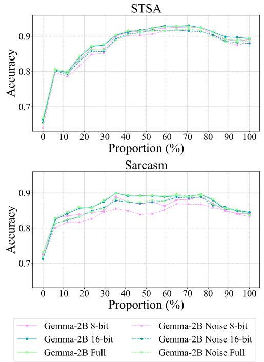  
Figure 7: Noise and quantization evaluation on STSA and Sarcasm of Gemma-2B.

## Remark 4

Noises or 8-bit-quantization can cause the accuracy to converge more slowly. Compressing the LLMs to 16 bits doesn’t harm the understanding process too much. The layer-wise representations of LLMs are susceptible to noise and high-ratio quantization. Therefore, it is crucial to proceed cautiously when conducting high-ratio quantization inference.

## A.4 Examples of Each Dataset

For the 9 bi-classification tasks, we provide two examples from each class for each task. The blue sentences are the data samples, while the black sentences are the prompts.

## Cities

“True” example:

Judge the statement is True or False. The city of Tokyo is in Japan.

“False” example:

Judge the statement is True or False. The city of Lodz is in the Dominican Republic.

## CommonClaim

## “True” example:

Judge the statement is True or False. Salmon will often return to the same spawning ground where then were born.

## “False” example:

Judge the statement is True or False. A chicken has two right wings.

## Counterfact

## “True” example:

Judge the statement is True or False. The city of Tokyo is in Japan.

## “False” example:

Judge the statement is True or False.   
Kanata South Ward is in Wisconsin.

## HateEval

## “Yes” example:

Here it is not about Refugees or Illegal immigrants. It is about whether one has documents before 1971 or not. Now, it is difficult for slum people and beggars to show valid documents, except the name in voter list. According to the comment, tell whether they present hate speech or not.

## “No” example:

Labor migrants transfer almost \$10 billion a year to Ukraine. According to the comment, tell whether they present hate speech or not.

## STSA

## “Positive” example:

The production values are of the highest and the performances attractive without being memorable. The sentence above is a movie review and reflects the writer’s overall intention for this review. According to the sentence, judge whether the emotion is Positive or Negative.

## “Negative” example:

Less a story than an inexplicable nightmare, right down to the population’s shrugging acceptance to each new horror. The sentence above is a movie review and reflects the writer’s overall intention for this review. According to the sentence, judge whether the emotion is Positive or Negative.

## IMDb

“Positive” example:

This is the definitive movie version of Hamlet. Branagh cuts nothing, but there are no wasted moments. According to the movie review, judge whether it is Positive or Negative.

## “Negative” example:

This is without a doubt the worst movie I have ever seen. It is not funny. It is not interesting and should not have been made. According to the movie review, judge whether it is Positive or Negative.

## Sarcasm

## “Yes” example:

Task: Detect sarcasm, help me identify whether this sentence is sarcastic. First, we need to understand what sarcasm is. Sarcasm is a form of verbal irony, where the intended meaning of the words is the opposite of the literal meaning. In other words, the speaker is saying one thing but meaning the opposite. Bashar al-Assad tries a tiny bit of sarin gas on self to see what it’s like. Think carefully according to the sentence. Is there any sarcasm in this sentence? Please answer Yes or No.

## “No” example:

Task: Detect sarcasm, help me identify whether this sentence is sarcastic. First, we need to understand what sarcasm is. Sarcasm is a form of verbal irony, where the intended meaning of the words is the opposite of the literal meaning. In other words, the speaker is saying one thing but meaning the opposite. This ceo will send your kids to school, if you work for his company. Think carefully according to the sentence. Is there any sarcasm in this sentence? Please answer Yes or No.

## StrategyQA

Note: This dataset was created in 2021. Queen Elizabeth was alive then.

## “Yes” example:

Judge the question is true or false? Q: Will Queen Elizabeth be buried in the Pantheon? Let us think step by step. The stem of the sentence is Queen Elizabeth, burial, pantheon. Inference: First, the Pantheon is a church, so it is possible that she could be buried there. Second, Queen Elizabeth II is still alive, so she has not been buried yet. Third, even if she were to be buried in the Pantheon, it is unlikely that we would know about it ahead of time, so it is hard to say for sure. pred\_ans: no. Do hamsters provide food for any animals? Let us think step by step...

## “No” example:

Judge the question is true or false? Q: Will Queen Elizabeth be buried in the Pantheon? Let us think step by step. The stem of the sentence is Queen Elizabeth, burial, pantheon. Inference: First, the Pantheon is a church, so it is possible that she could be buried there. Second, Queen Elizabeth II is still alive, so she has not been buried yet. Third, even if she were to be buried in the Pantheon, it is unlikely that we would know about it ahead of time, so it is hard to say for sure. pred\_ans: no. Could a llama birth twice during the War in Vietnam (1945-46)? Let us think step by step...

## Coinflip

## “Yes” example:

A coin is heads up. Whitney flips the coin. Erika does not flip the coin. Tj does not flip the coin. Benito flips the coin. Is the coin still heads up? Note that "flip" here means "reverse". According to the flipping process above, determine if a coin remains heads up after it is either flipped or left unflipped by individuals. Therefore, the answer (Yes or No) is?

## “No” example:

A coin is heads up. Lucky does not flip the coin. Mireya flips the coin. Jj flips the coin. Kc flips the coin. Is the coin still heads up? Note that "flip" here means "reverse". According to the flipping process above, determine if a coin remains heads up after it is either flipped or left unflipped by individuals. Therefore, the answer (Yes or No) is?

<table><tr><td rowspan=1 colspan=1></td><td rowspan=1 colspan=1>0.556</td><td rowspan=1 colspan=1>0.601 0.588</td><td rowspan=1 colspan=1>0.635</td><td rowspan=1 colspan=1>0.667 0.626</td><td rowspan=1 colspan=1>0.446</td><td rowspan=1 colspan=1>0.411 0.422</td><td rowspan=1 colspan=1>0.582</td><td rowspan=1 colspan=9></td><td rowspan=1 colspan=1>0.7310.808 0.714</td></tr><tr><td rowspan=1 colspan=1></td><td rowspan=1 colspan=1>0.602</td><td rowspan=1 colspan=1>0.642 0.629</td><td rowspan=1 colspan=1>0.62</td><td rowspan=1 colspan=1>0.64 0.6</td><td rowspan=1 colspan=1>0.94</td><td rowspan=1 colspan=1>0.987 0.939</td><td rowspan=1 colspan=1>0.637</td><td rowspan=2 colspan=9>0.69 0.642 0.729 0.826 0.160.8020.91 0.80.9150.972 0.91 0.410.982 2 0.94</td><td rowspan=2 colspan=1>0.59 0.935 50.827</td></tr><tr><td rowspan=1 colspan=1></td><td rowspan=1 colspan=1>0.639</td><td rowspan=1 colspan=1>0.7 0.665</td><td rowspan=1 colspan=1>0.65</td><td rowspan=1 colspan=1>0.705 0.632</td><td rowspan=1 colspan=1>0.983</td><td rowspan=1 colspan=1>0.999 0.983</td><td rowspan=1 colspan=1>0.648</td><td rowspan=1 colspan=1>0.699 0.642</td><td rowspan=1 colspan=1>0.729</td><td rowspan=1 colspan=5>0.826 0.7160.8020.891 0.8 0.9150.972 0.917</td></tr><tr><td rowspan=1 colspan=1></td><td rowspan=1 colspan=1>0.683</td><td rowspan=1 colspan=1>0.751 0.708</td><td rowspan=1 colspan=1>0.695</td><td rowspan=1 colspan=1>0.783 0.69</td><td rowspan=1 colspan=1>0.992</td><td rowspan=1 colspan=1>1.0 0.992</td><td rowspan=3 colspan=10></td><td rowspan=1 colspan=1>0.671</td></tr><tr><td rowspan=1 colspan=1></td><td rowspan=1 colspan=1>0.62</td><td rowspan=1 colspan=1>0.668 0.637</td><td rowspan=2 colspan=1>0.525</td><td rowspan=2 colspan=1>0.5 0532</td><td rowspan=2 colspan=1>0.988</td><td rowspan=1 colspan=1>0.999 0.985</td><td rowspan=1 colspan=1>0.652</td><td rowspan=1 colspan=1>0.703 0.645</td><td rowspan=2 colspan=1></td></tr><tr><td rowspan=1 colspan=1></td><td rowspan=1 colspan=1>0.592</td><td rowspan=1 colspan=1>0.602 0.626</td><td rowspan=1 colspan=1>0.999 0.988</td></tr><tr><td rowspan=1 colspan=2>Gemma-7B (28 Layers)</td><td rowspan=1 colspan=1>rategyQA</td><td rowspan=1 colspan=1></td><td rowspan=1 colspan=1>Coinflip</td><td rowspan=1 colspan=2></td><td rowspan=1 colspan=10></td><td rowspan=1 colspan=1></td></tr><tr><td rowspan=1 colspan=2></td><td rowspan=1 colspan=1></td><td rowspan=1 colspan=1>ACC</td><td rowspan=1 colspan=1></td><td rowspan=1 colspan=2></td><td rowspan=1 colspan=10></td><td rowspan=1 colspan=1></td></tr><tr><td rowspan=1 colspan=1></td><td rowspan=1 colspan=1>0.519</td><td rowspan=1 colspan=1>0.565 0.569</td><td rowspan=1 colspan=1>0.69</td><td rowspan=1 colspan=1>0.712 0.656</td><td rowspan=1 colspan=1>0.59</td><td rowspan=1 colspan=1>0.444 0.439</td><td rowspan=1 colspan=2>0.7370.609 0.053</td><td rowspan=1 colspan=2>0.4960.506 0.514</td><td rowspan=2 colspan=6></td><td rowspan=2 colspan=1>0.730.9 093 0.7132</td></tr><tr><td rowspan=1 colspan=1></td><td rowspan=1 colspan=1>0.617</td><td rowspan=1 colspan=1>0.653 0.648</td><td rowspan=1 colspan=1>0.605</td><td rowspan=1 colspan=1>0.654 0.591</td><td rowspan=1 colspan=1>0.95</td><td rowspan=1 colspan=1>0.987 0.951</td><td rowspan=1 colspan=1>0.719</td><td rowspan=1 colspan=1>0.687 0.422</td><td rowspan=1 colspan=1>0.696</td><td rowspan=1 colspan=1>0.773 0.686</td><td rowspan=1 colspan=1>0.79</td></tr><tr><td rowspan=1 colspan=1></td><td rowspan=1 colspan=1>0.658</td><td rowspan=1 colspan=1>0.716 0.678</td><td rowspan=1 colspan=1>0.765</td><td rowspan=1 colspan=1>0.844 0.761</td><td rowspan=1 colspan=1></td><td rowspan=1 colspan=1>0.999 0.998</td><td rowspan=1 colspan=1>0.75</td><td rowspan=1 colspan=1>0.747 0.498</td><td rowspan=1 colspan=1>0.835</td><td rowspan=1 colspan=1>0.912 0.829</td><td rowspan=1 colspan=1>0.78</td><td rowspan=1 colspan=5>0.871 0.782 0.929 0.979 0.93 0.9320.979 0.93</td><td rowspan=1 colspan=1>0.907 0.968 0.904</td></tr><tr><td rowspan=1 colspan=1></td><td rowspan=1 colspan=1>0.733</td><td rowspan=1 colspan=1>0.809 0.744</td><td rowspan=1 colspan=1>0.88</td><td rowspan=1 colspan=1>0.922 0.875</td><td rowspan=1 colspan=1></td><td rowspan=1 colspan=1>0.998 0.995</td><td rowspan=1 colspan=1>0.756</td><td rowspan=1 colspan=1>0.75 0.515</td><td rowspan=1 colspan=1>0.814</td><td rowspan=1 colspan=1>0.9 0.809</td><td rowspan=1 colspan=1>0.78</td><td rowspan=1 colspan=5>0.868 0.7820.936 0.981 0.9370.9220.979 0.92</td><td rowspan=1 colspan=1>0.913 0.972 0.91</td></tr><tr><td rowspan=1 colspan=1></td><td rowspan=1 colspan=1>0.675</td><td rowspan=1 colspan=1>0.746 0.695</td><td rowspan=1 colspan=1>0.785</td><td rowspan=1 colspan=1>0.818 0.786</td><td rowspan=1 colspan=1>0.98</td><td rowspan=1 colspan=1>0.997 0.982</td><td rowspan=1 colspan=1>0.743</td><td rowspan=1 colspan=1>0.74 0.492</td><td rowspan=1 colspan=1>0.776</td><td rowspan=1 colspan=1>0.867 0.768</td><td rowspan=1 colspan=1>0.812</td><td rowspan=2 colspan=5>0.82 09010819092095092093099</td><td rowspan=1 colspan=1>0.9010.963 0.898</td></tr><tr><td rowspan=1 colspan=1></td><td rowspan=1 colspan=1>0.604</td><td rowspan=1 colspan=1>0.666 0.625</td><td rowspan=1 colspan=1>0.57</td><td rowspan=1 colspan=1>0.602 0.578</td><td rowspan=1 colspan=1>0.95</td><td rowspan=1 colspan=1>0.996 0.972</td><td rowspan=1 colspan=2>0.7590.748 0.481</td><td rowspan=1 colspan=2>0.7290.808 0.72</td><td></td><td rowspan=1 colspan=1>0.8620.932 0.86</td></tr><tr><td rowspan=1 colspan=1>LlaMA-7B (32 Layers)</td><td rowspan=1 colspan=1></td><td rowspan=1 colspan=1>rategyQA</td><td rowspan=1 colspan=1></td><td rowspan=1 colspan=1>Coinflip</td><td rowspan=1 colspan=2></td><td rowspan=1 colspan=10></td><td rowspan=1 colspan=1></td></tr><tr><td rowspan=1 colspan=1></td><td rowspan=1 colspan=1>ACC</td><td rowspan=1 colspan=1></td><td rowspan=1 colspan=1>ACC</td><td rowspan=1 colspan=1></td><td rowspan=1 colspan=2></td><td rowspan=1 colspan=4></td><td rowspan=1 colspan=6></td><td rowspan=1 colspan=1></td></tr><tr><td rowspan=1 colspan=1></td><td rowspan=1 colspan=1>0.584</td><td rowspan=1 colspan=1>0.608 0.641</td><td rowspan=1 colspan=1>0.545</td><td rowspan=1 colspan=1>0.525 0.674</td><td rowspan=1 colspan=1>0.487</td><td rowspan=1 colspan=1>0.472 0.472</td><td rowspan=1 colspan=1>0.74</td><td rowspan=1 colspan=1>0.617 0.031</td><td rowspan=1 colspan=1>0.493</td><td rowspan=1 colspan=1>0.491 0.52</td><td rowspan=1 colspan=1>0.725</td><td rowspan=1 colspan=5>0.814 0.7320.6780.744 0.7030.730.799 0.73</td><td rowspan=1 colspan=1>0.705 0.773 0.697</td></tr><tr><td rowspan=1 colspan=1></td><td rowspan=1 colspan=1>0.657</td><td rowspan=1 colspan=1>0.712 0.688</td><td rowspan=1 colspan=1>0.615</td><td rowspan=1 colspan=1>0.612 0.621</td><td rowspan=1 colspan=1>0.93</td><td rowspan=1 colspan=1>0.978 0.929</td><td rowspan=1 colspan=1>0.736</td><td rowspan=1 colspan=1>0.699 0.441</td><td rowspan=1 colspan=1>0.684</td><td rowspan=1 colspan=1>0.754 0.68</td><td rowspan=1 colspan=1>0.806</td><td rowspan=1 colspan=5>0.887 0.792 0.513 0.913 0.676 0.914 0.972 0.91</td><td rowspan=1 colspan=1>0.89 0.961 0.886</td></tr><tr><td rowspan=1 colspan=1></td><td rowspan=1 colspan=1>0.74</td><td rowspan=1 colspan=1>0.827 0.754</td><td rowspan=1 colspan=1>0.915</td><td rowspan=1 colspan=1>0.977 0.907</td><td rowspan=1 colspan=1>0.997</td><td rowspan=1 colspan=1>1.0 0.997</td><td rowspan=1 colspan=1>0.753</td><td rowspan=1 colspan=1>0.738 0.477</td><td rowspan=1 colspan=1>0.797</td><td rowspan=1 colspan=1>0.894 0.79</td><td rowspan=1 colspan=1>0.805</td><td rowspan=1 colspan=3>0.883 0.7910.847 0.954 0.86</td><td rowspan=1 colspan=2>0.9410.984 0.94</td><td rowspan=2 colspan=1></td></tr><tr><td rowspan=1 colspan=1></td><td rowspan=1 colspan=1>0.729</td><td rowspan=1 colspan=1>0.805 0.744</td><td rowspan=1 colspan=1>0.9</td><td rowspan=1 colspan=1>0.966 0.89</td><td rowspan=1 colspan=1>0.995</td><td rowspan=1 colspan=1>1.0 0.995</td><td rowspan=1 colspan=1>0.744</td><td rowspan=1 colspan=1>0.729 0.466</td><td rowspan=1 colspan=1>0.775</td><td rowspan=1 colspan=1>0.872 0.77</td><td rowspan=1 colspan=1>0.795</td><td rowspan=1 colspan=3>0.88 0.7790.8960.957 0.902</td><td rowspan=1 colspan=2>0.939 0.985 0.93</td></tr><tr><td rowspan=1 colspan=1></td><td rowspan=1 colspan=1>0.699</td><td rowspan=1 colspan=1>0.774 0.72</td><td rowspan=1 colspan=1>0.88</td><td rowspan=1 colspan=1>0.961 0.871</td><td rowspan=1 colspan=1>0.993</td><td rowspan=1 colspan=1>1.0 0.993</td><td rowspan=1 colspan=1>0.734</td><td rowspan=1 colspan=1>0.719 0.464</td><td rowspan=1 colspan=1>0.744</td><td rowspan=1 colspan=1>0.832 0.73</td><td rowspan=1 colspan=1>0.798</td><td rowspan=1 colspan=3>0.887 0.7850.9130.967 0.91</td><td rowspan=1 colspan=2>0.9390.984 0.93</td><td rowspan=1 colspan=1>0.9080.966 0.905</td></tr><tr><td rowspan=1 colspan=1>last-layer</td><td rowspan=1 colspan=1>0.67</td><td rowspan=1 colspan=1>0.744 0.69</td><td rowspan=1 colspan=1>0.815</td><td rowspan=1 colspan=1></td><td rowspan=1 colspan=1>0.993</td><td rowspan=1 colspan=1>1.0</td><td rowspan=1 colspan=1>0.743</td><td rowspan=1 colspan=1>0.731 0.464</td><td rowspan=1 colspan=1>0.739</td><td rowspan=1 colspan=1>0.818 0.73</td><td rowspan=1 colspan=6>0.9350.984 0.9370.9440.987</td><td rowspan=1 colspan=1>0.9440.8950.955 0.892</td></tr><tr><td rowspan=1 colspan=1>LlaMA-13B (40 Layers)</td><td rowspan=1 colspan=1>Str</td><td rowspan=1 colspan=1>ategyQA</td><td rowspan=1 colspan=1>Co</td><td rowspan=1 colspan=1>inflip</td><td rowspan=1 colspan=1></td><td rowspan=1 colspan=1>Cities</td><td rowspan=1 colspan=4>Common Claim    Counterfact</td><td rowspan=1 colspan=4>HateEval       STSA</td><td rowspan=1 colspan=2>IMDb</td><td rowspan=1 colspan=1>Sarcasm</td></tr><tr><td rowspan=1 colspan=1>Metrics</td><td rowspan=1 colspan=1>ACC</td><td rowspan=1 colspan=1>AUCFl</td><td rowspan=1 colspan=1>ACC</td><td rowspan=1 colspan=1>AUCF1</td><td rowspan=1 colspan=1>ACC</td><td rowspan=1 colspan=1>AUCF1</td><td rowspan=1 colspan=4>ACCAUC F1 ACCAUCF1</td><td rowspan=1 colspan=4>ACCAUC Fl ACCAUC F1</td><td rowspan=1 colspan=2>ACCAUC F1</td><td rowspan=1 colspan=1>ACCAUC Fl</td></tr><tr><td rowspan=1 colspan=1>1st-layer</td><td rowspan=1 colspan=1>0.567</td><td rowspan=1 colspan=1>0.6010.628</td><td rowspan=1 colspan=1>0.475</td><td rowspan=1 colspan=1>0.509 0.575</td><td rowspan=1 colspan=1>0.481</td><td rowspan=1 colspan=1>0.4630.47</td><td rowspan=1 colspan=1>0.741</td><td rowspan=1 colspan=1>0.620.034</td><td rowspan=1 colspan=1>0.486</td><td rowspan=1 colspan=1>0.4850.526</td><td rowspan=1 colspan=4>0.7190.807 0.7270.6970.769 0.709</td><td rowspan=1 colspan=2>0.7320.795</td><td rowspan=1 colspan=1>0.7360.6920.756 0.688</td></tr><tr><td rowspan=1 colspan=1>25%-layer</td><td rowspan=1 colspan=1>0.676</td><td rowspan=1 colspan=1>0.732 0.701</td><td rowspan=1 colspan=1>0.53</td><td rowspan=1 colspan=1>0.59 0.515</td><td rowspan=1 colspan=1>0.985</td><td rowspan=1 colspan=1>0.999 0.985</td><td rowspan=1 colspan=1>0.733</td><td rowspan=1 colspan=1>0.716 0.457</td><td rowspan=1 colspan=1>0.763</td><td rowspan=1 colspan=1>0.859 0.758</td><td rowspan=1 colspan=1>0.832</td><td rowspan=1 colspan=2>0.914 0.8290.93</td><td rowspan=1 colspan=1>0.980.931</td><td rowspan=1 colspan=2>0.9420.983</td><td rowspan=1 colspan=1>0.9430.9150.972 0.913</td></tr><tr><td rowspan=1 colspan=1>50%-layer</td><td rowspan=1 colspan=1>0.763</td><td rowspan=1 colspan=1>0.844 0.771</td><td rowspan=1 colspan=1>0.825</td><td rowspan=1 colspan=1>0.886 0.819</td><td rowspan=1 colspan=1>0.993</td><td rowspan=1 colspan=1>1.00.993</td><td rowspan=1 colspan=1>0.758</td><td rowspan=1 colspan=1>0.7510.515</td><td rowspan=1 colspan=1>0.812</td><td rowspan=1 colspan=1>0.8970.809</td><td rowspan=1 colspan=1>0.839</td><td rowspan=1 colspan=2>0.920.8360.939</td><td rowspan=1 colspan=1>0.9840.94</td><td rowspan=1 colspan=2>0.9450.984</td><td rowspan=1 colspan=1>0.9450.9360.983 0.934</td></tr><tr><td rowspan=1 colspan=1>67%-layer</td><td rowspan=1 colspan=1>0.716</td><td rowspan=1 colspan=1>0.806 0.729</td><td rowspan=1 colspan=1>0.7950.882</td><td rowspan=1 colspan=1>0.794</td><td rowspan=1 colspan=1>0.993</td><td rowspan=1 colspan=1>1.00.993</td><td rowspan=1 colspan=1>0.751</td><td rowspan=1 colspan=1>0.745 0.499</td><td rowspan=1 colspan=1>0.776</td><td rowspan=1 colspan=1>0.866 0.772</td><td rowspan=1 colspan=1>0.838</td><td rowspan=1 colspan=2>0.919 0.8340.938</td><td rowspan=1 colspan=3>0.984 0.9390.940.9870.94</td><td rowspan=2 colspan=1>0.9240.978 0.9210.9420.9220.9740.919</td></tr><tr><td rowspan=1 colspan=1>83%-layer</td><td rowspan=1 colspan=1>0.71</td><td rowspan=1 colspan=1>0.795 0.719</td><td rowspan=1 colspan=1>0.7</td><td rowspan=1 colspan=1>0.797 0.703</td><td rowspan=1 colspan=1>0.99</td><td rowspan=1 colspan=1>1.00.99</td><td rowspan=1 colspan=1>0.741</td><td rowspan=1 colspan=1>0.731 0.487</td><td rowspan=1 colspan=1>0.768</td><td rowspan=1 colspan=1>0.856 0.762</td><td rowspan=1 colspan=1>0.832</td><td rowspan=1 colspan=5>0.912 0.8290.9370.983 0.9380.9410.985</td></tr><tr><td rowspan=1 colspan=1>last-layer</td><td rowspan=1 colspan=1>0.693</td><td rowspan=1 colspan=1>0.772 0.704</td><td rowspan=1 colspan=1>0.645</td><td rowspan=1 colspan=1>0.715 0.664</td><td rowspan=1 colspan=1>0.99</td><td rowspan=1 colspan=1>1.00.99</td><td rowspan=1 colspan=2>0.750.743 0.499</td><td rowspan=1 colspan=1>0.76</td><td rowspan=1 colspan=1>0.841 0.752</td><td rowspan=1 colspan=6>0.8350.913 0.8330.9350.984 0.9370.9460.988</td><td rowspan=1 colspan=1>0.9460.910.969 0.908</td></tr><tr><td rowspan=1 colspan=1>Qwen-0.5B (24 Layers)</td><td rowspan=1 colspan=1>Str</td><td rowspan=1 colspan=1>ategyQA</td><td rowspan=1 colspan=1></td><td rowspan=1 colspan=1>Coinflip</td><td rowspan=1 colspan=1></td><td rowspan=1 colspan=1>Cities</td><td rowspan=1 colspan=4>Common Claim    Counterfact</td><td rowspan=1 colspan=6>HateEval       STSA        IMDb</td><td rowspan=1 colspan=1>Sarcasm</td></tr><tr><td rowspan=1 colspan=1>Metrics</td><td rowspan=1 colspan=1>ACC</td><td rowspan=1 colspan=1>AUC F1</td><td rowspan=1 colspan=1>ACC</td><td rowspan=1 colspan=1>AUC F1</td><td rowspan=1 colspan=1>ACC</td><td rowspan=1 colspan=1>AUC F1</td><td rowspan=1 colspan=4>ACCAUC F1 ACCAUC F1</td><td rowspan=1 colspan=6>ACCAUC F1 ACCAUC F1 ACCAUC F1</td><td rowspan=1 colspan=1>ACCAUC F1</td></tr><tr><td rowspan=1 colspan=1>1st-layer</td><td rowspan=1 colspan=1>0.557</td><td rowspan=1 colspan=1>0.578 0.607</td><td rowspan=1 colspan=1>0.535</td><td rowspan=1 colspan=1>0.649 0.657</td><td rowspan=1 colspan=1>0.482</td><td rowspan=1 colspan=1>0.460.464</td><td rowspan=1 colspan=1>0.735</td><td rowspan=1 colspan=1>0.6220.11</td><td rowspan=1 colspan=1>0.499</td><td rowspan=1 colspan=1>0.503 0.527</td><td rowspan=1 colspan=1>0.759</td><td rowspan=1 colspan=2>0.8510.7640.73</td><td rowspan=1 colspan=1>0.801 0.733</td><td rowspan=1 colspan=2>0.7640.8370.76</td><td rowspan=1 colspan=1>20.7290.7990.72</td></tr><tr><td rowspan=1 colspan=1>25%-layer</td><td rowspan=1 colspan=1>0.583</td><td rowspan=1 colspan=1>0.630.62</td><td rowspan=1 colspan=1>0.545</td><td rowspan=1 colspan=1>0.582 0.508</td><td rowspan=1 colspan=1>0.731</td><td rowspan=1 colspan=1>0.7970.722</td><td rowspan=1 colspan=1>0.732</td><td rowspan=1 colspan=1>0.651 0.257</td><td rowspan=1 colspan=1>0.52</td><td rowspan=1 colspan=1>0.524 0.523</td><td rowspan=1 colspan=1>0.785</td><td rowspan=1 colspan=2>0.864 0.7830.751</td><td rowspan=1 colspan=1>0.829 0.756</td><td rowspan=1 colspan=2>0.8040.887</td><td rowspan=1 colspan=1>0.8060.8110.8950.799</td></tr><tr><td rowspan=1 colspan=1>50%-layer</td><td rowspan=1 colspan=1>0.619</td><td rowspan=1 colspan=1>0.686 0.649</td><td rowspan=1 colspan=1>0.62</td><td rowspan=1 colspan=1>0.652 0.596</td><td rowspan=1 colspan=1>0.935</td><td rowspan=1 colspan=1>0.979 0.935</td><td rowspan=1 colspan=1>0.744</td><td rowspan=1 colspan=1>0.695 0.379</td><td rowspan=1 colspan=1>0.68</td><td rowspan=1 colspan=1>0.754 0.676</td><td rowspan=1 colspan=1>0.793</td><td rowspan=1 colspan=2>0.88 0.7920.846</td><td rowspan=1 colspan=1>0.921 0.848</td><td rowspan=1 colspan=2>0.8840.949</td><td rowspan=1 colspan=1>0.8830.8380.920.831</td></tr><tr><td rowspan=1 colspan=1>67%-layer</td><td rowspan=1 colspan=1>0.644</td><td rowspan=1 colspan=1>0.688 0.673</td><td rowspan=1 colspan=1>0.585</td><td rowspan=1 colspan=1>0.617 0.561</td><td rowspan=1 colspan=1>0.933</td><td rowspan=1 colspan=1>0.982 0.934</td><td rowspan=1 colspan=1>0.742</td><td rowspan=1 colspan=1>0.705 0.375</td><td rowspan=1 colspan=1>0.668</td><td rowspan=1 colspan=1>0.740.665</td><td rowspan=1 colspan=1>0.789</td><td rowspan=1 colspan=2>0.874 0.7860.868</td><td rowspan=1 colspan=1>0.946 0.87</td><td rowspan=1 colspan=2>0.8940.956 0.893</td><td rowspan=1 colspan=1>0.8270.9110.821</td></tr><tr><td rowspan=1 colspan=1>83%-layer</td><td rowspan=1 colspan=1>0.583</td><td rowspan=1 colspan=1>0.61 0.612</td><td rowspan=1 colspan=1>0.62</td><td rowspan=1 colspan=1>0.668 0.612</td><td rowspan=1 colspan=1>0.923</td><td rowspan=1 colspan=1>0.971 0.924</td><td rowspan=1 colspan=1>0.746</td><td rowspan=1 colspan=1>0.706 0.364</td><td rowspan=1 colspan=1>0.604</td><td rowspan=1 colspan=1>0.6570.6</td><td rowspan=1 colspan=2>0.791 0.867 0.791</td><td rowspan=2 colspan=5>0.850.927 0.8540.8660.9410.7840.866 0.7810.8440.922 0.8480.8790.9510.88</td></tr><tr><td rowspan=1 colspan=1>last-layer</td><td rowspan=1 colspan=1>0.55</td><td rowspan=1 colspan=1>0.567 0.584</td><td rowspan=1 colspan=1>0.55</td><td rowspan=1 colspan=1>0.613 0.541</td><td rowspan=1 colspan=1>0.912</td><td rowspan=1 colspan=1>0.9710.912</td><td rowspan=1 colspan=2>0.7420.7030.357</td><td rowspan=1 colspan=1>0.579</td><td rowspan=1 colspan=1>0.6160.579</td><td></td><td></td></tr><tr><td rowspan=1 colspan=1>Qwen-1.8B (24 Layers)</td><td rowspan=1 colspan=1>Str</td><td rowspan=1 colspan=1>ategyQA</td><td rowspan=1 colspan=1>Co</td><td rowspan=1 colspan=1>inflip</td><td rowspan=1 colspan=1></td><td rowspan=1 colspan=1>Cities</td><td rowspan=1 colspan=2>Common Claim</td><td rowspan=1 colspan=2>Counterfact</td><td rowspan=1 colspan=6>HateEval       STSA        IMDb</td><td rowspan=1 colspan=1>Sarcasm</td></tr><tr><td rowspan=1 colspan=1>Metrics</td><td rowspan=1 colspan=1>ACC</td><td rowspan=1 colspan=1>AUCF1</td><td rowspan=1 colspan=1>ACC</td><td rowspan=1 colspan=1>AUC Fl</td><td rowspan=1 colspan=1>ACC</td><td rowspan=1 colspan=1>AUC F1</td><td rowspan=1 colspan=2>ACCAUC F1</td><td rowspan=1 colspan=1>ACC</td><td rowspan=1 colspan=1>AUCFl</td><td rowspan=1 colspan=6>ACCAUCFlACCAUC F1 ACCAUC F1</td><td rowspan=1 colspan=1>ACCAUC Fl</td></tr><tr><td rowspan=1 colspan=1>1st-layer</td><td rowspan=1 colspan=1>0.57</td><td rowspan=1 colspan=1>0.60.63</td><td rowspan=1 colspan=1>0.49</td><td rowspan=1 colspan=1>0.634 0.648</td><td rowspan=1 colspan=1>0.482</td><td rowspan=1 colspan=1>0.458 0.464</td><td rowspan=1 colspan=1>0.739</td><td rowspan=1 colspan=1>0.619 0.071</td><td rowspan=1 colspan=1>0.516</td><td rowspan=1 colspan=1>0.514 0.539</td><td rowspan=1 colspan=1>0.724</td><td rowspan=1 colspan=2>0.819 0.7320.693</td><td rowspan=1 colspan=1>0.762 0.703</td><td rowspan=1 colspan=2>0.7180.7840.72</td><td rowspan=1 colspan=1>0.7210.796 0.713</td></tr><tr><td rowspan=1 colspan=1>25%-layer</td><td rowspan=1 colspan=1>0.607</td><td rowspan=1 colspan=1>0.638 0.643</td><td rowspan=1 colspan=1>0.58</td><td rowspan=1 colspan=1>0.590.584</td><td rowspan=1 colspan=1>0.583</td><td rowspan=1 colspan=1>0.626 0.582</td><td rowspan=1 colspan=1>0.736</td><td rowspan=1 colspan=1>0.658 0.317</td><td rowspan=1 colspan=1>0.521</td><td rowspan=1 colspan=1>0.541 0.525</td><td rowspan=1 colspan=1>0.809</td><td rowspan=1 colspan=2>0.882 0.8070.775</td><td rowspan=1 colspan=1>0.844 0.781</td><td rowspan=1 colspan=2>0.810.8990.81</td><td rowspan=1 colspan=1>0.8330.909 0.825</td></tr><tr><td rowspan=1 colspan=1>50%-layer</td><td rowspan=1 colspan=1>0.658</td><td rowspan=1 colspan=1>0.726 0.676</td><td rowspan=1 colspan=1>0.595</td><td rowspan=1 colspan=1>0.6550.58</td><td rowspan=1 colspan=1>0.975</td><td rowspan=1 colspan=1>0.997 0.975</td><td rowspan=1 colspan=1>0.741</td><td rowspan=1 colspan=1>0.708 0.419</td><td rowspan=1 colspan=1>0.688</td><td rowspan=1 colspan=1>0.767 0.683</td><td rowspan=1 colspan=1>0.808</td><td rowspan=1 colspan=2>0.89 0.8070.895</td><td rowspan=1 colspan=1>0.961 0.897</td><td rowspan=1 colspan=2>0.9140.974</td><td rowspan=1 colspan=1>0.9150.870.947 0.864</td></tr><tr><td rowspan=1 colspan=1>67%-layer</td><td rowspan=1 colspan=1>0.664</td><td rowspan=1 colspan=1>0.733 0.685</td><td rowspan=1 colspan=1>0.695</td><td rowspan=1 colspan=1>0.759 0.655</td><td rowspan=1 colspan=1>0.977</td><td rowspan=1 colspan=1>0.996 0.977</td><td rowspan=1 colspan=1>0.741</td><td rowspan=1 colspan=1>0.717 0.423</td><td rowspan=1 colspan=1>0.695</td><td rowspan=1 colspan=1>0.776 0.689</td><td rowspan=1 colspan=1>0.809</td><td rowspan=1 colspan=2>0.886 0.8040.893</td><td rowspan=1 colspan=1>0.963 0.895</td><td rowspan=1 colspan=2>0.9040.968</td><td rowspan=1 colspan=1>0.9050.8650.943 0.859</td></tr><tr><td rowspan=1 colspan=1>83%-layer</td><td rowspan=1 colspan=1>0.631</td><td rowspan=1 colspan=1>0.666 0.649</td><td rowspan=1 colspan=1>0.7</td><td rowspan=1 colspan=1>0.747 0.674</td><td rowspan=1 colspan=1>0.972</td><td rowspan=1 colspan=1>0.995 0.972</td><td rowspan=1 colspan=1>0.735</td><td rowspan=1 colspan=1>0.706 0.419</td><td rowspan=1 colspan=1>0.657</td><td rowspan=1 colspan=1>0.734 0.651</td><td rowspan=1 colspan=1>0.791</td><td rowspan=2 colspan=5>0.877 0.7880.890.956 0.8930.8910.9570.877 0.7940.8790.949 0.8820.9060.962</td><td rowspan=2 colspan=1>0.8930.8350.922 0.8290.9070.8120.896 0.808</td></tr><tr><td rowspan=1 colspan=1>last-layer</td><td rowspan=1 colspan=1>0.595</td><td rowspan=1 colspan=1>0.642 0.604</td><td rowspan=1 colspan=1>0.615</td><td rowspan=1 colspan=1>0.667 0.605</td><td rowspan=1 colspan=1>0.973</td><td rowspan=1 colspan=1>0.996 0.973</td><td rowspan=1 colspan=1>0.74</td><td rowspan=1 colspan=1>0.704 0.404</td><td rowspan=1 colspan=1>0.638</td><td rowspan=1 colspan=1>0.713 0.631</td><td rowspan=1 colspan=1>0.795</td></tr><tr><td rowspan=1 colspan=1>Qwen-7B (40 Layers)</td><td rowspan=1 colspan=1>Str</td><td rowspan=1 colspan=1>ategyQA</td><td rowspan=1 colspan=1></td><td rowspan=1 colspan=1>Coinflip</td><td rowspan=1 colspan=1></td><td rowspan=1 colspan=1>Cities</td><td rowspan=1 colspan=2>Common Claim</td><td rowspan=1 colspan=2>Counterfact</td><td rowspan=1 colspan=6>HateEval       STSA        IMDb</td><td rowspan=1 colspan=1>Sarcasm</td></tr><tr><td rowspan=1 colspan=1>Metrics</td><td rowspan=1 colspan=1>ACC</td><td rowspan=1 colspan=1>AUCFl</td><td rowspan=1 colspan=1>ACC</td><td rowspan=1 colspan=1>AUC F1</td><td rowspan=1 colspan=1>ACC</td><td rowspan=1 colspan=1>AUCF1</td><td rowspan=1 colspan=2>ACCAUC F1</td><td rowspan=1 colspan=2>ACCAUC F1</td><td rowspan=1 colspan=6>ACCAUC Fl ACCAUC F1 ACCAUC F1</td><td rowspan=1 colspan=1>ACCAUCFl</td></tr><tr><td rowspan=1 colspan=1>1st-layer</td><td rowspan=1 colspan=1>0.54</td><td rowspan=1 colspan=1>0.559 0.602</td><td rowspan=1 colspan=1>0.545</td><td rowspan=1 colspan=1>0.597 0.588</td><td rowspan=1 colspan=1>0.437</td><td rowspan=1 colspan=1>0.4030.418</td><td rowspan=1 colspan=1>0.735</td><td rowspan=1 colspan=1>0.6350.169</td><td rowspan=1 colspan=1>0.475</td><td rowspan=1 colspan=1>0.4660.498</td><td rowspan=1 colspan=4>0.7850.867 0.7860.7530.826 0.757</td><td rowspan=1 colspan=2>0.7820.858</td><td rowspan=1 colspan=1>0.7850.7710.856 0.765</td></tr><tr><td rowspan=1 colspan=1>25%-layer</td><td rowspan=1 colspan=1>0.59</td><td rowspan=1 colspan=1>0.625 0.631</td><td rowspan=1 colspan=1>0.62</td><td rowspan=1 colspan=1>0.635 0.631</td><td rowspan=1 colspan=1>0.806</td><td rowspan=1 colspan=1>0.890.803</td><td rowspan=1 colspan=1>0.721</td><td rowspan=1 colspan=1>0.657 0.348</td><td rowspan=1 colspan=1>0.556</td><td rowspan=1 colspan=1>0.570.553</td><td rowspan=1 colspan=1>0.798</td><td rowspan=1 colspan=2>0.879 0.7950.782</td><td rowspan=1 colspan=1>0.869 0.787</td><td rowspan=1 colspan=2>0.8250.916</td><td rowspan=1 colspan=1>0.8270.8520.924 0.848</td></tr><tr><td rowspan=1 colspan=1>50%-layer</td><td rowspan=1 colspan=1>0.705</td><td rowspan=1 colspan=1>0.782 0.724</td><td rowspan=1 colspan=1>0.66</td><td rowspan=1 colspan=1>0.719 0.667</td><td rowspan=1 colspan=1>0.985</td><td rowspan=1 colspan=1>0.998 0.985</td><td rowspan=1 colspan=1>0.744</td><td rowspan=1 colspan=1>0.733 0.452</td><td rowspan=1 colspan=1>0.731</td><td rowspan=1 colspan=1>0.8250.722</td><td rowspan=1 colspan=1>0.802</td><td rowspan=1 colspan=2>0.885 0.7950.912</td><td rowspan=1 colspan=1>0.969 0.914</td><td rowspan=1 colspan=2>0.9290.975 0.929</td><td rowspan=1 colspan=1>0.8820.956 0.878</td></tr><tr><td rowspan=1 colspan=1>67%-layer</td><td rowspan=1 colspan=1>0.702</td><td rowspan=1 colspan=1>0.773 0.722</td><td rowspan=1 colspan=1>0.6350.719</td><td rowspan=1 colspan=1>0.64</td><td rowspan=1 colspan=1>0.983</td><td rowspan=1 colspan=1>0.997 0.983</td><td rowspan=1 colspan=1>0.746</td><td rowspan=1 colspan=1>0.728 0.465</td><td rowspan=1 colspan=1>0.721</td><td rowspan=1 colspan=1>0.801 0.716</td><td rowspan=1 colspan=1>0.793</td><td rowspan=1 colspan=2>0.88 0.7890.904</td><td rowspan=1 colspan=1>0.965 0.907</td><td rowspan=1 colspan=2>0.9150.968</td><td rowspan=1 colspan=1>0.9130.890.955 0.888</td></tr><tr><td rowspan=1 colspan=1>83%-layer</td><td rowspan=1 colspan=1>0.678</td><td rowspan=1 colspan=1>0.751 0.703</td><td rowspan=1 colspan=1>0.685</td><td rowspan=1 colspan=1>0.762 0.693</td><td rowspan=1 colspan=1>0.978</td><td rowspan=1 colspan=1>0.996 0.978</td><td rowspan=1 colspan=1>0.747</td><td rowspan=1 colspan=1>0.724 0.45</td><td rowspan=1 colspan=1>0.68</td><td rowspan=1 colspan=1>0.747 0.667</td><td rowspan=1 colspan=1>0.795</td><td rowspan=1 colspan=5>0.8810.790.8990.961 0.9010.9160.965</td><td rowspan=1 colspan=1>0.9150.8720.941 0.868</td></tr><tr><td rowspan=1 colspan=1>last-layer</td><td rowspan=1 colspan=1>0.676</td><td rowspan=1 colspan=1>0.718 0.693</td><td rowspan=1 colspan=1>0.585</td><td rowspan=1 colspan=1>0.623 0.587</td><td rowspan=1 colspan=1>0.982</td><td rowspan=1 colspan=1>0.995 0.981</td><td rowspan=1 colspan=1>0.75</td><td rowspan=1 colspan=1>0.727 0.453</td><td rowspan=1 colspan=1>0.657</td><td rowspan=1 colspan=1>0.718 0.643</td><td rowspan=1 colspan=6>0.7820.869 0.7780.9020.964 0.9050.920.973</td><td rowspan=1 colspan=1>0.9190.8480.921 0.845</td></tr><tr><td rowspan=1 colspan=1>Qwen-14B (32 Layers)</td><td rowspan=1 colspan=1>Str</td><td rowspan=1 colspan=1>ategyQA</td><td rowspan=1 colspan=1></td><td rowspan=1 colspan=1>Coinflip</td><td rowspan=1 colspan=1></td><td rowspan=1 colspan=1>Cities</td><td rowspan=1 colspan=2>Common Claim</td><td rowspan=1 colspan=1>Cou</td><td rowspan=1 colspan=1>nterfact</td><td rowspan=1 colspan=6>HateEval       STSA        IMDb</td><td rowspan=1 colspan=1>Sarcasm</td></tr><tr><td rowspan=1 colspan=1>Metrics</td><td rowspan=1 colspan=1>ACC</td><td rowspan=1 colspan=1>AUCF1</td><td rowspan=1 colspan=1>ACC</td><td rowspan=1 colspan=1>AUC F1</td><td rowspan=1 colspan=1>ACC</td><td rowspan=1 colspan=1>AUC F1</td><td rowspan=1 colspan=1>ACC</td><td rowspan=1 colspan=1>AUC F1</td><td rowspan=1 colspan=1>ACC</td><td rowspan=1 colspan=1>AUC F1</td><td rowspan=1 colspan=3>ACCAUC F1 ACC</td><td rowspan=1 colspan=1>AUC F1</td><td rowspan=1 colspan=2>ACCAUCF1</td><td rowspan=1 colspan=1>ACCAUC Fl</td></tr><tr><td rowspan=1 colspan=1>1st-layer</td><td rowspan=1 colspan=1>0.582</td><td rowspan=1 colspan=1>0.608 0.624</td><td rowspan=1 colspan=1>0.555</td><td rowspan=1 colspan=1>0.599 0.594</td><td rowspan=1 colspan=1>0.436</td><td rowspan=1 colspan=1>0.3990.429</td><td rowspan=1 colspan=1>0.738</td><td rowspan=1 colspan=1>0.627 0.205</td><td rowspan=1 colspan=1>0.487</td><td rowspan=1 colspan=1>0.481 0.491</td><td rowspan=1 colspan=1>0.77</td><td rowspan=1 colspan=2>0.8640.7720.749</td><td rowspan=1 colspan=1>0.827 0.754</td><td rowspan=1 colspan=2>0.7680.864</td><td rowspan=1 colspan=1>0.7680.7850.866 0.773</td></tr><tr><td rowspan=1 colspan=1>25%-layer</td><td rowspan=1 colspan=1>0.605</td><td rowspan=1 colspan=1>0.645 0.644</td><td rowspan=1 colspan=1>0.555</td><td rowspan=1 colspan=1>0.609 0.566</td><td rowspan=1 colspan=1>0.858</td><td rowspan=1 colspan=1>0.930.855</td><td rowspan=1 colspan=1>0.713</td><td rowspan=1 colspan=1>0.667 0.362</td><td rowspan=1 colspan=1>0.558</td><td rowspan=1 colspan=1>0.601 0.555</td><td rowspan=1 colspan=1>0.8</td><td rowspan=1 colspan=2>0.879 0.7960.818</td><td rowspan=1 colspan=1>0.898 0.821</td><td rowspan=1 colspan=2>0.8610.936</td><td rowspan=1 colspan=1>0.8640.8760.946 0.871</td></tr><tr><td rowspan=1 colspan=1>50%-layer</td><td rowspan=1 colspan=1>0.695</td><td rowspan=1 colspan=1>0.775 0.709</td><td rowspan=1 colspan=1>0.69</td><td rowspan=1 colspan=1>0.731 0.69</td><td rowspan=1 colspan=1>0.99</td><td rowspan=1 colspan=1>0.999 0.99</td><td rowspan=1 colspan=1>0.744</td><td rowspan=1 colspan=1>0.742 0.483</td><td rowspan=1 colspan=1>0.771</td><td rowspan=1 colspan=1>0.861 0.762</td><td rowspan=1 colspan=1>0.812</td><td rowspan=1 colspan=2>0.897 0.8070.918</td><td rowspan=1 colspan=1>0.972 0.919</td><td rowspan=1 colspan=2>0.9460.983</td><td rowspan=1 colspan=1>0.9460.9010.966 0.897</td></tr><tr><td rowspan=1 colspan=1>67%-layer</td><td rowspan=1 colspan=1>0.734</td><td rowspan=1 colspan=1>0.82 0.749</td><td rowspan=1 colspan=1>0.685</td><td rowspan=1 colspan=1>0.753 0.693</td><td rowspan=1 colspan=1>0.992</td><td rowspan=1 colspan=1>0.997 0.992</td><td rowspan=1 colspan=1>0.762</td><td rowspan=1 colspan=1>0.7540.5</td><td rowspan=1 colspan=1>0.769</td><td rowspan=1 colspan=1>0.848 0.765</td><td rowspan=1 colspan=1>0.802</td><td rowspan=1 colspan=2>0.889 0.7980.914</td><td rowspan=1 colspan=1>0.974 0.916</td><td rowspan=1 colspan=2>0.930.978 0.93</td><td rowspan=1 colspan=1>0.8980.963 0.895</td></tr><tr><td rowspan=1 colspan=1>83%-layer</td><td rowspan=1 colspan=1>0.737</td><td rowspan=1 colspan=1>0.814 0.751</td><td rowspan=1 colspan=1>0.68</td><td rowspan=1 colspan=1>0.74 0.677</td><td rowspan=1 colspan=1>0.992</td><td rowspan=1 colspan=1>0.996 0.992</td><td rowspan=1 colspan=1>0.751</td><td rowspan=1 colspan=1>0.732 0.485</td><td rowspan=1 colspan=1>0.726</td><td rowspan=1 colspan=1>0.808 0.719</td><td rowspan=1 colspan=1>0.806</td><td rowspan=1 colspan=2>0.886 0.8050.91</td><td rowspan=1 colspan=1>0.972 0.912</td><td rowspan=1 colspan=2>0.9250.974</td><td rowspan=1 colspan=1>0.9250.8920.957 0.887</td></tr><tr><td rowspan=1 colspan=1>last-layer</td><td rowspan=1 colspan=1>0.714</td><td rowspan=1 colspan=1>0.785 0.729</td><td rowspan=1 colspan=1>0.65</td><td rowspan=1 colspan=1>0.681 0.646</td><td rowspan=1 colspan=1>0.982</td><td rowspan=1 colspan=1>0.996 0.981</td><td rowspan=1 colspan=1>0.753</td><td rowspan=1 colspan=1>0.740.483</td><td rowspan=1 colspan=1>0.707</td><td rowspan=1 colspan=1>0.7790.701</td><td rowspan=1 colspan=1>0.802</td><td rowspan=1 colspan=5>0.8810.7980.9080.970.910.9320.979</td><td rowspan=1 colspan=1>0.9330.8710.943 0.867</td></tr><tr><td rowspan=1 colspan=1>Qwen-14B (40 Layers)</td><td rowspan=1 colspan=1>Str</td><td rowspan=1 colspan=1>ategyQA</td><td rowspan=1 colspan=1>Co</td><td rowspan=1 colspan=1>inflip</td><td rowspan=1 colspan=1></td><td rowspan=1 colspan=1>Cities</td><td rowspan=1 colspan=4>Common Claim    Counterfact</td><td rowspan=1 colspan=6>HateEval       STSA        IMDb</td><td rowspan=1 colspan=1>Sarcasm</td></tr><tr><td rowspan=1 colspan=1>Metrics</td><td rowspan=1 colspan=1>ACC</td><td rowspan=1 colspan=1>AUC F1</td><td rowspan=1 colspan=1>ACC</td><td rowspan=1 colspan=1>AUC F1</td><td rowspan=1 colspan=1>ACC</td><td rowspan=1 colspan=1>AUC Fl</td><td rowspan=1 colspan=4>ACCAUC F1 ACCAUC F1</td><td rowspan=1 colspan=6>ACCAUC Fl ACCAUC Fl ACCAUC Fl</td><td rowspan=1 colspan=1>ACCAUC Fl</td></tr><tr><td rowspan=1 colspan=1>1st-layer</td><td rowspan=1 colspan=1>0.569</td><td rowspan=1 colspan=1>0.590.626</td><td rowspan=1 colspan=1>0.605</td><td rowspan=1 colspan=1>0.639 0.646</td><td rowspan=1 colspan=1>0.461</td><td rowspan=1 colspan=1>0.4220.448</td><td rowspan=1 colspan=1>0.733</td><td rowspan=1 colspan=1>0.620.162</td><td rowspan=1 colspan=1>0.481</td><td rowspan=1 colspan=1>0.4860.504</td><td rowspan=1 colspan=1>0.766</td><td rowspan=1 colspan=2>0.860.7690.75</td><td rowspan=1 colspan=3>0.8240.7530.7780.856</td><td rowspan=1 colspan=1>0.7760.7720.859 0.762</td></tr><tr><td rowspan=1 colspan=1>25%-layer</td><td rowspan=1 colspan=1>0.603</td><td rowspan=1 colspan=1>0.637 0.631</td><td rowspan=1 colspan=1>0.68</td><td rowspan=1 colspan=1>0.704 0.66</td><td rowspan=1 colspan=1>0.866</td><td rowspan=1 colspan=1>0.945 0.865</td><td rowspan=1 colspan=1>0.72</td><td rowspan=1 colspan=1>0.669 0.393</td><td rowspan=1 colspan=1>0.621</td><td rowspan=1 colspan=1>0.670.615</td><td rowspan=1 colspan=1>0.8</td><td rowspan=1 colspan=2>0.890.7970.842</td><td rowspan=1 colspan=1>0.919</td><td rowspan=1 colspan=2>0.8450.8620.939</td><td rowspan=1 colspan=1>0.8610.8740.9460.869</td></tr><tr><td rowspan=1 colspan=1>50%-layer</td><td rowspan=1 colspan=1>0.735</td><td rowspan=1 colspan=1>0.835 0.747</td><td rowspan=1 colspan=1>0.71</td><td rowspan=1 colspan=1>0.754 0.681</td><td rowspan=1 colspan=1>0.995</td><td rowspan=1 colspan=1>1.00.995</td><td rowspan=1 colspan=1>0.76</td><td rowspan=1 colspan=1>0.748 0.515</td><td rowspan=1 colspan=1>0.791</td><td rowspan=1 colspan=1>0.875 0.787</td><td rowspan=1 colspan=1>0.808</td><td rowspan=1 colspan=2>0.891 0.8070.932</td><td rowspan=1 colspan=1>0.981</td><td rowspan=1 colspan=2>0.9350.9340.984</td><td rowspan=3 colspan=1>0.9350.9190.974 0.9160.9140.968 0.9110.9360.9120.9640.91</td></tr><tr><td rowspan=1 colspan=1>67%-layer</td><td rowspan=1 colspan=1>0.798</td><td rowspan=1 colspan=1>0.883 0.808</td><td rowspan=1 colspan=1>0.7</td><td rowspan=1 colspan=1>0.791 0.674</td><td rowspan=1 colspan=1>0.995</td><td rowspan=1 colspan=1>1.00.995</td><td rowspan=1 colspan=1>0.761</td><td rowspan=1 colspan=1>0.760.5</td><td rowspan=1 colspan=1>0.775</td><td rowspan=1 colspan=1>0.859 0.769</td><td rowspan=1 colspan=1>0.816</td><td rowspan=1 colspan=2>0.894 0.8140.933</td><td rowspan=1 colspan=1>0.98</td><td rowspan=1 colspan=2>0.9340.930.978 0.93</td></tr><tr><td rowspan=1 colspan=1>83%-layer</td><td rowspan=1 colspan=1>0.796</td><td rowspan=1 colspan=1>0.872 0.807</td><td rowspan=1 colspan=1>0.715</td><td rowspan=1 colspan=1>0.768 0.705</td><td rowspan=1 colspan=1>0.992</td><td rowspan=1 colspan=1>1.00.992</td><td rowspan=1 colspan=1>0.753</td><td rowspan=1 colspan=1>0.735 0.493</td><td rowspan=1 colspan=1>0.753</td><td rowspan=1 colspan=1>0.843 0.748</td><td rowspan=1 colspan=1>0.816</td><td rowspan=1 colspan=2>0.896 0.8110.927</td><td rowspan=1 colspan=1>0.978</td><td rowspan=1 colspan=2>0.9360.9270.978</td></tr><tr><td rowspan=1 colspan=1>last-layer</td><td rowspan=1 colspan=1>0.783</td><td rowspan=1 colspan=1>0.863 0.792</td><td rowspan=1 colspan=1>0.605</td><td rowspan=1 colspan=1>0.67 0.586</td><td rowspan=1 colspan=1>0.99</td><td rowspan=1 colspan=1>1.00.99</td><td rowspan=1 colspan=1>0.757</td><td rowspan=1 colspan=1>0.749 0.481</td><td rowspan=1 colspan=1>0.725</td><td rowspan=1 colspan=1>0.814 0.723</td><td rowspan=1 colspan=1>0.815</td><td rowspan=1 colspan=5>0.897 0.8120.9220.978 0.9230.9310.9780.93</td><td rowspan=1 colspan=1>0.890.952 0.887</td></tr></table>

Table 3: The experimental results of the nine datasets on nine LLMs. For each LLM, we select six layers (first, 25% 572depth, 50% depth, 67% depth, 83% depth, last) to record the accuracy, F1-score, and AUC.

<table><tr><td>Category</td><td>Dataset</td></tr><tr><td>Fact</td><td>Cities Common Counterfact</td></tr><tr><td>Emotion</td><td>HateEval STSA IMDb Sarcasm</td></tr><tr><td>Reasoning</td><td>StrategyQA Coinflip</td></tr></table>

Table 4: The category that each dataset belongs to.
<table><tr><td>Dataset</td><td>LLaMA3-8B-Instruct GPT-4o-mini QWen2-7B-Instruct Average</td><td></td><td></td><td></td></tr><tr><td>Coinflip</td><td>0.5080</td><td>0.7620</td><td>0.5060</td><td>0.5920</td></tr><tr><td>Common</td><td>0.5606</td><td>0.6905</td><td>0.6950</td><td>0.6487</td></tr><tr><td>Sarcasm</td><td>0.6575</td><td>0.6770</td><td>0.6445</td><td>0.6597</td></tr><tr><td>StrategyQA</td><td>0.7035</td><td>0.8803</td><td>0.5069</td><td>0.6969</td></tr><tr><td>Counterfact</td><td>0.5277</td><td>0.7990</td><td>0.8110</td><td>0.7126</td></tr><tr><td>Hateeval</td><td>0.7640</td><td>0.7300</td><td>0.7952</td><td>0.7631</td></tr><tr><td>STSA</td><td>0.9030</td><td>0.9211</td><td>0.9108</td><td>0.9116</td></tr><tr><td>Cities</td><td>0.7687</td><td>0.9973</td><td>0.9953</td><td>0.9204</td></tr><tr><td>IMDb</td><td>0.9365</td><td>0.9370</td><td>0.9405</td><td>0.9380</td></tr></table>

Table 5: Accuracy on nine datasets based on LLaMA3- 8b-Instruct, GPT-4o-mini and QWen2-7B-Instruct.

## A.5 LLM structure

Here, we give an introduction to the model structure (using LLaMA2-7B as an example).

```python
LlamaForCausalLM(
(model): LlamaModel(
(embed_tokens):Embedding(32000,4096)
(layers):ModuleList(
(0-31):32 x lamaDecoderLayer(
(self_attn): LlamaSdpaAttention(
(g_proj):Linear(in_features=4096,out_features=4096,bias=False)
(k proj): Linear(in_features=4096,out_features=4096,bias=False)
(v proj):Linear(in_features=4096,out_features=4096, bias=False)
(o proj):Linear(in_features=4096, out_features=4096, bias=False)
(rotary emb):LlamaRotaryEmbedding()
)
(mlp):LlamaMLP(
(gate_proj): Linear(in_features=4096,out_features=11008,bias=False)
(up_proj): Linear(in_features=4096,out_features=11008,bias=False)
(down_proj): Linear(in_features=11008, out_features=4096, bias=False)
(act_fn): siLu()
)
(input_layernorm):LlamaRMSNorm()
(post_attention_layernorm):LlamaRMSNorm()
)
)
(norm):LlamaRMSNorm()
)
(lm_head): Linear(in_features=4096,out_features=32000,bias=False)
)
```