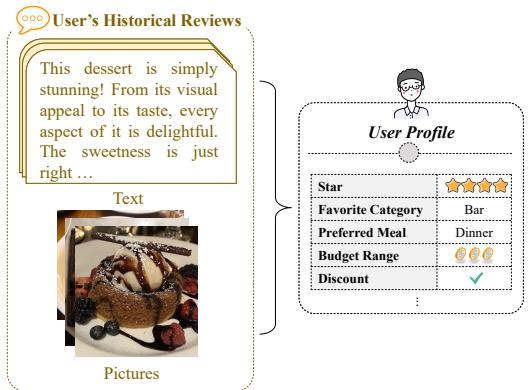
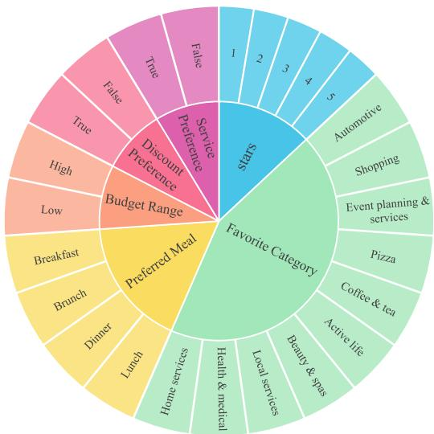
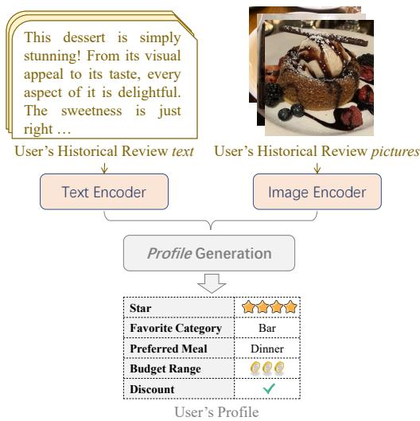
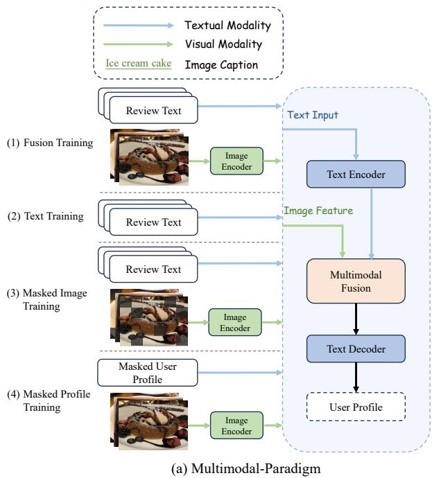
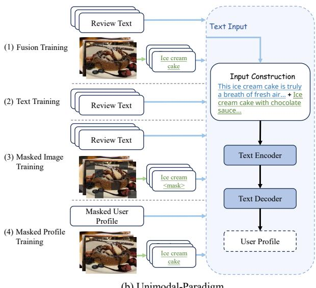
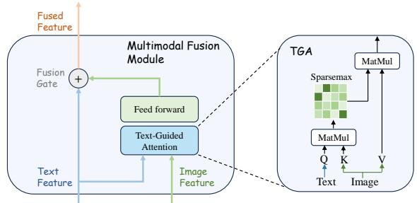
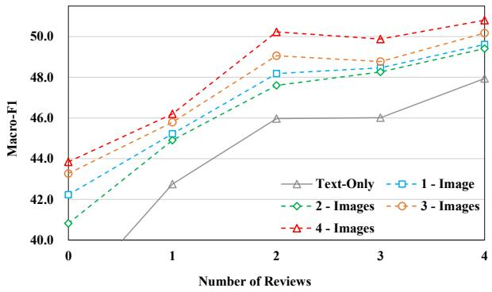
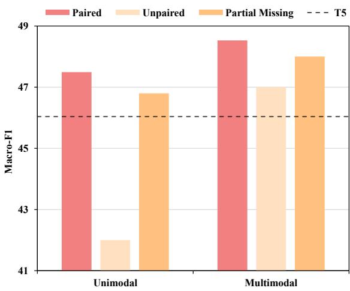

# Exploring Unified Training Framework for Multimodal User Profiling

Minjie Qiang, Zhongqing Wang\*, Shoushan Li, and Guodong Zhou   
Natural Language Processing Lab, Soochow University, Suzhou, China qiangminjie27@gmail.com {wangzq,lishoushan,gdzhou}@suda.edu.cn

## Abstract

With the emergence of social media and ecommerce platforms, accurate user profiling has become increasingly vital for recommendation systems and personalized services. Recent studies have focused on generating detailed user profiles by extracting various aspects of user attributes from textual reviews. Nevertheless, these investigations have not fully exploited the potential of the abundant multi modal data at hand. In this study, we propose a novel task called multimodal user profiling. This task emphasizes the utilization of both review texts and their accompanying images to create comprehensive user profiles. By integrating textual and visual data, we leverage their complementary strengths, enabling the generation of more holistic user representations. Additionally, we explore a unified joint training framework with various multimodal training strategies that incorporate users’ historical review texts and images for user profile generation. Our experimental results underscore the significance of multimodal data in enhancing user profile generation and demonstrate the effectiveness of the proposed unified joint training approach.

## 1 Introduction

Nowadays, e-commerce platforms and social media have become integral parts of our lives. People frequently shop and share their opinions on these websites, generating a wealth of user data. By analyzing this rich dataset, we can create detailed user profiles that assist in developing tailored recommendations and personalized services (Lu et al., 2016; Bertani et al., 2020; Simsek and Karagoz, 2020).

Recent studies on user profiling emphasize the generation of detailed user profiles by extracting multiple aspects of user attributes from textual reviews. These profiles encompass various characteristics, including gender, age, and occupation (Ciot et al., 2013; Alekseev and Nikolenko, 2016; Preo¸tiuc-Pietro et al., 2015). However, while most previous studies utilizing historical reviews to generate user profiles provide valuable insights, they don’t fully leverage the potential of the rich multimodal data available to us. Users frequently express their opinions and preferences through diverse channels, encompassing texts, images, videos, and other media. To obtain a more comprehensive view of users, it’s essential to explore multimodal profiling techniques that integrate data from multiple sources and modalities.

  
Figure 1: Overview of multimodal user profiling.

Therefore, we propose a new multimodal user profile dataset and a novel task termed multimodal user profiling, which emphasizes the construction of user profiles by harnessing both review texts and accompanying images. This integrated approach takes advantage of the complementary strengths inherent in textual and visual data, enabling the generation of a more comprehensive user profile. As shown in Figure 1, this task involves processing multimodal data, including the user’s historical review texts and corresponding product images, to craft a detailed user profile encompassing diverse user attributes.

Integrating product images and review texts from 1699

diverse sources into a cohesive model presents significant challenges due to their inherent disparities. For example, review texts, being linguistic constructs, have the potential to reveal explicitly key user attributes through descriptive words and phrases. On the other hand, product images convey information in a much more implicit and visual manner. They might depict the reviewer’s lifestyle, taste, or surroundings, but extracting these insights often requires deeper analysis and interpretation.

To overcome these obstacles, we investigate a unified joint training framework that incorporates both users’ historical review texts and product images for user profile generation. Specifically, we propose two paradigms for joint training with review texts and images: the Multimodal Paradigm and the Unimodal Paradigm. As illustrated in Figure 4, the Multimodal Paradigm directly integrates multimodal features, exhibiting outstanding performance, especially in scenarios where training data is limited. Conversely, the Unimodal Paradigm extracts valuable image insights from existing multimodal large language models and effortlessly fuses them with textual information.

Our experimental results highlight the crucial role of multimodal data in elevating the quality of user profile generation. Furthermore, they confirm the efficacy of our proposed unified joint training methodology.

## 2 Related Works

In recent years, user profiling has garnered increasing attention in various fields, including recommendation systems and e-commerce. This task aims to deduce user attributes by analyzing social media data (e.g., Twitter, Facebook, Sogou) (Al Zamal et al., 2012; Dong et al., 2014; Hu et al., 2017; Li and Dickinson, 2017; Liang et al., 2018; Liu et al., 2023) and e-commerce platforms (e.g., JD, Alibaba) (Cao et al., 2019; Chen et al., 2019, 2021; Liu et al., 2023).

Conventional approaches often formulate user profiling as a multi-class classification problem, primarily concentrating on inferring specific user attributes like gender (Rao et al., 2011; Liu et al., 2012; Ciot et al., 2013; Sakaki et al., 2014), age (Rosenthal and McKeown, 2011; Alekseev and Nikolenko, 2016; Mac Kim et al., 2017), occupation (Preo¸tiuc-Pietro et al., 2015), and preferences (Cambria et al., 2022).

Recently, Wu et al. (2019) approached user profile inference as a generation task. They trained a two-stage extractor specifically designed to extract user attributes from dialogues. Li et al. (2021) mapped visual and textual modalities into a shared semantic space, integrating them with the original representations. More recently, Liu et al. (2023) introduced a joint user profiling model that incorporates hierarchical attention networks. Lastly, Wen et al. (2023) presented a prompt-based generation method. They innovatively employed attribute names as prompts within the input sequence, aiming to generate comprehensive user profiles.

  
Figure 2: The distribution of the user profile.

In this study, we propose a novel multimodal user profiling task along with a new real-world user profile dataset. Unlike previous work, the proposed task is more challenging, requiring the simultaneous prediction of multiple multi-label user attributes. Additionally, our dataset offers multimodal data, facilitating joint training for enhanced accuracy.

## 3 Multimodal User Profile Dataset

In this study, we introduce a new Multimodal User Profile Dataset (MUPD) designed to explore the integration of visual knowledge in generating comprehensive user profiles. Figure 2 illustrates the distribution of the user profile.

Data Construction. We constructed our dataset using the Yelp Open Dataset12, a comprehensive research-oriented collection of user-generated reviews officially provided by Yelp for academic research purposes.

<table><tr><td>Statistics</td><td>Amount</td></tr><tr><td>Users</td><td>14,821</td></tr><tr><td>Avg. Images Per User</td><td>13.7</td></tr><tr><td>Avg. Reviews Per User</td><td>34.3</td></tr><tr><td>Avg. Words Per Review</td><td>58.7</td></tr></table>

Table 1: Statistics of the dataset.

To ensure data quality and reliability, we implemented a rigorous preprocessing pipeline. First, we filtered reviews based on length, removing those that were excessively long or unusually short. We then applied a user selection criterion, excluding users with fewer than 30 historical reviews to enhance the precision of user profile creation, as a larger review history provides a more robust basis for user characterization. As not all reviews in the dataset include images, we specifically selected reviews that contained at least one image. This ensures that both the textual and visual content originate from the same products, maintaining consistency and relevance in our analysis. The statistics of our dataset can be found in Table 1.

Attribute Selection. We analyzed the attributes of business visited by users to statistically infer their preferences and construct user profiles. Lowfrequency attributes and those with highly imbalanced distributions were excluded to ensure the robustness and relevance of the selected attributes. The remaining high-quality attributes served as the foundation for the user profile. Consequently, we used the following attributes to describe a user’s profile: Stars, Favorite Category, Preferred Meal, Budget Range, Discount Preference, Service Preference. A detailed discussion and statistics of these attributes can be found in Appendix A.

It is important to note that each attribute in the user profile does not require manual annotation but is determined based on the user’s statistical data. We analyzed the businesses visited by users and aggregated their attributes to infer the labels in the user profiles.

## 4 Basic Multimodal User Profile Generation Model

In this study, we introduce a novel task termed Multimodal User Profiling. This task aims to construct a comprehensive user profile by leveraging the user’s historical reviews and the corresponding product images associated with those reviews.

  
Figure 3: Example of the basic multimodal user profile generation model.

Formally, the input to our model consists of a user’s historical reviews R and related product images I, where $R = \{ r _ { 1 } , r _ { 2 } , . . . , r _ { n } \}$ represents the collection of reviews and $I = \{ i _ { 1 } , i _ { 2 } , . . . , i _ { m } \}$ denotes the set of accompanying images. The output Y of our model is a detailed user profile, including user’s Stars, Favorite Category, Preferred Meal, Budget Range, Discount Perference, and Service Perference.

As shown in Figure 3, the basic multimodal user profile generation model comprises three main modules: (1) Text Encoder is responsible for encoding the user’s historical reviews into textual feature representations. (2) Image Encoder encodes the user’s related product images into image feature representations. (3) Profile Generation integrates the text and image feature representations from the previous two modules to generate a comprehensive user profile. This profile encapsulates the user’s historical review data and visual preferences, providing a holistic view of their interests and behaviors.

## 4.1 Text Encoder

We initialize our text encoder using the encoder of the pre-trained Flan-T5 model (Chung et al., 2024). The text input consists of the user’s historical reviews, which we tokenize into words, creating an input sequence X composed of tokens. We then feed this input sequence into the text encoder, and the output from the encoder is $H _ { t x t }$

  
Figure 4: Overview of proposed user profile generation model with unified joint training framework.

$$
H _ { t x t } = \{ T _ { 1 } , T _ { 2 } , . . . , T _ { N } \} = T 5 ( R , \theta ^ { t 5 } )\tag{1}
$$

where N denotes the length of the sequence. $T _ { i }$ denotes the hidden state of each token. $\bar { \theta } ^ { t 5 }$ denotes the parameters of the Flan-T5 model.

## 4.2 Image Encoder

We utilize a pre-trained Vision Transformer (ViT) (Dosovitskiy et al., 2020) model as our image encoder, which shares a similar structure with the Transformer (Vaswani et al., 2017) and exhibits good initial performance. To encode images using the image encoder, we divide product images I into m flattened 2D patches. We then feed the image sequence into the image encoder, using the hidden state of the [CLS] token as the output $H _ { i m g }$ of our model.

$$
H _ { i m g } = \{ { \bf I _ { C } } , I _ { 1 } , I _ { 2 } , . . . , I _ { M } \} = V i T ( I , \theta ^ { v i t } )\tag{2}
$$

where M denotes the length of the image representation. $\theta ^ { v i t }$ denotes the parameters of the ViT model.

## 4.3 Profile Generation

We utilize the decoder of the Flan-T5 model to generate user profiles. We concatenate the text and image feature representations as a fused feature representation $H _ { f u s e d } .$ , which is then used as the input for the text decoder:

$$
H _ { f u s e d } = [ H _ { t x t } ; H _ { i m g } ]\tag{3}
$$

The text sequence outputted by the text decoder ends with </s>. The conditional probability of the whole output sequence $p ( \boldsymbol { y } | \boldsymbol { I } , R )$ is progressively combined by the probability of each step $p ( y _ { t } | y _ { < t } , I , R ; \theta )$

$$
p ( \boldsymbol { y } | I , R ) = \prod _ { t = 1 } ^ { | \boldsymbol { y } | } p ( \boldsymbol { y } _ { t } | \boldsymbol { y } _ { < t } , I , R ; \theta )\tag{4}
$$

$$
p ( y _ { t } | y _ { < t } , I , R ; \theta ) = \sigma ( W ^ { o } O _ { L , t } + b ^ { o } )\tag{5}
$$

where $O _ { L , t }$ is the hidden state of the L-th decoder layer at the t-th decoding step, $\{ W ^ { o } , b ^ { o } \}$ are trainable parameters, $\sigma ( \cdot )$ is a softmax function, $y _ { < t } = y _ { 1 } . . . y _ { t - }$ 1 and $p ( y _ { t } | y _ { < t } , I , R ; \theta )$ are the probabilities over target vocabulary V normalized by softmax.

## 5 User Profile Generation with Unified Joint Training Framework

In this study, we explore a unified joint training framework that incorporates both users’ historical review texts and images during the model’s training process for user profile generation.

Specifically, we introduce two paradigms for joint training with historical review texts and images: the Multimodal Paradigm and the Unimodal

Paradigm. These paradigms exhibit distinct characteristics. The Multimodal Paradigm integrates multimodal features and excels in scenarios with limited training data. Conversely, the Unimodal Paradigm leverages high-quality image knowledge extracted from existing multimodal large language models and fuses it with textual information. Review texts and images are organized according to two paradigms and then fed separately into the model’s text and image encoders.

Figure 4 illustrates these two paradigms, and we will delve into the details in the following sections.

## 5.1 Multimodal Paradigm

In this subsection, we design four training methods to learn how to harness visual knowledge for user profile generation effectively. By employing these diverse training techniques, we enhance the model’s versatility and accuracy in generating comprehensive user profiles, leveraging both textual and visual data effectively.

Fusion Training represents a standard multimodal training approach that leverages both users’ historical reviews and images to train the user profile generation model. An example is illustrated in Figure 4a(1).

Text Training is a fundamental training technique that solely relies on users’ historical reviews to train the user profile generation model. This method is exemplified in Figure 4a(2).

Masked Image Training is aimed at reducing the visibility of images to mimic an intermediate phase between text and fusion training. As shown in Figure 4a(3), it captures all pixels in the images and masks each pixel based on a pre-defined probability, effectively turning the pixel black.

Masked Profile Training involves masking attributes in the user profiles and using them as inputs alongside users’ historical images. An example of masking attributes is as follows: "Stars: 4 the model to complete the user profile solely based on product images and the masked user profiles. An instance of this method is shown in Figure 4a(4).

## 5.2 Unimodal Paradigm

Different from the multimodal paradigm, we utilize image captions to bridge the divide between the user’s historical reviews and images within an unimodal framework. Specifically, we employ the BLIP2 model (Li et al., 2023) to generate captions for users’ historical images. Then, we craft prompts from review texts and these captions to train the user profile generation model.

  
Figure 5: Example of text-guided attention module with user’s historical reviews and images.

The training process is outlined in Figure 4b. The key difference between the unimodal and multimodal paradigms lies in the unimodal approach’s use of captions converted from images to train the user profile generation model. This method allows us to integrate visual information indirectly through textual representations, maintaining an unimodal processing flow. It should be noted that in the unimodal paradigm, masked image training masks the image captions rather than the images.

## 5.3 Combination of Multimodal-Paradigm and Unimodal-Paradigm

To integrate the different training processes in the above two subsections, we design the Text-Guided Attention module (TGA) to learn to assign attention scores between user’s historical reviews and images. As shown in Figure 5, we normalize the attention weights using Sparsemax (Martins and Astudillo, 2016), where the weight of the redundant visual features will be set to 0.

$$
H _ { \mathrm { i m g } } ^ { * } = \mathrm { F F N } ( \mathrm { T G A } ( H _ { \mathrm { t x t } } , H _ { \mathrm { i m g } } , H _ { \mathrm { i m g } } ) )\tag{6}
$$

where $H _ { i m g }$ denotes the visual representation of [CLS] token. We expand $H _ { i m g }$ to be consistent with the sequence length using broadcasting.

Then, we employ a gate λ to determine how much visual information is retained.

$$
\lambda = \operatorname { T a n h } ( W ^ { T } H _ { \mathrm { t x t } } + W ^ { I } H _ { \mathrm { i m g } } ^ { * } )\tag{7}
$$

where $W ^ { T }$ and $W ^ { I }$ are trainable parameters.

Finally, we add the visual information to the original textual feature using the gate module to obtain the multimodal fusion representation.

$$
H _ { \mathrm { f u s e d } } = H _ { \mathrm { t x t } } + I F ( i m g ) \cdot \lambda \cdot H _ { \mathrm { i m g } } ^ { * }\tag{8}
$$

<table><tr><td colspan="8">User Profile</td></tr><tr><td>Methods</td><td>Stars</td><td>Category</td><td>Budget Range</td><td>Service</td><td>Meal</td><td>Discount</td><td>Average</td></tr><tr><td colspan="8">Unimodal Methods</td></tr><tr><td>OD-TUP</td><td>40.56</td><td>22.86</td><td>56.99</td><td>53.68</td><td>56.05</td><td>52.55</td><td>47.11</td></tr><tr><td>Flan-T5</td><td>50.60</td><td>19.76</td><td>53.43</td><td>49.07</td><td>57.46</td><td>45.77</td><td>46.01</td></tr><tr><td>LLaMA</td><td>22.69</td><td>21.02</td><td>57.42</td><td>48.24</td><td>57.80</td><td>50.99</td><td>43.03</td></tr><tr><td>ChatGLM</td><td>32.73</td><td>19.44</td><td>38.12</td><td>35.51</td><td>36.83</td><td>32.85</td><td>32.58</td></tr><tr><td>GPT-40</td><td>35.00</td><td>16.84</td><td>61.24</td><td>57.02</td><td>61.51</td><td>37.23</td><td>44.81</td></tr><tr><td colspan="8">Multimodal Methods</td></tr><tr><td>COOPNet</td><td>41.78</td><td>22.24</td><td>56.48</td><td>54.37</td><td>58.78</td><td>55.12</td><td>48.12</td></tr><tr><td>SelectAtt</td><td>45.03</td><td>24.60</td><td>55.25</td><td>52.59</td><td>60.39</td><td>51.57</td><td>48.24</td></tr><tr><td>AoM</td><td>45.37</td><td>21.13</td><td>55.74</td><td>55.89</td><td>58.94</td><td>56.13</td><td>48.87</td></tr><tr><td>VLP-MABSA</td><td>45.52</td><td>21.41</td><td>56.21</td><td>56.02</td><td>59.25</td><td>56.89</td><td>49.22</td></tr><tr><td>LLaVA-1.5</td><td>47.28</td><td>21.02</td><td>61.30</td><td>52.67</td><td>59.63</td><td>49.24</td><td>48.52</td></tr><tr><td>Ours</td><td>53.44</td><td>28.19</td><td>58.16</td><td>63.93</td><td>61.55</td><td>58.23</td><td>53.91</td></tr></table>

Table 2: Comparison with baselines. “Category” denotes Favorite Category. “Meal” denotes Preferred Meal. “Service” denotes Service Preference. “Discount” denotes Discount Preference.

where IF(img) denotes whether the product image is available. When the product image is unavailable, IF(img) will be set to 0.

It is worth noting that we do not use the traditional Sigmoid function (Li et al., 2022), but the Tanh function. The advantage of this is that the Tanh function is centered at zero, so when the sum of image and text features approaches zero, the value of the Tanh function is also nearly zero. So training methods for which product images are unavailable can be considered as a special case of Equation 8 (i.e. $I F ( i m g = u n a v a i l a b l e ) =$ $T a n h ( 0 ) = 0 )$ , thus enabling it to be incorporated into the unified training framework.

Furthermore, since the multimodal and unimodal paradigms are not mutually exclusive, they can be used simultaneously under the same framework without modifying the model. We then utilize Equation 8 for multimodal feature fusion, the only difference is that we concatenate the image captions from the unimodal paradigm into the text input. In this way, the two methods can take advantage of their respective strengths, thus further enhancing the performance of the model.

## 6 Experiments

In this section, we introduce the baseline methods employed for comparison. We then report the experimental results conducted from different perspectives. The detailed experiment settings are provided in Appendix B.

## 6.1 Main Results

In this subsection, we compare our proposed model with both unimodal and multimodal models in all the attributes from user profiles.

In particular, OD-TUP (Wen et al., 2023) proposes a generation method based on prompts to generate a more comprehensive user profile. Flan-T5, LLaMA (Touvron et al., 2023) and ChatGLM (Du et al., 2022) are pre-trained language models used for NLP tasks. GPT-4o (OpenAI, 2024) is a powerful large language model released by OpenAI that excels at handling various tasks. In the multimodal approaches, COOPNet (Li et al., 2021) is an image-text collaboration framework that predicts user profiles in a multimodal regression manner. SelectAtt (Li et al., 2022) proposed a selective attention model to explore the patch-level contributions of images. VLP-MABSA (Ling et al., 2022) and AoM (Zhou et al., 2023) are unified multimodal sentiment analysis frameworks based on the BART model, we modify the input-output format of the model to adapt to our proposed task. LLaVA-1.5 (Liu et al., 2024) is an end-to-end trained large multimodal model, connecting vision encoders with LLM to achieve general visual and language understanding.

As shown in Table 2, Large language models (LLMs) struggle to achieve acceptable performance, they are even lower than the basic generative pre-trained models (i.e., Flan-T5). This is probably because LLMs have good performance for most tasks, but are powerless against specific tasks. We also find that multimodal models generally outperform unimodal models, suggesting that relying solely on text is insufficient for generating accurate user profiles. Utilizing multimodal information allows models to analyze and construct user profiles from multiple perspectives, thereby enhancing model performance.

<table><tr><td>Methods</td><td>Macro-F1</td></tr><tr><td>Ours</td><td>53.91</td></tr><tr><td>-Uni</td><td>52.96</td></tr><tr><td>-Multi</td><td>53.07</td></tr><tr><td>-Multi -Uni</td><td>48.53</td></tr></table>

Table 3: Impact of different paradigms in unified joint training framework. “Uni” denotes the unimodal paradigm. “Multi” denotes the multimodal paradigm.
<table><tr><td>Methods</td><td>Multi Uni</td></tr><tr><td>Text-Only</td><td>46.01</td></tr><tr><td>+Fusion</td><td>48.53 47.49</td></tr><tr><td>+Text</td><td>52.05 52.21</td></tr><tr><td>+MaskImage</td><td>49.12 48.75</td></tr><tr><td>+MaskProfile</td><td>49.91 49.76</td></tr><tr><td>+Text, MaskProfile</td><td>52.55 52.57</td></tr><tr><td>Ours</td><td>52.96 53.07</td></tr></table>

Table 4: The effects of training methods on the multimodal and unimodal paradigm.

Besides, the performance of our proposed model outperforms all baseline models significantly (p < 0.05). It indicates the effectiveness of multimodal information for user profiling and also shows the effectiveness of the proposed model with the unified joint training framework.

## 6.2 Impact of Unified Joint Training Framework

We then investigate the impact of the proposed unified joint training framework for multimodal user profile generation.

As shown in Table 3, both unimodal(-Uni) and multimodal(-Multi) training paradigms are effective for learning the correlations between reviews and images, if we remove one of them, the performance drops to 52.96% and 53.07% respectively. In addition, if we remove the whole unified joint pretraining framework (-Multi -Uni), the performance drops to 48.53%, which indicates that this framework is very important for the proposed multimodal user profile generation task.

  
Figure 6: The effect of the numbers of reviews and images.

We further investigate the impact of the four kinds of training methods in the two paradigms in Table 4. In particular, we use the Flan-T5 model trained solely on text as the baseline (Text-Only) and then gradually add different training methods for joint training.

The performance of the Text-Only approach falls behind other methods, highlighting that mere reliance on textual data is inadequate for building a comprehensive user profile. Fusion, which denotes standard multimodal training, demonstrates superior performance. Subsequently, when we incorporate additional training methodologies for joint training, the model’s performance is enhanced to various extents. This indicates that all these training techniques complement Fusion in learning cross-modal interactions. Moreover, these training strategies prove effective in both multimodal and unimodal training paradigms. Our proposed model, incorporating all training methods across both paradigms, achieves the highest level of performance. A more detailed discussion of these training methods can be found in Appendix C.

## 7 Analysis and Discussion

In this section, we will conduct a comprehensive analysis and discussion on a unified joint training framework to investigate the various factors. Furthermore, we explore the potential applications of the generated user profiles in other fields.

## 7.1 Influence of Numbers of Historical Reviews and Images

Since we propose to use multimodal information to generate user profiles, we first investigate whether historical reviews and images can contribute to the construction of user profiles.

  
Figure 7: The performance of our model in three scenarios. Paired means the review texts and images match. Unpaired means they do not match. Partial Missing means some images are missing but still paired with the texts.

In our experiments, we use the Text-Only scenario as a benchmark (w/o images). As shown in Figure 6, when the number of images is zero, all models perform at their lowest. This indicates that relying solely on review texts to generate user profiles is insufficient. Then, as we gradually increase the number of images, an evident improvement in model performance can be observed. This suggests that images provide rich information that allows for a more accurate construction of user profiles. Moreover, We find that both reviews and images are equally effective in enhancing model performance. However, when the number of reviews reached a certain level, the improvement diminished or even had a negative impact, whereas images do not exhibit this issue. This suggests that compared to review texts, there is less redundant information among images, thereby providing a stable contribution to the model. This guides us not to blindly increase the number of reviews, as this could lead to a saturation of effective information and bring meaningless training costs. Increasing the number of images to compensate for the reduction in reviews might be a good choice.

## 7.2 Effect of Historical Review Images

In this subsection, we conduct ablation experiments on historical review images to determine whether they actually contribute to our model. In particular, we use unpaired data to check the importance of these images. In addition, we observe whether model performance is negatively affected by reducing the number of images. We provide the performance of the Flan-T5 model as a reference.

<table><tr><td>Model</td><td>Text</td><td>Text + Profile</td></tr><tr><td>BERT</td><td>55.4</td><td>57.6</td></tr><tr><td>T5</td><td>64.8</td><td>66.8</td></tr><tr><td>BART</td><td>57.0</td><td>59.4</td></tr><tr><td>LLaMA</td><td>66.4</td><td>69.0</td></tr><tr><td>ChatGLM</td><td>59.2</td><td>61.4</td></tr></table>

Table 5: The results of sentiment classification with user profiles.

As shown in Figure 7, both unimodal and multimodal paradigms show different degrees of performance degradation after the number of historical images is reduced. This indicates that our model is capable of obtaining effective information from historical images. In the case of unpaired historical images, both paradigms’ performances show a significant decrease, and the performance of the unimodal paradigm is even lower than the baseline. This shows the dependence of our model on image information. It is worth noting that the multimodal paradigm performance is still higher than the baseline performance although it shows a significant drop. This indicates that historical images in the model not only provide multimodal information but also act as a regularization term, improving the robustness of the model.

## 7.3 Application of User Profiling

In this subsection, we aim to explore the effectiveness of generated user profiles. To achieve this, we choose the sentiment classification task as a means of integrating and evaluating the profiles. Subsequently, we concatenate the generated user profiles as additional information along with the review text and input this combined data into the model. The user profiles are generated using our proposed model.

The experiment is conducted on our proposed dataset, where we randomly select some users and choose one historical review as training data. The review text and user profile served as inputs for the model, with the review’s rating being used as a reference for sentiment classification. As shown in Table 5, the generated user profiles (Text + Profile) are truly effective for sentiment classification across various classification methods. This suggests that constructing a user profile composed of multiple attributes can significantly enhance the accuracy of sentiment classification. The results clearly demonstrate the value of incorporating rich user profiles in sentiment analysis tasks.

## 8 Conclusion

In this study, we introduce a novel task termed Multimodal User Profiling, which focuses on creating comprehensive user profiles by analyzing both user review texts and associated product images. To facilitate this task, we have constructed a new multimodal user profile dataset that incorporates users historical review texts and corresponding images. To capture cross-modal interactions effectively, we have explored a joint training framework, offering two distinct training paradigms. Through rigorous experimentation, our results emphasize the crucial role of multimodal data in significantly improving the quality of user profile generation. Furthermore, they validate the effectiveness of our proposed unified joint training methodology.

## Limitations

The limitations of our work lie in two aspects: 1) due to the design of four types of training methods for joint training in our training paradigm, it is inevitable that the overall time complexity is high; 2) we have primarily focused on testing with English datasets and have shown promising results, but the performance of the model on Chinese datasets remains unknown.

## Ethical Considerations

This paper introduces a novel multimodal user profile dataset, which is entirely based on the publicly available Yelp Open Dataset and designed for academic research on user profiling. All our research is academic in nature, and prior to accessing and using the Yelp Open Dataset, we agreed to and signed Yelp’s terms of use https://terms.yelp.com/ tos/en\_us/20240710\_en\_us/, thereby obtaining access to the dataset. All user information in the dataset has been anonymized by the Yelp platform to ensure that no identifiable personal information is included. The data used in this study is limited to publicly available reviews and statistical data, without involving any sensitive personal details or unauthorized private information. This study is committed to adhering to ethical standards and ensuring the privacy and anonymity of users. User profiling technologies pose risks related to the identification and exploitation of personal information.

They can be misused to target vulnerable groups, dissenters, or individuals susceptible to manipulation, leading to financial exploitation or political oppression. Therefore, the use of this technology must strictly adhere to ethical guidelines, ensuring transparency, compliance, and measures to protect individual privacy and security.

## Acknowledgments

We would like to thank Prof. Zhongqing Wang for his helpful advice and discussion during this work. Also, we would like to express our gratitude to the five anonymous reviewers for their insightful comments on this paper. This research was supported by the National Natural Science Foundation of China (Nos. 62376178), and Project Funded by the Priority Academic Program Development of Jiangsu Higher Education Institutions.

## References

Faiyaz Al Zamal, Wendy Liu, and Derek Ruths. 2012. Homophily and latent attribute inference: Inferring latent attributes of twitter users from neighbors. In Proceedings of the International AAAI Conference on Web and Social Media, volume 6, pages 387–390.

Anton Alekseev and Sergey I Nikolenko. 2016. Predicting the age of social network users from usergenerated texts with word embeddings. In 2016 IEEE Artificial Intelligence and Natural Language Conference (AINL), pages 1–11. IEEE.

Ricardo Mitollo Bertani, Reinaldo AC Bianchi, and Anna Helena Reali Costa. 2020. Combining novelty and popularity on personalised recommendations via user profile learning. Expert Systems with Applications, 146:113149.

Erik Cambria, Qian Liu, Sergio Decherchi, Frank Xing, and Kenneth Kwok. 2022. Senticnet 7: A commonsense-based neurosymbolic ai framework for explainable sentiment analysis. In Proceedings of the Thirteenth Language Resources and Evaluation Conference, pages 3829–3839.

Yixin Cao, Xiang Wang, Xiangnan He, Zikun Hu, and Tat-Seng Chua. 2019. Unifying knowledge graph learning and recommendation: Towards a better understanding of user preferences. In The world wide web conference, pages 151–161.

Weijian Chen, Fuli Feng, Qifan Wang, Xiangnan He, Chonggang Song, Guohui Ling, and Yongdong Zhang. 2021. Catgcn: Graph convolutional networks with categorical node features. IEEE Transactions on Knowledge and Data Engineering, 35(4):3500–3511.

Weijian Chen, Yulong Gu, Zhaochun Ren, Xiangnan He, Hongtao Xie, Tong Guo, Dawei Yin, and Yongdong

Zhang. 2019. Semi-supervised user profiling with heterogeneous graph attention networks. In IJCAI, volume 19, pages 2116–2122.

Hyung Won Chung, Le Hou, Shayne Longpre, Barret Zoph, Yi Tay, William Fedus, Yunxuan Li, Xuezhi Wang, Mostafa Dehghani, Siddhartha Brahma, et al. 2024. Scaling instruction-finetuned language models. Journal ofMachine Learning Research, 25(70):1–53.

Morgane Ciot, Morgan Sonderegger, and Derek Ruths. 2013. Gender inference of twitter users in nonenglish contexts. In Proceedings of the 2013 conference on empirical methods in natural language processing, pages 1136–1145.

Yuxiao Dong, Yang Yang, Jie Tang, Yang Yang, and Nitesh V Chawla. 2014. Inferring user demographics and social strategies in mobile social networks. In Proceedings ofthe 20th ACM SIGKDD international conference on Knowledge discovery and data mining, pages 15–24.

Alexey Dosovitskiy, Lucas Beyer, Alexander Kolesnikov, Dirk Weissenborn, Xiaohua Zhai, Thomas Unterthiner, Mostafa Dehghani, Matthias Minderer, Georg Heigold, Sylvain Gelly, et al. 2020. An image is worth 16x16 words: Transformers for image recognition at scale. arXiv preprint arXiv:2010.11929.

Zhengxiao Du, Yujie Qian, Xiao Liu, Ming Ding, Jiezhong Qiu, Zhilin Yang, and Jie Tang. 2022. Glm: General language model pretraining with autoregressive blank infilling. In Proceedings of the 60th Annual Meeting of the Association for Computational Linguistics (Volume 1: Long Papers), pages 320–335.

Jianqiao Hu, Feng Jin, Guigang Zhang, Jian Wang, and Yi Yang. 2017. A user profile modeling method based on word2vec. In 2017 IEEE International Conference on Software Quality, Reliability and Security Companion (QRS-C), pages 410–414. IEEE.

Diederik P Kingma and Jimmy Ba. 2014. Adam: A method for stochastic optimization. arXiv preprint arXiv:1412.6980.

Bei Li, Chuanhao Lv, Zefan Zhou, Tao Zhou, Tong Xiao, Anxiang Ma, and JingBo Zhu. 2022. On vision features in multimodal machine translation. arXiv preprint arXiv:2203.09173.

Junnan Li, Dongxu Li, Silvio Savarese, and Steven Hoi. 2023. Blip-2: Bootstrapping language-image pretraining with frozen image encoders and large language models. In International conference on machine learning, pages 19730–19742. PMLR.

Lin Li, Kaixi Hu, Yunpei Zheng, Jianquan Liu, and Kong Aik Lee. 2021. Coopnet: Multi-modal cooperative gender prediction in social media user profiling. In ICASSP 2021-2021 IEEE International Conference on Acoustics, Speech and Signal Processing (ICASSP), pages 4310–4314. IEEE.

Wen Li and Markus Dickinson. 2017. Gender prediction for chinese social media data. In RANLP, pages 438– 445.

Shangsong Liang, Xiangliang Zhang, Zhaochun Ren, and Evangelos Kanoulas. 2018. Dynamic embeddings for user profiling in twitter. In Proceedings ofthe 24th ACM SIGKDD international conference on knowledge discovery & data mining, pages 1764– 1773.

Yan Ling, Jianfei Yu, and Rui Xia. 2022. Visionlanguage pre-training for multimodal aspectbased sentiment analysis. arXiv preprint arXiv:2204.07955.

Haotian Liu, Chunyuan Li, Qingyang Wu, and Yong Jae Lee. 2024. Visual instruction tuning. Advances in neural information processing systems, 36.

Wendy Liu, Faiyaz Zamal, and Derek Ruths. 2012. Using social media to infer gender composition of commuter populations. In Proceedings of the International AAAI Conference on Web and Social Media, volume 6, pages 26–29.

Xiaojian Liu, Yi Zhu, and Xindong Wu. 2023. Joint user profiling with hierarchical attention networks. Frontiers ofComputer Science, 17(3):173608.

Zhongqi Lu, Sinno Jialin Pan, Yong Li, Jie Jiang, and Qiang Yang. 2016. Collaborative evolution for user profiling in recommender systems. In IJCAI, pages 3804–3810.

Sunghwan Mac Kim, Qiongkai Xu, Lizhen Qu, Stephen Wan, and Cécile Paris. 2017. Demographic inference on twitter using recursive neural networks. In Proceedings of the 55th Annual Meeting of the Associationfor Computational Linguistics (Volume 2: Short Papers), pages 471–477.

Andre Martins and Ramon Astudillo. 2016. From softmax to sparsemax: A sparse model of attention and multi-label classification. In International conference on machine learning, pages 1614–1623. PMLR.

OpenAI. 2024. Hello, gpt-4o.

Daniel Preo¸tiuc-Pietro, Vasileios Lampos, and Nikolaos Aletras. 2015. An analysis of the user occupational class through twitter content. In Proceedings ofthe 53rd Annual Meeting ofthe Associationfor Computational Linguistics and the 7th International Joint Conference on Natural Language Processing (Volume 1: Long Papers), pages 1754–1764.

Delip Rao, Michael Paul, Clay Fink, David Yarowsky, Timothy Oates, and Glen Coppersmith. 2011. Hierarchical bayesian models for latent attribute detection in social media. In Proceedings ofthe international AAAI conference on web and social media, volume 5, pages 598–601.

Sara Rosenthal and Kathleen McKeown. 2011. Age prediction in blogs: A study of style, content, and online behavior in pre-and post-social media generations. In Proceedings of the 49th annual meeting of the associationfor computational linguistics: human language technologies, pages 763–772.

Shigeyuki Sakaki, Yasuhide Miura, Xiaojun Ma, Keigo Hattori, and Tomoko Ohkuma. 2014. Twitter user gender inference using combined analysis of text and image processing. In proceedings of the Third Workshop on Vision and Language, pages 54–61.

Atakan Simsek and Pinar Karagoz. 2020. Wikipedia enriched advertisement recommendation for microblogs by using sentiment enhanced user profiles. Journal ofIntelligent Information Systems, 54(2):245– 269.

Hugo Touvron, Louis Martin, Kevin Stone, Peter Albert, Amjad Almahairi, Yasmine Babaei, Nikolay Bashlykov, Soumya Batra, Prajjwal Bhargava, Shruti Bhosale, et al. 2023. Llama 2: Open foundation and fine-tuned chat models. arXiv preprint arXiv:2307.09288.

Ashish Vaswani, Noam Shazeer, Niki Parmar, Jakob Uszkoreit, Llion Jones, Aidan N Gomez, Łukasz Kaiser, and Illia Polosukhin. 2017. Attention is all you need. Advances in neural information processing systems, 30.

Haoyang Wen, Zhenxin Xiao, Eduard Hovy, and Alexander G Hauptmann. 2023. Towards open-domain twitter user profile inference. In Findings ofthe Association for Computational Linguistics: ACL 2023, pages 3172–3188.

Chien-Sheng Wu, Andrea Madotto, Zhaojiang Lin, Peng Xu, and Pascale Fung. 2019. Getting to know you: User attribute extraction from dialogues. arXiv preprint arXiv:1908.04621.

Ru Zhou, Wenya Guo, Xumeng Liu, Shenglong Yu, Ying Zhang, and Xiaojie Yuan. 2023. Aom: Detecting aspect-oriented information for multimodal aspect-based sentiment analysis. arXiv preprint arXiv:2306.01004.

## A Attributes of User Profile

Then, we tallied the attributes of restaurants visited by users to discern their preferred restaurant types and attributes. Additionally, we filtered out low-frequency attributes and eliminated those with highly imbalanced categories. The remaining highquality attributes then constituted the user profiles. Therefore, we describe these attributes in the below:

• Stars represents the average rating given by users. The value of this attribute is an integer ranging from 1 to 5. Average scoring can help us understand users’ evaluation tendencies and their level of inclusiveness.

• Favorite Category refers to the type of restaurant preferred by the user. This attribute comprises 10 distinct categories, from which we identify two as the user’s favorite restaurant types. This can help us understand users’ taste preferences.

• Preferred Meal specifies the meal type in which the restaurant specializes. This attribute has two potential values, indicating the restaurant’s primary meal focus. This can infer the user’s lifestyle patterns and dining habits

• Budget Range represents the cost bracket of the restaurant frequently visited by users. This attribute also consists of two values: low and high, reflecting the spending capacity of users.

• Discount Preference indicates whether the restaurants that users like to visit offer promotions. This attribute is binary, with possible values of True and False. This can also reflect the consumption level of the users.

• Service Preference denotes whether the restaurant provides takeaway or banquet services. This attribute is also binary, marked as True or False, depending on the availability of these services. This can help us understand the lifestyle habits of users.

Detailed statistics on the attributes of user profiles can be found in Table 6. By analyzing these attributes, we can gain a deeper understanding of users’ dining preferences, enabling more precise recommendations and personalized services within the restaurant industry.

## B Experiment Settings

In this study, we construct a new multimodal user profile dataset by ourselves, the detailed discussion and statistics can be found in Section 3. In particular, we randomly split it into training, development, and test sets, with sizes of 3,000, 500, and 500 respectively.

We utilize Flan-T5 3 and ViT 4 as our base models. We randomly selected three reviews and corresponding images as inputs for the model. We set the batch size to 4, the learning rate to 5e-5, the number of epochs to 10, and the maximum input text length to 600. We employ Adam (Kingma and Ba, 2014) as the optimizer to finetune our model parameters. During inference, we do the beam search with beam size 5. All our experiments are conducted on an NVIDIA Tesla V100S 32G GPU.

<table><tr><td rowspan=1 colspan=6>User Profile</td></tr><tr><td rowspan=1 colspan=1>Attribute</td><td rowspan=1 colspan=1>Amount</td><td rowspan=1 colspan=1>Attribute</td><td rowspan=1 colspan=1>Amount</td><td rowspan=1 colspan=1>Attribute</td><td rowspan=1 colspan=1>Amount</td></tr><tr><td rowspan=1 colspan=1>Stars</td><td rowspan=1 colspan=1>4,000</td><td rowspan=1 colspan=1>Favorite Category</td><td rowspan=1 colspan=1>8,000</td><td rowspan=1 colspan=1>Budget Range</td><td rowspan=1 colspan=1>4,000</td></tr><tr><td rowspan=1 colspan=1>1</td><td rowspan=1 colspan=1>1</td><td rowspan=1 colspan=1>Automotive</td><td rowspan=1 colspan=1>199</td><td rowspan=1 colspan=1>Low</td><td rowspan=1 colspan=1>2,113</td></tr><tr><td rowspan=1 colspan=1>2</td><td rowspan=1 colspan=1>74</td><td rowspan=1 colspan=1>Shopping</td><td rowspan=1 colspan=1>1,333</td><td rowspan=1 colspan=1>High</td><td rowspan=1 colspan=1>1,887</td></tr><tr><td rowspan=1 colspan=1>3</td><td rowspan=1 colspan=1>645</td><td rowspan=1 colspan=1>Event planning &amp; services</td><td rowspan=1 colspan=1>1,883</td><td rowspan=1 colspan=1>Discount Preference</td><td rowspan=1 colspan=1>4,000</td></tr><tr><td rowspan=1 colspan=1>4</td><td rowspan=1 colspan=1>2,987</td><td rowspan=1 colspan=1>Pizza</td><td rowspan=1 colspan=1>1,899</td><td rowspan=1 colspan=1>True</td><td rowspan=1 colspan=1>3,285</td></tr><tr><td rowspan=1 colspan=1>5</td><td rowspan=1 colspan=1>293</td><td rowspan=1 colspan=1>Coffee &amp; tea</td><td rowspan=1 colspan=1>1,631</td><td rowspan=1 colspan=1>False</td><td rowspan=1 colspan=1>715</td></tr><tr><td rowspan=1 colspan=1>Preferred Meal</td><td rowspan=1 colspan=1>4,000</td><td rowspan=1 colspan=1>Active life</td><td rowspan=1 colspan=1>272</td><td rowspan=1 colspan=1>Service Preference</td><td rowspan=1 colspan=1>4,000</td></tr><tr><td rowspan=1 colspan=1>Lunch</td><td rowspan=1 colspan=1>1,618</td><td rowspan=1 colspan=1>Beauty &amp; spas</td><td rowspan=1 colspan=1>499</td><td rowspan=1 colspan=1>True</td><td rowspan=1 colspan=1>2,939</td></tr><tr><td rowspan=1 colspan=1>Dinner</td><td rowspan=1 colspan=1>2,380</td><td rowspan=1 colspan=1>Local services</td><td rowspan=1 colspan=1>77</td><td rowspan=1 colspan=1>False</td><td rowspan=1 colspan=1>1,061</td></tr><tr><td rowspan=1 colspan=1>Brunch</td><td rowspan=1 colspan=1>1</td><td rowspan=1 colspan=1>Health &amp; medical</td><td rowspan=1 colspan=1>99</td><td rowspan=1 colspan=1></td><td rowspan=1 colspan=1></td></tr><tr><td rowspan=1 colspan=1>Breakfast</td><td rowspan=1 colspan=1>1</td><td rowspan=1 colspan=1>Home services</td><td rowspan=1 colspan=1>108</td><td rowspan=1 colspan=1></td><td rowspan=1 colspan=1></td></tr></table>

Table 6: The distribution of user attributes.

<table><tr><td colspan="2">Model</td><td>Basic</td><td>Basic + Joint</td></tr><tr><td rowspan="3">Unimodal</td><td>Flan-T5</td><td>46.01</td><td>50.30</td></tr><tr><td>LLaMA</td><td>43.03</td><td>46.54</td></tr><tr><td>OD-TUP</td><td>47.11</td><td>52.06</td></tr><tr><td rowspan="3">Multimodal</td><td>SelectAtt</td><td>48.24</td><td>49.63</td></tr><tr><td>LLaVA</td><td>48.52</td><td>50.49</td></tr><tr><td>Ours</td><td>48.53</td><td>53.91</td></tr></table>

Table 7: The performance of training framework on other models.

For the experimental details of GPT-4o, we finetune the GPT-4o on our dataset by the OpenAI Finetune API, with the prompt "Please generate a user profile based on review text!", which is determined empirically to perform well, and the temperature is set to 0.7 in the stage of generation.

For all experiments, we evaluate each attribute in the generated user profiles using Macro-F1 and finally calculate the average as a reference for model performance.

## C Performance of Training Framework On Other Models

We propose a unified joint training framework that has significantly enhanced our model. To verify that our framework is widely applicable and not designed for a specific model, we conducted experiments on other models. We selected several models from both unimodal and multimodal approaches for validation and set up two scenarios: one is a basic multimodal user profile (Basic), and the other applies our joint training framework based on the former (Basic + Joint).

As shown in Table 7, in the Basic scenario, the multimodal model maintains a lead over the unimodal model. In the Basic+Joint scenario, after applying our joint training framework, the performance of all models has been significantly improved. This demonstrates the effectiveness and general applicability of our framework. Moreover, our model shows the largest improvement, which is due to our interaction module that allows the model to utilize all training methods for joint training. Additionally, we found that even the basic pre-trained model (i.e., Flan-T5) can outperform the multimodal models. Considering the scarcity of multimodal annotated data in the real world, we believe that using non-standard multimodal training methods for joint training is more important for multimodal user profiling.