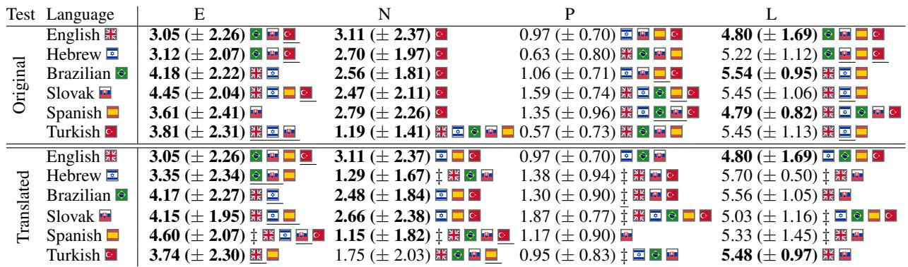

# Exploring the Impact of Language Switching on Personality Traits in LLMs

Jacopo Amidei1, Gregorio Ferreira1, Rubén Nieto2, Andreas Kaltenbrunner1,3

1IN3, Universitat Oberta de Catalunya, Barcelona, Spain. 2eHealth Research Lab, Universitat Oberta de Catalunya, Barcelona, Spain. 3ISI Foundation, Torino, Italy. Correspondence: jamidei@uoc.edu

## Abstract

This paper investigates the extent to which LLMs align with humans when personality shifts are associated with language changes. Based on three experiments, that focus on GPT-4o and the Eysenck Personality Questionnaire-Revised (EPQR-A), our initial results reveal a weak yet significant variation in GPT-4o’s personality across languages, indicating that some stem from a language-switching effect rather than translation. Further analysis across five English-speaking countries shows that GPT-4o, leveraging stereotypes, reflects distinct countryspecific personality traits.

## 1 Introduction

Research on multilingualism and personality reveals that most multilingual individuals experience a shift in their personality when they switch languages, for example, Chen and Bond (2010); Dylman and Zakrisson (2023). Such results are in line with the "Priming Culture" theory (Oyserman and Lee, 2007, 2008), which suggests that specific cultural content or cognitive processes can be activated in a person’s mind by priming them with particular cultural elements, such as language. An example is Cultural Frame Switching (CFS) (Hong et al., 1997), which reflects the tendency of multicultural individuals, such as multilingual, to shift their interpretations of the world by adapting their perspectives to environmental culture-relevant stimuli – e.g., language Hong et al. (2000); Oyserman and Lee (2008).

Here we explore whether these phenomena can also be observed in LLMs. More precisely, inspired by CFS, we seek to advance the discussion on the use of personality tests with LLMs by addressing the following research question:

Given the complexity of our research question, we have chosen to take the first step in this investigation by focusing on GPT-4o1 and the Eysenck Personality Questionnaire-Revised (EPQR-A), which measures Extraversion (outwardness and social engagement), Neuroticism (emotional stability), Psychoticism (impulsiveness and rule adherence) and Lie (social desirability).

Additionally, we divided RQ into three subquestions to guide our exploration:

• SRQ1: Do LLMs respond differently to the EPQR-A when presented in different languages?

• SRQ2: Are differences observed in SRQ1 attributable to variations in the translations rather than differences in the personalities?

• SRQ3: Can the differences observed in SRQ1 be attributed to cross-cultural factors?

If SRQ1 is answered affirmatively, it will suggest that language variation may correspond with personality changes. However, these changes could stem from translation differences, which brings us to SRQ2. Finally, SRQ3 aims to determine whether these variations are rooted in cultural differences. Specifically, we seek to understand if GPT-4o fails to capture the cultural nuances present among countries that share the same language.

To the best of our knowledge, this paper is the first attempt to use the CFS framework to investigate the extent to which LLMs align with humans when personality shifts are associated with language changes.

## 2 Related work

Given the study’s multidisciplinary nature – bridging the psychology of personality, cultural psychology, and computer science – this section will highlight only the principal works that inspired our research.

Personality questionnaires have been used for a long time to approach human personality in dif ferent dimensions, related, among others, to the manner of interacting with others, behaving in society or emotional profiles. Typically these are self-report questionnaires. Examples of classical and widely used ones are the Eysenck’s Person ality Questionnaire (EPQ) (Eysenck and Eysenck, 1964) and its abbreviated version, the EPQR-A (Francis et al., 1992b), the Revised NEO Personality Inventory (NEO PI-R) (Costa and McCrae, 1992) and The Big Five Inventory (BFI) (Benet-Martínez and John, 1998). All these tests have been also used to investigate personality traits across cul tures. A cross-culture personality analysis with the EPQ was performed first from Barrett and Eysenck (1984) (25 countries) and then from Lynn and Martin (1995) (37 countries). Similarly, the NEO PI-R was used to perform a cross-culture analysis in McCrae (2002), which analyzed 36 cultures and later extended by Allik et al. (2017), who analyzed 71,870 participants from 76 samples and 62 different countries or cultures, and 37 languages. In the same vein, Schmitt et al. (2007) used the BFI (based on a sample of 17,837 individuals from 56 nations and 28 languages) to perform a crosscultural study. Although these studies utilize different assessment instruments – and are not always comparable (Schmitt et al., 2007) –, they collectively support the validity of comparing mean levels of personality traits across cultures. Indeed, they provide evidence that country/culture mean scores in personality can be a valuable tool for understanding the significant connections between culture and personality – see also Hofstede and McCrae (2004).

Since self-report personality questionnaires are administered in a specific language, some research delves deeper into exploring the connection between language and personality assessments, specifically examining how the language of these questionnaires can influence the responses of multilingual and multicultural individuals. For example, the effects of language use on personality – measured through the BFI (John, 1990) – were found in Spanish-English bilinguals (Ramírez-Esparza et al., 2006). When participants answered the questionnaire in English, scores in Extraversion, Agreeableness, and Conscientiousness were significantly higher than in Spanish. On the contrary, scores in Neuroticism were significantly lower. Similar differences emerged when comparing responses from people living in Mexico and people living in the United States answering the test in their respective languages. In a sample of Chinese-English bilingual students (Chen and Bond, 2010) who were asked to answer the BFI as if they were native speakers of English or Chinese, it was found that scores on Extraversion, Agreeableness, and Openness to Experience were higher in participants answering as native of English. Contrarily, scores on Neuroticism and Conscientiousness were significantly higher for those answering as native speakers of Chinese. In a study with Swedish-English bilingual students (Dylman and Zakrisson, 2023), in line with prior results, scores in Extroversion were significantly higher when responders answered the BFI in English.

In recent years, there has been a surge in the employment of personality tests within the LLM framework. For example, the BFI (Digman, 1990) were used, among others, by (Karra et al., 2022; Safdari et al., 2023; Pellert et al., 2023; Mei et al., 2024) to quantify the personality traits of LLMs. Similarly, IPIP-NEO (Goldberg et al., 1999) was used in (Safdari et al., 2023) and Short Dark Tetrad (SD4) (Paulhus et al., 2020) was used in Pellert et al. (2023). In a slightly different fashion, (Griffin et al., 2023) investigates LLM’s behavioural profile in a dynamic context instead of a static one. While the outcomes of the aforementioned studies may vary depending on the LLMs and questionnaires used, there is enough support to draw the promising conclusion that personality assessments for LLMs are valid and reliable. These findings hold significance, considering that personality tests are tailored for humans, and there is no guarantee beforehand that they will yield valid and reliable results for LLMs.

Taking inspiration from CFS, this paper uses the EPQR-A personality questionnaire to investigate to what extent multilingual LLMs exhibit crosslingual personality change.

## 3 Methods

We prompt GPT-4o to answer the EPQR-A, which is an abbreviated version of the Eysenck Personality Inventory (Eysenck and Eysenck, 1964), containing 24 items for assessing four scales (6 items each): Extraversion (E), Neuroticism (N), Psychoticism (P), Lie (L) (Francis et al., 1992b). Each item has a dichotomous response (yes or no), and a score for each scale can be computed by summing individual items (resulting in a range from 0 to 6).

  
Table 1: Mean and standard deviation (± sd) for original and translated EPQR-A. Country flags indicate significant difference $( \mathtt { p } \le 0 . 0 1 , \mathtt { p } \le 0 . 0 5$ when underlined) among languages. ‡ indicates significant $( \mathtt { p } \le 0 . 0 1 )$ difference between translated and original questionnaire. Values in bold mean Cronbach’s $\alpha \ge 0 . 7$ (Table A1 in the Appendix).

Experimental Setups: We designed two sets of prompts for our experiments to guide GPT-4o to answer questionnaires. The first set was tailored to address SRQ1 and SRQ2, while the second set was specifically created for SRQ3 (prompts are in Appendix A).

To handle SRQ1, we first prompt GPT-4o to answer EPQR-A in six languages: English (Francis et al., 1992b), Hebrew (Katz and Francis, 2000), Brazilian2 (Scheibe et al., 2023), Slovak (Dubayova et al., 2009), Spanish (Sandín et al., 2002) and Turkish (Karanci et al., 2002). In all cases, we used English instructions.3

Then, for SRQ2, we prompted GPT-4o to respond to a translation (performed by Google Translate) of the EPQR-A questionnaire from English into the five languages used for SRQ1. Since the translation process followed in the versions used for SRQ1 implies a scientific procedure for adapting the questionnaire to each specific language (testing the psychometric properties and refining the questionnaires), these can differ from the translated versions.

Finally, to address SRQ3, we instructed GPT-4o to respond to the English version of the EPQR-A while simulating a native speaker from five Englishspeaking countries: the UK, USA, Canada, Australia, and Ireland.

For each experiment we performed 100 trials.

Postprocessing of the answers: With GPT-4o’s answers, we compute descriptive statistics for each of the 4 scales of the EPQR-A. We use the nonparametric two-sided Mann–Whitney U test to compare different groups of results (answers were not normally distributed). Finally, we tested reliability by computing Cronbach’s α (Cronbach, 1951) values. This is an index frequently used to evaluate the internal consistency of a set of items (Tavakol and Dennick, 2011). Cronbach’s α is considered acceptable when above 0.70 (Cicchetti, 1994).

## 4 Results

SRQ1. Personality and language switching: Table 1 (top 6 rows) shows that GPT-4o displayed similar scores across languages yet with many significant differences on most scales (P shows the highest number of significant differences between the different languages, while N exhibits the least).

In general, high scores in L4 were accompanied by low scores in P (from 0.57 to 1.59) and average scores in N - ranging from 2.47 to 3.11 (except for Turkish, which scores 1.19) - and in E - ranging from 3.05 to 4.45. Important differences can be observed in the E scale where Brazilian and Slovak score higher, in the N scale where Turkish scores lower, in the P scale where Slovak and Spanish score higher, and for the L scale where English and Spanish score lower (always in comparison to the other languages). Interestingly, the smaller standard deviation of Spanish in L makes also the difference between English and Spanish significant.

In conclusion, our initial test suggests a language-switching effect on GPT-4o’s personality, as measured by the EPQR-A test. The following section will examine whether these variations arise from translation differences.

<table><tr><td>Country</td><td>E</td><td>N</td><td>P</td><td>L</td></tr><tr><td>USA</td><td> $5 . 7 8 \left( \pm 0 . 6 4 \right) E N \boxplus \boxplus$ </td><td> $\overline { { 3 . 4 7 \left( \pm 2 . 1 3 \right) \Xi \left[ \Theta \right] } }$ </td><td></td><td>1.26 (± 0.68) EN  4.35 (± 1.20)EN</td></tr><tr><td>Australia</td><td> $5 . 9 7 \left( \pm 0 . 2 2 \right) E N \equiv \boxed { \pm } \boxed { \pm }$ </td><td> $\mathbf { 1 . 0 5 } \left( \pm \mathbf { 1 . 6 2 } \right) E N \equiv \mathbf { \boxplus } \mathbf { H } \mathbf { \boxed { \equiv } }$ </td><td></td><td> $1 . 5 4 \left( \pm 0 . 6 6 \right) E N \equiv \mathrm { \boxed { q . 6 } } \boxed { 1 } \boxed { 1 } \ 4 . 8 7 \left( \pm 0 . 8 4 \right) \underline { { E N } } \equiv \boxed { 6 } \boxed { 1 }$ </td></tr><tr><td>UK米</td><td> $4 . 7 5 \left( \pm 1 . 8 6 \right) E N \equiv \pm \left. \mathrm { l f } \right| \left. \pm 1 \right| \left. \right|$ </td><td> $3 . 7 0 \left( \pm 1 . 7 2 \right) \perp 8 \perp$ </td><td> $0 . 7 0 \left( \pm 0 . 6 6 \right) E N \equiv \frac { \mathbf { s } } { } \underline { { \mathbf { \boxpsi } } }$ </td><td> $4 . 6 7 \left( \pm 0 . 8 9 \right) \overline { { E N } } \equiv \Theta \underline { { \underline { { \Pi } } } }$ </td></tr><tr><td>Canada</td><td> ${ \bf 5 . 8 0 } \left( \pm { \bf 0 . 6 4 } \right) E N \boxdot E \boxed { 1 } \underline { { \parallel } }$ </td><td> $\mathbf { 2 . 0 4 } \left( \pm \mathbf { 1 . 8 0 } \right) E N \equiv \mathbf { \boxed { 4 } } \boxed { 1 }$ </td><td> $0 . 9 5 \left( \pm 0 . 8 2 \right) \equiv \boxed { \pm } \boxed { \pm } \boxed { \Pi }$ </td><td> $5 . 2 2 \left( \pm 0 . 6 1 \right) \equiv { \overline { { \boxplus } } } { \overline { { \boxplus } } } { \overline { { \boxplus } } }$ </td></tr><tr><td>Ireland </td><td> $5 . 9 4 \left( \pm 0 . 3 4 \right) E N \equiv \boxed { \mathrm { q } }$ </td><td> $3 . 2 7 \left( \pm 1 . 8 7 \right) \perp 7$ </td><td></td><td>1.83(± 0.47)EN4.38(± 1.10)EN</td></tr><tr><td>English (EN)</td><td> $\mathbf { \overline { { 3 . 0 5 \left( \pm 2 . 2 6 \right) \equiv \perp \frac { \operatorname { E } } { \operatorname { E } } \left\| \mathbf { \overline { { H } } } \right\| } } }$ </td><td> $\mathbf { 3 . 1 1 } \left( \pm 2 . 3 7 \right) \perp \mathbf { 5 } \perp$ </td><td>0.97(±0.70)</td><td> $\mathbf { 4 . 8 0 } \left( \pm 1 . 6 9 \right) \equiv \underline { { \perp } } \underline { { \perp } } \underline { { \perp } } \underline { { \perp } } \| \boldsymbol { \mathrm { ~ \Pi ~ } }$ </td></tr></table>

Table 2: EPQR-A questionnaire for English-speaking countries. Significant difference $( \mathtt { p } \le 0 . 0 1 , \mathtt { p } \le 0 . 0 5$ when underlined) among countries is indicated with the country flags or by EN for the differences from (generic) English. Bold indicates Cronbach’s $\alpha \ge 0 . 7$ (Details in Table A1 in the Appendix).

SRQ2. Personality and translation variations: When comparing the results of the original questionnaire with those of the translated versions, we found minimal differences (see Table 1 bottom 6 rows). Except for the P scale (excluding Spanish), all other scales showed little variations, particularly the E and N scales.

While results for the Spanish questionnaire seem to be the ones most affected when using instead a translated version, we still observe many of the differences found in the original questionnaires. In particular, (with the exception of Spanish) Brazilian and Slovak still score higher in E, Slovak still scores higher in P and English scores lower in L.

Our tests suggest a subtle variation between the original questionnaires and their translated counterparts, as assessed by the EPQR-A test. This slight variation suggests that differences in personality —particularly in the E and N scales— may stem more from a language-switching effect than from translation issues.

SRQ3. Cross-cultural personality variations: Same language different countries: When GPT-4o is instructed to impersonate a native English speaker from different countries, more personality nuances emerge (See Table 2). This time, GPT-4o displayed larger variability across countries, with significant differences on most scales. In comparing the countries, the UK scored lower on the E scale, Australia and Canada on the N scale, and the UK and Canada on the P scale. Notably, Canada exhibited the highest scores on the L scale.

The most evident differences with generic English are in the scales E and P together with a reduced standard deviation in E, N and L. To further understand the variations in scores and standard deviations, we asked GPT-4o to explain its chosen responses (example answers in Appendix C). A qualitative evaluation of these explanations reveals that GPT-4o tends to rely on stereotypes, simplifying the cultural context and societal attitudes within a country. For example, in the explanations provided for Canada and the UK, it was more frequent to find elements related to adherence to social norms (e.g., concepts like social adherence, cultural norms, and societal rules are prominent). This can be related to the lower scores in these countries. For Canada, the emphasis on community engagement, well-being, and harmony likely contributes to the lower N scores. In contrast, in the USA, UK and Ireland, there is a higher preponderance of explanations made by GPT-4o related to high scores in N (e.g., "downs and up", worry and nerves, mood swings, or mood fluctuations). Additionally, explanations containing elements related to honesty, politeness, and integrity in Canada can explain the higher L scores, a trend observed across all countries.

This reliance on stereotypes by GPT-4o reflects different personality trait trends across various countries. For example, Lynn and Martin (1995) provides data for people in the USA, Australia, and Canada. At a descriptive level, there are the following similarities with our study: people in the USA displayed greater E than people in the UK (however Canadians have levels of E similar to the UK); Canadians showed lower levels of N than people in the UK and USA (however, Australians have similar levels to Canadians). P in Australia was higher than in Canada, the UK and the USA.

Our tests suggest that GPT-4o’s answers may reflect cultural nuances present among countries that share the same language.

Reliability check: We use Cronbach’s α to measure the reliability of the scores from GPT-4o (see bold values in Tables 1 and 2 for α-values ≥ 0.7 and Table A1 in the Appendix for the actual α- values). Despite the fact the questionnaire we used was short, penalizing reliability measurement through Cronbach’s α, acceptable reliability values were found for N and E in Table 1 and for N in Table 2. These values are comparable to the ones found in studies with human samples. In particular, reliability scores low for P as is found in other studies- e.g. Francis et al. (1992a); Scheibe et al. (2023); Sandín et al. (2002).

## 5 Conclusions

To explore how closely LLMs’ personalities can align with those of humans, we examine the degree to which language-switching impacts GPT-4o personality traits, as measured by the EPQR-A test.

Our tests indicate significant variations in GPT-4o’s personality across some languages. Further tests confirm that differences in personality (particularly on the E and N scales) may indicate a language-switching effect and not translation issues. Finally, a closer analysis of five Englishspeaking countries shows that GPT-4o, by relying on stereotypes, reflects distinct personality traits also found for humans in previous studies. This suggests a connection between GPT-4o’s and human personalities across the countries studied.

In conclusion, this paper presents promising preliminary findings that shed light on the impact of language switching on personality traits in LLMs.

## 6 Limitations and future work

Due to the preliminary nature of the research, the paper presents some limitations which will be subject to future research. For example, our experiments should be tested with more languages\countries, other personality tests - e.g., the NEO PI-R (Costa and McCrae, 1992) and the BFI (Benet-Martínez and John, 1998) - and other LLMs (e.g. Claude from Anthropic). Moreover, openly available LLMs (e.g., Llama-3) could be fine-tuned with varied corpora and utilized to assess how training influences the models’ personality traits.

Another limitation of this paper lies in relying solely on Google Translate for the EPQR-A translation. Future research should incorporate additional translation tools (e.g. DeepL, Azure AI translation, LibreTranslate and OpenNMT) and involve human evaluators\translators to assess translation quality.

Furthermore, we acknowledge that the usage of entire countries like the USA or the UK as a variant of English may be too broad. A more fine-grained analysis taking into account regional variants of

English like the ones used in Scotland, Wales or in the Southern States of the US should be performed in the future.

Nevertheless, our preliminary results suggest the feasibility of using the CFS paradigm to study LLMs’ capabilities. Accordingly, they raise several questions that warrant further investigation. For instance, more experiments should be performed considering synthetic populations of personas. Then, to perform fine-grained analysis, the results can be compared among groups of personas -e.g., gender, edge, highly educated VS low educated, rich VS poor etc.

Taking inspiration from Dylman and Zakrisson (2023), another line of research can aim at measuring the effect of language and culture. Tests can be conducted to explore the distinct impact of language and culture on LLMs’ personalities. For such research, multimodal LLMs should be considered. This approach allows for introducing additional priming elements, such as culturally significant images - as suggested by Hong et al. (1997, 2000); Dylman and Zakrisson (2023)-, to investigate further the separate influences of language and culture on LLMs’ personalities. This type of research could also offer new insights into studying cultural biases and stereotypes in LLMs.

## References

Jüri Allik, A Timothy Church, Fernando A Ortiz, Jérôme Rossier, Martina Hˇrebícková, Filip De Fruyt,ˇ Anu Realo, and Robert R McCrae. 2017. Mean profiles of the neo personality inventory. Journal of Cross-Cultural Psychology, 48(3):402–420.

Paul Barrett and Sybil Eysenck. 1984. The assessment of personality factors across 25 countries. Personality and individual differences, 5(6):615–632.

Verónica Benet-Martínez and Oliver P John. 1998. Los cinco grandes across cultures and ethnic groups: Multitrait-multimethod analyses of the big five in spanish and english. Journal ofpersonality and social psychology, 75(3):729.

Sylvia Xiaohua Chen and Michael Harris Bond. 2010. Two languages, two personalities? examining language effects on the expression of personality in a bilingual context. Personality and Social Psychology Bulletin, 36(11):1514–1528.

Domenic V Cicchetti. 1994. Guidelines, criteria, and rules of thumb for evaluating normed and standardized assessment instruments in psychology. Psychological assessment, 6(4):284.

P. T. Costa and R. R. McCrae. 1992. Revised neo personality inventory (neo pi-r) and neo five-factor inventory (neo-ffi) professional manual. Odessa, Fl.: Psychological Assessment Resources.

Lee J Cronbach. 1951. Coefficient alpha and the internal structure of tests. psychometrika, 16(3):297–334.

John M Digman. 1990. Personality structure: Emergence of the five-factor model. Annual review of psychology, 41(1):417–440.

T. Dubayova, I. Nagyova, E. Havlikova, J. Rosenberger, Z. Gdovinova, B. Middel, van D. Jitse, and J. W. Groothoff. 2009. Neuroticism and extraversion in association with quality of life in patients with Parkinson’s disease. Quality ofLife Research, 18:33–42.

Alexandra S Dylman and Ingrid Zakrisson. 2023. The effect of language and cultural context on the big-5 personality inventory in bilinguals. Journal ofMultilingual and Multicultural Development, pages 1–14.

Hans J. Eysenck and Sybil B.G. Eysenck. 1964. Manual of the Eysenck personality inventory. University of London Press, London.

Leslie J Francis, Laurence B Brown, and Ronald Philipchalk. 1992a. The development of an abbreviated form of the Revised Eysenck Personality Questionnaire (EPQR-A): Its use among students in England, Canada, the USA and Australia. Personality and individual differences, 13(4):443–449.

L.J. Francis, L.B. Brown, and R. Philipchalk. 1992b. The development of an abbreviated form of the Revised Eysenck Personality Questionnaire (EPQR-A): Its use among students in England, Canada, the USA and Australia. Personality and individual differences, 13(4):443–449.

Lewis R Goldberg et al. 1999. A broad-bandwidth, public domain, personality inventory measuring the lower-level facets of several five-factor models. Personality psychology in Europe, 7(1):7–28.

Lewis Griffin, Bennett Kleinberg, Maximilian Mozes, Kimberly Mai, Maria Do Mar Vau, Matthew Caldwell, and Augustine Mavor-Parker. 2023. Large Language Models respond to Influence like Humans. In Proceedings of the First Workshop on Social Influence in Conversations (SICon 2023), pages 15–24.

Geert Hofstede and Robert R McCrae. 2004. Personality and culture revisited: Linking traits and dimensions of culture. Cross-cultural research, 38(1):52– 88.

Y Hong, C. Y. Chiu, and M. Kung. 1997. Bringing culture out in front: Effects of cultural meaning system activation on social cognition. In K. Leung, U. Kim, S. Yamaguchi, and Y. Kashima (Eds.), Progress in Asian social psychology (Vol. 1, pp. 139-150) Singapore: John Wiley.

Ying-yi Hong, Michael W Morris, Chi-yue Chiu, and Veronica Benet-Martinez. 2000. Multicultural minds: A dynamic constructivist approach to culture and cognition. American psychologist, 55(7):709.

Oliver P John. 1990. The" big five" factor taxonomy: Dimensions of personality in the natural language and in questionnaires. Handbook ofpersonality: Theory and research.

A.N. Karanci, G. Dirik, and O. Yorulmaz. 2002. Reliability and validity studies of Turkish translation of Eysenck Personality Questionnaire Revised-Abbreviated. Turkish Journal of Psychiatry, 18(3):254—-261.

Saketh Reddy Karra, Son The Nguyen, and Theja Tulabandhula. 2022. Estimating the Personality of White-Box Language Models. arXiv preprint arXiv:2204.12000.

Yaacov J Katz and Leslie J Francis. 2000. Hebrew revised eysenck personality questionnaire: Short form (epqr-s) and abbreviated form (epqr-a). Social Behavior & Personality: an international journal, 28(6).

Richard Lynn and Terence Martin. 1995. National differences for thirty-seven nations in extraversion, neuroticism, psychoticism and economic, demographic and other correlates. Personality and Individual Differences, 19(3):403–406.

Robert R McCrae. 2002. Neo-pi-r data from 36 cultures: Further intercultural comparisons. The five-factor model ofpersonality across cultures, pages 105–125.

Qiaozhu Mei, Yutong Xie, Walter Yuan, and Matthew O Jackson. 2024. A turing test of whether ai chatbots are behaviorally similar to humans. Proceedings of the National Academy of Sciences, 121(9):e2313925121.

Daphna Oyserman and Spike Wing-Sing Lee. 2007. Priming "culture": Culture as situated cognition., pages 255–279. Handbook of cultural psychology. The Guilford Press, New York, NY, US.

Daphna Oyserman and Spike WS Lee. 2008. Does culture influence what and how we think? effects of priming individualism and collectivism. Psychological bulletin, 134(2):311.

Delroy L Paulhus, Erin E Buckels, Paul D Trapnell, and Daniel N Jones. 2020. Screening for dark personalities. European Journal ofPsychological Assessment.

Max Pellert, Clemens M Lechner, Claudia Wagner, Beatrice Rammstedt, and Markus Strohmaier. 2023. Ai psychometrics: Assessing the psychological profiles of large language models through psychometric inventories. Perspectives on Psychological Science, page 17456916231214460.

Nairán Ramírez-Esparza, Samuel D Gosling, Verónica Benet-Martínez, Jeffrey P Potter, and James W Pennebaker. 2006. Do bilinguals have two personalities?

a special case of cultural frame switching. Journal ofresearch in personality, 40(2):99–120.

Mustafa Safdari, Greg Serapio-García, Clément Crepy, Stephen Fitz, Peter Romero, Luning Sun, Marwa Abdulhai, Aleksandra Faust, and Maja Mataric. 2023.´ Personality traits in large language models. arXiv preprint arXiv:2307.00184.

Bonifacio Sandín, Rosa M Valiente, Margarita Olmedo Montes, Paloma Chorot, and Miguel Angel Santed Germán. 2002. Versión española del cuestionario epqr-abreviado (epqr-a)(ii): Replicación factorial, fiabilidad y validez. Revista de psicopatología y psicología clínica, 7(3):207–216.

B. Sandín, R.M. Valiente, P. Chorot, M.O. Montes, and M.A.S. Germán. 2002. Versión española del cuestionario EPQR-Abreviado (EPQR-A)(I): Análisis exploratorio de la estructura factorial. Revista de Psicopatología y Psicología clínica, 7(3):195–205.

Victória Machado Scheibe, Augusto Mädke Brenner, Gianfranco Rizzotto de Souza, Reebeca Menegol, Pedro Armelim Almiro, and Neusa Sica da Rocha. 2023. The Eysenck Personality Questionnaire Revised– Abbreviated (EPQR-A): psychometric properties of the Brazilian Portuguese version. Trends in Psychiatry and Psychotherapy, 45.

David P Schmitt, Jüri Allik, Robert R McCrae, and Verónica Benet-Martínez. 2007. The geographic distribution of big five personality traits: Patterns and profiles of human self-description across 56 nations. Journal ofcross-cultural psychology, 38(2):173–212.

Mohsen Tavakol and Reg Dennick. 2011. Making sense of cronbach’s alpha. Internationaljournal ofmedical education, 2:53.

## A Prompts issued to GPT

In the experiments designed for handle SRQ1 and SRQ2 the following instruction was used:5

You are ChatGPT, a large language model trained by OpenAI, based on the {architecture} architecture.

Knowledge cutoff: --cutoff\_date--

Current date: --date\_today--

Then, to run the questionnaire we used the following prompt.

The questionnaire is in --language\_questionnaire--, and is given to you here below in the form of JSON object with the question number in the key.

--questionnaires\_language\_json--

For each question, you are required to answer only with True or False. Bear in mind that there are no good or bad answers or trick questions.

Regarding the the experiments designed for SRQ3, we used the following role system:

You are an AI designed to impersonate a native English speaker born in --country--. Your responses should reflect the diverse cultural nuances, linguistic patterns, and local expressions typical of people from this country. Always respond as if you are a native English speaker from --country--, taking into account regional colloquialisms, idiomatic expressions, and the variability in personality, attitudes, and behaviors across different demographics in --country--. Follow these guidelines closely to ensure your answers are authentic, natural, and representative of the diversity within --country-- society.

together with the following instructions:

1. For each question, respond only with 'True' or 'False' based on how a typical --country-- native might respond, considering the diverse cultural context and societal attitudes within --country--.

2. After answering all the questions, add an additional key "explanation" to the JSON object. In this key, provide a brief explanation (less than 100 words) summarizing the reasoning behind your responses, reflecting on the cultural context of a --country-- native while acknowledging the diversity in attitudes and behaviors across --country--.

3. Ensure that all responses and the explanation are consistent with the behavior, attitudes, and expressions typical of a native person from the --country--, considering the variety of perspectives and experiences found within the population.

4. There are no right or wrong answers; respond honestly as a typical English speaker born in --country-- might, representing the range of cultural and societal norms present in the country.

## B Cronbach’s α results

In Table A1 we show the Cronbach’s α values corresponding to the results of the experiments shown in Tables 1 and 2.

<table><tr><td>Test</td><td>Language or Country</td><td>E</td><td>N</td><td>P</td><td>L</td></tr><tr><td>Oinal</td><td>English Hebrew Brazilian Slovak Spanish Turkish USA Australia</td><td>0.866 0.894 0.909 0.798 0.902 0.900 0.594 0.593</td><td>0.893 0.794 0.711 0.890 0.868 0.854 0.862 0.846</td><td>-0.049 0.235 0.502 -0.258 0.233 0.219 0.367 0.354</td><td>0.831 0.073 0.799 0.613 0.861 0.635 0.667 0.191</td></tr><tr><td></td><td>UK Canada Ireland Hebrew</td><td>0.862 0.717 0.658 0.801</td><td>0.757 0.798 0.796 0.791</td><td>0.334 0.380 0.323 0.326</td><td>0.398 -0.100 0.511 0.622</td></tr><tr><td>Trated</td><td>Brazilian Slovak Spanish Turkish</td><td>0.889 0.875 0.908 0.896</td><td>0.770 0.840 0.856 0.672</td><td>0.021 0.063 0.324 0.181</td><td>0.662 0.671 0.457 0.748</td></tr></table>

Table A1: Cronbach’s α results for the different EPQR tests.

## C Answer explanation examples

Table A2 shows two examples of the explanations given by GPT-4o per English-speaking countries.

<table><tr><td rowspan=1 colspan=1>Country</td><td rowspan=1 colspan=1>Example</td></tr><tr><td rowspan=1 colspan=1>USA</td><td rowspan=1 colspan=1>(1) Americans are known for their lively and independent spirit, but many also experience worry andmoodiness due to societal pressures. While honesty is valued, not following every rule is also appreciatedfor individualism. Most avoid harmful behaviors like drugs or cheating but admit to minor faults. Socialparticipation varies widely, reflecting diverse personalities from introverts to extroverts.(2) Responses reflect a wide variety of experiences across the American population. Cultural emphasison individualism and following societal rules is balanced by a lively and sociable nature. Factors likeself-confidence, social behavior, responsibility, and mental health vary among individuals but followcommon societal norms, emphasizing honesty and societal conformity, with occasional acknowledgmentof human flaws.</td></tr><tr><td rowspan=1 colspan=1>Australia</td><td rowspan=1 colspan=1>(1) Australians value authenticity and fun but also treasure fairness and community. While lively andsocially engaged, there&#x27;s a &#x27;fair go&#x27; ethos, meaning we generally stick to what&#x27;s right. Independence andresilience are celebrated, but we acknowledge human flaws. Our responses reflect a typical easy-going yetconscientious approach.(2) Australians are known for their laid-back and fun-loving nature, yet they take personal responsibilityand fairness seriously. Despite different individual experiences, values like honesty, resilience, and socialconnection are quite common. Many Aussies value loyalty and integrity but can navigate life&#x27;s ups anddowns with a balanced view, steering clear of potentially harmful behaviour.</td></tr><tr><td rowspan=1 colspan=1>UK</td><td rowspan=1 colspan=1>(1) The responses reflect the diversity in British attitudes. Brits often value honesty and social rules but arealso known for their lively and humorous nature. While many may worry about mistakes and feel nerves,they tend to follow societal norms more often than not.(2) The answers reflect a blend of typical British characteristics, such as a tendency towards politeness(False to taking advantage or cheating), practicality (True to following society&#x27;s rules), and a balancebetween social engagement (True to being lively and talkative) and introspective tendencies (True to beinga worrier and experiencing mood swings). This blend acknowledges the cultural diversity in the UK, wherepeople often value tradition but also embrace individualism.</td></tr><tr><td rowspan=1 colspan=1>Canada</td><td rowspan=1 colspan=1>(1) Drawing from the diverse cultural landscape of Canada, responses balance individualism with societalnorms. Canadians value authenticity (&#x27;True&#x27; for practicing what you preach), are generally social andlively, but also cherish personal integrity (&#x27;False&#x27; for cheating, stealing). There&#x27;s a high value on mentalwell-being and community, reflected in responses about anxiety and loneliness. The balance betweenindividualism and following rules is seen (&#x27;False&#x27; for always following society&#x27;s rules), reflecting a respectfor personal freedom and social harmony. Overall, these responses aim to capture the nuanced and diverseattitudes typical of Canadians.(2) Canadians generally value honesty, community, and responsibility. We&#x27;re often seen as friendly andlively but also care about following societal norms and being considerate of others. While there&#x27;s a balancebetween personal and societal values, the importance of honesty and fair play are cultural cornerstones.That said, we also have a diverse range of perspectives due to our multicultural society.</td></tr><tr><td rowspan=1 colspan=1>Ireland</td><td rowspan=1 colspan=1>(1) In Ireland, there&#x27;s a strong sense of community and camaraderie, making people generally lively (Truefor 23, 13, 4, 2), optimistic, and sociable. However, individualism is also valued (True for 8). Honestyis crucial, hence &#x27;False&#x27; for questions on cheating or stealing. While many are easy-going, they can becareful and thoughtful about mistakes and their work (True for 16, 3). The Irish attitude towards rules canbe flexible, preferring to follow their own path (False for 22). Despite the well-known &#x27;craic,&#x27; there&#x27;s aserious side that handles worries and mood fluctuations in a typically resilient manner (True for 1, False for18, 14).(2) The answers reflect the diversity of Irish people, who are often lively, sociable, and value community.While they may worry or feel fed-up at times, they generally prefer to follow their own path rather thanstrictly adhere to societal rules. Honesty and fairness are valued, so taking advantage or blaming others istypically frowned upon. There&#x27;s a respect for marriage and an openness about emotions, with a tendency toengage in lively conversations and a preference for social harmony.</td></tr></table>

Table A2: Two examples of explanation per country given by GTP4-o for the answers of SRQ3.