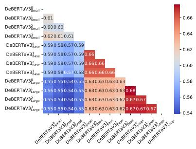
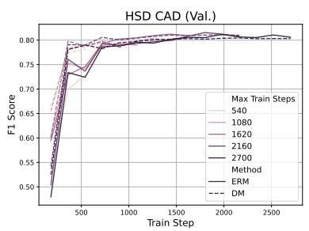
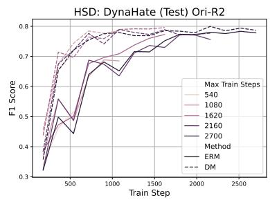
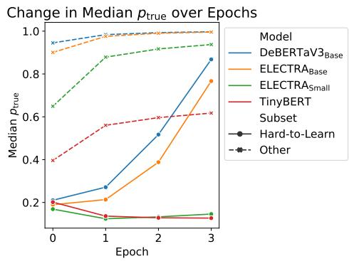
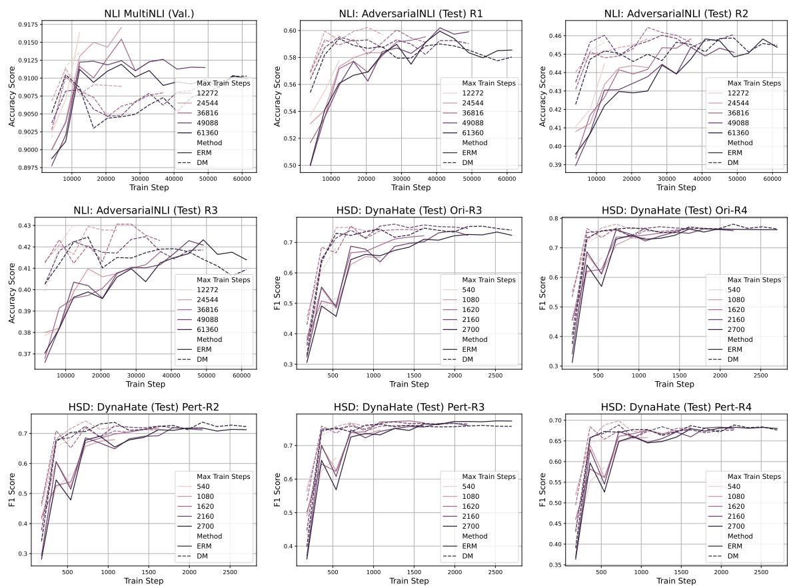

# FTFT: Efficient and Robust Fine-Tuning by Transferring Training Dynamics

Yupei Du, Albert Gatt, and Dong Nguyen Utrecht University Utrecht, the Netherlands {y.du, a.gatt, d.p.nguyen}@uu.nl

## Abstract

Despite the massive success of fine-tuning Pretrained Language Models (PLMs), they remain susceptible to out-of-distribution input. Dataset cartography is a simple yet effective dualmodel approach that improves the robustness of fine-tuned PLMs. It involves fine-tuning a model on the original training set (i.e. reference model), selecting a subset of important training instances based on the training dynamics, and fine-tuning again only on these selected examples (i.e. main model). However, this approach requires fine-tuning the same model twice, which is computationally expensive for large PLMs. In this paper, we show that 1) training dynamics are highly transferable across model sizes and pre-training methods, and that 2) fine-tuning main models using these selected training instances achieves higher training efficiency than empirical risk minimization (ERM). Building on these observations, we propose a novel fine-tuning approach: Fine-Tuning by transFerring Training dynamics (FTFT). Compared with dataset cartography, FTFT uses more efficient reference models and aggressive early stopping. FTFT achieves robustness improvements over ERM while lowering the training cost by up to \~ 50%.1

## 1 Introduction

Despite the success of few-shot and zero-shot learning (Brown et al., 2020), state-of-the-art performance in Natural Language Processing (NLP) is still largely achieved by fine-tuning large Pretrained Language Models (PLMs) (Mosbach et al., 2023). Scaling laws (Kaplan et al., 2020; Hoffmann et al., 2022) suggest that better downstream performance is achieved with larger PLMs. However, fine-tuning large PLMs is also more expensive, in terms of both computational resources and carbon emission (Strubell et al., 2019; Wu et al., 2022).

Moreover, despite impressive progress on regular benchmarks, many studies have shown that fine-tuned PLMs lack robustness against out-ofdistribution (OOD) input. For instance, human annotators can easily exploit the weaknesses of finetuned PLMs to trick these models to yield incorrect predictions, on tasks such as Natural Language Inference (NLI) (Nie et al., 2020) and Hate Speech Detection (HSD) (Vidgen et al., 2021b).

The problem of robustness can be mitigated using dual-model approaches. With such approaches, first a reference model is trained to estimate the importance of each training instance, and then a main model is trained based on the outputs of the reference model (Nam et al., 2020; Utama et al., 2020; Sanh et al., 2021; Karimi Mahabadi et al., 2020; Zhang et al., 2022; Liu et al., 2021). Among these approaches, dataset cartography (Swayamdipta et al., 2020) is especially attractive in view of its simplicity and the consistent improvements in model robustness. It consists of three steps. First, a Data Map (DM) is constructed from the training dynamics (i.e. instance prediction probabilities) of a fine-tuning run of the reference model on the full dataset. This DM divides the training data into three subsets: ambiguous, hard-to-learn, and easy instances. Finally, the main model is finetuned using only either the ambiguous or hard-tolearn subset. An important question has to do with the choice of reference model. Swayamdipta et al. (2020) use the same PLM for both the reference and main model. However, a major drawback of dataset cartography is the high computational cost, because it requires fine-tuning the same model twice. In this paper, we jointly address robustness and efficiency issues without sacrificing the simplicity of dataset cartography, by exploiting the transferability of training dynamics. We make three contributions.

First, we study the following question: Are DMs transferable across different model sizes and pretraining methods? We focus on the novel setting where DMs are constructed based on computationally efficient reference models to ine-tune more capable — and often larger — main models. Our motivation is two-fold: 1) efficient reference models ease the computational burden of constructing DMs, and 2) less capable reference models might be better at identifying ambiguous or hard training instances, because they are less likely to memorize training data (Tirumala et al., 2022; Carlini et al., 2023). Our results show that, in most cases, training dynamics are highly transferable across different model sizes (§4.1) and pretraining methods (§4.2). We further show that the condition for successful transfers is a reasonably strong reference model, which we also make precise in §4.3.

Second, we observe that fine-tuning with selected instances achieves consistently higher training efficiency than conventional fine-tuning (§6).

Third, building on these findings, we propose Fine-Tuning by transFerring Training dynamics (FTFT, §6): an efficient fine-tuning approach that leads to improved OOD performance. Compared to dataset cartography, FTFT uses efficient reference models and early stopping. Experiments on two tasks, NLI and HSD, show that FTFT achieves better performance on OOD input than conventional Empirical Risk Minimization (ERM), while lowering the training cost by up to \~ 50%.

## 2 Background

Dual-Model Approaches for Robustness Many studies have proposed dual-model approaches to improve model robustness that do not require knowledge of identifiable subsets of the data samples, such as NLI pairs in which hypotheses contain a negation (Gururangan et al., 2018), or HSD samples targetting a specific group (Dixon et al., 2018; Park et al., 2018). Nam et al. (2020) first train a reference model using generalized cross-entropy loss, and then train a main model while assigning higher weights to instances that were hard for the reference model. Sanh et al. (2021) use a Productof-Expert (PoE) approach, by first training a reference model with limited capacity to capture dataset biases, and then training the main model to avoid these biases using PoE loss. Liu et al. (2021) propose the Just-Train-Twice approach (JTT), which involves first training a weak reference model using heavy regularization and vanilla SGD, and then upweighing the training instances that the reference model predicts incorrectly when training the main model. Dataset cartography (Swayamdipta et al., 2020) is based on a similar idea, but it uses training dynamics instead of correctness to categorize training instances. We discuss this method below.

Dataset Cartography is a dual-model approach to improve model robustness. First, a reference model is trained on the full training dataset. Then, a Data Map (DM) is built based on the training dynamics, by tracking prediction probabilities of the true class $( \boldsymbol { p } _ { \mathrm { t r u e } } )$ of each training instance across epochs. DM categorizes training instances into three subsets: ambiguous (i.e. the variance of $p _ { \mathrm { t r u e } }$ is in the top $q \%$ of all training instances); hardto-learn (i.e. the mean of $p _ { \mathrm { t r u e } }$ is in the bottom $q \%$ of all training instances); and easy (i.e. neither ambiguous nor hard-to-learn). The threshold $q \%$ is fixed and typically set to 33%. Note that a training instance can be categorized as both hard-tolearn and ambiguous (a low mean but high variance for $p _ { \mathrm { t r u e } } )$ . Finally, the main model is fine-tuned only on the ambiguous or hard-to-learn subset. Swayamdipta et al. (2020) show that, with a slight loss of In-Distribution (ID) performance, dataset cartography improves Out-Of-Distribution (OOD) performance of models. In this paper, we train main models with ambiguous data, since Swayamdipta et al. (2020) reported better performance using this data than hard-to-learn data.

Swayamdipta et al. (2020) use the same PLM as both the reference and the main model. In contrast, Sar-Shalom and Schwartz (2023) show that a DM constructed by EL $\mathrm { \mathbf { . E C T R A _ { L a r g e } } }$ (Clark et al., 2020) can be used to improve the robustness of $\mathrm { D e B E R T a V } 3 _ { \mathrm { L a r g e } }$ (He et al., 2023). However, instead of using only the ambiguous subset, they added k copies of this subset to the original training set to train the main model. Moreover, they did not investigate either DM transfer across model sizes and pretraining methods, or how such transferability can be exploited to improve efficiency.

Model-Based Data Selection/Reweighing Our work is also connected to studies that have selected or reweighed data using reference models to improve in-distribution (ID) performance. Chang et al. (2017) use $p _ { \mathrm { t r u e } }$ variance and proximity to the classification threshold from a reference model to reweigh training instances; Toneva et al. (2019) calculate the frequency of forgetting events (i.e. from a correct to incorrect prediction), and remove the least forgettable instances; Paul et al. (2021) and Baldock et al. (2021) instead use error vector norm and effective prediction depth to estimate the contribution of a training instance.

Previous studies have also explored the use of a smaller reference model to improve efficiency. Coleman et al. (2020) use a small model for active learning and core-set selection. Xie et al. (2023) reweigh domains for language model pretraining, by training a small reference model to estimate the difficulty of each domain.

## 3 Experimental Setup

We perform our experiments on two tasks, Natural Language Inference (NLI) and Hate Speech Detection (HSD). Following Swayamdipta et al. (2020), we select 33% the most ambiguous datapoints.

Data To study model robustness, we include challenging OOD test sets for each task, in addition to the training set and an ID validation set. For NLI, we use the MultiNLI dataset (Williams et al., 2018) as the train and ID validation set, because of its diverse composition, covering 10 genres. We use AdversarialNLI (Nie et al., 2020) as the OOD test set, which consists of three rounds of adversarial data collection. AdversarialNLI is known to be challenging and it targets weaknesses of models trained on MultiNLI.

For HSD, we use CAD (Vidgen et al., 2021a) as the training and ID validation set. CAD consists of Reddit posts covering diverse topics and writing styles, annotated using a fine-grained taxonomy. Following Ramponi and Tonelli (2022), we frame it as a binary classification task, marking identity-related abuse as hateful and other categories as non-hateful. As OOD test sets, we use DynaHate (Vidgen et al., 2021b), since it aligns with CAD's definition of hate speech. DynaHate contains three rounds of adversarial data collection and perturbations.

Models We mainly use DeBERTaV3 (He et al., 2023) and ELECTRA (Clark et al., 2020) in our experiments, due to their strong performance and availability in multiple model sizes. To study the transferability across different pretraining methods, we also use TinyBERT (Turc et al., 2020), BERT (Devlin et al., 2019) and RoBERTa (Liu et al., 2019) as reference models.2 Besides ERM, we include a baseline that uses a random DM (i.e., random $q \%$ of the training data). We perform a search of optimal training steps on ERM, and use the same hyper-parameters for both ERM and data cartography approaches. Full details of the models and training setups are in Appendix A.1.

## 4 Transferability of Training Dynamics

In this section, we study the transferability of training dynamics in dataset cartography, i.e., whether we can use different reference and main models while maintaining the robustness advantage of the main model. Specifically, we study whether training dynamics are transferable across different model sizes (§4.1, e.g., from $\mathrm { D e B E R T a V } 3 _ { \mathrm { S m a l l } }$ to $\mathrm { D e B E R T a V } 3 _ { \mathrm { L a r g e } } )$ and pretraining methods (§4.2, e.g., from $\mathrm { E L E C T R A _ { L a r g e } }$ to $\mathrm { D e B E R T a V } 3 _ { \mathrm { L a r g e } } )$

We focus on these issues for two reasons. First, transferability across model sizes enables using more efficient (and usually less capable) reference models, which (1) can improve training efficiency, and (2) is potentially more effective in identifying ambiguous/hard instances, because they are usually worse at memorizing training instances. Second, transferability across pretraining methods can help achieve these advantages even in cases where more efficient variants of the main pretraining method are unsuitable or unavailable for the task. Moreover, understanding transferability can shed light on data importance: If DMs of different reference models consistently identify the same subset of training instances as ambiguous, it suggests that DMs reveal intrinsic data characteristics.

We define successful transfers as transfers that produce comparable or better OOD performance than ERM. Our results show that, with a few exceptions, training dynamics are indeed transferable. To understand the conditions for successful transfers, we analyze the failure cases (§4.3). We find that the DMs of reference models that lead to successful transfers typically identify a larger subset as easy, which serves as a rough indicator of their capability. This finding can serve as a guideline for choosing reference models without training the main model, which is computationally expensive.

## 4.1 Transferability Across Model Sizes

In this section, we study whether smaller and more efficient models can be used as reference models to construct DMs for training larger main models $( \mathrm { e . g . ~ D e B E R T a V } 3 _ { \mathrm { S m a l l } }$ as the reference model for $\mathrm { D e B E R T a V } 3 _ { \mathrm { L a r g e } } )$ . Levering transferability of this

<table><tr><td rowspan="2">Method</td><td rowspan="2">Main Model</td><td rowspan="2">Ref. Model</td><td rowspan="2">Cost</td><td rowspan="2">MultiNLI</td><td colspan="3">AdversarialNLI (Test)</td></tr><tr><td>R1</td><td>R2</td><td>R3</td></tr><tr><td colspan="7">Baselines: ERM, ERM with Early Stopping, and Random DM</td></tr><tr><td>ERM</td><td> $\mathrm { D e B E R T a V } 3 _ { \mathrm { S m a l l } }$ </td><td></td><td>14.47</td><td> $8 7 . 7 6 _ { 0 . 0 9 }$ </td><td> $3 3 . 2 5 _ { 1 . 6 7 }$ </td><td> $3 0 . 0 7 _ { 0 . 7 1 }$ </td><td> $3 1 . 8 9 _ { 0 . 4 6 }$ </td></tr><tr><td>ERM</td><td> $\mathrm { D e B E R T a V } 3 _ { \mathrm { B a s e } }$ </td><td></td><td>28.29</td><td> $9 0 . 0 3 _ { 0 . 1 4 }$ </td><td> $4 3 . 7 3 _ { 0 . 6 6 }$ </td><td> $3 3 . 9 5 _ { 0 . 5 3 }$ </td><td> $3 3 . 7 9 _ { 1 . 2 0 }$ </td></tr><tr><td>ERM</td><td> $\mathrm { D e B E R T a V } 3 _ { \mathrm { L a r g e } }$ </td><td></td><td>100.00</td><td> $9 1 . 1 5 _ { 0 . 0 8 }$ </td><td> $5 9 . 9 0 _ { 1 . 9 5 }$ </td><td> $4 5 . 1 0 _ { 1 . 3 9 }$ </td><td> $4 2 . 0 8 _ { 0 . 9 5 }$ </td></tr><tr><td>ERM(ES)</td><td> $\mathrm { D e B E R T a V } 3 _ { \mathrm { L a r g e } }$ </td><td></td><td>66.67</td><td> $9 1 . 3 0 _ { 0 . 2 9 }$ </td><td> $5 9 . 2 0 _ { 1 . 2 8 }$ </td><td> $4 4 . 3 5 _ { 1 . 6 6 }$ </td><td> $4 0 . 2 9 \mathrm { _ { 0 . 9 8 } }$ </td></tr><tr><td>DM</td><td> $\mathrm { D e B E R T a V } 3 _ { \mathrm { L a r g e } }$ </td><td>Random</td><td>100.00</td><td> $9 0 . 6 6 _ { 0 . 2 3 }$ </td><td> $5 5 . 0 5 _ { 0 . 7 8 }$ </td><td> $4 3 . 8 3 _ { 0 . 7 2 }$ </td><td> $3 9 . 4 8 _ { 0 . 4 3 }$ </td></tr><tr><td colspan="8">Training Dynamics Transferability: Across Different Model Sizes</td></tr><tr><td>DM</td><td> $\mathrm { D e B E R T a V } 3 _ { \mathrm { L a r g e } }$ </td><td> $\mathrm { D e B E R T a V } 3 _ { \mathrm { L a r g e } }$ </td><td>200.00</td><td> $9 0 . 9 2 _ { 0 . 1 6 }$ </td><td> $5 9 . 0 2 _ { 1 . 9 7 }$ </td><td> $4 6 . 0 8 _ { 2 . 3 7 }$ </td><td> $4 1 . 8 5 _ { 0 . 3 0 }$ </td></tr><tr><td>DM</td><td> $\mathrm { D e B E R T a V } 3 _ { \mathrm { L a r g e } }$ </td><td> $\mathrm { D e B E R T a V } 3 _ { \mathrm { S m a l l } }$ </td><td>114.47</td><td> $9 0 . 7 7 _ { 0 . 1 7 }$ </td><td> $6 0 . 1 0 _ { 1 . 5 8 }$ </td><td> $4 6 . 2 3 _ { 0 . 4 4 }$ </td><td> $4 1 . 4 6 _ { 1 . 0 1 }$ </td></tr><tr><td>DM</td><td> $\mathrm { D e B E R T a V } 3 _ { \mathrm { L a r g e } }$ </td><td> $\mathrm { D e B E R T a V } 3 _ { \mathrm { B a s e } }$ </td><td>128.29</td><td> $9 0 . 6 4 _ { 0 . 2 4 }$ </td><td> $5 9 . 6 7 _ { 1 . 1 9 }$ </td><td> $4 5 . 8 8 _ { 1 . 0 9 }$ </td><td> $4 3 . 0 0 _ { 1 . 5 6 }$ </td></tr><tr><td colspan="8">Training Dynamics Transferability: Across Different Pretraining Methods</td></tr><tr><td>DM</td><td> $\mathrm { D e B E R T a V } 3 _ { \mathrm { L a r g e } }$ </td><td> $\mathrm { E L E C T R A } _ { \mathrm { S m a l l } }$ </td><td>104.61</td><td> $9 0 . 8 4 _ { 0 . 0 3 }$ </td><td> $5 0 . 6 8 _ { 1 . 6 7 }$ </td><td> $3 9 . 9 2 _ { 0 . 5 9 }$ </td><td> $3 7 . 1 0 _ { 0 . 9 4 }$ </td></tr><tr><td>DM</td><td> $\mathrm { D e B E R T a V } 3 _ { \mathrm { L a r g e } }$ </td><td> $\mathrm { E L E C T R A _ { B a s e } }$ </td><td>136.18</td><td> $9 0 . 2 8 _ { 0 . 2 1 }$ </td><td> $6 0 . 7 5 _ { 1 . 0 6 }$ </td><td> $4 7 . 3 0 _ { 0 . 7 4 }$ </td><td> $4 2 . 9 2 _ { 0 . 9 4 }$ </td></tr><tr><td>DM DM</td><td> $\mathrm { D e B E R T a V } 3 _ { \mathrm { L a r g e } }$ </td><td> $\mathrm { R o B E R T a _ { L a r g e } }$ </td><td>216.78 213.49</td><td> $9 0 . 2 6 _ { 0 . 0 6 }$ </td><td> $6 1 . 0 2 _ { 1 . 1 1 }$ </td><td> $4 6 . 8 5 _ { 0 . 5 8 }$ </td><td> $4 2 . 6 5 _ { 0 . 8 9 }$ </td></tr><tr><td></td><td> $\mathrm { D e B E R T a V } 3 _ { \mathrm { L a r g e } }$ </td><td> $\mathrm { B E R T _ { L a r g e } }$ </td><td></td><td> $8 9 . 3 7 _ { 0 . 1 5 }$ </td><td> $6 2 . 0 0 _ { 0 . 9 2 }$ </td><td> $4 8 . 6 0 _ { 0 . 6 5 }$ </td><td> $4 4 . 7 3 \mathrm { _ { 0 . 4 8 } }$ </td></tr><tr><td colspan="8">FTFT: Efficient Reference Models + Aggressive Early Stopping</td></tr><tr><td>FTFT</td><td> $\mathrm { D e B E R T a V } 3 _ { \mathrm { L a r g e } }$ </td><td> $\mathrm { D e B E R T a V } 3 _ { \mathrm { S m a l l } }$ </td><td>51.97</td><td> $9 0 . 7 4 _ { 0 . 1 2 }$ </td><td> $5 9 . 3 8 _ { 1 . 5 6 }$ </td><td> $4 5 . 8 0 _ { 2 . 5 5 }$ </td><td> $4 2 . 3 8 _ { 2 . 3 1 }$ </td></tr><tr><td>FTFT</td><td> $\mathrm { D e B E R T a V } 3 _ { \mathrm { L a r g e } }$ </td><td> $\mathrm { D e B E R T a V } 3 _ { \mathrm { B a s e } }$ </td><td>74.12</td><td> $9 0 . 5 4 _ { 0 . 2 9 }$ </td><td> $5 9 . 8 0 _ { 1 . 8 8 }$ </td><td> $4 5 . 8 5 _ { 1 . 4 8 }$ </td><td> $4 2 . 3 9 _ { 1 . 2 5 }$ </td></tr><tr><td>FTFT</td><td> $\mathrm { D e B E R T a V } 3 _ { \mathrm { L a r g e } }$ </td><td> $\mathrm { E L E C T R A _ { B a s e } }$ </td><td>79.93</td><td> $9 0 . 0 3 _ { 0 . 5 7 }$ </td><td> $6 0 . 7 5 _ { 1 . 3 3 }$ </td><td> $4 7 . 3 5 _ { 2 . 2 8 }$ </td><td> $4 4 . 1 7 _ { 0 . 8 2 }$ </td></tr></table>

Table 1: Our results with DeBERTaV3 as the main model on NLI (measured by accuracy scores), which consist of four parts: (1) Baselines: DeBERTaV3 of different sizes trained using ERM, $\mathrm { D e B E R T a V } 3 _ { \mathrm { L a r g e } }$ trained using ERM with early stopping (ERM(ES)), and $\mathrm { D e B E R T a V } 3 _ { \mathrm { L a r g e } }$ trained using random DM (random 33% of the training data); (2) Training dynamics transferability across different sizes: training $\mathrm { D e B E R T a V } 3 _ { \mathrm { L a r g e } }$ as the main model, using DMs constructed by different sizes of DeBERTaV3 as reference models; (3) Training dynamics transferability across different pretraining methods: training $\mathrm { D e B E R T a V } 3 _ { \mathrm { L a r g e } }$ as the main model, using DMs constructed by different pretraining methods as reference models (ELECTR $\mathrm { \Delta A _ { S m a l l / B a s e } }$ , BERT, and RoBERTa); (4) FTFT (§6): training $\mathrm { D e B E R T a V } 3 _ { \mathrm { L a r g e } }$ using our approach FTFT (§6), with DMs constructed by different reference models, as well as aggressive early stopping. R1–R3 in AdversarialNLI refer to different rounds of data collection. Cost column contains the relative computational cost of each method, compared to training $\mathrm { D e B E R T a V } 3 _ { \mathrm { L a r g e } }$ using ERM. For example, the compute of $\mathrm { D e B E R T a V } 3 _ { \mathrm { B a s e } }$ with ERM is 28.29, meaning its compute costs are 28.29% of training $\mathrm { D e B E R T a V } 3 _ { \mathrm { L a r g e } }$ using ERM. We observe that: (1) Training dynamics are transferrable across different sizes and pretraining methods, as constructing DMs using different reference models results in comparable performance; (2) FTFT achieves robustness improvements over ERM, while lowering the training cost by up $\mathrm { t o } \sim 5 0 \%$

  
(a) Consistency across different sizes  
(b) CAD

  
(c) DynaHate  
Figure 1: Figure 1a: Consistency across different sizes of DeBERTaV3 on NLI. The numbers are the percentages (0–1) of ambiguous training instances shared by two models. Training dynamics are transferable across different model sizes: the percentages between models of different sizes are only slightly smaller than those between models of different random seeds (shown as superscript). Figures 1b & 1c: Performance on HSD when training the main model $\mathrm { ( D e B E R T a V } 3 _ { \mathrm { L a r g e } } \mathrm { ) }$ using different numbers of training steps. We experimented with different lengths of training (max training steps), and different methods (using ERM and DM). Training with data instances selected by DMs achieves consistently higher training speed than ERM: for datasets on which training with DM achieves either better (OOD datasets, right) or worse (ID datasets, left) performance, models trained with DM outperform ERM with fewer training steps (i.e. the early stage of training, the leftmost part of the x-axis).

type can improve the efficiency of dataset cartography by reducing the cost of constructing DMs.

The results for DeBERTaV3 are shown in Table 1 under section across different model sizes (NLI) and Table 5 (HSD, Appendix B). Training dynamics are transferable across different model sizes: when using $\mathrm { D e B E R T a V } 3 _ { \mathrm { L a r g e } }$ as the main model, changing the reference model to either $\mathrm { D e B E R T a V } 3 _ { \mathrm { S m a l l } }$ or $\mathrm { D e B E R T a V } 3 _ { \mathrm { B a s e } }$ yields comparable or even better performance. This observation is consistent with our hypothesis that efficient models are more sensitive to ambiguous and difficult instances. As a result, they can serve as alternative efficient reference models. We also observe that, consistent with Swayamdipta et al. (2020), ERM achieves better ID performance (in the baselines section of Table 1), while data cartography performs comparably or better on OOD data. Note that hyper-parameters are tuned for ERM performance (see Appendix A.1), making the training setup more favorable overall to ERM.

To investigate transferability of DMs further, we analyze whether reference models of different sizes identify similar groups of ambiguous instances. Figure 1a shows the percentage of ambiguous instances shared by reference models of different sizes and random seeds. The percentages shared between different model sizes are only slightly smaller than those between the same size but different random seeds, providing further evidence for the transferability of $\mathrm { D M s } . ^ { 3 }$

## 4.2 Transferability Across Pretraining Methods

We now study the transferability of training dynamics across different pretraining methods. Successful transfers of this type enable the use of efficient reference models, when there is no efficient version of the main model that suits the downstream task.

The results for $\mathrm { D e B E R T a V } 3 _ { \mathrm { L a r g e } }$ as the main model with different reference models are shown in Table 1 under section across different pretraining methods (NLI) and Table 5 (HSD, Appendix B). Training dynamics are generally transferable across different pretraining methods: $\mathrm { D e B E R T a V } 3 _ { \mathrm { L a r g e } }$ achieves comparable performance using DMs constructed by different reference models in most cases. However, there is one exception: when using ELECTR $\mathrm { A s } _ { \mathrm { m a l l } }$ as the reference model, the performance is clearly worse on the NLI OOD datasets than when using ERM. We hypothesize that $\mathrm { E L E C T R A } _ { \mathrm { S m a l l } }$ is not strong enough for constructing effective DMs. We analyze this hypothesis further in §4.3 below.

## 4.3 When Do Transfers Fail?

We have shown that training dynamics are usually transferable across different model sizes and pretraining methods. We now study the conditions for successful transfers, by zooming in on two questions: 1) Can we use efficient but weak models as reference models? and 2) What are the differences between effective and ineffective reference models? Answers to these questions can guide the selection of efficient yet effective reference models.

Can we use efficient but weak models as reference models? To answer this question, we compare the performance of a wide range of methods, see Table 2 (NLI) and Table 6 (HSD, in Appendix B). We include models from three categories: First, a wide range of seven models trained using ERM (section ERM Performance): Tiny-BERT, the small and base versions of DeBERTaV3 and ELECTRA, $\mathrm { R o B E R T a _ { L a r g e } }$ , and ${ \mathrm { B E R T } } _ { \mathrm { L a r g e } } .$ Second, we use these ERM models as reference models to construct DMs, and use these DMs to fine-tune $\mathrm { D e B E R T a V } 3 _ { \mathrm { L a r g e } }$ (section When Do Transfers Fail, first half). By using reference models with different sizes and pretraining methods to fine-tune the same main model, we can inspect the impact of reference model capability on transferability. Third, we also include the results of using ELECTR $\mathrm { \bf A _ { \mathrm { L a r g e } } }$ as the main model (section When Do Transfers Fail, second half). By comparing results from different main models, we can better understand whether successful transfers originate from the compatibility between reference and main models, or the capability of the reference model itself. We make three observations.

First, weak reference models with poor ID performance, i.e., TinyBERT and ELECTR $\mathbf { A } _ { \mathrm { S m a l l } }$ lead to unsuccessful transfers. However, the reference models do not need to be as capable as the main model: slightly weaker reference models could be more useful, indicated by the strong OOD performance when using $\mathrm { B E R T _ { L a r g e } }$ as the reference model. Moreover, in these unsuccessful transfers, the main model OOD performance correlates with the reference model ID performance. For example, on NLI, TinyBERT has a lower ID performance than $\mathrm { E L E C T R A } _ { \mathrm { S m a l l } }$ , and both main models $\mathrm { D e B E R T a V } 3 _ { \mathrm { L a r g e } }$ and ELECTR $\mathbf { A } _ { \mathrm { L a r g e } }$ have a lower OOD performance when using TinyBERT as the reference model compared to when using ELECTR $\mathrm { A s m a l l }$ as the reference model.

ERM Performance: Capabilities of Various Models
<table><tr><td>Method Main Model</td><td>Ref. Model</td><td>Compute</td><td>MultiNLI (Val.)</td><td>AdversarialNLI (Test) R1 R2</td><td>R3</td></tr></table>

<table><tr><td>ERM ERM</td><td> $\mathrm { T i n y B E R T }$   $\mathrm { E L E C T R A } _ { \mathrm { S m a l l } }$ </td><td></td><td>1.45 4.61</td><td> $6 7 . 2 9 \mathrm { _ 0 . 2 6 }$  一  $8 2 . 0 8 _ { 0 . 0 9 }$ </td><td> $2 3 . 5 0 _ { 0 . 8 2 }$   $2 3 . 8 2 _ { 0 . 7 5 }$ </td><td> $2 8 . 3 0 _ { 0 . 3 6 }$   $2 8 . 9 3 _ { 1 . 1 6 }$ </td><td> $3 0 . 6 9 _ { 0 . 4 2 }$   $3 0 . 5 4 _ { 0 . 7 0 }$ </td></tr><tr><td>ERM</td><td> $\overline { { \mathrm { E L E C T R A _ { B a s e } } } }$ </td><td></td><td>36.18</td><td> $8 8 . 4 7 _ { 0 . 2 0 }$ </td><td> $3 5 . 4 5 _ { 0 . 2 4 }$ </td><td> $3 0 . 9 5 _ { 0 . 4 2 }$ </td><td> $3 1 . 2 7 _ { 0 . 6 8 }$ </td></tr><tr><td>ERM</td><td> $\mathrm { D e B E R T a V } 3 _ { \mathrm { S m a l l } }$ </td><td></td><td>14.47</td><td> $8 7 . 7 6 _ { 0 . 0 9 }$ </td><td> $3 3 . 2 5 _ { 1 . 5 5 }$ </td><td> $3 0 . 0 7 _ { 0 . 6 6 }$ </td><td> $3 1 . 8 9 _ { 0 . 4 3 }$ </td></tr><tr><td>ERM</td><td> $\mathrm { D e B E R T a V } 3 _ { \mathrm { B a s e } }$ </td><td></td><td>28.29</td><td> $9 0 . 0 3 _ { 0 . 1 3 }$ </td><td> $4 3 . 7 3 _ { 0 . 6 1 }$ </td><td> $3 3 . 9 5 _ { 0 . 4 9 }$ </td><td> $3 3 . 7 9 _ { 1 . 1 1 }$ </td></tr><tr><td>ERM</td><td> $\mathrm { B E R T _ { L a r g e } }$ </td><td></td><td>113.49</td><td> $8 6 . 2 5 \mathrm { _ 0 . 2 6 }$ </td><td> $2 0 . 1 2 _ { 0 . 8 5 }$ </td><td> $2 9 . 0 5 _ { 1 . 0 2 }$ </td><td> $2 9 . 8 9 _ { 0 . 5 7 }$ </td></tr><tr><td>ERM</td><td> $\mathrm { R o B E R T a _ { L a r g e } }$ </td><td></td><td>116.78</td><td> $8 9 . 8 6 _ { 0 . 0 9 }$ </td><td> $4 3 . 8 5 _ { 0 . 6 4 }$ </td><td> $2 8 . 5 5 _ { 1 . 0 7 }$ </td><td> $2 6 . 0 0 _ { 1 . 0 4 }$ </td></tr></table>

When Do Transfers Fail: Using Reference Models with Different Capabilities
<table><tr><td>DM DM</td><td> $\mathrm { D e B E R T a V } 3 _ { \mathrm { L a r g e } }$   $\mathrm { D e B E R T a V } 3 _ { \mathrm { L a r g e } }$ </td><td> $\mathrm { T i n y B E R T }$   $\mathrm { E L E C T R A } _ { \mathrm { S m a l l } }$ </td><td>101.45 104.61</td><td> $8 9 . 2 6 _ { 0 . 1 6 }$  1  $9 0 . 8 4 _ { 0 . 0 3 }$ </td><td> $4 2 . 4 7 _ { 0 . 8 7 }$   $5 0 . 6 8 _ { 1 . 5 5 }$ </td><td> $3 4 . 3 8 _ { 0 . 6 6 }$   $3 9 . 9 2 _ { 0 . 5 5 }$ </td><td> $3 3 . 5 6 _ { 0 . 5 2 }$   $3 7 . 1 0 _ { 0 . 8 7 }$ </td></tr><tr><td>DM</td><td> $\overline { { \mathrm { D e B E R T a V } 3 _ { \mathrm { L a r g e } } } }$ </td><td> $\overline { { \mathrm { E L E C T R A _ { B a s e } } } }$ </td><td>136.18</td><td> $9 0 . 2 8 _ { 0 . 1 9 }$ </td><td> $6 0 . 7 5 \mathrm { _ { 0 . 9 8 } }$ </td><td> $4 7 . 3 0 _ { 0 . 6 8 }$ </td><td> $4 2 . 9 2 _ { 0 . 8 7 }$ </td></tr><tr><td>DM</td><td> $\mathrm { D e B E R T a V } 3 _ { \mathrm { L a r g e } }$ </td><td> $\mathrm { D e B E R T a V } 3 _ { \mathrm { S m a l l } }$ </td><td>114.47</td><td> $9 0 . 7 7 _ { 0 . 1 6 }$ </td><td> $6 0 . 1 0 _ { 1 . 4 6 }$ </td><td> $4 6 . 2 3 \phantom { 0 0 0 } . 4 1$ </td><td> $4 1 . 4 6 _ { 0 . 9 4 }$ </td></tr><tr><td>DM</td><td> $\mathrm { D e B E R T a V } 3 _ { \mathrm { L a r g e } }$ </td><td> $\mathrm { D e B E R T a V } 3 _ { \mathrm { B a s e } }$ </td><td>128.29</td><td> $9 0 . 6 4 _ { 0 . 2 2 }$ </td><td> $5 9 . 6 7 _ { 1 . 1 0 }$ </td><td> $4 5 . 8 8 _ { 1 . 0 1 }$ </td><td> $4 3 . 0 0 _ { 1 . 4 4 }$ </td></tr><tr><td>DM</td><td> $\mathrm { D e B E R T a V } 3 _ { \mathrm { L a r g e } }$ </td><td> $\mathrm { B E R T _ { L a r g e } }$ </td><td>213.49</td><td> $8 9 . 3 7 _ { 0 . 1 5 }$ </td><td> $6 2 . 0 0 _ { 0 . 9 2 }$ </td><td> $4 8 . 6 0 _ { 0 . 6 5 }$ </td><td> $4 4 . 7 3 _ { 0 . 4 8 }$ </td></tr><tr><td>DM</td><td> $\mathrm { D e B E R T a V } 3 _ { \mathrm { L a r g e } }$ </td><td> $\mathrm { R o B E R T a _ { L a r g e } }$ </td><td>216.78</td><td> $9 0 . 2 6 _ { 0 . 0 6 }$ </td><td> $6 1 . 0 2 _ { 1 . 0 3 }$ </td><td> $4 6 . 8 5 _ { 0 . 5 4 }$ </td><td> $4 2 . 6 5 _ { 0 . 8 3 }$ </td></tr><tr><td>DM</td><td> $\mathrm { E L E C T R A _ { L a r g e } }$ </td><td> $\mathrm { T i n y B E R T }$ </td><td>111.64</td><td> $8 8 . 3 0 _ { 0 . 2 2 }$ </td><td> $3 5 . 3 7 _ { 0 . 3 1 }$  </td><td> $3 2 . 6 0 _ { 1 . 2 5 }$ </td><td> $3 0 . 7 8 _ { 0 . 6 4 }$ </td></tr><tr><td>DM</td><td> $\mathrm { E L E C T R A _ { L a r g e } }$ </td><td> $\mathrm { E L E C T R A } _ { \mathrm { S m a l l } }$ </td><td>114.80</td><td>一  $9 0 . 3 5 _ { 0 . 1 9 }$ </td><td> $4 5 . 3 8 _ { 0 . 6 7 }$ </td><td> $3 4 . 9 5 _ { 0 . 9 0 }$ </td><td> $3 2 . 5 8 _ { 1 . 1 6 }$ </td></tr><tr><td>DM</td><td> $\overline { { \mathrm { E L E C T R A _ { L a r g e } } } }$ </td><td> $\overline { { \mathrm { E L E C T R A _ { B a s e } } } }$ </td><td>146.38</td><td> $8 9 . 9 6 _ { 0 . 2 0 }$ </td><td> $5 5 . 4 0 _ { 0 . 2 8 }$ </td><td> $\overline { { 4 2 . 0 0 _ { 0 . 4 2 } } }$ </td><td> $3 6 . 7 1 _ { 0 . 6 5 }$ </td></tr><tr><td>DM</td><td> $\mathrm { E L E C T R A _ { L a r g e } }$ </td><td> $\mathrm { D e B E R T a V } 3 _ { \mathrm { S m a l l } }$ </td><td>124.67</td><td> $9 0 . 2 7 _ { 0 . 1 3 }$ </td><td> $5 4 . 2 0 _ { 0 . 5 7 }$ </td><td> $4 0 . 0 0 _ { 1 . 1 3 }$ </td><td> $3 6 . 8 8 _ { 0 . 0 6 }$ </td></tr><tr><td>DM</td><td> $\mathrm { E L E C T R A _ { L a r g e } }$ </td><td> $\mathrm { D e B E R T a V } 3 _ { \mathrm { B a s e } }$ </td><td>138.49</td><td> $8 9 . 9 4 _ { 0 . 1 4 }$ </td><td> $5 3 . 6 3 _ { 0 . 8 0 }$ </td><td> $4 1 . 3 3 _ { 0 . 5 1 }$ </td><td> $3 6 . 3 3 _ { 0 . 2 5 }$ </td></tr><tr><td>DM</td><td> $\mathrm { E L E C T R A _ { L a r g e } }$ </td><td> $\mathrm { B E R T _ { L a r g e } }$ </td><td>223.68</td><td> $8 8 . 8 3 _ { 0 . 1 2 }$ </td><td> $5 7 . 1 0 _ { 0 . 7 9 }$ </td><td> $4 3 . 2 7 _ { 0 . 8 4 }$ </td><td> $3 8 . 7 2 _ { 0 . 3 1 }$ </td></tr><tr><td>DM</td><td> $\mathrm { E L E C T R A _ { L a r g e } }$ </td><td> $\mathrm { R o B E R T a _ { L a r g e } }$ </td><td>226.97</td><td> $8 9 . 6 2 _ { 0 . 1 3 }$ </td><td> $5 4 . 2 0 _ { 0 . 5 7 }$ </td><td> $4 2 . 5 5 _ { 0 . 7 8 }$ </td><td> $3 7 . 2 9 _ { 0 . 6 5 }$ </td></tr></table>

Table 2: We use reference models with different capabilities (measured by their ERM accuracy) to construct DMs, and use them to train main models. The gray-shaded rows are (1) the main models in unsuccessful transfers and (2) their corresponding reference models. Successful transfer requires the reference model to be reasonably strong: reference models with clearly worse ID performance lead to degraded OOD performance for the main models.

Second, whether a transfer is successful or not depends mostly on the reference model, rather than the compatibility between the reference and the main models: The transfers from TinyBERT and $\mathrm { E L E C T R A } _ { \mathrm { S m a l l } }$ to both main models are unsuccessful, and the transfers from other reference models to both main models are successful.⁴

While easy instances can be sufficient for obtaining satisfactory ID performance, they are insufficient for good OOD performance (Swayamdipta et al., 2020). We discuss this in detail below.

Third, interestingly, ID performance in all transfers remains high. In other words, ineffective reference models only impact the OOD performance of the main models. For instance, the transfer from $\mathrm { E L E C T R A } _ { \mathrm { S m a l l } }$ to $\mathrm { D e B E R T a V } 3 _ { \mathrm { L a r g e } }$ yields the best accuracy on MultiNLI despite its OOD performance being relatively poor. We suspect that weak models with poor ID performance often identify easy training instances as ambiguous data.

  
Figure 2: Change of median $p _ { \mathrm { t r u e } } \colon$ ineffective reference models $( \mathrm { E L E C T R A } _ { \mathrm { S m a l l } }$ and TinyBERT) are unable to fit difficult training instances, making easy instances being identified as ambiguous.

What are the differences between effective and ineffective reference models? To answer this question, we consider the possible differences between a weak (and ineffective) reference model and a reasonably strong reference model, in terms of categorizing training data into ambiguous, hardto-learn, and easy subsets. Also, we assume that instances in our training set exhibit varying levels of difficulty (i.e. simple to difficult).

Assume we have a weak reference model that can learn simpler training instances but cannot learn the more difficult ones. This weak reference model will therefore assign increasing $p _ { \mathrm { t r u e } }$ to simple training instances across different epochs, while keeping $p _ { \mathrm { t r u e } }$ for difficult training instances around the values expected in a random guessing scenario. Consequently, $p _ { \mathrm { t r u e } }$ will exhibit high standard deviations on simpler training instances, which will then be identified as ambiguous data; while more difficult training instances will have consistent lower mean values and thus low standard deviations for $p _ { \mathrm { t r u e } }$ , and therefore be identified as hard-to-learn data. In contrast, a reasonably capable reference model can learn simpler training instances during the early stage of training (even before their first occurrence in the training batch, i.e., their correct predictions are learned from other training instances). Therefore, these instances will have both high mean values and low standard deviations for $p _ { \mathrm { t r u e } }$ . Meanwhile, $p _ { \mathrm { t r u e } }$ for difficult instances will gradually increase across epochs, making these instances yield relatively low mean values and high standard deviations for $p _ { \mathrm { t r u e } }$ . As a result, these instances will be identified as both ambiguous and hard-to-learn (i.e. we expect a large overlap in these subsets). Because we select a fixed percentage $q \%$ of instances as ambiguous or hard-to-learn, this larger overlap means a larger easy subset too.

We now validate our reasoning. Given a reference model, we first split the training instances into two subsets based on mean $p _ { \mathrm { t r u e } } \colon$ hard-tolearn (10% of training instances) and other (the remaining 90%). We use a lower $q \%$ to make the difference clearer. Then, for each subset, we calculate the median $p _ { \mathrm { t r u e } }$ in each epoch. We use median values because they are robust statistics of the central tendency. Figure 2 shows our results on MultiNLI, using two effective $( \mathrm { D e B E R T a V } 3 _ { \mathrm { B a s e } }$ and ELECTR $\mathrm { \bf A _ { B a s e } ) }$ and two ineffective (ELECTR $\mathrm { A s } _ { \mathrm { m a l l } }$ and TinyBERT) reference models. We only include four models to make the figure clearer — we observe similar trends for other models: With effective reference models, hard-to-learn instances are gradually learned during training, while other instances already have high $p _ { \mathrm { t r u e } }$ values from the first epoch. In contrast, with ineffective reference models, hard-to-learn data instances are not learned at all, suggested by their close-to-zero $p _ { \mathrm { t r u e } }$ over different epochs; while other instances are gradually fitted, indicated by their increasing values.

To further validate our reasoning, we compute the percentages of training instances identified as easy by different reference models (Table 4 in Appendix B): We report results with $q \in \{ 1 0 \% , 2 5 \% , 3 3 \% , 5 0 \% \}$ . Less effective reference models indeed identify fewer data points as easy. For example, on NLI with $q \% = 5 0 \%$ , Tiny-BERT identifies less than 20.0% of the instances as easy, compared to 46.65% by $\mathrm { D e B E R T a V } 3 _ { \mathrm { B a s e } } .$ Furthermore, the overlap between hard-to-learn and ambiguous instances in successful transfers is usually high. For example, with $q \% = 5 0 \%$ all effective reference models identify more than 46% as easy training instances (the maximum is 50%, when the ambiguous and hard-to-learn subsets overlap perfectly).

## 5 Training Speed Gains From Data Selection

Our results from §4 suggest that the efficiency of dataset cartography can be improved with more efficient reference models. However, if we train the main models for the same number of steps as ERM, the computational cost of the full pipeline is still higher than conventional fine-tuning (i.e., ERM), because of the extra reference model training cost.

Previous studies have shown that training with a careful selection of “informative" training instances can lead to higher training speed than ERM (i.e. achieving the same performance with fewer training steps), despite the computational cost of selecting these instances being notoriously high (Sorscher et al., 2022; Feldman and Zhang, 2020; Paul et al., 2021; Toneva et al., 2019). Motivated by this, we now study whether we can achieve similar learning speed gains by training on instances selected by DMs. If such gains exist, we can further improve the efficiency of dataset cartography by training with fewer steps.

We show the performance of $\mathrm { D e B E R T a V } 3 _ { \mathrm { L a r g e } }$ on HSD, fine-tuned using the full training set (ERM) and using only the instances selected by DMs, across different training durations (i.e. max training steps) in Figure 1. Results on other datasets are in Appendix B, where we observe similar trends. We make three observations. First, when the number of training steps is reduced, models fine-tuned with dataset cartography clearly outperform those fine-tuned with ERM, even on ID validation data where ERM achieves better performance with more training steps. Second, dataset cartography often yields better results with fewer training steps than with more, suggesting a tendency of overfitting at the late training stage. Third, the efficiency gains hold consistently across different training durations. Our observations indicate that training with data instances selected by DMs consistently achieves higher training speed than ERM.

## 6 Our Approach: FTFT

Building on our insights presented in the previous sections, we propose a novel fine-tuning approach based on dataset cartography (Swayamdipta et al., 2020), Fine-Tuning by transFerring Training dynamics (FTFT). Compared with the original dataset cartography approach, FTFT integrates two crucial improvements: (1) using more efficient reference models, which not only result in comparable DMs but also enhance efficiency, and (2) implementing aggressive early stopping during the main model training. Such aggressive early stopping is possible because models trained with data instances selected using DMs already achieve strong performance with substantially fewer training steps (§5). In summary, FTFT consists of three steps: (1) train an efficient reference model on the full dataset, (2) compute the ambiguity of each instance based on the standard deviation of the correct class probability across epochs, and (3) select the top q% most ambiguous instances to retrain a larger main model, while applying aggressive early stopping.

We show our results on NLI in Table 1 (FTFT) and on HSD in Table 5 (Appendix B). We use an early stopping patience k = 2 (i.e. the number of checkpoints without improvement before stopping), based on the average dev set performance on the OOD datasets. We use a relatively small k, as stopping the training earlier will lead to higher efficiency. We also show the computational cost of each method (Compute), in which we have taken the training of both the reference model and the main model into account, including the k extra checkpoints after the best performance is achieved.

We have three key observations. First, FTFT achieves consistent robustness improvements over ERM, indicated by its strong performance on most OOD datasets (note again that the hyper-parameters are optimized for ERM). We also include the results of ERM with early stopping (ERM(ES)) as a baseline to illustrate that our aggressive early stopping strategy is only effective when training with data instances selected by DMs: ERM(ES) achieves worse performance than ERM on all OOD datasets. Second, FTFT substantially improves the training efficiency of models. For example, on NLI, training $\mathrm { D e B E R T a V } 3 _ { \mathrm { L a r g e } }$ using FTFT and $\mathrm { D e B E R T a V } 3 _ { \mathrm { S m a l l } }$ as the reference model only costs 51.57% of ERM's training cost, which is equivalent to 25.78% of the training cost of the original dataset cartography approach. Third, our early stopping strategy is effectively aggressive. Specifically, all FTFT results in Table 1 are achieved using less than 1/3 of the optimal training steps needed for ERM.

## 7 Conclusion

Fine-tuned PLMs have shown to be vulnerable to OOD input. Although dataset cartography can improve model robustness (Swayamdipta et al. 2020; Sar-Shalom and Schwartz, 2023), it is computationally expensive. In this paper, we have presented FTFT, a novel approach for fine-tuning PLMs which yields both better efficiency and better robustness over ERM (§6). FTFT is built on dataset cartography, based on two observations: (1) reference model training dynamics are highly transferable across different model sizes (§4.1) and pretraining methods (§4.2), and (2) main models trained using data instances selected using DMs learn faster (i.e. they have substantially better performance with reduced number of training steps). We believe that FTFT will be an important tool for future researchers and practitioners to perform efficient model fine-tuning, especially in situations where robustness is essential.

## 8 Limitations

We identify three limitations from this work. These limitations open up promising directions for future research. First, we have observed that effective reference models identify more instances as easy. More controlled experiments are needed to build a detailed protocol for choosing efficient but strong enough reference models. Our results provide a good foundation for such further work. Second, we have empirically demonstrated the transferability of training dynamics to select training instances. Future studies are needed to build the theoretical foundations of both data cartography itself and the feasibility of such transfers. Third, we have only developed FTFT for classification tasks. Future studies should extend FTFT to generation tasks, e.g., instruction following and language modeling.

## Acknowledgments

We thank the anonymous reviewers for their helpful feedback. This work used the Dutch national e-infrastructure with the support of the SURF Cooperative using grants no. EINF-10999 and EINF-5693.

## References

Robert John Nicholas Baldock, Hartmut Maennel, and Behnam Neyshabur. 2021. Deep learning through the lens of example difficulty. In Advances in Neural Information Processing Systems.

Tom Brown, Benjamin Mann, Nick Ryder, Melanie Subbiah, Jared D Kaplan, Prafulla Dhariwal, Arvind Neelakantan, Pranav Shyam, Girish Sastry, Amanda Askell, Sandhini Agarwal, Ariel Herbert-Voss, Gretchen Krueger, Tom Henighan, Rewon Child, Aditya Ramesh, Daniel Ziegler, Jeffrey Wu, Clemens Winter, Chris Hesse, Mark Chen, Eric Sigler, Mateusz Litwin, Scott Gray, Benjamin Chess, Jack Clark, Christopher Berner, Sam McCandlish, Alec Radford, Ilya Sutskever, and Dario Amodei. 2020. Language models are few-shot learners. In Advances in Neural Information Processing Systems, volume 33, pages 1877–1901. Curran Associates, Inc.

Nicholas Carlini, Daphne Ippolito, Matthew Jagielski, Katherine Lee, Florian Tramer, and Chiyuan Zhang. 2023. Quantifying memorization across neural language models. In The Eleventh International Conference on Learning Representations.

Haw-Shiuan Chang, Erik Learned-Miller, and Andrew McCallum. 2017. Active bias: Training more accurate neural networks by emphasizing high variance samples. In Advances in Neural Information Processing Systems, volume 30. Curran Associates, Inc.

Kevin Clark, Minh-Thang Luong, Quoc V. Le, and Christopher D. Manning. 2020. ELECTRA: Pretraining text encoders as discriminators rather than generators. In ICLR.

Cody Coleman, Christopher Yeh, Stephen Mussmann, Baharan Mirzasoleiman, Peter Bailis, Percy Liang, Jure Leskovec, and Matei Zaharia. 2020. Selection via proxy: Efficient data selection for deep learning. In International Conference on Learning Representations.

Jacob Devlin, Ming-Wei Chang, Kenton Lee, and Kristina Toutanova. 2019. BERT: Pre-training of deep bidirectional transformers for language understanding. In Proceedings of the 2019 Conference of

the North American Chapter of the Association for Computational Linguistics: Human Language Technologies, Volume 1 (Long and Short Papers), pages 4171–4186, Minneapolis, Minnesota. Association for Computational Linguistics.

Lucas Dixon, John Li, Jeffrey Sorensen, Nithum Thain, and Lucy Vasserman. 2018. Measuring and mitigating unintended bias in text classification. In Proceedings of the 2018 AAAI/ACM Conference on AI, Ethics, and Society, AIES '18, page 67–73, New York, NY, USA. Association for Computing Machinery.

Yupei Du and Dong Nguyen. 2023. Measuring the instability of fine-tuning. In Proceedings of the 61st Annual Meeting of the Association for Computational Linguistics (Volume 1: Long Papers), pages 6209– 6230, Toronto, Canada. Association for Computational Linguistics.

Vitaly Feldman and Chiyuan Zhang. 2020. What neural networks memorize and why: Discovering the long tail via influence estimation. In Advances in Neural Information Processing Systems, volume 33, pages 2881–2891. Curran Associates, Inc.

Suchin Gururangan, Swabha Swayamdipta, Omer Levy, Roy Schwartz, Samuel Bowman, and Noah A. Smith. 2018. Annotation artifacts in natural language inference data. In Proceedings of the 2018 Conference of the North American Chapter of the Association for Computational Linguistics: Human Language Technologies, Volume 2 (Short Papers), pages 107–112, New Orleans, Louisiana. Association for Computational Linguistics.

Pengcheng He, Jianfeng Gao, and Weizhu Chen. 2023. DeBERTav3: Improving deBERTa using ELECTRAstyle pre-training with gradient-disentangled embedding sharing. In The Eleventh International Conference on Learning Representations.

Jordan Hoffmann, Sebastian Borgeaud, Arthur Mensch, Elena Buchatskaya, Trevor Cai, Eliza Rutherford, Diego de Las Casas, Lisa Anne Hendricks, Johannes Welbl, Aidan Clark, et al. 2022. Training compute-optimal large language models. arXiv preprint arXiv:2203.15556.

Jared Kaplan, Sam McCandlish, Tom Henighan, Tom B Brown, Benjamin Chess, Rewon Child, Scott Gray, Alec Radford, Jeffrey Wu, and Dario Amodei. 2020 Scaling laws for neural language models. arXiv preprint arXiv:2001.08361.

Rabeeh Karimi Mahabadi, Yonatan Belinkov, and James Henderson. 2020. End-to-end bias mitigation by modelling biases in corpora. In Proceedings of the 58th Annual Meeting of the Association for Computational Linguistics, pages 8706–8716, Online. Association for Computational Linguistics.

Quentin Lhoest, Albert Villanova del Moral, Yacine Jernite, Abhishek Thakur, Patrick von Platen, Suraj Patil, Julien Chaumond, Mariama Drame, Julien Plu,

Lewis Tunstall, Joe Davison, Mario Šaško, Gunjan Chhablani, Bhavitvya Malik, Simon Brandeis, Teven Le Scao, Victor Sanh, Canwen Xu, Nicolas Patry, Angelina McMillan-Major, Philipp Schmid, Sylvain Gugger, Clément Delangue, Théo Matussière, Lysandre Debut, Stas Bekman, Pierric Cistac, Thibault Goehringer, Victor Mustar, François Lagunas, Alexander Rush, and Thomas Wolf. 2021. Datasets: A community library for natural language processing. In Proceedings of the 2021 Conference on Empirical Methods in Natural Language Processing: System Demonstrations, pages 175–184, Online and Punta Cana, Dominican Republic. Association for Computational Linguistics.

Evan Z Liu, Behzad Haghgoo, Annie S Chen, Aditi Raghunathan, Pang Wei Koh, Shiori Sagawa, Percy Liang, and Chelsea Finn. 2021. Just train twice: Improving group robustness without training group information. In Proceedings of the 38th International Conference on Machine Learning, volume 139 of Proceedings of Machine Learning Research, pages 6781–6792. PMLR.

Yinhan Liu, Myle Ott, Naman Goyal, Jingfei Du, Mandar Joshi, Danqi Chen, Omer Levy, Mike Lewis, Luke Zettlemoyer, and Veselin Stoyanov. 2019. Roberta: A robustly optimized bert pretraining approach. arXiv preprint arXiv:1907.11692.

Ilya Loshchilov and Frank Hutter. 2019. Decoupled weight decay regularization. In International Conference on Learning Representations.

Marius Mosbach, Maksym Andriushchenko, and Dietrich Klakow. 2021. On the stability of fine-tuning BERT: Misconceptions, explanations, and strong baselines. In International Conference on Learning Representations.

Marius Mosbach, Tiago Pimentel, Shauli Ravfogel, Dietrich Klakow, and Yanai Elazar. 2023. Few-shot fine-tuning vs. in-context learning: A fair comparison and evaluation. In Findings of the Association for Computational Linguistics: ACL 2023, pages 12284– 12314, Toronto, Canada. Association for Computational Linguistics.

Junhyun Nam, Hyuntak Cha, Sungsoo Ahn, Jaeho Lee, and Jinwoo Shin. 2020. Learning from failure: Training debiased classifier from biased classifier. In Advances in Neural Information Processing Systems.

Yixin Nie, Adina Williams, Emily Dinan, Mohit Bansal, Jason Weston, and Douwe Kiela. 2020. Adversarial NLI: A new benchmark for natural language understanding. In Proceedings of the 58th Annual Meeting of the Association for Computational Linguistics. Association for Computational Linguistics.

Ji Ho Park, Jamin Shin, and Pascale Fung. 2018. Reducing gender bias in abusive language detection. In Proceedings of the 2018 Conference on Empirical Methods in Natural Language Processing, pages 2799–2804, Brussels, Belgium. Association for Computational Linguistics.

Mansheej Paul, Surya Ganguli, and Gintare Karolina Dziugaite. 2021. Deep learning on a data diet: Finding important examples early in training. In Advances in Neural Information Processing Systems.

Alan Ramponi and Sara Tonelli. 2022. Features or spurious artifacts? data-centric baselines for fair and robust hate speech detection. In Proceedings of the 2022 Conference of the North American Chapter of the Association for Computational Linguistics: Human Language Technologies, pages 3027–3040, Seattle, United States. Association for Computational Linguistics.

Victor Sanh, Thomas Wolf, Yonatan Belinkov, and Alexander M Rush. 2021. Learning from others' mistakes: Avoiding dataset biases without modeling them. In International Conference on Learning Representations.

Aviad Sar-Shalom and Roy Schwartz. 2023. Curating datasets for better performance with example training dynamics. In Findings of the Association for Computational Linguistics: ACL 2023, pages 10597–10608, Toronto, Canada. Association for Computational Linguistics.

Ben Sorscher, Robert Geirhos, Shashank Shekhar, Surya Ganguli, and Ari S. Morcos. 2022. Beyond neural scaling laws: beating power law scaling via data pruning. In Advances in Neural Information Processing Systems.

Vladislav Sovrasov. 2018. ptflops: a flops counting tool for neural networks in pytorch framework.

Emma Strubell, Ananya Ganesh, and Andrew McCallum. 2019. Energy and policy considerations for deep learning in NLP. In Proceedings of the 57th Annual Meeting of the Association for Computational Linguistics, pages 3645–3650, Florence, Italy. Association for Computational Linguistics.

Swabha Swayamdipta, Roy Schwartz, Nicholas Lourie, Yizhong Wang, Hannaneh Hajishirzi, Noah A. Smith, and Yejin Choi. 2020. Dataset cartography: Mapping and diagnosing datasets with training dynamics. In Proceedings of the 2020 Conference on Empirical Methods in Natural Language Processing (EMNLP), pages 9275–9293, Online. Association for Computational Linguistics.

Kushal Tirumala, Aram H. Markosyan, Luke Zettlemoyer, and Armen Aghajanyan. 2022. Memorization without overfitting: Analyzing the training dynamics of large language models. In Advances in Neural Information Processing Systems.

Mariya Toneva, Alessandro Sordoni, Remi Tachet des Combes, Adam Trischler, Yoshua Bengio, and Geoffrey J. Gordon. 2019. An empirical study of example forgetting during deep neural network learning. In International Conference on Learning Representations.

Iulia Turc, Ming-Wei Chang, Kenton Lee, and Kristina Toutanova. 2020. Well-read students learn better: On the importance of pre-training compact models.

Prasetya Ajie Utama, Nafise Sadat Moosavi, and Iryna Gurevych. 2020. Mind the trade-off: Debiasing NLU models without degrading the in-distribution performance. In Proceedings of the 58th Annual Meeting of the Association for Computational Linguistics, pages 8717–8729, Online. Association for Computational Linguistics.

Bertie Vidgen, Dong Nguyen, Helen Margetts, Patricia Rossini, and Rebekah Tromble. 2021a. Introducing CAD: the contextual abuse dataset. In Proceedings of the 2021 Conference of the North American Chapter of the Association for Computational Linguistics: Human Language Technologies, pages 2289–2303, Online. Association for Computational Linguistics.

Bertie Vidgen, Tristan Thrush, Zeerak Waseem, and Douwe Kiela. 2021b. Learning from the worst: Dynamically generated datasets to improve online hate detection. In Proceedings of the 59th Annual Meeting of the Association for Computational Linguistics and the 11th International Joint Conference on Natural Language Processing (Volume 1: Long Papers), pages 1667–1682, Online. Association for Computational Linguistics.

Adina Williams, Nikita Nangia, and Samuel Bowman. 2018. A broad-coverage challenge corpus for sentence understanding through inference. In Proceedings of the 2018 Conference of the North American Chapter of the Association for Computational Linguistics: Human Language Technologies, Volume 1 (Long Papers), pages 1112–1122, New Orleans, Louisiana. Association for Computational Linguistics.

Thomas Wolf, Lysandre Debut, Victor Sanh, Julien Chaumond, Clement Delangue, Anthony Moi, Pierric Cistac, Tim Rault, Rémi Louf, Morgan Funtowicz, Joe Davison, Sam Shleifer, Patrick von Platen, Clara Ma, Yacine Jernite, Julien Plu, Canwen Xu, Teven Le Scao, Sylvain Gugger, Mariama Drame, Quentin Lhoest, and Alexander M. Rush. 2020. Transformers: State-of-the-art natural language processing. In Proceedings of the 2020 Conference on Empirical Methods in Natural Language Processing: System Demonstrations, pages 38–45, Online. Association for Computational Linguistics.

Carole-Jean Wu, Ramya Raghavendra, Udit Gupta, Bilge Acun, Newsha Ardalani, Kiwan Maeng, Gloria Chang, Fiona Aga, Jinshi Huang, Charles Bai, Michael Gschwind, Anurag Gupta, Myle Ott, Anastasia Melnikov, Salvatore Candido, David Brooks, Geeta Chauhan, Benjamin Lee, Hsien-Hsin Lee, Bugra Akyildiz, Maximilian Balandat, Joe Spisak, Ravi Jain, Mike Rabbat, and Kim Hazelwood. 2022. Sustainable ai: Environmental implications, challenges and opportunities. In Proceedings of Machine Learning and Systems, volume 4, pages 795–813.

Sang Michael Xie, Hieu Pham, Xuanyi Dong, Nan Du Hanxiao Liu, Yifeng Lu, Percy Liang, Quoc V. Le, Tengyu Ma, and Adams Wei Yu. 2023. Doremi: Optimizing data mixtures speeds up language model pretraining. In NeurIPS 2023.

Michael Zhang, Nimit S Sohoni, Hongyang R Zhang, Chelsea Finn, and Christopher Re. 2022. Correctn-contrast: a contrastive approach for improving robustness to spurious correlations. In Proceedings of the 39th International Conference on Machine Learning, volume 162 of Proceedings of Machine Learning Research, pages 26484–26516. PMLR.

## A Training Specifications

## A.1 Experimental Setup

Optimization For training all models, we use AdamW (Loshchilov and Hutter, 2019) as the optimizer with a batch size of 32. We also use a linear learning rate scheduler with 10% warmup. For fine-tuning the small and base versions of both De-BERTaV3 and ELECTRA, as well as TinyBERT, RoBERTa, and BERT, we use a learning rate of $2 \mathrm { e } { \cdot } 5 .$ , following the suggestions from the original papers. We use a smaller learning rate of 1e-5 for $\mathrm { D e B E R T a _ { L a r g e } }$ and $\mathrm { E L E C T R A _ { L a r g e } , }$ because training larger models with lower learning rates are observed to be more stable (Mosbach et al., 2021; Du and Nguyen, 2023). However, a few failed training runs (i.e., runs where the training fails to converge and where the resulting model performs worse than the majority class baseline (Mosbach et al., 2021)) still occurred during the training of $\mathrm { E L E C T R A _ { L a r g e } }$ . We excluded these runs from our results.

Number of Training Steps and Checkpointing Regarding the number of training steps, we perform a grid search for both $\mathrm { D e B E R T a _ { L a r g e } }$ and ELECTR $\mathrm { A _ { L a r g e } }$ ERM models, spanning from one to five epochs, according to their average performance on the validation set of AdversarialNLI (NLI) and DynaHate (HSD). On NLI, the optimal length of training is four epochs (49088 steps) and five epochs (61360 steps) for $\mathrm { D e B E R T a _ { L a r g e } }$ and $\mathrm { E L E C T R A _ { L a r g e } }$ . On HSD, the optimal length of training is three epochs (1620 steps) for both $\mathrm { D e B E R T a _ { L a r g e } }$ and $\mathrm { E L E C T R A _ { L a r g e } }$ . For other PLMs, because we only use them as reference models, we do not perform this grid search, and use 61360 steps and 1620 steps for NLI and HSD. We perform checkpointing every 4090 steps and 180 steps on NLI and HSD, which is approximately the length of one epoch using the 33% selected data instances from DMs.

Software and Hardware We use Python 3.9 and PyTorch 2.0 for all experiments. We also use HuggingFace Transformers 4.32 (Wolf et al., 2020), Accelerate 0.22, and Datasets 2.14 (Lhoest et al., 2021). All experiments are performed on one NVIDIA A100 GPU. Training all models (including hyper-parameter search) takes approximately 16 GPU days.

<table><tr><td>Model</td><td>Param Size</td><td>Compute</td></tr><tr><td> $\mathrm { D e B E R T a V 3 _ { S m a l l } }$ </td><td>44.00M</td><td>14.47</td></tr><tr><td> $\mathrm { D e B E R T a V 3 _ { B a s e } }$ </td><td>86.00M</td><td>28.29</td></tr><tr><td> $\mathrm { D e B E R T a V 3 _ { L a r g e } }$ </td><td>304.00M</td><td>100.00</td></tr><tr><td> $\mathrm { E L E C T R A _ { S m a l l } }$ </td><td>14.00M</td><td>4.61</td></tr><tr><td> $\mathrm { E L E C T R A _ { B a s e } }$ </td><td>110.00M</td><td>36.18</td></tr><tr><td> $\mathrm { E L E C T R A _ { L a r g e } }$ </td><td>335.00M</td><td>110.20</td></tr><tr><td> $\mathrm { B E R T _ { L a r g e } }$ </td><td>345.00M</td><td>113.49</td></tr><tr><td> $\mathrm { R o B E R T a _ { L a r g e } }$ </td><td>355.00M</td><td>116.78</td></tr><tr><td> $\mathrm { T i n y B E R T }$ </td><td>4.40M</td><td>1.45</td></tr></table>

Table 3: Model sizes and their estimated relative training cost in terms of FLOPs, estimated by following Kaplan et al. (2020).

## A.2 Comparison of Training Costs

We estimate the training FLOPs by their models sizes (i.e. the number of parameters), following Kaplan et al. (2020) $( C \sim 6 N D$ , where C is the number of FLOPs, N is the number of parameters, and D is the dataset size). The results are in Table 3. We prefer theoretical estimation over practical measurement, because (1) the results are less influenced by noises, (2) it considers both forward and backward propagation, and (3) it has been shown effective and widely used (Kaplan et al., 2020; Hoffmann et al., 2022). In practice, we also measured the actual FLOPs usage in a forward run using Sovrasov (2018), and the results are very close to our estimation using model sizes.

## B Additional Results

<table><tr><td rowspan="2"></td><td rowspan="2">10%</td><td colspan="2">NLI: MultiNLI</td><td colspan="2"></td><td colspan="2">HSD: CAD</td><td rowspan="2">50%</td></tr><tr><td>25%</td><td>33%</td><td>50%</td><td>10%</td><td>25%</td><td>33%</td></tr><tr><td>Model TinyBERT</td><td>80.01%</td><td>51.27%</td><td>38.34%</td><td>19.60%</td><td>81.89%</td><td>65.48%</td><td>58.20%</td><td>41.73%</td></tr><tr><td> $\mathrm { E L E C T R A _ { S m a l l } }$ </td><td>80.10%</td><td>55.72%</td><td>47.40%</td><td>35.50%</td><td>82.97%</td><td>69.70%</td><td>61.92%</td><td>41.51%</td></tr><tr><td> $\overline { { \mathrm { E L E C T R A _ { B a s e } } } }$ </td><td>84.57%</td><td>69.00%</td><td>62.84%</td><td>46.65%</td><td>86.10%</td><td>72.07%</td><td>63.41%</td><td>44.54%</td></tr><tr><td> $\mathrm { D e B E R T a V 3 _ { S m a l l } }$ </td><td>82.80%</td><td>67.54%</td><td>61.72%</td><td>46.15%</td><td>85.44%</td><td>70.82%</td><td>62.83%</td><td>46.54%</td></tr><tr><td> $\mathrm { D e B E R T a V 3 _ { B a s e } }$ </td><td>85.08%</td><td>71.58%</td><td>64.06%</td><td>46.86%</td><td>85.49%</td><td>72.30%</td><td>63.64%</td><td>46.14%</td></tr><tr><td> $\mathrm { B E R T _ { L a r g e } }$ </td><td>85.21%</td><td>70.08%</td><td>63.05%</td><td>47.21%</td><td>89.25%</td><td>72.38%</td><td>64.15%</td><td>47.07%</td></tr><tr><td> $\mathrm { R o B E R T a _ { L a r g e } }$ </td><td>85.67%</td><td>71.43%</td><td>64.24%</td><td>47.20%</td><td>88.57%</td><td>73.21%</td><td>64.84%</td><td>47.25%</td></tr></table>

Table 4: Ratio of easy, i.e. neither ambiguous or hard-to-learn data, under different DM thresholds. Effective reference models identify larger easy data subsets, compared with the less effective reference models TinyBERT and $\mathrm { E L E C T R A _ { S m a l l } }$ This also implies that the hard-to-learn subsets and ambiguous subsets identified by effective reference models are very close to each other.

  
Figure 3: Performance when training the main model $\mathrm { ( D e B E R T a V } 3 _ { \mathrm { L a r g e } } )$ using different numbers of training steps across different checkpoints. We experimented with different lengths of training (max training steps), and different methods (using ERM and DM). Training with data instances selected by DMs achieves consistent higher training speed than ERM: for datasets on which training with DM achieves either better or worse performance, models trained with DM outperform ERM with reduced training steps (i.e. the early stage of training, the leftmost part of the x-axis).

<table><tr><td rowspan="2">Method</td><td rowspan="2">Main Model</td><td rowspan="2">Ref. Model</td><td rowspan="2">Compute</td><td rowspan="2">CAD (Val.)</td><td colspan="2"></td><td colspan="2">DynaHate (Test)</td><td rowspan="2">Pert-R3</td><td rowspan="2">Pert-R4</td></tr><tr><td>Ori-R2</td><td>Ori-R3</td><td>Ori-R4</td><td>Pert-R2</td></tr><tr><td colspan="19">Baselines: ERM, ERM with Early Stopping, and Random DM</td></tr><tr><td></td><td>DeBERTaV3Small</td><td></td><td>14.47</td><td>75.921.33</td><td>50.632.65</td><td>52.312.60</td><td>61.371.44</td><td>57.982.42</td><td>65.420.92</td><td>61.420.50</td></tr><tr><td>ERM ERM</td><td>DeBERTaV3Base</td><td></td><td>28.29</td><td>77.701.11</td><td>55.970.75</td><td>58.882.84</td><td>63.791.84</td><td>59.760.94</td><td>66.631.53</td><td>61.070.95</td></tr><tr><td>ERM*</td><td>DeBERTaV3Large</td><td></td><td>100.00</td><td>80.950.63</td><td>77.301.45</td><td>72.171.14</td><td>76.750.87</td><td>71.800.79</td><td>76.790.93</td><td>67.990.63</td></tr><tr><td>ERM(ES)</td><td>DeBERTaV3Large</td><td></td><td>69.44</td><td>79.014.44</td><td>66.8615.72</td><td>64.3714.58</td><td>72.369.20</td><td>68.227.24</td><td>73.655.12</td><td>66.446.05</td></tr><tr><td>DM</td><td>DeBERTaV3Large</td><td>Random</td><td>100.00</td><td>76.020.62</td><td>64.534.45</td><td>63.442.09</td><td>73.132.12</td><td>64.234.44</td><td>71.843.41</td><td>64.031.90</td></tr><tr><td colspan="11">Training Dynamics Transferability: Across Different Model Sizes</td></tr><tr><td>DM</td><td>DeBERTaV3Large</td><td>DeBERTaV3Large</td><td>200.00</td><td>80.520.89</td><td>79.570.83</td><td>74.342.30</td><td>76.471.33</td><td>71.191.38</td><td>75.962.35</td><td>68.190.90</td></tr><tr><td>DM</td><td>DeBERTaV3Large</td><td>DeBERTaV3Small</td><td>114.47</td><td>81.271.11</td><td>76.462.65</td><td>74.711.70</td><td>77.000.82</td><td>72.821.36</td><td>76.990.97</td><td>68.791.49</td></tr><tr><td>DM</td><td>DeBERTaV3Large</td><td>DeBERTaV3Base</td><td>128.29</td><td>80.630.57</td><td>78.981.18</td><td>74.461.94</td><td>75.870.35</td><td>73.372.89</td><td>77.260.26</td><td>67.570.83</td></tr><tr><td colspan="11">Training Dynamics Transferability: Across Different Pretraining Methods</td></tr><tr><td>DM</td><td>DeBERTaV3Large</td><td>ELECTRASmall</td><td>104.61</td><td>76.690.64</td><td>73.122.61</td><td>71.644.16</td><td>76.911.55</td><td>70.422.36</td><td>76.680.99</td><td>68.772.39</td></tr><tr><td>DM</td><td>DeBERTaV3Large</td><td>ELECTRABase</td><td>136.18</td><td>80.381.28</td><td>78.552.05</td><td>76.752.22</td><td>77.551.67</td><td>73.862.45</td><td>77.110.31</td><td>69.351.65</td></tr><tr><td>DM</td><td>DeBERTaV3Large</td><td>RoBERTaLarge</td><td>216.78</td><td>79.930.94</td><td>77.331.71</td><td>75.091.68</td><td>76.991.53</td><td>72.360.54</td><td>76.961.19</td><td>67.661.84</td></tr><tr><td>DM</td><td>DeBERTaV3Large</td><td>BERTLarge</td><td>213.49</td><td>80.510.92</td><td>80.283.19</td><td>77.532.00</td><td>78.721.55</td><td>73.432.24</td><td>76.941.39</td><td>68.541.32</td></tr><tr><td colspan="11">FTFT: Efficient Reference Models + Aggressive Early Stopping</td></tr><tr><td>FTFT</td><td>DeBERTaV3Large</td><td>DeBERTaV3Small</td><td>78.36</td><td>80.200.89</td><td>78.131.98</td><td>74.852.16</td><td>77.591.56</td><td>72.440.45</td><td>77.441.38</td><td>69.281.38</td></tr><tr><td>FTFT FTFT</td><td>DeBERTaV3Large</td><td>DeBERTaV3Base ELECTRABase</td><td>106.07</td><td>79.971.17</td><td>77.273.93</td><td>74.071.93</td><td>76.120.86</td><td>74.382.68</td><td>76.911.85</td><td>68.901.07</td></tr><tr><td></td><td>DeBERTaV3Large</td><td></td><td>108.40</td><td>79.400.92</td><td>80.102.05</td><td>76.261.82</td><td>79.071.56</td><td>75.691.46</td><td>77.930.50</td><td>69.441.65</td></tr><tr><td colspan="11">Table 5: Our results of DeBERTaV3 as the main model on HSD (measured by F1 scores), which consist of four parts: (1) Baselines: DeBERTaV3 of different sizes trained using ERM, DeBERTaV3Large trained using ERM with early stopping (ERM(ES)), and DeBERTaV3Large trained using random DM (random 33% of the training data); (2) Training dynamics transferability across different sizes: training DeBERTaV3Large as the main model, using DMs constructed by different sizes of DeBERTaV3 as reference models; (3) Training dynamics transferability across different pretraining methods: training DeBERTaV3Large as the main model, using DMs constructed by different pretraining methods as reference models, including ELECTRAsmal, ELECTRABase, TinyBERT, and RoBERTa; (4) FTFT: training DeBERTaV3Large using our approach FTFT, with DMs constructed by different reference models, as well as aggressive early stopping. Ori/Pert and R2–R4 in DynaHate refer to different rounds of collected Original and Perturbed data. Compute refers to the relative training computational cost compared to training DeBERTaV3Large using ERM. We observe that: (1) Training dynamics are transferrable across different sizes and pretraining methods, as constructing DMs using different reference models results in comparable performance; (2) FTFT achieves consistent robustness improvements over ERM, while maintaining or lowering the training cost. (3) FTFT enhances efficiency more when the optimal length of training is longer (ERM only trains 1.6k steps on CAD).</td></tr></table>

<table><tr><td>Method</td><td>Main Model</td><td>Ref. Model</td><td>Compute</td><td>CAD (Val.)</td><td>Ori-R3</td><td>Ori-R4</td><td colspan="2">DynaHate (Test) Pert-R2</td><td>Pert-R3</td><td>Pert-R4</td></tr><tr><td colspan="10">Ori-R2</td><td></td></tr><tr><td colspan="9">ERM Performance: Capabilities of Various Models</td></tr><tr><td>ERM</td><td>TinyBERT</td><td></td><td>1.45</td><td>63.850.95</td><td>36.320.91</td><td>41.682.40</td><td>44.930.68</td><td>31.991.62</td><td>44.282.49</td><td>43.121.17</td></tr><tr><td>ERM</td><td>ELECTRASmall</td><td></td><td>4.61</td><td>71.550.86</td><td>47.362.31</td><td>47.830.90</td><td>55.232.48</td><td>48.302.28</td><td>57.182.28</td><td>55.371.95</td></tr><tr><td>ERM</td><td>ELECTRABase</td><td></td><td>36.18</td><td>76.621.23</td><td>59.432.73</td><td>57.862.35</td><td>65.751.59</td><td>57.493.21</td><td>65.150.56</td><td>63.481.33</td></tr><tr><td>ERM</td><td>DeBERTaV3Small</td><td></td><td>14.47</td><td>75.921.20</td><td>50.632.40</td><td>52.312.35</td><td>61.371.30</td><td>57.982.19</td><td>65.420.83</td><td>61.420.45</td></tr><tr><td>ERM</td><td>DeBERTaV3Base</td><td></td><td>28.29</td><td>77.701.01</td><td>55.970.68</td><td>58.882.57</td><td>63.791.67</td><td>59.760.85</td><td>66.631.39</td><td>61.070.86</td></tr><tr><td>ERM ERM</td><td>BERTLarge</td><td></td><td>113.49</td><td>77.570.77</td><td>55.803.04</td><td>61.623.00</td><td>64.603.53</td><td>61.820.78</td><td>64.691.26</td><td>65.002.48</td></tr><tr><td></td><td>RoBERTaLarge</td><td></td><td>116.78</td><td>78.920.94</td><td>64.683.82</td><td>65.951.10</td><td>68.651.55</td><td>63.730.55</td><td>70.390.46</td><td>64.271.50</td></tr><tr><td colspan="9">When Do Transfers Fail: Using Reference Models of Different Capabilities</td><td></td><td></td></tr><tr><td>DM</td><td>DeBERTaV3Large</td><td>TinyBERT</td><td>101.45</td><td>77.971.07</td><td>68.512.47</td><td>68.891.73</td><td>73.991.23</td><td>65.603.96</td><td>73.222.16</td><td>66.360.94</td></tr><tr><td>DM</td><td>DeBERTaV3Large</td><td>ELECTRASmall</td><td>104.61</td><td>76.690.58</td><td>73.122.36</td><td>71.633.76</td><td>76.911.41</td><td>70.422.13</td><td>76.680.89</td><td>68.772.16</td></tr><tr><td>DM</td><td>DeBERTaV3Large</td><td>ELECTRABase</td><td>136.18</td><td>80.381.16</td><td>78.551.86</td><td>76.752.01</td><td>77.551.51</td><td>73.862.21</td><td>77.110.28</td><td>69.351.49</td></tr><tr><td>DM</td><td>DeBERTaV3Large</td><td>DeBERTaV3Small</td><td>114.47</td><td>81.271.00</td><td>76.462.39</td><td>74.711.54</td><td>77.000.74</td><td>72.821.23</td><td>76.990.87</td><td>68.791.35</td></tr><tr><td>DM DM</td><td>DeBERTaV3Large</td><td>DeBERTaV3Base</td><td>128.29</td><td>80.630.52</td><td>78.981.07</td><td>74.461.75</td><td>75.870.31</td><td>73.372.61</td><td>77.250.24</td><td>67.570.75</td></tr><tr><td>DM</td><td>DeBERTaV3Large</td><td>BERTLarge</td><td>213.49 216.78</td><td>80.510.92</td><td>80.283.19</td><td>77.532.00</td><td>78.721.55</td><td>73.432.24</td><td>76.941.39</td><td>68.541.32</td></tr><tr><td></td><td>DeBERTaV3Large</td><td>RoBERTaLarge</td><td></td><td>79.930.85</td><td>77.331.54</td><td>75.091.52</td><td>76.991.38</td><td>72.360.49</td><td>76.961.07</td><td>67.661.67</td></tr><tr><td>DM</td><td>ELECTRALarge</td><td>TinyBERT</td><td>111.64</td><td>76.640.58</td><td>67.591.86</td><td>65.361.97</td><td>71.351.84</td><td>64.852.66</td><td>70.370.74</td><td>67.771.57</td></tr><tr><td>DM</td><td>ELECTRALarge</td><td>ELECTRASmall</td><td>114.80</td><td>71.4011.28</td><td>57.7516.82</td><td>57.9314.85</td><td>63.2517.15</td><td>57.0517.35</td><td>63.6014.16</td><td>62.0512.46</td></tr><tr><td>DM</td><td>ELECTRALarge</td><td>ELECTRABase</td><td>146.38</td><td>78.610.31</td><td>76.331.04</td><td>69.802.10</td><td>74.231.65</td><td>69.120.95</td><td>71.721.39</td><td>69.231.22</td></tr><tr><td>DM</td><td>ELECTRALarge</td><td>DeBERTaV3Small</td><td>124.67</td><td>78.370.81</td><td>76.390.75</td><td>68.510.77</td><td>72.121.87</td><td>68.810.80</td><td>72.580.97</td><td>68.830.99</td></tr><tr><td>DM</td><td>ELECTRALarge</td><td>DeBERTaV3Base</td><td>138.49</td><td>74.873.75</td><td>59.4920.98</td><td>58.4313.10</td><td>65.659.34</td><td>57.6314.30</td><td>65.209.59</td><td>60.4710.88</td></tr><tr><td>DM</td><td>ELECTRALarge</td><td>BERTLarge</td><td>223.68</td><td>78.381.27</td><td>76.693.87</td><td>71.801.82</td><td>74.631.59</td><td>71.621.36</td><td>73.231.37</td><td>69.090.57</td></tr><tr><td>DM</td><td>ELECTRALarge</td><td>RoBERTaLarge</td><td>226.97</td><td>76.643.91</td><td>66.4610.28</td><td>65.421.06</td><td>72.472.36</td><td>66.794.70</td><td>71.581.91</td><td>66.451.27</td></tr><tr><td>DM</td><td>DeBERTaV3Base</td><td>TinyBERT</td><td>29.74</td><td>75.000.01</td><td>53.000.06</td><td>58.000.06</td><td>63.000.04</td><td>57.000.05</td><td>66.000.03</td><td>60.000.04</td></tr><tr><td>DM</td><td>DeBERTaV3Base</td><td>DeBERTaV3Small</td><td>42.76</td><td>77.000.02</td><td>64.000.03</td><td>67.000.02</td><td>70.000.02</td><td>64.000.03</td><td>69.000.03</td><td>63.000.02</td></tr></table>

mos e-e e   aes  e se e    (sees   t    ee  e es e  : es e :e ras  os  s  oe s s-r   os d s ( e snrs ss  s  (1  ees vpe   sess  t a r e e s  s   e eo se : es   a s r  en Ios  ts s e s os  (is   s os t  s  n os s  s s    t  s n s sons wue reere uec  e e e  se t e uoce es h - s e s raas  əst se s  e, s. tse e e  ee  e   eoee e eree e  eoe ee : os e   e ere s