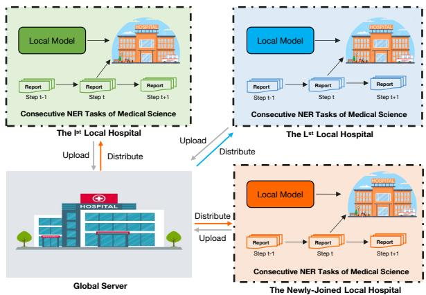
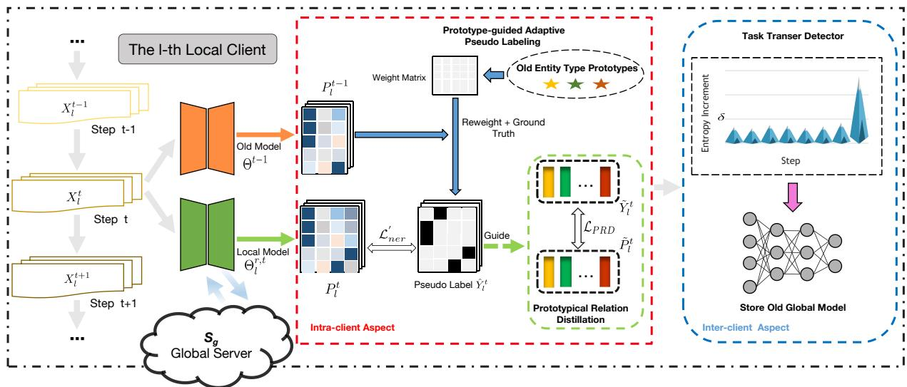
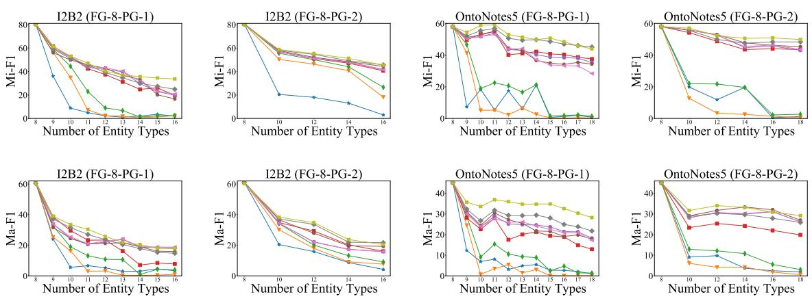

# Federated Incremental Named Entity Recognition

Zesheng Liu1,2, Qiannan Zhu4,5\*, Cuiping Li1,2\*, Hong Chen1,3

1School of Information, Renmin University of China, Beijing, China 2Key Laboratory of Data Engineering and Knowledge Engineering, MOE, China 3Engineering Research Center of Database and Business Intelligence, MOE, China 4School of Artificial Intelligence, Beijing Normal University, Beijing, China 5Engineering Research Center of Intelligent Technology and Educational Application, MOE, China {lzs2022,licuiping,chong}@ruc.edu.cn, zhuqiannan@bnu.edu.cn

## Abstract

Federated learning-based Named Entity Recognition (FNER) has attracted widespread attention through decentralized training on local clients. However, most FNER models assume that entity types are pre-fixed, so in practical applications, local clients constantly receive new entity types without enough storage to access old entity types, resulting in severe forgetting on previously learned knowledge. In addition, new clients collecting only new entity types may join the global training of FNER irregularly, further exacerbating catastrophic forgetting. To overcome the above challenges, we propose a Forgetting-Subdued Learning (FSL) model which solves the forgetting problem on old entity types from both intra-client and interclient two aspects. Specifically, for intra-client aspect, we propose a prototype-guided adaptive pseudo labeling and a prototypical relation distillation loss to surmount catastrophic forgetting of old entity types with semantic shift. Furthermore, for inter-client aspect, we propose a task transfer detector. It can identify the arrival of new entity types that are protected by privacy and store the latest old global model for relation distillation. Qualitative experiments have shown that our model has made significant improvements compared to several baseline methods.

## 1 Introduction

Federated learning (FL) (Fallah et al., 2020; Wang et al., 2020; De Lange et al., 2020; Wen et al., 2023; Liu et al., 2024) is a decentralized training mode that can learn global models across distributed local clients without accessing their private data. Under privacy protection, it alleviates the limitations of data islands by training on multiple dispersed local clients and achieves rapid development in named entity recognition (NER) (Ma and Hovy, 2016; Lample et al., 2016; Li et al., 2020, 2022; Shen et al., 2023). Meanwhile, federated learning-based named entity recognition (FNER) (Ge et al., 2020) is also a popular research direction, which can significantly save annotation costs in data scarce scenarios by training global NER models on private data from different clients.

  
Figure 1: Typical FINER setting for medical science. Many hospitals including newly-joined ones receive new entity types incrementally according to their own needs. FINER aims to consecutively recognize new medical entities such as diseases and drugs in clinical reports via collaboratively learning a global NER model on private medical data of different hospitals.

Existing FNER methods (Ge et al., 2020; Zhao et al., 2021; Wang et al., 2023) unrealistically assume that entity types are static and fixed over time, because in real-world applications, local clients may continuously receive stream data of new entity types. A direct solution is to force local clients to store all samples of old entity types, and then learn a global model to continuously recognize new entity types through FL. But with the continuous arrival of new entity types, this requires a significant amount of computation and memory overhead, which limits the application capability of FNER. Even worse, if local clients have no memory to store old data of old entity types, existing FNER methods will significantly reduce their recognition ability on old entity types (i.e., catastrophic forgetting (Goodfellow et al., 2013; Kirkpatrick et al., 2017; Rebuffi et al., 2017; Wang et al., 2024)). Moreover, non-entity type in current task has the semantic shift (Douillard et al., 2021; Zhang et al., 2023a), which may belong to the entity types in old tasks or future tasks. This phenomenon seriously exacerbates the forgetting speed. More importantly, in practical scenarios, new local clients that incrementally receive new entity types may irregularly join global training, further intensifying catastrophic forgetting.

To overcome the problems in realistic scenarios mentioned above, we focus a novel practical problem called Federated Incremental Named Entity Recognition (FINER), where local clients continuously collect new entity types based on their preferences, and new local clients that collect unseen entity types may participate in global training irregularly. In the FINER setting, entity types are non-independent and identically distributed (Non-IID) across different clients, and training data of old entity types is not available for all local clients. FINER aims to train a global incremental NER model through collaborative FL training on local clients to address catastrophic forgetting. In this work, we use medical named entity recognition as an example to better illustrate FINER, as shown in Figure 1. A lot of hospitals collect unseen/new medical entity types continuously in clinical reports. Considering privacy protection, these hospitals hope to learn global entity recognition patterns through FL without accessing the data of each other (Zhang et al., 2022).

A simple solution for FINER is to directly integrate incremental named entity recognition (INER) (Monaikul et al., 2021; Zheng et al., 2022; Zhang et al., 2023b; Qiu et al., 2024) with FL. However, such a trivial solution requires that the global server needs to have strong manual prior about which and when local clients can collect new entity types, so that local clients can solve the forgetting issue on old entity types through knowledge distillation (Hinton et al., 2015; Wang et al., 2022; Asadi et al., 2023). Considering privacy protection in FINER, this sensitive information cannot be shared between local clients and global server. Consequently, from the intra-client perspective, due to lack of the signals for knowledge distillation, this simple solution suffers from serious forgetting issue caused by catastrophic forgetting with semantic shift. Also, from the inter-client perspective, it suffers from forgetting issue across different clients caused by Non-IID distributions, because the global server is unable to provide the above signals to local clients.

To surmount the aforementioned challenges, we develop a novel Forgetting-Subdued Learning (FSL) model that alleviates the forgetting problem on old entity types from both intra-client and inter-client two aspects. Specifically, to address the intra-client forgetting issue caused by semantic shift and catastrophic forgetting, we first propose a prototype-guided adaptive pseudo labeling to adaptively generate confident pseudo labels for old entity types with semantic shift. We then design a prototypical relation distillation loss to maintain semantic consistency between old model and current local model, thereby overcoming catastrophic forgetting within the local client under the guidance of confident pseudo labels. Furthermore, considering solving the inter-client forgetting problem, we develop a task transfer detector that automatically recognizes new entity types without any human prior and generate signals to store the latest old model from a global perspective for relation distillation. Experiments on two NER datasets (i.e., I2B2 (Murphy et al., 2010) and OntoNotes5 (Hovy et al., 2006)) show that our model has significant improvements compared to baseline methods. We summarize the main contributions of this work as follows:

• We focus a novel practical problem called Federated Incremental Named Entity Recognition (FINER), where the major challenges are intra-client and inter-client forgetting problems on old entity types caused by intra-client catastrophic forgetting with semantic shift and inter-client Non-IID distributions.

• We propose a Forgetting-Subdued Learning (FSL) model to address the FINER problem via overcoming forgetting from intra-client and inter-client two aspects. As far as we know, this is the first work to explore a global continual NER model in the FL field.

• We develop a prototypical relation distillation loss to solve intra-client forgetting problem, under the guidance of confident pseudo labels generated via prototype-guided adaptive pseudo labeling.

• We design a task transfer detector to surmount inter-client forgetting by accurately recognizing new entity types under privacy protection and storing the latest old model from global aspect for relation distillation.

## 2 Related Work

Federated Learning-based Named Entity Recognition (FNER) is a secure distributed machine learning paradigm that aggregates model parameters of local-client to build a global NER model under the privacy protection. FedNER (Ge et al., 2020) proposes to decompose medical NER model on each client into shared and private modules to sufficiently utilize the knowledge from other clients and learn the features of local data in unison. FAL (Zhao et al., 2021) introduces the adversarial training technology to effectively improve the model robustness and generalization for FNER. (Wang et al., 2023) employs distillation with pseudo-complete annotation and an instance weighting mechanism to cope with the heterogeneous tag sets and facilitate knowledge transfer across different clients. However, the abovementioned FNER methods cannot recognize new entity types continuously under the FINER settings.

Incremental Named Entity Recognition (INER) considers class-incremental learning in named entity recognition. ExtendNER (Monaikul et al., 2021) is the pioneer in applying knowledge distillation to INER task. CFNER (Zheng et al., 2022) introduces a causal framework for extracting new causal effects in entities and non-entities. L&R (Xia et al., 2022) proposes a learn and review framework by simultaneously training a backbone model and a generative model to generate samples of old entity types to be trained with new samples. DLD (Zhang et al., 2023b) improves the knowledge distillation method in ExtendNER via dividing it into negative terms and positive terms for a fine-grained knowledge distillation. CPFD (Zhang et al., 2023a) proposes a pooled features distillation loss and designs a confidence-based pseudolabeling strategy for classification. Nevertheless, these INER methods cannot be effectively applied to address the FINER problem, due to their strong prior knowledge to access privately-sensitive information (i.e., when and which local clients receive new entity types).

## 3 Task Definition

As claimed in INER, some continual NER tasks are defined as $\mathcal { T } = \{ \mathcal { T } ^ { t } \} _ { t = 1 } ^ { T }$ , where the t-th task $\mathcal { T } ^ { t } = \{ \mathbf { X } _ { i } ^ { t } , \mathbf { Y } _ { i } ^ { t } \} _ { i = 1 } ^ { N ^ { t } }$ is composed of $N ^ { t }$ pairs of token sequences and labels. The label space $\mathcal { V } ^ { t }$ of t-th task consists of $\mathcal { E } ^ { t }$ new entity types. Besides, $\mathcal { E } ^ { t }$ new entity types have no overlap with $\begin{array} { r } { \mathcal { E } ^ { o } = \sum _ { i = 1 } ^ { t - 1 } \mathcal { E } ^ { i } } \end{array}$ old entity types $( \cup _ { j = 1 } ^ { t - 1 } \mathscr { y } ^ { j } )$ learned from the $t - 1$ old tasks. In the t-th task, we follow INER methods to annotate ${ \mathcal { E } } ^ { o }$ old entity types as non-entity type $\begin{array} { r } { e _ { o } \ ( i . e . } \end{array}$ , semantic shift), due to unavailable training data of ${ \mathcal { E } } ^ { o }$ old entity types.

Then, we extend the settings from INER to FINER. Denote global server as $ { \boldsymbol { S } } _ { g }$ and $L$ local clients as $\{ \boldsymbol { S } _ { l } \} _ { l = 1 } ^ { L }$ . In the FINER, at the $r \mathrm { - }$ th $( r ~ = ~ 1 , \cdots , R )$ global round, we randomly select some local clients to aggregate gradients. When we choose the l-th local client to learn the t-th NER task, the latest global model $\Theta ^ { r , t }$ is distributed to $\boldsymbol { S _ { l } }$ , and trained on private training data $\mathcal { T } _ { l } ^ { t } = \{ \mathbf { X } _ { l i } ^ { t } , \mathbf { Y } _ { l i } ^ { t } \} _ { i = 1 } ^ { N _ { l } ^ { t } } \sim \mathcal { P } _ { l }$ of $\mathcal { S } _ { l } . \mathrm { \bf X } _ { l i } ^ { t }$ and $\mathbf { Y } _ { l i } ^ { t } \in \mathcal { V } _ { l } ^ { t }$ denote token sequences and labels of the l-th client. $\{ \mathcal { P } _ { l } \} _ { l = 1 } ^ { L }$ are non-independent and identically distributed $( i . e .$ , Non-IID) across local clients. The label space $\mathcal { V } _ { l } ^ { t } \subset \mathcal { V } ^ { t }$ of $\boldsymbol { S _ { l } }$ in the t-th task is composed of $\mathcal { E } _ { l } ^ { t }$ new entity types $( \mathcal { E } _ { l } ^ { t } \leq \mathcal { E } ^ { t } )$ that belongs to a subset of ${ \mathcal { V } } ^ { t } = \cup _ { l = 1 } ^ { L } \mathcal { V } _ { l } ^ { t }$ . Following INER methods, we consider semantic shift in the FINER and also annotate $\begin{array} { r } { \mathcal { E } _ { l } ^ { o } = \sum _ { i = 1 } ^ { t - 1 } \mathcal { E } _ { l } ^ { i } \subset \cup _ { j = 1 } ^ { t - 1 } \mathcal { Y } _ { l } ^ { j } } \end{array}$ old entity types from $t - 1$ old tasks as non-entity type. After getting global model $\Theta ^ { r , t }$ and performing local training on $\mathcal { T } _ { l } ^ { t } , S _ { l }$ obtains a updated local model $\Theta _ { l } ^ { r , t }$ . And global server $\mathcal { S } _ { g }$ aggregates local models of selected clients as the global model $\Theta ^ { r + 1 , t }$ for training the next global round.

In the t-th task, following (Dong et al., 2022, 2023), all local clients $\{ \boldsymbol { S } _ { l } \} _ { l = 1 } ^ { L }$ are divided into three categories: $\{ \boldsymbol { S } _ { l } \} _ { l = 1 } ^ { L } = \mathbf { S } _ { o } \cup \mathbf { S } _ { c } \cup \mathbf { S } _ { n }$ . Specifically, $\mathbf { S } _ { o }$ is composed of $L _ { o }$ local clients that have accumulated experience of previous tasks but cannot collect new data of the t-th task; $\mathbf { S } _ { c }$ consisting of $L _ { c }$ local clients can receive new data of current task and has experience of old tasks; $\mathbf { S } _ { n }$ includes $L _ { n }$ new local clients with unseen new entity types but without experience of old entity types. These local clients are randomly determined in each incremental task. New clients $\mathbf { S } _ { n }$ are added randomly at any global round in FINER, increasing $L = L _ { o } + L _ { c } + L _ { n }$ gradually as continuous tasks. More importantly, we don’t have any prior knowledge about the distributions $\{ \mathcal { P } _ { l } \} _ { l = 1 } ^ { L }$ , quantity and order of NER tasks, when and which local clients receive new entity types. In this paper, FINER aims to learn a global model $\Theta ^ { R , \hat { T } }$ to recognize new entity types continuously while surmounting forgetting on old entity types, under privacy preservation of local clients.

  
Figure 2: Overview of the proposed FSL model. It includes a prototypical relation distillation loss $\mathcal { L } _ { \mathrm { P R D } }$ to overcome intra-client catastrophic forgetting with semantic shift, under the guidance of prototype-guided adaptive pseudo labeling. At the same time, it makes use of a task transfer detector to tackle inter-client forgetting brought by Non-IID distributions.

## 4 Methodology

Figure 2 presents the overview of our model to address the FINER problem. Our FSL model overcomes intra-client forgetting problem via a prototype-guided adaptive pseudo labeling (PAP, Section 4.1) to mine pseudo labels for old entity types with semantic shift, and a prototypical relation distillation loss (PRD, Section 4.2), collaborating with generated pseudo labels. Meanwhile, it addresses inter-client forgetting problem via a task transfer detector (TTD, Section 4.3) to recognize new entity types and store old model for relation distillation.

## 4.1 Prototype-guided Adaptive Pseudo Labeling

For the l-th local client $S _ { l } ~ \in ~ \mathbf { S } _ { c } \cup \mathbf { S } _ { n } .$ , the named entity recognition loss $\mathcal { L } _ { \mathrm { n e r } }$ for a mini-batch $\{ \mathbf { X } _ { l i } ^ { t } , \mathbf { Y } _ { l i } ^ { t } \} _ { i = 1 } ^ { \bar { B } s } \subset \mathcal { T } _ { l } ^ { t }$ sampled from the t-th incremental task is formulated as:

$$
\mathcal { L } _ { \mathrm { n e r } } = \frac { 1 } { B s } \sum _ { i = 1 } ^ { B s } \sum _ { j = 1 } ^ { | \mathbf { X } _ { l i } | } \mathcal { D } _ { \mathrm { C E } } \big ( \mathbf { P } _ { l } ^ { t } ( \mathbf { X } _ { l i } ^ { t } , \boldsymbol { \Theta } ^ { r , t } ) _ { j } , ( \mathbf { Y } _ { l i } ^ { t } ) _ { j } \big )\tag{1}
$$

Algorithm 1 Determination of $\{ ( w _ { l i j } ^ { t } ) _ { e } \} _ { e = 0 } ^ { \mathcal { E } ^ { o } }$ in   
Eq. (2).   
Input: $\mathcal { T } _ { l } ^ { t } = \{ \mathbf { X } _ { l _ { i } ^ { i } } ^ { t } , \mathbf { Y } _ { l i } ^ { t } \} _ { i = 1 } ^ { N _ { l } ^ { t } }$ and number $K ;$   
for $i = 1 , \cdots , \tilde { { N } } _ { l } ^ { t }$ do   
$\mathbf { F } _ { l i } ^ { t } = \mathbf { F } _ { l } ^ { t - 1 } \dot { ( } \mathbf { x } _ { l i } ^ { t } , \Theta ^ { t - 1 } ) ;$   
$\begin{array} { r } { \mathbf { L } _ { l i } ^ { t } = \mathrm { a r g } \operatorname* { m a x } { \mathbf { P } _ { l } ^ { t - 1 } ( \mathbf { x } _ { l i } ^ { t } , \boldsymbol { \Theta } ^ { t - 1 } ) } \in \mathbb { R } ^ { | \mathbf { x } _ { l i } ^ { t } | } ; } \end{array}$   
$\mathbf { F } _ { l } ^ { t } = [ \mathbf { F } _ { l } ^ { t } ; f l a t t e n ( \dot { \mathbf { F } } _ { l i } ^ { t } ) ] ;$   
$\mathbf { L } _ { l } ^ { \tilde { t } } = [ \mathbf { L } _ { l } ^ { \tilde { t } } ; f l a t t e n ( \mathbf { L } _ { l i } ^ { \tilde { t } } ) ] ;$   
for $e = 0 , \cdots , \mathcal { E } ^ { o } \mathrm { \bf d o }$   
$F _ { l e } = \mathbf { F } _ { l } ^ { t } [ \mathbf { L } _ { l } ^ { t } = = e ] ;$   
$\eta _ { l , e } ^ { t } = \mathrm { m e a n } \{ F _ { l e } \} ;$   
Select K feature vectors closest to $\eta _ { l , e } ^ { t }$ from   
$F _ { l e }$ and recalculate $\eta _ { l , e } ^ { t } ;$   
Calculate $( w _ { l i j } ^ { t } ) _ { e }$ using Eq. (4);

where $\mathcal { D } _ { \mathrm { C E } } ( \cdot , \cdot )$ denotes the cross-entropy loss. At the r-th global round, global model $\Theta ^ { r , t }$ is transmitted from global server $\mathcal { S } _ { g }$ to Sl. $\mathbf { P } _ { l } ^ { t } ( \mathbf { X } _ { l i } ^ { t } , \boldsymbol { \Theta } ^ { r , t } ) _ { j } \in$ $\mathbb { R } ^ { 1 + E ^ { o } + E ^ { \bar { t } } }$ is the probability at the j-th $\begin{array} { r l } { ( j } & { { } = } \end{array}$ $1 , \cdots , | \mathbf { X } _ { l i } | )$ token predicted by $\Theta ^ { r , t }$ , and it can predict non-entity type, ${ \mathcal { E } } ^ { o }$ old entity types, and $\mathcal { E } ^ { t }$ new entity types for the $j \mathrm { - t h }$ token. $( \mathbf { Y } _ { l i } ^ { t } ) _ { j } \in \mathcal { Y } _ { l } ^ { t }$ is corresponding label of the j-th token. Bs denotes the batch size. $E = c a r d ( \mathcal { E } )$ represents the cardinality of entity types.

As aforementioned, in the FINER settings, local client $\boldsymbol { S _ { l } }$ has no memory to store ${ \mathcal { E } } ^ { o }$ old entity types, while non-entity tokens may belong to ${ \mathcal { E } } ^ { o }$ old entity types, entity types from future tasks or real non-entity type (i.e., semantic shift). As a result, it enforces the updating of local model $\Theta _ { l } ^ { r , t }$ (i.e., Eq. (1)) to suffer from intra-client forgetting problem among different old entity types brought by semantic shift, after $\boldsymbol { S _ { l } }$ receives the global model $\Theta ^ { r , t }$ from $\mathcal { S } _ { g }$ for local training. To this end, as shown in Figure 2, we develop a prototype-guided adaptive pseudo labeling to adaptively mine high-confidence pseudo labels for old entity types marked as nonentity tokens in t-th incremental task. These pseudo labels based on dynamic weights of ${ \mathcal { E } } ^ { o }$ old entity types are essential to alleviate semantic shift within local clients.

At the t-th learning step, as shown in Figure 2, given a sample $\{ \mathbf { X } _ { l i } ^ { t } , \mathbf { Y } _ { l i } ^ { t } \} \subset \mathcal { T } _ { l } ^ { t }$ , we feed it into old global model $\Theta ^ { t - 1 }$ of the last task and current local model $\Theta _ { l } ^ { r , t }$ to obtain the probabilities $\mathbf P _ { l } ^ { t - 1 } ( \mathbf x _ { l i } ^ { t } , \Theta ^ { t - 1 } ) \in \mathring { \mathbb R } ^ { | \mathbf x _ { l i } ^ { t } | \times ( 1 + E ^ { o } ) }$ and $\mathbf { P } _ { l } ^ { t } ( \mathbf { X } _ { l i } ^ { t } , \boldsymbol { \Theta } _ { l } ^ { r , t } ) \ \mathrm { ~  ~ \tilde { ~ } { ~ \chi ~ } ~ } _ { \parallel } \cdot \in \ \mathbb { R } ^ { | \widetilde { \mathbf { X } } _ { l i } ^ { t } | \times ( 1 + E ^ { o } + E ^ { t } ) }$ respectively. Then pseudo label $\hat { \mathbf Y } _ { l i } ^ { t } \in \mathbb { R } ^ { | \mathbf X _ { l i } ^ { t } | }$ of given token sequence $\mathbf { X } _ { l i } ^ { t }$ is defined as:

$$
( \hat { \mathbf { Y } } _ { l i } ^ { t } ) _ { j } = \left\{ \begin{array} { l l } { e , \mathrm { ~ i f ~ } ( \mathbf { Y } _ { l i } ^ { t } ) _ { j } \neq 0 \& e = ( \mathbf { Y } _ { l i } ^ { t } ) _ { j } ; } \\ { e , \mathrm { ~ i f ~ } ( \mathbf { Y } _ { l i } ^ { t } ) _ { j } = 0 \& e = \arg \operatorname* { m a x } } \\ { ( \mathcal { W } _ { l i } ^ { t } ) _ { j } \odot \mathbf { P } _ { l } ^ { t - 1 } ( \mathbf { X } _ { l i } ^ { t } , \boldsymbol { \Theta } ^ { t - 1 } ) _ { j } ; } \\ { 0 , \mathrm { ~ o t h e r w i s e ~ } } \end{array} \right.\tag{2}
$$

where $( \hat { \mathbf { Y } } _ { l i } ^ { t } ) _ { j }$ is pseudo label of the j-th token from $\hat { \mathbf { Y } } _ { l i } ^ { t }$ and ⊙ denotes the element-wise multiplication. $\mathbf { P } _ { l } ^ { t - 1 } ( \mathbf { X } _ { l i } ^ { t } , \boldsymbol { \Theta } ^ { t - 1 } ) _ { \mathcal { I } }$ is softmax probability of the j-th token from $\mathbf { P } _ { l } ^ { \tilde { t } - 1 } ( \mathbf { X } _ { l i } ^ { t } , \Theta ^ { t - 1 } )$ . Additionally, $( \mathcal { W } _ { l i } ^ { t } ) _ { j } = \{ ( w _ { l i j } ^ { t } ) _ { e } \} _ { e = 0 } ^ { \mathcal { E } ^ { o } }$ denotes the dynamic weights used to adaptively select pseudo labels with high confidence. As shown in Eq. (2), in the t-th task $\mathcal { T } _ { l } ^ { t }$ , when the j-th token belongs to non-entity type, its pseudo label is determined by $( \hat { \mathbf { Y } } _ { l i } ^ { t } ) _ { j } =$ arg max $\begin{array} { r } { ( \mathbf { \hat { W } } _ { l i } ^ { t } ) _ { j } \odot \mathbf { P } _ { l } ^ { t - 1 } ( \mathbf { X } _ { l i } ^ { t } , \Theta ^ { t - 1 } ) _ { j } } \end{array}$ . If the j-th token is not labeled as $e _ { o } ,$ we consider its pseudo label as current entity types: $( \hat { \mathbf { Y } } _ { l i } ^ { t } ) _ { j } = ( \mathbf { Y } _ { l i } ^ { t } ) _ { j }$ . Otherwise, $( \hat { \mathbf { Y } } _ { l i } ^ { t } ) _ { j } = 0$ denotes real non-entity type for the j-th token of $\hat { \mathbf { Y } } _ { l i } ^ { t }$ . And classification loss $\mathcal { L } _ { \mathrm { n e r } }$ can be rewritten in the following form:

$$
\mathcal { L } _ { \mathrm { n e r } } ^ { ' } = \frac { 1 } { B s } \sum _ { i = 1 } ^ { B s } \sum _ { j = 1 } ^ { | \mathbf { X } _ { l i } | } \mathcal { D } _ { \mathrm { C E } } \big ( \mathbf { P } _ { l } ^ { t } ( \mathbf { X } _ { l i } ^ { t } , \boldsymbol { \Theta } ^ { r , t } ) _ { j } , ( \hat { \mathbf { Y } } _ { l i } ^ { t } ) _ { j } \big )\tag{3}
$$

The calculation flow of $\{ ( w _ { l i j } ^ { t } ) _ { e } \} _ { e = 0 } ^ { \mathcal { E } ^ { o } }$ is summarized in Algorithm 1. Firstly, we obtain the feature representation $\mathbf { { F } } _ { l } ^ { t }$ with its corresponding position $\mathbf { L } _ { l } ^ { t } \left( i . e . \right.$ , entity type) for all training samples in the t-th task $\mathcal { T } _ { l } ^ { t }$ based on old global model $\Theta ^ { t - 1 }$ Nextly, we get the prototype $\eta _ { l , e } ^ { t }$ for each entity type $e \in e _ { o } \cup \mathcal { V } ^ { o }$ with $\mathbf { { F } } _ { l } ^ { t }$ and $\mathbf { L } _ { l } ^ { t }$ . Considering noise in $F _ { l e } .$ , we reselect K feature vectors closest to $\eta _ { l , e } ^ { t }$ from $F _ { l \epsilon }$ to recalculate $\eta _ { l , e } ^ { t }$ . Finally, $( w _ { l i j } ^ { t } ) _ { \epsilon }$ is determined via the following process:

$$
( w _ { l i j } ^ { t } ) _ { e } = \frac { e x p ( - | | \mathbf { F } _ { l } ^ { t - 1 } ( \mathbf { X } _ { l i } ^ { t } , \Theta ^ { t - 1 } ) _ { j } - \eta _ { l , e } ^ { t } | | ) } { \sum _ { e ^ { \prime } } e x p ( - | | \mathbf { F } _ { l } ^ { t - 1 } ( \mathbf { X } _ { l i } ^ { t } , \Theta ^ { t - 1 } ) _ { j } - \eta _ { l , e ^ { \prime } } ^ { t } | | ) }\tag{4}
$$

where $e ^ { ' }$ represents any previously seen old entity types and we set $K = 1 0 0$ in this work.

Thus, given a mini-batch $\{ \mathbf { X } _ { l i } ^ { t } , \mathbf { Y } _ { l i } ^ { t } \} _ { i = 1 } ^ { B s } \subset \mathcal { T } _ { l } ^ { t }$ we can generate pseudo labels $\{ \mathbf { X } _ { l i } ^ { t } , \hat { \mathbf { Y } } _ { l i } ^ { t } \} _ { i = 1 } ^ { B s } \subset \mathcal { T } _ { l } ^ { t }$ adaptively via considering dynamic weights $\mathcal { W } _ { l i } ^ { t }$ in Eq. (2) for all old entity types. These highconfident pseudo labels can provide strong guidance for the local training to surmount intra-client forgetting problem.

## 4.2 Prototypical Relation Distillation

To address catastrophic forgetting within local client $S _ { l } \in \mathbf { S } _ { c } \cup \mathbf { S } _ { n }$ , we propose a prototypical relation distillation loss $\mathcal { L } _ { \mathrm { P R D } }$ , as shown in Figure 2. It considers that the relationships between different steps should remain constant. In conformity to this, distilling inter-task relations from old global model $\Theta ^ { t - 1 }$ to current local model $\Theta _ { l } ^ { r , t }$ can address forgetting problem on old entity types. In the meantime, considering that relying solely on the prediction of a single sample to perform semantic consistency between $\Theta ^ { t - 1 }$ and $\hat { \Theta _ { l } ^ { r , t } }$ may introduce noisy relations, so we construct type-wise prototypes for task relation distillation, also known as prototypical relation distillation.

Specifically, for a given sample $\{ \mathbf { X } _ { l i } ^ { t } , \mathbf { Y } _ { l i } ^ { t } \} \subset$ $\mathcal { T } _ { l } ^ { t }$ with generated pseudo label $\hat { \mathbf { Y } } _ { l i } ^ { t } ,$ we first obtain its current probability $\mathbf { P } _ { l } ^ { t } ( \mathbf { X } _ { l i } ^ { t ^ { * } } , \boldsymbol { \Theta } _ { l } ^ { r , t } )$ predicted via local model $\Theta _ { l } ^ { r , t }$ and old probability $\mathbf { P } _ { l } ^ { t - 1 } ( \mathbf { X } _ { l i } ^ { t } , \boldsymbol { \Theta } ^ { t - 1 } )$ predicted via old global model $\Theta ^ { \dot { t } - 1 }$ . We then replace the first $1 + E ^ { o }$ dimensions of $\mathbf { Y } _ { l i } ^ { t }$ with $\mathbf { P } _ { l } ^ { t - 1 } \dot { ( } \mathbf { X } _ { l i } ^ { t } , \Theta ^ { t - 1 } )$ and get its new representation $\bar { \mathbf { Y } } _ { l } ^ { t } ( \mathbf { X } _ { l i } ^ { t } , \boldsymbol { \Theta } _ { l } ^ { r , t } )$ . Next, under the guidance of pseudo labels $\hat { \mathbf { Y } } _ { l i } ^ { t }$ , we separately construct new type-wise relation prototype $\widetilde { \mathbf { P } } _ { l , k } ^ { t }$ and its relation groundtruth $\widetilde { \mathbf { Y } } _ { l , k } ^ { t }$ for the k-th entity type in $\mathcal { V } ^ { o } \cup \mathcal { V } ^ { t }$ as follows:

$$
\widetilde { \mathbf { P } } _ { l , k } ^ { t } = \frac { 1 } { \Delta _ { k } } \sum _ { i = 1 } ^ { B s } \sum _ { j = 1 } ^ { | \mathbf { X } _ { l i } | } \mathbf { P } _ { l } ^ { t } ( \mathbf { X } _ { l i } ^ { t } , \boldsymbol { \Theta } _ { l } ^ { r , t } ) \cdot \mathbb { I } _ { ( \hat { \mathbf { Y } } _ { l i } ^ { t } ) _ { j } = k }\tag{5}
$$

$$
\widetilde { \mathbf { Y } } _ { l , k } ^ { t } = \frac { 1 } { \Delta _ { k } } \sum _ { i = 1 } ^ { B s } \sum _ { j = 1 } ^ { | \mathbf { X } _ { l i } | } \bar { \mathbf { Y } } _ { l } ^ { t } ( \mathbf { X } _ { l i } ^ { t } , \boldsymbol { \Theta } _ { l } ^ { r , t } ) \cdot \mathbb { I } _ { ( \hat { \mathbf { Y } } _ { l i } ^ { t } ) _ { j } = k }\tag{6}
$$

where $\begin{array} { r } { \Delta _ { k } \ = \ \sum _ { i = 1 } ^ { B s } \sum _ { j = 1 } ^ { | \mathbf { x } _ { l i } | } \mathbb { I } _ { ( \hat { \mathbf { y } } _ { l i } ^ { t } ) _ { j } = k } } \end{array}$ and I is the indicator function. Finally, the proposed $\mathcal { L } _ { \mathrm { P R D } }$ is formulated as:

$$
\mathcal { L } _ { \mathrm { P R D } } = \frac { 1 } { \mathcal { E } ^ { o } + \mathcal { E } ^ { t } } \sum _ { k = 1 } ^ { \mathcal { E } ^ { o } + \mathcal { E } ^ { t } } \mathcal { D } _ { \mathrm { K L } } ( \widetilde { \mathbf { P } } _ { l , k } ^ { t } , \widetilde { \mathbf { Y } } _ { l , k } ^ { t } )\tag{7}
$$

where $\mathcal { D } _ { \mathrm { K L } } ( \cdot | | \cdot )$ indicates Kullback-Leibler divergence. Consequently, $\mathcal { L } _ { \mathrm { P R D } }$ can address intraclient catastrophic forgetting problem via maintaining consistent semantic relations between old model $\Theta ^ { t - 1 }$ and current local model $\Theta _ { l } ^ { r , t }$

Overall, the objective formulation of the l-th local client $\boldsymbol { S _ { l } }$ to learn the t-th NER task $\mathcal { T } _ { l } ^ { t }$ is expressed as follows:

$$
\mathcal { L } _ { \mathrm { o b j } } = \mathcal { L } _ { \mathrm { n e r } } ^ { ' } + \alpha \mathcal { L } _ { \mathrm { P R D } } + \beta \mathcal { L } _ { \mathrm { K D } }\tag{8}
$$

where ${ \mathcal { L } } _ { \mathrm { K D } }$ inherits from (Monaikul et al., 2021), α and $\beta$ are trade-off parameters. When $t \geq 2$ , we set $\alpha = 0 . 5$ and $\beta = 2$ in Eq. (8) to train local model $\Theta _ { l } ^ { r , t }$ ; otherwise, we use $\mathcal { L } _ { \mathrm { n e r } }$ in Eq. (1) to optimize $\Theta _ { l } ^ { r , t }$

## 4.3 Task Transfer Detector

When local clients recognize new entity types consecutively, global sever $S _ { g }$ requires to automatically identify when and which local clients collect new entity types, and then store the latest old global model $\Theta ^ { t - 1 }$ to perform $\mathcal { L } _ { P R D }$ . As a result, the accurate selection of the latest old model $\Theta ^ { t - 1 }$ is essential to address inter-client forgetting across different local clients brought by Non-IID distributions, when new entity types arrive. However, considering privacy preservation, we don’t have human prior about when to obtain new entity types in local clients under the FINER settings. To address this issue, a naive way is to detect whether the labels of current training data have been observed before. Nevertheless, the Non-IID distributions across local clients make it impossible to identify whether the collected data belongs to old entity types seen by other clients or new entity types. Therefore, we design a task transfer detector to automatically discover when and which local clients collect new entity types. At the r-th round, when $S _ { l }$ receives global model $\Theta ^ { r , t }$ , it evaluates the average entropy $\mathcal { Q } _ { l } ^ { r , t }$ on $\mathcal { T } _ { l } ^ { t }$

$$
\mathcal { Q } _ { l } ^ { r , t } = \frac { 1 } { N _ { l } ^ { t } } \sum _ { i = 1 } ^ { N _ { l } ^ { t } } \sum _ { j = 1 } ^ { | \mathbf { X } _ { l i } ^ { t } | } \mathcal { Z } ( P _ { l } ^ { t } ( \mathbf { X } _ { l i } ^ { t } , \boldsymbol { \Theta } ^ { r , t } ) _ { j } )\tag{9}
$$

<table><tr><td colspan="3">Datasets #Entity Type #Sample</td><td colspan="2">Entity Type Sequence</td></tr><tr><td rowspan="2">I2B2</td><td rowspan="2">16</td><td rowspan="2">141k</td><td>AGE, CITY, COUNTRY, DATE, DOCTOR, HOSPITAL,IDNUM, MEDICALRECORD,</td></tr><tr><td>ORGANIZATION, PATIENT, PHONE,</td></tr><tr><td rowspan="5"></td><td rowspan="3"></td><td rowspan="3"></td><td>PROFESSION, STATE, STREET, USERNAME, ZIP</td></tr><tr><td>CARDINAL, DATE, EVENT, FAC, GPE,</td></tr><tr><td>LANGUAGE,LAW, LOC, MONEY, NORP,</td></tr><tr><td rowspan="2">OntoNotes5 18</td><td rowspan="2">77k</td><td>ORDINAL, ORG,PERCENT, PERSON,</td></tr><tr><td>PRODUCT, QUANTITY, TIME,</td></tr></table>

Table 1: The statistical information for each NER dataset.

where $\begin{array} { r } { \mathcal { Z } ( \cdot , \cdot ) = \sum _ { i } p _ { i } } \end{array}$ log $p _ { i }$ is entropy function. If there is a sudden rise for averaged entropy $\mathcal { Q } _ { l } ^ { r , t }$ $\mathcal { Q } _ { l } ^ { r , t } - \mathcal { Q } _ { l } ^ { r - 1 , t } \geq \delta ,$ we believe this can serve as a signal that local clients are collecting new entity types. Then, we update t via $t \gets t + 1$ , and automatically store the latest global model $\Theta ^ { r - 1 , t }$ as old model $\Theta ^ { t - 1 }$ to optimize local model $\Theta _ { l } ^ { r , t }$ via Eq. (8). We set $\delta = 1 . 0$ empirically in this paper. This automatic selection of old model $\Theta ^ { t - 1 }$ from global aspect is essential to tackle inter-client forgetting problem via considering Non-IID distributions across local clients.

## 4.4 Optimization Procedure

At the beginning of each global round in each incremental task, all local clients employ Eq. (9) to calculate the average relative entropy of local data, and then some of local clients are randomly selected by global server $ { \boldsymbol { S } } _ { g }$ to conduct local training at each round. After these chosen clients utilize task transfer detector to accurately recognize new entity types, they automatically store the global model learned at the last global round as the old model $\Theta ^ { t - 1 }$ to generate confident pseudo labels for old entity types via Eq. (2), and optimize local model $\Theta _ { l } ^ { r , t }$ via Eq. (8). Finally, the updated local models $\dot { \Theta _ { l } ^ { r , t } }$ of selected local clients are aggregated as $\Theta ^ { r + 1 , t }$ by $\mathcal { S } _ { g }$ for the next round training.

## 5 Experiments

## 5.1 Implementation Details

We utilize two benchmark datasets: I2B2 (Murphy et al., 2010) and OntoNotes5 (Hovy et al., 2006) under various experimental settings to analyze effectiveness of our FSL model. We summarized the statistical data of them in Table 1. Meanwhile, we compare our FSL with recent INER methods under the FINER settings, namely ExtendNER (Monaikul et al., 2021), CFNER (Zheng et al., 2022) and CPFD (Zhang et al., 2023a). Furthermore, we also introduce incremental learning methods used in the field of computer vision as baseline methods, including Self-Training (ST) (De Lange et al., 2019; Rosenberg et al.), LUCIR (Hou et al., 2019), and PODNet (Douillard et al., 2020). Additionally, Finetuning method is directly employed as the lower bound.

<table><tr><td rowspan="3">Method</td><td colspan="4">I2B2</td><td colspan="4">OntoNotes5</td></tr><tr><td colspan="2">FG-8-PG-1</td><td colspan="2">FG-8-PG-2</td><td colspan="2">FG-8-PG-1</td><td colspan="2">FG-8-PG-2</td></tr><tr><td>Mi-F1</td><td>Ma-F1</td><td>Mi-F1</td><td>Ma-F1</td><td>Mi-F1</td><td>Ma-F1</td><td>Mi-F1</td><td>Ma-F1</td></tr><tr><td>Finetuning + FL</td><td>15.69</td><td>12.95</td><td>27.03</td><td>22.06</td><td>12.58</td><td>8.59</td><td>18.51</td><td>12.02</td></tr><tr><td>PODNet (Douillard et al., 2020) + FL</td><td>20.80</td><td>12.35</td><td>47.21</td><td>25.21</td><td>11.12</td><td>7.64</td><td>13.10</td><td>10.33</td></tr><tr><td>LUCIR (Hou et al., 2019) + FL</td><td>25.38</td><td>17.37</td><td>51.40</td><td>27.51</td><td>19.23</td><td>12.46</td><td>21.04</td><td>14.92</td></tr><tr><td>ST (De Lange et al., 2019) + FL</td><td>41.82</td><td>23.93</td><td>55.25</td><td>32.29</td><td>45.14</td><td>22.61</td><td>48.66</td><td>26.65</td></tr><tr><td>ExtendNER (Monaikul et al., 2021) + FL</td><td>43.38</td><td>26.80</td><td>55.71</td><td>30.16</td><td>44.69</td><td>26.15</td><td>50.02</td><td>31.84</td></tr><tr><td>CFNER (Zheng et al., 2022) + FL</td><td>43.07</td><td>27.08</td><td>56.55</td><td>32.86</td><td>43.61</td><td>25.77</td><td>51.01</td><td>32.82</td></tr><tr><td>DLD (Zhang et al., 2023b) + FL</td><td>44.12</td><td>27.19</td><td>55.55</td><td>30.09</td><td>42.47</td><td>25.88</td><td>50.31</td><td>31.91</td></tr><tr><td>CPFD (Zhang et al., 2023a) + FL</td><td>43.52</td><td>26.60</td><td>57.49</td><td>34.94</td><td>50.81</td><td>29.31</td><td>51.29</td><td>31.28</td></tr><tr><td>FSL (Ours)</td><td>47.07</td><td>29.88</td><td>58.11</td><td>35.50</td><td>52.13</td><td>34.71</td><td>53.12</td><td>33.35</td></tr><tr><td>Imp.</td><td>介2.95</td><td>介2.69</td><td>个0.62</td><td>介0.56</td><td>介1.32</td><td>介5.40</td><td>介1.83</td><td>介0.53</td></tr></table>

Table 2: Comparisons with baselines on I2B2 and OntoNotes5 two datasets. The bold denotes the highest result, and the underline denotes the second highest result.

For fair comparisons with these INER baseline methods, we follow them to set exactly the same incremental tasks and entity type order, and adopt BIO labeling scheme across all datasets. Besides, a entity types are used to train the base model, and we use b entity types for each incremental learning step, represented as FG-a-PG-b. And for the I2B2 and OntoNotes5 datasets, we both use two FINER settings: FG-8-PG-1 and FG-8-PG-2.

We employ SGD optimizer with initial learning rate as $2 \times 1 0 ^ { - 3 }$ to train the base task and $4 \times 1 0 ^ { - 4 }$ to learn incremental tasks. Our model utilizes a BERT-based encoder (Devlin et al., 2018) and employs a fully connected layer as the classifier. We use the PyTorch (Paszke et al., 2019) framework to implement the model, which is built on top of the Huggingface (Wolf et al., 2019) implementation. Considering the limitation of GPU overhead, we set initial local clients as 10, and add 4 new local clients for each task. We choose 4 local clients randomly to perform local training with 8 epochs if PG = 2 else 4 epochs. We randomly select 30% samples for each client in each task if PG = 1; otherwise, we randomly sample 50% entity types from current label set $\mathcal { \dot { V } } ^ { t }$ , and assign 60% samples from these entity types to selected local clients.

Following baseline INER methods, we employ Micro-F1 (Mi-F1) and Macro-F1 (Ma-F1) as metric and serve the mean value across all steps as the final performance, including the base task. This two metrics evaluate the effectiveness to address forgetting problem and the ability to recognize new entity types continually.

## 5.2 Comparisons with Baselines

Experiments on I2b2 and OntoNotes5 two datasets are introduced to analyze superiority of our FSL under various settings of FINER, as shown in Table 2. Our FSL achieves a certain improvement over existing INER methods under various FINER settings. Specifically, as depicted in the left half of Table 2, our FSL achieves improvements over the best results of previous INER methods mean 1.79% in Mi-F1, and 1.63% in Ma-F1, under the two FINER settings of I2B2. In the right half of Table 2, our FSL achieves improvements over the best results of other INER methods mean 1.58% in Mi-F1, and 2.97% in Ma-F1, under the two FINER settings of OntoNotes5.

These results quantitatively illustrate the effectiveness of our model against other INER methods to learn a global continual NER model via collaboratively training local models under privacy preservation. Except for this, they also validate superiority of the proposed prototype-guided adaptive pseudo labeling and prototypical relation distillation loss to address intra-client and inter-client forgetting problem under the FINER settings.

<table><tr><td>Input Sentence</td><td>Record</td><td>date</td><td></td><td>2097</td><td></td><td>03</td><td></td><td>25</td><td>Patient Name</td><td></td><td></td><td>Whitaker</td><td></td><td>Vincent</td></tr><tr><td>No PL</td><td>[0]</td><td>[0]</td><td>[0]</td><td>[0]</td><td>[0]</td><td>[0]</td><td>[0]</td><td>[0]</td><td>[0]</td><td>[0]</td><td>[0]</td><td>[B-PATIENT]</td><td>[I-PATIENT]</td><td>[I-PATIENT]</td></tr><tr><td>PL</td><td>[0]</td><td>[0]</td><td>[0]</td><td>[B-DATE]</td><td>[0]</td><td>[I-DATE]</td><td>[I-DATE]</td><td>[I-AGE]</td><td>[0]</td><td>[0]</td><td>[0]</td><td>[B-PATIENT]</td><td>[I-PATIENT]</td><td>[1-PATIENT]</td></tr><tr><td>PAP</td><td>[0]</td><td>[0]</td><td>[0]</td><td>[B-DATE]</td><td>[l-DATE]</td><td>[I-DATE]</td><td>[I-DATE]</td><td>[I-DATE]</td><td>[0]</td><td>[0]</td><td>[0]</td><td>[B-PATIENT]</td><td>[I-PATIENT]</td><td>[I-PATIENT]</td></tr><tr><td>Golden Labels</td><td>[0]</td><td>[0]</td><td>[0]</td><td>[B-DATE]</td><td>[I-DATE]</td><td></td><td>[I-DATE] [I-DATE]</td><td>[I-DATE]</td><td>[0]</td><td>[0]</td><td>[0]</td><td>[B-PATIENT]</td><td>[I-PATIENT]</td><td>[1-PATIENT]</td></tr></table>

Figure 3: A real visualization example of some pseudo labels on I2B2 dataset under the FG-8-PG-2 setting.

  
Finetuning + FL PODNet + FL LUCIR + FL ST + FL ExtendNER + FL CFNER + FL DLD + FL CPFD + FL FSL(Ours)

Figure 4: Comparisons of the step-wise Micro-F1 and Macro-F1 on I2B2 and OntoNotes5 two datasets.
<table><tr><td rowspan="2">Method</td><td colspan="2">I2B2</td><td colspan="2">OntoNotes5</td></tr><tr><td>Mi-F1</td><td>Ma-F1</td><td>Mi-F1</td><td>Ma-F1</td></tr><tr><td>Ours w/o PL</td><td>48.17</td><td>31.81</td><td>38.71</td><td>22.97</td></tr><tr><td>Ours w/o PAP</td><td>55.64</td><td>33.37</td><td>50.14</td><td>28.78</td></tr><tr><td>Ours w/o PRD</td><td>54.46</td><td>32.74</td><td>52.32</td><td>32.43</td></tr><tr><td>FSL (Ours)</td><td>58.11</td><td>35.50</td><td>53.12</td><td>33.35</td></tr></table>

Table 3: Ablation studies on I2B2 and OntoNotes5 under the FG-8-PG-2 setting of FINER.

## 5.3 Ablation Studies

To analyze effectiveness of each module in our model, Table 3 presents ablation experiments under various FINER settings. Ours w/o PL, Ours w/o PAP and Ours w/o PRD indicate the results of our model without pseudo labeling (denoted as PL), prototype-guided adaptive pseudo labeling (denoted as PAP) and prototypical relation distillation (denoted as PRD), where Ours w/o PAP directly use the prediction results of the old model as pseudo labels for the tokens marked as non-entity type. Compared to our FSL, the effectiveness of all ablation variants has significantly degraded.

More specifically, after removing PL, the results show 9.94% Mi-F1 and 3.69% Ma-F1 drop of I2B2, and 14.41% Mi-F1 and 10.38% Ma-F1 drop of OntoNotes5 compared to the full model. At the same time, after removing PAP from the full model, the results show 2.47% Mi-F1 and 2.13% Ma-F1 drop of I2B2, and 2.98% Mi-F1 and 4.57% Ma-F1 drop of OntoNotes5. Meanwhile, we can refer to an example in Figure 3. Without PL, the old entity type DATE is labeled as non-entity type, which can lead to semantic shift and exacerbate forgetting. Moreover, the error rate of conventional PL is relatively high compared to PAP (such as marking old entity type DATE as entity type AGE or non-entity type in Figure 3), so the effect will also be relatively poor, which is consistent with the previous experimental results. These results indicate that the proposed PAP module can effectively tackle semantic shift via confident pseudo labels.

And after removing PRD, the results show 3.65% Mi-F1 and 2.76% Ma-F1 drop of I2B2, and 0.80% Mi-F1 and 0.92% Ma-F1 drop of OntoNotes5 compared to the full model. This proves that the proposed PRD module can alleviate catastrophic forgetting of old entity types under the guidance of generated pseudo labels. As a consequence, the above results verify the importance of all modules to address the forgetting problem under the FINER settings.

## 5.4 Analysis of Step-Wise Comparisons

As shown in Figure 4, we introduce step-wise comparisons to analyze the validity of our model under FINER settings. Our model outperforms baseline INER methods (Douillard et al., 2020; Hou et al.,

2019; De Lange et al., 2019; Monaikul et al., 2021; Zheng et al., 2022; Zhang et al., 2023b,a) combined with FL for comparisons on I2B2 and OntoNotes5 under two FINER settings. Therefore, the proposed FSL model can encourage local clients to learn a global incremental NER model cooperatively under privacy preservation. Comparisons in Figure 4 show significant improvements of our model to address the FINER problem over other INER methods. When continuously recognizing new entity types, our FSL can effectively solve intra-client and inter-client forgetting problem.

## 6 Conclusion

In this paper, we propose a Federated Incremental Named Entity Recognition (FINER) problem, and develop a novel Forgetting–Subdued Learning (FBL) model to address intra-client and inter-client forgetting problem on old entity types. To tackle intra-client forgetting problem, we design a prototypical relation distillation loss, under the guidance of prototype-guided adaptive pseudo labeling. At the same time, we propose a task transfer detector to overcome inter-client forgetting problem. It can automatically recognize new entity types and store the latest old global model for relation distillation. Comparison results demonstrate the superiority of our FSL to tackle the FINER problem.

## 7 Limitations

Our PAP, which employs prototypes to calculate confidence, necessitates pre-calculation for each old entity type based on the current training data and the old model, thus extending training duration. Furthermore, it still have some mislabeled samples which will be introduced as noise into PRD. Furthermore, our PRD needs extra computational effort to align with the semantic relation between the new local model and the old model.

## Acknowledgments

This work was supported by the National Natural Science Foundation of China (U23A20299, U24B20144, 62172424, 62276270, 62322214, 62472038, 62437001), National Key Research Develop Plan (2023YFB4503600), Fundamental Research Funds for the Central Universities (2233100004), and Engineering Research Center of Intelligent Technology and Educational Application, Ministry of Education, China.

## References

Nader Asadi, MohammadReza Davari, Sudhir Mudur, Rahaf Aljundi, and Eugene Belilovsky. 2023. Prototype-sample relation distillation: towards replay-free continual learning. In International Conference on Machine Learning, pages 1093–1106. PMLR.

Matthias De Lange, Rahaf Aljundi, Marc Masana, Sarah Parisot, Xu Jia, Ales Leonardis, Gregory Slabaugh, and Tinne Tuytelaars. 2019. Continual learning: A comparative study on how to defy forgetting in classification tasks. arXiv preprint arXiv:1909.08383, 2(6):2.

Matthias De Lange, Xu Jia, Sarah Parisot, Ales Leonardis, Gregory Slabaugh, and Tinne Tuytelaars. 2020. Unsupervised model personalization while preserving privacy and scalability: An open problem. In 2020 IEEE/CVF Conference on Computer Vision and Pattern Recognition (CVPR), pages 14451–14460. IEEE Computer Society.

Jacob Devlin, Ming-Wei Chang, Kenton Lee, and Kristina Toutanova. 2018. Bert: Pre-training of deep bidirectional transformers for language understanding. arXiv preprint arXiv:1810.04805.

Jiahua Dong, Lixu Wang, Zhen Fang, Gan Sun, Shichao Xu, Xiao Wang, and Qi Zhu. 2022. Federated classincremental learning. In 2022 IEEE/CVF Conference on Computer Vision and Pattern Recognition (CVPR), pages 10154–10163. IEEE.

Jiahua Dong, Duzhen Zhang, Yang Cong, Wei Cong, Henghui Ding, and Dengxin Dai. 2023. Federated incremental semantic segmentation. In Proceedings of the IEEE/CVF Conference on Computer Vision and Pattern Recognition, pages 3934–3943.

Arthur Douillard, Yifu Chen, Arnaud Dapogny, and Matthieu Cord. 2021. Plop: Learning without forgetting for continual semantic segmentation. In Proceedings of the IEEE/CVF conference on computer vision and pattern recognition, pages 4040–4050.

Arthur Douillard, Matthieu Cord, Charles Ollion, Thomas Robert, and Eduardo Valle. 2020. Podnet: Pooled outputs distillation for small-tasks incremental learning. In Computer vision–ECCV 2020: 16th European conference, Glasgow, UK, August 23– 28, 2020, proceedings, part XX 16, pages 86–102. Springer.

Alireza Fallah, Aryan Mokhtari, and Asuman Ozdaglar. 2020. Personalized federated learning with theoretical guarantees: a model-agnostic meta-learning approach. In Proceedings of the 34th International Conference on Neural Information Processing Systems, pages 3557–3568.

Suyu Ge, Fangzhao Wu, Chuhan Wu, Tao Qi, Yongfeng Huang, and Xing Xie. 2020. Fedner: Privacypreserving medical named entity recognition with federated learning. arXiv e-prints, pages arXiv– 2003.

Ian J Goodfellow, Mehdi Mirza, Da Xiao, Aaron Courville, and Yoshua Bengio. 2013. An empirical investigation of catastrophic forgetting in gradient-based neural networks. arXiv preprint arXiv:1312.6211.

Geoffrey Hinton, Oriol Vinyals, and Jeff Dean. 2015. Distilling the knowledge in a neural network. stat, 1050:9.

Saihui Hou, Xinyu Pan, Chen Change Loy, Zilei Wang, and Dahua Lin. 2019. Learning a unified classifier incrementally via rebalancing. In Proceedings of the IEEE/CVF conference on computer vision and pattern recognition, pages 831–839.

Eduard Hovy, Mitchell Marcus, Martha Palmer, Lance Ramshaw, and Ralph Weischedel. 2006. OntoNotes: The 90% solution. In Proceedings ofthe Human Language Technology Conference ofthe NAACL, Companion Volume: Short Papers, pages 57–60.

James Kirkpatrick, Razvan Pascanu, Neil Rabinowitz, Joel Veness, Guillaume Desjardins, Andrei A Rusu, Kieran Milan, John Quan, Tiago Ramalho, Agnieszka Grabska-Barwinska, et al. 2017. Overcoming catastrophic forgetting in neural networks. Proceedings of the national academy of sciences, 114(13):3521–3526.

Guillaume Lample, Miguel Ballesteros, Sandeep Subramanian, Kazuya Kawakami, and Chris Dyer. 2016. Neural architectures for named entity recognition. In Proceedings ofthe 2016 Conference ofthe North American Chapter of the Association for Computational Linguistics: Human Language Technologies, pages 260–270.

Jing Li, Aixin Sun, Jianglei Han, and Chenliang Li. 2020. A survey on deep learning for named entity recognition. IEEE transactions on knowledge and data engineering, 34(1):50–70.

Jingye Li, Hao Fei, Jiang Liu, Shengqiong Wu, Meishan Zhang, Chong Teng, Donghong Ji, and Fei Li. 2022. Unified named entity recognition as word-word relation classification. In Proceedings ofthe AAAI Conference on Artificial Intelligence, volume 36, pages 10965–10973.

Yang Liu, Yan Kang, Tianyuan Zou, Yanhong Pu, Yuanqin He, Xiaozhou Ye, Ye Ouyang, Ya-Qin Zhang, and Qiang Yang. 2024. Vertical federated learning: Concepts, advances, and challenges. IEEE Transactions on Knowledge and Data Engineering.

Xuezhe Ma and Eduard Hovy. 2016. End-to-end sequence labeling via bi-directional lstm-cnns-crf. In Proceedings of the 54th Annual Meeting of the Association for Computational Linguistics (Volume 1: Long Papers), pages 1064–1074.

Natawut Monaikul, Giuseppe Castellucci, Simone Filice, and Oleg Rokhlenko. 2021. Continual learning for named entity recognition. In Proceedings of the AAAI Conference on Artificial Intelligence, volume 35, pages 13570–13577.

Shawn N. Murphy, Griffin M. Weber, Michael Mendis, Vivian S. Gainer, Henry C. Chueh, Susanne E. Churchill, and Isaac S. Kohane. 2010. Serving the enterprise and beyond with informatics for integrating biology and the bedside (i2b2). Journal of the American Medical Informatics Association : JAMIA, pages 124–130.

Adam Paszke, Sam Gross, Francisco Massa, Adam Lerer, James Bradbury, Gregory Chanan, Trevor Killeen, Zeming Lin, Natalia Gimelshein, Luca Antiga, et al. 2019. Pytorch: An imperative style, high-performance deep learning library. Advances in neural information processing systems, 32.

Shengjie Qiu, Junhao Zheng, Zhen Liu, Yicheng Luo, and Qianli Ma. 2024. Incremental sequence labeling: A tale of two shifts. In Findings of the Association for Computational Linguistics: ACL 2024, pages 777–791. Association for Computational Linguistics.

Sylvestre-Alvise Rebuffi, Alexander Kolesnikov, Georg Sperl, and Christoph H Lampert. 2017. icarl: Incremental classifier and representation learning. In Proceedings of the IEEE conference on Computer Vision and Pattern Recognition, pages 2001–2010.

Chuck Rosenberg, Martial Hebert, and Henry Schneiderman. Semi-supervised self-training of object detection models.

Yongliang Shen, Kaitao Song, Xu Tan, Dongsheng Li, Weiming Lu, and Yueting Zhuang. 2023. Diffusionner: Boundary diffusion for named entity recognition. In Proceedings ofthe 61st Annual Meeting ofthe Associationfor Computational Linguistics (Volume 1: Long Papers), pages 3875–3890.

FY Wang, DW Zhou, HJ Ye, and DC Zhan Foster. 2022. Feature boosting and compression for classincremental learning. ECCV FOSTER.

Hongyi Wang, Mikhail Yurochkin, Yuekai Sun, Dimitris Papailiopoulos, and Yasaman Khazaeni. 2020. Federated learning with matched averaging. In International Conference on Learning Representations.

Liyuan Wang, Xingxing Zhang, Hang Su, and Jun Zhu. 2024. A comprehensive survey of continual learning: Theory, method and application. IEEE Transactions on Pattern Analysis and Machine Intelligence.

Rui Wang, Tong Yu, Handong Wu, Junda andx Zhao, Sungchul Kim, Ruiyi Zhang, Subrata Mitra, and Ricardo Henao. 2023. Federated domain adaptation for named entity recognition via distilling with heterogeneous tag sets. In Findings ofthe Associationfor Computational Linguistics: ACL 2023, pages 7449– 7463. Association for Computational Linguistics.

Jie Wen, Zhixia Zhang, Yang Lan, Zhihua Cui, Jianghui Cai, and Wensheng Zhang. 2023. A survey on federated learning: challenges and applications. International Journal ofMachine Learning and Cybernetics, 14(2):513–535.

Thomas Wolf, Lysandre Debut, Victor Sanh, Julien Chaumond, Clement Delangue, Anthony Moi, Pierric Cistac, Tim Rault, Rémi Louf, Morgan Funtowicz, et al. 2019. Huggingface’s transformers: State-ofthe-art natural language processing. arXiv preprint arXiv:1910.03771.

Yu Xia, Quan Wang, Yajuan Lyu, Yong Zhu, Wenhao Wu, Sujian Li, and Dai Dai. 2022. Learn and review: Enhancing continual named entity recognition via reviewing synthetic samples. In Findings ofthe Associationfor Computational Linguistics: ACL 2022, pages 2291–2300.

Duzhen Zhang, Wei Cong, Jiahua Dong, Yahan Yu, Xiuyi Chen, Yonggang Zhang, and Zhen Fang. 2023a. Continual named entity recognition without catastrophic forgetting. In Proceedings of the 2023 Conference on Empirical Methods in Natural Language Processing, pages 8186–8197.

Duzhen Zhang, Yahan Yu, Feilong Chen, and Xiuyi Chen. 2023b. Decomposing logits distillation for incremental named entity recognition. In Proceedings ofthe 46th International ACM SIGIR Conference on Research and Development in Information Retrieval, pages 1919–1923.

Jie Zhang, Bo Li, Jianghe Xu, Shuang Wu, Shouhong Ding, Lei Zhang, and Chao Wu. 2022. Towards efficient data free black-box adversarial attack. In Proceedings ofthe IEEE/CVF Conference on Computer Vision and Pattern Recognition, pages 15115–15125.

Hanyu Zhao, Sha Yuan, Niantao Xie, Jiahong Leng, and Guoqiang Wang. 2021. A federated adversarial learning method for biomedical named entity recognition. In 2021 IEEE International Conference on Bioinformatics and Biomedicine (BIBM), pages 2962–2969.

Junhao Zheng, Zhanxian Liang, Haibin Chen, and Qianli Ma. 2022. Distilling causal effect from miscellaneous other-class for continual named entity recognition. In Proceedings of the 2022 Conference on Empirical Methods in Natural Language Processing, pages 3602–3615.