# FinDABench: Benchmarking Financial Data Analysis Ability of Large Language Models

Shu Liu1,2,3, Shangqing Zhao1, Chenghao Jia1, Xinlin Zhuang1, ZhaoGuang Long1, Jie Zhou1,2,3, Aimin Zhou 1,2,3, Man Lan1,2,3\*, Yang Chong4

1Lab of Artificial Intelligence for Education, East China Normal University 2Shanghai Institute of Artificial Intelligence for Education, East China Normal University 3School of Computer Science and Technology, East China Normal University 4Bytedance

shuliu@stu.ecnu.edu.cn, mlan@cs.ecnu.edu.cn

## Abstract

Large Language Models (LLMs) have demonstrated impressive capabilities across a wide range of tasks. However, their proficiency and reliability in the specialized domain of financial data analysis, particularly focusing on data-driven thinking, remain uncertain. To bridge this gap, we introduce FinDABench, a comprehensive benchmark designed to evaluate the financial data analysis capabilities of LLMs within this context. The benchmark comprises 15,200 training instances and 8,900 test instances, all meticulously crafted by human experts. FinDABench assesses LLMs across three dimensions: 1) Core Ability, evaluating the models’ ability to perform financial indicator calculation and corporate sentiment risk assessment; 2) Analytical Ability, determining the models’ ability to quickly comprehend textual information and analyze abnormal financial reports; and 3) Technical Ability, examining the models’ use of technical knowledge to address real-world data analysis challenges involving analysis generation and charts visualization from multiple perspectives. We will release FinDABench, and the evaluation scripts at https://github.com/ cubenlp/FinDABench. FinDABench aims to provide a measure for in-depth analysis of LLM abilities and foster the advancement of LLMs in the field of financial data analysis.

## 1 Introduction

With the release of the ChatGPT series (OpenAI, 2022), decoder-only Large Language Models (LLMs) like GPT-4 (OpenAI, 2023) and the LLaMA family (Meta AI, 2024) have rapidly become cornerstones of modern artificial intelligence, demonstrating remarkable versatility and power in natural language processing (NLP). The ability of LLMs to understand, generate, and even reason with human language has led to transformative applications across numerous fields (Huang et al., 2023; Zhong et al., 2023). As LLM technology evolves rapidly, so do its applications in the financial domain (Zhang and Yang, 2023). Models like BloombergGPT (Wu et al., 2023b) have been purpose-built from scratch for finance, and subsequent models like FinGPT (Wang et al., 2023), DISC-FinLLM (Chen et al., 2023) have enhanced capabilities in financial question answering, text classification, and information extraction. However, despite their broad capabilities, the performance of LLMs in the financial domain, particularly those requiring data-driven financial analytical skills, has not been thoroughly examined.

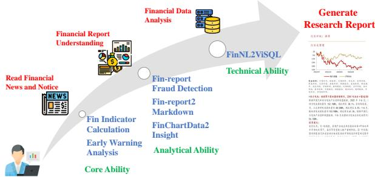  
Figure 1: The job skills and their corresponding task names required for financial analysts to manage daily work. Text highlighted in green denotes the standard capabilities of financial analysts.

Figure 1 illustrates the daily workflow of a financial analyst 1. First, analysts engage with news and company announcements, assess public sentiment, and calculate relevant metrics—tasks that require Core Ability. Second, they review corporate financial statements to extract data, evaluate anomalies, and formulate opinions, demonstrating their Analytical Ability. Lastly, using data analysis techniques to derive insights and generate research reports exemplifies their Technical Ability. Using LLMs to assist financial analysts presents unique opportunities, but existing datasets do not adequately evaluate the capabilities and limitations of LLMs in this specific scenario. This financial scenario stands in stark contrast to previous financial benchmarks like BBT-CFLEB (Lu et al., 2023), FinEval (Zhang et al., 2023), and ICE-PIXIU (Hu et al., 2024), which primarily focus on evaluating financial concepts through traditional NLP tasks. Unlike these, financial data analysis demands the synthesis of information from diverse sources, the formulation of pertinent questions, and the application of advanced technical skills for in-depth data analysis and interpretation.

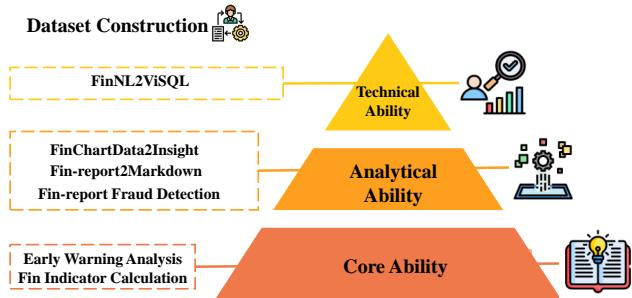  
Figure 2: FinDABench aims to provide a multi-faceted evaluation framework that mirrors the multifarious nature of financial data analysis tasks.

To address this challenge, we introduce FinDABench, a pioneering benchmark specifically designed to probe the depths of LLMs data analysis capabilities within the financial data analysis domain. Inspired by Bloom’s Taxonomy (Krathwohl, 2002) and Thinking, Fast and Slow (Kahneman, 2011; Bengio, 2019), which provide a widely recognized framework for categorizing tasks (Yu et al., 2023), we developed a three-tiered framework to evaluate the financial data analysis capabilities of large models. The dataset framework diagram is shown in Figure 2. FinDABench evaluates LLM skills involving domain-specific knowledge, including financial indicator calculations that encompass 0-7 rounds of interactive calculations (Fin Indicator Calculation) and corporate sentiment risk assessment, covering 145 fine-grained labels (Early Warning Analysis). It is essential for LLMs to extract structured financial tables from reports, constructing tables of varying complexity labeled as Simple, Medium, Hard, and Extra Hard (Fin-report2Markdown), and introduce new tasks to interpret real-world financial charts (FinChartData2Insight). Furthermore, the detection of financial fraud in reports, previously limited to credit fraud (Fin-reportfraud detection), is now included. Additionally, it is crucial to perform multi-perspective analysis skillfully and generate corresponding visualizations (FinNL2ViSQL).

FinDABench comprises 6 sub-tasks, which fall under three categories of task types: classification, extraction, and generation. Together, these tasks constitute a comprehensive suite that rigorously tests the models across the spectrum of skills required in financial data analysis. Our goal is to establish a standard for in-depth evaluation of LLMs in the context of finance and to catalyze further advancement in applying LLMs to data analysis. By doing so, we hope to bridge the gap between the capabilities of general-purpose LLMs and the specialized demands of financial data analysis, paving the way for more sophisticated and reliable AI tools in the realm of business and beyond.

Our contributions are summarized as follows:

• We introduce FinDABench, the first benchmark featuring six sub-tasks across three dimensions, with 15,200 training instances and 8,900 evaluation instances, designed to assess the financial data analysis capabilities of Large Language Models.

• We systematically benchmark 45 popular LLMs’ financial data analysis capabilities for the first time. On top of their performance on FinDABench, we offer deep insights into the status quo of LLMs’ development and highlight the deficiencies that need improvements.

• We evaluate the most recent methods on FinDABench. Our benchmark poses challenges to existing techniques. Notably, the SoTA GPT-4 achieves only a 32.37% total result in zero-shot settings, while the performance of all other methods falls below 30%.

## 2 Related work

## 2.1 Financial Evaluation Benchmarks

We introduce several publicly available datasets and summarize them in Table 1. CFBenchmark (Lei et al., 2023) and BBT-Fin (Lu et al., 2023) evaluate financial NLU and generation capabilities across dimensions including summarization, question answering and classification. FinEval (Zhang et al., 2023) offers thousands of multiple-choice question-answering pairs that serve as evaluation suites for LLMs. CFLUE (Zhu et al., 2024) is a collection of high-quality multiplechoice questions, with over 16k test instances across distinct groups of NLP tasks. ICE-PIXIU (Hu et al., 2024) and FinBen (Xie et al., 2024) aggregates existing financial datasets, covering tasks such as semantic matching, entity recognition, and question answering, encompassing all aspects of financial natural language processing. SuperCLUE-Fin (Xu et al., 2024) spans six realworld scenarios and 25 subtasks, evaluating models in financial contexts across two dimensions. Compared to the aforementioned financial benchmarks, our proposed FinDABench focuses on financial data analysis scenarios and evaluates the report generation capabilities of LLMs.

<table><tr><td>Benchmark</td><td>Data Source</td><td>Evaluation Angle</td><td>Core Ability</td><td>Anakytical Ability</td><td>Technical Ability</td><td>Training</td></tr><tr><td>BBT-Fin (Lu et al., 2023)</td><td>Existing datasets</td><td>Financial knowledge</td><td></td><td>X</td><td>X</td><td>X</td></tr><tr><td>FinEval (Zhang et al., 2023)</td><td>Academic books</td><td>Financial subject knowledge</td><td></td><td>X</td><td>x</td><td>X</td></tr><tr><td>SuperCLUE-Fin (Xu et al., 2024)</td><td>Exams &amp; Academic books</td><td>Financial knowledge</td><td></td><td>X</td><td>x</td><td>X</td></tr><tr><td>CFLUE (Zhu et al., 2024)</td><td>Exams &amp; Existing datasets</td><td>Financial knowledge</td><td></td><td>X</td><td>x</td><td></td></tr><tr><td>FinBen (Xie et al., 2024)</td><td>Existing datasets</td><td>Financial knowledge</td><td></td><td></td><td>x</td><td>X</td></tr><tr><td>ICE-PIXIU (Hu et al., 2024)</td><td>Existing datasets</td><td>Financial knowledge</td><td></td><td></td><td>x</td><td>x</td></tr><tr><td>FinDABench (ours)</td><td>Real scenarios</td><td>Finanical data analysis</td><td></td><td></td><td></td><td></td></tr></table>

Table 1: Comparison of FinDABench with most recent financial benchmarks: FinDABench is the first and the only benchmark that focuses on the financial data analysis domain. "Training" means providing a training dataset.

## 2.2 Financial Large Language Models

Mate-AI’s open-source LLaMA (Touvron et al., 2023) model has driven the development of large financial models such as FinGPT (Wang et al., 2023) and FinMA (Xie et al., 2023), which apply LoRA (Hu et al., 2021) fine-tuning technology to the financial domain. XuanYuan 2.0 (Zhang and Yang, 2023) has shown improvements in model capability by dynamically adjusting the proportion of domain knowledge during the pre-training phase and incorporating a vast amount of specialized financial corpus. With the emergence of generalpurpose large models like Baichuan (Yang et al., 2023) and Qwen (Yang et al., 2024), Chinese financial models such as DISC-FinLLM (Chen et al., 2023) and Tongyi-Qwen have also appeared. DISC-FinLLM has been fine-tuned on 250,000 financial data entries to enhance its capabilities in financial consulting and financial tasks, while Tongyi-Qwen employs 200 billion high-quality financial industry corpora for incremental learning and extends the financial vocabulary.

## 3 FinDABench

We present FinDABench, the first benchmark specifically designed to evaluate the financial data analysis capabilities of LLMs, comprising 15,200 training instances and 8,900 test instances. Subsequent sections will detail the guidelines for dataset construction based on task levels, describe FinDABench’s data and annotation structure, and present statistics of the dataset. Examples of these tasks are illustrated in Figure 3.

## 3.1 Core Ability

The Foundational ability level measures essential skills for numerical computations and requires keen awareness of daily news that can impact financial markets. Professionals with this ability are equipped to interpret and respond to market fluctuations and news developments, providing the foundation for making timely and informed decisions.

Fin Indicator Calculations (1-1): Task definition: Financial indicator calculations based on text fromfinancial reports.

Performing indicator calculations based on financial reports is a fundamental skill for financial analysts. We modified the ConvFinQA dataset (Chen et al., 2022) by first translating English financial reports and questions using GLM-4. Specifically, we provided a translation prompt along with detailed requirements for the financial reports, which are outlined in Appendix B.2.1. As these reports contain both text and tables, and to prevent information loss during translation, we opted not to translate the table content, adhering instead to heuristic rules. After translation, manual checks ensured that the text conformed to the grammatical norms of the Chinese context. Additionally, we sampled 1,800 data entries based on the number of computational rounds, selecting samples with interaction counts ranging from zero to seven.

Early Warning Analysis (1-2): Task definition: extract the company entities from news, along with their associated opportunity and risk labels.

Sentiment is one of the crucial indicators in financial data analysis for assessing the status of a company. Comprehensively evaluating a company’s sentiment status, we have constructed a three-tier sentiment tagging system from a corporate perspective, set against the backdrop of the financial market and incorporating extensive industry expert experience. The primary labels are Opportunity labels (positive) and Risk labels (negative). Opportunity labels include secondary labels that represent potential opportunities such as market, policy, financing, investment, innovation, and strategic opportunities, with a total of 76 tertiary sub-labels. Risk labels encompass secondary labels for potential challenges including financial, investment, market, governance, and external risks, with a total of 69 tertiary sub-labels. A detailed description of the labeling system is in AppendixB.3.

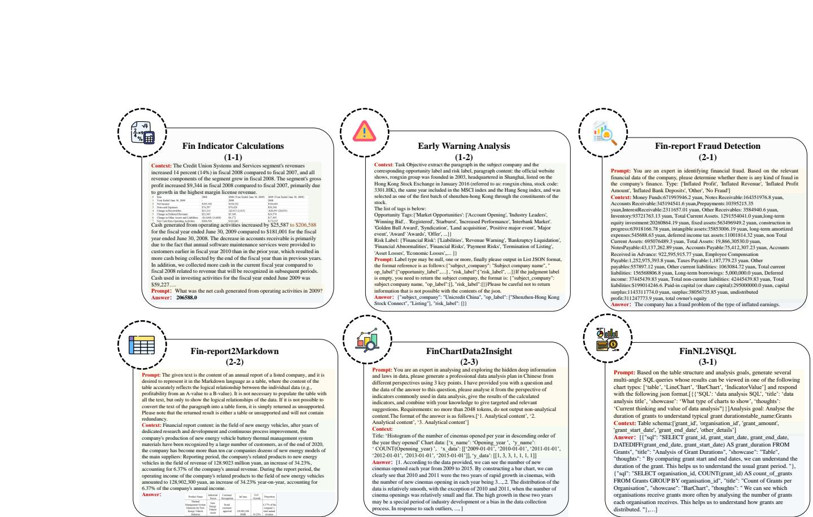  
Figure 3: Data examples for the six sub-tasks of FinDABench, each including questions and answers with a unique identifier to facilitate differentiation. For the Chinese version, please see the Appendix A.

We scraped 3,000 company news articles from financial news websites and used regular expressions to extract the news summaries. After filtering out duplicates and irrelevant content, we retained 2,100 news summaries. Initially, we used sentiment keywords for rough labeling and then conducted a manual review to ensure the accuracy of the labels.

## 3.2 Analytical Ability

The analytical ability level demands a deep understanding of financial reports, surpassing basic data comprehension. It involves discerning potential fraud in financial statements and conducting indepth analyses of chart data. Professionals with these skills can interpret explicit content and critically assess an organization’s financial health and integrity, thus offering valuable insights.

Fin-report Fraud Detection (2-1): Task definition: infer potentialfinancialfraud infinancial statements based on financial report data and financial knowledge..

Determining whether a company’s financial data involves fraud is foundational for subsequent analytical research. Based on the Securities Reg-2 ulatory Commission’s penalty announcements and financial experts’ expertise, we categorize financial fraud into six types: overstated profits, inflated revenue, exaggerated profit margins, inflated bank deposits, other, and no fraud. We obtained names of companies involved in financial fraud from the Commission’s penalty announcements and downloaded the corresponding financial reports. We then extracted key accounting data from the financial statement tables in these reports,annotated them based on the Commission’s regulatory provisions, and conducted manual checks, ultimately generating 1,000 data entries.

Fin-report2Markdown (2-2): Task definition: convert unstructured information from financial reports into Markdown format by logically organizing the numerical data.

<table><tr><td rowspan="2">Cognitive Level</td><td rowspan="2">ID</td><td rowspan="2">Task</td><td colspan="2">Data size</td><td rowspan="2">Metric</td><td rowspan="2">Type</td></tr><tr><td>Train</td><td>Test</td></tr><tr><td>Core</td><td>1-1</td><td>Fin Indicator Calculations</td><td>3,000</td><td>1,800</td><td>Accuracy</td><td>Generation</td></tr><tr><td>Ability</td><td>1-2</td><td>Early Warning Analysis</td><td>2,000</td><td>2,100</td><td>F1</td><td>Extraction</td></tr><tr><td rowspan="3">Analytical Ability</td><td>2-1</td><td>Fin-report fraud detection</td><td>2,200</td><td>1,000</td><td>F1</td><td>Classification</td></tr><tr><td>2-2</td><td>Fin-report2Markdown</td><td>1,400</td><td>1,200</td><td>ROUGE,BLEU</td><td>Generation</td></tr><tr><td>2-3</td><td>FinChartData2Insight</td><td>2,800</td><td>1,500</td><td>ROUGE,BLEU</td><td>Generation</td></tr><tr><td>Technical Ability</td><td>3-1</td><td>FinNL2ViSQL</td><td>3,800</td><td>1,300</td><td>EM</td><td>Generation</td></tr></table>

Table 2: Basic information for FinDABench.

Extracting and converting unstructured data into tabular format showcases a financial analyst’s analytical skills. We downloaded 1,200 PDF financial reports from the Shanghai Stock Exchange 3. Using the PDF parsing tool pdfumber, we extracted unstructured content based on chapter structure, ensuring paragraph integrity. Based on the expertise of financial professionals, Section 3 of these reports (Company Overview/Management Discussion and Analysis) often contains crucial data; thus, we selected this section as the unstructured data for conversion. We utilized GPT-4 for data annotation, providing it with specific prompt and detailed requirements for financial reports, as detailed in AppendixB.2.2. Finally, the data underwent manual review and correction to ensure accuracy.

FinChartData2Insight (2-3): Task definition: Generate data analysis suggestions and insights from the given financial chart data.

Generating viewpoints from chart data showcases the data reasoning skills of financial analysts. We selected 1,500 finance-related data entries from nvBench’s (Luo et al., 2021) charts, categorized by difficulty into Easy, Medium, and Hard levels. During the annotation process, we first translated queries in the data into Chinese, treating these queries as captions for the charts. We then fed Xaxis and Y-axis data, along with the captions, into GPT-4. In particular, we provided it with prompt and specific requirements for chart data, as detailed in the AppendixB.2.3. Finally, the insights were reviewed by two senior financial data analysts.

## 3.3 Technical Ability

The technical ability demands that LLMs embrace data-centric thinking and master external tools like SQL for sophisticated financial data analyses. This proficiency enables analysts to devise diverse analytical strategies, select optimal visualization types, and generate executable queries. With these skills, financial analysts can clearly translate complex datasets into actionable insights, boosting data in-

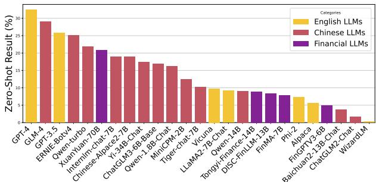  
Figure 4: Displays the best-performing model in each category on FinDABench. Details on the average performance (zero-shot) of the 45 LLMs are available in Appendix Table14.

terpretation and utility.

FinNL2ViSQL (3-1): Task definition: Generate SQL analysis statements from given questions and table structures, considering multiple perspectives.

Generating multi-perspective data analyses and visualizations from databases is an advanced capability for financial analysts. Using the singletable structure from financial reports, we employed few-shot learning with GPT-4 to align data analysis goals closely with real-world scenarios each single-table; detailed instructions for this approach are presented in Appendix B.2.4. We defined four visualization chart types: Table, LineChart, Bar-Chart, and IndicatorValue, and required annotators to justify their SQL queries. Two senior financial analysts crafted multi-perspective SQL queries and selected appropriate visualization types based on the table structure and objectives. Additionally, we categorized tasks by difficulty levels: Basic, Intermediate, and Advanced.

For a detailed overview of our annotation norms and consistency, please refer to the Appendix B.1.

## 3.4 Inner Annotator Agreements

To evaluate the reliability of the argument component annotations, we follow the approach of Kennard et al. (2022) and Cheng et al. (2022), using Cohen’s kappa to compute the Inter-Annotator Agreement (IAA). A total of 24,100 instances are labeled and the average Cohen’s kappa is 72.36% among the three groups of annotators, which is a reasonable and relatively high agreement considering the annotation complexity (Cheng et al., 2022; Kennard et al., 2022) . Further details on IAA calculation can be found in Appendix B.1.

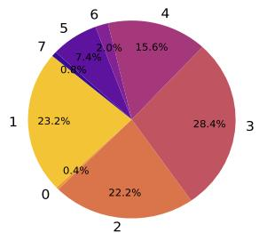  
(a) Interaction Rounds Data Distribution

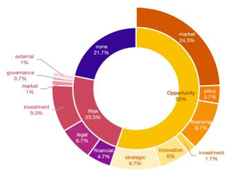  
(b) Distribution of opportunity and risk labels

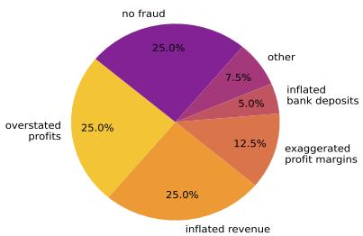  
(c) Fraudulent labels distribution

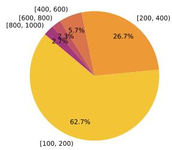  
(d) Length distribution

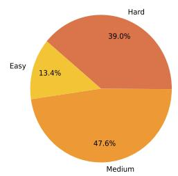  
(e) Difficulty distribution

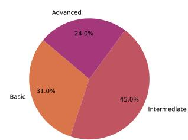  
(f) Distinction distribution  
Figure 5: The statistical information for each sub-task of FinDABench is as follows: (a) represents Numberical Calculation QA, (b) represents Early Warning Analysis, (c) represents Fin-Report Fraud Detection, (d) represents Fin-Report2Markdown, (e) represents ChartData2Insight, and (f) represents NL2VisQL.

## 4 Experiments

## 4.1 Dataset Statistics

Table 2 displays the count, evaluation metrics, and types for each sub-task. The Foundational Ability comprises 3,900 data entries, the Reasoning Ability includes 4,900 entries, and the Technical Skill has 1,300 entries, along with the task types and evaluation metrics for each sub-task. Details of the sub-task data distribution are shown in Figure 5. Figure 5 (a) and (b) describe the data distribution for Foundational Ability, with (b) showing that opportunity labels account for 55% and risk labels for 23.3%. The other pie charts follow similarly.

## 4.2 Evaluation Metrics

We defined 4 different metrics in total to measure different types of tasks: For the 1-1 task, we use accuracy to measure answer prediction capability. For the 1-2 and 2-1 tasks, we employ the Macro F1 score. For the 2-2 and 2-3 tasks, we report BLEU (Papineni et al., 2002) and ROUGE (Lin, 2004) scores. For the 3-1 task, we use EM (Exact Set Match) (Yu et al., 2018) to evaluate the consistency between the predicted View SQL and the Gold SQL elements.

## 4.3 Evaluated Models

We evaluate a wide spectrum of large language models of various sizes, grouping them into three major categories based on their pre-training and fine-tuning domains: English LLMs, Chinese LLMs, Financial LLMs. We provide a short review of them in the following section. The detailed model list is shown in Appendix Table 8.

English LLMs: We consider 10 open-source English models: LLaMA-2-7B / 13B / 70B, LLaMA-2-Chat-7B / 13B / 70B, Alpacav1.0- 7B, Vicunav1.3-7B, WizardLM-7B, Phi-2B. In addition, two commercial models, GPT-3.5-turbo-0613 and GPT-4-0613, are included.

Chinese LLMs: A number of Chinese LLMs have been proposed to enhance Chinese comprehension. They typically perform better than English models on Chinese NLP tasks. We include 24 open-sourced, Chinese LLMs in our evaluation: Yi-Base-6B/34B, Yi-Chat-6B/34B, InternLM-Base-7B/20B, InternLM-Chat-7B/20B, Qwen-Base-1.8B/7B/14B, Qwen-Chat-7B/14B, Baichuan2- Base-7B/13B, Baichuan2-Chat-7B/13B, TigerBot-Base-7B, TigerBot-Chat-7B, Chinese-Alpace2-7B, ChatGLM2-6B, ChatGLM3-Base-6B, ChatGLM3- 6B, MiniCPM-2B. Moreover, three commercial models, Qwen-turbo , ERNIEv4.0 and GLM-4 , are included.

Financial LLMs: Certain Chinese-oriented LLMs are further fine-tuned on Chinese corpus in the financial domain to improve LLMs’ understanding of Chinese financials. We include 6 Financial LLMs in our evaluation: FinGPTV3-6B, FinMA-7B, DISC-FinLLM-13B, Tongyi-Finance-14B, XuanYuan-Chat-13B/70B. All these models have been fine-tuned on Chinese financial corpora.

<table><tr><td rowspan="2">Type</td><td rowspan="2">Model</td><td>1-1</td><td>1-2</td><td></td><td colspan="4">2-2</td><td colspan="6">2-3</td><td colspan="3">3-1</td></tr><tr><td>ACC</td><td>F1</td><td>F1</td><td>BLEU-1</td><td>BLEU-4</td><td>R-1</td><td>R-2</td><td>R-L</td><td></td><td>BLEU-1</td><td>BLEU-4</td><td>R-1</td><td>R-2</td><td></td><td>R-L EM</td></tr><tr><td rowspan="6">English Model</td><td>LLaMA2-7B-Chat0-shot</td><td>0.70</td><td>0.10</td><td>18.00</td><td>12.32</td><td>5.47</td><td>24.67</td><td>13.23</td><td>18.39</td><td></td><td>6.67</td><td>2.58</td><td>3.67</td><td>0.23</td><td>0.50</td><td>5.72</td></tr><tr><td>LLaMA2-7B-Chat3-shot</td><td>0.92</td><td>0.32</td><td>20.23</td><td>15.91</td><td>7.80</td><td>28.72</td><td>14.36</td><td>23.58</td><td>9.69</td><td></td><td>3.25</td><td>7.63</td><td>0.78</td><td>1.23</td><td>7.21</td></tr><tr><td> $\mathrm { G P T } { - } 3 . 5 _ { 0 - s h o t }$ </td><td>0.81</td><td>24.30</td><td>26.30</td><td>13.00</td><td>6.38</td><td>37.25</td><td>14.87</td><td>24.17</td><td></td><td>10.86</td><td>5.26</td><td>23.73</td><td>12.84</td><td>10.95</td><td>9.89</td></tr><tr><td>GPT-3.53-shot</td><td>2.93</td><td>25.86</td><td>40.45</td><td>16.20</td><td>9.27</td><td>42.32</td><td>16.53</td><td>28.32</td><td></td><td>13.46</td><td>8.37</td><td>29.37</td><td>14.67</td><td>16.37</td><td>11.78</td></tr><tr><td>GPT-40-shot</td><td>10.30</td><td>71.77</td><td>57.64</td><td>23.83</td><td>12.56</td><td>42.36</td><td>18.27</td><td>29.51</td><td></td><td>18.24</td><td>10.21</td><td>20.89</td><td>9.27</td><td>10.27</td><td>10.21</td></tr><tr><td>GPT-43-shot</td><td>15.45</td><td>82.31</td><td>65.21</td><td>28.35</td><td>15.32</td><td>48.67</td><td>19.34</td><td>33.27</td><td></td><td>21.85</td><td>14.96</td><td>23.26</td><td>10.81</td><td>13.45</td><td>11.01</td></tr><tr><td rowspan="10">Chinese Model</td><td>GLM-40-shot</td><td>3.64</td><td>22.03</td><td>15.14</td><td>24.21</td><td>11.23</td><td>39.26</td><td>15.28</td><td>25.75</td><td>17.36 20.96</td><td>11.87</td><td>25.87</td><td></td><td>12.36</td><td>14.79</td><td>10.58</td></tr><tr><td>GLM-43-shot</td><td>9.45</td><td>28.67</td><td>29.34</td><td>29.51</td><td>15.35</td><td>41.37</td><td>17.36</td><td>26.35</td><td></td><td></td><td>14.68</td><td>29.76</td><td>15.35</td><td>17.84</td><td>12.58</td></tr><tr><td> $\mathrm { E R N I E v } 4 _ { 0 - s h o t }$ </td><td>2.99</td><td>19.23</td><td>12.13</td><td>11.47</td><td>5.21</td><td>38.26</td><td>14.59</td><td>24.32</td><td></td><td>9.26</td><td>4.26</td><td>23.67</td><td>11.31</td><td>13.56</td><td>9.62</td></tr><tr><td> $\mathrm { E R N I E v } 4 _ { 3 - s h o t }$ </td><td>7.26</td><td>23.54</td><td>24.58</td><td>12.37</td><td>7.83</td><td>39.41</td><td>15.21</td><td>25.75</td><td></td><td>11.23</td><td>5.95</td><td>25.83</td><td>13.42</td><td>16.93</td><td>10.32</td></tr><tr><td>Qwen-turbo0-shot</td><td>8.49</td><td>15.60</td><td>21.10</td><td>24.86</td><td>17.36</td><td>44.20</td><td>17.86</td><td>32.27</td><td></td><td>9.65</td><td>4.31</td><td>10.23</td><td>3.23</td><td>1.62</td><td>5.72</td></tr><tr><td> $\mathrm { Q w e n - t u r b o _ { 3 - s h o t } }$ </td><td>12.32</td><td>19.32</td><td>25.32</td><td>27.76</td><td>19.58</td><td>46.31</td><td>18.68</td><td>35.57</td><td></td><td>10.32</td><td>5.86</td><td>13.42</td><td>5.76</td><td>8.89</td><td>8.63</td></tr><tr><td>Internlm-chat-7B0-shot</td><td>1.66</td><td>28.98</td><td>20.45</td><td>23.60</td><td>16.39</td><td>42.12</td><td>15.96</td><td>29.48</td><td></td><td>12.31</td><td>7.26</td><td>8.23</td><td>2.12</td><td>1.25</td><td>5.34</td></tr><tr><td>Internlm-chat-7B3-shot</td><td>5.27</td><td>31.24</td><td>18.65</td><td>26.71</td><td>18.46</td><td>43.46</td><td>18.26</td><td>31.27</td><td></td><td>14.98</td><td>9.37</td><td>9.62</td><td>4.41</td><td>3.21</td><td>7.52</td></tr><tr><td>Yi-34-Chat0-shot Yi-34-Chat3-shot</td><td>7.26</td><td>14.11</td><td>7.53</td><td>24.37</td><td>14.46</td><td>42.08</td><td>15.58</td><td>29.41</td><td></td><td>8.23</td><td>4.25</td><td>8.02</td><td>2.01</td><td>1.11</td><td>3.45</td></tr><tr><td></td><td>9.23</td><td>16.48</td><td>10.37</td><td>28.39</td><td>17.85</td><td>42.35</td><td>15.87</td><td>30.23</td><td></td><td>10.79</td><td>6.87</td><td>10.57</td><td>3.26</td><td>5.87</td><td>5.89</td></tr><tr><td rowspan="8">Financial Model</td><td>FinGPTV3-6B0-shot</td><td>0.81</td><td>1.20</td><td>5.26</td><td>7.85</td><td>1.42</td><td>10.34</td><td>7.29</td><td>9.26</td><td></td><td>6.78</td><td>2.33</td><td>4.27</td><td>0.62</td><td>0.87</td><td>3.75</td></tr><tr><td>FinGPTV3-6B3-shot</td><td>1.27</td><td>2.39</td><td>6.46</td><td>8.51</td><td>3.17</td><td>12.37</td><td>9.52</td><td>10.95</td><td>7.28</td><td></td><td>4.36</td><td>5.72</td><td>1.36</td><td>3.95</td><td>4.61</td></tr><tr><td>XuanYuan-13B0-shot</td><td>8.24</td><td>14.39</td><td>13.97</td><td>16.38</td><td>8.35</td><td>38.75</td><td>14.39</td><td>25.17</td><td></td><td>9.63</td><td>5.34</td><td>6.29</td><td>1.12</td><td>0.85</td><td>4.08</td></tr><tr><td>XuanYuan-13B3-shot</td><td>10.29</td><td>18.22</td><td>17.40</td><td>19.32</td><td>10.90</td><td>38.82</td><td>14.75</td><td>26.82</td><td></td><td>11.80</td><td>7.64</td><td>6.71</td><td>2.37</td><td>2.38</td><td>6.31</td></tr><tr><td>Tongyi-Finance-14B0-shot</td><td>6.25</td><td>10.23</td><td>10.78</td><td>8.83</td><td>5.46</td><td>25.60</td><td>11.87</td><td>20.36</td><td></td><td>7.93</td><td>4.86</td><td>5.26</td><td>1.03</td><td>0.94</td><td>4.81</td></tr><tr><td>Tongyi-Finance-14B3-shot</td><td>8.96</td><td>12.46</td><td>13.62</td><td>12.70</td><td>10.91</td><td>28.73</td><td>13.41</td><td>23.57</td><td></td><td>9.76</td><td>6.75</td><td>5.82</td><td>2.01</td><td>1.93</td><td>5.34</td></tr><tr><td>XuanYuan-70B0-shot</td><td>11.23</td><td>22.40 26.65</td><td>21.33 21.03</td><td>25.79</td><td>11.36</td><td>47.21</td><td>19.32</td><td>36.28</td><td>14.32</td><td></td><td>9.56</td><td>9.68</td><td>2.31</td><td>5.87</td><td>4.30</td></tr><tr><td>XuanYuan-70B3-shot</td><td>18.3</td><td></td><td></td><td>27.94</td><td>14.46</td><td>48.52</td><td>20.76 11.65</td><td>38.67 21.36</td><td>8.68</td><td>17.35</td><td>11.47</td><td>13.02 12.37</td><td>4.96</td><td>8.67</td><td>8.72 9.25</td></tr><tr><td rowspan="6">SFT Model</td><td>ChatGLM3-6B-FinDA0-shot ChatGLM3-6B-FinDA3-shot</td><td>5.23 6.37</td><td>25.31 27.85</td><td>28.39 30.41</td><td>27.37 29.40</td><td>15.85 18.71</td><td>32.86 34.32</td></table>

Table 3: Fine-grained results of FinDABench: Performance of various LLMs on the detailed sub-tasks in 0-shot and 3-shot scenarios. The best results are highlighted in bold, and the second-best results are underlined.

<table><tr><td rowspan="2">Type</td><td rowspan="2">Model</td><td>1-1</td><td>1-2</td><td>2-1</td><td colspan="2">2-2</td><td colspan="2">2-3</td><td>3-1</td></tr><tr><td>Acc</td><td>F1</td><td>F1</td><td>BLEU-4</td><td>R-L</td><td>BLEU-4</td><td>R-L</td><td>EM</td></tr><tr><td rowspan="9">Base LLMs</td><td>LLaMA2-70B</td><td>3.60</td><td>4.27</td><td>0.43</td><td>3.58</td><td>2.15</td><td>4.24</td><td>0.98</td><td>2.18</td></tr><tr><td>LLaMA2-13B</td><td>0.71</td><td>0.28</td><td>0.32</td><td>3.24</td><td>1.74</td><td>2.67</td><td>0.17</td><td>1.69</td></tr><tr><td>LLaMA2-7B</td><td>0.24</td><td>0.00</td><td>0.10</td><td>2.65</td><td>0.52</td><td>1.63</td><td>0.14</td><td>0.39</td></tr><tr><td>Qwen-14B</td><td>1.46</td><td>5.63</td><td>0.38</td><td>4.75</td><td>2.83</td><td>3.64</td><td>1.02</td><td>2.52</td></tr><tr><td>Qwen-7B</td><td>0.52</td><td>0.56</td><td>0.28</td><td>3.75</td><td>0.72</td><td>1.79</td><td>0.26</td><td>0.53</td></tr><tr><td>Baichuan2-13B</td><td>1.13</td><td>4.68</td><td>0.27</td><td>5.26</td><td>2.51</td><td>4.72</td><td>0.84</td><td>2.18</td></tr><tr><td>Baichuan2-7B</td><td>0.62</td><td>3.74</td><td>0.15</td><td>4.62</td><td>0.52</td><td>2.84</td><td>0.23</td><td>0.77</td></tr><tr><td>ChatGLM3-6B</td><td>4.65</td><td>5.63</td><td>1.26</td><td>5.91</td><td>2.46</td><td>5.79</td><td>1.52</td><td>3.67</td></tr><tr><td>Xuan Yuan-70B</td><td>11.23</td><td>22.40</td><td>21.33</td><td>11.36</td><td>36.28</td><td>9.56</td><td>5.87</td><td>4.30</td></tr><tr><td rowspan="5">Financial LLMs</td><td>XuanYuan-13B</td><td>8.24</td><td>14.39</td><td>13.97</td><td>8.35</td><td>25.17</td><td>5.34</td><td>0.85</td><td>4.08</td></tr><tr><td>FinMA-7B</td><td>5.62</td><td>8.73</td><td>10.26</td><td>3.63</td><td>17.52</td><td>3.21</td><td>0.62</td><td>3.84</td></tr><tr><td>Tongyi-Finance-14B</td><td>6.25</td><td>10.23</td><td>10.78</td><td>5.46</td><td>20.36</td><td>4.86</td><td>0.95</td><td>4.81</td></tr><tr><td>DISC-FinLLM-13B</td><td>6.03</td><td>9.68</td><td>11.35</td><td>5.32</td><td>18.87</td><td>4.15</td><td>0.84</td><td>3.59</td></tr><tr><td>FinGPTV3-6B</td><td>4.21</td><td>5.78</td><td>6.73</td><td>2.81</td><td>10.25</td><td>2.16</td><td>0.35</td><td>2.56</td></tr><tr><td rowspan="3">SFT LLMs</td><td>ChatGLM3-6B-FinDA</td><td>5.23</td><td>25.31</td><td>28.39</td><td>15.85</td><td>21.36</td><td>4.26</td><td>11.35</td><td>9.25</td></tr><tr><td>Baichuan2-7B-FinDA</td><td>4.26</td><td>23.61</td><td>25.98</td><td>12.75</td><td>18.46</td><td>3.36</td><td>10.27</td><td>8.10</td></tr><tr><td>Qwen-7B-FinDA</td><td>9.21</td><td>27.83</td><td>30.38</td><td>12.32</td><td>20.79</td><td>8.46</td><td>12.72</td><td>10.31</td></tr></table>

Table 4: Comparison between different parameter Financial specific LLMs and their base models.

SFT LLMs: We perform additional fine-tuning on the open-source models using the training dataset. Specifically, we utilize LoRA for finetuning ChatGLM3-6B, Qwen2-7B, and Baichuan2- 7B, setting the rank to 8, alpha to 32, and dropout to 0.1. This process is executed on four NVIDIA 3090/24G GPUs. The maximum length is set to 2400, and the batch size is 2, with a gradient accumulation step of 8.

## 4.4 Experiment Setting

In the large language models, we set the temperature to 0.7 and top p to 1. We tailor the prompt by using specific prefixes and suffixes for each model. We set the token length limit to 2400. Right truncation is performed for input prompts exceeding the length limitation. We evaluate all models in zero-shot and few-shot settings.

## 4.5 Main Results

Figure 14 shows the overall zero-shot performance of each model. Our findings include the following: Firstly, GPT-4 and GLM-4 lead the benchmarks, vastly surpassing all others. Secondly, LLMs of the same model size underwent SFT in Chinese outperformed both base Chinese LLMs and English SFT LLMs, demonstrating the effectiveness of finetuning on Chinese data. Furthermore, smaller models, such as Qwen-1.8B-Chat and MiniCPM-2B, also outperform many larger LLMs, showing that an LLM’s capabilities and its size are not linearly related. Lastly, Financial LLMs outperform open-source general LLMs, suggesting that domain-specific fine-tuning enhances a model’s domain capabilities. Additionally, Fine-tuning general domain LLMs with LoRA on the FinDABench dataset significantly boosts their performance. For example, the accuracy of Qwen-7B increases to 23.81% from 19.87%. Even with only 4% of the parameters used in FinGPTV3-6B, FinMA-7B, Tongyi-Fiance-14B, and DISC-FinLLM-13B all surpass LLaMA2-70B-Chat.

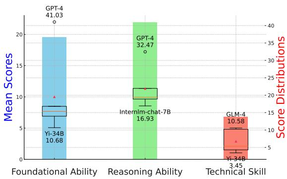  
Figure 6: Display the average scores and variance for the GPT-4, GLM4, XuanYuan-70B, Yi-34B, and Internlmchat-7B models across three dimensions, showing only the highest and lowest scores for each model.

In Table 3, we display the fine-grained scores of different model configurations across all tasks. We made several observations. First, there is substantial variation in the distribution of scores across tasks. The best-performing model, such as GPT-4, can score over 60 in tasks 1-2 and 2-1 but does not exceed 30 in tasks 3-1 and 2-3. This demonstrates that our benchmark effectively assesses model capabilities in various aspects. Second, it is evident that scores under few-shot conditions are consistently higher than those under zero-shot across all model types. Third, it is promising that most LLMs exhibit some capability in handling financial data analysis tasks, yet there is still considerable room for improvement. Even the top-performing model, GPT-4, achieves only an average score of 32.37% in zero-shot and 39.38% in few-shot, highlighting the need for further efforts in the future.

## 5 In-depth Analysis

We have selected representative LLMs for in-depth analysis based on their types and high scores.

Financial-specific fine-tuning proves beneficial but has limitations. To assess the impact of financial domain knowledge fine-tuning, we compared three LLMs, specifically fine-tuned with financial domain knowledge, against their corresponding base models, as shown in Table 4. Notably, the XuanYuan models show continuous score improvements after financial-specific knowledge fine-tuning. A closer examination of the 6 subtasks reveals that LLaMA2-13B and 70B perform poorly across all tasks, indicating a lack of pretraining on a large-scale, high-quality financial corpus. Nonetheless, fine-tuning with financial knowledge significant improvements. However, XuanYuan models do not excel in tasks 2-3 and 3-1 post-fine-tuning, suggesting that fine-tuning alone may not suffice for complex financial data analysis tasks. possibly necessitating further research with Agents (Pan et al., 2024; QwenLM, 2023).

<table><tr><td rowspan="2">Model</td><td rowspan="2">Generate avg Len</td><td colspan="5">Table Type Num</td></tr><tr><td>None</td><td>Simple</td><td>Medium</td><td>Hard</td><td>Extra Hard</td></tr><tr><td>GPT-4</td><td>125.15</td><td>141</td><td>8</td><td>110</td><td>32</td><td>9</td></tr><tr><td>GLM-4</td><td>198.56</td><td>265</td><td>0</td><td>7</td><td>19</td><td>9</td></tr><tr><td>Yi-34B</td><td>923.38</td><td>293</td><td>4</td><td>0</td><td>0</td><td>3</td></tr><tr><td>Qwen-14B</td><td>24.82</td><td>296</td><td>2</td><td>2</td><td>0</td><td>0</td></tr><tr><td>Tongyi-Qwen-14B</td><td>123.65</td><td>173</td><td>50</td><td>60</td><td>15</td><td>2</td></tr><tr><td>Xuan Yuan-13B</td><td>416.75</td><td>298</td><td>0</td><td>0</td><td>0</td><td>2</td></tr><tr><td>Internlm-chat-7B</td><td>360.91</td><td>200</td><td>3</td><td>46</td><td>19</td><td>32</td></tr><tr><td>Golden</td><td>268.03</td><td>63</td><td>21</td><td>134</td><td>43</td><td>39</td></tr></table>

Table 5: Compare the detailed data of different models on sub-task 2-2, with descriptions of Table Type available in the Appendix B.4.

LLMs lack reasoning capabilities with financial reports. As shown in Table 5, where we display the table types for sub-task 2-2 Gold and those generated in markdown by various models. We observe that almost all models tend not to create Markdown tables, indicating that current models do not understand the intrinsic reasoning relationship between financial text and numerical data. Among them, the best performers, GPT-4 and GLM-4, prefer generating Medium and Hard tables, which might suggest a slight overfitting in the model training process to generate tables. On the other hand, Yi-34B and Internlm-chat-7B rarely produce tables but generate longer outputs, suggesting that these models have limited capabilities in organizing data. LLMs require further training on data with high information density (Pang et al., 2024), such as tables and formulas, to fully understand the relationships between different types of data and enhance their true logical reasoning capabilities.

Most LLMs lack the capability for financial technical skill. As shown in Figure 6, we selected five models covering a variety of types and model parameters. We display these five models’ average scores and variance across three evaluated dimensions. GPT-4 exhibits a comprehensive advantage in all three categories, particularly in Foundational Ability and Reasoning Ability, with scores of

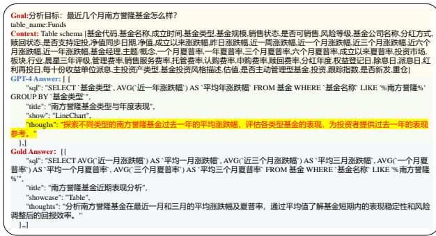  
Figure 7: Case study on the NL2ViSQL task, we highlight large language model analysis error.

41.03 and 32.47, respectively, significantly higher than the other models. This may indicate GPT-4’s strong capability in handling financial data analysis regarding foundational and reasoning abilities. Currently, the capabilities of open-source models are generally poor, and even their performance in foundational ability is not ideal. Most models, including GPT-4 and GLM-4, significantly decline performance on the Technical Skill dimension, indicating a lack of data thinking and analytical abilities. LLMs need to employ a multi-agent framework (Wu et al., 2023a; Park et al., 2023) to simulate real and complex financial analysis scenarios, enhancing their ability to adapt and respond dynamically, before they can be truly applied in real-world financial decision-making contexts.

Case Study. In Figure 7, which displays incorrect analytical results, we noted that GPT-4 lacks essential financial knowledge, failing to properly understand financial reasoning and analysis methods. It mistakenly identifies fund names as financial terminology. This error highlights a broader issue: mastering financial technical skills is a significant challenge for LLMs. Therefore, enhancing LLMs’ understanding of financial terminology is crucial for their practical application.

## 6 Conclusion

In this work, we introduced FinDABench, a benchmark designed to evaluate the capabilities of LLMs in financial data analysis, comprising six tasks across three cognitive dimensions. We conducted a comprehensive examination of 45 LLMs, assessing their performance. The results reveal that current LLMs generally struggle to deliver meaningful data analysis, with poor scores across most tasks. FinDABench is a valuable resource for future research and development financial data analysis.

## Limitations

Insufficient Data Coverage: Although we have developed a financial data analysis evaluation framework encompassing three dimensions, the number of sub-tasks currently included does not fully cover all the challenges present in the financial data analysis landscape. In future work, we plan to collaborate with professional financial institutions to construct a more comprehensive and robust financial evaluation dataset. This enhancement will better gauge the advancements of large models in handling complex financial data analyis scenarios.

Inadequate Evaluation Metrics: The evaluation metrics currently in use are those traditionally applied to NLP tasks. These metrics fail to adequately measure the performance of large models on generative tasks such as Fin-report2Markdown and FinNL2ViSQL, nor do they reflect the financial data analysis thinking inherent to large models. In the future, we intend to design more appropriate evaluation metrics based on the real-world objectives of financial data analysis, thereby providing a truer reflection of the models’ capabilities.

## Ethics Statement

Our dataset originates from existing open-source datasets. We have compensated all data annotators according to their workload and ensure that our dataset will not cause any potential harm.

## Acknowledgements

We appreciate the support from National Natural Science Foundation of China with the Main Research Project on Machine Behavior and Human Machine Collaborated Decision Making Methodology (72192820 & 72192824), Fundamental Research Funds for the Central Universities (2024QKT004), and Pudong New Area Science & Technology Development Fund (PKX2021-R05).

## References

Yoshua Bengio. 2019. From system 1 deep learning to system 2 deep learning. In NeurIPS 2019.

Wei Chen, Qiushi Wang, Zefei Long, Xianyin Zhang, Zhongtian Lu, Bingxuan Li, Siyuan Wang, Jiarong Xu, Xiang Bai, Xuanjing Huang, et al. 2023. Discfinllm: A chinese financial large language model based on multiple experts fine-tuning. arXiv preprint arXiv:2310.15205.

Zhiyu Chen, Shiyang Li, Charese Smiley, Zhiqiang Ma, Sameena Shah, and William Yang Wang. 2022. Convfinqa: Exploring the chain of numerical reasoning in conversational finance question answering. Proceedings ofEMNLP 2022.

Liying Cheng, Lidong Bing, Ruidan He, Qian Yu, Yan Zhang, and Luo Si. 2022. Iam: A comprehensive and large-scale dataset for integrated argument mining tasks. In Proceedings ofthe 60th Annual Meeting of the Association for Computational Linguistics (Volume 1: Long Papers), pages 2277–2287.

Edward J Hu, Yelong Shen, Phillip Wallis, Zeyuan Allen-Zhu, Yuanzhi Li, Shean Wang, Lu Wang, and Weizhu Chen. 2021. Lora: Low-rank adaptation of large language models. arXiv preprint arXiv:2106.09685.

Gang Hu, Ke Qin, Chenhan Yuan, Min Peng, Alejandro Lopez-Lira, Benyou Wang, Sophia Ananiadou, Wanlong Yu, Jimin Huang, and Qianqian Xie. 2024. No language is an island: Unifying chinese and english in financial large language models, instruction data, and benchmarks. arXiv preprint arXiv:2403.06249.

Yuzhen Huang, Yuzhuo Bai, Zhihao Zhu, Junlei Zhang, Jinghan Zhang, Tangjun Su, Junteng Liu, Chuancheng Lv, Yikai Zhang, Jiayi Lei, Yao Fu, Maosong Sun, and Junxian He. 2023. C-eval: A multi-level multi-discipline chinese evaluation suite for foundation models. Preprint, arxiv:2305.08322.

Daniel Kahneman. 2011. Thinking, Fast and Slow. Farrar, Straus and Giroux.

Neha Kennard, Tim O’Gorman, Rajarshi Das, Akshay Sharma, Chhandak Bagchi, Matthew Clinton, Pranay Kumar Yelugam, Hamed Zamani, and Andrew McCallum. 2022. Disapere: A dataset for discourse structure in peer review discussions. In Proceedings of the 2022 Conference of the North American Chapter of the Association for Computational Linguistics: Human Language Technologies, pages 1234–1249.

David R Krathwohl. 2002. A revision of bloom’s taxonomy: An overview. Theory into practice, 41(4):212– 218.

Yang Lei, Jiangtong Li, Ming Jiang, Junjie Hu, Dawei Cheng, Zhijun Ding, and Changjun Jiang. 2023. Cfbenchmark: Chinese financial assistant benchmark for large language model. arXiv preprint arXiv:2311.05812.

Chin-Yew Lin. 2004. ROUGE: A package for automatic evaluation of summaries. In Text Summarization Branches Out, pages 74–81, Barcelona, Spain. Association for Computational Linguistics.

Dakuan Lu, Jiaqing Liang, Yipei Xu, Qianyu He, Yipeng Geng, Mengkun Han, Yingsi Xin, Hengkui Wu, and Yanghua Xiao. 2023. Bbt-fin: Comprehensive construction of chinese financial domain pre-trained language model, corpus and benchmark. arXiv preprint arXiv:2302.09432.

Yuyu Luo, Jiawei Tang, and Guoliang Li. 2021. nvbench: A large-scale synthesized dataset for crossdomain natural language to visualization task. arXiv preprint arXiv:2112.12926.

Meta AI. 2024. Introducing llama3.1. https://ai. meta.com/blog/meta-llama-3-1/. Accessed on July 23, 2024.

OpenAI. 2022. Introducing chatgpt. https://openai. com/blog/chatgpt. Accessed on December 28, 2023.

OpenAI. 2023. Gpt-4 technical report. Preprint, arxiv:2303.08774.

Haojie Pan, Zepeng Zhai, Hao Yuan, Yaojia Lv, Ruiji Fu, Ming Liu, Zhongyuan Wang, and Bing Qin. 2024. Kwaiagents: Generalized information-seeking agent system with large language models. Preprint, arXiv:2312.04889.

Chaoxu Pang, Yixuan Cao, Chunhao Yang, and Ping Luo. 2024. Uncovering limitations of large language models in information seeking from tables. arXiv preprint arXiv:2406.04113.

Kishore Papineni, Salim Roukos, Todd Ward, and Wei-Jing Zhu. 2002. Bleu: a method for automatic evaluation of machine translation. In Proceedings ofthe 40th annual meeting ofthe Associationfor Computational Linguistics, pages 311–318.

Joon Sung Park, Joseph O’Brien, Carrie Jun Cai, Meredith Ringel Morris, Percy Liang, and Michael S Bernstein. 2023. Generative agents: Interactive simulacra of human behavior. In Proceedings of the 36th Annual ACM Symposium on User Interface Software and Technology, pages 1–22.

QwenLM. 2023. https://github.com/QwenLM/ Qwen-Agent/tree/main.

Hugo Touvron, Louis Martin, Kevin Stone, Peter Albert, Amjad Almahairi, Yasmine Babaei, Nikolay Bashlykov, Soumya Batra, Prajjwal Bhargava, Shruti Bhosale, et al. 2023. Llama 2: Open foundation and fine-tuned chat models. arXiv preprint arXiv:2307.09288.

Neng Wang, Hongyang Yang, and Christina Dan Wang. 2023. Fingpt: Instruction tuning benchmark for opensource large language models in financial datasets. arXiv preprint arXiv:2310.04793.

Qingyun Wu, Gagan Bansal, Jieyu Zhang, Yiran Wu, Shaokun Zhang, Erkang Zhu, Beibin Li, Li Jiang, Xiaoyun Zhang, and Chi Wang. 2023a. Autogen: Enabling next-gen llm applications via multiagent conversation framework. arXiv preprint arXiv:2308.08155.

Shijie Wu, Ozan Irsoy, Steven Lu, Vadim Dabravolski, Mark Dredze, Sebastian Gehrmann, Prabhanjan Kambadur, David Rosenberg, and Gideon Mann. 2023b. Bloomberggpt: A large language model for finance. arXiv preprint arXiv:2303.17564.

Qianqian Xie, Weiguang Han, Zhengyu Chen, Ruoyu Xiang, Xiao Zhang, Yueru He, Mengxi Xiao, Dong Li, Yongfu Dai, Duanyu Feng, et al. 2024. The finben: An holistic financial benchmark for large language models. arXiv preprint arXiv:2402.12659.

Qianqian Xie, Weiguang Han, Xiao Zhang, Yanzhao Lai, Min Peng, Alejandro Lopez-Lira, and Jimin Huang. 2023. Pixiu: A large language model, instruction data and evaluation benchmark for finance. Preprint, arxiv:2306.05443.

Liang Xu, Lei Zhu, Yaotong Wu, and Hang Xue. 2024. Superclue-fin: Graded fine-grained analysis of chinese llms on diverse financial tasks and applications. arXiv preprint arXiv:2404.19063.

Aiyuan Yang, Bin Xiao, Bingning Wang, Borong Zhang, Ce Bian, Chao Yin, Chenxu Lv, Da Pan, Dian Wang, Dong Yan, et al. 2023. Baichuan 2: Open large-scale language models. arXiv preprint arXiv:2309.10305.

An Yang, Baosong Yang, Binyuan Hui, Bo Zheng, Bowen Yu, Chang Zhou, Chengpeng Li, Chengyuan Li, Dayiheng Liu, Fei Huang, et al. 2024. Qwen2 technical report. arXiv preprint arXiv:2407.10671.

Jifan Yu, Xiaozhi Wang, Shangqing Tu, Shulin Cao, Daniel Zhang-Li, Xin Lv, Hao Peng, Zijun Yao, Xiaohan Zhang, Hanming Li, et al. 2023. Kola: Carefully benchmarking world knowledge of large language models. arXiv preprint arXiv:2306.09296.

Tao Yu, Rui Zhang, Kai Yang, Michihiro Yasunaga, Dongxu Wang, Zifan Li, James Ma, Irene Li, Qingning Yao, Shanelle Roman, et al. 2018. Spider: A large-scale human-labeled dataset for complex and cross-domain semantic parsing and text-to-sql task. arXiv preprint arXiv:1809.08887.

Liwen Zhang, Weige Cai, Zhaowei Liu, Zhi Yang, Wei Dai, Yujie Liao, Qianru Qin, Yifei Li, Xingyu Liu, Zhiqiang Liu, Zhoufan Zhu, Anbo Wu, Xin Guo, and Yun Chen. 2023. Fineval: A chinese financial domain knowledge evaluation benchmark for large language models. Preprint, arxiv:2308.09975.

Xuanyu Zhang and Qing Yang. 2023. Xuanyuan 2.0: A large chinese financial chat model with hundreds of billions parameters. In Proceedings of the 32nd ACM International Conference on Information and Knowledge Management, pages 4435–4439.

Wanjun Zhong, Ruixiang Cui, Yiduo Guo, Yaobo Liang, Shuai Lu, Yanlin Wang, Amin Saied, Weizhu Chen, and Nan Duan. 2023. Agieval: A humancentric benchmark for evaluating foundation models. Preprint, arxiv:2304.06364.

Jie Zhu, Junhui Li, Yalong Wen, and Lifan Guo. 2024. Benchmarking large language models on cflue–a chinese financial language understanding evaluation dataset. arXiv preprint arXiv:2405.10542.

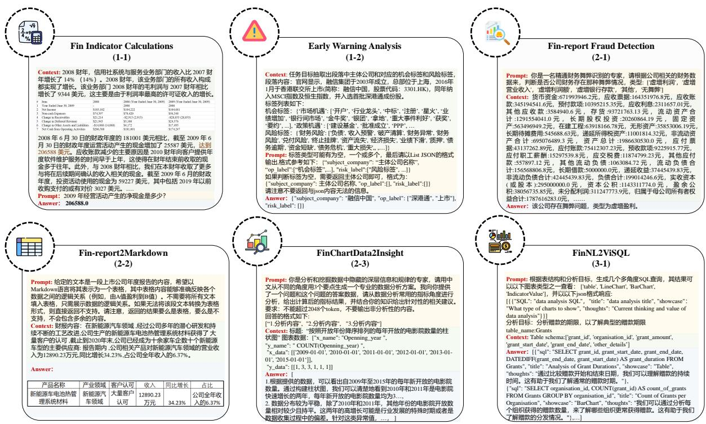  
Figure 8: Data examples for the six sub-tasks of FinDABench in Chinese.

## B More Details of FinDABench

## B.1 Annotation Norms and Consistency

Annotating FinDABench is a highly challenging task that requires a solid foundation in finance and technical skills. It necessitates understanding financial reports and the ability to provide insightful and analytical perspectives on financial data.

Team Composition Our annotation work was carried out by four Master’s degree holders in Computer Science, two PhDs in Computer Science, and two financial data analysis experts. Prior to the actual annotation process, the team underwent training and pre-annotation exercises.

Division of Responsibilities To ensure consistency in the annotations, the team was divided based on their understanding of financial knowledge. One PhD and two Master’s degree holders were responsible for the annotation tasks of 1-1, 1-2, and 2-1, while another PhD and two Master’s degree holders handled the tasks of 2-2, 2-3, and 3-1. Each pair of financial experts reviewed the annotations for three sub-tasks. For each task, one annotator was primarily responsible for the annotations, while another served as the reviewer to ensure accuracy. In cases of significant disagreement between the first two annotators, a third annotator was involved, with the final review conducted by a financial expert.

Annotation Duration The entire annotation process spanned one month, during which a total of 2,400 data entries were annotated.

Inter-Annotator Agreement (IAA) Calculation Our annotation team was divided into three groups, and Table 6 shows the IAA scores of different annotation groups and the average result.

## B.2 Prompt Template

## B.2.1 Fin Indicator Calculations Translation Prompt

<table><tr><td>Group</td><td>Cohen&#x27;s kappa</td></tr><tr><td>1</td><td>71.28</td></tr><tr><td>2</td><td>73.46</td></tr><tr><td>3</td><td>72.35</td></tr><tr><td>Avg.</td><td>72.36</td></tr></table>

Table 6: Consistency analysis results showing the inter-annotator agreement (IAA) scores (in percentage) across different groups. The last row shows the average IAA scores for all groups.

你是专业的金融行业翻译师，请你为下面的上市公司财报进行翻译，请注意需要保证金融名词翻  
译正确，金融符号保持一致。补充知识：对于上市公司财务报表,0331为一季报,0630为半年  
报,0930为三季报,1231为年报.财报指标包括: current\_ratio: 流动比率。quick\_ratio: 速动比率。  
netprofit\_margin: 销售净利率 grossprofit\_margin: 销售毛利率。roe:净资产收益率。roe\_dt: 净资产  
收益率(扣除非经常损益)。财报内容：[CONTENT]。

You are a professional translator in the financial industry, please translate the following financial report for   
a listed company, please note that you need to ensure that the financial terms are translated correctly and   
the financial symbols are consistent. Supplementary knowledge: For the financial statements of listed   
companies, 0331 is the first quarterly report, 0630 is the half-yearly report, 0930 is the third quarterly   
report, and 1231 is the annual report. Financial indicators include: current\_ratio: current ratio. quick\_ratio:   
quick ratio. netprofit\_margin: net sales margin grossprofit\_margin: gross sales margin. roe: return on net   
assets. roe\_dt: return on net assets (net of extraordinary gains and losses). report content: [CONTENT].  
Figure 9: The prompt for translating financial texts into English is displayed above, with the translated version below.

## B.2.2 Fin-report2Markdown Convert Prompt

给定的文本是一段上市公司年度报告的内容，希望以Markdown语言将其表示为一个表格，其中   
表格内容能够准确反映各个数据之间的逻辑关系（例如，由A值盈利到B值）。不需要将所有文   
本填入表格，只需展示数据的逻辑关系。如果无法将该段文本转换为表格形式，则直接返回不支   
持。请注意，返回的结果要么是表格，要么是不支持，不会包含多余的内容。文本以换行符\n分   
割。年度报告: [CONTENT]。   
The given text is the content of an annual report of a listed company, and it is desired to represent it in the   
Markdown language as a table, where the content of the table accurately reflects the logical relationship   
between the individual pieces of data (e.g., profitability from an A-value to a B-value). It is not necessary   
to populate the table with all the text, but only to show the logical relationship of the data. If it is not   
possible to convert the text of the paragraph into a table form, then return directly to the   
unsupportedSupported. Note that the returned result is either a table or unsupported and will not contain   
redundancy. The text is separated by the line feed character \n. Annual Report: [CONTENT].  
Figure 10: The prompt used for extracting structured Markdown data from an annual report is shown above, with the translated English version presented below.

## B.2.3 FinChartData Understanding Prompt

你是分析和挖掘数据中隐藏的深层信息和规律的专家，请用中文从不同的角度用3个要点生成一  
个专业的数据分析方案。我向你提供了一个目标和这个问题的表格数据，请从金融数据分析指标  
角度进行分析，给出计算后的指标结果，并结合你的知识给出针对性的相关建议。要求：  
不能超过2048个token，回答的格式如下:["1.Analysis Content"，"2.Analysis Content", …]。注意不  
要输出非分析性的内容。分析目标[GOAL]，分析内容: [CONTENT]。

You are an expert in analysing and mining the hidden deep information and patterns in data, please   
generate a professional data analysis plan in Chinese from different perspectives in 3 bullet points. I have   
provided you with an objective and tabular data for this question, please analyse it from the perspective of   
financial data analysis indicators, give the calculated indicator results, and give targeted and relevant   
suggestions with your knowledge. Requirement:Cannot exceed 2048 tokens, the format of the answer is as   
follows:[‘1.Analysis Content’, ‘2.Analysis Content’, ...]. Be careful not to output non-analysis content.   
Analysis Target [GOAL], Analysis Content: [CONTENT].  
Figure 11: The prompt used for generating analytical insights from chart data is displayed above, with the translated English version provided below.

## B.2.4 FinNL2ViSQL Prompt

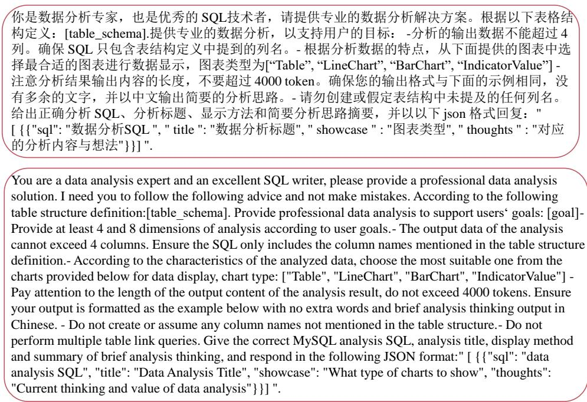  
Figure 12: The prompt used for generating multi-perspective SQL based on objectives and table structure is shown above, with the translated English version provided below.

B.3 Early Warning Analysis Label System

B.4 Fin-report2Markdown Label System

C LLM Test

C.1 Large Language Model Test List

<table><tr><td rowspan=1 colspan=6>机会标签(频数)Opportunity Labels(Frequency)</td><td rowspan=1 colspan=6>风险标签（频数）Risk Labels(Frequency)</td></tr><tr><td rowspan=1 colspan=1>市场机遇Marketopportunities</td><td rowspan=1 colspan=1>政策机遇Policyopportunities</td><td rowspan=1 colspan=1>融资机遇Financingopportunities</td><td rowspan=1 colspan=1>投资机遇Investmentopportunities</td><td rowspan=1 colspan=1>创新机遇Innovationopportunities</td><td rowspan=1 colspan=1>战略机遇strategic  Financialopportunities</td><td rowspan=1 colspan=1>财务风险risk</td><td rowspan=1 colspan=1>法律风险Legal risk</td><td rowspan=1 colspan=1>投融资风险Investment andfinancing risks</td><td rowspan=1 colspan=1>市场风险market risk</td><td rowspan=1 colspan=1>治理风险Governance risk</td><td rowspan=1 colspan=1>外部风险External risks</td></tr><tr><td rowspan=1 colspan=1>开户(3)Open an account(3)</td><td rowspan=1 colspan=1>建设基金(1)constructionfund(1)</td><td rowspan=1 colspan=1>评级上调(34)Rating upgrade(34)</td><td rowspan=1 colspan=1>结构性存款(3)Structureddeposits(3)</td><td rowspan=1 colspan=1>5G(69)5G(69)</td><td rowspan=1 colspan=1>总部基地(2)Abp(2)</td><td rowspan=1 colspan=1>负债(36)Liabilities(36)</td><td rowspan=1 colspan=1>拖欠工资(4)wage arrears(4)</td><td rowspan=1 colspan=1>股改异常(1)Abnormal stockreform(1)</td><td rowspan=1 colspan=1>产品缺陷(2)Product defects(2)</td><td rowspan=1 colspan=1>环保问题(10)Environmentalissues(10)</td><td rowspan=1 colspan=1>安全生产事故(2)safety accident(2)</td></tr><tr><td rowspan=1 colspan=1>行业龙头(81)Industry leader(81)</td><td rowspan=1 colspan=1>批准成立(10)establishment bysanction(10)</td><td rowspan=1 colspan=1>沪港通(0)Shanghai-Hong KongStock Connect(0)</td><td rowspan=1 colspan=1>注资(13)Capitalinjection(13)</td><td rowspan=1 colspan=1>产业园(26)Industrial Park(26)Re</td><td rowspan=1 colspan=1>赎回票据(1)demption of notes(1)</td><td rowspan=1 colspan=1>收入预警(19)Incomewarning(19)</td><td rowspan=1 colspan=1>司法拍卖(7)Judicial Auction(7)</td><td rowspan=1 colspan=1>评级下降(26)Rating downgrade(26)</td><td rowspan=1 colspan=1>市场风险(17)Market risk (17)</td><td rowspan=1 colspan=1>人事变动(59)Personnel Changes(59)</td><td rowspan=1 colspan=1>意外事故(4)Accidents (4)</td></tr><tr><td rowspan=1 colspan=1>中标(26)Winning the bid (26)</td><td rowspan=1 colspan=1>PPP(10)PPP(10)</td><td rowspan=1 colspan=1>配股(5)Rights issue (5)</td><td rowspan=1 colspan=1>入股(25)Investment (25)</td><td rowspan=1 colspan=1>创新(201)Innovation (201)</td><td rowspan=1 colspan=1>自然人独资(4)Sole proprietorship bynatural persons (4)</td><td rowspan=1 colspan=1>破产清算(15)Bankruptcyliquidation (15)</td><td rowspan=1 colspan=1>被约谈(3)Interviewed (3)</td><td rowspan=1 colspan=1>收购风险(8)Acquisition risk (8)</td><td rowspan=1 colspan=1>交易异常(8)Transaction Exception (8)</td><td rowspan=1 colspan=1>管理问题(13)Management issues(13)</td><td rowspan=1 colspan=1>工程受阻(0)xEngineering obstruction(0)</td></tr><tr><td rowspan=1 colspan=1>注册(72)Registration (72)</td><td rowspan=1 colspan=1>批准通过(80)Approved (80)</td><td rowspan=1 colspan=1>借壳(8)Borrowing Shell (8)</td><td rowspan=1 colspan=1>投资事件(37)Investment events(37)</td><td rowspan=1 colspan=1>创业(15)Entrepreneurship(15)</td><td rowspan=1 colspan=1>委托贷款(2)Entrusted loan (2)</td><td rowspan=1 colspan=1>财务异常(19)Financialanomalies (19)</td><td rowspan=1 colspan=1>监管处罚(81)Regulatory penalties(81)</td><td rowspan=1 colspan=1>平仓风险(11)Closing risk (11)</td><td rowspan=1 colspan=1>股价异常(23)Abnormal stock price (23)</td><td rowspan=1 colspan=1>曝出(8)Exposure (8)</td><td rowspan=1 colspan=1>指责投诉(23)Blaming Complaints(23)</td></tr><tr><td rowspan=1 colspan=1>星火(0)Spark (0)</td><td rowspan=1 colspan=1>批复(36)Approval (36)</td><td rowspan=1 colspan=1>招股(24)IPO (24)</td><td rowspan=1 colspan=1>购买理财产品(7)Purchasing wealthmanagementproducts (7)</td><td rowspan=1 colspan=1>创业园(1)EntrepreneurshipPark (1)</td><td rowspan=1 colspan=1>兑换票据(1)Exchange Notes (1)</td><td rowspan=1 colspan=1>财务风险(50)Financial risk (50)</td><td rowspan=1 colspan=1>产品涉假(4)Product fraud (4)</td><td rowspan=1 colspan=1>IPO遇阻(2)IPO obstructed (2)</td><td rowspan=1 colspan=1>产销异常(1)Abnormal production andsales (1)</td><td rowspan=1 colspan=1>质量事故(0)Quality accident (0)</td><td rowspan=1 colspan=1>舆论风险(10)Public opinion risk (10)</td></tr><tr><td rowspan=1 colspan=1>业绩增加(107)Performance increase(107)</td><td rowspan=1 colspan=1>批准筹建(8)Approved forestablishment (8)</td><td rowspan=1 colspan=1>港股通(0)Hong Kong StockConnect (0)</td><td rowspan=1 colspan=1>量化对冲(0)Quantitativehedging (0)</td><td rowspan=1 colspan=1>孵化所(2)Incubation Center(2)</td><td rowspan=1 colspan=1>私有化(22)Privatization (22)</td><td rowspan=1 colspan=1>兑付风险(27)Redemption risk(27)</td><td rowspan=1 colspan=1>停牌彻查(1)Suspension andthoroughinvestigation (1)</td><td rowspan=1 colspan=1>注资异常(0)Abnormal capitalinjection (0)</td><td rowspan=1 colspan=1>贸易壁垒(0)Trade barriers (0)</td><td rowspan=1 colspan=1>安全隐患(2)Safety hazards (2)</td><td rowspan=1 colspan=1>陷入局面(11)Trapped in a situation(11)</td></tr><tr><td rowspan=1 colspan=1>银行间市场(10)Interbank market (10)Private</td><td rowspan=1 colspan=1>民营企业(20)enterprises(20)</td><td rowspan=1 colspan=1>上市(115)Listing (115)</td><td rowspan=1 colspan=1>FOF(1)FOF(1)</td><td rowspan=1 colspan=1>区块链(13)Blockchain (13)</td><td rowspan=1 colspan=1>股票回购(18)Stock repurchase (18)</td><td rowspan=1 colspan=1>终止挂牌(6)Termination ofListing (6)</td><td rowspan=1 colspan=1>进场核查(8)Entry verification (8)</td><td rowspan=1 colspan=1>股份减持(46)Share reduction (46)</td><td rowspan=1 colspan=1>二级市场(11)Secondary market (11)</td><td rowspan=1 colspan=1>内部矛盾(0)Internal Conflict (0)</td><td rowspan=1 colspan=1>工程事故(7)Engineering accidents(7)</td></tr><tr><td rowspan=1 colspan=1>金牛奖(3)Golden Bull Award (3)</td><td rowspan=1 colspan=1>批准授权(2)ApprovalAuthorization (2)</td><td rowspan=1 colspan=1>增资扩股(11)Capital increase andshare expansion (11)</td><td rowspan=1 colspan=1>房地产信托基金(1Real Estate TrustFund (1)</td><td rowspan=1 colspan=1>人工智能(27)ArtificialIntelligence (27)</td><td rowspan=1 colspan=1>现金管理(5)Cash Management (5)</td><td rowspan=1 colspan=1>资产流失(2)Asset loss (2)</td><td rowspan=1 colspan=1>资产冻结(32)Asset freeze (32)</td><td rowspan=1 colspan=1>发债遇阻(8)Debt issuanceobstructed (8)</td><td rowspan=1 colspan=1>价格异动(4)Price Changes (4)</td><td rowspan=1 colspan=1>混乱(1)Chaos (1)</td><td rowspan=1 colspan=1>投标受阻(0)Bid obstructed (0)</td></tr><tr><td rowspan=1 colspan=1>银团(2)Syndicate (2)</td><td rowspan=1 colspan=1>批准发行(4)Approved forissuance (4)</td><td rowspan=1 colspan=1>超额认购(0)Over subscription (0)Eq</td><td rowspan=1 colspan=1>股权增持(21)uity increase (21)</td><td rowspan=1 colspan=1>专利发明(31)Patent Invention(31)</td><td rowspan=1 colspan=1>履行程序(3)Fulfillment Procedure(3)</td><td rowspan=1 colspan=1>经济损失(46)Economic losses(46)</td><td rowspan=1 colspan=1>欺诈(0)Fraud (0)</td><td rowspan=1 colspan=1>民间融资(4)Private financing (4)</td><td rowspan=1 colspan=1>销售风险(29)Sales risk (29)</td><td rowspan=1 colspan=1></td><td rowspan=1 colspan=1>黑天鹅(3)Black Swan (3)</td></tr><tr><td rowspan=1 colspan=1>拿地(26)Land acquisition (26)</td><td rowspan=1 colspan=1>获批许可证(10)Approved License(10)</td><td rowspan=1 colspan=1>新三板(7)New Third Board (7)</td><td rowspan=1 colspan=1>并购基金(4)Merger andacquisition fund (4)</td><td rowspan=1 colspan=1></td><td rowspan=1 colspan=1>闲置资金(1)Idle funds (1)</td><td rowspan=1 colspan=1>业绩下滑(58)Performancedecline (58)</td><td rowspan=1 colspan=1>税务问题(0)Tax issues (0)</td><td rowspan=1 colspan=1>壳资源(0)Shell resource (0)</td><td rowspan=1 colspan=1>行业衰退(0)Industry recession (0)</td><td rowspan=1 colspan=1></td><td rowspan=1 colspan=1></td></tr><tr><td rowspan=1 colspan=1>重大事件利好(3)Positive for major events(3)</td><td rowspan=1 colspan=1>批准进入(0)Approved entry (0)</td><td rowspan=1 colspan=1>证券化(1)Securitization (1)</td><td rowspan=1 colspan=1>产业基金(9)Industrial Fund (9)</td><td rowspan=1 colspan=1></td><td rowspan=1 colspan=1>转让票据(3)Transfer Note (3)</td><td rowspan=1 colspan=1>质押(56)Pledge (56)</td><td rowspan=1 colspan=1>限制消费(6)RestrictingConsumption (6)</td><td rowspan=1 colspan=1>股权风险(45)Equity risk (45)</td><td rowspan=1 colspan=1></td><td rowspan=1 colspan=1></td><td rowspan=1 colspan=1></td></tr><tr><td rowspan=1 colspan=1>获奖(29)Awards (29)</td><td rowspan=1 colspan=1>政府引导基金(4)GovernmentGuidance Fund (4)</td><td rowspan=1 colspan=1>融资成功(20)Financing success (20)</td><td rowspan=1 colspan=1>MOM(0)MOM(0)</td><td rowspan=1 colspan=1></td><td rowspan=1 colspan=1>交债转债(7)Convertible bonds (7)</td><td rowspan=1 colspan=1>债务逾期(5)Debt overdue (5)</td><td rowspan=1 colspan=1>监管风险(58)Regulatory risk (58)</td><td rowspan=1 colspan=1>融资担保风险(2)Financing guaranteerisk (2)</td><td rowspan=1 colspan=1></td><td rowspan=1 colspan=1></td><td rowspan=1 colspan=1></td></tr><tr><td rowspan=1 colspan=1>要约(15)Offer (15)</td><td rowspan=1 colspan=1>资质证书(13)Qualificationcertificate (13)</td><td rowspan=1 colspan=1>融资担保(13)Financing Guarantee(13)</td><td rowspan=1 colspan=1></td><td rowspan=1 colspan=1></td><td rowspan=1 colspan=1>国债逆回购(0)Treasury bond reverserepurchase (0)</td><td rowspan=1 colspan=1>资金短缺(11)Shortage of funds(11)</td><td rowspan=1 colspan=1>拖欠费用(2)Unpaid fees (2)</td><td rowspan=1 colspan=1>投资失利(1)Investment failure (1)</td><td rowspan=1 colspan=1></td><td rowspan=1 colspan=1></td><td rowspan=1 colspan=1></td></tr><tr><td rowspan=1 colspan=1>合作(369)Collaboration (369)</td><td rowspan=1 colspan=1></td><td rowspan=1 colspan=1>授信额度(6)Credit limit (6)</td><td rowspan=1 colspan=1></td><td rowspan=1 colspan=1></td><td rowspan=1 colspan=1>国企混改(1)State owned enterprisemixed ownershipreform (1)</td><td rowspan=1 colspan=1>债务危机(7)Debt Crisis (7)</td><td rowspan=1 colspan=1>资金占用(13)Fund Occupation(13)</td><td rowspan=1 colspan=1>债务融资(13)Debt financing (13)</td><td rowspan=1 colspan=1></td><td rowspan=1 colspan=1></td><td rowspan=1 colspan=1></td></tr></table>

Figure 13: The detailed tagging architecture is divided into two main categories: opportunity tags and risk tags. From a financial perspective, it covers sentiment tags throughout the entire lifecycle of a company.
<table><tr><td>Table Type</td><td>Description</td></tr><tr><td>Simple</td><td>Markdown tables with both rows and columns fewer than 3.</td></tr><tr><td>Medium</td><td>Markdown tables with both rows and columns fewer than 6 but at least 3.</td></tr><tr><td>Hard</td><td>Markdown tables with both rows and columns fewer than 9 but at least 6.</td></tr><tr><td>Extra Hard</td><td>Markdown tables with both rows and columns 9 or more.</td></tr></table>

Table 7: Details of Markdown table type.

## C.2 Large Language Model Zero-shot Result

<table><tr><td>Type</td><td>Model</td><td>Parameters</td><td>Instruction</td><td>RL</td><td>Access</td><td>BaseModel</td></tr><tr><td rowspan="8">English LLMs</td><td>GPT-4-0613</td><td></td><td>√</td><td>√</td><td>API</td><td></td></tr><tr><td>GPT-3.5-turbo-0613</td><td></td><td>√</td><td>√</td><td>API</td><td></td></tr><tr><td>LLaMA2-Base</td><td>7/13/70B</td><td>√</td><td>x</td><td>Weights</td><td></td></tr><tr><td>LLaMA2-Chat</td><td>7/13/70B</td><td>√</td><td>√</td><td>Weights</td><td>LLaMA2-7/13/70B</td></tr><tr><td>Vicuna-v1.5</td><td>7B</td><td>√</td><td>x</td><td>Weights</td><td>LLaMA2-7B</td></tr><tr><td>Alpaca-v1.0</td><td>7B</td><td>√</td><td>x</td><td>Weights</td><td>LLaMA-7B</td></tr><tr><td>WizardLM</td><td>7B</td><td>√</td><td>x</td><td>Weights</td><td>LLaMA-7B</td></tr><tr><td>Phi</td><td>2B</td><td>√</td><td>x</td><td>Weights</td><td></td></tr><tr><td rowspan="19">Chinese LLMs</td><td>通义千问(Qwen-turbo) 文心一言(ERNIEv4.0)</td><td></td><td>√</td><td>√</td><td>API</td><td></td></tr><tr><td></td><td></td><td>√</td><td>√</td><td>API</td><td></td></tr><tr><td>智谱清言(GLM-4)</td><td></td><td>√</td><td>√</td><td>API</td><td></td></tr><tr><td>Yi-Base</td><td>6B/34B</td><td>√</td><td>x</td><td>Weights</td><td></td></tr><tr><td>Yi-Chat</td><td>6B/34B</td><td>√</td><td>x</td><td>Weights</td><td>Yi-6B/34B</td></tr><tr><td>InternLM-Base</td><td>7B/20B</td><td>√</td><td>x</td><td>Weights</td><td></td></tr><tr><td>InternLM-Chat</td><td>7B/20B</td><td>√</td><td>x</td><td>Weights</td><td>InternLM-7B</td></tr><tr><td>Qwen-Base</td><td>7B/14B</td><td>√</td><td>x</td><td>Weights</td><td></td></tr><tr><td>Qwen-Chat</td><td>1.8B/7B/14B</td><td>√</td><td>x</td><td>Weights</td><td>Qwen-1.8/7/14B</td></tr><tr><td>Baichuan2-Base</td><td>7B/13B</td><td>√</td><td>x</td><td>Weights</td><td></td></tr><tr><td>Baichuan2-Chat</td><td>7B/13B</td><td>√</td><td>x</td><td>Weights</td><td>Baichuan2-7/13B</td></tr><tr><td>TigerBot-Base</td><td>7B</td><td>√</td><td>x</td><td>Weights</td><td></td></tr><tr><td>TigerBot-Chat</td><td>7B</td><td>√</td><td>x</td><td>Weights</td><td>TigerBot-7B</td></tr><tr><td>Chinese-Alpace2</td><td>7B</td><td>√</td><td>x</td><td>Weights</td><td>LLaMA2-7B</td></tr><tr><td>ChatGLM2</td><td>6B</td><td>√</td><td>x</td><td>Weights</td><td>ChatGLM-6B</td></tr><tr><td>ChatGLM3-Base</td><td>6B</td><td>√</td><td>x</td><td>Weights</td><td></td></tr><tr><td>ChatGLM3</td><td>6B</td><td>√</td><td>x</td><td>Weights</td><td>ChatGLM3-6B-Base</td></tr><tr><td>MiniCPM</td><td>2B</td><td>√</td><td>x</td><td>Weights</td><td></td></tr><tr><td rowspan="5">Financial LLMs</td><td>FinGPTV3</td><td>6B</td><td></td><td></td><td></td><td></td></tr><tr><td>FinMA</td><td></td><td>√</td><td>x</td><td>Weights</td><td>Chatglm3-6B</td></tr><tr><td>DISC-FinLLM</td><td>7B 13B</td><td>√ √</td><td>x x</td><td>Weights Weights</td><td>LLaMA2-7B Baichuan2-13B-Chat</td></tr><tr><td>Tongyi-Finance</td><td>14B</td><td>√</td><td>x</td><td>Weights</td><td>Qwen-14B</td></tr><tr><td>XuanYuan-Chat</td><td>13/70B</td><td>√</td><td>x</td><td>Weights</td><td>LLaMA2-13/70B</td></tr></table>

Table 8: LLMs tested on FinDABench. We classify these models by their main training corpora.

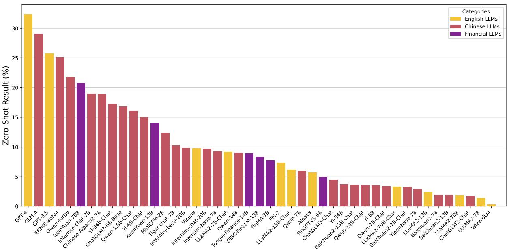  
Figure 14: Average performance (zero-shot) of 45 LLMs evaluated on FinDABench