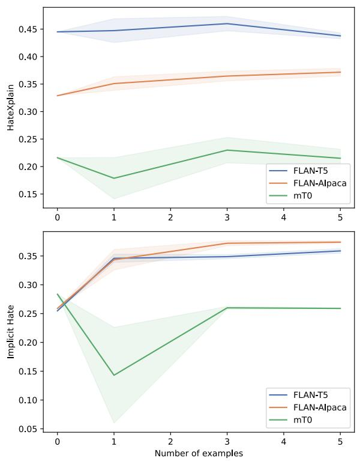
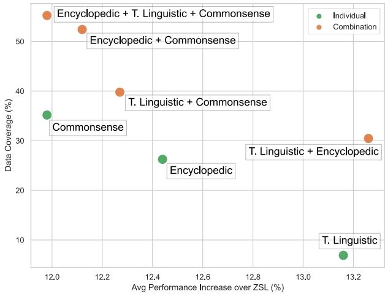
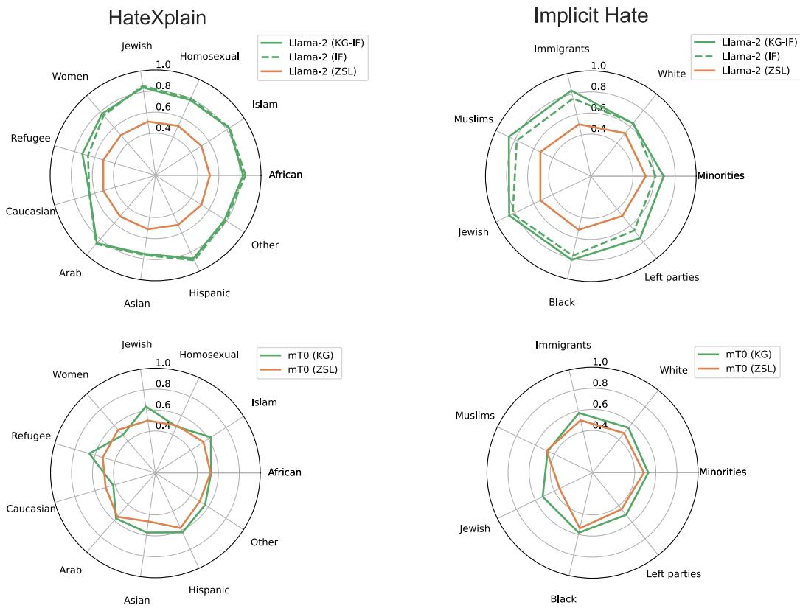

# From Detection to Explanation: Effective Learning Strategies for LLMs in Online Abusive Language Research

Chiara Di Bonaventura1,2, Lucia Siciliani3, Pierpaolo Basile3,

Albert Meroño-Peñuela1, Barbara McGillivray1

1King’s College London 2Imperial College London 3University of Bari Aldo Moro chiara.di\_bonaventura@kcl.ac.uk

## Abstract

Abusive language detection relies on understanding different levels of intensity, expressiveness and targeted groups, which requires commonsense reasoning, world knowledge and linguistic nuances that evolve over time. Here, we frame the problem as a knowledge-guided learning task, and demonstrate that LLMs’ implicit knowledge without an accurate strategy is not suitable for multi-class detection nor explanation generation. We publicly release GLlama Alarm, the knowledge-Guided version of Llama-2 instruction fine-tuned for multiclass abusive language detection and explanation generation. By being fine-tuned on structured explanations and external reliable knowledge sources, our model mitigates bias and generates explanations that are relevant to the text and coherent with human reasoning, with an average 48.76% better alignment with human judgment according to our expert survey.

Warning. This paper contains examples of potentially offensive content. Profanities are obfuscated with PrOf (Nozza et al., 2023).

## 1 Introduction

Institutions and social media companies worldwide are implementing content moderation policies to reduce the spread of online abusive language1 given its rapid growth and its harmful effects (Volges, 2021; Vedeler et al., 2019). The detection of abusive language is the first step in content moderation and has become a central task in natural language processing (NLP). However, automatically detecting abusive language is complex. It requires knowledge about commonsense reasoning, encyclopedic entities and linguistics in order to capture all the different nuances of abusive language, from explicit insults to stereotypes, a non-trivial task even for humans (Rahman et al., 2021). Moreover, the EU regulation on algorithmic transparency further challenges this field (Brunk et al., 2019), calling for more transparent and less biased systems.

<table><tr><td>Model</td><td colspan="2">HateXplain</td><td colspan="2">Implicit Hate</td></tr><tr><td>FLAN-Alpaca-xl</td><td>binary</td><td>3-class</td><td>binary</td><td>3-class</td></tr><tr><td>FLAN-T5-x1</td><td>68.27</td><td>39.30</td><td>61.67</td><td>43.18</td></tr><tr><td>mT0-xl</td><td>72.01</td><td>45.05</td><td>62.15</td><td>32.69</td></tr><tr><td></td><td>48.29</td><td>23.14</td><td>40.73</td><td>23.38</td></tr><tr><td>Avg.%↓</td><td></td><td>43.98↓</td><td></td><td>39.99↓</td></tr></table>

Table 1: Macro F1 of instruction fine-tuned LLMs when prompted with zero-shot learning on two benchmarks.

With the rise of Large Language Models (LLMs) like LLaMa (Touvron et al., 2023a,b) showing proficiency across various NLP tasks and domains (Brown et al., 2020; Zhang et al., 2023; Ziems et al., 2023), many and diverse learning strategies have emerged to leverage the implicit knowledge these LLMs have acquired during pretraining (Liu et al., 2023): zero-shot prompting, fewshot prompting, chain-of-thought, instruction finetuning, inter alia. Recently, Plaza-del arco et al. (2023) investigate zero-shot prompting FLAN-T5 and mT0 models for binary hate speech classification, achieving performance comparable to and surpassing encoder-based models across multiple benchmark corpora. However, real-world abusive language cannot easily be classified in a binary setting (Davidson et al., 2017) as it relies on different levels of intensity, expressiveness and targeted groups. Table 1 shows the drop in performance of off-the-shelf LLMs when moving from binary to 3-class settings.2 This raises the question “to what extent is the implicit knowledge ofLLMs retrieved by these diverse learning strategies sufficient as we increase the complexity of the task?” (RQ1). Alternatively, if LLMs require further explicit external knowledge, “what type ofknowledge do LLMs need the most to effectively detect non-binary abusive language?” (RQ2).

We answer these research questions taking into account two challenging aspects in abusive language research, namely unbiased detection and explanation generation. Understanding how different learning strategies impact LLMs’ bias in abusive language detection is crucial to comply with regulation as previous work shows that LLMs struggle to learn long-tail knowledge (Kandpal et al., 2023) which can lead to encode bias during classification. Similarly, it is important to shed light on which learning strategy, if any, makes LLMs generate the most relevant explanation to the text while being coherent with human reasoning, since stakeholders involved in content moderation policies, from users to moderators, are shown to benefit from receiving an explanation for why a specific text might be abusive (Brunk et al., 2019; Calabrese et al., 2024). According to Mishra et al. (2019), explanations should be structured, entailing the words that constitute abuse, the intent of the user, and the target group, which further challenges the free-text nature of LLMs in text generation.

Contributions. To answer these questions, we (a) provide a thorough analysis of multiple LLMs with diverse learning strategies across abusive language detection, bias mitigation and explanation generation tasks, and (b) study the alignment of these LLMs with human judgment via an expert survey. We report our main findings. (1) We show that using off-the-shelf LLMs without an accurate learning strategy exhibits low performance scores on 3-level offensiveness and expressiveness detection tasks regardless of the model size (Table 1, Table 5). They also exhibit bias towards targeted groups and are unsuitable for generating plausible explanations (Table 7). (2) We show there is a distinct pattern between LLMs that have been previously fine-tuned for toxicity detection and those that have not (Figure 1). While few-shot learning helps the former in detecting multi-class abusive language and mitigating bias, it harms the latter, which instead benefit the most from learning strategies that explicitly pass external knowledge to the model (Table 5). (3) We demonstrate that temporal linguistic knowledge leads to better performance, with an average performance increase of 13.18% (Figure 2). (4) We show that knowledge-guided instruction fine-tuning outperforms vanilla instruction fine-tuning in explanation generation while mitigating for bias (Figure 4, Figure 3). Building on this, we publicly release GLlama Alarm3, a suite of knowledge-guided LLMs designed for multi-class abusive language detection and explanation generation.

## 2 Background: Language and Knowledge

## 2.1 Online Abusive Language

Although there is no agreed consensus on the definition of online abusive language, some common traits seem to emerge looking at previous papers (e.g., Benesch (2014); Erjavec and Kovaciˇ cˇ (2012)), instructions given to annotators (e.g., Waseem and Hovy (2016); Davidson et al. (2017)), shared tasks (e.g., HatEval (Basile et al., 2019)), and institutional reports (e.g., ONU (2019)). Namely, (1) offensiveness, i.e., the level of intensity of the abuse; (2) expressiveness, i.e., how the abuse is conveyed; (3) target, i.e., the attributes attacked by the abusive text; (4) rationale, i.e., why the text is intentionally harmful. Based on these traits, we define online abusive language along four dimensions as “any content against the commonly accepted standards (1–offensiveness) that overtly or covertly (2–expressiveness) targets individuals based on a specific characteristic (3–target) with the goal of causing hatred (4–rationale)”. Following, we evaluate LLMs along these dimensions in non-binary settings, which is crucial to mirror real-world abusive language (Davidson et al., 2017). For instance, policy regulations might differ in the level of offensiveness tolerated (e.g., hate speech vs. offensive comments).

## 2.2 Knowledge Bases and Types

Similarly to how humans store information, a knowledge base is a structured repository that adds a semantic model to the data, including a formal scheme with classes, sub-classes, relations as well as rules for interpreting the data. Established works classify knowledge bases by their type (Pan et al., 2024; Zhen et al., 2022; Yin et al., 2022): (a) Encyclopedic, knowledge covering widespread information in the open domain; (b) Commonsense, routine knowledge people have of everyday world and activities; (c) Linguistic, knowledge about the meaning of language, including definitions, synonyms, and word usage; (d) Temporal, knowledge about dates and events. These types of knowledge are essential for developing robust NLP systems capable of understanding and generating human language effectively (Yin et al., 2022; Yang et al., 2021). Remarkably, we show evidence of which type of knowledge abusive language detection systems need by proposing an easy and open-source knowledge-guided learning strategy in §3.2.

## 2.3 LLMs in Abusive Language Research

Recent studies have explored LLMs for abusive lan guage detection (Huang et al., 2023; Plaza-del arco et al., 2023; Chiu et al., 2021), focusing on binary hate speech, on a single learning strategy, and/or on a single LLM. Moving beyond detection, Wang et al. (2023) recently probe GPT-3 for free-text explanation generation in hateful content modera tion. We are the first to present a systematic review of multiple LLMs in non-binary abusive language across five learning strategies, shedding light on their capabilities from detection to explanation gen eration. Besides, we focus on structured explana tions instead of free text, as the latter cannot guaran tee all the desired properties that previous research show to improve user trust (Brunk et al., 2019) and moderator speed of annotation (Calabrese et al., 2024). Few papers have recently enhanced language models with additional information for hate speech detection. Roy et al. (2023) probe LLMs in multi-class hate speech detection, showing that adding information about the target victims and the explanations in the prompts improves performance. Instead, we propose a knowledge-guided learning strategy that (i) leverages open-source knowledge instead of manually-annotated information, and (ii) is used to identify which type of knowledge LLMs need to effectively handle abusive language instead of adding target victims information and explana tions that presuppose the presence of hate speech in the text. AlKhamissi et al. (2022) fine-tune BART (Lewis et al., 2020) on commonsense and stereo typical datasets, respectively ATOMIC20 (Hwang et al., 2021) and StereoSet (Nadeem et al., 2021), for binary hate speech detection. While their knowledge infusion strategy leverages implicit knowl edge acquired during the additional fine-tuning, our knowledge-guided learning strategy leverages explicit knowledge passed in the prompts, facilitat ing in-context learning and instruction fine-tuning. In addition to commonsense, our model GLlama Alarm has been instruction fine-tuned on encyclo pedic and temporal linguistic knowledge for both multi-class abusive language detection and explanation generation.

## 3 Methodology

## 3.1 Datasets

Following the four-dimensional definition of abusive language outlined in §2.1, we select the datasets in Table 2. They account for three levels of offensiveness and expressiveness, multiple targeted attributes, and rationales, which we will use, respectively, for offensiveness and expressiveness detection, bias mitigation, and explanation generation tasks. We use HateXplain (Mathew et al., 2021) for the $1 ^ { \mathrm { s t } }$ dimension (offensiveness), the $3 ^ { \mathrm { r d } }$ one (target), and the $4 ^ { \mathrm { t h } }$ one (rationale), whereas the Implicit Hate Corpus (ElSherief et al., 2021) is chosen because it accounts for the $2 ^ { \mathrm { n d } }$ dimension (expressiveness), the $3 ^ { \mathrm { r d } }$ one, and the $4 ^ { \mathrm { t h } }$ one. To the best of our knowledge, these datasets are the first to simultaneously account for all these dimensions of online abusive language. As these datasets provide unstructured rationales, we design a template to create structured explanations, containing whether the text is abusive and, if so, the words that constitute abuse (in HateXplain) and the intent of the user (in Implicit Hate) based on previous research (Mishra et al., 2019; Calabrese et al., 2024). We use these structured explanations as ground-truth. Cf. Appendix B for details.

<table><tr><td>Dataset</td><td>Labels</td><td>Target</td><td>Rationale</td></tr><tr><td>HateXplain</td><td>hate speech, offensive, normal</td><td>women, black, …</td><td>Token- level</td></tr><tr><td>Implicit Hate</td><td>implicit hate, explicit hate, not hate</td><td>Jewish, Muslims, …</td><td>Implied statement</td></tr></table>

Table 2: Summary of datasets used.

## 3.2 Learning Strategies

To shed light on LLMs’ implicit knowledge in effectively capturing real-world abusive language, we conduct a thorough analysis across four models and five learning strategies. In addition to three standard vanilla strategies, we propose a novel knowledge-guided strategy for in-context learning and instruction fine-tuning to measure the impact of explicitly adding external knowledge to LLMs vs. their implicit knowledge, and which type of knowledge LLMs need the most. We do not seek to evaluate the ability of LLMs in retrieving relevant knowledge, which would be the case of a RAG system. We use the well-known format of the Stanford Alpaca project to create the prompts.4

<table><tr><td rowspan=1 colspan=1>Type</td><td rowspan=1 colspan=1>Source</td><td rowspan=1 colspan=1>Example</td></tr><tr><td rowspan=1 colspan=1>Encyclopedic</td><td rowspan=1 colspan=1>WikipediaWikidata</td><td rowspan=1 colspan=1>&quot;Pepe the Frog is an Internet meme consisting of a green anthropomorphic frogwith a humanoid body. Pepe originated in a 2005 comic by Matt Furie calledBoy&#x27;s Club&#x27;. It became an Internet meme when its popularity steadily grew...&quot;“Pepe the Frog is a comic character and Internet meme.&quot;</td></tr><tr><td rowspan=1 colspan=1>Commonsense</td><td rowspan=1 colspan=1>ConceptNet</td><td rowspan=1 colspan=1>“Coffin is a type of box, is related to grave, is used for burying dead people&quot;</td></tr><tr><td rowspan=1 colspan=1>Temporal Linguistic</td><td rowspan=1 colspan=1>KnowledJe</td><td rowspan=1 colspan=1>“slur name: k*ke, slur description: From the Yiddish word for &#x27;circle’ is kikel,illiterate Jews who entered the United States at Ellis Island signed their names witha circle instead of a cross because they associated the cross with Christianity.&quot;</td></tr></table>

Table 3: Examples contained in each source by knowledge type.

Vanilla Learning. We test popular in-context learning strategies as (1) zero-shot learning (ZSL) and (2) few-shot learning (FSL). For FSL we experiment with 1, 3, and 5 randomly sampled examples with equal probability among the classes to account for class imbalance in the datasets. For robustness, we run experiments 10 times, and report the average scores along with standard deviation. Thirdly, we explore (3) instruction fine-tuning (IF).

Knowledge-Guided Learning. As texts in abusive language research are usually short and lack context (Bergen, 2016; Pérez et al., 2023), we hypothesize we can overcome this issue by adding contextual information directly in the prompts, building on recent evidence that LLMs benefit from including explicit information in the prompts (Roy et al., 2023). To this end, we leverage public knowledge bases, and refer to these prompts as knowledge-guided prompts, which we pass to the models via (4) zero-shot learning (KG) and (5) instruction fine-tuning (KG-IF). We design our knowledge-guided prompts as follows. To start, we use the established Tsallis entropy to extract the most salient words that constitute abuse in each category of the datasets. Results in Table 8 of Appendix C suggest that online abusive language relies on a combination of domain-specific language such as slurs and pejorative adjectives, as well as general concepts and entities. Therefore, we select the following open-source, easily accessible, and manually curated knowledge bases: KnowledJe (Halevy, 2023) as it uniquely covers temporal linguistic knowledge in the hate speech domain, ConceptNet (Speer et al., 2017) for commonsense reasoning as it is designed to help computers understand the meanings of words that people generally use, and Wikipedia (Wilkinson and Huberman, 2007) and Wikidata (Vrandeciˇ c and Krötzsch´ , 2014) for encyclopedic knowledge as they encompass a wide range of topics5. Examples contained in each source are shown in Table 3. Following, we link each instance of the datasets to these knowledge sources by means of a knowledge-specific trained entity linker6, which first detects the entities mentioned in the text, and then links them to their corresponding information in the knowledge base. For instance, in the text “What place do black people like to be peaceful? In their coffin.” the commonsense entity linker would recognize ‘coffin’ as an entity, and would link the text to the information about ‘coffin’ contained in ConceptNet (Table 3). Note that the same text can be linked to multiple knowledge sources. Lastly, we add this linked information directly in the prompt via an additional field called ‘context’ that we pass before the input text and we ask the model to follow the instruction described in the prompt based on this context. Thus, the vanilla and knowledge-guided prompts differ only by this additional field. See Appendix C for details.

## 3.3 Experimental Setup

Models. We use different open-source LLMs: the base versions of FLAN-Alpaca (Bhardwaj and Poria, 2023; Taori et al., 2023), FLAN-T5 (Chung et al., 2022), mT0 (Muennighoff et al., 2023), and the 7B foundational model Llama-2 (Touvron et al., 2023b,a). As summarized in Table 4, Llama-2 is the only model under analysis which has not been instruction fine-tuned nor toxicity fine-tuned. For this reason, we used instruction fine-tuning with Llama-2, and not with the other models.

<table><tr><td>Model</td><td>Instruction Fine-tuned</td><td>Toxicity Fine-tuned</td></tr><tr><td>FLAN-Alpaca</td><td>L</td><td>V</td></tr><tr><td>FLAN-T5</td><td>V</td><td>V</td></tr><tr><td>mT0</td><td>√</td><td>X</td></tr><tr><td>Llama-2</td><td>X</td><td>X</td></tr><tr><td></td><td></td><td></td></tr></table>

Table 4: Summary of the models used.

Baselines. We report classification performance of popular commercial tools, either specifically developed for toxicity detection as Perspective API7, or for general purposes as the OpenAI’s GPT models (Brown et al., 2020; Ouyang et al., 2022).

Evaluation Metrics. (a) Detection: we use macro F1 to evaluate LLMs in distinguishing between three classes of offensiveness and expressiveness, and Wilcoxon’s signed rank test (Wilcoxon, 1992) to evaluate the statistical significance of the results, setting $a l p h a = 0 . 0 1$ as the significance level for the p-values. (b) Bias Mitigation: abusive language classifiers may produce biased predictions for specific identity groups (Zhang et al., 2020; Sap et al., 2019; Davidson et al., 2019). To measure such unintentional bias, we use the established Generalized Mean of Bias (GMB) (Mathew et al., 2021) to combine the per-identity biases into one overall bias measure as $M _ { p } ( m _ { s } ) =$ $\begin{array} { r } { \big ( \frac { 1 } { N } \sum _ { s = 1 } ^ { n } m _ { s } ^ { p } \big ) ^ { \frac { 1 } { p } } } \end{array}$ where $M _ { p }$ is the $p ^ { t h }$ power-mean function, $m _ { s }$ the bias metrics m for subgroup s and N is the number of target groups. As for $m _ { s }$ , we select the background-negative subgrouppositive Area-Under-the-Curve (AUC) developed by Borkan et al. (2019). We set $p = - 5$ as in the original formulation. The score lies between 0 and 1, and the higher it is, the less biased the model is. (c) Explanation Generation: we evaluate how closely the LLM-generated explanations match the groundtruth across six similarity metrics due to the challenge of simultaneously assessing a wide set of criteria (Sai et al., 2021; Reiter, 2018; Novikova et al., 2017). Following established NLG research (Sai et al., 2022; Celikyilmaz et al., 2020), we choose BERTScore (Zhang et al., 2019) and METEOR (Lavie and Denkowski, 2009) for semantic similarity whereas we select BLEU (Papineni et al., 2002), Google BLEU (Wu et al., 2016) and ROUGE (Lin, 2004) for syntactic similarity. Additionally, we present an expert evaluation following our expert study described in §4.

## 4 Expert Study

Given the subjective nature of abusive language, which further challenges the evaluation of models, we want to evaluate how well LLMs align with human judgements in this domain. We design a survey consisting on four parts, which focus on different areas: (1) the participant’s background, e.g., gender identity, native language; (2) abusive language detection: given a sample of texts from the datasets we ask participants whether the texts are correctly classified and if not, why; (3) explanation generation: given a classification and explanation, participants are asked if the text is correctly classified and are asked to rate three different LLM-generated explanations with respect to the groundtruth in a 1-3 scale; (4) general opinions related to explanation generation, e.g., what type of errors the participants observed most frequently. See Appendix F for the full list of questions. The institutional ethical board of the first author’s university approved our study design. We distributed the survey through channels that allow us to target individuals working in AI who are competent in the field of language models and/or AI Ethics, including NLP reading groups and AI Ethics interest groups. We collected a total of 4,101 answers from 15 participants, of which 33% (67%) identify as female (male), and 33% (67%) are (non-) English native-speakers. Participants’ continent of origin include Europe (60%), Asia (26.67%), Africa (6.67%), and Latin America (6.67%).

## 5 Results and Discussion

Our experiments with knowledge-guided learning are statistically significant $( p < 0 . 0 1 )$ , see details in Appendix E. We discuss our findings across performance, bias mitigation, and explanation generation. Then, we discuss our error analysis.

5.1. Detection. Table 5 shows the performance of LLMs on offensiveness (HateXplain) and expressiveness (Implicit Hate) detection tasks across five learning strategies.8 Overall, zero-shot learning on LLMs performs poorly at distinguishing three different levels of offensiveness and expressiveness, with an average macro F1 score of 31.65% and

25.78%, respectively. Which in-context learning strategy is the most effective seems to depend on the type of LLM rather than the task itself. Instruction fine-tuned LLMs which have been previously fine-tuned for toxicity detection, like FLAN-Alpaca and FLAN-T5, benefit the most from fewshot learning (FSL). On the other hand, instruction fine-tuned LLMs which have not been fine tuned for toxicity detection, like mT0, reach the best scores using a knowledge-guided learning strategy (KG). In other words, LLMs like mT0 need external knowledge to effectively learn to distinguish multi-class abusive language, whereas FLAN-Alpaca and FLAN-T5 can count on their distributional knowledge, and need as many as three lexical clues to effectively guide their decisionmaking process. This distinct pattern can be observed in both detection tasks and for various settings of few-shot learning as depicted in Figure 1. While FLAN-Alpaca’s and FLAN-T5’s perfor mance increases as soon as we pass one example, mT0’s performance drops immediately. As for fine tuning strategies, instruction fine-tuning Llama-2 with external knowledge (KG-IF) leads to better performance on multi-class expressiveness detection while being comparable to vanilla instruction fine-tuning (IF) for multi-class offensiveness (Table 5). We argue that this behaviour can be justified by the need for more knowledge and reasoning in distinguishing implicit hate, which comprises, among others, stereotypes (Sanguinetti et al., 2018; Warner and Hirschberg, 2012), irony (Justo et al., 2014), and inferiority language (Nielsen, 2002), which are not easily captured with vanilla instruction fine-tuning.

We further investigate which type of knowledge, or combination thereof, LLMs need the most to tackle multi-class abusive language detection tasks in Table 6. Building from this table, Figure 2 presents the average percentage increase in performance when using knowledge-guided zero-shot learning over vanilla zero-shot learning, paired with the percentage of data linked to each knowledge type. Although all three knowledge types improve performance, temporal linguistic knowledge is notably associated with the highest performance gains while covering less than 10% of the datasets. This result suggests a preference towards quality over quantity. Although encyclopedic and commonsense knowledge help cover more scenarios, they contain general information. Instead, temporal linguistic knowledge adds precise information about words, definitions and events, for which LLMs’ distributional knowledge is not sufficient.

  
Figure 1: Average macro F1 and standard deviation over 10 runs by number of few-shot examples.

5.2. Bias Mitigation. Columns ‘GMB’ in Table 5 show the Generalised Mean of Bias, where the higher the score, the less biased the model is. Overall, LLMs exhibit low scores for bias mitigation with zero-shot learning, reaching an average GMB of 51.13%. We observe the same distinct pattern with in-context learning strategies between LLMs which have been toxicity fine-tuned and those which have not as in §5.1. The former are the least biased when they are prompted with few-shot examples whereas the latter become the least biased when prompted with external knowledge. Remarkably, we show that few-shot learning actually increases bias in mT0. We argue this is due to the fact that the model, which has not been previously fine-tuned for toxicity detection, learns to over-rely on the lexical clues passed in the few-shot examples, resulting in biased lexical overfitting. As for fine-tuning strategies, we show that further instruction fine-tuning Llama-2 helps NLP bias mitigation metrics by at least 42.62%, consistently with previous research of Chung et al. (2022). Notably, we demonstrate that adopting a knowledge-instruction fine-tuning strategy rather than vanilla instruction fine-tuning further improves bias mitigation across offensiveness and expressiveness detection tasks. A possible explanation is related to the exposure of the LLMs to diverse and reliable knowledge sources, enabling contextual awareness, and reducing the risk of biased lexical overfit.

<table><tr><td rowspan="2">Model</td><td colspan="4">Approach</td><td colspan="2">HateXplain</td><td colspan="2">Implicit Hate</td></tr><tr><td>ZSL</td><td>FSL</td><td>KG</td><td>IF KG-IF</td><td>F1</td><td>GMB↑</td><td>F1</td><td>GMB↑</td></tr><tr><td rowspan="3">FLAN-Alpaca</td><td>√</td><td></td><td></td><td></td><td>32.89</td><td>53.73</td><td>25.90</td><td>49.20</td></tr><tr><td></td><td>√</td><td></td><td></td><td>36.46</td><td>57.95</td><td>37.21</td><td>57.37</td></tr><tr><td></td><td></td><td> $\checkmark$ </td><td></td><td>35.07</td><td>56.42</td><td>26.43</td><td>50.00</td></tr><tr><td rowspan="3">FLAN-T5</td><td>√</td><td></td><td></td><td></td><td>44.50</td><td>57.54</td><td>25.48</td><td>50.00</td></tr><tr><td></td><td>√</td><td></td><td></td><td>46.00</td><td>59.22</td><td>34.88</td><td>50.76</td></tr><tr><td></td><td></td><td> $\checkmark$ </td><td></td><td>44.53</td><td>58.28</td><td>30.15</td><td>50.65</td></tr><tr><td rowspan="3">mT0</td><td> $\overline { { \checkmark } }$ </td><td></td><td></td><td></td><td>21.60</td><td>51.59</td><td></td><td></td></tr><tr><td></td><td> $\checkmark$ </td><td></td><td></td><td>22.99</td><td>46.75</td><td>28.36 25.99</td><td>44.00</td></tr><tr><td></td><td></td><td>V</td><td></td><td>27.98</td><td>52.84</td><td>32.69</td><td>40.05</td></tr><tr><td rowspan="3">Llama-2</td><td> $\overline { { \checkmark } }$ </td><td></td><td></td><td></td><td>27.65</td><td>51.49</td><td></td><td>52.70</td></tr><tr><td></td><td></td><td></td><td>V</td><td>68.59</td><td>77.00</td><td>23.38 50.49</td><td>51.49</td></tr><tr><td></td><td></td><td></td><td>√</td><td>68.24</td><td>77.06</td><td>56.69</td><td>69.87</td></tr><tr><td>Perspective API</td><td>√</td><td></td><td></td><td></td><td>34.80</td><td></td><td></td><td>75.13</td></tr><tr><td>GPT-3.5-turbo</td><td>√</td><td></td><td></td><td></td><td>39.00</td><td>-</td><td>37.10</td><td>一</td></tr><tr><td>text-davinci-003</td><td>√</td><td></td><td></td><td></td><td>45.00</td><td>一</td><td>32.00</td><td>一</td></tr><tr><td></td><td></td><td></td><td></td><td></td><td></td><td></td><td>36.00</td><td></td></tr></table>

Table 5: Macro F1 and Generalised Mean of Bias (GMB) across zero-shot learning (ZSL), few-shot learning (FSL), knowledge-guided ZSL (KG), instruction fine-tuning (IF) and knowledge-guided instruction fine-tuning (KG-IF). Best results are in bold. Baselines at the bottom, including Roy et al.’s (2023)’s results for OpenAI models.

<table><tr><td rowspan="2">Model</td><td colspan="3">Knowledge Source</td><td rowspan="2">HateXplain</td><td rowspan="2">Implicit Hate</td></tr><tr><td>Enc.</td><td>Com.</td><td>T. Lin.</td></tr><tr><td rowspan="9">FL-Pca</td><td>√</td><td></td><td></td><td>34.71</td><td>26.52</td></tr><tr><td></td><td>√</td><td></td><td>34.46</td><td>26.29</td></tr><tr><td> $\checkmark$ </td><td>√</td><td></td><td>34.33</td><td>26.30</td></tr><tr><td></td><td></td><td>√</td><td>35.11*</td><td>26.50</td></tr><tr><td> $\checkmark$ </td><td></td><td>√</td><td>34.94</td><td>26.52</td></tr><tr><td></td><td>√</td><td>√</td><td>35.07</td><td>26.29</td></tr><tr><td> $\checkmark$ </td><td>√</td><td>√</td><td>35.07</td><td>26.43</td></tr><tr><td> $\overline { { \checkmark } }$ </td><td></td><td></td><td>45.59**</td><td>31.18</td></tr><tr><td> $\checkmark$ </td><td>√</td><td></td><td>44.89</td><td>32.20</td></tr><tr><td>FLATS</td><td></td><td>√</td><td></td><td>45.10</td><td>32.25**</td></tr><tr><td></td><td></td><td></td><td>√</td><td>44.46</td><td>31.51</td></tr><tr><td></td><td> $\checkmark$ </td><td></td><td>√</td><td>44.51</td><td>31.56</td></tr><tr><td></td><td></td><td>√</td><td>√</td><td>44.60</td><td>32.20</td></tr><tr><td></td><td> $\checkmark$ </td><td>√</td><td>√</td><td>44.53</td><td>30.15</td></tr><tr><td rowspan="9">0</td><td> $\overline { { \checkmark } }$ </td><td></td><td></td><td>26.92</td><td>33.26</td></tr><tr><td></td><td></td><td></td><td>27.38</td><td></td></tr><tr><td> $\checkmark$ </td><td>√</td><td></td><td></td><td>31.65</td></tr><tr><td></td><td>√</td><td></td><td>28.43**</td><td>30.42</td></tr><tr><td> $\checkmark$ </td><td></td><td>√ √</td><td>27.09 28.20</td><td>34.28**</td></tr><tr><td></td><td></td><td></td><td>27.53</td><td>33.04</td></tr><tr><td> $\checkmark$ </td><td> $\checkmark$ </td><td>√</td><td></td><td>31.61</td></tr><tr><td></td><td>√</td><td>√</td><td>27.98</td><td>32.69</td></tr><tr><td></td><td></td><td></td><td></td><td></td></tr></table>

Table 6: Macro F1 of knowledge-guided zero-shot learning strategy (KG) across encyclopedic (Enc.), commonsense (Com.) and temporal linguistic (T. Lin.) knowledge. For each model, best knowledge is in bold and with (single) double asterisk if statistically significant at the alpha level of (0.05) 0.01.

In addition to this bias analysis based on an aggregated metric, we conduct a fine-grained analysis across targeted groups to investigate which groups benefit the most from our knowledge-guided strategy and whether the improvement on the powermean comes with trade-offs on certain groups. As shown in the top row of Figure 3, our knowledgeguided instruction fine-tuning strategy does not negatively impact any targeted groups in both offensiveness (HateXplain) and expressiveness (Implicit Hate) detection tasks; with higher gains in mitigating bias in the latter. The second row depicts the improvement in mitigating bias with knowledgeguided zero-shot learning, which positively impacts all targeted groups but ‘women’ and ‘Caucasian’ in HateXplain and all categories in Implicit Hate.

  
Figure 2: Scatter plot on average performance increase of KG-ZSL and data coverage by knowledge type.

5.3. Explanation Generation. In Figure 4 we report scores of six distinct metrics to evaluate explanation generation by LLMs across five learning strategies on offensiveness and expressiveness detection tasks. In-context learning strategies as fewshot learning and knowledge-retrieval do not provide any consistent nor significant improvements to LLMs in generating explanations that are semantically and syntactically aligned with structured groundtruth in both tasks. The higher scores for semantic similarity metrics like BERTScore and METEOR with respect to syntactic similarity metrics show the difficulty in generating syntactically structured explanations without instruction fine-tuning, highlighting the challenging free-text nature of LLMs in text generation. As for finetuning strategies, knowledge-guided instruction fine-tuning LLMs clearly generates semantically, syntactically better explanations that are, on average, 48.76% more aligned with expert judgement over vanilla instruction fine-tuning.9 By being finetuned both on examples of structured explanations and external knowledge sources, LLMs learn to generate structured explanations that are relevant to the text while being coherent with human reasoning and understanding.

  
Figure 3: Fine-grained analysis of BNSP bias metric across target groups in HateXplain and Implicit Hate datasets.

5.4. Error Analysis. We show the most common errors made by LLMs for abusive language detection and explanation generation (Table 7) according to our expert survey. LLMs seem to suffer the most from biased lexical overfit as the presence of sensitive words (e.g., ‘gay’) or slurs not used offensively (e.g, reclaimed slurs) accounts for 22.57% of the errors made when classifying abusive language. Following, the presence of stereotypes and strong, violent claims in the texts triggers the models into non-abusive misclassification, in 17.90% and 14.01% of the errors, respectively. As for explanation generation, 26.67% of participants in the survey reported that logical errors are the most common, i.e., the explanations are not logically or smoothly connected or contain contradictory statements. Notably, 13.33% of the experts surveyed reported that explanations generated by LLMs reflect cultural bias. This poses a real challenge in safely adopting LLMs in our scenario, for which we provide a set of recommendations in §6. Our 15 participants reach a fair agreement in both classification and explanation, with Krippendorff’s alpha (Krippendorff, 2011) equal to 23.43% and 38.43%, respectively.

## 6 Conclusions

In this work, by extensively investigating multiple LLMs across five learning strategies we have demonstrated that LLMs’ implicit knowledge without an accurate learning strategy is not suitable for effectively capturing multi-class offensiveness and expressiveness detection nor for explanation generation. Therefore, we recommend NLP researchers and practitioners to (1) consider the type of LLM when choosing the learning strategy to adopt as we identified a distinct pattern for multiclass abusive language detection, and (2) avoid using LLMs for hateful content moderation unless they have been specifically instruction fine-tuned for it since their explanations are not structured as they should (Mishra et al., 2019) and contain potentially offensive cultural bias. While few-shot learning helps detection and bias mitigation of LLMs that have been previously fine-tuned for toxicity detection, we have shown that few-shot learning actually harms performance and bias of their counterparts. These models instead benefit the most from external knowledge. We further proposed a novel, easy and open-source knowledge-guided learning strategy to explicitly leverage external knowledge for in-context learning and instruction fine-tuning LLMs. Building on this, we shed light on which type of knowledge LLMs need, and we release the knowledge-Guided version of Llama-2 for multiclass abusive language detection and explanation generation. Our GLlama Alarm has been instruction fine-tuned both on structured explanations and encyclopedic, commonsense and temporal linguistic knowledge. As a result, it generates structured explanations that are relevant to the text and on average 48.76% more aligned with human judgment than vanilla instruction fine-tuning, as confirmed by our expert survey. We hope our study will inform and fuel more research towards using LLMs in online abusive language research effectively and responsibly.

<table><tr><td colspan="8">HateXplain</td><td colspan="7">Implicit Hate</td></tr><tr><td>FLAN-Alpaca ZSL</td><td>71.25</td><td>15.96</td><td>1.18</td><td>2.76</td><td>10.56</td><td>48.48</td><td></td><td>72.75</td><td>16.84</td><td>0.44</td><td>1.65</td><td>9.31</td><td>45.75</td><td></td></tr><tr><td>FLAN-Alpaca FSL</td><td>71.94</td><td>16.51</td><td>1.65</td><td>2.96</td><td>11.28</td><td>42.42</td><td></td><td>72.51</td><td>14.65</td><td>0.00</td><td>1.43</td><td>9.07</td><td>39.22</td><td></td></tr><tr><td>FLAN-Alpaca KG</td><td>70.96</td><td>14.52</td><td>1.01</td><td>2.24</td><td>9.98</td><td>42.42</td><td></td><td>71.59</td><td>13.96</td><td>0.00</td><td>1.36</td><td>8.05</td><td>37.91</td><td></td></tr><tr><td>FLAN-T5 ZSL</td><td>69.82</td><td>11.34</td><td>1.54</td><td>3.05</td><td>10.28</td><td></td><td>39.86</td><td>72.26</td><td>13.17</td><td>0.00</td><td>3.17</td><td>12.02</td><td>33.33</td><td></td></tr><tr><td>FLAN-T5 FSL</td><td>77.20</td><td>29.45</td><td>16.34</td><td>15.76</td><td>24.76</td><td>40.22</td><td></td><td>71.14</td><td>12.16</td><td>0.00</td><td>2.59</td><td>11.19</td><td>33.33</td><td></td></tr><tr><td>FLAN-T5 KG</td><td>70.38</td><td>12.49</td><td>1.76</td><td>3.22</td><td>10.83</td><td></td><td>38.04</td><td>72.26</td><td>13.68</td><td>0.00</td><td>3.22</td><td>11.50</td><td>44.44</td><td></td></tr><tr><td>mT0 ZSL</td><td>69.23</td><td>8.13</td><td>5.88</td><td>5.21</td><td>9.49</td><td></td><td>36.67</td><td>72.91</td><td>6.00</td><td>0.00</td><td>1.46</td><td>5.38</td><td>45.33</td><td></td></tr><tr><td>mT0 FSL</td><td>62.77</td><td>3.92</td><td>1.24</td><td>1.30</td><td>3.85</td><td></td><td>33.33</td><td>70.93</td><td>3.18</td><td>0.00</td><td>1.29</td><td>0.92</td><td></td><td>33.33</td></tr><tr><td>mT0 KG</td><td>68.85</td><td>8.35</td><td>6.13</td><td>5.37</td><td>8.66</td><td></td><td>36.67</td><td>72.25</td><td>6.67</td><td>0.00</td><td>1.71</td><td>5.39</td><td>46.67</td><td></td></tr><tr><td>Llama-2 ZSL</td><td>73.96</td><td>15.58</td><td>0.00</td><td>2.14</td><td></td><td>10.70</td><td>49.43</td><td>76.32</td><td>18.22</td><td>0.00</td><td>2.49</td><td>14.23</td><td></td><td>45.98</td></tr><tr><td>Llama-2 IF</td><td>85.96</td><td>58.84</td><td>44.37</td><td>38.24</td><td>61.40</td><td></td><td>56.32</td><td>77.45</td><td>21.33</td><td>10.50</td><td>11.65</td><td>18.77</td><td>49.43</td><td></td></tr><tr><td>Llama-2 KG-IF (GLlama Alarm)</td><td>85.82</td><td>61.76</td><td>47.77</td><td>39.70</td><td>64.95</td><td></td><td>85.06</td><td>79.76</td><td>28.92</td><td>15.35</td><td>16.30</td><td>26.11</td><td>72.41</td><td></td></tr><tr><td></td><td>BERT</td><td>METEOR</td><td>BLEU</td><td>GLEUE</td><td>ROUGE</td><td></td><td>Expert</td><td>BERT Score</td><td>METEOR</td><td>BLEU</td><td>Google BLEU</td><td>ROUGE</td><td>Expert</td><td></td></tr></table>

Figure 4: Evaluation metrics on explanation generation. The greener, the more similar to the groundtruth.
<table><tr><td rowspan=1 colspan=1>Error Category</td><td rowspan=1 colspan=1>Relative Frequency (%)</td></tr><tr><td rowspan=1 colspan=1>Sensitive wordsStereotypeStrong claimIndirect offenseAmbiguityIronySelf-deprecatingOther</td><td rowspan=1 colspan=1>22.5717.9014.0110.899.346.615.4513.23</td></tr><tr><td rowspan=4 colspan=1>Logical ErrorsVaguenessCultural BiasHallucinationIrrelevant InfoOther</td><td rowspan=1 colspan=1>26.67</td></tr><tr><td rowspan=1 colspan=1>20.00</td></tr><tr><td rowspan=1 colspan=1>13.33</td></tr><tr><td rowspan=1 colspan=1>13.3313.336.67</td></tr></table>

Table 7: Errors in Detection (first block) and Explanation Generation (second block).

## 7 Limitations

We are aware of the following limitations. (1) We recognize online abusive language as a multilingual problem. However, in this paper we prioritized generalizability in terms of multiple dimensions of abusive language, multiple tasks, multiple learning strategies and multiple knowledge sources over multilingualism because resources for English abusive language are easily available and welldeveloped, providing a strong foundation to test our knowledge-guided learning approach. Extending to multilingualism is an interesting direction for future work. (2) Besides being encoded in LLMs, biases can potentially come from the open knowledge bases we use, which we try to mitigate by choosing the free-access, manually curated, and regularly updated ones. (3) We focused on 3-class classification as a step to generalise from binary abusive language detection, but did not investigate further classes. (4) Current evaluation metrics for explanation generation present several limitations based on their specific characteristics, which we try to mitigate by examining multiple empirical metrics and human expert judgments. For a detailed overview of their limitations we refer the reader to Sai et al. (2021); Reiter (2018); Novikova et al. (2017) and to Di Bonaventura et al. (2024) for the challenges in the domain of abusive language. (5) Instructing LLMs to classify texts containing abusive language can result in model’s refusal to engage with such hateful content (i.e., safety refusals), which can impact the performance as recently proved by Dönmez et al. (2024). We treated every output that was not within the expected outputs as ‘non-hateful’, and did not investigate model’s refusal. (6) We tested GLlama Alarm on two popular corpora for explainable hate speech detection, investigated its bias, and performed statistical significance tests to evaluate the confidence of our results, but future work should explore more its generalisability in the broad and complex domain of online abusive language. For more discussion on responsible NLP research, see Appendix A.

## Acknowledgements

This work was supported by the UK Research and Innovation [grant number EP/S023356/1] in the UKRI Centre for Doctoral Training in Safe and Trusted Artificial Intelligence (www.safeandtrustedai.org). This work received further support thanks to the Trustworthy AI Research award that Chiara Di Bonaventura was awarded by The Alan Turing Institute, supported by the British Embassy Rome and the UK Science & Innovation Network, and by the PNRR project FAIR - Future AI Research (PE00000013), Spoke 6 - Symbiotic AI (CUP H97G22000210007) under the NRRP MUR program funded by the NextGenerationEU.

## References

Badr AlKhamissi, Faisal Ladhak, Srinivasan Iyer, Veselin Stoyanov, Zornitsa Kozareva, Xian Li, Pascale Fung, Lambert Mathias, Asli Celikyilmaz, and

Mona Diab. 2022. ToKen: Task decomposition and knowledge infusion for few-shot hate speech detection. In Proceedings ofthe 2022 Conference on Empirical Methods in Natural Language Processing, pages 2109–2120, Abu Dhabi, United Arab Emirates. Association for Computational Linguistics.

Valerio Basile, Cristina Bosco, Elisabetta Fersini, Debora Nozza, Viviana Patti, Francisco Manuel Rangel Pardo, Paolo Rosso, and Manuela Sanguinetti. 2019. SemEval-2019 task 5: Multilingual detection of hate speech against immigrants and women in Twitter. In Proceedings of the 13th International Workshop on Semantic Evaluation, pages 54–63, Minneapolis, Minnesota, USA. Association for Computational Linguistics.

Susan Benesch. 2014. Defining and diminishing hate speech. State of the world’s minorities and indigenous peoples, 2014:18–25.

Benjamin K. Bergen. 2016. What the F: What Swearing Reveals About Our Language, Our Brains, and Ourselves. Basic Books.

Rishabh Bhardwaj and Soujanya Poria. 2023. Redteaming large language models using chain of utterances for safety-alignment. arXiv preprint arXiv:2308.09662.

Daniel Borkan, Lucas Dixon, Jeffrey Sorensen, Nithum Thain, and Lucy Vasserman. 2019. Nuanced metrics for measuring unintended bias with real data for text classification. In Companion Proceedings ofthe 2019 World Wide Web Conference, pages 491–500.

Tom Brown, Benjamin Mann, Nick Ryder, Melanie Subbiah, Jared D Kaplan, Prafulla Dhariwal, Arvind Neelakantan, Pranav Shyam, Girish Sastry, Amanda Askell, et al. 2020. Language models are few-shot learners. Advances in neural information processing systems, 33:1877–1901.

Jens Brunk, Jana Mattern, and Dennis M. Riehle. 2019. Effect of transparency and trust on acceptance of automatic online comment moderation systems. In 2019 IEEE 21st Conference on Business Informatics (CBI), volume 01, pages 429–435.

Agostina Calabrese, Leonardo Neves, Neil Shah, Maarten Bos, Björn Ross, Mirella Lapata, and Francesco Barbieri. 2024. Explainability and hate speech: Structured explanations make social media moderators faster. In Proceedings of the 62nd Annual Meeting ofthe Associationfor Computational Linguistics (Volume 2: Short Papers), pages 398–408, Bangkok, Thailand. Association for Computational Linguistics.

Asli Celikyilmaz, Elizabeth Clark, and Jianfeng Gao. 2020. Evaluation of text generation: A survey. arXiv preprint arXiv:2006.14799.

Ke-Li Chiu, Annie Collins, and Rohan Alexander. 2021. Detecting hate speech with gpt-3. arXiv preprint arXiv:2103.12407.

Hyung Won Chung, Le Hou, Shayne Longpre, Barret Zoph, Yi Tay, William Fedus, Yunxuan Li, Xuezhi Wang, Mostafa Dehghani, Siddhartha Brahma, et al. 2022. Scaling instruction-finetuned language models. arXiv preprint arXiv:2210.11416.

Thomas Davidson, Debasmita Bhattacharya, and Ingmar Weber. 2019. Racial bias in hate speech and abusive language detection datasets. In Proceedings ofthe Third Workshop on Abusive Language Online, pages 25–35, Florence, Italy. Association for Computational Linguistics.

Thomas Davidson, Dana Warmsley, Michael Macy, and Ingmar Weber. 2017. Automated hate speech detection and the problem of offensive language. In Proceedings of the international AAAI conference on web and social media, volume 11, pages 512–515.

Fernand de Varennes. 2021. Recommendations made by the forum on minority issues at its thirteenth session on the theme “hate speech, social media and minorities”. Technical report, United Nations.

Chiara Di Bonaventura, Lucia Siciliani, Pierpaolo Basile, Albert Merono Penuela, and Barbara McGillivray. 2024. Is explanation all you need? an expert survey on llm-generated explanations for abusive language detection. In Tenth Italian Conference on Computational Linguistics (CLiC-it 2024).

Esra Dönmez, Thang Vu, and Agnieszka Falenska. 2024. Please note that I’m just an AI: Analysis of behavior patterns of LLMs in (non-)offensive speech identification. In Proceedings ofthe 2024 Conference on Empirical Methods in Natural Language Processing, pages 18340–18357, Miami, Florida, USA. Association for Computational Linguistics.

Mai ElSherief, Caleb Ziems, David Muchlinski, Vaishnavi Anupindi, Jordyn Seybolt, Munmun De Choudhury, and Diyi Yang. 2021. Latent hatred: A benchmark for understanding implicit hate speech. In Proceedings of the 2021 Conference on Empirical Methods in Natural Language Processing, pages 345–363.

Karmen Erjavec and Melita Poler Kovaciˇ c. 2012.ˇ “you don’t understand, this is a new war!” analysis of hate speech in news web sites’ comments. Mass Communication and Society, 15(6):899–920.

Karina Halevy. 2023. A group-specific approach to nlp for hate speech detection. arXiv preprint arXiv:2304.11223.

Claudiu D Hromei, Danilo Croce, Valerio Basile, and Roberto Basili. 2022. Extremita at evalita 2023: Multi-task sustainable scaling to large language models at its extreme. In Proceedings ofthe Eighth Evaluation Campaign ofNatural Language Processing and Speech Tools for Italian. Final Workshop (EVALITA 2023). CEUR Workshop Proceedings.

Fan Huang, Haewoon Kwak, and Jisun An. 2023. Is chatgpt better than human annotators? potential and limitations of chatgpt in explaining implicit hate

speech. In Companion Proceedings of the ACM Web Conference 2023, pages 294–297.

Jena D. Hwang, Chandra Bhagavatula, Ronan Le Bras, Jeff Da, Keisuke Sakaguchi, Antoine Bosselut, and Yejin Choi. 2021. Comet-atomic 2020: On symbolic and neural commonsense knowledge graphs. In AAAI.

Raquel Justo, Thomas Corcoran, Stephanie M Lukin, Marilyn Walker, and M Inés Torres. 2014. Extracting relevant knowledge for the detection of sarcasm and nastiness in the social web. Knowledge-Based Systems, 69:124–133.

Nikhil Kandpal, Haikang Deng, Adam Roberts, Eric Wallace, and Colin Raffel. 2023. Large language models struggle to learn long-tail knowledge. In International Conference on Machine Learning, pages 15696–15707. PMLR.

Klaus Krippendorff. 2011. Computing krippendorff’s alpha-reliability.

Alon Lavie and Michael J Denkowski. 2009. The meteor metric for automatic evaluation of machine translation. Machine translation, 23:105–115.

Mike Lewis, Yinhan Liu, Naman Goyal, Marjan Ghazvininejad, Abdelrahman Mohamed, Omer Levy, Veselin Stoyanov, and Luke Zettlemoyer. 2020. BART: Denoising sequence-to-sequence pre-training for natural language generation, translation, and comprehension. In Proceedings ofthe 58th Annual Meeting of the Association for Computational Linguistics, pages 7871–7880, Online. Association for Computational Linguistics.

Chin-Yew Lin. 2004. ROUGE: A package for automatic evaluation of summaries. In Text Summarization Branches Out, pages 74–81, Barcelona, Spain. Association for Computational Linguistics.

Pengfei Liu, Weizhe Yuan, Jinlan Fu, Zhengbao Jiang, Hiroaki Hayashi, and Graham Neubig. 2023. Pretrain, prompt, and predict: A systematic survey of prompting methods in natural language processing. ACM Computing Surveys, 55(9):1–35.

Binny Mathew, Punyajoy Saha, Seid Muhie Yimam, Chris Biemann, Pawan Goyal, and Animesh Mukherjee. 2021. Hatexplain: A benchmark dataset for explainable hate speech detection. In Proceedings of the AAAI conference on artificial intelligence, volume 35, pages 14867–14875.

Pushkar Mishra, Helen Yannakoudakis, and Ekaterina Shutova. 2019. Tackling online abuse: A survey of automated abuse detection methods. arXiv preprint arXiv:1908.06024.

Niklas Muennighoff, Thomas Wang, Lintang Sutawika, Adam Roberts, Stella Biderman, Teven Le Scao, M Saiful Bari, Sheng Shen, Zheng Xin Yong, Hailey Schoelkopf, Xiangru Tang, Dragomir Radev,

Alham Fikri Aji, Khalid Almubarak, Samuel Albanie, Zaid Alyafeai, Albert Webson, Edward Raff, and Colin Raffel. 2023. Crosslingual generalization through multitask finetuning. In Proceedings of the 61st Annual Meeting of the Association for Computational Linguistics (Volume 1: Long Papers), pages 15991–16111, Toronto, Canada. Association for Computational Linguistics.

Moin Nadeem, Anna Bethke, and Siva Reddy. 2021. StereoSet: Measuring stereotypical bias in pretrained language models. In Proceedings ofthe 59th Annual Meeting of the Association for Computational Linguistics and the 11th International Joint Conference on Natural Language Processing (Volume 1: Long Papers), pages 5356–5371, Online. Association for Computational Linguistics.

Laura Beth Nielsen. 2002. Subtle, pervasive, harmful: Racist and sexist remarks in public as hate speech. Journal ofSocial issues, 58(2):265–280.

Jekaterina Novikova, Ondˇrej Dušek, Amanda Cercas Curry, and Verena Rieser. 2017. Why we need new evaluation metrics for NLG. In Proceedings of the 2017 Conference on Empirical Methods in Natural Language Processing, pages 2241–2252, Copenhagen, Denmark. Association for Computational Linguistics.

Debora Nozza, Dirk Hovy, et al. 2023. The state of profanity obfuscation in natural language processing scientific publications. In Proceedings ofthe Annual Meeting of the Association for Computational Linguistics. Association for Computational Linguistics.

ONU. 2019. Special rapporteur on the promotion and protection of the right to freedom of opinion and expression. Technical report, United Nations.

Long Ouyang, Jeffrey Wu, Xu Jiang, Diogo Almeida, Carroll Wainwright, Pamela Mishkin, Chong Zhang, Sandhini Agarwal, Katarina Slama, Alex Ray, et al. 2022. Training language models to follow instructions with human feedback. Advances in Neural Information Processing Systems, 35:27730–27744.

Shirui Pan, Linhao Luo, Yufei Wang, Chen Chen, Jiapu Wang, and Xindong Wu. 2024. Unifying large language models and knowledge graphs: A roadmap. IEEE Transactions on Knowledge and Data Engineering.

Kishore Papineni, Salim Roukos, Todd Ward, and Wei-Jing Zhu. 2002. Bleu: a method for automatic evaluation of machine translation. In Proceedings of the 40th annual meeting ofthe Associationfor Computational Linguistics, pages 311–318.

Juan Manuel Pérez, Franco M Luque, Demian Zayat, Martín Kondratzky, Agustín Moro, Pablo Santiago Serrati, Joaquín Zajac, Paula Miguel, Natalia Debandi, Agustín Gravano, et al. 2023. Assessing the impact of contextual information in hate speech detection. IEEE Access, 11:30575–30590.

Flor Miriam Plaza-del arco, Debora Nozza, and Dirk Hovy. 2023. Respectful or toxic? using zero-shot learning with language models to detect hate speech. In The 7th Workshop on Online Abuse and Harms (WOAH), pages 60–68, Toronto, Canada. Association for Computational Linguistics.

Jack W Rae, Sebastian Borgeaud, Trevor Cai, Katie Millican, Jordan Hoffmann, Francis Song, John Aslanides, Sarah Henderson, Roman Ring, Susannah Young, et al. 2021. Scaling language models: Methods, analysis & insights from training gopher. arXiv preprint arXiv:2112.11446.

Md Mustafizur Rahman, Dinesh Balakrishnan, Dhiraj Murthy, Mucahid Kutlu, and Matthew Lease. 2021. An information retrieval approach to building datasets for hate speech detection. In Thirty-fifth Conference on Neural Information Processing Systems Datasets and Benchmarks Track (Round 2).

Ehud Reiter. 2018. A structured review of the validity of BLEU. Computational Linguistics, 44(3):393–401.

Sarthak Roy, Ashish Harshvardhan, Animesh Mukherjee, and Punyajoy Saha. 2023. Probing LLMs for hate speech detection: strengths and vulnerabilities. In Findings of the Association for Computational Linguistics: EMNLP 2023, pages 6116–6128, Singapore. Association for Computational Linguistics.

Ananya B. Sai, Tanay Dixit, Dev Yashpal Sheth, Sreyas Mohan, and Mitesh M. Khapra. 2021. Perturbation CheckLists for evaluating NLG evaluation metrics. In Proceedings of the 2021 Conference on Empirical Methods in Natural Language Processing, pages 7219–7234, Online and Punta Cana, Dominican Republic. Association for Computational Linguistics.

Ananya B Sai, Akash Kumar Mohankumar, and Mitesh M Khapra. 2022. A survey of evaluation metrics used for nlg systems. ACM Computing Surveys (CSUR), 55(2):1–39.

Manuela Sanguinetti, Fabio Poletto, Cristina Bosco, Viviana Patti, and Marco Stranisci. 2018. An italian twitter corpus of hate speech against immigrants. In Proceedings of the eleventh international conference on language resources and evaluation (LREC 2018).

Maarten Sap, Dallas Card, Saadia Gabriel, Yejin Choi, and Noah A. Smith. 2019. The risk of racial bias in hate speech detection. In Proceedings of the 57th Annual Meeting ofthe Associationfor Computational Linguistics, pages 1668–1678, Florence, Italy. Association for Computational Linguistics.

Robyn Speer, Joshua Chin, and Catherine Havasi. 2017. Conceptnet 5.5: An open multilingual graph of general knowledge. In Proceedings of the AAAI conference on artificial intelligence, volume 31.

Rohan Taori, Ishaan Gulrajani, Tianyi Zhang, Yann Dubois, Xuechen Li, Carlos Guestrin, Percy Liang, and Tatsunori B. Hashimoto. 2023. Stanford alpaca: An instruction-following llama model. https:// github.com/tatsu-lab/stanford\_alpaca.

Hugo Touvron, Thibaut Lavril, Gautier Izacard, Xavier Martinet, Marie-Anne Lachaux, Timothée Lacroix, Baptiste Rozière, Naman Goyal, Eric Hambro, Faisal Azhar, et al. 2023a. Llama: Open and efficient foundation language models. arXiv preprint arXiv:2302.13971.

Hugo Touvron, Louis Martin, Kevin Stone, Peter Albert, Amjad Almahairi, Yasmine Babaei, Nikolay Bashlykov, Soumya Batra, Prajjwal Bhargava, Shruti Bhosale, et al. 2023b. Llama 2: Open foundation and fine-tuned chat models. arXiv preprint arXiv:2307.09288.

Janikke Solstad Vedeler, Terje Olsen, and John Eriksen. 2019. Hate speech harms: A social justice discussion of disabled norwegians’ experiences. Disability & Society, 34(3):368–383.

Emily A. Volges. 2021. The state of online harassment. Technical report, Pew Research Center.

Denny Vrandeciˇ c and Markus Krötzsch. 2014. Wiki-´ data: a free collaborative knowledgebase. Communications ofthe ACM, 57(10):78–85.

Han Wang, Ming Shan Hee, Md Rabiul Awal, Kenny Tsu Wei Choo, and Roy Ka-Wei Lee. 2023. Evaluating gpt-3 generated explanations for hateful content moderation. In Proceedings of the Thirty-Second International Joint Conference on Artificial Intelligence, IJCAI-23, pages 6255–6263. International Joint Conferences on Artificial Intelligence Organization. AI for Good.

William Warner and Julia Hirschberg. 2012. Detecting hate speech on the world wide web. In Proceedings ofthe Second Workshop on Language in Social Media, pages 19–26, Montréal, Canada. Association for Computational Linguistics.

Zeerak Waseem and Dirk Hovy. 2016. Hateful symbols or hateful people? predictive features for hate speech detection on Twitter. In Proceedings ofthe NAACL Student Research Workshop, pages 88–93, San Diego, California. Association for Computational Linguistics.

Jason Wei, Maarten Bosma, Vincent Zhao, Kelvin Guu, Adams Wei Yu, Brian Lester, Nan Du, Andrew M Dai, and Quoc V Le. 2021. Finetuned language models are zero-shot learners. In International Conference on Learning Representations.

Frank Wilcoxon. 1992. Individual comparisons by ranking methods. In Breakthroughs in Statistics: Methodology and Distribution, pages 196–202. Springer.

Dennis M Wilkinson and Bernardo A Huberman. 2007. Cooperation and quality in wikipedia. In Proceedings of the 2007 international symposium on Wikis, pages 157–164.

Yonghui Wu, Mike Schuster, Zhifeng Chen, Quoc V. Le, Mohammad Norouzi, Wolfgang Macherey, Maxim Krikun, Yuan Cao, Qin Gao, Klaus Macherey, Jeff

Klingner, Apurva Shah, Melvin Johnson, Xiaobing Liu, Łukasz Kaiser, Stephan Gouws, Yoshikiyo Kato, Taku Kudo, Hideto Kazawa, Keith Stevens, George Kurian, Nishant Patil, Wei Wang, Cliff Young, Jason Smith, Jason Riesa, Alex Rudnick, Oriol Vinyals, Greg Corrado, Macduff Hughes, and Jeffrey Dean. 2016. Google’s neural machine translation system: Bridging the gap between human and machine translation. Preprint, arXiv:1609.08144.

Linting Xue, Noah Constant, Adam Roberts, Mihir Kale, Rami Al-Rfou, Aditya Siddhant, Aditya Barua, and Colin Raffel. 2021. mt5: A massively multilingual pre-trained text-to-text transformer. In Proceedings ofthe 2021 Conference ofthe North American Chapter ofthe Associationfor Computational Linguistics: Human Language Technologies, pages 483–498.

Jian Yang, Xinyu Hu, Gang Xiao, and Yulong Shen. 2021. A survey of knowledge enhanced pre-trained models. arXiv preprint arXiv:2110.00269.

Yongjin Yang, Joonkee Kim, Yujin Kim, Namgyu Ho, James Thorne, and Se-Young Yun. 2023. HARE: Explainable hate speech detection with step-by-step reasoning. In Findings ofthe Associationfor Computational Linguistics: EMNLP 2023, pages 5490– 5505, Singapore. Association for Computational Linguistics.

Da Yin, Li Dong, Hao Cheng, Xiaodong Liu, Kai-Wei Chang, Furu Wei, and Jianfeng Gao. 2022. A survey of knowledge-intensive nlp with pre-trained language models. arXiv preprint arXiv:2202.08772.

Guanhua Zhang, Bing Bai, Junqi Zhang, Kun Bai, Conghui Zhu, and Tiejun Zhao. 2020. Demographics should not be the reason of toxicity: Mitigating discrimination in text classifications with instance weighting. In Proceedings ofthe 58th Annual Meeting of the Association for Computational Linguistics, pages 4134–4145, Online. Association for Computational Linguistics.

Tianyi Zhang, Varsha Kishore, Felix Wu, Kilian Q Weinberger, and Yoav Artzi. 2019. Bertscore: Evaluating text generation with bert. In International Conference on Learning Representations.

Tianyi Zhang, Faisal Ladhak, Esin Durmus, Percy Liang, Kathleen McKeown, and Tatsunori B Hashimoto. 2023. Benchmarking large language models for news summarization. arXiv preprint arXiv:2301.13848.

Chaoqi Zhen, Yanlei Shang, Xiangyu Liu, Yifei Li, Yong Chen, and Dell Zhang. 2022. A survey on knowledge-enhanced pre-trained language models. Preprint, arXiv:2212.13428.

Caleb Ziems, William Held, Omar Shaikh, Jiaao Chen, Zhehao Zhang, and Diyi Yang. 2023. Can large language models transform computational social science? arXiv preprint arXiv:2305.03514.

## A Responsible NLP Research

Ethical Consideration. We acknowledge that abusive language detection can be a sensitive topic. Therefore, we report our experiments in a responsible and appropriate manner. We used PrOf (Nozza et al., 2023) to obfuscate potentially offensive content. Moreover, we did not collect any personal or sensitive information, and we used publicly available datasets designed for abusive language detection in our experiments. Lastly, the application of LLMs for automatic abusive language detection should be done with caution. We exposed the limitations of vanilla LLMs in detecting different forms of hate, and their bias towards targeted groups. With this study, we hope to move towards more performing and fairer LLMs for abusive language detection since these models are becoming more and more used in various NLP tasks, including hate speech detection (Yang et al., 2023; Hromei et al., 2022; AlKhamissi et al., 2022).

Reproducibility. In addition to publicly release the suite of GLlama-2 Alarm models, we will make our code publicly available to ensure the reproducibility of our experiments. Considering the sensitive topic under study, we provide GLlama Alarm with a model card, specifying training details and intended use.

Environmental Impact. Experimenting with LLMs can be computationally intense. We tried to minimize these costs by choosing openly available LLMs and by using smaller versions of these LLMs. Specifically, we use the base versions. For prompting FLAN-Alpaca, FLAN-T5 and mT0 with zero-shot learning, we used the default set of hyperparameters presented in Hugging Face, and we ran our experiments on one machine equipped with NVIDIA T4 Tensor Core GPU. For experiments with Llama 2, either via prompting and instruction fine-tuning, we used one machine equipped with A100-64GB GPU.

## B Dataset Details

We used popular publicly available corpora specifically designed for hate speech detection and explanation. We pre-process the data for each task as follows.

Detection. Consistently with their intended scope, we used HateXplain (Mathew et al., 2021) for hate speech detection across multiple levels of offensiveness (i.e., hate speech, offensive, neutral), and Implicit Hate (ElSherief et al., 2021) for hate speech detection across multiple levels of expressiveness (i.e., implicit hate, explicit hate and neutral). After pre-processing the data, we have 19,229 instances for HateXplain and 21,479 for Implicit Hate. Data are split into train, validation, test sets following the proportion 80%, 10%, and 10%. To ensure comparability of our results, we instruction fine-tune on the training set and test on the test set while we use the test set for inference with prompting.

Bias Mitigation. Additionally, these datasets contain information about the targeted groups to which the text refers (e.g., women, black people), which is needed for the bias analysis. While HateXplain provides a fixed set of targets for hateful, offensive and neutral texts, Implicit Hate provides this information only for the texts labelled as containing implicit hate. Moreover, this information is reported in natural language in Implicit Hate. To reproduce a fixed set of possible targets for Implicit Hate, we mapped each of the manually reported target category in the dataset to a macro category (e.g., ‘Whites’, ‘whites’, ‘white people’, ‘White people were all associated to the macro category ‘White’). For both datasets, we first identify the subset of targets that were present more than 20 times in the test data, resulting in eleven target groups for HateXplain and seven target groups for Implicit Hate. To compute the Area-Under-the-Curve (AUC), we merge ‘hate speech’ and ‘offensive’ into the ‘toxic label in HateXplain and ‘implicit hate’ and ‘explicit hate’ into the ‘toxic’ label in Implicit Hate. Since Implicit Hate has target information only for the label ‘implicit hate’, we could compute only the Background Negative Subgroup Positive AUC metric, which selects toxic posts that mention the target group and neutral posts that do not mention the target group, from the test set.

Explanation Generation. These datasets contain structure-free explanations for words in the text that constitute abuse (the token-level rationale in HateXplain) and the intent of the user (the implied statement in Implicit Hate). We use this information to create structured explanations for why a certain text might be abusive in view of previous research arguing the need for structured explanations in hateful content moderation (Mishra et al., 2019). We follow the following template: “Explanation: it contains the following hateful words (implied statement):” for abusive content in HateXplain (Implicit Hate Corpus) and “The text does not contain abusive content.” for neutral content.

## C Knowledge-Guided Prompts

We create knowledge-guided prompts that we use in a zero-shot learning fashion (KG) and in instruction fine-tuning (KG-IF). We proceed in three steps.

1. Knowledge Bases Selection. First, we use Tsallis Entropy of the shifterator package10 to retrieve the most salient words by abusive language category, which we group according to the main topics in Table 8. This table gives an overview of what type of topics are discussed in online abusive language. The knowledge bases are then selected based on their coverage of these topics: KnowledJe (Halevy, 2023) as it covers domain-specific knowledge in the hate speech domain (e.g., slurs); ConceptNet (Speer et al., 2017) for commonsense reasoning over general concepts; Wikipedia (Wilkinson and Huberman, 2007) and Wikidata (Vrandeciˇ c´ and Krötzsch, 2014) for encyclopedic knowledge as they encompass a wide range of topics (e.g. entities).

2. Entity Linking. To extract relevant information from these knowledge bases and link it to the instances of the datasets, we use knowledgespecific entity linkers. They are trained to detect entities mentioned in the input texts, and then link these entities to their relevant information stored in the knowledge base. We use the following entity linkers:

• Encyclopedic knowledge: we use Media Wiki API11 to retrieve the Wikidata short description and the full Wikipedia description of the entities.

• Commonsense knowledge: we use concepCy12, which is the spaCy entity linker developed for ConceptNet. We selected the following relations: ‘isA’, ‘RelatedTo’, ‘Synonym’, ‘FromOf’, ‘UsedFor’. As a quality filter, we keep the top 10 results with node weight greater or equal to 1.

<table><tr><td rowspan=1 colspan=1>Category</td><td rowspan=1 colspan=1>Most salient words</td></tr><tr><td rowspan=1 colspan=1>Gender</td><td rowspan=1 colspan=1>Slurs: b*tch, wh*re, c*nt, sl*t, h*ePejorative adjectives: fat, ugly,dumbBody parts: d*ck, a*sPronouns: she, her</td></tr><tr><td rowspan=1 colspan=1>Miscellaneous</td><td rowspan=1 colspan=1>General concepts: violence, illegal,holocaust, harassment, countriesEntities: immigrants, refugees,queer, Muslims</td></tr><tr><td rowspan=1 colspan=1>Religion</td><td rowspan=1 colspan=1>Slurs: k*ke, muzzies, moslem,muzrat, goyim, mudslimeGeneral concepts: UK, Europe,sharia, Islam, IsraelEntities: Jews, Muslims</td></tr><tr><td rowspan=1 colspan=1>Race</td><td rowspan=1 colspan=1>Slurs: n*gger, n*gga, n*gro, beaner,ching, chong, w*tback, gook, spics,sandnigger, sheboonEntities: whites, Arabs, blacks,Asians, African, Caucasians</td></tr><tr><td rowspan=1 colspan=1>Sexual Orientation</td><td rowspan=1 colspan=1>Slurs: f*ggot, faggotry, dykesEntities: queer, gay, homosexual,lesbian, h*moPejorative adjectives: ugly, fatPronouns: you, your</td></tr><tr><td rowspan=1 colspan=1>Implicit Hate</td><td rowspan=1 colspan=1>General concepts: immigration,law, illegal, heritage, race,crime, countryNegation: n&#x27;t</td></tr><tr><td rowspan=1 colspan=1>Explicit Hate</td><td rowspan=1 colspan=1>Slurs: n*gga, faggots, n*gger,negroes, commie, cuckservative,sandniggersPejorative adjectives: fat, ugly,stupid, filthy, retards</td></tr></table>

Table 8: Most salient words according to Tsallis entropy by abusive category.

• Temporal Linguistic knowledge: we use the entity linker released with KnowledJe (Halevy, 2023).

Following the entity linking pipeline, Tables 10 and 11 report the percentage of instances in the datasets we linked to each knowledge source for HateXplain and Implicit Hate Corpus, respectively.

3. Prompts Creation. The information extracted from these knowledge bases is then used to construct the knowledge-guided prompts. Table 9 shows the two distinct templates we use in our experiments: the standard vanilla prompt, and our knowledge-guided prompt. The two templates differ for the ‘context’ that is passed in the knowledgeguided version, containing the information extracted from the knowledge sources linked to the text. The knowledge-guided prompts have an average length of 176 tokens and 168 tokens for, respectively, Hatexplain and Implicit Hate.

<table><tr><td rowspan=1 colspan=1>Category</td><td rowspan=1 colspan=1>Prompt Template</td></tr><tr><td rowspan=1 colspan=1>Vanilla</td><td rowspan=1 colspan=1>Below is an instruction that describes a task, paired with input text.Write a response that appropriately completes the instruction.Instruction: Classify the input text as list_of_labels, and provide an explanation.Input text: text_to_classify.Response:</td></tr><tr><td rowspan=1 colspan=1>Knowledge-guided</td><td rowspan=1 colspan=1>Below is an instruction that describes a task, paired with context and input text.Write a response that appropriately completes the instruction based on the context.Instruction: Classify the input text as list_of_labels, and provide an explanation.Context: knowledge_source_linked.Input text: text_to_classify.Response:</td></tr></table>

Table 9: Details of vanilla and knowledge-guided prompts used in our experiments.

<table><tr><td>Knowledge</td><td>Tot</td><td>Hate</td><td>Off</td><td>Neu</td></tr><tr><td>Enc.</td><td>25.81</td><td>26.96</td><td>24.84</td><td>25.62</td></tr><tr><td>Comm.</td><td>21.0</td><td>26.4</td><td>22.12</td><td>16.12</td></tr><tr><td>T. Lin.</td><td>8.47</td><td>18.23</td><td>4.05</td><td>4.15</td></tr></table>

Table 10: Percentage of data in HateXplain linked to external knowledge bases, by type of knowledge (i.e., Encyclopedic, Commonsense, Temporal Linguistic). Tot refers to the entire dataset, whereas the remaining three columns are label-specific (i.e., ‘hate speech’, ‘offensive’ and ‘neutral’).

<table><tr><td rowspan=1 colspan=1>Knowledge</td><td rowspan=1 colspan=1>Tot</td><td rowspan=1 colspan=1>Imp</td><td rowspan=1 colspan=1>Exp</td><td rowspan=1 colspan=1>Neu</td></tr><tr><td rowspan=1 colspan=1>Enc.Comm.T. Lin.</td><td rowspan=1 colspan=1>26.6949.335.32</td><td rowspan=1 colspan=1>28.538.884.34</td><td rowspan=1 colspan=1>29.0248.214.22</td><td rowspan=1 colspan=1>25.5355.015.94</td></tr></table>

Table 11: Percentage of data in Implicit Hate linked to external knowledge bases, by type of knowledge (i.e., Encyclopedic, Commonsense, Temporal Linguistic). Tot refers to the entire dataset, whereas the remaining three columns are label-specific (i.e., ‘implicit hate speech’, ‘explicit hate speech’ and ‘neutral’).

## D Model Details

We use the following publicly available instruction fine-tuned LLMs via Hugging Face: flan-alpaca-base13, flan-t5-base14, mT0-base15, and Llama-2-7b16. Following, we briefly describe each model:

• FLAN-Alpaca (Bhardwaj and Poria, 2023): is an instruction-tuned derivative of FLAN-T5, further instruction fine-tuned on Alpaca (Taori et al., 2023) dataset. The version we used has 220M parameters;

• FLAN-T5 (Chung et al., 2022): is an instruction fine-tuned derivative of T5 (Xue et al., 2021) using the dataset FLAN (Wei et al., 2021). The version we used has 220M parameters;

• mT0 (Muennighoff et al., 2023): is an instruction fine-tuned derivative of mT5 (Xue et al., 2021) finetuned on xP3 dataset (Muennighoff et al., 2023). Recommended for prompting in English. The version we used has 580M parameters;

• Llama 2 (Touvron et al., 2023b): is an updated version of the foundational model LlaMA (Touvron et al., 2023a), trained on a new mix of publicly available online data. The version we used has 7B parameters.

## E Significance Tests

We test the statistical significance of our knowledge-guided strategy using the Wilcoxon signed-rank test (Wilcoxon, 1992). It tests the null hypothesis that two related paired samples come from the same distribution.

In Table 12, for each model we compare the distribution of the vanilla model with its knowledgeguided (KG) counterpart. For FLAN-Alpaca, FLAN-T5 and mT0, we compare the vanilla zeroshot distribution vs. the knowledge-guided zeroshot distribution. For Llama-2, we compare the vanilla instruction fine-tuned distribution vs. the knowledge-guided instruction fine-tuned distribution, i.e., GLlama Alarm. We test knowledgeguided models using the combination of all knowledge sources, i.e., encyclopedic, commonsense, and temporal linguistic. The performance gains and bias mitigation of our knowledge-guided strategy are statistically significant at 99% (with p-value $p < 0 . 0 1 )$ for all models except the instruction finetuned Llama-2 in HateXplain, where knowledgeenhancement does not yield any further improvement over vanilla instruction fine-tuning for abusive language detection.

<table><tr><td>Model</td><td>HateXplain</td><td>Implicit Hate</td></tr><tr><td>FLAN-Alpaca</td><td>&lt;0.01</td><td>&lt;0.01</td></tr><tr><td>FLAN-T5</td><td>&lt;0.01</td><td>&lt;0.01</td></tr><tr><td>mT0</td><td>&lt;0.01</td><td>&lt;0.01</td></tr><tr><td>Llama 2</td><td>&gt;0.01</td><td>&lt;0.01</td></tr></table>

Table 12: P-values of the Wilcoxon signed-rank test between vanilla and knowledge-guided models.

Moreover, in Table 13 we test the significance of knowledge-guided learning with individual knowledge sources rather than the combination of all three sources. Building from the macro F1 scores in Table 6, we compare the distribution of the model enhanced with the type of knowledge leading to the highest and lowest macro F1. There are statistically significant differences across these knowledge types: all models but FLAN-Alpaca in Implicit Hate reach a statistically significant better detection performance if enhanced with a specific type of knowledge source.

<table><tr><td>Model</td><td>HateXplain</td><td>Implicit Hate</td></tr><tr><td>FLAN-Alpaca</td><td>&lt;0.05</td><td>&gt;0.05</td></tr><tr><td>FLAN-T5</td><td>&lt;0.01</td><td>&lt;0.01</td></tr><tr><td>mT0</td><td>&lt;0.01</td><td>&lt;0.01</td></tr></table>

Table 13: P-values of the Wilcoxon signed-rank test between knowledge-guided model enhanced with the knowledge source leading to the highest and lowest macro F1 according to Table 6.

## F Expert Study Details

We show the questions we asked our participants during the expert survey in Table 14.

## G Model Card of GLlama Alarm

GLlama Alarm is a suite of knowledge-Guided versions of Llama 2 instruction fine-tuned for nonbinary abusive language detection and explanation generation tasks.

Languages. We instruction fine-tuned GLlama Alarm on English.

Intended Use. GLlama Alarm is intended for research use in English, especially for NLP tasks in the domain of social media, which might contain offensive content. Indeed, our suite was fine-tuned to distinguish different levels of offensiveness and expressiveness of abusive language, e.g. offensive comments, implicit hate speech, which has proven to be hard for many LLMs. In any case, language models, including GLlama Alarm, can potentially be used for language generation in a harmful way, as pointed out in Rae et al. (2021). GLlama Alarm should not be used directly in any application, without a prior assessment of safety and fairness concerns specific to the application.

Training Details. GLlama Alarm builds on top of the foundational model Llama 2, which is an auto-regressive language model that uses an optimized transformer architecture. Llama 2 was trained on a mix of publicly available online data between January 2023 and July 2023. We select the base version of Llama 2, which has 7B parameters. We instruction-funed Llama 2 on the following datasets: HateXplain (Mathew et al., 2021) and Implicit Hate Corpus (ElSherief et al., 2021), separately. These datasets contain publicly available data designed for hate speech detection, thus ensuring data privacy and protection. To instruction fine-tune Llama 2, we created knowledge-guided prompts following our paradigm. The template is shown in Table 9. We instruction fine-tuned Llama 2 with 17 303 knowledge-guided prompts for HateXplain and 17 597 for Implicit Hate for 5 epochs, while setting the other parameters as suggested by Taori et al. (2023).

<table><tr><td rowspan=1 colspan=1>Part</td><td rowspan=1 colspan=1>Questions</td></tr><tr><td rowspan=1 colspan=1>Background</td><td rowspan=1 colspan=1>“Which gender do you identify $\mathbf { a s } ? ^ { \ r }$ “Are you an English native-speake $\mathrm { x ? } ^ { \flat }$ &quot;What is your country of origin?&quot;“What is your level of expertise on language models or abusive language?&quot;“How useful would you rate a system that provides you a textual explanation for its classificationwith respect to receiving only its classification?&quot;“How trustworthy would you rate a system that provides you a textual explanation for its classificationwith respect to receiving only its classification?&quot;</td></tr><tr><td rowspan=1 colspan=1>Classification</td><td rowspan=1 colspan=1>&quot;Do you think the text is correctly classified?&quot;&quot;If not, why?&quot;</td></tr><tr><td rowspan=1 colspan=1>Explanation</td><td rowspan=1 colspan=1>“Do you think explanation 1 provides a good explanation given the text?&quot;“If your answer was yes, does explanation 2 mean the same thing as explanation $1 ? \ '$ “If your answer was yes, does explanation 3 mean the same thing as explanation $1 ? \ '$ “If your answer was yes, does explanation 4 mean the same thing as explanation $1 ? \ '$ </td></tr><tr><td rowspan=1 colspan=1>Feedback</td><td rowspan=1 colspan=1>“Having seen these explanations, how useful would you rate a system that provides you a textualexplanation for its classification?&quot;“Having seen these explanations, how trustworthy would you rate a system that provides you a textualexplanation for its classification?&quot;“What was the main error you noticed in these explanations?&quot;“What do you think makes a textual explanation gooo $1 ? ^ { \ast }$ “Do you have any comment you would like to share $\therefore ? ^ { \ast }$ </td></tr></table>

Table 14: List of questions asked in our expert survey.