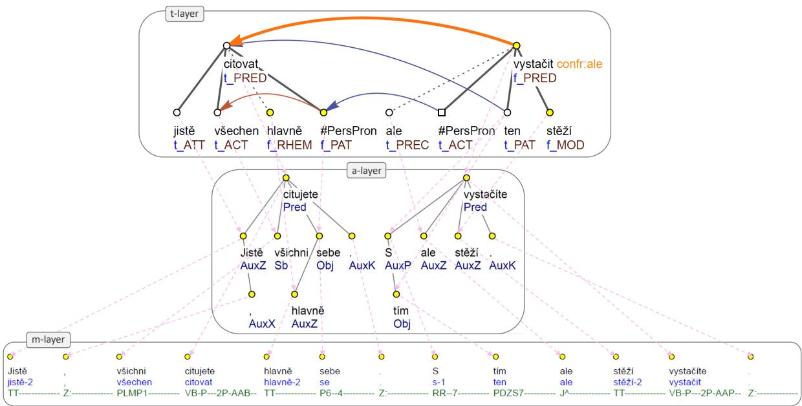
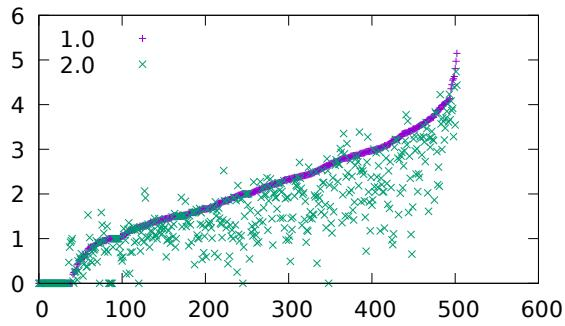

# From Form to Meaning: The Case of Particles within the Prague Dependency Treebank Annotation Scheme

Marie Mikulová and Barbora Štěpánková and Jan Štěpánek Charles University, Faculty of Mathematics and Physics Institute of Formal and Applied Linguistics Malostranské náměstí 25, 118 00 Prague 1, Czech Republic {mikulova,stepankova,stepanek}@ufal.mff.cuni.cz

## Abstract

In the last decades, computational linguistics has become increasingly interested in annotation schemes that aim at an adequate description of the meaning of the sentences and texts. Discussions are ongoing on an appropriate annotation scheme for a large and complex amount of diverse information. In this contribution devoted to description of polyfunctional uninflected words (namely particles), i.e. words which, although having only one paradigmatic form, can have several different syntactic functions and even express relatively different semantic distinctions, we argue that it is the multi-layer system (linked from meaning to text) that allows a comprehensive description of the relations between morphological properties, syntactic function and expressed meaning, and thus contributes to greater accuracy in the description of the phenomena concerned and to the overall consistency of the annotated data. These aspects are demonstrated within the Prague Dependency Treebank annotation scheme whose pioneering proposal can be found in the first COLING proceedings from 1965 (Sgall, 1965), and to this day, the concept has proved to be sound and serves very well for complex annotation.

## 1 Introduction

A systematic, comprehensive and explicit description of the language system is one of the fundamental tasks of linguistics, with important implications for natural language understanding tasks. At the same time, it is necessary to understand this system as a functioning means of communication. In this context, several concepts of language system description are to be distinguished; in one of these descriptions, function (meaning) is opposed to form, which is close to F. de Sasssure's binary understanding of the sign (Saussure, 1916). This description offers a basis for understanding language as a set of levels (or strata), which gave rise to several descriptive frameworks, from the original stratificational grammar of S. Lamb (1966) through Halliday's systemic grammar (Halliday, 1970) to Mel'chukovian Meaning-Text Model (MTT; Mel'chuk, 1988) or Sgall's Functional Generative Description (FGD; Sgall, 1967, Sgall et al., 1986), to name just a few that refer to levels explicitly.

The principles of stratificational FGD have been applied in the development of a multi-layer annotation scheme for the Prague Dependency Treebank (PDT; Hajič et al., 2020; see more in Sect. 3), which has been developed and enriched to date. In this contribution, in line with the upcoming release of the consolidated version 2.0 of the PDT treebanks (by the end of 2024), we point out the advantages of multi-layer linguistic annotation (see also Zeldes, 2018; Silvano et al., 2021; Hajičová et al., 2022): (i) the separation and at the same time the interconnection of different types of information about linguistic phenomena from form and structure to meaning, leading to a comprehensive approach to language description and its continuous refinement, and (ii) the possibility of cross-checking when annotating individual layers, resulting in higher quality and consistency of the annotated data.

We demonstrate the advantages of separating and linking different types of information within the multi-layer language description using the task of describing particles in Czech, i.e., polyfunctional uninflected words (such as jistě certainly'1, stěží ‘hardly', hlavně ‘mainly', ale ‘but') which, although having only a single paradigmatic form, can have several different syntactic functions and even express relatively different semantic distinctions.

For the upcoming release of PDT, a revised manual annotation of the surface syntactic structure of sentences is performed in the whole corpus, particularly in those parts of the corpus that were previously annotated only by automatic tools. Annotators monitor all annotation layers throughout the annotation process and consolidate manual annotations across all layers. We demonstrate that this procedure results in higher quality and consistency of the annotated data.

The article is organised as follows: The theoretical foundations for our analysis of particles, i.e. a multi-layer description of language, are described in the Sect. 2. The Prague Dependency Treebank framework, within which we present our analysis, is introduced in Sect. 3. The analysis of particles in the PDT annotation scheme is included in Sect. 4. The following two sections discuss the advantages of a multi-layer system – its effect on a more accurate description of language phenomena (Sect. 5) and on increasing the consistency and quality of annotated data (Sect. 6). Related work is discussed in Sect. 7. Our position and results are summarised in Sect. 8.

## 2 Stratificational Language Description

The long period of building PDT corpora (see Sect. 3), as well as the current research on the semantic categories of particles (see Sect. 4), has repeatedly convinced us that a complex multi-layer annotation scheme of a corpus is well founded from both a theoretical and a computational linguistic point of view. A language, by its nature, relates forms to meanings, and this relation is a very complex one. Stratificational (multi-layer) language description refers to the idea that the form-meaning relation can be understood as consisting of several layers or strata, each with its own distinct functions and rules, contributing to the overall meaningmaking process. In other words, a unit on a given level is understood to represent a form of a unit of a next higher level that is its function (Lamb and Newell, 1966; Sgall, 1967). The original raw text is stored at the lowest layer of the system, with the highest layer representing the meaning. The number and nature of the other intermediate layers is a matter of debate (cf. Lamb's (1966) six, Sgall's (1967) five or Mel'chuk's (1988) four layers) and may vary between typologically distinct languages.

The multi-layer concept helps linguists to describe the complex nature of language by breaking it down into more manageable components. On the one hand, stratification allows linguists to focus on specific aspects of language independently, facilitating more detailed and precise analyses. On the other hand, the interconnectedness of the layers makes it possible to study how the individual components influence each other. Understanding these interactions is crucial for a comprehensive description of how meaning is linked to text.

In the context of the current interest in semantic representations (e.g., Uniform Meaning Representation (Van Gysel et al., 2021), Abstract Meaning Representation (Banarescu et al., 2013), Universal Conceptual Cognitive Annotation (Abend and Rappoport, 2013), Enhanced Universal Dependencies (Schuster and Manning, 2016)), the questions about the relation between (cognitive, ontological, extra-linguistic) content and language system itself, which have been raised repeatedly in philosophy, logic, and linguistics (Frege, 1892; Saussure, 1916; Wittgenstein, 1953; Carnap, 1988), are now highly relevant again. In other words, what aspects of meaning (cf. Leech's (1990) seven or Sgall's (1995) six aspects) should be included in the language description? We argue that the level of socalled linguistic meaning (where the meaning of a sentence is determined by its structure and the meanings of its constituents; cf. also the notion of compositionality (Partee, 2004; Szabó, 2022) or literal meaning (Searle, 1978)) should be considered as a suitable starting point for further interpretation of the sentence semantics during which the interpreter applies knowledge of the context (reference, communication intention) and general knowledge of the world (comprehension, inference); cf. ideas postulated in FGD (Sgall et al., 1986; Sgall, 1995); these questions were reopened by Bender et al. (2015).

When describing particles (Sect. 4), we work with the linguistic layers established in the PDT annotation scheme (including the layer of linguistic meaning; see Sect. 3) and only hint at the possibilities of capturing and interpretation of meaning(s) in the extra-linguistic domain.

## 3 Prague Dependency Treebank

The Prague Dependency Treebank project (PDT) is unique in its attempt to systematically cover and link different layers of language including a semantic representation at the deep syntactic annotation layer called tectogrammatical. Regarding the current trend in the development of semantic representations in the field of computational linguistics, it should be highlighted that there is a large amount of data (more than 2 million tokens) manually annotated with an interlinked semantic, syntactic, and morphological annotations.

  
Figure 1: Multi-layer annotation scheme of the PDT-treebank

The hierarchical multi-layer architecture of PDT, reflected in several detailed annotation manuals available from the project web site,2 is schematically illustrated in Fig. 1 on the example of the Czech sentences (1).

(1) Jistě, všichni citujete hlavně sebe. S tím ale stěží vystačíte.

Of-course, all you-quote mainly yourself. With that but hardly you-manage.

‘Of course, you all mainly quote yourself. But that's hardly enough.'

In Fig. 1, each annotation layer of the system is indicated by a separate box. The links between the layers are indicated by the light dotted arrows. The original raw text is stored at the bottom layer of the system (and it is not shown in Fig. 1). Above the raw text layer, there are the three layers of annotations: morphological, analytical, and tectogrammatical one.

Czech is a highly inflectional language. At the morphological layer (m-layer box in Fig. 1), a 15-character tag is primarily used to describe the inflectional forms of (declined) nouns and adjectives and (conjugated) verbs. All tokens of a sentence are traditionally also assigned a POS category within the tag (in the first two positions).

Above the linearly structured morphological layer, there are two syntactic layers, one reflecting surface dependency structure (called analytical) and the other reflecting the deep syntactic structure understood as a linguistically structured meaning of the sentence (called tectogrammatical).

At the analytical layer (a-layer), a syntactic structure is captured by a tree-like graph with the specification of the head for each node and the assignment of a syntactic function (called afun) that corresponds to traditional syntactic functions such as subject (Sb), object (Obj), or adverbial (Adv). The main difference between the syntactic layers – on top of the repertoire of the syntactic functions – lies in the fact that at the analytical layer, every token from the raw text (including punctuation marks; cf. nodes for comma (AuxX) and terminal symbol of the sentence (AuxK) in Fig. 1) is represented by a node of the tree, while at the same time, no additional nodes are allowed, whereas tectogrammatical structure consists of nodes only for content (lexical) words; function words such as prepositions, auxiliary verbs, etc. are not present, their contribution to the meaning of the sentence is captured within the complex labels of the content words. Thus, there is for example only one node for the prepositional phrase s tím with that' in the tectogrammatical tree in Fig. 1. At the tectogrammatical layer, new nodes are also added for semantic units deleted on the surface; in Fig. 1 the restoration of a deletion is illustrated by the #PersPron (personal pronoun) node for the Actor (ACT) of the second sentence's predicate.

Tectogrammatical layer (t-layer) conceived as a level of linguistic meaning captures complex semantic annotations of a sentence: predicate— argument structure, semantic counterparts of morphological categories, topic-focus articulation, information structure, grammatical coreference, ellipsis. The semantico-syntactic relations are captured by the so-called functors; cf. the value PRED for predicate, ACT for actor, PAT for patient, etc. in Fig. 1. The blue values t and f (in front of the functor values) stand for topic-focus articulation: t is for contextually bound and f for contextually non-bound nodes. The ordering of nodes corresponds to the information structure of a sentence (the so-called communicative dynamism, cf. different position of particle stěží hardly' and ale but' at the a-layer and t-layer in Fig. 1.)

The t-layer also contains the annotations that go beyond the level of linguistic meaning: textual coreference, bridging, and discourse relations and other phenomena such as genre specification, named entities, etc. However, they are not a part of the t-layer in the sense of the theoretical framework of FGD. In Fig. 1, the additional annotation is represented by the blue arrows for textual coreference links, and by the orange arrow between the predicates of the two sentences as a discourse relation of confrontation (cf. Zikánová et al., 2015).

Up to now, various branches of PDT-style corpora of Czech data have been developed on varied types of texts, differing in genre specification. The latest version of PDT is the Prague Dependency Treebank – Consolidated 1.0 (Hajič et al. 2020)³ with manual annotation at the morphological (3.90m tokens) and tectogrammatical (2.76m tokens) layer. Manual annotation at the a-layer exists only in a part of the treebank (1.50m tokens). For the upcoming version 2.0 (to be released in late 2024),4 manual annotation at the a-layer (3.43m tokens in total) is performed even in those parts of the corpus that were previously annotated only by automatic tools. The goal of the annotation work is also to consolidate the manual annotation across all layers, including previously manually annotated parts of the a-layer. Annotators follow all annotation layers during the annotation process, using slightly modified annotation instructions.⁵

## 4 The Case of Particles

## 4.1 Particles as a POS category

In our study, we focused primarily on uninflected (functional) word types and tried to show how sentence representation at the different layers can be useful for their better description, classification and annotation. In the Czech linguistic tradition such words include prepositions (e.g. s ‘with'), conjunctions (e.g. nebo or’) and particles (e.g. asi probably'). While prepositions and conjunctions are relational and play an important role in the grammatical structure of a sentence, particles are semantic-pragmatic in nature. It is the particles that are the subject of our analysis.

Particles as a POS category are thus defined as uninflected words that do not function as integral elements of the sentential structure, but modify the statement with some pragmatic feature (cf. Cvrček et al., 2010; Štícha et al., 2018). This approach is quite common in the context of Central European linguistics (cf. for German Nekula, 1996; Zifonun et al., 1997, for Polish Grochowski et al., 2014; Rozumko, 20166).

Although particles are not a completely homogeneous group, there is a general agreement on the four basic types that make up this part of speech in Czech linguistics: modal particles – expressing mainly epistemic and evidential modality (e.g. rozhodně definitely', zřejmě apparently'); attitudinal particles – expressing the speaker's attitude (e.g. bohužel ‘unfortunately'); emphasising particles – having a specific position in the information structure of a sentence (e.g. jen ‘only', také also'), and so-called particles ‘structuring text’ – including discourse connectives and discourse markers (e.g. takže so', no well'). Due to the high degree of polyfunctionality, however, the specific function of the particles only becomes apparent in context.

## 4.2 Particles in the PDT treebanks

Despite the preponderance of pragmatic properties, particles are captured in a relevant way at all three PDT layers:

The m-layer assumes that words with different POS have a different tag (cf. Hajič, 2004; Mikulová et al., 2020). Particles often arose from words of other POS, especially adverbs, through a process of pragmaticalisation (cf. Aijmer, 1997; Rozumko, 2016). From the morphological point of view, for example, the difference between adverbs (Dg) and particles (TT) is that adverbs are gradable and negatable, whereas particles have only one stable form, this difference is captured in the morphological tag, see Tab. 1.

<table><tr><td rowspan=1 colspan=1>Lemma</td><td rowspan=1 colspan=1>POS</td><td rowspan=1 colspan=1>Tag</td></tr><tr><td rowspan=1 colspan=1>jistě-1jistě-2</td><td rowspan=1 colspan=1>AdverbParticle</td><td rowspan=1 colspan=1>Dg-------1N----TT--------</td></tr></table>

Table 1: M-layer, examples: Strážce vypadal nejistě. The guard looked uncertain.' (adverb) vs. Takovou knihu by jistě nikdo nečetl. Certainly no one would read such a book' (particle).

As mentioned above, particles do not express traditional syntactic relations, so at the syntactic a-layer, words with a pragmatic rather than a syntactic function are annotated as auxiliary afun AuxZ. However, their behaviour within a sentence indicates another relation: they can refer to the whole sentence, or to one (or more) of its words. This specific relation, called “scope", is semantic-pragmatic (e.g. it is used in context of informative structure, cf. Hajičová et al., 1998; Krifka, 2008), but on the a-layer it is formally captured by the position of the particle in the dependency tree. As an example, compare the position of particle hlavně mainly’ which has only the word sebe ‘yourself' in its scope, and stěží hardly' which refers to the whole sentence, see the Fig. 1.

Note that afun AuxZ is not only used for particles, but also for other POS with a pragmatic function. E.g. conjunctions which have a structuring/discourse function rather than a connective function (see ale ‘but' in Fig. 1). Similarly, if the modal meaning of certainty, usually expressed by the particle jistě certainly', is conveyed, for example, by the prepositional phrase s jistotou ‘with certainty', this prepositional phrase also receives the analytical function AuxZ.

At the semantico-syntactic t-layer, there is a group of functors that capture speaker-oriented expressions whose function in the sentence is to rhematise (functor RHEM), to link the sentence to its preceding context (PREC) or to express various modal meanings (MOD) and attitudes (ATT) (cf. Mikulová et al., 2006). Thus, they basically correspond to the particle types mentioned in 4.1.7 In (1), examples of the use of all these functors are shown: RHEM hlavně mainly'; PREC ale ‘but'; MOD stěží ‘hardly'; ATT jistě of course’. See also the Fig. 1.

In PDT, phenomena beyond linguistic meaning are currently annotated individually, i.e. not within a complex layer (cf. Sect. 3). Particles as polyfunctional words fulfil diverse semantico-pragmatic and discourse functions. PDT already captures some of these functions, e.g. in the description of discourse relations, ale is understood as a discourse connective in inter-sentential use (cf. Fig. 1). The possibilities of capturing other phenomena are at the stage of partial studies: Emphasising particles, e.g. hlavně mainly', are primarily indicators of the focus of a sentence, but can also function (even simultaneously) as discourse markers (Hajičová et al. 2020).8 According to Poláková and Synková's study (2021) based on PDT discourse annotation (inspired by the Penn Discourse TreeBank (Prasad et al., 2008)), modal particles are useful for interpretation of certain types of pragmatic coherence relations. The way modal and attitudinal particles are used affects the communicative function/speech act of the sentence (Štěpánková et al., 2024). Cf. while in (1) jistě is used to express acceptance of the given state (in the form of an affirmation), in (2) it expresses high certainty about the proposition.

## (2) Všichni jistě citujete hlavně sebe

## All surelly you-quote mainly yourself.

## 'I am sure you’re all quoting mainly yourself.'

Using the example of capturing semanticpragmatic expressions (particles), we can observe the expressive power and usefulness of a multilayer description. This scheme allows us to separate the formal description from the description of syntactic functions and meaning categories, and further to the semantic-pragmatic meanings arising from their use in specific contexts or situations. The relation between the layers is not one-to-one. Progressing from form to meaning (i.e., from the m-layer to the t-layer) enables us to trace how one form, one expression, serves to express multiple functions (e.g., the connective and text-structuring function of ale but'). Conversely, moving from meaning to form reveals that a single function can be realised by different means (e.g., epistemic modality can be expressed by the particle jistě certainly’ or by a prepositional phrase like s jistotou with certainty').

## 5 Refined Language Description

Theoretical approaches and partial analyses describe and emphasise the polyfunctionality of particles. By analysing annotations of the examined expressions (i.e. jistě certainly', stěží hardly', hlavně ‘mainly', ale but'), we show how this polyfunctionality is manifested in the data and how the description of these expressions has been refined in the upcoming version (PDT-C 2.0) compared to the “chaos" of the previous version (PDT-C 1.0). To compare previous and upcoming version of the corpus annotated with different approaches (see Sect. 3), we use combinations of corresponding annotation values from each layer – value of morphological tag, analytical afun and tectogrammatical functor – for the individual words under study.

The analysis of the annotation of the previous version 1.0 – in which the a-layer was processed partially automatically and the individual layers were processed independently – shows a high variability of the solution, which is understandable precisely because of the polyfunctionality of the examined expression and their insufficient and inaccurate description. Of course, inconsistencies in the annotations on individual layers very often indicate annotation errors (e.g. the combination of a particle tag at the m-layer, an adverbial afun at the a-layer and an adverbial functor at the t-layer indicates with high probability a wrong annotation at the m-layer). On the other hand, the unusual combinations also point to previously undescribed or overlooked phenomena, while at the same time prevaling interpretations are evident.

We could accept “human label variation", as B. Plank calls for (Plank, 2022; Weber-Genzel et al., 2024), but our intention is a consistent, reliable data set as well as a comprehensive language description (with no relevant information lost). In the PDT-C 2.0 version, we aim for both consistent treatment of individual polyfunctional expressions within a single layer and coherent cross-layer annotation. For manual annotation of the a-layer for PDT-C 2.0, modified annotation instructions were used: emphasis was placed on taking into account the previously annotated m-layer and t-layer. The annotators also could suggest changes and corrections of these layers. This resulted in many modifications and corrections to the original annotation

<table><tr><td>Functor</td><td>Afun</td><td>Tag</td><td>Freq</td></tr><tr><td>RHEM</td><td>AuxZ</td><td>Dg-------1A----</td><td>311</td></tr><tr><td>CM</td><td>AuxZ</td><td>Dg-------1A----</td><td>107</td></tr><tr><td>RHEM</td><td>Adv</td><td>Dg-------1A----</td><td>89</td></tr><tr><td>RHEM</td><td>ExD</td><td>Dg-------1A----</td><td>10</td></tr><tr><td>CM</td><td>Adv</td><td>Dg-------1A----</td><td>9</td></tr><tr><td>MANN</td><td>AuxZ</td><td>Dg-------1A----</td><td>4</td></tr><tr><td>RHEM</td><td>Obj</td><td>Dg-------1A----</td><td>3</td></tr><tr><td>CM</td><td>Atr</td><td>Dg-------1A----</td><td>2</td></tr><tr><td>MANN</td><td>Adv</td><td>Dg-------1A----</td><td>2</td></tr><tr><td>RHEM</td><td>Atr</td><td>Dg-------1A----</td><td>2</td></tr><tr><td>RSTR</td><td>Adv</td><td>Dg-------1A----</td><td>1</td></tr><tr><td>CM</td><td>AuxY</td><td></td><td>1</td></tr><tr><td></td><td>AuxY</td><td>Dg-------1A----</td><td>1</td></tr><tr><td>RHEM</td><td>AuxZ</td><td>Dg-------1A----</td><td>1</td></tr><tr><td>EXT</td><td></td><td>Dg-------1A----</td><td>1</td></tr><tr><td>THO</td><td>AuxZ</td><td>Dg-------1A----</td><td>1</td></tr><tr><td>ATT</td><td>ExD</td><td>Dg-------1A----</td><td></td></tr><tr><td>CM</td><td>ExD</td><td>Dg-------1A----</td><td>1</td></tr></table>

Table 2: Annotation of the word hlavně mainly' at the three layers of PDT in PDT-C 1.0

<table><tr><td>Functor</td><td>Afun</td><td>Tag</td><td>Freq</td></tr><tr><td>RHEM</td><td>AuxZ</td><td>TT-------------</td><td>422</td></tr><tr><td>CM</td><td>AuxZ</td><td>TT-------------</td><td>121</td></tr><tr><td>ATT</td><td>AuxZ</td><td>TT-------------</td><td>3</td></tr></table>

Table 3: Annotation of the word hlavně mainly' at the three layers of PDT in PDT-C 2.0

We demonstrate the above-mentioned changes on the annotation of the word hlavně ‘mainly'. Tab. 2 (capturing older 1.0 version) shows examples of obvious annotation errors, such as the afun Obj (Object, an afun usually used for nouns) or the functor THO (denoting temporal meaning: how often). Some suspicious combinations, such as RHEM and Adv, are probably caused by the automatic procedure based on the morphological tag/POS (which evaluated the word hlavně mainly' uniformly as an adverb (Dg)). However, the predominant combinations RHEM – AuxZ and CM – AuxZ and exclusively non-gradable use of this word indicate that this tag should be replaced by the tag for particle. Tab. 3 provides an overview of the relatively high consistent annotation of hlavně mainly' in the PDT-C 2.0 annotation. See Appendix A for similar comparisons of the other particles.

## 6 Data Consistency

As described in Sect. 3, for the upcoming version of PDT-C 2.0, the a-layer was annotated extensively. Moreover, the annotators (9 in total) had access to both the neighbouring manually annotated layers, which were also changed sometimes.

  
Figure 2: Entropy per word form. The word forms are sorted by the entropy in PDT-C 1.0.

Therefore, we expected the consistency of the annotation across the layers to improve. With regard to research of particles, we expected clearer information about each expression.

To measure the consistency change, we compared the annotation of particles (or rather expressions with semantic-pragmatic meaning that were assigned the afun AuxZ) in previous and in the version finalised for the release. For each (caseignorant) word form that was assigned AuxZ in the new data, we tracked its morphological lemma, tag, analytical afun, tectogrammatical functor,9 and the type of the relation between the a-layer and tlayer. The same word forms were selected from the original data and the same annotation values were extracted. There were 503 different word forms with the total of 290k instances.

We used entropy as the numeric representation of data consistency. For each word form, we calculated its entropy based on the number of different combinations of the observed annotation values. When applied to each word form, we can see that in most cases, the entropy was lower in the upcoming version 2.0, as shown in Fig. 2. The entropy of the selected particles in both the versions are shown in the tables in Appendix A. We used the binary logarithm in the entropy formula, so all the values presented in the article are in shannons.

To compare the consistency of the whole set of the selected word forms, we used conditional entropy. For each word form, we considered its frequency and frequencies of all the discovered combinations of its observed annotation values. The results are presented in Tab. 4: Regarding the expressions with semantic-pragmatic meaning, the entropy dropped by ½.

<table><tr><td rowspan=1 colspan=1>PDT-C 1.0</td><td rowspan=1 colspan=1>PDT-C 2.0</td><td rowspan=1 colspan=1>Difference</td></tr><tr><td rowspan=1 colspan=1>1.975276</td><td rowspan=1 colspan=1>1.466954</td><td rowspan=1 colspan=1>-0.508322</td></tr></table>

Table 4: Conditional entropy of the set of the selected word forms in the two versions of PDT-C.

## 7 Related Work

Here, we touch on notable representatives of corpus development projects from the following areas that are relevant for the issues addressed in this paper: (i) Corpora with a morpho-syntactic annotation aligned to raw text. We are interested in how the projects deal with the words characterised primarily by pragmatic properties. (ii) Corpora with multi-layer architecture as our main interest. (iii) Projects that aim to capture the “meaning". We are interested in how they take into account the meaning conveyed by particles.

(i) The morpho-syntactic annotation in the wellknown multilingual Universal Dependencies (UD) project (de Marneffe et al., 2021) is comparable to the annotation at the morphological and analytical layers in PDT. Both annotations are dependencybased, with nodes corresponding to all tokens in a sentence. In both projects, therefore, some solutions have to be adopted for the annotation of the words that are primarily characterised by pragmatic properties and are not typical dependents. In the UD (as in PDT) annotation, a POS label and a type of dependency relation are captured for each token node. In contrast to PDT, where particles are treated specifically even at the level of surface syntax, in UD no special attention is paid to expressions traditionally considered as particles (rhematizers, focalizers, etc.), and these expressions are dispersed among different labels, mainly merged with adverbs (ADV). The type of dependency relation also varies – depending on the POS category of both the dependent and the parent, it typically involves the adv dependency relation (indistinguishable from typical adverbials). Cecchini (2024) points out the problematic nature of this situation (mixing of adverbs and other expressions within the ADV category).

(ii) The UD project does not fully support multilayer annotation. In this sense, the multi-layer architecture of Meaning Text Theory (MTT) (Mel'čuk, 2016), applied in a corpus for Russian (SynTagRus; Apresjan et al., 2006) and Spanish (AnCora-UPF; Mille et al., 2013), is closer to the PDT project (Žabokrtský, 2005; Hajičová, 2007;

Hajičová and Mikulová, 2022). Apart from the common dependency base, the most important common feature is the emphasis on the semantic basis of the description. The tectogrammatical layer corresponds to the deep syntactic structure and the semantic structure in the MTT system. However, similarly to UD, particles do not receive special treatment in the MTT lower layers of the system. There is no separate POS for particles. The phenomena related to particle semantics’ are provided at the highest semantic layer, including the semanticcommunicative structure, the rhetorical structure and the referential structure. At this layer of representation, it is proposed to distinguish the aspect of thematicity, givenness, focalisation, emphasis, irony, doubt, etc. However, as far as we know, the semantic annotation has not been implemented in any corpus.

(iii) The multilingual Uniform Meaning Representation (UMR; Van Gysel et al., 2021) project aims to capture the meaning and the proposed annotation abstracts from the formal realisation. Therefore, the UMR specification does not treat particles as a formal category, but proposes an annotation of some semantic-pragmatic meanings conveyed (also) by particles. UMR captures polarity (+/-) and epistemic modality (including the source of the modality). On the default basic level, three values are distinguished: full (e.g. certainly), partial (e.g. probably), and neutral (e.g. possibly). Modal meanings are understood to be associated with events, without considering scope of the modality (scope is only determined for negation and quantification). Other “particle"meanings, such as emphasis and text structuring, are not described in the UMR specification.

The proposed annotation of modality is based on the rules applied in FactBank (Saurí and Pustejovsky, 2009), a freely available corpus annotated for modality. The fact that in FactBank (and UMR) the annotation is not linked to formal realisation, has led some other projects (Multinot (Lavid et al. 2016b; Lavid et al., 2016a) or Nissim et. al (2013)) to emphasise the importance of annotating not only semantics but also the corresponding formal realisation. All these projects highlight that the annotation of modal meaning is a complex task, with difficulties arising from subtle distinctions and the unclear boundary between pragmatic and content-related meanings and purely linguistic meanings.

We must also mention the projects that go beyond the sentence and linguistic meaning, focusing on the annotation of textual relations, and attempting to systematically capture communicative phenomena, since, as we have indicated in Sect. 3, particles can play a significant role in the interpretation of pragmatic coherence relations. We have already mentioned the Penn Discourse Treebank (PDTB) project (Prasad et al., 2008; see Sect. 3). Among others, we have to name the influential Rhetorical Structure Theory (RST, Mann and Thompson, 1988; Carlson et al., 2002), in which (unlike PDTB), it is assumed that the relations between the textual units can be represented by a tree graph for the entire document.

Although particles are not given special attention in any of these valuable projects, they are in many ways very inspiring (e.g. the finer classification of modal meanings in UMR and Multinot, discourse relations in PDTB and RST). It also turns out that separating different levels of description (form and meaning), as well as distinguishing between textbased and knowledge-based annotation (see also Bender et al., 2015) is beneficial for achieving a comprehensive view of linguistic phenomena.

## 8 Conclusion

In this contribution, focused on the task of describing polyfunctional uninflected words (namely particles), we argue that it is the multi-layer system (the separation and simultaneous interconnection of individual language layers) that allows for a comprehensive description of the relations between morphological properties, syntactic functions, and expressed meanings. A multi-layer annotation system also leads to greater accuracy in the description of linguistic phenomena and contributes to the overall consistency and quality of the annotated data. These points are demonstrated within the framework of the Prague Dependency Treebank project exemplified by detailed analysis of four particles and evaluated by changes in their entropy.

It is clear that form cannot be strictly separated from meaning. However, distinguishing between form, meaning, and other semantic aspects in the description of linguistic phenomena is beneficial – it increases the precision of the description. Multilayer annotation reveals phenomena that have either been previously uncharted or insufficiently described. Moreover, the task of annotating each sentence of a real text requires the constant reevaluation and refinement of established rules.

Description of language is far from complete.

## Limitations

We are aware of the fact that entropy might not be the best measure of data quality, as simplification of the annotation decreases the entropy, too. But as shown in the rest of the article, our effort was not to simplify the data, but to analyse the particular words and review their annotation based on linguistic expertise. All the problematic combinations of annotated values at different layers were reviewed by human annotators who fixed the data according to the annotation guidelines. The entropy can thus serve as a measure of the work actually done rather than the gauge of the quality.

Another manifestation of decreasing entropy might be an information loss. We have not yet found a way how to measure the inherent entropy of the language itself which we could compare to the numbers presented here. Again, we hope the rest of the article shows that we tried to solve the problematic word and layer constellations case by case based on the guidelines and context, with the goal to precisely classify the observed phenomena.

## Acknowledgments

The research reported here has been supported by the Czech Science Foundation under the project GA23-05240S. The work described herein has also been supported by the Ministry of Education, Youth and Sports of the Czech Republic, Project No. LM2023062 LINDAT/CLARIAH-CZ.10

We would also like to thank all our outstanding annotators for not working like machines, but for thinking critically during annotation and pointing out the shortcomings of the annotation guidelines. Without their efforts, this contribution would not have been possible.

## References

Omri Abend and Ari Rappoport. 2013. Universal Conceptual Cognitive Annotation (UCCA). In Proceedings of the 51st Annual Meeting of the Association for Computational Linguistics (Volume 1: Long Papers), pages 228–238, Sofia, Bulgaria. Association for Computational Linguistics.

Karin Aijmer. 1997. I think — an English modal particle. In Toril Swan and Olaf J. Westvik, editors, Modality in Germanic Languages. Historical and Comparative Perspectives, pages 1–48. De Gruyter Mouton, Berlin, New York.

Juri Apresjan, Igor Boguslavsky, Boris Iomdin, Leonid Iomdin, Andrei Sannikov, and Victor Sizov. 2006. A syntactically and semantically tagged corpus of Russian: State of the art and prospects. In Proceedings of the Fifth International Conference on Language Resources and Evaluation (LREC’06), Genoa, Italy. European Language Resources Association.

Laura Banarescu, Claire Bonial, Shu Cai, Madalina Georgescu, Kira Griffitt, Ulf Hermjakob, Kevin Knight, Philipp Koehn, Martha Palmer, and Nathan Schneider. 2013. Abstract Meaning Representation for Sembanking. In Proceedings of the 7th Linguistic Annotation Workshop and Interoperability with Discourse, pages 178–186, Sofia, Bulgaria. Association for Computational Linguistics.

Emily M. Bender, Dan Flickinger, Stephan Oepen, Woodley Packard, and Ann Copestake. 2015. Layers of Interpretation: On Grammar and Compositionality. In Proceedings of the 11th International Conference on Computational Semantics, pages 239–249, London, UK. Association for Computational Linguistics.

Lynn Carlson, Daniel Marcu, and Mary Ellen Okurowski. 2002. RST Discourse Treebank. LDC2002T07, Linguistic Data Consortium, Philadelphia, USA.

Rudolf Carnap. 1988. Meaning and necessity: A study in semantics and modal logic, volume 30. University of Chicago Press, Chicago, USA.

Flavio Massimiliano Cecchini. 2024. Let's Do It Orderly: A Proposal for a Better Taxonomy of Adverbs in Universal Dependencies, and Beyond. The Prague Bulletin of Mathematical Linguistics, 121:15–65.

Václav Cvrček, Vilém Kodýtek, Marie Kopřivová, Dominika Kováříková, Petr Sgall, Michal Šulc, Jan Táborský, Jan Volín, and Martina Waclawičová. 2010. Mluvnice současné češtiny. [A grammar of contemporary Czech] Karolinum, Prague, Czech Republic.

Marie-Catherine de Marneffe, Christopher D. Manning, Joakim Nivre, and Daniel Zeman. 2021. Universal Dependencies. Computational Linguistics, 47(2):255–308.

Gottlob Frege. 1892. On sense and reference.

Maciej Grochowski, Anna Kisiel, and Magdalena Żabowska. 2014. Słownik gniazdowy partykuł polskich. PAU; Krakow, Poland.

Jan Hajič. 2004. Disambiguation of Rich Inflection (Computational Morphology of Czech). Karolinum, Prague, Czech Republic.

Jan Hajič, Eduard Bejček, Jaroslava Hlaváčová, Marie Mikulová, Milan Straka, Jan Štěpánek, and Barbora Štěpánková. 2020. Prague Dependency Treebank - Consolidated 1.0. In Proceedings of the Twelfth Language Resources and Evaluation Conference, pages 5208–5218, Marseille, France. European Language Resources Association.

Eva Hajičová. 2007. The position of TFA (information structure) in a dependency based description of language. In Proceedings of the 3rd International Conference on Meaning-Text Theory (MTT 2007), pages 159–178, München / Wien. Gesellschaft zur Förderung slawistischer Studien, Verlag Otto Sagner, c/o Kubon & Sagner.

Eva Hajičová and Marie Mikulová. 2022. Information structure in a formal description of language as reflected in an annotated corpus of Czech. In Lifetime Linguistic Inspirations. To Igor Mel'čuk from Colleagues and Friends for his 90th Birthday, pages 187– 200. Wiener Slawistischer Almanach. Linguistische Reihe, Peter Lang, Berlin.

Eva Hajičová, Jiří Mírovský, and Barbora Štěpánková. 2020. Focalizers and Discourse Relations. The Prague Bulletin of Mathematical Linguistics, 115:187–197.

Eva Hajičová, Barbara Partee, and Petr Sgall. 1998. Topic-focus Articulation, Tripartite Structures, and Semantic Content, volume 71. Springer Dordrecht, Netherlands.

Eva Hajičová, Marie Mikulová, Barbora Štěpánková, and Jiří Mírovský. 2022. Advantages of a complex multilayer annotation scheme: The case of the Prague dependency treebank. In Proceedings of the 16th Linguistic Annotation Workshop (LAW-XVI) within LREC2022, pages 70–78, Marseille, France. European Language Resources Association.

Michael A. K. Halliday. 1970. Language structure and language function. New horizons in linguistics 1:140–165.

Manfred Krifka. 1993. Focus and Presupposition in Dynamic Interpretation. Journal of Semantics, 10(4):269–300.

Manfred Krifka. 2008. Basic Notions of Information Structure. Acta Linguistica Hungarica, 55(3-4):243– 276.

Sydney M. Lamb and Leonard E. Newell. 1966. Outline of Stratificational Grammar: With an Appendix by L. E. Newell. Georgetown University Press, Georgetown, USA.

Julia Lavid, Marta Carretero, and Juan Rafael Zamorano-Mansilla. 2016a. Contrastive annotation of epistemicity in the Multinot project: preliminary steps. In Proceedings of the ISA-12, Twelfth Joint ACL-ISO Workshop on Interoperable Semantic Annotation, pages 81–88, Portoroz, Slovenia.

Julia Lavid, Marta Carretrero, and Juan Rafael Zamorano-Mansilla. 2016b. A linguisticallymotivated annotation model of modality in English and Spanish: Insights from MULTINOT. Linguistic Issues in Language Technology, 14.

Geoffrey N. Leech. 1990. Semantics: The Study of Meaning. Penguin Books, London, United Kingdom.

William C Mann and Sandra A Thompson. 1988. Rhetorical structure theory: Toward a functional theory of text organization. Text-interdisciplinary Journal for the Study of Discourse, 8(3):243–281.

Igor Aleksandrovic Mel'chuk. 1988. Dependency syntax: theory and practice. SUNY, New York, USA.

Igor Mel'čuk. 2016. Language: From meaning to text. Academic Studies Press, Brookline, USA.

Marie Mikulová, Alevtina Bémová, Jan Hajič, Eva Hajičová, Jiří Havelka, Veronika Kolářová, Lucie Kučová, Markéta Lopatková, Petr Pajas, Jarmila Panevová, Magda Razímová, Petr Sgall, Jan Štěpánek, Zdeňka Urešová, Kateřina Veselá, and Zdeněk Žabokrtský. 2006. Annotation on the tectogrammatical level in the Prague Dependency Treebank. Annotation manual. Technical Report 30, Charles University, Prague, Czech Republic.

Marie Mikulová, Jaroslava Hlaváčová, Jan Hajič, Jiří Hana, Hana Hanová, Barbora Hladká, Barbora Štěpánková, and Daniel Zeman. 2020. Manual for morphological annotation, Revision for the Prague Dependency Treebank - Consolidated 1.0. Technical Report 64, Charles University, Prague, Czech Republic.

Simon Mille, Alicia Burga, and Leo Wanner. 2013. AnCora-UPF: A multi-level annotation of Spanish. In Proceedings of the Second International Conference on Dependency Linguistics (DepLing 2013), pages 217–226. Charles University, Matfyzpress, Prague, Czech Republic.

Marek Nekula. 1996. System der Partikeln im Deutschen und Tschechischen: unter besonderer Berücksichtigung der Abtönungspartikeln, volume 355. Walter de Gruyter, Berlin, Germany.

Malvina Nissim, Paola Pietrandrea, Andrea Sansò, and Caterina Mauri. 2013. Cross-linguistic annotation of modality: a data-driven hierarchical model. In Proceedings of the 9th Joint ISO - ACL SIGSEM Workshop on Interoperable Semantic Annotation, pages 7–14, Potsdam, Germany. Association for Computational Linguistics.

Barbara Hall Partee. 2004. Compositionality in Formal Semantics: Selected Papers of Barbara H. Partee. Blackwell, Hoboken, USA, Malden, MA.

Barbara Plank. 2022. The “problem" of human label variation: On ground truth in data, modeling and evaluation. In Proceedings of the 2022 Conference on Empirical Methods in Natural Language Processing, pages 10671–10682, Abu Dhabi, United Arab Emirates. Association for Computational Linguistics.

Lucie Poláková and Pavlína Synková. 2021. Pragmatické aspekty v popisu textové koherence. [Pragmatic aspects in the description of textual coherence]. Naše řeč, 104(4):225–242.

Rashmi Prasad, Nikhil Dinesh, Alan Lee, Eleni Miltsakaki, Livio Robaldo, Aravind Joshi, and Bonnie Webber. 2008. The Penn Discourse TreeBank 2.0. In Proceedings of the Sixth International Conference on Language Resources and Evaluation, Marrakech, Morocco. European Language Resources Association.

Agata Rozumko. 2016. Linguistic concepts across languages: The category of epistemic adverbs in English and Polish. Yearbook of the Poznań Linguistic Meeting, pages 195–214.

Roser Saurí and James Pustejovsky. 2009. Factbank: a corpus annotated with event factuality. Language resources and evaluation, 43:227–268.

Ferdinand de Saussure. 1916. Cours de linguistique générale. C. Bally and A. Sechehaye, with A. Riedlinger, eds. Payot, Lausanne and Paris.

Sebastian Schuster and Christopher D. Manning. 2016. Enhanced English Universal Dependencies: An improved representation for natural language understanding tasks. In Proceedings of the Tenth International Conference on Language Resources and Evaluation, pages 2371–2378, Portorož, Slovenia. European Language Resources Association.

John R. Searle. 1978. Literal meaning. Erkenntnis, 13(1):207–224.

Petr Sgall. 1965. Generation, Production, and Translation. In Proceedings of the 1st International Conference on Computational Linguistics, New York, USA.

Petr Sgall. 1967. Generativní popis jazyka a česká deklinace. [Generative description of language and Czech declension], Academia, Prague, Czech Republic.

Petr Sgall. 1995. From Meaning via Reference to Content. In Karlovy Vary studies in reference and meaning, pages 172–183. Filosofia Publications, Prague, Czech Republic.

Petr Sgall, Eva Hajičová, and Jarmila Panevová. 1986. The Meaning of the Sentence and Its Semantic and Pragmatic Aspects. Academia/Reidel Publishing Company, Prague/Dordrecht.

Purificação Silvano, António Leal, Fátima Silva, Inês Cantante, Fatima Oliveira, and Alípio Mario Jorge. 2021. Developing a multilayer semantic annotation scheme based on ISO standards for the visualization of a newswire corpus. In Proceedings of the 17th Joint ACL - ISO Workshop on Interoperable Semantic Annotation, pages 1–13, Groningen, Netherlands. Association for Computational Linguistics.

Barbora Štěpánková, Lucie Poláková, Jana Šindlerová, and Michal Novák. 2024. What can dictionaries tell us about pragmatic markers. In Proceedings of the XXI EURALEX International Congress, Cavtat, Croatia.

František Štícha, Ivana Kolářová, Miloslav Vondráček, Ivana Bozděchová, Jana Bílková, Klára Osolsobě, Pavla Kochová, Zdeňka Opavská, Josef Šimandl, Lucie Kopáčková, et al. 2018. Velká akademická gramatika spisovné češtiny. I., Morfologie. [Great Academic Grammar of Standard Czech. Part I: Morphology.]. Academia, Prague, Czech Republic.

Zoltán Gendler Szabó. 2022. Compositionality. In Edward N. Zalta and Uri Nodelman, editors, The Stanford Encyclopedia of Philosophy. Metaphysics Research Lab, Stanford University, Standford, USA.

Jens EL Van Gysel, Meagan Vigus, Jayeol Chun, Kenneth Lai, Sarah Moeller, Jiarui Yao, Tim O'Gorman, Andrew Cowell, William Croft, Chu-Ren Huang, Jan Hajič, James H. Martin, Stephan Oepen, Martha Palmer, James Pustejovsky, Rosa Vallejos, and Nianwen Xue. 2021. Designing a Uniform Meaning Representation for Natural Language Processing. KI-Künstliche Intelligenz, 35(3-4):343–360.

Leon Weber-Genzel, Siyao Peng, Marie-Catherine De Marneffe, and Barbara Plank. 2024. VariErr NLI: Separating annotation error from human label variation. In Proceedings of the 62nd Annual Meeting of the Association for Computational Linguistics (Volume 1: Long Papers), pages 2256–2269, Bangkok, Thailand. Association for Computational Linguistics.

Ludwig Wittgenstein. 1953. Philosophical investigations. Philosophische untersuchungen. Macmillan, New York, USA.

Zdeněk Žabokrtský. 2005. Resemblances between Meaning-Text Theory and Functional Generative Description. In Proceedings of the 2nd International Conference of Meaning-Text Theory, pages 549–557, Moskva, Russia. Slavic Culture Languages Publishers House.

Henk Zeevat. 2003. Particles : presupposition triggers or context markers. In Optimality Theory and Pragmatics. Palgrave-McMillan.

Amir Zeldes. 2018. Multilayer corpus studies. Routledge, New York and London.

Gisela Zifonun, Ludger Hoffmann, and Bruno Strecker. 1997. Grammatik der deutschen Sprache 3. Mouton de Gruyter, Berlin / New York.

Šárka Zikánová, Eva Hajičová, Barbora Hladká, Pavlína Jínová, Jiří Mírovský, Anna Nedoluzhko, Lucie Poláková, Kateřina Rysová, Magdaléna Rysová, and Jan Václ. 2015. Discourse and Coherence. From the Sentence Structure to Relations in Text. Charles University, Prague, Czech Republic.

## A Appendix

Here, in Tables 5, 6, 7, and 8, we show the annotation of the words jistě certainly', stěží hardly', ale but', and hlavně mainly' at the three layers in PDT-C 2.0 and the previous version 1.0. The last row in each table shows the entropy of the corresponding column.

<table><tr><td colspan="3">PDT-C 2.0</td><td colspan="4">PDT-C 1.0</td></tr><tr><td>Func</td><td>Afun</td><td>Tag</td><td>Freq</td><td>Func</td><td>Afun</td><td>Tag</td><td>Freq</td></tr><tr><td>MOD</td><td>AuxZ</td><td></td><td>225</td><td>MOD</td><td>Adv</td><td>Dg- ------1A----</td><td>91</td></tr><tr><td>PARTL</td><td>AuxZ</td><td>TT--</td><td>15</td><td>MOD</td><td>AuxY</td><td>Dg-------1A----</td><td>61</td></tr><tr><td>MANN</td><td>Adv</td><td>Dg-------1A----</td><td>4</td><td>MOD</td><td>Adv</td><td></td><td>42</td></tr><tr><td>MANN</td><td>Adv</td><td>Dg-------1N----</td><td>3</td><td>PARTL</td><td>ExD</td><td>TT---------</td><td>9</td></tr><tr><td>ATT</td><td>AuxZ</td><td>TT-----</td><td>2</td><td>MOD</td><td>AuxY</td><td></td><td>7</td></tr><tr><td></td><td></td><td></td><td></td><td>MOD</td><td>ExD</td><td></td><td>7</td></tr><tr><td></td><td></td><td></td><td></td><td>MOD</td><td>ExD</td><td>Dg-------1A----</td><td>7</td></tr><tr><td></td><td></td><td></td><td></td><td>MANN</td><td>Adv</td><td>Dg-------1A----</td><td>3</td></tr><tr><td></td><td></td><td></td><td></td><td>ATT</td><td>ExD</td><td>Dg-------1A----</td><td>3</td></tr><tr><td></td><td></td><td></td><td></td><td>ATT</td><td>ExD</td><td></td><td>3</td></tr><tr><td></td><td></td><td></td><td></td><td>RHEM</td><td>ExD</td><td>TT--</td><td>3</td></tr><tr><td></td><td></td><td></td><td></td><td>MANN</td><td>Adv</td><td>Dg-------1N----</td><td>2</td></tr><tr><td></td><td></td><td></td><td></td><td>PARTL</td><td>ExD</td><td>Dg-- ------1A----</td><td>2</td></tr><tr><td></td><td></td><td></td><td></td><td>ATT</td><td>Adv</td><td>Dg-------1A----</td><td>1</td></tr><tr><td></td><td></td><td></td><td>ATT</td><td></td><td>AuxY</td><td>Dg-------1A----</td><td>1</td></tr><tr><td></td><td></td><td></td><td></td><td>MANN</td><td>AuxY</td><td>Dg-------1A----</td><td>1</td></tr><tr><td></td><td></td><td></td><td>MOD</td><td></td><td>AuxZ</td><td>Dg-------1A----</td><td>1</td></tr><tr><td></td><td></td><td></td><td>RHEM</td><td></td><td>ExD</td><td>Dg-------1A----</td><td>1</td></tr><tr><td></td><td></td><td></td><td>MOD</td><td></td><td>Adv</td><td>Dg-------1N----</td><td>1</td></tr><tr><td></td><td></td><td></td><td>PART</td><td></td><td>Adv</td><td>TT-</td><td>1</td></tr><tr><td></td><td></td><td></td><td>MANN</td><td></td><td>ExD</td><td>TT--</td><td>1</td></tr><tr><td></td><td></td><td></td><td>MOD</td><td></td><td>Pred</td><td>TT-</td><td>1</td></tr><tr><td></td><td>1.108773</td><td></td><td></td><td></td><td></td><td></td><td></td></tr><tr><td colspan="2"></td><td></td><td colspan="2"></td><td></td><td>3.204676</td><td></td></tr></table>

Table 5: Annotation of the word jistě certainly'.

<table><tr><td colspan="3">PDT-C 2.0</td><td colspan="4">PDT-C 1.0</td></tr><tr><td>Func</td><td>Afun</td><td>Tag</td><td>Freq</td><td>Func</td><td>Afun Tag</td><td></td><td>Freq</td></tr><tr><td>MANN</td><td>Adv</td><td>Db---</td><td>21</td><td>MOD</td><td>Adv</td><td>Db-- 二-二二二二一</td><td>19</td></tr><tr><td>MOD</td><td>AuxZ</td><td>TT---</td><td>14</td><td>EXT</td><td>Adv</td><td></td><td>7</td></tr><tr><td>EXT</td><td>Adv</td><td></td><td>2</td><td>EXT</td><td>Adv</td><td></td><td>5</td></tr><tr><td rowspan="3"></td><td></td><td></td><td></td><td>ATT</td><td>Adv</td><td></td><td>4</td></tr><tr><td></td><td></td><td></td><td>ATT</td><td>ExD</td><td>Db--- --------</td><td>1</td></tr><tr><td></td><td></td><td></td><td>EXT</td><td>ExD</td><td>Db-</td><td>1</td></tr><tr><td colspan="3">1.445718</td><td></td><td colspan="2">2.216264</td><td></td><td></td></tr><tr><td>Func</td><td>Afun</td><td>Tag</td><td>Freq</td><td>Func</td><td>Afun</td><td>Tag</td><td>Freq</td></tr><tr><td>ADVS</td><td>Coord</td><td>J^--</td><td>5389</td><td>ADVS</td><td>Coord</td><td>J^_</td><td>5366</td></tr><tr><td>PREC</td><td>AuxZ</td><td>J^--</td><td>3473</td><td>PREC</td><td>Coord</td><td>J^-</td><td>3423</td></tr><tr><td>GRAD</td><td>Coord</td><td>J^---</td><td>588</td><td>GRAD</td><td>Coord</td><td>J^---</td><td>584</td></tr><tr><td>CONJ</td><td>Coord</td><td></td><td>9</td><td>PREC</td><td>AuxY</td><td></td><td>49</td></tr><tr><td>ATT</td><td>AuxZ</td><td>TT---</td><td>3</td><td>ADVS</td><td>AuxY</td><td>J^--</td><td>13</td></tr><tr><td>PARTL</td><td>AuxZ</td><td></td><td>2</td><td>CONJ</td><td>Coord</td><td></td><td>10</td></tr><tr><td>ADVS</td><td>AuxY</td><td>J^-----</td><td>2</td><td>DISJ</td><td>Coord</td><td>J^--</td><td>5</td></tr><tr><td>ID</td><td>AuxZ</td><td></td><td>1</td><td>APPS</td><td>Coord</td><td>J^----</td><td>4</td></tr><tr><td>CONJ</td><td>Coord</td><td></td><td>1</td><td>RHEM</td><td>Coord</td><td>J^---</td><td>4</td></tr><tr><td>CONFR</td><td>Coord</td><td>J^--</td><td>1</td><td>CONFR</td><td>Coord</td><td>J^---</td><td>3</td></tr><tr><td></td><td></td><td></td><td></td><td>ATT</td><td>Coord</td><td></td><td>2</td></tr><tr><td></td><td></td><td></td><td></td><td>PARTL</td><td>Coord</td><td>J^--</td><td>2</td></tr><tr><td></td><td></td><td></td><td></td><td>PREC</td><td>ExD</td><td>J^---</td><td>2</td></tr><tr><td></td><td></td><td></td><td></td><td>ADVS</td><td>Coord</td><td>J^-----</td><td>1</td></tr><tr><td></td><td></td><td></td><td></td><td>ID</td><td>Atr</td><td>J^--</td><td>1</td></tr><tr><td></td><td></td><td></td><td></td><td>CONFR</td><td>AuxY</td><td>J^---</td><td>1</td></tr><tr><td></td><td></td><td></td><td></td><td>ADVS</td><td>AuxZ</td><td>J^--</td><td>1</td></tr><tr><td></td><td></td><td></td><td></td><td>OPER</td><td>Coord</td><td>J^-</td><td>1</td></tr><tr><td></td><td></td><td></td><td></td><td>ADVS</td><td>ExD</td><td>J^</td><td>1</td></tr><tr><td colspan="4">1.647798</td><td colspan="4">1.709525</td></tr></table>

Table 6: Annotation of the word stěží hardly'.

Table 7: Annotation of the word ale but'.

<table><tr><td colspan="3">PDT-C 2.0</td><td colspan="4">PDT-C 1.0</td></tr><tr><td>Func</td><td>Afun</td><td>Tag</td><td>Freq</td><td>Func Afun</td><td>Tag</td><td></td><td>Freq</td></tr><tr><td>RHEM</td><td>AuxZ</td><td>TT-------------</td><td>422</td><td>RHEM</td><td>AuxZ</td><td>Dg-------1A----</td><td>311</td></tr><tr><td>CM</td><td>AuxZ</td><td>TT-------------</td><td>121</td><td>CM</td><td>AuxZ</td><td>Dg-------1A----</td><td>107</td></tr><tr><td>ATT</td><td>AuxZ</td><td></td><td>3</td><td>RHEM</td><td>Adv</td><td>Dg-------1A----</td><td>89</td></tr><tr><td rowspan="10"></td><td></td><td></td><td></td><td>RHEM</td><td>ExD</td><td>Dg-------1A----</td><td>10</td></tr><tr><td></td><td></td><td>CM</td><td>ADV</td><td>Dg</td><td>g-------1A----</td><td>9</td></tr><tr><td></td><td></td><td>MANN</td><td>AuxZ</td><td>Dg -------1A----</td><td>4</td></tr><tr><td></td><td>RHEM</td><td>Obj</td><td>Dg</td><td>g-------1A----</td><td>3</td></tr><tr><td></td><td></td><td>CM</td><td>Atr</td><td>Dg -------1A----</td><td>2</td></tr><tr><td></td><td></td><td>MANN Adv</td><td>Dg</td><td>-------1A----</td><td>2</td></tr><tr><td></td><td>RHEM</td><td>Atr</td><td>Dg</td><td>-------1A----</td><td>2</td></tr><tr><td></td><td>RSTR</td><td>Adv</td><td>Dg-------1A----</td><td></td><td>1</td></tr><tr><td></td><td>CM</td><td>AuxY</td><td>Dg</td><td>-------1A----</td><td>1 1</td></tr><tr><td></td><td></td><td>RHEM EXT</td><td>AuxY</td><td>Dg -------1A----</td><td></td></tr><tr><td rowspan="4"></td><td></td><td></td><td>AuxZ</td><td>Dg</td><td>-------1A----</td><td>1</td></tr><tr><td></td><td>THO</td><td>AuxZ</td><td>Dg -------1A----</td><td></td><td>1</td></tr><tr><td></td><td>ATT</td><td>ExD</td><td>Dg g-------1A----</td><td></td><td>1</td></tr><tr><td></td><td>CM</td><td>ExD</td><td>Dg</td><td>-----1A----</td><td>1</td></tr><tr><td colspan="2">1.443416</td><td></td><td colspan="2"></td><td colspan="2">2.458338</td></tr></table>

Table 8: Annotation of the word hlavně mainly'