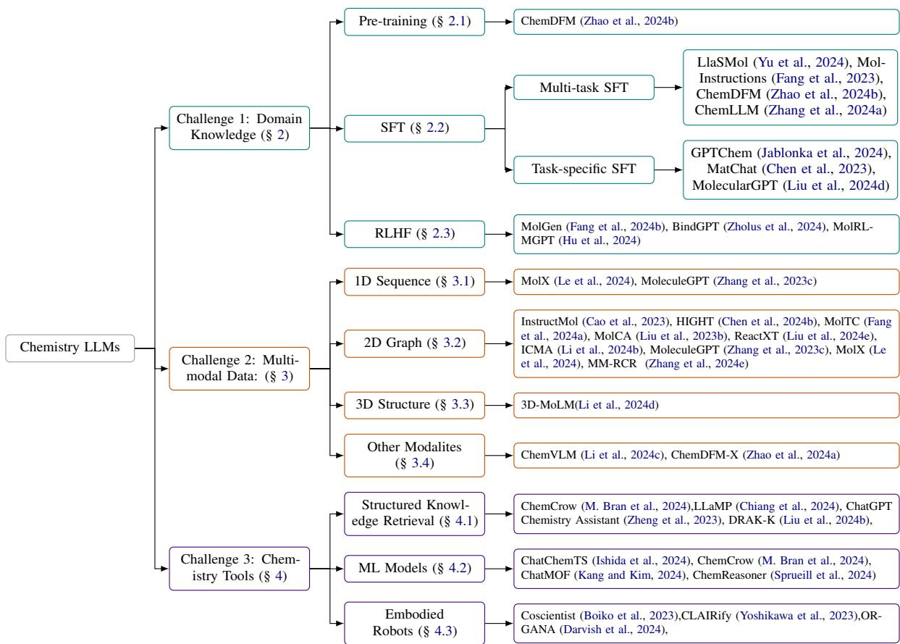
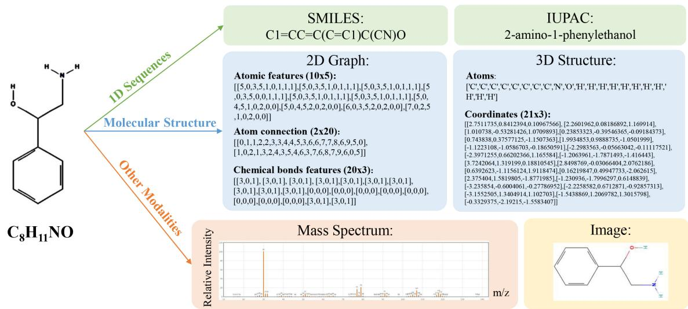
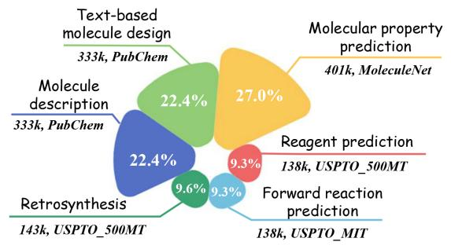
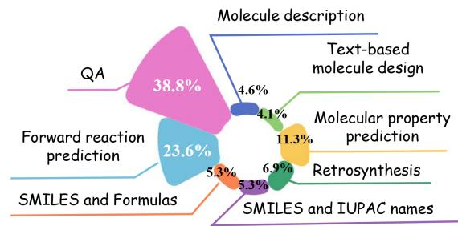
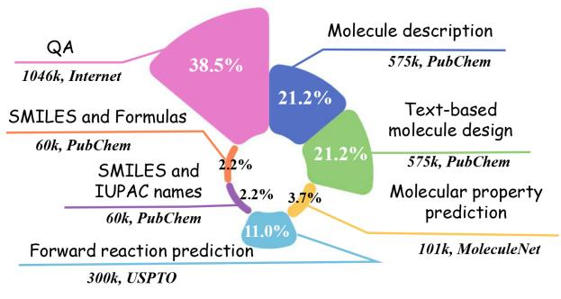
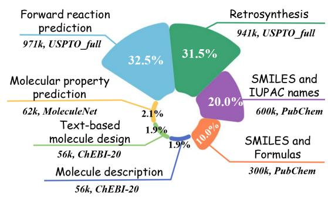

# From Generalist to Specialist: A Survey of Large Language Models for Chemistry

Yang Han1,2 Ziping Wan2 Lu Chen1,2∗ Kai Yu1,2 Xin Chen 2   
1X-LANCE Lab, Department of Computer Science and Engineering MoE Key Lab of Artificial Intelligence, SJTU AI Institute Shanghai Jiao Tong University, Shanghai, China 2Suzhou Laboratory, Suzhou, China   
{csyanghan,chenlusz}@sjtu.edu.cn,mail.xinchen@gmail.com

## Abstract

Large Language Models (LLMs) have significantly transformed our daily life and established a new paradigm in natural language processing (NLP). However, the predominant pretraining of LLMs on extensive web-based texts remains insufficient for advanced scientific dis covery, particularly in chemistry. The scarcity of specialized chemistry data, coupled with the complexity of multi-modal data such as 2D graph, 3D structure and spectrum, present distinct challenges. Although several studies have reviewed Pretrained Language Models (PLMs) in chemistry, there is a conspicuous absence of a systematic survey specifically focused on chemistry-oriented LLMs. In this paper, we outline methodologies for incorporating domain-specific chemistry knowledge and multi-modal information into LLMs, we also conceptualize chemistry LLMs as agents using chemistry tools and investigate their potential to accelerate scientific research. Additionally, we conclude the existing benchmarks to evaluate chemistry ability of LLMs. Finally, we critically examine the current challenges and identify promising directions for future research. Through this comprehensive survey, we aim to assist researchers in staying at the forefront of developments in chemistry LLMs and to inspire innovative applications in the field. 1

## 1 Introduction

Recent years have witnessed remarkable advancements in daily life driven by LLMs. Competitive models like GPT-4 (Achiam et al., 2023) and Claude (Anthropic, 2024) have demonstrated exceptional abilities across diverse tasks, often matching or surpassing human-level performance, marking significant progress toward Artificial General Intelligence (AGI, Bubeck et al. (2023)). In scientific domains, LLMs have been applied to handle tasks involving natural language and various scientific data (e.g., molecules, proteins, DNA), showing promising results (Fang et al., 2023). Among these, chemistry LLMs, further tailored for chemical applications via additional training or advanced prompt engineering, have garnered significant attention. Before the advent of LLMs, there are lots of notable efforts towards chemistry, such as MolT5 (Edwards et al., 2022), Text2Mol (Edwards et al., 2021), MoMu (Su et al., 2022), Text+Chem T5 (Christofidellis et al., 2023). However, these models are built on PLMs like BERT (Devlin, 2018) and T5 (Raffel et al., 2020), requiring fine-tuning for specific tasks and lacking emergent abilities (Wei et al., 2022a), such as Chain-of-Thought (CoT, Wei et al. (2022b)) reasoning and tool-using capabilities (Qin et al., 2023). Existing reviews (Xiao et al., 2024; Liao et al., 2024; Pei et al., 2024a) have already discussed those PLMs in chemistry, such as Liao et al. (2024), which emphasize molecule encoding methods and pretraining objectives. More related works are discussed in the Appendix A. In contrast, our survey focuses on generative models with Transformer decoder architectures (Vaswani et al., 2017), addressing key challenges of general LLMs and reviewing existing approaches to adapt them for chemistry-specific tasks and applications.

<table><tr><td>Question: What is the molecule formula of the molecule with the the IUPAC name &#x27;[3-(carboxyamino)-2-oxopropyl]azanium&#x27;? GPT4o: The molecular formula for &#x27;[3-(carboxyamino)-2- oxopropyl]azanium&#x27; is C4H8N2O3. ×</td></tr><tr><td>Question: What are the products of the reaction described in the picture. oH hv (solid state) β-polymorph</td></tr><tr><td>GPT4o: The image shows the molecule of cinnamic acid undergoing a solid-state reaction upon exposure to light (indicated by hv) to form a β-polymorph... x</td></tr><tr><td>Question: Please synthesize aspirin.</td></tr><tr><td>GPT4o: Synthesizing aspirin (acetylsalicylic acid) involves a</td></tr><tr><td>common laboratory procedure using salicylic acid and acetic anhydride... x</td></tr></table>

Figure 1: Three common errors in general LLMs arising from the key challenges.

General LLMs, such as the GPT (Ouyang et al., 2022; Achiam et al., 2023) and LLaMA series (Touvron et al., 2023a,b), have demonstrated impressive performance. However, they tend to underperform on chemistry-related tasks as shown in Figure 1. We identify three key challenges contributing to these limitations.

Challenge 1: domain knowledge is not enough. Most LLMs are pre-trained with the objective of predicting the next token based on web data sourced from the internet (Ouyang et al., 2022), as demonstrated by open-source models like LLaMa series (Touvron et al., 2023a,b). While some chemistry-related data exist within these datasets, the quantity is minimal, and there is a lack of data specifically tailored for chemistry. This deficiency extends to other crucial steps in the development of LLMs, such as supervised fine-tuning (SFT) and reinforcement learning from human feedback (RLHF, Christiano et al. (2017); Stiennon et al. (2020)).

Challenge 2: multi-modal data is not perceived. Chemistry encompasses various modalities, including 1D sequences (Krenn et al., 2020), 2D molecular graphs (Duvenaud et al., 2015; Xu et al., 2018; Liu et al., 2019), and 3D structures (Schütt et al., 2018; Satorras et al., 2021; Atz et al., 2021). Additionally, there are numerous chemical spectra, such as Nuclear Magnetic Resonance (NMR, Simpson et al. (2012)), Liquid Chromatography-Tandem Mass Spectrometry (LC-MS, Seger (2012); Dührkop et al. (2015); Litsa et al. (2023)), and Infrared Spectroscopy (IR, Alberts et al. (2023)). These spectra contain substantial information that LLMs currently fail to fully exploit.

Challenge 3: chemistry tools are not utilized. Due to the core design of LLMs, they often struggle with retaining up-to-date knowledge and performing specific chemistry operations (Castro Nascimento and Pimentel, 2023; Schick et al., 2024). On the other hand, there are numerous powerful chemistry tools, such as the structure knowledge retrieval (PubChem (Kim et al., 2019), OPTIMADE (Evans et al., 2024)), and various expert-designed artificial intelligence systems tailored to address specific problems like reaction prediction (Pesciullesi et al., 2020), retrosynthesis planning (Segler et al., 2018) and so on. The absence of integration with these chemistry tools significantly hinders the performance of LLMs in the field of chemistry.

In this survey, we critically review current efforts addressing the three key challenges outlined in Figure 2. Additionally, we review the existing benchmarks used to evaluate the performance of chemistry LLMs and offer suggestions for future research directions. To the best of our knowledge, this is the first systematic survey reviewing existing approaches for transferring general LLMs to chemistry-specific LLMs in decoder architecture.

## 2 Domain Knowledge

Pre-training, SFT and RLHF have been the de facto way to enhance domain knowledge of LLMs. We will detail those methods in the following sections.

## 2.1 Pre-training

The natural of LLMs lay in language modeling, given a set of examples $( x _ { 1 } , x _ { 2 } , . . . , x _ { n } )$ each composed of variable length sequences of symbols $( s _ { 1 } , s _ { 2 } , . . , s _ { m } )$ , language model is framed as a unsupervised distribution estimation and the joint probabilities over symbols can be formulated (Radford et al., 2019):

$$
p ( \boldsymbol { x } ) = \prod _ { i = 1 } ^ { n } p ( s _ { n } | s _ { 1 } , . . . , s _ { n - 1 } ) ,\tag{1}
$$

self-attention architectures like the Transformer can be applied to compute these conditional probabilities. Training on a large-scale corpus in this manner enables LLMs to capture rich language representations, refering to pre-training.

Continue pre-training is prefered given the existence of advanced foundation models like LLaMA (Touvron et al., 2023a,b) and Galactica (Taylor et al., 2022), which already contain some basic chemistry knowledge. In contrast, pretraining from scratch is cost-prohibitive. Chemistry knowledge is typically encoded in specific languages, such as the Simplified Molecular-Input Line-Entry System (SMILES) (Weininger, 1988), which represents 3D structures as flattened sequences while preserving most structural information. Other representations include molecular formulas, SELFIES (Krenn et al., 2020), International Union of Pure and Applied Chemistry (IUPAC) names, and the Chemical Identifier (InChI) (Heller et al., 2013). To enhance foundation models with domain-specific chemistry knowledge, it is necessary to gather pre-training corpora in these chemical languages and apply continued pre-training.

  
Figure 2: Taxonomy of currect approachs for transfering general LLMs to specialized chemistry LLMs.

The volume of pre-training data required for chemistry LLMs is immense, making it difficult to obtain and, in some cases, restricted by copyright. To the best of our knowledge, ChemDFM (Zhao et al., 2024b) is the sole chemistry LLM specifically pre-trained on a chemical corpus. ChemDFM’s training data comprises 34 billion tokens from 3.9 million chemical papers collected online before January 2022 and 49 million tokens from 1.4 thousand chemistry books sourced from LibreTexts2 and Gold Books3. Through pre-training on this chemical text, ChemDFM can acquire a solid understanding of chemistry and emerge as the top open-source model (Feng et al., 2024). Another T5-based chemistry LM, Nach0 (Livne et al., 2024), collects 13 million abstracts from PubMed, 119K patent descriptions from the USPTO, and incorporates approximately 100 million documents from ZINC.

## 2.2 SFT

Pre-training on large corpus with next token prediction does not align well with users’ objective, as users expect models to "follow their instructions helpfully and safely" (Zhang et al., 2023b). SFT effectively aligns LLMs with user expectations by training them on datasets consisting of (INSTRUC-TION, OUTPUT) pairs, where INSTRUCTION refers to specific chemistry tasks and OUTPUT represents the desired responses. Given the variety of chemistry tasks in the SFT dataset, it can be further categorized as follows:

1. Multi-task SFT: We categorize commonly used chemistry tasks into four types: SMILES understanding, reaction understanding, notation alignment and chemistry-related QA, as detailed in Appendix B. The most significant distinction among different SFT models (Yu et al., 2024; Fang et al., 2023; Zhao et al., 2024b; Zhang et al., 2024a) lie in their data sources and the volume of data used, and the detailed data distribution is shown in Appendix B. The total dataset volume ranges from 1.5M to 3M, although Zhang et al. (2024a) does not provide exact figures, it is likely of a similar magnitude. The distribution of tasks within the SFT dataset determines the model’s chemistry capabilities, as identified by (Feng et al., 2024). Zhao et al. (2024b); Zhang et al. (2024a) focus more on chemistryrelated QA, gathering major data from sources such as chemistry exams and existing datasets, which enhances the model’s ability to answer user questions more naturally.

2. Task-specific SFT: Task-specific finetuning of LLMs has demonstrated effective prediction performances, often surpassing traditional machine learning models, particularly in low-data scenarios(Jablonka et al., 2024). Jablonka et al. (2024) finetune GPT-3 for classification, regression, and inverse design tasks, achieving competitive results in three case studies (polymers, metal-organic frameworks, and photoswitches). More recently, Liu et al. (2024d) propose hybrid instruction tuning on more than 1000 property tasks with LLaMA2- 7b-chat (Touvron et al., 2023b), reporting up to a 16.6% average improvement over leading LLM baselines across all classification tasks. Additionally, Chen et al. (2023) also fine-tune LLaMA2-7B-chat with 13,878 pieces of structured material knowledge data to predict inorganic material synthesis pathways.

In addition to these chemistry tasks, chemical text mining is also a crucial foundation in chemical research, as much scientific knowledge is dispersed across the text, tables, and figures in millions of academic papers (Dagdelen et al., 2024). Dagdelen et al. (2024) focus on joint named entity recognition and relation extraction, enabling the generation of simple English sentences or more structured formats, such as JSON object, from individual sentences or entire paragraphs. Zhang et al. (2024c) extend these efforts to more chemical text mining tasks, achieving the best performance across all tasks, with exact accuracy ranging from 69% to 95% using minimal annotated data.

## 2.3 RLHF

While pre-training and SFT provide chemistry LLMs with domain-specific knowledge and enable them to perform specific tasks, these models are still prone to hallucination. RLHF is the most effective method to alleviate hallucinations and build a truthful, helpful and harmless LLM (Ouyang et al., 2022). There are many detail algorithms to utilize human feedback, such as PPO (Schulman et al., 2017), DPO (Rafailov et al., 2024). Beyond human feedback, other methods for collecting preference feedback include AI feedback (Lee et al., 2023; Bai et al., 2022) and environment feedback (Cao et al., 2024; Dong et al., 2024).

Existing research on human alignment for chemistry LLMs primarily focuses on molecular generation tasks. Fang et al. (2024b) first pre-trains LLM on SELFIES (Krenn et al., 2020), enabling the generation of syntactically correct molecules; however, the model also produces undesirable molecules, referred as molecular hallucinations. To mitigate these hallucinations and better align with actual chemical contexts, they apply a rank loss (Liu et al., 2022) by assigning higher probabilities to molecule candidates with desired properties. Zholus et al. (2024) finetunes a GPT-based model for 3D molecular design, and utlizes external feedback from docking software using REINFORCE algorithm (Williams, 1992). Hu et al. (2024) further investigates multiple GPT agents to generate desirable molecules in diverse directions, with the reward function estimated by docking software. The objective is to maximize the average reward while simultaneously improving molecular diversity.

AI and environment feedback are the most commonly used rewards for chemistry LLMs, as the more valuable human feedback is often unavailable due to the need for strong domain knowledge and the lack of effective tools to collect chemistryspecific feedback. Hu et al. (2024) design a Pythonbased open-source graphical user interface (GUI) to explore and evaluate molecules, and capture chemist’s implicit knowledge and preferences more efficiently. This tool provides a promising approach for collecting chemistry-specific feedback to better align chemistry LLMs with human expertise.

## 3 Multi-Modal Data

Domain knowledge training is a standard approach for developing domain-specific LLMs, as demonstrated in fields like geoscience (Deng et al., 2024), law (Zhou et al., 2024), and medicine (Zhang et al., 2023a). However, chemical data is highly fragmented across multiple modalities (Mirza et al., 2024), such as 2D graphs, 3D structures, and spectra, as shown in Figure 3, which cannot be directly processed by vanilla LLMs. Inspired by recent advances in multi-modal and vision LLMs (Liu et al., 2024a; Li et al., 2024a; Huang et al., 2024a), numerous studies have focused on integrating chemical modalities with vanilla LLMs through the design of alignment components. We provide a comprehensive review of these works based on the modalities they support: 1D Sequences, 2D Graphs, 3D Structures, and Other Modalities.

## 3.1 1D Sequences

SMILES (Weininger, 1988) is a widely used molecular representation, but it is generally processed as text using a byte-pair encoding tokenizer (Sennrich, 2015), which fails to capture its inherent chemical information. To address this limitation, MolX (Le et al., 2024) treats SMILES as a distinct modality and proposes a pre-trained BERTlike (Devlin, 2018) SMILES encoder to extract features, which are then aligned with other modalities through projection. MoleculeGPT (Zhang et al., 2023c) also adapt ChemBerta (Ahmad et al., 2022) for SMILES encoding. However, SMILES lacks robustness and does not fully capture spatial information, leading to the development of other 1D sequence representations, such as SELFIES (Krenn et al., 2020), IUPAC names, molecular fingerprints (Morgan, 1965), and InChI (Heller et al., 2013). These 1D sequences are generally processed similarly to text but can be further refined using specialized encoders, such as SELFormer (Yüksel et al., 2023) for SELFIES and variational autoencoders (VAE, Kingma (2013)) for molecular fingerprints.

## 3.2 2D Graphs

Compared to 1D sequences, 2D graphs offer a more intuitive representation of molecular structures and chemical bonds. To process 2D graphs, an encoder is required to convert them into vector representations, followed by a projector to align these vectors with LLMs. Graph neural networks (GNNs, Hu et al. (2019); Xiao et al. (2022)) are widely used as 2D graph encoders and have been adopted by most multimodal chemistry LLMs (Liu et al., 2024e; Li et al., 2024b; Zhang et al., 2023c; Le et al., 2024; Zhang et al., 2024e). For instance, MolTC (Fang et al., 2024a) train two GNNbased encoders and representation projectors by freezing the LLM and backpropagating the generation loss. InstructMol(Cao et al., 2023) employs MoleculeSTM’s graph encoder (Liu et al., 2023a), which is trained through molecular-textual contrastive learning. MolCA (Liu et al., 2023b) utilze a more expressive GNN model - Graph isomorphism network (GIN, Hu et al. (2019)), which pre-trained on 2 million molecules from the ZINC15 (Sterling and Irwin, 2015). HIGHT(Chen et al., 2024b) further introduce a hierarchical graph tokenizer which em Vector Quantized-Variational AutoEncoder (VQVAE, (Zang et al., 2023)) to extract highorder structural information and then feed them into LLMs.

There are various projectors to map graph features into the LLM embedding space, such as crossattention (Alayrac et al., 2022), Q-Former (Li et al., 2023), position-aware vision language adapters (Bai et al., 2023), and light-weight Multi-layer Perceptron (MLP). Q-Former is the most widely adopted projector (Liu et al., 2023b; Fang et al., 2024a; Zhang et al., 2023c), maintaining a set of learnable query tokens to interact with the graph encoder and extract features. However, Instruct-Mol (Cao et al., 2023) argues that Q-Former requires a large number of paired data for pretraining, making alignment inefficient, and instead employs a lightweight MLP for alignment. DeCo (Yao et al., 2024) also find that Q-Former tends to lose finegrained visual attributes and spatial locality in visual LLMs.

## 3.3 3D Structures

The 3D structures of molecules is crucial because it contains spatial information essential for understanding molecular dynamics, protein-ligand interactions, enzymatic functions, and other biomolecular phenomena (Li et al., 2024d). Unlike 1D sequences or 2D graphs, 3D structures provide a complete geometric representation of the molecule, allowing models to take into account the threedimensional arrangement of atoms and the distances between them. MolLM (Tang et al., 2024) and Uni-Mol (Zhou et al., 2023) demotarte performance enhancement in downstream tasks when incorporating 3D information. 3D-MoLM (Li et al., 2024d) utilizes Uni-Mol (Zhou et al., 2023) to encode 3D conformations generated from SMILES and employs Q-Former (Li et al., 2023) for crossmodal alignment. This approach outperforms baseline models that rely on 1D or 2D molecular perceptions in tasks such as molecule-text retrieval, molecule captioning, and open-text question answering, particularly when addressing 3Ddependent properties. In contrast, 3D-MolT5 (Pei et al., 2024b) contends that the modality alignment approach employed by 3D-MoLM (Li et al., 2024d) is inefficient and introduces a specialized 3D vocabulary to train 1D, 3D, and text modalities within a unified architecture, demonstrating significant improvements over 3D-MoLM (Li et al., 2024d) in various downstream tasks.

  
Figure 3: For example, the compound $C _ { 8 } H _ { 1 1 } N O$ can be represented across various modalities. 1D sequeues include SMILES, IUPAC name and so on. Molecular structure consist of 2D graphs and 3D structures, 2D graphs encompass three matrices: atomic features, atom connection, chemical bonds features, 3D strutures compromise the coordinate of every atom. Other modalities consist of mass spectra, images, and so on.

## 3.4 Other Modalities

2D graphs or 3D structures generated by RDKit are often represented as matrices, which are not humanreadable. In contrast, chemical images are more intuitive and frequently used to represent chemical structures in a human-friendly format. At the same time, numerous efficient image algorithms, such as the Vision Transformer (ViT) (Dosovitskiy, 2020) and Swin Transformer (Liu et al., 2021), can be directly employed as modality encoders. GIT-Mol (Liu et al., 2024c) utilizes Swin Transformer (Liu et al., 2021) from SwinOCSR for image ecoding, and adopt cross-attention for modal alignment. ChemVLM (Li et al., 2024c) adopts InternViT-6B (Chen et al., 2024d) as the vision encoder, following the LLaVA (Liu et al., 2024a) architecture in the "ViT-MLP-LLM" style. Additionally, ChemVLM introduces three new chemical image datasets — ChemOCR, MMCR-Bench, and MMChemBench, However, these datasets are not open-source at this time. To facilitate future research on chemical images, we provide a summary of existing chemical image datasets in Appendix C.

Another important chemistry-specific modality is spectral , which can be obtained through simulations (CFMID 4.0, Wang et al. (2021)) and experiments. This data is rich in structural information and plays a vital role in determining molecular structures. For example, MSNovelist (Stravs et al., 2022) utilizes an encoder-decoder neural network to generate molecular structures de novo from tandem mass spectrometry, but its accuracy is less than 50%. Comprehensive exploration of the diverse information embedded in these spectral modalities is crucial for advancing research in this domain.

## 4 Chemistry Tools

Although domian knowledge training and multimodal enhancement can encode a certain amount of domain-specific knowledge into LLMs, it is constrained by scalability and intrinsic memory capacity (Chiang et al., 2024). In this section, We emphasize improving the capability of LLMs to tackle complex chemistry and embodied problems through the use of chemistry tools, such as operating experimental equipment for scientific research. We categorize these chemistry tools into three types: structured knowledge retrieval, machine learning (ML) models, and embodied robots.

## 4.1 Structured Knowledge Retrieval

Structured knowledge retrieval, or retrievalaugmented generation (RAG, (Lewis et al., 2020)), has been proposed to alleviate hallucinations in both chemistry-specific and general LLMs (Xu et al., 2024). The key component of knowledge retrieval is the knowledge source, and the retrieval method is typically determined by the source. We categorize common knowledge sources as follows:

1. Database: There are many famous chemistry database, such as, Materials Project (MP, Jain et al. (2013)), OPTIMADE (Evans et al.,

2024). These databases cannot be accessed through direct web searches; instead, data retrieval requires following specific API documentation. LLaMP (Chiang et al., 2024) design hierarchical ReAct (Yao et al., 2022) agents that can dynamically and recursively interact with MP to ground LLMs on highfidelity materials informatics.

2. Scientific Literature: Peer-reviewed research articles are the most accurate and authoritative data source, and there are many Scholarly engines can help us find the related papers. Zheng et al. (2023) propose to use ChatGPT for text mining the synthesis conditions of metal-organic frameworks (MOFs) and develop a ChatGPT Chemistry Assistant (CCA) chatbot base on the systhesis dataset and bibliographic context (such as authors and DOI), to alleviate hallucinatory errors.

3. Knowledge Graph: A knowledge graph is a structured representation that allows for complex queries and provides insights that traditional databases cannot easily offer (Ye et al., 2024). Liu et al. (2024b) propose KG-driven Knowledge Injection (DRAK-K) by retrieving the top-k most relevant pieces of knowledge and transforming the related knowledge into structured background context for LLMs.

## 4.2 ML Models

LLMs are prone to worse than existing ML baselines (Guo et al., 2023) in reaction-related tasks, and this tasks are difficult to be solved by knowledge retriveal. On the other hand, LLMs can interact with various tools (APIs) to accomplish complex tasks (Qin et al., 2023) in ReAct (Yao et al., 2022) style , and we can boost chemistry LLMs performance with SOTA ML models. ChemCrow (M. Bran et al., 2024) design reacttion tool set consist of NameRXN, ReactionPredict and ReactionPlanner provied by RXN4Chemistry API from IBM Research, and plan the syntheses of an insect repellent and three organocatalysts. ChatChemTS (Ishida et al., 2024) develop a user frendly chatbot named ChatChemTS which utilize AI-based molecule generators such as ChemTSv2 (Ishida et al., 2023) for molecular design. ChatMOF (Kang and Kim, 2024) foucs on generating new metal organic frameworks (MOFs, Kitagawa et al. (2014)) which are useful in many chemical applications due to large porosity, high surface area,and exceptional tunability (Deng et al., 2012), and they also predict the properties of generated MOFs. They adopt MOFTransformer (Kang et al., 2023) for the universal prediction of MOF properties and genetic algorithm (Park et al., 2022) to generate new MOFs, and achieve high accuracy of 95.7% for predicting, and 87.5% for generating tasks with GPT-4.

ML models can also help discover new catalyst by just giving feedback, ChemReasoner (Sprueill et al., 2024) use atomistic graph neural networks (GNNs) trained from quantum chemistry simulations for structure-based scoring, the GNNs are used to yeild reward and drive LLM towards catalysts with specific properties. This novel idea suggest that ML models not only can be used as tools aid in specific task, but also can be used as feeback to guide and stimulate the LLMs to fulfill the tasks by themselfs.

## 4.3 Embodied Robots

Chemistry experiments are often resoure- and laborintensive, and automated experiments canattain higher throughput and precision (Tom et al., 2024). However, the discovery of new material requires not only automation but autonomy—the ability of an experimental agent to interpret data and make decisions based on it (Szymanski et al., 2023), where LLMs are excellent at planing and reasoning, showing promise of sought-after system that autonomously designs and executes scientific experiments (Boiko et al., 2023).

Coscientist (Boiko et al., 2023) is a GPT-4 driven AI system which can autonomously designs, plans and performs complex experiments, it demonstrate the versatility and performance across six tasks. CLAIRify (Yoshikawa et al., 2023) also leverage robots and LLM to automate chemistry experiments, and they pay more attention to how to generate syntactically valid programs in a data-scarce domain-specific language that incorporates environmental constraints. ORGANA (Darvish et al., 2024) further extend CLAIRify with visual perception of the environment and support complex experiments between multiple robots.

## 5 Benchmarks

Benchmarks are essential for evaluating the performance of chemistry LLMs on chemistry-related tasks and can be broadly categorized into two categories: science benchmarks and moleculespecific benchmarks. Chemistry is a subset of science, and existing science benchmarks evaluate LLMs’ ability to solve scientific problems, including those related to chemistry. Existing science benchmarks, such as SciQ (Welbl et al., 2017), Sci-Code (Tian et al., 2024), ScienceQA (Lu et al., 2022), AGIEval (Zhong et al., 2023), SciEval (Sun et al., 2024), SciBench (Wang et al., 2023), and VisScience(Jiang et al., 2024), typically cover a wide range of scientific disciplines, including biology, earth science, physics, chemistry, and even social science. Although these science benchmarks include chemistry-related tasks, they are not specifically designed for chemistry and fail to address many chemistry-specific problems.

In contrast, molecule-specific benchmarks are designed to assess knowledge in molecule-related sciences (e.g., chemistry, materials science, biochemistry). ChemLLMBench (Guo et al., 2023) first adapts traditional chemistry tasks to a language model setting, evaluating the performance of contemporary LLMs in zero-shot and few-shot prompts. SciKnowEval (Feng et al., 2024) expands the chemistry domain to molecules by introducing a large dataset of 50,000 problems that assess various LLM abilities, including knowledge coverage, reflection and reasoning, and application. MassSpecGym (Bushuiev et al., 2024) focuses on characterization techniques, such as Tandem Mass Spectrometry (MS/MS), and evaluates the ability of LLMs to elucidate molecular structures from MS/MS data. Notably, there are several other important chemistry benchmarks, including ScholarChemQA (Chen et al., 2024a), SCIASSESS (Cai et al., 2024), SciKnowEval (Feng et al., 2024), ChemEVal (Huang et al., 2024b), Alberts et al. (2024), and MolPuzzles (Guo et al., 2024). Due to page limitations, we provide a brief overview of these benchmarks in Table 3.

## 6 Future Directions

Although current approaches have made steady progress towards chemistry LLMs, there remains significant room for improvement. Future research directions can be categorized into three main aspects: data, model, and application.

## 6.1 Data

Data Diversity Training data is the foundation of LLMs. However, most existing datasets are built from pre-existing sources, such as MoleculeNet (Wu et al., 2018), and cover a limited range of chemistry tasks. Future work should aim to create more diverse and comprehensive datasets to enhance the training of chemistry LLMs and broaden their capabilities.

CoT Reasoning Chain-of-Thought (CoT, Wei et al. (2022b) ) reasoning is one of the most notable emergent abilities of LLMs, involving the generation of a sequence of intermediate steps leading to the final answer. However, existing chemistry LLMs often lack this critical reasoning capability due to simple training instruction pairs. Developing training data with explicit reasoning paths to effectively elicit the CoT ability in chemistry LLMs is a crucial direction for future research.

Chemical Modality As described in Section 3.4, many chemistry-specific spectra are not yet fully exploited in in chemistry LLMs. However, these spectra contain rich structural information that can be valuable for various chemical tasks. For example, tandem mass spectrometry (MS/MS) can provide detailed insights into the molecular structure, allowing for the identification and characterization of compounds and elucidation of reaction mechanisms.

## 6.2 Model

Multi-Modal Alignment Most works towards multi-modal chemistry LLMs always invole a single pair of modalities, limiting their representations ability. Align multiple N ( ≥ 3) modalities is a promising direction as different modalites are complementary and can provide more comprehensive understanding of chemistry molecules.

RLXF RLHF is a crucial step in training powerful LLMs. Although obtaining human feedback is challenging, especially in chemistry where data annotation requires specialized domain knowledg, we can leverage advanced LLMs as assistants to guide this process. Additionally, we can also utilize results from professional chemistry software as a form of reward to align chemistry LLMs.

## 6.3 Application

Research Assistants Chemistry LLMs have the potential to serve as powerful research assistants, aiding chemists by automating routine tasks such as literature review, data analysis, and hypothesis generation. For future development, these models can be designed to understand complex scientific queries, provide insights from vast amounts of chemical literature, suggest experimental protocols, and even propose novel research directions.

Automated Experimentation Automated experimentation is another promising direction for advancing chemistry LLMs. Integrating these models with automated laboratory systems can enable them to not only predict molecular properties or suggest potential chemical reactions but also design, execute, and analyze experiments in real-time. Future research should explore how chemistry LLMs can be trained and aligned to interact with automated experimental setups, ensuring reliability, safety, and compliance with scientific standards.

## 7 Conclusion

In this survey, we systematically investigate the current approaches to adapting general LLMs for chemistry LLMs. We highlight key challenges, including domain knowledge, multi-modal data, and the integration of chemistry-specific tools, and review existing efforts to address these challenges. While significant progress has been made, achieving chemical general intelligence remains a distant goal, and we identify promising future directions. We hope this survey will inspire further innovative research in the field.

## Limitations

In this paper, a comprehensive review of existing methods for constructing chemistry-focused LLMs is presented, with an emphasis on three key aspects for enhancing general LLMs: domain-specific knowledge, multi-modal data, and chemistry tools. This survey aims to provide researchers with a concise understanding of chemistry LLMs and suggest potential directions for future research. However, certain limitations may be present.

References. Due to page limitations and the rapid development of the field, we may not include all relevant references and detailed technical information. However, we strive to keep our work up-to-date on our GitHub repository.

## Acknowledgements

I would like to express my gratitude to the anonymous reviewers for their meticulous and diligent review efforts. This work was supported by National Science and Technology Major Project (Grant

No. 2023ZD0120703), National Natural Science Foundation of China (Grant Nos. 92370206, U23B2057, 62120106006), and Shanghai Municipal Science and Technology Major Project (Grant No. 2021SHZDZX0102).

## References

Josh Achiam, Steven Adler, Sandhini Agarwal, Lama Ahmad, Ilge Akkaya, Florencia Leoni Aleman, Diogo Almeida, Janko Altenschmidt, Sam Altman, Shyamal Anadkat, et al. 2023. Gpt-4 technical report. arXiv preprint arXiv:2303.08774.

Walid Ahmad, Elana Simon, Seyone Chithrananda, Gabriel Grand, and Bharath Ramsundar. 2022. Chemberta-2: Towards chemical foundation models. arXiv preprint arXiv:2209.01712.

Jean-Baptiste Alayrac, Jeff Donahue, Pauline Luc, Antoine Miech, Iain Barr, Yana Hasson, Karel Lenc, Arthur Mensch, Katherine Millican, Malcolm Reynolds, et al. 2022. Flamingo: a visual language model for few-shot learning. Advances in neural information processing systems, 35:23716–23736.

Marvin Alberts, Teodoro Laino, and Alain C Vaucher. 2023. Leveraging infrared spectroscopy for automated structure elucidation.

Marvin Alberts, Oliver Schilter, Federico Zipoli, Nina Hartrampf, and Teodoro Laino. 2024. Unraveling molecular structure: A multimodal spectroscopic dataset for chemistry. arXiv preprint arXiv:2407.17492.

Anthropic. 2024. Introducing claude models, https://www.anthropic.com.

Kenneth Atz, Francesca Grisoni, and Gisbert Schneider. 2021. Geometric deep learning on molecular representations. Nature Machine Intelligence, 3(12):1023– 1032.

Jinze Bai, Shuai Bai, Shusheng Yang, Shijie Wang, Sinan Tan, Peng Wang, Junyang Lin, Chang Zhou, and Jingren Zhou. 2023. Qwen-vl: A frontier large vision-language model with versatile abilities. arXiv preprint arXiv:2308.12966.

Yuntao Bai, Saurav Kadavath, Sandipan Kundu, Amanda Askell, Jackson Kernion, Andy Jones, Anna Chen, Anna Goldie, Azalia Mirhoseini, Cameron McKinnon, et al. 2022. Constitutional ai: Harmlessness from ai feedback. arXiv preprint arXiv:2212.08073.

Daniil A Boiko, Robert MacKnight, Ben Kline, and Gabe Gomes. 2023. Autonomous chemical research with large language models. Nature, 624(7992):570– 578.

Sébastien Bubeck, Varun Chandrasekaran, Ronen Eldan, Johannes Gehrke, Eric Horvitz, Ece Kamar, Peter Lee, Yin Tat Lee, Yuanzhi Li, Scott Lundberg, et al. 2023. Sparks of artificial general intelligence: Early experiments with gpt-4. arXiv preprint arXiv:2303.12712.

Roman Bushuiev, Anton Bushuiev, Niek F de Jonge, Adamo Young, Fleming Kretschmer, Raman Samusevich, Janne Heirman, Fei Wang, Luke Zhang, Kai Dührkop, et al. 2024. Massspecgym: A benchmark for the discovery and identification of molecules. arXiv preprint arXiv:2410.23326.

Hengxing Cai, Xiaochen Cai, Junhan Chang, Sihang Li, Lin Yao, Changxin Wang, Zhifeng Gao, Yongge Li, Mujie Lin, Shuwen Yang, et al. 2024. Sciassess: Benchmarking llm proficiency in scientific literature analysis. arXiv preprint arXiv:2403.01976.

Boxi Cao, Keming Lu, Xinyu Lu, Jiawei Chen, Mengjie Ren, Hao Xiang, Peilin Liu, Yaojie Lu, Ben He, Xianpei Han, et al. 2024. Towards scalable automated alignment of llms: A survey. arXiv preprint arXiv:2406.01252.

He Cao, Zijing Liu, Xingyu Lu, Yuan Yao, and Yu Li. 2023. Instructmol: Multi-modal integration for building a versatile and reliable molecular assistant in drug discovery. arXiv preprint arXiv:2311.16208.

Cayque Monteiro Castro Nascimento and André Silva Pimentel. 2023. Do large language models understand chemistry? a conversation with chatgpt. Journal of Chemical Information and Modeling, 63(6):1649–1655.

Xiuying Chen, Tairan Wang, Taicheng Guo, Kehan Guo, Juexiao Zhou, Haoyang Li, Mingchen Zhuge, Jürgen Schmidhuber, Xin Gao, and Xiangliang Zhang. 2024a. Scholarchemqa: Unveiling the power of language models in chemical research question answering. arXiv preprint arXiv:2407.16931.

Yongqiang Chen, Quanming Yao, Juzheng Zhang, James Cheng, and Yatao Bian. 2024b. Hight: Hierarchical graph tokenization for graph-language alignment. arXiv preprint arXiv:2406.14021.

Yufan Chen, Ching Ting Leung, Yong Huang, Jianwei Sun, Hao Chen, and Hanyu Gao. 2024c. Molnextr: A generalized deep learning model for molecular image recognition. arXiv preprint arXiv:2403.03691.

Zhe Chen, Jiannan Wu, Wenhai Wang, Weijie Su, Guo Chen, Sen Xing, Muyan Zhong, Qinglong Zhang, Xizhou Zhu, Lewei Lu, et al. 2024d. Internvl: Scaling up vision foundation models and aligning for generic visual-linguistic tasks. In Proceedings of the IEEE/CVF Conference on Computer Vision and Pattern Recognition, pages 24185–24198.

Zi-Yi Chen, Fan-Kai Xie, Meng Wan, Yang Yuan, Miao Liu, Zong-Guo Wang, Sheng Meng, and Yan-Gang Wang. 2023. Matchat: A large language model and application service platform for materials science. Chinese Physics B, 32(11):118104.

Yuan Chiang, Chia-Hong Chou, and Janosh Riebesell. 2024. Llamp: Large language model made powerful for high-fidelity materials knowledge retrieval and distillation. arXiv preprint arXiv:2401.17244.

Paul F Christiano, Jan Leike, Tom Brown, Miljan Martic, Shane Legg, and Dario Amodei. 2017. Deep reinforcement learning from human preferences. Advances in neural information processing systems, 30.

Dimitrios Christofidellis, Giorgio Giannone, Jannis Born, Ole Winther, Teodoro Laino, and Matteo Manica. 2023. Unifying molecular and textual representations via multi-task language modelling. In International Conference on Machine Learning, pages 6140–6157. PMLR.

Djork-Arné Clevert, Tuan Le, Robin Winter, and Floriane Montanari. 2021. Img2mol–accurate smiles recognition from molecular graphical depictions. Chemical science, 12(42):14174–14181.

John Dagdelen, Alexander Dunn, Sanghoon Lee, Nicholas Walker, Andrew S Rosen, Gerbrand Ceder, Kristin A Persson, and Anubhav Jain. 2024. Structured information extraction from scientific text with large language models. Nature Communications, 15(1):1418.

Kourosh Darvish, Marta Skreta, Yuchi Zhao, Naruki Yoshikawa, Sagnik Som, Miroslav Bogdanovic, Yang Cao, Han Hao, Haoping Xu, Alán Aspuru-Guzik, et al. 2024. Organa: A robotic assistant for automated chemistry experimentation and characterization. arXiv preprint arXiv:2401.06949.

Cheng Deng, Tianhang Zhang, Zhongmou He, Qiyuan Chen, Yuanyuan Shi, Yi Xu, Luoyi Fu, Weinan Zhang, Xinbing Wang, Chenghu Zhou, et al. 2024. K2: A foundation language model for geoscience knowledge understanding and utilization. In Proceedings ofthe 17th ACM International Conference on Web Search and Data Mining, pages 161–170.

Hexiang Deng, Sergio Grunder, Kyle E Cordova, Cory Valente, Hiroyasu Furukawa, Mohamad Hmadeh, Felipe Gándara, Adam C Whalley, Zheng Liu, Shunsuke Asahina, et al. 2012. Large-pore apertures in a series of metal-organic frameworks. science, 336(6084):1018–1023.

Jacob Devlin. 2018. Bert: Pre-training of deep bidirectional transformers for language understanding. arXiv preprint arXiv:1810.04805.

Guanting Dong, Keming Lu, Chengpeng Li, Tingyu Xia, Bowen Yu, Chang Zhou, and Jingren Zhou. 2024. Self-play with execution feedback: Improving instruction-following capabilities of large language models. arXiv preprint arXiv:2406.13542.

Alexey Dosovitskiy. 2020. An image is worth 16x16 words: Transformers for image recognition at scale. arXiv preprint arXiv:2010.11929.

Kai Dührkop, Huibin Shen, Marvin Meusel, Juho Rousu, and Sebastian Böcker. 2015. Searching molecular structure databases with tandem mass spectra using csi: Fingerid. Proceedings of the National Academy ofSciences, 112(41):12580–12585.

David K Duvenaud, Dougal Maclaurin, Jorge Iparraguirre, Rafael Bombarell, Timothy Hirzel, Alán Aspuru-Guzik, and Ryan P Adams. 2015. Convolutional networks on graphs for learning molecular fingerprints. Advances in neural information processing systems, 28.

Carl Edwards, Tuan Lai, Kevin Ros, Garrett Honke, Kyunghyun Cho, and Heng Ji. 2022. Translation between molecules and natural language. arXiv preprint arXiv:2204.11817.

Carl Edwards, ChengXiang Zhai, and Heng Ji. 2021. Text2mol: Cross-modal molecule retrieval with natural language queries. In Proceedings of the 2021 Conference on Empirical Methods in Natural Language Processing, pages 595–607.

Matthew Evans, Johan Bergsma, Andrius Merkys, Casper Andersen, Oskar B Andersson, Daniel Beltrán, Evgeny Blokhin, Tara M Boland, Rubén Castañeda Balderas, Kamal Choudhary, et al. 2024. Developments and applications of the optimade api for materials discovery, design, and data exchange. Digital Discovery.

Vincent Fan, Yujie Qian, Alex Wang, Amber Wang, Connor W Coley, and Regina Barzilay. 2024. Openchemie: An information extraction toolkit for chemistry literature. Journal ofChemical Information and Modeling.

Junfeng Fang, Shuai Zhang, Chang Wu, Zhengyi Yang, Zhiyuan Liu, Sihang Li, Kun Wang, Wenjie Du, and Xiang Wang. 2024a. Moltc: Towards molecular relational modeling in language models. arXiv preprint arXiv:2402.03781.

Yin Fang, Xiaozhuan Liang, Ningyu Zhang, Kangwei Liu, Rui Huang, Zhuo Chen, Xiaohui Fan, and Huajun Chen. 2023. Mol-instructions: A large-scale biomolecular instruction dataset for large language models. arXiv preprint arXiv:2306.08018.

Yin Fang, Ningyu Zhang, Zhuo Chen, Lingbing Guo, Xiaohui Fan, and Huajun Chen. 2024b. Domainagnostic molecular generation with chemical feedback. In The Twelfth International Conference on Learning Representations.

Kehua Feng, Keyan Ding, Weijie Wang, Xiang Zhuang, Zeyuan Wang, Ming Qin, Yu Zhao, Jianhua Yao, Qiang Zhang, and Huajun Chen. 2024. Sciknoweval: Evaluating multi-level scientific knowledge of large language models. arXiv preprint arXiv:2406.09098.

Kehan Guo, Bozhao Nan, Yujun Zhou, Taicheng Guo, Zhichun Guo, Mihir Surve, Zhenwen Liang, Nitesh V Chawla, Olaf Wiest, and Xiangliang Zhang. 2024. Can llms solve molecule puzzles? a multimodal

benchmark for molecular structure elucidation. In The Thirty-eight Conference on Neural Information Processing Systems Datasets and Benchmarks Track.

Taicheng Guo, Bozhao Nan, Zhenwen Liang, Zhichun Guo, Nitesh Chawla, Olaf Wiest, Xiangliang Zhang, et al. 2023. What can large language models do in chemistry? a comprehensive benchmark on eight tasks. Advances in Neural Information Processing Systems, 36:59662–59688.

Stephen Heller, Alan McNaught, Stephen Stein, Dmitrii Tchekhovskoi, and Igor Pletnev. 2013. Inchi-the worldwide chemical structure identifier standard. Journal ofcheminformatics, 5:1–9.

Weihua Hu, Bowen Liu, Joseph Gomes, Marinka Zitnik, Percy Liang, Vijay Pande, and Jure Leskovec. 2019. Strategies for pre-training graph neural networks. arXiv preprint arXiv:1905.12265.

Xiuyuan Hu, Guoqing Liu, Yang Zhao, and Hao Zhang. 2024. De novo drug design using reinforcement learning with multiple gpt agents. Advances in Neural Information Processing Systems, 36.

Shaohan Huang, Li Dong, Wenhui Wang, Yaru Hao, Saksham Singhal, Shuming Ma, Tengchao Lv, Lei Cui, Owais Khan Mohammed, Barun Patra, et al. 2024a. Language is not all you need: Aligning perception with language models. Advances in Neural Information Processing Systems, 36.

Yuqing Huang, Rongyang Zhang, Xuesong He, Xuyang Zhi, Hao Wang, Xin Li, Feiyang Xu, Deguang Liu, Huadong Liang, Yi Li, et al. 2024b. Chemeval: A comprehensive multi-level chemical evaluation for large language models. arXiv preprint arXiv:2409.13989.

Shoichi Ishida, Tanuj Aasawat, Masato Sumita, Michio Katouda, Tatsuya Yoshizawa, Kazuki Yoshizoe, Koji Tsuda, and Kei Terayama. 2023. Chemtsv2: Functional molecular design using de novo molecule generator. Wiley Interdisciplinary Reviews: Computational Molecular Science, 13(6):e1680.

Shoichi Ishida, Tomohiro Sato, Teruki Honma, and Kei Terayama. 2024. Large language models open new way of ai-assisted molecule design for chemists.

Kevin Maik Jablonka, Philippe Schwaller, Andres Ortega-Guerrero, and Berend Smit. 2024. Leveraging large language models for predictive chemistry. Nature Machine Intelligence, 6(2):161–169.

Anubhav Jain, Shyue Ping Ong, Geoffroy Hautier, Wei Chen, William Davidson Richards, Stephen Dacek, Shreyas Cholia, Dan Gunter, David Skinner, Gerbrand Ceder, et al. 2013. Commentary: The materials project: A materials genome approach to accelerating materials innovation. APL materials, 1(1).

Nikita Janakarajan, Tim Erdmann, Sarath Swaminathan, Teodoro Laino, and Jannis Born. 2024. Language

models in molecular discovery. In Drug Development Supported by Informatics, pages 121–141. Springer.

Zhihuan Jiang, Zhen Yang, Jinhao Chen, Zhengxiao Du, Weihan Wang, Bin Xu, Yuxiao Dong, and Jie Tang. 2024. Visscience: An extensive benchmark for evaluating k12 educational multi-modal scientific reasoning. arXiv preprint arXiv:2409.13730.

Yeonghun Kang and Jihan Kim. 2024. Chatmof: an artificial intelligence system for predicting and generating metal-organic frameworks using large language models. Nature Communications, 15(1):4705.

Yeonghun Kang, Hyunsoo Park, Berend Smit, and Jihan Kim. 2023. A multi-modal pre-training transformer for universal transfer learning in metal– organic frameworks. Nature Machine Intelligence, 5(3):309–318.

Sunghwan Kim, Jie Chen, Tiejun Cheng, Asta Gindulyte, Jia He, Siqian He, Qingliang Li, Benjamin A Shoemaker, Paul A Thiessen, Bo Yu, et al. 2019. Pubchem 2019 update: improved access to chemical data. Nucleic acids research, 47(D1):D1102–D1109.

Diederik P Kingma. 2013. Auto-encoding variational bayes. arXiv preprint arXiv:1312.6114.

Susumu Kitagawa et al. 2014. Metal–organic frameworks (mofs). Chemical Society Reviews, 43(16):5415–5418.

Mario Krenn, Florian Häse, AkshatKumar Nigam, Pascal Friederich, and Alan Aspuru-Guzik. 2020. Selfreferencing embedded strings (selfies): A 100% robust molecular string representation. Machine Learning: Science and Technology, 1(4):045024.

Khiem Le, Zhichun Guo, Kaiwen Dong, Xiaobao Huang, Bozhao Nan, Roshni Iyer, Xiangliang Zhang, Olaf Wiest, Wei Wang, and Nitesh V Chawla. 2024. Molx: Enhancing large language models for molecular learning with a multi-modal extension. arXiv preprint arXiv:2406.06777.

Harrison Lee, Samrat Phatale, Hassan Mansoor, Kellie Lu, Thomas Mesnard, Colton Bishop, Victor Carbune, and Abhinav Rastogi. 2023. Rlaif: Scaling reinforcement learning from human feedback with ai feedback. arXiv preprint arXiv:2309.00267.

Patrick Lewis, Ethan Perez, Aleksandra Piktus, Fabio Petroni, Vladimir Karpukhin, Naman Goyal, Heinrich Küttler, Mike Lewis, Wen-tau Yih, Tim Rocktäschel, et al. 2020. Retrieval-augmented generation for knowledge-intensive nlp tasks. Advances in Neural Information Processing Systems, 33:9459–9474.

Chunyuan Li, Cliff Wong, Sheng Zhang, Naoto Usuyama, Haotian Liu, Jianwei Yang, Tristan Naumann, Hoifung Poon, and Jianfeng Gao. 2024a. Llava-med: Training a large language-and-vision assistant for biomedicine in one day. Advances in Neural Information Processing Systems, 36.

Jiatong Li, Wei Liu, Zhihao Ding, Wenqi Fan, Yuqiang Li, and Qing Li. 2024b. Large language models are in-context molecule learners. arXiv preprint arXiv:2403.04197.

Junnan Li, Dongxu Li, Silvio Savarese, and Steven Hoi. 2023. Blip-2: Bootstrapping language-image pretraining with frozen image encoders and large language models. In International conference on machine learning, pages 19730–19742. PMLR.

Junxian Li, Di Zhang, Xunzhi Wang, Zeying Hao, Jingdi Lei, Qian Tan, Cai Zhou, Wei Liu, Weiyun Wang, Zhe Chen, et al. 2024c. Seeing and understanding: Bridging vision with chemical knowledge via chemvlm. arXiv preprint arXiv:2408.07246.

Sihang Li, Zhiyuan Liu, Yanchen Luo, Xiang Wang, Xiangnan He, Kenji Kawaguchi, Tat-Seng Chua, and Qi Tian. 2024d. Towards 3d molecule-text interpretation in language models. arXiv preprint arXiv:2401.13923.

Chang Liao, Yemin Yu, Yu Mei, and Ying Wei. 2024. From words to molecules: A survey of large language models in chemistry. arXiv preprint arXiv:2402.01439.

Eleni E Litsa, Vijil Chenthamarakshan, Payel Das, and Lydia E Kavraki. 2023. An end-to-end deep learning framework for translating mass spectra to de-novo molecules. Communications Chemistry, 6(1):132.

Haotian Liu, Chunyuan Li, Qingyang Wu, and Yong Jae Lee. 2024a. Visual instruction tuning. Advances in neural information processing systems, 36.

Jinzhe Liu, Xiangsheng Huang, Zhuo Chen, and Yin Fang. 2024b. Drak: Unlocking molecular insights with domain-specific retrieval-augmented knowledge in llms. Authorea Preprints.

Pengfei Liu, Yiming Ren, Jun Tao, and Zhixiang Ren. 2024c. Git-mol: A multi-modal large language model for molecular science with graph, image, and text. Computers in biology and medicine, 171:108073.

Shengchao Liu, Mehmet F Demirel, and Yingyu Liang. 2019. N-gram graph: Simple unsupervised representation for graphs, with applications to molecules. Advances in neural information processing systems, 32.

Shengchao Liu, Weili Nie, Chengpeng Wang, Jiarui Lu, Zhuoran Qiao, Ling Liu, Jian Tang, Chaowei Xiao, and Animashree Anandkumar. 2023a. Multimodal molecule structure–text model for text-based retrieval and editing. Nature Machine Intelligence, 5(12):1447–1457.

Yixin Liu, Pengfei Liu, Dragomir Radev, and Graham Neubig. 2022. Brio: Bringing order to abstractive summarization. arXiv preprint arXiv:2203.16804.

Yuyan Liu, Sirui Ding, Sheng Zhou, Wenqi Fan, and Qiaoyu Tan. 2024d. Moleculargpt: Open large language model (llm) for few-shot molecular property prediction. arXiv preprint arXiv:2406.12950.

Ze Liu, Yutong Lin, Yue Cao, Han Hu, Yixuan Wei, Zheng Zhang, Stephen Lin, and Baining Guo. 2021. Swin transformer: Hierarchical vision transformer using shifted windows. In Proceedings of the IEEE/CVF international conference on computer vision, pages 10012–10022.

Zhiyuan Liu, Sihang Li, Yanchen Luo, Hao Fei, Yixin Cao, Kenji Kawaguchi, Xiang Wang, and Tat-Seng Chua. 2023b. Molca: Molecular graph-language modeling with cross-modal projector and uni-modal adapter. arXiv preprint arXiv:2310.12798.

Zhiyuan Liu, Yaorui Shi, An Zhang, Sihang Li, Enzhi Zhang, Xiang Wang, Kenji Kawaguchi, and Tat-Seng Chua. 2024e. Reactxt: Understanding molecular" reaction-ship" via reaction-contextualized moleculetext pretraining. arXiv preprint arXiv:2405.14225.

Micha Livne, Zulfat Miftahutdinov, Elena Tutubalina, Maksim Kuznetsov, Daniil Polykovskiy, Annika Brundyn, Aastha Jhunjhunwala, Anthony Costa, Alex Aliper, Alán Aspuru-Guzik, et al. 2024. nach0: Multimodal natural and chemical languages foundation model. Chemical Science, 15(22):8380–8389.

Pan Lu, Swaroop Mishra, Tanglin Xia, Liang Qiu, Kai-Wei Chang, Song-Chun Zhu, Oyvind Tafjord, Peter Clark, and Ashwin Kalyan. 2022. Learn to explain: Multimodal reasoning via thought chains for science question answering. Advances in Neural Information Processing Systems, 35:2507–2521.

Andres M. Bran, Sam Cox, Oliver Schilter, Carlo Baldassari, Andrew D White, and Philippe Schwaller. 2024. Augmenting large language models with chemistry tools. Nature Machine Intelligence, pages 1–11.

Adrian Mirza, Sebastian Starke, Erinc Merdivan, and Kevin Maik Jablonka. 2024. Bridging chemical modalities by aligning embeddings. In AI for Accelerated Materials Design-Vienna 2024.

Harry L Morgan. 1965. The generation of a unique machine description for chemical structures-a technique developed at chemical abstracts service. Journal of chemical documentation, 5(2):107–113.

Lucas Morin, Martin Danelljan, Maria Isabel Agea, Ahmed Nassar, Valery Weber, Ingmar Meijer, Peter Staar, and Fisher Yu. 2023. Molgrapher: Graphbased visual recognition of chemical structures. In Proceedings ofthe IEEE/CVF International Conference on Computer Vision, pages 19552–19561.

Long Ouyang, Jeffrey Wu, Xu Jiang, Diogo Almeida, Carroll Wainwright, Pamela Mishkin, Chong Zhang, Sandhini Agarwal, Katarina Slama, Alex Ray, et al. 2022. Training language models to follow instructions with human feedback. Advances in neural information processing systems, 35:27730–27744.

Junkil Park, Yunsung Lim, Sangwon Lee, and Jihan Kim. 2022. Computational design of metal–organic frameworks with unprecedented high hydrogen working capacity and high synthesizability. Chemistry of Materials, 35(1):9–16.

Qizhi Pei, Lijun Wu, Kaiyuan Gao, Jinhua Zhu, Yue Wang, Zun Wang, Tao Qin, and Rui Yan. 2024a. Leveraging biomolecule and natural language through multi-modal learning: A survey. arXiv preprint arXiv:2403.01528.

Qizhi Pei, Lijun Wu, Kaiyuan Gao, Jinhua Zhu, and Rui Yan. 2024b. 3d-molt5: Towards unified 3d moleculetext modeling with 3d molecular tokenization. arXiv preprint arXiv:2406.05797.

Giorgio Pesciullesi, Philippe Schwaller, Teodoro Laino, and Jean-Louis Reymond. 2020. Transfer learning enables the molecular transformer to predict regioand stereoselective reactions on carbohydrates. Nature communications, 11(1):4874.

Yujie Qian, Jiang Guo, Zhengkai Tu, Connor W Coley, and Regina Barzilay. 2023. Rxnscribe: A sequence generation model for reaction diagram parsing. Journal of Chemical Information and Modeling, 63(13):4030–4041.

Yujia Qin, Shihao Liang, Yining Ye, Kunlun Zhu, Lan Yan, Yaxi Lu, Yankai Lin, Xin Cong, Xiangru Tang, Bill Qian, et al. 2023. Toolllm: Facilitating large language models to master 16000+ real-world apis. arXiv preprint arXiv:2307.16789.

Alec Radford, Jeffrey Wu, Rewon Child, David Luan, Dario Amodei, Ilya Sutskever, et al. 2019. Language models are unsupervised multitask learners. OpenAI blog, 1(8):9.

Rafael Rafailov, Archit Sharma, Eric Mitchell, Christopher D Manning, Stefano Ermon, and Chelsea Finn. 2024. Direct preference optimization: Your language model is secretly a reward model. Advances in Neural Information Processing Systems, 36.

Colin Raffel, Noam Shazeer, Adam Roberts, Katherine Lee, Sharan Narang, Michael Matena, Yanqi Zhou, Wei Li, and Peter J Liu. 2020. Exploring the limits of transfer learning with a unified text-to-text transformer. Journal of machine learning research, 21(140):1–67.

Mayk Caldas Ramos, Christopher J Collison, and Andrew D White. 2024. A review of large language models and autonomous agents in chemistry. arXiv preprint arXiv:2407.01603.

Vıctor Garcia Satorras, Emiel Hoogeboom, and Max Welling. 2021. E (n) equivariant graph neural networks. In International conference on machine learning, pages 9323–9332. PMLR.

Timo Schick, Jane Dwivedi-Yu, Roberto Dessì, Roberta Raileanu, Maria Lomeli, Eric Hambro, Luke Zettlemoyer, Nicola Cancedda, and Thomas Scialom. 2024.

Toolformer: Language models can teach themselves to use tools. Advances in Neural Information Processing Systems, 36.

John Schulman, Filip Wolski, Prafulla Dhariwal, Alec Radford, and Oleg Klimov. 2017. Proxi mal policy optimization algorithms. arXiv preprint arXiv:1707.06347.

Kristof T Schütt, Huziel E Sauceda, P-J Kindermans, Alexandre Tkatchenko, and K-R Müller. 2018. Schnet–a deep learning architecture for molecules and materials. The Journal of Chemical Physics, 148(24).

Christoph Seger. 2012. Usage and limitations of liquid chromatography-tandem mass spectrometry (lcms/ms) in clinical routine laboratories. Wiener Medizinische Wochenschrift (1946), 162(21-22):499–504.

Marwin HS Segler, Mike Preuss, and Mark P Waller. 2018. Planning chemical syntheses with deep neural networks and symbolic ai. Nature, 555(7698):604– 610.

Rico Sennrich. 2015. Neural machine translation of rare words with subword units. arXiv preprint arXiv:1508.07909.

Andre J Simpson, Myrna J Simpson, and Ronald Soong. 2012. Nuclear magnetic resonance spectroscopy and its key role in environmental research.

Henry W Sprueill, Carl Edwards, Khushbu Agarwal, Mariefel V Olarte, Udishnu Sanyal, Conrad Johnston, Hongbin Liu, Heng Ji, and Sutanay Choudhury. 2024. Chemreasoner: Heuristic search over a large language model’s knowledge space using quantumchemical feedback. In Forty-first International Conference on Machine Learning.

Teague Sterling and John J Irwin. 2015. Zinc 15–ligand discovery for everyone. Journal of chemical information and modeling, 55(11):2324–2337.

Nisan Stiennon, Long Ouyang, Jeffrey Wu, Daniel Ziegler, Ryan Lowe, Chelsea Voss, Alec Radford, Dario Amodei, and Paul F Christiano. 2020. Learning to summarize with human feedback. Advances in Neural Information Processing Systems, 33:3008– 3021.

Michael A Stravs, Kai Dührkop, Sebastian Böcker, and Nicola Zamboni. 2022. Msnovelist: de novo structure generation from mass spectra. Nature Methods, 19(7):865–870.

Bing Su, Dazhao Du, Zhao Yang, Yujie Zhou, Jiangmeng Li, Anyi Rao, Hao Sun, Zhiwu Lu, and Ji-Rong Wen. 2022. A molecular multimodal foundation model associating molecule graphs with natural language. arXiv preprint arXiv:2209.05481.

Liangtai Sun, Yang Han, Zihan Zhao, Da Ma, Zhennan Shen, Baocai Chen, Lu Chen, and Kai Yu. 2024. Scieval: A multi-level large language model evaluation

benchmark for scientific research. In Proceedings of the AAAI Conference on Artificial Intelligence, volume 38, pages 19053–19061.

Nathan J Szymanski, Bernardus Rendy, Yuxing Fei, Rishi E Kumar, Tanjin He, David Milsted, Matthew J McDermott, Max Gallant, Ekin Dogus Cubuk, Amil Merchant, et al. 2023. An autonomous laboratory for the accelerated synthesis of novel materials. Nature, 624(7990):86–91.

Xiangru Tang, Andrew Tran, Jeffrey Tan, and Mark B Gerstein. 2024. Mollm: a unified language model for integrating biomedical text with 2d and 3d molecular representations. Bioinformatics, 40(Supplement\_1):i357–i368.

Ross Taylor, Marcin Kardas, Guillem Cucurull, Thomas Scialom, Anthony Hartshorn, Elvis Saravia, Andrew Poulton, Viktor Kerkez, and Robert Stojnic. 2022. Galactica: A large language model for science. arXiv preprint arXiv:2211.09085.

Minyang Tian, Luyu Gao, Shizhuo Dylan Zhang, Xinan Chen, Cunwei Fan, Xuefei Guo, Roland Haas, Pan Ji, Kittithat Krongchon, Yao Li, et al. 2024. Scicode: A research coding benchmark curated by scientists. arXiv preprint arXiv:2407.13168.

Gary Tom, Stefan P Schmid, Sterling G Baird, Yang Cao, Kourosh Darvish, Han Hao, Stanley Lo, Sergio Pablo-García, Ella M Rajaonson, Marta Skreta, et al. 2024. Self-driving laboratories for chemistry and materials science. Chemical Reviews.

Hugo Touvron, Thibaut Lavril, Gautier Izacard, Xavier Martinet, Marie-Anne Lachaux, Timothée Lacroix, Baptiste Rozière, Naman Goyal, Eric Hambro, Faisal Azhar, et al. 2023a. Llama: Open and efficient foundation language models. arXiv preprint arXiv:2302.13971.

Hugo Touvron, Louis Martin, Kevin Stone, Peter Albert, Amjad Almahairi, Yasmine Babaei, Nikolay Bashlykov, Soumya Batra, Prajjwal Bhargava, Shruti Bhosale, et al. 2023b. Llama 2: Open foundation and fine-tuned chat models. arXiv preprint arXiv:2307.09288.

Ashish Vaswani, Noam Shazeer, Niki Parmar, Jakob Uszkoreit, Llion Jones, Aidan N Gomez, Łukasz Kaiser, and Illia Polosukhin. 2017. Attention is all you need. Advances in neural information processing systems, 30.

Fei Wang, Jaanus Liigand, Siyang Tian, David Arndt, Russell Greiner, and David S Wishart. 2021. Cfmid 4.0: more accurate esi-ms/ms spectral prediction and compound identification. Analytical chemistry, 93(34):11692–11700.

Xiaoxuan Wang, Ziniu Hu, Pan Lu, Yanqiao Zhu, Jieyu Zhang, Satyen Subramaniam, Arjun R Loomba, Shichang Zhang, Yizhou Sun, and Wei Wang. 2023. Scibench: Evaluating college-level scientific problem-solving abilities of large language models. arXiv preprint arXiv:2307.10635.

Jason Wei, Yi Tay, Rishi Bommasani, Colin Raffel, Barret Zoph, Sebastian Borgeaud, Dani Yogatama, Maarten Bosma, Denny Zhou, Donald Metzler, et al. 2022a. Emergent abilities of large language models. arXiv preprint arXiv:2206.07682.

Jason Wei, Xuezhi Wang, Dale Schuurmans, Maarten Bosma, Fei Xia, Ed Chi, Quoc V Le, Denny Zhou, et al. 2022b. Chain-of-thought prompting elicits reasoning in large language models. Advances in neural information processing systems, 35:24824–24837.

David Weininger. 1988. Smiles, a chemical language and information system. 1. introduction to methodology and encoding rules. Journal of chemical information and computer sciences, 28(1):31–36.

Johannes Welbl, Nelson F Liu, and Matt Gardner. 2017. Crowdsourcing multiple choice science questions. arXiv preprint arXiv:1707.06209.

Damian M Wilary and Jacqueline M Cole. 2023. Reactiondataextractor 2.0: A deep learning approach for data extraction from chemical reaction schemes. Journal of Chemical Information and Modeling, 63(19):6053–6067.

Ronald J Williams. 1992. Simple statistical gradientfollowing algorithms for connectionist reinforcement learning. Machine learning, 8:229–256.

Zhenqin Wu, Bharath Ramsundar, Evan N Feinberg, Joseph Gomes, Caleb Geniesse, Aneesh S Pappu, Karl Leswing, and Vijay Pande. 2018. Moleculenet: a benchmark for molecular machine learning. Chemical science, 9(2):513–530.

Jun Xia, Yanqiao Zhu, Yuanqi Du, and Stan Z Li. 2022. A systematic survey of chemical pre-trained models. arXiv preprint arXiv:2210.16484.

Teng Xiao, Zhengyu Chen, Zhimeng Guo, Zeyang Zhuang, and Suhang Wang. 2022. Decoupled selfsupervised learning for graphs. Advances in Neural Information Processing Systems, 35:620–634.

Yi Xiao, Xiangxin Zhou, Qiang Liu, and Liang Wang. 2024. Bridging text and molecule: A survey on multimodal frameworks for molecule. arXiv preprint arXiv:2403.13830.

Keyulu Xu, Weihua Hu, Jure Leskovec, and Stefanie Jegelka. 2018. How powerful are graph neural networks? arXiv preprint arXiv:1810.00826.

Ziwei Xu, Sanjay Jain, and Mohan Kankanhalli. 2024. Hallucination is inevitable: An innate limitation of large language models. arXiv preprint arXiv:2401.11817.

Linli Yao, Lei Li, Shuhuai Ren, Lean Wang, Yuanxin Liu, Xu Sun, and Lu Hou. 2024. Deco: Decoupling token compression from semantic abstraction in multimodal large language models. arXiv preprint arXiv:2405.20985.

Shunyu Yao, Jeffrey Zhao, Dian Yu, Nan Du, Izhak Shafran, Karthik Narasimhan, and Yuan Cao. 2022. React: Synergizing reasoning and acting in language models. arXiv preprint arXiv:2210.03629.

Yanpeng Ye, Jie Ren, Shaozhou Wang, Yuwei Wan, Imran Razzak, Tong Xie, and Wenjie Zhang. 2024. Construction of functional materials knowledge graph in multidisciplinary materials science via large language model. arXiv preprint arXiv:2404.03080.

Naruki Yoshikawa, Marta Skreta, Kourosh Darvish, Sebastian Arellano-Rubach, Zhi Ji, Lasse Bjørn Kristensen, Andrew Zou Li, Yuchi Zhao, Haoping Xu, Artur Kuramshin, et al. 2023. Large language models for chemistry robotics. Autonomous Robots, 47(8):1057–1086.

Botao Yu, Frazier N Baker, Ziqi Chen, Xia Ning, and Huan Sun. 2024. Llasmol: Advancing large language models for chemistry with a large-scale, comprehensive, high-quality instruction tuning dataset. arXiv preprint arXiv:2402.09391.

Atakan Yüksel, Erva Ulusoy, Atabey Ünlü, and Tunca Dogan. 2023. Selformer: molecular representation˘ learning via selfies language models. Machine Learning: Science and Technology, 4(2):025035.

Xuan Zang, Xianbing Zhao, and Buzhou Tang. 2023. Hierarchical molecular graph self-supervised learning for property prediction. Communications Chemistry, 6(1):34.

Di Zhang, Wei Liu, Qian Tan, Jingdan Chen, Hang Yan, Yuliang Yan, Jiatong Li, Weiran Huang, Xiangyu Yue, Dongzhan Zhou, et al. 2024a. Chemllm: A chemical large language model. arXiv preprint arXiv:2402.06852.

Hongbo Zhang, Junying Chen, Feng Jiang, Fei Yu, Zhihong Chen, Guiming Chen, Jianquan Li, Xiangbo Wu, Zhang Zhiyi, Qingying Xiao, Xiang Wan, Benyou Wang, and Haizhou Li. 2023a. HuatuoGPT, towards taming language model to be a doctor. In Findings of the Association for Computational Linguistics: EMNLP 2023, pages 10859–10885, Singapore. Association for Computational Linguistics.

Qiang Zhang, Keyang Ding, Tianwen Lyv, Xinda Wang, Qingyu Yin, Yiwen Zhang, Jing Yu, Yuhao Wang, Xiaotong Li, Zhuoyi Xiang, et al. 2024b. Scientific large language models: A survey on biological & chemical domains. arXiv preprint arXiv:2401.14656.

Shengyu Zhang, Linfeng Dong, Xiaoya Li, Sen Zhang, Xiaofei Sun, Shuhe Wang, Jiwei Li, Runyi Hu, Tianwei Zhang, Fei Wu, et al. 2023b. Instruction tuning for large language models: A survey. arXiv preprint arXiv:2308.10792.

Wei Zhang, Qinggong Wang, Xiangtai Kong, Jiacheng Xiong, Shengkun Ni, Duanhua Cao, Buying Niu, Mingan Chen, Yameng Li, Runze Zhang, et al. 2024c. Fine-tuning large language models for chemical text mining. Chemical Science.

Weitong Zhang, Xiaoyun Wang, Weili Nie, Joe Eaton, Brad Rees, and Quanquan Gu. 2023c. Moleculegpt: Instruction following large language models for molecular property prediction. In NeurIPS 2023 Workshop on New Frontiers of AI for Drug Discovery and Development.

Yu Zhang, Xiusi Chen, Bowen Jin, Sheng Wang, Shuiwang Ji, Wei Wang, and Jiawei Han. 2024d. A comprehensive survey of scientific large language models and their applications in scientific discovery. arXiv preprint arXiv:2406.10833.

Yu Zhang, Ruijie Yu, Kaipeng Zeng, Ding Li, Feng Zhu, Xiaokang Yang, Yaohui Jin, and Yanyan Xu. 2024e. Text-augmented multimodal llms for chemical reaction condition recommendation. arXiv preprint arXiv:2407.15141.

Zihan Zhao, Bo Chen, Jingpiao Li, Lu Chen, Liyang Wen, Pengyu Wang, Zichen Zhu, Danyang Zhang, Ziping Wan, Yansi Li, et al. 2024a. Chemdfm-x: Towards large multimodal model for chemistry. arXiv preprint arXiv:2409.13194.

Zihan Zhao, Da Ma, Lu Chen, Liangtai Sun, Zihao Li, Hongshen Xu, Zichen Zhu, Su Zhu, Shuai Fan, Guodong Shen, et al. 2024b. Chemdfm: Dialogue foundation model for chemistry. arXiv preprint arXiv:2401.14818.

Zhiling Zheng, Oufan Zhang, Christian Borgs, Jennifer T Chayes, and Omar M Yaghi. 2023. Chatgpt chemistry assistant for text mining and the prediction of mof synthesis. Journal ofthe American Chemical Society, 145(32):18048–18062.

Artem Zholus, Maksim Kuznetsov, Roman Schutski, Rim Shayakhmetov, Daniil Polykovskiy, Sarath Chandar, and Alex Zhavoronkov. 2024. Bindgpt: A scalable framework for 3d molecular design via language modeling and reinforcement learning. arXiv preprint arXiv:2406.03686.

Wanjun Zhong, Ruixiang Cui, Yiduo Guo, Yaobo Liang, Shuai Lu, Yanlin Wang, Amin Saied, Weizhu Chen, and Nan Duan. 2023. Agieval: A human-centric benchmark for evaluating foundation models. arXiv preprint arXiv:2304.06364.

Gengmo Zhou, Zhifeng Gao, Qiankun Ding, Hang Zheng, Hongteng Xu, Zhewei Wei, Linfeng Zhang, and Guolin Ke. 2023. Uni-mol: A universal 3d molecular representation learning framework.

Zhi Zhou, Jiang-Xin Shi, Peng-Xiao Song, Xiao-Wen Yang, Yi-Xuan Jin, Lan-Zhe Guo, and Yu-Feng Li. 2024. Lawgpt: A chinese legal knowledgeenhanced large language model. arXiv preprint arXiv:2406.04614.

## A Related Work

The intersection of LLMs and chemistry is an urgent and rapidly growing field. Numerous works and reviews have addressed this topic, which can be broadly categorized into:

## A.1 General Science

Several surveys focus on general science, including chemistry. Zhang et al. (2024d) explore LLM applications across mathematics, physics, biology, medicine, geography, geology, environmental science, and chemistry. However, the broad scope limits the depth of discussion on chemistry-specific LLMs. Zhang et al. (2024b) focus more on the chemical domain but still include biological LLMs and BERT-style models, without discussing the emergent applications of chemistry-specific agents.

## A.2 Chemistry-Specific Surveys

Chemistry’s significance has drawn considerable attention, leading to various efforts summarizing current trends. Xia et al. (2022) review Chemical Pre-trained Models (CPMs) based on GNNs or Transformers but focus little on LLMs. Janakarajan et al. (2024) emphasize the role of language models in molecular discovery but offer limited insights on training chemistry-specific LLMs. Liao et al. (2024) concentrate on molecule encoding and pretraining objectives, while Pei et al. (2024a) discuss progress from a multi-modal perspective, neglecting LLMs’ tool-using potential. Ramos et al. (2024) review chemistry LLM agent applications in literature analysis, experiment planning, and hypothesis generation, but overlook multi-modal capabilities. Notably, these surveys categorize BERTstyle LMs as LLMs, despite their need for taskspecific fine-tuning and lack of emergent abilities.

## B SFT Tasks Description

The most frequently used chemistry tasks for SFT and their description are shown in Table 1. In accordance with the task division presented in Table 1, we illustrate in Figure 4 the data distribution of the commonly used SFT dataset.

## C Molecule Image Dataset

We describe the existing molecule image dataset in Table 2.

## D Benchmarks

We briefly introduce the existing benchmarks in Table 3, covering aspects such as subject, task type, dynamics, source, and modality.

<table><tr><td>Type</td><td>Chemistry Tasks</td><td>Description</td></tr><tr><td rowspan="3">SMILES Understanding</td><td>Molecule description</td><td>Given a molecule SMILES, generating text descrip- tion illuminating the structure, properties ,biological activity, and applications.</td></tr><tr><td>Text-based molecule design</td><td>Inverse task of molecule description, given a text description, generating the molecule SMILES.</td></tr><tr><td>Molecular property prediction</td><td>Molecular property prediction focus on drawn from Mquantum mechanics properties of molecules drawn from MoleculeNet.</td></tr><tr><td rowspan="3">Reaction Understanding</td><td>Reagent prediction</td><td>Reagent prediction generate suitable catalysts, sol- vents, or ancillary substances required for a specific chemical reaction.</td></tr><tr><td>Forward reaction prediction</td><td>Forward reaction prediction generate probable prod- uct(s) of a chemical reaction.</td></tr><tr><td>Retrosynthesis</td><td>Inverse task of forward reaction prediction, generate the synthesis routes and precursor molecules given target molecule.</td></tr><tr><td rowspan="2">Notation Alignment</td><td>SMILES and IUPAC names</td><td>Given SMILES, generate IUPAC name, and reverse transformation.</td></tr><tr><td>SMILES and Formulas</td><td>Given SMILES, generate formulas, and reverse trans- formation.</td></tr><tr><td>Chemistry-Related QA</td><td>QA</td><td>Chemical QA extracted from existing dataset or exam.</td></tr></table>

Table 1: The most frequently used chemistry tasks for SFT.

  
(a) Mol-Instructions

  
(b) ChemLLM

  
(c) ChemDFM

  
(d) LlaSMol  
Figure 4: The compositional structure of representative SFT dataset. The definition of tasks above the the horizontal lines is shown in Table 1, the source and size of the different tasks are indicated below the horizontal lines, and percentages on the pie charts are present to show the difference of different dataset.

<table><tr><td></td><td>Dataset</td><td>scale</td><td>Description</td></tr><tr><td rowspan="5">Synthetic</td><td>USPTO-680K (Chen et al., 2024c)</td><td>680K</td><td>Multiple molecular formulas in one image</td></tr><tr><td>USPTO-30K (Morin et al., 2023)</td><td>30K</td><td>10K without bbreviation groups; 10K has superatomic groups; 10K is larger than 70 atoms</td></tr><tr><td>MolGrapher-Synthetic-300K (Morin et al., 2023)</td><td>300K</td><td>Rdkit generation</td></tr><tr><td>img2Mol (Clevert et al., 2021)</td><td>41K</td><td>Rdkit generation</td></tr><tr><td>MMChemOCR (Li et al., 2024c)</td><td>1K</td><td>closed source</td></tr><tr><td>MMCR-bench (Li et al., 2024c)</td><td>1K</td><td>closed source</td></tr><tr><td rowspan="3"></td><td>MMChemBench (Li et al., 2024c)</td><td>700</td><td>closed source</td></tr><tr><td>MolNexTR test data (Chen et al., 2024c)</td><td>18K</td><td>5088 handwritten molecular images</td></tr><tr><td>RxnScribe (Qian et al., 2023)</td><td>1413</td><td>4 forms of reaction images</td></tr><tr><td rowspan="3">Realistic</td><td>OpenChemIED (Fan et al., 2024)</td><td>254</td><td>Only eval data is open source</td></tr><tr><td>ReactionDataExtractor 2.0</td><td>517</td><td>Only eval data is open source</td></tr><tr><td>(Wilary and Cole, 2023)</td><td></td><td></td></tr></table>

Table 2: Overview of molecular image datasets, categorized into synthetic and realistic groups with details on their scale and descriptions. Synthetic datasets are primarily RDKit-generated or derived from large collections, while realistic datasets include handwritten and reaction images. Some datasets are closed-source or only provide evaluation data.

<table><tr><td>Dataset</td><td>Subject</td><td>Task Type</td><td>Samples</td><td>Modality</td><td>Source</td></tr><tr><td>SciQ (Welbl et al., 2017)</td><td>Bio, Chem, Earth, Phy</td><td>MCQ, DA</td><td>1000</td><td>Text</td><td>CK-12, OpenStax</td></tr><tr><td>SciCode (Tian et al., 2024)</td><td>Math, Phy, Chem, Bio, Mat</td><td>DA</td><td>338</td><td>Text</td><td>Research Paper</td></tr><tr><td>ScienceQA (Lu et al., 2022)</td><td>Natural, Social and Language Science</td><td>MCQ</td><td>4,241</td><td>Image, Text</td><td>School Curricula</td></tr><tr><td>AGIEval (Zhong et al., 2023)</td><td>Bio, Chem, Phy, Math, Law, at el.</td><td>MCQ,DA</td><td>8,062</td><td>Text</td><td>Human Exam</td></tr><tr><td>SciEval (Sun et al., 2024)</td><td>Bio, Chem, Phy</td><td>MCQ,DA</td><td>15901</td><td>Text</td><td>Socratic QA , MedQA,</td></tr><tr><td>SciBench (Wang et al., 2023)</td><td>Chem, Math, Phy</td><td>DA</td><td>789</td><td>Image, Text</td><td>PubMedQA TextBook</td></tr><tr><td>VisScience (Jiang et al., 2024)</td><td>Math, Chem, Phy</td><td>MCQ,DA</td><td>3000</td><td>Image,Text</td><td>K12 education</td></tr><tr><td>ChemLLMBench (Guo et al., 2023)</td><td>Chem</td><td>DA</td><td>800</td><td>Text</td><td>PubChem, MoleculeNet,</td></tr><tr><td>SciKnowEval (Feng et al., 2024)</td><td>Bio, Chem</td><td>MCQ, DA</td><td>50,048</td><td>Text</td><td>USPTO, ChEBI,Suzuki Literatures, Existing QAs,</td></tr><tr><td>MassSpecGym (Bushuiev et al., 2024)</td><td>Chem</td><td>DA</td><td>17,556</td><td>Spectra(Text)</td><td>Databases MoNA, MassBank,</td></tr><tr><td>ScholarChemQA (Chen et al., 2024a)</td><td>Chem</td><td>MCQ</td><td>500</td><td>Text</td><td>GNPS,In-House Database Paper</td></tr><tr><td>SciAssess (Cai et al., 2024)</td><td>Mat, Bio, Drug</td><td>MCQ,DA</td><td>14,721</td><td>Image, Text</td><td>Existing benchmarks,</td></tr><tr><td>ChemEVal (Huang et al., 2024b)</td><td>Chem</td><td>DA</td><td>840</td><td>Text</td><td>Papers Open-Source Data</td></tr><tr><td>MolPuzzles (Guo et al., 2024)</td><td>Chem</td><td>DA</td><td>19891</td><td>Spectra(Image)</td><td>Textbook</td></tr><tr><td>Alberts et al. (2024)</td><td>Chem</td><td>DA</td><td>79K</td><td>Spectra(Text)</td><td>USPTO</td></tr></table>

Table 3: A brief introduction to the existing benchmarks. "MCQ" refers to Multi-Choice Questions, while "DA" denotes Direct-Answer tasks. "Samples" refers to the number of test set examples. The "Spectra" modality is distinctive, as spectra can be represented either as images or text.