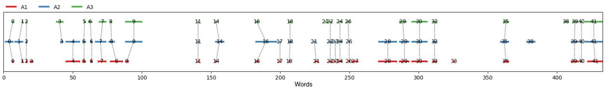

# From Multiple-Choice to Extractive QA: A Case Study for English and Arabic

Teresa Lynn,1 Malik H. Altakrori,2 Samar M. Magdy1 Rocktim Jyoti Das,1 Chenyang Lyu,1 Mohamed Nasr,2 Younes Samih,2 Kirill Chirkunov,1 Alham Fikri Aji,1 Preslav Nakov,1 Shantanu Godbole,2 Salim Roukos,2 Radu Florian,2 Nizar Habash1,3

1Mohamed bin Zayed University of Artificial Intelligence

2IBM Research AI 3New York University Abu Dhabi

teresa.lynn@mbzuai.ac.ae, malik.altakrori@ibm.com, nizar.habash@nyu.edu

## Abstract

The rapid evolution of Natural Language Processing (NLP) has favoured major languages such as English, leaving a significant gap for many others due to limited resources. This is especially evident in the context of data annotation, a task whose importance cannot be underestimated, but which is time-consuming and costly. Thus, any dataset for resource-poor languages is precious, in particular when it is task-specific. Here, we explore the feasibility of repurposing an existing multilingual dataset for a new NLP task: we repurpose a subset of the BELEBELE dataset (Bandarkar et al., 2023), which was designed for multiple-choice question answering (MCQA), to enable the more practical task of extractive QA (EQA) in the style of machine reading comprehension. We present annotation guidelines and a parallel EQA dataset for English and Modern Standard Arabic (MSA). We also present QA evaluation results for several monolingual and cross-lingual QA pairs including English, MSA, and five Arabic dialects. We aim to help others adapt our approach for the remaining 120 BELEBELE language variants, many of which are deemed under-resourced. We also provide a thorough analysis and share insights to deepen understanding of the challenges and opportunities in NLP task reformulation.

## 1 Introduction

Recent years have brought about very fast developments in Natural Language Processing (NLP). However, this progress has not been equal for all languages, and most research has focused on English and a handful of other languages, with the vast majority of other languages being overlooked (Joshi et al., 2020; Rehm and Way, 2023). This is mainly due to the lack of data resources, which hampers the development of NLP tools for these languages. While many resources have been developed for some languages, they are often for very specific tasks, and for very specific formulations of these tasks.

Starting from a motivation of creating crosslingual Question Answering (QA) datasets for an under-resourced pair, Dialectal Arabic (DA) – Modern Standard Arabic (MSA), we explore the possibility of re-purposing the multilingual BELEBELE dataset (Bandarkar et al., 2023), which was created for the task of multiple-choice question answering, to be suitable for extractive question answering in the style of machine reading comprehension.

In the field of Question Answering, there are a number of different ways to answer a question (Wang, 2022), e.g., (a) multiple-choice QA (MCQA) with answer choices, and context provided, (b) extractive QA (EQA) with context provided, (c) abstractive QA with context provided, and (d) open-ended QA with no context provided. An interesting research question is whether we can traverse between them, i.e., if we have a resource for one QA task, can we repurpose it easily for a different reformulation of the task? Here we study this research question, in the context of transferring from MCQA to EQA, as we deem EQA more useful in real-world applications where the correct answer is often not known. Our contributions are:

• We explore the possibility for repurposing a MCQA dataset as an EQA dataset.

• We create and release a new parallel EQA dataset for MSA and English (EN).

• We provide a dialectal Arabic QA benchmark by evaluating our EQA system’s performance on monolingual and cross-lingual QA pairs of {EN, MSA}–{EN, MSA, five DAs}.

• We provide guidelines and a strong foundation for creating EQA datasets for the remaining 120 BELEBELE languages.

• We perform careful analysis and discuss the lessons learned as a guide for future research in repurposing NLP datasets.

## 2 Related Work

## 2.1 Multilingual QA Datasets

Numerous multilingual QA datasets have already been developed e.g., XQUAD (Artetxe et al., 2020), TyDi QA (Clark et al., 2020), and MLQA (Lewis et al., 2020), which focus on extractive-based QA. The recent ArabicaQA dataset (Abdallah et al., 2024) represents a significant leap forward, being the first large-scale dataset specifically designed for Arabic QA: it has over 89k questions, derived from a diverse set of Standard Arabic documents, providing a robust platform for advancing Arabic NLP, particularly in the context of large language models. Additionally, alternative formats of multilingual QA have been explored, including open-ended QA with Mintaka (Sen et al., 2022) and MCQA with BELEBELE (Bandarkar et al., 2023). With the exception of BELEBELE, these datasets encompass a relatively narrow range of languages and do not include Arabic dialects. To address this gap, we propose leveraging the BELEBELE dataset, to enable the inclusion of its dialectal content into a new parallel DA – MSA/EN dataset.

## 2.2 Converting MCQA Datasets

Some attempts have been made to convert existing datasets into a different format. Specifically for QA, there has been conversion of MCQA datasets into natural language inference (NLI) (Demszky et al., 2018; Khot et al., 2018): the premise is taken from the context paragraph, the correct choice is used as an entailment label, and the other choices are used as neutral or contradictory. Both approaches require effort to rephrase the question into a statement, e.g., using rule-based methods (Demszky et al., 2018) or human annotation (Khot et al., 2018). Hadifar et al. (2023) introduced a new dataset specifically designed for the educational setting, focusing on converting between multiplechoice and open-ended question formats. Automatically generating MCQA has also been explored (Mitkov and Ha, 2003; Kurdi et al., 2020; Ai et al., 2015; Karamanis et al., 2006), where the challenge is to generate distractor choices.

To our knowledge, there is no previous work on converting MCQA to EQA datasets. In this paper, we investigate the feasibility of such a task with an eye towards future automation of the process.

## 2.3 A Note on Arabic and its Dialects

The Arabic language is a family of variants, among which Modern Standard Arabic (MSA) is the Arab world’s shared language of culture, media, and education. However, MSA is not the native language of any speaker of Arabic, whose day-to-day language is typically a local variety, i.e., Dialectal Arabic (DA) that can be quite different from MSA and other dialects (Salameh et al., 2018). MSA and DA coexist in what is called a diglossic relationship where different variants are used in different contexts (Ferguson, 1959). In the context of Arabic QA, there are many efforts that focus primarily on MSA (Shaheen and Ezzeldin, 2014; Mozannar et al., 2019; Biltawi et al., 2021; Alwaneen et al., 2022). A recent exception is the work of Faisal et al. (2021), which works on spoken dialectal QA and includes Arabic among other languages.

The common wisdom in Arabic NLP is that systems should be robust to handling DA forms, but should generate output primarily in MSA. This is reasonable for QA in particular, given the relatively larger trusted content in MSA compared to DA which dominates social media. As such, in this paper, we focus on modeling QA that accepts questions in a range of dialects and provides answers in standard languages (MSA and EN). We selected the following five representative dialects from across the Arab world to work with: Egyptian (arz), Iraqi (acm), Moroccan (ary), Gulf (Najdi; ars), and Levantine (North; apc).

## 3 MCQA-to-EQA Conversion Challenges

## 3.1 Belebele Dataset

BELEBELE (Bandarkar et al., 2023) is an opensource multiple-choice machine reading comprehension (MRC) dataset that covers 122 languages and language variants, including English, MSA, and five Arabic dialects. Each question is based on a short passage from the Flores-200 dataset (Team et al., 2022) and has four multiple-choice answers, with the correct answer identified. This benchmark dataset enabled the evaluation of natural language understanding (NLU) across high/medium/lowresource languages and language variants.

With respect to the style of the dataset content, the creators of the BELEBELE dataset indicated that they selected multiple-choice questions (MCQs) because it would lead to thefairest evaluation across languages and MCQs enable the ability to scale to many languages when translating from English.

<table><tr><td rowspan=26 colspan=2>(a)(b)(c)(d)BB(e)BB(f)(g)BB(h)(i)BB(j)(k)(1)</td><td></td><td></td></tr><tr><td rowspan=1 colspan=1>Question / Multiple Choice Answers</td><td rowspan=1 colspan=1>Paragraph / Span</td></tr><tr><td rowspan=2 colspan=1></td><td rowspan=1 colspan=1>Binary digits are also referred to as what?</td><td rowspan=1 colspan=1></td></tr><tr><td rowspan=1 colspan=1>* Bits               * Jargon* Values             * Forms</td><td rowspan=1 colspan=1>[...] A binary number can have only one of two values, i.e. 0 or 1, and these numbers arereferred to as binary digits - or $!bits!$, to use computer jargon.</td></tr><tr><td rowspan=2 colspan=1></td><td rowspan=1 colspan=1>Who discovered nuclear magnetic resonance?</td><td rowspan=1 colspan=1></td></tr><tr><td rowspan=1 colspan=1>* Purcell* Damadian* Bloch and Purcell* Bloch and Damadian</td><td rowspan=1 colspan=1>MRI is based on a physics phenomenon called nuclear magnetic resonance (NMR),which was discovered in the 1930s by $!Felix Bloch (working at Stanford University)and Edward Purcell (from Harvard University)!$. In this resonance, magnetic fieldand radio waves cause atoms to give off tiny radio signals. [...]</td></tr><tr><td rowspan=2 colspan=1></td><td rowspan=1 colspan=1>In response to the protests, which country did not move forward wi</td><td rowspan=1 colspan=1>th their signed ACTA agreement?</td></tr><tr><td rowspan=1 colspan=1>* Germany            * Scotland* Poland             *Lithuania</td><td rowspan=1 colspan=1>[...] Last month, there were major protests in Poland when that country signed ACTA,which has led to the $!Polish government!$ deciding not to ratify the agreement, fornow. Latvia and Slovakia have both delayed the process of joining ACTA.</td></tr><tr><td rowspan=2 colspan=1></td><td rowspan=1 colspan=1>What do performers encourage the audience to do during Camille Sain</td><td rowspan=1 colspan=1>t-Saens&#x27; opera?</td></tr><tr><td rowspan=1 colspan=1>* Partake in the use of cannabis* Take a trip to Japan* Join them onstage for the performance* Allow their lives to be dictated by what they love</td><td rowspan=1 colspan=1>The story presented in the French opera, by Camille Saint-Saens, is of an artist &quot;whoselife is dictated by a love for drugs and Japan.&quot; As a result, the performers $!smokecannabis joints!$ on stage, and the theatre itself is encouraging the audience to join in.</td></tr><tr><td rowspan=2 colspan=1></td><td rowspan=1 colspan=1>What was the Greek poet Homer unable to do?</td><td rowspan=1 colspan=1></td></tr><tr><td rowspan=1 colspan=1>* Hear              * Walk* See               *Talk</td><td rowspan=1 colspan=1>We know many Greek politicians, scientists, and artists. Possibly the most known personof this culture is Homer, the legendary $!blind poet!$, who composed two masterpiecesof Greek literature: the poems Iliad and Odyssey. [...]</td></tr><tr><td rowspan=2 colspan=1></td><td rowspan=1 colspan=1>What information regarding the attack have the authorities confirm</td><td rowspan=1 colspan=1>ed?</td></tr><tr><td rowspan=1 colspan=1>* The identities of any accomplices* The ethnicity of the suspect* The motivation behind the attack* The first and last name of the suspect</td><td rowspan=1 colspan=1>The man allegedly drove a three-wheeled vehicle armed with explosives into a crowd.The man suspected of detonating the bomb was detained, after sustaining injuries fromthe blast. His name is still unknown to authorities, although they do know $!he is amember of the Uighur ethnic group!$.</td></tr><tr><td rowspan=2 colspan=1></td><td rowspan=1 colspan=1>Who provides judicial services for FATA?</td><td rowspan=1 colspan=1></td></tr><tr><td rowspan=1 colspan=1>* The Pakistani government* Political Agents* Pakistan&#x27;s president* The British government</td><td rowspan=1 colspan=1>Since Pakistani independence from British rule in 1947, the Pakistani President hasappointed &quot;Political Agents&quot; to govern FATA, who exercise near-complete autonomouscontrol over the areas. $!These agents!$ are responsible for providing government andjudicial services under Article 247 of the Pakistani Constitution.</td></tr><tr><td rowspan=2 colspan=1></td><td rowspan=1 colspan=1>When did Peter Lenz die ?</td><td rowspan=1 colspan=1></td></tr><tr><td rowspan=1 colspan=1>* During the warm-up lap* After falling off his bike* At the hospital* While with on-track medical staff</td><td rowspan=1 colspan=1>Peter Lenz, a 13-year-old motorcycle racer, has died $!after being involved in acrash!$ at the Indianapolis Motor Speedway. While on his warm-up lap, Lenz fell offhis bike, and was then struck by fellow racer Xavier Zayat. He was immediatelyattended to by the on-track medical staff and transported to a local hospital where helater died. Zayat was unhurt in the accident.</td></tr><tr><td rowspan=2 colspan=1></td><td rowspan=1 colspan=1>At what time in history did Germany exert a strong cultural influen</td><td rowspan=1 colspan=1>ce on Estonia?</td></tr><tr><td rowspan=1 colspan=1>* Around 200 years ago* Around 400 years ago* Around 600 years ago* Around 800 years ago</td><td rowspan=1 colspan=1>$!Around the 15th century!$, northern Estonia was under great cultural influence ofGermany. Some German monks wanted to bring God closer to the native people, so theyinvented the Estonian literal language. It was based on the German alphabet [...] Thiswas the beginning of enlightenment.</td></tr><tr><td rowspan=2 colspan=1></td><td rowspan=1 colspan=1>Where did Cristina Fernandez de Kirchner announce her intention t</td><td rowspan=1 colspan=1>o run?</td></tr><tr><td rowspan=1 colspan=1>* At a theatre 31 miles away from La Plata* At the Buenos Aires theatre in La Plata* At the Argentine Theatre 31 miles away from Buenos Aires* At the La Plata theatre in Buenos Aires</td><td rowspan=1 colspan=1>Current senator and Argentine First Lady Cristina Fernandez de Kirchner announced herpresidential candidacy yesterday evening $!in La Plata$!, a city 50 kilometers (31miles) away from Buenos Aires. Mrs. Kirchner announced her intention to run forpresident at the Argentine Theatre, [...]</td></tr><tr><td rowspan=2 colspan=1></td><td rowspan=1 colspan=1>According to the passage, which statement about the suspect is not</td><td rowspan=1 colspan=1>true?</td></tr><tr><td rowspan=1 colspan=1>* He used a vehicle during the attack* He allegedly detonated an explosive* His ethnicity is known by authorities* He was uninjured</td><td rowspan=1 colspan=1>The man allegedly drove a three-wheeled vehicle armed with explosives into a crowd.The man suspected of detonating the bomb was detained, after sustaining injuries fromthe blast. His name is still unknown to authorities, although they do know he is amember of the Uighur ethnic group.</td></tr><tr><td rowspan=2 colspan=1></td><td rowspan=1 colspan=1>In what country did Ma study law?</td><td rowspan=1 colspan=1></td></tr><tr><td rowspan=1 colspan=1>* United States of America* China* Australia* Hong Kong</td><td rowspan=1 colspan=1>Born in Hong Kong, Ma studied at New York University and Harvard Law School andonce held an American permanent resident &quot;green card&quot;. Hsieh implied during theelection that Ma might flee the country during a time of crisis. Hsieh also argued that thephotogenic Ma was more style than substance. [...]</td></tr></table>

Table 1: English examples demonstrating some interesting types of MCQs in the BELEBELE dataset, and the respective issues they pose for extractive QA in this work. The Arabic version is shown in Appendix C.

They worked with a Language Service Provider to create the questions and the multi-choice answers in an iterative process, by developing guidelines that included rules such as no use ofdouble negatives, only use answers that are decently plausible to require the test-taker to fully read and understand the passage (Bandarkar et al., 2023).

Our effort is part of a larger project on Arabic QA; as such we deemed the BELEBELE dataset to be a suitable starting point for establishing an EQA benchmark for Arabic dialect QA when paired with MSA and English passages. Our five dialects of focus represent the full spectrum of variations across the Arab world: Gulf, Levantine, Iraqi, Egyptian, and Moroccan. We have questions in English, MSA and Arabic dialects, with the answers in MSA and English only.

Broadly defined, our first task in the conversion from MCQA to EQA is to identify the spans in the passages that answer the MCQs.

## 3.2 The MCQ Zoo

When examining the different BELEBELE MCQs and their associated passages, we recognized a considerable number of MCQ types that vary on a continuum from simple word matching to required passage and world understanding. Table 1 presents a set of English examples along this continuum to highlight the challenges that hindered us from employing a fully automated process in identifying text spans in the associated passages. The Arabic version is in Appendix C.

The simplest MCQ types are perhaps Exact Match, Partial Overlap Match and Morphological Match, Table 1.(a, b, c), respectively, where the MCQ answer is “present” in the passage. Relatively more complex are cases that may be resolvable through Paraphrasing, Entailment, or Semantic Similarity, in Table 1.(d, e, f), respectively. Next comes the cases that require higher levels of awareness of context, from that of Coreference in the text all the way to Pragmatic Knowledge, in Table 1.(g-i). Finally we present examples of complex kinds of MCQ, where wording of the question is highly dependent on the provided multi-choice answers. While a span can be identified in principle in Table 1.(j), the question may not stand alone with the passage in Table 1.(k, l).

These challenges made it apparent that (a) not all MCQAs are usable for the EQA task; and (b) that human annotation was a more realistic approach than automating the conversion of the dataset. While the first few MCQ types suggest that an automatic process could be used to identify the QA span, the rest, in increasingly difficulty, show that the MCQ answers are not as helpful. The last two types are not usable in our assessment for this task. We took all of these insights into consideration as we developed the guidelines and annotated the spans, which we discuss next.

## 4 Annotation Process

In this study, annotation refers to marking the appropriate ‘answer span’ in the original passage in response to a question, or labelling a question as unanswerable (‘X’), as shown in Table 1. Our annotations focused on EN and MSA parallel passages from the BELEBELE dataset and we call our annotated set BELEBELE-EQA. Our repurposing approach involved the following steps.

## 4.1 Automatic Filtering

The original BELEBELE dataset contains 900 question-answer pairs. However, as highlighted in Section 3.2, many of these multiple-choice questions did not suit the EQA task. As a first pass, we automatically removed QA pairs that were deemed unsuitable based on the following set of keywords: “Which of the following”, “Select all that apply", “Choose the correct”, “According to the passage”, “Based on the information given”. Given that the dataset is parallel, we carried out this automatic filtering on the English content first and subsequently removed the same QA pairs in the corresponding MSA content. After this first filtering pass, we were left with 415 QA pairs, whose EQA answer spans we annotated manually.

## 4.2 Pilot study

We first carried out a pilot annotation study in order to fully understand the nature of the BELEBELE dataset and develop our annotation guidelines. The pilot annotation study was carried out on the first 100 QAs for both EN and MSA. The annotators were presented with the BELEBELE passage, the original BELEBELE question, the ‘correct answer’ from the multiple-choice answer list1 and a column in which to write the span. Two native Arabic speakers annotated 50 MSA QAs each, and two fluent English speakers each annotated 50 EN QAs. It was during this pilot study that the extent of the challenges highlighted in Section 3 became known.

## 4.3 Annotation Guidelines

Informed by the findings of the initial pilot study, we created two separate versions of the guidelines for English and Arabic, accounting for linguistic differences that influenced the wording of the instructions and the need for language-specific examples. See Appendices D and E for the complete EN and MSA guidelines, respectively.

Also informed by the pilot study, the original multiple choice answer was hidden during the annotation, as it had been deemed to be more distracting than helpful in the pilot round (see discrepancies between MC answers and spans in Table 1).

As part of the annotation task, the annotators would mark the span in a copy of the passage using \$!(text)!\$ as a span delimiter, while keeping the span as short as possible – in the style of

SQUAD (Rajpurkar et al., 2016).

Annotators were also given clear guidance on what to do with articles, prepositions, punctuation, and instances where the answer appeared more than once in the passage (Appendices D and E). Equipped with better awareness of the issues described in Section 3.2, for each QA pair, the annotators could either: (i) annotate the span and if necessary, label the QA as ‘BB’ to indicate it as being complex and problematic, as per Table 1.(d,e,g,i) or (ii) label the QA as ‘X’ to be removed, due to the answer being impossible to find, as per Table 1.(k,l). Finally, annotators were advised that it was more important to find a relevant span (in which evidence of the answer could be found) than finding an exact span that may not exist. This guidance was a significant help given the many differences between the nature of MCQA and EQA.

## 4.4 English Data Annotation

We took a bootstrapping approach to annotation across the two languages. Given the parallel nature of the dataset, the EN annotation was carried out first, followed by a semi-automatic approach to annotating the MSA data (Section 4.5). The annotations were done on the remaining 415 QA pairs in the BELEBELE dataset (including a review and correction of the first 100 from the pilot round). Eleven annotators, both fluent and native English speakers, annotated the QA pairs, with the annotations subsequently reviewed by independent reviewers.

The distribution of the QA pairs was as follows: 50 QA pairs were used in our IAA study (see Section 4.6) and were annotated by three annotators. The remaining 365 pairs were distributed amongst the other eight annotators, where six annotators had 50 pairs each, and the remaining two annotators had 42 and 23, respectively. The annotators were given the English BELEBELE passage, the original question and a copy of the passage to mark the answer span. They could also add comments for problematic instances that required broader discussion or verification.

As a result of the annotation process, 86 out of the 415 QA pairs were labelled as ‘X’ and excluded. Out of the remaining 329 pairs, 44 were labelled as ‘BB’. These BB QAs remain part of the final dataset, as we are also interested in establishing what difficulties they pose for a QA system, given the need for reasoning and resolving linguistic phenomena like paraphrasing, pragmatics and coreference resolution.

## 4.5 Arabic Data Annotation

For the MSA data, we exploited the parallel nature of the dataset to project pre-annotations from the EN passages to the MSA passages as part of a bootstrapping approach. The goal was to maximize the alignment between the EN and the MSA spans that provide answers to the questions. Our semiautomated approach followed the following steps:

1. Marking as ‘X’ the MSA questions labelled ‘X’ in English to avoid re-annotation. In our experience, this approach proved consistent for both English and MSA.

2. Translation of the EN span to MSA using Helsinki MT tool (Tiedemann and Thottingal, 2020)

3. Using a sliding-window approach to identify the MSA span with the same length and highest n-gram overlap with the EN span.

4. Marking an approximate location of the EN span in the MSA passage

5. If no equivalent translation was found, an approximate MSA location based on the EN span’s word offset was used.2

6. Native Arabic speakers reviewed the preannotated spans according to the MSA-based annotation guidelines and made corrections where necessary.

The 415 QA pairs were divided amongst four native Arabic speaking annotators, with the annotations subsequently reviewed by independent reviewers. The annotators were presented with the MSA BELEBELE passage, the original MSA BELE-BELE question and a copy of the passage where the span was pre-annotated. During the review process, the annotators could either: leave the span unchanged or modify the span markers, and label as ‘BB’ where necessary, or label the QA as ‘X’ to be removed.

The MSA guidelines are generally similar to the EN guidelines except for containing Arabic examples instead of English. The MSA guidelines match EN in using white-space boundaries as the primary word delimiter. This unavoidably leads to a difference in span scope from EN since Arabic is a morphologically rich language with numerous clitics. As a result some proclitic prepositions, conjunctions, and the definite article, as well as pronominal enclitics are kept inside the spans.

## 4.6 Inter-Annotator Agreement

We carried out an inter-annotation (IAA) study in order to assess the level of agreement across annotators, and get an indication of how reliable the guidelines were.3 For the IAA study, we selected 50 English QA pairs for annotation by three separate annotators. The three annotations for each QA pair were then compared. Instead of calculating an F-score measure, which would give indication of quality of annotations, we utilize the γ measure for Inter-Annotator Agreement and Alignment (Mathet et al., 2015).4 This measure involves identifying the optimal alignment among annotations provided by multiple annotators, aiming to align annotations with high similarity and compute the average dissimilarity between them. Specifically, the average dissimilarity is calculated by averaging dissimilari ties among aligned annotations, considering both their categories and positions. The alignment with the minimum mean dissimilarity, selected from all potential alignments initially evaluated during computation, is employed. The final inter-annotator agreement (γ measure) was computed on the three sets of 50 QA pairs yielding a high γ value of 0.81, indicating that the designed annotation guidelines are reliable. Given that the MSA annotation guidelines were based on the EN guidelines, we posit that their quality was just as high. The three sets of 50 EN IAA QAs were merged and reviewed to produce a final version for inclusion in our parallel dataset. See Appendix A for more details and visualization of the span combination process.

## 5 Experiments and Results

## 5.1 Experimental Setup

Datasets We use two datasets in our experiments: the commonly used state-of-the art QA dataset, SQuAD (Rajpurkar et al., 2016) and our BELEBELE-EQA, both of which are Wikipediabased. For SQuAD, we only used the validation portion of the dataset which contains 10,657 English EQA pairs. For BELEBELE-EQA, we have two versions: (i) BELEBELE-EQA-All contains 329 QA pairs for EN, MSA and five dialects, and (ii) BELEBELE-EQA-Sub excludes 44 BBannotated questions, leaving 285 QA pairs.

QA Evaluation Tool To run the QA task on the above datasets, we used PrimeQA (Sil et al., 2023), an open-source5 tool that is built on top of the HuggingFace (Wolf et al., 2020) library to support research on running different QA tasks. We used two existing models, namely PrimeQA/NQ+TyDi6 and PrimeQA/NQ+TyDi+SQuAD,7 which are 550m parameters $\mathbf { X L M - R } _ { L a r g e }$ (Conneau et al., 2020) based models that were finetuned for the multilingual TyDi QA task (Clark et al., 2020). Both models were finetuned on the Natural Questions dataset (Kwiatkowski et al., 2019) and TyDi (Clark et al., 2020). The latter, however, was further finetuned on the training portion of the SQuAD dataset.

Evaluation Metrics We report the results using the commonly used F1-score and Exact Match (EM) score. F1-score is the harmonic mean of Precision and the Recall on word-level uni-grams. The default F1 and EM scores as implemented in PrimeQA toolkit preprocess references and predictions by dropping punctuation, extra white space, and for EN, lower casing and removing the articles a/an/the. We also introduce two normalized variants, F1n and EMn, where we normalize references and predictions by removing the respective language stopwords as defined in NLTK (Bird and Loper, 2004).

## 5.2 Results and Analysis

In this section, we present the evaluation results for the BELEBELE-EQA and SQuAD datasets.

SQuAD vs. BELEBELE-EQA We evaluate the SQuAD dataset as well as the EN-EN QA pairs from the BELEBELE-EQA dataset using the PrimeQA toolkit (See Appendix B for details) This experiment allows us to (a) verify that the chosen pretrained models are capable of solving the QA task at-hand without further finetuning, and (b) establish a sense of difficulty for the BELEBELE-EQA datasets compared to the commonly used SQuAD. We observe the following based on the results in Table 2: First, on SQuAD, the F1 shows a negligible difference between the two pretrained models, while EM is surprisingly lower by 3.4% for the model that was finetuned on the SQuAD dataset.8

<table><tr><td>Dataset</td><td>Questions</td><td>F1</td><td>EM</td></tr><tr><td colspan="4">PrimeQA/NQ+TyDi</td></tr><tr><td>SQuAD</td><td>10,570</td><td>90.5</td><td>82.5</td></tr><tr><td>BELEBELE-EQA-All BELEBELE-EQA-Sub</td><td>329 285</td><td>68.1 71.3</td><td>46.5 50.5</td></tr><tr><td colspan="4">PrimeQA/NQ+TyDi+SQuAD</td></tr><tr><td>SQuAD</td><td>10,570</td><td>90.6</td><td>79.1</td></tr><tr><td>BELEBELE-EQA-All</td><td>329</td><td>71.0</td><td>50.5</td></tr><tr><td>BELEBELE-EQA-Sub</td><td>285</td><td>76.6</td><td>56.1</td></tr></table>

Table 2: Evaluating the SQuAD and BELEBELE-EQA datasets using the PrimeQA dataset. (EM: Exact Match. Scores are percentages. Higher is better.)

In contrast, the results on BELEBELE-EQA-All show that additional finetuning on SQuAD yielded better performance both in F1 and EM.

Second, the best BELEBELE-EQA (All and Sub) F1 scores (71.0 and 76.6) are 18.6 and 14 points less than SQuAD’s F1 score, respectively. Similarly, the best respective EM scores are 50.5 and 56.1, or 28.6 and 23 points less than that of the SQuAD dataset. Finally, and as expected, removing the BELEBELE-EQA hard questions (BELEBELE-EQA-Sub) resulted in better performance on both F1 and EM measures.

BELEBELE-EQA Results Based on the baseline results presented above, we report in Table 3 on the different question language setups using the best identified model: PrimeQA/NQ+TyDi+SQuAD. For specific experiments, we refer to the pair of languages in passage-question, e.g., EN-EN, or MSA-Iraqi.

Monolingual Experiments (EN-EN, MSA-MSA) The basic standard monolingual setups have the highest performing F-1 scores, with EN being higher than MSA by 9% absolute. Despite being a multilingual model, this performance difference is not unexpected given the relative resource richness of EN compared with MSA.

Cross-Lingual Experiments (MSA-EN, EN-MSA) The basic cross-lingual setups are next in rank of performance with MSA-EN F1 being only slightly better than EN-MSA (0.5% absolute). The performance drop due to question language is much higher for EN passages (11.1% absolute) compared to MSA passages (1.6% absolute). This suggests that the model struggles in cross-lingual settings in ways independent of its monolingual performance.

Dialectal Experiments (MSA-DA, EN-DA) The DA questions consistently lead to lower performance compare to the above-mentioned settings, and with performance with MSA passages being better on average than on EN passages (by 6.3% absolute). The specific dialects seem to follow a common order of Gulf>(Egyptian|Levantine)>Iraqi>Moroccan, which we speculate may reflect the order of their question sets’ similarity to MSA. Automatically translating dialectal questions into the target passage language using Google Translate9 results in notable improvements: an average increase of 18% for English passages and 4.4% for MSA passages (All setting). Moroccan saw the greatest benefit from this translation method, with F1 increases of 26.7% for EN and 11.4% for MSA.

BELEBELE-EQA All vs Sub Across all experiments, the easier subset (Sub) has higher scores than (All): on average, 2.6% absolute F1 increase for EN passages, and 1.5% for MSA passages. The highest difference is for EN-EN (5.4% absolute F1) and the lowest for MSA-Gulf (0.6%).

Normalized F1 and EM The normalization results are generally consistent in rank order; but the effect of normalization in EN is much higher than MSA: F1 (2.3% vs 1.7%) and EM (5.8% 4.3%). We note that the normalization process reduces the length of references and predictions by 30% for EN, but only 10% for MSA.

## 6 Discussion

Our motivation for this study was to create a practical and reliable multilingual EQA benchmark dataset, without the need to start from scratch or resort to creating synthetic data. Given our languages of interest, repurposing the BELEBELE MCQA dataset seemed like a feasible solution. However, answering the research question on how feasible this approach is involves considering the various insights and findings presented in this paper.

We found that while repurposing is possible, our exploratory study showed that it required significant manual effort. Contrary to initial assumptions, we discovered that the original answers from the multiple-choice question pairs were not suitable for automated approaches. In fact, the only multiplechoice types in Table 1 that resemble non-complex SQUAD-style QA pairs are (a) Exact.

<table><tr><td rowspan="2">Passage</td><td rowspan="2">Question</td><td colspan="4">All</td><td colspan="4">Sub</td></tr><tr><td>F1</td><td>EM</td><td>F1ⁿ</td><td>EMⁿ</td><td>F1</td><td>EM</td><td>F1ⁿ</td><td>EMⁿ</td></tr><tr><td rowspan="10">EN</td><td>EN MSA</td><td>71.0 59.9 44.5</td><td>50.5 39.8</td><td>74.0 62.7</td><td>60.2 47.7</td><td>76.6 62.9</td><td>56.1 43.5</td><td>79.5 65.6</td><td>65.6 51.2</td></tr><tr><td>DA-Iraqi</td><td></td><td>27.7</td><td>46.2</td><td>31.3</td><td>46.0</td><td>29.5</td><td>47.8</td><td>33.0</td></tr><tr><td>DA-Levantine DA-Gulf</td><td>49.5 50.4</td><td>31.9</td><td>51.2</td><td>36.5</td><td>51.9</td><td>35.1</td><td>53.7</td><td>39.6</td></tr><tr><td>DA-Morrocan</td><td>36.3</td><td>31.3 18.5</td><td>52.6 38.5</td><td>37.4 21.0</td><td>52.1 37.0</td><td>33.0 20.0</td><td>54.2 39.3</td><td>38.9</td></tr><tr><td>DA-Egyptian</td><td>48.8</td><td>30.1</td><td>51.5</td><td>36.2</td><td>51.3</td><td>33.3</td><td>54.0</td><td>22.1</td></tr><tr><td>DA-Average</td><td>45.9</td><td>27.9</td><td>48.0</td><td>32.5</td><td>47.7</td><td>30.2</td><td>49.8</td><td>39.3</td></tr><tr><td>DA-Iraqi (TEN)</td><td>59.8</td><td>39.2</td><td>62.7</td><td>46.8</td><td>64.2</td><td>42.8</td><td></td><td>34.6</td></tr><tr><td>DA-Levantine (TEN)</td><td>65.4</td><td>46.2</td><td>68.2</td><td>53.5</td><td>69.7</td><td>50.2</td><td>67.2 72.3</td><td>50.9</td></tr><tr><td>DA-Gulf (TEN)</td><td>65.4</td><td>43.8</td><td>68.2</td><td>52.9</td><td>69.5</td><td>48.1</td><td>72.2</td><td>57.9 57.2</td></tr><tr><td>DA-Morrocan (TEN)</td><td>63.0</td><td>41.0</td><td>65.7</td><td>49.5</td><td>67.0</td><td>44.9</td><td>69.6</td><td>53.0</td></tr><tr><td>DA-Egyptian (TEN)</td><td>65.7</td><td>45.0</td><td>68.7</td><td>53.8</td><td>70.0</td><td>49.5</td><td>72.9</td><td>58.2</td></tr><tr><td> $D A \mathrm { - } A \nu e r a g e \left( \mathrm { T } _ { E N } \right)$ </td><td>63.9</td><td>43.0</td><td>66.7</td><td>51.3</td><td>68.1</td><td>47.1</td><td>70.8</td><td>55.4</td></tr><tr><td>EN</td><td>60.4</td><td>41.6</td><td>62.3</td><td>46.8</td><td>64.5</td><td>46.0</td><td></td><td></td></tr><tr><td>MSA</td><td>62.0</td><td>40.7</td><td>64.3</td><td>46.2</td><td>65.6</td><td>44.2</td><td>66.7 68.1</td><td>50.9 49.5</td></tr><tr><td rowspan="11">MSA</td><td>DA-Iraqi</td><td>50.3</td><td>32.2</td><td>51.2</td><td>35.0</td><td>54.2</td><td>36.1</td><td>55.6</td><td></td><td>39.3</td></tr><tr><td>DA-Levantine</td><td>54.2</td><td>35.3</td><td>55.7</td><td>38.6</td><td>58.5</td><td></td><td>39.3</td><td>60.4</td><td>43.2</td></tr><tr><td>DA-Gulf</td><td>56.6</td><td>36.2</td><td>58.4</td><td></td><td></td><td></td><td></td><td></td><td></td></tr><tr><td>DA-Morrocan</td><td>45.1</td><td></td><td></td><td>40.7</td><td>59.3</td><td></td><td>39.6</td><td>61.3</td><td>44.2</td></tr><tr><td></td><td>54.5</td><td>26.7</td><td>46.6</td><td>30.1</td><td>48.1</td><td></td><td>29.8</td><td>49.6</td><td>33.3</td></tr><tr><td>DA-Egyptian</td><td>52.1</td><td>34.0</td><td>56.6</td><td>39.2</td><td>57.3</td><td></td><td>37.5</td><td>59.5</td><td>42.5</td></tr><tr><td>DA-Average</td><td></td><td>32.9</td><td>53.7</td><td>36.7</td><td></td><td>55.5</td><td>36.5</td><td>57.3</td><td>40.5</td></tr><tr><td>DA-Iraqi  $\overline { { ( \mathrm { T } _ { M S A } ) } }$ </td><td>51.5</td><td>31.3</td><td>53.1</td><td></td><td>35.3</td><td>53.9</td><td>34.0</td><td>55.7</td><td>37.9</td></tr><tr><td> $\mathrm { D A - L e v a n t i n e } \left( \mathrm { T } _ { M S A } \right)$ </td><td>58.5</td><td>38.3</td><td>60.3</td><td></td><td>43.2</td><td>62.1</td><td>42.1</td><td>64.1</td><td>46.7</td></tr><tr><td>DA-Gulf  $\left( \mathrm { T } _ { M S A } \right)$ </td><td>57.9</td><td>38.0</td><td>59.9</td><td></td><td>42.9</td><td>61.0</td><td>40.7</td><td>63.3</td><td>46.0</td></tr><tr><td> $\mathbf { D A - M o r r o c a n } \left( \mathbf { T } _ { M S A } \right)$ </td><td>56.5</td><td>36.2</td><td>58.6</td><td></td><td>42.6</td><td>59.4</td><td>39.3</td><td>61.5</td><td>45.3</td></tr><tr><td></td><td>58.5</td><td>37.7</td><td>60.4</td><td></td><td>42.2</td><td>62.1</td><td>41.1</td><td>64.2</td><td>46.0</td></tr><tr><td></td><td> $\mathrm { D A - E g y p t i a n } \left( \mathrm { T } _ { M S A } \right)$   $D A \mathrm { - } A \nu e r a g e \left( \mathrm { T } _ { M S A } \right)$ </td><td>56.6</td><td>36.3</td><td>58.5</td><td>41.2</td><td>59.7</td><td>39.4</td><td>61.8</td><td>44.4</td></tr></table>

Table 3: Monolingual and Cross-lingual evaluation of the BELEBELE-EQA dataset using the PrimeQA toolkit with PrimeQA/NQ+TyDi+SQuAD. (EM: Exact Match; F1n and EMn are the text-normalized versions of F1 and EM, respectively; DA: Dialectal Arabic; $\mathrm { T } _ { E N / M S A } .$ Question translated to EN/MSA; Scores are %s; Higher is better.)

Rather than offering a scalable solution here, instead our manual efforts and the subsequent insights serve to make this repurposing task much more feasible and potentially automated by other dataset developers. We can see that the repurposing process is much more feasible when the differences between the QA styles are fully understood. We found that, through an effective filtering process, we could easily eliminate many QA pairs that did not lend themselves easily to EQA. While this resulted in reducing the dataset size by more than half, this leaves open new avenues for examining how those ‘unsuitable’ QA pairs could be reformulated to be useful in EQA. Repurposing a multilingual dataset like BELEBELE means that its parallelism could be exploited through a bootstrapping approach. We have learned that once one language dataset is manually annotated and verified, the spans could be relatively easily projected to a new language from the wider dataset provided a translation system is available (see Section 4.5). Likewise, few changes were required when adapting our annotation guidelines from EN to MSA, suggesting that this adaptability may hold for other languages. Finally, our experimental results confirm that our approach produced a useful data set that can be used for benchmarking cross-lingual EQA for all BELEBELE languages.

## 7 Conclusion and Future Work

We repurposed the MCQA BELEBELE dataset to create a new EQA dataset for English and MSA, with cross-lingual benchmark results for dialectal Arabic QA.10 We also provided guidelines for practitioners exploring QA in other BELEBELE languages. Our work, including negative insights, aims to enhance understanding of the challenges and opportunities in reformulating NLP tasks.

For future work, we plan to support repurposing BELEBELE-EQA for other languages, potentially automating the process. The dataset offers a resource for evaluating such methods. We also aim to use it for fine-tuning general-purpose Arabic QA models and improving EQA evaluation metrics, focusing on span length.

## Limitations

We would like to point to some limitations of our study. First, while we are addressing a general problem, in our study, out of all the other BELE-BELE under-resourced languages, we only focused on cross-lingual evaluation of five Arabic dialects. While we believe that our findings are more generally applicable, we would like to note that each language and dataset may present unique challenges and opportunities. Second, our repurposing was based on a single dataset, BELEBELE, and for a single task (extractive question answering in the style of machine reading comprehension), and we note that other tasks may require some specific considerations.

## Ethics and Broader Impact

Data Bias. It is important to acknowledge the possibility of biases within our dataset due to subjective human judgments, or due to the influence of the original task’s data (e.g. a narrow cultural representation across the questions).

Broader Impact and Potential Use. Our repurposing insights presented here can help speed up the creation of resources and tools for resourcepoor languages and dialects. We do not see any immediate threats from its use.

## References

Abdelrahman Abdallah, Mahmoud Kasem, Mahmoud Abdalla, Mohamed Mahmoud, Mohamed Elkasaby, Yasser Elbendary, and Adam Jatowt. 2024. Arabicaqa: A comprehensive dataset for Arabic question answering. Preprint, arXiv:2403.17848.

Renlong Ai, Sebastian Krause, Walter Kasper, Feiyu Xu, and Hans Uszkoreit. 2015. Semi-automatic generation of multiple-choice tests from mentions of semantic relations. In Proceedings of the 2nd Workshop on Natural Language Processing Techniques for Educational Applications, pages 26–33, Beijing, China. Association for Computational Linguistics.

Tahani H Alwaneen, Aqil M Azmi, Hatim A Aboalsamh, Erik Cambria, and Amir Hussain. 2022. Arabic question answering system: a survey. Artificial Intelligence Review, 55(1):207–253.

Mikel Artetxe, Sebastian Ruder, and Dani Yogatama. 2020. On the cross-lingual transferability of monolingual representations. In Proceedings of the 58th Annual Meeting of the Association for Computational Linguistics, pages 4623–4637, Online. Association for Computational Linguistics.

Lucas Bandarkar, Davis Liang, Benjamin Muller, Mikel Artetxe, Satya Narayan Shukla, Donald Husa, Naman Goyal, Abhinandan Krishnan, Luke Zettlemoyer, and Madian Khabsa. 2023. The Belebele benchmark: a parallel reading comprehension dataset in 122 language variants. arXiv e-prints, pages arXiv–2308.

Mariam M Biltawi, Sara Tedmori, and Arafat Awajan. 2021. Arabic question answering systems: gap analysis. IEEE Access, 9:63876–63904.

Steven Bird and Edward Loper. 2004. NLTK: The natural language toolkit. In Proceedings of the ACL Interactive Poster and Demonstration Sessions, pages 214–217, Barcelona, Spain. Association for Computational Linguistics.

Jonathan H. Clark, Eunsol Choi, Michael Collins, Dan Garrette, Tom Kwiatkowski, Vitaly Nikolaev, and Jennimaria Palomaki. 2020. TyDi QA: A benchmark for information-seeking question answering in typologically diverse languages. Transactions ofthe Associationfor Computational Linguistics, 8:454–470.

Alexis Conneau, Kartikay Khandelwal, Naman Goyal, Vishrav Chaudhary, Guillaume Wenzek, Francisco Guzmán, Edouard Grave, Myle Ott, Luke Zettlemoyer, and Veselin Stoyanov. 2020. Unsupervised cross-lingual representation learning at scale. In Proceedings of the 58th Annual Meeting of the Association for Computational Linguistics, pages 8440– 8451, Online. Association for Computational Linguistics.

Dorottya Demszky, Kelvin Guu, and Percy Liang. 2018. Transforming question answering datasets into natural language inference datasets. arXiv preprint arXiv:1809.02922.

Fahim Faisal, Sharlina Keshava, Md Mahfuz Ibn Alam, and Antonios Anastasopoulos. 2021. Sd-qa: Spoken dialectal question answering for the real world. In Findings of the Association for Computational Linguistics: EMNLP 2021, pages 3296–3315.

Charles A Ferguson. 1959. Diglossia. WORD, 15(2):325–340.

Amir Hadifar, Semere Kiros Bitew, Johannes Deleu, Chris Develder, and Thomas Demeester. 2023. Eduqg: A multi-format multiple-choice dataset for the educational domain. IEEE Access, 11:20885– 20896.

Pratik Joshi, Sebastin Santy, Amar Budhiraja, Kalika Bali, and Monojit Choudhury. 2020. The state and fate of linguistic diversity and inclusion in the NLP world. In Proceedings of the 58th Annual Meeting of the Associationfor Computational Linguistics, pages 6282–6293, Online. Association for Computational Linguistics.

Nikiforos Karamanis, Le An Ha, and Ruslan Mitkov. 2006. Generating multiple-choice test items from medical text: A pilot study. In Proceedings of the Fourth International Natural Language Generation

Conference, pages 111–113, Sydney, Australia. Association for Computational Linguistics.

Tushar Khot, Ashish Sabharwal, and Peter Clark. 2018. Scitail: A textual entailment dataset from science question answering. In Proceedings of the AAAI Conference on Artificial Intelligence, New Orleans, Louisiana.

Ghader Kurdi, Jared Leo, Bijan Parsia, Uli Sattler, and Salam Al-Emari. 2020. A systematic review of automatic question generation for educational purposes. International Journal ofArtificial Intelligence in Education, 30:121–204.

Tom Kwiatkowski, Jennimaria Palomaki, Olivia Redfield, Michael Collins, Ankur Parikh, Chris Alberti, Danielle Epstein, Illia Polosukhin, Matthew Kelcey, Jacob Devlin, Kenton Lee, Kristina N. Toutanova, Llion Jones, Ming-Wei Chang, Andrew Dai, Jakob Uszkoreit, Quoc Le, and Slav Petrov. 2019. Natural questions: a benchmark for question answering research. Transactions ofthe Association ofComputational Linguistics.

Patrick Lewis, Barlas Oguz, Ruty Rinott, Sebastian Riedel, and Holger Schwenk. 2020. MLQA: Evaluating cross-lingual extractive question answering. In Proceedings of the 58th Annual Meeting of the Association for Computational Linguistics, pages 7315– 7330, Online. Association for Computational Linguistics.

Yann Mathet, Antoine Widlöcher, and Jean-Philippe Mé- tivier. 2015. The unified and holistic method gamma (γ) for inter-annotator agreement measure and alignment. Computational Linguistics, 41(3):437–479.

Ruslan Mitkov and Le An Ha. 2003. Computer-aided generation of multiple-choice tests. In Proceedings of the HLT-NAACL 03 Workshop on Building Educational Applications Using Natural Language Processing, pages 17–22.

Hussein Mozannar, Elie Maamary, Karl El Hajal, and Hazem Hajj. 2019. Neural Arabic question answering. In Proceedings of the Fourth Arabic Natural Language Processing Workshop, pages 108–118, Florence, Italy. Association for Computational Linguistics.

Pranav Rajpurkar, Jian Zhang, Konstantin Lopyrev, and Percy Liang. 2016. SQuAD: 100,000+ questions for machine comprehension of text. In Proceedings of the 2016 Conference on Empirical Methods in Natural Language Processing, pages 2383–2392, Austin, Texas. Association for Computational Linguistics.

Georg Rehm and Andy Way. 2023. European Language Equality: Introduction, pages 1–10. Springer International Publishing, Cham.

Mohammad Salameh, Houda Bouamor, and Nizar Habash. 2018. Fine-grained Arabic dialect identification. In Proceedings ofthe 27th International Conference on Computational Linguistics, pages 1332–

1344, Santa Fe, New Mexico, USA. Association for Computational Linguistics.

Priyanka Sen, Alham Fikri Aji, and Amir Saffari. 2022. Mintaka: A complex, natural, and multilingual dataset for end-to-end question answering. In Proceedings of the 29th International Conference on Computational Linguistics, pages 1604–1619, Gyeongju, Republic of Korea. International Committee on Computational Linguistics.

Mohamed Shaheen and Ahmed Magdy Ezzeldin. 2014. Arabic question answering: systems, resources, tools, and future trends. Arabian Journalfor Science and Engineering, 39:4541–4564.

Avirup Sil, Jaydeep Sen, Bhavani Iyer, Martin Franz, Kshitij Fadnis, Mihaela Bornea, Sara Rosenthal, J Scott McCarley, Rong Zhang, Vishwajeet Kumar, et al. 2023. PrimeQA: The prime repository for stateof-the-art multilingual question answering research and development. In Proceedings ofthe 61st Annual Meeting of the Association for Computational Linguistics (Volume 3: System Demonstrations), pages 51–62, Toronto, Canada. Association for Computational Linguistics.

NLLB Team, Marta R. Costa-jussà, James Cross, Onur Çelebi, Maha Elbayad, Kenneth Heafield, Kevin Heffernan, Elahe Kalbassi, Janice Lam, Daniel Licht, Jean Maillard, Anna Sun, Skyler Wang, Guillaume Wenzek, Al Youngblood, Bapi Akula, Loic Barrault, Gabriel Mejia Gonzalez, Prangthip Hansanti, John Hoffman, Semarley Jarrett, Kaushik Ram Sadagopan, Dirk Rowe, Shannon Spruit, Chau Tran, Pierre Andrews, Necip Fazil Ayan, Shruti Bhosale, Sergey Edunov, Angela Fan, Cynthia Gao, Vedanuj Goswami, Francisco Guzmán, Philipp Koehn, Alexandre Mourachko, Christophe Ropers, Safiyyah Saleem, Holger Schwenk, and Jeff Wang. 2022. No language left behind: Scaling human-centered machine translation. Preprint, arXiv:2207.04672.

Jörg Tiedemann and Santhosh Thottingal. 2020. OPUS-MT – building open translation services for the world. In Proceedings of the 22nd Annual Conference of the European Associationfor Machine Translation, pages 479–480, Lisboa, Portugal. European Association for Machine Translation.

Zhen Wang. 2022. Modern question answering datasets and benchmarks: A survey. arXiv e-prints.

Thomas Wolf, Lysandre Debut, Victor Sanh, Julien Chaumond, Clement Delangue, Anthony Moi, Pierric Cistac, Tim Rault, Remi Louf, Morgan Funtowicz, Joe Davison, Sam Shleifer, Patrick von Platen, Clara Ma, Yacine Jernite, Julien Plu, Canwen Xu, Teven Le Scao, Sylvain Gugger, Mariama Drame, Quentin Lhoest, and Alexander Rush. 2020. Transformers: State-of-the-art natural language processing. In Proceedings ofthe 2020 Conference on Empirical Methods in Natural Language Processing: System Demonstrations, pages 38–45, Online. Association for Computational Linguistics.

## A Processing IAA Spans for Visualization

In Figure 1, we visualize the degree of agreement among the annotators on the 42 QA pairs that remained from the IAA study (See Section 4.6). We combine the annotation spans into one artificial document in order to visualize the results in a meaningful way where this process is explained later in this section.

In this figure, the x-axis represents the artificial document that is 450 words long. The vertical, colored lines represents a span in that document. The three different colors represent the three annotators and the number on the span is the question number. 42 out of the 50 QA pairs remained as eight questions were labelled as $\mathbf { \epsilon } ^ { \prime } \mathbf { X } '$ by all three annotators and were excluded. As annotators were allowed to label a questions as $\mathbf { \hat { x } } ^ { \prime }$ , some questions have less than three annotations, e.g. Question 38.

  
Figure 1: Visualization of the IAA agreement for 42 questions. The colored lines indicate a span. Each color represents an annotator. The number on the colored line is a question ID.

## A.1 Combining the Spans Into One Artificial Document.

While we could visualize the agreement between annotators for each QA pairs separately, this would have resulted in 42 different figures, one for each QA pair. Instead, we decided to combine the annotated spans from each annotator to create one large artificial document where the annotated spans would appear in different locations. One simple approach to this is combining the whole passages which will offset the location of the annotated span by the length of all the passages that came before it. This, however, will result in a huge document that is too long to have a meaningful visualization.

## A.2 Compressing the Artificial Document.

To overcome this issue, we compressed the document by removing the large un-annotated text spans. Note that the annotation are technically a start and end positions in a document and our task is basically to measure (and visualize) the chosen start and end position of each QA pair across the three annotators. This means that the QA pairs are independent, and ordering them in the document or shifting their locations –as long as they do not overlap and they maintain their original length– should not affect them.

To illustrate, assume that annotator $( a _ { 1 } )$ for passage $( p _ { 1 } )$ chose the span (3, 7) indicating that the answer is from word $( w _ { 3 } )$ to $( w _ { 7 } )$ while annotator $\left( a _ { 2 } \right)$ chose the span (4, 10). We can see that $( a _ { 1 } )$ and $\left( a _ { 2 } \right)$ disagree in the regions: $( w _ { 4 } )$ and from $( w _ { 8 } )$ to $( w _ { 1 } 0 )$ . If we add passage $\left( p _ { 0 } \right)$ which contains 20 words before $( p _ { 1 } )$ to make one document resulting in shifting all the words in $( p _ { 1 } )$ , as well as in the spans $( a _ { 1 } )$ and (a2) by 20 words, we see that the disagreement remains the same. After the shift, $( a _ { 1 } )$ and (a2) change from (3, 7) and (4, 10) to (23, 27) and (24, 30), respectively. As can be noticed, the disagreement between $( a _ { 1 } )$ and $\left( a _ { 2 } \right)$ remained in two regions with the same length for each region, that is $( w _ { 2 } 4 )$ and $\left( w _ { 2 } 8 \right)$ to $\left( w _ { 3 } 0 \right)$

## B PrimeQA Experimental Details

The experiments discusses in Section 5.2 were conducted on an Apple M1 Max MacBook Pro with 32GBs of memory. Since we used the aforementioned models in inference mode, each experiment with 329 questions (E.g. the combination of En Passage and En Questions) took approximately 30 seconds to complete. Note that additional time may be required to download each model for the first time. The 56 core experiments (without translation) in Table 3 (2 Passages x 7 question types x 2 configurations x 2 normalization schemes) are expected to require 28 minutes of running.

<table><tr><td>Paragraph / Span</td><td>Question / Multiple Choice Answers (a)</td><td></td></tr><tr><td></td><td>* *</td><td>Exact * *</td></tr><tr><td> $\ln ( a ^ { 2 } ) ^ { 2 } + ( N + 1 1 8 1 4 ) \exp ( a ^ { 2 } ) ^ { 2 } + ( 3 a ^ { 2 } ) ^ { 2 } ( 3 a ^ { 2 } ) ^ { 2 } ) ( a ^ { 2 } ) ^ { 1 1 } + ( a ^ { 2 } + 2 a ^ { 2 } ) ^ { 2 } + ( 3 a ^ { 2 } ) ^ { 2 } ( 2 a ^ { 2 } + ( 3 a ^ { 2 } ) ^ { 2 } ( 3 a ^ { 2 } ) ^ { 2 } ) ( a ^ { 2 } ) ^ { 1 2 } - 2 a ^ { 2 } = 0 .$  </td><td> $p _ { ( s , s , s ) } = \frac { p _ { ( s , s , s ) } } { s } ( \dot { s } \dot { s } \Delta s ) = p _ { ( s , s ) } \Delta s \Delta s \Delta s$ </td><td> $\Delta \mu \mu _ { \uparrow } \mu _ { \uparrow } *$  Overlap </td></tr><tr><td> $a _ { 2 } a _ { 1 } ^ { 2 } < 1 / \sum _ { \lambda = 0 } ^ { \infty } ( \sum _ { i = 0 } ^ { \infty } \sum _ { j = 1 } ^ { \infty } | \widetilde { a } _ { i , j , \lambda } | ) | \leq | a _ { 2 , j , \lambda } | | \widetilde { a } _ { i , j , \lambda + 1 , \lambda , \lambda , \lambda , \lambda , \lambda , \lambda , \lambda } ^ { 2 } | \leq \operatorname { T r } ( a _ { 2 , j , \lambda } ) | \widetilde { a } _ { i , j , \lambda } | \widetilde { a } _ { i , j , \lambda } | | \overset { 2 } { \operatorname { l i m } } _ { \infty } < \widetilde { a } _ { i , j , \lambda , \lambda , \lambda , \lambda , \lambda , \lambda , \lambda , \lambda } ^ { 2 } |$  [...].</td><td>* </td><td>Lii *</td></tr><tr><td></td><td>* * </td><td>Mph</td></tr><tr><td></td><td> $5 ) 0 0 0 0 0 0 0 0 0 0 0 0 0 0 0 0 0 0 0 0 0 0 0 0 0 0 0 0 0 0 0 0 0 0 0 0 0 0 0 0 0 0 0 0 0 0 0 0 0 0 0 0 0 0 0 0 0 0 0 0 0 0 0 0 0 0 0 0 0 0 0 0 0 0 0 0 0 0 0 0 0 0 0 0 0 0 0 0 0 0 0 0 0 0 0 0 0 0 0 0 0 0 0 0 0 0 0 0 0 0 0 0 0 0 0 0 0 0 0 0 0 0 0 0 0 0 0 0 0 0 0 0 0 0 0 0 0 0 0 0 0 0 0 0 0 0 0 0 0 0 0 0 0 0 0 0 0 0 0 0 0 0 0 0 0 0 0 0 0 0 0 0 0 0 0 0 0 0 0 0 0 0 0 0 0 0 0 0 0 0 0 0 0 0 0 0 0 0 0 0 0 0 0 0 0 0 0 0 0 0 0 0 0 0 0 0 0 0 0 0 0 0 0 0 0 0 0 0 0 0 0 0 0 0 0 0 0 0 0 0 0 0 0 0 0 0 0 0 0 0 0 0 0 0 0 0 0 0 0 0 0 0 0 0 0 0 0 0 0 0 0 0 0 0 0 0 0 0 0 0 0 0 0 0 0 0 0 0 0 0 0 0 0 0 0 0 0 0 0 0 0 0 0 0 0 0 0 0 0 0 0 0 0 0 0 0 0 0 0 0 0 0 0 0 0 0 0 0 0 0 0 0 0 0 0 0 0 0 0 0 0 0 0 0 0 0 0 0 0 0 0 0 0 0 0 0 0 0 0 0 0 0 0 0 0 0 0 0 0 0 0 0 0 0 0 0 0 0 0 0 0 0 0 0 0 0 0 0 0 0 0 0 0 0 0 0 0 0 0 0 0 0 0 0 0 0 0 0 0 0 0 0 0 0 0 0 0 0 0 0 0 0 0 0 0 0 0 0 0 0 0 0 0 0 0 0 0 0 0 0 0 0 0 0 0 0 0 0 0 0 0 0 0 0 0 0 0 0 0 0 0 0 0 0 0 0 0 0 0 0 0 0 0 0 0 0 0 0 0 0 0 0 0 0 0 0 0 0 0 0 0 0 0 0 0 0 0 0 0 0 0 0 0 0 0 0 0 0 0 0 0 0 0 0 0 0 0 0 0 0 0 0 0 0 0 0 0 0 0 0 0 0 0 0 0 0 0 0 0 0 0 0 0 0 0 0 0 0 0 0 0 0 0 0 0 0 0 0 0 0 0 0 0 0 0 0 0 0 0 0 0 0 0 0$   $\frac { \sin 1 } { \cdot } \sin 2 \cos \frac { 3 } { \cos 2 } = \frac { \sqrt { 3 } } { 2 } \sin 3$   $0 . 1 4 4 1 ( s ) 1 7 s 2 s 2$   $\sin C \sin A \div \frac { \sin A } { \cos A } \approx \frac { \sin A } { \cos A } \approx \frac { \sin A } { \sin A }$ </td><td>Parase</td></tr><tr><td> </td><td> $a ^ { - 1 } \geq - 2 \operatorname { a n } 3 . 4 \leq - 1 \leq - 2 1 . 4$   $a _ { 4 } a _ { 4 } a _ { 1 } a _ { 2 } b _ { 1 } b _ { 2 } b _ { 3 } b _ { 4 } ^ { 2 } a _ { 2 } a _ { 3 } b _ { 4 } a _ { 4 } b _ { 5 } b _ { 1 } a _ { 1 } a _ { 2 } b _ { 1 } a _ { 3 } b _ { 2 } a _ { 3 } b _ { 1 } b _ { 4 }$  *</td><td>utlint *  $G _ { S } ( s ) \ast$ </td></tr><tr><td>[..]   </td><td> $\int \limits _ { 0 } ^ { \infty } x \sin \frac { \pi } { 2 } d x$  </td><td></td></tr><tr><td> </td><td> $0 = \frac { \Delta } { 2 } \angle B C D \therefore \Delta C$  *  $p s a l l \epsilon 1 $ </td><td>Semanic Silariy</td></tr><tr><td> $\sin ( \frac { \sin \alpha \sin \alpha \sin \alpha } { \sin \alpha } + \sin \alpha \cos \alpha \cos \alpha \sin \alpha \sin \alpha \sin \beta ) \sin \alpha = \sin \alpha \sin \alpha \cos \alpha \sin \alpha \sin \beta \sin \beta \sin \alpha \sin \beta \sin \alpha \sin \beta \sin \alpha \sin \beta \sin \alpha \sin \beta \sin \alpha \sin \beta \sin \alpha \sin \beta \sin \alpha \sin \beta \sin \alpha \sin \beta$  </td><td> $4 . 4 \div ( 1 ) = 2 4 . 5 ( 1 . 5 ) = 2 4 . 5 ( 2 . 5 )$   $2 0 1 0 0 0 0 0 0 0 0 0 0 0 0 0 0 0 0 0 0 0 0 0 0 0 0 0 0 0 0 0 0 0 0 0 0 0 0 0 0 0 0 0 0 0 0 0 0 0 0 0 0 0 0 0 0 0 0 0 0 0 0 0 0 0 0 0 0 0 0 0 0$ </td><td>Correeence</td></tr><tr><td></td><td> $\therefore x = - 1 , \mu , \mu , \mu , \mu , \mu , \mu ,$   $\sin S . \sin S = \frac { 2 } { 5 }$   $3 0 0 0 0 0 0 0 0 0 0 0 0 0 0 0 0 0 0 0 0 0 0 0 0 0 0 0 0 0 0 0 0 0 0 0 0 0 0 0 0 0 0 0 0 0 0 0 0 0 0 0 0 0 0 0 0 0 0 0 0 0 0 0$   $g _ { j , \frac { i + 1 } { r } , j , \frac { i + 1 } { r } } \Delta L _ { 0 } \Delta L _ { 0 }$ </td><td></td></tr><tr><td> $\varphi ^ { \mathrm { i n } } \cos ( \varphi ) < \omega > \sin \varphi \sin \varphi \sin \varphi , \mathrm { i } < \sin \varphi \sin \varphi \sin \omega \sin \omega \sin \omega \sin \omega \sin \omega \sin \omega \sin \omega \sin \omega \sin \omega = \varphi \sin \omega \sin \omega \sin \omega \sin \omega \sin \omega \sin \varphi \sin \omega \sin \omega \sin \omega \sin \omega \sin \omega \sin \omega \sin \omega \sin \omega \sin \omega \omega < \sin \omega$  </td><td> $6 1 0 \times 3 1 0 0 0 0 0 = 4 1 0 0 0 0$   $a _ { i } = 1 , 0 , 0 , 1 , 0 , 0 , 1 , 0 , 1 , 0$   $\Delta$   $( 3 ) 2 4 1 6 1 0 \div ( 0 . 1 6 1 ) = 0 . 1 6 1 1 ( 0 . 0 2 ) = 0 . 4 1 4$ </td><td>Awaess Connext</td></tr><tr><td></td><td> $a ^ { 2 } = 2 0 0 0 d v ^ { 1 1 } \sin ^ { * }$  * 0</td><td>Praatc Kknode</td></tr><tr><td></td><td>0*  $P ( \sin \alpha , \sin \alpha ) = \cos \alpha \sin \alpha \sin \alpha \sin \alpha \sin \alpha \sin \alpha \sin \alpha$   $5 3 4 \div 2 0 0 5 = 3 1 2 0 0 ( c m )$   $1 5 2 . 3 \times 5 ^ { 3 } ( 1 1 ) ^ { 5 } ( 1 1 ) \div 5 \times 5 ^ { 3 } ( 1 1 0 ) ^ { 5 }$ </td><td>Resicted Answer</td></tr><tr><td></td><td> $\begin{array} { r } { \omega \omega [ \lambda ] \cup \dot { \omega } _ { 1 } \mu _ { 1 } \dot { \lambda } \stackrel { \cdot } { \lambda } \stackrel { \cdot } { \lambda } \stackrel { \cdot } { \lambda } \stackrel { \cdot } { \lambda } \stackrel { \cdot } \omega 3 1 \gg 3 1 \xrightarrow [ \omega ] { \mathrm { i n } } \omega ^ { \mathrm { i n } } \mu _ { 1 } ^ { \mathrm { i n } } \mu _ { 1 } ^ { \mathrm { i n } } \mu _ { 1 } ^ { \mathrm { i n } } \mu _ { 1 } ^ { \mathrm { i n } } } \\ { \cup \ddot { \lambda } \stackrel { \cdot } { \lambda } \stackrel { \cdot } \omega ^ { \mathrm { i n } } \mu _ { 1 } ^ { \mathrm { i n } } \mu _ { 1 } ^ { \mathrm { i n } } \mu _ { 2 } ^ { \mathrm { i n } } \mu _ { 2 } ^ { \mathrm { i n } } \mu _ { 1 } ^ { \mathrm { i n } } \mu _ { 2 } ^ { \mathrm { i n } } \mu _ { 1 } ^ { \mathrm { i n } } } \end{array}$   $9 2 \div \cdots 0$   $\frac { 1 } { 2 } \geq \frac { 1 } { 0 } \vert ( \frac { 1 - 1 } { 0 } ) \vert \frac { 1 } { 0 } \vert \frac { 1 } { 0 } \vert \frac { 1 } { 0 } \vert \frac { 1 - 1 - 1 } { 1 + 1 } \vert \frac { 1 } { 1 + 1 }$ </td><td>(k)</td></tr><tr><td></td><td> $\sin \angle i = \sin \alpha \cos ^ { 2 } \alpha + \sin ^ { 2 } \alpha ^ { 2 } ) = 0 .$   $4 5 x \div 4 1 0 0 = 1 6 ( d m ) 1 4$   $5 ^ { 3 4 } \div \cdots 2$ </td><td>True/lse X</td></tr><tr><td></td><td> $\frac { 1 } { s _ { i } s _ { i } ( i ) } = 0 . 0 0 0 0 \div \frac { 1 } { 2 } s _ { i } ^ { j } s _ { j } ^ { j }$   $\sin ( \frac { \pi } { 2 } \pi + \pi ) = \frac { \pi } { 2 } \pi \sin \alpha$ </td><td></td></tr><tr><td> $[ . . . ] , \Delta \sin \theta ( \sin \theta ) = \sin \theta ( \cos \theta ) , \sin \theta ( \cos \theta ) = \sin \theta ( \sin \theta ) = \sin \theta ( \sin \theta ) , \sin \theta = \sin \theta , \sin \theta = \sin \theta$ </td><td> $\therefore \Delta 1 \neq$   $\ ( \downarrow \downarrow ) 5 \tilde { \mu } \downarrow \ast$ </td><td>untlment (1) X</td></tr></table>

ُولدمافي هونغ كونغفي جامعة نيويوكلية هافاللحقوحصلمرعلىلبطاقة لواليالمتحدألمريكيةTable 4: This table shows examples in Arabic demonstrating part of the range of types of MCQs in BELEBELE, and ريمم يوييبى  يهرنبي ًاًا ينthe respective issues they pose for extractive QA in this work. These examples are parallel to the English examples in Table 1.

# D Guidelines for English Answer Span Annotation

## Belebele Answer Span: English Annotation Guidelines

You’ll be provided with a context paragraph and a question related to that paragraph. Your task is to find the answer span from the given paragraph where either the exact answer or the evidence of the answer can be found. The span should be as concise as possible.

The original Belebele multi-choice answer has been hidden in your file. However, the examples provided below include the multi-choice answer simply to illustrate the differences in the nature of the original answers and the “answer span” - which may help explain some annotation guideline decisions.

## Please follow the annotation guidelines below carefully.

## \*

1. Identify the span of text in which the answer to the question or evidence of the answer can be found (Answer Span column)

2. Mark the start of the span with \$! and the end of the span with !\$

3. The answer span needs to be as short as possible.

4. Finding a relevant span is more important than finding an exact answer.

5. Don’t include non-relevant punctuation.

6. Include the articles “the”, “a” and “an”.

7. Include the preposition if the question is a When/ Where/ How question.

8. In cases of multiple instances of the answer string, choose the appropriate one only.

9. Mark problematic questions with BB or X.

## Examples expanding on guidelines 3-9 are presented next.

## 3. The answer span needs to be as short as possible.

3 (a) Example of correct annotation:

<table><tr><td rowspan=1 colspan=1>Paragraph</td><td rowspan=1 colspan=1>Question</td><td rowspan=1 colspan=1>Multi-choiceAnswer</td><td rowspan=1 colspan=1>Answer Span</td></tr><tr><td rowspan=1 colspan=1>The American plan relied on launchingcoordinated attacks from three differentdirections. General John Cadwalderwould launch a diversionary attackagainst the British garrison atBordentown, in order to block off anyreinforcements. General James Ewingwould take 700 militia across the riverat Trenton Ferry, seize the bridge overthe Assunpink Creek and prevent anyenemy troops from escaping.</td><td rowspan=1 colspan=1>Where was therea British garrisonlocated?</td><td rowspan=1 colspan=1>Bordentown</td><td rowspan=1 colspan=1>The American plan relied on launchingcoordinated attacks from three differentdirections. General John Cadwalderwould launch a diversionary attackagainst the British garrison$!atBordentown!$, in order to block off anyreinforcements. General James Ewingwould take 700 militia across the riverat Trenton Ferry, seize the bridge overthe Assunpink Creek and prevent anyenemy troops from escaping.</td></tr></table>

3 (b) Example of incorrect annotation: (Note: You don’t need to add more context to the span)

<table><tr><td rowspan=1 colspan=1>Paragraph</td><td rowspan=1 colspan=1>Question</td><td rowspan=1 colspan=1>Multi-choiceAnswer</td><td rowspan=1 colspan=1>Answer Span</td></tr><tr><td rowspan=1 colspan=1>Twentieth century research has shownthat there are two pools of geneticvariation: hidden and expressed.Mutation adds new genetic variation,and selection removes it from the poolof expressed variation. Segregationand recombination shuffle variationback and forth between the two poolswith each generation.</td><td rowspan=1 colspan=1>Which process isresponsible foradding geneticvariation?</td><td rowspan=1 colspan=1>Mutation</td><td rowspan=1 colspan=1>Twentieth century research has shownthat there are two pools of geneticvariation: hidden and expressed.$!Mutationadds new geneticvariation!$, and selection removes itfrom the pool of expressed variation.Segregation and recombination shufflevariation back and forth between thetwo pools with each generation.</td></tr></table>

3 (b) In some cases, the answer can’t be found in a concise form in the paragraph, thus requiring a longer span. Find the answer span where one can find the answer to the question, including the additional information that it may entail. Example of correct annotation where longer span is necessary:

<table><tr><td rowspan=1 colspan=1>Paragraph</td><td rowspan=1 colspan=1>Question</td><td rowspan=1 colspan=1>Multi-choiceAnswer</td><td rowspan=1 colspan=1>Answer Span</td></tr><tr><td rowspan=1 colspan=1>This is called a chemical&#x27;s pH. You canmake an indicator using red cabbagejuice. The cabbage juice changes colordepending on how acidic or basic(alkaline) the chemical is. The pH level isindicated by the amount of Hydrogen(the H in pH) ions in the tested chemical.</td><td rowspan=1 colspan=1>How is the pH levelof a chemicalmeasured?</td><td rowspan=1 colspan=1>The amount ofHydrogen ions inthe chemical</td><td rowspan=1 colspan=1>This is called a chemical&#x27;s pH. Youcan make an indicator using redcabbage juice. The cabbage juicechanges color depending on howacidic or basic (alkaline) thechemical is. The pH level is indicated$!bytheamount of Hydrogen (the Hin pH) ions in the tested chemical!$.</td></tr></table>

## 4. Finding a relevant span is more important than finding an exact answer.

4 (a) In some cases, there is no exact answer in the paragraph, and therefore reasoning or deduction would be required to give a fully comprehensive answer. Yet keep in mind that the task is finding the span which points to evidence for the answer. In these cases, simply identify the span of text where an answer can be found. In the example below, the referent “this” can later be resolved by the reader by reading the earlier text in the passage (movement of men and materials).

<table><tr><td rowspan=1 colspan=4>Paragraph</td><td rowspan=1 colspan=1>Question</td><td rowspan=1 colspan=1>Multi-choiceAnswer</td><td rowspan=1 colspan=1>Answer Span</td></tr><tr><td rowspan=4 colspan=4>Using ships to transport goods is by far themost efficient way to move large amounts ofpeople and goods across oceans. The job ofnavies has traditionally been to ensure thatyour country maintains the ability to moveyour people and goods, while at the sametime, interfering with your enemy&#x27;s ability tomove his people and goods. One of the mostnoteworthy recent examples of this was theNorth Atlantic campaign of WWII. TheAmericans were trying to move men andmaterials across the Atlantic Ocean to helpBritain. At the same time, the German navy,using mainly U-boats, was trying to stop thistraffic. Had the Allies failed, Germanyprobably would have been able to conquerBritain as it had the rest of Europe.</td><td rowspan=4 colspan=1>What was theGerman navytrying toaccomplishduring WWII?</td><td rowspan=1 colspan=1>PreventingBritain fromreceivingpeople and</td><td rowspan=4 colspan=1>Using ships to transport goods is by far themost efficient way to move large amounts ofpeople and goods across oceans. The job ofnavies has traditionally been to ensure thatyour country maintains the ability to moveyour people and goods, while at the sametime, interfering with your enemy&#x27;s ability tomove his people and goods. One of the mostnoteworthy recent examples of this was theNorth Atlantic campaign of WWII. TheAmericans were trying to move men andmaterials across the Atlantic Ocean to helpBritain. At the same time, the German navy,using mainly U-boats, was trying to$!stop thistraffic!$. Had the Allies failed, Germanyprobably would have been able to conquerBritain as it had the rest of Europe.</td></tr><tr><td rowspan=1 colspan=1>goods</td></tr><tr><td rowspan=2 colspan=1></td></tr><tr><td rowspan=1 colspan=2>any</td><td rowspan=1 colspan=2></td></tr></table>

## 5. Don’t include non-relevant punctuation

5 (a) Final punctuation is usually not considered relevant

<table><tr><td rowspan=1 colspan=1>Paragraph</td><td rowspan=1 colspan=1>Question</td><td rowspan=1 colspan=1>Multi-choiceAnswer</td><td rowspan=1 colspan=1>Answer Span</td></tr><tr><td rowspan=1 colspan=1>Things did not go well for the Italians inNorth Africa almost from the start. Withina week of Italy&#x27;s declaration of war onJune 10, 1940, the British 11th Hussarshad seized Fort Capuzzo in Libya. In anambush east of Bardia, the Britishcaptured the Italian Tenth Army&#x27;sEngineer-in-Chief, General Lastucci. OnJune 28, Marshal Italo Balbo, theGovernor-General of Libya and apparentheir to Mussolini, was killed by friendly firewhile landing in Tobruk.</td><td rowspan=1 colspan=1>Where was ItaloBalbo killed?</td><td rowspan=1 colspan=1>Tobruk</td><td rowspan=1 colspan=1>Things did not go well for the Italians inNorth Africa almost from the start. Withina week of Italy&#x27;s declaration of war onJune 10, 1940, the British 11th Hussarshad seized Fort Capuzzo in Libya. In anambush east of Bardia, the Britishcaptured the Italian Tenth Army&#x27;sEngineer-in-Chief, General Lastucci. OnJune 28, Marshal Italo Balbo, theGovernor-General of Libya and apparentheir to Mussolini, was killed by friendlyfire while landing$!in Tobruk!$</td></tr></table>

5 (b) Closing punctuation is more likely to be relevant. $( ) ^ { \mathrm { ~ \tiny ~ w ~ } \ast } [ ]$   
The example below includes the closing bracket in the span.

<table><tr><td rowspan=1 colspan=1>Paragraph</td><td rowspan=1 colspan=1>Question</td><td rowspan=1 colspan=1>Multi-choiceAnswer</td><td rowspan=1 colspan=1>Answer Span</td></tr><tr><td rowspan=1 colspan=1>MRI is based on a physics phenomenoncalled nuclear magnetic resonance (NMR),which was discovered in the 1930s byFelix Bloch (working at Stanford University)and Edward Purcell (from HarvardUniversity). In this resonance, magneticfield and radio waves cause atoms to giveoff tiny radio signals. In the year 1970,Raymond Damadian, a medical doctor andresearch scientist, discovered the basis forusing magnetic resonance imaging as atool for medical diagnosis. Four years latera patent was granted, which was theworld&#x27;s first patent issued in the field ofMRI. In 1977, Dr. Damadian completed theconstruction of the first “whole-body” MRIscanner, which he called the &quot;Indomitable”.</td><td rowspan=1 colspan=1>Whodiscoverednuclearmagneticresonance?</td><td rowspan=1 colspan=1>Bloch andPurcell</td><td rowspan=1 colspan=1>MRI is based on a physics phenomenoncalled nuclear magnetic resonance(NMR), which was discovered in the1930s by$!Felix Bloch (working atStanford University) and Edward Purcell(from Harvard University)!$. In thisresonance, magnetic field and radiowaves cause atoms to give off tiny radiosignals. In the year 1970, RaymondDamadian, a medical doctor andresearch scientist, discovered the basisfor using magnetic resonance imaging asa tool for medical diagnosis. Four yearslater a patent was granted, which wasthe world&#x27;s first patent issued in the fieldof MRI. In 1977, Dr. Damadiancompleted the construction of the first“whole-body” MRI scanner, which hecalled the &quot;Indomitable”.</td></tr></table>

6. In order to maintain consistency across annotators, the span will include the articles “the”, “a” and $^ { 6 6 } \mathsf { a n } ^ { \prime \prime }$

6 (a) An example of the inclusion of the article $\mathfrak { a } \mathfrak { h } \mathfrak { e } ^ { \mathfrak { n } }$ in a span:
<table><tr><td rowspan=1 colspan=1>Paragraph</td><td rowspan=1 colspan=1>Question</td><td rowspan=1 colspan=1>Multi-choiceAnswer</td><td rowspan=1 colspan=1>Answer Span</td></tr><tr><td rowspan=1 colspan=1>Golf is a game in which players use clubsto hit balls into holes. Eighteen holes areplayed during a regular round, with playersusually starting on the first hole on thecourse and finishing on the eighteenth.The player who takes the fewest strokes,or swings of the club, to complete thecourse wins. The game is played on grass,and the grass around the hole is mownshorter and called the green.</td><td rowspan=1 colspan=1>On a golfcourse, whereis the grass cutshorter?</td><td rowspan=1 colspan=1>On the green</td><td rowspan=1 colspan=1>Golf is a game in which players useclubs to hit balls into holes. Eighteenholes are played during a regular round,with players usually starting on the firsthole on the course and finishing on theeighteenth. The player who takes thefewest strokes, or swings of the club, tocomplete the course wins. The game isplayed on grass, and the grass aroundthe hole is mown shorter and called$!thegreen!$</td></tr></table>

6 (b) Example of inclusion of the article $" a "$ in a span:
<table><tr><td rowspan=1 colspan=1>Paragraph</td><td rowspan=1 colspan=1>Question</td><td rowspan=1 colspan=1>Multi-choiceAnswer</td><td rowspan=1 colspan=1>Answer Span</td></tr><tr><td rowspan=1 colspan=1>The atom can be considered to be one of thefundamental building blocks of all matter. Itsa very complex entity which consists,according to a simplified Bohr model, of acentral nucleus orbited by electrons,somewhat similar to planets orbiting the sun -see Figure 1.1. The nucleus consists of twoparticles - neutrons and protons. Protonshave a positive electric charge whileneutrons have no charge. The electrons havea negative electric charge.</td><td rowspan=1 colspan=1>The particlesthat orbit thenucleus havewhich type ofcharge?</td><td rowspan=1 colspan=1>Negative charge</td><td rowspan=1 colspan=1>The atom can be considered to be one ofthe fundamental building blocks of allmatter. Its a very complex entity whichconsists, according to a simplified Bohrmodel, of a central nucleus orbited byelectrons, somewhat similar to planetsorbiting the sun - see Figure 1.1. Thenucleus consists of two particles -neutrons and protons. Protons have apositive electric charge while neutronshave no charge. The electrons have$!anegative electric charge!$</td></tr></table>

7. If the question is a When/ Where/ How question – then include the preposition or adverb that would normally form part of an appropriate answer.

7 (a) An example of how-question where the preposition should be included in the span.
<table><tr><td rowspan=1 colspan=1>Paragraph</td><td rowspan=1 colspan=1>Question</td><td rowspan=1 colspan=1>Multi-choiceAnswer</td><td rowspan=1 colspan=1>Answer Span</td></tr><tr><td rowspan=1 colspan=1>Subcultures bring together like-minded individuals who feelneglected by societal standards andallow them to develop a sense ofidentity. Subcultures can bedistinctive because of the age,ethnicity, class, location, and/orgender of the members. Thequalities that determine a subcultureas distinct may be linguistic,aesthetic, religious, political, sexualgeographical, or a combination offactors. Members of a subcultureoften signal their membershipthrough a distinctive and symbolicuse of style, which includesfashions, mannerisms, and argot.</td><td rowspan=1 colspan=1>Howdo membersof a particularsubculture oftensignify theirassociation withthe group?</td><td rowspan=1 colspan=1>By using style as a formof symbolism</td><td rowspan=1 colspan=1>Subcultures bring together like-minded individuals who feelneglected by societal standards andallow them to develop a sense ofidentity. Subcultures can bedistinctive because of the age,ethnicity, class, location, and/orgender of the members. Thequalities that determine a subcultureas distinct may be linguistic,aesthetic, religious, political, sexual,geographical, or a combination offactors. Members of a subcultureoften signal their membership$!through a distinctive and symbolicuse of style!$,which includesfashions, mannerisms, and argot.</td></tr></table>

7 (b) An example of a when-question where the preposition should be included in the span.
<table><tr><td rowspan=1 colspan=1>Paragraph</td><td rowspan=1 colspan=1>Question</td><td rowspan=1 colspan=1>Multi-choiceAnswer</td><td rowspan=1 colspan=1>Answer Span</td></tr><tr><td rowspan=1 colspan=1>Gothic style peaked in the period betweenthe 10th - 11th centuries and the 14thcentury. At the beginning dress washeavily influenced by the Byzantine culturein the east. However, due to the slowcommunication channels, styles in thewest could lag behind by 25 to 30 year.Towards the end of the Middle Ageswestern Europe began to develop theirown style. one of the biggestdevelopments of the time as a result of thecrusades people began to use buttons tofasten clothing.</td><td rowspan=1 colspan=1>WhendidwesternEurope stoprelying heavilyon influencesand startdeveloping itsown style?</td><td rowspan=1 colspan=1>Around the end ofthe Middle Ages</td><td rowspan=1 colspan=1>Gothic style peaked in the period betweenthe 10th - 11th centuries and the 14thcentury. At the beginning dress washeavily influenced by the Byzantine culturein the east. However, due to the slowcommunication channels, styles in thewest could lag behind by 25 to 30 year.$!towards the end of the Middle Ages!$western Europe began to develop theirown style. one of the biggestdevelopments of the time as a result of thecrusades people began to use buttons tofasten clothing.</td></tr></table>

7 (c) An example of a how-question case where the preposition should be included in the span.

<table><tr><td rowspan=1 colspan=1>Paragraph</td><td rowspan=1 colspan=1>Question</td><td rowspan=1 colspan=1>Multi-choiceAnswer</td><td rowspan=1 colspan=1>Answer Span</td></tr><tr><td rowspan=1 colspan=1>The invention of spoke wheels madeAssyrian chariots lighter, faster, and betterprepared to outrun soldiers and otherchariots. Arrows from their deadlycrossbows could penetrate the armor ofrival soldiers. About 1000 B.C., theAssyrians introduced the first cavalry. Acavalry is an army that fights onhorseback. The saddle had not yet beeninvented, so the Assyrian cavalry fought onthe bare backs of their horses.</td><td rowspan=1 colspan=1>Howarebattles thatutilize acalvaryfought?</td><td rowspan=1 colspan=1>on horseback</td><td rowspan=1 colspan=1>The invention of spoke wheels madeAssyrian chariots lighter, faster, and betterprepared to outrun soldiers and otherchariots. Arrows from their deadlycrossbows could penetrate the armor ofrival soldiers. About 1000 B.C., theAssyrians introduced the first cavalry. Acavalry is an army that fights$!onhorseback!$.The saddle had not yet beeninvented, so the Assyrian cavalry fought onthe bare backs of their horses.</td></tr></table>

8. In some cases, the exact original answer string can be found multiple times in the paragraph.   
Choose the appropriate one only.

<table><tr><td rowspan=1 colspan=1>Paragraph</td><td rowspan=1 colspan=1>Question</td><td rowspan=1 colspan=1>Multi-choiceAnswer</td><td rowspan=1 colspan=1>Answer Span</td></tr><tr><td rowspan=1 colspan=1>Eighteen percent of Venezuelans areunemployed, and most of those who areemployed work in the informal economy.Two thirds of Venezuelans who work doso in the service sector, nearly a quarterwork in industry and a fifth work inagriculture. An important industry forVenezuelans isoil, where the country is anet exporter, even though only onepercent work in theoilindustry.</td><td rowspan=1 colspan=1>Which line of workmentioned in thepassage employsthe least number ofVenezuelans?</td><td rowspan=1 colspan=1>Oil</td><td rowspan=1 colspan=1>Eighteen percent of Venezuelansare unemployed, and most of thosewho are employed work in theinformal economy. Two thirds ofVenezuelans who work do so in theservice sector, nearly a quarter workin industry and a fifth work inagriculture. An important industry forVenezuelans is oil, where thecountry is a net exporter, eventhough only one percent work in the$!oil!$industry.</td></tr></table>

9. The Belebele dataset was initially curated as a multiple-choice reading comprehension dataset. As a result, the questions were not crafted in a way that is suitable for extractive QA, and as such it may not be possible to find an exact answer or any answer:

9 (a) You may come across some answers that cannot be found simply in a span of text i.e. reasoning or deduction is needed through reading the rest of the passage. In these cases, mark the span where evidence for the answer can be found. Then mark it as BB to indicate that it’s problematic due to the nature of the Belebele dataset.

In some cases, you may need to unhide the original answer (column H) to help you decide whether or not it should be labelled it as BB.

Example of BB case:

<table><tr><td rowspan=1 colspan=1>Paragraph</td><td rowspan=1 colspan=1>Question</td><td rowspan=1 colspan=1>OriginalAnswer</td><td rowspan=1 colspan=1>Multi-choice Answer</td><td rowspan=1 colspan=1>BelebeleProblem?</td></tr><tr><td rowspan=1 colspan=1>The balance of power was a systemin which European nations sought tomaintain the national sovereignty ofall European states. The concept wasthat all Éuropean nations had to seekto prevent one nation from becomingpowerful, and thus nationalgovernments often changed theiralliances in order to maintain thebalance. The War of SpanishSuccession marked the first warwhose central issue was the balanceof power. This marked an importantchange, as European powers wouldno longer have the pretext of beingreligious wars. Thus, the ThirtyYears&#x27; War would be the last war tobe labeled a religious war.</td><td rowspan=1 colspan=1>In whichcountry wasthe first warin Europewhosecentral issuewas said torelate to thebalance ofpower ratherthan havinga religiouscontext?</td><td rowspan=1 colspan=1>Spain</td><td rowspan=1 colspan=1>The balance of power was asystem in which European nationssought to maintain the nationalsovereignty of all Europeanstates. The concept was that allEuropean nations had to seek toprevent one nation from becomingpowerful, and thus nationalgovernments often changed theiralliances in order to maintain thebalance.The War of SpanishSuccessionmarked the first warwhose central issue was thebalance of power. This marked animportant change, as Europeanpowers would no longer have thepretext of being religious wars.Thus, the Thirty Years&#x27; War wouldbe the last war to be labeled areligious war.</td><td rowspan=1 colspan=1>BB</td></tr></table>

9 (b) You may also be asked a true or false question. These are also not useful for our QA dataset. Remove the passage text and mark with X.
<table><tr><td rowspan=1 colspan=1>Paragraph</td><td rowspan=1 colspan=1>Question</td><td rowspan=1 colspan=1>Multi-choiceAnswer</td><td rowspan=1 colspan=1>AnswerSpan</td></tr><tr><td rowspan=1 colspan=1>Virtual teams are held to the same standards of excellence as conventionalteams, but there are subtle differences. Virtual team members often functionas the point of contact for their immediate physical group. They often havemore autonomy than conventional team members as their teams may meetaccording to varying time zones which may not be understood by their localmanagement. The presence of a true “invisible team” (Larson and LaFasto,1989, p109) is also a unique component of a virtual team. The “invisibleteam” is the management team to which each of the members report. Theinvisible team sets the standards for each member.</td><td rowspan=1 colspan=1>Based on thepassage, whichstatementregardingphysical andvirtual teams isnot true?</td><td rowspan=1 colspan=1>Conventional teamsare usuallyheld to ahigherstandard</td><td rowspan=1 colspan=1>X</td></tr></table>

9 (c) In some cases, inference or calculation is required to establish the answer to the question. In other words, there is no particular span in which the answer can be found. Remove the passage text and mark as X.
<table><tr><td rowspan=1 colspan=1>Paragraph</td><td rowspan=1 colspan=1>Question</td><td rowspan=1 colspan=1>Multi-choiceAnswer</td><td rowspan=1 colspan=1>AnswerSpan</td></tr><tr><td rowspan=1 colspan=1>MRI is based on a physics phenomenon called nuclear magneticresonance (NMR), which was discovered in the 1930s by Felix Bloch(working at Stanford University) and Edward Purcell (from HarvardUniversity). In this resonance, magnetic field and radio waves causeatoms to give off tiny radio signals. In the year 1970, Raymond Damadian,a medical doctor and research scientist, discovered the basis for usingmagnetic resonance imaging as a tool for medical diagnosis. Four yearslater a patent was granted, which was the world&#x27;s first patent issued in thefield of MRI. In 1977, Dr. Damadian completed the construction of the first“whole-body” MRI scanner, which he called the &quot;Indomitable”.</td><td rowspan=1 colspan=1>In what year wasthe first patentgranted formedical imagingresonance?</td><td rowspan=1 colspan=1>1974</td><td rowspan=1 colspan=1>X</td></tr></table>

# E Guidelines for Modern Standard Arabic Answer Span Annotation

## Belebele Answer Span: Arabic Annotation Guidelines

You’ll be provided with a context paragraph and a question related to that paragraph. Your task is review and validate the pre-annotated answer span in the given paragraph. You should edit the span where necessary. The span indicates either the exact answer or where evidence of the answer can be found. The span should be as concise as possible.

The original Belebele multi-choice answer has been hidden in your file. However, the examples provided below include the multi-choice answer simply to illustrate the differences in the nature of the original answers and the “answer span” - which may help explain some annotation guideline decisions.

## \*\*\*\*\*\*\*\*\*\*\*\*\*\*\*\*\*\*\*\*\*\*\*\*\*\*\*\*\*\*\*

## Please follow the annotation guidelines below carefully.

## \*\*\*\*\*\*\*\*\*\*\*\*\*\*\*\*\*\*\*\*\*\*\*\*\*\*\*\*\*\*\*

1. The span should identify the part of the text in which the answer to the question or evidence of the answer can be found

2. Where necessary, edit the start of the span with \$! and the end of the span with !\$ . (Answer Span column V)

3. The answer span needs to be as short as possible.

4. Finding a relevant span is more important than finding an exact answer.

5. Don’t include non-relevant punctuation.

6. Include the preposition if the question is a When/ Where/ How question.

7. In cases of multiple instances of the answer string, choose the appropriate one only.

8. Mark problematic questions with BB or X.

## Examples expanding on guidelines 3-8 are presented next.

## 3. The answer span needs to be as short as possible.

## 3 (a) Example of correct annotation:

<table><tr><td rowspan=1 colspan=1>Paragraph</td><td rowspan=1 colspan=1>Question</td><td rowspan=1 colspan=1>Multi-choiceAnswer</td><td rowspan=1 colspan=1>Answer Span</td></tr><tr><td rowspan=1 colspan=1></td><td rowspan=1 colspan=1></td><td rowspan=1 colspan=1></td><td rowspan=1 colspan=1></td></tr></table>

3 (b) Example of incorrect annotation: (Note: You don’t need to add more context to the span)

<table><tr><td rowspan=1 colspan=1>Paragraph</td><td rowspan=1 colspan=1>Question</td><td rowspan=1 colspan=1>Multi-choiceAnswer</td><td rowspan=1 colspan=1>Answer Span</td></tr><tr><td rowspan=1 colspan=1></td><td rowspan=1 colspan=1></td><td rowspan=1 colspan=1></td><td rowspan=1 colspan=1>$   </td></tr></table>

3 (c) In some cases, the answer can’t be found in a concise form in the paragraph, thus requiring a longer span. Find the answer span where one can find the answer to the question, including the additional information that it may entail. Example of correct annotation where longer span is necessary:

<table><tr><td rowspan=1 colspan=1>Paragraph</td><td rowspan=1 colspan=1>Question</td><td rowspan=1 colspan=1>Multi-choice Answer</td><td rowspan=1 colspan=1>Answer Span</td></tr><tr><td rowspan=1 colspan=1> $a c ( 1 1 2 , 1 2 ) = 1 1 4 5 0 0 0 0 1 1 2 0 0 0 1 3 1 3 \approx 2 1 0 0 0$  $4 2 0 0 0 0 0 0 0 0 0 0 0 0 0 0 0 0 0 0 0 0 0 0 0 0 0 0 0 0 0 0 0 0 0 0 0 0 0 0 0$  $c \div 3 + \cdots 1 7 ( - 1 1 2 3 ) = 1 . 3 6 5$  $\sin x \sin ( \frac { \pi } { 2 } \cos x + \pi ) = \cos x + \cos x ( \cos x ) \sin x$ </td><td rowspan=1 colspan=1></td><td rowspan=1 colspan=1></td><td rowspan=1 colspan=1>1$.</td></tr></table>

## 4. Finding a relevant span is more important than finding an exact answer.

4 (a) In some cases, there is no exact answer in the paragraph, and therefore reasoning or deduction would be required to give a fully comprehensive answer. Yet keep in mind that the task is finding the span which points to evidence for the answer. In these cases, simply identify the span of text where an answer can be found. In the example below, the referent “this” can later be resolved by the reader by reading the earlier text in the passage (movement of men and materials).

<table><tr><td rowspan=1 colspan=1>Paragraph</td><td rowspan=1 colspan=1>Question</td><td rowspan=1 colspan=1>Multi-choiceAnswer</td><td rowspan=1 colspan=1>Answer Span</td></tr><tr><td rowspan=1 colspan=1>.</td><td rowspan=1 colspan=1></td><td rowspan=1 colspan=1></td><td rowspan=1 colspan=1></td></tr></table>

## 5. Don’t include non-relevant punctuation

5 (a) Final punctuation is usually not considered relevant

<table><tr><td rowspan=1 colspan=1>Paragraph</td><td rowspan=1 colspan=1>Question</td><td rowspan=1 colspan=1>Multi-choiceAnswer</td><td rowspan=1 colspan=1>Answer Span</td></tr><tr><td rowspan=1 colspan=1> $\pm \frac { 1 } { 2 } ( 2 ) ( 1 - \sqrt { 2 } ) ( 2 + 1 ) ( 2 + 2 ) ( 1 + \sqrt { 2 } )$  $a ^ { - 1 } = 1 4 1 4 5 \div \cdots 1 5 2 1 4 5 1 \div 2 = 1 4 2 1 ( s ) = 2 1 1 ( s ) = 2 1 1$  $( 0 ) 3 5 1 ( 0 0 0 0 \div \cdots ) 5 1 ( 0 ^ { 3 } \div \cdots ) 1 2 ( 0 0 0 0 \div \infty ) ( 2 5 )$  $\sin ( \frac { \pi } { 2 } ) = ( 1 , \pm \infty )$ </td><td rowspan=1 colspan=1> $\frac { i } { \sin \alpha } \sin \alpha \cos \beta \sin \alpha - \sin \alpha - \sin \alpha$ </td><td rowspan=1 colspan=1></td><td rowspan=1 colspan=1> $( 2 ) 2 ^ { 5 } 5 1 1 c a = 3 . 1 4 1 6 0 ^ { 3 } c m 1 0 0 1 2 0 1 2 0 0 1 2 0 1 2 0 0 1 2 0 0 1 2 0 0 0 1$ $$ $( 5 ^ { 2 } + 1 ) ^ { 2 } \div 1 5 ^ { 2 } \div 5 + 1 1 ( 5 ^ { 2 } + 2 ) ^ { 2 } \div 5$  $\sin ( 1 + \cos ^ { 2 } \alpha ) = \sin ( - \alpha ) + \sin ( - \alpha )$ </td></tr></table>

5 (b) Closing punctuation is more likely to be relevant. $( ) ^ { \ast \ast } [ ]$   
The example below includes the closing bracket in the span.

<table><tr><td rowspan=1 colspan=1>Paragraph</td><td rowspan=1 colspan=1>Question</td><td rowspan=1 colspan=1>Multi-choiceAnswer</td><td rowspan=1 colspan=1>Answer Span</td></tr><tr><td rowspan=1 colspan=1> $\sin ( \frac { 1 } { 2 } \pi ) = \frac { 1 } { \cos } ( \frac { 1 } { 2 } \pi \times \frac { \pi } { 2 } ) , \sin ( \frac { 1 } { 2 } \pi ) , \sin ( \frac { \pi } { 2 } \pi \times \frac { \pi } { 2 } ) , \sin ( \frac { \pi } { 2 } \pi \times \frac { \pi } { 2 } )$  $( 1 \div 2 ) \div 2 ) 1 . 0 1 , 0 1 , 0 1 , 0 1 , 0 1 , 0 1 , 0 1 , 0 1 , 0 1 , 0 1 , 0 1 , 0 1 , 0 1 , 0 1 , 0 1 , 0 1 , 0 1 , 0 1 , 0 1 , 0 1 , 0 1 , 0 1 , 0 1 , 0 1 , 0 1 , 0 1 , 0 1 , 0 1 , 0 1 , 0 1 , 0 1 , 0 1 , 0 1 , 0 1 , 0 1 , 0 1 , 0 1 , 0 1 , 0 1 , 0 1 , 0 1 , 0 1 , 0 1 , 0 1 , 0 1 , 0 1 , 0 1 , 0 1 , 0 1 , 0 1 , 0 1 , 0 1 , 0 1 , 0 1 , 0 1 , 0 1 , 0 1 , 0 1 , 0 1 , 0 1 , 0 1 , 0 1 , 0 1 , 0 1 , 0 1 , 0 1 , 0 1 , 0 1 , 0 1 , 0 1 , 0 1 , 0 1 , 0 1 , 0 1 , 0 1 , 0 1 , 0 1 , 0 1 , 0 1 , 0 1 , 0 1 , 0 1 , 0 1 , 0 1 , 0 1 , 0 1 , 0 1 , 0 1 , 0 1 , 0 1 , 0 1 , 0 1 , 0 1 , 0 1 , 0 1 , 0 1 , 0 1 , 0 1 , 0 1 , 0 1 , 0 1 , 0 1 , 0 1 , 0 1 , 0 1 , 0 1 , 0 1 , 0 1 , 0 1 , 0 1 , 0 1 , 0 1 , 0 1 , 0 1 , 0 1 , 0 1 , 0 1 , 0 1 , 0 1 , 0 1 , 0 1 , 0 1 , 0 1 , 0 1 , 0 1 , 0 1 , 0 1 , 0 1 , 0 1 , 0 1 , 0 1 , 0 1 , 0 1 , 0 1 , 0 1 , 0 1 , 0 1 , 0 1 , 0 1 , 0 1 , 0 1 , 0 1 , 0 1 , 0 1 , 0 1 , 0 1 , 0 1 , 0 1 , 0 1 , 0 1 , 0 1 , 0 1 , 0 1 , 0 1 , 0 1 , 0 1 , 0 1 , 0 1 , 0 1 , 0 1 , 0 1 , 0 1 , 0 1 , 0 1 , 0 1 , 0 1 , 0 1 , 0 1 , 0 0 1 , 0 1 , 0 1 , 0 1 , 0 1 , 0 1 0 , 1 0 , 0 1 , 0 1 , 0 1 , 0 1 0 , 1 0 , 0 1 , 0 1 0 , 1 0 , 1 0 0 , 1 0 1 , 0 1 , 0$ )</td><td rowspan=1 colspan=1> $i \neq j 1  s = 1 \sin$  $\cos 9 0 ^ { \circ } = \sin ( \frac { 1 } { 2 } \sin \alpha )$ </td><td rowspan=1 colspan=1> $u _ { 1 } = 0 . 9 1 9 \dot { 7 } \dot { 9 } .$ </td><td rowspan=1 colspan=1></td></tr></table>

6. If the question is a When/ How question – then include the preposition or adverb that would normally form part of an appropriate answer. Note that sometimes the preposition is already part of the word in the form of a morpheme.

6 (a) An example of a “how-question” where the preposition should be included in the span.

<table><tr><td rowspan=1 colspan=1>Paragraph</td><td rowspan=1 colspan=1>Question</td><td rowspan=1 colspan=1>Multi-choiceAnswer</td><td rowspan=1 colspan=1>Answer Span</td></tr><tr><td rowspan=1 colspan=1> $u \approx 0 . 1 0 0 2 1 \times 1 5 \approx 1 2 0 2 1 ( c m ^ { 2 } )$  $\sin ( \pi ) = \cos ( \frac { \pi } { 2 } + \pi ) , \sin ( \frac { \pi } { 2 } + \pi ) = \sin ( \pi )$  $v _ { i } \Delta q = v _ { i } \Delta q = 1 2 0 s 0 5 0 k g = 5 0 0 0 s 0 0 0 0 0 0 0 0 0 0 0 0 0 0 0 0 0 0 0 0 0 0 0 0 0 0$  $( 1 - \infty ) ^ { 2 ( 1 ) } [ 1 3 3 3 1 1 2 1 3 2 2 1 5 3 1 3 5 5 7 2 2 1 1$  $( 2 ) ( 2 1 ) \times ( 2 1 + 3 ) \times 2 \times 5 = ( 2 1 + 3 )$ </td><td rowspan=1 colspan=1> $\sin s = \sin s \sin s$ </td><td rowspan=1 colspan=1> $1 2 5 1 1 2 8 6 5 6$ </td><td rowspan=1 colspan=1> $( 1 4 ) 5 2 \div ( 2 ) ( 1 \cdots 2 ) ( 1 1 ) = 1 0 0 ( 1 1 ) ( 2 2 ) ( 1 \div 2 ) = 1 \cdots 3$  $\therefore \vert b \vert ( c ) = 1 5$ </td></tr></table>

6 (b) An example of a when-question where the preposition should be included in the span.
<table><tr><td rowspan=1 colspan=1>Paragraph</td><td rowspan=1 colspan=1>Question</td><td rowspan=1 colspan=1>Multi-choiceAnswer</td><td rowspan=1 colspan=1>Answer Span</td></tr><tr><td rowspan=1 colspan=1>.</td><td rowspan=1 colspan=1></td><td rowspan=1 colspan=1> $v ^ { \frac { i } { a } } d t 1 2 s o t 1 2 s o t 2 0 s 0 s 0 ^ { 3 }$ </td><td rowspan=1 colspan=1> </td></tr></table>

7. In some cases, the exact original answer string can be found multiple times in the paragraph. Choose the appropriate one only.
<table><tr><td rowspan=1 colspan=1>Paragraph</td><td rowspan=1 colspan=1>Question</td><td rowspan=1 colspan=1>Multi-choiceAnswer</td><td rowspan=1 colspan=1>Answer Span</td></tr><tr><td rowspan=1 colspan=1> $\because a ^ { - 1 1 } ( 1 < c ^ { - 1 } , 1 , 2 , 3 , 2 , 1 3 ) < 0 . 5 6 < 1 . 5 6$  $( 1 1 ) ( 3 1 ) ( 1 0 ) \div \square \square 8 ( 2 ) ( 3 1 ) ( 3 1 ) ( 5 1 )$  $y = ( 1 , 3 , 3 , 1 3 , 3 , 5 , 6 , 5 , 6 , 5 , 5 , 5 , 5 , 5 , 5 , 6 , 5 , 6 , 5 , 6 , 5 , 6 , 5 , 6 , 5 , 6 , 5 , 6 , 5 , 6 , 5 , 6 , 5 , 6 , 5 , 6 , 5 , 6 , 5 , 6 , 5 , 6 , 5 , 6 , 5 , 6 , 5 , 6 , 5 , 6 , 5 , 6 , 5 , 6 , 5 , 6 , 5 , 6 , 5 , 6 , 5 , 6 , 5 , 6 , 5 , 6 , 5 , 6 , 5 , 6 , 5 , 6 , 5 , 6 , 5 , 6 , 5 , 6 , 5 , 6 , 5 , 6 , 5 , 6 , 5 , 6 , 5 , 6 , 5 , 6 , 5 , 6 , 5 , 6 , 5 , 6 , 5 , 6 , 5 , 6 , 5 , 6 , 5 , 6 , 5 , 6 , 5 , 6 , 5 , 6 , 5 , 6 , 5 , 6 , 5 , 6 , 5 , 6 , 5 , 6 , 5 , 6 , 5 , 6 , 5 , 6 , 5 , 6 , 5 , 6 5 , 5 , 6 , 5 , 6 5 , 5 , 6 , 5 , 6 5 , 5 , 6 5 , 5 , 5 , 6 5 , 5 , 5 5 , 5 , 6 5 , 5 , 5 5 , 5 , 6 5 , 5 5 , 5 , 5 5 , 5 5 , 5 5 , 5 , 5 5 , 5 5 ,$  .“&quot;</td><td rowspan=1 colspan=1> $\tan ( \cot 2 \cot 1 ) \cot 1 = \cot 2 \cot 2 \cot 2 \cot 2 \cot 1$ </td><td rowspan=1 colspan=1></td><td rowspan=1 colspan=1> </td></tr></table>

8. The Belebele dataset was initially curated as a multiple-choice reading comprehension dataset. As a result, the questions were not crafted in a way that is suitable for QA, and as such it may not be possible to find an exact answer or any answer:

8 (a) You may come across some answers that cannot be found simply in a span of text i.e. reasoning or deduction is needed through reading the rest of the passage. In these cases, mark the span where evidence for the answer can be found. Then mark it as BB to indicate that it’s problematic due to the nature of the Belebele dataset.

Example of BB case:
<table><tr><td rowspan=1 colspan=1>Paragraph</td><td rowspan=1 colspan=1>Question</td><td rowspan=1 colspan=1>OriginalAnswer</td><td rowspan=1 colspan=1>Answer Span</td><td rowspan=1 colspan=1>BelebeleProblem?</td></tr><tr><td rowspan=1 colspan=1></td><td rowspan=1 colspan=1> $\frac { 1 } { 2 } x ^ { 3 } + \frac { 1 } { 2 } x ^ { 3 } + \frac { 1 } { 2 } ( 5 ^ { 3 }$  $\sin S \cos B \Rightarrow \cos B ^ { \prime } \cos ^ { 3 } B ^ { \prime } 1$  $9 2 0 \div 2 = 3 5$ </td><td rowspan=1 colspan=1></td><td rowspan=1 colspan=1></td><td rowspan=1 colspan=1>BB</td></tr></table>

8 (b) Questions for which an answer (or evidence for an answer) could not be found at all have been marked as X (as per the English annotations)

Example of X case:
<table><tr><td rowspan=1 colspan=1>Paragraph</td><td rowspan=1 colspan=1>Question</td><td rowspan=1 colspan=1>OriginalAnswer</td><td rowspan=1 colspan=1>Answer Span</td><td rowspan=1 colspan=1>BelebeleProblem?</td></tr><tr><td rowspan=1 colspan=1></td><td rowspan=1 colspan=1></td><td rowspan=1 colspan=1></td><td rowspan=1 colspan=1></td><td rowspan=1 colspan=1>X</td></tr></table>