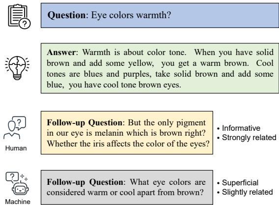
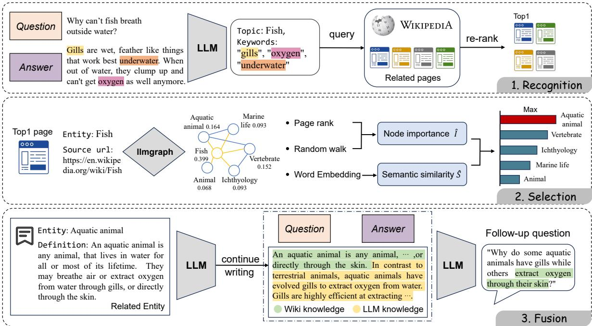
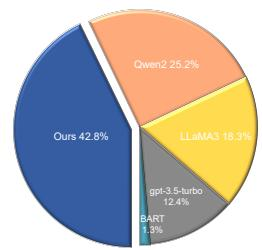
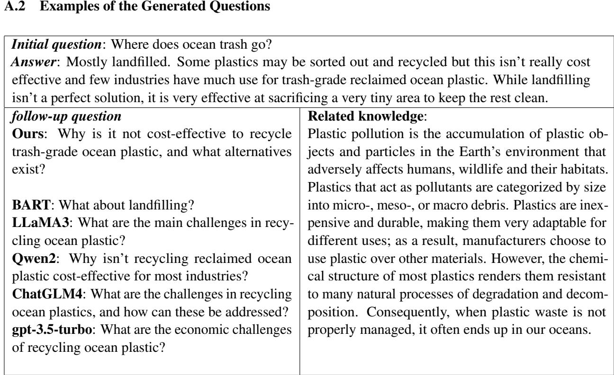
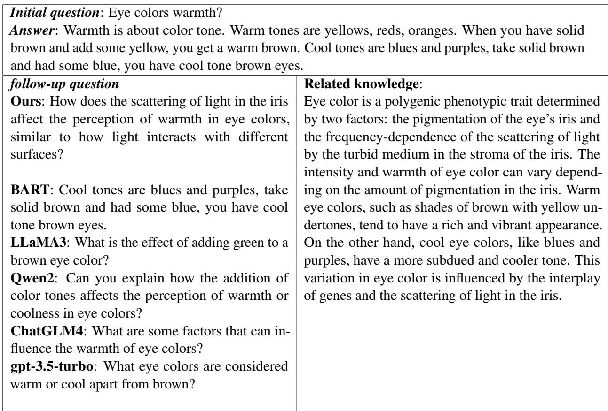

# From Superficial to Deep: Integrating External Knowledge for Follow-up Question Generation Using Knowledge Graph and LLM

Jianyu Liu1, Yi Huang3, Sheng Bi2\*, Junlan Feng3, Guilin Qi1,

1School of Computer Science and Engineering, Southeast University, China 2Law and Innovation Lab, Law School, Southeast University, China 3China Mobile Research Institute, China

Correspondence: {liujianyu, bisheng, gqi}@seu.edu.cn, {huangyi, fengjunlan}@chinamobile.com

## Abstract

In a conversational system, dynamically generating follow-up questions based on context can help users explore information and provide a better user experience. Humans are usually able to ask questions that involve some general life knowledge and demonstrate higher order cognitive skills. However, the questions generated by existing methods are often limited to shallow contextual questions that are uninspiring and have a large gap to the human level. In this paper, we propose a three-stage external knowledge-enhanced follow-up question generation method, which generates questions by identifying contextual topics, constructing a knowledge graph (KG) online, and finally combining these with a large language model to generate the final question. The model generates information-rich and exploratory followup questions by introducing external common sense knowledge and performing a knowledge fusion operation. Experiments show that compared to baseline models, our method generates questions that are more informative and closer to human questioning levels while maintaining contextual relevance.

## 1 Introduction

Asking questions is a fundamental way for humans to learn new knowledge. Question generation (QG), an important task in the field of natural language processing, aims to generate a question based on a given text. A good question is crucial for a conversational system, because an excellent system should be able to interact well with the user through asking and responding (Li et al., 2017). With the rapid development of artificial intelligence technology, generative AI conversational systems have been widely used in many fields, such as education (Luo et al., 2024; Agrawal et al., 2024), healthcare (Alonso et al., 2024), and legal consultation (Louis et al., 2024). However, while large language models (LLM) such as ChatGPT (OpenAI, 2022) can respond to queries, they are often passive - only responding to user queries rather than proactively guiding the conversation or posing their own inquiries. To address this limitation in proactivity, the task of follow-up QG was introduced (Wang et al., 2018).

  
Figure 1: When humans ask questions, they can rely on relevant common knowledge to introduce new directions of thought. However, it is difficult to achieve with existing methods.

In a conversational system, a follow-up question usually refers to a continuation question generated based on the user’s input or the system’s initial answer (Ge et al., 2023). Such questions differ significantly from those produced by traditional question generation tasks (Pan et al., 2019), where the generated question can be answered using the source text. In contrast, a follow-up question cannot be answered in the previous context. Intuitively, a good follow-up question must meet two requirements while maintaining coherent and fluent formulation: (1) Ensure contextual relevance. The question should be highly relevant to the current dialog topic and should not deviate from the previous conversation content; (2) Aim to explore new information, thereby guiding the next response to provide more novel information and advance the

dialog to a deeper level.

Meng et al. (2023) found that machines struggle to generate relevant questions by integrating background knowledge and examples, resulting in a significant gap in the amount of information compared to humans. Moreover, humans can generate followup questions through higher-level cognitive skills, such as using analogy and association (Davoudi and Sadeghi, 2015). Pan et al. (2019) suggested that due to the limitations of training data and preset models, machine-generated questions mostly remain at the level of surface linguistic relevance, lacking flexibility and creativity. An intuitive example is shown in Figure 1. When discussing eye color, humans can associate other factors that are not mentioned in the context, such as melanin and the iris. However, since the machine can only rely on contextual information, the generated questions, while relevant to the previous context, often lack sufficient depth and breadth in their content.

In this paper, we address the above limitations and propose a method that introduces external knowledge through the online construction of KG and combines it with LLM to generate the followup question. Specifically, we first perform intent recognition on historical question and answer information to expand relevant background knowledge, extract core keywords from the conversation, and construct a query to retrieve the most relevant Wikipedia page. Next, we construct a real-time KG centered on the entity corresponding to the page. We then select the nodes most relevant to the conversation based on two dimensions: node importance and relevance, thereby identifying the external background knowledge to be introduced. This allows the model to access a broader range of knowledge resources, improving the depth and relevance of the generated question. To address the challenge of the model’s limited cognitive ability, we design a knowledge fusion operation to further enhance the model’s understanding and cognition of the context by instructing the LLM to continue writing the previously acquired external Wikipedia knowledge based on the context. In summary, our contributions are as follows:

• We develop a three-stage framework for follow-up question generation, integrating multi-source knowledge to generate coherent, clear and informative follow-up questions.

• We design a strategy to inject common sense knowledge into the question generation process by constructing a KG online, making the questions more knowledge-supported.

• We conduct extensive experiments and analysis, demonstrating the superiority of the proposed method in the this task.

## 2 Related Work

Question generation aims to automatically generate semantically reasonable and structurally complete questions from a given text (Bi et al., 2024). Traditional question generation has been widely applied in fields such as machine comprehension (Du et al., 2017; Uto et al., 2023), e-commerce (Du et al., 2023; Chico et al., 2022), educational guidance (Luo et al., 2024), news media (Chakrabarty et al., 2022) and other fields. In these tasks, the answers to the generated questions are known as they derive from the information provided to the model. This is fundamentally different from the starting point of human questioning, which is driven by the search for new information. In this work, we aim to generate a follow-up question that probes for unknown information within the given knowns.

Previous work focusing on follow-up question generation mainly concentrated on rule-based or using pre-trained language models (PLM). Template filling (Soni and Roberts, 2019; Oh et al., 2015) not only limits the diversity of question types but also fails to generate personalized questions. Kumar and Joshi (2017) proposed a sequence-tosequence retrieval-based learning system to generate complete questions for incomplete followup questions. Su et al. (2018) focused on applications in interview systems, using a patternbased sequence-to-sequence model for follow-up question generation. Ge et al. (2023) proposed a knowledge-driven framework for follow-up question generation, combining a knowledge selection module and a generation model guided by selected knowledge entity-relation pairs. Wang et al. (2018) designed two types of decoders (soft type decoders and hard type decoders) to generate questions by estimating the type distribution of the question components. However, with the development of LLM, there is a lack of methods for generating follow-up questions based on LLM. Meng et al. (2023) found that both PLM and LLM-generated questions are far from human-asked questions in terms of information content and complexity, indicating that this task is still quite challenging.

## 3 Methodology

Follow-up question generation (QG) is to generate questions based on the dialogue context, aiming to steer the conversation toward a deeper level and higher creativity, as shown in Figure 1. The method proposed in this paper aims to introduce external background knowledge related to the context by constructing a KG to compensate for the shortcomings of previous work that relies only on the surface information of the context to generate question. In addition, we use the knowledge fusion operation to enhance the cognitive level of the generated question, which helps to lead the conversation to a deeper level. Our framework is divided into three stages, namely Recognition, Selection, and Fusion, as shown in Figure 2.

## 3.1 Recognition

The primary characteristic of a follow-up question is contextual relevance. Thus, the goal of the Recognition module is to identify the core topic of the historical dialog and extract the correct contextual information for generating the follow-up question.

First, for a given question-answer (QA) pair, we input it into the LLM and instruct it to extract the key information from the QA pair. During the extraction process, the LLM extracts one word as the Topic and n Keywords. The purpose of this is that the Topic is a highly concise description of the entire QA, capturing the user’s main question intention, while the Keywords extract more finegrained details from the QA. We consider that the combination of the Topic and Keywords can better model the overall dialog.

Wikipedia1 is a multilingual online encyclopedia whose content covers almost all known fields. We query Wikipedia based on the Topic and Keywords to obtain related contextual entities in a iterative retrieval way. Specifically, we first query pages whose titles contain the Topic, which is denoted as the set C. Then, we traverse the Keywords one by one, adding each keyword to the query condition and retrieving pages from C that contain the keyword until all keyword traversals have been completed. By narrowing down the query range, we obtain the most relevant related pages. During the dynamic search process, if a unique match result is found, the search process is terminated early2.

Since word overlap scores from search engines may not accurately reflect text relevance, we introduce a re-ranker to re-rank related pages. Inspired by the work of (Sachan et al., 2022), the re-ranker in the Recognition module measures the relevance of a page by calculating the following probability:

$$
P ( Q \mid p _ { i } ) = \frac { 1 } { \mid Q \mid } \prod _ { t } P ( Q _ { t } \mid Q _ { < t } , p _ { i } ; \Theta ) ,\tag{1}
$$

where $Q$ is a query consisting of a concatenation of Topic and Keywords, and Θ represents the parameters of PLM. $p _ { i }$ refers to the definition of the entity in each page. The conditional probability of the entire output sequence $Q$ is computed by the product of the conditional probabilities of all time steps, where $P ( Q _ { t } \mid Q _ { < t } , p _ { i } ; \Theta )$ is the conditional probability that the model generates the current token at each time step, which can be expressed as:

$$
P ( Q _ { t } \mid Q _ { < t } , p _ { i } ; \Theta ) = S o f t m a x ( f ( Q _ { < t } , x ; \Theta ) ) ,\tag{2}
$$

among them, $f ( Q _ { < t } , p _ { i } ; \Theta )$ is the output of the model, which represents the score of generating the current token $Q _ { t } ,$ which is transformed into a probability distribution through the softmax function. In this work, we choose T5 (Raffel et al., 2020) as the base model of the re-ranker. After the re-ranking is completed, the first ranked page is considered as the topic entity capable of representing the historical dialog.

## 3.2 Selection

After obtaining the page output from the Recognition module, we use llmgraph 3 to construct a KG for the candidate page. The llmgraph is an opensource tool that utilizes LLM to construct KGs, capable of creating a KG from the Wikipedia page of the given source entity. We provide the URL of the page output by the Recognition module to llmgraph, and specify the entity of the page as the central node of the resulting KG. Since the other nodes of the output KG are all associated with the central node, and each node stores the definition of its corresponding entity, the KG thus reflects the background knowledge relevant to the context.

Furthermore, we need to evaluate the relevance of these entities in order to select meaningful background knowledge. The evaluation dimensions include node importance and semantic similarity. First, we need to prioritize the most relevant and well-known entities among the many candidates, ensuring that the background knowledge introduced is consistent with common sense. We use PageRank (Page et al., 1999) to analyze the overall structure in the graph and assign weights $w _ { i }$ to each node $V _ { i } .$ . Entities with global importance are given higher weights. Then, by executing the random walk (Nikolentzos and Vazirgiannis, 2020) and recording the number of visits to node $V _ { i } ,$ denoted as $n _ { i } ,$ we calculate the importance score of the node $V _ { i }$ as follows:

  
Figure 2: For a Q&A pair in a user conversation, we first identify the key information of the context. Then, we construct a KG and select the node that is most relevant to the dialog. Finally, we integrate the background knowledge into the question generation process to generate the final follow-up question.

$$
I _ { i } = w _ { i } \times n _ { i } ,\tag{3}
$$

in addition, it is necessary to ensure the relevance of the introduced background knowledge to the context. We use BERT (Devlin et al., 2019) to encode the query in Recognition and the definition of each entity separately, denoted as $q$ and $e _ { i }$ respectively. The semantic similarity between the two is then computed as follows:

$$
S _ { i } = { \frac { q \cdot e _ { i } } { \| q \| \| e _ { i } \| } } ,\tag{4}
$$

as $S _ { i }$ ranges from -1 to 1, we perform a max-min normalization on $I _ { i }$ to balance the influence of $I _ { i }$ and $S _ { i }$ . The normalization is calculated as follows:

$$
I _ { i } ^ { ' } = \frac { I _ { i } - I _ { \operatorname* { m i n } } } { I _ { \operatorname* { m a x } } - I _ { \operatorname* { m i n } } } ,\tag{5}
$$

where $\begin{array} { r c l } { { { I _ { { \mathrm { { m a x } } } } } } } & { { = } } &  { \operatorname* { m a x } \{ I _ { 1 } , I _ { 2 } , . . . , I _ { n } \} , { I _ { { \mathrm { m i n } } } } } & { { = } } \end{array}$ min $\{ I _ { 1 } , I _ { 2 } , . . . , I _ { n } \}$ . By combining the node’s importance score $I ^ { ' } .$ i and the semantic similarity $S _ { i }$ the final composite score $R _ { i }$ for each entity is:

$$
R _ { i } = I _ { i } ^ { ' } + \beta \times S _ { i } ,\tag{6}
$$

where $\beta$ is the weighting factor to balance the effect between node importance and semantic similarity. We select the entity with the highest score, and the corresponding definition is used as the introduced Wiki knowledge to provide meaningful background knowledge for generating a follow-up question to improve accuracy and reliability.

## 3.3 Fusion

LLM acquire enormous knowledge from massive text corpora. Petroni et al. (Petroni et al., 2019) pointed out that in addition to learning linguistic knowledge, LLM also learn a significant amount of world knowledge (or factual knowledge). Unlike traditional knowledge bases where information is stored explicitly, in these LLM, knowledge is embedded within the parameters. It is necessary to guide the model appropriately to "speak out" the knowledge. Inspired by existing works (Qin et al., 2023; Cao et al., 2024), we adopt prompt learning to try to extract knowledge from the LLM. We innovatively designed a text continuation task, requiring the model to continue writing the Wiki knowledge output by the Selection module based on the context. The purpose of this is twofold: on one hand, to stimulate the LLM to integrate its internal world knowledge and provide more common sense knowledge; on the other hand, to integrate the knowledge with the context through natural language generation to ensure that the generated question has strong contextual relevance.

For the continue writing prompt, we designed it as follows: “Given a question-answer pair: [Question], [Answer]. Please continue writing the following sentences with a few sentences based on the question-answer pair to reflect the association with it.”. During the continue writing process, LLM conducts in-depth analysis of the context and Wiki knowledge, which improves the level of understanding of background knowledge.

Finally, we instruct the LLM to generate a follow-up question based on the known information. To obtain high-quality follow-up question, we provide clear task description and context in the prompt, including the question, answer, background knowledge fragment, and language style requirement. The specific design is as follows: “Given the following information: [Question], [Answer], [Related knowledge]. Based on this information, raise a follow-up question that is relevant to the question-answer content and that is thoughtful”. At this point, we obtain the final follow-up question.

## 4 Experiment Setup

Dataset To evaluate the effectiveness of the proposed method, we utilize FOLLOWUPQG (Meng et al., 2023) as the experimental dataset. The source of FOLLOWUPQG comes from the Reddit subforum Explain Like I’m Five (ELI5), where the questions are close to real-life scenarios, and the answers are self-contained, thus requiring minimal prior expertise. FOLLOWUPQG contains 3,790 samples, each structured as a triplet consisting of an initial question, an answer, and a follow-up question. Since all data are derived from human responses, FOLLOWUPQG captures a variety of high-level cognitive skills in the questions, such as association and causal reasoning.

Evaluation Metrics In the experiment, we report a range of representative metrics relevant to the task to assess the quality of the generated results, including Topic Consistency, Mutual Information (MI) (Shannon, 1948), Distinct-n (Li et al., 2016a), and Type-Token Ratio (TTR) (Kettunen, 2014), which respectively reflect relevance, informativeness, and diversity, with Distinct-n and TTR both capturing aspects of diversity. For Topic Consistency, we use LDA (Blei et al., 2001) to extract the topics from the conversation context and the follow-up question. We select the top N words with the highest probability for each topic, and calculate their co-occurrence frequency for scoring. The average score across all topics determines the consistency between context and questions, with a higher score indicating a stronger thematic correlation. MI measures how much the uncertainty of one variable is reduced given the value of another variable. In the experiment, we compute the MI between the follow-up question and the initial question. When MI is smaller, the initial question reveals less information about the follow-up question, meaning that the generated question contains more information. Existing research suggests that diversity is a reliable basis for measuring the creativity of generated content (Li et al., 2016b; Hashimoto et al., 2019).

Baselines We select the following baseline models for comparison:

• PLMs: We use the baseline model set by the FOLLOWUPQG dataset for comparison, including BART (Lewis et al., 2020), T5 (Raffel et al., 2020), and GPT-Neo (Black et al., 2021). All models are fine-tuned on the training set.

• LLMs: We introduce several mainstream open-source and closed-source LLMs for comparison, including gpt-3.5-turbo (OpenAI, 2022), LLaMA3 (Meta, 2024), Qwen2 (Yang et al., 2024), and ChatGLM4 (Zeng et al., 2024). We use the standard prompt to instruct each model to complete the task.

Implementation Details For the configuration of our method, the number of extracted keywords n in the Recognition module is set to 3, the number of random walk steps in the Selection module is set to 100, and the embedding model used to measure semantic similarity is all-MiniLM-L6-v2. The β value in equation 6 is set to 1.0, and all LLM used are gpt-3.5-turbo. For LLM deployment, we use vLLM (Kwon et al., 2023) to accelerate the inference, with the temperature set to 1.0. All experiments are conducted on a cluster of NVIDIA 4090 24GB GPUs.

## 5 Experimental Results

## 5.1 Main Results

We report the comparative results of various models on the FOLLOWUPQG dataset (Meng et al., 2023) in Table 1. Regarding the relevance between the generated responses and the context, we observe that PLMs generally outperform than LLMs in terms of Topic Consistency. A direct reason for this is that PLMs have a much smaller parameter size compared to LLMs, making smaller models more prone to overfitting on the training data. As a result, PLMs tend to paraphrase the phrases from the input context. In such cases, the question generated by PLMs is closer to the input content, resulting in higher Topic Consistency. Therefore, the higher Topic Consistency of PLMs does not necessarily indicate better question quality. Compared to other LLMs, thanks to the extraction of key contextual information by the Recognition module, our method generates question that is more related to the context, effectively maintaining topic consistency with the input.

Our method achieves the lowest MI, i.e. the initial question reveals the least amount of information about the generated follow-up question. It is noteworthy that T5 also achieves relatively low MI. Further investigation reveals that T5 tends to generate question texts that contain many meaningless metacognitive expressions, such as "This is baffling to me," "I’m not doubting you," or "I’m not sure...". These expressions are modal expressions at the discourse level, but they are irrelevant to the actual question and can be considered as redundant filler words. The proportion of such expressions exceeds 17% and contributes to the low MI of T5. In contrast, our method does not exhibit this phenomenon. By leveraging a Selection module that constructs a KG and selects the most contextually relevant and widely known entities from KG as external knowledge, our method generates followup questions that do not simply repeat or rephrase the original context, but introduce new information to initiate new topics. Additionally, the Fusion module integrates Wiki knowledge and LLM knowledge, ensuring contextual relevance while allowing for deeper exploration, thus achieving a good balance between the two objectives.

Our method also outperforms baseline models in terms of text diversity. We achieve the highest Distinct-1 and TTR, indicating that the injection of external knowledge contributes to more diverse follow-up questions. Among the baseline models, LLMs generally outperform than PLMs, which suggests that LLMs, trained on larger knowledge bases, generate more diverse texts. In comparison to other LLMs, our method showed improvements in all of the evaluation metrics, particularly when compared to the base model used in the framework, gpt-3.5- turbo, which further validates the effectiveness of our framework design.

## 5.2 Human Evaluation

We employ crowdsourcing to perform a human evaluation of 100 randomly selected samples from the FOLLOWUPQG test set. Five Englishproficient workers are asked to evaluate the questions generated by different models for a specific sample. The detailed criteria are shown in the questionnaire provided in Appendix A.1. For PLMs, we only selected BART that performed best in the automatic evaluation. Workers are blinded to the identity of the model to which the question belongs. For each question, we ask workers to score it based on three criteria: Complexity, Relevance, and Informativeness. Then workers are asked to choose the question they would most like to ask from all the questions. We count and average the scores on each question and report the average performance, which is shown in Table 2 and Figure 3.

According to Table 2, all models can maintain contextual relevance effectively, but our method is significantly better than the other models in Complexity and Informativeness, particularly with at least an 18% improvement in Complexity over the baselines. It indicates that our method can use a variety of cognitive strategies to generate questions, while LLMs struggle to do so. According to the voting results in Figure 3, the questions generated by our method are the most preferred by users, indicating that our method is closer to human-level question generation compared to LLMs.

## 5.3 Ablation Analysis

In order to explore the role of each module in generating the final question, we measure the influence of each module by calculating the semantic distance. We use an embedding model to encode the vectors of the Wiki knowledge output by the Selection module, the initial question, and the follow-up question, and then compute the pairwise semantic distances. The results are shown in Table 3.

When removing re-ranker to use search engine result directly, both $d i s ( W i k i _ { k } , q )$ and $d i s ( W i k i _ { k } , f q )$ decrease compared to the standard framework $\left( - 1 . 0 0 \% ; - 8 . 0 2 \% \right)$ , indicating that inaccurate recognition of the contextual topic indirectly reduces the relevance of the introduced external knowledge to the context. The increase in $d i s ( q , f q )$ also confirms that the introduction of irrelevant external knowledge causes the followup question to rely more on expressions from the original context, thereby reducing its creativity. When we randomly select nodes from the KG, the decreases in $d i s ( W i k i _ { k } , q )$ and $d i s ( W i k i _ { k } , f q )$ are even more significant $( - 2 6 . 6 0 \% ; - 9 . 7 9 \% )$ demonstrating that selecting node based on both node importance and semantic similarity ensures the relevance of the introduced external knowledge, confirming the necessity of this measure.

<table><tr><td rowspan="2"></td><td colspan="3">Pre-trained language model-based</td><td colspan="5">Large language model-based</td></tr><tr><td>BART</td><td>T5</td><td>GPT-Neo</td><td>LLaMA3</td><td>Qwen2</td><td>ChatGLM4</td><td>gpt-3.5-turbo</td><td>Ours</td></tr><tr><td>Consistency(%)</td><td>62.11</td><td>61.13</td><td>77.11</td><td>54.16</td><td>53.83</td><td>54.15</td><td>52.74</td><td>54.42</td></tr><tr><td>Mutual Information</td><td>0.7850</td><td>0.7535</td><td>1.2349</td><td>0.7816</td><td>0.7943</td><td>0.7921</td><td>0.7677</td><td>0.7515</td></tr><tr><td>Distinct-1(%)</td><td>30.57</td><td>28.11</td><td>18.61</td><td>31.63</td><td>31.43</td><td>30.21</td><td>31.73</td><td>33.84</td></tr><tr><td>Distinct-2(%)</td><td>70.64</td><td>61.59</td><td>68.06</td><td>70.46</td><td>70.79</td><td>70.33</td><td>68.91</td><td>67.88</td></tr><tr><td>TTR(%)</td><td>92.70</td><td>86.00</td><td>65.65</td><td>92.61</td><td>93.51</td><td>92.16</td><td>96.65</td><td>97.08</td></tr></table>

Table 1: Experimental results of various methods on the follow-up question generation task.

<table><tr><td colspan="6">Models BART LLaMA3 Qwen2 ChatGLM4 gpt-3.5-turbo Ours</td></tr><tr><td>COM. 0.08</td><td>0.21</td><td>0.24</td><td>0.19</td><td>0.21</td><td>0.42</td></tr><tr><td>REL. 0.98</td><td>0.97</td><td>0.97</td><td>0.96</td><td>0.98</td><td>0.97</td></tr><tr><td>INF. 1.24</td><td>1.68</td><td>1.76</td><td>1.71</td><td>1.66</td><td>1.98</td></tr></table>

Table 2: Performance of each model on human evaluation for followup question generation. COM.: Complexity (0-1); REL.: Relevance (0-1); INF.: Informativeness (1-3).

  
Figure 3: User preference distribution.

<table><tr><td colspan="4">dis(Wiki_k, q) dis(Wiki_k, fq) dis(q, fq)</td></tr><tr><td>w/o re-ranker</td><td>32.52</td><td>50.91</td><td>46.86</td></tr><tr><td>w/o KGselection</td><td>24.11</td><td>49.93</td><td>37.22</td></tr><tr><td>w/o llmknowledge</td><td>31.85</td><td>61.29</td><td>33.84</td></tr><tr><td>Ours</td><td>32.85</td><td>55.35</td><td>40.33</td></tr></table>

Table 3: Results of ablation experiments. W iki\_k denotes the Wiki knowledge output from the Selection module; q denotes the input initial question; $f q$ denotes the output follow-up question.

When using Wiki knowledge to generate a follow-up question without knowledge fusion operation, we observe a significant increase in $d i s ( W i k i _ { k } , f q )$ (+10.73%) while $d i s ( q , f q )$ decreases sharply (-16.09%). It suggests that in this case, the generated follow-up question tends to focus more on the Wiki knowledge, which is undesirable. The focus of the question should always revolve around the original context, and the introduced external knowledge should play an inspiring role rather than becoming the focus of the question. It also shows that allowing LLM to continue writing Wiki knowledge according to context can indeed enhance the contextual relevance of the question while integrating multi-source knowledge.

<table><tr><td> $\beta = 0 ~ \ \beta = 0 . 5 ~ \ \beta = 1 ~ \ \beta = 1 . 5 ~ \ \beta = 2 ~ \ \beta = \infty$ </td><td></td><td></td><td></td><td></td></tr><tr><td>BLEU-1</td><td>11.30</td><td>11.37 12.28</td><td>11.46</td><td>11.57 11.65</td></tr><tr><td>BLEU-2</td><td>2.83</td><td>2.97 3.26</td><td>3.09</td><td>3.06 3.24</td></tr><tr><td>Perplexity</td><td>34.95</td><td>34.64 33.74</td><td>35.14</td><td>33.79 34.17</td></tr><tr><td>Topic Consistency</td><td>50.19</td><td>50.88 50.80</td><td>51.32</td><td>50.3650.51</td></tr></table>

Table 4: Compare the generation performance under different weighting parameters $\beta .$ We compare the performance by evaluating the BLEU, Perplexity, and Topic Consistency of the final generated question.

## 5.4 The effect of β-value on Selection performance

We use the BLEU (Papineni et al., 2002), Perplexity, and Topic Consistency between the Wiki knowledge and the context to evaluate the quality of the Wiki knowledge, as shown in Table 4. BLEU-1 and BLEU-2 both reach their maximum values when $\beta = 1$ , then slightly decline as $\beta$ increases. Topic Consistency reaches its maximum at $\beta = 1 . 5$ , but higher $\beta$ values lead the model to favor external knowledge based on semantic similarity. Overreliance on semantics may cause the generated question to deviate from the most relevant core content, thus Topic Consistency decreases slightly at higher $\beta$ values. Perplexity is optimal at $\beta = 1$ and either too large or too small a value of $\beta$ results in a loss of semantic fluency of the selected external knowledge relative to the context. In summary, we think that the performance of the Selection module is best when $\beta = 1$ , indicating that node importance and semantic similarity are equally important when selecting external knowledge.

<table><tr><td colspan="2">Initial question: Why is the speed of sound constant? Answer: The speed of sound is not constant. It depends on the temperature of the medium (and indeed what the medium is made of). It&#x27;s mathematical formula is square root (specific heat ratio × gas constant × temperature). Loudness is a measure of intensity not speed. Being louder doesn&#x27;t mean you&#x27;re heard quicker, it means you’re heard more prominently.</td></tr><tr><td>follow-up question Ours: Why does temperature affect the speed of sound, is it because of the thermal motion of molecules or something else? For example, what happens to the speed of sound in a medium when  $2 0 ^ { \circ } \mathrm { C }$   $0 ^ { \circ } \mathrm { C } ?$  the temperature drops from to below BART: So is the speed of sound constant? LLaMA3: What are the factors that affect the speed of sound in a medium? Qwen2: How does temperature affect the speed of sound in different mediums? ChatGLM4: How does the change in temper- ature affect the speed of sound in a specific medium? gpt-3.5-turbo: How does the temperature of a medium affect the speed of sound?</td><td>Related knowledge: The speed of sound is the dis- tance travelled per unit of time by a sound wave as it propagates through an elastic medium. At 20°C (68°F), the speed of sound in air is about 343 m/s. It depends strongly on temperature as well as the medium through which a sound wave is propagating. At  $0 ^ { \circ } \mathrm { C }$  (32°F), the speed of sound in air is about 331 m/s. Furthermore, the speed of sound is generally faster in solids and liquids than in gases. This is because the particles in solids and liquids are closer together, allowing vibrations to travel more quickly. In addition, the speed of sound also varies depending on the properties of the medium, such as its density and elasticity. As the temperature of a medium in- creases, the speed of sound generally increases as well. This is due to the fact that the particles in the medium gain more kinetic energy, resulting in faster movement and faster transmission of sound waves.</td></tr></table>

Table 5: Examples of model-generated follow-up questions. Our method generates questions that incorporate common sense and examples, while baselines cannot.

## 5.5 Case Study

In Table 5 we present the results of different models for a given context. We can see that the questions generated by BART essentially rephrase the initial question and do not provide any new information. The questions generated by LLMs are all standard special questions. Although the language style is formal, the questions are rather mechanical and lack the creativity typical of human inquiry. In contrast, while the question generated by our method are consistent with the contents of LLM, they are all aimed at how temperature affects the speed of sound, whereas our question involves factors not mentioned in the context, such as the thermal motion of molecules, and attempts to ask the machine to provide examples for explanation. In the Related knowledge, "the particles in the medium gain more kinetic energy" serves as the knowledge source for "the thermal motion of molecules" in the generated question, and the question also mimics the example in the Related knowledge, asking how the speed of sound changes from 20°C to 0°C. It is clear that the integration of external knowledge helps the model to generate question that is closer to the human level. More examples of the generation of followup question can be found in the Appendix. A.2.

## 6 Conclusion

In this paper, we propose a method to improve follow-up question generation by introducing external knowledge through KG and LLM. Our framework identifies key contextual information, constructs a KG online to acquire background knowledge relevant to the context, and finally integrates multi-source knowledge to generate the follow-up question. Extensive experiments demonstrate that our method outperforms baseline models in both quantitative and qualitative evaluations, generating questions that are richer in information, higher in cognitive complexity, and conducive to moving the conversation to deeper levels.

## 7 Limitations

Although the proposed method achieves remarkable results in experiments, it still has several limitations. First, our framework relies on Wikipedia as an external knowledge source. While Wikipedia contains a vast amount of information, it is not the most accurate source of knowledge in some specific vertical domains. Second, as the KG needs to be constructed in real time, the process is timeconsuming, potentially limiting its application in a conversational system. How to balance knowledge accuracy and work efficiency is an important direction for further research in the future.

## Acknowledgements

This work is partially supported by the project “Key Laboratory of rich-media Digital Publishing Content Organization and Knowledge Service Open Fund-Research on Knowledge-enhanced Training Techinques of Large Language Model” No. ZD2024-04/01. We thank the Big Data Computing Center of Southeast University for providing the facility support on the numerical calculations in this paper.

## References

Garima Agrawal, Kuntal Pal, Yuli Deng, Huan Liu, and Ying-Chih Chen. 2024. Cyberq: Generating questions and answers for cybersecurity education using knowledge graph-augmented llms. In Thirty-Eighth AAAI Conference on Artificial Intelligence, pages 23164–23172.

Iñigo Alonso, Maite Oronoz, and Rodrigo Agerri. 2024. Medexpqa: Multilingual benchmarking of large language models for medical question answering. Artif. Intell. Medicine, 155:102938.

Sheng Bi, Jianyu Liu, Zeyi Miao, and Qizhi Min. 2024. Difficulty-controllable question generation over knowledge graphs: A counterfactual reasoning approach. Inf. Process. Manag., 61(4):103721.

Sid Black, Gao Leo, Phil Wang, Connor Leahy, and Stella Biderman. 2021. GPT-Neo: Large Scale Autoregressive Language Modeling with Mesh-Tensorflow.

David M. Blei, Andrew Y. Ng, and Michael I. Jordan. 2001. Latent dirichlet allocation. In Neural Information Processing Systems: Natural and Synthetic, pages 601–608.

Qinglong Cao, Zhengqin Xu, Yuntian Chen, Chao Ma, and Xiaokang Yang. 2024. Domain-controlled prompt learning. In Thirty-Eighth AAAI Conference on Artificial Intelligence, pages 936–944.

Tuhin Chakrabarty, Justin Lewis, and Smaranda Muresan. 2022. CONSISTENT: open-ended question generation from news articles. In Findings ofthe Association for Computational Linguistics: EMNLP, pages 6954–6968.

Víctor Jesús Sotelo Chico, Victor Hochgreb de Freitas, and Júlio Cesar dos Reis. 2022. Investigating the effects of synthetic text generation for question answering: Empirical studies on e-commerce context. In WebMedia ’22: Brazilian Symposium on Multimedia and Web, pages 123–132.

Mohammad Davoudi and Narges Amel Sadeghi. 2015. A systematic review of research on questioning as a high-level cognitive strategy. English Language Teaching, 8(10):76–90.

Jacob Devlin, Ming-Wei Chang, Kenton Lee, and Kristina Toutanova. 2019. BERT: pre-training of deep bidirectional transformers for language understanding. In Proceedings of the 2019 Conference of the North American Chapter of the Association for Computational Linguistics: Human Language Technologies, pages 4171–4186.

Xinya Du, Junru Shao, and Claire Cardie. 2017. Learning to ask: Neural question generation for reading comprehension. In Proceedings ofthe 55th Annual Meeting of the Association for Computational Linguistics, pages 1342–1352.

Yongping Du, Xingnan Jin, Rui Yan, and Jingya Yan. 2023. Sentiment enhanced answer generation and information fusing for product-related question answering. Inf. Sci., 627:205–219.

Yubin Ge, Ziang Xiao, Jana Diesner, Heng Ji, Karrie Karahalios, and Hari Sundaram. 2023. What should I ask: A knowledge-driven approach for follow-up questions generation in conversational surveys. In Proceedings ofthe 37th Pacific Asia Conference on Language, Information and Computation, pages 113– 124.

Tatsunori B. Hashimoto, Hugh Zhang, and Percy Liang. 2019. Unifying human and statistical evaluation for natural language generation. In Proceedings of the 2019 Conference of the North American Chapter of the Associationfor Computational Linguistics: Human Language Technologies, pages 1689–1701.

Kimmo Kettunen. 2014. Can type-token ratio be used to show morphological complexity of languages? J. Quant. Linguistics, 21(3):223–245.

Vineet Kumar and Sachindra Joshi. 2017. Incomplete follow-up question resolution using retrieval based sequence to sequence learning. In Proceedings of the 40th International ACM SIGIR Conference on Research and Development in Information Retrieval, pages 705–714.

Woosuk Kwon, Zhuohan Li, Siyuan Zhuang, Ying Sheng, Lianmin Zheng, Cody Hao Yu, Joseph E. Gonzalez, Hao Zhang, and Ion Stoica. 2023. Efficient memory management for large language model serving with pagedattention. In Proceedings of the ACM SIGOPS 29th Symposium on Operating Systems Principles.

Mike Lewis, Yinhan Liu, Naman Goyal, Marjan Ghazvininejad, Abdelrahman Mohamed, Omer Levy, Veselin Stoyanov, and Luke Zettlemoyer. 2020. BART: denoising sequence-to-sequence pre-training for natural language generation, translation, and comprehension. In Proceedings ofthe 58th Annual Meeting of the Association for Computational Linguistics, pages 7871–7880.

Jiwei Li, Michel Galley, Chris Brockett, Jianfeng Gao, and Bill Dolan. 2016a. A diversity-promoting objective function for neural conversation models. In The 2016 Conference of the North American Chapter of the Association for Computational Linguistics: Human Language Technologies, pages 110–119.

Jiwei Li, Michel Galley, Chris Brockett, Jianfeng Gao, and Bill Dolan. 2016b. A diversity-promoting objective function for neural conversation models. In The 2016 Conference of the North American Chapter of the Association for Computational Linguistics: Human Language Technologies, pages 110–119.

Jiwei Li, Alexander H. Miller, Sumit Chopra, Marc’Aurelio Ranzato, and Jason Weston. 2017. Learning through dialogue interactions by asking questions. In 5th International Conference on Learning Representations.

Antoine Louis, Gijs van Dijck, and Gerasimos Spanakis. 2024. Interpretable long-form legal question answering with retrieval-augmented large language models. In Thirty-Eighth AAAI Conference on Artificial Intelligence, pages 22266–22275.

Haohao Luo, Yang Deng, Ying Shen, See-Kiong Ng, and Tat-Seng Chua. 2024. Chain-of-exemplar: Enhancing distractor generation for multimodal educational question generation. In Proceedings of the 62nd Annual Meeting ofthe Associationfor Computational Linguistics, pages 7978–7993.

Yan Meng, Liangming Pan, Yixin Cao, and Min-Yen Kan. 2023. Followupqg: Towards informationseeking follow-up question generation. In Proceedings of the 13th International Joint Conference on Natural Language Processing and the 3rd Conference of the Asia-Pacific Chapter of the Association for Computational Linguistics, pages 252–271.

Meta. 2024. Meet llama3.1. https://llama.meta. com/.

Giannis Nikolentzos and Michalis Vazirgiannis. 2020. Random walk graph neural networks. In Neural Information Processing Systems.

Kyo-Joong Oh, Ho-Jin Choi, Gahgene Gweon, Jeong Heo, and Pum-Mo Ryu. 2015. Paraphrase generation based on lexical knowledge and features for a natural language question answering system. In 2015 International Conference on Big Data and Smart Computing, pages 35–38.

OpenAI. 2022. Introducing chatgpt. https://openai. com/blog/chatgpt.

Lawrence Page, Sergey Brin, Rajeev Motwani, and Terry Winograd. 1999. The pagerank citation ranking : Bringing order to the web. In The Web Conference.

Liangming Pan, Wenqiang Lei, Tat-Seng Chua, and Min-Yen Kan. 2019. Recent advances in neural question generation. CoRR, abs/1905.08949.

Kishore Papineni, Salim Roukos, Todd Ward, and Wei-Jing Zhu. 2002. Bleu: a method for automatic evaluation of machine translation. In Proceedings ofthe 40th Annual Meeting ofthe Associationfor Computational Linguistics, pages 311–318.

Fabio Petroni, Tim Rocktäschel, Sebastian Riedel, Patrick S. H. Lewis, Anton Bakhtin, Yuxiang Wu, and Alexander H. Miller. 2019. Language models as knowledge bases? In Proceedings of the 2019 Conference on Empirical Methods in Natural Language Processing and the 9th International Joint Conference on Natural Language Processing, pages 2463–2473.

Chengwei Qin, Shafiq R. Joty, Qian Li, and Ruochen Zhao. 2023. Learning to initialize: Can meta learning improve cross-task generalization in prompt tuning? In Proceedings ofthe 61st Annual Meeting of the Association for Computational Linguistics, pages 11802–11832.

Colin Raffel, Noam Shazeer, Adam Roberts, Katherine Lee, Sharan Narang, Michael Matena, Yanqi Zhou, Wei Li, and Peter J. Liu. 2020. Exploring the limits of transfer learning with a unified text-to-text transformer. J. Mach. Learn. Res., 21:140:1–140:67.

Devendra Singh Sachan, Mike Lewis, Mandar Joshi, and et al. 2022. Improving passage retrieval with zero-shot question generation. In Proceedings of the 2022 Conference on Empirical Methods in Natural Language Processing, EMNLP 2022, pages 3781– 3797.

Claude E. Shannon. 1948. A mathematical theory of communication. Bell Syst. Tech. J., 27(3):379–423.

Sarvesh Soni and Kirk Roberts. 2019. A paraphrase generation system for EHR question answering. In Proceedings of the 18th BioNLP Workshop and Shared Task, pages 20–29.

Ming-Hsiang Su, Chung-Hsien Wu, Kun-Yi Huang, Qian-Bei Hong, and Huai-Hung Huang. 2018. Follow-up question generation using pattern-based seq2seq with a small corpus for interview coaching. In 19th Annual Conference ofthe International

Speech Communication Association, pages 1006– 1010.

Masaki Uto, Yuto Tomikawa, and Ayaka Suzuki. 2023. Difficulty-controllable neural question generation for reading comprehension using item response theory. In Proceedings ofthe 18th Workshop on Innovative Use of NLP for Building Educational Applications, pages 119–129.

Yansen Wang, Chenyi Liu, Minlie Huang, and Liqiang Nie. 2018. Learning to ask questions in open-domain conversational systems with typed decoders. In Proceedings of the 56th Annual Meeting of the Associationfor Computational Linguistics, pages 2193– 2203.

An Yang, Baosong Yang, Binyuan Hui, and et al. 2024. Qwen2 technical report. CoRR, abs/2407.10671.

Aohan Zeng, Bin Xu, Bowen Wang, and et al. 2024. Chatglm: A family of large language models from GLM-130B to GLM-4 all tools. CoRR, abs/2406.12793.

## A Appendix

## A.1 Questionnaire for Human Evaluation

<table><tr><td>Questionnaire</td></tr><tr><td>Q1: Whether the question reflect these cognitive approaches: counterfactual, analogical, deductive, and inductive rea- soning? Yes ONo Complexity</td></tr><tr><td>Q2: Whether the question is related to the initial question and answer?</td></tr><tr><td>O Yes ONo Relevance Q3: Whether the question present new information not men-</td></tr><tr><td>tioned in the context? Yes, there&#x27;s a lot. ONo</td></tr><tr><td>Yes, but a few. Informativeness Q4: Which of these questions do you prefer to ask? BART LLaMA3Qwen2</td></tr></table>

Table 6: The questionnaire designed for human evaluation, where ⃝ indicates a single choice.

A.2 Examples of the Generated Questions  
  
Table 7: Examples of model-generated follow-up questions.

  
Table 8: Examples of model-generated follow-up questions.

<table><tr><td colspan="2">Initial question: Can muscle fatigue be bypassed? Answer: Having used the fad electro muscle stimulator machines I would say unless the person suffered from paralysis in the limb you were stimulating or was quadriplegic if you were talking full body stimulation, lactic acid would still build up and hurt. Maybe to the point of absolute agony. The only way you can add any extra stamina to muscles with less fatigue is with chemicals, that&#x27;s why athletes are not allowed to use stimulants like amphetamines because methamphetamine can allow you to fully assert your strengths for longer than it&#x27;s usually naturally possible but not by a huge amount. Muscles fibers are essentially chemically induced into an electro magnetic mechanical contraction, which was ordered by a bio-electric nerve signal from the cerebellum for every movement and twitch. follow-up question Related knowledge:</td></tr><tr><td>Ours: If muscle fatigue is primarily influenced by lactic acid buildup, how do central nervous system factors like neurotransmitter changes also contribute to the sensation of fatigue? BART: I see, but what if the person was para- lyzed? LLaMA3: Can bio-electric nerve signals be ma- nipulated to increase muscle strength and en- durance? Qwen2: What role do chemicals play in reduc- ing muscle fatigue and how are they regulated in sports? ChatGLM4: What are the potential risks and side effects of using stimulants, like amphetamines, to enhance athletic performance? gpt-3.5-turbo: How do different types of exercise impact muscle fatigue differently?</td><td>Central nervous system fatigue, or central fatigue, is a form of fatigue that is associated with changes in the synaptic concentration of neurotransmitters within the central nervous system which affects ex- ercise performance and muscle function and cannot be explained by peripheral factors that affect muscle function. In healthy individuals, central fatigue can occur from prolonged exercise and is associated with neurochemical changes in the brain, involving sero- tonin (5-HT), noradrenaline, and dopamine. These neurotransmitters play a crucial role in regulating mood, motivation, and perception of effort, all of which can influence muscle fatigue.</td></tr></table>

Table 9: Examples of model-generated follow-up questions.