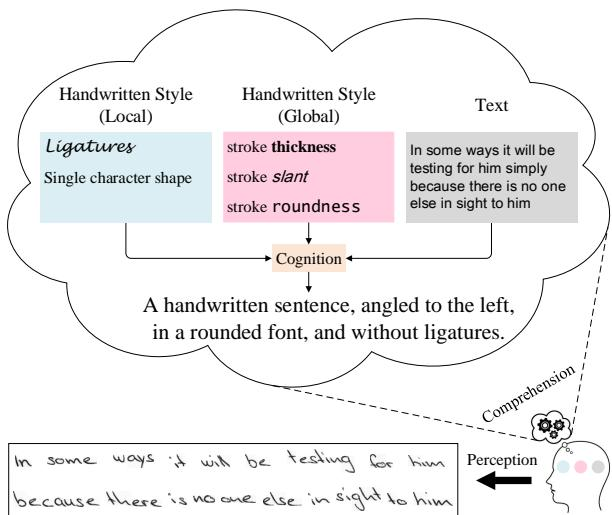
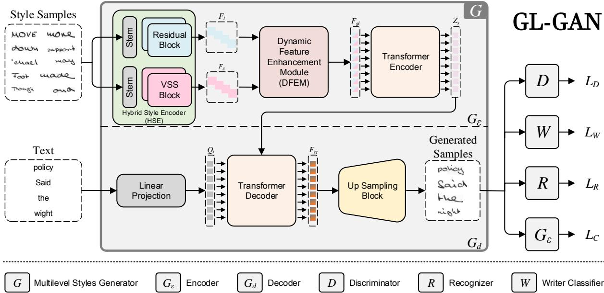
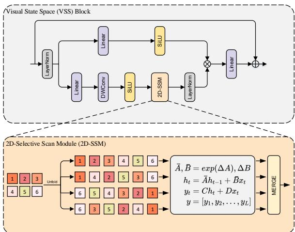
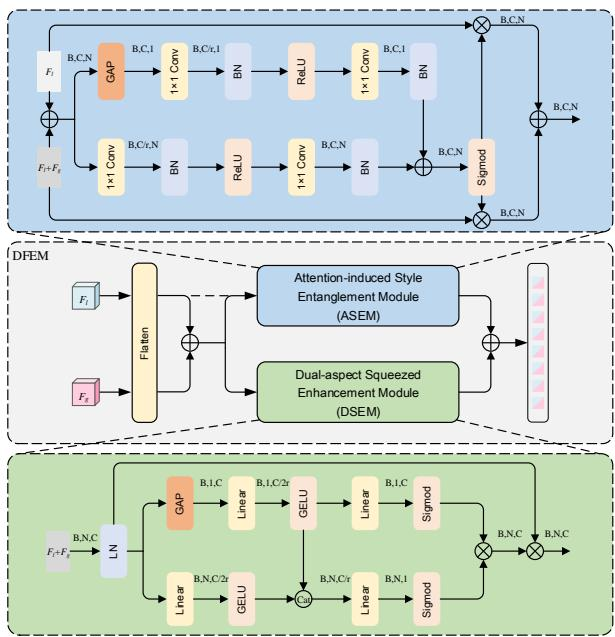
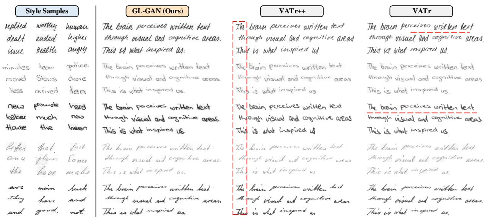

# GL-GAN: Perceiving and Integrating Global and Local Styles for Handwritten Text Generation with Mamba

Yiming Wang, Hongxi Wei\*, Heng Wang, Shiwen Sun, Chao He School of Computer Science, Inner Mongolia University, Hohhot, China National and Local Joint Engineering Research Center of Mongolian Information Processing Technology, Hohhot, China Correspondence: cswhx@imu.edu.cn

## Abstract

Handwritten text generation (HTG) aims to synthesize handwritten samples by imitating a specific writer, which has a wide range of applications and thus has significant research value. However, current studies on HTG are confronted with a main bottleneck: dominant models lack the ability to perceive and integrate handwriting styles, which affects the realism of the synthesized samples. In this paper, we propose GL-GAN, which effectively captures and integrates global and local styles. Specifically, we propose a Hybrid Style Encoder (HSE) that combines a state space model (SSM) and convolution to capture multilevel style features through various receptive fields. The captured style features are then fed to the proposed Dynamic Feature Enhancement Module (DFEM), which integrates these features by adaptively modeling the entangled relationships between multilevel styles and removing redundant details. Extensive experiments on two widely used handwriting datasets demonstrate that our GL-GAN is an effective HTG model and outperforms state-of-the-art models remarkably. Our code is publicly available at: https://github.com/Fyzjym/GL-GAN.

## 1 Introduction

Handwritten text generation (HTG) is an emerging and challenging research field that aims to produce handwritten samples with the calligraphic style of a given writer and arbitrary text. This research can provide training data for handwritten text recognition (HTR) (Kang et al., 2022) and signature verification (Pippi et al., 2023a). It can also automatically generate handwritten notes for individuals with physical impairments, demonstrating significant practical importance (Bhunia et al., 2021). Unlike font generation (Yao et al., 2024) and style transfer (Gatys et al., 2016), HTG involves imitating a handwriting style and reproducing the style in unseen characters or words. Handwriting style encompasses stroke slant, thickness, roundness, as well as texture (e.g., ink and background) and ligatures. Therefore, the challenge of HTG lies in enabling the model to fully comprehend and faithfully replicate the handwriting style under the given text.

  
Figure 1: When humans perceive a handwritten image, different brain regions are responsible for processing various aspects of the visual input. Then, information is integrated by cognitive regions. Our goal is to teach the model this procedure, enabling it to perceive and synthesize new handwritten images.

In light of this, specific methods (Vanherle et al., 2024; Dai et al., 2023) have been proposed for HTG. These methods can be divided into online HTG and offline HTG according to the data type. The former treats writing trajectories (strokes) as time series, while the latter processes data in image form. Compared to the former, offline HTG is more in line with practical usage requirements. In addition, handwritten images contain a more wealthy handwriting style. Therefore, we follow the offline HTG paradigm.

Recently, although VATr++ (Vanherle et al., 2024) and VATr (Pippi et al., 2023a) have made considerable advances in offline HTG, they still lack adequate representation of handwriting styles. We speculate that it is due to poor style extraction steps. As shown in Figure 1, from a neuroscience perspective, the brain processes visual information by first performing preliminary processing of basic shapes and structures through multiple visual cortices, followed by more complex analysis and integration in higher-level visual areas (Felleman and Van Essen, 1991). Inspired by this view, we argue that the inability to analyze and integrate handwriting styles comprehensively is the reason for the failure of existing methods.

In this work, we further distinguish two critical issues in existing methods that hinder the quality of the generated samples. First, a single-style encoder struggles simultaneously and precisely captures both global and local handwriting styles, leading to an incomplete representation of the handwriting style. Second, existing methods ignore the integration of different levels of handwriting styles. Here, we propose a generative architecture to address these issues. Specifically, we propose a learning global and local style generation framework (GL-GAN) for HTG, which fully comprehends style examples through a Hybrid Style Encoder (HSE) and a Dynamic Feature Enhancement Module (DFEM). HSE effectively perceives style samples by combining residual blocks and visual state space (VSS) blocks. The module utilizes convolution to capture local styles while capturing global styles by 2D-Selective Scan Module (2D-SSM). Next, we design a Dynamic Feature Enhancement Module (DFEM) to integrate multilevel styles and fully capture style entanglement. Additionally, cross-attention adaptively achieves the fusion of style entanglement and text embedding.

Our main contributions are as follows:

• We propose a novel HTG model, GL-GAN, which integrates multilevel handwriting styles effectively.

• We propose a Hybrid Style Encoder (HSE) combining convolution and state space models (SSM), which captures style features at various levels by diverse receptive fields. Moreover, we employ the SSM to perceive global styles for the first time in HTG.

• We propose a Dynamic Feature Enhancement Module (DFEM), which integrates style features by adaptively modeling the entangled relationships between multilevel styles and removing redundant information.

• Extensive experiments demonstrate that our GL-GAN outperforms existing state-of-theart methods on two benchmark datasets in terms of three evaluation metrics.

## 2 Related Works

## 2.1 Handwriting Text Generation

Online HTG. Online HTG aims to predict future stroke points based on the current stroke position. Such methods frequently utilize sequencebased models to reveal patterns between stroke points (Graves, 2013; Aksan et al., 2018; Aksan and Hilliges, 2019; Mayr et al., 2020). However, these methods often struggle to accurately capture the style of reference examples. Subsequently, Dai et al. (2023) proposed a style-decoupled method that distinguishes style from character features through decoupling and contrastive learning to handle the issue. However, the problem of long-range dependency persists.

Offline HTG. Early methods obtained samples through manual segmentation and combination (Xu et al., 2009; Haines et al., 2016). Alonso et al. (2019) were the first to use conditional generative adversarial networks (cGAN) (Mirza and Osindero, 2014) to synthesize handwritten samples. However, the synthesized samples suffer from mode collapse. ScrabbleGAN (Fogel et al., 2020) and LineText-GAN (Davis et al., 2020) were proposed to generate samples of arbitrary lengths. Subsequently, GANWriting (Kang et al., 2020) was designed to generate handwritten samples with specific writing styles. Building on appointment, a series of works have been proposed to further improve sample quality, such as SmartPatch (Mattick et al., 2021), Wang’s work (Wang et al., 2022), and AFFGANwriting (Wang et al., 2023). Bhunia et al. (2021) proposed Handwriting Transformer (HWT) to address the loose connection between style features and text embeddings. Notably, Nikolaidou et al. (2023) proposed a method based on a denoising diffusion probabilistic model (Ho et al., 2020) for HTG, namely WordStylist. Although it shows a significant gap compared to state-ofthe-art methods and cannot generate unseen styles, it remains a meaningful exploratory work. Recently, Pippi et al. (2023a) proposed VATr, which improved the connection between text embeddings and styles through a text content representation method. Following this, Vanherle et al. (2024) introduced VATr++, further improving generalization capabilities through input preparation and training regularization strategies. Unlike these methods, our GL-GAN can explicitly capture and elegantly integrate multilevel styles. The advance leverages the excellent global representation capabilities of the visual state space model (VSSM).

  
Figure 2: The overall architecture of the proposed model.

## 2.2 Visual State Space Models

The Structured State Space Sequence Model (S4) (Gu et al., 2021) was proposed to model longrange dependency. Due to its excellent representation capabilities, it has attracted further exploration. Gu and Dao (2023) proposed Mamba, which outperformed previous baselines in multiple metrics. Influenced by Mamba, state space models (SSM) have shown remarkable achievement in the visual field. Liu et al. (2024) proposed VMamba, achieving linear complexity without sacrificing global receptive fields. Huang et al. (2024) proposed LocalMamba, effectively capturing local dependencies while maintaining a global perspective. Guo et al. (2024) introduced MambaIR, which improves vanilla Mamba through local enhancement and channel attention. For HTG, as one of the earliest methods to introduce SSM, our primary motivation is to handle long-range dependencies and enhance general modeling capabilities through the superior representation capabilities of SSM.

## 3 Proposed Approach

## 3.1 Approach Overview

Problem Formulation. The HTG problem can be formulated as follows. Specifically, for a particular writer $w \in U , P \left( P = 1 5 \right)$ handwritten word images are randomly selected and denoted as $X _ { w } = \{ x _ { w , i } \} _ { i = 0 } ^ { P }$ . Given a text $C = \{ c _ { i } \} _ { i = 0 } ^ { Q }$ of arbitrary length $Q .$ HTG aims to generate a handwritten sample $Y _ { w } ^ { C }$ conditioned on the handwriting style of the writer w and the text C.

Model Overview. We devised a handwriting generation framework that targets global and local Styles styles. Figure 2 illustrates the overall architecture of our GL-GAN. It utilizes a Hybrid Style Encoder (HSE) that combines convolution and SSM to process the style sample $X _ { w }$ and handles the style representation $Z _ { s }$ and text embedding $Q _ { t }$ via cross-attention. First, the style sample $X _ { w }$ is processed through residual blocks and visual state space (VSS) blocks to obtain feature patches $F _ { l }$ and $F _ { g }$ . The flattened vectors are then fed into the proposed Dynamic Feature Enhancement Module (DFEM), which integrates global and local styles using various attention mechanisms and outputs the entangled style $F _ { g l }$ . Furthermore, the Transformer encoder performs self-attention to integrate further $F _ { g l }$ and outputs $Z _ { s }$ . Next, the Transformer decoder performs cross-attention between $Z _ { s }$ and text embedding $Q _ { t }$ and renders the entangled sequence $F _ { s t }$ . Finally, $F _ { s t }$ is fed into a upsampling module to generate the handwritten sample $Y _ { w } ^ { C }$ which contains the handwriting style of the style sample $X _ { w }$ and the text content C.

## 3.2 Multilevel Styles Generator

The multilevel style generator G synthesizes a new sample $Y _ { w } ^ { C }$ based on the style sample $X _ { w }$ and the text $C .$ . It includes two main components: an encoder $G _ { \varepsilon }$ and a decoder $G _ { d }$

Encoder $G _ { \varepsilon }$ . The encoder aims to comprehend and integrate handwriting styles from both global and local perspectives, capturing a multilevel style feature sequence $Z _ { s }$ from a given set of style samples $X _ { w }$ . It consists of a Hybrid Style Encoder (HSE) that combines convolution and SSM, a Dynamic Feature Enhancement Module (DFEM), and a Transformer encoder. The encoding procedure can be described as follows:

$$
F _ { g } = V S S B l o c k ( X _ { w } ) ,\tag{1}
$$

$$
F _ { l } = R e s i d u a l ~ B l o c k ( X _ { w } ) ,\tag{2}
$$

$$
F _ { g l } = D F E M ( F _ { g } , F _ { l } ) ,\tag{3}
$$

$$
Z _ { s } = M H S A ( F _ { g l } , F _ { g l } , F _ { g l } ) ,\tag{4}
$$

where, $F _ { g }$ and $F _ { l }$ represent the global and local feature patches, respectively, $F _ { g l }$ denotes the entangled feature sequence, $Z _ { S }$ means the multilevel styles feature sequence, and $M H S A ( \cdot )$ stands for multi-head self-attention. The motivation for HSE lies in the long-range dependency handling and computational efficiency of SSM, as well as the ability of CNNs to extract representative features. The HSE encodes style samples into $F _ { g }$ and $F _ { l }$ then integrates them into $F _ { g l }$ by the DFEM. Finally, the Transformer encoder further merges these style features. The designed VSS backbone has a structure similar to the CNN backbone, stacking four blocks, each with two layers, with output channels of [64, 128, 256, 512] for each block. The Transformer encoder consists of $L \left( L = 3 \right)$ layers, each with $J \ ( J = 8 )$ attention heads and a multilayer perceptron, used to further integrate handwriting features. This design compensates CNNs for the hardship of modeling long-range dependencies between features by employing a dual-branch structure that combines convolution and SSM.

Decoder $G _ { d }$ . The decoder aims to establish an entanglement between the style representation $Z _ { s }$ and the text embedding $Q _ { t }$ , then reconstruct the image. It comprises a linear injection layer, a Transformer decoder, and a convolutional decoder. The decoding procedure can be described as follows:

$$
Q _ { t } = l i n e a r ( C ) ,
$$

$$
Q _ { r e } = M H S A ( Q _ { t } , Q _ { t } , Q _ { t } ) ,\tag{5}
$$

(6)

$$
F _ { s t } = M H C A ( Z _ { s } , Z _ { s } , Q _ { r e } ) ,\tag{7}
$$

where $Q _ { r e }$ is the latent variable with text information, $F _ { s t }$ means the style-text entangled sequence, and $M H C A ( \cdot )$ denotes multi-head cross-attention. After converting the text C into the text embedding $Q _ { t }$ , self-attention is applied. Then cross-attention is performed between $Q _ { t }$ (considered as queries) and the multilevel style features $Z _ { s }$ (considered as keys and values). The step allows the model to learn the entangled sequence $F _ { s t }$ with style and text information. Finally, synthetic samples $Y _ { w } ^ { C }$ are received through the upsampling module. The Transformer decoder includes $L \left( L = 3 \right)$ layers, each with J $( J = 8 )$ attention heads. The upsampling module comprises four residual blocks. In decoder, multilevel style features and text representations can be effectively integrated due to the efficient processing capability of cross-attention.

## 3.3 Visual State Space Blocks

The State Space Model (SSM) is typically regarded as a linear time-invariant system. Mathematically, these models are typically expressed as linear ordinary differential equations (ODEs):

$$
h ^ { \prime } ( t ) = A h ( t ) + B x ( t ) ,
$$

$$
y ( y ) = C h ( t ) + D x ( t ) ,\tag{8}
$$

(9)

where A, B, and $C$ are the continuous parameters of the system, x(t), h(t), and $y ( t )$ represent the current input, state, and output of the system, respectively. As a continuous-time module, SSM must undergo discretization before it can be effectively applied in deep learning. The objective is to discretize the ODEs.

$$
h _ { k } = { \bar { A } } h _ { k - 1 } + { \bar { B } } x _ { k } ,
$$

$$
y _ { k } = { \bar { C } } h _ { k } + { \bar { D } } x _ { k } ,\tag{10}
$$

$$
\bar { A } = e ^ { \Delta A } ,\tag{11}
$$

(12)

$$
\bar { B } = ( e ^ { \Delta A } - I ) A ^ { - 1 } B ,\tag{13}
$$

$$
{ \bar { C } } = C ,\tag{14}
$$

where A¯, B¯, and $\bar { C }$ are the discrete parameters of the system, $x _ { k } , h _ { k }$ , and $y _ { k }$ represent the discrete input, state, and output of the system, respectively. Inspired by the equations above, Gu and Dao (2023) proposed Mamba and achieved impressive results.

  
Figure 3: The structure of the VSS block and illustration of the 2D-Selective-Scan on the image.

Based on this, Liu et al. (2024) proposed VMamba, which successfully applies SSM in visual recognition.

To effectively capture global styles, we introduce VSS blocks in the encoder $G _ { \varepsilon }$ . Figure 3 illustrates its core designs, the VSS Block and the 2D-selective-scan (SS2D) module. Specifically, the input passes through an initial linear embedding layer, and the output splits into two information streams. One stream undergoes a depth-wise convolution (DWC) (Chollet, 2017) layer, then via the SiLU activation function (Shazeer, 2020), and finally enters the SS2D module. The output of SS2D is passed through a layer normalization layer and then added to the output of the other stream, which has undergone SiLU. This procedure delivers the last output of the VSS block. For SS2D, it scans the image using CSM (scan extension). Then, the four resulting features are separately processed by S6 blocks, and the four output features are merged (scan merge) to construct the final 2D feature map. Benefiting from the global receptive area of the VSS block, the proposed Hybrid Style Encoder perceives handwriting styles from both global and local views, effectively enhancing the understanding capability of the model.

## 3.4 Dynamic Feature Enhancement Module

The Dynamic Feature Enhancement Module (DFEM) aims to adaptively model the entangled relationships between multilevel style features and efficiently remove redundant information, as illustrated in Figure 4. Specifically, the DFEM receives two hierarchical levels of style features $( F _ { g }$ and $F _ { l } )$ as input. The Attention-Guided Style Entanglement Module (ASEM) effectively extracts and integrates complementary features and texture details between multilevel styles, enhancing overall fusion performance. Subsequently, the Dual-aspect Squeezed Enhancement Module (DSEM) removes the redundant information, while valuable features are preserved and emphasized. Then, the two groups of features are added pointwise to get the final entangled style sequence. The motivation behind DFEM is to mimic the cognitive regions of the brain to integrate different types of visual features. The module effectively links stylistic features from different levels, enhancing the perceptual ability to recognize handwriting styles.

  
Figure 4: The structure of the Dynamic Feature Enhancement Module (DFEM).

## 3.5 Training and Loss Objectives

In order to maintain the realism of the generated samples, the multilevel style generator G is trained in conjunction with three other modules. The most essential component is the discriminator D, which consists of a series of stacked residual blocks. It distinguishes between real and fake images, compelling G to produce authentic samples. We utilize adversarial loss to optimize D and G:

$$
\begin{array} { r } { L _ { D } = \mathbb { E } [ \operatorname* { m a x } ( 1 - D ( X _ { w } ) , 0 ) ] + } \\ { \mathbb { E } [ \operatorname* { m a x } ( 1 + D ( Y _ { w } ^ { C } ) , 0 ) ] . } \end{array}\tag{15}
$$

Furthermore, we employ a text recognizer (Shi et al., 2016) R to identify the text in synthetic samples, compelling the generator to produce samples with the correct and desired textual content. R is trained with real data (samples and their transcriptions) and computes the CTC loss using generated samples. The CTC loss can be expressed as:

  
Figure 5: Qualitative comparison between our model and baselines in generating samples with the desired text in the desired handwriting style. We use the same textual content: ’The brain perceives written text through visual and cognitive areas. This is what inspired us.

$$
L _ { R } = \mathbb { E } [ - \sum \log ( p ( t | R ( x ) ) ) ] ,\tag{16}
$$

where x means the input dragged from the set $X _ { w }$ or $Y _ { w } ^ { C }$ , and t is the actual transcription of x. Moreover, a writer classifier W is introduced to classify based on the handwriting style, compelling the generator to produce samples in the desired style. Similar to D, W comprises a series of stacked residual blocks. The CE loss can be represented as:

$$
L _ { W } = \mathbb { E } [ - \sum \log ( p ( w | W ( x ) ) ) ] ,\tag{17}
$$

where w implies the identity information of the writer corresponding to sample x. Lastly, the cycle consistency loss is adopted to ensure that the generated samples maintain the same style as the original style samples. The loss can be expressed as:

$$
L _ { C } = \mathbb { E } [ \| G _ { \varepsilon } ( X _ { W } ) - G _ { \varepsilon } ( Y _ { W } ^ { C } ) \| _ { 1 } ] ,\tag{18}
$$

In summary, the objective function of GL-GAN consists of the losses mentioned above and can be represented as:

$$
L = L _ { D } + L _ { R } + L _ { W } + L _ { C } .\tag{19}
$$

## 4 Experiments

## 4.1 Experimental Setup

Datasets. We conduct experiments on two public benchmark datasets for HTG. The details of each dataset are as follows:

• IAM (Marti and Bunke, 2002) comprises 62,855 images written by 500 writers. Following previous work (Pippi et al., 2023a), we select 339 writers as the training set, while the remaining 161 writers were used for the test set.

• CVL (Kleber et al., 2013) consists of 101,069 images, which are written by 311 writers. We selected 27 writers to compare the generalizability of different HTG methods.

Settings. In all experiments, images are resized to a height of 32 pixels while maintaining the aspect ratio. The batch size is set to 8. Adam is used as an optimizer with a learning rate of $2 \times 1 0 ^ { - 4 }$ . In this case, the training is terminated after 10,000 epochs. All experiments are conducted using PyTorch and trained on a single NVIDIA Tesla V100s GPU.

Evaluation. To comprehensively compare our proposed GL-GAN with other state-of-the-art methods, we utilize five recognized metrics to evaluate HTG performance. • Fréchet Inception Distance (FID) (Heusel et al., 2017) measures the distance between the generated and real image distributions. • Handwriting Distance (HWD) (Pippi et al.,

<table><tr><td rowspan="2">Method</td><td colspan="3">IAM (IND)</td><td colspan="3">CVL (OOD)</td></tr><tr><td>FID↓</td><td>HWD↓</td><td>KID↓</td><td>FID↓</td><td>HWD↓</td><td>KID↓</td></tr><tr><td>GANwriting (Kang et al., 2020)</td><td>38.37</td><td>0.8406</td><td>3.286</td><td>51.51</td><td>1.9496</td><td>3.775</td></tr><tr><td>HWT (Bhunia et al., 2021)</td><td>19.40</td><td>0.4572</td><td>1.370</td><td>37.41</td><td>1.4283</td><td>2.275</td></tr><tr><td>VATr (Pippi et al., 2023a)</td><td>17.79</td><td>0.4205</td><td>0.706</td><td>29.55</td><td>1.4192</td><td>2.273</td></tr><tr><td>VATr++ (Vanherle et al., 2024)</td><td>16.29</td><td>0.3942</td><td>0.701</td><td>26.18</td><td>1.1562</td><td>2.011</td></tr><tr><td>GL-GAN (Ours)</td><td>14.32</td><td>0.3498</td><td>0.595</td><td>26.03</td><td>1.1357</td><td>1.551</td></tr></table>

Table 1: Quantitative comparison with SOTA methods for HTG on IAM and CVL dataset using three widely used evaluation metrics (i.e., FID, HWD, and KID). IND and OOD denote in-distribution and out-of-distribution scenario, respectively. KID score stands for the actual value multiplied by 102. "↓" indicates that smaller is better. The best results are highlighted in bold fonts.

2023b) is tailored to evaluate handwritten images. • Kernel Inception Distance (KID) (Sutherland et al., 2018) measures the kernel distance between two sets of images. • Word Accuracy Rate (WAR) measures the percentage of correctly recognized words out of all recognized words. • Normalized Edit Distance (NED) calculates the average number of changes required to correct for recognized words.

## 4.2 Baselines

To demonstrate the effectiveness of the proposed model, our baselines include:

• GANwriting (Kang et al., 2020). This model introduces a writer classifier to ensure that synthetic samples exhibit different handwriting styles.

• HWT (Bhunia et al., 2021). It utilizes a Transformer encoder to capture the entanglement between handwriting style and textual content.

• VATr (Pippi et al., 2023a). This model uses a text representation method based on visual prototypes, allowing for more refined learning of the relationship between handwriting style and textual content.

• VATr++ (Vanherle et al., 2024). It employs input preparation and training regularization strategies to enhance the generalization ability.

To ensure fair comparisons, we conducted experiments using publicly available weights for HWT, VATr, and VATr++. For GANwriting, we performed comparisons after reproducing the model according to the report.

## 4.3 Styled Handwritten Text Generation

Table 1 summarizes the quantitative results of four baselines on the IAM dataset. It can be observed that the three evaluation metrics perform better than the previous methods. Specifically, compared with the VATr++, FID increased by 12.09%, HWD increased by 11.26%, and KID increased by 15.12%. This indicates that the images generated by GL-GAN are more realistic than those produced by previous methods. Figure 5 shows the qualitative results of different HTG methods. Compared with other models, our model can achieve better visual effects by capturing more adequate handwriting styles. Specifically, VATr++ incorrectly generates the character ’T’ (see dashed box). Some words generated by VATr have collapsed shapes (see dashed line) and are inconsistent with the original style ink traces.

## 4.4 Generalization to the OOD Dataset

To validate the generalizability of GL-GAN, we evaluated the performance in an OOD scenario. We selected 11,668 images from the CVL dataset as a test set and generated these images using models trained on the IAM dataset. As shown in Table 1, GL-GAN achieved more impressive performance than other methods. These results indicate that GL-GAN can generate high-quality synthetic samples even when the input data domain is different from the training data. The capability is crucial for practical applications where models are often required to handle OOD data without additional training.

## 4.5 Ablation Analysis

To verify the effectiveness of each key module, we designed four ablation experiments and evaluated them using the most convincing FID metric, as shown in Table 2. In No.1 experiment, we removed HSE, ASEM, and DSEM, retaining only the original CNN feature extractor. In No.2 experiment, we removed ASEM and DSEM, handling the two features output by HSE by element-wise addition. In No.3 and No.4 experiments, we removed ASEM and DSEM, respectively. No.5 experiment represents the complete model, consistent with the structure in Figure 2.

<table><tr><td>Ver.</td><td>HSE</td><td>ASEM</td><td>DSEM</td><td>FID↓</td><td>HWD↓</td><td>KID↓</td></tr><tr><td>No.1</td><td></td><td></td><td></td><td>17.70</td><td>0.4205</td><td>0.706</td></tr><tr><td>No.2</td><td>√</td><td></td><td></td><td>15.57</td><td>0.3312</td><td>0.664</td></tr><tr><td>No.3</td><td>√</td><td></td><td>√</td><td>15.40</td><td>0.4171</td><td>0.614</td></tr><tr><td>No.4</td><td>√</td><td>√</td><td></td><td>14.82</td><td>0.3964</td><td>0.607</td></tr><tr><td>No.5</td><td>√</td><td>√</td><td>√</td><td>14.32</td><td>0.3498</td><td>0.595</td></tr></table>

Table 2: Quantitative evaluation for ablation studies on IAM test set. KID score stands for the actual value multiplied by 102. "↓" indicates that smaller is better. The best results are highlighted in bold fonts.

Effectiveness of HSE. We investigated the effectiveness of HSE. From Table 2, we observe that No.2 outperforms No.1, clearly indicating that the Hybrid Style Encoder (HSE) is necessary to improve performance.

Effectiveness of DSEM. We studied the benefits of DSEM. We observe that No.3 slightly improves the performance of No.2. This suggests that the Dual-Aspect Squeezed Enhancement Module (DSEM) allows GL-GAN to eliminate redundant information, slightly enhancing performance.

Effectiveness of ASEM. We further investigated the contribution of ASEM. We observe that No.4 further improves the performance of No.2. This indicates that the Attention-Guided Style Entanglement Module (ASEN) enables our model to effectively integrate global and local styles.

Effectiveness of ASEM & DSEM. To evaluate the combination of ASEM and DSEM (i.e., DFEM), we assess the performance of No.5. As shown in Table 2, our model overall outperforms other settings. This clearly demonstrates that utilizing both ASEM and DSEM can enhance the overall fusion performance.

## 4.6 HTR Experiment

To further validate the effectiveness of the proposed GL-GAN, we produce fake images using existing HTG methods to augment the HTR model. In this section, CRNN (Shi et al., 2016) is used as the basic model to observe improvements under various conditions. As shown in Table 3, the upper part indicates the performance of CRNN without augmentation by generated images. For augmentation, we generated 294,780 images using different HTG methods. The step prevents the CRNN from gaining prior knowledge about the test set. To maintain the balance between real and generated samples, we randomly selected 44,419 images from the generated images as the augmented training set and trained them jointly with the IAM training set. The lower part of Table 3 illustrates the results of the augmentation experiments. It is easy to observe that the experiments using GL-GAN as the augmentation method achieved the best performance. This clearly indicates that the images generated by GL-GAN exhibit higher quality and more diverse styles.

<table><tr><td>Method</td><td>WAR (%) ↑</td><td>NED (%) ↑</td></tr><tr><td colspan="3">No Augmentation</td></tr><tr><td>IAM only</td><td>63.08</td><td>84.69</td></tr><tr><td></td><td>Augmentation With GAN-based Method</td><td></td></tr><tr><td>GANwriting</td><td>64.19</td><td>83.55</td></tr><tr><td>HWT</td><td>65.14</td><td>85.75</td></tr><tr><td>VATr</td><td>65.59</td><td>85.84</td></tr><tr><td>VATr++</td><td>65.42</td><td>86.02</td></tr><tr><td>GL-GAN (Ours)</td><td>66.09</td><td>86.19</td></tr></table>

Table 3: HTR experiment. Results are evaluated on the IAM test set at word level. "↑" indicates that larger is better. The best results are highlighted in bold fonts.

## 5 Conclusion

In this paper, we propose a novel network GL-GAN for handwritten text generation, which effectively integrates multilevel styles. We propose a Hybrid Style Encoder (HSE) that leverages longrange dependency handling capabilities and representational power to extract global and local styles. Subsequently, we propose the Dynamic Feature Enhancement Module (DFEM) to integrate the handwriting style by adaptively modeling the entangled relationships between multilevel styles and removing redundant information. Extensive experimental results on the mainstream benchmark dataset demonstrate that the proposed model outperforms other state-of-the-art methods.

## Acknowledgments

This paper is supported by the National Natural Science Foundation of China under Grant 62466040, the Natural Science Foundation of Inner Mongolia Autonomous Region under Grant 2024MS06029 and the Project for Science and Technology of Inner Mongolia Autonomous Region under Grant 2019GG281.

## Limitations

Appreciating the advantages of parallel architecture, our model achieves a faster training speed (approximately four-sevenths of other models), yet the overall architecture is redundant. Despite the optimal performance of our model, the exploration of HTR augment experiments has not been thoroughly examined and discussed. In fact, this will be a pivotal aspect of future work.

## References

Emre Aksan and Otmar Hilliges. 2019. Stcn: Stochastic temporal convolutional networks. In 7th International Conference on Learning Representations (ICLR 2019).

Emre Aksan, Fabrizio Pece, and Otmar Hilliges. 2018. Deepwriting: Making digital ink editable via deep generative modeling. In Proceedings of the 2018 CHI conference on human factors in computing systems, pages 1–14.

Eloi Alonso, Bastien Moysset, and Ronaldo Messina. 2019. Adversarial generation of handwritten text images conditioned on sequences. In 2019 international conference on document analysis and recognition (ICDAR), pages 481–486. IEEE.

Ankan Kumar Bhunia, Salman Khan, Hisham Cholakkal, Rao Muhammad Anwer, Fahad Shahbaz Khan, and Mubarak Shah. 2021. Handwriting transformers. In Proceedings of the IEEE/CVF international conference on computer vision, pages 1086–1094.

François Chollet. 2017. Xception: Deep learning with depthwise separable convolutions. In Proceedings of the IEEE conference on computer vision and pattern recognition, pages 1251–1258.

Gang Dai, Yifan Zhang, Qingfeng Wang, Qing Du, Zhuliang Yu, Zhuoman Liu, and Shuangping Huang. 2023. Disentangling writer and character styles for handwriting generation. In Proceedings of the IEEE/CVF Conference on Computer Vision and Pattern Recognition, pages 5977–5986.

Brian Davis, Chris Tensmeyer, Brian Price, Curtis Wigington, Bryan Morse, and Rajiv Jain. 2020. Text

and style conditioned gan for generation of offline handwriting lines.

Daniel J Felleman and David C Van Essen. 1991. Distributed hierarchical processing in the primate cerebral cortex. Cerebral cortex (New York, NY: 1991), 1(1):1–47.

Sharon Fogel, Hadar Averbuch-Elor, Sarel Cohen, Shai Mazor, and Roee Litman. 2020. Scrabblegan: Semisupervised varying length handwritten text generation. In Proceedings of the IEEE/CVF conference on computer vision and pattern recognition, pages 4324–4333.

Leon A Gatys, Alexander S Ecker, and Matthias Bethge. 2016. Image style transfer using convolutional neural networks. In Proceedings ofthe IEEE conference on computer vision and pattern recognition, pages 2414– 2423.

Alex Graves. 2013. Generating sequences with recurrent neural networks. arXiv preprint arXiv:1308.0850.

Albert Gu and Tri Dao. 2023. Mamba: Linear-time sequence modeling with selective state spaces. arXiv preprint arXiv:2312.00752.

Albert Gu, Karan Goel, and Christopher Ré. 2021. Efficiently modeling long sequences with structured state spaces. arXiv preprint arXiv:2111.00396.

Hang Guo, Jinmin Li, Tao Dai, Zhihao Ouyang, Xudong Ren, and Shu-Tao Xia. 2024. Mambair: A simple baseline for image restoration with state-space model. arXiv preprint arXiv:2402.15648.

Tom SF Haines, Oisin Mac Aodha, and Gabriel J Brostow. 2016. My text in your handwriting. ACM Transactions on Graphics (TOG), 35(3):1–18.

Martin Heusel, Hubert Ramsauer, Thomas Unterthiner, Bernhard Nessler, and Sepp Hochreiter. 2017. Gans trained by a two time-scale update rule converge to a local nash equilibrium. Advances in neural information processing systems, 30.

Jonathan Ho, Ajay Jain, and Pieter Abbeel. 2020. Denoising diffusion probabilistic models. Advances in neural information processing systems, 33:6840– 6851.

Tao Huang, Xiaohuan Pei, Shan You, Fei Wang, Chen Qian, and Chang Xu. 2024. Localmamba: Visual state space model with windowed selective scan. arXiv preprint arXiv:2403.09338.

Lei Kang, Pau Riba, Marçal Rusiñol, Alicia Fornés, and Mauricio Villegas. 2022. Pay attention to what you read: non-recurrent handwritten text-line recognition. Pattern Recognition, 129:108766.

Lei Kang, Pau Riba, Yaxing Wang, Marçal Rusinol, Alicia Fornés, and Mauricio Villegas. 2020. Ganwriting: content-conditioned generation of styled handwritten

word images. In Computer Vision–ECCV 2020: 16th European Conference, Glasgow, UK, August 23–28, 2020, Proceedings, Part XXIII 16, pages 273–289. Springer.

Florian Kleber, Stefan Fiel, Markus Diem, and Robert Sablatnig. 2013. Cvl-database: An off-line database for writer retrieval, writer identification and word spotting. In 2013 12th international conference on document analysis and recognition, pages 560–564. IEEE.

Yue Liu, Yunjie Tian, Yuzhong Zhao, Hongtian Yu, Lingxi Xie, Yaowei Wang, Qixiang Ye, and Yunfan Liu. 2024. Vmamba: Visual state space model. arXiv preprint arXiv:2401.10166.

U-V Marti and Horst Bunke. 2002. The iam-database: an english sentence database for offline handwriting recognition. International Journal on Document Analysis and Recognition, 5:39–46.

Alexander Mattick, Martin Mayr, Mathias Seuret, Andreas Maier, and Vincent Christlein. 2021. Smartpatch: improving handwritten word imitation with patch discriminators. In International Conference on Document Analysis and Recognition, pages 268–283. Springer.

Martin Mayr, Martin Stumpf, Anguelos Nicolaou, Mathias Seuret, Andreas Maier, and Vincent Christlein. 2020. Spatio-temporal handwriting imitation. In European Conference on Computer Vision, pages 528–543. Springer.

Mehdi Mirza and Simon Osindero. 2014. Conditional generative adversarial nets. arXiv preprint arXiv:1411.1784.

Konstantina Nikolaidou, George Retsinas, Vincent Christlein, Mathias Seuret, Giorgos Sfikas, Elisa Barney Smith, Hamam Mokayed, and Marcus Liwicki. 2023. Wordstylist: styled verbatim handwritten text generation with latent diffusion models. In Interna tional Conference on Document Analysis and Recognition, pages 384–401. Springer.

Vittorio Pippi, Silvia Cascianelli, and Rita Cucchiara. 2023a. Handwritten text generation from visual archetypes. In Proceedings ofthe IEEE/CVF Conference on Computer Vision and Pattern Recognition, pages 22458–22467.

Vittorio Pippi, Fabio Quattrini, Silvia Cascianelli, and Rita Cucchiara. 2023b. Hwd: A novel evaluation score for styled handwritten text generation. arXiv preprint arXiv:2310.20316.

Noam Shazeer. 2020. Glu variants improve transformer. arXiv preprint arXiv:2002.05202.

Baoguang Shi, Xiang Bai, and Cong Yao. 2016. An end-to-end trainable neural network for image-based sequence recognition and its application to scene text recognition. IEEE transactions on pattern analysis and machine intelligence, 39(11):2298–2304.

JD Sutherland, Michael Arbel, and Arthur Gretton. 2018. Demystifying mmd gans. In International Conference for Learning Representations, pages 1– 36.

Bram Vanherle, Vittorio Pippi, Silvia Cascianelli, Nick Michiels, Frank Van Reeth, and Rita Cucchiara. 2024. Vatr++: Choose your words wisely for handwritten text generation. arXiv preprint arXiv:2402.10798.

Heng Wang, Yiming Wang, and Hongxi Wei. 2023. Affganwriting: a handwriting image generation method based on multi-feature fusion. In International Conference on Document Analysis and Recognition, pages 302–312. Springer.

Yiming Wang, Heng Wang, Shiwen Sun, and Hongxi Wei. 2022. An approach based on transformer and deformable convolution for realistic handwriting samples generation. In 2022 26th International Conference on Pattern Recognition (ICPR), pages 1457– 1463. IEEE.

Songhua Xu, Tao Jin, Hao Jiang, and Francis CM Lau. 2009. Automatic generation of personal chinese handwriting by capturing the characteristics of personal handwriting. In Twenty-First IAAI Conference.

Mingshuai Yao, Yabo Zhang, Xianhui Lin, Xiaoming Li, and Wangmeng Zuo. 2024. Vq-font: Few-shot font generation with structure-aware enhancement and quantization. In Proceedings of the AAAI Conference on Artificial Intelligence, volume 38, pages 16407– 16415.

## A Appendix

We provide more details of the proposed methods and additional experimental results to help better understand our paper. In summary, this appendix includes the following contents:

• User study.

• Loss ablation study.

• Design of Hybrid Style Encoder.

## A.1 User Study

In this section, we present the results of two user studies to evaluate the handwriting imitation capabilities of the proposed GL-GAN.

Research on selection preferences. Participants were first shown a real image, followed by four synthetic samples generated by HWT, VATr, VATr++, and GL-GAN. They were asked to identify which synthetic sample most closely resembled the real one. The real images were selected from the unseen portion of the IAM dataset, and the text was sourced from the IAM lexicon. A total of 200 responses were collected. The experiments indicate that our GL-GAN outperformed the other methods, and participants picked ours 66.68%, 52.75% and 14.55% more frequently than HWT, VATr, and VATr++, respectively.

<table><tr><td rowspan=1 colspan=1>Method</td><td rowspan=1 colspan=1>FID↓</td><td rowspan=1 colspan=1>HWD↓</td><td rowspan=1 colspan=1>KID↓</td></tr><tr><td rowspan=1 colspan=1>w/o $L _ { R }$ </td><td rowspan=1 colspan=1>202.182</td><td rowspan=1 colspan=1>2.1407</td><td rowspan=1 colspan=1>17.068</td></tr><tr><td rowspan=1 colspan=1>w/o $L _ { W }$ </td><td rowspan=1 colspan=1>47.29</td><td rowspan=1 colspan=1>1.0339</td><td rowspan=1 colspan=1>4.929</td></tr><tr><td rowspan=1 colspan=1>w/o $L _ { C }$ </td><td rowspan=1 colspan=1>16.78</td><td rowspan=1 colspan=1>0.7602</td><td rowspan=1 colspan=1>1.303</td></tr><tr><td rowspan=1 colspan=1>GL-GAN (Ours)</td><td rowspan=1 colspan=1>14.32</td><td rowspan=1 colspan=1>0.3498</td><td rowspan=1 colspan=1>0.595</td></tr></table>

Table 4: Quantitative evaluation for loss ablation studies on IAM test set. KID score stands for the actual value multiplied by $1 0 ^ { 2 } .$ . "↓" indicates that smaller is better. The best results are highlighted in bold fonts.
<table><tr><td>Style Samples</td><td>Bellastart  $B / a v ^ { \mu n }$ </td></tr><tr><td> $\mathbf { w } / \mathbf { o } L _ { R }$ </td><td>↓  $k .$ </td></tr><tr><td>w/o Lw</td><td>the  $\mu _ { a }$ </td></tr><tr><td>w/o Lc</td><td>the</td></tr><tr><td>GL-GAN (Ours)</td><td> $f h e$  the  $\mu _ { e }$ </td></tr></table>

Figure 6: Qualitative comparison for loss ablation studies the generation of the word "the" in two different styles.

Research on distinctions. Participants were shown two images $I m g _ { a }$ and $I m g _ { b } , I m g _ { a }$ one was a real image of the IAM training set, and Imgb was a fake image generated by GL-GAN. They were asked to classify the real image. A total of 220 responses were collected, with participants correctly identifying the real image 47.27%. These results indicate that the images generated by GL-GAN are nearly indistinguishable from the real ones.

## A.2 Loss Ablation Study

In order to verify the effectiveness of each key loss, we designed an ablation experiment, as shown in Table 4 and Figure 6. Experimental results show that missing $L _ { R }$ leads to mode collapse, rendering it incapable of generating the right text images. The absence of $L _ { W }$ leads to similar styles in the generated samples, thus weakening the diversity. $L _ { C }$ is used to constrain synthetic samples to remain similar to style samples.

## A.3 Design of Hybrid Style Encoder

As discussed in Sec. 3.2, we use a Hybrid Style Encoder (HSE) that combines residual and VSS blocks to capture handwriting styles at various levels. This section details the hyperparameter selection for the VSS branch. We designed four experiments, as shown in Table 5.

<table><tr><td>Ver.</td><td>Layers</td><td>Channels</td><td>FID↓</td></tr><tr><td>No.1</td><td>[2, 2, 9,2]</td><td>[96, 192, 384, 768]</td><td>19.03</td></tr><tr><td>No.2</td><td>[2, 2,9, 2]</td><td>[96, 192, 384, 512]</td><td>18.57</td></tr><tr><td>No.3</td><td>[2, 2, 2, 2]</td><td>[96, 192, 384, 512]</td><td>17.37</td></tr><tr><td>No.4</td><td>[2, 2, 2, 2]</td><td>[64, 128, 256, 512]</td><td>15.57</td></tr></table>

Table 5: Quantitative evaluation for architecture setup for HSE on IAM test set. $" \downarrow "$ indicates that smaller is better. The best results are highlighted in bold fonts.

In No.1, we used the original Visual Mamba backbone, incorporating VSS blocks without significant performance improvement. The failure was due to a mismatch in channel numbers between the VSS blocks and the residual branches, which could hinder the effective integration of style features. Then, we adjusted the channel number of the fourth VSS block to 512 in No.2. Although the adjustment has better performance, it remained suboptimal. Consequently, No.3 reduced the number of layers in the VSS blocks to [2, 2, 2, 2] to align with the other branch. This change led to further performance improvements. Finally, in No.4, we refined the channel numbers to [64, 128, 256, 512], resulting in the best performance. We conclude that matching the network architecture across both branches enhances the perception of style features and integration.