# Generating Commonsense Reasoning Questions with Controllable Complexity through Multi-step Structural Composition

Jianxing Yu\*, Shiqi Wang<sup>∗</sup>, Hanjiang Lai, Wenqing Chen, Yanghui Rao, Qinliang Su, Jian Yin<sup>†</sup>

School of Artificial Intelligence, Sun Yat-sen University, Zhuhai, 519082, China

School of Computer Science and Engineering, Sun Yat-sen University

Key Laboratory of Sustainable Tourism Smart Assessment Technology, Ministry of Culture and Tourism Pazhou Lab, Guangzhou, 510330, China

{yujx26, wangshq25, laihanj3, chenwq95, raoyangh, suqliang, issjyin}@mail.sysu.edu.cn

## Abstract

This paper studies the task of generating commonsense reasoning questions (QG) with desired difficulty levels. Compared to traditional shallow questions that can be solved by simple term matching, ours are more challenging. Our answering process requires reasoning over multiple contextual and commonsense clues. That involves advanced comprehension skills, such as abstract semantics learning and missing knowledge inference. Existing work mostly learns to map the given text into questions, lacking a mechanism to control results with the desired complexity. To address this problem, we propose a novel controllable framework. We first derive contextual and commonsense clues involved in reasoning questions from the text. These clues are used to create simple sub-questions. We then aggregate multiple subquestions to compose complex ones under the guidance of prior reasoning structures. By iterating this process, we can compose a complex QG task based on a series of smaller and simpler QG subtasks. Each subtask serves as a building block for a larger one. Each composition corresponds to an increase in the reasoning step. Moreover, we design a voting verifier to ensure results’ validity from multiple views, including answer consistency, reasoning difficulty, and context correlation. Finally, we can learn the optimal QG model to yield thought provoking results. Evaluations on two typical datasets validate our method.

## 1 Introduction

Asking questions is an important hallmark of human intelligence (Al Faraby et al., 2023). It inspires humans to explore the unknown and new knowledge. Teaching machines to yield high-quality questions has become a hot research topic and can support a wide range of applications. For example, we can yield questions tailored to the textbook materials just learned as quizzes to assist online education. Existing work mainly focuses on shallow questions which can be solved by direct matching of context (Liu et al., 2023). This simple question is insufficient to meet needs of applications (Yu et al., 2023a). For instance, quizzes with shallow questions make it hard to assess students’ ability to solve complex problems. Thus, it is of great value to produce questions with controllable complexity. Traditional work judges the complexity only based on whether the question is answerable (Gao et al., 2019). This is too rough to discriminate the levels and degrees of complexity. We observe that a difficult question often requires understanding multiple entities and relations in a wide range of contexts, including the text and commonsense knowledge. Here commonsense refers to well-known knowledge shared by most people, like factual and general knowledge. It can provide clues beyond the text, which are indispensable for deriving the answer (Liu et al., 2022). Figure 1 shows a level-6 hard question that requires in-depth comprehension and reasoning. It asks about a place related to a bridge. The answer cannot be found directly by matching. Instead, we need to understand the con text (i.e., the Golden Gate Bridge is in the opening scene), and some well-known commonsense facts, such as the Golden Gate Bridge is in San Francisco city, San Francisco is in California, and Nevada is near California. Only by considering all these clues can we produce complex questions. That involves a variety of skills such as context learning, multi-hop reasoning, and hidden commonsense inference.

It is not trivial to create a complex commonsenseaware question with controllable reasoning complexity (Xu et al., 2024). Existing manual method like crowdsourcing is costly (Trivedi et al., 2022). The rule-based method is based on hand-crafted templates, which have poor scalability (Dhole and Manning, 2020). The neural model is data-driven and has better flexibility. It can transform or translate the input text into a question, but it cannot guarantee the validity of a deep question. Some plausible complex results may be answered by shortcut matching. Other work resorts to the inferential chain (Ji et al., 2023) to produce the multi-hop questions. However, our commonsense QG task involves a boarder context and external knowledge. It needs to retrieve crucial commonsense clues from the given text to fill semantic gaps, but these clues are unprovided. (Lal et al., 2022). Moreover, the results’ difficulty level is uncontrollable. Some efforts control complexity by introducing latent variables (Gao et al., 2019) which are obscure and lack interpretability. Others try multi-step rewriting (Cheng et al., 2021), but they explore limited question types and cannot cover complex reasoning types in our deep questions. In addition, they mostly suffer from inconsistency (Yu et al., 2023b). That is, the generated question is inconsistent with the context or answer. This complicated QG task is challenging but less studied. We thus explore it to fulfill this research gap.

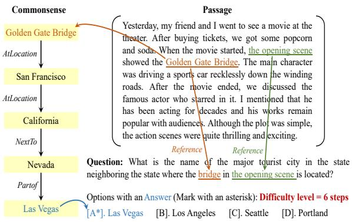  
Figure 1: Sample of commonsense reasoning question, where the underlined clue words and arrowed relations can form a multi-hop reasoning chain to the answer.

To address these problems, we propose a highly controllable generation framework to produce commonsense reasoning questions from easy to hard. In detail, we first extract entities and relations from the given text and view them as potential reasoning clues. To supplement the missing but indispensable commonsense, we resort to the large language models (LLMs), which are reported to contain a wide range of knowledge. We retrieve related commonsense entities from LLMs based on the extracted entities and typical relations, from which we can acquire a collection of triples. For each triple, we generate an initial simple sub-question by using one entity and relation as the asking points, and the other entity as the answer. To enhance fluency, we introduce soft templates to regularize the generator. Since each sub-question corresponds to a single reasoning step, multiple sub-questions can be combined into a complex question with multi-hop reasoning. For example, given two one-hop subquestions ‘Where is the Statue of Liberty located in?’ and ‘Which country is bounded on the United States?’ we can merge them based on a certain reasoning structure to create a two-hop question ‘Which country is bounded on the country where the Statue of Liberty located in?’ Similarly, this question can be used as a building unit to compose more complex results. To achieve this composition under control, we design a prompted chain-of thought QG model. It starts with a set of simple sub-questions and gradually evolves into a complex question. The answer to each sub-question serves as the reasoning clue of the complex one. Each composition increases one order of difficulty. In this way, we can explicitly model the reasoning process to augment the model’s controllability. This divide-and-conquer composition strategy not only improves the logical fluency of results but also provides interpretability for the generation. To promote results’ diversity, we exploit a pool of exemplars. By sampling, we can form various prompts to derive multiple reasonable questions. Their quality is examined by a voting verifier, which simultaneously considers the requirements of answer consistency, reasoning difficulty, and context cor relation. This verifier can be learned jointly with the generator by iterative optimization. Finally, we output high-quality reasonable results at a given difficulty level. Extensive experimental results on two typical datasets show the effectiveness of our framework.

The main contributions of this paper include,

• We reveal the compelling needs of complex question with commonsense reasoning ability and point out the challenges of its controllability on generation, which is new for this task.

• We propose a new controllable model, which divides a complex QG problem into multiple smaller tasks of sub-questions composition. Under the guidance of prior reasoning structures, the results require commonsense reasoning and have desired difficulties.

• We conduct a series of experiments to verify the effectiveness of our method in yielding reasonable results under control.

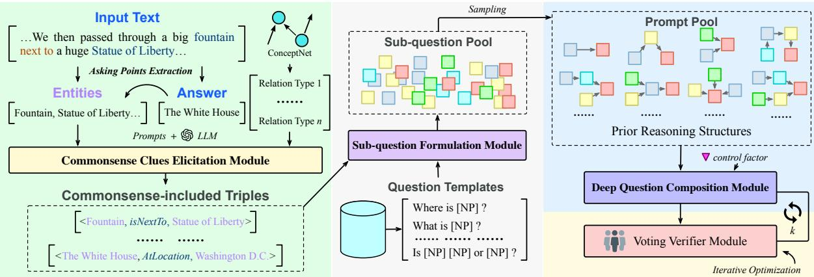  
Figure 2: Overview of our approach for generating complex questions with commonsense reasoning ability.

## 2 Approach

Our QG task aims to yield the optimal question ye with a certain complexity based on a given passage x and a control factor d indicating the complexity level, as Equation 1. Since many questions can be asked about x, we provide an answer a as input to indicate the asking direction. ye needs to satisfy several linguistic requirements, such as fluency and valid syntax. Also, it should be solvable by a. The answering process requires reasoning over a wider range of knowledge, including contextual entities and relations in x, and external commonsense knowledge. The size of reasoning steps can control the complexity. If the step is 1, it is a shallow question; otherwise, it is a d-order complex one. As shown in Figure 2, our framework first retrieves contextual and commonsense entities and relations as potential asking clues. Each clue can be formalized as a sub-question. We then iteratively merge multiple sub-questions into a more complex question. We further explore a verifier to reversely check its rationality from an answering perspective. Next, we elaborate on each component.

$$
\widetilde { y } = \arg \operatorname* { m a x } _ { y } p ( y | x , a , d ) .\tag{1}
$$

## 2.1 Ask-related Clues Retrieval

Given a text, a question is often asked about certain contextual entities and relations, as well as some commonsense facts. These clues are logically correlated with each other which can form a reasoning path to the answer. They can be viewed as primitive elements to create questions. Existing methods mostly ignore this path (Chen et al., 2023), making it difficult to produce to-the-point and reasonable questions. In contrast, we retrieve clues tailored to the question to build a reasoning chain and use it to guide the generation. We acquire the clues as a set of triples $S = S _ { T } \cup S _ { C }$ , with the form of $( h , r , t )$ where r is the relation, h and t represent the head and tail entity, respectively, $S _ { T }$ denotes the clues from the text context, S is the commonsense ones.

```prolog
Prompt Samples
#1 rel(UsedFor) : [Subject] can be used for [Object].
#2 rel(AtLocation) : [Subject] is located in [Object].
#n-1 rel(MadeOf) : [Subject] is made of [Object].
#n rel(Causes) : [Subject] will lead to [Object].
```  
Table 1: Prompt exemplar to elicit commonsense facts.

In detail, we first extract entities and relations in the text by a dependency parser (Dozat and Manning, 2017). Each pair of entities and their relation can be formed as a triple $t \in S _ { T }$ . We then gain text-related commonsense knowledge. One simple way is to retrieve it from an external knowledge graph (KG), but its coverage is limited. We would suffer from the problems like entity alignment, relation resolution, etc. We thus propose to elicit commonsense facts by prompting large language models (LLMs). Benefiting from pretraining on massive data, LLMs have a broader coverage of commonsense facts than KG. As shown in Table 1, we carefully design a set of prompts. Each of them takes an entity and a relation type as input, and inquires LLMs to retrieve the top result as a commonsense entity. This entity is often a single word or short phrase instead of a long free text. We use some classical commonsense relations to design the prompts, such as (Subject, Relation, Object), where Subject and Object are the placeholders. Given a text, we first use a parser to extract its entities. We then replace one of the placeholders with the extracted entity to inquire LLMs, which can derive another entity to form a triple. We acquire 12 groups of classical commonsense relations by referring to the knowledge graph of ConceptNet 5 (Speer et al., 2017), including (1) {RelatedTo, Synonym, SymbolOf, SimilarTo, ExternalURL}, (2) {FormOf, DerivedFrom, EtymologicallyRelatedTo, EtymologicallyDerivedFrom}, (3) {UsedFor, CapableOf}, (4) {PartOf, HasA, HasContext}, (5) {AtLocation, LocatedNear}, (6) {Causes, HasSubevent, HasFirstSubevent, HasLastSubevent, HasPrerequisite, MotivatedByGoal, ObstructedBy, CausesDesire}, (7) {HasProperty}, (8) {Desires}, (9) {CreatedBy, MadeOf}, (10) {Antonym, DistinctFrom}, (11) {IsA, DefinedAs, MannerOf}, and (12) {ReceivesAction}. Some uninformative relations are not commonly used in typical commonsense reasoning. We thus filter out them, e.g., ExternalURL, FormOf, and MannerOf. For this simple one-order fact retrieval task, LLMs have high accuracy. We have tried the hybrid methods such as KG+LLMs and found they are too heavy and unsuitable for our task. The outputted entities can be used to prompt higher-order commonsense entities. By repeatedly k rounds, we can gather k-order commonsense triples $S _ { C }$

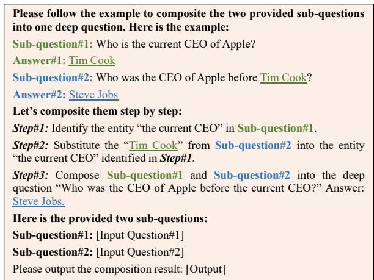  
Figure 3: The chain-of-thought prompts for compositing two sub-questions.

## 2.2 Basic Sub-questions Formulation

A complex question can be usually broken down into a series of simpler sub-questions (Deng et al., 2022). Each corresponds to one reasoning step, thus forming a reasoning chain to the answer. Reversely, these sub-questions should be able to be composed back into a complex one. Inspired by this observation, we create a series of sub-questions as the basic building blocks for composition.

$$
q = B A R T _ { \delta } ^ { D e c o d e r } ( \mathbf { g } _ { 1 } , \dots , \mathbf { g } _ { | z | } ) .\tag{2}
$$

Concretely, we can generate the one-hop sub question for each retrieved triple by using one entity as the answer, and the rest as the asking objects. To obtain results with better fluency and grammar, we introduce question templates to guide the generation. Following previous work (Cao and Wang, 2021), we can extract question templates from a large amount of unlabeled data. For each question, we iteratively replace words with their synonyms until 80% of words are substituted. That can retain the core semantics while generalizing the surface form. We then substitute phrasal units with POS tags, such as [NP] for noun phrases, [V] for verbs, etc. The words are abstracted into coarse syntactic templates, as Table 2. That allows the templates to be domain-independent and more generalized. To promote results’ diversity, we exploited a pool of template exemplars for each question type. By sampling on the pool, we can collect different exemplars in each generation, which can help to derive multiple reasonable sub-questions. Afterward, we retrieve one template related to the triple based on the matching relation type. For example, for the triple (New York, AtLocation, the United States), we use type matching to find appropriate templates “Which city is located in [NP]?” and “Where is [NP]?” to generate “Which city is located in the United States?” and “Where is New York?” etc. Based on the retrieved template, we yield a sub-question for each triple. Since it is a simple factoid QG, we use BART model instead of other LLMs-based methods. The reason is that the BART model has been fine-tuned, it is better at this task than the generic LLMs. To reduce computational costs, we leverage the prefix-tuning technique (Li and Liang, 2021). In detail, we first aggregate the prefix pr, the raw text of triple t and template $u _ { t } \ \mathrm { a s } \ z = [ p r ; t ; u _ { t } ]$ and feed it into the encoder. The hidden state $\mathbf { g } = [ \mathbf { X } _ { p r } , \mathbf { X } _ { t t } ]$ of the encoder consists of two parts. $\mathbf { X } _ { p r }$ is the encoding of $p r$ . Its i-th element is calculated as $\begin{array} { r } { \mathbf { g } _ { i } = \mathbf { W } _ { \alpha } [ i , : ] , } \end{array}$ where $\mathbf { W } _ { \alpha }$ is a learnable matrix. $\mathbf { X } _ { t t }$ records the encoding of the rest of z. The j-th token is encoded as ${ \bf g } _ { \vert p r \vert + j } = B A R T _ { \delta } ^ { E n c o d e r } ( z _ { \vert p r \vert + j } , { \bf g } _ { < \vert p r \vert + j } )$ . The decoding can be calculated as Equation 2. During training, the model parameter δ is frozen and we learn only a few prefix parameters α. Finally, we can produce a pool of sub-questions $Q = \{ q _ { j } \} _ { j = 1 } ^ { | S | }$ for all triples.

<table><tr><td rowspan=1 colspan=1>Question Type</td><td rowspan=1 colspan=1>Templates Samples</td></tr><tr><td rowspan=1 colspan=1>Disjunctive</td><td rowspan=1 colspan=1>&quot;Is [NP] [NP] or [NP] ?&quot;, &quot;Who is [NP] or [NP] ?&quot;, &quot;Which is [NP] or [NP] ?&quot;, &quot;What is [NP] [NP] ?&quot;, etc</td></tr><tr><td rowspan=1 colspan=1>Concept</td><td rowspan=1 colspan=1>&quot;What is [NP ] ?&quot;, &quot;Who is [NP ] ?&quot;, &quot;Where is [NP ] ?&quot;, &quot;Where does [NP] come from?&quot;, &quot;What is [NP ] made of?&quot;, etc</td></tr><tr><td rowspan=1 colspan=1>Extent</td><td rowspan=1 colspan=1>&quot;How [OTHER] is [NP ]&quot;, &quot;How many [NP ] ?&quot;, &quot;How [V] is [NP ] ?&quot;, &quot;How much does/do [NP ] ?&quot;, etc</td></tr><tr><td rowspan=1 colspan=1>Example</td><td rowspan=1 colspan=1>&quot;What does [NP] have?&quot;, &quot;What is a good [NP] ?&quot;, &quot;Where can [NP] [V] [NP]?&quot;, &quot;Does [NP] [V] [NP] ?&quot;, etc</td></tr><tr><td rowspan=1 colspan=1>Consequence</td><td rowspan=1 colspan=1>&quot;What is the result of the [NP ] ?&quot;, &quot;How does [NP ] affect [NP ] ?&quot;, &quot;What are [NP] effects [NP ] ?&quot;, etc</td></tr></table>

Table 2: Template examples for different question types.

## 2.3 Compositional Deep Question Generation

Next, we leverage these simpler sub-questions to gradually reassemble complex questions in a building block manner. These complex questions require deep reasoning based on context and implicit commonsense knowledge. The number of reasoning steps control the question’s complexity. Through multi-step composition, we can increase the questions’ difficulty level progressively. There are two main stages, one is to select suitable subquestions, and the other is to merge them into a larger one. Such a result can be used to compose higher-order questions iteratively. That can improve interpretability and allow us to effectively control the intermediate inference process, thereby obtaining better results.

(1) Discovery of Composable Sub-question Pairs. The pairs should follow a certain kind of logical correlation to make results reasonable and answerable. To facilitate manipulation, we exploit an enumeratethen-verify strategy by sampling potential pairs from the sub-question pool. We only accept the pair $( q _ { i } , a _ { i } )$ and $( q _ { j } , a _ { j } )$ and view them as correlated if $a _ { i }$ is an entity mentioned in $q _ { j }$ . Considering some semantically identical entities may have various expressive forms, we use toolkit Spacy (Honnibal and Montani, 2017) to align them. Further, we stipulate that $a _ { j }$ should not be in $q _ { i }$ to avoid reasoning loops. (2) Formation of Higher-order Questions. Complex commonsense questions often contain reasoning structures, which are crucial for the asking direction. We thus design several typical structures as prior knowledge to guide the generation, covering nearly all reasoning types with 2 ∼ 4 hops in mainstream applications and datasets. Each structure is a directed acyclic graph, where the node represents a sub-question and the edge denotes the inferential relation. To transform a set of composable sub-questions $Q _ { k } \subseteq Q$ into a complex question, the simple way is to train a classic Seq2Seq model. However, this model relies heavily on a large amount of training data. The data requires labeling on each reasoning step, which is unavailable in current datasets. Also, manual labeling is expensive. To address this problem, we resort to LLM which is a powerful few-shot learner. We design chain-of-thought prompts to direct LLM, taking advantage of its superior in-context learning capability to help produce results that merge multiple sub-questions. Figure 3 shows an exampler for compositing two sub-questions into a higher-order one. The prompt of the k-th reasoning structure consists of an instruction, some exemplars, inputs, and an output placeholder. Considering that a question can be asked in various expressive ways, we develop multiple prompts to acquire this ability. We gather a set of exemplars $D _ { j }$ for the j-th reasoning type, see Appendix A. By sampling a subset $\hat { D } _ { j }$ from $D _ { j }$ as input, we can form diverse prompts instead of a single fixed prompt. That facilitates to decode several deep questions $Q _ { j }$ for each set of sub-questions $S Q _ { j }$ by Equation 3, where $p _ { \theta }$ denotes GPT-3 with nucleus sampling where $p =$ 0.5 (Holtzman et al., 2020) and the sampling size is 8.

$$
{ Q } _ { j } = \{ y | y = { p } _ { \theta } ( p r o m p t _ { j } ( S Q _ { j } , \hat { D } _ { j } ) \} .\tag{3}
$$

## 2.4 Voting Verifier to Ensure Validity

The compositional results may not meet the syntactic and semantic requirements of commonsense reasoning questions. They are not necessarily indepth questions but simple and shallow ones. For example, for a compositional question with several clauses, the answer could be found in the text by simple matching rather than complex reasoning with latent commonsense knowledge (Shaheer et al., 2023). Also, the desired difficulty level may not be met, where the answer may be obtained by shortcut matching, no reasoning is needed. To tackle this problem, we develop a verifier to measure the quality of results fully. It is a voting classifier with multiple weighted criteria. Following the previous work (Yu et al., 2025), we score each question based on three aspects, including answer consistency, reasoning difficulty and context correlation. The question with the highest score is outputted. This generate-then-verify framework can also filter unsatisfactory results caused by error propagation.

Answer Consistency. A good question should match the given answer, but a bad combination might make the question unsolvable. To check the solvability, we utilize a strong commonsense reasoning QA model called UNICORN (Lourie et al., 2021) to predict the question’s answer. This model has a high and human-close accuracy, nearly 92% in Cosmos QA dataset. We verify the question in terms of the answer consistency by computing the cosine similarity of the DeBERTa-v3-large embeddings (He et al., 2021) of the answer obtained by UNICORN and the given one.

Reasoning Difficulty. In addition, we inspect the question’s satisfaction on complexity, including avoidance of reasoning shortcuts to meet the expected difficulty level, and the amount of commonsense knowledge covered. To analyze these procedural details, we first parse the question into an AMR tree (Deng et al., 2022). Each sub-tree should correspond to a sub-question. Its height indicates reasoning steps. We calculate the total height and compare it to the given difficulty level. A large score means that the complexities are similar. To detect shortcuts, we often require a reasoning chain as a gold standard, but this chain is unprovided. Since the ground truth answer is given, we resort to an indirect way by using a simple matching QA model, named GA (Dhingra et al., 2017). If a commonsense question can be solved by this model, there is most likely to be a shortcut. Based on this motivation, we compare the answer obtained by GA to the real one based on similarity. Similarly, we check shortcuts in the intermediate reasoning step for each sub-question. To facilitate separation analysis, we replace the answer in the previous step with the corresponding sub-tree to form an isolated sub-question. Afterward, we take the result of the reasoning model as its reference answer, and perform a step-aware comparison to that of the GA model. In addition, we observe that if the answer to a sub-question does not appear in the text, it is likely to involve external commonsense knowledge. We thus verify whether the answer to each sub-question exists in the text based on inverse fuzzy match. Smaller matches make greater value, leading to a bigger likelihood of commonsense knowledge coverage.

Context Correlation. A good question is expected to ask about the input contexts instead of out-ofscope (Dara et al., 2023). We verify this through comparing the difference between the BiDAF (Seo et al., 2017) encodings of question-aware context and context-aware question.

## 3 Evaluations

We conduct experiments to fully evaluate our method in both qualitative and qualitative aspects.

## 3.1 Data and Experimental Settings

QG can be seen as a reverse task of QA. Thus, we carried out evaluations on two typical QA datasets, i.e., Cosmos QA (Huang et al., 2019) and MCScript 2.0 (Ostermann et al., 2018). These two sets were crowd-sourced, with 35.6k and 20k samples, respectively. Most of them needed commonsense reasoning ability. That is more suitable than other datasets to evaluate our task. Three classical metrics in generation tasks were utilized for evaluation, including BLEU-4 (Papineni et al., 2002), ME-TEOR (Banerjee and Lavie, 2005), and ROUGE-L (Lin, 2004). The metric values would be larger when the generated question can well match the ground truth. Considering a good question should match the answer, we utilized a typical QAScore (Ji et al., 2022) metric to analyze results from the answering view. It ranged from negative infinity to 0, where a lower score indicated better quality. Our whole algorithm and the implementation details are shown in Appendix B and C respectively.

## 3.2 Comparisons Against State-of-the-Arts

We compared our method against six mainstream QG models, including (a) UniLM (Dong et al., 2019), a strong transformer-based model, with pretrain then fine-tuned technique to adapt to the QG task; (b) DCSSR (Cheng et al., 2021), a step-wise model by rewriting with bridge and intersection question types; (c) SemQG (Zhang and Bansal, 2019), an adversarial model with several reinforced rewards to promote answer-related questions; (d) CRQG (Yu et al., 2023b), which yielded reasonable results controlled by key latent factors obtained from disentangled inference; (e) KGQG (Chen et al., 2024), a graph-to-sequence model that is guided by the KG subgraph; (f) SGSH (Guo et al., 2024), a prompt-based method which generated

<table><tr><td>Datasets</td><td colspan="4">Cosmos QA</td><td colspan="4">MCScript</td></tr><tr><td>Methods</td><td>BLEU-4</td><td>METEOR</td><td>ROUGE-L</td><td>QAScore</td><td>BLEU-4</td><td>METEOR</td><td>ROUGE-L</td><td>QAScore</td></tr><tr><td>UniLM</td><td> $1 8 . 4 3 \pm 3 . 7 \%$ </td><td> $2 1 . 2 5 \pm 2 . 6 \%$ </td><td> $3 9 . 9 5 \pm 4 . 7 \%$ </td><td> $- 1 . 1 2 7 \pm 1 . 6 \%$ </td><td> $1 4 . 5 9 \pm 2 . 5 \%$ </td><td> $1 8 . 8 4 \pm 5 . 1 \%$ </td><td> $3 6 . 1 1 \pm 1 . 9 \%$ </td><td> $- 1 . 1 5 4 \pm 4 . 3 \%$ </td></tr><tr><td>DCSSR</td><td> $1 8 . 4 7 \pm 5 . 2 \%$ </td><td> $2 1 . 8 8 \pm 3 . 1 \%$ </td><td> $3 9 . 4 2 \pm 4 . 1 \%$ </td><td> $- 1 . 0 9 3 \pm 2 . 2 \%$ </td><td> $1 4 . 6 2 \pm 1 . 9 \%$ </td><td> $1 9 . 1 3 \pm 3 . 3 \%$ </td><td> $3 5 . 8 4 \pm 4 . 2 \%$ </td><td> $- 1 . 1 2 2 \pm 4 . 6 \%$ </td></tr><tr><td>SemQG</td><td> $1 8 . 5 5 \pm 5 . 1 \%$ </td><td> $2 2 . 7 6 \pm 3 . 2 \%$ </td><td> $4 0 . 2 6 \pm 2 . 7 \%$ </td><td> $- 1 . 0 4 2 \pm 4 . 8 \%$ </td><td> $1 4 . 8 9 \pm 2 . 6 \%$ </td><td> $2 0 . 1 7 \pm 4 . 9 \%$ </td><td> $3 6 . 3 9 \pm 3 . 4 \%$ </td><td> $- 1 . 0 8 0 \pm 2 . 4 \%$ </td></tr><tr><td>CRQG</td><td> $2 0 . 1 7 \pm 4 . 4 \%$ </td><td> $2 2 . 3 3 \pm 3 . 9 \%$ </td><td> $4 0 . 8 5 \pm 2 . 6 \%$ </td><td> $- 1 . 0 3 7 \pm 3 . 8 \%$ </td><td> $1 5 . 9 2 \pm 4 . 3 \%$ </td><td> $2 0 . 1 9 \pm 3 . 5 \%$ </td><td> $3 7 . 4 7 \pm 5 . 2 \%$ </td><td> $- 1 . 0 5 4 \pm 4 . 3 \%$ </td></tr><tr><td>KGQG</td><td> $2 0 . 5 4 \pm 3 . 1 \%$ </td><td> $2 2 . 8 0 \pm 1 . 4 \%$ </td><td> $4 1 . 7 7 \pm 2 . 7 \%$ </td><td> $- 1 . 0 3 4 \pm 2 . 2 \%$ </td><td> $1 6 . 3 5 \pm 1 . 9 \%$ </td><td> $2 0 . 2 1 \pm 3 . 2 \%$ </td><td> $3 7 . 8 1 \pm 4 . 6 \%$ </td><td> $- 1 . 0 4 6 \pm 3 . 5 \%$ </td></tr><tr><td>SGSH</td><td> $2 0 . 8 3 \pm 2 . 6 \%$ </td><td> $2 2 . 8 8 \pm 3 . 1 \%$ </td><td> $\underline { { 4 2 . 1 6 } } \pm 2 . 8 \%$ </td><td> $- 1 . 0 2 8 \pm 2 . 7 \%$ </td><td> $\underline { { 1 6 . 4 1 } } \pm 1 . 6 \%$ </td><td> $\underline { { 2 0 . 3 0 } } \pm 4 . 2 \%$ </td><td> $3 8 . 1 1 \pm 4 . 7 \%$ </td><td> $- 1 . 0 3 9 \pm 2 . 0 \%$ </td></tr><tr><td>Ours</td><td> $2 2 . 7 4 \pm 4 . 1 \%$ </td><td> $2 5 . 0 7 \pm 2 . 9 \%$ </td><td> $4 5 . 5 4 \pm 5 . 2 \%$ </td><td> $\mathbf { - 0 . 9 9 2 } \pm 5 . 2 \%$ </td><td> $1 7 . 8 4 \pm 1 . 6 \%$ </td><td> $2 1 . 8 4 \pm 3 . 8 \%$ </td><td> $\mathbf { 4 1 . 3 5 \pm 4 . 3 \% }$ </td><td> $\mathbf { - 1 . 0 0 4 } \pm 3 . 4 \%$ </td></tr></table>

Table 3: Comparisons of all methods. The improvement achieved by our model is significant (p-value $< 0 . 0 0 5 )$

## 3.3 Ablation Studies

To further gain insight into the relative importance of the components in our QG approach, we conducted empirical ablation studies on four key parts, including (1) w/o CIM which dropped the promptbased retrieval module used to supplement external commonsense knowledge; (2) w/o SqFM that removed the asking templates and generated subquestions without the template guidance; (3) w/o questions based on knowledge base using a soft prompt. We reimplemented these open-source baselines following their original settings, as shown in Appendix C.

As illustrated in Table 3, we presented the comparison results in terms of four evaluation metrics and their associated variances. We observed that the Ours obtained the best performance. That indicated the reasoning graph structure implied in the text was useful for the complex QG task. Without the structure (e.g. UniLM and DCSSR), we would lack the asking logic and direction. Our model outperformed SGSH in terms of BLEU-4, METEOR, ROUGE-L and QAScore by over 9.2%, 9.6%, 8.0% and 3.5%, respectively on the Cosmos QA dataset. Similarly, the outperformance on the MCScript dataset was by over 8.7%, 7.6%, 8.5%, and 3.4%, respectively. The end-to-end LLMs need complex prompt engineering, and it is hard to control the results with commonsense reasoning ability. In contrast, Ours had better flexibility to control to yield reasonable, diverse results with desired complexity. Ours also outperformed KGQG significantly. That reflected the verifier we use can better ensure the question’s quality and complexity than KGQG without this module. Besides, our QG was better than CRQG and SemQG. That showed our effectiveness in modeling the reasoning process explicitly and controlling the complexity by stepwise deductive composition rather than the obscure factors and coarse-grained reinforced rewards.

DQCM which discarded the chain-of-thought module, and substituted it with a sequential QG model to produce results; (4) w/o VVM threw away the voting verifier used to check the generated quality.

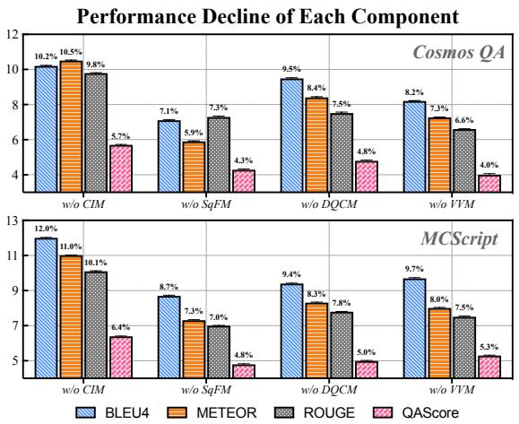  
Figure 4: Ablation studies.

As displayed in Figure 4, the ablation of all evaluated components resulted in a performance decline of more than 4%. That demonstrated each of our proposed components played a crucial role in controlling the difficulty and ensuring the generated quality. Without the retrieval of commonsense, we would lack some key relations and entities to form a reasoning chain. That led to insufficient guiding signals to indicate the asking direction, thereby harming the questions’ deductibility. Dropping the templates in the sub-question generation part, we lacked constraints on the question structure and format, resulting in poor coherence and grammar. Without the inspiration of the chain of thought and exemplar, it was difficult to generate satisfactory questions with a certain complexity in the case of low resources. If the verifier was absent, we could not ensure the results were inferable and answerable with the desired difficulty. The verifier judged the results’ quality from multiple aspects, which provided useful feedback for model optimization.

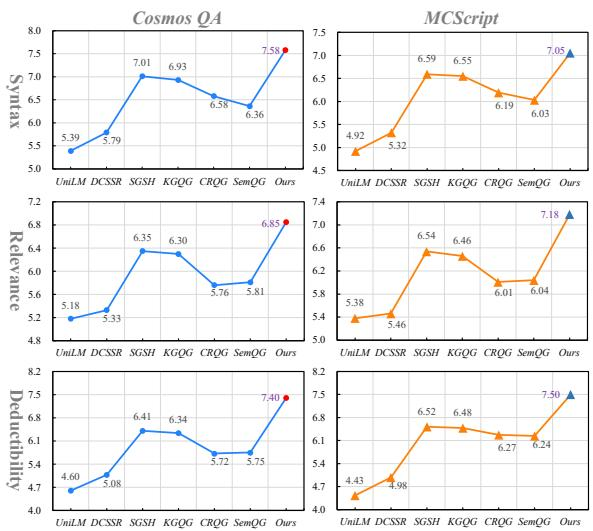  
Figure 5: Human evaluations.

In addition, we replaced LLMs with various KGs for commonsense knowledge. The performance decreased by at least 3.41%, 4.07%, 3.22%, and 3.04% on Cosmos QA, and 3.77%, 3.63%, 4.47%, and 3.30% on MCScript 2.0, in terms of BLEU-4, METEOR, ROUGE-L, and QAScore, respectively.

## 3.4 Human Evaluations and Analyses

Considering that the automatic metrics may not well reflect the questions’ quality, we conducted human evaluations. The evaluated settings were given Appendix D. As shown in Figure 5, our model significantly surpassed all baselines in all metrics, especially in terms of the deductibility metric. That was consistent with the observations in Section 3.2. All metrics were rated as moderate agreement on the Kappa statistic (Viera and Garrett, 2005). We can infer that our controllable framework could derive high-quality commonsense questions with the help of an easy-to-hard compositional paradigm.

Moreover, we evaluated the complexity controllability. After randomly selecting 500 test samples from the evaluated datasets, we labeled the difficult levels of these samples’ questions manually. We observed 10.2% was 1-hop, 35.6% was 2-hop, 39% was 3-hop, and the remaining 15.2% involved more than 3 hops. We fed these samples into the evaluation models and labeled the difficulty levels of the generated questions. The matched ratio was computed as the proportion of generated results whose difficulty levels were consistent with the ground truth. That matched ratio were 19.4%, 15.7%, 25.6%, 19.4%, 17.1%, and 22.1% for the baselines (a) ∼ (f), respectively. In contrast, our model outperformed all baselines significantly, achieving a matched ratio of 84.3%. That showed our model has a good control ability of complexity.

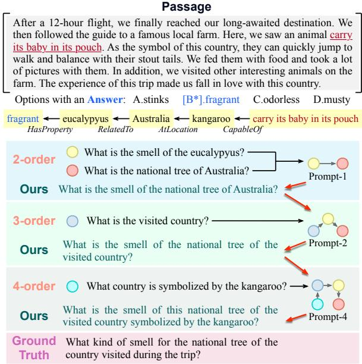  
Figure 6: Case study of our proposed method.

## 3.5 Case Studies and Discussions

Moreover, we conducted case studies to further analyze the pros and cons of our model. As shown in Figure 6, the passage described a travel experience, containing entities about the country, animal, and plant. Based on this input, we retrieved a set of triples, including related commonsense, to construct multiple sub-questions. Following the prior reasoning structure, we then select some subquestions to compose complex ones step-by-step. To answer our deep question in 4-level complexity, we need reasoning over multiple pieces of facts, such as the context ‘Kangaroo often carries its baby in its pouch,’ and commonsense knowledge of ‘It is the symbol animal in the country Australia, ‘Eucalypyus is the national tree ofAustralia,’ ‘The tree smell is fragrant.’ This progressive generation could not only yield high-quality commonsense questions but also control the complexity according to the size of reasoning steps.

## 4 Related Work

Learning to ask questions is important for humans to explore the unknown world (Ang et al., 2023). A thought-provoking question can stimulate the self-learning enthusiasm of students. Teaching machines to ask can help them self-evolute to high intelligence. That can support a wide range of applications (Liang et al., 2023a), such as generating questions tailored to the textbook as quizzes for online education, etc. However, it is not easy to ask tothe-point questions, which involve the comprehension of abstract semantics in the text, sophisticated asking patterns, answerable constraints (Lim et al., 2020), etc. Thus, question generation (QG) has become a hot research topic (Naeiji et al., 2023). Previous work has mainly studied shallow questions whose answers can be easily obtained by extracting the most matching text span (Wang et al., 2020). However, simple matching is inadequate to meet daedal application needs (Zhang et al., 2024), such as advanced exams often requiring questions with various difficulty levels to fully measure the learning effect (Hadifar et al., 2023). Researchers gradually turn to complex questions, such as the multihop ones which need to reason over disjoint relevant clues. Kulshreshtha and Rumshisky (2023) summarized multi-hop questions into bridge and comparison types, and designed 13 fixed generative tasks based on these types to transform the given text and answer into multi-hop questions. This method lacks flexibility and the coverage of reasoning types is insufficient. Unlike these clues limited only to the contexts in a single text, our new proposed task involves broader knowledge sources, including the valuable commonsense embodied in the text. Since this kind of implicit knowledge is more applicative, the generated questions are more profound and practical (Arabshahi et al., 2021).

For the QG task, existing work could be summarized into three categories (Zhang et al., 2022). The manual method is based on crowdsourcing (Trivedi et al., 2022), which is labor-intensive. Another is based on hand-crafted rules (Mazidi and Nielsen, 2014) or templates (Dhole and Manning, 2020), but this method is poorly scalable. Current work turns to the neural approach (Do et al., 2023), which is data-driven and flexible (Yu et al., 2020). It mainly learns to map the input text into questions by using the encoder-decoder framework (Wang et al., 2023). However, it usually struggles to produce commonsense-aware results since this knowledge is hidden and cannot be learned directly from training data (Liu et al., 2021). To tackle this problem, some works tried to collect related commonsense triples from a knowledge graph (Li et al., 2023) and inject them to augment the encoder (Xin et al., 2021). That is too rough to model the sophisticated but crucial reasoning process. Their results are almost single-hop, which could be answered by shortcut matching, without a need for commonsense reasoning (Yu et al., 2022). Yu et al. (2023c) proposed to yield commonsense reasoning questions by disentangling key factors related to the necessary asking contents and expression ways. Liang et al. (2023b) utilized chain-of-thought prompts to guide LLMs to generate commonsense questions. However, these methods lack effective mechanisms to control the question complexity. Gao et al. (2019) defined complexity based on whether the question can be correctly answered. They proposed to use it to control the generation. Kumar et al. (2019) used named entity popularity in the knowledge graph to estimate complexity and embedded it as guidance for the decoder. In addition, Bi et al. (2024) identified complexity by ensembling multiple metrics, such as the range of domains the question entities involved, and the number of clauses in the question. In contrast, we explicitly model the commonsense reasoning process and its structure. Besides, we flexibly control the complexity according to the number of reasoning steps, making the result more controllable and interpretative.

## 5 Conclusion

We explored a new task of generating commonsense reasoning questions with controlled complexity. Different from shallow QG task, our question involves a boarder range of knowledge, including the text context and external commonsense knowledge. It is more challenging than traditional multihop QG which only asks about a closed context. We proposed a controllable framework based on an easy-to-hard paradigm. We first extracted potential contextual and commonsense clues based on a given text. Each triple of these clues corresponds to a reasoning step and can be formulated as a subquestion. We then used these simple sub-questions as building blocks to compose complex questions step-by-step under the guidance of prior reasoning structures. By adjusting the composition times, we can control the reasoning steps and the difficulty level of the results. Moreover, we exploited a voting verifier to ensure that the results met the quality requirements. Extensive evaluations on two datasets showed the effectiveness of our method.

## Acknowledgments

This work is supported by the National Natural Science Foundation of China (62276279, 62372483, 62276280, 62306344, U2001211,

U22B2060), Guangdong Basic and Applied Basic Research Foundation (2024B1515020032), and Research Foundation of Science and Technology Plan Project of Guangzhou City (2023B01J0001, 2024B01W0004).

## Limitations

Our controllable framework generates questions of desired complexity from easy to hard by combining sub-questions continuously. The initial subquestions are generated based on triple clues, which are extracted from the context and implicit commonsense knowledge. Although we propose a voting verifier to ensure the quality of results, our method suffers from some bad cases in terms of grammar. For example, “drive” needs to be rectified to “drives” when the subject is third person singular. We will investigate the grammar error in future work.

## Ethics Statement

We focus on a new QG task, which is more challenging than the existing QG. For example, for the shallow or multi-hop questions, their answers and all the reasoning clues can be found within the given text. No external commonsense knowledge is needed, and no commonsense inference is required. That can be viewed as a close-domain task, that is, the answering process is limited to a closed context. In contrast, our questions need a boarder range of knowledge. The answer involves multiple open contexts, including text and commonsense knowledge. The technology proposed in this paper can be used in many applications. For example, it can be used as a data augmentation way to tackle the data scarcity problem in QA systems; it can ask questions to inquire about users’ real needs for the dialog agent. Unlike traditional methods, we can yield questions with various difficulty levels. The complex question involves high-order reasoning. Excluding the misusage situations, there are few or even no ethical issues with this technology. However, malicious users may intentionally trick the model into producing bad content, which will lead to social disruption. To address this issue, we have to verify and monitor the quality of input.

## References

Said Al Faraby, Adiwijaya Adiwijaya, and Ade Romadhony. 2023. Review on neural question generation

for education purposes. In Journal ofInternational Journal of Artificial Intelligence in Education, pages 1–38.

Beng Heng Ang, Sujatha Das Gollapalli, and See-Kiong Ng. 2023. Socratic question generation: A novel dataset, models, and evaluation. In Proceedings of the 17th Conference of the European Chapter of the Association for Computational Linguistics, pages 147–165, Dubrovnik, Croatia.

Forough Arabshahi, Jennifer Lee, Mikayla Gawarecki, Kathryn Mazaitis, Amos Azaria, and Tom M. Mitchell. 2021. Conversational neuro-symbolic commonsense reasoning. In Proceedings of the Thirty-Fifth AAAI Conference on Artificial Intelligence, pages 4902–4911, Vancouver, Canada.

Satanjeev Banerjee and Alon Lavie. 2005. METEOR: An automatic metric for MT evaluation with improved correlation with human judgments. In Proceedings of the ACL Workshop on Intrinsic and Extrinsic Evaluation Measures for Machine Translation and/or Summarization, pages 65–72, Ann Arbor, Michigan, USA.

Sheng Bi, Jianyu Liu, Zeyi Miao, and Qizhi Min. 2024. Difficulty-controllable question generation over knowledge graphs: A counterfactual reasoning approach. In Journal of Information Processing and Management, 61(4):103721.

Shuyang Cao and Lu Wang. 2021. Controllable openended question generation with a new question type ontology. In Proceedings ofthe 59th Annual Meeting ofthe Associationfor Computational Linguistics and the 11th International Joint Conference on Natural Language Processing, pages 6424–6439, Online.

Yu Chen, Lingfei Wu, and Mohammed J. Zaki. 2023. Toward subgraph-guided knowledge graph question generation with graph neural networks. In Journal of IEEE Transactions on Neural Networks and Learning Systems, pages 1–12.

Yu Chen, Lingfei Wu, and Mohammed J. Zaki. 2024. Toward subgraph-guided knowledge graph question generation with graph neural networks. IEEE Trans. Neural Networks Learn. Syst., 35(9):12706–12717.

Yi Cheng, Siyao Li, Bang Liu, Ruihui Zhao, Sujian Li, Chenghua Lin, and Yefeng Zheng. 2021. Guiding the growth: Difficulty-controllable question generation through step-by-step rewriting. In Proceedings ofthe 59th Annual Meeting of the Association for Computational Linguistics and the 11th International Joint Conference on Natural Language Processing, pages 5968–5978, Online.

Suresh Dara, CH. Srinivasulu, CH Madhu Babu, Ananda Ravuri, Tirumala Paruchuri, Abhishek Singh Kilak, and Ankit Vidyarthi. 2023. Context-aware auto-encoded graph neural model for dynamic question generation using nlp. In Journal of ACM Transactions on Asian and Low-Resource Language Information Processing.

Zhenyun Deng, Yonghua Zhu, Yang Chen, Michael Witbrock, and Patricia Riddle. 2022. Interpretable amrbased question decomposition for multi-hop question answering. In Proceedings of the Thirty-First International Joint Conference on Artificial Intelligence, pages 4093–4099, Vienna, Austria.

Bhuwan Dhingra, Hanxiao Liu, Zhilin Yang, William W. Cohen, and Ruslan Salakhutdinov. 2017. Gatedattention readers for text comprehension. In Proceedings of the 55th Annual Meeting of the Association for Computational Linguistics, pages 1832–1846, Vancouver, Canada.

Kaustubh D. Dhole and Christopher D. Manning. 2020. Syn-qg: Syntactic and shallow semantic rules for question generation. In Proceedings ofthe 58th Annual Meeting ofthe Associationfor Computational Linguistics, pages 752–765, Online.

Xuan Long Do, Bowei Zou, Shafiq R. Joty, Anh Tran Tai, Liangming Pan, Nancy F. Chen, and Ai Ti Aw. 2023. Modeling what-to-ask and how-to-ask for answer-unaware conversational question generation. In Proceedings of the 61st Annual Meeting of the Association for Computational Linguistics, pages 10785–10803, Toronto, Canada.

Li Dong, Nan Yang, Wenhui Wang, Furu Wei, Xiaodong Liu, Yu Wang, Jianfeng Gao, Ming Zhou, and Hsiao-Wuen Hon. 2019. Unified language model pre-training for natural language understanding and generation. In Proceedings of the Advances in Neural Information Processing Systems, pages 13042– 13054, Vancouver, BC, Canada.

Timothy Dozat and Christopher D. Manning. 2017. Deep biaffine attention for neural dependency parsing. In 5th International Conference on Learning Representations, Toulon, France.

Yifan Gao, Lidong Bing, Wang Chen, Michael R. Lyu, and Irwin King. 2019. Difficulty controllable generation of reading comprehension questions. In Proceedings of the Twenty-Eighth International Joint Conference on Artificial Intelligence, pages 4968–4974, Macao, China.

Shasha Guo, Lizi Liao, Jing Zhang, Yanling Wang, Cuiping Li, and Hong Chen. 2024. SGSH: stimulate large language models with skeleton heuristics for knowledge base question generation. In Findings of the Association for Computational Linguistics, pages 4613–4625, Mexico City, Mexico.

Amir Hadifar, Semere Kiros Bitew, Johannes Deleu, Veronique Hoste, Chris Develder, and Thomas Demeester. 2023. Diverse content selection for educational question generation. In Proceedings of the 17th Conference ofthe European Chapter ofthe Associationfor Computational Linguistics: Student Research Workshop, pages 123–133, Dubrovnik, Croatia.

Pengcheng He, Xiaodong Liu, Jianfeng Gao, and Weizhu Chen. 2021. Deberta: Decoding-enhanced

bert with disentangled attention. In Proceedings of the 9th International Conference on Learning Representations, Vienna, Austria.

Ari Holtzman, Jan Buys, Li Du, Maxwell Forbes, and Yejin Choi. 2020. The curious case of neural text degeneration. In 8th International Conference on Learning Representations, Addis Ababa, Ethiopia.

Matthew Honnibal and Ines Montani. 2017. spacy 2: Natural language understanding with bloom embeddings, convolutional neural networks and incremental parsing. 7(1):411–420.

Lifu Huang, Ronan Le Bras, Chandra Bhagavatula, and Yejin Choi. 2019. Cosmos QA: machine reading comprehension with contextual commonsense reasoning. In Proceedings ofthe Conference on Empirical Methods in Natural Language Processing and the 9th International Joint Conference on Natural Language Processing, pages 2391–2401, Hong Kong, China.

Tianbo Ji, Chenyang Lyu, Gareth J. F. Jones, Liting Zhou, and Yvette Graham. 2022. Qascore - an unsupervised unreferenced metric for the question generation evaluation. In Journal of Entropy, 24(11):1514.

Ziwei Ji, Nayeon Lee, Rita Frieske, Tiezheng Yu, Dan Su, Yan Xu, Etsuko Ishii, Ye Jin Bang, Andrea Madotto, and Pascale Fung. 2023. Survey of hallucination in natural language generation. In Journal ofACM Computing Surveys, 55(12):1–38.

Saurabh Kulshreshtha and Anna Rumshisky. 2023. Reasoning circuits: Few-shot multi-hop question generation with structured rationales. In Proceedings of the 1st Workshop on Natural Language Reasoning and Structured Explanations, pages 59–77, Toronto, Canada.

Vishwajeet Kumar, Yuncheng Hua, Ganesh Ramakrishnan, Guilin Qi, Lianli Gao, and Yuan-Fang Li. 2019. Difficulty-controllable multi-hop question generation from knowledge graphs. In Proceedings ofthe 18th International Semantic Web Conference, pages 382– 398, Auckland, New Zealand.

Yash Kumar Lal, Niket Tandon, Tanvi Aggarwal, Horace Liu, Nathanael Chambers, Raymond Mooney, and Niranjan Balasubramanian. 2022. Using commonsense knowledge to answer why-questions. In Proceedings of the 2022 Conference on Empirical Methods in Natural Language Processing, pages 1204–1219, Abu Dhabi, United Arab Emirates.

Xiang Lisa Li and Percy Liang. 2021. Prefix-tuning: Optimizing continuous prompts for generation. In Proceedings of the 59th Annual Meeting of the Association for Computational Linguistics and the 11th International Joint Conference on Natural Language Processing, pages 4582–4597, Online.

Zhenping Li, Zhen Cao, Pengfei Li, Yong Zhong, and Shaobo Li. 2023. Multi-hop question generation with knowledge graph-enhanced language model. In Journal ofApplied Sciences, 13(9):5765.

Yuanyuan Liang, Jianing Wang, Hanlun Zhu, Lei Wang, Weining Qian, and Yunshi Lan. 2023a. Prompting large language models with chain-of-thought for fewshot knowledge base question generation. In Proceedings ofthe 2023 Conference on Empirical Methods in Natural Language Processing, pages 4329– 4343, Singapore.

Yuanyuan Liang, Jianing Wang, Hanlun Zhu, Lei Wang, Weining Qian, and Yunshi Lan. 2023b. Prompting large language models with chain-of-thought for fewshot knowledge base question generation. In Proceedings ofthe 2023 Conference on Empirical Methods in Natural Language Processing, pages 4329– 4343, Singapore.

Jungwoo Lim, Dongsuk Oh, Yoonna Jang, Kisu Yang, and Heuiseok Lim. 2020. I know what you asked: Graph path learning using AMR for commonsense reasoning. In Proceedings ofthe 28th International Conference on Computational Linguistics, pages 2459–2471, Barcelona, Spain.

Chin-Yew Lin. 2004. ROUGE: A package for automatic evaluation of summaries. In Proceedings of the Text Summarization Branches Out, pages 74–81, Barcelona, Spain.

Jiacheng Liu, Skyler Hallinan, Ximing Lu, Pengfei He, Sean Welleck, Hannaneh Hajishirzi, and Yejin Choi. 2022. Rainier: Reinforced knowledge introspector for commonsense question answering. In Proceedings ofthe 2022 Conference on Empirical Methods in Natural Language Processing, pages 8938–8958, Abu Dhabi, United Arab Emirates.

Ye Liu, Yao Wan, Lifang He, Hao Peng, and Philip S. Yu. 2021. KG-BART: knowledge graph-augmented BART for generative commonsense reasoning. In Proceedings ofthe Thirty-Fifth AAAI Conference on Artificial Intelligence, pages 6418–6425, Online.

Ye Liu, Semih Yavuz, Rui Meng, Dragomir Radev, Caiming Xiong, Shafiq Joty, and Yingbo Zhou. 2023. HPE: answering complex questions over text by hybrid question parsing and execution. In Findings of the Associationfor Computational Linguistics: Empirical Methods in Natural Language Processing, pages 4437–4451, Singapore.

Ilya Loshchilov and Frank Hutter. 2019. Decoupled weight decay regularization. In Proceedings of the 7th International Conference on Learning Representations, New Orleans, LA, USA.

Nicholas Lourie, Ronan Le Bras, Chandra Bhagavatula, and Yejin Choi. 2021. UNICORN on RAIN-BOW: A universal commonsense reasoning model on a new multitask benchmark. In Proceedings of the Thirty-Fifth AAAI Conference on Artificial Intelligence, Thirty-Third Conference on Innovative Applications of Artificial Intelligence, The Eleventh Symposium on Educational Advances in Artificial Intelligence, pages 13480–13488, Online.

Karen Mazidi and Rodney D. Nielsen. 2014. Linguistic considerations in automatic question generation. In Proceedings of the 52nd Annual Meeting of the Associationfor Computational Linguistics, pages 321– 326, Baltimore, MD, USA.

Alireza Naeiji, Aijun An, Heidar Davoudi, Marjan Delpisheh, and Muath Alzghool. 2023. Question generation using sequence-to-sequence model with semantic role labels. In Proceedings of the 17th Conference of the European Chapter of the Associationfor Computational Linguistics, pages 2830– 2842, Dubrovnik, Croatia.

Simon Ostermann, Ashutosh Modi, Michael Roth, Stefan Thater, and Manfred Pinkal. 2018. Mcscript: A novel dataset for assessing machine comprehension using script knowledge. In Proceedings of the Eleventh International Conference on Language Resources and Evaluation, Miyazaki, Japan.

Kishore Papineni, Salim Roukos, Todd Ward, and Wei-Jing Zhu. 2002. Bleu: a method for automatic evaluation of machine translation. In Proceedings ofthe 40th Annual Meeting ofthe Associationfor Computational Linguistics, pages 311–318, Philadelphia, Pennsylvania, USA.

Pranav Rajpurkar, Jian Zhang, Konstantin Lopyrev, and Percy Liang. 2016. SQuAD: 100,000+ questions for machine comprehension of text. In Proceedings of the 2016 Conference on Empirical Methods in Natural Language Processing, pages 2383–2392, Austin, Texas.

Min Joon Seo, Aniruddha Kembhavi, Ali Farhadi, and Hannaneh Hajishirzi. 2017. Bidirectional attention flow for machine comprehension. In Proceedings of the5th International Conference on Learning Representations, ICLR, Toulon, France.

Safwan Shaheer, Ishmam Hossain, Sudipta Nandi Sarna, Md Humaion Kabir Mehedi, and Annajiat Alim Rasel. 2023. Evaluating question generation models using qa systems and semantic textual similarity. In Proceedings of the IEEE 13th Annual Computing and Communication Workshop and Conference, pages 0431–0435, Las Vegas, NV, USA.

Robyn Speer, Joshua Chin, and Catherine Havasi. 2017. Conceptnet 5.5: An open multilingual graph of general knowledge. In Proceedings of the Thirty-First AAAI Conference on Artificial Intelligence, pages 4444–4451, San Francisco, California, USA.

Harsh Trivedi, Niranjan Balasubramanian, Tushar Khot, and Ashish Sabharwal. 2022. Musique: Multihop questions via single-hop question composition. Transactions of the Association for Computational Linguistics, 10:539–554.

Anthony J Viera and Joanne M. Garrett. 2005. Understanding interobserver agreement: the kappa statistic. In Journal ofFam Med, volume 37, pages 360–363.

Jinyuan Wang, Junlong Li, and Hai Zhao. 2023. Selfprompted chain-of-thought on large language models for open-domain multi-hop reasoning. In Findings of the Associationfor Computational Linguistics, Empirical Methods in Natural Language Processing, pages 2717–2731, Singapore.

Liuyin Wang, Zihan Xu, Zibo Lin, Haitao Zheng, and Ying Shen. 2020. Answer-driven deep question generation based on reinforcement learning. In Proceedings of the 28th International Conference on Computational Linguistics, pages 5159–5170, Barcelona, Spain.

Thomas Wolf, Lysandre Debut, Victor Sanh, Julien Chaumond, Clement Delangue, Anthony Moi, Pierric Cistac, Tim Rault, Rémi Louf, Morgan Funtowicz, Joe Davison, Sam Shleifer, Patrick von Platen, Clara Ma, Yacine Jernite, Julien Plu, Canwen Xu, Teven Le Scao, Sylvain Gugger, Mariama Drame, Quentin Lhoest, and Alexander M. Rush. 2020. Transformers: State-of-the-art natural language processing. In Proceedings of the 2020 Conference on Empirical Methods in Natural Language Processing: System Demonstrations, pages 38–45, Online.

Jia Xin, Wang Hao, Yin Dawei, and Wu Yunfang. 2021. Enhancing question generation with commonsense knowledge. In Proceedings of the 20th Chinese National Conference on Computational Linguistics, pages 976–987, Huhhot, China.

Zhentao Xu, Mark Jerome Cruz, Matthew Guevara, Tie Wang, Manasi Deshpande, Xiaofeng Wang, and Zheng Li. 2024. Retrieval-augmented generation with knowledge graphs for customer service question answering. In Proceedings of the 47th International ACM SIGIR Conference on Research and Development in Information Retrieval, pages 2905– 2909, Washington DC, USA.

Jianxing Yu, Xiaojun Quan, Qinliang Su, and Jian Yin. 2020. Generating multi-hop reasoning questions to improve machine reading comprehension. In Proceedings of the World Wide Web Conference, pages 550–561, Online.

Jianxing Yu, Qinliang Su, Xiaojun Quan, and Jian Yin. 2023a. Multi-hop reasoning question generation and its application. IEEE Transactions on Knowledge and Data Engineering, 35(1):725–740.

Jianxing Yu, Shiqi Wang, Han Yin, Qi Chen, Wei Liu, Yanghui Rao, and Qinliang Su. 2025. Diversified generation of commonsense reasoning questions. In Journal of Expert Systems With Applications, 263:125776.

Jianxing Yu, Shiqi Wang, Libin Zheng, Qinliang Su, Wei Liu, Baoquan Zhao, and Jian Yin. 2023b. Generating deep questions with commonsense reasoning ability from the text by disentangled adversarial inference. In Findings of the Association for Computational Linguistics, pages 470–486, Toronto, Canada.

Jianxing Yu, Shiqi Wang, Libin Zheng, Qinliang Su, Wei Liu, Baoquan Zhao, and Jian Yin. 2023c. Generating deep questions with commonsense reasoning ability from the text by disentangled adversarial inference. In Findings of the Association for Computational Linguistics, pages 470–486, Toronto, Canada.

Wenhao Yu, Chenguang Zhu, Lianhui Qin, Zhihan Zhang, Tong Zhao, and Meng Jiang. 2022. Diversifying content generation for commonsense reasoning with mixture of knowledge graph experts. In Proceedings of the Findings of the Association for Computational Linguistics, pages 1896–1906, Dublin, Ireland.

Ruqing Zhang, Jiafeng Guo, Lu Chen, Yixing Fan, and Xueqi Cheng. 2022. A review on question generation from natural language text. In Journal ofACM Transactions on Information Systems, 40(1):14:1–14:43.

Shiyue Zhang and Mohit Bansal. 2019. Addressing semantic drift in question generation for semisupervised question answering. In Proceedings of the Conference on Empirical Methods in Natural Language Processing and the 9th International Joint Conference on Natural Language Processing, pages 2495–2509, Hong Kong, China.

Yufeng Zhang, Jianxing Yu, Yanghui Rao, Libin Zheng, Qinliang Su, Huaijie Zhu, and Jian Yin. 2024. Domain adaptation for subjective induction questions answering on products by adversarial disentangled learning. In Proceedings ofthe 62nd Annual Meeting of the Association for Computational Linguistics, pages 9074–9089, Bangkok, Thailand.

## A Examples of Chain-of-thought Prompts

Figure 7 showed the prompt exemplars, which used chain-of-thought to compose d-order deep questions as in Section 2.3. Due to limited space, only part of the exemplars were presented.

## B Composition QG Algorithm

The overall executing process of our method is summarized in Algorithm 1.

## C Experimental Settings

We conducted evaluations on two datasets, including Cosmos QA and MCScript 2.0. These datasets provide the context and cover sufficient reasoning types. That can fully evaluate the generation ability of questions on different levels of difficulty. They are more suitable than other simple or fixed-type datasets in this research field. We followed the copyright requirements specified by the provider in our usage of both datasets. We reimplemented baselines with their default settings. The results we showed were the average scores of five runs.

Algorithm 1: Procedure of Commonsense   
Reasoning Question Composition.   
Input: passage x; difficulty d; answer a   
Output: d-order deep question $y$   
1 // Ask-related clues retrieval   
2 $S _ { T } \gets p a r s e r ( x ) ;$   
3 Select typical commonsense relation type $R ;$   
4 $S _ { C } \gets p r o m p t _ { k b } ( S _ { T } , R ) ;$   
5 // Basic sub-question Formulation   
6 $Q  B A R T ( S _ { T } \cup S _ { C } ) ;$   
7 // Compositional deep question generation   
8 $Y \gets [ ] ;$   
9 for each reasoning structure $k$ do   
10 for each composable question sets $Q _ { k }$   
do   
11 $Y _ { k } \gets E q$ uation ${ 3 ; }$   
12 Y.append $( Y _ { k } )$   
13 end   
14 end   
15 // Voting verifier to ensure validity   
16 for each $y \in Y$ do   
17 $\begin{array} { r l } { \vert } & { { } s ( y ) = \sum _ { i = 1 } ^ { n } \beta _ { i } \cdot v _ { i } ( x , a , y ) ; } \end{array}$   
18 end   
19 $\widetilde { y } = \arg \operatorname* { m a x } _ { y } s ( y ) ;$

Our Model: Our model was trained on a 24 GB Nvidia RTX 3090 GPU. For the sub-question formulation in Section 2.2, we implemented it using BART-large based on the HuggingFace API (Wolf et al., 2020). It had 24 layers with 4096 dimensions for the hidden states and 16 attention heads per each. In Section 2.2, we trained a basic QG model based on SQuAD (Rajpurkar et al., 2016), which was a popular reading comprehension dataset. The model was used to convert the commonsense triples into simple sub-questions. To reduce training costs, we leverage the prefix-tuning technique. We freeze pre-trained vectors and learn only a few prefix parameters. The prefix was set initially like ‘Transform the triples into a question according to the template.’ In detail, we first combined the prefix, the template, and a context-question-answer triple $( x , q , a )$ as inputs to the encoder. The encoder was built based on BART. By teacher forcing algorithm, we can learn an optimal prefix. It can be fine-tuned to adapt our QG task and generate results flexibly. The training epochs were set to 10 and the batch size was 16. We employed AdamW as the optimizer (Loshchilov and Hutter, 2019), with a learning rate of $5 \times 1 0 ^ { - 5 }$ . GPT-3 (Holtzman et al.,

2020) was the commonsense knowledge source in Section 2.1 and used to prompt complex questions in Section 2.3. We used default parameters, with a temperature of 0.5 in sampling. For the verifier, we employed pretrained vectors from $D e B E R T a \cdot$ v3-large (He et al., 2021) to embed each word. The learning rate was $1 0 ^ { - 5 }$ and batch size was 128. Considering complex questions in real-world cases usually require 2∼4 reasoning hops, we executed the compositional step twice and then terminated.

To learn the verifier, there were two stages. First, we used some labeled data to train it initially. This requires constructing both positive and negative training cases. Each sample $( x , y , a )$ can be viewed as a positive case. We used 2500 and 1500 samples to train the verifier initially on the Cosmos QA and MCScript 2.0 datasets, respectively. We observed that the entity words in the question play an important role in the reasoning direction. When these entities changed, the corresponding answers were usually different. Therefore, we created a batch of negative cases by replacing entity words. Considering that the entities in various questions were usually different, we replaced the entities in $y _ { i }$ with those in other samples y<sub>j</sub>, so as to yield multiple training cases. Based on this data, we can train the verifier by cross-entropy loss. Considering the data is limited, in the second stage, we then gradually updated the verifier with augmented training instances from the generator. That is, we used chain-of-thought prompts with various exemplars to generate multiple candidates and treated the one with the highest vote value as positive. We acquired negative cases by entity replacement as aforementioned. This augmented data can help to better train the verifier. Respectively, this wellverified feedback can help the generator filter out low-quality noises and output augmented data better. Through multiple iterations, we can derive the optimal verifier and generator.

UniLM: The model was fine-tuned on the training set over 10 epochs. We set the batch size to 32, with a masking probability of 0.7 and a learning rate of $2 e ^ { - 5 }$ . A label smoothing rate of 0.1 was used. During the decoding phase, the input was limited to 464 tokens.

DCSSR: We initialized the $\mathrm { Q G } _ { \mathrm { I n i t i a l } } , \mathrm { Q G } _ { \mathrm { R e w r i t e } } ,$ and GPT2 with the GPT2-small model from the HuggingFace Transformer library, and fine-tuned for 8, 10, and 7 epochs, respectively. We set the batch size as 16. We applied top-p nucleus sampling with $p = 0 . 9$ during decoding. AdamW was utilized as the optimizer, with the initial learning rate set to be $6 . 2 5 \times 1 0 ^ { - 5 }$ and adaptively decayed during training.

SemQG: We adopted the WordPiece word tokenizer and added the POS / NER tags. The batch size was set as 32. A dual-layer LSTM-RNNs was used as the backbone of the Encoder-Decoder framework, having a hidden size of 600. We leveraged Adam as the optimizer, with learning rates of 0.001 and 0.00001 for teacher forcing and reinforcement learning, respectively. The model underwent pre-training with teacher forcing until convergence, then was fine-tuned with mixed loss. We set $\gamma ^ { q p p } = 0 . 9 9 , \gamma ^ { q a p } = 0 . 9 7 ,$ and $n : m = 3 : 1$ . We utilized beam search of size 10 during decoding.

CRQG: We leveraged the RoBERTa-large (355M parameters) model provided by Hugging-Face library to initialize the word embeddings. We employed the transformer-based GPT-2 medium as the decoder. We trained for a maximum of 10,000 steps and validated every 200 steps, with early stopping after one round of no improvement in validation loss. AdamW was used as the optimizer, with a linear learning rate scheduler taking 5,000 warm-up steps. Gradients were clipped if their norm exceeded 1.0, and weight decay on all non-bias parameters was set to 0.01. In the prediction phase, the outputted candidate size was set to 3. The trade-off factor γ was tuned to 0.3.

KGQG: The model adopted the 300-dim GloVe for word embedding. We set the dimensions of answer markup embeddings and hidden states of BiLSTM as 32 and 150, respectively. The model was optimized by AdamW with a mini-batch size of 30 and a learning rate of 0.001. The beam search width was set to 5, and the label smoothing ratio was set to 0.2.

SGSH: The backbone of the skeleton generator was BART-base, which was fine-tuned through AdamW. The learning rate, batch size and training epochs were set as 5e-5, 16, and 20, respectively. The learnable prompts were initialized from word embeddings in the vocabulary. Different lengths of the prompt were compared such as [2, 4, 8, 16, 32], and we finally set the length to 16. We set temperature, top\_p, frequency\_penalty and presence\_penalty as 0.7, 1, 0, and 0, respectively. Two versions of the GPT-3.5 series models were employed, including text-davinci-003 and gpt-3.5- turbo.

Voting Models: In Section 2.4, we used the QA model of GA and UNICORN as the metrics. For the GA model, we used Stochastic Gradient Descent with Adam updates for training. The learning rate was set to 0.0005 and the batch size at each iteration to 32. We also used gradient clipping with a threshold of 10 to stabilize the GRU training. For the UNICORN model, we used a learning rate of $2 e ^ { - 3 }$ and a batch size of 32.

## D Human Evaluation Settings

We conducted a human evaluation to further investigate the actual effect of our QG model. 100 cases from each of the test sets of the evaluated datasets were randomly sampled. These cases were fed into all evaluated models to get output questions. We hired crowd workers from Amazon Mechanical $T u r k ^ { \mathrm { ~ 1 ~ } }$ to rate each question based on three criteria, including: (1) Syntax to measure whether the question is grammatically sound and fluent, (2) Relevance to evaluate whether the question is relevant to the text, and (3) Deductibility to judge whether the question had the reasoning characteristics using hidden commonsense background knowledge. A total of five professional workers were recruited, each responsible for rating 40 questions. We paid 150 dollars per person. We computed the average cumulative scores of the judgments as the performance for all evaluated methods. These scores range from 1 to 10. A high score indicates a highquality question.

Moreover, we asked the crowd works manually annotate the difficulty levels and AMR structures of these questions. We observed our generated questions obtain a good consistency in terms of difficulty level. Besides, the average lengths of the generated questions are 4.7, 7.7, 15.8, and 26.6 words for 1-hop, 2-hop, 3-hop, and 4-hop questions, respectively. The more complex the question, the more words, which is consistent with our intuition. Moreover, we evaluate the usefulness of the parser. When we parsed the results, we found that AMR successfully decomposed 92% of the generated questions. That showed it is reasonable and feasible to use the parser to build a verifier.

<table><tr><td>Structure</td><td></td><td>Composable Sub-Questions</td><td>Reasoning Question</td></tr><tr><td>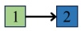</td><td>2 II</td><td>Who is the current CEO of Apple? [Tim Cook] Who was the CEO of Apple before [Tim Cook]? [Steve Jobs]</td><td>Who was the CEO of Apple before the current CEO? [Steve Jobs]</td></tr><tr><td>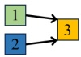</td><td>2 3</td><td>Who painted the Mona Lisa? [Leonardo da Vinci] Where is the Louvre museum located? [Paris] When did [Leonardo da Vinci] move to [Paris] during the last years of his life? [1516]</td><td>When did the painter of the Mona Lisa move to the city where the Louvre museum is located during the last years of his life? [1516]</td></tr><tr><td>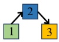</td><td>1 2 3</td><td>What is the hometown of tennis player Serena Williams? [Compton] What U.S. state is [Compton] located in? [California] What is the most populous city in [California]? [Los Angeles]</td><td>What is the most populous city in the U.S. state where tennis player Serena Williams&#x27; hometown is located? [Los Angeles]</td></tr><tr><td rowspan="2">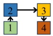</td><td>1 2 3 4</td><td>What was the first feature film directed by Steven Spielberg? [Duel] What California city was [Duel] filmed in? [Los Angeles] What famous comedy troupe got its start in [Los Angeles] in the 1970s? [The Groundlings]</td><td>What actress known for Saturday Night Live was part of a comedy troupe that started in the city where Steven Spielberg&#x27;s first feature film was made?</td></tr><tr><td></td><td>What actress was a member of [The Groundlings] before becoming famous on Saturday Night Live? [Kristen Wiig] What is the longest river in the world? [The Nile]</td><td>[Kristen Wiig]</td></tr><tr><td rowspan="3">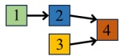</td><td>2 3 1</td><td>What country does [The Nile] end in? [Egypt] What is the famous square in the capital city of Egypt? [Tahrir Square]</td><td rowspan="2">What is the main religion practiced in the capital city of the country where the longest river in the world ends? [Islam]</td></tr><tr><td>4</td><td>What is the main religion practiced in the capital of [Egypt] which has the famous [Tahrir Square]? [Islam]</td></tr><tr><td></td><td>Who wrote the novel Pride and Prejudice? [Jane Austen]</td><td>Which year was the novel, written by the</td></tr><tr><td rowspan="2">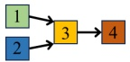</td><td>2 3</td><td>Which British band&#x27;s masterpiece is Love Me Do? [The Beatles] What novel written by [Jane Austen] shares the same country of origin as [The Beatles]? [Sense and Sensibility]</td><td>author of Pride and Prejudice, that shares the same country of origin as The Beatles, first published? [1811]</td></tr><tr><td>4 1 2 3</td><td>Which year was [Sense and Sensibility] first published? [1811] Who is the famous soccer player from Argentina? [Lionel Messi] Which country does the LeBron James come from? [USA]</td><td>Where in the country of the basketball player LeBron James did the famous</td></tr><tr><td>1 3</td><td>4 1 2 3</td><td>What sport is Roger Federer known for? [Tennis] Which city of [USA] did [Lionel Messi] play soccer and Roger Federer once played [Tennis] in? [Miami] Who wrote the novel To Kill a Mockingbird? [Harper Lee]</td><td>Argentine soccer player play soccer and Roger Federer once play tennis? [Miami]</td></tr><tr><td>2 4</td><td>5 4 5</td><td>What is the top basketball league in the world? [NBA] What country was [Harper Lee] born in? [United States] What city is the [NBA] team Wizards in? [Washington D.C.] What famous monument is located in [Washington D.C.] and was built in honor of the first president of the [United States]? [The Washington Monument]</td><td>What famous monument is located in the capital of the country where the author of To Kill a Mockingbird was born, and was built in honor of the first president of that country? [The Washington Monument]</td></tr></table>

Figure 7: Examples used in prompts for question composition. The underlined text with color represents the answer to each sub-question.