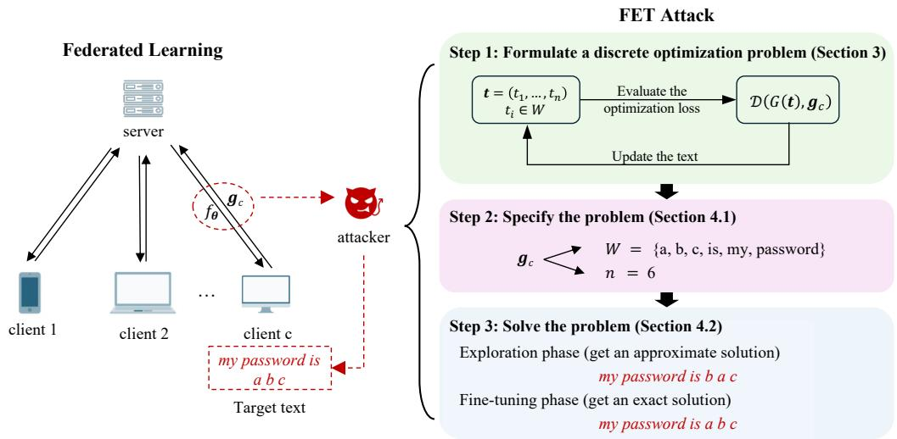
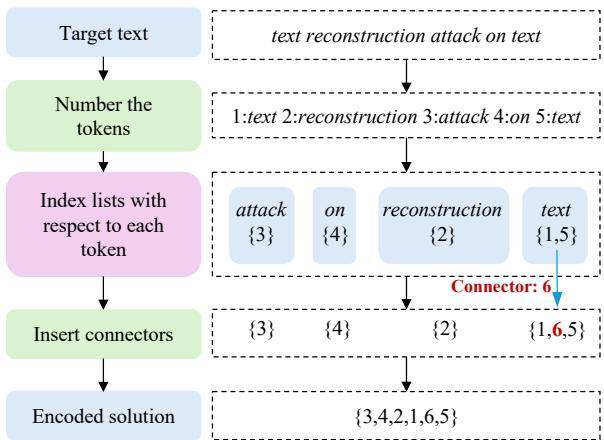
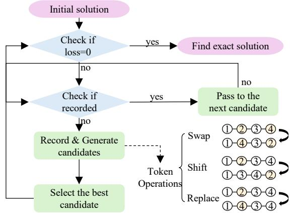

# Gradient Inversion Attack in Federated Learning: Exposing Text Data through Discrete Optimization

Ying Gao1,2\*†, Yuxin Xie1†, Huanghao Deng1, Zukun Zhu1

1School of Cyber Science and Technology, Beihang University, Beijing, China

2Zhongguancun Laboratory, Beijing, China

{gaoying, xie\_yuxin, denghuanghao, zhuzk} @buaa.edu.cn

## Abstract

Federated learning has emerged as a potential solution to overcome the bottleneck posed by the near exhaustion of public text data in training large language models. There are claims that the strategy of exchanging gradients allows using text data including private information. Although recent studies demonstrate that data can be reconstructed from gradients, the threat for text data seems relatively small due to its sensitivity to even a few token errors. However, we propose a novel attack method FET, indicating that it is possible to Fully Expose Text data from gradients. Unlike previous methods that optimize continuous embedding vectors, we directly search for a text sequence with gra dients that match the known gradients. First, we infer the total number of tokens and the unique tokens in the target text data from the gradients of the embedding layer. Then we develop a discrete optimization algorithm, which globally explores the solution space and precisely refines the obtained solution, incorporating both global and local search strategies. We also find that gradients of the fully connected layer are dominant, providing sufficient guidance for the optimization process. Our experiments show a significant improvement in attack performance, with an average increase of 39% for TinyBERT , 20% for $\mathrm { B E R T _ { b a s e } }$ and 15% for $\mathbf { B E R T _ { l a r g e } }$ in exact match rates across three datasets. These findings highlight serious privacy risks in text data, suggesting that using smaller models is not an effective privacypreserving strategy.

## 1 Introduction

Large language models (LLMs) are facing a significant challenge posed by the availability of text data resources. However, federated learning (FL) (Konecný et al.ˇ , 2016; Bonawitz et al., 2019; Ryffel et al., 2018; McMahan et al., 2017; Vanhaesebrouck et al., 2017; Zhao et al., 2018), which allows using private data by keeping it local, could be a potential solution to overcome the bottleneck. Typically, multiple clients and a server train a model cooperatively in FL. In each global round, the clients train local models using their private data and upload gradients to the server, while the server aggregates the received gradients to build a global model. FL not only enhances efficiency by paralleling the computations but also keeps data local as a privacy-preserving measure. As a result, FL has emerged as a new trend in various applications, particularly those involving extensive use of text data, such as mobile keyboard predictions (Ramaswamy et al., 2022; Hard et al., 2018) and financial risk assessments (Byrd and Polychroniadou, 2021).

However, recent studies (Zhu et al., 2019; Zhao et al., 2020; Geiping et al., 2020; Enthoven and Al-Ars, 2022; Jeon et al., 2021; Yin et al., 2021; Zhu and Blaschko, 2020; Xu et al., 2022; Geng et al., 2021; Li et al., 2023; Yue et al., 2023; Wang et al., 2023) demonstrate that private training data may be reconstructed from gradients. In these attacks, dummy data is randomly initialized and subsequently optimized to minimize the gradient distance between the target and reconstructed data. This method has demonstrated effectiveness in reconstructing image data, enabling privacy breaches even in high-resolution or large-batch scenarios. However, applying this method to text data has proven challenging in achieving precise reconstruction results, even for a single-batch or for short sentences within 10 tokens (Zhu et al., 2019; Deng et al., 2021). Moreover, the precision of reconstruction is crucial for recovering the semantic information of text data, which is sensitive to errors. For private data like phone numbers, mailing addresses, and card IDs, allowed using in FL, even a slight inaccuracy can result in complete failure. Recent study TAG (Deng et al., 2021) adapts the image reconstruction method to text data, combining both

  
Figure 1: Illustration of FET attack scenarios and procedures. An attacker, either the server or a client eavesdropping the target client, recovers the private text data following mainly three steps: formulation of a discrete optimization problem, specification of the problem, and solving by the optimization algorithm.

L1 norm and L2 norm distance function to measure the distance between the reconstructed text and target text. LAMP (Balunovic et al., 2022) also applies the optimization-based method but introduces a pretrained language model as prior knowledge, achieving an improvement in performance. In light of these findings, this paper proposes to pay more attention on the precision of text reconstruction, striving towards fully exposure of text data.

Reconstructing text from gradients is more challenging due to the vastness of vocabulary and the discrete nature of text. Text is a sequence of tokens, each drawn from an extensive vocabulary, such as BERT vocabulary with 30522 tokens. Furthermore, the variable length of text leads to an indeterminate number of potential solutions. Existing methods simplify the text reconstruction problem by optimizing an embedding vector instead of text, however, at the expense of precision. The embedding vector, extracted from the original text, may not fully capture its semantic information. In other words, even if we manage to obtain the true embedding, it is not always feasible to recover the original text. Given the critical importance of precision in text reconstruction, we choose to optimize on text space despite the inherent challenges.

In this paper, we propose a novel method named FET, illustrated in Figure 1. To the best of our knowledge, we have made the first attempt to optimize on the discrete text space instead of an embedding space. Initially, we specify the problem by inferring the total number of tokens and identifying the unique tokens from the gradients of embedding layers. Subsequently, we design a discrete optimization algorithm that consists of two phases: exploration and fine-tuning. The exploration phase, inspired by genetic algorithms (Baker and Ayechew, 2003; R, 1976; Chatterjee et al., 1996), updates a population of chromosomes towards lower fitness values over generations, where chromosomes represent possible solutions, and fitness measures the optimization loss. The finetuning phase follows if the exploration phase fails to get the optimal solution, which initiates a current solution by the outcome of the previous phase and updates it iteratively. In each iteration, candidate solutions are generated by applying token operations to the current solution, and the best from these candidates is chosen to replace the current solution. Distinct from previous methods that utilize the sum of the gradient distances across all layers, we focus exclusively on the fully connected layer. Our observations indicate that the gradient distance of the fully connected layer alone is sufficient to guide the optimization process. Since gradient calculations involve layer-by-layer backpropagation of loss, focusing on the final layer also reduces computational costs.

Based on our experimental evaluations, FET demonstrates improved ROUGE scores and a higher rate of exact matches, highlighting the precision of reconstructions when compared to stateof-the-art methods. The exact match rate exceeds 50% on the CoLA and SST-2 datasets across all tested models including CNN-based, RNN-based and Transformer-based language models, suggesting the potential for fully exposure of text data from gradients. Contrary to the prevailing view that larger models’ gradients reveal more information about the training data, our method performs better on smaller model scales, indicating that privacypreserving strategies relying on extracting smaller model scales may not be effective. Furthermore, our findings show that gradients from the fully connected layer alone are sufficient for data reconstruction.

Our main contributions are as follows:

• We made the first attempt to optimize directly on the text space, rather than on the embedding space. To achieve this, we designed a discrete optimization algorithm that combines global and local search strategies, enabling effective convergence towards the optimal solution for precise text reconstruction.

• We used the gradient distance of the fully connected layer as the loss function. This not only reduces computational costs but also demonstrates that the gradient from the fully connected layer alone contains sufficient information for accurate text reconstruction.

• We implemented FET and conducted extensive experimental evaluations. Our method outperforms state-of-the-art approaches in terms of ROUGE scores and exact match rates. On CoLA and SST-2 datasets, exact match rates exceed 50% for all tested models, revealing that even smaller model scales are vulnerable to data exposure from gradients.

## 2 Related work

In this section, we provide an overview of reconstruction attacks from gradients on both image and text data.

## 2.1 Image Reconstruction Attacks

Gradient exchanges posed significant data privacy risks. To address these concerns, numerous studies focused on reconstructing private image data from gradients, demonstrating the potential leakage of privacy. The pioneering attempt DLG, proposed by Zhou et al (Zhu et al., 2019), formulated the attack as an optimization problem, optimizing data to minimize the gradient distance. DLG achieved pixel-wise accuracy for images. Subsequent studies improved this method by introducing prior information, such as generative adversarial networks (GANs) and total variation (TV). The InvGrad attack (Geiping et al., 2020), exploiting a magnitude-invariant loss along with optimization strategies based on adversarial attacks, could faithfully reconstruct images at high resolution, even for trained deep networks. The GradInversion attack (Yin et al., 2021) reconstructed high-resolution images from large batches (8 to 48 images) for large networks like ResNets using group consistency regularization, where multiple agents starting from different random seeds work together to find an enhanced reconstruction result. The GIAS attack (Jeon et al., 2021), inspired by the impact of regularization terms exploring data distribution, enhanced the effectiveness of reconstruction attacks using a generative model pretrained on the data distribution.

## 2.2 Text Reconstruction Attacks

In contrast to the progress made in image reconstruction attacks, text reconstruction attacks have received limited attention. DLG (Zhu et al., 2019) made the initial attempt on text data, reporting a token-wise accuracy on a limited dataset. TAG (Deng et al., 2021) combined L1 norm and L2 norm to measure gradient distances, noting that most gradients gather around zero while a small proportion have large values. However, both DLG and TAG often fail to recover text data with correct order, and the batch size of target data is limited to one. Observing these limitations, LAMP (Balunovic et al., 2022) incorporated a pre-trained LLM as prior knowledge to guide the search towards more natural text. LAMP alternated between continuous and discrete optimization, with continuous optimization minimizing the reconstruction loss on embedding vectors and discrete optimization minimizing the perplexity calculated by the LLM. Unlike optimization-based methods, FILM (Gupta et al., 2022) identified a set of tokens from gradients and generated sentences using beam search. FILM’s approach of identifying unique tokens from gradients inspired our research. However, FILM primarily focused on autoregressive pretrained language models did not prioritize precise reconstruction, which is not the main focus of our work. In conclusion, the current methods for text reconstruction attacks struggle with achieving precise reconstruction.

## 3 Problem Formulation

In this section, we describe the text reconstruction problem by presenting the threat model and outlining the formulation of a discrete optimization problem.

## 3.1 Threat Model

Attack scenario. In federated learning, C clients collaboratively train a binary classification language model with a server on their private text data. In a global round, the server sends current global model f with parameters θ to the clients. Client $\boldsymbol { c } _ { } ( \boldsymbol { c } _ { } = 1 , 2 , \ldots , C )$ initializes its local model with the current global model, trains it on its private data $( \pmb { x } ^ { c } , \pmb { y } ^ { c } )$ , and uploads gradients $\pmb { g } ^ { c }$ , where $\pmb { x } ^ { c } = ( x _ { 1 } ^ { c } , x _ { 2 } ^ { c } , \ldots , x _ { n } ^ { c } )$ is a text sequence, with each token $x _ { i } ^ { c } \in V$ (the tokenizer vocabulary) for $i = 1 , 2 , \ldots , n$ , and $\pmb { y } ^ { c }$ denotes a label. Assume that the server aggregates the gradients based on FedSGD (Liu et al., 2020; Yang et al., 2019; Lin et al., 2017; Yao et al., 2019). The attacker can launch an attack at any round during training.

Attacker’s objective and capabilities. Consider an attacker aiming at revealing the private text $\pmb { x } ^ { c }$ from the gradients $\pmb { g } ^ { c }$ . The attacker has access to the original gradients $\pmb { g } ^ { c }$ , the model $f$ with parameters $\theta ,$ and the tokenizer with vocabulary V. The attacker can be either the server or client $c ^ { \prime } ( c ^ { \prime } \neq c )$ eavesdropping the communication between server and client c.

## 3.2 Discrete Optimization Problem

For any input text sequence x, the attacker can calculate the gradients with respect to $f _ { \theta }$ , given the label $\pmb { y } ^ { c }$ . The discrete optimization problem is formulated as

$$
\arg \operatorname* { m i n } _ { { \pmb x } \in V ^ { n } } { \cal D } ( \frac { \partial \mathcal { L } ( f _ { \pmb \theta } ( { \pmb x } ) , { \pmb y } ^ { c } ) } { \partial { \pmb \theta } } , { \pmb g } ^ { c } ) .\tag{1}
$$

where $\mathcal { L }$ denotes the loss function of model training, and D denotes the distance function measuring gradient distances. As the label can be enumerated in binary classification, we assume the label is known, following previous researches. Based on our observation, it is sufficient to match only the gradients of the fully connected layer. L2 norm (Euclidean distance), L1 norm (Manhattan distance) and cosine similarity are common choices for the distance function. In this paper, our method does not rely on a specific distance function and we have chosen L2 norm function to test our algorithm.

## 4 FET Attack

In this section, we propose an attack method FET, specifying the Problem (1) and solving it by designing a tailored optimization algorithm presented in Algorithm 1.

## 4.1 Inference from Gradients

Observing that the text length n and the m unique tokens are not available, we follow the method in (Melis et al., 2019) to get n and the m unique tokens building a new vocabulary W. The original gradients are calculated based on the model parameters θ. Each non-zero row of the gradients with respect to the word embedding layer shows existence of a unique token, and we can identify theses tokens. For modern Transformer-based language models such as BERT (Devlin et al., 2018), a positional embedding layer is included, where the number of non-zero rows represent the text length, i.e., the total number of tokens, including repetitions. For a language model without a positional embedding layer, which is not mainstream, the number of unique tokens gives a reference to test different text lengths. With inference from gradients, Problem (1) is specified with text length n and a new vocabulary W.

Remark. To ensure that all text sequences in a batch have the same length, language models apply padding to the shorter sequences, adding extra tokens (usually special padding tokens) to match the length of the longest sequence in the batch. This uniform length allows for efficient parallel processing within the model. We can only infer the final length after padding through embedding gradients.

## 4.2 Discrete Optimization Algorithm

Problem (1) formulates a discrete optimization problem as the input sequence x consists of discrete tokens, making continuous optimization methods such as Adam and SGD unsuitable. To overcome it, we develop a tailored discrete optimization algorithm, comprising an exploration phase and a fine-tuning phase. The exploration phase aims at navigating the expansive solution space, resulting in a near-optimal solution. Subsequently, the fine-tuning phase delves into refining the identified solution for enhanced precision.

Exploration phase. We propose a customized genetic algorithm in which each potential solution is regarded as a chromosome. The objective is to identify the chromosome with the lowest fitness. In the context of our Problem (1), a chromosome in a form of an ordered integer list corresponds to a candidate sequence x. The fitness of each chromosome is assessed by calculating the gradient distance.

The encoding process of a candidate text into a chromosome follows 4 steps, as illustrated in Figure 2: (1) initialize m empty lists, with each list corresponding to a unique token in W; (2) assign the token indices 1, 2, . . . , n from the target text to their respective lists based on the tokens they represent; (3) for each list with more than one token index, insert a connector between every pair of consecutive integers; (4) concatenate all the lists together in the order of their corresponding tokens.

Figure 2: Procedures of encoding a text into an integer list, serving as a chromosome in the exploration phase.  
  
Figure 3: Procedures of the fine-tuning phase generating candidates through token operations and searching the optimal solution.

In the encoding phase, the text sequence is encoded into a sequence of unique integers, including values from 1 to n (representing token positions in the target text) along with additional connectors. This ensures that each token in W appears in the

possible solution.

The algorithm initializes a population consisting of these chromosomes randomly. Through successive generations, the population evolves towards lower average fitness, indicating improvement in the solutions. During each generation, genetic operations such as “select”, “crossover”, and “mutate” are applied to create new potential chromosomes. These operations mimic the natural processes of evolution, allowing the algorithm to explore the solution space more effectively. Moreover, an elitism preservation mechanism is employed, ensuring that the best solutions from each generation are carried forward to the next generation. However, the algorithm may converge to a local optimum if the solution space is extensive. The identified solution still requires further improvement.

Fine-tuning phase. A candidate sequence with gradients closed to the target gradients gc can be transformed to target text within several steps of token operations such as “swap”, “shift”, and “replace”. Given a target text, the top potential solutions with the lowest losses under a fixed model are those that can be transformed from the target text with minimal token operations. Based on this observation, we design the fine-tuning phase, presented in Figure 3, to enhance the precision of the identified solution by the exploration phase.

The fine-tuning phase begins by setting the “current solution” to the result of the exploration phase. It then proceeds to refine the current solution through token operations: “swap”, “shift”, and “replace”, generating a set of candidate solutions. The current solution is updated to the best candidate among them. During the iterative updates of the current solution, each one is recorded to prevent duplication. If a recorded solution is encountered, the fine-tuning phase selects a sub-optimal candidate instead. It is worth noting that for target texts without repeated tokens, each possible solution is a permutation of the original token sequence. In this case, the “swap” and “shift” operations are sufficient and the “replace” operation is unnecessary. The operations used in the exploration phase are probabilistic, while each round in the fine-tuning phase aim to exhaustively explore all candidates that can be reached through a single operation.

Algorithm 1 The discrete optimization algorithm   
in FET.   
Input: model: $f _ { \boldsymbol { \theta } } ;$ vocabulary: $W ;$ text length:   
$n ;$ max generations $N _ { g e n } ;$ max iterations $N _ { i t } ;$   
parameters: population size $p ,$ hall of fame $h ,$   
tournament size $k ,$ crossover rate $p _ { 1 } .$ , mutation   
rate $p _ { 2 }$   
Output: Reconstructed text sequence ${ \pmb x } .$   
1: $\mathcal { P } $ initializePopulation(p), $i \gets 0$   
2: while $i < N _ { g e n }$ and $d \neq 0$ do   
3: $i  i + 1$   
4: $\varepsilon \gets$ selectBest(P, h)   
5: O ← tournament(P, k)   
6: O ← crossover(O, p1) + mutate(O, p2)   
7: P ← updatePopulation(O, E)   
8: s, d ← getSolution(P)   
9: $\mathcal { R }  [ ] , i  0$   
10: while $i < N _ { i t }$ and d $\neq 0$ do   
11: $i  i + 1$   
12: S ← wordSwap(s) + wordShift(s) +   
wordReplace(s)   
13: s, d ← getSolution(S)   
14: while $s \in \mathcal R$ do   
15: S.remove(s)   
16: s, d ← getSolution(S)   
17: x ← decode(s)   
18: return x

## 5 Experimental Evaluation

In this section, we present and discuss the experimental results of FET across various settings. We compare FET with prior methods on three BERT models of different parameter scales, tested on various datasets. Additionally, we evaluate other model architectures, test with batched data, and perform an ablation study to examine the impact of different phases and matching only fully connected layer gradients.

## 5.1 Setup

Datasets. We evaluate our method on datasets CoLA (Warstadt et al., 2019), SST-2 (Socher et al., 2013) and Rotten Tomatoes (Pang and Lee, 2005), with typical sequence lengths between 5 and 9, 3 and 13, and 14 and 27 words.

Models. We consider various language models. Following LAMP, we compare FET attack with the state-of-the-art methods on $\mathrm { T i n y B E R T _ { 6 } }$ (Jiao et al., 2019) , $\mathbf { B E R T _ { b a s e } }$ (Devlin et al., 2018) and $\mathrm { B E R T _ { l a r g e } , }$ which follow the main stream architecture of embedding layers, Encoders, and a classifier. $\mathbf { B E R T _ { b a s e } }$ has a parameter scale of 109.5 million. TinyBERT6 is an extracted model from BERTbase, featuring 6 hidden layers, and a parameter scale of 67.0 million. $\mathbf { B E R T _ { l a r g e } }$ has 24 hidden layers and a parameter scale of 340 million. Additionally, we test our method on TextCNN, LSTM, and ALBERT, as representatives of CNN, RNN and Transformers architectures, with comparable model parameter sizes. The BERT tokenizer is used for all the models.

Metrics. In alignment with prior works (Deng et al., 2021; Balunovic et al., 2022), we use ROUGE scores (Lin, 2004), specifically ROUGE-1 (R-1), ROUGE-2 (R-2), and ROUGE-L (R-L), to evaluate the similarity between the target text and the reconstructed text. R-1 and R-2 assess unigram and bigram overlaps, respectively, while R-L measures the longest common subsequence. Additionally, we report the rate of exact matches between the reconstructed text and the target text. Since even minor errors can cause significant semantic distortions, the exact match rate reflects the attacker’s confidence in achieving an exact reconstruction.

Attack settings. For simplicity, we consider a federated learning setting with a single server and a single client. The attacks are implemented in Python on NVIDIA RTX 3090 GPU, using Py-Torch (Paszke et al., 2019) for the implementation of models and DEAP (Fortin et al., 2012) for that of key components inspired by genetic algorithms (Baker and Ayechew, 2003; R, 1976; Chatterjee et al., 1996). The genetic operators selection, crossover, and mutation are implemented by the “selTournament," “cxUniformPartialyMatched," and “mutShuffleIndexes" functions in DEAP, respectively.

The max generations of the exploration phase and the max iterations of the finetuning phase are set as 100 and 20, respectively. For the exploration phase, the genetic algorithm is configured with a population size of 100, a tournament size of 2, a crossover rate of 0.9, a mutation rate of 0.1, and a hall of fame size of 5. These parameter values were chosen through experimental trials and by referencing the parameters used in solving the Traveling Salesman Problem (TSP), where the chromosome is represented as a sequence of integers denoting vehicles and cities. The exploration phase is terminated once the same result has been consistently obtained for 10 consecutive generations. For the fine-tuning phase, token operations are applied at each iteration, while block shift iterations are conducted every fifth iteration. For the comparison experiments, the setup was consistent with TAG (Deng et al., 2021) and LAMP (Balunovic et al., 2022), and our results confirm the findings.

<table><tr><td></td><td></td><td colspan="4">TinyBERT₆6</td><td colspan="4"> $\mathrm { B E R T _ { b a s e } }$ </td><td colspan="4"> $\mathbf { B E R T _ { l a r g e } }$ </td></tr><tr><td>Datasets</td><td>Methods</td><td>R-1</td><td>R-2</td><td>R-L</td><td>Exact</td><td>R-1</td><td>R-2</td><td>R-L</td><td>Exact</td><td>R-1</td><td>R-2</td><td>R-L</td><td>Exact</td></tr><tr><td rowspan="2">CoLA</td><td>TAG LAMP</td><td>36.5</td><td>2.1</td><td>32.9</td><td>0.0</td><td>77.3</td><td>11.9</td><td>54.3</td><td>3.0</td><td>84.5</td><td>12.5</td><td>56.4</td><td>3.0</td></tr><tr><td></td><td>93.4</td><td>58.0</td><td>80.4</td><td>26.0</td><td>86.9</td><td>51.7</td><td>75.9</td><td>23.0</td><td>91.0</td><td>52.4</td><td>75.4</td><td>10.0</td></tr><tr><td rowspan="2"></td><td>FET</td><td>99.0</td><td>93.4</td><td>96.0</td><td>90.0</td><td>95.7</td><td>72.9</td><td>84.1</td><td>62.0</td><td>94.5</td><td>56.5</td><td>76.6</td><td>45.0</td></tr><tr><td>TAG</td><td>43.5</td><td>9.7</td><td>40.8</td><td>6.0</td><td>75.5</td><td>13.2</td><td>55.9</td><td>8.0</td><td>78.9</td><td>10.2</td><td>53.3</td><td>9.0</td></tr><tr><td rowspan="2">SST-2</td><td>LAMP</td><td>93.0</td><td>59.4</td><td>79.0</td><td>32.0</td><td>86.7</td><td>60.2</td><td>78.8</td><td>43.0</td><td>88.5</td><td>55.9</td><td>76.5</td><td>46.0</td></tr><tr><td>FET</td><td>95.7</td><td>72.9</td><td>84.1</td><td>62.0</td><td>93.1</td><td>68.3</td><td>80.9</td><td>60.0</td><td>90.9</td><td>61.4</td><td>76.9</td><td>55.0</td></tr><tr><td rowspan="2">RT</td><td>TAG</td><td>21.3</td><td>0.7</td><td>16.9</td><td>0.0</td><td>59.8</td><td>3.0</td><td>32.8</td><td>0.0</td><td>73.6</td><td>4.4</td><td>36.8</td><td>0.0</td></tr><tr><td>LAMP</td><td>80.2</td><td>30.1</td><td>58.0</td><td>1.0</td><td>65.2</td><td>13.6</td><td>43.1</td><td>2.0</td><td>71.3</td><td>10.3</td><td>42.1</td><td>1.0</td></tr><tr><td></td><td>FET</td><td>86.0</td><td>42.9</td><td>62.1</td><td>24.0</td><td>75.6</td><td>19.3</td><td>45.5</td><td>6.0</td><td>72.0</td><td>11.0</td><td>39.6</td><td>3.0</td></tr></table>

Table 1: The comparison of FET with previous methods against Tiny $\mathrm { B E R T _ { 6 } } ,$ $\mathrm { B E R T _ { b a s e } , }$ and $\mathbf { B E R T _ { l a r g e } }$ on CoLA, SST-2, and Rotten Tomatoes (RT). R-1, R-2, R-L, and exact match rate metrics, averaged over 100 attacks, are reported in percentages (%).

Comparison with state-of-the-art methods. We compare FET attack with state-of-the-art methods on Transformer-based models. The experimental results, as detailed in Table 1, FET significantly outperforms the other methods in terms of ROUGE scores and exact match rates. Notably, FET achieves the highest ROUGE scores for Tiny $\mathrm { \Delta B E R T _ { 6 } }$ and $\mathbf { B E R T _ { b a s e } }$ on all datasets, with significant improvements on CoLA and SST-2. For $\mathrm { B E R T _ { l a r g e } , }$ FET maintains strongest performance on CoLA and SST-2, though its performance on Rotten Tomatoes is comparable. Overall, FET demonstrates superior performance in most scenarios. All methods tend to perform better with smaller model scales and shorter sequences, which may be attributed to the fact that optimizationbased approaches typically struggle with larger search spaces, resulting in higher computational costs and greater difficulty in achieving global optima.

The increase of exact match rate demonstrates the effectiveness of using discrete optimization. Methods that focus on optimizing an embedding vector have yielded negligible exact match rate for any model in TinyBERT6, $\mathbf { B E R T _ { b a s e } }$ , and $\mathbf { B E R T _ { l a r g e } }$ LAMP, which alternates continuous and discrete optimization, still fails to achieve a commendable exact match rate. However, FET gets a marked improvement in exact match rate by optimizing on text space directly. FET excels in the precise extraction of shorter texts, ensuring precise and reliable results for the requirement of exact text information.

Test for various model architectures. We conduct experiments for TextCNN, LSTM, and AL-BERT models with comparable parameter sizes to test the effectiveness of FET for various model architectures. The experimental results in Table 2 demonstrate that FET can be effectively applied across different types of models, including CNNbased, RNN-based, and Transformer-based architectures. Notably, the attack is most effective on the LSTM model, achieving the highest performance across all datasets. This may suggest that RNNbased models are more vulnerable to this type of attack, potentially due to their sequential processing structure, which could make them more susceptible to perturbations in the input sequence.

<table><tr><td>Model</td><td>Dataset</td><td>R-1</td><td>R-2</td><td>R-L</td><td>Exact</td></tr><tr><td>TextCNN</td><td>CoLA SST-2 RT</td><td>99.2 96.7 82.3</td><td>96.9 89.6 47.7</td><td>96.5 90.4 56.8</td><td>88.0 78.0 17.0</td></tr><tr><td>LSTM</td><td>CoLA SST-2 RT</td><td>99.9 98.9 94.4</td><td>99.9 97.7 84.2</td><td>99.9 98.5 90.7</td><td>99.0 91.0 47.0</td></tr><tr><td>ALBERT</td><td>CoLA SST-2 RT</td><td>97.5 92.3 81.6</td><td>73.3 67.4 10.7</td><td>87.1 81.0 42.9</td><td>68.0 64.0 3.0</td></tr></table>

Table 2: The results of FET against TextCNN, LSTM, and ALBERT on CoLA, SST-2, and Rotten Tomatoes (RT). R-1, R-2, R-L, and exact match rates, averaged over 100 attacks, are reported in percentages (%).

Test for batched data. We conduct experiments for batch size 1, 2, and 4 and compare the results of FET with LAMP, reported in Table 3. The experiments are conducted on TinyBERT6 model on CoLA dataset. To accommodate the larger search

space in batch settings, we double the population size and set the maximum iterations to 50.
<table><tr><td>Batch Size</td><td>Method</td><td>R-1</td><td>R-2</td><td>R-L</td><td>Exact</td></tr><tr><td rowspan="2">1</td><td>LAMP</td><td>93.9</td><td>59.3</td><td>80.2</td><td>26.0</td></tr><tr><td>FET</td><td>99.0</td><td>93.4</td><td>96.0</td><td>90.0</td></tr><tr><td rowspan="2">2</td><td>LAMP</td><td>84.7</td><td>40.2</td><td>70.3</td><td>2.0</td></tr><tr><td>FET</td><td>69.0</td><td>55.8</td><td>70.7</td><td>7.0</td></tr><tr><td rowspan="2">4</td><td>LAMP</td><td>65.8</td><td>19.9</td><td>55.3</td><td>0.0</td></tr><tr><td>FET</td><td>55.7</td><td>23.1</td><td>42.7</td><td>0.0</td></tr></table>

Table 3: The comparison of FET with LAMP against TinyBERT on CoLA with batch size 1, 2 and 4. R-1, R-2, R-L, and exact match rate metrics, averaged over 100 attacks, are reported in percentages (%).

While larger search spaces naturally increase the complexity of discrete optimization, which is a challenge faced by all optimization-based methods, FET navigates this challenge reasonably well. Although it doesn’t fully mitigate the complexity, it still achieves solid results, with improvements in R-2, R-L scores and exact match rates at batch size 2, and further enhancement in R-2 at batch size 4, demonstrating its capability to handle batched data comparably to state-of-the-art methods. Additionally, a larger batch size offers a protective effect from the perspective of privacy protection.

## 5.2 Ablation Experiments

We conduct ablation experiments on TinyBERT6, isolating the exploration phase and the fine-tuning phase, and present the ROUGE scores and exact match rates in Table 4. The maximum generations for the exploration phase and the maximum iterations for the fine-tuning phase are consistent with those used in FET. Additionally, we include a comparison with the approach that matches gradients across all layers, highlighting the performance differences between selective gradient matching and full-layer gradient alignment.

<table><tr><td>Method</td><td>R-1</td><td>R-2</td><td>R-L</td><td>Exact</td><td>Time</td></tr><tr><td>FET-exploration</td><td>97.8</td><td>78.0</td><td>88.1</td><td>69.0</td><td>20.20</td></tr><tr><td>FET-fine-tuning</td><td>98.5</td><td>90.6</td><td>94.7</td><td>77.0</td><td>37.19</td></tr><tr><td>FET-full-layer</td><td>99.4</td><td>97.9</td><td>98.5</td><td>96.0</td><td>115.25</td></tr><tr><td>FET</td><td>99.0</td><td>93.4</td><td>96.0</td><td>90.0</td><td>43.27</td></tr></table>

Table 4: The results of reconstruction attacks against TinyBERT on CoLA with FET-exploration, FET-finetuning, FET-full-layer, and FET. R-1, R-2, R-L, and exact match rate metrics are reported in percentages (%) and Time in seconds (s), all averaged over 100 attacks.

An standalone exploration phase can only get approximate solutions. Compared to the exploration phase, an standalone fine-tuning phase can achieve more precise reconstructions. By integrating these two phases, FET experiences a performance improvement. Compared to FET-full-layer, which matches gradients across all layers, the precision of FET slightly decreases, but the efficiency significantly improves. The gradients from layers other than the fully connected layer can be viewed as regularization terms, aiding the optimization algorithm to converge in fewer iterations. However, the 90% exact match rate indicates that matching only the fully connected layer gradients is sufficient. The ablation study demonstrates the effectiveness of the integration of an exploration phase and a finetuning phase and shows the efficiency improvement by matching only fully connected layer gradients.

## 6 Conclusion

We propose FET that optimizes text sequences to match gradients and demonstrate severe privacy leakage of text data in FL. Our extensive experiments show that FET enhances precision of text reconstructions. Our work contributes the first attempt on discrete optimization approach for the gradient inversion of text data, showing the potential of fully exposing private text data through gradients.

Limitation. Our method faces challenges with convergence as the solution space expands with increasing batch sizes, a common difficulty for optimization-based methods.

Ethical considerations. This paper discusses the privacy risks of text data due to gradient leakage in federated learning. While FET could potentially be exploited by attackers, openly addressing and discussing these privacy risks is essential for the advancement of the field. We recommend the implementation of defense strategies where necessary to mitigate privacy concerns.

## Acknowledgments

This research is supported by National Natural Science Foundation of China (NSFC Grant No.12441101) and Beijing Municipal Science & Technology Commission: New Generation of Information and Communication Technology Innovation - Research and Demonstration Application of Key Technologies for Privacy Protection of Massive Data for Large Model Training and Application (Z231100005923047).

## References

Barrie M. Baker and M. A. Ayechew. 2003. A genetic algorithm for the vehicle routing problem. Computers & Operations Research, 30(5):787–800.

Mislav Balunovic, Dimitar Dimitrov, Nikola Jovanovic,´ and et al. 2022. LAMP: Extracting text from gradients with language model priors. Advances in Neural Information Processing Systems, 35:7641–7654.

Keith Bonawitz, Hubert Eichner, Wolfgang Grieskamp, and et al. 2019. Towards federated learning at scale: System design. In Proceedings ofMachine Learning and Systems, pages 374–388.

David Byrd and Antigoni Polychroniadou. 2021. Differentially private secure multi-party computation for federated learning in financial applications. In Proceedings of the First ACM International Conference on AI in Finance, pages 1–9. ACM.

Sangit Chatterjee, Cecilia Carrera, and Lucy A Lynch. 1996. Genetic algorithms and traveling salesman problems. European journal of operational research, 93(3):490–510.

Jieren Deng, Yijue Wang, Ji Li, and et al. 2021. TAG: Gradient attack on Transformer-based language models. In Proceedings ofthe 2021 Conference on Empirical Methods in Natural Language Processing (EMNLP), pages 3600–3610.

Jacob Devlin, Ming-Wei Chang, Kenton Lee, and et al. 2018. BERT: Pre-training of deep bidirectional transformers for language understanding.

David Enthoven and Zaid Al-Ars. 2022. Fidel: Reconstructing private training samples from weight updates in federated learning. In 9th International Conference on Internet of Things: Systems, Management and Security (IOTSMS), pages 1–8.

Félix-Antoine Fortin, François-Michel De Rainville, Marc-André Gardner, and et al. 2012. Deap: Evolutionary algorithms made easy. Journal ofMachine Learning Research, 13:2171–2175.

Jonas Geiping, Hartmut Bauermeister, Hannah Dröge, and et al. 2020. Inverting gradients - how easy is it to break privacy in federated learning? Advances in Neural Information Processing Systems, 33:16937– 16947.

Jiahui Geng, Yongli Mou, Feifei Li, and et al. 2021. Towards General Deep Leakage in Federated Learning. ArXiv preprint 2110.09074v2.

Samyak Gupta, Yangsibo Huang, Zexuan Zhong, and et al. 2022. Recovering private text in federated learning of language models. Advances in Neural Information Processing Systems, 35:8130–8143.

Andrew Hard, Kanishka Rao, Rajiv Mathews, and et al. 2018. Federated learning for mobile keyboard prediction. ArXiv preprint 1811.03604v2.

Jinwoo Jeon, jaechang Kim, Kangwook Lee, and et al. 2021. Gradient inversion with generative image prior. Advances in Neural Information Processing Systems, 34:29898–29908.

Xiaoqi Jiao, Yichun Yin, Lifeng Shang, and et al. 2019. TinyBERT: Distilling bert for natural language understanding. ArXiv preprint 1909.10351v5.

Jakub Konecný, H. Brendan McMahan, Felix X. Yu,ˇ and et al. 2016. Federated learning: Strategies for improving communication efficiency. ArXiv preprint 1610.05492v2.

Zhaohua Li, Le Wang, Guangyao Chen, and et al. 2023. E2EGI: End-to-end gradient inversion in federated learning. IEEE Journal of Biomedical and Health Informatics, 27(2):756–767.

Chin-Yew Lin. 2004. ROUGE: A package for automatic evaluation of summaries. In Text Summarization Branches Out, pages 74–81.

Yujun Lin, Song Han, Huizi Mao, and et al. 2017. Deep gradient compression: Reducing the communication bandwidth for distributed training.

Wei Liu, Li Chen, Yunfei Chen, and et al. 2020. Accelerating federated learning via momentum gradient descent. IEEE Transactions on Parallel and Distributed Systems, 31(8):1754–1766.

Brendan McMahan, Eider Moore, Daniel Ramage, and et al. 2017. Communication-efficient learning of deep networks from decentralized data. In Proceedings of the 20th International Conference on ArtificialIntelligence and Statistics, pages 1273–1282. PMLR.

Luca Melis, Congzheng Song, Emiliano De Cristofaro, and et al. 2019. Exploiting unintended feature leakage in collaborative learning. In 2019 IEEE Symposium on Security and Privacy (SP), pages 691–706.

Bo Pang and Lillian Lee. 2005. Seeing stars: Exploiting class relationships for sentiment categorization with respect to rating scales. ArXiv preprint cs/0506075.

Adam Paszke, Sam Gross, Soumith Chintala, and et al. 2019. Pytorch: An imperative style, highperformance deep learning library. https:// pytorch.org/.

Sampson J R. 1976. Adaptation in natural and artificial systems. Society for Industrial and Applied Mathematics, 18(3):529–530.

Swaroop Ramaswamy, Rajiv Mathews, Kanishka Rao, and et al. 2022. Federated learning for emoji prediction in a mobile keyboard. ArXiv preprint 1906.04329v1.

Theo Ryffel, Andrew Trask, Morten Dahl, and et al. 2018. A generic framework for privacy preserving deep learning. ArXiv preprint 1811.04017v2.

Richard Socher, Alex Perelygin, Jean Wu, and et al. 2013. Recursive deep models for semantic compositionality over a sentiment treebank. In Proceedings of the 2013 Conference on Empirical Methods in Natural Language Processing (EMNLP), pages 1631– 1642.

Paul Vanhaesebrouck, Aurélien Bellet, and Marc Tommasi. 2017. Decentralized collaborative learning of personalized models over networks. In Proceedings of the 20th International Conference on Artificial Intelligence and Statistics, pages 509–517. PMLR.

Zifan Wang, Changgen Peng, Xing He, and et al. 2023. Wasserstein distance-based deep leakage from gradients. Entropy, 25(5):810.

Alex Warstadt, Amanpreet Singh, and Samuel R. Bowman. 2019. Neural network acceptability judgments. Transactions of the Association for Computational Linguistics, 7:625–641.

Jin Xu, Chi Hong, Jiyue Huang, and et al. 2022. AGIC: Approximate gradient inversion attack on federated learning. In 2022 41st International Symposium on Reliable Distributed Systems (SRDS), pages 12–22.

Qiang Yang, Yang Liu, Tianjian Chen, and et al. 2019. Federated machine learning: Concept and applications. ACM Transactions on Intelligent Systems and Technology, 10(2):12:1–12:19.

Xin Yao, Tianchi Huang, Rui-Xiao Zhang, and et al. 2019. Federated learning with unbiased gradient aggregation and controllable meta updating.

Hongxu Yin, Arun Mallya, Arash Vahdat, Jose M. Alvarez, and et al. 2021. See through gradients: Image batch recovery via gradinversion. In Proceedings of the IEEE/CVF Conference on Computer Vision and Pattern Recognition (CVPR), pages 16337–16346.

Kai Yue, Richeng Jin, Chau-Wai Wong, and et al. 2023. Gradient obfuscation gives a false sense of security in federated learning. In 32nd USENIX Security Symposium (USENIX Security 23), pages 6381–6398.

Bo Zhao, Konda Reddy Mopuri, and Hakan Bilen. 2020. iDLG: Improved deep leakage from gradients. ArXiv preprint 2001.02610v1.

Yue Zhao, Meng Li, Liangzhen Lai, and et al. 2018. Federated learning with non-IID data. ArXiv preprint 1806.00582.

Junyi Zhu and Matthew Blaschko. 2020. R-GAP: Recursive gradient attack on privacy. ArXiv preprint 2010.07733v3.

Ligeng Zhu, Zhijian Liu, and Song Han. 2019. Deep leakage from gradients. Advances in Neural Information Processing Systems, 32:14774–14784.