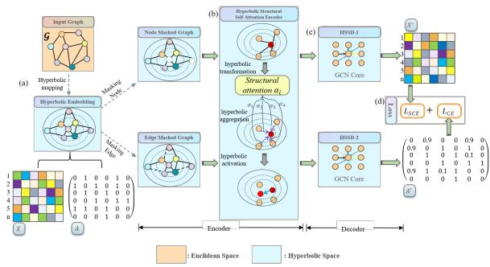
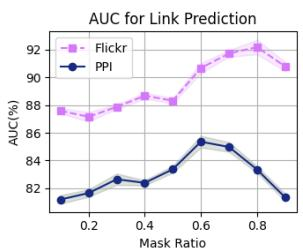
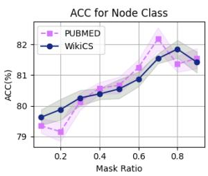

# Graph Representation Learning in Hyperbolic Space via Dual-Masked

Rui Gong1,2\*, Zuyun Jiang3, Daren Zha1,2

1Institute of Information Engineering, Chinese Academy of Sciences, Beijing, China   
2School of Cyber Security, University of Chinese Academy of Sciences, Beijing, China 3China Telecom Digital Intelligence Technology Co, Beijing, China {gongrui, zhadaren}@iie.ac.cn, jiangzy6@chinatelecom.cn

## Abstract

Graph representation learning (GRL) in hyperbolic space has gradually emerged as a promising approach. Meanwhile, masking and reconstruction-based (MR-based) methods lead to state-of-the-art self-supervised graph representation. However, existing MR-based methods do not fully consider deep node and structural information. Inspired by the recent active and emerging field of self-supervised learning, we propose a novel node and edge dualmasked self-supervised graph representation learning framework in hyperbolic space, named HDM-GAE. We have designed a graph dualmasked module and a hyperbolic structural selfattention encoder module to mask nodes or edges and perform node aggregation within hyperbolic space, respectively. Comprehensive experiments and ablation studies on real-world multi-category datasets, demonstrate the superiority of our method in downstream tasks such as node classification and link prediction.

## 1 Introduction

Previous research on graph representation learning (GRL) has primarily focused on methods within Euclidean space. These methods include traditional graph representation techniques based on matrix factorization and random walks. Subsequently, the introduction of graph convolutional neural networks (GCNs) significantly advanced graph representation learning. These GCNs methods (Kipf and Welling, 2017; Hamilton et al., 2017; Hu et al., 2021) are based on message-passing mechanisms and demonstrate powerful representational capabilities. However, despite the impressive performance of these Euclidean space-based graph representation methods in many tasks, they may face challenges (Papadopoulos et al., 2012) when dealing with complex graph structures and highdimensional data.

Embedding graphs into hyperbolic space (Sala et al., 2018; Nickel and Kiela, 2017, 2018) offers advantages in terms of metrics or distances, particularly for hierarchical data. Despite its representational strength, designing and training neural networks in hyperbolic space remains a challenge. Traditional hyperbolic convolution and attention mechanisms, which follow the manifold-tangent space-manifold approach, may distort the global structure of the hyperbolic manifold (Huang et al., 2017). Integrating masking mechanisms into research within hyperbolic space holds significant feasibility. Masking mechanisms can be utilized for self-supervised learning by obscuring parts of the graph structure or node features to generate self-supervised tasks, thereby forcing the model to learn more meaningful representations. Introducing this mechanism into hyperbolic space can fully leverage the geometric advantages of hyperbolic space, further enhancing the effectiveness of graph representation learning.

Therefore, combining masking mechanisms with hyperbolic space in research is not only theoretically novel but also holds broad application prospects. In summary, the main contributions of this paper are as follows:

• We developed a hyperbolic dual-masking selfsupervised learning architecture for graph representation learning, which fully utilizes the geometric advantages of hyperbolic space and the masking mechanism in self-supervised learning. To the best of our knowledge, this is the first study in the field of graph representation learning based on hyperbolic representation and dual-masking mechanisms.

• We designed several new modules: A graph dual-masking module that simultaneously masks and reconstructs both nodes and edges. Additionally, we proposed a hyperbolic structural self-attention encoding module. The attention coefficients are derived from the hyperbolic distances between node embeddings. Through this module, node representations can be directly aggregated in hyperbolic space, ensuring the preservation of manifold characteristics and minimizing distortion.

• Our experimental results validate the effectiveness of the proposed method in graph representation learning. Specifically, we conducted experiments on six real-world datasets, demonstrating the superiority of our approach in downstream node classification and link prediction tasks. Further ablation studies provided in-depth explanations of how each proposed component contributes to the model’s success.

## 2 Preliminaries

In this section, we first discuss the formal definitions of problems related to graph representation learning. Then, we introduce some key fundamental concepts of hyperbolic geometry.

## 2.1 Problem Definition

Graph representation learning (GRL) is the process of automatically discovering representations for the nodes, edges, or entire graphs in a low-dimensional space while preserving the graph’s inherent structural and semantic properties. Formally, relevant descriptions can be defined as follows.

Consider a graph $G = ( V , E )$ , where V represents the set of nodes and $E \subseteq V \times V$ represents the set of edges. Additionally, let $A \in \{ 0 , \dot { 1 } \} ^ { | V | \times | V | }$ be the adjacency matrix of $G ,$ where $A _ { i j } = 1$ if there is an edge between nodes $v _ { i }$ and $v _ { j } ,$ and $A _ { i j } = 0$ otherwise. Furthermore, let $X \in \dot { \mathbb { R } } ^ { | V | \times d _ { x } }$ be the node attribute matrix, where each row $X _ { i }$ corresponds to a $d _ { x } – \mathrm { d i m e n s i o n a l }$ feature vector of node $v _ { i }$

Node classification (NC) is a task where each node $v _ { i } \in V$ is assigned a label from a predefined set of classes $\mathcal { V }$ . Formally, given a graph $G =$ $( V , E )$ , and a subset of nodes $V _ { L } \subseteq V$ with known labels $\{ y _ { i } \ | \ v _ { i } \ \in \ V _ { L } \}$ , the objective is to learn a function $g : V  \mathcal { V }$ that can predict the labels for the unlabeled nodes $V _ { U } = V \setminus V _ { L }$ . Link prediction (LP) involves predicting the existence of an edge between two nodes in a graph. Given a graph $G$ $( V , E )$ , its adjacency matrix $A ,$ , and node attribute matrix X, the task is to determine the likelihood of an edge $( v _ { i } , v _ { j } ) \in V \times V$ existing in $G .$

## 2.2 Hyperbolic Spaces

A manifold is a generalized description of highdimensional surfaces. An n-dimensional Riemannian manifold $( \mathcal { M } , g )$ is a differentiable manifold $\mathcal { M }$ equipped with a metric g. After defining a differential structure on a topological manifold, it can be locally approximated by a linear space near each point, allowing the definition of the tangent space of $\mathcal { T } _ { p } \mathcal { M }$ the manifold M at point $p .$

Hyperbolic space $\mathbb { H } ^ { \mathbf { n } , \mathbf { K } }$ is defined as a smooth Riemannian manifold with constant negative curvature $- \mathbf { K } ( \mathbf { K \Sigma } > \mathbf { \mu } 0 )$ Lorentz Model The $n \mathrm { - }$ dimensional Lorentz Model $\mathbb { L } ^ { \mathbf { n } , \mathbf { K } }$ (also known as the hyperboloid model) is an n-dimensional Riemannian manifold with negative curvature $- \mathbf { K } ( \mathbf { K } > 0 )$ . It is defined as:

$$
\begin{array} { r l } & { \mathbb { L } ^ { { \mathbf { n } } , { \mathbf { K } } } = \{ { \mathbf { x } } = ( x _ { 0 } , \ldots , x _ { n } ) \in \mathbb { R } ^ { n + 1 } \mid \langle { \mathbf { x } } , { \mathbf { x } } \rangle _ { \mathbb { L } } = - 1 , } \\ & { x _ { 0 } > 0 \} } \end{array}\tag{1}
$$

, where $\langle \cdot , \cdot \rangle _ { \mathbb { L } }$ is the Lorentzian inner product. For any $\mathbf { x } , \mathbf { y } \in \mathbb { R } ^ { n + 1 }$ , the Lorentzian inner product is defined as: $\begin{array} { r } { \langle \mathbf { x } , \mathbf { y } \rangle _ { \mathbb { L } } = - x _ { 0 } y _ { 0 } + \sum _ { i = 1 } ^ { n } x _ { i } y _ { i } } \end{array}$

Exponential and logarithmic mappings Mappings between hyperbolic space and its tangent space can be defined through the exponential and logarithmic maps. Given x, $\bar { \mathbf { y } } \in \mathbb { L } ^ { \mathbf { n } , \hat { \mathbf { K } } }$ and a vector $v \in \mathcal { T } _ { x } \mathbb { L } ^ { \mathbf { n } , \mathbf { K } }$ in the tangent space, where $\pmb { v } \ne 0$ and $\boldsymbol { y } \neq \boldsymbol { x }$ , the exponential map $\exp _ { x } : \mathcal { T } _ { x } \mathbb { L }  \mathbb { L }$ and the logarithmic map $\log _ { x } : \mathbb { L } \to \mathcal { T } _ { x } \mathbb { L }$ can be defined as follows:

$$
\exp _ { { \pmb x } } ^ { K } ( { \pmb v } ) = \cosh \left( \sqrt { K } \| { \pmb v } \| _ { \mathbb { L } } \right) { \pmb x } + { \pmb v } \frac { \sinh \left( \sqrt { K } \| { \pmb v } \| _ { \mathbb { L } } \right) } { \sqrt { K } \| { \pmb v } \| _ { \mathbb { L } } }\tag{2}
$$

$$
\log _ { \pmb { x } } ^ { K } ( \pmb { y } ) = d _ { \mathbb { L } } ^ { K } ( \pmb { x } , \pmb { y } ) \frac { \pmb { y } + K \langle \pmb { x } , \pmb { y } \rangle _ { \mathbb { L } } \pmb { x } } { \| \pmb { y } + K \langle \pmb { x } , \pmb { y } \rangle _ { \mathbb { L } } \pmb { x } \| _ { \mathbb { L } } }\tag{3}
$$

$\begin{array} { r } { \begin{array} { r } { \mathcal { T } _ { \mathbf { x } } \mathrm { { h e r e } } \ \| \pmb { v } \| _ { \mathbb { L } } = \ \sqrt { \langle \pmb { v } , \pmb { v } \rangle _ { \mathbb { L } } } } \\ { \mathcal { T } _ { \mathbf { x } } \mathbb { L } ^ { { \mathbf { n } } , { \mathbf { K } } } . } \end{array} } \end{array}$ is the norm of ${ \textbf { \em v } } \in$

Isometric isomorphism In addition to the aforementioned Lorentz model $\mathbb { L } ,$ there are various hyperbolic models (Peng et al., 2021), such as the Klein model $\kappa .$ the Poincaré ball model B, the hemisphere model $\mathcal { I } ,$ and the Poincaré half-space model $\mathcal { P }$ . It is important to note that different hyperbolic space models have their unique definitions, metrics, exponential and logarithmic mapping methods, but they are mathematically isometric.

Given a point $\mathbf { x } ~ = ~ ( x _ { 0 } , x _ { 1 } , \ldots , x _ { n } ) , \mathbf { x } ~ \in$ Ln+1,K , and its corresponding point $\begin{array} { r l } { \mathbf { y } } & { { } = } \end{array}$ $( y _ { 0 } , y _ { 1 } , \dotsc , y _ { n - 1 } ) , \mathbf { y } \ \in \ { \mathcal { K } } ^ { \mathbf { n } , \mathbf { K } }$ , the bijection between them can be defined as:

$$
\begin{array} { l } { \displaystyle \pi _ { \mathcal L \to K } ^ { K } ( \mathbf x ) = \sqrt { K } \frac { \left( x _ { 1 } , \cdots , x _ { n } \right) } { x _ { 0 } } , } \\ { \displaystyle \pi _ { K \to \mathcal L } ^ { K } ( \mathbf y ) = \frac { K } { \sqrt { K - \| \mathbf y \| ^ { 2 } } } ( \sqrt { K } , \mathbf y ) } \end{array}\tag{4}
$$

Similarly, given a point $\mathbf { x } = ( x _ { 0 } , x _ { 1 } , \ldots , x _ { n } )$ $\mathbf { x } \in \mathbb { L } ^ { \mathbf { n } + \mathbf { i } , \mathbf { K } } ,$ , and its corresponding point b = $( b _ { 0 } , b _ { 1 } , \dotsc , b _ { n - 1 } ) , \mathbf { b } \ \in \ B ^ { \mathbf { n } , { \bar { \mathbf { K } } } }$ , the bijection between them can be defined as:

$$
\begin{array} { l } { { \displaystyle \pi _ { \mathcal L \to B } ^ { K } ( \mathbf x ) = \frac { [ x _ { 1 } , \cdots , x _ { n } ] } { x _ { 0 } + \sqrt { K } } } , } \\ { { \displaystyle \pi _ { B \to \mathcal L } ^ { K } ( \mathbf b ) = \frac { ( ( 1 + K \| \mathbf b \| ^ { 2 } ) \sqrt { K } , 2 K \mathbf b ) } { 1 - K \| \mathbf b \| ^ { 2 } } } } \end{array}\tag{5}
$$

These bijections illustrate the relationship between the Lorentz model L and the Klein model K, as well as the Lorentz model aLnd the Poincaré ball model B, respectively.

In the method proposed later in this paper, for numerical stability and to reduce distortion (Nickel and Kiela, 2018), we primarily use the Lorentz (hyperboloid) model L for embedding the network, and the Klein model K for aggregating node embeddings.

## 3 Methods

We propose a hyperbolic dual-masking selfsupervised learning architecture for graph representation learning, leveraging the geometric advantages of hyperbolic space and the masked autoencoding mechanism in self-supervised learning. Figure 1 illustrates the block diagram of the entire architecture.

  
Figure 1: Overview of the proposed HDM-GAE framework, which utilizes hyperbolic space and the dualmasked mechanism to perform masked graph modeling.

## 3.1 Feature Mapping from Euclidean to Hyperbolic Space

In existing graph datasets, input features are typically located in Euclidean space and are often onehot encoded or n-dimensional vectors. Before performing subsequent masking and encoding operations for embedding, it is necessary to map these features to a hyperbolic space using the exponential map.

Specifically, let $x _ { i } ^ { E } \in \mathbb { R } ^ { d - 1 }$ be the Euclidean space feature of node $v _ { i }$ , where $d - 1$ represents the input dimension. Define the origin in hyperbolic space L as $o : = \{ \sqrt { K } , 0 , \ldots , 0 \} \in \mathbb { L } ^ { \mathbf { d } , \bar { \mathbf { K } } }$ , which serves as the reference point for tangent space operations. Since $\langle ( 0 , x _ { i } ^ { E } ) , o \rangle = 0$ , the input feature $( 0 , x _ { i } ^ { E } )$ can be considered as a point in the tangent space $\overset { \cdot } { \tau _ { o } } \mathbb { L } ^ { \mathbf { d } , \mathbf { K } }$ at the origin o. Then, we use the exponential map to generate hyperbolic node representations in the Lorentz model:

$$
\begin{array} { l } { x _ { i } ^ { \mathbb { L } } = \exp _ { o } ^ { K } ( ( 0 , x _ { i } ^ { E } ) ) } \\ { = \left( \frac { \cosh \left( \sqrt { K } \Vert x _ { i } ^ { E } \Vert _ { \mathbb { L } } \right) } { \sqrt { K } } , x _ { i } ^ { E } \frac { \sinh \left( \sqrt { K } \Vert x _ { i } ^ { E } \Vert _ { \mathbb { L } } \right) } { \sqrt { K } \Vert x _ { i } ^ { E } \Vert _ { \mathbb { L } } } \right) } \end{array}\tag{6}
$$

## 3.2 Graph Dual-Mask

In the fields of computer vision and natural language processing, the masking mechanism is very common (Kenton and Toutanova, 2019; Xie et al., 2022). In recent works on graph representation learning, such as GraphMAE (Hou et al., 2022), advanced levels in self-supervised graph representation learning have been achieved by masking and reconstructing graph nodes. However, simply applying masking operations to nodes like pixels in images is flawed because nodes not only have their attribute features but, more importantly, the relationships between nodes, i.e., edges, provide critical information for subsequent tasks in graph representation learning. Therefore, when masking and reconstructing graphs, it is crucial not to ignore both edges and nodes. Our method proposes a dual-masking mechanism for graphs, applying both node masking and edge masking to the graph G.

The input graph with |V| nodes consists of an adjacency matrix A and a hyperbolic node feature matrix $\dot { X ^ { \mathbb { L } } }$ , denoted as $\mathcal { G } = ( A , X ^ { \mathbb { L } } )$ . We perform two masking operations on the graph G.

First, we select a node feature masking ratio $p 1$ . With probability $p 1$ , we mask the node feature matrix $X ^ { \mathbb { L } }$ , setting the masked parts to 0, resulting in the masked graph $\mathcal { G } _ { m a s k } ^ { 1 } = ( A , X ^ { \mathbb { L } \prime } )$ Simultaneously, we select an edge masking ratio $p 2$ . With probability $p 2 .$ , we choose the edges to be masked, setting the corresponding entries in the adjacency matrix A to $0 ,$ resulting in the masked graph $\mathcal { G } _ { m a s k } ^ { 2 } = ( A ^ { \prime } , X ^ { \mathbb { L } } )$ . The hyperparameters $p 1$ and $p 2$ control the proportion of node features and edges being masked, respectively, and have a crucial impact on the training process and performance of the model.

## 3.3 Hyperbolic Structural Self-Attention Encoder (HSSE)

The hyperbolic representation of the graph is then encoded using a structure-based self-attention mechanism. The architecture is shown in Figure 1(b). During the training process, the two masked graphs $\mathcal { G } _ { m a s k } ^ { 1 }$ and $\mathcal { G } _ { m a s k } ^ { 2 }$ are used as input to the entire encoding layer, HSSE. After being processed by the encoding layer, the corresponding graph feature representations $H ^ { 1 }$ and $H ^ { 2 }$ are obtained. This encoding layer can be formally defined as follows: $H ^ { * } = H S S E ( \mathcal { G } _ { m a s k } ^ { * } )$

Three fundamental modules have been designed for hyperbolic space. These modules are versatile and can be applied to graph representation learning, similar to how linear layers, convolutional layers, and activation layers are stacked in neural networks.

Hyperbolic linear transformation To perform operations in hyperbolic space, we first project hyperbolic vectors to the tangent space, where vector multiplication can be performed. This is done because the tangent space retains local Euclidean properties, allowing us to apply Euclidean operations. After performing the necessary operations in the tangent space, we map the vectors back to the hyperbolic space. The specific operation is defined as:

$$
\mathbf { W } \otimes ^ { K } \mathbf { x } _ { i } ^ { \mathbb { L } } : = \exp _ { o } ^ { K } ( \mathbf { W } \log _ { o } ^ { K } ( \mathbf { x } _ { i } ^ { \mathbb { L } } ) )\tag{7}
$$

, where W is a weight matrix.

For bias addition, we use parallel transport to move a vector b $\in \mathbb { R } ^ { d }$ from the tangent space at the origin $\mathcal { T } _ { o } \mathbb { H }$ to the tangent space at a point $\mathcal { T } _ { x }$ H. We then map this transported vector back to the hyperbolic space:

$$
\mathbf { x } _ { i } ^ { \mathbb { L } } \oplus ^ { K } \mathbf { b } : = \exp _ { x } ^ { K } ( P _ { o \to x } ( \mathbf { b } ) )\tag{8}
$$

640

, where $P _ { o \to x }$ denotes the parallel transport from o to x.

Hyperbolic structural attention aggregation Computing weighted means is essential in neural network architectures, evident in the pooling layers of CNNs and the message-passing mechanisms of GCNs. However, unlike Euclidean space, hyperbolic vectors cannot be simply averaged since this may yield results outside the manifold. As discussed previously, our method utilizes hyperbolic distance to correlate self-attention coefficients, avoiding the use of hyperbolic MLPs. This is because the hyperbolic distance effectively preserves the intrinsic properties of the graph data.

Given a node $\mathbf { m } _ { i } ^ { \mathbb { L } }$ and the representation of its neighbor $\mathbf { m } _ { j } ^ { \mathbb { L } }$ , the attention weight $\alpha _ { i j }$ is calculated as follows: $\begin{array} { r } { \alpha _ { i j } = \frac { \exp ( e _ { i j } ) } { \sum _ { v \in \mathcal { N } ( i ) } \exp ( e _ { i v } ) } } \end{array}$ , where $e _ { i j } =$ $- d _ { \mathbb { L } } ^ { \mathbf { K } } ( \mathbf { m } _ { i } ^ { \mathbb { L } } , \mathbf { m } _ { j } ^ { \mathbb { L } } )$

The representation $\tilde { \mathbf { m } } _ { i } ^ { \mathbb { L } }$ for node $v _ { i }$ is obtained by aggregating the hyperbolic embeddings of its neighbors, weighted by the computed attention coefficients. We use the Einstein gyromidpoint method for this aggregation, ensuring that the process is both translation and rotation invariant. The computation steps are:

$$
\begin{array} { r l } & { \mathbf { m } _ { i } ^ { K } = \pi _ { \mathcal L \to K } ^ { K } ( \mathbf { m } _ { i } ^ { \mathbb L } ) , } \\ & { \tilde { \mathbf { m } } _ { i } ^ { \mathbb L } = \pi _ { K \to \mathcal L } ^ { K } \left( \frac { \sum _ { j \in \widehat { N } ( i ) } \alpha _ { i j } \gamma _ { j } \mathbf { m } _ { j } ^ { K } } { \sum _ { j \in \widehat { N } ( i ) } \alpha _ { i j } \gamma _ { j } } \right) } \end{array}\tag{9}
$$

, where $\begin{array} { r } { \gamma _ { j } ~ = ~ \frac { K } { \sqrt { K - \| \mathbf { m } _ { j } ^ { K } \| _ { L } ^ { 2 } } } } \end{array}$ are Lorentz factors.

$\widehat { N } ( i )$ is the set of nodes consisting of the i-th node and its neighbor nodes. Therefore, the hyperbolic structure attention aggregation mechanism applies self-attention aggregation of neighboring nodes to the hyperbolic embeddings of nodes, which can be seen as selectively transmitting messages between nodes.

Hyperbolic activation mechanism Nonlinear activation functions play an important role in GCNs, preventing multi-layer networks from collapsing into single-layer networks. However, directly applying commonly used nonlinear activation functions, such as ReLU, to Lorentzian representations can break the manifold constraints of the Lorentz model. It is known that nonlinear activation functions applied in the Poincaré ball model $\boldsymbol { B }$ can preserve manifold properties: for any $b \in B$ $\sigma ( b ) \in B$ . Inspired by this, we project the hyperbolic aggregation $\tilde { \mathbf { m } } _ { i } ^ { \mathbb { L } }$ to the Poincaré ball model to apply the nonlinear activation function, and then project the result back to the Lorentz model:

$$
\tilde { \mathbf { h } } _ { i } ^ { \mathbb { L } } = \pi _ { B \to \mathcal { L } } ^ { K } ( \sigma ( \pi _ { \mathcal { L }  B } ^ { K } ( \tilde { \mathbf { m } } _ { i } ^ { \mathbb { L } } ) ) )\tag{10}
$$

After the model is trained, an unmasked graph $\mathcal { G }$ is input into the encoder, and the graph representation can be obtained as follows: ${ \cal H } = { \cal H } S S { \cal E } ( \mathcal { G } )$ . The representation produced by this layer can be applied to specific downstream tasks.

## 3.4 Hyperbolic Structural Self-Attention Decoder (HSSD)

The decoder aims to map the latent representations obtained from the encoder back to the input, and its design depends on the semantic level (He et al., 2022) of the target input. In graphs, the decoder reconstructs multi-dimensional node features with relatively less informational content. Traditional graph autoencoder methods (GAEs) either do not use a neural decoder or use a simple MLP for decoding, but their expressive capacity is relatively limited. This often leads to the latent representations learned by the encoder being almost identical to the input features. However, learning such trivial latent representations is of no value, as the goal of encoding is to embed the input features into meaningful compressed knowledge.

Meanwhile, because the HSSE stage involves encoding graphs with masked nodes and graphs with masked edges, the latent embeddings inevitably contain noise, especially when the hyperparameters $p 1$ $p 2$ are large. Therefore, the proposed method uses a more expressive GCN as the decoder and takes the encoder outputs $H ^ { 1 }$ and $H ^ { 2 }$ of $\mathcal { G } _ { m a s k } ^ { 1 }$ and $\mathcal { G } _ { m a s k } ^ { 2 }$ as inputs to two separate decoders, respectively, to learn different decoder parameters. This addresses the issues mentioned above and enhances reconstruction capabilities. The formulas are defined as follows: $\hat { H } _ { 1 } \ = \ \sigma \left( \tilde { D } ^ { - \frac { 1 } { 2 } } \tilde { A } \tilde { D } ^ { - \frac { 1 } { 2 } } H _ { 1 } W _ { 1 } \right) , \hat { H } _ { 2 } \ =$ $\sigma \left( \tilde { D } ^ { - \frac { 1 } { 2 } } \tilde { A } ^ { \prime } \tilde { D } ^ { - \frac { 1 } { 2 } } H _ { 2 } \tilde { W _ { 2 } } \right)$ , where $\tilde { A } = A + I , \tilde { D } _ { i i } =$ $\textstyle \sum _ { j } { \tilde { A } } _ { i , j } ,$ I is a unit matrix, and $W _ { i }$ are learnable weight matrices. σ represents an activation function.

Please note that the decoders are only used during the self-supervised training phase to perform the task of graph feature reconstruction. Thus, the decoder architecture is not inherently tied to the encoder and can utilize any type of GNN.

## 3.5 Loss

For the above graph representation $\hat { H } _ { 1 }$ obtained from the decoder HSSD, we expect its error from the hyperbolic node feature matrix $X ^ { \mathbb { L } }$ of the original graph $\mathcal { G }$ to be as small as possible. To get better results, we utilize the scaled cosine error as the evaluation criterion for reconstructing node features. The formula is given by Equation(11):

$$
\mathcal { L } _ { s c e } = \frac { 1 } { | V _ { m a s k } | } \sum _ { v _ { i } \in V _ { m a s k } } \left( 1 - \frac { \hat { x } _ { 1 , i } ^ { T } x _ { i } ^ { \mathbb { L } } } { \Vert \hat { x } _ { 1 , i } \Vert \cdot \Vert x _ { i } ^ { \mathbb { L } } \Vert } \right) ^ { \gamma } ,\tag{11}
$$

, where $V _ { m a s k }$ denotes the set of masked nodes, and the scaling factor $\gamma$ is a hyperparameter that can be tuned on different datasets. For highconfidence predictions, the corresponding cosine error is typically less than 1 and decays to zero faster when the scaling factor $\gamma > 1$

For the graph representation $\hat { H } _ { 2 }$ obtained from the decoder HSSD, the connection probability between node embeddings is first calculated using the Fermi-Dirac decoder (Krioukov et al., 2010), given by the formula:

$$
p _ { f d } ( \hat { x } _ { 2 , i } , \hat { x } _ { 2 , j } ) : = [ \exp \left( ( d _ { \mathbb { L } } ( \hat { x } _ { 2 , i } , \hat { x } _ { 2 , j } ) - u ) / t \right) ] ^ { - 1 }\tag{12}
$$

, where u and t are hyper-parameters.

For clarity, the subscript $^ { * 2 }$ of the referring graph representation $\hat { H } _ { 2 }$ is omitted in the subsequent formulas. Our goal is to reconstruct the adjacency matrix A of the original graph ${ \mathcal { G } } .$ Therefore, the cross-entropy loss $\mathcal { L } _ { c e }$ is used to maximize the probability of linked nodes in the original graph $\mathcal { G } _ { : }$ , while minimizing the probability of unlinked nodes:

$$
\begin{array} { l } { \displaystyle \mathcal { L } _ { c e } = \frac { 1 } { | V | } \sum _ { e _ { i j } = 1 } - \log \left( p _ { f d } ( \hat { x } _ { i } , \hat { x } _ { j } ) \right) } \\ { \displaystyle - \frac { 1 } { | V | } \sum _ { e _ { i j } = 0 } \left( 1 - \log \left( p _ { f d } ( \hat { x } _ { i } , \hat { x } _ { j } ) \right) \right) } \end{array}\tag{13}
$$

, where $e _ { i j }$ denotes the value of the corresponding position of the neighbor matrix A in the original graph, and $e _ { i j } = 1$ represents the existence of an edge between nodes $v _ { i }$ and $v _ { j }$ , otherwise it represents the nonexistence of an edge. Due to the sparsity of real-world graph data and considering the training cost, we use negative sampling as an approximation to improve the training efficiency. In the actual training, the same number of edges are sampled for both positive and negative edges.

According to the above argument, the final loss of the overall architecture is the weighted sum of the feature loss $\mathcal { L } _ { s c e }$ and the structural loss $\mathcal { L } _ { c e }$ , as defined in equation: $\mathcal { L } = \mathcal { L } _ { s c e } + \alpha \mathcal { L } _ { c e } ,$ where α is a non-negative hyperparameter used to control the balance between the two losses. This combined loss ensures that the model learns both accurate node features and graph structures, enhancing the overall performance of the graph representation learning.

## 4 Experiments and Analysis

To validate the effectiveness of HDM-GAE, this study compares HDM-GAE with state-of-the-art (SOTA) methods in link prediction and node classification tasks and further ablation experiments.

## 4.1 Link Prediction

The link prediction task aims to predict the existence of edges between nodes in a given network. This task has applications in various fields of critical importance. The goal is to utilize the structural information of the network to accurately infer missing or future links.

<table><tr><td>Dataset</td><td>PPI</td><td>Blog.</td><td>Flickr</td><td>PubMed</td><td>WikiCS</td><td>CiteSeer</td></tr><tr><td>Nodes</td><td>17598</td><td>5196</td><td>7575</td><td>19717</td><td>11701</td><td>3327</td></tr><tr><td>Edges</td><td>5429</td><td>173468</td><td>242146</td><td>44338</td><td>297110</td><td>4732</td></tr><tr><td>Features</td><td>17</td><td>8189</td><td>12047</td><td>500</td><td>300</td><td>3703</td></tr><tr><td>Classes</td><td>4</td><td>6</td><td>9</td><td>3</td><td>10</td><td>6</td></tr></table>

Table 1: Summary of the datasets

Datasets In our experiments, we utilize three widely used datasets for link prediction. PPI (Protein-Protein Interaction) is a dataset of the human PPI network. BlogCatalog represents the social network of bloggers listed on the BlogCatalog website (Tan et al., 2023). Flickr represents the social network of users on the photo-sharing platform Flickr (Tan et al., 2023). Table 1 provides detailed statistics for these datasets.

Baselines To evaluate the effectiveness of our proposed method, we compare it with the following state-of-the-art methods. (1) several Euclidean graph embedding methods (Kipf and Welling, 2017; Velickovic et al., 2017; Hamilton et al., 2017), i.e., GCN, GAT, and GraphSage; (2) several hyperbolic graph embedding methods, i.e., HGCN and HGAT; (3) some masked self-supervised graph learning methods, namely GraphMAE and MaskGAE; (4) other SOTA methods, GIC (Mavromatis and Karypis, 2021), BGRL (Thakoor et al., 2021), and S2GAE (Tan et al., 2023). For these methods in the comparison, the same experimental setup is followed if the methods have been used for evaluating this task. For methods that have not been formally tested on the link prediction task, we apply them to this task by training an MLP-based decoder, also known as fine-tuning.

<table><tr><td></td><td colspan="3">AUC</td><td colspan="3">AP</td><td></td></tr><tr><td>Dataset</td><td>Blog.</td><td>Flickr</td><td>PPI</td><td>Blog.</td><td>Flickr</td><td>PPI</td><td>A.R.</td></tr><tr><td>GCN</td><td>76.44±0.75</td><td>86.26±0.63</td><td>79.02±0.47</td><td>75.56±0.23</td><td>81.44±0.31</td><td>79.29±0.37</td><td>9.67</td></tr><tr><td>GAT</td><td>79.38±0.67</td><td>87.34±0.53</td><td>78.74±0.36</td><td>76.13±0.31</td><td>80.98±0.62</td><td>78.72±0.46</td><td>9.33</td></tr><tr><td>GraphSage</td><td>76.42±0.82</td><td>85.39±0.44</td><td>78.20±0.27</td><td>75.22±0.49</td><td>81.78±0.51</td><td>79.71±0.27</td><td>10.17</td></tr><tr><td>HGCN</td><td>79.84±0.41</td><td>88.63±0.72</td><td>80.84±0.41</td><td>76,81±0.35</td><td>81.26±0.39</td><td>80.18±0.40</td><td>7.50</td></tr><tr><td>HGAT</td><td>80.84±0.39</td><td>89.72±0.52</td><td>81.78±0.37</td><td>77.31±0.24</td><td>82.41±0.54</td><td>81.44±0.27</td><td>5.50</td></tr><tr><td>GraphMAE</td><td>77.30±0.78</td><td>88.69±0.44</td><td>81.31±0.43</td><td>78.10±0.56</td><td>83.19±0.29</td><td>81.19±0.36</td><td>6.33</td></tr><tr><td>MaskGAE</td><td>81.43±0.87</td><td>91.64±0.35</td><td>83.94±0.31</td><td>78.41±0.34</td><td>84.28±0.32</td><td>83.23±0.42</td><td>2.67</td></tr><tr><td>GIC</td><td>76.57±0.78</td><td>89.01±0.83</td><td>83.47±0.27</td><td>76.29±0.42</td><td>83.91±0.53</td><td>81.54±0.51</td><td>6.00</td></tr><tr><td>BGRL</td><td>77.62±0.79</td><td>88.30±0.49</td><td>83.53±0.38</td><td>77.46±0.36</td><td>83.47±0.45</td><td>83.62±0.23</td><td>5.17</td></tr><tr><td>S2GAE</td><td>83.62±0.64</td><td>90.14±0.38</td><td>84.61± 0.61</td><td>78.73±0.29</td><td>85.43± 0.30</td><td>82.35±0.34</td><td>2.17</td></tr><tr><td>Prop.</td><td>82.31±0.72</td><td>92.19±0.53</td><td>85.36±0.42</td><td>78.28±0.41</td><td>86.28±0.47</td><td>84.75±0.30</td><td>1.50</td></tr></table>

Table 2: Results of the link prediction task. In each column, bold scores indicate the best results and underlined scores indicate the second best results. A.R. is the abbreviation for average rank and denotes the average rank of methods.

Evaluation Metrics and Setup After training, our proposed model can generate node representations for different downstream tasks by feeding the original graph, without masking, through the encoder HSSE and the corresponding decoder HSSD. For link prediction, given an unseen edge, we estimate the probability of its existence by further feeding the representations of its end nodes into the Fermi-Dirac decoder. We use the Area Under the ROC Curve (AUC) and Average Precision (AP) as evaluation metrics. For each dataset, 85%/5%/10% of the edges are randomly allocated for training/validation/testing. Since the encoding and decoding operations are mainly performed in hyperbolic space, the Riemannian Adam optimizer (Kochurov et al., 2020) is chosen for optimization of the parameters. Some baseline results are cited from (Li et al., 2023; Tan et al., 2022; Thakoor et al., 2021; Jin et al., 2020). To avoid randomness, we repeat the experiments 10 times and report the average results and standard deviations.

Results and Analysis The experimental results are shown in Table 2. HDM-GAE outperforms all baselines on the AUC metrics for the Flickr and PPI datasets and is close to the top method on the Blog-Catalog dataset. The method also performs well on the AP metrics, leading on two datasets and being only 0.45% behind the optimal method on Blog-Catalog. These results demonstrate the effectiveness of our framework. The proposed method outperforms previous hyperbolic geometry-based and mask-based self-coding methods on all datasets and metrics. One possible explanation is that the architecture of double-masking and feature reconstruction for node features and edge structure features plays an important role in the superior performance of link prediction. The performance gap between HDM-GAE and other methods suggests a significant advantage of hyperbolic geometry embedding. To further demonstrate generalizability, we compute and compare the average rankings based on the AUC and AP scores. HDM-GAE shows a significant overall advantage with a leading average ranking, validating its graph representation learning capability and generalization to the link prediction task.

## 4.2 Node Classification

The node classification task involves assigning labels to nodes in a network based on their characteristics and structural properties.

Datasets We utilize three widely used datasets for node classification. PUBMED (Yang et al., 2016) is a standard benchmark for describing citation networks. CiteSeer includes scientific publications from the CiteSeer Digital Library. WikiCS (Tang et al., 2024) consists of Wikipedia pages related to computer science. Table 1 provides more details about these datasets.

Baselines The selected Baselines are identical to Section 4.1. For these methods in the comparison, the same experimental setup is followed if the methods have been used for evaluating this task. For methods that have not been formally tested on a node classification task, we obtain node representations by training a baseline task. The node representations are then used to train and test a simple L2 regularized logistic regression classifier for evaluating the performance of the node classification task.

Evaluation Metrics and Setup We use the accuracy (ACC) metric to evaluate the performance of the node classification method. Accuracy measures the proportion of correctly classified nodes to the total number of nodes. After training, our proposed model can be applied to downstream tasks by generating node representations by feeding the original graph through the encoder HSSE without masking. Specifically, for classification, we directly use the learned node representations to train and test simple l2 regularized logistic regression classifiers to evaluate node-level classification. Public segmentation is used for Citeseer, PubMed, and WikiCS datasets. Some baseline results are quoted from (Tan et al., 2023; Li et al., 2023; Thakoor et al., 2021; Xiao et al., 2022). To avoid randomness, we report the average accuracy with a standard deviation of 10 random initializations.

<table><tr><td colspan="5">ACC</td></tr><tr><td>Dataset</td><td>CiteSeer</td><td>PUBMED</td><td>WikiCS</td><td>Avg,</td></tr><tr><td>GCN</td><td>70.75±0.38</td><td>78.94±0.57</td><td>77.21±0.14</td><td>75.63</td></tr><tr><td>GAT</td><td>71.92±0.62</td><td>78.22 ±0.82</td><td>78.71±0.36</td><td>76.28</td></tr><tr><td>GraphSage</td><td>70.20±1.15</td><td>77.96±0.54</td><td>76.93±0.42</td><td>75.03</td></tr><tr><td>HGCN</td><td>72.18±0.32</td><td>80.27±0.53</td><td>78.64±0.37</td><td>77.03</td></tr><tr><td>HGAT</td><td>73.06±0.45</td><td>79.94±0.35</td><td>79.36±0.43</td><td>77.45</td></tr><tr><td>GraphMAE</td><td>72.49±0.65</td><td>81.54±0.22</td><td>78.61±0.51</td><td>77.55</td></tr><tr><td>MaskGAE</td><td>75.21±0.46</td><td>81.26±0.36</td><td>80.12±0.41</td><td>78.86</td></tr><tr><td>GIC</td><td>76.94±0.22</td><td>80.87±0.13</td><td>79.91±0.26</td><td>79.24</td></tr><tr><td>BGRL</td><td>72.92±0.34</td><td>79.62±0.18</td><td>79.41±0.48</td><td>77.32</td></tr><tr><td>S2GAE</td><td>74.23±0.14</td><td>81.68±0.24</td><td>80.26±0.31</td><td>78.72</td></tr><tr><td>Prop.</td><td>75.68±0.51</td><td>82.18±0.37</td><td>81.85±0.29</td><td>79.90</td></tr></table>

Table 3: Results of the node classification task. Avg. is the abbreviation for average and denotes the average performance.

Results and Analysis The results of the experiment are shown in Table 3. Our method achieves state-of-the-art performance on the PUBMED and WikiCS datasets and outperforms all benchmark methods except GIC on the CiteSeer dataset. It shows that our proposed architecture can effectively combine the properties of hyperbolic geometry and the reconstruction properties of mask selfcoding to enhance the model’s ability of node attribute feature extraction. The mean value of the scores of each method on all datasets is calculated in the last column of Table 3. It can be seen that our proposed method scores the highest among all the baselines. This indicates the method consistently performs well when dealing with different types of datasets and is indeed an effective architecture for GRL.

## 4.3 Ablation Study

To verify the effectiveness of the main modules in HDM-GAE, we further conducted the following ablation study.

## 4.3.1 Effect of Hyperbolic and Edge-Mask

We conducted ablation studies to validate the effectiveness of our main modules. We independently removed the hyperbolic geometry and edge mask modules to create simpler architectures. The DM-GAE model implies the removal of the hyperbolic geometry transformation from the overall HDM-GAE architecture, with both attention and aggregation operations running on Euclidean space. The HNM-GAE model removes the edge masks, leaving only node masking and reconstruction. The rest follows the same experimental setup. For both link prediction and node classification tasks, we display experimental results for a total of four datasets, as shown in Table 4.

<table><tr><td colspan="3">AUC for Link Prediction</td><td colspan="2">ACC for Node Class</td></tr><tr><td>Dataset</td><td>Flickr</td><td>PPI</td><td>PUBMED</td><td>WikiCS</td></tr><tr><td>DM-GAE</td><td>89.26±0.42</td><td>82.53±0.22</td><td>79.38±0.33</td><td>80.15±0.19</td></tr><tr><td>HNM-GAE</td><td>86.74±0.38</td><td>80.62±0.28</td><td>81.48±0.29</td><td>80.87±0.24</td></tr><tr><td>HDM-GAE</td><td>92.19±0.53</td><td>85.36±0.42</td><td>82.18±0.37</td><td>81.85±0.29</td></tr></table>

Table 4: Results of ablation studies performed for hyperbolic module and edge mask module.

The ablation experiments demonstrate that the HDM-GAE model outperforms the comparison methods on all datasets, validating the effectiveness of our proposed method. That is, the removal of any module leads to performance degradation. The effect of edge mask removal is particularly significant in the link prediction task, with HNM-GAE performance decreasing by 5.45% on Flickr and 4.74% on PPI. This shows that edge masking and reconstruction are key to capturing structural information and filtering noise, thus improving link prediction. The DM-GAE model without hyperbolic geometry shows a performance degradation of about 1.7-2.9%, particularly on the PubMed dataset for node classification, likely due to its hierarchical structure. These results clarify the role and importance of each module and verify the design concept of HDM-GAE.

  
Figure 2: Ablation studies of mask ratio

## 4.3.2 Effect of Mask Ratio

Given the strategy of the mask is crucial for our training task, we further investigate how the masking ratio improves or degrades the model performance. The left and right plots in Fig. 2 show the effect of mask ratio on model performance on the link prediction and node classification tasks, respectively. In most cases, lower mask ratios (e.g., p1 and p2 less than 0.5) are not sufficient to learn useful features, and model performance shows a similar trend of improvement when p1 and p2 are increased within a certain range. The optimal ratio varies from chart to chart. On the PPI dataset, model performance is optimal at the mask ratio of 0.6, and continuing to increase the mask ratio decreases performance. For the dataset PUBMED, model performance is optimal at the mask ratio near 0.7. For the WikiCS dataset and the Flickr dataset, the performance is optimal at the mask ratio of 0.8. We analyze that this difference exhibited by the mask ratio should be able to be linked to the information redundancy in the graph dataset. Large node degrees may lead to information redundancy when only a few nodes and edges are needed to approximately recover the node features. On the contrary, in less redundant datasets, a higher masking rate will not recover the features, thus reducing the performance. In summary, the best performance is achieved when p1 or p2 reaches the interval range of 0.6 to 0.8. Parameters too large or too small may lead to poor performance.

## 5 Conclusions

In this work, we propose a novel self-supervised graph representation learning architecture, named HDM-GAE, for static graph representation learning in hyperbolic spaces. In HDM-GAE, we first map graphs onto hyperbolic spaces, as the geometric advantages of hyperbolic spaces are taken into account. Further, our model forces the model to learn both node features and structure features by jointly performing masking and reconstruction operations on nodes and edges. It fully utilizes the geometric advantage of the hyperbolic space and the masking mechanism in self-supervised learning, which, to the best of our knowledge, is the first study in the field of graph representation learning based on hyperbolic representation and doublemasked self-coding mechanism. In addition, the architecture proposes a new graph bi-masking module, a self-attentive coding module for hyperbolic structures with node aggregation directly in hyperbolic space, and so on. Experimental results on six real-world datasets demonstrate the effectiveness of HDM-GAE in graph representation learning and its superiority in downstream node classification and link prediction tasks. For future work, we hope our work will inspire further development of graph embedding and graph mask self-coding techniques in hyperbolic space.

## References

Will Hamilton, Zhitao Ying, and Jure Leskovec. 2017. Inductive representation learning on large graphs. Advances in neural information processing systems, 30.

Kaiming He, Xinlei Chen, Saining Xie, Yanghao Li, Piotr Dollár, and Ross Girshick. 2022. Masked autoencoders are scalable vision learners. In Proceedings ofthe IEEE/CVF conference on computer vision and pattern recognition, pages 16000–16009.

Zhenyu Hou, Xiao Liu, Yukuo Cen, Yuxiao Dong, Hongxia Yang, Chunjie Wang, and Jie Tang. 2022. Graphmae: Self-supervised masked graph autoencoders. In Proceedings of the 28th ACM SIGKDD Conference on Knowledge Discovery and Data Mining, pages 594–604.

Yang Hu, Haoxuan You, Zhecan Wang, Zhicheng Wan Erjin Zhou, and Yue Gao. 2021. Graph-mlp: Node classification without message passing in graph. Preprint, arXiv:2106.04051.

Zhiwu Huang, Ruiping Wang, Shiguang Shan, Luc Van Gool, and Xilin Chen. 2017. Cross euclidean-toriemannian metric learning with application to face recognition from video. IEEE transactions on pattern analysis and machine intelligence, 40(12):2827– 2840.

Wei Jin, Tyler Derr, Haochen Liu, Yiqi Wang, Suhang Wang, Zitao Liu, and Jiliang Tang. 2020. Selfsupervised learning on graphs: Deep insights and new direction. arXiv preprint arXiv:2006.10141.

Jacob Devlin Ming-Wei Chang Kenton and Lee Kristina Toutanova. 2019. Bert: Pre-training of deep bidirectional transformers for language understanding. In Proceedings ofNAACL-HLT, pages 4171–4186.

Thomas N Kipf and Max Welling. 2017. Semisupervised classification with graph convolutional networks. arXiv preprint arXiv:1609.02907.

Max Kochurov, Rasul Karimov, and Serge Kozlukov. 2020. Geoopt: Riemannian optimization in pytorch. arXiv preprint arXiv:2005.02819.

Dmitri Krioukov, Fragkiskos Papadopoulos, Maksim Kitsak, Amin Vahdat, and Marián Boguná. 2010. Hyperbolic geometry of complex networks. Physical Review E—Statistical, Nonlinear, and Soft Matter Physics, 82(3):036106.

Jintang Li, Ruofan Wu, Wangbin Sun, Liang Chen, Sheng Tian, Liang Zhu, Changhua Meng, Zibin Zheng, and Weiqiang Wang. 2023. What’s behind the mask: Understanding masked graph modeling for graph autoencoders. In Proceedings ofthe 29th ACM SIGKDD Conference on Knowledge Discovery and Data Mining, pages 1268–1279.

Costas Mavromatis and George Karypis. 2021. Graph infoclust: Maximizing coarse-grain mutual information in graphs. In Pacific-Asia Conference on Knowledge Discovery and Data Mining, pages 541–553. Springer.

Maximillian Nickel and Douwe Kiela. 2017. Poincaré embeddings for learning hierarchical representations. Advances in neural information processing systems, 30.

Maximillian Nickel and Douwe Kiela. 2018. Learning continuous hierarchies in the lorentz model of hyperbolic geometry. In International conference on machine learning, pages 3779–3788. PMLR.

Fragkiskos Papadopoulos, Maksim Kitsak, M Ángeles Serrano, Marián Boguná, and Dmitri Krioukov. 2012. Popularity versus similarity in growing networks. Nature, 489(7417):537–540.

Wei Peng, Tuomas Varanka, Abdelrahman Mostafa, Henglin Shi, and Guoying Zhao. 2021. Hyperbolic deep neural networks: A survey. IEEE Transactions on pattern analysis and machine intelligence, 44(12):10023–10044.

Frederic Sala, Chris De Sa, Albert Gu, and Christopher Ré. 2018. Representation tradeoffs for hyperbolic embeddings. In International conference on machine learning, pages 4460–4469. PMLR.

Qiaoyu Tan, Ninghao Liu, Xiao Huang, Rui Chen, Soo-Hyun Choi, and Xia Hu. 2022. Mgae: Masked autoencoders for self-supervised learning on graphs. arXiv preprint arXiv:2201.02534.

Qiaoyu Tan, Ninghao Liu, Xiao Huang, Soo-Hyun Choi, Li Li, Rui Chen, and Xia Hu. 2023. S2gae: Self-supervised graph autoencoders are generalizable learners with graph masking. In Proceedings of the sixteenth ACM international conference on web search and data mining, pages 787–795.

Peng Tang, Cheng Xie, and Haoran Duan. 2024. Node and edge dual-masked self-supervised graph representation. Knowledge and Information Systems, 66(4):2307–2326.

Shantanu Thakoor, Corentin Tallec, Mohammad Gheshlaghi Azar, Mehdi Azabou, Eva L Dyer, Remi Munos, Petar Velickoviˇ c, and Michal Valko. 2021. Large-´ scale representation learning on graphs via bootstrapping. In International Conference on Learning Representations.

Petar Velickovic, Guillem Cucurull, Arantxa Casanova, Adriana Romero, Pietro Lio, Yoshua Bengio, et al. 2017. Graph attention networks. stat, 1050(20):10– 48550.

Shunxin Xiao, Shiping Wang, Yuanfei Dai, and Wenzhong Guo. 2022. Graph neural networks in node classification: survey and evaluation. Machine Vision and Applications, 33(1):4.

Zhenda Xie, Zheng Zhang, Yue Cao, Yutong Lin, Jianmin Bao, Zhuliang Yao, Qi Dai, and Han Hu. 2022. Simmim: A simple framework for masked image modeling. In Proceedings of the IEEE/CVF conference on computer vision and pattern recognition, pages 9653–9663.

Zhilin Yang, William Cohen, and Ruslan Salakhudinov. 2016. Revisiting semi-supervised learning with graph embeddings. In International conference on machine learning, pages 40–48. PMLR.