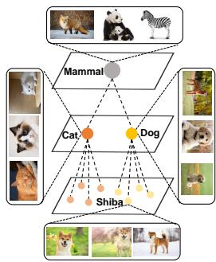
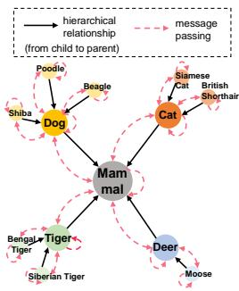
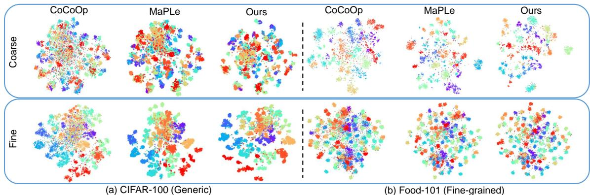
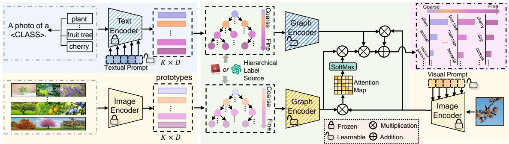
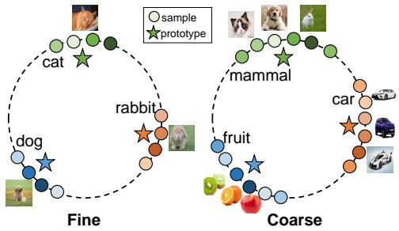
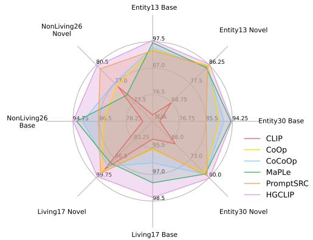
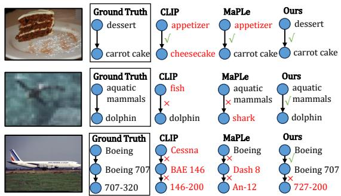
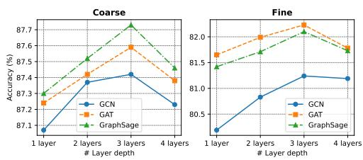

# HGCLIP: Exploring Vision-Language Models with Graph Representations for Hierarchical Understanding

Peng Xia1,4, Xingtong Yu3, Ming Hu1, Lie Ju1, Zhiyong Wang2, Peibo Duan1, Zongyuan Ge1 1Monash University, 2 The University of Sydney, 3 Singapore Management University, 4 UNC-Chapel Hill pxia@cs.unc.edu, zongyuan.ge@monash.edu

## Abstract

Object categories are typically organized into a multi-granularity taxonomic hierarchy. When classifying categories at different hierarchy levels, traditional uni-modal approaches focus primarily on image features, revealing limitations in complex scenarios. Recent studies integrating Vision-Language Models (VLMs) with class hierarchies have shown promise, yet they fall short of fully exploiting the hierarchical relationships. These efforts are constrained by their inability to perform effectively across varied granularity of categories. To tackle this issue, we propose a novel framework (HGCLIP) that effectively combines CLIP with a deeper exploitation of the Hierarchical class structure via Graph representation learning. We explore constructing the class hierarchy into a graph, with its nodes representing the textual or image features of each category. After passing through a graph encoder, the textual features incorporate hierarchical structure information, while the image features emphasize class-aware features derived from prototypes through the attention mechanism. Our approach demonstrates significant improvements on 11 diverse visual recognition benchmarks. Our codes are fully available at https: //github.com/richard-peng-xia/HGCLIP.

## 1 Introduction

Hierarchical image classification (Salakhutdinov et al., 2011; Guo et al., 2018) aims to enhance classification accuracy by identifying objects at various levels of granularity and capturing subtle relationships among them. Specifically, all the classes are organized into a multi-granularity taxonomic hierarchy (see in Figure 1a), where the toplevel nodes represent broader categories (“Mammal”), while the lower-level nodes encompass finergrained subcategories (“Dog”). The inherently hierarchical nature of the task compounds its complexity, as models must exhibit a keen understanding of semantic hierarchies, balancing the trade-off between capturing fine-grained details for subclasses while maintaining a broad understanding of superclasses (Chen et al., 2018). Previous works (Chang et al., 2021; Guo et al., 2018) mainly focus on enhancing image features according to the hierarchy of multiple branch outputs. These uni-modal methods only focus on the image modality, leading to certain limitations in complex scenarios, such as the inability to effectively utilize the textual descriptions of hierarchical labels and adapt to new classes or datasets. Therefore, leveraging multimodal models (e.g., VLMs) to address hierarchical image classification presents stronger potential, offering richer information and greater scalability.

  
(a)

  
(b)  
Figure 1: An illustration of the graph representation based on class hierarchy. (a) The class hierarchy is presented in a tree structure. (b) The hierarchical labels are constructed into a graph, with nodes representing the text/image features of each class. The graph is fed into a graph encoder, where the nodes update the parameters by aggregating the messages from their neighboring nodes. Thus, the class features are fused with hierarchical information via graph representation learning.

Given the powerful generalization capabilities of VLMs (Radford et al., 2021; Jia et al., 2021; Zhai et al., 2022) demonstrated on downstream tasks, harnessing their capabilities to address hierarchical image classification tasks presents a highly valuable exploration. These models are pre-trained on large-scale text-image pairs to align features from the image and text modalities in a shared latent embedding space. The predicted probabilities are obtained by calculating the similarity between image features and text features.

Recently, some works have explored improving accuracy based on VLMs via class hierarchies. Specifically, CHiLS (Novack et al., 2023) employs hierarchical mappings to transform each class into a list of subcategories. However, this approach has significant drawbacks when applied to fine-grained datasets, as the subcategories of these labels tend to be specialized and rare, resulting in an overly detailed and contextually sparse representation. Utilizing these specific labels as prompts may overwhelm the model, lacking broader contextual relevance. Hierarchy-CLIP (Ge et al., 2023) proposes a label augmentation method that leverages the WordNet (Fellbaum, 2010) label hierarchy, enriching each class with its parent and child classes. This method aims to provide a richer semantic expansion of class descriptions. It enhances surface-level semantic associations rather than delving into the deeper and more structured connections inherent in a hierarchical structure. This limitation becomes apparent in scenarios requiring classification across multiple hierarchical levels, where a nuanced understanding of these relationships is crucial. Moreover, these methods are both training-free. While this offers the advantage of simplicity and direct application, it lacks the capacity for further model adaptation to specific datasets. Additionally, these methods do not fully exploit the potential of VLMs to adapt to the diverse and complex nature of hierarchical understanding.

Hence, the limitations of these approaches give rise to a new question: How can models leverage the class hierarchy thoroughly to simultaneously improve the prediction accuracy of categories at different semantic granularity levels?

To address this issue, we first introduce prompt learning (Zhou et al., 2022; Khattak et al., 2023a) as an efficient method to adapt VLMs to downstream tasks. HGCLIP introduces prompt tokens within the multi-modal branches of CLIP to facilitate the learning of hierarchical contextual representations. More importantly, as demonstrated in Figure 1b, HGCLIP explores the integration of CLIP with graph representations for hierarchical image classification. Specifically, hierarchical relationships are modeled as a graph, given that they inherently form a tree-like structure. Based on this graph, we employ a graph encoder (Velickovi ˇ c et al. ´ , 2018a)

to encode text features, enabling them to incorporate hierarchical structural information. Moreover, since image features represent features of individual patches/pixels rather than categories, we utilize prototype learning to represent image features for each category. Similarly, a graph encoder is leveraged to allow the prototypes to learn hierarchical relationships, and subsequently utilize the attention mechanism to enable the spatial feature map of images to focus more on the class-aware features derived from prototypes. On hierarchical image classification, HGCLIP outperforms existing CLIP-based approaches across both generic and fine-grained datasets. In scenarios where hierarchical labels are unavailable, HGCLIP also improves accuracy when utilizing class hierarchies queried by ChatGPT (OpenAI, 2023). Further, HGCLIP demonstrates favorable generalization ability and robustness in domain generalization and subpopulation shift settings, resulting in consistent improvements over existing methods. To sum up, the main contributions of this work include:

• We propose HGCLIP, a state-of-the-art (SoTA) method in hierarchical image classification for adaptation of CLIP.

• To better utilize label hierarchies, we explore the graph representations to incorporate hierarchical structural information into vision-language feature representations for effective hierarchical understanding.

• Our approach exhibits new SoTA performance across eleven hierarchical image classification benchmarks.

## 2 Related Work

Prompt Learning in Vision-Language Models: VLMs leverage information from both image and text modalities to encode multimodal representations. VLMs, e.g., CLIP (Radford et al., 2021), ALIGN (Jia et al., 2021), and LiT (Zhai et al., 2022) are pre-trained on large-scale image-text pairs and demonstrate remarkable representation abilities on various downstream tasks (Gao et al., 2023; Zhu et al., 2022; Ding et al., 2022; Xia et al., 2024c,e,d,a). However, efficiently adapting them to downstream tasks is still a major challenge. Prompt learning (Li and Liang, 2021; Lester et al., 2021; Jin et al., 2024a,b,c), as a parameter-efficient technique, is well-suited for utilizing the representation capacity of pre-trained VLMs to boost performance, instead of the resource-intensive process of full fine-tuning. Many works (Shu et al., 2022; Zhou et al., 2023; Li et al., 2024) have demonstrated powerful performance on specific downstream tasks by combining VLMs and prompt tuning.

Hierarchical Image Classification: Hierarchical image classification (Salakhutdinov et al., 2011; Guo et al., 2018) aims to categorize images into a hierarchical structure that organizes classes into a tree-like taxonomy. It acknowledges the inherent hierarchical nature of visual concepts, allowing for more nuanced and contextually rich image categorization. Prior research has explored various methodologies, including model architectures tailored for hierarchical classification (Guo et al., 2018; Chang et al., 2021; Chen et al., 2018), and exploiting the relationship of the categories in the hierarchy (Liu et al., 2022). Furthermore, the development of hierarchical classification has spurred some works (Ju et al., 2023, 2024; Yi et al., 2022) that harness the class hierarchy across diverse domains, as these models tend to focus more on fine-grained and semantically relevant features. Recently, hierarchical labels are integrated with VLMs (Novack et al., 2023; Ge et al., 2023). Nonetheless, these methods roughly overlook the hierarchical relationships among labels. Our work comprehensively leverages the hierarchical relationships among labels, resulting in performance improvements on both generic andfine-grained datasets.

Graph Representation Learning: Modern graph analysis methods rely on graph representation learning, encompassing graph embedding, graph neural networks (GNNs), and transformers. Early graph embedding techniques (Perozzi et al., 2014; Grover and Leskovec, 2016) typically map nodes into a low-dimensional space, capturing structural information. Recently, GNNs (Kipf and Welling, 2016; Velickoviˇ c et al.´ , 2018a) have become the mainstream technique in graph representation learning. They rely on a message-passing framework where each node refines its representation by recursively aggregating messages from its neighbors. Moreover, some recent approaches have also explored transformer-based architectures (Yun et al., 2019; Hu et al., 2020). Furthermore, the boom of graph representation learning also advances the research and development in other communities such as CV (Shi et al., 2019) and NLP (Zhang et al., 2023). In this work, we employ hierarchical graph representations to enrich multi-modal features, thus improving the model performance and

generalization.

## 3 Preliminaries

In this work, our goal is to learn hierarchical multimodal knowledge via graph encoder based on CLIP. We will introduce related concepts and definitions in the following.

## 3.1 Revisiting CLIP

We denote the CLIP image and text encoder as $\mathcal { T } ( \cdot )$ and $\tau ( \cdot )$ . The dataset contains K categories, i.e., $\{ C _ { 1 } , \cdots , C _ { K } \}$ . CLIP leverages a structured approach by inserting all category names into a predefined textual template represented by the [CLASS] token, e.g., creating expressions like “a photo of a [CLASS].". This results in the generation of textual inputs denoted as $T _ { K }$ . Subsequently, textual features, represented as $\mathbf { F } _ { t } \in \mathbb { R } ^ { K \times D }$ , are extracted. Each input image I is divided into M fixed-sized patches, and each patch is embedded into D-dimensional latent space. Then CLIP derives its spatial feature map $\mathbf { \bar { F } } _ { s } \in \mathbb { R } ^ { H \times W \times D }$ and computes the global visual representations $\mathbf { f } _ { v } \in$ $\mathbb { R } ^ { 1 \times \bar { D } }$ through pooling operations, where H and W denote the height and width of the feature map. The integration of features from both encoders is achieved through cosine similarity measures, ultimately yielding classification logits $\mathbf { \Psi } : \in \mathbb { R } ^ { 1 \times K }$ This comprehensive process can be summarized as follows

$$
\mathbf { F } _ { t } = { \mathcal { T } } ( T _ { K } ) ,\tag{1}
$$

$$
\mathbf { f } _ { v } = \mathrm { P O O L I N G } ( \mathbf { F } _ { s } ) , \quad \mathbf { F } _ { s } = \mathcal { T } ( I ) ,\tag{2}
$$

$$
l o g i t s = { \bf f } _ { v } { \bf F } _ { t } ^ { \ T } .\tag{3}
$$

The matrix multiplication operation between $\mathbf { f } _ { v }$ and $\mathbf { F } _ { t }$ is equivalent to calculating cosine similarities, assumed to be $L _ { \mathrm { { 2 } } ^ { - } \mathrm { { n o r m a l i z e d } } }$ features. logits signifies the computed probabilities for all K categories, and CLIP identifies the category with the maximum output probability argma $\mathfrak { c } _ { C _ { K } } ( l o g i t s )$ as its final prediction.

## 3.2 Graph Encoder

Graph. A graph is represented as $G = ( V , E )$ with V denoting the set of nodes and E the set of edges. Equivalently, the graph can be represented by an adjacency matrix A, such as $A _ { i j } ~ = ~ 1$ , if $( v _ { i } , v _ { j } ) \in E$ , for any $v _ { i } , v _ { j } \in V$

Graph Encoder. GNNs are popular choices of graph encoder, most of which employ a messagepassing mechanism (Wu et al., 2020). Specifically, each node in the graph aggregates messages (i.e., input features or embeddings) from its neighboring nodes to update its own embedding. Multiple layers of neighborhood aggregation can be stacked, facilitating recursive message passing across the graph. Formally, in the l-th GNN layer, the embedding of node v, denoted by $\mathbf { f } _ { v } ^ { l } .$ , is calculated based on the embeddings in the previous layer, as follows

  
Figure 2: t-SNE plots of image embeddings in SOTA method CoCoOp, MaPLe, and HGCLIP on two datasets with distinct semantic granularities. HGCLIP shows better separability in both fine-grained and coarse-grained levels.

$$
\mathbf { f } _ { v } ^ { l } = \mathrm { A G G R } ( \mathbf { f } _ { v } ^ { l - 1 } , \{ \mathbf { f } _ { u } ^ { l - 1 } : u \in \mathcal { N } _ { v } \} ; \theta ^ { l } ) ,\tag{4}
$$

where $\mathcal { N } _ { v }$ is the set of neighboring nodes of $v , \theta ^ { l }$ is the learnable GNN parameters in layer l. AGGR(·) is the neighborhood aggregation function and can take various forms, ranging from the simple mean pooling (Kipf and Welling, 2016) to advanced neural networks such as neural attention (Velickoviˇ c´ et al., 2018a) or multi-layer perceptrons (Xu et al., 2019). Note that the initial node embedding $\mathbf { f } _ { v } ^ { 0 }$ is simply given by the input feature. We abstract the multi-layer encoding process as

$$
\mathbf { f } _ { v } = \mathbf { G } \mathbf { R } \mathbf { A } \mathbf { P } \mathbf { H } \mathbf { E } \mathbf { N } \mathbf { C } \mathbf { O } \mathbf { D } \mathbf { E } \mathbf { R } ( \mathbf { f } _ { v } ^ { 0 } , \mathbf { \mathcal { N } } _ { v } ; \boldsymbol { \Theta } ) ,\tag{5}
$$

where $\Theta \ = \ ( \theta ^ { 1 } , \ldots , \theta ^ { L } )$ is the collection of weights across the layers. Note that graph embedding methods (Perozzi et al., 2014; Tang et al., 2015; Grover and Leskovec, 2016) and graph transformers (Yun et al., 2019; Hu et al., 2020; Ying et al., 2021) could also serves as GRAPHENCODER.

## 4 Methodology

In this section, as shown in Figure 3, we present our proposed method, i.e., HGCLIP for adapting pre-trained VLMs for hierarchical understanding. Our approach aims to enhance the capacity for understanding multiple semantic levels. Most prior approaches focus on single-label classification, whereas hierarchical classification necessitates that the model attends to features relevant to multi-granularity hierarchies. To this end, HG-CLIP entails: a) introducing learnable prompt tokens within multiple transformer blocks in both the visual and textual branches to learn hierarchical contextual representations; b) employing a graph encoder to encode textual features, integrating them with hierarchical structural information; c) utilizing prototype learning to represent image features of each category and similarly modeling them utilizing a graph encoder, thereafter employing the attention mechanism to enable the spatial feature map of images to focus more on class-aware and hierarchy-guided image features.

## 4.1 Hierarchy Setting

The ground truth class hierarchy currently available in a dataset is usually obtained by querying a WordNet (Fellbaum, 2010)-like dictionary, but in the real world, our dataset may have no available class hierarchy. In this case, we turn to LLMs, i.e., ChatGPT, to approximate the hierarchy diagram. Specifically, given some label set size K, semantic granularity levels h, class names, and optional context, we query ChatGPT with the prompt:

Generate h-tier hierarchical labels for the following K categories: $\{ C _ { 1 } , \cdots , C _ { K } \}$

## 4.2 Multi-modal Hierarchical Prompt

In order to comprehensively and efficiently leverage the capabilities of pretrained VLMs, we explore the potential of multi-modal prompt, encompassing both textual and visual prompt. As highlighted in (Khattak et al., 2023a), the acquisition of prompt at deeper transformer layers is crucial, as it progressively models hierarchical feature representations. Learnable tokens are introduced at multiple transformer blocks of both textual and visual branches of VLMs, given as textual prompt $\mathbf { P } ^ { T } = \{ \mathbf { p } _ { 1 } ^ { T } , \cdot \cdot \cdot , \mathbf { p } _ { t } ^ { T } \}$ and visual prompt $\mathbf { P } ^ { V } = \{ \mathbf { p } _ { 1 } ^ { V } , \cdots , \mathbf { p } _ { v } ^ { V } \}$ , respectively. Therefore, the image encoder processes the input tokens added visual prompt $\mathbf { P } ^ { V }$ to generate prompted spatial feature map represented as $\tilde { \mathbf { F } _ { s } } \in \mathbb { R } ^ { \left( \tilde { H } W + \tilde { v } \right) \times D }$ and prompted global visual representations $\tilde { \mathbf { f } _ { v } } \in \mathbb { R } ^ { 1 \times D }$ Similarly, textual prompt $\mathbf { \widehat P } ^ { T }$ are incorporated into the input tokens for encoding, and textual features are obtained as $\tilde { \mathbf { F } } _ { t } \in \mathbb { R } ^ { K \times \bar { D } }$ . These hierarchical prompt tokens leverage the knowledge encoding capabilities of VLMs to effectively learn task-relevant contextual representations across different semantic levels.

  
Figure 3: The pipeline of HGCLIP for adapting CLIP to hierarchical image classification. We introduce multi-modal hierarchical prompt to learn contextual representations. Then we construct the label hierarchy into a graph, with its nodes representing the textual or image features of each class. Features integrate hierarchical structure information through message passing in the graph encoder. Textual features directly combine hierarchical representations, while image features focus on class-aware prototypes through the attention mechanism.

## 4.3 Delving into Graph Representations

The hierarchical structure among labels naturally forms a tree structure, hence we leverage graph representations to model the hierarchy and integrate it into multi-modal features. In Figure 2, we visualize and compare the image embeddings of HGCLIP with those of previous SoTA CoCoOp and MaPLe. It is worth noting that the image embeddings of CLIP, CoOp, CoCoOp, and KgCoOp would be identical, as they do not learn prompts in the visual branch. The visualization reveals that the image embeddings of HGCLIP are more separable, indicating that incorporating hierarchical information can better adapt CLIP.

Encoding Text: Clearly, textual features $\tilde { \mathbf { F } _ { t } } ~ =$ $\{ \tilde { \mathbf { f } } _ { n } ^ { t } \} _ { n = 1 } ^ { K }$ can be directly employed as input for a graph encoder, as they possess corresponding Ddimensional textual features for each category. The class hierarchy is constructed into a graph, where vertices and edges represent individual classes and pairs of classes with hierarchical relationships, respectively. As a result, each node n of the textattributed graph is associated with text features of the corresponding category $\tilde { \mathbf { f } _ { n } ^ { t } }$ . The graph encoder approaches node classification by using the structural interactions between nodes. The textual features $\hat { \mathbf { F } _ { t } } = \{ \hat { \mathbf { f } _ { n } ^ { t } } \} _ { n = 1 } ^ { K }$ integrating hierarchical information are encoded as follows:

  
Figure 4: Semantic prototypes are constructed to guide the learning of hierarchical semantics of images.

$$
\{ \hat { \mathbf { f } _ { n } ^ { t } } \} _ { n = 1 } ^ { K } = \mathbf { G R A P H E N C O D E R } ( \tilde { \mathbf { f } _ { n } ^ { t } } , \mathcal { N } _ { n } ; \boldsymbol { \Theta } _ { t } ) ,\tag{6}
$$

where $\Theta _ { t }$ denotes the parameters of the graph encoder for textual modality, $\textstyle { \mathcal { N } } _ { n }$ denotes the neighbor nodes of n.

Encoding Image: In contrast to textual features, the spatial feature map represents the features of each patch, and the global visual representations characterize the image holistically, rather than representing features for each category. Therefore, the image features of each image cannot be directly input into the graph encoder. To address this issue, as shown in Figure 4, we first leverage prototype learning to represent the image features for each category. The global features ${ \bf F } _ { v } ^ { * } = \{ { \bf f } _ { n } ^ { v * } \} _ { n = 1 } ^ { K } \in$ $\mathbb { R } ^ { K \times 1 \times \mathbf { \bar { D } } }$ of all images $\{ I _ { n } \} _ { n = 1 } ^ { K }$ (only in the training set) belonging to each class are extracted as prototypes for all categories. These prototypes can then be utilized by the graph encoder to be encoded. The procedure is as follows

$$
\mathbf { F } _ { v } ^ { * } = \operatorname { P O O L I N G } ( \mathbf { F } _ { s } ^ { * } ) , \quad \mathbf { F } _ { s } ^ { * } = \mathcal { T } ( I _ { K } ) .\tag{7}
$$

In the image-attributed graph, each node $n$ is associated with image features $\{ \mathbf { f } _ { n } ^ { v * } \} _ { n = 1 } ^ { K }$ , while the rest is consistent with the text-attributed graph. Similarly, the image features $\hat { \mathbf { F } _ { v * } }$ are encoded as follows

$$
\{ \hat { \mathbf { f } } _ { v * } ^ { \hat { n } } \} _ { n = 1 } ^ { K } = \scriptstyle \mathrm { G R A P H E N C O D E R } ( \mathbf { f } _ { v * } , \mathcal { N } _ { n } ; \boldsymbol { \Theta } _ { v } ) ,\tag{8}
$$

where $\Theta _ { v }$ denotes the parameters of the graph encoder for visual modality. After the visual graph encoder effectively leverages structural knowledge, we then employ the attention mechanism to obtain the attention weights of visual features $\tilde { \mathbf { F } _ { s } }$ with respect to the prototypes $\hat { \mathbf { F } _ { v * } }$ . The calculation of attention weights is as follows

$$
\psi = \hat { \mathbf { F } _ { s } } \hat { \mathbf { F } _ { v * } } ^ { T } \in \mathbb { R } ^ { ( H W + v ) \times K } ,\tag{9}
$$

where ψ denotes the attention map. Each element of ψ represents the attention weight, namely, the feature similarity between a class prototype and one image pixel/site. Based on $\psi _ { : }$ we update the spatial feature map as follows

$$
\hat { \mathbf { F } _ { s } } = \operatorname { S o f t M a x } ( \psi / \alpha ) \hat { \mathbf { F } _ { v * } } ,\tag{10}
$$

where α modulates the attention magnitude. Weighted by the attention scores representing similarity, the image features incorporate structured information from the prototypes. As the prototypes $\hat { \mathbf { F } _ { v * } }$ encode K-category visual knowledge, the signals of classes appearing in the image would be more notable. Meanwhile, the spatial feature map provides pixel-level fine-grained information for the interaction, contributing to the thorough integration of class-aware features from the prototypes into the image features.

Classification Logits: Finally, we obtain the attention-interacted global visual feature by pooling and output the classification logits as

$$
\hat { \mathbf { f } _ { v } } = \mathrm { P O O L I N G } ( \hat { \mathbf { F } _ { s } } ) \in \mathbb { R } ^ { 1 \times D } ,\tag{11}
$$

$$
l o g i t s = \lambda _ { 1 } \cdot \tilde { \mathbf { f } _ { v } } \hat { \mathbf { F } _ { t } } ^ { T } + \lambda _ { 2 } \cdot \hat { \mathbf { f } _ { v } } \hat { \mathbf { F } _ { t } } ^ { T } ,\tag{12}
$$

where $\lambda _ { 1 }$ and $\lambda _ { 2 }$ denote hyper-parameters to control the weight assigned to the logits that incorporate structured image features.

For hierarchical image classification, the model is required to simultaneously predict several labels at different granularities. Consequently, it is necessary to partition the predicted logits into their respective hierarchical categories $l o g i t s _ { i } .$ , with each level corresponding to the ground truth labels $G T _ { i } ,$ where $i = 1 , \cdots , h$ . The overall loss function can be defined as follows

$$
\mathcal { L } = \sum _ { i = 1 } ^ { h } w _ { i } \cdot \mathcal { L } _ { C E } ( G T _ { i } , l o g i t s _ { i } ) ,\tag{13}
$$

where $w _ { i }$ denotes the weights for learning features at different hierarchical levels and $\mathcal { L } _ { C E } ( \cdot , \cdot )$ represents a cross-entropy loss. A higher $w _ { i }$ prioritizes the learning of features at the i-th level, and vice versa.

## 5 Experiment

## 5.1 Benchmark Setting

Hierarchical Image Classification: We consider 11 visual classification datasets, covering a wide range of recognition tasks. These include two general object datasets, CIFAR-100 (Krizhevsky et al., 2009) and Caltech-101 (Fei-Fei et al., 2004); six fine-grained datasets, FGVC-Aircraft (Maji et al., 2013), StanfordCars (Krause et al., 2013), Food-101 (Bossard et al., 2014), Fruits-360 (Mure¸san and Oltean, 2017), OxfordPets-37 (Parkhi et al., 2012) and ETHEC (Dhall et al., 2020); a scene recognition dataset SUN397 (Xiao et al., 2010); a texture dataset DTD (Cimpoi et al., 2014) and a satellite image dataset EuroSAT (Helber et al., 2019). The aim is to demonstrate our method under general situations of data diversity, where the label hierarchical levels range from two to four.

Domain Generalization: We evaluate the robustness of HGCLIP on out-of-distribution datasets (Xia et al., 2024b; Hu et al., 2024). The source distributions correspond to the original ImageNet (Deng et al., 2009). The task is to classify images from the target datasets (ImageNetV2 (Recht et al., 2019), ImageNet-Sketch (Wang et al., 2019), ImageNet-A (Hendrycks et al., 2021b) and ImageNet-R (Hendrycks et al., 2021a)), which consist of images that contain various types of domain shifts.

Implementation Details: We use top-1 accuracy to evaluate the prediction performance. We adopt CLIP ViT-B/16 as the visual encoder and use the corresponding CLIP Transformer as the text encoder. We set $\lambda _ { 1 } = 1$ and $\lambda _ { \mathrm { 2 } } = 0 . 2$ to weight the proportion of hierarchical structural information. For hierarchical classification, we use deep prompting with $v = t = 4$ in the first 9 transformer layers and train the models for 50 epochs. All models are trained with a batch size of 64 and a learning rate of 3e-4 via SGD optimizer, and decay by the cosine annealing rule during training.

<table><tr><td rowspan="2">Dataset</td><td></td><td>CLIP ICML&#x27;21</td><td>CoOp IJCV&#x27;22</td><td>CoCoOp CVPR&#x27;22</td><td>VPT ECCV’22</td><td>MaPLe CVPR&#x27;23</td><td>KgCoOp CVPR&#x27;23</td><td>PromptSRC ICCV&#x27;23</td><td>HGCLIP (Ours)</td></tr><tr><td></td><td>43.22</td><td>83.76</td><td>82.60</td><td>88.75</td><td>90.67</td><td>78.65</td><td></td><td>91.87</td></tr><tr><td rowspan="2">CIFAR-100*</td><td>l1  $l _ { 2 }$ </td><td>66.57</td><td>76.81</td><td>75.73</td><td>83.94</td><td>85.81</td><td>73.49</td><td>88.18 82.24</td><td>86.55</td></tr><tr><td></td><td>58.47</td><td>96.19</td><td>96.95</td><td>96.62</td><td>98.06</td><td>93.50</td><td>95.70</td><td>98.50</td></tr><tr><td rowspan="3">Caltech-101</td><td> $l _ { 1 }$ </td><td></td><td></td><td>94.18</td><td></td><td>97.38</td><td></td><td></td><td>97.51</td></tr><tr><td> $l _ { 2 }$ </td><td>69.01</td><td>95.12</td><td></td><td>95.06</td><td></td><td>93.56</td><td>95.57</td><td></td></tr><tr><td> $l _ { 3 }$ </td><td>84.56</td><td>95.88</td><td>95.85</td><td>96.12</td><td>96.88</td><td>94.81</td><td>95.51</td><td>97.03</td></tr><tr><td rowspan="3">FGVC- Aircraft*</td><td> $l _ { 1 }$ </td><td>31.08</td><td>54.30</td><td>54.80</td><td>56.81</td><td>70.79</td><td>53.31</td><td>55.99</td><td>79.24</td></tr><tr><td> $l _ { 2 }$ </td><td>35.49</td><td>51.59</td><td>50.42</td><td>53.00</td><td>68.87</td><td>50.38</td><td>50.20</td><td>70.70</td></tr><tr><td> $l _ { 3 }$ </td><td>24.69</td><td>37.74</td><td>36.10</td><td>35.00</td><td>52.58</td><td>35.56</td><td>34.21</td><td>61.33</td></tr><tr><td rowspan="2">Stanford Cars*</td><td> $l _ { 1 }$ </td><td>61.75</td><td>82.39</td><td>83.31</td><td>83.46</td><td>83.35</td><td>82.78</td><td>82.85</td><td>83.61</td></tr><tr><td> $l _ { 2 }$ </td><td>63.59</td><td>73.35</td><td>73.86</td><td>76.53</td><td>76.92</td><td>69.01</td><td>73.24</td><td>77.84</td></tr><tr><td rowspan="2">Food-101</td><td> $l _ { 1 }$ </td><td>61.38</td><td>87.04</td><td>89.13</td><td>89.28</td><td>88.16</td><td>85.18</td><td>87.37</td><td>91.12</td></tr><tr><td> $l _ { 2 }$ </td><td>85.53</td><td>86.94</td><td>87.10</td><td>88.46</td><td>88.04</td><td>86.00</td><td>86.89</td><td>88.73</td></tr><tr><td rowspan="3">Fruits-360</td><td> $\overline { { l _ { 1 } } }$ </td><td>75.43</td><td>93.73</td><td>99.21</td><td>99.46</td><td>99.59</td><td>90.95</td><td>94.41</td><td>99.71</td></tr><tr><td> $l _ { 2 }$ </td><td>34.40</td><td>86.87</td><td>96.46</td><td>98.65</td><td>98.31</td><td>76.43</td><td>94.60</td><td>98.51</td></tr><tr><td> $l _ { 3 }$ </td><td>23.55</td><td>85.90</td><td>96.58</td><td>97.12</td><td>97.78</td><td>72.80</td><td>92.13</td><td>97.73</td></tr><tr><td>Oxford</td><td> $l _ { 1 }$ </td><td>99.97</td><td>99.86</td><td>99.86</td><td>99.92</td><td>99.91</td><td>99.89</td><td>99.89</td><td>99.92</td></tr><tr><td>Pets-37</td><td> $l _ { 2 }$ </td><td>88.14</td><td>91.94</td><td>91.97</td><td>91.81</td><td>92.14</td><td>91.81</td><td>92.19</td><td>92.31</td></tr><tr><td rowspan="2">EuroSAT</td><td> $l _ { 1 }$ </td><td>62.97</td><td>91.50</td><td>91.77</td><td>92.41</td><td>93.03</td><td>91.38</td><td>91.96</td><td>95.57</td></tr><tr><td> $l _ { 2 }$ </td><td>41.01</td><td>86.68</td><td>87.36</td><td>88.94</td><td>90.16</td><td>87.88</td><td>88.30</td><td>92.79</td></tr><tr><td rowspan="3">SUN397*</td><td> $\overline { { l _ { 1 } } }$ </td><td>70.29</td><td>88.01</td><td>88.60</td><td>90.82</td><td>90.59</td><td>87.62</td><td>88.18</td><td>92.16</td></tr><tr><td> $l _ { 2 }$ </td><td>63.59</td><td>84.28</td><td>84.20</td><td>86.29</td><td>86.72</td><td>85.11</td><td>85.40</td><td>88.39</td></tr><tr><td> $l _ { 3 }$ </td><td>60.85</td><td>78.67</td><td>78.66</td><td>80.66</td><td>81.37</td><td>79.16</td><td>80.08</td><td>83.41</td></tr><tr><td rowspan="2">DTD</td><td> $l _ { 1 }$ </td><td>55.17</td><td>80.86</td><td>80.98</td><td>83.83</td><td>83.41 78.36</td><td>87.45</td><td>81.83</td><td>86.82</td></tr><tr><td> $l _ { 2 }$ </td><td>48.09</td><td>74.60</td><td>72.19</td><td>78.34</td><td></td><td>75.68</td><td>75.79</td><td>81.08</td></tr><tr><td rowspan="4">ETHEC*</td><td> $l _ { 1 }$ </td><td>31.12</td><td>89.45</td><td>89.61</td><td>90.87</td><td>92.17</td><td>86.03</td><td>90.64</td><td>95.76</td></tr><tr><td> $l _ { 2 }$ </td><td>2.65</td><td>85.10</td><td>86.07</td><td>86.79</td><td>89.60</td><td>83.11</td><td>87.91</td><td>93.40</td></tr><tr><td> $l _ { 3 }$ </td><td>17.94</td><td>74.67</td><td>75.02</td><td>75.81</td><td>78.48</td><td>71.33</td><td>77.46</td><td>82.98</td></tr><tr><td> $l _ { 4 }$ </td><td>1.52</td><td>49.48</td><td>51.27</td><td>51.99</td><td>55.73</td><td>47.62</td><td>55.75</td><td>60.39</td></tr></table>

Table 1: Top-1 accuracy (%) comparison on hierarchical image classification of HGCLIP with previous CLIP-based prompt tuning methods. The best result is bold and the second best is underlined. $^ *$ denotes that the dataset is with available class hierarchy, and hierarchies of others are queried through ChatGPT. $l _ { i }$ represents the classification accuracy at the i-th hierarchical level, where a smaller i indicates a coarser granularity level, and vice versa.

## 5.2 Hierarchical Image Classification

CLIP-based prompt tuning methods. Table 1 displays the comparative performance of zeroshot CLIP, recent works on prompt learning and HGCLIP on 11 diverse hierarchical classification datasets. In the case of CLIP, we utilize handcrafted specific prompts designed for each dataset. In comparison with state-of-the-art MaPLe (Khattak et al., 2023a) and PromptSRC (Khattak et al., 2023b), HGCLIP exhibits improved performance across all levels on all the datasets, with the exception of a slight decline in performance on Fruits-360. With the contribution of graph representations, as opposed to SoTA MaPLe and PromptSRC, HG-CLIP demonstrates superior generalization across multiple hierarchical categories on all the datasets, achieving an absolute average gain of 2.2% and 5.7% respectively.

CLIP-based feature adaptation methods. In Table 2, we compare HGCLIP with prior feature adaption methods based on CLIP. CLIP-Adapter (Gao et al., 2023) learns two residualstyle adapters after CLIP. Tip-Adapter (Zhang et al., 2022) constructs a key-value cache model by extracting features from few-shot data, then views the cache model as a well-performing initialization and fine-tunes the cache keys. CALIP (Guo et al., 2023) is proposed to boost CLIP performance via a parameter-free attention module between multimodal representations. In comparison with these feature adaption approaches, HGCLIP exhibits excellent feature representation capabilities, with an accuracy on CIFAR-100 that is 8.7%, 6.2%, and 13.3% higher than theirs, respectively.

Visual-only hierarchical image classification methods. We have analysed various multi-modal methods above, and to demonstrate the effectiveness of HGCLIP, we compare visual-only finegrained visual classification methods, as shown in Table 3. Our method still achieve a significant advantage. Additionally, the visual-only FGVC methods are more time-consuming compared to ours (100 v.s. 50 training epochs).

## 5.3 Distribution Shifts

Domain Generalization: Table 5 summarizes the results of HGCLIP and prior approaches on outof-distribution datasets. We verify the transferability of models trained on ImageNet to various ImageNet variants with domain shifts. On the target datasets, the performance of HGCLIP surpasses previous SoTA methods. This achievement underscores the efficacy of hierarchical graph representations to enhance multi-modal features. Such an integration improves the generalization capabilities, enabling it to perform well across varying domains. This indicates that HGCLIP not only captures the intricate relationships within the data but also adapts effectively to new and unseen domains.

<table><tr><td rowspan="2">Method</td><td colspan="2">Acc. %</td></tr><tr><td> $l _ { 1 }$ </td><td> $l _ { 2 }$ </td></tr><tr><td>CLIP (Radford et al., 2021) ICML&#x27;21</td><td>43.22</td><td>66.57</td></tr><tr><td>Linear probe</td><td>75.60</td><td>71.27</td></tr><tr><td>CLIP-Adapter (Gao et al., 2023) IJCV&#x27;23</td><td>83.91</td><td>77.03</td></tr><tr><td>Tip-Adapter (Zhang et al., 2022) ECCV&#x27;22</td><td>84.57</td><td>81.42</td></tr><tr><td>CALIP (Guo et al., 2023) AAAI&#x27;23</td><td>77.51</td><td>74.28</td></tr><tr><td>HGCLIP (Ours)</td><td>91.87</td><td>86.55</td></tr></table>

Table 2: Comparision with CLIP-based feature adaption methods.
<table><tr><td rowspan="2">Method</td><td colspan="2">Acc. %</td></tr><tr><td> $l _ { 1 }$ </td><td> $l _ { 2 }$ </td></tr><tr><td>PMG (Du et al., 2020) ECCV&#x27;20</td><td>87.16</td><td>83.02</td></tr><tr><td>FGN (Chang et al., 2021) CVPR&#x27;21</td><td>87.88</td><td>83.60</td></tr><tr><td>GHORD (Zhao et al., 2021) CVPR&#x27;21</td><td>87.93</td><td>84.36</td></tr><tr><td>CHRF (Liu et al., 2022) ECCV&#x27;22</td><td>88.67</td><td>84.91</td></tr><tr><td>TFGIC (Xu et al., 2023) AAAI&#x27;23</td><td>89.20</td><td>85.17</td></tr><tr><td>HGCLIP (Ours)</td><td>91.87</td><td>86.55</td></tr></table>

Table 3: Comparison with visual-only SOTA FGVC methods.

Subpopulation Shift: We also examine HG-CLIP’s robustness to subpopulation shift within a dataset. The source and target distributions, though encompassing identical class categories, feature distinct subpopulations within those classes. Our empirical investigations are executed on the four BREEDS (Santurkar et al., 2021) ImageNet subsets: Living17, Nonliving26, Entity13, and Entity30. We further evaluate the generalizability of HGCLIP on four datasets from BREEDS (subsets of ImageNet) that exhibit subpopulation shifts and provide available class hierarchies. Figure 5 depicts the performance of HGCLIP and previous methods under subpopulation shifts. The models are trained only on base classes and tested on novel classes. The results suggest that HGCLIP possesses strong generalization capabilities even when confronted with feature-level shifts, underscoring the efficacy of hierarchical structure information in enhancing model generalizability. This success demonstrates the robustness of HGCLIP in handling variations within subpopulations, ensuring consistent accuracy and reliability across diverse and shifting data landscapes.

<table><tr><td colspan="4">Module</td><td colspan="2">CIFAR-100</td><td colspan="3">FGVC-Aircraft</td></tr><tr><td>TP</td><td>TG</td><td>VP</td><td>VG</td><td> $l _ { 1 }$ </td><td> $l _ { 2 }$ </td><td> $l _ { 1 }$ </td><td> $l _ { 2 }$ </td><td> $l _ { 3 }$ </td></tr><tr><td>x</td><td>x</td><td>x</td><td>x</td><td>43.22</td><td>66.57</td><td>31.08</td><td>35.49</td><td>24.69</td></tr><tr><td>√</td><td>x</td><td>x</td><td>x</td><td>84.21</td><td>77.22</td><td>54.96</td><td>52.67</td><td>38.72</td></tr><tr><td>x</td><td>x</td><td>√</td><td>x</td><td>84.21</td><td>77.22</td><td>56.81</td><td>53.00</td><td>35.00</td></tr><tr><td>√</td><td>√</td><td>x</td><td>x</td><td>87.42</td><td>81.24</td><td>61.56</td><td>57.90</td><td>42.83</td></tr><tr><td>x</td><td>x</td><td>√</td><td>√</td><td>87.18</td><td>80.87</td><td>61.52</td><td>58.13</td><td>43.17</td></tr><tr><td>√</td><td>x</td><td>√</td><td>x</td><td>90.67</td><td>85.81</td><td>70.79</td><td>68.87</td><td>52.58</td></tr><tr><td>√</td><td>x</td><td>√</td><td>√</td><td>91.28</td><td>86.04</td><td>74.61</td><td>69.27</td><td>55.66</td></tr><tr><td>√</td><td>√</td><td>√</td><td>x</td><td>91.43</td><td>85.96</td><td>75.37</td><td>69.28</td><td>57.50</td></tr><tr><td>√</td><td>√</td><td>√</td><td>√</td><td>91.87</td><td>86.55</td><td>79.24</td><td>70.70</td><td>61.33</td></tr></table>

Table 4: Component Analysis of HGCLIP. TP and VP serve as textual and visual prompts. TG and VG denote graph encoder for textual and visual modality.

<table><tr><td rowspan="2">Method</td><td>Source</td><td colspan="4">Target</td></tr><tr><td>ImageNet</td><td>-V2</td><td>-Sketch</td><td>-A</td><td>-R</td></tr><tr><td>CLIP</td><td>86.11</td><td>80.19</td><td>72.13</td><td>46.11</td><td>70.85</td></tr><tr><td>CoOp</td><td>85.44</td><td>79.71</td><td>70.85</td><td>45.63</td><td>70.91</td></tr><tr><td>CoCoOp</td><td>85.03</td><td>79.49</td><td>72.96</td><td>46.99</td><td>72.47</td></tr><tr><td>MaPLe</td><td>91.22</td><td>85.12</td><td>74.19</td><td>49.28</td><td>73.79</td></tr><tr><td>PromptSRC</td><td>89.89</td><td>83.79</td><td>75.04</td><td>49.37</td><td>74.22</td></tr><tr><td>HGCLIP</td><td>92.19</td><td>86.24</td><td>77.40</td><td>50.38</td><td>76.07</td></tr></table>

Table 5: Domain generalization. Comparison with CLIP-based methods on robustness to domain shifts.

  
Figure 5: Results for different methods on the four BREEDS datasets (Santurkar et al., 2021) to measure robustness to subpopulation shift.

## 5.4 Ablative Analysis

Components Analysis. HGCLIP primarily consists of multi-modal prompts and graph encoders. In Table 4, we ablate on the performance of each module. The prompts facilitate the model in learning hierarchical contextual features, while the graph encoders effectively integrate hierarchical structure information into the feature representations. This enables the model to achieve impressive results across multiple semantic granularities.

Noisy Hierarchies Queried by LLMs. It is important to note that LLMs may output sub-optimal hierarchical labels. LLMs produce inconsistent hierarchical labels based on a set of input category names or generate hierarchical labels of different levels, leading to certain biases in the model performance. However, even when utilizing the noisy hierarchy, HGCLIP still enhances accuracy within the original categories in the dataset.

  
Figure 6: Example decisions from our model, MaPLe and CLIP.

## 5.5 Qualitative Analysis

Figure 6 presents illustrative cases showcasing the predicted probabilities of the models at different semantic granularity levels. CLIP shows inconsistencies in classification results at different levels, indicating that CLIP does not grasp the semantic relationship between different hierarchical levels. MaPLe improves prediction accuracy via learning hierarchical feature representation. However, it still displays inconsistencies when predicting classifications across different levels. Our method largely mitigates this issue, leveraging hierarchical graph representation to bolster the learning of inter-level class features.

## 5.6 Graph Encoder Analysis

We further conduct experiments to analyze the impact of various graph encoders. We apply three of the most commonly used graph learning models: GCN (Kipf and Welling, 2016), GAT (Velickoviˇ c´ et al., 2018b), and GraphSAGE (Hamilton et al., 2017) to HGCLIP, the results are illustrated in Figure 7. First, for both hierarchical levels, GAT consistently exhibits superior performance, particularly at the fine-grained level, where GAT surpasses the other encoders. Second, with the increase of layer depth of the graph encoder, the accuracy initially rises. Upon reaching a peak (3 layers), the accuracy begins to gradually decline with further increase in layer depth. Therefore, we use a 3-layer GAT as graph encoder in our experiments.

  
Figure 7: The impact of various GNN variants and the number of layers on hierarchical classification. We report accuracy results on two hierarchical levels.

## 6 Conclusion

In this work, we propose a novel view that combines VLMs with graph representations. Deep prompts are incorporated into the multi-modal branches, allowing VLMs to better learn hierarchical representations. The graph-based hierarchical relationships are encoded into features, strengthening the connection of features across multiple granularities. When integrating image features with graph representation, given that image features are pixel/region-level, prototype learning is employed for class-level image features, which are then fused with the image features through the attention mechanism. HGCLIP achieves SoTA results on several hierarchical image classification benchmarks.

## Limitations

Although this work has achieved results by utilizing graph representations to characterize hierarchical information, it merely employs a simple graph encoder (such as GCN, GAT, GraphSAGE) to encode structural information. With the advancement of graph learning, it is anticipated that there will be better graph learning methods for representing hierarchical structures, which could further enhance features. We separately employ graph encoders for different modalities, yielding the best performance, outperforming cross-modal graph encoders with shared weights. This may be because current multimodal models lack the ability to accurately extract features from each modality. With the development of multimodal models, this limitation is expected to be addressed, significantly reducing training time and improving inference speed. Additionally, we leverage multi-modal prompt learning but have not integrated it with graph learning, perhaps combining the two could yield better results.

## References

Lukas Bossard, Matthieu Guillaumin, and Luc Van Gool. 2014. Food-101–mining discriminative components with random forests. In ECCV, pages 446–461. Springer.

Dongliang Chang, Kaiyue Pang, Yixiao Zheng, Zhanyu Ma, Yi-Zhe Song, and Jun Guo. 2021. Your" flamingo" is my" bird": fine-grained, or not. In CVPR, pages 11476–11485.

Tianshui Chen, Wenxi Wu, Yuefang Gao, Le Dong, Xiaonan Luo, and Liang Lin. 2018. Fine-grained representation learning and recognition by exploiting hierarchical semantic embedding. In ACM MM, pages 2023–2031.

Mircea Cimpoi, Subhransu Maji, Iasonas Kokkinos, Sammy Mohamed, and Andrea Vedaldi. 2014. Describing textures in the wild. In CVPR, pages 3606– 3613.

Jia Deng, Wei Dong, Richard Socher, Li-Jia Li, Kai Li, and Li Fei-Fei. 2009. Imagenet: A large-scale hierarchical image database. In CVPR, pages 248– 255. IEEE.

Ankit Dhall, Anastasia Makarova, Octavian Ganea, Dario Pavllo, Michael Greeff, and Andreas Krause. 2020. Hierarchical image classification using entailment cone embeddings. In CVPRW, pages 836–837.

Jian Ding, Nan Xue, Gui-Song Xia, and Dengxin Dai. 2022. Decoupling zero-shot semantic segmentation. In CVPR, pages 11583–11592.

Ruoyi Du, Dongliang Chang, Ayan Kumar Bhunia, Jiyang Xie, Zhanyu Ma, Yi-Zhe Song, and Jun Guo. 2020. Fine-grained visual classification via progressive multi-granularity training of jigsaw patches. In ECCV, pages 153–168. Springer.

Li Fei-Fei, Rob Fergus, and Pietro Perona. 2004. Learning generative visual models from few training examples: An incremental bayesian approach tested on 101 object categories. In CVPRW, pages 178–178. IEEE.

Christiane Fellbaum. 2010. Wordnet. In Theory and applications of ontology: computer applications, pages 231–243. Springer.

Peng Gao, Shijie Geng, Renrui Zhang, Teli Ma, Rongyao Fang, Yongfeng Zhang, Hongsheng Li, and Yu Qiao. 2023. Clip-adapter: Better vision-language models with feature adapters. IJCV, pages 1–15.

Yunhao Ge, Jie Ren, Andrew Gallagher, Yuxiao Wang, Ming-Hsuan Yang, Hartwig Adam, Laurent Itti, Balaji Lakshminarayanan, and Jiaping Zhao. 2023. Improving zero-shot generalization and robustness of multi-modal models. In CVPR, pages 11093–11101.

Aditya Grover and Jure Leskovec. 2016. node2vec: Scalable feature learning for networks. In KDD, pages 855–864.

Yanming Guo, Yu Liu, Erwin M Bakker, Yuanhao Guo, and Michael S Lew. 2018. Cnn-rnn: a largescale hierarchical image classification framework. Multimedia tools and applications, 77(8):10251– 10271.

Ziyu Guo, Renrui Zhang, Longtian Qiu, Xianzheng Ma, Xupeng Miao, Xuming He, and Bin Cui. 2023. Calip: Zero-shot enhancement of clip with parameter-free attention. In AAAI, volume 37, pages 746–754.

Will Hamilton, Zhitao Ying, and Jure Leskovec. 2017. Inductive representation learning on large graphs. NeurIPS, 30.

Patrick Helber, Benjamin Bischke, Andreas Dengel, and Damian Borth. 2019. Eurosat: A novel dataset and deep learning benchmark for land use and land cover classification. IEEE Journal of Selected Topics in Applied Earth Observations and Remote Sensing, 12(7):2217–2226.

Dan Hendrycks, Steven Basart, Norman Mu, Saurav Kadavath, Frank Wang, Evan Dorundo, Rahul Desai, Tyler Zhu, Samyak Parajuli, Mike Guo, et al. 2021a. The many faces of robustness: A critical analysis of out-of-distribution generalization. In CVPR, pages 8340–8349.

Dan Hendrycks, Kevin Zhao, Steven Basart, Jacob Steinhardt, and Dawn Song. 2021b. Natural adversarial examples. In CVPR, pages 15262–15271.

Ming Hu, Siyuan Yan, Peng Xia, Feilong Tang, Wenxue Li, Peibo Duan, Lin Zhang, and Zongyuan Ge. 2024. Diffusion model driven test-time image adaptation for robust skin lesion classification. arXiv preprint arXiv:2405.11289.

Ziniu Hu, Yuxiao Dong, Kuansan Wang, and Yizhou Sun. 2020. Heterogeneous graph transformer. In WWW, pages 2704–2710.

Chao Jia, Yinfei Yang, Ye Xia, Yi-Ting Chen, Zarana Parekh, Hieu Pham, Quoc Le, Yun-Hsuan Sung, Zhen Li, and Tom Duerig. 2021. Scaling up visual and vision-language representation learning with noisy text supervision. In ICML, pages 4904–4916. PMLR.

Mingyu Jin, Weidi Luo, Sitao Cheng, Xinyi Wang, Wenyue Hua, Ruixiang Tang, William Yang Wang, and Yongfeng Zhang. 2024a. Disentangling memory and reasoning ability in large language models. arXiv preprint arXiv:2411.13504.

Mingyu Jin, Qinkai Yu, Jingyuan Huang, Qingcheng Zeng, Zhenting Wang, Wenyue Hua, Haiyan Zhao, Kai Mei, Yanda Meng, Kaize Ding, et al. 2024b. Exploring concept depth: How large language models acquire knowledge at different layers? arXiv preprint arXiv:2404.07066.

Mingyu Jin, Qinkai Yu, Dong Shu, Haiyan Zhao, Wenyue Hua, Yanda Meng, Yongfeng Zhang, and Mengnan Du. 2024c. The impact of reasoning step

length on large language models. arXiv preprint arXiv:2401.04925.

Lie Ju, Zhen Yu, Lin Wang, Xin Zhao, Xin Wang, Paul Bonnington, and Zongyuan Ge. 2023. Hierarchical knowledge guided learning for real-world retinal disease recognition. IEEE Transactions on Medical Imaging.

Lie Ju, Yukun Zhou, Peng Xia, Daniel Alexander, Pearse Andrew Keane, and Zongyuan Ge. 2024. Explore vision-language model with hierarchical information for multiple retinal disease recognition. Investigative Ophthalmology & Visual Science, 65(7):1593–1593.

Muhammad Uzair Khattak, Hanoona Rasheed, Muhammad Maaz, Salman Khan, and Fahad Shahbaz Khan. 2023a. Maple: Multi-modal prompt learning. In CVPR, pages 19113–19122.

Muhammad Uzair Khattak, Syed Talal Wasim, Muzammal Naseer, Salman Khan, Ming-Hsuan Yang, and Fahad Shahbaz Khan. 2023b. Self-regulating prompts: Foundational model adaptation without forgetting. In CVPR, pages 15190–15200.

Thomas N Kipf and Max Welling. 2016. Semisupervised classification with graph convolutional networks. In ICLR.

Jonathan Krause, Michael Stark, Jia Deng, and Li Fei-Fei. 2013. 3d object representations for fine-grained categorization. In CVPRW, pages 554–561.

Alex Krizhevsky, Geoffrey Hinton, et al. 2009. Learning multiple layers of features from tiny images.

Brian Lester, Rami Al-Rfou, and Noah Constant. 2021. The power of scale for parameter-efficient prompt tuning. In EMNLP, pages 3045–3059.

Wenxue Li, Xinyu Xiong, Peng Xia, Lie Ju, and Zongyuan Ge. 2024. Tp-drseg: improving diabetic retinopathy lesion segmentation with explicit text-prompts assisted sam. In International Conference on Medical Image Computing and Computer-Assisted Intervention, pages 743–753. Springer.

Xiang Lisa Li and Percy Liang. 2021. Prefix-tuning: Optimizing continuous prompts for generation. In ACL, pages 4582–4597.

Yang Liu, Lei Zhou, Pengcheng Zhang, Xiao Bai, Lin Gu, Xiaohan Yu, Jun Zhou, and Edwin R Hancock. 2022. Where to focus: Investigating hierarchical attention relationship for fine-grained visual classification. In ECCV, pages 57–73. Springer.

Subhransu Maji, Esa Rahtu, Juho Kannala, Matthew Blaschko, and Andrea Vedaldi. 2013. Fine-grained visual classification of aircraft. arXiv preprint arXiv:1306.5151.

Horea Mure¸san and Mihai Oltean. 2017. Fruit recognition from images using deep learning. arXiv preprint arXiv:1712.00580.

Zachary Novack, Julian McAuley, Zachary Chase Lipton, and Saurabh Garg. 2023. Chils: Zero-shot image classification with hierarchical label sets. In ICML, pages 26342–26362. PMLR.

OpenAI. 2023. https://chat.openai.com.

Omkar M Parkhi, Andrea Vedaldi, Andrew Zisserman, and CV Jawahar. 2012. Cats and dogs. In CVPR, pages 3498–3505. IEEE.

Bryan Perozzi, Rami Al-Rfou, and Steven Skiena. 2014. Deepwalk: Online learning of social representations. In KDD, pages 701–710.

Alec Radford, Jong Wook Kim, Chris Hallacy, Aditya Ramesh, Gabriel Goh, Sandhini Agarwal, Girish Sastry, Amanda Askell, Pamela Mishkin, Jack Clark, et al. 2021. Learning transferable visual models from natural language supervision. In ICML, pages 8748– 8763. PMLR.

Benjamin Recht, Rebecca Roelofs, Ludwig Schmidt, and Vaishaal Shankar. 2019. Do imagenet classifiers generalize to imagenet? In ICML, pages 5389–5400. PMLR.

Ruslan Salakhutdinov, Antonio Torralba, and Josh Tenenbaum. 2011. Learning to share visual appearance for multiclass object detection. In CVPR, pages 1481–1488. IEEE.

Shibani Santurkar, Dimitris Tsipras, and Aleksander Madry. 2021. Breeds: Benchmarks for subpopulation shift. In ICLR.

Lei Shi, Yifan Zhang, Jian Cheng, and Hanqing Lu. 2019. Skeleton-based action recognition with directed graph neural networks. In Proceedings of the IEEE/CVF Conference on Computer Vision and Pattern Recognition, pages 7912–7921.

Manli Shu, Weili Nie, De-An Huang, Zhiding Yu, Tom Goldstein, Anima Anandkumar, and Chaowei Xiao. 2022. Test-time prompt tuning for zero-shot generalization in vision-language models. NeurIPS, 35:14274–14289.

Jian Tang, Meng Qu, Mingzhe Wang, Ming Zhang, Jun Yan, and Qiaozhu Mei. 2015. Line: Large-scale information network embedding. In WWW, pages 1067–1077.

Petar Velickoviˇ c, Guillem Cucurull, Arantxa Casanova,´ Adriana Romero, Pietro Lio, and Yoshua Bengio. 2018a. Graph attention networks. In ICLR.

Petar Velickovi ˇ c, Guillem Cucurull, Arantxa Casanova,´ Adriana Romero, Pietro Liò, and Yoshua Bengio. 2018b. Graph attention networks. In ICLR.

Haohan Wang, Songwei Ge, Zachary Lipton, and Eric P Xing. 2019. Learning robust global representations by penalizing local predictive power. NeurIPS, 32.

Zonghan Wu, Shirui Pan, Fengwen Chen, Guodong Long, Chengqi Zhang, and S Yu Philip. 2020. A comprehensive survey on graph neural networks. IEEE transactions on neural networks and learning systems, 32(1):4–24.

Peng Xia, Ze Chen, Juanxi Tian, Yangrui Gong, Ruibo Hou, Yue Xu, Zhenbang Wu, Zhiyuan Fan, Yiyang Zhou, Kangyu Zhu, et al. 2024a. Cares: A comprehensive benchmark of trustworthiness in medical vision language models. arXiv preprint arXiv:2406.06007.

Peng Xia, Ming Hu, Feilong Tang, Wenxue Li, Wenhao Zheng, Lie Ju, Peibo Duan, Huaxiu Yao, and Zongyuan Ge. 2024b. Generalizing to unseen domains in diabetic retinopathy with disentangled representations. In International Conference on Medical Image Computing and Computer-Assisted Intervention, pages 427–437. Springer.

Peng Xia, Di Xu, Ming Hu, Lie Ju, and Zongyuan Ge. 2024c. LMPT: Prompt tuning with class-specific embedding loss for long-tailed multi-label visual recognition. In Proceedings of the 3rd Workshop on Advances in Language and Vision Research (ALVR), pages 26–36, Bangkok, Thailand. Association for Computational Linguistics.

Peng Xia, Kangyu Zhu, Haoran Li, Tianze Wang, Weijia Shi, Sheng Wang, Linjun Zhang, James Zou, and Huaxiu Yao. 2024d. Mmed-rag: Versatile multimodal rag system for medical vision language models. arXiv preprint arXiv:2410.13085.

Peng Xia, Kangyu Zhu, Haoran Li, Hongtu Zhu, Yun Li, Gang Li, Linjun Zhang, and Huaxiu Yao. 2024e. Rule: Reliable multimodal rag for factuality in medical vision language models. In Proceedings of the 2024 Conference on Empirical Methods in Natural Language Processing, pages 1081–1093.

Jianxiong Xiao, James Hays, Krista A Ehinger, Aude Oliva, and Antonio Torralba. 2010. Sun database: Large-scale scene recognition from abbey to zoo. In CVPR, pages 3485–3492. IEEE.

Keyulu Xu, Weihua Hu, Jure Leskovec, and Stefanie Jegelka. 2019. How powerful are graph neural networks? In ICLR.

Zhikang Xu, Xiaodong Yue, Ying Lv, Wei Liu, and Zihao Li. 2023. Trusted fine-grained image classification through hierarchical evidence fusion. In AAAI, volume 37, pages 10657–10665.

Kai Yi, Xiaoqian Shen, Yunhao Gou, and Mohamed Elhoseiny. 2022. Exploring hierarchical graph representation for large-scale zero-shot image classification. In ECCV, pages 116–132. Springer.

Chengxuan Ying, Tianle Cai, Shengjie Luo, Shuxin Zheng, Guolin Ke, Di He, Yanming Shen, and Tie-Yan Liu. 2021. Do transformers really perform badly for graph representation? NeurIPS, 34:28877– 28888.

Seongjun Yun, Minbyul Jeong, Raehyun Kim, Jaewoo Kang, and Hyunwoo J Kim. 2019. Graph transformer networks. NeurIPS, 32.

Xiaohua Zhai, Xiao Wang, Basil Mustafa, Andreas Steiner, Daniel Keysers, Alexander Kolesnikov, and Lucas Beyer. 2022. Lit: Zero-shot transfer with locked-image text tuning. In CVPR, pages 18123– 18133.

Renrui Zhang, Wei Zhang, Rongyao Fang, Peng Gao, Kunchang Li, Jifeng Dai, Yu Qiao, and Hongsheng Li. 2022. Tip-adapter: Training-free adaption of clip for few-shot classification. In ECCV, pages 493–510. Springer.

Wenyu Zhang, Xin Deng, Baojun Jia, Xingtong Yu, Yifan Chen, Jin Ma, Qing Ding, and Xinming Zhang. 2023. Pixel adapter: A graph-based post-processing approach for scene text image super-resolution. In Proceedings of the 31st ACM International Conference on Multimedia, pages 2168–2179.

Yifan Zhao, Ke Yan, Feiyue Huang, and Jia Li. 2021. Graph-based high-order relation discovery for finegrained recognition. In CVPR, pages 15079–15088.

Kaiyang Zhou, Jingkang Yang, Chen Change Loy, and Ziwei Liu. 2022. Learning to prompt for visionlanguage models. IJCV, 130(9):2337–2348.

Ziqin Zhou, Yinjie Lei, Bowen Zhang, Lingqiao Liu, and Yifan Liu. 2023. Zegclip: Towards adapting clip for zero-shot semantic segmentation. In CVPR, pages 11175–11185.

Beier Zhu, Yulei Niu, Yucheng Han, Yue Wu, and Hanwang Zhang. 2022. Prompt-aligned gradient for prompt tuning. arXiv preprint arXiv:2205.14865.