# How Transliterations Improve Crosslingual Alignment

Yihong Liu1,2,\*, Mingyang Wang1,2,3,\*, Amir Hossein Kargaran1,2, Ayyoob Imani1,2, Orgest Xhelili4, Haotian Ye1,2, Chunlan Ma1,2, François Yvon⁵, and Hinrich Schütze1,2

1Center for Information and Language Processing, LMU Munich 2Munich Center for Machine Learning (MCML) 3Bosch Center for Artificial Intelligence 4Technical University of Munich 5Sorbonne Université, CNRS, ISIR, France {yihong, mingyang}@cis.1mu.de

## Abstract

Recent studies have shown that post-aligning multilingual pretrained language models (mPLMs) using alignment objectives on both original and transliterated data can improve crosslingual alignment. This improvement further leads to better crosslingual transfer performance. However, it remains unclear how and why a better crosslingual alignment is achieved, as this technique only involves transliterations, and does not use any parallel data. This paper attempts to explicitly evaluate the crosslingual alignment and identify the key elements in transliteration-based approaches that contribute to better performance. For this, we train multiple models under varying setups for two pairs of related languages: (1) Polish and Ukrainian and (2) Hindi and Urdu. To assess alignment, we define four types of similarities based on sentence representations. Our experimental results show that adding transliterations alone improves the overall similarities, even for random sentence pairs. With the help of auxiliary transliteration-based alignment objectives, especially the contrastive objective, the model learns to distinguish matched from random pairs, leading to better crosslingual alignment. However, we also show that better alignment does not always yield better downstream performance, suggesting that further research is needed to clarify the connection between alignment and performance. The code implementation is based on https://github.com/cisnlp/ Transliteration-PPA.

## 1 Introduction

The training of highly multilingual language models has to cope with the diversity of scripts (e.g., more than 30 in Glot500-m (ImaniGooghari et al., 2023)), which tends to reduce the effectiveness of crosslingual transfer (Dhamecha et al., 2021;

Purkayastha et al., 2023). A few recent studies explore the possibility of using a common script to represent all languages (Purkayastha et al., 2023; Moosa et al., 2023) through transliteration, a process of converting the text of a language from one script to another script (Wellisch et al., 1978). The intuition is that a common script can help the model to learn more knowledge through lexical overlap since common vocabularies have been shown to contribute to better crosslinguality (Pires et al., 2019; Amrhein and Sennrich, 2020). However, this script normalization step yields models that only support one script. This also hinders efficiency, as texts have to be transliterated into the common script before being fed to the model. In addition, transliteration ambiguity (words with different meanings having the same transliteration) can be a potential problem for the effectiveness of crosslingual transfer (Liu et al., 2024c).

Instead of relying solely on common-script transliterations, a recent line of work also uses transliterations as an auxiliary input to improve crosslingual alignment without expanding the vocabulary (Liu et al., 2024b; Xhelili et al., 2024). These approaches combine sentences in their original script alongside their transliteration as paired inputs for sentence- or token-level alignment objectives. Surprisingly, even without parallel data, these methods show remarkable improvement in crosslingual transfer between languages with different scripts. However, the concept of crosslingual alignment is often vaguely defined in these studies. Moreover, it remains unclear why incorporating transliterations and auxiliary alignment objectives contributes to better crosslingual alignment, which relates to the similarity between translation pairs.

To this end, this work presents – to the best of our knowledge – the first attempt to explain why including transliterated data in training and incorporating transliteration-based alignment objectives, such as transliteration contrastive modeling (TCM) (Liu et al., 2024b) and transliteration language modeling (TLM) (Xhelili et al., 2024), can improve the crosslingual alignment. We first discuss definitions of crosslingual alignment (Roy et al., 2020; Hämmerl et al., 2024) and establish a clear connection between crosslingual alignment and sentence retrieval performance – an explicit evaluation of sentence-level alignment as we show in §3. We then conduct a case study on two related language pairs using different scripts: (a) Polish-Ukrainian and (b) Hindi-Urdu, to explore how and why the transliteration-augmented approach improves crosslingual alignment. Specifically, we aim to answer the following questions: (1) Does adding transliterated data alone improve crosslingual alignment? (2) How do auxiliary objectives contribute to better alignment? (3) How does alignment vary when the target language is in the original script, the Latin script, or when both the source and target languages are in the Latin script? (4) Does better alignment always lead to better downstream zero-shot crosslingual performance?

To answer these questions, we define four types of similarities based on sentence-level representations and conduct a thorough analysis of how these similarities vary across multiple model variants throughout the pretraining stage. Our key experimental findings can be summarized as follows:

(i) Adding transliterations alone does not improve crosslingual alignment but does enhance all types of similarities. This occurs as the similarity between randomly paired sentences also increases. However, effective alignment requires distinguishing matched pairs from random pairs. (ii) With auxiliary transliteration-based alignment objectives, transliterations serve as an intermediary: language $L _ { 1 }$ in its original script is aligned with the transliterations of $L _ { 1 } ;$ similarly, language $L _ { 2 }$ in its original script is also aligned with its transliterations; transliterations of $L _ { 1 }$ are better aligned with those of $L _ { 2 }$ in pretraining because of increased lexical overlap. Through this process, the alignment between $L _ { 1 }$ and $L _ { 2 }$ (both in their original scripts) is improved. (iii) Although crosslingual alignment is generally considered crucial for enhancing zeroshot crosslingual transfer in downstream tasks, our results indicate that better alignment does not always yield better downstream performance. This finding aligns with recent findings by Hua et al. (2024) and suggests that further research is needed in the community to clarify the connection between crosslingual alignment and crosslingual transfer.

## 2 Related Work

## 2.1 Multilingual Language Models

Models pretrained on a wide range of languages using self-supervised objectives, such as masked language modeling (MLM) (Devlin et al., 2019) or causal language modeling (Radford et al., 2019), are referred to as mPLMs. With respect to their use of the Transformer (Vaswani et al., 2017) architecture, these models can be categorized into encoder-only (Devlin et al., 2019; Conneau et al., 2020; Liang et al., 2023), encoder-decoder (Liu et al., 2020; Fan et al., 2021; Xue et al., 2021), and decoder-only models (Lin et al., 2022; Shliazhko et al., 2022; Scao et al., 2022). With the recent scale-up in both model and data size, decoderonly models, also known as large language models (LLMs) (Achiam et al., 2023; Touvron et al., 2023), can achieve impressive performance in various generation tasks across high- and medium-resource languages (Zhao et al., 2024a; Üstün et al., 2024; Zhao et al., 2024b). Parallel efforts have produced encoder-only models with very large language coverage, improving the situation for many lowresource or under-represented languages (Ogueji et al., 2021; Alabi et al., 2022; ImaniGooghari et al., 2023; Wang et al., 2023; Liu et al., 2024a). These encoder-only models excel in multiple tasks in the zero-shot crosslingual transfer manner (Huang et al., 2019; Artetxe and Schwenk, 2019; Hu et al., 2020; Zhang et al., 2024).

## 2.2 Training with Alignment Objectives

Most mPLMs trained without any additional crosslingual signals already show good performance across languages, possibly due to factors such as lexical overlap (Pires et al., 2019), shared position and special token embeddings (Dufter and Schütze, 2020) and even language imbalance (Schäfer et al., 2024). A recent review of factors contributing to crosslingual transfer is provided by Philippy et al. (2023). To further improve the crosslingual alignment of mPLMs, many methods additionally leverage crosslingual signals during or after pretraining. These methods can rely on bilingual dictionaries (Cao et al., 2020; Wu and Dredze, 2020; Chi et al., 2021b; Efimov et al., 2023), parallel data (Reimers and Gurevych, 2020; Pan et al., 2021; Wang et al., 2022b), or a combination of both (Wei et al., 2021; Hu et al., 2021) to facilitate crosslingual alignment. This set of methods aims to increase the similarity between paired instances (words or sentences) and sometimes also to reduce the similarity between unrelated data, via contrastive learning objectives (Chopra et al., 2005; Gao et al., 2021; Chi et al., 2021a). Another group of methods focuses on reformulating the training data, with the expectation of implicitly improving alignment through techniques such as artificial code-switching generation (Chaudhary et al., 2020; Wang et al., 2022a; Reid and Artetxe, 2022) or using a translation language modeling objective (Conneau and Lample, 2019).

## 2.3 Transliteration in Language Modeling

Transliteration converts the text of a language from one script to another (Wellisch et al., 1978). Since this process does not translate meanings but rather represents the original sounds as closely as possible in the target script, transliteration can be performed efficiently and accurately using a rulebased system, such as Uroman (Hermjakob et al., 2018). Recent studies have shown that better language models can be trained using data transliterated into a common script, due to improved lexical overlap (Amrhein and Sennrich, 2020; Dhamecha et al., 2021; Muller et al., 2021; Purkayastha et al., 2023; Moosa et al., 2023; Ma et al., 2024). To further break the script barrier and prevent models from supporting only one script, another line of research uses transliterations as auxiliary input to create paired data for post-pretraining with some translation-based alignment objectives (Liu et al., 2024b; Xhelili et al., 2024), resulting in better crosslingual transfer performance between languages written in different scripts. However, it remains unclear why these approaches achieve better alignment between languages written in different scripts using only transliterations as auxiliary inputs without the presence of translation data.

## 3 Prelimilary: Crosslingual Alignment

Definition. Crosslingual alignment refers to the degree of similarity among representations of similar meanings across languages, which can be further classified into weak alignment and strong alignment (Roy et al., 2020).¹ Following the definition of weak alignment of Hämmerl et al. (2024), similar meanings (across languages) should have more similar representations than dissimilar meanings. Formally, let $( u _ { i } , v _ { i } )$ be a pair of representations of two units (either tokens or sentences) with similar meanings in language $L _ { 1 }$ and $L _ { 2 }$ respectively, weak alignment is defined as follows:

$$
\forall i , \sin ( u _ { i } , v _ { i } ) > \operatorname* { m a x } _ { \forall j : j \neq i } \sin ( u _ { i } , v _ { j } )
$$

where sim is a similarity measure, such as the cosine similarity. Weak alignment requires that the representational similarity between a unit in $L _ { 1 }$ and its (approximately) equivalent counterpart in $L _ { 2 }$ is higher than the similarities between this unit and any other units in $L _ { 2 }$ . It is important to note that this notion of alignment emphasizes the relative magnitude of similarity rather than the absolute magnitude. The similarity between $u _ { i }$ and $v _ { i }$ does not have to be very large to induce compliant alignments. Some models, though assigning similar representations to similar units, also make less related or even unrelated units similar, therefore possibly resulting in sim $( u _ { i } , v _ { i } ) < \mathrm { m a x } _ { \exists j : j \neq i } \mathrm { s i m } ( u _ { i } , v _ { j } )$ This naturally induces suboptimal alignments, due to the failure to differentiate between similar and dissimilar meanings across languages.

Evaluations. The definition of crosslingual alignment on the sentence level closely resembles the measure used in sentence retrieval tasks, where a model retrieves the most relevant or similar sentence in language $L _ { 2 }$ given a query sentence in language $L _ { 1 }$ . Therefore, sentence-level crosslingual alignment can be directly evaluated through sentence retrieval. The performance of sentence retrieval can be evaluated by calculating the top-k accuracy on a given parallel corpus, using sentences from one language as the queries, and retrieving their corresponding matches in the other language.2 Additionally, crosslingual alignment is believed to be able to be evaluated indirectly by other downstream tasks that rely on zero-shot crosslingual transfer ability (Huang et al., 2019; Artetxe and Schwenk, 2019). That is, given an mPLM, one finetunes the model on the training data of a source language and then directly evaluates its performance on the test set of target languages. The underlying intuition is that models with strong alignment are often expected to perform well in such tasks, as representations of similar meanings should be consistent across languages. However, we show that better crosslingual alignment does not always lead to better downstream crosslingual performance in §5.4. This observation aligns with previous findings (Wu and Dredze, 2020; Gaschi et al., 2023), which suggest that alignment and downstream performance are not always strongly correlated.

## 4 Experiments

## 4.1 Languages

Polish-Ukrainian pair. Polish (pol) and Ukrainian (ukr) are Slavic languages, belonging to the West and East Slavic branch respectively. Polish and Ukrainian have historically influenced each other, contributing to shared vocabulary and linguistic features. Polish uses Latin (Latn) script while Ukrainian uses Cyrillic (Cyrl) script.

Hindi-Urdu pair. Hindi (hin) and Urdu (urd) both belong to the Indo-Aryan branch of the Indo-European family, spoken in the Indian subcontinent. They are mostly mutually intelligible languages that historically can be viewed as two standardized dialects of Hindustani, and therefore they share large common vocabularies. A major difference is that Hindi uses the Devanagari (Deva) script while Urdu uses the Arabic (Arab) script.

An important difference between these two language pairs is that transliteration only changes the script of one language (ukr) for the pol-ukr pair, whereas it changes the script of both urd and hin for the hin-urd pair. In this way, our choices cover the most common cases, and therefore we assume the conclusions and insights from our experiments can be naturally extended to other language pairs.

## 4.2 Training Data

Original data. We use the data from Glot500-c (ImaniGooghari et al., 2023) for each language of interest. For the pol-ukr pair, there are around 7M sentences for ukr\_Cyrl and around 19M sentences for pol\_Latn sentences. For the hin-urd pair, there are around 7M sentences for hin\_Deva and 6M sentences for urd\_Arab. We concatenate all data together for each language pair and refer to the for pol-ukr and $\mathsf { D a t a } _ { \mathrm { O r i g } } ^ { \mathrm { h i n - u r d } }$ for hin-urd respectively.

Transliterated data. We use Uroman (Hermjakob et al., 2018) to transliterate both Dataol-gk and $\mathsf { D a t a } _ { \mathrm { O r i g } } ^ { \mathrm { h i n - u r d } }$ to the Latin script. We refer to the resulting Latin-script data as $\mathsf { D a t a } _ { \mathrm { L a t n } } ^ { \mathsf { p o l - u k r } }$ and

<table><tr><td></td><td colspan="2">pol-ukr</td><td colspan="2">hin-urd</td></tr><tr><td></td><td>original</td><td>1 transliteration</td><td></td><td>original transliteration</td></tr><tr><td>#shared token types</td><td>2.5K</td><td>3.9K</td><td>2.6K</td><td>2.3K</td></tr><tr><td>#total token types</td><td>21.5K</td><td>9.6K</td><td>24.7K</td><td>2.4K</td></tr><tr><td>lexical overlap</td><td>11.6%</td><td>41.9%</td><td>10.4%</td><td>93.0%</td></tr></table>

Table 1: Lexical overlap between 10K randomly selected pol, ukr, hin, and urd sentences from the training data. We obtain the token types used in each language and the intersection is regarded as the shared token types. Lexical overlap is calculated as their ratio. There are many shared ones which is due to special characters and extensive code-switching. Transliterations improve lexical overlap. For hin-urd, the tokenizer only contains a small number of Latin subwords, resulting in few shared token types and total token types after transliteration.

Datahin-u ahin-urd for pol-ukr and hin-urd pair respectively. It is important to note that the original and transliterated data are in one-to-one correspondence. This means that the ith line in $\mathsf { D a t a } _ { \mathrm { L a t n } } ^ { \mathrm { p o l - u k r } }$ is the transliteration of the ith line in $\mathsf { D a t a } _ { \mathrm { O r i g } } ^ { \mathsf { p o l - u k r } }$

## 4.3 Training Objectives

Masked Language Modeling (MLM). This is the primary learning objective we use to train our model variants. This objective improves the general language modeling ability by masking certain tokens in the input sentences and learning to predict them. Following Devlin et al. (2019), we randomly replace 15% tokens in the input sentences with a special token: [mask] and use a language modeling head to reconstruct the original tokens from the final contextualized embeddings.

Transliteration Contrastive Modeling (TCM). This contrastive objective is proposed by Liu et al. (2024b). It increases the similarity between pairs of sentence-level representations composed of one sentence in its original script and the corresponding Latin transliteration. Following Liu et al. (2024b), we obtain these representations by mean-pooling the output of the 8th Transformer layer and calculate the loss batch-wise: the positive samples are the paired sentences within a batch; the negative samples are any combinations of two sentences that are not paired within a batch.

Transliteration Language Modeling (TLM). This objective, proposed by Xhelili et al. (2024), is similar to the translation language modeling of Conneau and Lample (2019), where we use transliterations, instead of translations, to build sentence pairs in the objective. Following (Xhelili et al.,

<table><tr><td></td><td colspan="3">SR-B (pol → ukr)</td><td colspan="3">SR-B (ukr → pol)</td><td colspan="3">SR-F (pol → ukr)</td><td colspan="3">SR-F (ukr → pol)</td></tr><tr><td></td><td>top-1</td><td>top-5</td><td>top-10</td><td>top-1</td><td>top-5</td><td>top-10</td><td>top-1</td><td>top-5</td><td>top-10</td><td>top-1</td><td>top-5</td><td>top-10</td></tr><tr><td>Model-1</td><td>74.7</td><td>88.2</td><td>92.2</td><td>74.9</td><td>89.1</td><td>92.4</td><td>77.3</td><td>91.1</td><td>93.5</td><td>78.7</td><td>91.4</td><td>94.5</td></tr><tr><td>Model-2</td><td>70.2</td><td>85.3</td><td>88.7</td><td>74.7</td><td>90.0</td><td>92.7</td><td>74.9</td><td>87.8</td><td>91.8</td><td>79.7</td><td>91.1</td><td>93.7</td></tr><tr><td>Model-3</td><td>76.4</td><td>89.8</td><td>92.9</td><td>79.8</td><td>92.4</td><td>95.1</td><td>75.9</td><td>89.9</td><td>94.6</td><td>81.1</td><td>91.8</td><td>94.4</td></tr><tr><td>Model-4</td><td>74.7</td><td>90.0</td><td>92.9</td><td>73.1</td><td>88.7</td><td>91.6</td><td>80.3</td><td>92.6</td><td>95.8</td><td>80.7</td><td>92.3</td><td>94.9</td></tr><tr><td>Model-5</td><td>82.0</td><td>91.8</td><td>93.6</td><td>78.2</td><td>90.7</td><td>93.6</td><td>81.6</td><td>92.8</td><td>95.7</td><td>84.8</td><td>94.1</td><td>97.0</td></tr><tr><td></td><td colspan="3">SR-B (hin → urd)</td><td colspan="3">SR-B (urd → hin)</td><td colspan="3">SR-F (hin → urd)</td><td colspan="3">SR-F (urd → hin)</td></tr><tr><td></td><td>top-1</td><td>top-5</td><td>top-10</td><td>top-1</td><td>top-5</td><td>top-10</td><td>top-1</td><td>top-5</td><td>top-10</td><td>top-1</td><td>top-5</td><td>top-10</td></tr><tr><td>Model-1</td><td>52.7</td><td>71.3</td><td>78.2</td><td>44.9</td><td>64.0</td><td>74.7</td><td>83.5</td><td>94.2</td><td>96.1</td><td>81.7</td><td>92.5</td><td>95.0</td></tr><tr><td>Model-2</td><td>50.9</td><td>71.8</td><td>79.1</td><td>40.0</td><td>59.8</td><td>70.4</td><td>84.0</td><td>93.4</td><td>95.8</td><td>82.7</td><td>93.5</td><td>95.5</td></tr><tr><td>Model-3</td><td>70.2</td><td>82.0</td><td>87.6</td><td>77.6</td><td>91.1</td><td>93.6</td><td>85.2</td><td>94.3</td><td>95.7</td><td>86.2</td><td>95.2</td><td>96.2</td></tr><tr><td>Model-4</td><td>52.9</td><td>72.0</td><td>79.3</td><td>42.2</td><td>63.1</td><td>72.4</td><td>88.2</td><td>95.6</td><td>97.1</td><td>85.2</td><td>94.6</td><td>96.5</td></tr><tr><td>Model-5</td><td>65.1</td><td>81.6</td><td>86.4</td><td>71.8</td><td>84.4</td><td>90.4</td><td>88.4</td><td>95.4</td><td>97.0</td><td>86.7</td><td>94.7</td><td>96.8</td></tr></table>

Table 2: Retrieval performance. Bold (underlined): best (second-best) result for each column.

2024), we concatenate a sentence and its transliteration and perform MLM on the combined text. To predict a token masked in the original sentence, the model can either attend to tokens in the original script or their transliterations, and vice versa.

## 4.4 Models

We train a SentencePiece Unigram tokenizer (Kudo, 2018; Kudo and Richardson, 2018) on $\mathsf { D a t a } _ { \mathrm { O r i g } } ^ { \mathsf { p o l - u k r } }$ and $\mathsf { D a t a } _ { \mathrm { O r i g } } ^ { \mathrm { h i n - u r d } }$ for each language pair, respectively. We set the size of vocabularies to 30K for each pair. The tokenizers are not adapted to the transliterated data, i.e., $\mathsf { D a t a } _ { \mathrm { L a t n } } ^ { \mathsf { p o l - u k r } }$ and $\mathsf { D a t a } _ { \mathrm { L a t n } } ^ { \mathrm { h i n - u r d } }$ , in order to replicate the settings used by Liu et al. (2024b) and Xhelili et al. (2024), as they achieve surprisingly good performance without any tokenizer adaptation. As shown in Table 1, lexical overlap increases drastically for transliterated data even without learning subwords from it. We then train five model variants from scratch for each language pair to thoroughly explore the effect of each component of the transliteration-augmented pretraining. We introduce the 5 model variants as follows (training details are reported in $\ S \mathbf { A } )$ 3

Model-1. These models are trained on either $\mathsf { D a t a } _ { \mathrm { O r i g } } ^ { \mathsf { p o l - u k r } }$ or $\mathsf { D a t a } _ { \mathrm { O r i g } } ^ { \mathrm { h i n - u r d } }$ only with MLM.

Model-2. These models are trained on the concatenation of the original and transliterated data only with MLM. For example, we concatenate $\mathsf { D a t a } _ { \mathrm { O r i g } } ^ { \mathrm { { \overline { { } } o l - u k r } } }$ and $\mathsf { D a t a } _ { \mathrm { L a t n } } ^ { \mathsf { p o l - u k r } }$ and use the resulted data as the training data for pol-ukr pair.

Model-3. The training data is the same as the data used for Model-2. However, both MLM and

TCM objectives are used in training. The final loss is the sum of MLM and TCM.

Model-4. The training data is the same as the data used for Model-2. However, both MLM and TLM objectives are used in training. The final loss is the sum of MLM and TLM.

Model-5. The training data is the same as the data used for Model-2. However, all objectives are used in training: MLM, TCM, and TLM. The final loss is the sum of MLM, TCM, and TLM.

## 4.5 Evaluation

Datasets and metric. Since sentence retrieval directly evaluates the quality of crosslingual alignment, we focus on the sentence retrieval task as our primary evaluation. We consider two datasets: SR-B and SR-F. SR-B contains 450 parallel sentences from the Bible in each language's original script. SR-F contains 1,012 parallel sentences from Flores200 (Team, 2024), also in each language's original script. We report top-1, top-5, and top-10 accuracy for each direction in each language pair.

Results and discussion. Results are reported in Table 2. We observe that Model-1 already achieves very good retrieval performance, suggesting that models can implicitly learn good crosslingual alignment even without any supervision signals, consistent with previous research findings (Pires et al. 2019; Dufter and Schütze, 2020). Surprisingly, Model-2 generally performs worse than Model-1, indicating that simply adding transliterations to the training data does not improve crosslingual alignment between the two languages in their original scripts. However, as long as any auxiliary learning objective is incorporated, retrieval performance increases. The TCM objective is particularly effective: Model-3 and Model-5 achieve the best overall retrieval performance across datasets for both pol-ukr and hin-urd pairs. The TLM objective is less effective compared with TCM but still helps to improve the alignment: Model-4 achieves worse performance than Model-3 but outperforms Model-1 and Model-2 in general. Our findings can be summarized as follows: (1) vanilla MLM on related languages with different scripts can already achieve good crosslingual alignment, (2) adding transliterated data in pretraining alone has a negative impact on crosslingual alignment, and (3) alignment is improved when any auxiliary objective is included, especially TCM, which directly operates on sentence-level representations.

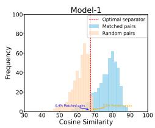

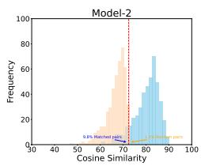

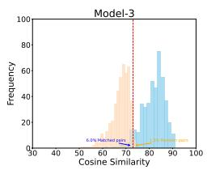

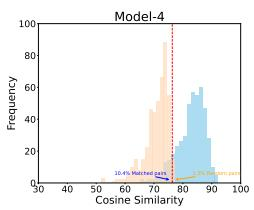

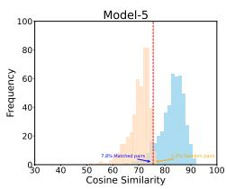  
Polish-Ukrainian pair: Ukrainian is $L _ { 1 }$ (s), Polish is $L _ { 2 }$ (t).

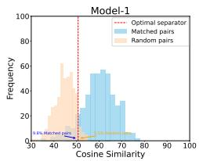

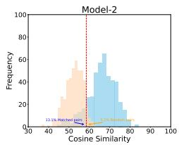

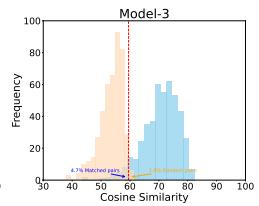

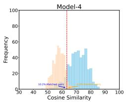  
(b) Hindi-Urdu pair: Urdu is $L _ { 1 }$ (s), Hindi is $L _ { 2 }$ (t).

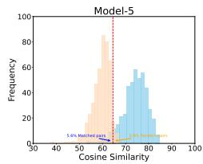  
Figure 1: Histograms of similarities for matched sentence pairs and random pairs. Adding transliterated data in pretraining improves the overall similarities for both matched and random pairs (Model-2). Leveraging auxiliary objectives improves the model's ability to differentiate between matched and random sentence pairs (Model-3,-4,-5).

tion. We then define the transliteration similarity as sim $( \mathcal { M } ( s ) , \mathcal { M } ( r _ { s } ) )$ , the translation similarity as $\sin ( \mathcal { M } ( s ) , \mathcal { M } ( t ) )$ , the transliterationtranslation similarity as $\sin ( \mathcal { M } ( r _ { s } ) , \mathcal { M } ( t ) )$ , and the transliteration-transliteration similarity as sim $( \mathcal { M } ( r _ { s } ) , \mathcal { M } ( r _ { t } ) )$ , where $\mathcal { M } ( \cdot )$ takes a text as input and encodes it as a fixed-size representation. We mean-pool the output from the 8th layer to form such fixed-size representations. For simplicity, s is always ukr (resp. urd) and t is always pol (resp. hin) for the pol-ukr (resp. hin-urd) pair, as both $\sin ( \mathcal { M } ( s ) , \mathcal { M } ( t ) )$ and sim $( \mathcal { M } ( r _ { s } ) , \mathcal { M } ( r _ { t } ) )$ are the same when interchanging the languages. See Appendix §C for the other direction.

## 5 Analysis

We interpret the results of §4.5 by establishing a connection between crosslingual alignment and four different types of similarities (§5.2). We also analyze the dynamics of these similarities during the pretraining phase (§5.3). Finally, we provide insights on how crosslingual alignment influences zero-shot crosslingual transfer performance in downstream tasks (§5.4). Our analysis in the following primarily focuses on SR-B, as the impact of each component is more pronounced (Table 2). See Appendix §B for additional analysis on SR-F.

## 5.1 Defining Similarities

For a sentence s written in its original script in language $L _ { 1 }$ , we denote as $r _ { s }$ its transliteration in Latin script, as t its translation in language $L _ { 2 } .$ and as $r _ { t }$ its transliterated transla-

## 5.2 Similarities and Alignment

As discussed in §3, good crosslingual alignment does not necessarily require a model to assign high similarity to matched sentence pairs (translations). Instead, the model should be able to differentiate matched pairs from non-matched pairs to achieve better alignment. We display the similarity between matched sentence pairs and between random sentence pairs in Figure 1. We also compare the four types of similarities in each model in Figure 2.

Adding transliterated data alone improves similarity but not alignment. As shown in §4.5, simply adding transliterated data to the training data does not improve crosslingual alignment. However, in Figure 2, we observe that translation similarity in Model-2 improves compared to Model-1 (from 77 to 80 in terms of the average similarity scores for the pol-ukr pair). This suggests that the increased lexical overlap in the added transliterated data (cf. Table 1) implicitly improves overall similarities. Unfortunately, for this model, the similarity between random sentence pairs is also increased, as shown in Figure 1, which is detrimental to crosslingual alignments. This observation agrees with some previous studies showing that encoderonly models can mistakenly assign high cosine similarity scores to both matched and random word pairs (Ethayarajh, 2019; Zhao et al., 2021).

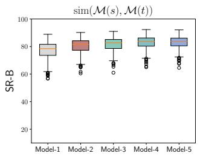

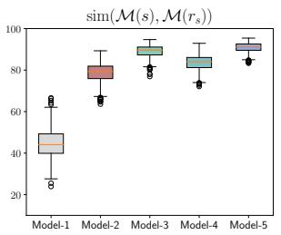

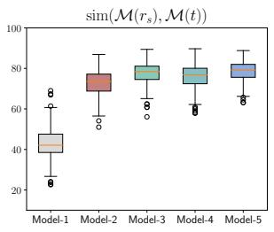

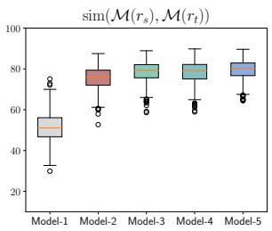  
(a) Polish-Ukrainian pair: Ukrainian is L1 (s), Polish is L2 (t).

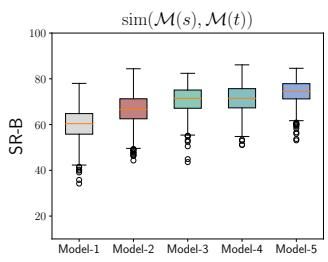

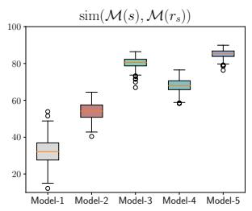

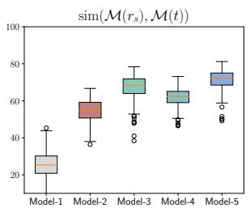

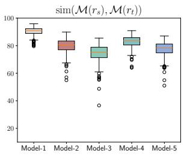  
(b) Hindi-Urdu pair: Urdu is L1 (s), Hindi is $L _ { 2 }$ (t).  
Figure 2: Comparison of different types of similarities. We observe that the inclusion of the transliterated data not only improve those similarities that involve transliterations (i.e., sim $( \mathcal { M } ( s ) , \mathcal { M } ( r _ { s } ) )$ , sim(M(rs), M(t)) and sim $( \mathcal { M } ( \boldsymbol { r } _ { s } ) , \mathcal { M } ( \boldsymbol { r } _ { t } ) ) )$ , but also the similarity between the translation pairs, i.e., sim(M(s), M(t)).

Auxiliary learning objectives improve alignments. Figures 1 and 2 show that Model-4 improves the translation similarity – similarity between the matched pairs, compared to Model-2, thanks to the inclusion of TLM. Although the similarity between random pairs also increases, the similarity gap between matched pairs and random pairs is slightly enlarged, contributing to a modest improvement in retrieval performance and crosslingual alignment. TCM is even more effective than TLM at improving overall similarities (see Figure 2), while simultaneously improving the gap between matched and random pairs (see Figure 1) This can be attributed to the contrastive objective, which not only encourages representations of paired sentences to be similar but also teaches the model to differentiate unpaired sentences. Consequently, we observe the best alignments in Model-3 and Model-5 for both language pairs.

Alignment can be improved even with a “bad" tokenizer. Unlike the pol-ukr pair, where the tokenizer already contains many Latin-script subwords due to Polish using the Latin script, the hin-urd pair does not use this script at all. Therefore, the tokenization results for the transliteration of Hindi or Urdu texts are “bad": the tokenizer often produces very long sequences composed of individual characters like “a” and “b". As a result, the overall transliteration-transliteration similarity is very high for all model variants, as shown in Figure 2, especially when no transliterated data is incorporated in the pretraining data (Model-1). However, despite such a “bad" tokenizer, the TCM objective significantly improves crosslingual alignment. This indicates that TCM does not necessarily rely on high-quality tokenizations of transliterated texts. In other words, its effectiveness is robust.

## 5.3 Similarity Dynamics During Pretraining

To analyze the dynamics of similarities, i.e., their variation during pretraining progression, we plot all four types of similarities for each model and each language pair at every 2K steps in Figure 3.4

Similarities involving transliteration decrease if no transliterated data is added. We observe high transliteration-transliteration similarity at the early stages of the pretraining in Model-1. However, because no transliterated data is added, this similarity, along with other similarities involving transliteration, gradually drops, as shown in Figure 3. When transliterated data is included, all transliteration-related similarities increase throughout pretraining (this effect is particularly clear when comparing Model-2 with Model-1). This trend can be explained by the fact that language $L _ { 1 }$ in its original script and $L _ { 1 }$ in the Latin script are intrinsically the same language. The model can quickly learn alignment between them as long as the transliterated data is included, even if explicit alignment objectives, e.g., TCM, are not used.

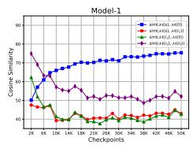

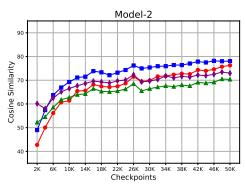

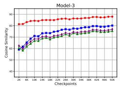

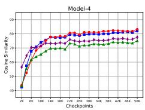

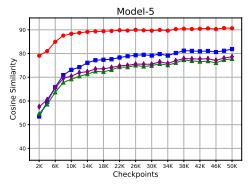

(a) Polish-Ukrainian pair: Ukrainian is $L _ { 1 }$ (s), Polish is $L _ { 2 }$ (t).  
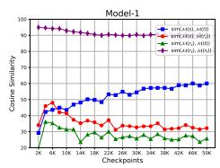

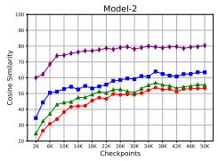

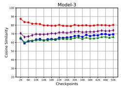

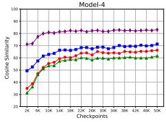

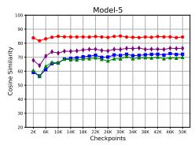  
(b) Hindi-Urdu pair: Urdu is $L _ { 1 }$ (s), Hindi is $L _ { 2 }$ (t).  
Figure 3: Dynamics of four types of similarities during training progression (from 2K to 50K checkpoints). We calculate the average of all paired sentences in SR-B for each type of similarity in each checkpoint.

Transliterations serve as an intermediary in improving translation similarity. When transliterated data is included, translation similarity increases more rapidly (as seen when comparing the similarity progression of other models with Model-1 in Figure 3). As all other similarities gradually decrease in Model-1, we can infer that the faster improvement in translation similarity shown in other models is due to the improved transliteration similarity and transliteration-transliteration similarity, by including transliterated data. For example, the similarity between hin\_Deva and hin\_Latn (transliteration similarity) is improved, so is the similarity between urd\_Arab and urd\_Latn (transliteration similarity if we refer to urd as the source language and the trend can be seen in Figure 9). The improved lexical overlap in transliterated data boosts the similarity between hin\_Latn and urd\_Latn. The combined effect ultimately leads to further improvement in the similarity between hin\_Deva and urd\_Arab (translation-translation similarity). We can observe this intermediary effect is amplified when TCM is applied, as it directly optimizes the model for higher transliteration similarity (this similarity is much higher in Model-3 and Model-5 compared to other models).

## 5.4 Downstream Crosslingual Performance

Although better alignment is expected to help crosslingual transfer, Wu and Dredze (2020), Gaschi et al. (2023) show that better token-level alignment does not always improve performance. We aim to further explore the connection between the sentence-level alignment - our focus – and downstream crosslingual performance. We evaluate this connection using three datasets: SIB200 (Adelani et al., 2024) for text classification, WikiANN (Pan et al., 2017) for named entity recognition (NER) NER, and Universal Dependencies (de Marneffe et al., 2021) for Part-ofspeech tagging (POS). We report both in-language and crosslingual transfer performance for each language pair, with the results presented in Table 3.

Auxiliary objectives can be detrimental for inlanguage evaluation but beneficial for transfer. We observe a decrease in performance when training and evaluating on the same language. For instance, for SIB200, when training on Hindi and evaluating on Hindi, Model-3, 4 and 5 are worse than Model-1. Similar trends are observed for Polish and Urdu. Conversely, when training on one language and evaluating on another, there is often a performance improvement. This suggests that auxiliary objectives may negatively impact the quality of the representations within a specific language, resulting in worse in-language performance. However, better alignment enhances the similarity of representations for similar sentences across languages, which can be beneficial for zero-shot crosslingual transfer.

<table><tr><td></td><td colspan="4">SIB200</td><td colspan="4">NER</td><td colspan="4">POS</td></tr><tr><td></td><td colspan="2">pol</td><td colspan="2">ukr</td><td colspan="2">pol</td><td colspan="2">ukr</td><td colspan="2">pol</td><td colspan="2">ukr</td></tr><tr><td></td><td>→ pol</td><td>→ ukr</td><td>→ ukr</td><td></td><td>→ pol | → pol</td><td>→ ukr</td><td>→ ukr</td><td>→ pol | → pol</td><td></td><td>→ ukr</td><td>→ ukr</td><td>→ pol</td></tr><tr><td>Model-1</td><td>80.5</td><td>74.3</td><td>81.0</td><td>77.1</td><td>85.8</td><td>54.3</td><td>89.8</td><td>53.1</td><td>98.1</td><td>89.4</td><td>96.8</td><td>87.1</td></tr><tr><td>Model-2</td><td>78.7</td><td>74.2</td><td>80.2</td><td>71.8</td><td>85.8</td><td>54.8</td><td>90.0</td><td>54.4</td><td>98.1</td><td>89.7</td><td>96.8</td><td>86.7</td></tr><tr><td>Model-3</td><td>75.4</td><td>75.1</td><td>81.0</td><td>72.7</td><td>86.0</td><td>54.0</td><td>89.7</td><td>55.3</td><td>98.1</td><td>89.7</td><td>96.9</td><td>87.0</td></tr><tr><td>Model-4</td><td>79.8</td><td>76.8</td><td>83.0</td><td>78.8</td><td>86.8</td><td>51.2</td><td>90.1</td><td>55.1</td><td>98.1</td><td>90.2</td><td>96.9</td><td>87.8</td></tr><tr><td>Model-5</td><td>78.6</td><td>77.6</td><td>81.7</td><td>75.9</td><td>86.3</td><td>53.6</td><td>90.2</td><td>57.8</td><td>98.1</td><td>90.1</td><td>97.1</td><td>87.5</td></tr><tr><td></td><td colspan="2">hin</td><td colspan="2">urd</td><td colspan="2">hin</td><td colspan="2">urd</td><td colspan="2">hin</td><td colspan="2">urd</td></tr><tr><td></td><td>→ hin</td><td>→ urd</td><td>→ urd</td><td>→ hin</td><td>→ hin</td><td>→ urd</td><td>→ urd</td><td>→ hin</td><td>→ hin</td><td>→ urd</td><td>→ urd</td><td>→ hin</td></tr><tr><td>Model-1</td><td>82.8</td><td>73.7</td><td>78.9</td><td>74.2</td><td>86.0</td><td>31.1</td><td>94.7</td><td>56.5</td><td>91.6</td><td>83.3</td><td>92.1</td><td>86.6</td></tr><tr><td>Model-2</td><td>83.1</td><td>75.1</td><td>77.6</td><td>76.3</td><td>86.1</td><td>36.7</td><td>95.5</td><td>55.0</td><td>91.6</td><td>84.1</td><td>92.0</td><td>87.2</td></tr><tr><td>Model-3</td><td>81.5</td><td>73.1</td><td>77.7</td><td>76.4</td><td>86.3</td><td>37.0</td><td>94.1</td><td>58.2</td><td>91.4</td><td>83.4</td><td>92.0</td><td>87.1</td></tr><tr><td>Model-4</td><td>82.0</td><td>72.9</td><td>77.1</td><td>74.9</td><td>86.8</td><td>34.4</td><td>94.9</td><td>62.0</td><td>91.5</td><td>83.7</td><td>92.0</td><td>87.2</td></tr><tr><td>Model-5</td><td>80.4</td><td>73.7</td><td>78.1</td><td>79.4</td><td>87.4</td><td>40.1</td><td>95.7</td><td>60.5</td><td>91.8</td><td>84.1</td><td>91.9</td><td>87.4</td></tr></table>

Table 3: Downstream performance. We fine-tune each model on the training set of one language (noted with bold font), and evaluate the resulting model on both the same language (in-language evaluation, e.g., pol → pol) and the other language (zero-shot crosslingual transfer evaluation, e.g., pol → ukr). The results are averaged over three random seeds. Bold (underlined): best (second-best) result for each column.

Better crosslingual alignment does not always improve transfer. Although Model-3, 4, and 5 demonstrate better alignment compared to Model-1 (cf. Table 2), the crosslingual transfer performance does not substantially improve – especially when considering the magnitude of alignment improvement seen in Table 2. This is particularly clear in sequential tasks like NER and POS, where all models achieve comparable performance, regardless of whether the evaluation is in-language or crosslingual. Even for SIB200, the improvement in Model-3, 4 and 5 is inconsistent: there is much better transfer performance for the directions pol → ukr and urd → hin but slightly worse performance for the directions ukr → pol and hin → urd. Therefore, our results suggest that better sentence-level crosslingual alignments do not consistently lead to improved crosslingual transfer, especially for sequential tasks such as NER and POS. We conjecture that the lack of explicit token-level alignment objectives with word-level aligned data in our models might explain why we do not see improvements in these tasks, similar to the findings from Chaudhary et al. (2020) and Xhelili et al. (2024).

## 6 Conclusion

Our work presents the first in-depth study exploring why and how transliterations contribute to better crosslingual alignment. We show that adding transliterated data can improve crosslingual alignment as transliteration acts as an intermediary between pairs of mutual translations. This effect is particularly pronounced when auxiliary alignment objectives are applied, allowing models to better distinguish matched pairs from random pairs, thereby improving the overall alignment. However, our empirical results also show that improved alignment does not consistently produce better downstream performance, suggesting more research is needed to better understand the relationship between crosslingual alignment and crosslingual transfer.

## 7 Future Work

We see possible future work to overcome the limitations mentioned in the Limitations Section. A possible direction to expand this work is to explore more language pairs, or even involve more than two related languages in the training to investigate the effect of transliteration in a highly multilingual context. For further assessing token-level alignment, one possible way is to use word-level aligned data, which is unfortunately not much in the community. As an alternative, one can use (round-trip) word alignments, which have been shown to be very hard to find (ImaniGooghari et al., 2023).

## Limitations

This work presents the first attempt to explain why the transliteration-augmented methods can improve crosslingual alignment, which usually requires parallel data in the training or fine-tuning. One possible limitation is the number of language pairs we consider: we only use two language pairs, each of which contains two related languages that use different scripts. Another possible limitation is that we only focus on the sentence-level crosslingual alignment in this paper and do not discuss the token-level crosslingual alignment.

## Acknowledgements

This research was supported by DFG (grant SCHU 2246/14-1) and The European Research Council (NonSequeToR, grant #740516).

## References

Josh Achiam, Steven Adler, Sandhini Agarwal, Lama Ahmad, Ilge Akkaya, Florencia Leoni Aleman, Diogo Almeida, Janko Altenschmidt, Sam Altman, Shyamal Anadkat, et al. 2023. Gpt-4 technical report. arXiv preprint arXiv:2303.08774.

David Adelani, Hannah Liu, Xiaoyu Shen, Nikita Vassilyev, Jesujoba Alabi, Yanke Mao, Haonan Gao, and En-Shiun Lee. 2024. SIB-200: A simple, inclusive, and big evaluation dataset for topic classification in 200+ languages and dialects. In Proceedings of the 18th Conference of the European Chapter of the Association for Computational Linguistics (Volume 1: Long Papers), pages 226–245, St. Julian's, Malta. Association for Computational Linguistics.

Jesujoba O. Alabi, David Ifeoluwa Adelani, Marius Mosbach, and Dietrich Klakow. 2022. Adapting pretrained language models to African languages via multilingual adaptive fine-tuning. In Proceedings of the 29th International Conference on Computational Linguistics, pages 4336–4349, Gyeongju, Republic of Korea. International Committee on Computational Linguistics.

Chantal Amrhein and Rico Sennrich. 2020. On Romanization for model transfer between scripts in neural machine translation. In Findings of the Association for Computational Linguistics: EMNLP 2020, pages 2461–2469, Online. Association for Computational Linguistics.

Mikel Artetxe and Holger Schwenk. 2019. Massively multilingual sentence embeddings for zeroshot cross-lingual transfer and beyond. Transactions of the Association for Computational Linguistics, 7:597–610.

Steven Cao, Nikita Kitaev, and Dan Klein. 2020. Multilingual alignment of contextual word representations. In 8th International Conference on Learning Representations, ICLR 2020, Addis Ababa, Ethiopia, April 26-30, 2020. OpenReview.net.

Aditi Chaudhary, Karthik Raman, Krishna Srinivasan, and Jiecao Chen. 2020. Dict-mlm: Improved multilingual pre-training using bilingual dictionaries. arXiv preprint arXiv:2010.12566.

Zewen Chi, Li Dong, Furu Wei, Nan Yang, Saksham Singhal, Wenhui Wang, Xia Song, Xian-Ling Mao, Heyan Huang, and Ming Zhou. 2021a. InfoXLM: An information-theoretic framework for cross-lingual language model pre-training. In Proceedings of the 2021 Conference of the North American Chapter of

the Association for Computational Linguistics: Human Language Technologies, pages 3576–3588, Online. Association for Computational Linguistics.

Zewen Chi, Li Dong, Bo Zheng, Shaohan Huang, Xian-Ling Mao, Heyan Huang, and Furu Wei. 2021b. Improving pretrained cross-lingual language models via self-labeled word alignment. In Proceedings of the 59th Annual Meeting of the Association for Computational Linguistics and the 11th International Joint Conference on Natural Language Processing (Volume 1: Long Papers), pages 3418–3430, Online. Association for Computational Linguistics.

Sumit Chopra, Raia Hadsell, and Yann LeCun. 2005. Learning a similarity metric discriminatively, with application to face verification. In 2005 IEEE Computer Society Conference on Computer Vision and Pattern Recognition (CVPR 2005), 20-26 June 2005, San Diego, CA, USA, pages 539–546. IEEE Computer Society.

Alexis Conneau, Kartikay Khandelwal, Naman Goyal, Vishrav Chaudhary, Guillaume Wenzek, Francisco Guzmán, Edouard Grave, Myle Ott, Luke Zettlemoyer, and Veselin Stoyanov. 2020. Unsupervised cross-lingual representation learning at scale. In Proceedings of the 58th Annual Meeting of the Association for Computational Linguistics, pages 8440– 8451, Online. Association for Computational Linguistics.

Alexis Conneau and Guillaume Lample. 2019. Crosslingual language model pretraining. In Advances in Neural Information Processing Systems 32: Annual Conference on Neural Information Processing Systems 2019, NeurIPS 2019, December 8-14, 2019, Vancouver, BC, Canada, pages 7057–7067.

Marie-Catherine de Marneffe, Christopher D. Manning, Joakim Nivre, and Daniel Zeman. 2021. Universal Dependencies. Computational Linguistics, 47(2):255–308.

Jacob Devlin, Ming-Wei Chang, Kenton Lee, and Kristina Toutanova. 2019. BERT: Pre-training of deep bidirectional transformers for language understanding. In Proceedings of the 2019 Conference of the North American Chapter of the Association for Computational Linguistics: Human Language Technologies, Volume 1 (Long and Short Papers), pages 4171–4186, Minneapolis, Minnesota. Association for Computational Linguistics.

Tejas Dhamecha, Rudra Murthy, Samarth Bharadwaj, Karthik Sankaranarayanan, and Pushpak Bhattacharyya. 2021. Role of Language Relatedness in Multilingual Fine-tuning of Language Models: A Case Study in Indo-Aryan Languages. In Proceedings of the 2021 Conference on Empirical Methods in Natural Language Processing, pages 8584–8595, Online and Punta Cana, Dominican Republic. Association for Computational Linguistics.

Philipp Dufter and Hinrich Schütze. 2020. Identifying elements essential for BERT's multilinguality. In

Proceedings of the 2020 Conference on Empirical Methods in Natural Language Processing (EMNLP), pages 4423–4437, Online. Association for Computational Linguistics.

Pavel Efimov, Leonid Boytsov, Elena Arslanova, and Pavel Braslavski. 2023. The impact of cross-lingual adjustment of contextual word representations on zero-shot transfer. In Advances in Information Retrieval - 45th European Conference on Information Retrieval, ECIR 2023, Dublin, Ireland, April 2-6, 2023, Proceedings, Part III, volume 13982 of Lecture Notes in Computer Science, pages 51–67. Springer.

Kawin Ethayarajh. 2019. How contextual are contextualized word representations? Comparing the geometry of BERT, ELMo, and GPT-2 embeddings. In Proceedings of the 2019 Conference on Empirical Methods in Natural Language Processing and the 9th International Joint Conference on Natural Language Processing (EMNLP-IJCNLP), pages 55–65, Hong Kong, China. Association for Computational Linguistics.

Angela Fan, Shruti Bhosale, Holger Schwenk, Zhiyi Ma, Ahmed El-Kishky, Siddharth Goyal, Mandeep Baines, Onur Celebi, Guillaume Wenzek, Vishrav Chaudhary, et al. 2021. Beyond english-centric multilingual machine translation. Journal of Machine Learning Research, 22(107):1–48.

Tianyu Gao, Xingcheng Yao, and Danqi Chen. 2021. SimCSE: Simple contrastive learning of sentence embeddings. In Proceedings of the 2021 Conference on Empirical Methods in Natural Language Processing, pages 6894–6910, Online and Punta Cana, Dominican Republic. Association for Computational Linguistics.

Felix Gaschi, Patricio Cerda, Parisa Rastin, and Yannick Toussaint. 2023. Exploring the relationship between alignment and cross-lingual transfer in multilingual transformers. In Findings of the Association for Computational Linguistics: ACL 2023, pages 3020–3042, Toronto, Canada. Association for Computational Linguistics.

Katharina Hämmerl, Jindřich Libovický, and Alexander Fraser. 2024. Understanding cross-lingual Alignment—A survey. In Findings of the Association for Computational Linguistics ACL 2024, pages 10922–10943, Bangkok, Thailand and virtual meeting. Association for Computational Linguistics.

Ulf Hermjakob, Jonathan May, and Kevin Knight. 2018. Out-of-the-box universal Romanization tool uroman. In Proceedings of ACL 2018, System Demonstrations, pages 13–18, Melbourne, Australia. Association for Computational Linguistics.

Junjie Hu, Melvin Johnson, Orhan Firat, Aditya Siddhant, and Graham Neubig. 2021. Explicit alignment objectives for multilingual bidirectional encoders. In Proceedings of the 2021 Conference of the North American Chapter of the Association for Computational Linguistics: Human Language Technologies,

pages 3633–3643, Online. Association for Computational Linguistics.

Junjie Hu, Sebastian Ruder, Aditya Siddhant, Graham Neubig, Orhan Firat, and Melvin Johnson. 2020. XTREME: A massively multilingual multitask benchmark for evaluating cross-lingual generalisation. In Proceedings of the 37th International Conference on Machine Learning, ICML 2020, 13-18 July 2020, Virtual Event, volume 119 of Proceedings of Machine Learning Research, pages 4411–4421. PMLR.

Tianze Hua, Tian Yun, and Ellie Pavlick. 2024. mOthello: When do cross-lingual representation alignment and cross-lingual transfer emerge in multilingual models? In Findings of the Association for Computational Linguistics: NAACL 2024, pages 1585–1598, Mexico City, Mexico. Association for Computational Linguistics.

Haoyang Huang, Yaobo Liang, Nan Duan, Ming Gong, Linjun Shou, Daxin Jiang, and Ming Zhou. 2019. Unicoder: A universal language encoder by pretraining with multiple cross-lingual tasks. In Proceedings of the 2019 Conference on Empirical Methods in Natural Language Processing and the 9th International Joint Conference on Natural Language Processing (EMNLP-IJCNLP), pages 2485–2494, Hong Kong, China. Association for Computational Linguistics.

Ayyoob ImaniGooghari, Peiqin Lin, Amir Hossein Kargaran, Silvia Severini, Masoud Jalili Sabet, Nora Kassner, Chunlan Ma, Helmut Schmid, André Martins, François Yvon, and Hinrich Schütze. 2023. Glot500: Scaling multilingual corpora and language models to 500 languages. In Proceedings of the 61st Annual Meeting of the Association for Computational Linguistics (Volume 1: Long Papers), pages 1082– 1117, Toronto, Canada. Association for Computational Linguistics.

Diederik P. Kingma and Jimmy Ba. 2015. Adam: A method for stochastic optimization. In 3rd International Conference on Learning Representations, ICLR 2015, San Diego, CA, USA, May 7-9, 2015, Conference Track Proceedings.

Taku Kudo. 2018. Subword regularization: Improving neural network translation models with multiple subword candidates. In Proceedings of the 56th Annual Meeting of the Association for Computational Linguistics (Volume 1: Long Papers), pages 66–75, Melbourne, Australia. Association for Computational Linguistics.

Taku Kudo and John Richardson. 2018. SentencePiece: A simple and language independent subword tokenizer and detokenizer for neural text processing. In Proceedings of the 2018 Conference on Empirical Methods in Natural Language Processing: System Demonstrations, pages 66–71, Brussels, Belgium. Association for Computational Linguistics.

Davis Liang, Hila Gonen, Yuning Mao, Rui Hou, Naman Goyal, Marjan Ghazvininejad, Luke Zettlemoyer, and Madian Khabsa. 2023. XLM-V: Overcoming the vocabulary bottleneck in multilingual masked language models. In Proceedings of the 2023 Conference on Empirical Methods in Natural Language Processing, pages 13142–13152, Singapore. Association for Computational Linguistics.

Xi Victoria Lin, Todor Mihaylov, Mikel Artetxe, Tianlu Wang, Shuohui Chen, Daniel Simig, Myle Ott, Naman Goyal, Shruti Bhosale, Jingfei Du, Ramakanth Pasunuru, Sam Shleifer, Punit Singh Koura, Vishrav Chaudhary, Brian O'Horo, Jeff Wang, Luke Zettlemoyer, Zornitsa Kozareva, Mona Diab, Veselin Stoyanov, and Xian Li. 2022. Few-shot learning with multilingual generative language models. In Proceedings of the 2022 Conference on Empirical Methods in Natural Language Processing, pages 9019–9052, Abu Dhabi, United Arab Emirates. Association for Computational Linguistics.

Yihong Liu, Peiqin Lin, Mingyang Wang, and Hinrich Schuetze. 2024a. OFA: A framework of initializing unseen subword embeddings for efficient large-scale multilingual continued pretraining. In Findings of the Association for Computational Linguistics: NAACL 2024, pages 1067–1097, Mexico City, Mexico. Association for Computational Linguistics.

Yihong Liu, Chunlan Ma, Haotian Ye, and Hinrich Schuetze. 2024b. TransliCo: A contrastive learning framework to address the script barrier in multilingual pretrained language models. In Proceedings of the 62nd Annual Meeting of the Association for Computational Linguistics (Volume 1: Long Papers), pages 2476–2499, Bangkok, Thailand. Association for Computational Linguistics.

Yihong Liu, Chunlan Ma, Haotian Ye, and Hinrich Schütze. 2024c. Transmi: A framework to create strong baselines from multilingual pretrained language models for transliterated data. arXiv preprint arXiv:2405.09913.

Yinhan Liu, Jiatao Gu, Naman Goyal, Xian Li, Sergey Edunov, Marjan Ghazvininejad, Mike Lewis, and Luke Zettlemoyer. 2020. Multilingual denoising pretraining for neural machine translation. Transactions of the Association for Computational Linguistics, 8:726–742.

Ilya Loshchilov and Frank Hutter. 2019. Decoupled weight decay regularization. In 7th International Conference on Learning Representations, ICLR 2019, New Orleans, LA, USA, May 6-9, 2019. OpenReview.net.

Chunlan Ma, Yihong Liu, Haotian Ye, and Hinrich Schütze. 2024. Exploring the role of transliteration in in-context learning for low-resource languages written in non-latin scripts. arXiv preprint arXiv:2407.02320.

Paulius Micikevicius, Sharan Narang, Jonah Alben, Gregory F. Diamos, Erich Elsen, David García

Boris Ginsburg, Michael Houston, Oleksii Kuchaiev, Ganesh Venkatesh, and Hao Wu. 2018. Mixed precision training. In 6th International Conference on Learning Representations, ICLR 2018, Vancouver, BC, Canada, April 30 - May 3, 2018, Conference Track Proceedings. OpenReview.net.

Ibraheem Muhammad Moosa, Mahmud Elahi Akhter, and Ashfia Binte Habib. 2023. Does transliteration help multilingual language modeling? In Findings of the Association for Computational Linguistics: EACL 2023, pages 670–685, Dubrovnik, Croatia. Association for Computational Linguistics.

Benjamin Muller, Antonios Anastasopoulos, Benoît Sagot, and Djamé Seddah. 2021. When being unseen from mBERT is just the beginning: Handling new languages with multilingual language models. In Proceedings of the 2021 Conference of the North American Chapter of the Association for Computational Linguistics: Human Language Technologies, pages 448–462, Online. Association for Computational Linguistics.

Kelechi Ogueji, Yuxin Zhu, and Jimmy Lin. 2021. Small data? no problem! exploring the viability of pretrained multilingual language models for lowresourced languages. In Proceedings of the 1st Workshop on Multilingual Representation Learning, pages 116–126, Punta Cana, Dominican Republic. Association for Computational Linguistics.

Lin Pan, Chung-Wei Hang, Haode Qi, Abhishek Shah, Saloni Potdar, and Mo Yu. 2021. Multilingual BERT post-pretraining alignment. In Proceedings of the 2021 Conference of the North American Chapter of the Association for Computational Linguistics: Human Language Technologies, pages 210–219, Online. Association for Computational Linguistics.

Xiaoman Pan, Boliang Zhang, Jonathan May, Joel Nothman, Kevin Knight, and Heng Ji. 2017. Cross-lingual name tagging and linking for 282 languages. In Proceedings of the 55th Annual Meeting of the Association for Computational Linguistics (Volume 1: Long Papers), pages 1946–1958, Vancouver, Canada. Association for Computational Linguistics.

Fred Philippy, Siwen Guo, and Shohreh Haddadan. 2023. Towards a common understanding of contributing factors for cross-lingual transfer in multilingual language models: A review. In Proceedings of the 61st annual meeting of the association for computational linguistics (volume 1: Long papers), pages 5877–5891, Toronto, Canada. Association for Computational Linguistics.

Telmo Pires, Eva Schlinger, and Dan Garrette. 2019. How multilingual is multilingual BERT? In Proceedings of the 57th Annual Meeting of the Association for Computational Linguistics, pages 4996–5001, Florence, Italy. Association for Computational Linguistics.

Sukannya Purkayastha, Sebastian Ruder, Jonas Pfeiffer, Iryna Gurevych, and Ivan Vulić. 2023.

Romanization-based large-scale adaptation of multilingual language models. In Findings of the Association for Computational Linguistics: EMNLP 2023, pages 7996–8005, Singapore. Association for Computational Linguistics.

Alec Radford, Jeffrey Wu, Rewon Child, David Luan, Dario Amodei, Ilya Sutskever, et al. 2019. Language models are unsupervised multitask learners. OpenAI blog, 1(8):9.

Machel Reid and Mikel Artetxe. 2022. PARADISE: Exploiting parallel data for multilingual sequenceto-sequence pretraining. In Proceedings of the 2022 Conference of the North American Chapter of the Association for Computational Linguistics: Human Language Technologies, pages 800–810, Seattle, United States. Association for Computational Linguistics.

Nils Reimers and Iryna Gurevych. 2020. Making monolingual sentence embeddings multilingual using knowledge distillation. In Proceedings of the 2020 Conference on Empirical Methods in Natural Language Processing (EMNLP), pages 4512–4525, Online. Association for Computational Linguistics.

Uma Roy, Noah Constant, Rami Al-Rfou, Aditya Barua, Aaron Phillips, and Yinfei Yang. 2020. LAReQA: Language-agnostic answer retrieval from a multilingual pool. In Proceedings of the 2020 Conference on Empirical Methods in Natural Language Processing (EMNLP), pages 5919–5930, Online. Association for Computational Linguistics.

Teven Le Scao, Angela Fan, Christopher Akiki, Ellie Pavlick, Suzana Ilić, Daniel Hesslow, Roman Castagné, Alexandra Sasha Luccioni, François Yvon, Matthias Gallé, et al. 2022. Bloom: A 176bparameter open-access multilingual language model. arXiv preprint arXiv:2211.05100.

Anton Schäfer, Shauli Ravfogel, Thomas Hofmann, Tiago Pimentel, and Imanol Schlag. 2024. Language imbalance can boost cross-lingual generalisation. arXiv preprint arXiv:2404.07982.

Oleh Shliazhko, Alena Fenogenova, Maria Tikhonova, Vladislav Mikhailov, Anastasia Kozlova, and Tatiana Shavrina. 2022. mgpt: Few-shot learners go multilingual. arXiv preprint arXiv:2204.07580.

NLLB Team. 2024. Scaling neural machine translation to 200 languages. Nature, 630(8018):841–846.

Hugo Touvron, Louis Martin, Kevin Stone, Peter Albert, Amjad Almahairi, Yasmine Babaei, Nikolay Bashlykov, Soumya Batra, Prajjwal Bhargava, Shruti Bhosale, et al. 2023. Llama 2: Open foundation and fine-tuned chat models. arXiv preprint arXiv:2307.09288.

Ahmet Üstün, Viraat Aryabumi, Zheng-Xin Yong, Wei-Yin Ko, Daniel D'souza, Gbemileke Onilude, Neel Bhandari, Shivalika Singh, Hui-Lee Ooi, Amr Kayid, et al. 2024. Aya model: An instruction finetuned

open-access multilingual language model. arXiv preprint arXiv:2402.07827.

Ashish Vaswani, Noam Shazeer, Niki Parmar, Jakob Uszkoreit, Llion Jones, Aidan N Gomez, Ł ukasz Kaiser, and Illia Polosukhin. 2017. Attention is all you need. In Advances in Neural Information Processing Systems, volume 30. Curran Associates, Inc.

Mingyang Wang, Heike Adel, Lukas Lange, Jannik Strötgen, and Hinrich Schütze. 2023. NLNDE at SemEval-2023 task 12: Adaptive pretraining and source language selection for low-resource multilingual sentiment analysis. In Proceedings of the 17th International Workshop on Semantic Evaluation (SemEval-2023), pages 488–497, Toronto, Canada. Association for Computational Linguistics.

Xinyi Wang, Sebastian Ruder, and Graham Neubig. 2022a. Expanding pretrained models to thousands more languages via lexicon-based adaptation. In Proceedings of the 60th Annual Meeting of the Association for Computational Linguistics (Volume 1: Long Papers), pages 863–877, Dublin, Ireland. Association for Computational Linguistics.

Yaushian Wang, Ashley Wu, and Graham Neubig. 2022b. English contrastive learning can learn universal cross-lingual sentence embeddings. In Proceedings of the 2022 Conference on Empirical Methods in Natural Language Processing, pages 9122–9133, Abu Dhabi, United Arab Emirates. Association for Computational Linguistics.

Xiangpeng Wei, Rongxiang Weng, Yue Hu, Luxi Xing, Heng Yu, and Weihua Luo. 2021. On learning universal representations across languages. In 9th International Conference on Learning Representations, ICLR 2021, Virtual Event, Austria, May 3-7, 2021. OpenReview.net.

Hans H Wellisch, Richard Foreman, Lee Breuer, and Robert Wilson. 1978. The conversion of scripts, its nature, history, and utilization.

Shijie Wu and Mark Dredze. 2020. Do explicit alignments robustly improve multilingual encoders? In Proceedings of the 2020 Conference on Empirical Methods in Natural Language Processing (EMNLP), pages 4471–4482, Online. Association for Computational Linguistics.

Orgest Xhelili, Yihong Liu, and Hinrich Schuetze. 2024. Breaking the script barrier in multilingual pretrained language models with transliteration-based post-training alignment. In Findings of the Association for Computational Linguistics: EMNLP 2024, pages 11283–11296, Miami, Florida, USA. Association for Computational Linguistics.

Linting Xue, Noah Constant, Adam Roberts, Mihir Kale, Rami Al-Rfou, Aditya Siddhant, Aditya Barua, and Colin Raffel. 2021. mT5: A massively multilingual pre-trained text-to-text transformer. In Proceedings of the 2021 Conference of the North American Chapter of the Association for Computational Linguistics:

Human Language Technologies, pages 483–498, Online. Association for Computational Linguistics.

Miaoran Zhang, Mingyang Wang, Jesujoba Alabi, and Dietrich Klakow. 2024. AAdaM at SemEval-2024 task 1: Augmentation and adaptation for multilingual semantic textual relatedness. In Proceedings of the 18th International Workshop on Semantic Evaluation (SemEval-2024), pages 800–810, Mexico City, Mexico. Association for Computational Linguistics.

Jun Zhao, Zhihao Zhang, Qi Zhang, Tao Gui, and Xuanjing Huang. 2024a. Llama beyond english: An empirical study on language capability transfer. arXiv preprint arXiv:2401.01055.

Wei Zhao, Steffen Eger, Johannes Bjerva, and Isabelle Augenstein. 2021. Inducing language-agnostic multilingual representations. In Proceedings of \*SEM 2021: The Tenth Joint Conference on Lexical and Computational Semantics, pages 229–240, Online. Association for Computational Linguistics.

Yiran Zhao, Wenxuan Zhang, Guizhen Chen, Kenji Kawaguchi, and Lidong Bing. 2024b. How do large language models handle multilingualism? arXiv preprint arXiv:2402.18815.

## A Training Details

To pretrain different model variants for each language pair, we use the AdamW optimizer (Kingma and Ba, 2015; Loshchilov and Hutter, 2019) with $( \beta _ { 1 } , \beta _ { 2 } ) = ( 0 . 9 , 0 . 9 9 9 )$ and € = 1e-6. The initial learning rate is set to 5e-5. The effective batch size is 1,024 in each training step, with gradient accumulation set to 16 and 8 training instances (each instance contains a pair of sentences, see paragraph below for explanation) are used for each of the 8 NVIDIA RTX 2080Ti GPUs (8 × 8 × 16 = 1, 024). We use FP16 training with mixed precision (Micikevicius et al., 2018). We store checkpoints every 2K steps and apply early stopping based on the best average performance on SR-B retrieval task. The pretraining takes around 2 days for each model.

Except for Model-1, all other models double the training data due to the inclusion of transliterated data. This can result in a different number of parameter updates in an epoch between Model-1 and other models (the hyperparameters used by the AdamW optimizer will be different for each step), adding confounding variables to our analysis. To solve this problem, every instance in each batch is a pair of sentences in the pretraining. For Model-1, two identical sentences (in the original script) are used to form a pair, whereas a sentence and its transliteration are used to form a pair in other models. This setup ensures the total training steps in an epoch are the same for all models.

## B Additional Analysis on SR-F

We show the similarity between matched sentence pairs and between random sentence pairs from SR-F in Figure 4. We see a similar trend as for SR-B. However, because each sentence in Flores (Team 2024) is relatively simple and quite different from the other sentences in the dataset, the similarity gap between matched and random pairs is already quite large. Therefore, the effect of including transliterations or auxiliary objectives is marginal. Similarly, we visualize the four types of similarities in each model for SR-F in Figure 5. The trend remains almost the same as for SR-B: including the transliterated data improves all similarities and the usage of transliteration-based alignment objectives can further improve overall similarities.

We plot all four types of similarities measured using SR-F for each model and language pair throughtout pretraining in Figure 6. The trend is almost identical to what we observe when measuring the similarity using SR-B: including transliterations has a direct effect on transliteration-transliteration similarity and transliterations can implicitly improve the translation similarity since transliterations work as an intermediary.

## C Additional Analysis on the Other Direction

We also compute the different types of similarities using the other directions for each language pair. Specifically, we use pol → ukr for the pol-ukr pair and hin → urd for the hin-urd pair. We show the comparison of the similarities in Figure 7 (using SR-B) and in Figure 8 (using SR-F). Additionally, we show the dynamics of how the similarities vary throughout the pretraining phase in Figure 9 (using SR-B) and Figure 10 (using SR-F).

The general trend remains roughly the same for the hin-urd pair regardless of which direction is used for calculating the similarity. For the pol-ukr pair, because Polish uses Latin script by default and Uroman only removes the diacritics, the transliteration similarity, i.e., sim $( \mathcal { M } ( s ) , \mathcal { M } ( r _ { s } ) )$ , remains high throughout the pretraining, as shown in Figure 9 and Figure 10. We also observe that, without including transliterated data (Model-1), the model already yields high transliteration similarity. Once the transliterated data is included in the pretraining (Model-2, -3, -4, and -5), the transliteration similarity further improves, as shown in Figure 7 and Figure 8, which is expected.

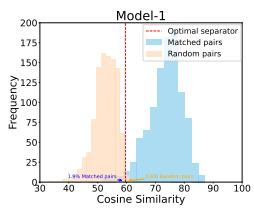

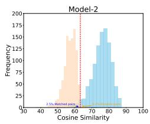

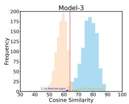

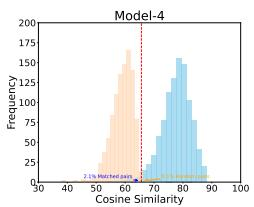

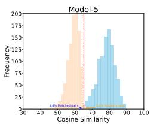

(a) Polish-Ukrainian pair: Ukrainian is L1 (s), Polish is L2 (t).  
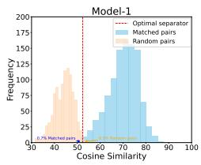

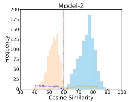

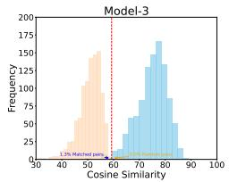  
(b) Hindi-Urdu pair: Urdu is $L _ { 1 }$ (s), Hindi is $L _ { 2 }$ (t).

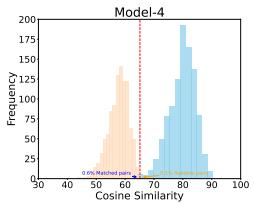

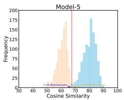

Figure 4: Histograms of similarities for matched sentence pairs and random pairs. Adding transliterated data in pretraining improves the overall similarities for both matched and random pairs. Leveraging auxiliary objectives improves the model's ability to differentiate between matched sentence pairs from random sentence pairs.

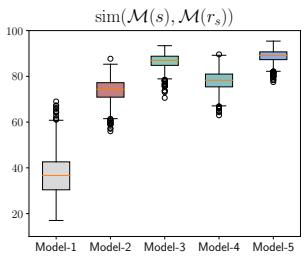

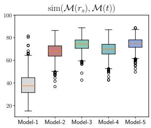

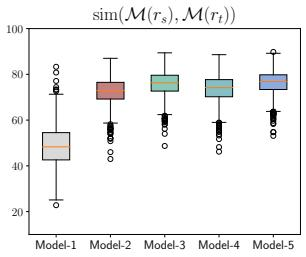

(a) Polish-Ukrainian pair: Ukrainian is $L _ { 1 }$ (s), Polish is $L _ { 2 }$ (t).  
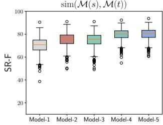

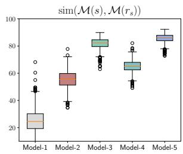

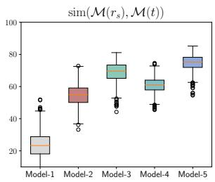

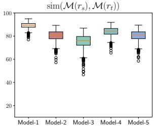  
(b) Hindi-Urdu pair: Urdu is $L _ { 1 }$ (s), Hindi is $L _ { 2 }$ (t).

Figure 5: Comparison of different types of similarities (measured using SR-F).  
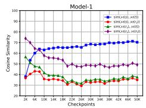

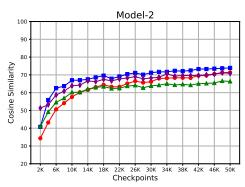

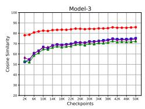

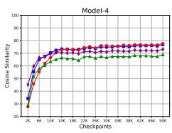

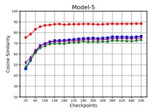

(a) Polish-Ukrainian pair: Ukrainian is $L _ { 1 }$ (s), Polish is L2 (t)  

  
(b) Hindi-Urdu pair: Urdu is $L _ { 1 }$ (s), Hindi is $L _ { 2 }$ (t).

  
Figure 6: Dynamics of four types of similarities during training progression (measured using SR-F).

  
(a) Polish-Ukrainian pair: Polish is L1 (s), Ukrainian is L2 (t)

  
(b) Hindi-Urdu pair: Hindi is $L _ { 1 }$ (s), Urdu is $L _ { 2 }$ (t).

  
Figure 7: Comparison of different types of similarities for directions pol → ukr and hin → urd (measured using SR-B).

  
(a) Polish-Ukrainian pair: Polish is $L _ { 1 }$ (s), Ukrainian is $L _ { 2 }$ (t).

  
(b) Hindi-Urdu pair: Hindi is $L _ { 1 }$ (s), Urdu is $L _ { 2 }$ (t).

  
Figure 8: Comparison of different types of similarities for directions pol → ukr and hin → urd (measured using SR-F).

(a) Polish-Ukrainian pair: Polish is $L _ { 1 }$ (s), Ukrainian is L2 (t).  

  
(b) Hindi-Urdu pair: Hindi is $L _ { 1 }$ (s), Urdu is $L _ { 2 }$ (t).

Figure 9: Dynamics of four types of similarities during training progression for directions pol → ukr and hin → urd (measured using SR-B).

(a) Polish-Ukrainian pair: Polish is $L _ { 1 }$ (s), Ukrainian is L2 (t).  

  
(b) Hindi-Urdu pair: Hindi is $L _ { 1 }$ (s), Urdu is $L _ { 2 } \left( t \right) .$

Figure 10: Dynamics of four types of similarities during training progression for directions pol → ukr and hin → urd (measured using SR-F).