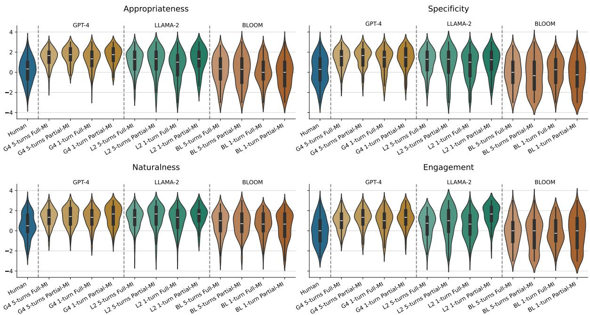
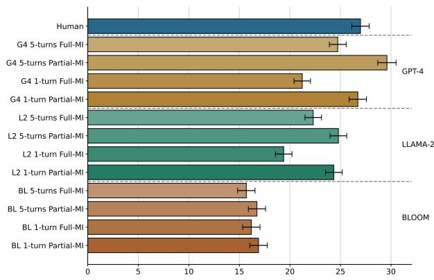
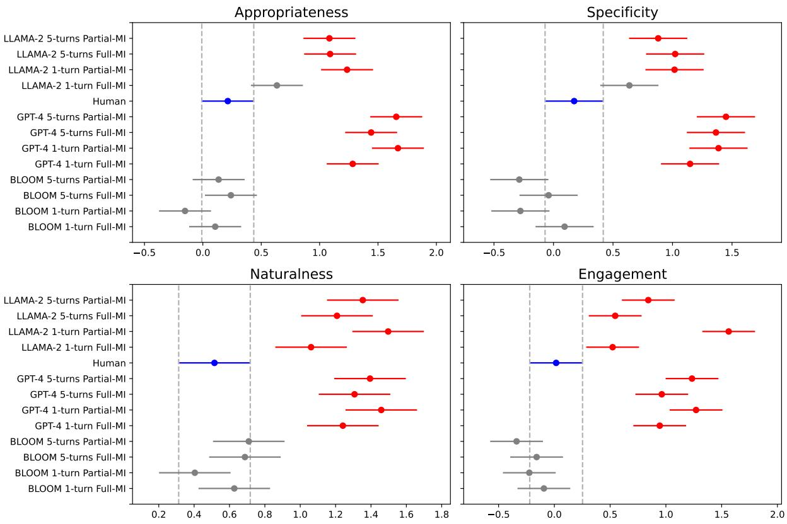
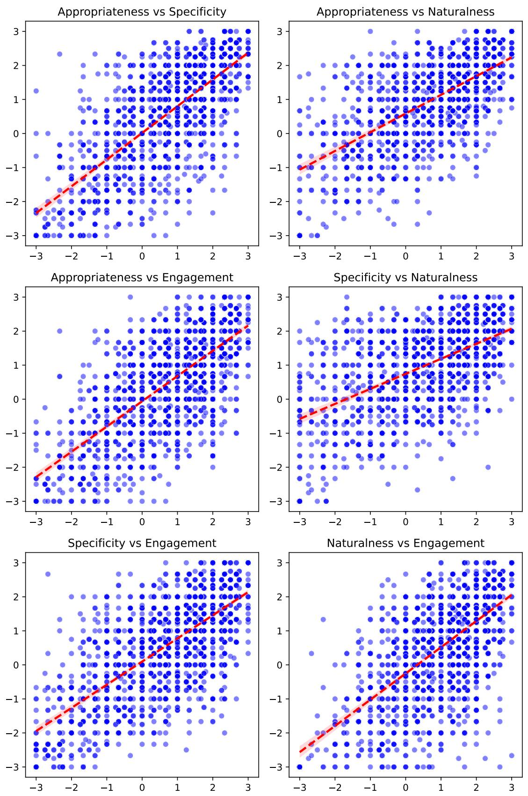
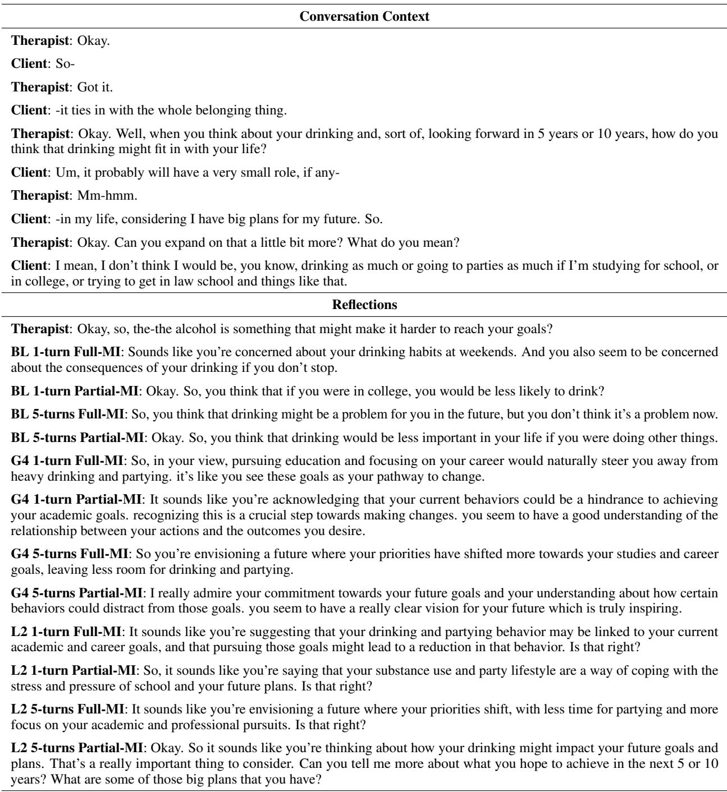

# How Well Can Large Language Models Reflect? A Human Evaluation of LLM-generated Reflections for Motivational Interviewing Dialogues

Erkan Ba¸sar\*1, Xin Sun\*†2, Iris Hendrickx3, Jan de Wit4, Tibor Bosse1, Gert-Jan de Bruijn5, Jos A. Bosch2, and Emiel Krahmer4

3Centre for Language Studies, Radboud University, The Netherlands 4Tilburg School of Humanities and Digital Sciences, Tilburg University, The Netherlands 5Department of Communication Studies, University of Antwerp, Belgium {erkan.basar, iris.hendrickx, tibor.bosse}@ru.nl, {x.sun2,j.a.bosch}@uva.nl, gert-jan.debruijn@uantwerpen.be, {j.m.s.dewit,e.j.krahmer}@tilburguniversity.edu

## Abstract

Motivational Interviewing (MI) is a counseling technique that promotes behavioral change through reflective responses to mirror or refine client statements. While advanced Large Language Models (LLMs) can generate engaging dialogues, challenges remain for applying them in a sensitive context such as MI. This work assesses the potential of LLMs to generate MI reflections via three LLMs: GPT-4, Llama-2, and BLOOM, and explores the effect of dialogue context size and integration of MI strategies for reflection generation by LLMs. We conduct evaluations using both automatic metrics and human judges on four criteria: appropriateness, relevance, engagement, and naturalness, to assess whether these LLMs can accurately generate the nuanced therapeutic communication required in MI. While we demonstrate LLMs potential in generating MI reflections comparable to human therapists, content analysis shows that significant challenges remain. By identi fying the strengths and limitations of LLMs in generating empathetic and contextually appropriate reflections in MI, this work contributes to the ongoing dialogue in enhancing LLM’s role in therapeutic counseling.

## 1 Introduction

Motivational Interviewing (MI) is an effective client-centered counseling technique designed to encourage behavioral change by helping clients explore and resolve ambivalence (Miller and Rollnick, 2012). Reflective responses, which mirror or subtly rephrase clients’ statements, are central to MI, deepening clients’ motivation for behavioral change (Miller and Rollnick, 2012; Martins and

McNeil, 2009). The empathetic reflections can enhance client engagement and therapeutic alliance, thereby influencing therapeutic outcomes.

Recently, there has been growing interest in how technology, particularly chatbots, can complement MI-based interventions (Park et al., 2019; Sun et al., 2023). Besides their potential for scalability and cost-effectiveness, chatbots offer additional advantages including 24/7 availability, and the ability to provide anonymous and non-judgmental support. Traditional MI chatbots have relied on expertwritten scripts and predefined rules to produce therapeutic dialogues (Xu and Zhuang, 2022; Park et al., 2019; Zhang et al., 2020a; He et al., 2022; Sun et al., 2023). The reliance on scripted content restricts dialogue diversity and requires significant domain expertise and efforts on dialogue design. Several studies have attempted to improve this by generating MI reflections using templates (Almusharraf et al., 2020; Min et al., 2023; He et al., 2024). However, these methods are limited by insufficient contextual understanding and an inability to replicate the depth of human empathy, which are crucial for effective MI.

Natural Language Generation (NLG) (Gatt and Krahmer, 2018; Reiter and Dale, 2000; Dong et al., 2022) with Large Language Models (LLMs) (Naveed et al., 2023) marks a significant evolution from pre-scripted conversational MI applications, offering new possibilities for creating diverse, flexible, and MI-adherent dialogues by integrating MI expertise through in-context learning and few-shot capabilities (Peng et al., 2020). However, employing NLG to automate MI reflections poses practical challenges. Therapeutic counseling requires that NLG technologies effectively handle the complex nuances of human communication, 64

ensuring that reflections are not only contextually appropriate but also therapeutically accurate. The technical limitations of current LLMs, along with ethical considerations in automated therapeutic interactions, present significant obstacles (Ferrario and Biller-Andorno, 2024; Li et al., 2023; Bianchi and Zou, 2024). Additionally, the effectiveness of LLM-generated reflections is heavily influenced by the prompts used. Therefore, there is a critical need for rigorous evaluation to assess how different prompts affect the generated MI dialogues by LLMs, ensuring they meet the high standards of contextuality and ethics required in MI. Given these challenges, we establish the following research questions:

(RQ1) Are LLMs capable of generating MI reflections with qualities compared to human therapist reflections?

(RQ2) How does the size of the conversation context in prompts affect the quality of generated MI reflections?

(RQ3) Can the incorporation of MI strategies into LLM prompts enhance the quality of generated MI reflections?

We thereby conduct experiments using the proprietary model GPT-4 (OpenAI, 2023), the opensource model Llama-2 (Touvron et al., 2023), and the open-science model BLOOM (Scao et al., 2022) to evaluate their effectiveness in generating reflections within the MI context. Utilizing the opensource MI dataset “AnnoMI” (Wu et al., 2022, 2023a) with human-human counseling dialogues, we assess these LLMs’ capabilities for generating MI reflections. After an automatic evaluation, we recruit 184 human evaluators to comprehensively assess the generated reflections based on the selected four criteria: appropriateness, specificity, naturalness, and engagement. By these evaluations, we investigate how well LLMs can reflect the nuanced communication required in MI settings.

This study evaluates the effectiveness of LLMs in generating MI reflections, with the goal of advancing empathetic, engaging, and effective conversational AI for psychotherapy. It compares the performance of leading LLMs across different prompting strategies to identify which combinations produce the most effective therapeutic communications. The extensive human evaluation is a core strength of this research, offering a robust measure of the practical effectiveness of AI-generated responses in psychotherapeutic settings. By highlighting the capabilities and limitations of various

LLMs and prompting variants, this work provides valuable insights to both linguistic and psychological communities, laying a foundation for future advancements in LLM-enhanced MI.

## 2 Related Work

## 2.1 Generation of MI Reflections

Motivational Interviewing is a client-centered counseling technique that fosters health behavior change. Reflection is central to MI, where therapists mirror and empathize with clients’ thoughts and feelings, crucial for building rapport and supporting effective MI therapy (Passmore, 2022; Resnicow and McMaster, 2012).

Natural Language Generation (Dong et al., 2022) in the context of MI mainly involves the creation of reflective listening responses (“reflections”). The primary goal is to mimic the therapeutic efficacy of human therapists, who use reflections to strengthen rapport and encourage client motivation toward change (Passmore, 2022; Resnicow and McMaster, 2012). NLG of reflections offers several benefits in MI. Firstly, it can provide consistent and immediate reflective feedback, which is crucial in MI. Additionally, there is limited availability of trained therapists in light of the high demands. NLG can handle a high volume of sessions simultaneously, increasing the accessibility of MI-based interventions. Despite the benefits, implementing NLG in MI has numerous challenges. The primary difficulty lies in the development of systems capable of generating genuinely context-aware and empathetic responses. Reflections must be tailored not just to the content, but also to the emotional subtext of the client. Moreover, ethical concerns arise regarding the appropriateness of responses, especially in sensitive scenarios (Ferrario and Biller-Andorno, 2024; Bianchi and Zou, 2024).

Prior work has been made in the field of NLG for generating MI reflections. Early work focused on rule-based approaches that utilized templates to mirror client utterances (Min et al., 2023; Dieter et al., 2019). Further previous studies employed machine learning approaches to produce more nuanced and contextual reflections (Shen et al., 2020; Ahmed et al., 2022; Brown et al., 2023), which rely on large datasets of therapist-client interactions to learn reflective techniques. Recent advancements in large language models, have opened new avenues for exploring the automated generation of MI reflections. These advanced models can rephrase what clients say, reflecting their words or even emotions, in ways that feel genuine and empathetic (Brown et al., 2024), showing promising results in enhancing client engagement.

## 2.2 Evaluation of NLG

The performance of NLG can be critically assessed through both automatic and human evaluations (van der Lee et al., 2021; Celikyilmaz et al., 2021; Sai et al., 2022). This process is essential for determining how effectively NLG systems can produce human-like, contextually appropriate, and engaging responses, which are crucial for the success of conversational agents in diverse applications.

Automatic evaluation metrics play a fundamental role in assessing NLG tasks. Metrics like BLEU (Papineni et al., 2002), ROUGE (Lin, 2004), and METEOR (Banerjee and Lavie, 2005) are commonly used to provide objective assessments of textual similarity between generated dialogues and references. More recently, embedding-based metrics like BERTScore (Zhang et al., 2020b) have been developed to capture semantic similarities more effectively than traditional metrics (van der Lee et al., 2021; Celikyilmaz et al., 2021).

In addition to the automatic assessment, human evaluation can provide vital insights into aspects that automated metrics might overlook, including fluency, coherence, relevance, and engagement (van der Lee et al., 2021). Initial human evaluation methods often relied on simple Likert scales where evaluators rated conversations (van der Lee et al., 2021). Recent advancements have introduced more sophisticated techniques like pairwise comparison and ranking-based approaches, such as Rank-based Magnitude Estimation (RankME; Novikova et al., 2018). Despite the benefits, human evaluation faces challenges such as high costs, time consumption, and variability based on subjective interpretations by evaluators. The absence of standardized protocols complicates comparisons across different studies. Nonetheless, human evaluation remains indispensable for understanding how dialogue generation can emulate human conversational nuances.

## 3 MI Reflection Generation

## 3.1 Conversation Contexts

We use a publicly available MI dataset, “AnnoMI” (Wu et al., 2022, 2023a), which was compiled by transcribing the English spoken dialogues between therapists and clients on various topics such as alcohol and nicotine consumption. The data were annotated based on Motivational Interviewing Skills Code (MISC), which is a coding scheme providing a systematic way for assessing MI-adherent behaviors in therapist-client interactions (Miller et al., 2003; de Jonge et al., 2005), such as the therapist’s behaviors (e.g., reflection, question) and the client’s behaviors (e.g., change talk, sustain talk). By using the MI-adherent dialogues of AnnoMI dataset, we create conversation contexts that consist of up to 5 dialogue turns between a therapist and a client where the final therapist response is labelled as a “reflection” behavior, as shown in Table 1.

Prior to the human evaluation experiments, we filter contexts based on the automatic evaluation results (see Section 4.1) and manual content analy-$\mathrm { s i s ^ { 1 } }$ to maintain the feasibility of the study. From the remaining 194 contexts, we randomly chose 160 to be included in the human evaluation study.

<table><tr><td>Utterances</td><td>MISC</td></tr><tr><td>Client: I guess it&#x27;s because I know that I need to do it to lose weight</td><td>CT</td></tr><tr><td>Therapist: So, you realize, again, RF</td><td></td></tr><tr><td>that if you decrease the amount of</td><td></td></tr><tr><td>juice you&#x27;re taking in, you’re gonna</td><td></td></tr><tr><td>decrease your weight you&#x27;re gonna feel better</td><td></td></tr></table>

Table 1: An example of an exchange between client and therapist in AnnoMI dataset. “RF” stands for reflection and $\mathbf { \vec { \tau } } ^ { 6 } \mathbf { C T } ^ { 5 } \mathbf { \vec { \tau } }$ stands for change talk.

## 3.2 Large Language Models

We employ three prominent LLMs in our study2. GPT-4 (OpenAI, 2023) is widely accepted as the state-of-the-art LLM that is a proprietary closesource model. Therapeutic counseling, however, often deals with sensitive and personal information, making it important to consider using open-source models which can be operated on internal hardware. Thus, we also incorporate Llama-2 (Touvron et al., 2023) to our experiments, as it is a well-known open-source model developed as a competitor of GPT-4. Moreover, Liesenfeld et al. (2023) showed that the extent to which the LLMs are open in practice fluctuates substantially, from the lack of scientific documentation to transparency in data collection. Therefore, we also experiment with BLOOM (Scao et al., 2022) as it remains one of the most open LLMs3 and is developed by following openscience principles.

## 3.3 Prompting Strategies

We first utilize the following base prompt as the “task instruction” to guide the LLMs to generate the MI reflection inspired by prior work (Maurya, 2024; Shanahan et al., 2023):

As a therapist of Motivational Interviewing, please generate the next appropriate utterance based on the dialogue history. Restriction: you MUST NEVER ask new questions.

Subsequently, we aim to explore the effects of 1) the conversation context size and 2) the inclusion of MI strategies on the quality of the generated reflections. We create four different prompting strategies from the combinations of the following prompting features4:

1-turn: the preceding 1 turn of dialogue is given as the conversation context.

5-turns: the preceding 5 turns of dialogue is given as the conversation context.

Full-MI: the MI strategies are incorporated as additional instructions. Specifically, each utterance in the conversation is assigned a MISC code, with corresponding definitions and examples provided. The LLMs are instructed to generate the next utterance according to the specified MISC code of “Reflection”.

Partial-MI: the MI strategies are not incorporated within the prompt.

## 4 Evaluation Approaches

## 4.1 Automatic Evaluation

To objectively evaluate the effects of different prompting strategies on LLM-generated MI reflections, we utilize well-established automatic evaluation metrics: text length, BERTScore, and BLEURT. The average length of generated text indicates verbosity or conciseness, crucial in MI sessions where clarity and brevity are key. BERTScore (Zhang et al., 2020b) uses BERT’s contextual embeddings to evaluate the semantic similarity between texts, providing a more nuanced assessment than ROUGE (Lin, 2004), which relies solely on text overlap. BLEURT (Sellam et al., 2020) combines traditional metrics with BERT’s embeddings and is trained on human ratings, making it well-suited for evaluating the subtleties in LLM-generated MI reflections. We calculate the metrics (i.e., BERTScore and BLEURT) between each pair of generations produced from all six combinations of four prompting strategies for each of the three LLMs (e.g. GPT-4 1-turn Partial-MI vs GPT-4 5-turns Partial-MI). To focus human evaluation on diverse outputs, we exclude conversation contexts5 where the generations are highly similar based on the average BLEURT and BERTScore.

## 4.2 Human Evaluation

## 4.2.1 Experimental Design

We recruited 184 participants through the Prolific crowd-sourcing platform, requiring fluency in English and being over 18 years old. These participants, residing in 25 different countries, were equally divided between men and women, with an average age of 31. Each participant evaluated reflections for both independent and ranking evaluations across 3 randomly assigned conversation contexts. Eventually, each context was evaluated by at least 3 different participants. We presented conversation contexts with 5 turns to the participants. Wu et al. (2023b) demonstrated that non-experts can evaluate MI reflections as effectively as MI experts. Following their findings, we recruit nonexperts for our study to examine their perception on the generated reflections. We employed a Balanced Latin Square counterbalance measure to systematically rearrange the model positions at each context, to prevent potential order effects that could arise from presenting the models in fixed sequences (van der Lee et al., 2021).

## 4.2.2 Independent Evaluation

The first part of the human evaluation focuses on independently evaluating the quality of LLMgenerated and human reflections, based on the provided conversation contexts. Participants are given a single reflection at a time and asked to evaluate it based on the following four distinct criteria at once. Appropriateness measures whether the reflection would be (emotionally and morally) appropriate if it is actually uttered to a client after the given conversation. Specificity is to understand whether the reflection contains elements from the client’s previous response. Naturalness assesses whether the reflection sounds like it could have been uttered by a person. Engagement to see whether the reflection could provide the opportunity for further conversation and could increase the engagement.

<table><tr><td>Model</td><td colspan="3">1-turn vs. 5-turns</td><td colspan="3">Full-MI vs. Partial-MI</td></tr><tr><td>Prompt</td><td>BERTScore</td><td>BLEURT</td><td>Lengths</td><td>BERTScore</td><td>BLEURT</td><td>Lengths</td></tr><tr><td>BLOOM</td><td>0.89</td><td>0.49</td><td>15 vs. 15</td><td>0.88</td><td>0.48</td><td>15 vs. 15</td></tr><tr><td>Llama-2</td><td>0.89</td><td>0.53</td><td>24 vs. 22</td><td>0.89</td><td>0.50</td><td>20 vs. 26</td></tr><tr><td>GPT-4</td><td>0.89</td><td>0.54</td><td>30 vs. 30</td><td>0.88</td><td>0.48</td><td>22 vs. 39</td></tr></table>

Table 2: The average BERTScore, BLEURT score, and text lengths for the MI reflections generated by the three selected LLMs. Comparisons are made between two prompting strategies per model. The average length of corresponding human reflections is 22 words.

The criteria are chosen by considering their relevance and importance to therapeutic counseling and their common usage in the NLG field6. For instance, we look into appropriateness because inappropriate reflections can hinder the clients progress towards their behavior change goals (Miller and Rollnick, 2012). Similarly, clients’ engagement during counseling shown to be closely linked to their therapeutic progress (Boardman et al., 2006), and striking a balance between specificity and genericness in reflections is crucial to keep a conversation interesting (See et al., 2019). Likewise, ensuring natural-sounding reflections is as essential in order to maintain engagement and encourage ongoing interactions during counseling.

At the start of the survey, the participants are given a brief description along with mock-up examples of both positive and negative responses for each criterion7. A 7-point Likert scale gradually ranging from Strongly Disagree (-3) to Strongly Agree (3) is implemented (Amidei et al., 2019).

## 4.2.3 Ranking Evaluation

The second part of the human evaluation aims to compare the overall quality of generated and human reflections by directly ranking them. We utilize the RankME approach (Novikova et al., 2018), which eliminates the need for multiple pairwise comparisons by having evaluators indicate the contrast between a pre-selected reference text and all target texts simultaneously through a process of magnitude estimation. In our study, we select human reflections as the reference text (scored as 100) and ask our participants to assign a score to generated reflections given the human reflection and the conversation context.

We utilize TrueSkill (Herbrich et al., 2006) to ascertain the overall ranking among the models with their various prompting strategies. TrueSkill computes a mean rating value as the definite score for each scenario by comparing them pairwise, where the higher-rated ones are considered the winners over the lower-rated ones. Following the original work, we set the initial rating to 25.

## 5 Results

## 5.1 Automatic Evaluation

Table 2 illustrates the results from the automatic evaluation. All LLMs consistently achieve an average BERTScore of around 0.89, indicating high semantic similarity in both setups. BLEURT scores are slightly varied, with Llama-2 and GPT-4 showing higher similarity in the generation than BLOOM. In terms of generation length, GPT-4 generates notably longer texts in the partial-MI setup compared to others, suggesting differences in handling extended MI contexts. These results suggest modest differences among the LLMs in automatic evaluation metrics.

## 5.2 Independent Human Evaluation

Figure 1 visualizes the distribution of 7-point evaluation scores, ranging from −3 to 3, for each model and prompting strategy across each criterion, where a wider range on the graph indicates a larger score density. We observe that GPT-4 reflections receive positive scores more frequently than negative ones, as evidenced by the short and narrow tails in Figure 1. Meanwhile, the human reflections have more balanced distributions across the criteria with the wider ranges being closer to zero compared to GPT-4. Moreover, Llama-2 garners similar score distributions as GPT-4, except for the engagement criterion where Llama-2 1-turn partial-MI gathers higher positive scores more frequently. Finally,

Figure 1: Violin plots display the distribution of 7-point human evaluation scores for each model and prompting strategy combination across each criterion, highlighting key statistics such as the median (white dashes) and the interquartile range (thick black bars), while also visualizing the score density of the variables, with wider sections representing higher density. Note that while our actual data falls within the range of (−3, 3), the density estimations in the violin plots extend to (−4, 4) due to the calculation of a continuous probability.
<table><tr><td>Dimension</td><td>5-turns</td><td>1-turn</td><td>Full-MI</td><td>Partial-MI</td></tr><tr><td>Appropriateness</td><td> $\mu = 0 . 9 4 , \sigma = 1 . 3 1$ </td><td> $\mu = 0 . 7 9 , \sigma = 1 . 3 7$ </td><td> $\mu = 0 . 7 9 , \sigma = 1 . 2 8$ </td><td> $\mu = 0 . 9 3 , \sigma = 1 . 3 9$ </td></tr><tr><td>Specificity</td><td> $\mu = 0 . 7 3 , \sigma = 1 . 4 6$ </td><td> $\mu = 0 . 6 6 , \sigma = 0 . 4 3$ </td><td> $\mu = 0 . 7 0 , \sigma = 1 . 3 5$ </td><td> $\mu = 0 . 6 9 , \sigma = 1 . 5 4$ </td></tr><tr><td>Naturalness</td><td> $\mu = 1 . 1 1 , \sigma = 1 . 1 1$ </td><td> $\mu = 1 . 0 4 , \sigma = 1 . 1 6$ </td><td> $\mu = 1 . 0 2 , \sigma = 1 . 0 9$ </td><td> $\mu = 1 . 1 3 , \sigma = 1 . 1 7$ </td></tr><tr><td>Engagement</td><td> $\mu = 0 . 5 1 , \sigma = 1 . 4 2$ </td><td> $\mu = 0 . 6 6 , \sigma = 1 . 4 0$ </td><td> $\mu = 0 . 4 5 , \sigma = 1 . 2 9$ </td><td> $\mu = 0 . 7 2 , \sigma = 1 . 5 1$ </td></tr></table>

Table 3: Means (µ) and standard deviations (σ) of each prompting feature calculated per criterion based on the ratings provided by the evaluators for all models.

Figure 1 also indicates that BLOOM reflections receive scores that are distributed similarly to human reflections but with more frequent negative scores, especially in specificity and engagement criteria, as shown by the wider tails.

A one-way ANOVA reveals the significance of the effect for all four criteria (appropriateness: $F ( 1 2 , 1 4 7 ) \ = \ 4 6 . 2 7 , \ p \ < \ . 0 0 1$ ; specificity: $F ( 1 2 , 1 4 7 ) = 3 8 . 4 9 , p < . 0 0 1$ ; naturalness: $F ( 1 2 , 1 4 7 ) = 2 0 . 5 1 , p < . 0 0 1$ ; engagement: $F ( 1 2 , 1 4 7 ) = 4 1 . 0 4 , p < . 0 0 1 )$ . Tukey’s HSD post-hoc test for multiple comparisons indicates the ratings given to all variations of GPT-4 reflections are significantly higher $( p < . 0 5 )$ than human reflections across all criteria8. Likewise, the variations of Llama-2 reflections are significantly rated higher $( p < . 0 5 )$ than the human reflections across all criteria, except that the 1-turn full-MI variation shows insignificant results in appropriateness and specificity. The difference between all variations of BLOOM reflections and human reflections are insignificant across all criteria. The results so far provide insights to answer RQ1.

We perform multiple paired samples t-tests across the 4 criteria to compare 1) including 1- turn vs 5-turns in the prompt to answer RQ2, and 2) utilizing full-MI vs partial-MI instructions to answer RQ3. In Table 3, we see that 5-turns reflections are rated significantly more appropriate than 1-turn reflections $( t ( 1 1 ) = 2 . 3 6 3 , p =$ .018), and partial-MI reflections more appropriate than full-MI reflections $( t ( 1 1 ) = 2 . 2 6 3 , p =$ .024). For the specificity criteria, there is no significant difference between 5-turns and 1-turn $( t ( 1 1 ) = 0 . 9 6 5 , p = . 3 3 5 )$ , or partial-MI and full-MI $( t ( 1 1 ) = - 0 . 1 4 6 , p = . 8 8 4 )$ . Partial-MI reflections are rated as more natural than full-MI reflections $( t ( 1 1 ) = 2 . 2 0 4 , p = . 0 2 8 )$ but the difference in naturalness between 5-turns and 1-turn reflections is insignificant $( t ( 1 1 ) = 1 . 1 9 1 , p = . 2 3 4 )$ Finally, 5-turns reflections are rated as less engaging than 1-turn reflections $( t ( 1 1 ) = - 2 . 3 1 3 , p =$ .021), and partial-MI reflections are found significantly more engaging than full-MI reflections $( t ( 1 1 ) = 4 . 2 0 5 , p < . 0 0 1 )$ .

## 5.3 Ranking Human Evaluation

We utilize TrueSkill to calculate a mean rating value $( \mu )$ and standard deviation (σ) for each model and prompting strategy based on the rankings given by the human evaluators. Figure 2 shows that only GPT-4 with 5-turns partial-MI $( \mu = 2 9 . 6 0 , \sigma =$ 0.90) reflections are ranked significantly higher than the human $( \mu = 2 6 . 9 8 , \sigma = 0 . 8 5 )$ reflections, and GPT-4 with 1-turn partial-MI $( \mu = 2 6 . 7 2 , \sigma =$ 0.85) reflections show no significant difference with human reflections. Reflections generated by other models and prompting strategies are ranked significantly lower than the human reflections.

  
Figure 2: TrueSkill mean rating values $( \mu )$ computed for each model and prompting strategy based on the evaluators’ rankings. The error bars indicate the standard deviation (σ).

When comparing the prompting strategies within the GPT-4 model, we observe that 5-turns partial-MI ranks higher than 1-turn partial-MI, followed by 5-turns full-MI, and than 1-turn full-MI $( \mu =$ $1 9 . 3 8 , \sigma = 0 . 8 2 )$ , all significantly. Moreover, an identical outcome applies to the prompting strategies for Llama-2, except that there is no significant difference observed between the 5-turns partial-MI $( \mu = 2 4 . 8 0 , \sigma = 0 . 8 2 )$ and the 1-turn full-MI $( \mu = 1 9 . 3 8 , \sigma = 0 . 8 2 )$ . Changing the prompting strategy displays no significant difference for the ranking of the reflections generated by BLOOM.

We observe that GPT-4 consistently ranks significantly higher than Llama-2 across all prompting strategies utilized. For instance, $\mathbf { G P T } \ – 4 \ ( \mu =$ $2 4 . 7 3 , \sigma = 0 . 8 3 )$ ranks higher than Llama-2 (µ = $2 2 . 3 0 , \sigma = 0 . 8 1 )$ when both given 5-turns full-MI in their prompts, as well as with all other prompting strategies. Each BLOOM reflection is ranked significantly lower than the rest of the models.

A Kruskal-Wallis test confirms the statistical significance of the variations in rankings among the reflection types $( H ( 1 2 ) = 6 2 4 . 3 0 4 , p < . 0 0 1 )$ ).

## 6 Discussion

In this study, we sought to evaluate the quality of MI reflections generated by three LLMs: GPT-4, Llama-2, and BLOOM, in comparison to human reflections. We explore the effects of utilizing different prompting features; shorter vs longer conversation contexts and succinct vs detailed MI instructions. We conduct two separate human evaluations, independent and ranking, and come to conclusions by analyzing both outcomes.

The independent evaluation results demonstrate that prompting LLMs with longer conversation contexts leads to generating more appropriate but less engaging reflections. The ranking evaluation results also display a preference over the reflections generated on longer contexts. This outcome suggests that LLMs benefit from the additional information provided by longer contexts, allowing them to generate more precisely worded outputs, which answers RQ2. For more engagement-focused applications, shorter contexts, which focus on capturing the essence of the conversation without overloading the LLMs, may be preferable.

The results of our independent evaluation study shows that as more detailed MI instructions are included in the prompts provided to the LLMs, appropriateness, naturalness and engagement evaluation scores for the generated reflections significantly decline. Likewise, the ranking evaluation results show that prompts with detailed MI instructions can have a negative impact on the perceived quality of the generated reflections. This phenomenon can be attributed to the models’ tendency to produce reflections that follow strict standards and miss the affective tone when provided with excess instructions, thus answering our RQ3. Instead of providing specific instructions, it may be more beneficial to allow the LLMs to interpret open-ended prompts. This aligns with the core spirit of motivational interviewing, which relies on empathetic on reaching the future goals. Although GPT-4 (5- turns Partial-MI) reflection appears to aim for the same outcome as human reflection, it assumes the client already acknowledges that drinking prevents reaching future goals and praises this sentiment, thus hindering further self-reflection. For the same context, GPT-4 (1-turn Full-MI) generates a reflection that aligns with client’s statement but overlooks the chance of self-reflection on the current drinking habits.

<table><tr><td rowspan="3">Client: Well, I know my drinking has increased a little since I got divorced and moved to [location], but I don&#x27;t think it&#x27;s that much of a problem. Therapist: It doesn&#x27;t feel like a problem to you right now. GPT-4 1-turn Partial-MI: It seems like you&#x27;ve gone through some significant life changes re- cently with your divorce and move to [location], which might have impacted your drinking habits. acknowledging this is an essential first step. just remember, it&#x27;s not about labeling yourself as a problem drinker, it&#x27;s more about understanding the relationship you have with alcohol and how it might be affecting your life. Llama-2 1-turn Partial-MI: Well, let&#x27;s take a closer look at this drinker&#x27;s pyramid. It&#x27;s true that you&#x27;re not at the very top of the pyramid, but you&#x27;re still in the harmful range. And it&#x27;s interesting that you mention your recent divorce and move to [location]. Can you tell me a little more about how your drinking has changed since those events? Llama-2 1-turn Full-MI: It sounds like you&#x27;re downplaying the significance of your drinking habits. Table 4: An example context showing the client&#x27;s final</td><td>Client: I mean, I don&#x27;t think I would be, you know, drinking as much or going to parties as much if I&#x27;m studying for school, or in college, or trying to get in law school and things like that. Therapist: Okay, so, the alcohol is something that might make it harder to reach your goals? G4 5-turns Partial-MI: I really admire your commitment towards your future goals and</td></tr><tr><td>your understanding about how certain behaviors could distract from those goals. you seem to have a really clear vision for your future which is truly inspiring. G4 1-turn Full-MI: So, in your view, pursuing education and focusing on your career would naturally steer you away from heavy drinking and partying. it&#x27;s like you see these goals as your pathway to change.</td></tr><tr><td>Table 5: An example context showing potential subtle nuances lacking in generated reflections. Full conversa- tion context is provided in Appendix G, Table 9. their styles and perceptions, which may explain the diversity of human reflection scores in independent evaluation. Concerning these results, content analysis re- veals that more formulaic and elaborate reflections</td></tr><tr><td>utterance and select few reflections rated variously by the evaluators. Full conversation context is provided in Appendix G, Table 8 listening and client-centeredness. The independent evaluation results indicate that LLMs can generate reflections that are perceived as appropriate, specific, natural, and engaging at comparable levels to human reflections. Overall the ranking evaluation results display a preference for human reflections over most of LLM-generated ones. This could imply that evaluators examine the reflections for qualities beyond our four crite- ria during the ranking evaluation. Moreover, both independent and ranking evaluations suggest that GPT-4 (5-turns Partial-MI) reflections seemingly outperform the human reflections, answering RQ1. However, these results illustrate the expectations and perceptions of the non-expert evaluators, with- out examining the professional standards of MI. Moreover, AnnoMI dataset consists of in-person counseling during which body language, facial ex- pressions, and gazing may be part of the commu- nication more than the uttered reflections. Human therapists can potentially tailor their reflections to- wards their clients, resulting in high variation in</td><td>may be judged as more appropriate. In the con- text in Table 4, the client admits their drinking increased due to recent stressful events, but it is not yet at a level that could cause serious health problems. The human reflection on this was found not appropriate  $( \mu = - 2 . 6 )$  by all three evaluators. For the same context, GPT-4 (1-turn Partial-MI) generated a more complex and elaborate reflection which was rated with the highest level of appro- priateness  $( \mu = 3 )$  Llama-2 (1-turn Partial-MI) generated a reflection similar to GPT-4 reflection in structure and style, and was evaluated as appro- priate  $( \mu = 3 )$  However, LLMs also contain the risk of generating more confrontational reflections despite the instructions to follow MI approaches. For example, for the same context, Llama-2 (1-turn Full-MI) generated a reflection missing the empa- thetic tone and sensitivity required in MI. Further content analysis shows that generated re- flections may lack subtle nuances found in human reflections. For instance, in the context in Table 5, the client indicates that focusing towards a future goal may reduce drinking. The human reflection urges the client to consider the impact of drinking</td></tr></table>

These findings highlight that LLMs are capable of generating reflections that fulfill the expectations of non-expert human judges. The utilization of LLMs could benefit various applications, such as enriching MI reflection sets for hybrid response generation in chatbots (Ba¸sar et al., 2023). However, they are not substitutes for trained therapists in MI or other sensitive areas, and should be used with caution, particularly when emotional safety and nuanced understanding are crucial.

## 7 Limitations

The chosen criteria (appropriateness, specificity, naturalness, and engagement) may not capture all the necessary dimensions of effective reflections in MI. For instance, the empathy level and therapeutic impact of the reflections could also be important evaluation factors, which should be examined in further research. Despite efforts to standardize human evaluations by providing examples and definitions, human evaluators may have differing interpretations of these criteria, leading to inconsistencies in scoring. Moreover, we recruited many individuals from various countries, who may not be native English speakers, which could have influenced our evaluation. Likewise, the human evaluations were conducted on a sampled subset of the AnnoMI data, which may have influenced our results.

Our study is only focused on generating reflections for provided scenarios. Whether LLMs can conduct complete therapy sessions is not investigated within the scope of this study. While we acknowledge the potential advantages of employing chatbots in therapy, we only view this application as feasible in certain circumstances, such as acting as a support tool or serving as a training resource. When inspecting the results of this study, the readers should refrain from assuming that the LLMs possess the capability to substitute human therapists or conduct virtual therapy sessions au-

tonomously.

## 8 Conclusion

We evaluate the capability of three LLMs to generate reflective responses in MI and examine how conversation context size and inclusion of detailed MI instructions in prompts affect their performance. A series of human evaluations show that LLMs produce reflections with qualities comparable to those of human therapists. Content analysis further reveals that the LLMs contain the risk of generating reflections that lack emotional depth and nuance required for MI conversations. Additionally, we find that the size of the conversation context and adding detailed MI instructions to prompts impact different evaluation criteria in various ways. This study offers a comprehensive evaluation for MI reflections and highlights the challenges and opportunities of using LLMs in sensitive domains like therapeutic counseling. Future research should involve MI experts as evaluators, incorporate additional metrics like empathy and therapeutic alliance, and explore other strategies for embedding MI principles into LLMs to expand our understanding of the capabilities of LLMs in MI contexts.

## Ethical Review

Before conducting our experiment, our institution’s ethics board reviewed and identified our study being in accordance with ethical standards9. The individuals who participated in our research study have been provided with prior information regarding the task, research objectives, workload, compensation, our privacy protocols, and our intended utilization of the collected data in research. If participants did not provide consent, they were automatically restricted from reaching the survey. No personally identifiable information was retained after the study concluded. The participants were compensated with £7 per hour.

## Acknowledgements

This project is partly financed by the Dutch Research Council (NWO) with project number 406.DI.19.054 and European Commission in the Horizon H2020 scheme with agreement ID 101017424.

## References

Imtihan Ahmed, Eric Keilty, Carolynne Cooper, Peter Selby, and Jonathan Rose. 2022. Generation and classification of motivational-interviewingstyle reflections for smoking behaviour change using few-shot learning with transformers. Preprint, TechRxiv:20029880.

Fahad Almusharraf, Jonathan Rose, and Peter Selby. 2020. Engaging unmotivated smokers to move toward quitting: design of motivational interviewing– based chatbot through iterative interactions. Journal ofMedical Internet Research, 22(11):e20251.

Jacopo Amidei, Paul Piwek, and Alistair Willis. 2019. The use of rating and Likert scales in natural language generation human evaluation tasks: A review and some recommendations. In Proceedings of the 12th International Conference on Natural Language Generation, pages 397–402, Tokyo, Japan. Association for Computational Linguistics.

Erkan Ba¸sar, Divyaa Balaji, Linwei He, Iris Hendrickx, Emiel Krahmer, Gert-Jan de Bruijn, and Tibor Bosse. 2023. HyLECA: A framework for developing hybrid long-term engaging controlled conversational agents. In Proceedings of the 5th International Conference on Conversational User Interfaces, CUI ’23. Association for Computing Machinery.

Erkan Ba¸sar, Iris Hendrickx, Emiel Krahmer, Gert-Jan de Bruijn, and Tibor Bosse. 2024. To what extent are large language models capable of generating substantial reflections for motivational interviewing counseling chatbots? A human evaluation. In Proceedings of the 1st Human-Centered Large Language Modeling Workshop, pages 41–52. Association for Computational Linguistics.

Satanjeev Banerjee and Alon Lavie. 2005. METEOR: An automatic metric for MT evaluation with improved correlation with human judgments. In Proceedings ofthe ACL Workshop on Intrinsic and Extrinsic Evaluation Measures for Machine Translation and/or Summarization, pages 65–72, Ann Arbor, Michigan. Association for Computational Linguistics.

Federico Bianchi and James Zou. 2024. Large language models are vulnerable to bait-and-switch attacks for generating harmful content. Preprint, arXiv:2402.13926.

Thuy Boardman, Delwyn Catley, James E. Grobe, Todd D. Little, and Jasjit S. Ahluwalia. 2006. Using motivational interviewing with smokers: Do therapist behaviors relate to engagement and therapeutic alliance? Journal of Substance Abuse Treatment, 31(4):329–339.

Andrew Brown, Ash Tanuj Kumar, Osnat Melamed, Imtihan Ahmed, Yu Hao Wang, Arnaud Deza, Marc Morcos, Leon Zhu, Marta Maslej, Nadia Minian, Vidya Sujaya, Jodi Wolff, Olivia Doggett, Mathew Iantorno, Matt Ratto, Peter Selby, and Jonathan Rose.

2023. A motivational interviewing chatbot with generative reflections for increasing readiness to quit smoking: Iterative development study. JMIR Mental Health, 10:e49132.

Andrew Brown, Jiading Zhu, Mohamed Abdelwahab, Alec Dong, Cindy Wang, and Jonathan Rose. 2024. Generation, distillation and evaluation of motivational interviewing-style reflections with a foundational language model. In Proceedings of the 18th Conference ofthe European Chapter ofthe Associationfor Computational Linguistics (Volume 1: Long Papers), pages 1241–1252, St. Julian’s, Malta. Association for Computational Linguistics.

Asli Celikyilmaz, Elizabeth Clark, and Jianfeng Gao. 2021. Evaluation of text generation: A survey. Preprint, arXiv:2006.14799.

Jannet M. de Jonge, Gerard M. Schippers, and Cas P.D.R. Schaap. 2005. The motivational interviewing skill code: Reliability and a critical appraisal. Behavioural and Cognitive Psychotherapy, 33(3):285–298.

Justin Dieter, Tian Wang, Arun Tejasvi Chaganty, Gabor Angeli, and Angel X. Chang. 2019. Mimic and rephrase: Reflective listening in open-ended dialogue. In Proceedings of the 23rd Conference on Computational Natural Language Learning (CoNLL), pages 393–403, Hong Kong, China. Association for Computational Linguistics.

Chenhe Dong, Yinghui Li, Haifan Gong, Miaoxin Chen, Junxin Li, Ying Shen, and Min Yang. 2022. A survey of natural language generation. ACM Computing Surveys, 55(8).

Andrea Ferrario and Nikola Biller-Andorno. 2024. Large language models in medical ethics: useful but not expert. Journal of Medical Ethics, 50(9):653– 654.

Albert Gatt and Emiel Krahmer. 2018. Survey of the state of the art in natural language generation: Core tasks, applications and evaluation. Journal ofArtificial Intelligence Research, 61(1):65–170.

Linwei He, Erkan Ba¸sar, Emiel Krahmer, Reinout Wiers, and Marjolijn Antheunis. 2024. Effectiveness and user experience of a smoking cessation chatbot: A mixed-methods study comparing motivational interviewing and confrontational counseling. Journal of Medical Internet Research, 26:e53134.

Linwei He, Erkan Ba¸sar, Reinout W Wiers, Marjolijn L Antheunis, and Emiel Krahmer. 2022. Can chatbots help to motivate smoking cessation? A study on the effectiveness of motivational interviewing on engagement and therapeutic alliance. BMC Public Health, 22(1):726.

Ralf Herbrich, Tom Minka, and Thore Graepel. 2006. Trueskill™: A bayesian skill rating system. In Advances in Neural Information Processing Systems, volume 19. MIT Press.

Hanzhou Li, John Moon, Saptarshi Purkayastha, Leo Celi, Hari Trivedi, and Judy Gichoya. 2023. Ethics of large language models in medicine and medical research. The Lancet Digital Health, 5.

Andreas Liesenfeld, Alianda Lopez, and Mark Dingemanse. 2023. Opening up chatgpt: Tracking openness, transparency, and accountability in instructiontuned text generators. In Proceedings of the 5th International Conference on Conversational User Interfaces, CUI ’23. Association for Computing Machinery.

Chin-Yew Lin. 2004. ROUGE: A package for automatic evaluation of summaries. In Text Summarization Branches Out, pages 74–81, Barcelona, Spain. Association for Computational Linguistics.

Renata K. Martins and Daniel W. McNeil. 2009. Review of motivational interviewing in promoting health behaviors. Clinical Psychology Review, 29(4):283– 293.

Rakesh K. Maurya. 2024. Using ai based chatbot chatgpt for practicing counseling skills through role-play. Journal of Creativity in Mental Health, 19(4):513– 528.

William R Miller, Theresa B Moyers, Denise Ernst, and Paul Amrhein. 2003. Manual for the motivational interviewing skill code (MISC). Unpublished manuscript. Albuquerque: Center on Alcoholism, Substance Abuse and Addictions, University ofNew Mexico.

William R Miller and Stephen Rollnick. 2012. Motivational interviewing: Helping people change. Guilford press.

Do June Min, Veronica Perez-Rosas, Ken Resnicow, and Rada Mihalcea. 2023. VERVE: Template-based ReflectiVE rewriting for MotiVational IntErviewing. In Findings of the Association for Computational Linguistics: EMNLP 2023, pages 10289–10302, Singapore. Association for Computational Linguistics.

Humza Naveed, Asad Ullah Khan, Shi Qiu, Muhammad Saqib, Saeed Anwar, Muhammad Usman, Nick Barnes, and Ajmal Mian. 2023. A comprehensive overview of large language models. Preprint, arXiv:2307.06435.

Jekaterina Novikova, Ondˇrej Dušek, and Verena Rieser. 2018. RankME: Reliable human ratings for natural language generation. In Proceedings of the 2018 Conference of the North American Chapter of the Association for Computational Linguistics: Human Language Technologies, Volume 2 (Short Papers), pages 72–78, New Orleans, Louisiana. Association for Computational Linguistics.

OpenAI. 2023. Gpt-4 technical report. Preprint, arXiv:2303.08774.

Kishore Papineni, Salim Roukos, Todd Ward, and Wei-Jing Zhu. 2002. Bleu: a method for automatic evaluation of machine translation. In Proceedings ofthe 40th Annual Meeting of the Association for Computational Linguistics, pages 311–318, Philadelphia, Pennsylvania, USA. Association for Computational Linguistics.

SoHyun Park, Jeewon Choi, Sungwoo Lee, Changhoon Oh, Changdai Kim, Soohyun La, Joonhwan Lee, and Bongwon Suh. 2019. Designing a chatbot for a brief motivational interview on stress management: Qualitative case study. Journal of Medical Internet Research, 21(4):e12231.

Jonathan Passmore. 2022. Motivational interviewing techniques reflective listening. In Coaching Practiced, pages 251–255. John Wiley & Sons Ltd.

Baolin Peng, Chenguang Zhu, Chunyuan Li, Xiujun Li, Jinchao Li, Michael Zeng, and Jianfeng Gao. 2020. Few-shot natural language generation for taskoriented dialog. In Findings of the Association for Computational Linguistics: EMNLP 2020, pages 172–182, Online. Association for Computational Linguistics.

Ehud Reiter and Robert Dale. 2000. Building Natural Language Generation Systems. Studies in Natural Language Processing. Cambridge University Press.

Ken Resnicow and Fiona McMaster. 2012. Motivational interviewing: moving from why to how with autonomy support. International Journal of Behavioral Nutrition and Physical Activity, 9:1–9.

Ananya B. Sai, Akash Kumar Mohankumar, and Mitesh M. Khapra. 2022. A survey of evaluation metrics used for nlg systems. ACM Computing Surveys, 55(2).

Teven Le Scao, Angela Fan, Christopher Akiki, Ellie Pavlick, Suzana Ilic, Daniel Hesslow, Roman´ Castagné, Alexandra Sasha Luccioni, François Yvon, et al. 2022. Bloom: A 176b-parameter openaccess multilingual language model. Preprint, arXiv:2211.05100.

Abigail See, Stephen Roller, Douwe Kiela, and Jason Weston. 2019. What makes a good conversation? how controllable attributes affect human judgments. In Proceedings ofthe 2019 Conference ofthe North American Chapter of the Association for Computational Linguistics: Human Language Technologies, Volume 1 (Long and Short Papers), pages 1702–1723, Minneapolis, Minnesota. Association for Computational Linguistics.

Thibault Sellam, Dipanjan Das, and Ankur Parikh. 2020. BLEURT: Learning robust metrics for text generation. In Proceedings of the 58th Annual Meeting of the Association for Computational Linguistics, pages 7881–7892, Online. Association for Computational Linguistics.

Murray Shanahan, Kyle McDonell, and Laria Reynolds. 2023. Role play with large language models. Nature, 623:493–498.

Siqi Shen, Charles Welch, Rada Mihalcea, and Verónica Pérez-Rosas. 2020. Counseling-style reflection generation using generative pretrained transformers with augmented context. In Proceedings ofthe 21th Annual Meeting of the Special Interest Group on Discourse and Dialogue, pages 10–20, 1st virtual meeting. Association for Computational Linguistics.

Xin Sun, Dimosthenis Casula, Arathy Navaratnam, Anna Popp, Franziska Knopp, Giovanni Busini, Jan Wesołowski, Marie Van Reeth, Elke Reich, Reinout Wiers, and Jos A. Bosch. 2023. Virtual support for real-world movement: Using chatbots to overcome barriers to physical activity. In HHAI 2023: Augmenting Human Intellect, volume 368 of Frontiers in Artificial Intelligence and Applications, pages 201– 214.

Hugo Touvron, Louis Martin, Kevin Stone, Peter Albert, Amjad Almahairi, Yasmine Babaei, Nikolay Bashlykov, Soumya Batra, Prajjwal Bhargava, Shruti Bhosale, et al. 2023. Llama 2: Open foundation and fine-tuned chat models. Preprint, arXiv:2307.09288.

Chris van der Lee, Albert Gatt, Emiel van Miltenburg, and Emiel Krahmer. 2021. Human evaluation of automatically generated text: Current trends and best practice guidelines. Computer Speech & Language, 67:101151.

Zixiu Wu, Simone Balloccu, Vivek Kumar, Rim Helaoui, Diego Reforgiato Recupero, and Daniele Riboni. 2023a. Creation, analysis and evaluation of annomi, a dataset of expert-annotated counselling dialogues. Future Internet, 15(3).

Zixiu Wu, Simone Balloccu, Vivek Kumar, Rim Helaoui, Ehud Reiter, Diego Reforgiato Recupero, and Daniele Riboni. 2022. Anno-MI: A dataset of expert-annotated counselling dialogues. In IEEE International Conference on Acoustics, Speech and Signal Processing (ICASSP), pages 6177–6181.

Zixiu Wu, Simone Balloccu, Ehud Reiter, Rim Helaoui, Diego Reforgiato Recupero, and Daniele Riboni. 2023b. Are experts needed? on human evaluation of counselling reflection generation. In Proceedings of the 61st Annual Meeting of the Association for Computational Linguistics (Volume 1: Long Papers), pages 6906–6930, Toronto, Canada. Association for Computational Linguistics.

Bei Xu and Ziyuan Zhuang. 2022. Survey on psychotherapy chatbots. Concurrency and Computation: Practice and Experience, 34(7):e6170.

Jingwen Zhang, Yoo Jung Oh, Patrick Lange, Zhou Yu, and Yoshimi Fukuoka. 2020a. Artificial intelligence chatbot behavior change model for designing artificial intelligence chatbots to promote physical activity and a healthy diet: Viewpoint. Journal of Medical Internet Research, 22(9):e22845.

Tianyi Zhang, Varsha Kishore, Felix Wu, Kilian Q. Weinberger, and Yoav Artzi. 2020b. Bertscore: Evaluating text generation with BERT. In 8th International Conference on Learning Representations, ICLR.

## A Conversation Context Sampling

Due to the significant costs usually involved, utilizing the complete set of conversation contexts during hu man evaluation was not possible. Instead of a randomized selection on the full set, we chose to implement an informed sampling process in an attempt to increase the efficiency of the human evaluations. First, to focus human evaluation on diverse outputs, we exclude conversation contexts where the generations are highly similar. Specifically, we filter out contexts where, for at least two LLMs, more than three out of six generation pairs have similarity scores higher than the average BERTScore (0.88) and BLEURT score (0.48), indicated in Table 2 in Section 4.1. This filtering ensures that human evaluators assess generations that are sufficiently different. Further, contexts where discarded if at least 3 of their generated reflections were shorter than 4 words or longer than 80, to make room for contexts with more meaningful content in their generated reflections. Finally, we have manually filtered the conversation contexts based on the content of the 5 turns conversation contexts, such as human therapist reflection, following the set of rules below:

• The final therapist reflection is too short, too vague, or a small confirmation (e.g. “I understand”).

• The final therapist reflection is bisected, where the rest is shifted to the previous or next conversation context. Because the original dialogues were in-person speeches, the therapist utterances may be halved when the client backchannels while the therapist speaks.

• The client is listening and backchanneling more than contributing to the conversation while the therapist summarizes the session.

• The final therapist reflection focuses on information given by the client outside of the 5 turns we are utilizing. Hence, the conversation contexts given to the LLMs do not contain this information. This often occurs when the therapist is starting to summarize the session in the form of a reflection.

• More than one generated reflections meaninglessly repeat a therapist utterance from the conversation context and are longer than three words.

## B Implementation Details of Generations with LLMs

We utilized the June 2023 edition of GPT-4, coded as gpt-4-0613 10, chat version of Llama-2 with 70B parameters, coded as Llama-2-70B-chat-hf 11, and 176B parameter version of BLOOM, namely bloom-176b 12. We used openai Python library to generate with GPT-4, and requests library to send requests to the HuggingFace API 13 to generate with Llama-2 and BLOOM models. We opted for default hyperparameters, including the temperature as default 1 to control the randomness of generation. The models were used in compliance with their respective licenses and terms at the time of the study. OpenAI provides a Terms of Use14. Llama-2 is licensed by META15. And BLOOM is authorized under BigScience RAIL License v1.016.

## C Tukey’s HSD Post-hoc Test Results Visualized

  
Figure 3: The mean scores for each model were calculated using Tukey’s HSD test. Dashed lines mark the boundaries of the human reflections’ results (blue bars). Bars that exceed these lines show a significant difference (red bars), while overlapping (gray) bars suggest no significant difference from the human utterances. The significance level was set to 0.05 for this visualisation.

## D Paired Samples T-tests of Prompting Strategies

<table><tr><td>Dimension</td><td> ${ 5 { \mathrm { - } } { \mathrm { t u r n s ~ v s ~ } } { 1 \mathrm { - } } { \mathrm { t u r n } } }$ </td><td> $\overline { { \mathrm { P a r t i a l - M I ~ v s ~ F u l l - M I } } }$ </td></tr><tr><td>Appropriateness Specificity Naturalness</td><td> $t = 2 . 3 6 3 , p = . 0 1 8 , ( * p < . 0 5 )$   $t = 0 . 9 6 5 , p = . 3 3 5 , ( p > . 0 5 )$   $t = 1 . 1 9 1 , p = . 2 3 4 , ( p > . 0 5 )$ </td><td> $t = 2 . 2 6 3 , p = . 0 2 4 , ( * p < . 0 5 )$   $t = - 0 . 1 4 6 , p = 0 . 8 8 4 , ( p > . 0 5 )$   $t = 2 . 2 0 4 , p = . 0 2 8 , ( * p < . 0 5 )$ </td></tr></table>

Table 6: Multiple paired samples t-tests calculated across the 4 criteria to measure the effects of changing the conversation context size and amount of details provided about motivational interviewing.

## E Correlation between the Independent Evaluation Criteria

We calculated Pearson correlation coefficients to explore the linear relationships between each pair of the four criteria. All combinations showed a positive correlation; appropriateness vs specificity $( r ( 1 5 8 ) = 0 . 7 2 , p < . 0 0 1 )$ , appropriateness vs naturalness $( r ( 1 5 8 ) = 0 . 6 4 , p < . 0 0 1 )$ , appropriateness vs engagement $( r ( 1 5 8 ) = 0 . 7 0 , p < . 0 0 1 )$ , specificity vs naturalness $( r ( 1 5 8 ) = 0 . 5 5 , p < . 0 0 1 )$ , specificity vs engagement $( r ( 1 5 8 ) = 0 . 6 9 , p < . 0 0 1 )$ , naturalness vs engagement $( r ( 1 5 8 ) = 0 . 6 2 , p < . 0 0 1 )$ . The correlation is visualized in Figure 4.

  
Figure 4: Pearson’s R correlation visualized

F Prompt Template
<table><tr><td>Prompt Components</td><td>Content</td></tr><tr><td>Conversation context</td><td>[The context of the conversation]</td></tr><tr><td></td><td>Conversation context (1-turn or 5-turn):</td></tr><tr><td></td><td>Therapist: Yes, those were not really your moments, they were not really your smoking moments, that was a bit literally and figuratively, especially at the end of the day.</td></tr><tr><td></td><td>[...] Client: Yes.</td></tr><tr><td></td><td>Therapist: Yes, okay, so you say I am actually satisfied with the current state of affairs and ...</td></tr><tr><td></td><td>Client: Yes I, I already said that, I like that with losing weight, I have a striving that I am</td></tr><tr><td></td><td>between 85 and 90, that I still want to throw smoking out all the way, it is better anyway And cheaper.</td></tr><tr><td>Next MISC strategy (only for</td><td></td></tr><tr><td>Full-MI setting)</td><td>[The next MISC strategy for the therapist] The next MISC strategy is:</td></tr><tr><td></td><td>“Reflection&quot;</td></tr><tr><td></td><td></td></tr><tr><td>MISC manual (only for Full-MI setting)</td><td>[The descriptions of MISC strategy] The definition of the MISC strategy:</td></tr><tr><td></td><td></td></tr><tr><td></td><td>&#x27;reflection&#x27;: reflection is a statement made by the therapist that captures and mirrors back the essence of what the client has said or expressed. [...]</td></tr><tr><td></td><td>&#x27;question&#x27;: question is made by the therapist to gain more clarity or to explore the client&#x27;s perspective, feelings, thoughts, or experiences. [...]</td></tr><tr><td></td><td>&#x27;therapist_input&#x27;: therapist_input is any other therapist utterance that is not codable as</td></tr><tr><td></td><td>&#x27;question&#x27; or &#x27;reflection&#x27;. [...]</td></tr><tr><td>MISC examples (only for Full-MI setting)</td><td>[Two examples for each MISC code] Example dialogues of each MISC code:</td></tr><tr><td></td><td></td></tr><tr><td></td><td>&#x27;reflection&#x27;:</td></tr><tr><td></td><td>Example 1:</td></tr><tr><td></td><td>Client: &#x27;I&#x27;m scared of the consequences if I don&#x27;t stop smoking.&#x27;</td></tr><tr><td></td><td>Therapist: &#x27;You&#x27;re expressing fear about the potential effects of continued smoking.’ [...]</td></tr><tr><td></td><td>&#x27;question&#x27;:</td></tr><tr><td></td><td>Example 1:</td></tr><tr><td></td><td>Client: &#x27;I think I need to stop smoking.&#x27; Therapist: &#x27;Have you tried quitting before?’ [...]</td></tr><tr><td>Task instruction</td><td></td></tr><tr><td></td><td>[The base instructions to explain the generation task] Task:</td></tr><tr><td></td><td>As a therapist of Motivational Interviewing, please generate the next appropriate utterance</td></tr><tr><td></td><td>based on the conversation context. Restriction: you MUST NEVER ask new questions.</td></tr><tr><td></td><td>The next therapist&#x27;s utterance is:</td></tr></table>

Table 7: The complete prompt template for MI reflection generation. The components involving MISC were added to the prompt only for the Full-MI prompt setting.

## G Complete Contexts of Conversation Examples

Conversation Context

Therapist: Okay. Okay.

Client: Over a long– over a period of time.

Therapist: Mm-hmm. Okay. So let me just show you on this, um, card here, um, from a medical perspective, we know that there’s good evidence that shows that women you’re age who drink more than, um, three drinks on any one occasion at anyat any sitting or more than seven in a week, are likely to run into health problems from their drinking, either problems they’re having right now or maybe in the future.

Client: Are you serious?

Therapist: Yeah. Surprised, ain’t you?

Client: Seven drinks in a week doesn’t seem like that much?

Therapist: It sounds like you’re drinking a bit more than that right now.

Client: Yeah, and I-I didn’t think it was much, but that makes it look like I’m drinking way too much.

Therapist: Mm-hmm. From this, uh, drinker’s pyramid over on this side of the card, you can see that the-the score on your screening sheet shows that you’re up in the harmful category of drinkers. So that it’s likely you’re drinking, you know, in quantities probably more than about 90% of the folks who come in to see me here at the clinic.

Client: Well, I know my drinking has increased a little since I got divorced and moved to [location], but I-I don’t think it’s that much of a problem.

Reflections

Therapist: It doesn’t feel like a problem to you right now, yeah.

BLOOM 1-turn Full-MI: So, you know, you think that your drinking has increased a little since you got divorced and moved to [location], but you don’t think it’s that much of a problem.

BLOOM 1-turn Partial-MI: Well, I think, you know, it’s important to look at the numbers. And, you know, I think, you know, the numbers are pretty clear that, you know, you are drinking more than you probably should be.

BLOOM 5-turns Full-MI: It sounds like you’re concerned about your drinking habits at weekends.

BLOOM 5-turns Partial-MI: Well, I think that, um, you know, you might be right.

GPT-4 1-turn Full-MI: It appears that you’re acknowledging your increased drinking, although you’re not quite seeing it as a significant issue yet.

GPT-4 1-turn Partial-MI: I understand. it seems like you’ve gone through some significant life changes recently with your divorce and move to [location], which might have impacted your drinking habits. acknowledging this is an essential first step. just remember, it’s not about labeling yourself as a problem drinker, it’s more about understanding the relationship you have with alcohol and how it might be affecting your life.

GPT-4 5-turns Full-MI: So you believe your drinking isn’t a big issue despite it has increased a bit since your divorce and move.

GPT-4 5-turns Partial-MI: It sounds like you have been through a lot with the divorce and moving to a new city. it’s completely normal to try and cope with these life changes. acknowledging this is already a big step in the right direction. this doesn’t mean your drinking is necessarily a problem, but it’s worth keeping an eye on to ensure it doesn’t lead to potential health issues.

Llama-2 1-turn Full-MI: It sounds like you’re downplaying the significance of your drinking habits.

Llama-2 1-turn Partial-MI: I see. Well, let’s take a closer look at this drinker’s pyramid. It’s true that you’re not at the very top of the pyramid, but you’re still in the harmful range. And it’s interesting that you mention your recent divorce and move to [location]. Can you tell me a little more about how your drinking has changed since those events?

Llama-2 5-turns Full-MI: It sounds like you’re acknowledging that your drinking has increased, but you’re not sure it’s a problem.

Llama-2 5-turns Partial-MI: Mm-hmm. It sounds like you’re not sure if your drinking is a problem or not.

Table 8: The full conversation context of the example given in Table 4 which is discussed in Section 6.

  
Table 9: The full conversation context of the example given in Table 5 which is discussed in Section 6.

## H TrueSkill Values

<table><tr><td rowspan=1 colspan=1>Model</td><td rowspan=1 colspan=1>Turns</td><td rowspan=1 colspan=1>MI</td><td rowspan=1 colspan=1>Mean (µ)</td><td rowspan=1 colspan=1> $\mathbf { S . D . } \left( \sigma \right)$ </td></tr><tr><td rowspan=1 colspan=1>Human</td><td rowspan=1 colspan=1>n.a.</td><td rowspan=1 colspan=1>n.a.</td><td rowspan=1 colspan=1>26.98</td><td rowspan=1 colspan=1>0.85</td></tr><tr><td rowspan=1 colspan=1>GPT-4</td><td rowspan=1 colspan=1>5-turns</td><td rowspan=1 colspan=1>Full-MI</td><td rowspan=1 colspan=1>24.73</td><td rowspan=1 colspan=1>0.83</td></tr><tr><td rowspan=1 colspan=1>GPT-4</td><td rowspan=1 colspan=1>5-turns</td><td rowspan=1 colspan=1>Partial-MI</td><td rowspan=1 colspan=1>29.60</td><td rowspan=1 colspan=1>0.90</td></tr><tr><td rowspan=1 colspan=1>GPT-4</td><td rowspan=1 colspan=1>1-turn</td><td rowspan=1 colspan=1>Full-MI</td><td rowspan=1 colspan=1>21.22</td><td rowspan=1 colspan=1>0.81</td></tr><tr><td rowspan=1 colspan=1>GPT-4</td><td rowspan=1 colspan=1>1-turn</td><td rowspan=1 colspan=1>Partial-MI</td><td rowspan=1 colspan=1>26.72</td><td rowspan=1 colspan=1>0.85</td></tr><tr><td rowspan=1 colspan=1>Llama-2</td><td rowspan=1 colspan=1>5-turns</td><td rowspan=1 colspan=1>Full-MI</td><td rowspan=1 colspan=1>22.30</td><td rowspan=1 colspan=1>0.81</td></tr><tr><td rowspan=1 colspan=1>Llama-2</td><td rowspan=1 colspan=1>5-turns</td><td rowspan=1 colspan=1>Partial-MI</td><td rowspan=1 colspan=1>24.80</td><td rowspan=1 colspan=1>0.82</td></tr><tr><td rowspan=1 colspan=1>Llama-2</td><td rowspan=1 colspan=1>1-turn</td><td rowspan=1 colspan=1>Full-MI</td><td rowspan=1 colspan=1>19.38</td><td rowspan=1 colspan=1>0.82</td></tr><tr><td rowspan=1 colspan=1>Llama-2</td><td rowspan=1 colspan=1>1-turn</td><td rowspan=1 colspan=1>Partial-MI</td><td rowspan=1 colspan=1>24.34</td><td rowspan=1 colspan=1>0.82</td></tr><tr><td rowspan=1 colspan=1>BLOOM</td><td rowspan=1 colspan=1>5-turns</td><td rowspan=1 colspan=1>Full-MI</td><td rowspan=1 colspan=1>15.68</td><td rowspan=1 colspan=1>0.86</td></tr><tr><td rowspan=1 colspan=1>BLOOM</td><td rowspan=1 colspan=1>5-turns</td><td rowspan=1 colspan=1>Partial-MI</td><td rowspan=1 colspan=1>16.74</td><td rowspan=1 colspan=1>0.85</td></tr><tr><td rowspan=1 colspan=1>BLOOM</td><td rowspan=1 colspan=1>1-turn</td><td rowspan=1 colspan=1>Full-MI</td><td rowspan=1 colspan=1>16.18</td><td rowspan=1 colspan=1>0.85</td></tr><tr><td rowspan=1 colspan=1>BLOOM</td><td rowspan=1 colspan=1>1-turn</td><td rowspan=1 colspan=1>Partial-MI</td><td rowspan=1 colspan=1>16.89</td><td rowspan=1 colspan=1>0.86</td></tr></table>

Table 10: TrueSkill mean rating values (µ) and standard deviations (σ) for each model, conversation context size, and MI strategy combination.