# HyperIDP: Customizing Temporal Hypergraph Neural Networks for Multi-Scale Information Diffusion Prediction

Haowei Xu1, Chao Gao1, Xianghua Li1,\*, Zhen Wang1,2, 1School of Artificial Intelligence, Optics and Electronics (iOPEN), Northwestern Polytechnical University, P.R. China 2School of Cybersecurity, Northwestern Polytechnical University, P.R. China Correspondence: li\_xianghua@nwpu.edu.cn

## Abstract

Information diffusion prediction is crucial for understanding how information spreads within social networks, addressing both macroscopic and microscopic prediction tasks. Macroscopic prediction assesses the overall impact of diffusion, while microscopic prediction focuses on identifying the next user likely to be influenced. However, few studies have focused on both scales of diffusion. This paper presents HyperIDP, a novel Hypergraph-based model designed to manage both macroscopic and microscopic Information Diffusion Prediction tasks. The model captures interactions and dynamics of cascades at the macro level with hypergraph neural networks (HGNNs) while integrating social homophily at the micro level. Considering the diverse data distributions across social media platforms, which necessitate extensive tuning of HGNN architectures, a search space is constructed to accommodate diffusion hypergraphs, with optimal architectures derived through differentiable search strategies. Additionally, cooperative-adversarial loss, inspired by multi-task learning, is introduced to ensure that the model can leverage the advantages of the shared representation when handling both tasks, while also avoiding potential conflicts. Experimental results show that the proposed model significantly outperforms baselines.

## 1 Introduction

Social platforms are integral to modern life, enhancing instant communication and facilitating rapid information dissemination. User activity patterns within these networks are crucial to the spread of information, often resulting in information cascades. A comprehensive understanding of the mechanisms underlying information diffusion offers significant economic and social benefits, with applications in areas such as fake news detection (Kim et al., 2021), viral marketing (AlSuwaidan and Ykhlef, 2016), and recommendation systems (Wu et al., 2022).

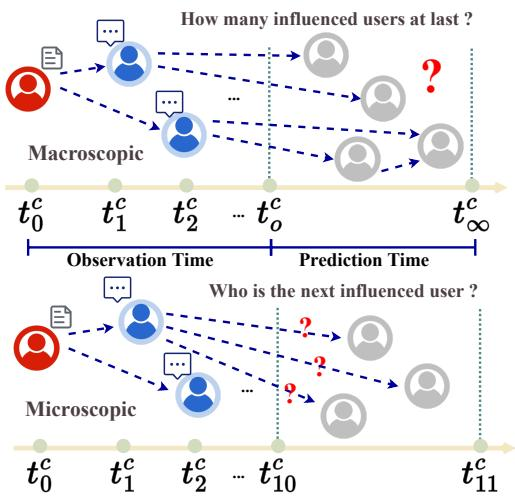  
Figure 1: The illustrations demonstrate two key aspects: the prediction of macroscopic cascade size on the left and the prediction of the next user likely to be influenced at the microscopic level on the right.

Current research on modeling information cascades primarily addresses two key aspects: macroscopic prediction, which estimates the incremental or total size of a cascade (Li et al., 2017; Chen et al., 2019b; Sun et al., 2023), and microscopic prediction, which identifies the next user likely to be influenced within the cascade (Wang et al., 2017, 2018; Yu et al., 2022). On the one hand, macroprediction concentrates on overarching patterns and trends, employing network topology and dissemination models to forecast information propagation. On the other hand, micro-prediction delves into the particulars of individual users’ behaviors and attributes, utilizing analyses of user and content characteristics to anticipate the impact of information diffusion. Macro-prediction and micro-prediction collectively provide a comprehensive understanding of information dissemination and can mutually reinforce and enhance each other (Guo et al., 2024). Since both tasks require learning propagation features from observed cascades, they inherently share commonalities. (Jiao et al., 2024) In the context of multi-task learning (Zhang and Yang, 2018), the need to improve prediction accuracy through the extraction of common features across tasks is of critical importance. Furthermore, balancing shared and task-specific representations is essential. Although encouraging shared representations can enhance overall performance, it may also create conflicts with task-specific representations, potentially limiting generalization (Zhang and Yang, 2021).

However, simultaneously conducting diffusion prediction at two different scales presents several major challenges, which can be categorized into two main types. The first is complexity of interactions. Information dissemination involves intricate interactions both within individual cascades and across different cascades, making it difficult to effectively capture and model these dynamics (Jin et al., 2022; Sun et al., 2022). The second is crossplatform generalization. The substantial variation in data distribution and user behavior across social media platforms complicates the transferability of models trained on one platform to another. Existing methods struggle to adapt to the specific characteristics of each platform, resulting in poor crossplatform generalization. Moreover, manually adjusting model architectures for different platforms is time-intensive and often fails to achieve optimal, data-specific results (Ren et al., 2021a).

To overcome the aforementioned challenges, HyperIDP is introduced as a streamlined and efficient Hypergraph-based framework for multi-scale Information Diffusion Prediction. At the macro level, sequential hypergraphs are constructed to effectively capture interactions and dynamics among cascades, aligning with the hypergraph’s capacity to model complex user and cascade interactions. Dividing the time period into sequential windows allows for an accurate depiction of the dynamic evolution of cascades. At the micro level, the framework emphasizes the role of social homophily within social networks. Additionally, an uncertainty-weighted center loss, inspired by multitask learning, is employed to preserve the integrity of shared features. Moreover, a differentiable hypergraph neural architecture search method is proposed for automatic hypergraph learning. Key contributions of this work are summarized as follows:

1) Temporal hypergraph-based cooperativeadversarial cascade diffusion modeling. To address the complexity of interactions, Hyper-IDP integrates both macro and micro prediction tasks, leveraging their mutual reinforcement to enhance overall performance. The method models information diffusion within temporal hypergraphs, capturing the interactions and dynamics between cascades. Inspired by the multi-task learning paradigm, a cooperative-adversarial loss function is employed to preserve the integrity of shared features while simultaneously reducing conflicts.

2) Automated hypergraph neural network design. To enhance the cross-platform generalizability, a differentiable neural architecture search method is introduced to enable automatic diffusion hypergraph learning. By designing a comprehensive search space, HyperIDP outperforms the performance of existing humandesigned baselines.

3) Experimental results on real-world social media datasets demonstrate that the proposed method significantly outperforms existing approaches in terms of accuracy and robustness, validating the framework’s effectiveness.

## 2 Methodology

This section provides an in-depth explanation of the components and design principles of the proposed framework, as depicted in Figure 2. HyperIDP comprises four primary components:

1) Global Interaction Learning Module: This component extracts user preferences at each time interval and models the dynamic changes in cascades using Hypergraph Neural Networks (HGNNs), with a fusion layer facilitating integration at the cascade level.

2) Social Relationship Learning Module: It captures social relationships at the individual user level through the application of Graph Neural Networks (GNNs).

3) Diffusion Prediction Module: This module employs uncertainty-weighted center loss to learn both shared and task-specific representations for multi-scale diffusion prediction.

4) Neural Architecure Search Module: This component constructs a comprehensive search space based on diffusion hypergraphs and social graphs, utilizing a differentiable architecture search algorithm to identify the optimal model configuration.

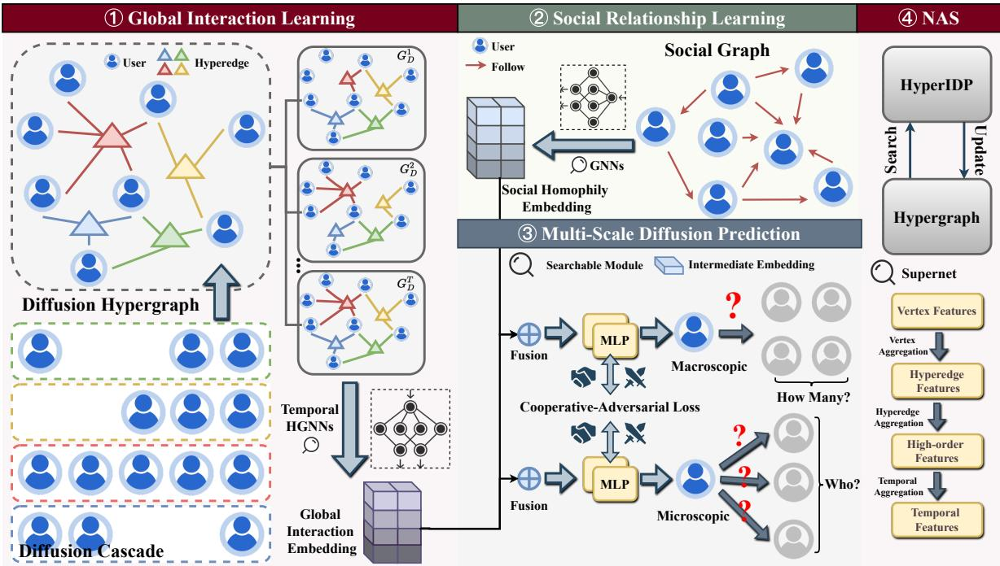  
Figure 2: The architectural overview of our model.

## 2.1 Problem Formulation

To commence, we present the social graph and diffusion hypergraphs that constitute the foundation for diffusion prediction within our model. The social graph is denoted as $G _ { S } = ( U , E )$ , where $U$ is the user set and E is the edge set. Each edge $( u _ { i } , u _ { j } ) \ \in \ E$ represents a social relationship between user $u _ { i }$ and $u _ { j }$ . The observed diffusion cascades $D = \left\{ d _ { 1 } , d _ { 2 } , \dotsc , d _ { M } \right\} , | D | = N$ are split into $T$ subsets according to timestamps for constructing sequential diffusion hypergraphs $G _ { D } = \left\{ G _ { D } ^ { t } \ : | \ : t = 1 , 2 , \ldots , T \right\} , G _ { D } ^ { t } = \left( U ^ { t } , { \mathcal { E } } ^ { t } \right)$ where $U ^ { t }$ is the user set and $\mathcal { E } ^ { t }$ is the hyperedge set. In the diffusion hypergraph, users participate in the same cascade and are connected by a hyperedge, in other words, a hyperedge represents a cascade. Note that the set of nodes connected by hyperedge is different in each hypergraph. It means that if $u _ { i }$ participates in $d _ { m }$ during the t-th time interval, then $u _ { i }$ being connected to hyperedge $e _ { m }$ only occurs in diffusion hypergraph $G _ { D } ^ { t }$ . This work aims to address both the macroscopic and microscopic problems based on the above introductions.

Macroscopic Diffusion Prediction: Given a social graph $G _ { S } .$ , diffusion hypergraphs $G _ { D }$ and an observed diffusion sequence $\begin{array} { r l } { d _ { m } } & { { } = } \end{array}$ $\{ ( u _ { i } ^ { m } , t _ { i } ^ { m } ) \mid u _ { i } ^ { m } \in U \}$ , estimate the final size $| d _ { m } |$ of cascade $d _ { m }$

Microscopic Diffusion Prediction: Given a social graph $G _ { S } .$ , diffusion hypergraphs $G _ { D }$ and an observed diffusion sequence $\begin{array} { r l } { d _ { m } } & { { } = } \end{array}$ $\{ ( u _ { i } ^ { m } , t _ { i } ^ { m } ) \mid u _ { i } ^ { m } \in U \}$ , predict which user will participate in $d _ { m }$ in the next step.

## 2.2 User Global Interaction Learning

To account for global interactions among cascades and the dynamic changes within them simultaneously, the HGNN is employed based on the constructed sequential diffusion hypergraphs. HGNN captures global user interactions within each distinct time interval at the cascade level, while a fusion layer between consecutive time intervals models the evolving dynamics of cascades.

## Hypergraph Neural Network

User interactions are modeled at each time interval using HGNNs, as illustrated in Figure 3. In a standard graph, graph convolution aggregates neighboring vertices to generate a new representation of the central vertex, with information flowing through the edges. Similarly, in a hypergraph, hyperedges serve as channels for information transmission. The message aggregation process within a hypergraph is executed in two stages: (1) Vertex Aggregation and (2) Hyperedge Aggregation.

## Vertex Aggregation

Given a diffusion hypergraph snapshot $G _ { D } ^ { t }$ , the features of the hyperedge need to be obtained by

aggregating the features of the vertices in the hyperedge. Specifically, hyperedge feature can be calculated by:

$$
X _ { e , t } = \operatorname { c o n v } \left( \operatorname { M e r g } \left( X _ { v , t } ^ { \left( i \right) } , \forall i \in \left. 0 , \dots , k \right. \right) \right)\tag{1}
$$

where $X _ { v , t } ^ { ( i ) }$ is the features of the i-th vertex in a hyperedge $X _ { e , t }$ . The Merg(·) mechanism merges the message of all the vertices and the conv(·) operator indicates that 1-dimension convolution is used to compact the derived result.

## Hyperedge Aggregation

We regard each vertex as a center point $^ { c , }$ and then aggregate the hyperedge features associated with it to obtain the high-order feature of $^ { c , }$ denoted as $X _ { h , t }$ at t-th time interval. The attention mechanism is employed to generate the weights for each hyperedge in different ways. The high-order feature is calculated as:

$$
X _ { h , t } = \sum _ { i = 0 } ^ { m } w _ { e , t } ^ { ( i ) } X _ { e , t } ^ { ( i ) } ,\tag{2}
$$

where m represents the number of hyperedges associated with the centroid vertex, and w represents the calculated weights of hyperedges.

## Sequential HGNNs with Fusion Layer

The above two-stage convolution operation only learns user interaction at a specific time interval, which can not adequately characterize the evolution of cascades in propagation. Therefore, we design a fusion strategy to connect the interactions at different time intervals learned by HGNN in chronological order, which is defined as:

$$
\mathbf { X } _ { D } = \mathrm { F u s e } \left( X _ { h , 1 } , \cdots , X _ { h , T } \right) ,\tag{3}
$$

where $\mathbf { \Delta } \mathbf { X } _ { D }$ is the final global interactive representation obtained through sequential HGNNs. $[ X _ { h , 1 } , \cdots , X _ { h , T } ]$ denote the representation of every diffusion hypergraphs. And Fuse(·) operator represents various fusion strategies.

## 2.3 User Social Relationship Learning

User tends to have more social interactions with users who are similar to them and this refers to the principle called social relationship. Close friends, who are usually friends alike in certain qualities or interests, have more influence on each other than dissimilar ones. Users’ social relationship can be reflected through social network structure. We introduce the social graph to model user social relationships and apply a multi-layer GNN to embed social relationship. Given social graph $G _ { S } = ( U , E )$ the user social relationship embedding matrix $\mathbf { X } _ { S } ^ { l }$ at l-th layer is updated by:

$$
\mathbf { X } _ { S } ^ { l + 1 } = \mathrm { G N N } \left( \tilde { \mathbf { A } } _ { S } , \mathbf { X } _ { S } ^ { l } \right) ,\tag{4}
$$

where $\tilde { \mathbf { A } _ { S } }$ is the adjacent matrix of self-looped $G _ { S }$ . The initial relationship embedding matrix $\mathbf { X } _ { S } ^ { 0 } \in \mathbb { R } ^ { N \times d }$ is randomly initialized from a normal distribution, and d is the dimension of embedding. GNN(·) operator indicates different types of GNNs. We can obtain the final social relationship representation $\mathbf { X } _ { S }$ after several layers of them.

## 2.4 Multi-Scale Diffusion Prediction

We concatenate the global interaction and social relationship representation $\mathbf { X } _ { D } , \mathbf { X } _ { S }$ and then feed them into distinct output layers dedicated to the multi-scale diffusion prediction process.

## Macroscopic Diffusion Prediction

For macroscopic diffusion prediction, we aim to predict the final cascade size in the future. We calculate the final size of diffusion cascade $d _ { m }$ by:

$$
S _ { m } = \mathrm { L i n e a r } \left( \mathrm { c o n c a t } \left( \mathbf { X } _ { D } , \mathbf { X } _ { S } \right) \right) ,\tag{5}
$$

where concat $( \cdot , \cdot )$ is the concatenation operation and Linear(·) represents a multilayer perceptron (MLP). We train the macroscopic task by minimizing the following loss function:

$$
\mathcal { L } _ { \mathrm { m a c r o } } = \frac { 1 } { M } \sum _ { m = 1 } ^ { M } \left( S _ { m } - \hat { S } _ { m } \right) ^ { 2 } ,\tag{6}
$$

where M is the number of diffusion cascades and $\hat { S } _ { m }$ is the ground truth.

## Microscopic Diffusion Prediction

For microscopic diffusion prediction, the next influenced probability $p _ { i } \in \mathbb { R } ^ { | d _ { m } | }$ for user $u _ { i }$ is predicted by:

$$
p _ { i } = \mathrm { s o f t m a x } \left( \operatorname { L i n e a r } \left( \operatorname { c o n c a t } \left( \mathbf { X } _ { D } , \mathbf { X } _ { S } \right) \right) \right)\tag{7}
$$

We adopt the cross entropy (CE) loss for microscopic training:

$$
\mathcal { L } _ { \mathrm { m i c r o } } = - \sum _ { j = 2 } ^ { | d _ { m } | } \sum _ { i = 1 } ^ { | U | } \hat { p } _ { j i } \log \left( p _ { j i } \right) ,\tag{8}
$$

where |U| is the number of users and $\tilde { p }$ is true probability. If user $u _ { i }$ participate in cascade $d _ { m }$ at the step $j ,$ then $\hat { p } _ { j i } = 1$ , otherwise $\hat { p } _ { j i } = 0$

## Training with Cooperative-Adversarial Loss

In multi-task learning (MTL), balancing shared and conflicting task representations is crucial (Zhang and Yang, 2018). Although promoting shared representations can enhance overall performance, it may also cause conflicts between task-specific representations, which can hinder generalization (Yang et al., 2019b).

To address this, we introduce a novel loss function combining cooperative and adversarial components. This loss function fosters consistency between task representations while reducing conflicts, thereby improving MTL performance. Specifically, the cooperative loss encourages consistent or complementary representations within shared layers, quantified as the Euclidean distance between the outputs of the shared representation space:

$$
\mathcal { L } _ { \mathrm { c o o p } } = \gamma \left\| \mathbf { H } _ { \mathrm { m a c r o } } - \mathbf { H } _ { \mathrm { m i c r o } } \right\| ^ { 2 } ,\tag{9}
$$

where $\mathbf { H } _ { \mathrm { m a c r o } }$ and $\mathbf { H } _ { \mathrm { m i c r o } }$ represent the shared representation space for the two scales of diffusion prediction tasks, and $\gamma$ is the weight of the cooperative loss. To prevent one task from overly dominating the shared layer and leading to the collapse of the representation space, adversarial loss $\left( L _ { \mathrm { a d v } } \right)$ is introduced to ensure that the representations of different tasks maintain diversity and independence. The adversarial loss is realized by limiting the consistency of gradient directions between macro-level and micro-level prediction, defined as the inner product of the gradients of the two tasks:

$$
\mathcal { L } _ { \mathrm { a d v } } = \delta \left. \nabla \mathcal { L } _ { \mathrm { m a c r o } } \cdot \nabla \mathcal { L } _ { \mathrm { m i c r o } } \right. ,\tag{10}
$$

where $\nabla _ { \theta } L _ { \mathrm { m a c r o } }$ and $\nabla _ { \theta } L _ { \mathrm { m i c r o } }$ represent the gradients of the two scales of diffusion prediction tasks, and δ is the weight of the adversarial loss. The final total loss function combines the task losses, cooperative loss, and adversarial loss as follows:

$$
\begin{array} { r } { \mathcal { L } = \lambda \mathcal { L } _ { \mathrm { m a c r o } } + ( 1 - \lambda ) \mathcal { L } _ { \mathrm { m i c r o } } + \gamma \mathcal { L } _ { \mathrm { c o o p } } + ( 1 - \gamma ) \mathcal { L } _ { \mathrm { a d v } } , } \\ { ( 1 1 ) } \end{array}
$$

where λ is the weight of the task losses, and γ represents the weight coefficients for the cooperative and adversarial losses, respectively.

## 2.5 Hypergraph Neural Architecture Search Search Space

Although a graph can be considered a special case of a hypergraph, the search space in existing graph NAS methods cannot be directly applied to hypergraph NAS. Therefore, it is essential to develop a search space specifically tailored for hypergraph neural architecture search. As shown in Table 1, to create an expressive search space suitable for sequential diffusion hypergraphs, we focus on three key components: vertex aggregation, hyperedge aggregation, skip-connection aggregation, and sequential aggregation. We denote the set of vertex aggregators as ${ \mathcal { O } } _ { v } ,$ the set of skip-connection aggregators as $\mathcal { O } _ { s } ,$ and the set of temporal sequential aggregators as ${ \mathcal { O } } _ { t }$ . In this work, we employ four different methods to aggregate high-order features and original centroid vertex features to generate new centroid vertex features.

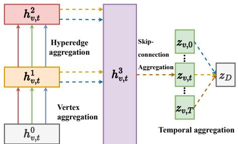  
Figure 3: The proposed hypergraph NAS framework, with the supernet being generated from the defined search space.

<table><tr><td rowspan=1 colspan=1></td><td rowspan=1 colspan=1>Operations</td></tr><tr><td rowspan=1 colspan=1> $O _ { v }$  $O _ { h }$  $O _ { s }$ </td><td></td></tr><tr><td rowspan=1 colspan=1> $O _ { t }$ </td><td></td></tr></table>

Table 1: Search space for diffusion hypergraphs.

## Differentiable Search

To create a continuous search space, as proposed by DARTS (Liu et al., 2018), we replace the categorical selection of a specific operation with a softmax function applied over all possible operations:

$$
\bar { o } ( x ) = \sum _ { o \in \mathcal { O } } \frac { \exp { \left( \alpha _ { o } \right) } } { \sum _ { o ^ { \prime } \in \mathcal { O } } \exp { \left( \alpha _ { o ^ { \prime } } \right) } } o ( x ) ,\tag{12}
$$

where the operation mixing weights for each node c are parameterized by a vector α of dimension $| { \mathcal { O } } |$ , where O is drawn from four sets of operations: $\mathcal { O } _ { v } , \mathcal { O } _ { h } , \mathcal { O } _ { s }$ , and ${ \mathcal { O } } _ { t }$ , as described in the previous section. The corresponding parameters $\alpha _ { v } , \alpha _ { h , } \alpha _ { s }$ and $\alpha _ { t }$ are then computed. In this context, x represents the input features of a given layer. Let $\bar { o } _ { v } , \bar { o } _ { h } , \bar { o } _ { s } .$ , and $\bar { o } _ { t }$ denote the mixed operations corresponding to $\mathcal { O } _ { v } , \mathcal { O } _ { h } , \mathcal { O } _ { s }$ , and ${ \mathcal { O } } _ { t } .$ , respectively, as defined in Eq. 12. The vertex aggregation and hyperedge aggregation processes in HyperIDP are then formulated as:

$$
\begin{array} { r l } & { \quad X _ { e , t } = \bar { o } _ { v } \left( X _ { v , t } ^ { ( k ) } , \forall X _ { v , t } ^ { ( k ) } \in e \right) , } \\ & { \quad X _ { h , t } = \bar { o } _ { h } \left( X _ { e , t } , \forall e \ni c , \forall t \in \left\{ 0 , \ldots , T \right\} \right) , } \end{array}\tag{13}
$$

Then the embedding of the center point c for diffusion hypergraph $G _ { D } ^ { t }$ is computed as:

$$
Z _ { v , t } = \bar { o } _ { s } \left( X _ { v , t } ^ { ( c ) } , X _ { h , t } \right) ,\tag{14}
$$

The final representation of the diffusion hypergraph sequence $G _ { D }$ is then obtained through temporal aggregation operations:

$$
Z _ { D } = { \bar { o } } _ { t } \left( Z _ { v , t } , \forall t \in \left\{ 0 , \dots , T \right\} \right) ,\tag{15}
$$

Upon completing the architecture search, we retain the top-k highest-weighted operations in each module to form the final architecture, which is subsequently fine-tuned using validation data. For the sake of simplicity, we set $k = 1$ , thereby replacing each mixed operation o¯ with its highest-weighted counterpart, $o = \arg \operatorname* { m a x } _ { o \in \alpha } \alpha _ { o }$

## 3 Experiments

A thorough experimental analysis is conducted on three real-world datasets to evaluate the effectiveness of the proposed method. This section addresses the following research questions:

• RQ1: Effectiveness. How does the proposed method compare to other state-of-theart (SOTA) approaches in terms of performance? (Section 3.2)

• RQ2: Modularity. What is the impact of different components on the overall model performance? (Section 3.3)

• RQ3: Sensitivity. How do variations in hyperparameters influence the final performance? (Appendix C.2)

## 3.1 Experimental Setting

## Datasets

Experiments are performed on three datasets: Christianity (Sankar et al., 2020), Android (Sankar et al., 2020), and Douban (Zhong et al., 2012). Table 2 presents the statistics of these datasets, with a detailed description available in the Appendix. Our code can be found at https://github.com/ HowieHsu0126/HyperIDP.

<table><tr><td>Dataset</td><td>Christ</td><td>Android</td><td>Douban</td></tr><tr><td># Users</td><td>2,897</td><td>9,958</td><td>12,232</td></tr><tr><td>#Links</td><td>35,624</td><td>48,573</td><td>39,658</td></tr><tr><td># Cascades</td><td>589</td><td>679</td><td>3,475</td></tr><tr><td>Avg. Length</td><td>22.9</td><td>33.3</td><td>21.76</td></tr></table>

Table 2: Statistics of datasets. Christ is short for the dataset Christianity.

## Baselines

Several representative baseline models are evaluated in comparison to the proposed models. For macroscopic prediction, the following models are analyzed: DeepCas (Li et al., 2017), DeepHawkes (Cao et al., 2017), CasCN (Chen et al., 2019b), and CasFlow (Xu et al., 2023). For microscopic prediction, these models are examined: TopoL-STM (Wang et al., 2017), NDM (Yang et al., 2018), SNIDSA (Wang et al., 2018), Inf-VAE (Sankar et al., 2020), and DyHGCN (Yuan et al., 2021). For multi-scale prediction, these models are considered: FOREST (Yang et al., 2019a) and DMT-LIC (Chen et al., 2019a). This study also incorporates various NAS techniques, including Random search (Li and Talwalkar, 2020), Bayesian-based search (White et al., 2021), and GraphNAS, a reinforcement learning-based NAS approach for GNN (Gao et al., 2021). Detailed descriptions of these baseline models are provided in the Appendix.

## 3.2 Performance Comparison (RQ1)

For macroscopic prediction, the evaluation metric applied is the Mean Squared Logarithmic Error (MSLE), a method frequently adopted in previous studies. For microscopic prediction, two ranking metrics are used: Mean Average Precision at top k (MAP@k) and Hits Scores at top k (Hits@k), with k values of [10, 50, 100].

A comprehensive evaluation of HyperIDP against multiple baseline models is conducted across three datasets, focusing on both microscopic and macroscopic diffusion prediction tasks. The results, presented in Tables 3, 4, and 5, reveal several key findings: 1) HyperIDP consistently outperforms all state-of-the-art baselines in both macroscopic and microscopic prediction tasks, leveraging sequential hypergraphs to dynamically model cascade interactions, which significantly improves performances. 2) As illustrated in Figure 4, the search cost of HyperIDP is compared with three representative NAS methods, and HyperIDP exhibits the lowest search cost among all NAS baselines. This efficiency is primarily due to the differentiable search algorithm, which transforms the search space from discrete choices to a continuous optimization problem, enabling the use of gradient information during the search process and facilitating faster convergence to the optimal architecture.

<table><tr><td rowspan="2">Models</td><td colspan="3">Christianity</td><td colspan="3">Android</td><td colspan="3">Douban</td></tr><tr><td>@10</td><td>@50</td><td>@100</td><td>@10</td><td>@50</td><td>@100</td><td>@10</td><td>@50</td><td>@100</td></tr><tr><td>TopoLSTM (Wang et al., 2017)</td><td>0.1548</td><td>0.3642</td><td>0.4768</td><td>0.0471</td><td>0.1307</td><td>0.2092</td><td>0.0317</td><td>0.0152</td><td>0.0173</td></tr><tr><td>NDM (Yang et al., 2018)</td><td>0.0475</td><td>0.1156</td><td>0.1472</td><td>0.0181</td><td>0.0434</td><td>0.0544</td><td>0.0379</td><td>0.0517</td><td>0.0539</td></tr><tr><td>SNIDSA (Wang et al., 2018)</td><td>0.0651</td><td>0.2087</td><td>0.3493</td><td>0.0282</td><td>0.0838</td><td>0.1288</td><td>0.0713</td><td>0.1796</td><td>0.2315</td></tr><tr><td>Inf-VAE (Sankar et al., 2020)</td><td>0.0778</td><td>0.2558</td><td>0.3844</td><td>0.0329</td><td>0.0927</td><td>0.1443</td><td>0.1375</td><td>0.2372</td><td>0.3048</td></tr><tr><td>DyHGCN (Yuan et al., 2021)</td><td>0.2391</td><td>0.4678</td><td>0.5914</td><td>0.0737</td><td>0.1735</td><td>0.2585</td><td>0.1449</td><td>0.2637</td><td>0.3318</td></tr><tr><td>FOREST (Yang et al., 2019a)</td><td>0.2757</td><td>0.4676</td><td>0.5592</td><td>0.0877</td><td>0.1741</td><td>0.2325</td><td>0.1097</td><td>0.1975</td><td>0.2561</td></tr><tr><td>DMT-LIC (Chen et al., 2019a)</td><td>0.2779</td><td>0.4431</td><td>0.5678</td><td>0.0943</td><td>0.1648</td><td>0.2304</td><td>0.1474</td><td>0.2517</td><td>0.3063</td></tr><tr><td>Random (Li and Talwalkar, 2020)</td><td>0.1944</td><td>0.2026</td><td>0.2065</td><td>0.0688</td><td>0.0705</td><td>0.0716</td><td>0.1153</td><td>0.1208</td><td>0.1202</td></tr><tr><td>Bayesian (White et al., 2021)</td><td>0.1966</td><td>0.2048</td><td>0.2043</td><td>0.0666</td><td>0.0727</td><td>0.0738</td><td>0.1131</td><td>0.1187</td><td>0.1224</td></tr><tr><td>GraphNAS (Gao et al., 2021)</td><td>0.1933</td><td>0.2015</td><td>0.2076</td><td>0.0699</td><td>0.0704</td><td>0.0736</td><td>0.1120</td><td>0.1210</td><td>0.1232</td></tr><tr><td>HyperIDP (Ours)</td><td>0.3503</td><td>0.5289</td><td>0.6461</td><td>0.1385</td><td>0.2298</td><td>0.3057</td><td>0.2245</td><td>0.3376</td><td>0.3952</td></tr></table>

Table 3: The experimental results on three datasets are evaluated using $H i t s @ k$ score for $k = 1 0 , 5 0 ,$ and 100, with higher scores representing superior performance. The best-performing human-designed architectures are underlined, while the highest score on each dataset is highlighted in bold.
<table><tr><td rowspan="2">Models</td><td colspan="3">Christianity</td><td colspan="3">Android</td><td colspan="3">Douban</td></tr><tr><td>@10</td><td>@50</td><td>@100</td><td>@10</td><td>@50</td><td>@100</td><td>@10</td><td>@50</td><td>@100</td></tr><tr><td>TopoLSTM (Wang et al., 2017)</td><td>0.0534</td><td>0.0628</td><td>0.0646</td><td>0.0177</td><td>0.0213</td><td>0.0224</td><td>0.0343</td><td>0.0835</td><td>0.0873</td></tr><tr><td>NDM (Yang et al., 2018)</td><td>0.0155</td><td>0.0188</td><td>0.0193</td><td>0.0068</td><td>0.0081</td><td>0.0093</td><td>0.0132</td><td>0.0833</td><td>0.0875</td></tr><tr><td>SNIDSA (Wang et al., 2018)</td><td>0.0257</td><td>0.0317</td><td>0.0335</td><td>0.0111</td><td>0.0133</td><td>0.0141</td><td>0.0362</td><td>0.0428</td><td>0.0157</td></tr><tr><td>Inf-VAE (Sankar et al., 2020)</td><td>0.0183</td><td>0.0265</td><td>0.0281</td><td>0.0087</td><td>0.0114</td><td>0.0121</td><td>0.0532</td><td>0.0579</td><td>0.0607</td></tr><tr><td>DyHGCN (Yuan et al., 2021)</td><td>0.1073</td><td>0.1178</td><td>0.1195</td><td>0.0383</td><td>0.0445</td><td>0.0457</td><td>0.0810</td><td>0.0847</td><td>0.0854</td></tr><tr><td>FOREST (Yang et al., 2019a)</td><td>0.1578</td><td>0.1667</td><td>0.1681</td><td>0.0619</td><td>0.0678</td><td>0.0686</td><td>0.0664</td><td>0.0703</td><td>0.0711</td></tr><tr><td>DMT-LIC (Chen et al., 2019a)</td><td>0.1658</td><td>0.1739</td><td>0.1757</td><td>0.0633</td><td>0.0643</td><td>0.0673</td><td>0.0821</td><td>0.0867</td><td>0.0886</td></tr><tr><td>Random (Li and Talwalkar, 2020)</td><td>0.1578</td><td>0.1667</td><td>0.1681</td><td>0.0639</td><td>0.0653</td><td>0.0686</td><td>0.0664</td><td>0.0703</td><td>0.0711</td></tr><tr><td>Bayesian (White et al., 2021)</td><td>0.1587</td><td>0.1676</td><td>0.1689</td><td>0.0630</td><td>0.0674</td><td>0.0684</td><td>0.0644</td><td>0.0683</td><td>0.0721</td></tr><tr><td>GraphNAS (Gao et al., 2021)</td><td>0.1596</td><td>0.1685</td><td>0.1697</td><td>0.0641</td><td>0.0658</td><td>0.0687</td><td>0.0653</td><td>0.0714</td><td>0.0723</td></tr><tr><td>HyperIDP (Ours)</td><td>0.1966</td><td>0.2048</td><td>0.2065</td><td>0.0688</td><td>0.0725</td><td>0.0736</td><td>0.1153</td><td>0.1208</td><td>0.1224</td></tr></table>

Table 4: The experimental results on three datasets are evaluated using $M A P @ k$ score for $k = 1 0 , 5 0 ,$ and 100, with higher scores representing superior performance. The best-performing human-designed architectures are underlined, while the highest score on each dataset is highlighted in bold.

<table><tr><td>Model</td><td>Christianity</td><td>Android</td><td>Douban</td></tr><tr><td>DeepCas (Li et al., 2017)</td><td>1.435</td><td>2.113</td><td>2.131</td></tr><tr><td>DeepHawkes (Cao et al., 2017)</td><td>1.102</td><td>1.962</td><td>1.734</td></tr><tr><td>CasCN (Chen et al., 2019b)</td><td>1.037</td><td>0.972</td><td>1.467</td></tr><tr><td>CasFlow (Xu et al., 2023)</td><td>0.754</td><td>1.032</td><td>0.456</td></tr><tr><td>FOREST (Yang et al., 2019a)</td><td>1.715</td><td>0.547</td><td>0.834</td></tr><tr><td>DMT-LIC (Chen et al., 2019a)</td><td>1.681</td><td>0.212</td><td>0.751</td></tr><tr><td>Random (Li and Talwalkar, 2020)</td><td>1.780</td><td>0.223</td><td>0.752</td></tr><tr><td>Bayesian (White et al., 2021)</td><td>1.683</td><td>0.220</td><td>0.753</td></tr><tr><td>GraphNAS (Gao et al., 2021)</td><td>1.690</td><td>0.213</td><td>0.750</td></tr><tr><td>HyperIDP</td><td>0.561</td><td>0.142</td><td>0.413</td></tr></table>

Table 5: The experimental results on three datasets are evaluated using MSLE, with lower scores representing superior performance. The best-performing humandesigned architectures are underlined, while the highest score on each dataset is highlighted in bold.

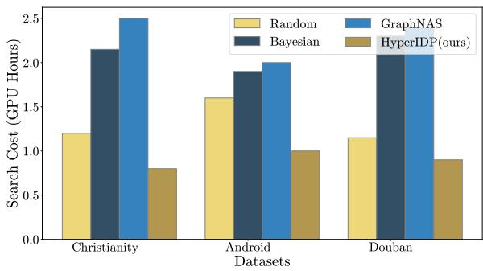

<table><tr><td rowspan="2">Models</td><td colspan="3">Christianity</td><td colspan="3">Douban</td></tr><tr><td>Hits@100</td><td>MAP@100</td><td>MSLE</td><td>Hits@100</td><td>MAP@100</td><td>MSLE</td></tr><tr><td>w/o Hyper</td><td>0.5932</td><td>0.2076</td><td>1.089</td><td>0.3745</td><td>0.1221</td><td>0.592</td></tr><tr><td>w/o Macro</td><td>0.5648</td><td>0.1938</td><td>9.233</td><td>0.3729</td><td>0.1264</td><td>4.674</td></tr><tr><td>w/o Micro</td><td>0.5946</td><td>0.1982</td><td>0.852</td><td>0.3632</td><td>0.1217</td><td>0.724</td></tr><tr><td>w/o Coop</td><td>0.5810</td><td>0.1943</td><td>0.882</td><td>0.3674</td><td>0.1206</td><td>0.728</td></tr><tr><td>w/o Adv</td><td>0.5993</td><td>0.1967</td><td>0.874</td><td>0.3625</td><td>0.1187</td><td>0.739</td></tr><tr><td>Vanilla</td><td>0.6315</td><td>0.2118</td><td>0.563</td><td>0.3794</td><td>0.1259</td><td>0.532</td></tr></table>

Table 6: Ablation studies on the Christianity and Douban datasets assess the contributions of individual submodules within HyperIDP.

## 3.3 Ablation Study (RQ2)

Table 6 provides the definitions of various model variants: w/o Hyper represents the replacement of sequential hypergraphs, w/o Macro signifies the exclusion of the macro-level loss function ${ \mathcal { L } } _ { \mathrm { m a c r o } }$ w/o Micro denotes the omission of the micro-level loss function $\mathcal { L } _ { \mathrm { m i c r o } }$ , w/o Coop indicates the removal of the cooperative loss function $\mathcal { L } _ { \mathrm { c o o p } }$ , and w/o Adv refers to the elimination of the adversarial loss function ${ \mathcal { L } } _ { \mathrm { a d v } }$

The key insights are as follows: 1) The integration of interactive hypergraphs significantly enhances the capture of cascade interactions on a global scale, as shown by the performance of w/o Hyper. 2) The macroscopic prediction contributes to refining the microscopic prediction by accurately modeling individual user propagation behaviors, while the microscopic prediction, in turn, sharpens the overall propagation trends captured by the macroscopic prediction. The distinct differences between w/o Macro, w/o Micro, and HyperIDP in macro and micro indicators underscore the mutual reinforcement between these tasks, leading to superior performance. 3) The cooperative loss (w/o Coop) allows the model to adaptively learn complementary representations across different tasks by effectively leveraging inter-task correlations. Furthermore, the adversarial loss (w/o Adv) prevents any single task from dominating the shared representation space, thereby maintaining the integrity of the representation space.

## 4 Conclusion

This paper presents HyperIDP, a multi-scale diffusion prediction model for both microscopic and macroscopic predictions. HyperIDP constructs sequential hypergraphs to capture complex influences and dynamics among cascades from a macro perspective, while simultaneously learning implicit structures and user characteristics within social networks from a micro perspective. To ensure feature integrity, uncertainty-weighted center loss is employed. A search space is developed to tune GNN architectures for both diffusion hypergraphs and social graphs, with optimal designs identified via differentiable search strategies. Experimental results validate the model’s effectiveness in predicting next-influenced users and cascade sizes.

## 5 Limitations

One potential limitation of this work lies in its reliance on the accuracy of the initial hypergraph construction, which might not be robust to noisy or incomplete data. And the computational complexity of the NAS process may limit the scalability of the approach, particularly when applied to largescale datasets or more complex datasets.

## Acknowledgements

This work was supported in part by the National Natural Science Foundation of China (Nos. U22A2098, 62271411, 62471403, 62261136549, U22B2036), the Fundamental Research Funds for the Central Universities (Nos. G2024WD0151, D5000240309), and the XPLORER PRIZE.

## References

Lulwah AlSuwaidan and Mourad Ykhlef. 2016. Toward information diffusion model for viral marketing in business. International journal of advanced computer science and applications, 7(2).

Dilyara Baymurzina, Eugene Golikov, and Mikhail Burtsev. 2022. A review of neural architecture search. Neurocomputing, 474:82–93.

Qi Cao, Huawei Shen, Keting Cen, Wentao Ouyang, and Xueqi Cheng. 2017. Deephawkes: Bridging the gap between prediction and understanding of information cascades. In Proceedings ofthe 2017 ACM on Conference on Information and Knowledge Management, page 1149–1158.

Qi Cao, Huawei Shen, Jinhua Gao, Bingzheng Wei, and Xueqi Cheng. 2020. Popularity prediction on social platforms with coupled graph neural networks. In Proceedings ofthe 13th International Conference on Web Search and Data Mining, page 70–78.

Jingya Chang, Weiyang Ding, Liqun Qi, and Hong Yan. 2018. Computing the p-spectral radii of uniform hypergraphs with applications. Journal of Scientific Computing, 75:1–25.

Chaofan Chen, Zelei Cheng, Zuotian Li, and Manyi Wang. 2020. Hypergraph attention networks. In 2020 IEEE 19th International Conference on Trust, Security and Privacy in Computing and Communications (TrustCom), pages 1560–1565.

Xueqin Chen, Kunpeng Zhang, Fan Zhou, Goce Trajcevski, Ting Zhong, and Fengli Zhang. 2019a. Information cascades modeling via deep multi-task learning. In Proceedings ofthe 42nd International ACM SIGIR Conference on Research and Development in Information Retrieval, page 885–888.

Xueqin Chen, Fan Zhou, Kunpeng Zhang, Goce Trajcevski, Ting Zhong, and Fengli Zhang. 2019b. Information diffusion prediction via recurrent cascades convolution. In 2019 IEEE 35th international conference on data engineering (ICDE), pages 770–781.

Yifan Feng, Haoxuan You, Zizhao Zhang, Rongrong Ji, and Yue Gao. 2019. Hypergraph neural networks. In Proceedings of the AAAI conference on artificial intelligence, volume 33, pages 3558–3565.

Yang Gao, Hong Yang, Peng Zhang, Chuan Zhou, and Yue Hu. 2021. Graph neural architecture search. In International joint conference on artificial intelligence, pages 1403–1409.

Yue Gao, Zizhao Zhang, Haojie Lin, Xibin Zhao, Shaoyi Du, and Changqing Zou. 2020. Hypergraph learning: Methods and practices. IEEE Transactions on Pattern Analysis and Machine Intelligence, 44(5):2548– 2566.

Fuxia Guo, Xiaowen Wang, Yanwei Xie, Zehao Wang, Jingqiu Li, and Lanjun Wang. 2024. A survey of datasets for information diffusion tasks. arXiv preprint arXiv:2407.05161.

Sheng Huang, Ahmed Elgammal, and Dan Yang. 2017. On the effect of hyperedge weights on hypergraph learning. Image and Vision Computing, 57:89–101.

Mahdi Jalili and Matjaž Perc. 2017. Information cascades in complex networks. Journal of Complex Networks, 5(5):665–693.

Jianwen Jiang, Yuxuan Wei, Yifan Feng, Jingxuan Cao, and Yue Gao. 2019. Dynamic hypergraph neural networks. In Proceedings ofthe 28th International Joint Conference on Artificial Intelligence, pages 2635– 2641.

Pengfei Jiao, Hongqian Chen, Qing Bao, Wang Zhang, and Huaming Wu. 2024. Enhancing multi-scale diffusion prediction via sequential hypergraphs and adversarial learning. In Proceedings ofthe AAAI Conference on Artificial Intelligence, volume 38, pages 8571–8581.

Hai Jin, Yao Wu, Hong Huang, Yu Song, Haohui Wei, and Xuanhua Shi. 2022. Modeling information diffusion with sequential interactive hypergraphs. IEEE Transactions on Sustainable Computing, 7(3):644– 655.

Jisu Kim, Jihwan Aum, SangEun Lee, Yeonju Jang, Eunil Park, and Daejin Choi. 2021. Fibvid: comprehensive fake news diffusion dataset during the covid-19 period. Telematics and Informatics, 64:101688.

Cheng Li, Jiaqi Ma, Xiaoxiao Guo, and Qiaozhu Mei. 2017. Deepcas: An end-to-end predictor of information cascades. In Proceedings of the 26th International Conference on World Wide Web, WWW ’17, page 577–586, Republic and Canton of Geneva, CHE. International World Wide Web Conferences Steering Committee.

Liam Li and Ameet Talwalkar. 2020. Random search and reproducibility for neural architecture search. In Proceedings of The 35th Uncertainty in Artificial Intelligence Conference, pages 367–377.

Hanxiao Liu, Karen Simonyan, and Yiming Yang. 2018. DARTS: Differentiable architecture search. In International Conference on Learning Representations, pages 1–13.

Yuqiao Liu, Yanan Sun, Bing Xue, Mengjie Zhang, Gary G. Yen, and Kay Chen Tan. 2023. A survey on evolutionary neural architecture search. IEEE Transactions on Neural Networks and Learning Systems, 34(2):550–570.

Babatounde Moctard Oloulade, Jianliang Gao, Jiamin Chen, Tengfei Lyu, and Raeed Al-Sabri. 2021. Graph neural architecture search: A survey. Tsinghua Science and Technology, 27(4):692–708.

Zheyi Pan, Songyu Ke, Xiaodu Yang, Yuxuan Liang, Yong Yu, Junbo Zhang, and Yu Zheng. 2021. AutoSTG: Neural architecture search for predictions of spatio-temporal graph. pages 1846–1855.

Pengzhen Ren, Yun Xiao, Xiaojun Chang, Po-Yao Huang, Zhihui Li, Xiaojiang Chen, and Xin Wang. 2021a. A comprehensive survey of neural architecture search: Challenges and solutions. ACM Computing Surveys (CSUR), 54(4):1–34.

Pengzhen Ren, Yun Xiao, Xiaojun Chang, Po-Yao Huang, Zhihui Li, Xiaojiang Chen, and Xin Wang. 2021b. A comprehensive survey of neural architecture search: Challenges and solutions. ACM Computing Surveys (CSUR), 54(4):1–34.

Aravind Sankar, Xinyang Zhang, Adit Krishnan, and Jiawei Han. 2020. Inf-vae: A variational autoencoder framework to integrate homophily and influence in diffusion prediction. In Proceedings of the 13th International Conference on Web Search and Data Mining, WSDM ’20, page 510–518, New York, NY, USA. Association for Computing Machinery.

Ling Sun, Yuan Rao, Xiangbo Zhang, Yuqian Lan, and Shuanghe Yu. 2022. Ms-hgat: memory-enhanced sequential hypergraph attention network for information diffusion prediction. In Proceedings of the AAAI Conference on Artificial Intelligence, volume 36, pages 4156–4164.

Xigang Sun, Jingya Zhou, Ling Liu, and Zhen Wu. 2023. Castformer: A novel cascade transformer towards predicting information diffusion. Information Sciences, 648:119531.

Jia Wang, Vincent W Zheng, Zemin Liu, and Kevin Chen-Chuan Chang. 2017. Topological recurrent neural network for diffusion prediction. In 2017 IEEE international conference on data mining (ICDM), pages 475–484.

Zhitao Wang, Chengyao Chen, and Wenjie LI. 2018. A sequential neural information diffusion model with structure attention. In Proceedings ofthe 27th ACM International Conference on Information and Knowl edge Management, page 1795–1798.

Colin White, Willie Neiswanger, and Yash Savani. 2021. BANANAS: Bayesian optimization with neural architectures for neural architecture search. In Proceedings ofthe AAAI Conference on Artificial Intelligence, volume 35, pages 10293–10301.

Shiwen Wu, Fei Sun, Wentao Zhang, Xu Xie, and Bin Cui. 2022. Graph neural networks in recommender systems: a survey. ACM Computing Surveys, 55(5):1– 37.

Xovee Xu, Fan Zhou, Kunpeng Zhang, Siyuan Liu, and Goce Trajcevski. 2023. CasFlow: Exploring hierarchical structures and propagation uncertainty for cascade prediction. IEEE Transactions on Knowledge and Data Engineering, 35(4):3484–3499.

Cheng Yang, Maosong Sun, Haoran Liu, Shiyi Han, Zhiyuan Liu, and Huanbo Luan. 2018. Neural diffusion model for microscopic cascade prediction. arXiv preprint arXiv:1812.08933.

Cheng Yang, Jian Tang, Maosong Sun, Ganqu Cui, and Zhiyuan Liu. 2019a. Multi-scale information diffusion prediction with reinforced recurrent networks. In Proceedings ofthe International Joint Conference on Artificial Intelligence (IJCAI), pages 4033–4039. ijcai.org.

Pei Yang, Qi Tan, Jieping Ye, Hanghang Tong, and Jingrui He. 2019b. Deep multi-task learning with adversarial-and-cooperative nets. In Proceedings of the 28th International Joint Conference on Artificial Intelligence, IJCAI 2019, pages 4078–4084.

Liu Yu, Xovee Xu, Goce Trajcevski, and Fan Zhou. 2022. Transformer-enhanced hawkes process with decoupling training for information cascade prediction. Knowledge-Based Systems, 255:109740.

Chunyuan Yuan, Jiacheng Li, Wei Zhou, Yijun Lu, Xiaodan Zhang, and Songlin Hu. 2021. Dyhgcn: A dynamic heterogeneous graph convolutional network to learn users’ dynamic preferences for information diffusion prediction. In Machine Learning and Knowledge Discovery in Databases, volume 12459, pages 347–363. Springer International Publishing.

Haoming Zhang, Yiping Yao, Wenjie Tang, Jiefan Zhu, and Yonghua Zhang. 2023. Opinion-aware information diffusion model based on multivariate marked hawkes process. Knowledge-Based Systems, 279:110883.

Yu Zhang and Qiang Yang. 2018. An overview of multitask learning. National Science Review, 5(1):30–43.

Yu Zhang and Qiang Yang. 2021. A survey on multitask learning. IEEE transactions on knowledge and data engineering, 34(12):5586–5609.

Huan Zhao, Quanming Yao, and Weiwei Tu. 2021. Search to aggregate neighborhood for graph neural network. In 2021 IEEE 37th International Conference on Data Engineering (ICDE), volume 32, pages 552–563.

Erheng Zhong, Wei Fan, Junwei Wang, Lei Xiao, and Yong Li. 2012. Comsoc: Adaptive transfer of user behaviors over composite social network. In Proceedings of the 18th ACM SIGKDD International Conference on Knowledge Discovery and Data Mining, KDD ’12, page 696–704, New York, NY, USA. Association for Computing Machinery.

## A Related Works

## A.1 Macroscopic Diffusion Prediction

Previous research can be classified into three primary approaches: feature-based, generative process-based, and deep learning-based methods (Guo et al., 2024). Feature-based methods focus on extracting handcrafted features from input data, which are then applied to machine learning algorithms for regression or classification tasks. However, these techniques heavily depend on domain knowledge and tend to lack generalizability. Generative process-based approaches model the spread of infected users as a point process, improving interpretability but often missing implicit information within cascade dynamics (Yu et al., 2022; Zhang et al., 2023). Recently, deep learning-based methods have demonstrated significant effectiveness. For instance, DeepCas (Li et al., 2017) uses recurrent neural networks (RNNs) to encode sampled sequences from social graphs and cascades, while DeepHawkes (Cao et al., 2017) integrates the Hawkes process into an RNN framework. Other approaches, such as CoupledGNN (Cao et al., 2020) and CasCN (Chen et al., 2019b), leverage graph neural networks (GNNs) to capture diffusion patterns across social networks.

## A.2 Microscopic Diffusion Prediction

Microscopic diffusion prediction methods are commonly classified into three categories: independent cascade (IC)-model-based approaches, embeddingbased approaches, and deep learning-based approaches (Guo et al., 2024). IC-model-based methods assume independent diffusion probabilities between user pairs and use Monte Carlo simulations for prediction. Embedding-based approaches extend the IC model by representing each user as a parameterized vector, modeling diffusion probabilities based on factors such as global user similarity (Jalili and Perc, 2017). However, these methods often fail to account for infection history. Deep learning techniques offer more advanced solutions, with models like TopoLSTM (Wang et al., 2017) structuring hidden states as directed acyclic graphs. NDM (Yang et al., 2018) combines self-attention with convolutional neural networks, while Inf-VAE (Sankar et al., 2020) uses a variational autoencoder framework to capture social homophily and temporal influence. Other methods, such as SNIDSA (Wang et al., 2018) and DyHGCN (Yuan et al., 2021), utilize diffusion paths, social networks, and temporal data for enhanced prediction. Additionally, models like MS-HGAT (Sun et al., 2022) employs hypergraphs to capture global user dependencies.

## A.3 Hypergraph Learning

Hypergraph learning is initially introduced as a label propagation method for semi-supervised learning. This approach seeks to minimize label discrepancies among vertices connected by the same hyperedge (Gao et al., 2020). Various methods for constructing hypergraphs, including the k-NN method (Jiang et al., 2019) and the spectral radius method (Chang et al., 2018), have been explored. Recent research has focused on optimizing hyperedge weights, assigning greater weight to hyperedges or sub-hypergraphs of higher significance (Huang et al., 2017). In addition to label propagation, dynamic hypergraph structure learning employs a dual optimization process to learn the hypergraph structure (Chang et al., 2018). Hypergraph neural networks (HGNNs) represent the first deep learning method for hypergraphs, using the hypergraph Laplacian to model hypergraphs from a spectral perspective (Feng et al., 2019). Although HGNNs have achieved notable success, their architecture design typically relies heavily on domain expertise. To address this, the proposed approach employs Neural Architecture Search (NAS) to automatically identify optimal feature aggregation operators for hypergraph learning, eliminating the need for manual design.

## A.4 Neural Architecture Search

Contemporary scholarship is increasingly concentrating on NAS, acclaimed for its capacity to independently generate neural architectures that outperform those designed by humans (Ren et al., 2021b; Baymurzina et al., 2022). However, the adaptation of NAS for GNN presents complexities (Oloulade et al., 2021). A pivotal element of NAS involves the delineation of the search space, which substantially influences the effectiveness and efficiency of the search algorithms (Gao et al., 2021). Such a search space typically encompasses all pertinent GNN hyperparameters, including hidden embedding size, aggregation functions, and the number of layers. Traditional approaches involve a trial-anderror methodology, initiating with the sampling of a candidate architecture followed by its training from the ground up (Gao et al., 2021; Pan et al., 2021; Liu et al., 2023). This technique necessitates extensive periods for training a multitude of architectures throughout the search process. Recently, the focus of NAS has shifted towards differentiable methods due to their enhanced efficiency (Zhao et al., 2021). These methods employ an over-parameterized network, or supernet, within a cohesive framework and search space, facilitating the incorporation of existing methodologies.

## B Experimental Details

## B.1 Datasets

Three datasets are employed in the experiments: Christianity, Android, and Douban.

• Christianity (Sankar et al., 2020) comprises a user friendship network and cascading interactions focused on Christian themes, collected from Stack Exchange.

• Android (Sankar et al., 2020) is derived from Stack Exchange and includes user interactions across various channels, forming their friendship networks.

• Douban (Zhong et al., 2012) is a Chinese social platform where users can update and share their book reading statuses, as well as follow the activities of others.

## B.2 Baselines

The following representative baseline models are compared with the proposed models:

Macroscopic Prediction Models:

• DeepCas (Li et al., 2017) transforms cascade graphs into node sequences through random walks and learns representations for each cascade using a deep learning framework.

• DeepHawkes (Cao et al., 2017) integrates end-to-end deep learning with the Hawkes process for cascade prediction.

• CasCN (Chen et al., 2019b) applies graph convolutional networks (GCNs) to capture the structural patterns of information diffusion and utilizes LSTM to learn the sequential dependencies of users’ retweeting behaviors in cascades.

• CasFlow (Xu et al., 2023) employs normalizing flows to learn node-level and cascade-level latent factors, enabling hierarchical pattern learning in information diffusion.

## Microscopic Prediction Models:

• TopoLSTM (Wang et al., 2017) extends the standard LSTM model to simulate the information diffusion process in social networks.

• NDM (Yang et al., 2018) utilizes CNN to capture users’ diffusion representations and employs self-attention for diffusion prediction.

• SNIDSA (Wang et al., 2018) jointly learns heterogeneous information representations by exploring diffusion paths and social network structures.

• Inf-VAE (Sankar et al., 2020) incorporates social homophily through graph neural networks (GNNs) and employs a co-attentive fusion network to integrate social and temporal variables.

• DyHGCN (Yuan et al., 2021) learns the structural and dynamic properties of social and diffusion graphs, encoding temporal information into a heterogeneous graph to capture dynamic user preferences.

## Unified Multi-scale Prediction Models:

• FOREST (Yang et al., 2019a) integrates macroscopic information into an RNN-based microscopic diffusion model to predict both microscopic and macroscopic diffusion simultaneously.

• DMT-LIC (Chen et al., 2019a) employs a shared representation layer to capture the underlying structure of cascade graphs and the node sequence in the diffusion process.

## NAS Approaches:

• Random (Li and Talwalkar, 2020) NAS is a technique for discovering optimal neural network architectures through a randomized exploration process. Unlike traditional methods that rely on domain expertise or structured algorithms like evolutionary strategies and reinforcement learning, Random NAS generates neural network architectures by randomly sampling from a predefined search space.

• Bayesian (White et al., 2021) NAS applies Bayesian optimization (BO) to efficiently explore neural architecture search spaces. Traditional NAS methods can be computationally expensive, as they often require training a large number of architectures to find an optimal design. BANANAS addresses this by integrating BO with a neural predictor model, enabling more sample-efficient search and reducing the computational cost.

• GraphNAS (Chen et al., 2019a) is a specialized NAS approach designed to discover optimal architectures for GNNs using reinforcement learning (RL). GNNs are particularly useful for learning over graph-structured data, such as social networks, chemical molecules, and knowledge graphs. GraphNAS automates the design of GNN architectures, which traditionally involves significant manual effort and domain expertise.

## B.3 Experimental Settings

Each dataset is randomly sampled, with 80% of the cascades allocated for training, 10% for validation, and 10% for testing. Baseline methods are implemented according to their original settings. The MINDS model is developed using PyTorch, with the Adam optimizer applied at a learning rate of 0.001. The embedding dimension is fixed at 64, and the batch size is 32. The balance parameter λ is set to 0.3, while the hyperparameter γ is configured to 0.05. Social homophily learning is conducted using a 2-layer GCN, and global interaction learning is achieved via a single-layer HGNN. The number of time intervals is specified as 8.

## C Additional Experiments

## C.1 Searched Architectures

The top-1 architectures identified by HyperIDP across various datasets are visualized in the Figure 5. These architectures demonstrate clear datadependence and introduce novel designs to the literature. The inclusion of skip-connections proves to significantly impact performance. Moreover, attention-based vertex aggregators, being more expressive than non-attentive counterparts, are more frequently utilized, making HGAT the preferred choice (Chen et al., 2020).

## C.2 Parameter Analysis (RQ3)

This subsection investigates the influence of various hyperparameter settings on the model’s performance using the Android and Douban datasets. To analyze the sensitivity of embedding size and the number of time intervals, each parameter is varied individually while others remain fixed. Figure 6 illustrates the model’s performance in multiscale prediction across different hyperparameter configurations. During parameter selection, both macro and micro indicators are carefully evaluated; optimal performance is achieved when the macro index is minimized and the micro index is maximized. Remarkably, HyperIDP exhibits stable performance when hyperparameters are adjusted within a reasonable range, indicating strong robustness. Consequently, the optimal hyperparameter configuration is determined to be (λ, γ, number of time intervals) = (0.5, 0.25, 8).

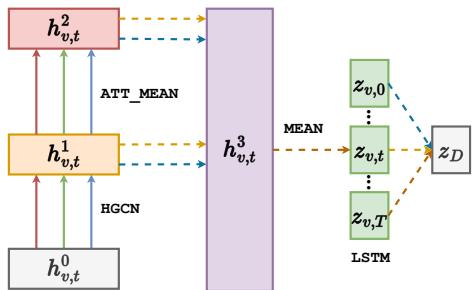  
(a) Christianity

  
(b) Android

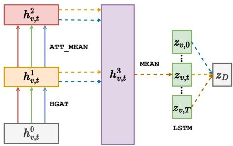  
(c) Douban  
Figure 5: The searched architectures by HyperIDP on different datasets.

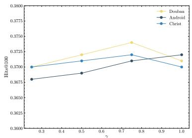  
(a) γ-Hits@100

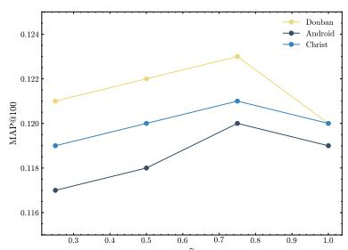  
(b) $\gamma \mathbf { - M A P @ 1 0 0 }$

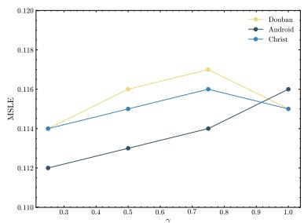  
(c) γ-MSLE

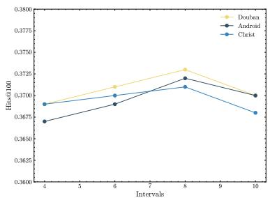  
(d) Intervals-Hits@100

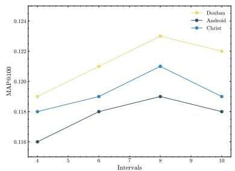  
(e) Intervals-MAP@100

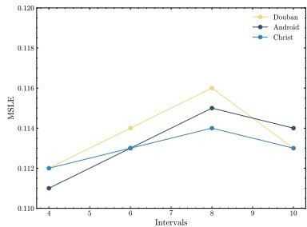  
(f) Intervals- MSLE

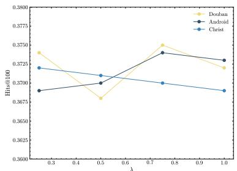  
(g) λ -Hits@100

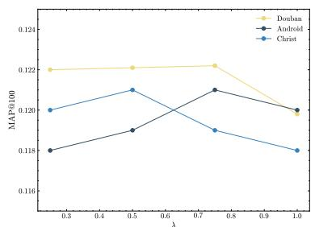  
(h) λ- MAP@100

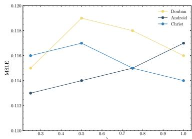  
(i) λ MSLE

Figure 6: The parameter sensitivity is evaluated on the Douban and Android datasets. For the maroc-micro balance parameter $\lambda \in \{ 0 . 2 5 , 0 . 5 , 0 . 7 5 , 1 . 0 \}$ , the number of time intervals in the range [2, 12], and the cooperativeadversarial balance parameter γ ∈ {0.25, 0.5, 0.75, 1.0}, the performance metrics considered are $M A P @ 1 0 0$ $M A P @ 1 0 0$ , and MSLE.