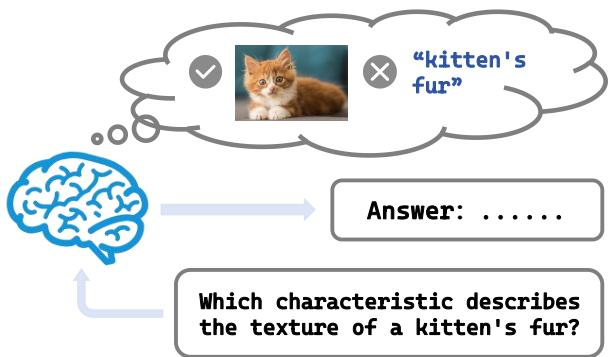
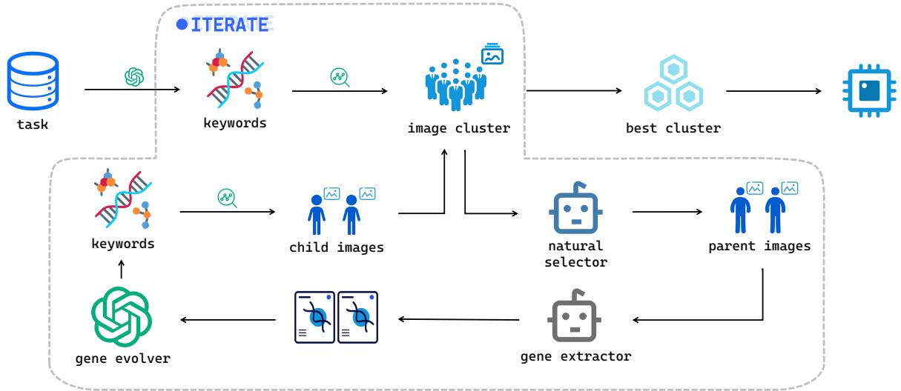
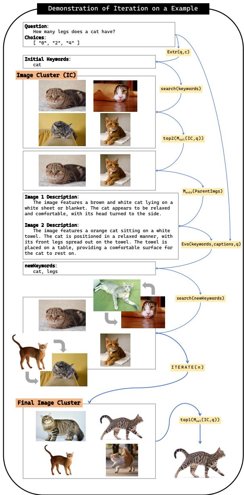
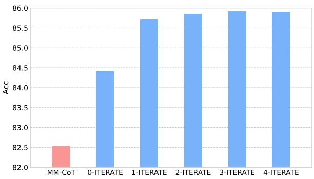
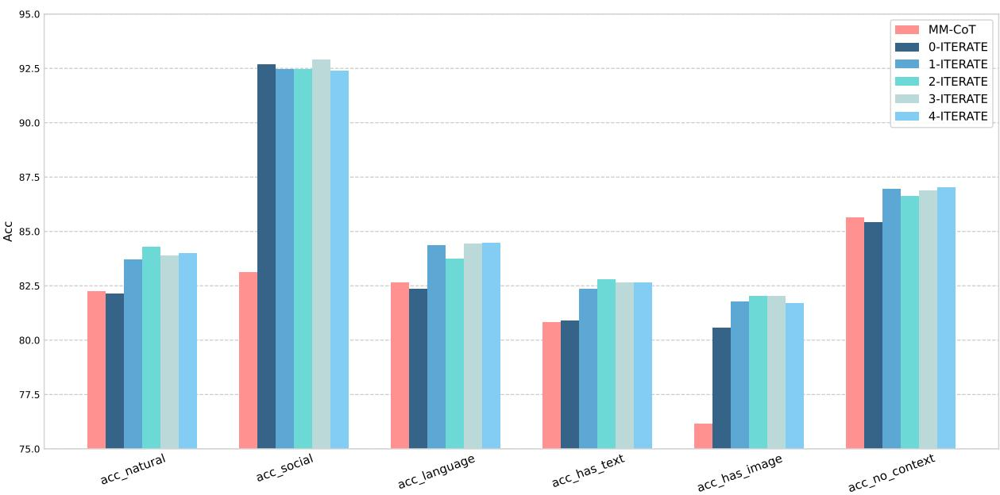

# ITERATE: Image-Text Enhancement, Retrieval, and Alignment for Transmodal Evolution with LLMs

Chenhan Fu1, Guoming Wang2, Juncheng Li1, Wenqiao Zhang1, Rongxing Lu4, Siliang Tang3,

1School of Software Technology, 2Ningbo research institute,   
3College of Computer Science and Technology, Zhejiang University 4 Faculty of Computer Science, University of New Brunswick,   
{chenhanfu,NB21013,junchengli,wenqiaozhang}@zju.edu.cn RLU1@unb.ca, siliang@zju.edu.cn

## Abstract

Inspired by human cognitive behavior, we introduce visual modality to enhance the perfor mance of pure text-based question-answering tasks with the development of multimodal models. However, obtaining corresponding images through manual annotation often entails high costs. Faced with this challenge, an intuitive strategy is to use search engines or use web scraping techniques to automatically obtain relevant image information. However, the images obtained by this strategy may be of low quality and may not match the context of the origi nal task, which could fail to improve or even decrease performance on downstream tasks. In this paper, we propose a novel framework named "ITERATE", aimed at retrieving and optimizing the quality of images to improve the alignment between text and images. Inspired by evolutionary algorithms in reinforcement learning and driven by the synergy of large language models (LLMs) and multimodal models, ITERATE employs a series of strategic actions such as filtering, optimizing, and retrieving to acquire higher quality images, and repeats this process over multiple generations to enhance the quality of the entire image cluster. Our experimental results on the ScienceQA, ARC-Easy, and OpenDataEval datasets also verify the effectiveness of our method, showing improvements of 3.5%, 5%, and 7%, respectively.

## 1 Introduction

In recent years, with the advancement of large language models (LLMs), the field of Natural Language Processing (NLP) has witnessed unparalleled progress (Floridi and Chiriatti, 2020; Ouyang et al., 2022). From text generation and knowledgeintensive question answering to sentiment analysis, LLMs have demonstrated remarkable performance across a wide range of NLP tasks. However, relying solely on textual information may not be sufficient in various scenarios. For instance, in a question-answering task, when the question relates to the essence or characteristics of a subject, merely depending on a text might fall short of capturing the detailed information needed for this task. This raises an interesting question: can we combine other modalities, such as images, with text to allow the model to better comprehend and answer the question? Just as with human cognitive behavior, when humans are asked a question, especially about a specific object, the first thing that comes to mind is the visual information of that object, rather than its natural language description, as shown in Figure 1. By understanding the visual content that is conjured up, one can provide the correct answer. This is one of the inspirations behind the work presented in this paper.

  
Figure 1: The inspiration for ITERATE. When a person is asked a question, the brain first associates it with the visual information of the relevant content, rather than the natural language itself.

Multimodal question-answering datasets have emerged, such as ScienceQA (Lu et al., 2022), which provides paired images for the questions or options of some examples. However, not all examples in ScienceQA are provided with images, presenting a challenge of missing images. Similarly, for general pure natural language QA tasks, incorporating additional relevant image information can also enhance the model’s answering capability.

Inspired by retrieval-enhanced technologies (Guu et al., 2020; Lewis et al., 2020; Izacard and Grave, 2020; Lin and Byrne, 2022; Chen et al., 2022), instead of the traditional method of searching for relevant documents or answers through question texts (or search for related images through a database), we consider a novel approach to align the question text with relevant images to assist the model in answering. However, this strategy brings forth a new challenge: how can we effectively get images that best match the text?

A direct solution is to utilize search engines or web crawlers to obtain images. Yet, there are obvious drawbacks to this approach. Images obtained through search engines or web crawlers can vary in quality, exhibit randomness, and most importantly, may not align with the context of the original task text. Such discrepancies in quality and mismatches with context could lead the model to generate biases during the learning phase, potentially reducing its accuracy and generalization capabilities, hindering the improvement of model performance or even leading to a decrease. How to ensure a high degree of consistency between the image and the text has become our main concern.

Faced with the challenge of selecting the most matched high-quality image for task text, we study different search methods to obtain the image that best matches the text. We find that searching solely based on topic keywords may result in a multitude of mismatches. Therefore, a more refined method is needed to distinguish the internal connections between text and images. Fortunately, Krishna et al. (Krishna et al., 2017) provide invaluable inspiration. They emphasize the profound and intrinsic relationship between natural language and visual content. Natural language can not only identify objects within images but also describe the relationships between them, leading to the proposal of the concept of Visual Genome(Krishna et al., 2017). Using the idea of converting images into combinations of words that describe objects, attributes, and relationships, we can also view images as composed of single or multiple object elements and the relationships between them (ie. transmodal conversion from vision to natural language). This combination of elements and relationships can be regarded as the “DNA" of an image.

In this paper, we draw inspiration from evolutionary algorithm (EAs) (Slowik and Kwasnicka, 2020) and the approach of Krishna et al. to introduce an iterative method named ITERATE. By integrating the idea of image DNA with EAs, we continuously iterate and refine our image selection, aiming for the utmost consistency between the selected images and their corresponding task texts. Taking advantage of LLMs’ expertise in NLP, we utilize LLMs as a genetic evolutionary operator to generate new “DNA”, with the EAs guiding the entire optimization process. Specifically, based on the initial “DNA” (initial keywords) derived from the task text, we search for related images using a search engine API to create an image cluster. LLMs are employed to imitate evolutionary operators in EAs to generate new “DNA” (new keywords), to search for the next generation of images, and replace those of less quality within the image cluster. We iterate on the updated image cluster to improve its overall quality. To validate the efficacy of the ITERATE method, we implement it on the ScienceQA (Lu et al., 2022), ARC-Easy (Clark et al., 2018) and OpenDataEval dataset. The experimental results indicate that this method not only improves the model’s answering accuracy across the three task sets but also achieves effective performance enhancement on single modal tasks.

## 2 Related Work

Retrieval Augmented Models For a long time, the combination of image data with text has been a focal point of research, as images encapsulate a wealth of worldly knowledge. Initial research on pre-trained models provided fresh insights for multimodal models. For instance, Flamingo (Alayrac et al., 2022) can generate descriptions from input images. FIBER (Dou et al., 2022) introduced a two-stage visual-language (VL) pre-training strategy suitable for various levels of VL tasks. DALL-E (Ramesh et al., 2021) and Parti (Yu et al., 2022) can generate images based on given text. Blip-2 (Li et al., 2023) initiated language-image pre-training from pre-existing frozen visual and language models. However, these models come with extensive parameter sizes and high pre-training computational costs, and they struggle with unseen knowledge. As a result, many retrieval-augmented approaches emerged to integrate external knowledge from both images and textual documents. For opendomain visual question answering, RA-VQA (Lin and Byrne, 2022) extracts related textual documents from databases through Dense Passage Retrieval (DPR) (Karpukhin et al., 2020) and jointly trains document retrievers and answer generation modules. Meanwhile, PICa (Yang et al., 2022) and KAT (Gui et al., 2021) also consider LLMs as implicit knowledge bases. Plug-and-Play (Tiong et al., 2022) utilizes GradCAM (Selvaraju et al., 2017) based on initial questions to locate relevant parts, retrieving associated image patches. Beyond pure text-augmented contexts, MuRAG (Chen et al., 2022) retrieves textual and image data from external storage systems, merging images as visual tokens. In the medical field, RAMM (Yuan et al., 2023) retrieves similar biomedical images and textual descriptions, encoding both modalities through distinct networks. However, these methods’ limitations lie in the need for specific multimodal storage systems for retrieval. Another line of approaches, such as REALM (Guu et al., 2020), RAG (Lewis et al., 2020), and FiD (Izacard and Grave, 2020), integrate Wikipedia articles as data storage, benefiting downstream knowledge-intensive tasks like question answering, but are confined to pure textual knowledge.

  
Figure 2: Flow Chart of ITERATE. The “natural selector” is the multimodal model used to filter out the parent images for evolution, the “gene extractor” is the multimodal model used to extract the visual content description from the parent images, and the “gene evolver” is the LLM used to execute the evolution operator.

Iterative Optimization Method In recent years, significant advancements have been made in the research on iterative optimization methods for LLMs. Yang et al. introduced the “Deep-Thinking" stage (Yang et al., 2023b), which enhances the reasoning abilities of LLMs at test time through the iterative forward optimization of demonstrations. DeepMind proposed the OPRO method (Yang et al., 2023a), leveraging LLMs as optimizers to iteratively generate new solutions based on natural language descriptions and previously discovered solutions for optimization. Iter-RetGen (Shao et al., 2023) enables LLMs to generate natural language reasoning steps or Chains of Thought (CoT) to answer multi-step questions through iterative optimization methods. Some works have also integrated with traditional algorithms in reinforcement learning. PACE (Dong et al., 2023) combines with the Actor-Critic algorithm (Konda and Tsitsiklis, 1999) to realize automatic prompt editing. EVOPROMPT (Guo et al., 2023) is integrated with evolutionary algorithms (Slowik and Kwasnicka, 2020) to achieve iterative optimization of discrete prompts. Promptbreeder (Fernando et al., 2023) is a general-purpose self-referential selfimprovement mechanism driven by LLMs, which evolves and adapts prompts based on the given domain. Iterative algorithms have shown their importance in optimization engineering.

## 3 ITERATE

We consider a question-answering task set $T =$ $\{ t _ { 1 } , t _ { 2 } , t _ { 3 } , t _ { 4 } , . . . , t _ { n - 1 } , t _ { n } \}$ . For each sample t, given the input text x, which includes a question q and several options c, the output is a corresponding number (such as A, B, C, etc.) of a selected option. For examples not accompanied by an image, we use the ITERATE method to retrieve the $B e s t I m a g e = I T E R A T E ( x , n )$ to enhance the model’s capacity to answer the question. Here, IT ERAT E(·) denotes the iterative evolutionary algorithm, and n represents the number of optimization iterations.

However, the inherent complexity and differences between visual content and textual data pose substantial challenges. For instance, whereas natural language is sequential, images are pixel matrices and inherently non-sequential. This nature makes it challenging to obtain the optimal matching image for a task text. According to the previous work of Guo et al. (Guo et al., 2023), it has been established that evolutionary algorithms are effectively applied for the iterative optimization of phrase sequences in discrete prompts, which are perceived as gene sequences in typical EAs. Utilizing the simplified Visual Genome concept, the visual content of images is transformed into a combination of keywords which is regarded as the image “DNA”, allowing evolutionary algorithms to be employed at the level of natural language.

Following the ideas of Guo et al. (Guo et al., 2023), we leverage the capabilities of LLMs to evolve keyword-based “DNA”. Since the optimization process involves cross-modal conversion, the operations involving the two modalities of image and text are implemented through multimodal models. To achieve the objective of obtaining the best matching image for the task text, evolutionary algorithms have been seamlessly incorporated into the ITERATE method, resulting in the iterative improvement of image quality via the evolution of cross-modal textual “DNA”.

## 3.1 Framework of ITERATE

Figure 2 depicted the architecture of our ITERATE.

Following the typical EAs, which generally start from an initial cluster and then iterate to generate new individuals by applying evolutionary operators on the current cluster, with each iteration updating the entire cluster, ITERATE primarily encompasses three steps: Initialization, Evolution, and Update:

Initialization: Since there are no initial image clusters corresponding to the samples in the current task set, we need to manually initialize a cluster for each sample. First, LLMs (such as GPT-4) are used to extract the initial keywords from each question text as the DNA of that cluster, represented as

$$
k e y w o r d s = E x t r ( q , c ) ,\tag{1}
$$

where q represents the question text in the sample, and c represents the option text. The search for images is then performed through search engines (such as Google Search, Bing Search), which can

be represented as

$$
i m g s = s e a r c h ( k e y w o r d s ) \ : ,\tag{2}
$$

to initialize an image cluster, IC. The subsequent iterative optimization process is conducted within this cluster to improve its overall quality.

Evolution: In each iteration, our ITERATE utilizes LLMs as evolutionary operators, which we refer to as the “gene evolver”, and employs multimodal models as cross-modal auxiliary operators, named the “natural selector” and “gene extractor” based on their functions. We use fixed prompts to guide the selection, reverse transcription, and recombinant mutation steps, thereby obtaining new images “DNA” of higher quality.

• Selection: Given that ITERATE is an iterative technique involving cross-modal conversion, we simply use the similarity between text and images as a measure of image quality. We employ models (such as CLIP (Radford et al., 2021)) that understand the relationship between images and text to calculate the image-text similarity, represented as

$$
s i m i l a r i t y = M _ { s e l } ( I C , q ) ,\tag{3}
$$

where IC represents the image cluster, and q represents the corresponding question text. Subsequently, the top-2 images in the image cluster are selected as parent images based on the similarity, represented as

$$
P a r e n t I m g s = t o p 2 ( s i m i l a r i t y )\tag{4}
$$

• Reverse Transcription: The concept of reverse transcription originates from the relationship between RNA and DNA in biology, where DNA is transcribed into RNA to produce proteins for gene expression, and RNA serves as a template to be reverse-transcribed back into DNA. Considering the combination of natural language keywords as the “DNA” of an image, the process of generating or extracting these natural language descriptions from images can be viewed as a form of “reverse transcription” operation. Just as RNA is reverse-transcribed back into DNA, images are “reverse-transcribed” into the keyword combinations in natural language form. We use multimodal models (such as LLaVA (Liu et al., 2023)) to perform this “reverse transcription” operation, represented as

$$
c a p t i o n s = M _ { e x t r } ( P a r e n t I m g s )\tag{5}
$$

  
Figure 3: The Iterative Process of ITERATE Algorithm on Demonstration Samples. The operators in the yellow boxes on the right of the figure correspond to Algorithm 1. ITERATE successfully retrieves the best image for the “How many legs does a cat have?” problem.

• Recombination&Mutation Based on the two sets of keywords derived from reverse transcription, as well as the task text itself, LLMs are used to “evolve” the original keyword combination into a new set of keyword combinations. The “evolution” operation is akin to integrating the crossover and mutation operations found in evolutionary algorithms: initially, LLMs cross-analyze the commonalities and individualities within the two images “DNA”s, and on the basis of retaining common keywords, further select individual ones to construct a new keyword combination together with the previous keywords (i.e. Recombination); subsequently, Mutations are applied to the individual keywords in conjunction with the question text to acquire a new “DNA”. Following these principles, we utilize fixed prompts to guide the behaviors of LLMs, represented by the equation:

<table><tr><td rowspan=1 colspan=1>Dataset</td><td rowspan=1 colspan=1>Original</td><td rowspan=1 colspan=1>ITERATE</td><td rowspan=1 colspan=1>Ratio</td></tr><tr><td rowspan=1 colspan=1>ScienceQA</td><td rowspan=1 colspan=1>10332</td><td rowspan=1 colspan=1>16058</td><td rowspan=1 colspan=1>75.7%</td></tr><tr><td rowspan=1 colspan=1>ARC-Easy</td><td rowspan=1 colspan=1>0</td><td rowspan=1 colspan=1>2376</td><td rowspan=1 colspan=1>100%</td></tr><tr><td rowspan=1 colspan=1>OpenDataEval</td><td rowspan=1 colspan=1>0</td><td rowspan=1 colspan=1>470</td><td rowspan=1 colspan=1>100%</td></tr></table>

Table 1: Statistical data of examples from the original datasets and after ITERATE image search processing. The "Original" column shows the number of examples with images initially, and the "ITERATE" column shows the count after adding images via ITERATE.

$$
n e w K e y w o r d s =
$$

$$
E v o ( k e y w o r d s , c a p t i o n s , q ) \ .\tag{6}
$$

Update: ITERATE iteratively generates new keywords DNA and uses search engines to retrieve new offspring images for updating the cluster:

$$
C h i l d I m g s = s e a r c h ( n e w K e y w o r d s ) .\tag{7}
$$

We consider a simple and direct updating strategy, specifically, in each iteration, ITERATE searches for N images (set to 2 in this paper) based on the keywords. These new images replace the bottom-N images in the image cluster (those with the lowest text match), resulting in an updated image cluster. This is akin to natural selection, where the fittest survive and produce equally high-quality offspring.

Once ITERATE reaches a pre-set number of iterations, the algorithm stops. Appendix A provides the pseudocode for ITERATE and the fixed prompts we used.

## 4 Experiments

In this section, we will evaluate our ITERATE method on three datasets. We will then introduce the benchmark dataset, implementation details, performance baselines for comparison, and the final experimental results.

## 4.1 Dataset

ScienceQA is the first large-scale multimodal multiple-choice science dataset with 21,208 examples across natural science (NAT), social science (SOC), and language science (LAN). The dataset is split into training, validation, and testing sets in a 60:20:20 ratio, with 12,726, 4,241, and 4,241 examples, respectively (Lu et al., 2022).

<table><tr><td>Model</td><td>Size</td><td>NAT</td><td>SOC</td><td>LAN</td><td>TXT</td><td>IMG</td><td>NO</td><td>Avg</td></tr><tr><td>MCAN</td><td>95M</td><td>56.08</td><td>46.23</td><td>58.09</td><td>59.43</td><td>51.17</td><td>55.40</td><td>54.54</td></tr><tr><td>Top-Down</td><td>70M</td><td>59.50</td><td>54.33</td><td>61.82</td><td>62.90</td><td>54.88</td><td>59.79</td><td>59.02</td></tr><tr><td>BAN</td><td>112M</td><td>60.88</td><td>46.57</td><td>66.64</td><td>62.61</td><td>52.60</td><td>65.51</td><td>59.37</td></tr><tr><td>DFAF</td><td>74M</td><td>64.03</td><td>48.82</td><td>63.55</td><td>65.88</td><td>54.49</td><td>64.11</td><td>60.72</td></tr><tr><td>ViLT</td><td>113M</td><td>60.48</td><td>63.89</td><td>60.27</td><td>63.20</td><td>61.38</td><td>57.00</td><td>61.14</td></tr><tr><td>Patch-TRM</td><td>90M</td><td>65.19</td><td>46.79</td><td>65.55</td><td>66.96</td><td>55.28</td><td>64.95</td><td>61.42</td></tr><tr><td>VisualBERT</td><td>111M</td><td>59.33</td><td>69.18</td><td>61.18</td><td>62.71</td><td>62.17</td><td>58.54</td><td>61.87</td></tr><tr><td> $\mathrm { U n i f i e d Q A } _ { B a s e }$ </td><td>223M</td><td>68.16</td><td>69.18</td><td>74.91</td><td>63.78</td><td>61.38</td><td>77.84</td><td>70.12</td></tr><tr><td> $\mathrm { U n i f i e d Q A } _ { B a s e } \mathrm { w } / \mathrm { C o T }$ </td><td>223M</td><td>71.00</td><td>76.04</td><td>78.91</td><td>66.42</td><td>66.53</td><td>81.81</td><td>74.11</td></tr><tr><td>GPT-3.5</td><td>175B</td><td>74.64</td><td>69.74</td><td>76.00</td><td>74.44</td><td>67.28</td><td>77.42</td><td>73.97</td></tr><tr><td> $\mathrm { G P T } { - } 3 . 5 \ \mathrm { w } / \mathrm { C o T }$ </td><td>175B</td><td>75.44</td><td>70.87</td><td>78.09</td><td>74.68</td><td>67.43</td><td>79.93</td><td>75.17</td></tr><tr><td> $\mathbf { M M - C o T } _ { B a s e }$ </td><td>223M</td><td>82.24</td><td>83.13</td><td>82.64</td><td>80.84</td><td>76.15</td><td>85.64</td><td>82.53</td></tr><tr><td> $\mathbf { M M - C o T } _ { B a s e } + \mathbf { I T E R A T E }$ </td><td>223M</td><td>83.88</td><td>92.91</td><td>84.45</td><td>82.65</td><td>82.05</td><td>86.90</td><td>85.92</td></tr></table>

Table 2: The Results of Model Performance Comparison on ScienceQA (%). Size = backbone model size. Question categories: NAT = natural science, SOC = social science, LAN = language science, TXT = with text context, IMG = with image context, NO = with no context.

ARC-Easy is a multiple-choice dataset from U.S. middle and elementary school science exams, covering biology, chemistry, physics, earth science, and astronomy.

OpenDataEval is a multiple-choice dataset created by retrieving random articles from the HuggingFace Wikipedia English dataset, constructing chains of thought, and using large language models to score and filter the questions.

## 4.2 Baseline Models

For the ARC-Easy and OpenDataEval datasets, which are pure NLP tasks, we utilize models from the Llama-2 family and the base model of LLaVA-13B, with the ARC-Easy dataset also incorporating the Mistral-7B (Jiang et al., 2023) model.

As for ScienceQA dataset, following the work of Lu et al., we compare our ITERATE method with the baselines of the following four methods:

(1) Visual question answering models: MCAN (Yu et al., 2019), Top-Down (Anderson et al., 2018), BAN (Kim et al., 2018), DFAF (Gao et al., 2019), ViLT (Kim et al., 2021), Patch-TRM (Lu et al., 2021), VisualBERT (Li et al., 2019).

(2) Text-to-text LMs: UnifiedQA (Khashabi et al., 2020), as well as UnifiedQA with Chain-of-Thought (CoT) (Lu et al., 2022).

(3) GPT-3.5 models: GPT-3.5 based on the textdavinci-002 engine (Chen et al., 2020), as well as GPT-3.5 with CoT (Lu et al., 2022).

(4) Multimodal- $. \mathrm { C o T } _ { B a s e } .$ : MM-CoT running under the same parameters as our experiments.

## 4.3 Implementation Details

For MM-CoT, we use GPT-4 for initial keyword extraction and evolutionary operations. Clip-vitbase-patch32 (Radford et al., 2021) is employed for image-text matching, and LLaVA-Lightning-MPT-7B (Liu et al., 2023) for extracting natural language descriptions from images. Bing Search v7, comparable in accuracy to Google, is used as the search engine.

For LLaVA, its multimodal capabilities allow it to handle keyword extraction, evolutionary operations, and natural language descriptions of parent images independently, without external models.

To ensure a fair comparison, ITERATE optimization on ScienceQA only searched for images for examples without them, leaving existing images unchanged. Since few images match the language science category, ITERATE was not applied there. For ARC-Easy and OpenDataEval, images were supplemented for every question. Figure 3 illustrates ITERATE applied to the demonstration.

<table><tr><td>Method</td><td>ARC-Easy</td></tr><tr><td>Mistral-7B</td><td>80.0</td></tr><tr><td>LLaMA-7B</td><td>72.8</td></tr><tr><td>LLaMA-13B</td><td>78.9</td></tr><tr><td>LLaMA-33B</td><td>80.0</td></tr><tr><td>LLaVA-13B</td><td>78.0</td></tr><tr><td> $\mathrm { L L a V A – 1 3 B + I T E R A T E }$ </td><td>82.8</td></tr></table>

Table 3: The Results of Model Performance Comparison on ARC-Easy (%).
<table><tr><td>Method</td><td>OpenDataEval</td></tr><tr><td>Mistral-7B</td><td>66.7</td></tr><tr><td>LLaMA-7B</td><td>60.1</td></tr><tr><td>LLaMA-13B</td><td>66.5</td></tr><tr><td>LLaVA-13B</td><td>64.8</td></tr><tr><td> $\mathrm { L L a V A – 1 3 B + I T E R A T E }$ </td><td>72.0</td></tr></table>

Table 4: The Results of Model Performance Comparison on OpenDataEval (%).

For the ScienceQA dataset, we fine-tuned the Multimodal-CoT model (Zhang et al., 2023) to evaluate our ITERATE method. DETR (Carion et al., 2020) generated visual features, and FLan-Alpaca-Base (Chia et al., 2023) served as the backbone. The models were fine-tuned for up to 20 epochs with a learning rate of $5 e ^ { - 5 }$ , a maximum input length of 512, and a batch size of 8.

For the ARC-Easy and OpenDataEval datasets, we adopte zero-shot learning on the LLaVA-v1.5- 13B model to test the robustness of our ITERATE method in generalization and the helpfulness of image modal in NLP question-answering tasks.

## 4.4 Original vs. Dataset after ITERATE

We also performed statistics on all examples in the three datasets enhanced by the ITERATE algorithm, as shown in Table 1.

For ScienceQA, the original dataset includes 10,332 examples (48.7%) with images. After supplementing with images, the new dataset has 16,058 examples (75.7%) with images. The remaining 24.3% without images are mostly in the language science category, where relevant images couldn’t be found. The natural science category saw the most significant increase, nearly doubling the number of examples with images.

Both ARC-Easy and OpenDataEval are originally text-based QA datasets. In the new datasets,

  
Figure 4: Ablation results of different iteration numbers on overall performance.

100% of examples now include images, meaning our method successfully found relevant images to assist in answering the text questions.

## 4.5 Main Results

Table 2 presents the results of our experiment with the ITERATE method. To ensure fairness, we compare it with $\mathbf { M M - C o T } _ { B a s e }$ , using the same experimental parameters. ITERATE improved $\mathbf { M M - C o T } _ { B a s e }$ by 3.39% , outperforming all baseline models. Notably, the TXT and NO categories within ScienceQA benefited significantly from paired images, enhancing the model’s cognitive abilities. The SOC category saw the largest accuracy boost, nearly 10%.

It is worth noting that, despite no changes in the LAN category examples, there was still a 1.8% uptick in accuracy. A credible rationale for this improvement can be found in the research by Lin et al. (Lin et al., 2023), which suggests that crossmodal understanding between different modalities (like image-text) in multimodal learning can not only enhance the performance of the model on multimodal tasks, but also potentially enhance its single-modal task performance.

The zero-shot performance improvements of IT-ERATE are shown in Tables 3 and 4. Our ITER-ATE method significantly enhanced LLaVA’s performance on these NLP tasks, demonstrating the value of the added image modality. LLaVA’s performance improved by approximately 5% and 7% across two datasets. Notably, LLaVA-13B with ITERATE outperformed the 33B LLaMA and the powerful Mistral-7B(matching the performance of LLaMA-33B with only 7B parameters), also surpassing LLMs with similar parameter counts.

<table><tr><td>Method</td><td>NAT</td><td>SOC</td><td>LAN</td><td>TXT</td><td>IMG</td><td>NO</td><td>Avg</td></tr><tr><td>MM-CoT  $B a s e$ </td><td>82.24</td><td>83.13</td><td>82.64</td><td>80.84</td><td>76.15</td><td>85.64</td><td>82.53</td></tr><tr><td>MM-CoT ITERATE  $\begin{array} { r l } { B a s e } & { { } + } \end{array}$ </td><td>83.88</td><td>92.91</td><td>84.45</td><td>82.65</td><td>82.05</td><td>86.90</td><td>85.92</td></tr><tr><td>w/o top-2 images select</td><td>82.80</td><td>92.52</td><td>83.01</td><td>81.57</td><td>80.97</td><td>85.96</td><td>84.87</td></tr></table>

Table 5: Ablation results on the ScienceQA of top-2 images selection module in ITERATE (%).

<table><tr><td>Method</td><td>ARC-E</td><td>ODEval</td></tr><tr><td>LLaVA-13B</td><td>78.0</td><td>64.8</td></tr><tr><td>LLaVA-13B + ITERATE</td><td>82.8</td><td>72.0</td></tr><tr><td>w/ shuffled images</td><td>74.9</td><td>66.6</td></tr></table>

Table 6: Ablation results of whether the images are correctly matched on ARC-Easy and OpenDataEval.

## 4.6 Ablation Analysis

Effect of Iteration Numbers In our ablation study on the ScienceQA dataset, we examined the impact of the ITERATE method and the number of iterations on model performance, as shown in Figure 4. Even with 0 iterations (0-ITERATE), the model’s accuracy increased from the baseline MM-$\mathrm { C o T } _ { B a s e }$ model’s 82.53% to 84.41%, indicating that the image retrieval enhancement provided by ITERATE offers a certain performance advantage. Performance continued to improve with more iterations, reaching a peak accuracy of 85.92% at 3 iterations, indicating that iteration in ITERATE provides additional gains. We also analyze the impact of varying iteration numbers within ITERATE on the accuracy across six categories in ScienceQA, as shown in Appendix B.

Effect of top-2 selection module We conducted an ablation study on the top-2 selection module in ITERATE, used for selecting parent images for evolution. The number of iterations was set to three, matching the best performance setup. The control group used random sampling for parent images, with results shown in Table 5. Removing the top-2 selection module led to a 1.1% drop in overall performance, similar to ITERATE without iterations, highlighting the significance of the top-2 image selection module in enhancing the system’s overall efficiency. The NAT category showed the most significant performance decline, while the SOC category was less affected, indicating that SOC questions are less sensitive to image quality.

Effect of correct images pairing To prove that it is indeed the aligned content in the images that aids the model in answering, rather than just the additional image information, we conducte corresponding ablation experiment where we shuffle the images for random pairing. The result as shown in Table 6, indicates that the performance improvement with shuffled image pairings is not significant, and there was even a decline, which emphasizes the correctness and effectiveness of our method.

## 5 Conclusions

In this paper, to improve the model’s performance on question-answering tasks, we introduce an additional visual modality (image) to enhance the model’s understanding and answering capabilities. Moreover, to obtain high-quality images, we introduce a cross-modal evolutionary method for imagetext retrieval optimization, named ITERATE, inspired by evolutionary algorithms in reinforcement learning and the concept of the Visual Genome. Our experiments have demonstrated the helpfulness of additional modal information in enhancing the performance of purely NLP tasks, as well as the effectiveness of ITERATE in optimizing the quality of retrieved images. Our work takes an important step forward in improving the model’s performance on question-answering tasks by introducing high-quality new modalities, with ITER-ATE’s significant improvements in image retrieval and quality optimization highlighting the value of this approach and the potential of multimodal enhancements to task performance.

## 6 Limitations and Future Works

Our ITERATE method has proven effective across three QA datasets, and we now seek to validate it on more diverse tasks. However, ITERATE faces challenges; ablation studies show performance may decline after the third iteration, likely due to the increasing complexity of image-text matching. Future work could focus on selecting high-quality image pairs by enhancing the model’s understanding of task questions, rather than relying solely on image-text similarity.

## References

Jean-Baptiste Alayrac, Jeff Donahue, Pauline Luc, Antoine Miech, Iain Barr, Yana Hasson, Karel Lenc, Arthur Mensch, Katherine Millican, Malcolm Reynolds, et al. 2022. Flamingo: a visual language model for few-shot learning. Advances in Neural Information Processing Systems, 35:23716–23736.

Peter Anderson, Xiaodong He, Chris Buehler, Damien Teney, Mark Johnson, Stephen Gould, and Lei Zhang. 2018. Bottom-up and top-down attention for image captioning and visual question answering. In Proceedings of the IEEE conference on computer vision and pattern recognition, pages 6077–6086.

Nicolas Carion, Francisco Massa, Gabriel Synnaeve, Nicolas Usunier, Alexander Kirillov, and Sergey Zagoruyko. 2020. End-to-end object detection with transformers. In European conference on computer vision, pages 213–229. Springer.

Ting Chen, Simon Kornblith, Kevin Swersky, Mohammad Norouzi, and Geoffrey E Hinton. 2020. Big self-supervised models are strong semi-supervised learners. Advances in neural information processing systems, 33:22243–22255.

Wenhu Chen, Hexiang Hu, Xi Chen, Pat Verga, and William W Cohen. 2022. Murag: Multimodal retrieval-augmented generator for open question answering over images and text. arXiv preprint arXiv:2210.02928.

Yew Ken Chia, Pengfei Hong, Lidong Bing, and Soujanya Poria. 2023. Instructeval: Towards holistic evaluation of instruction-tuned large language models. arXiv preprint arXiv:2306.04757.

Peter Clark, Isaac Cowhey, Oren Etzioni, Tushar Khot, Ashish Sabharwal, Carissa Schoenick, and Oyvind Tafjord. 2018. Think you have solved question answering? try arc, the ai2 reasoning challenge. arXiv preprint arXiv:1803.05457.

Yihong Dong, Kangcheng Luo, Xue Jiang, Zhi Jin, and Ge Li. 2023. Pace: Improving prompt with actor-critic editing for large language model. arXiv preprint arXiv:2308.10088.

Zi-Yi Dou, Aishwarya Kamath, Zhe Gan, Pengchuan Zhang, Jianfeng Wang, Linjie Li, Zicheng Liu, Ce Liu, Yann LeCun, Nanyun Peng, et al. 2022. Coarse-to-fine vision-language pre-training with fusion in the backbone. Advances in neural information processing systems, 35:32942–32956.

Chrisantha Fernando, Dylan Banarse, Henryk Michalewski, Simon Osindero, and Tim Rocktäschel. 2023. Promptbreeder: Self-referential self-improvement via prompt evolution. arXiv preprint arXiv:2309.16797.

Luciano Floridi and Massimo Chiriatti. 2020. Gpt-3: Its nature, scope, limits, and consequences. Minds and Machines, 30:681–694.

Peng Gao, Zhengkai Jiang, Haoxuan You, Pan Lu, Steven CH Hoi, Xiaogang Wang, and Hongsheng Li. 2019. Dynamic fusion with intra-and inter-modality attention flow for visual question answering. In Proceedings of the IEEE/CVF conference on computer vision and pattern recognition, pages 6639–6648.

Liangke Gui, Borui Wang, Qiuyuan Huang, Alex Hauptmann, Yonatan Bisk, and Jianfeng Gao. 2021. Kat: A knowledge augmented transformer for vision-andlanguage. arXiv preprint arXiv:2112.08614.

Qingyan Guo, Rui Wang, Junliang Guo, Bei Li, Kaitao Song, Xu Tan, Guoqing Liu, Jiang Bian, and Yujiu Yang. 2023. Connecting large language models with evolutionary algorithms yields powerful prompt optimizers. arXiv preprint arXiv:2309.08532.

Kelvin Guu, Kenton Lee, Zora Tung, Panupong Pasupat, and Mingwei Chang. 2020. Retrieval augmented language model pre-training. In International conference on machine learning, pages 3929–3938. PMLR.

Gautier Izacard and Edouard Grave. 2020. Leveraging passage retrieval with generative models for open domain question answering. arXiv preprint arXiv:2007.01282.

Albert Q Jiang, Alexandre Sablayrolles, Arthur Mensch, Chris Bamford, Devendra Singh Chaplot, Diego de las Casas, Florian Bressand, Gianna Lengyel, Guillaume Lample, Lucile Saulnier, et al. 2023. Mistral 7b. arXiv preprint arXiv:2310.06825.

Vladimir Karpukhin, Barlas Oguz, Sewon Min, Patrick˘ Lewis, Ledell Wu, Sergey Edunov, Danqi Chen, and Wen-tau Yih. 2020. Dense passage retrieval for open-domain question answering. arXiv preprint arXiv:2004.04906.

Daniel Khashabi, Sewon Min, Tushar Khot, Ashish Sabharwal, Oyvind Tafjord, Peter Clark, and Hannaneh Hajishirzi. 2020. Unifiedqa: Crossing format boundaries with a single qa system. arXiv preprint arXiv:2005.00700.

Jin-Hwa Kim, Jaehyun Jun, and Byoung-Tak Zhang. 2018. Bilinear attention networks. Advances in neural information processing systems, 31.

Wonjae Kim, Bokyung Son, and Ildoo Kim. 2021. Vilt: Vision-and-language transformer without convolution or region supervision. In International Conference on Machine Learning, pages 5583–5594. PMLR.

Vijay Konda and John Tsitsiklis. 1999. Actor-critic algorithms. Advances in neural information processing systems, 12.

Ranjay Krishna, Yuke Zhu, Oliver Groth, Justin Johnson, Kenji Hata, Joshua Kravitz, Stephanie Chen, Yannis Kalantidis, Li-Jia Li, David A Shamma, et al. 2017. Visual genome: Connecting language and vision using crowdsourced dense image annotations. International journal ofcomputer vision, 123:32–73.

Patrick Lewis, Ethan Perez, Aleksandra Piktus, Fabio Petroni, Vladimir Karpukhin, Naman Goyal, Heinrich Küttler, Mike Lewis, Wen-tau Yih, Tim Rocktäschel, et al. 2020. Retrieval-augmented generation for knowledge-intensive nlp tasks. Advances in Neural Information Processing Systems, 33:9459–9474.

Junnan Li, Dongxu Li, Silvio Savarese, and Steven Hoi. 2023. Blip-2: Bootstrapping language-image pretraining with frozen image encoders and large language models. arXiv preprint arXiv:2301.12597.

Liunian Harold Li, Mark Yatskar, Da Yin, Cho-Jui Hsieh, and Kai-Wei Chang. 2019. Visualbert: A simple and performant baseline for vision and language. arXiv preprint arXiv:1908.03557.

Weizhe Lin and Bill Byrne. 2022. Retrieval augmented visual question answering with outside knowledge. arXiv preprint arXiv:2210.03809.

Zhiqiu Lin, Samuel Yu, Zhiyi Kuang, Deepak Pathak, and Deva Ramanan. 2023. Multimodality helps unimodality: Cross-modal few-shot learning with multimodal models. In Proceedings of the IEEE/CVF Conference on Computer Vision and Pattern Recognition, pages 19325–19337.

Haotian Liu, Chunyuan Li, Qingyang Wu, and Yong Jae Lee. 2023. Visual instruction tuning. arXiv preprint arXiv:2304.08485.

Pan Lu, Swaroop Mishra, Tanglin Xia, Liang Qiu, Kai-Wei Chang, Song-Chun Zhu, Oyvind Tafjord, Peter Clark, and Ashwin Kalyan. 2022. Learn to explain: Multimodal reasoning via thought chains for science question answering. Advances in Neural Information Processing Systems, 35:2507–2521.

Pan Lu, Liang Qiu, Jiaqi Chen, Tony Xia, Yizhou Zhao, Wei Zhang, Zhou Yu, Xiaodan Liang, and Song-Chun Zhu. 2021. Iconqa: A new benchmark for abstract diagram understanding and visual language reasoning. arXiv preprint arXiv:2110.13214.

Long Ouyang, Jeffrey Wu, Xu Jiang, Diogo Almeida, Carroll Wainwright, Pamela Mishkin, Chong Zhang, Sandhini Agarwal, Katarina Slama, Alex Ray, et al. 2022. Training language models to follow instructions with human feedback. Advances in Neural Information Processing Systems, 35:27730–27744.

Alec Radford, Jong Wook Kim, Chris Hallacy, Aditya Ramesh, Gabriel Goh, Sandhini Agarwal, Girish Sastry, Amanda Askell, Pamela Mishkin, Jack Clark, et al. 2021. Learning transferable visual models from natural language supervision. In International conference on machine learning, pages 8748–8763. PMLR.

Aditya Ramesh, Mikhail Pavlov, Gabriel Goh, Scott Gray, Chelsea Voss, Alec Radford, Mark Chen, and Ilya Sutskever. 2021. Zero-shot text-to-image generation. In International Conference on Machine Learning, pages 8821–8831. PMLR.

Ramprasaath R Selvaraju, Michael Cogswell, Abhishek Das, Ramakrishna Vedantam, Devi Parikh, and Dhruv Batra. 2017. Grad-cam: Visual explanations from deep networks via gradient-based localization. In Proceedings ofthe IEEE international conference on computer vision, pages 618–626.

Zhihong Shao, Yeyun Gong, Yelong Shen, Minlie Huang, Nan Duan, and Weizhu Chen. 2023. Enhancing retrieval-augmented large language models with iterative retrieval-generation synergy. arXiv preprint arXiv:2305.15294.

Adam Slowik and Halina Kwasnicka. 2020. Evolutionary algorithms and their applications to engineering problems. Neural Computing and Applications, 32:12363–12379.

Anthony Meng Huat Tiong, Junnan Li, Boyang Li, Silvio Savarese, and Steven CH Hoi. 2022. Plug-andplay vqa: Zero-shot vqa by conjoining large pretrained models with zero training. arXiv preprint arXiv:2210.08773.

Chengrun Yang, Xuezhi Wang, Yifeng Lu, Hanxiao Liu, Quoc V Le, Denny Zhou, and Xinyun Chen. 2023a. Large language models as optimizers. arXiv preprint arXiv:2309.03409.

Jiaxi Yang, Binyuan Hui, Min Yang, Binhua Li, Fei Huang, and Yongbin Li. 2023b. Iterative forward tuning boosts in-context learning in language models. arXiv preprint arXiv:2305.13016.

Zhengyuan Yang, Zhe Gan, Jianfeng Wang, Xiaowei Hu, Yumao Lu, Zicheng Liu, and Lijuan Wang. 2022. An empirical study of gpt-3 for few-shot knowledgebased vqa. In Proceedings of the AAAI Conference on Artificial Intelligence, volume 36, pages 3081– 3089.

Jiahui Yu, Yuanzhong Xu, Jing Yu Koh, Thang Luong, Gunjan Baid, Zirui Wang, Vijay Vasudevan, Alexander Ku, Yinfei Yang, Burcu Karagol Ayan, et al. 2022. Scaling autoregressive models for content-rich text-to-image generation. arXiv preprint arXiv:2206.10789, 2(3):5.

Zhou Yu, Jun Yu, Yuhao Cui, Dacheng Tao, and Qi Tian. 2019. Deep modular co-attention networks for visual question answering. In Proceedings ofthe IEEE/CVF conference on computer vision and pattern recognition, pages 6281–6290.

Zheng Yuan, Qiao Jin, Chuanqi Tan, Zhengyun Zhao, Hongyi Yuan, Fei Huang, and Songfang Huang. 2023. Ramm: Retrieval-augmented biomedical visual question answering with multi-modal pre-training. arXiv preprint arXiv:2303.00534.

Zhuosheng Zhang, Aston Zhang, Mu Li, Hai Zhao, George Karypis, and Alex Smola. 2023. Multimodal chain-of-thought reasoning in language models. arXiv preprint arXiv:2302.00923.

## A Pseudocode of ITERATE

In Algorithm 1, initial keyword extraction operation, Extr(·), and evolutionary operator, Evo(·), are both conducted through few-shot learning in LLMs. The corresponding prompts are as follows:

• Extr(·) : I have a question and its   
options now. Please extract a keyword   
for a noun or adjective from it   
and use them to search for images   
for data enhancement, making the QA   
results better. The following are   
some examples of keywords extraction:   
Example 1: Question: {question   
of Example 1}, Options: {options   
of Example 1}, Keywords:{initial   
keyword of Example 1}.   
Example 2: Question: {question   
of Example 2}, Options: {options   
of Example 2}, keywords:{initial   
keyword of Example 2}.   
Now, give me the keywords based on   
the following information:   
Question: {question of QUERY},   
Options: {options of QUERY}

• Evo(·) : Next, I will provide content   
descriptions of two images, which   
are obtained from a Bing search using   
the original keywords. I hope you can   
help me generate new keywords from   
the given two description sentences   
that encapsulate their differences.   
These keywords will be used for   
Bing image search to obtain higher   
quality images to assist in answering   
the question. The following is the   
example:   
Original Keywords: {Original   
Keywords of Example}, Description   
1: {content description of image-1},   
Description 2: {content description   
of image-2}, New Keywords: {New   
Keywords of the Example}.   
Now, give the new keywords based on   
the following information:   
Original Keywords: {Original   
Keywords of QUERY}, Description   
1: {content description of image-1},   
Description 2: {content description   
of image-2}

## B Ablation results within six categories examples of ScienceQA

Without any iterations, we find the SOC and IMG categories to have the most substantial performance gains, approximately 10% and 5%, respectively. However, for the other four categories, the performance of 0-ITERATE is only on par with the baseline. One possible reason is that the images retrieved without iteration optimization might be of poor quality, failing to effectively enhance performance, and even possibly harm the questionanswering capability of the model. Consequently, after one single iteration, all these categories exhibit significant performance improvement, suggesting that this initial iteration plays a pivotal role in optimizing the quality of paired images. For instance, the accuracy increases by about 1.6% in NAT, TXT, and NO categories.

As the number of iterations increases to 2-3 times, the performance progressively stabilizes. This non-linear trend provides valuable reference for iteration strategies in practical applications, indicating that choosing the appropriate number of iterations is crucial for ensuring both enhancement and stability of model performance.

Algorithm 1 Pseudocode of ITERATE(x,n).   
Require: x represents the input of sample t from task T, including question q and choices c, LLM as an   
evolutionary operator Evo(·), multimodal models denoted as $M _ { s e l }$ and $M _ { e x t r } ,$ Search engine denoted   
as search(·), empty image cluster IC   
Ensure: Best Image img∗   
1: Initial keywords = Extr(q, c) and imgs = search(keywords) −→ IC   
2: for t = 1 to n do   
3: Selection: select the best two images from the images cluster as parent.   
4: similarity = M (IC, q)   
5: ParentImgs = top2(similarity)   
6: Reverse-Transcription: extract DNA described in natural language   
7: captions = Mextr(ParentImgs)   
8: Recombination: generate new keywords based on natural language DNA and question text   
9: newKeywords = Evo(keywords, captions, q)   
10: Update: ChildImgs = search(newKeywords) — replace −→ IC   
11: end for   
12: Return: the best image, img∗, matched from the cluster IC   
13: img∗ = top1( Msel(IC, q) )

  
Figure 5: Ablation results of different iteration numbers on examples across six categories.