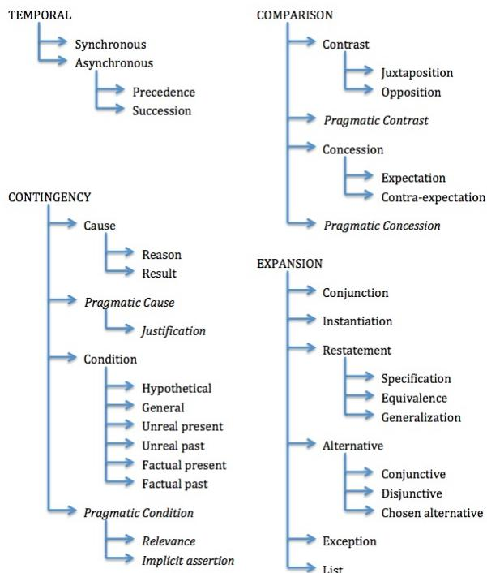
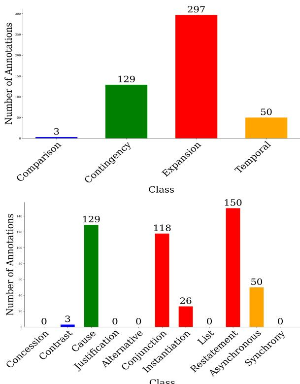
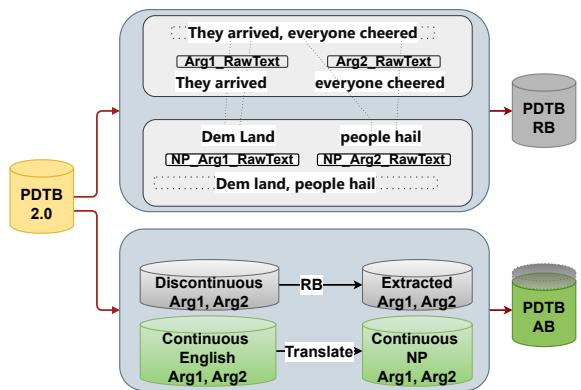
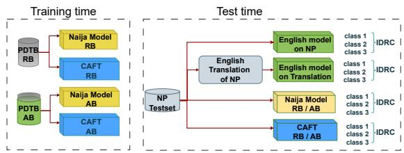
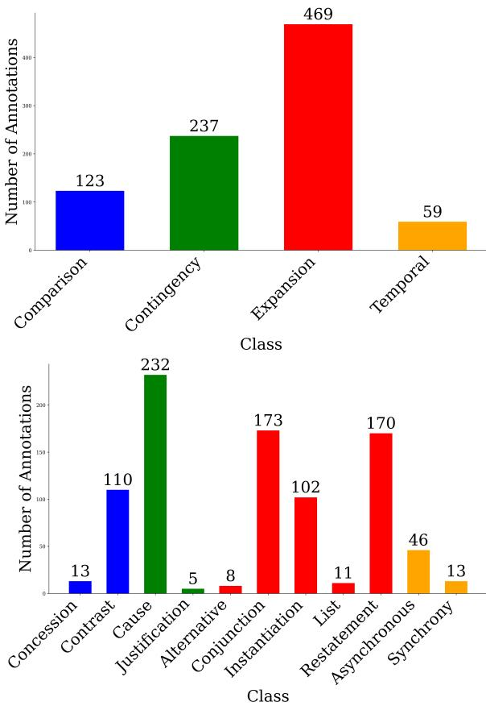

# Implicit Discourse Relation Classification For Nigerian Pidgin

Muhammed Saeed and Peter Bourgonje and Vera Demberg

Saarland University, Saarbrücken, Germany

{musaeed,peterb}@lst.uni-saarland.de, vera@coli.uni-saarland.de

## Abstract

Despite attempts to make Large Language Models multi-lingual, many of the world’s languages are still severely under-resourced. This widens the performance gap between NLP and AI applications aimed at well-financed, and those aimed at less-resourced languages. In this paper, we focus on Nigerian Pidgin (NP), which is spoken by nearly 100 million people, but has comparatively very few NLP resources and corpora. We address the task of Implicit Discourse Relation Classification (IDRC) and systematically compare an approach translating NP data to English and then using a wellresourced IDRC tool and back-projecting the labels versus creating a synthetic discourse corpus for NP, in which we translate text and project labels from an annotated corpus, and then train an NP classifier. The latter approach of training an NP classifier outperforms our baseline by 13.27% and 33.98% in f1 score for 4-way and 11-way classification, respectively.

## 1 Introduction

An important aspect of understanding a text is correctly parsing the relations between the sentences that compose it, also known as discourse relations. Uncovering these relations (a task referred to as discourse parsing) helps with down-stream tasks such as argument mining (Kirschner et al., 2015), summarization (Xu et al., 2020; Dong et al., 2021) and relation extraction (Tang et al., 2021). Recent experiments, however, have shown that discourse parsing performance is not easily improved by modern prompting methods (Chan et al., 2024; Yung et al., 2024). In addition, multi-lingual LLMs still have comparatively low performance on lowresource languages (Zhu et al., 2023; Bang et al., 2023). The majority of prior work on discourse parsing is on English, following the paradigm of the Penn Discourse TreeBank (PDTB, Prasad et al. (2008)). In the PDTB, relations are organized according to several types, the most frequent of

which are explicit and implicit relations. The following two examples demonstrate an explicit relation (marked by because), and an implicit relation, which does not contain an over marker in the original text. In the implicit relation, a contrastive relation sense (potentially expressed by a connective such as but) is to be inferred by the reader:

The city’s Campaign Finance Board has refused to pay Mr. Dinkins \$95,142 in matching funds because his campaign records are incomplete.

— Explicit, Contingency.Cause.Reason (Prasad et al., 2008)

Some say November. (Implicit = but) I say 1992.

— Implicit, Comparison.Contrast (Prasad et al., 2008)

Although corpora annotated for PDTB relations - and generally discourse relations following other discourse parsing frameworks - exist for languages other than English (see Braud et al. (2023) for an overview), coverage for low-resource languages is limited. To address this, one effective method is Discourse Relation Projection (DRP), which transfers discourse annotations from a resourcerich language like English to a low-resource target language such as Nigerian Pidgin (NP). DRP leverages syntactic and lexical similarities between the languages, combined with alignment techniques, to infer discourse relations in the target language (Scholman et al., 2024; Sluyter-Gäthje et al., 2020; Mírovsky et al.\` , 2021). This approach facilitates the creation of synthetic annotations via human or machine translation and alignment to project the annotation from the English into low-resource languages, which can aid the training of discourse relation classifier models for low-resource scenarios.

In this paper, we work on discourse parsing for Nigerian Pidgin (NP), which has nearly 100 million speakers, but despite this, has very little support in terms of NLP resources and corpora. We zoom in on implicit discourse relations and experiment with different methods to classify implicit discourse relations in NP. Particularly, we explore two main strategies:

• The first strategy is based on zero-shot learning. By using a state-of-the-art classifier trained on English (Chan et al., 2023), we both apply the classifier to NP sentences directly, and translate NP text (using machine translation) to English, use the English classifier, and project the annotations back onto the original, NP text. This procedure has the advantage that no annotations in NP are required for training.

• The second strategy is based on fine-tuning the LLM that is used by the model for relation classification on NP specifically, such that we end up with a dedicated NP model. For this, annotated training data in the target language is required, but we find that this yields better results in the case of NP implicit discourse relation classification. To obtain the annotations for fine-tuning a dedicated NP model, we experiment with two different strategies:

– By translating the entire text and obtaining the relations and their arguments through word alignment, we preserve context, but risk losing (parts of) relations due to word alignment errors.

– By translating the arguments of individual relations in isolation, alignment becomes trivial and does not result in loss of relations, but by missing the context, translation quality might be lower.

We evaluate our approach on gold annotations (Scholman et al., 2024), and our best-performing set-up achieves an accuracy and $\mathrm { f _ { 1 } }$ score of (0.631, 0.461) and (0.440, 0.327), respectively, on 4-way and 11-way relation sense classification (see Section 3 for details). By disclosing the number of instances we use for fine-tuning an LLM for NP specifically and the relation distribution in both our synthetic (training) and gold (evaluation) NP data, we aim to provide an idea of what performance can be expected for implicit discourse relation classification on a low-resource language such as NP.

## 2 Related Work

The next sections provide an overview of related work on annotation projection and Implicit Dis-

course Relation Classification (IDRC).

## 2.1 Annotation Projection

Discourse Relation Projection Prior work projecting discourse relation annotations for French, Czech and German is presented by Laali and Kosseim (2017); Mírovsky et al.\` (2021); Sluyter-Gäthje et al. (2020). Laali and Kosseim (2017) focus on discourse connectives occurring in EuroParl (Koehn, 2005) and map their relation senses, taken from a French connective lexicon (Roze et al., 2012), to PDTB senses. Mírovsky et al.\` (2021) created the Czech PDTB using the Prague Czech–English Dependency Treebank and used human translations of the PDTB3 (Prasad et al., 2019) in combination with Giza++. Sluyter-Gäthje et al. (2020) use a similar procedure on German, except that unlike Mírovsky et al.\` (2021), they use automatically obtained translations from DeepL. Of these three, only Sluyter-Gäthje et al. (2020) train a classifier on the synthetic data, obtained through annotation projection. In our work, we compare a classifier trained on synthetic data to a zero-shot set-up, the latter being made feasible through improved multi-lingual capabilities of state-of-the-art language models.

With respect to Nigerian Pidgin, a notable contribution is Marchal et al. (2021), who focus on creating a lexicon of NP connectives, by exploiting a parallel corpus (Caron et al., 2019) and discourse parsing (Lin et al., 2014). In contrast to Marchal et al. (2021), who focus on explicit markers of discourse relations (discourse connectives), we focus on implicit discourse relations.

Machine Translation for NP Generally, annotation projection is used in a scenario where one language has considerably more resources or better task performance than the language of interest. By translating input in this language to the betterresourced language and running tools on the translated text, the annotations can be projected back onto the original text by leveraging the character offsets obtained through word alignment. Annotation projection thus typically starts with (machine) translation. Particularly relevant for our work is the AfriBERTa translation model proposed by Ogueji et al. (2021), which includes English-NP as a language pair. Ahia and Ogueji (2020) specifically target NP, and presented the first neural translation system for NP using a Transformer model (Vaswani et al., 2017) trained on 27k sentences from JW300 (Agic and Vuli´ c´, 2019), without prior transfer learning. Lin et al. (2023) enhanced this approach by including bible data sets and applying transfer learning with the T5 model (Raffel et al., 2020). Lin et al. (2023) found that English versions of T5 and RoBERTa outperformed their multi-lingual equivalents on NP, presumably due to English being the lexifier for NP. Tan et al. (2022) focus on a more resource-efficient approach dubbed Multi-Stage Prompting, demonstrating its efficiency on Romanian-English, English-German and English-Chinese translations. In this paper, we combine Tan et al. (2022) and Lin et al. (2023) to translate the implicit relations of the original, English PDTB into NP, as a (synthetic) training corpus for IDRC in NP.

Word Alignment Once two versions (in different languages) of the same text exist, a word alignment procedure can be used to link these version at word- and character-level, allowing for annotations to be projected back and forth. In recent years, traditional methods employing HMM models (Schönemann, 1966; Brown et al., 1993; Och and Ney, 2000, 2003) have been superseded by neural methods. We do include a Python version of the original GIZA++ aligner (Och and Ney, 2003), but we focus more on neural methods in our work. Specifically, Jalili Sabet et al. (2020) propose SimAlign, using multi-lingual embeddings. Their methods —Argmax, IterMax, and Match— offer different recall and precision balances, with sub-word processing proving beneficial for aligning rare words. Dou and Neubig (2021) introduce AWESoME (Aligning Word Embedding Spaces of Multilingual Encoders), an architecture that combines pre-trained language models such as BERT and RoBERTa with finetuning. We experiment with SimAlign and AWESoME and attempt to improve performance by fine-tuning the underlying models for NP.

## 2.2 Implicit Discourse Relation Classification

This paper aims to contribute to IDRC for lowresource languages, using NP as a case study. We use DiscoPrompt (Chan et al., 2023) throughout our work (as a baseline, but also as a basis for further training). DiscoPrompt (“Discourse relation path prediction Prompt tuning model”) incorporates the hierarchy of the PDTB into prompts to its pre-trained model (T5 (Raffel et al., 2020)), to jointly predict both top-level and second-level relation senses (and connectives as well, but we do not use this information in our paper). We adopt DiscoPrompt for its state-of-the-art results, robustness and ease of use.

Like DiscoPrompt, a considerable amount of other prior work on IDRC in recent years (Shi and Demberg, 2019; Kishimoto et al., 2020; Liu et al., 2020; Wu et al., 2022) has focused on English. An attempt to include the multi-lingual perspective, however, has been put forward by the Discourse Relation Parsing and Treebanking (DIS-RPT) shared task series (Zeldes et al., 2019, 2021; Braud et al., 2023). In this context, some other approaches have been suggested, such as DiscoFlan Anuranjana (2023), which transforms IDRC into a label generation task using the FlanT5 model, and uses instruction fine-tuning in multi-lingual settings. Metheniti et al. (2024) assess multi-lingual BERT’s cross-lingual transfer learning capabilities across different languages and frameworks (PDTB (Prasad et al., 2008) and RST (Mann and Thompson, 1988)). Liu et al. (2023) train individual classifiers (comprising pre-trained models as encoders and linear networks as classification layers) for larger corpora, but employ a joint model for smaller datasets. Gessler et al. (2021) present DiscoDisco, which utilizes a feature-rich, encoder-less sentence pair classifier for relation classification. Outside of shared tasks, Bourgonje and Lin (2024) deploy a multi-lingual discourse parsing pipeline, evaluating it on discourse connectives in five languages.

Kurfalı and Östling (2019) contributed to multilingual IDRC (and less-resourced languages), through zero-shot learning using language-agnostic models like LASER (Artetxe and Schwenk, 2019), to classify discourse relations in Turkish, which has relatively little training data. All multi-lingual approaches mentioned above, however, use a zeroshot transfer learning set-up. By contrast, Sluyter-Gäthje et al. (2020) train on synthetic (what they refer to as “silver”) data in German. To the best of our knowledge, we are the first to compare both a zero-shot transfer set-up to an approach based on training a classifier with synthetic data for the IDRC task, and the first to work on IDRC for NP.

## 3 Data

Our final goal is to classify implicit discourse relations in text. For this, we follow the PDTB framework (Prasad et al., 2008, 2019). In the PDTB, which is annotated over financial (Wall Street Journal) news articles, discourse relations are first categorized into one of several types, of which explicit and implicit relations are the most frequent. In the former, relations are explicitly and lexically signalled by a discourse connective, words and phrases such as “however”, “as a result” and “either ... or”. In the latter, such explicit signals are lacking, and the reader must rely on the semantics of the two arguments of the relation to infer the relation sense. Every relation instance has exactly two arguments (“Abstract Objects” (Asher, 1993), referred to as arg1 and arg2), and a relation sense. In our evaluation set-up, our classifier takes these two arguments, and outputs a particular relation sense. For the sense inventory, we adopt the PDTB2 version of the sense hierarchy, which is illustrated in Figure 1. We follow related work in classifying the top-level senses (4-way classification) and second-level senses (theoretically, 16-way classification, but since not all sense occur in the PDTB data, practically 11-way classification).

  
Figure 1: PDTB2.0 Sense Hierarchy

It is worth nothing that Nigerian Pidgin (NP) inherits many connectives from English (Lin et al., 2024; Marchal et al., 2021) but often adapts their forms and usage. For instance, "because" is frequently rendered as "bikos," and "but" retains its English form (Marchal et al., 2021). However, NP also introduces unique connectives like "na wetin," which conveys causality in a way not directly translatable into English (Lin et al., 2024; Marchal et al.,

2021). These adaptations demonstrate NP’s blend of English-lexified structures and localized innovations, adding complexity to the classification of implicit discourse relations. For example, the English connective "therefore" may be omitted entirely in NP (Lin et al., 2024; Marchal et al., 2021), relying instead on contextual cues to imply causality. This divergence highlights the challenges of training classifiers on NP data, as both the lexical overlap with English and NP-specific constructs must be accounted for in model design.

## 3.1 Evaluation Data

For both our zero-shot learning based strategy and our LLM fine-tuning based strategy, we use the corpus provided by Scholman et al. (2024)1, which is annotated according to PDTB guidelines. This is based on the data set provided by Caron et al. (2019), which features 500k words from 321 audio files collected across 11 locations in Nigeria, encompassing diverse discourse types like speech and radio programs. Scholman et al. (2024) annotated a sub-set of this, comprising approximately 140k words, with 12,274 relation tokens. We use the test set of Scholman et al. (2024), which contains 601 implicit relations. The distribution of relation senses in the test set on both levels of the PDTB sense hierarchy are illustrated in Figure 2.

Since our English data consists of (financial) news, and our evaluation data contains radio program discussions and life narratives, we are dealing with a domain transfer evaluation set-up.

## 3.2 Unannotated and Synthetic Data

In order to fine-tune the LLM that our relation classifier is based on, we need NP implicit relation annotations. This is a two-step process, for which we first need unannotated, plain NP text, to continue training the embeddings model that is used by the word alignment method. After the word alignment method has been enhanced, we generate a synthetic, NP version of the original PDTB to train our relation classifier.

Plain NP Text To fine-tune the embedding model used by the neural word aligners, AWESoME (Dou and Neubig, 2021) and SimAlign (Jalili Sabet et al., 2020), we need parallel sentences. For AWESoME, we use a method called parallel fine-tuning (PFT), in which we take a pre-trained mBERT model and fine-tune this on the approx. 48k parallel English-NP sentences from Lin et al. (2023), which in turn are coming from Ahia and Ogueji (2020) and represent texts from the religious domain. As SimAlign does not support the process of fine-tuning with parallel sentences, we modify SimAlign by integrating the RoBERTa model from Lin et al. (2023), which was fine-tuned with approx. 300k monolingual NP sentences using a method called cross-lingual adaptive training (CAT).

  
Figure 2: Test-set Relation Sense Distribution.

NP PDTB To arrive at an NP PDTB, we try two different strategies (illustrated in Figure 3):

Relation-based Translation (RB) First, we translate the original English text of the entire relation into NP and then apply word alignment to find the two arguments. The translation is done with the model provided by Lin et al. (2023). We then rely on the output of different word alignment tools we use to combine character offsets from the original English annotations with word (and ultimately character) alignments from the aligner tool to end up with NP relations. This way, more context is preserved because we translate the entire relation at once. However, errors during word alignment may result in certain arguments not being found in the NP text. We call this method relation-based translation.

  
Figure 3: In the fine-tuning approach, the upper part illustrates the relation-based (RB) method with parallel English and NP sentences to align and extract arguments in NP. The lower part illustrates the argument-based (AB) method, directly translating continuous arguments and using alignment (essentially, the RB method) for (a relatively small number of) discontinuous ones. The AB method relies less on alignment, resulting in fewer lost arguments/relations, hence the NP PDTB AB dataset is larger than the NP PDTB RB dataset.

Argument-based Translation (AB) Second, we translate individual arguments of relations (arg1 and arg2) in isolation. We also use the model from Lin et al. (2023) for this, but feed it individual arguments , rendering alignment trivial in most cases: The output, in most cases, is the NP relation, consisting of two arguments and the sense directly taken from the English seed relation. The cases in which alignment is not trivial, concern discontinuous argument spans. Upon analysis, we found that of the 16,053 implicit relations in the PDTB, only 1,180 have discontinuous argument spans. For discontinuous arguments, we first translate the entire token span from the first to the last word of the argument, and then exploit word alignment output to exclude words that are not part of the argument.

In addition to these to different strategies, we compare three different alignment tools. These are Giza-py, which is a pre-neural alignment model, as well as two neural word aligners (AWESoME and SimAlign). We experiment with the original English versions, as well as with NP fine-tuned versions: AWESoME+PFT and SimAlign+CAT. The AWESoME aligner allows fine-tuning on parallel datasets, termed “AWESoME+PFT”, we finetune the model using 48K (Lin et al., 2023; Agic and´ Vulic´, 2019). SimAlign is based on mBERT, yet according to (Lin et al., 2023), they have fine-tuned English RoBERTa (Liu et al., 2019) model on 300k monolingual NP sentences and achieved state-ofart results in sentiment analysis. We have used the MT system of (Lin et al., 2023) in combination with SimAlign to generate Alignment and called it SimAlign+CAT.

The original PDTB contains 16,053 instances of implicit relations. The resulting corpus for the argument-based translation strategy has almost the exact same number of relations. However, due to errors in the alignment process, not all instances are successfully mapped to the NP text, resulting in some relations getting lost. Table 1 provides an overview of the number of relations per method; argument-based translation and relationbased translation) and per corpus (Giza-py, SimAlign (with and without tuning) and AWESoME (with and without tuning). As illustrated, the argument-based translation method preserves all implicit relations in the case of Giza-py and AWE-SoME, but loses some (discontinuous) instances in the case of SimAlign. The relation-based translation method loses significantly more relation instances, but presumably, context is better preserved in the translations. Further details, including the distribution of relation senses, are included in the Appendix.

<table><tr><td>Corpus</td><td>RB # rel.</td><td>AB # rel.</td></tr><tr><td>Giza-py</td><td>13,022</td><td>16,053</td></tr><tr><td>SimAlign</td><td>13,201</td><td>15,527</td></tr><tr><td>SimAlign+CAT</td><td>13,206</td><td>15,531</td></tr><tr><td>AWESoME</td><td>12,975</td><td>16,053</td></tr><tr><td>AWESoME+PFT</td><td>12,943</td><td>16,053</td></tr></table>

Table 1: Number of implicit relations in different versions of our NP PDTB corpus. AB = Argument-based translation, RB = Relation-based translation.

## 4 Set-ups

With our final goal being Implicit Discourse Relation Classification (IDRC) for Nigerian Pidgin (NP), this section outlines the four experimental set-ups employed for this task, which all utilize the state-of-the-art DiscoPrompt model (Chan et al., 2023). We evaluate both the base and large variants of DiscoPrompt across all set-ups using the gold data described in Section 3.1. The set-ups include two methods which use the English DiscoPrompt model and two approaches that fine-tune on the NP PDTB dataset; they are illustrated in Figure 4. We obtained the best results with a version of the NP PDTB resulting from our relation-based method, and thus use this version for the two methods that leverage fine-tuning on NP annotations. We present more detailed results and discuss the difference of both NP PDTB corpus creation strategies in Section 5.

  
Figure 4: Illustration of the four different approaches outlined in Sections 4.1 and 4.2.

## 4.1 English IDRC on NP

In this section, we explain the zero-shot setup, where an IDRC model is trained on English annotations, and first used on NP directly, then used on our NP annotations translated into English.

## 4.1.1 English Model on NP

We use the original, English DiscoPrompt model from Chan et al. (2023) without any modifications as a baseline. Since NP is English-lexified, and earlier work (Lin et al., 2023) has shown that for NP, an English model works better than a multilingual one, we assume this to be a reasonable baseline.

## 4.1.2 English Model on Translation

In this set-up, we translate the relations in the test data into English, apply the original DiscoPrompt model on the translated arguments, and then evaluate against the gold annotations. In addition to serving as another approach to compare to, this setup particularly assesses the model’s adaptability to translated texts.

## 4.2 Fine-tuning using NP PDTB

These set-ups utilize the relation-based NP PDTB data set described in Section 3.2, by training an NP version of DiscoPrompt. We experiment with two different approaches.

## 4.2.1 Naija Model (NM)

This approach trains an NP DiscoPrompt model from scratch, using our synthetic NP PDTB.

## 4.2.2 Continuous Adaptive Fine-Tuning (CAFT)

This approach starts with the original English DiscoPrompt model (which is trained on the English PDTB) and further fine-tunes it on the NP PDTB.

We evaluate both the base and large versions of the models underlying DiscoPrompt to determine the model’s susceptibility to overfitting on the NP PDTB.

## 5 Results

Our experiments compare a rich set of model settings, including the IDRC method, T5 model size (base vs. large), alignment basis (argument-based vs. relation-based) and five different alignment models. We will discuss the effect of each of these in turn. We report the results of the IDRC task on our evaluation data using 11-way $\mathrm { f _ { 1 } }$ and accuracy, as well as 4-way $\mathrm { f _ { 1 } }$ and accuracy. A full table including all results is provided as part of Table 6 in the Appendix.

IDRC Method We firstly compare the different approaches of using an English model directly on the NP data vs. translating the NP data to English and then using the English model vs. training a NP model from scratch vs. fine-tuning an English pretrained model to NP data. Our results in Table 2 show that this last approach performs best with respect to $\mathrm { f _ { 1 } }$ on the 4-way and 11-way classification, as well as 11-way accuracy. The model results shown in Table 2 include results for the model setting with argument-based translation and the alignment performed using AWESoME+PFT.

For the two English IDRC methods, the one where we feed NP relation instances directly to an English model performs better. This suggests that the model itself is better able to “internally” translate the discourse relations, than a state-of-theart external MT engine is at preserving the cues that are relevant for labelling implicit discourse relations.

DiscoPrompt T5 Model Variant We also found that performance was generally higher with the Large T5 model variant for the CAFT method, see the top vs. bottom halves of Table 2 for the model setting with argument-based translation and AWE-SoME+PFT alignment.

Interestingly, we also observed that when training the NP IDRC model from scratch, performance was in many settings better when using the base T5 model as a basis for the DiscoPrompt model, see Table 3.

Argument-based vs. Relation-based Translation We next compare the effect of different translation projection methods for corpus creation (relationbased and argument-based). As mentioned in Section 3, we expect the relation-based method to result in slightly noisier data compared to the argument-based method, as words might be missing from arguments due to alignment errors. However, we also expect the translation quality for the relation-based method to be slightly better than for the argument-based method, as more context is taken into account during translation. Our results in Table 4 show that the high alignment quality obtained from translating each argument separately outweighs the potential benefit from reflecting a larger context in the translation. The misalignment problems cause the model performance to consistently degrade compared to the model that uses the trivial alignment by translating each argument separately.

<table><tr><td></td><td>4-way</td><td></td><td>11-way</td><td></td></tr><tr><td>DiscoPrompt Model ... with Large T5 model</td><td> $\mathbf { f } _ { 1 }$ </td><td>Acc</td><td> $\mathbf { f } _ { 1 }$ </td><td>Acc</td></tr><tr><td>EN model on NP</td><td>0.407</td><td>0.597</td><td>0.244</td><td>0.391</td></tr><tr><td>EN model on translation Naija model from scratch</td><td>0.344 0.364</td><td>0.537 0.519</td><td>0.222 0.243</td><td>0.373 0.400</td></tr><tr><td>Naija model with CAFT</td><td>0.437</td><td>0.573</td><td>0.327</td><td>0.440</td></tr><tr><td>... with Base T5 model</td><td></td><td></td><td></td><td></td></tr><tr><td>EN model on NP EN model on translation Naija model from scratch 0.357</td><td>0.351 0.339</td><td>0.602 0.545</td><td>0.180 0.240</td><td>0.341 0.342</td></tr></table>

Table 2: Results for the four main set-ups, see model descriptions in Sections 4.1 and 4.2. Alignments for the models displayed here are obtained with AWESoME+PFT and argument-based translation. Best scores are marked in bold.

<table><tr><td rowspan="2"></td><td rowspan="2">4-way  $\mathbf { f } _ { 1 }$ </td><td colspan="3">11-way</td></tr><tr><td>Acc</td><td> $\mathbf { f } _ { 1 }$ </td><td>Acc</td></tr><tr><td>large T5 model</td><td></td><td></td><td></td><td></td></tr><tr><td>AWESoME</td><td>0.159</td><td>0.340</td><td>0.113</td><td>0.317</td></tr><tr><td>AWESoME+PFT</td><td>0.364</td><td>0.519</td><td>0.243</td><td>0.400</td></tr><tr><td>SimAlign</td><td>0.296</td><td>0.521</td><td>0.195</td><td>0.327</td></tr><tr><td>SimAlign+CAT</td><td>0.324</td><td>0.445</td><td>0.167</td><td>0.335</td></tr><tr><td>Giza-py</td><td>0.327</td><td>0.389</td><td>0.216</td><td>0.310</td></tr><tr><td>base T5 model</td><td></td><td></td><td></td><td></td></tr><tr><td>AWESoME</td><td>0.354</td><td>0.515</td><td>0.278</td><td>0.392</td></tr><tr><td>AWESoME+PFT</td><td>0.357</td><td>0.538</td><td>0.246</td><td>0.340</td></tr><tr><td>SimAlign</td><td>0.375</td><td>0.610</td><td>0.230</td><td>0.360</td></tr><tr><td></td><td></td><td>0.377</td><td></td><td></td></tr><tr><td>SimAlign+CAT Giza-py</td><td>0.229 0.335</td><td>0.464</td><td>0.183 0.256</td><td>0.321 0.360</td></tr></table>

Table 3: Performance of the DiscoPrompt model trained from scratch on Naija Pidgin PDTB data.

<table><tr><td colspan="3">4-way</td><td colspan="3">11-way</td></tr><tr><td></td><td> $\mathbf { f } _ { 1 }$ </td><td>Acc</td><td> $\mathbf { f } _ { 1 }$ </td><td></td><td>Acc</td></tr><tr><td>argument-based</td><td></td><td></td><td></td><td></td><td></td></tr><tr><td>AWESoME</td><td>0.433</td><td>0.585</td><td></td><td>0.325</td><td>0.444</td></tr><tr><td>AWESoME+PFT</td><td>0.437</td><td>0.573</td><td></td><td>0.327</td><td>0.440</td></tr><tr><td>SimAlign</td><td>0.461</td><td>0.631</td><td></td><td>0.246</td><td>0.429</td></tr><tr><td>Simalign+CAT</td><td>0.411</td><td>0.571</td><td></td><td>0.236</td><td>0.425</td></tr><tr><td>Giza-py</td><td>0.431</td><td>0.566</td><td></td><td>0.289</td><td>0.446</td></tr><tr><td>relation-based</td><td></td><td></td><td></td><td></td><td></td></tr><tr><td>AWESoME</td><td>0.408</td><td>0.575</td><td></td><td>0.304</td><td>0.416</td></tr><tr><td>AWESoME+PFT</td><td>0.371</td><td>0.481</td><td></td><td></td><td></td></tr><tr><td></td><td></td><td></td><td></td><td>0.289</td><td>0.400</td></tr><tr><td>SimAlign</td><td>0.362</td><td>0.498</td><td></td><td>0.259</td><td>0.396</td></tr><tr><td>SimAlign+CAT Giza-py</td><td>0.358 0.368</td><td>0.506 0.552</td><td></td><td>0.259 0.245</td><td>0.404 0.371</td></tr></table>

Table 4: Performance of the DiscoPrompt model trained from scratch on Naija Pidgin PDTB data. The table shows results for CAFT T5 large models.

Alignment Models Finally, we would like to discuss the effect of our different alignment algorithms. Consider again Table 4. We find that there is no single alignment method that outperforms the other ones across all the different settings. Overall, the neural alignment methods tend to yield slightly better results than Giza-py. For the AWESoME alignment method, we find that performance is typically improved when the aligner is finetuned on NP (AWESoME+PFT), while for SimAlign, we often observe better results for a setting that does not use fine-tuning on NP data.

In summary, our best method (Naija model with CAFT) surpasses our baseline (English model on NP) by 13.27% in top-level $\mathrm { f _ { 1 } }$ and 33.98% in second-level $\mathrm { f _ { 1 } }$ for the large model, and by 12.71% in top-level $\mathrm { f _ { 1 } }$ and 68.89% in second-level $\mathrm { f _ { 1 } }$ for the base model as shown in Table 6.

## Error Analysis

From the confusion matrix in Table 5, we observe a confusion in the ’Conjunction’ class, where the model misclassified ’Conjunction’ as ’Cause’ 41 times and as ’Restatement’ 40 times, while correctly identifying ’Conjunction’ only 25 times. For ’Instantiation,’ the correct label is applied 8 times but a mis-classification as ’Cause’ occurs 10 times and as ’Restatement’ 6 times. In the case of ’Restatement,’ the model correctly classified the corresponding relations 78 times but misclassified it as ’Cause’ 54 times. The confusion between ’Restatement/Instantiation’ and ’Cause’ is known to be challenging also for human annotators (Scholman and Demberg, 2017).

The ’Asynchronous’ category shows 18 correct classifications but is incorrectly classified as ’Cause’ 20 times. Manual analysis of these cases revealed that roughly half of these are possible secondary interpretations, while the other half does not have a good causal interpretation, possibly due to model misinterpretation of time or context. Interestingly, the classes ’Cause’ and ’Restatement’ exhibit a comparatively high number of false positives. This could be related to the distribution in the training data (see Figure 5), where ’Cause’, ’Conjunction’ and ’Restatement’ make up the top three of most frequent classes. Addressing these imbalances with additional training data (from different classes) could thus improve the model’s accuracy.

## 6 Conclusion

In this paper, we present an approach to Implicit Discourse Relation Classification for Nigerian Pidgin (NP). We experiment with zero-shot transfer, by 1) applying an English classifier model on NP directly, and by 2) translating input text into English and projecting the results back onto the NP source text. We find, however, that a dedicated NP classifier, trained on synthetically generated NP discourse relation annotations, outperforms both zeroshot transfer set-ups. We try both an NP model trained from scratch on our synthetic NP annotations and an English discourse relation classifier that we further fine-tune on our NP annotations. We obtain the best scores with the latter. This demonstrates that first creating synthetic discourse annotations for NP and then proceeding with fine-tuning an English classifier model helps in classifying NP implicit discourse relations, even if the synthetically obtained annotations are over a different domain than that of the evaluation data.

Our findings have important implications for discourse parsing in low-resource scenarios. First, the superior performance of fine-tuning over zero-shot approaches suggests that creating synthetic training data for Nigerian Pidgin, even if noisy or from a different domain, is preferable to relying solely on cross-lingual transfer. Second, our results demonstrate that argument-based translation outperforms relation-based approaches despite having less contextual information, indicating that alignment accuracy is more crucial than contextual richness for discourse relation projection. Finally, the effectiveness of our approach on NP provides promising directions for other low-resource languages - particularly in cases where reliable machine translation systems exist between the low-resource language and a well-resourced one with discourse annotations.

<table><tr><td rowspan=1 colspan=1>True \Prediction</td><td rowspan=1 colspan=1>Conc.</td><td rowspan=1 colspan=1>Contr.</td><td rowspan=1 colspan=1>Cause</td><td rowspan=1 colspan=1>Just.</td><td rowspan=1 colspan=1>Alt.</td><td rowspan=1 colspan=1>Conj.</td><td rowspan=1 colspan=1>Inst.</td><td rowspan=1 colspan=1>List</td><td rowspan=1 colspan=1>Restat.</td><td rowspan=1 colspan=1>Async.</td><td rowspan=1 colspan=1>Sync.</td></tr><tr><td rowspan=1 colspan=1>Concession</td><td rowspan=1 colspan=1></td><td rowspan=1 colspan=1></td><td rowspan=1 colspan=1></td><td rowspan=1 colspan=1></td><td rowspan=1 colspan=1></td><td rowspan=1 colspan=1></td><td rowspan=1 colspan=1></td><td rowspan=1 colspan=1></td><td rowspan=1 colspan=1></td><td rowspan=1 colspan=1></td><td rowspan=1 colspan=1></td></tr><tr><td rowspan=1 colspan=1>Contrast</td><td rowspan=1 colspan=1></td><td rowspan=1 colspan=1>2</td><td rowspan=1 colspan=1></td><td rowspan=1 colspan=1></td><td rowspan=1 colspan=1></td><td rowspan=1 colspan=1>1</td><td rowspan=1 colspan=1></td><td rowspan=1 colspan=1></td><td rowspan=1 colspan=1></td><td rowspan=1 colspan=1></td><td rowspan=1 colspan=1></td></tr><tr><td rowspan=1 colspan=1>Cause</td><td rowspan=1 colspan=1></td><td rowspan=1 colspan=1>9</td><td rowspan=1 colspan=1>80</td><td rowspan=1 colspan=1></td><td rowspan=1 colspan=1>2</td><td rowspan=1 colspan=1>5</td><td rowspan=1 colspan=1>2</td><td rowspan=1 colspan=1></td><td rowspan=1 colspan=1>30</td><td rowspan=1 colspan=1>3</td><td rowspan=1 colspan=1></td></tr><tr><td rowspan=1 colspan=1>Justification</td><td rowspan=1 colspan=1></td><td rowspan=1 colspan=1></td><td rowspan=1 colspan=1></td><td rowspan=1 colspan=1></td><td rowspan=1 colspan=1></td><td rowspan=1 colspan=1></td><td rowspan=1 colspan=1></td><td rowspan=1 colspan=1></td><td rowspan=1 colspan=1></td><td rowspan=1 colspan=1></td><td rowspan=1 colspan=1></td></tr><tr><td rowspan=1 colspan=1>Alternative</td><td rowspan=1 colspan=1></td><td rowspan=1 colspan=1></td><td rowspan=1 colspan=1></td><td rowspan=1 colspan=1></td><td rowspan=1 colspan=1></td><td rowspan=1 colspan=1></td><td rowspan=1 colspan=1></td><td rowspan=1 colspan=1></td><td rowspan=1 colspan=1></td><td rowspan=1 colspan=1></td><td rowspan=1 colspan=1></td></tr><tr><td rowspan=1 colspan=1>Conjunction</td><td rowspan=1 colspan=1></td><td rowspan=1 colspan=1>6</td><td rowspan=1 colspan=1>41</td><td rowspan=1 colspan=1></td><td rowspan=1 colspan=1></td><td rowspan=1 colspan=1>25</td><td rowspan=1 colspan=1>1</td><td rowspan=1 colspan=1></td><td rowspan=1 colspan=1>40</td><td rowspan=1 colspan=1>4</td><td rowspan=1 colspan=1></td></tr><tr><td rowspan=1 colspan=1>Instantiation</td><td rowspan=1 colspan=1></td><td rowspan=1 colspan=1>1</td><td rowspan=1 colspan=1>10</td><td rowspan=1 colspan=1></td><td rowspan=1 colspan=1></td><td rowspan=1 colspan=1>1</td><td rowspan=1 colspan=1>8</td><td rowspan=1 colspan=1></td><td rowspan=1 colspan=1>6</td><td rowspan=1 colspan=1></td><td rowspan=1 colspan=1></td></tr><tr><td rowspan=1 colspan=1>List</td><td rowspan=1 colspan=1></td><td rowspan=1 colspan=1></td><td rowspan=1 colspan=1></td><td rowspan=1 colspan=1></td><td rowspan=1 colspan=1></td><td rowspan=1 colspan=1></td><td rowspan=1 colspan=1></td><td rowspan=1 colspan=1></td><td rowspan=1 colspan=1></td><td rowspan=1 colspan=1></td><td rowspan=1 colspan=1></td></tr><tr><td rowspan=1 colspan=1>Restatement</td><td rowspan=1 colspan=1></td><td rowspan=1 colspan=1>3</td><td rowspan=1 colspan=1>54</td><td rowspan=1 colspan=1></td><td rowspan=1 colspan=1>1</td><td rowspan=1 colspan=1>9</td><td rowspan=1 colspan=1>2</td><td rowspan=1 colspan=1></td><td rowspan=1 colspan=1>78</td><td rowspan=1 colspan=1>4</td><td rowspan=1 colspan=1></td></tr><tr><td rowspan=1 colspan=1>Asynchronous</td><td rowspan=1 colspan=1></td><td rowspan=1 colspan=1>3</td><td rowspan=1 colspan=1>20</td><td rowspan=1 colspan=1></td><td rowspan=1 colspan=1></td><td rowspan=1 colspan=1>6</td><td rowspan=1 colspan=1></td><td rowspan=1 colspan=1></td><td rowspan=1 colspan=1>5</td><td rowspan=1 colspan=1>18</td><td rowspan=1 colspan=1></td></tr><tr><td rowspan=1 colspan=1>Synchronous</td><td rowspan=1 colspan=1></td><td rowspan=1 colspan=1></td><td rowspan=1 colspan=1></td><td rowspan=1 colspan=1></td><td rowspan=1 colspan=1></td><td rowspan=1 colspan=1></td><td rowspan=1 colspan=1></td><td rowspan=1 colspan=1></td><td rowspan=1 colspan=1></td><td rowspan=1 colspan=1></td><td rowspan=1 colspan=1></td></tr></table>

Table 5: 11-way classification confusion matrix for the Naija Model DiscoPrompt T5 Large with CAFT on the dataset generated by AWESoME+PFT.

Both the corpora we used in our experiments and the code to reproduce our results are published on GitHub2. We hope that the procedures explained in this paper inspire others working on low-resource languages, specifically in the context of PLMs and LLMs, on tasks that are not easily improved by modern prompting procedures.

## 7 Limitations

While we believe many procedures described in this paper are relevant for other low-resource languages, it is important to note that Nigerian Pidgin (NP) had English as its lexifier. Prior work (Lin et al., 2023) has shown that English models perform better on NP than multilingual ones. In this paper, we find that fine-tuning an English classifier with NP data yields the best results, likely due to lexical similarities between English and NP. Results may differ for other low-resource languages.

Furthermore, due to the relatively large number of different system configurations and setups we used, we did not train the models multiple times. However, we averaged the evaluation results for all setups and found that the standard deviation was close to zero.

Our experiments were done on a Tesla V100- PCIE-32GB GPU. For other low-resource scenarios, with correspondingly limited resources (not just in terms of corpora, but also in terms of technical infrastructure available to the people working on those scenarios), reproducing our methods on, for example, a CPU, might not be feasible.

## Acknowledgments

We thank the three anonymous reviewers for their insightful comments. The first author is supported by the Konrad Zuse School of Excellence in Learning and Intelligent Systems (ELIZA) through the DAAD programme Konrad Zuse Schools of Excellence in Artificial Intelligence, sponsored by the Federal Ministry of Education and Research. The other authors were supported by the Deutsche Forschungsgemeinschaft (DFG, German Research Foundation) – Project-ID 232722074 – SFB 1102.

## References

Željko Agic and Ivan Vuli´ c. 2019.´ JW300: A widecoverage parallel corpus for low-resource languages. In Proceedings of the 57th Annual Meeting of the Association for Computational Linguistics, pages 3204– 3210, Florence, Italy. Association for Computational Linguistics.

Orevaoghene Ahia and Kelechi Ogueji. 2020. Towards supervised and unsupervised neural machine translation baselines for nigerian pidgin. arXiv preprint arXiv:2003.12660.

Kaveri Anuranjana. 2023. DiscoFlan: Instruction finetuning and refined text generation for discourse relation label classification. In Proceedings of the 3rd Shared Task on Discourse Relation Parsing and Treebanking (DISRPT 2023), pages 22–28, Toronto, Canada. The Association for Computational Linguistics.

Mikel Artetxe and Holger Schwenk. 2019. Massively multilingual sentence embeddings for zeroshot cross-lingual transfer and beyond. Transactions of the Association for Computational Linguistics, 7:597–610.

Nicholas Asher. 1993. Reference to Abstract Objects in Discourse. SLAP 50, Dordrecht, Kluwer.

Yejin Bang, Samuel Cahyawijaya, Nayeon Lee, Wenliang Dai, Dan Su, Bryan Wilie, Holy Lovenia, Ziwei Ji, Tiezheng Yu, Willy Chung, Quyet V. Do, Yan Xu, and Pascale Fung. 2023. A multitask, multilingual, multimodal evaluation of ChatGPT on reasoning, hallucination, and interactivity. In Proceedings of the 13th International Joint Conference on Natural Language Processing and the 3rd Conference ofthe Asia-Pacific Chapter ofthe Associationfor Computational Linguistics (Volume 1: Long Papers), pages 675–718, Nusa Dua, Bali. Association for Computational Linguistics.

Peter Bourgonje and Pin-Jie Lin. 2024. Projecting annotations for discourse relations: Connective identification for low-resource languages. In Proceedings ofthe 5th Workshop on Computational Approaches to Discourse (CODI 2024), pages 39–49, St. Julians, Malta. Association for Computational Linguistics.

Chloé Braud, Yang Janet Liu, Eleni Metheniti, Philippe Muller, Laura Rivière, Attapol Rutherford, and Amir Zeldes. 2023. The DISRPT 2023 shared task on elementary discourse unit segmentation, connective detection, and relation classification. In Proceedings ofthe 3rd Shared Task on Discourse Relation Parsing and Treebanking (DISRPT 2023), pages 1–21, Toronto, Canada. The Association for Computational Linguistics.

Peter F Brown, Stephen A Della Pietra, Vincent J Della Pietra, Robert L Mercer, et al. 1993. The mathematics of statistical machine translation: Parameter estimation.

Bernard Caron, Marine Courtin, Kim Gerdes, and Sylvain Kahane. 2019. A surface-syntactic UD treebank for Naija. In Proceedings of the 18th International Workshop on Treebanks and Linguistic Theories (TLT, SyntaxFest 2019), pages 13–24, Paris, France. Association for Computational Linguistics.

Chunkit Chan, Cheng Jiayang, Weiqi Wang, Yuxin Jiang, Tianqing Fang, Xin Liu, and Yangqiu Song. 2024. Exploring the potential of ChatGPT on sentence level relations: A focus on temporal, causal, and discourse relations. In Findings of the Association for Computational Linguistics: EACL 2024, pages 684–721, St. Julian’s, Malta. Association for Computational Linguistics.

Chunkit Chan, Xin Liu, Jiayang Cheng, Zihan Li, Yangqiu Song, Ginny Wong, and Simon See. 2023. DiscoPrompt: Path prediction prompt tuning for implicit discourse relation recognition. In Findings of the Associationfor Computational Linguistics: ACL 2023, pages 35–57, Toronto, Canada. Association for Computational Linguistics.

Yue Dong, Andrei Mircea, and Jackie Chi Kit Cheung. 2021. Discourse-aware unsupervised summarization for long scientific documents. In Proceedings of the 16th Conference of the European Chapter of the Associationfor Computational Linguistics: Main Volume, pages 1089–1102, Online. Association for Computational Linguistics.

Zi-Yi Dou and Graham Neubig. 2021. Word alignment by fine-tuning embeddings on parallel corpora. In Proceedings ofthe 16th Conference ofthe European Chapter of the Association for Computational Linguistics: Main Volume, pages 2112–2128, Online. Association for Computational Linguistics.

Luke Gessler, Shabnam Behzad, Yang Janet Liu, Siyao Peng, Yilun Zhu, and Amir Zeldes. 2021. Dis-CoDisCo at the DISRPT2021 shared task: A system for discourse segmentation, classification, and connective detection. In Proceedings ofthe 2nd Shared Task on Discourse Relation Parsing and Treebanking (DISRPT 2021), pages 51–62, Punta Cana, Dominican Republic. Association for Computational Linguistics.

Masoud Jalili Sabet, Philipp Dufter, François Yvon, and Hinrich Schütze. 2020. SimAlign: High quality word alignments without parallel training data using static and contextualized embeddings. In Findings ofthe Associationfor Computational Linguistics: EMNLP 2020, pages 1627–1643, Online. Association for Computational Linguistics.

Christian Kirschner, Judith Eckle-Kohler, and Iryna Gurevych. 2015. Linking the thoughts: Analysis of argumentation structures in scientific publications. In Proceedings ofthe 2nd Workshop on Argumentation Mining, pages 1–11, Denver, CO. Association for Computational Linguistics.

Yudai Kishimoto, Yugo Murawaki, and Sadao Kurohashi. 2020. Adapting BERT to implicit discourse relation classification with a focus on discourse connectives. In Proceedings of the Twelfth Language Resources and Evaluation Conference, pages 1152– 1158, Marseille, France. European Language Resources Association.

Philipp Koehn. 2005. Europarl: A parallel corpus for statistical machine translation. In Proceedings of machine translation summit x: papers, pages 79–86.

Murathan Kurfalı and Robert Östling. 2019. Zero-shot transfer for implicit discourse relation classification. In Proceedings ofthe 20th Annual SIGdial Meeting on Discourse and Dialogue, pages 226–231, Stockholm, Sweden. Association for Computational Linguistics.

Majid Laali and Leila Kosseim. 2017. Automatic mapping of French discourse connectives to PDTB discourse relations. In Proceedings ofthe 18th Annual SIGdial Meeting on Discourse and Dialogue, pages 1–6, Saarbrücken, Germany. Association for Computational Linguistics.

Pin-Jie Lin, Muhammed Saeed, Ernie Chang, and Merel Scholman. 2023. Low-resource cross-lingual adaptive training for nigerian pidgin. arXiv preprint arXiv:2307.00382.

Pin-Jie Lin, Merel Scholman, Muhammed Saeed, and Vera Demberg. 2024. Modeling orthographic variation improves NLP performance for Nigerian Pidgin. In Proceedings ofthe 2024 Joint International

Conference on Computational Linguistics, Language Resources and Evaluation (LREC-COLING 2024), pages 11510–11522, Torino, Italia. ELRA and ICCL.

Ziheng Lin, Hwee Tou Ng, and Min-Yen Kan. 2014. A PDTB-Styled End-to-End Discourse Parser. Natural Language Engineering, 20:151–184.

Wei Liu, Yi Fan, and Michael Strube. 2023. HITS at DISRPT 2023: Discourse segmentation, connective detection, and relation classification. In Proceedings of the 3rd Shared Task on Discourse Relation Parsing and Treebanking (DISRPT 2023), pages 43–49, Toronto, Canada. The Association for Computational Linguistics.

Xin Liu, Jiefu Ou, Yangqiu Song, and Xin Jiang. 2020. On the importance of word and sentence representation learning in implicit discourse relation classification. arXiv preprint arXiv:2004.12617.

Yinhan Liu, Myle Ott, Naman Goyal, Jingfei Du, Mandar Joshi, Danqi Chen, Omer Levy, Mike Lewis, Luke Zettlemoyer, and Veselin Stoyanov. 2019. Roberta: A robustly optimized bert pretraining approach. arXiv preprint arXiv:1907.11692.

William Mann and Sandra Thompson. 1988. Rhetorical Structure Theory: Towards a functional theory of text organization. TEXT, 8:243–281.

Marian Marchal, Merel Scholman, and Vera Demberg. 2021. Semi-automatic discourse annotation in a lowresource language: Developing a connective lexicon for Nigerian Pidgin. In Proceedings ofthe 2nd Workshop on Computational Approaches to Discourse, pages 84–94, Punta Cana, Dominican Republic and Online. Association for Computational Linguistics.

Eleni Metheniti, Philippe Muller, Chloé Braud, and Margarita Hernández Casas. 2024. Zero-shot learning for multilingual discourse relation classification. In Proceedings ofthe 2024 Joint International Conference on Computational Linguistics, Language Resources and Evaluation (LREC-COLING 2024), pages 17858– 17876, Torino, Italia. ELRA and ICCL.

Jirí Mírovsky, Pavlína Synková, and Lucie Poláková.\` 2021. Extending coverage of a lexicon of discourse connectives using annotation projection. Prague Bull. Math. Linguistics, 117:5–26.

Franz Josef Och and Hermann Ney. 2000. Improved statistical alignment models. In Proceedings ofthe 38th annual meeting of the association for computational linguistics, pages 440–447.

Franz Josef Och and Hermann Ney. 2003. A systematic comparison of various statistical alignment models. Computational linguistics, 29(1):19–51.

Kelechi Ogueji, Yuxin Zhu, and Jimmy Lin. 2021. Small data? no problem! exploring the viability of pretrained multilingual language models for lowresourced languages. In Proceedings ofthe 1st Workshop on Multilingual Representation Learning, pages

116–126, Punta Cana, Dominican Republic. Association for Computational Linguistics.

Rashmi Prasad, Nikhil Dinesh, Alan Lee, Eleni Miltsakaki, Livio Robaldo, Aravind Joshi, and Bonnie Webber. 2008. The Penn discourse TreeBank 2.0. In Proceedings of the Sixth International Conference on Language Resources and Evaluation (LREC’08), pages 2961–2968, Marrakech, Morocco. European Language Resources Association (ELRA).

Rashmi Prasad, Bonnie Webber, Alan Lee, and Aravind Joshi. 2019. Penn Discourse Treebank Version 3.0, LDC2019T05.

Colin Raffel, Noam Shazeer, Adam Roberts, Katherine Lee, Sharan Narang, Michael Matena, Yanqi Zhou, Wei Li, Peter J Liu, et al. 2020. Exploring the limits of transfer learning with a unified text-to-text transformer. Journal ofMachine Learning Research, 21(140):1–67.

Charlotte Roze, Laurence Danlos, and Philippe Muller. 2012. LEXCONN: A French lexicon of discourse connectives. Discours. Revue de linguistique, psycholinguistique et informatique, 10.

Merel Scholman, Marian Marchal, AriaRay Brown, and Vera Demberg. 2024. Disconaija: A discourseannotated parallel nigerian pidgin-english corpus. Manuscript in preparation.

Merel CJ Scholman and Vera Demberg. 2017. Examples and specifications that prove a point: Identifying elaborative and argumentative discourse relations. Dialogue & Discourse, 8(2):56–83.

Peter H Schönemann. 1966. A generalized solution of the orthogonal procrustes problem. Psychometrika, 31(1):1–10.

Wei Shi and Vera Demberg. 2019. Next sentence prediction helps implicit discourse relation classification within and across domains. In Proceedings of the 2019 Conference on Empirical Methods in Natural Language Processing and the 9th International Joint Conference on Natural Language Processing (EMNLP-IJCNLP), pages 5790–5796, Hong Kong, China. Association for Computational Linguistics.

Henny Sluyter-Gäthje, Peter Bourgonje, and Manfred Stede. 2020. Shallow discourse parsing for underresourced languages: Combining machine translation and annotation projection. In Proceedings ofthe Twelfth Language Resources and Evaluation Conference, pages 1044–1050, Marseille, France. European Language Resources Association.

Zhixing Tan, Xiangwen Zhang, Shuo Wang, and Yang Liu. 2022. MSP: Multi-stage prompting for making pre-trained language models better translators. In Proceedings of the 60th Annual Meeting of the Associationfor Computational Linguistics (Volume 1: Long Papers), pages 6131–6142, Dublin, Ireland. Association for Computational Linguistics.

Jialong Tang, Hongyu Lin, Meng Liao, Yaojie Lu, Xianpei Han, Le Sun, Weijian Xie, and Jin Xu. 2021. From discourse to narrative: Knowledge projection for event relation extraction. In Proceedings of the 59th Annual Meeting ofthe Associationfor Computational Linguistics and the 11th International Joint Conference on Natural Language Processing (Volume 1: Long Papers), pages 732–742, Online. Association for Computational Linguistics.

Hugo Touvron, Louis Martin, Kevin Stone, Peter Albert, Amjad Almahairi, Yasmine Babaei, Nikolay Bashlykov, Soumya Batra, Prajjwal Bhargava, Shruti Bhosale, Dan Bikel, Lukas Blecher, Cristian Canton Ferrer, Moya Chen, Guillem Cucurull, David Esiobu, Jude Fernandes, Jeremy Fu, Wenyin Fu, Brian Fuller, Cynthia Gao, Vedanuj Goswami, Naman Goyal, Anthony Hartshorn, Saghar Hosseini, Rui Hou, Hakan Inan, Marcin Kardas, Viktor Kerkez, Madian Khabsa, Isabel Kloumann, Artem Korenev, Punit Singh Koura, Marie-Anne Lachaux, Thibaut Lavril, Jenya Lee, Diana Liskovich, Yinghai Lu, Yuning Mao, Xavier Martinet, Todor Mihaylov, Pushkar Mishra, Igor Molybog, Yixin Nie, Andrew Poulton, Jeremy Reizenstein, Rashi Rungta, Kalyan Saladi, Alan Schelten, Ruan Silva, Eric Michael Smith, Ranjan Subramanian, Xiaoqing Ellen Tan, Binh Tang, Ross Taylor, Adina Williams, Jian Xiang Kuan, Puxin Xu, Zheng Yan, Iliyan Zarov, Yuchen Zhang, Angela Fan, Melanie Kambadur, Sharan Narang, Aurelien Rodriguez, Robert Stojnic, Sergey Edunov, and Thomas Scialom. 2023. Llama 2: Open foundation and finetuned chat models. Preprint, arXiv:2307.09288.

Ashish Vaswani, Noam Shazeer, Niki Parmar, Jakob Uszkoreit, Llion Jones, Aidan N Gomez, Łukasz Kaiser, and Illia Polosukhin. 2017. Attention is all you need. Advances in neural information processing systems, 30.

Changxing Wu, Liuwen Cao, Yubin Ge, Yang Liu, Min Zhang, and Jinsong Su. 2022. A label dependenceaware sequence generation model for multi-level implicit discourse relation recognition. In Proceedings of the AAAI Conference on Artificial Intelligence, volume 36, pages 11486–11494.

Jiacheng Xu, Zhe Gan, Yu Cheng, and Jingjing Liu. 2020. Discourse-aware neural extractive text summarization. In Proceedings ofthe 58th Annual Meeting of the Association for Computational Linguistics, pages 5021–5031, Online. Association for Computational Linguistics.

Frances Yung, Mansoor Ahmad, Merel Scholman, and Vera Demberg. 2024. Prompting implicit discourse relation annotation. In Proceedings of The 18th Linguistic Annotation Workshop (LAW-XVIII), pages 150–165, St. Julians, Malta. Association for Computational Linguistics.

Amir Zeldes, Debopam Das, Erick Galani Maziero, Juliano Antonio, and Mikel Iruskieta. 2019. The DIS-RPT 2019 shared task on elementary discourse unit segmentation and connective detection. In Proceedings of the Workshop on Discourse Relation Parsing and Treebanking 2019, pages 97–104, Minneapolis, MN. Association for Computational Linguistics.

Amir Zeldes, Yang Janet Liu, Mikel Iruskieta, Philippe Muller, Chloé Braud, and Sonia Badene. 2021. The DISRPT 2021 shared task on elementary discourse unit segmentation, connective detection, and relation classification. In Proceedings ofthe 2nd Shared Task on Discourse Relation Parsing and Treebanking (DISRPT 2021), pages 1–12, Punta Cana, Dominican Republic. Association for Computational Linguistics.

Wenhao Zhu, Hongyi Liu, Qingxiu Dong, Jingjing Xu, Shujian Huang, Lingpeng Kong, Jiajun Chen, and Lei Li. 2023. Multilingual machine translation with large language models: Empirical results and analysis. Preprint, arXiv:2304.04675.

## A Appendix A: NP PDTB Relation Sense Distribution

Throughout our experiments, we have obtained the best results with the data set generated with the AWESoME word aligner. For 4-way classification, $\mathrm { f _ { 1 } }$ was best when deploying parallel fine-tuning (PFT), for 11-way classification, the data set created without PFT resulted in the best $\mathrm { f _ { 1 } }$ score. Although the number of relations (and therefore relation sense distribution) slightly differs for the different versions of our corpus (see Table 1 in Section 3), the sense distribution is very comparable for all versions of the corpus. Figure 5 illustrates the sense distribution for the corpus created with AWESoME+PFT, on the top level and second level of the PDTB hierarchy, for the data we used to train (from scratch) or fine-tune (CAFT) our Naija model. This, of course, closely resembles the sense distribution of implicit relations in the original, English PDTB, but we include it to provide an idea of the distributions for readers not familiar with the PDTB.

## B Appendix B: Machine Translation Engines

For both the zero-shot set-up and the creation of our synthetic corpora, we rely on the Machine Translation system proposed by Lin et al. (2023). We have experimented with other systems as well, notably PLM4MT (Tan et al., 2022) and Llama2 (Touvron et al., 2023). For PLM4MT, we obtained a BLEU score of 20, compared to the 36 reported in Lin et al. (2023). Since the approach based on Llama2 often generated additional (formatting-related) output characters, post-processing was necessary before a

  
Figure 5: AWESoME+PFT NP PDTB relation sense distribu tion on top-level (top) and second-level (bottom).

BLEU score could be calculated. Also, a frequent error faced during translation was the model’s simply outputting the original (English) input text as the (incorrect) NP target text. Because we achieved better results with the model from Lin et al. (2023), we refrained from doing post-processing and have no BLEU score for Llama2.

## C Appendix E: Full results table

<table><tr><td>Method</td><td>4-way f1</td><td>4-way Accuracy</td><td>11-way f1</td><td>11-way Accuracy</td></tr><tr><td colspan="5">ARGUMENT-BASED</td></tr><tr><td colspan="5">Naija model with CAFT, large T5 model</td></tr><tr><td>AWESoME AWESoME+PFT</td><td>0.433</td><td>0.585</td><td>0.325</td><td>0.444</td></tr><tr><td></td><td>0.437</td><td>0.573</td><td>0.327</td><td>0.440</td></tr><tr><td>SimAlign</td><td>0.461</td><td>0.631</td><td>0.246</td><td>0.429</td></tr><tr><td>Simalign+CAT</td><td>0.411</td><td>0.571</td><td>0.236</td><td>0.425</td></tr><tr><td>Giza-py</td><td>0.431</td><td>0.566</td><td>0.289</td><td>0.446</td></tr><tr><td colspan="5">Naija model with CAFT, base T5 model</td></tr><tr><td>AWESoME</td><td>0.352</td><td>0.513</td><td>0.197</td><td>0.360</td></tr><tr><td>AWESoME+PFT</td><td>0.381</td><td>0.550</td><td>0.241</td><td>0.396</td></tr><tr><td>SimAlign</td><td>0.382</td><td>0.614</td><td>0.228</td><td>0.379</td></tr><tr><td>SimAlign+CAT</td><td>0.354</td><td>0.579</td><td>0.229</td><td>0.367</td></tr><tr><td>Giza-py</td><td>0.388</td><td>0.581</td><td>0.255</td><td>0.425</td></tr><tr><td colspan="5">Naija model from scratch, large T5 model</td></tr><tr><td>Naija model from scratch</td><td>0.159</td><td>0.340</td><td>0.113</td><td>0.317</td></tr><tr><td>AWESoME+PFT</td><td>0.364</td><td>0.519</td><td>0.243</td><td>0.400</td></tr><tr><td>SimAlign</td><td>0.296</td><td>0.521</td><td>0.195</td><td>0.327</td></tr><tr><td>SimAlign+CAT</td><td>0.324</td><td>0.445</td><td>0.167</td><td>0.335</td></tr><tr><td>Giza-py</td><td>0.327</td><td>0.389</td><td>0.216</td><td>0.310</td></tr><tr><td colspan="5">Naija model from scratch, base T5 model</td></tr><tr><td>AWESoME</td><td>0.354</td><td>0.515</td><td>0.278</td><td>0.392</td></tr><tr><td>AWESoME+PFT</td><td>0.357</td><td>0.538</td><td>0.246</td><td>0.340</td></tr><tr><td>SimAlign</td><td>0.375</td><td>0.610</td><td>0.230</td><td>0.360</td></tr><tr><td>SimAlign+CAT</td><td>0.229</td><td>0.377</td><td>0.183</td><td>0.321</td></tr><tr><td>Giza-py</td><td>0.335</td><td>0.464</td><td>0.256</td><td>0.360</td></tr><tr><td>RELATION-BASED</td><td></td><td></td><td></td><td></td></tr><tr><td colspan="5">Naija model with CAFT, large T5 model</td></tr><tr><td colspan="5">AWESoME 0.408 0.575</td></tr><tr><td>AWESoME+PFT</td><td>0.371</td><td>0.481</td><td>0.304 0.289</td><td>0.416 0.400</td></tr><tr><td>SimAlign</td><td>0.362</td><td>0.498</td><td>0.259</td><td>0.396</td></tr><tr><td>SimAlign+CAT</td><td>0.358</td><td>0.506</td><td>0.259</td><td>0.404</td></tr><tr><td>Giza-py</td><td>0.368</td><td>0.552</td><td></td><td></td></tr><tr><td>Naija model with CAFT, base T5 model</td><td></td><td></td><td>0.245</td><td>0.371</td></tr><tr><td colspan="5"></td></tr><tr><td>AWeSoME</td><td>0.373</td><td>0.479</td><td>0.289</td><td>0.356</td></tr><tr><td>AWESoME+PFT</td><td>0.410</td><td>0.596</td><td>0.258</td><td>0.423</td></tr><tr><td>SimAlign</td><td>0.356</td><td>0.496</td><td>0.258</td><td>0.383</td></tr><tr><td>SimAlign+CAT</td><td>0.343</td><td>0.479</td><td>0.236</td><td>0.402</td></tr><tr><td>Giza-py</td><td>0.356</td><td>0.577</td><td>0.190</td><td>0.321</td></tr><tr><td colspan="5">Naija model from scratch, large T5 model</td></tr><tr><td>AWESoME AWESoME+PFT</td><td>0.228</td><td>0.427</td><td>0.144</td><td>0.329</td></tr><tr><td>SimAlign</td><td>0.128 0.267</td><td>0.300</td><td>0.094</td><td>0.296 0.285</td></tr><tr><td>SimAlign+CAT</td><td>0.127</td><td>0.540 0.300</td><td>0.126</td><td>0.294</td></tr><tr><td>Giza-py</td><td></td><td></td><td>0.090</td><td></td></tr><tr><td>Naija model from scratch, base T5 model</td><td>0.122</td><td>0.296</td><td>0.085</td><td>0.292</td></tr><tr><td colspan="5">AWESoME</td></tr><tr><td>AWESoME+PFT</td><td>0.307 0.392</td><td>0.396 0.535</td><td>0.235 0.335</td><td>0.285 0.398</td></tr><tr><td>SimAlign</td><td>0.304</td><td>0.375</td><td>0.204</td><td>0.315</td></tr><tr><td>SimAlign+CAT</td><td>0.205</td><td>0.390</td><td>0.126</td><td>0.306</td></tr><tr><td></td><td></td><td></td><td></td><td></td></tr><tr><td>Giza-py</td><td>0.138</td><td>0.315</td><td>0.101</td><td>0.304</td></tr></table>

Table 6: Results for different versions of our NP training corpus, obtained by different word alignment set-ups. CAFT stands for continuous adaptive fine-tuning (applied to model used by DiscoPrompt), CAT stands for cross-lingual adaptive training (applied to model used by SimAlign), PFT stands for parallel fine-tuning (applied to model used by AWESoME).