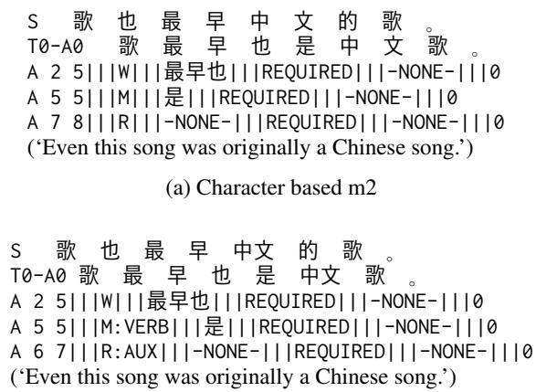
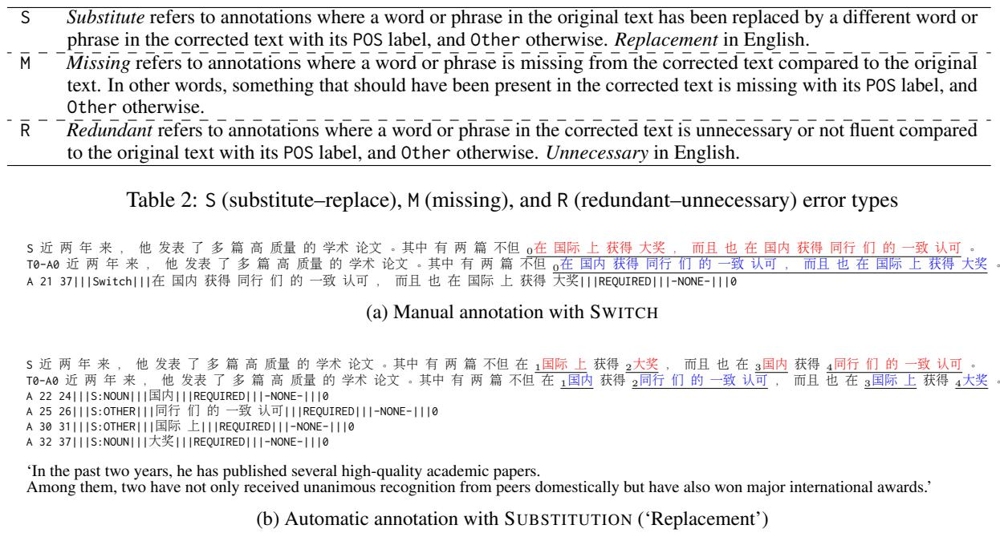
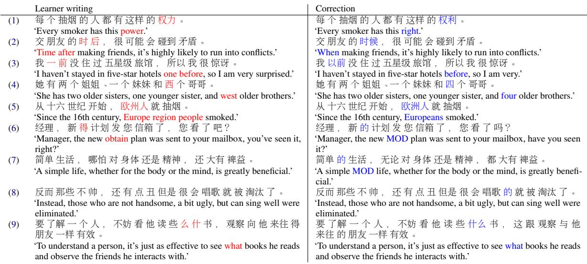
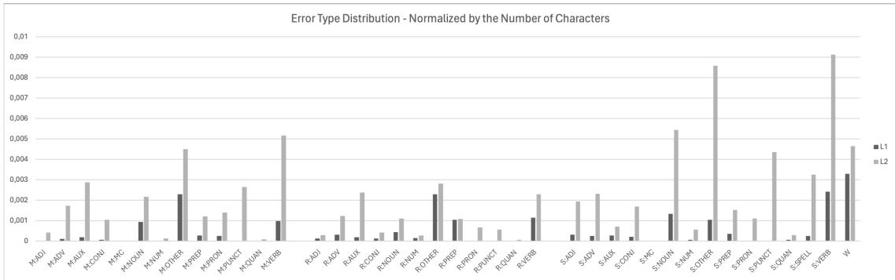
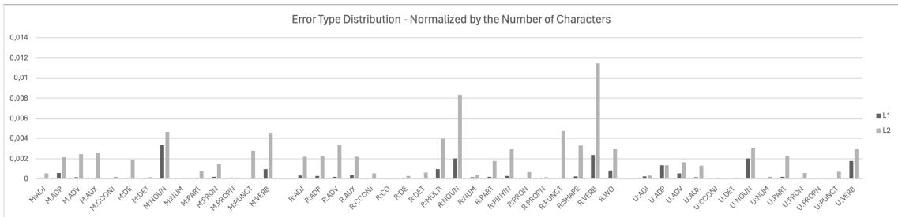

# Improving Automatic Grammatical Error Annotation for Chinese Through Linguistically-Informed Error Typology

Yang Gu1∗ Zihao Huang1\* Min Zeng2† Mengyang Qiu1,3‡ Jungyeul Park1,4‡

1Open Writing Evaluation, France 2TEKsystems, Canada

3Department of Psychology, Trent University, Canada

4Department of Linguistics, The University of British Columbia, Canada http://open-writing-evaluation.github.io

## Abstract

Comprehensive error annotation is essential for developing effective Grammatical Error Correction (GEC) systems and delivering meaningful feedback to learners. This paper introduces improvements to automatic grammatical error annotation for Chinese. Our refined framework addresses language-specific challenges that cause common spelling errors in Chinese, including pronunciation similarity, visual shape similarity, specialized participles, and word or dering. In a case study, we demonstrated our system’s ability to provide detailed feedback on 12-16% of all errors by identifying them under our new error typology, specific enough to uncover subtle differences in error patterns between L1 and L2 writings. In addition to improving automated feedback for writers, this work also highlights the value of incorporating language-specific features in NLP systems.

## 1 Introduction

Grammatical Error Correction (GEC) is a crucial NLP task that aims to automatically detect and correct grammatical errors in written text. Its significance extends beyond mere proofreading. In educational settings, GEC systems play a vital role by providing immediate and consistent feedback to both native (L1) and non-native (L2) language learners, thus facilitating the writing improvement process. These systems tackle a wide range of errors, from simple surface-level mistakes to complex issues involving word order, word choice, and sentence structure. By providing scalable, automated feedback, GEC tools complement human instruction, offering valuable support especially when individual attention from language instructors is limited, thus enabling learners to practice and improve their writing skills more independently.

The development of GEC has seen significant advances over the years, motivated in part by a series of shared tasks (Ng et al., 2013, 2014; Bryant et al., 2019). Early GEC systems primarily relied on rule-based methods and statistical classifiers (Dahlmeier and Ng, 2011). These systems later gave way to Statistical Machine Translation techniques applied to GEC, treating error correction as a translation task from erroneous to correct text (Felice et al., 2014). With the advent of Neural Machine Translation, GEC systems have leveraged deep learning architectures such as recurrent neural networks (Yuan and Briscoe, 2016), convolutional neural networks (Chollampatt and Ng, 2018), and eventually transformer models (Zhao et al., 2019). These neural approaches have improved the ability to handle long-range dependencies and complex error types. These advancements, initially applied to English, have since been extended to other languages, including Chinese, German, and Czech (for a comprehensive review, see Bryant et al., 2023).

Equally important to the advancements in GEC systems are the evaluation metrics developed to assess their performance. Several metrics have been introduced over the years, including M2 (Dahlmeier and Ng, 2012), GLEU (Napoles et al., 2015), errant (Bryant et al., 2017), and PT M2 (Gong et al., 2022). These metrics play a crucial role in measuring the effectiveness and reliability of GEC systems. However, among these metrics, only errant (ERRor ANnotation Toolkit) provides a detailed error annotation framework. This detailed annotation not only allows researchers and educators to classify different types of grammatical errors, enabling a more granular understanding of a system’s strengths and weaknesses, but also provides specific information that can be used to improve learner feedback.

Specifically, errant provides a standardized rule-based approach to error classification by automatically extracting and categorizing edits from parallel original and corrected sentences. It utilizes 25 main error type categories, primarily based on part-of-speech (POS) and morphology (e.g., VERB:INFL for misapplication of verb tense morphology), which are further categorized into Missing, Unnecessary, and Replacement errors, resulting in a total of 55 detailed error types (Bryant et al., 2017). In the Building Educational Applications 2019 Shared Task: Grammatical Error Correction (BEA2019), errant was not only used to standardize various datasets including FCE, NU-CLE, and Lang-8, but also facilitated detailed comparisons between systems at multiple levels, enabling evaluation across 24 main error types for all 21 participating teams in the Restricted Track (Bryant et al., 2019). Additionally, errant has allowed researchers to examine error distributions across different proficiency levels, which in turn may help develop more targeted systems for specific learner groups (Zeng et al., 2024).

Given the benefits of detailed annotation that errant demonstrates, it has been adapted to various other languages, such as German (Boyd, 2018), Hindi (Sonawane et al., 2020), Arabic (Belkebir and Habash, 2021), and Czech (Náplava et al., 2022). Chinese has also seen adaptations of errant, with two versions: ERRANT\_ZH for traditional Chinese (Hinson et al., 2020) and ChERRANT for simplified Chinese (Zhang et al., 2022). However, these adaptations are more limited in scope compared to the original errant due to the unique challenges Chinese poses for GEC and NLP in general. Unlike English and other Indo-European languages, Chinese lacks explicit word boundaries and uses characters instead of alphabets (further described in §2). This fundamental difference impacts various aspects of language processing, especially tokenization. As a result, ERRANT\_ZH uses character-level annotations only, with just four basic error types (Missing, Remove, Substitute, and Word-order). ChERRANT has implemented some word-level annotations, but its default use is also at the character level.

While character-level operations may be more accurate for Chinese (Hinson et al., 2020), they inherently lack detailed POS information, which may limit the depth of error analysis and the specificity of feedback that can be provided to language learners. Given the increasing number of Chinese L2 learners worldwide and the need for high-quality writing assistance for Chinese L1 speakers, as well as the growing interest in the NLP community for Chinese GEC, as demonstrated by recent CGEC shared tasks (Zhao et al., 2018; Rao et al., 2020; Yin et al., 2023), it has become imperative to have a more detailed automatic annotation framework for Chinese. A more comprehensive errant-like system for Chinese would not only enhance error analysis capabilities but also contribute to the development of more fine-tuned Chinese GEC systems, ultimately leading to better writing support tools for both Chinese L1 and L2 learners.

The goal of the present work is to improve automatic grammatical error annotation for Chinese. We assess the performance of existing systems, such as ChERRANT, and propose a new annotation framework that refines word-level analysis and expands error categories, with a particular focus on spelling and character order mistakes. These enhancements in error classification for both L1 and L2 learners allow for a more comprehensive evaluation of current and future Chinese GEC systems, ultimately leading to more effective writing support tools for Chinese.

## 2 Features of Chinese Writing System

Chinese possesses unique characteristics in its writing system that set it apart from English and other Indo-European languages. These distinctive features pose specific challenges for Chinese grammatical error annotation.

Lack of explicit word boundaries Unlike English, where words are separated by spaces, Chinese text is written as a continuous sequence of characters without delimiters. Moreover, words can be composed of one, two, or more characters. For example, the character 被 bèi can function alone as a passive voice marker or form part of words like 棉被 miánbèi or 被子 bèizi, both meaning ‘blanket’. Therefore, especially in the case of erroneous sentences, this may lead to incorrect word segmentation, and in turn affect error correction or annotation. However, if we bypass word segmentation and rely solely on character-level annotation, we lose critical grammatical information. Consider two sentences where 被 is missing: 苹果（被）吃了 (‘The apple was eaten’; missing the passive marker 被), and 我盖着棉（被）(‘I am covered with a blan- ket’; missing 被 from 棉被). Character-level annotation would mark both as simple “missing” errors, but this fails to capture that the first case represents a more significant issue in sentence structure, while the second is a simpler lexical omission.

Characters instead of alphabets The characterbased writing system of Chinese presents another challenge for language learners, as well as grammatical error correction and annotation. Unlike alphabetic systems, Chinese uses thousands of distinct characters, each representing a word or part of a word. This leads to complex relationships between sound, meaning, and written form. Chinese has many homophones - characters with the same pronunciation but different meanings and written forms. For example, 目 mù (‘eye’) and 木 mù (‘wood’) sound identical but have distinct meanings and appearances. Additionally, many characters have similar visual structures, such as 日 rì, (‘sun’) and 目 mù (‘eye’), which differ by only one stroke. Some characters, like 进 jìn (‘enter’) and 近 jìn (‘near’), are both homophones and visually similar. These characteristics lead to prevalent spelling-like errors in both L2 learners’ writings and L1 children learning to write. However, these errors often represent different underlying issues. Some may indicate sound-to-orthography mapping issues, while others might reflect visual or semantic confusions (Koda and Zehler, 2008). A comprehensive annotation system for Chinese should be able to distinguish between these different cases.

## 3 L1 and L2 in CGEC

Chinese grammatical errors differ between L1 and L2 learners. Ma et al. (2022) highlight that L2 learners often make more obvious and systematic errors, influenced by their first language, while L1 speakers’ errors tend to be more subtle and related to advanced language use. A comprehensive CGEC annotation system should have broad coverage across both L1 and L2 error types to address diverse learner needs. To develop and evaluate our annotation scheme, we utilize two Chinese GEC datasets: FCGEC for L1 errors and MuCGEC for L2 errors, as described below.

L1 FCGEC Fine-Grained Corpus for Chinese Grammatical Error Correction (FCGEC) is a native CGEC dataset (Xu et al., 2022).1 The source data of FCGEC is from public examination websites for native students from elementary to high school, and news aggregator sites for spelling and punctuation errors. The FCGEC dataset consists of a total of 35,354 sentences after removing duplicated and incomplete sentences. Among them, 16,224 sentences are free of grammatical errors (45.89%).

L2 MuCGEC Multi-Reference Multi-Source Evaluation Dataset for Chinese Grammatical Error Correction (CGEC) is a multi-reference multisource dataset (Zhang et al., 2022). 2 It includes sentences from the PKU Chinese Learner Corpus, HSK exam datasets (an official Chinese proficiency test), and sentences corrected by native speakers from the Lang8 platform, which were used in the NLPCC18, CGED-2018, and CGED-2020 shared tasks (Zhao et al., 2018; Rao et al., 2018, 2020). The MuCGEC dataset comprises 7,063 sentences, of which 6,544 (92.7%) contain grammatical errors. On average, the dataset provides 2.3 target references per sentence.

Research testbed In this paper, we use the validation subsets of FCGEC and McCGEC. Table 1 presents the distribution of errors in the L1 and L2 datasets. L1 error counts are determined by manual error annotations shared by its creators; L2 error counts are based on ChERRANT annotations which were released along with the dataset. Sentences with two or more errors make up 4.9% of the L1 dataset and 76.7% of the L2 dataset.

<table><tr><td rowspan="2">Dataset</td><td colspan="2"># of sentences</td><td colspan="6">Different numbers of errors per sentence</td></tr><tr><td>Ori.</td><td>Ref.</td><td>0</td><td>1</td><td>2</td><td>3</td><td>4</td><td>≥5</td></tr><tr><td>L1</td><td>2000</td><td>2143</td><td>899</td><td>1138</td><td>101</td><td>3</td><td>2</td><td>0</td></tr><tr><td>L2</td><td>1138</td><td>1153</td><td>55</td><td>214</td><td>238</td><td>176</td><td>153</td><td>317</td></tr></table>

Table 1: Distribution of errors in L1 and L2 datasets.

## 4 Previous Chinese Grammatical Error Annotation

The most recent toolkit for Chinese GEC evaluation is ChERRANT3(Chinese errant; Zhang et al., 2022). In this section, we examine the usefulness of ChERRANT annotations by comparing them with manual annotations, and use ChERRANT to explore the differences in L1 and L2 writing.

## 4.1 ChERRANT

ChERRANT is inspired by errant (Bryant et al., 2017). Like errant, ChERRANT annotations mainly consist of three operational errors, though they are called redundant error (R), missing error (M), and substitution error (S), as seen in Table 2.

ChERRANT includes several features designed to process the Chinese language. It has implemented both character-based and word-based segmentation, which are the two dominant approaches in Chinese NLP. In this study, we focus on the word-based evaluation metrics, which provide POS tags for each of these error types, as seen in Figure 1. For wordbased error annotation, ChERRANT utilizes word segmentation and POS labels from the Language Technology Platform (LTP), an NLP platform for Chinese (Che et al., 2010)4, though the POS labels are converted into Universal POS labels in the output (Petrov et al., 2012). ChERRANT also includes spelling error detection for Chinese, which compares two spans of text character by character and computes the similarities based on the shape and pronunciation of the characters. SPELL errors pertain exclusively to the substitution error type, or S (S:SPELL), since the correct string has been “substituted” by the erroneous version. Finally, ChERRANT introduces heuristic rules for span-level word-order errors (Hinson et al., 2020), which is an important and intuitive GEC error type outside of the S, M, R categories.

  
(b) Word based m2  
Figure 1: Examples of the Chinese m2 file

## 4.2 Manual vs. automatic annotation

To better understand the performance of ChERRANT, We conducted an analysis using the FCGEC dataset. This dataset is unique in that it provides manual error annotations, which allows for a direct comparison between human-annotated errors and automated annotations. Briefly, the manual annotations in FCGEC were created through a carefully designed process involving 20 undergraduate students and 4 expert examiners. These annotators followed a three-tier hierarchical approach: detection (classifying sentences as erroneous or correct), identification (categorizing errors into one of seven fine-grained types, such as structure confusion or illogical errors), and correction (applying specific operations like insert, delete, modify, or switch) (Xu et al., 2022).

We conducted an initial evaluation by randomly selecting 100 erroneous sentences from the FCGEC dataset, comparing the original manual annotations with the automated annotations generated by the word-level ChERRANT. Our analysis revealed a match in 95% of cases, with 3% of discrepancies attributable to differences in word boundaries and 2% related to the representation of ordering issues across extended spans of text. While these results appear promising at first glance, it is important to note that the majority of the matching sentences contained only a single error, making them relatively straightforward for ChERRANT to detect automatically.

To further assess the system’s robustness, we conducted a secondary evaluation using 30 randomly selected sentences, each containing at least two error annotations, 28% of all available in the FCGEC validation set. In this more challenging evaluation, we observed a 73% match between the manual and automated annotations, with 3% of discrepancies due to word boundary issues and 23% resulting from differences in the representation of ordering problems.

Differences in word boundary may lead to different error type definitions over different spans of text. For example, to correct the phrase 对 记者 的 问题 duì jìzhˇe de wèntí (‘toward the reporter’s question’), word-based ChERRANT proposes substitution (replacement) of the first word 对 duì (‘toward’) with 对于 duìyú (‘regarding’), whereas the manual definitions describe the correction as inserting a token 于 yú (‘regarding’) after the first word.

Another common grammatical error deals with changing the order of large spans of text like phrases and clauses. While creating the FCGEC dataset, the authors specified a SWITCH operation to capture errors of this type. ChERRANT includes a W error type that catches word ordering issues. However, possibly due to the length of the text and insertion and deletion of some characters, ChERRANT cannot always recognize that the error is an ordering issue in nature, and instead captures the error as a series of insertion and deletion operations that are not very intuitive. In the example in Figure 2, manual annotation clearly indi-cates the switch between 国际 上 获得 大奖 guójì shàng huòdé dàjiang ˇ (‘won major international ac-colades’) and 国内 获得 同行 们 的 一致 认可 guónèi huòdé tóngháng men de y¯ızhì rènkˇe (‘unanimous approval of their peers domestically’), while ChERRANT suggested a series of four substitutions to swap out words like 国际 guójì (‘international’), 国内 guónèi (‘domestic’), 大奖 dàjiang ˇ (‘major accolades’), 同行们的一致认可 tóngháng men de y¯ızhì rènkˇe (‘unanimous approval of their peers’). In this case, the automated system not only artificially inflated the number of errors, but also failed to capture the true nature of the problem, which lies in the ordering.

  
Figure 2: Examples of Chinese m2 files with manual and automatic annotation results for large spans

Overall, our analysis indicates that automated annotations align with manual annotations in up to 95% of cases, with a match rate of 73% for more complex sentences containing multiple grammatical errors. While the automated annotations are not without limitations, they still provide a valuable tool for deriving insights from large datasets.

## 4.3 Comparing L1 and L2 writing via automated error annotations

One of the key advantages of automated error annotation systems like ChERRANT is allowing us to efficiently discover patterns in large datasets. We applied ChERRANT to compare and analyze the differences in L1 and L2 CGEC data, leveraging the automated error annotations to help us better understand the types of errors made by the different types of writers.

Our analysis used the validation sets of FCGEC and MuCGEC as samples of L1 and L2 GEC data, which contain 2,000 and 1,134 sentences, respectively. Unsurprisingly, we find more mistakes in the L2 dataset compared to L1. According to ChERRANT, our L1 and L2 datasets contain 1,350 and 4,191 errors respectively, or 0.0210 and 0.0823 respectively if normalized by the number of characters in dataset. The most common error types in L1 are W (word order), followed by S:VERB, with R:OTHER and M:OTHER tied for third. The most common error types in L2 are S:VERB, S:OTHER, and S:NOUN. In ChERRANT, OTHER typically indicates an error involving multiple words, so it cannot be labelled with a single POS tag.

The ChERRANT analysis results are consistent with conventional assumptions about the differences between L1 and L2 writing. Common L1 error types like W, R:OTHER, and M:OTHER all involve multiple words in each error, which suggests they are complex grammatical structures with multiple components. In contrast, the most common error types in L2 are S:VERB, S:OTHER, and S:NOUN, which are single words. The numerous single-word substitutions in L2 GEC suggest the writers are struggling with finding the correct words. We assume that L1 writers possess a greater command of basic, word-level language skills compared to L2 writers. Consequently, the most common errors among L1 writers are likely to pertain to sentence structure and word order.

However, in §4.2, our analysis reveals that chERRANT is less reliable when handling sentences with multiple complex errors. Given that L2 datasets generally exhibit a higher frequency of errors compared to L1 datasets, our chERRANT annotations can be susceptible to this flaw. There is a potential underrepresentation of ordering errors in this analysis, as they may be misclassified as other error types. This highlights a need for more robust detection of errors in automated error annotation.

<table><tr><td colspan="3">L1</td><td colspan="3">L2</td></tr><tr><td>Error Type</td><td>Count</td><td>Ratio</td><td>Error Type</td><td>Count</td><td>Ratio</td></tr><tr><td>W</td><td>212</td><td>0.157</td><td>S:VERB</td><td>465</td><td>0.1110</td></tr><tr><td>S:VERB</td><td>155</td><td>0.1148</td><td>S:OTHER</td><td>438</td><td>0.1045</td></tr><tr><td>R:OTHER</td><td>147</td><td>0.1089</td><td>S:NOUN</td><td>277</td><td>0.0661</td></tr><tr><td>M:OTHER</td><td>147</td><td>0.1089</td><td>M:VERB</td><td>263</td><td>0.0628</td></tr><tr><td>S:NOUN</td><td>86</td><td>0.0637</td><td>W</td><td>237</td><td>0.0565</td></tr></table>

Table 3: The five most common error types annotated by ChERRANT in L1 and L2, and their ratio relative to the total errors in the L1 and L2 datasets.

## 5 Refined Annotation for CGEC

We present an improved annotation scheme for CGEC, introducing a new error typology that better captures both L1 and L2 grammatical errors, along with a new implementation based on this scheme. Additionally, we offer a comparison between automatic error annotations in L1 and L2 learners, demonstrating the effectiveness of our approach in handling diverse error types compared to the previous automatic annotation by ChERRANT.

## 5.1 New error typology

Building upon the language-specific features introduced in ChERRANT, we develop a new typology with a special focus on Chinese spelling errors. These errors commonly arise from the misselection or misordering of characters, as well as confusion between characters with similar visual forms or phonetic properties. Chinese spelling errors are frequently attributed to the reliance on pinyin-based input methods, where homophones and visually analogous characters can lead to inadvertent substitution or incorrect character usage (Liu et al., 2010; Deng and Hu, 2022). Figure 3 presents sentences with examples of the proposed errors and their translations. Appendix B provides a comprehensive explanation of these errors.

Similar pronunciation In Chinese, multiple characters can correspond to the same pronunciation, so sometimes the wrong character is used. For example, 权力 (‘power’) and 权利(‘right’) are both pronounced quán-lì, as seen in (1). Errors also occur when one character in a word is replaced by a homophone, producing invalid combinations like 时 后 (‘time-after’) instead of 时候 (’when’ or ‘time of’), as in (2). Another issue, as seen in (3), involves characters with the same syllable but different tones, like 一前 (y¯ı in first tone) vs. 以 前 (yˇı in third tone). These errors are particularly challenging while typing with pinyin-based input systems, which are widely used for Chinese.

Similar shapes Language learners can also confuse words with similar shapes that are unrelated in meaning or pronunciation. In (4), the character 西 x¯ı (‘west’) is mistakenly used instead of 四 sì (‘four’), which contains many of the same strokes. These visually similar characters are not uncommon in the language; some popular cases used daily include characters like 人 rén (‘person’) vs. 入 rù (‘enter’) and 己 jˇı (‘self’) vs. 已 yˇı (‘already’), where the visual differences can be very subtle.

Multifaceted similarity In many cases, shape and pronunciation similarities can co-occur. Due to the logographic nature of Chinese, many characters share phonetic components that influence their pronunciation and semantic components linking them to related meanings. This results in characters that not only look alike but also sound alike or share related meanings, leading to confusion based on both visual and phonetic similarities. For example, the characters 州 zhou¯ (‘region’ or ‘province’) and 洲 zhou¯ (‘continent’) share the same pronunciation and appear visually similar but differ in meaning. 州 typically appears in names of places, while 洲 refers specifically to continents, indicated by the water radical. Multifaceted similarity can cause signficant confusion. In (5), 欧州人 ou-zh¯ ou rén¯ (‘Europe region people’) is mistakenly used instead of 欧洲人 ou-zh¯ ou rén¯ (‘Europeans’). These characters share visual, phonetic, and even semantic similarities, but only one option is correct in this context.

The de particle The Chinese characters 的 de, 地 de, and 得 de are structural particles used in different syntactic contexts. 的 is commonly used as a possessive or descriptive marker, 地 functions as an adverbial modifier, and 得 introduces complements, often degree complements. Despite their different roles, all three characters share the same pronunciation, making them challenging to distinguish for both native speakers and learners. In (6), 得 (‘obtain’) is mistakenly used instead of 的, the correct modal particle for indicating the completion of an action. Errors involving these characters are often classified as auxiliary (AUX) or spelling (SPELL) errors in error annotation systems like ChERRANT. However, due to their distinct grammatical functions, it is more informative to categorize these errors under a separate category specific to de particles.

  
Figure 3: Examples of Chinese spelling errors

Missing de participle One common error among L2 Chinese learners is the omission of the de parti-cles (的, 地, 得). While they serve as crucial struc- tural or modal elements, they generally don’t directly translate into other languages as independent words. In example (7), the omission of 的 after an adjective breaks the relationship between the adjective and the noun. Similarly, in (8), 的 is mistakenly left out after a verb phrase, causing the sentence to lose clarity. ChERRANT currently classifies this as an auxiliary error (M:AUX), but we propose a separate category, as these particles are integral to sentence structure, and it is useful to identify them precisely.

Character order A common spelling mistake in Chinese involves using the correct characters but placing them in the wrong order, which can alter the meaning or make the sentence incomprehensible. For example, in (9), the characters for the word 什么 (‘what’) are reversed, resulting in 么 什, which breaks the structure and meaning of the sentence. While both characters are valid on their own, the correct sequence is crucial for maintaining meaning. These errors are often seen in pinyin-based typing systems and should be carefully categorized as character order mistakes rather than general spelling errors.

## 5.2 Implementation

We re-implement the Chinese errant, incorporating a new error typology. Unlike the original ChERRANT which utilizes LTP-based word segmentation (Che et al., 2010)5 and converts its part-ofspeech (POS) tags to Universal POS labels (Petrov et al., 2012), we introduce the part-of-speech tagging by stanza (Qi et al., 2020), chosen for its demonstrably clear performance.6 We adjusted the annotation labels to align with the original errant framework, using R (replacement), M (missing), and U (unnecessary), instead of S (substitution), M (missing), and R (redundant) as used in ChERRANT. Algorithm 1 presents the pseudo-code for the proposed error classification method. The algorithm calculates the similarity of pronunciations using pinyin and compares the visual shape between the source word(s) (S) and target word(s) (T ) to classify errors into categories such as R:MULTI (multifaceted similarity), R:PINYIN, R:SHAPE, and R:DE for replacement (R). For pronunciation similarity, we compute the edit distance between two lists of pinyin in the given words. For shape similarity, the two Chinese characters are converted into font images, and their similarity is evaluated using a pretrained ResNet model (He et al., 2016). We set both thresholds, α and α , to 0.9. If the set of characters between S and T is identical, and the length of T is one word, it is classified as a character order error (R:CO). If the length of T exceeds one word, it is annotated as a word order error (R:WO). Finally, if T represents the particle de for a missing error (M), it is classified as M:DE. Appendix C describes additional implementation details.

Algorithm 1 Pseudo-code for error classification   
1: function ERRORCLASSIFICATION (S, T , {R|M|U}):   
2: if R ∧ (SIM (pinyin) > α1) ∧ (SIM (shape) > α2)   
then   
3: return R:MULTI   
4: else if R ∧ (SIM (pinyin) > α ) then   
5: if T == de then   
6: return R:DE   
7: else   
8: return R:PINYIN   
9: end if   
10: else if R ∧ (SIM (shape) > α2) then   
11: return R:SHAPE   
12: else if R ∧ (SET (S) == SET (T)) then   
13: if LEN (T) == 1 then   
14: return R:CO   
15: else   
16: return R:WO   
17: end if   
18: else if M ∧ (T == de) then   
19: return M:DE   
20: end if   
21: return {R|M|U}

In ChERRANT, spelling errors are annotated with the generic label S:SPELL, which identifies the misspelling but does not provide additional insight into the nature of the error. For instance, in the source sentence (S), the learner incorrectly uses 一前y¯ı- qián instead of 以前 yˇı-qián, and ChERRANT marks this as a basic spelling mistake, labeling it S:SPELL in the annotation line. In contrast, our implementation offers a more detailed analysis, identifying the specific type of error based on our proposed methodology. It uses the label R:PINYIN to indicate that the error arises from pronunciation similarity, or pinyin similarity, between the incorrect string 一前 and the correct string 以前. This level of granularity provides a deeper understanding of learner mistakes, particularly when characters are misused due to phonetic confusion.

As a case study, we applied our updated implementation to the same L1 and L2 datasets from §4.3. Our new error types account for 12.12% and 16.78% of all errors annotated by our system in L1 and L2, respectively. The new typology is especially useful for distinguishing between categories of spelling errors, which in total account for 7.27% of all errors in L1 and 11.15% in L2. These annotations allow us to make interesting observations about the data. For example, we expect L2 to have more spelling mistakes than L1, but our annotations show that the real differences lie with pinyin and shape similarity errors, for which the ratios in L2 more than double L1; meanwhile, the ratio of complex multifaceted similarity errors for both groups is quite close, at around 4.5%. However, stanza occasionally assigns different word boundaries to the source and target sentences (the student’s writing and the corrected sentence), which may cause our classification process to mistakenly annotate it as an error. This affected less than 5% of sentences in our dataset, so we will address it in future research. Table 4 summarizes the number and proportion of errors for both the L1 and L2 datasets, annotated according to our new typology.

<table><tr><td rowspan="2">Error Type</td><td colspan="2">L1</td><td colspan="2">L2</td></tr><tr><td>Count</td><td>Ratio</td><td>Count</td><td>Ratio</td></tr><tr><td>M:DE</td><td>6</td><td>0.0051</td><td>8</td><td>0.0207</td></tr><tr><td>R:DE</td><td>5</td><td>0.0032</td><td>14</td><td>0.0031</td></tr><tr><td>R:MULTI</td><td>73</td><td>0.0466</td><td>197</td><td>0.0433</td></tr><tr><td>R:PINYIN</td><td>21</td><td>0.0134</td><td>146</td><td>0.0321</td></tr><tr><td>R:SHAPE</td><td>20</td><td>0.0128</td><td>164</td><td>0.0361</td></tr><tr><td>R:WO</td><td>63</td><td>0.0402</td><td>148</td><td>0.0326</td></tr><tr><td>Total</td><td>188</td><td>0.1212</td><td>677</td><td>0.1678</td></tr></table>

Table 4: Number of errors annotated under our new typology and their ratio relative to the total errors in the L1 and L2 datasets

## 6 Conclusion

The field of GEC has progressed significantly, driven by advancements in NLP technologies and the adoption of neural methods and large language models. Grammatical error annotation tools like errant play an invaluable role in this environment, as it can serve both as an evaluation metric for automated systems as well as a feedback mechanism for learners and writers. In this work, we focused on studying the capabilities of automated GEC error annotation in Chinese, which presents unique challenges due to the language’s lack of explicit word boundaries and its reliance on logographic characters rather than an alphabetic script. We created and implemented a new error typology tailored to Chinese-specific linguistic features, resulting in greater granularity and specificity in detecting and categorizing errors. Our work offers valuable insights into language errors in learner corpora for both L1 and L2, and highlights the advantages of analyzing and incorporating language-specific features into automated frameworks.

## Limitations

One of the primary limitations of our proposed automatic Chinese grammatical error annotation system lies in the inherent complexity of Chinese grammar. Unlike languages such as English, Chinese has no explicit markers for tenses, articles, plurals, and word boundaries, and there is some inherent flexibility in the definitions of word boundaries, sentence structures, and word order. While the system may perform well with surface-level errors, such as spelling or character misuse, more context-sensitive grammatical issues might not be captured effectively. This complexity often leads to difficulties in accurately identifying errors involving sentence structure, especially in more sophisticated writing.

A related limitation is the system’s reliance on external word segmentation tools like stanza. Since Chinese does not have clear word boundaries, different segmentation tools can produce varying results, which in turn affect the accuracy of the error annotation. For example, errors related to word order or structural issues could be impacted by slight differences in how the text is tokenized. While our system leverages detailed error typology, such as categorizing errors based on pronunciation similarity (pinyin) or visual similarity, the variability in segmentation can reduce the consistency and reliability of annotations. This segmentation variability can introduce noise into the process, especially for errors that depend on precise word or phrase boundaries.

Another limitation concerns the scope of the error typology itself. While our system provides a more granular classification of errors—such as distinguishing between pinyin-based errors, visual shape errors, and grammatical markers like 的 de—it may be less effective in capturing more complex, higher-order errors. For instance, errors related to discourse structure, coherence, or logical argumentation are not easily identifiable by systems that focus on surface-level features. Such errors often require a deeper understanding of context, sentence flow, and the broader meaning of the text, which automatic systems still struggle to interpret. Consequently, while our detailed typology enhances the identification of certain error types, it may fall short when addressing more abstract or semantic-level errors, which we leave for future work.

## References

Riadh Belkebir and Nizar Habash. 2021. Automatic Error Type Annotation for Arabic. In Proceedings of the 25th Conference on Computational Natural Language Learning, pages 596–606, Online. Association for Computational Linguistics.

Adriane Boyd. 2018. Using Wikipedia Edits in Low Resource Grammatical Error Correction. In Proceedings of the 2018 EMNLP Workshop W-NUT: The 4th Workshop on Noisy User-generated Text, pages 79–84, Brussels, Belgium. Association for Computational Linguistics.

Christopher Bryant, Mariano Felice, Øistein E. Andersen, and Ted Briscoe. 2019. The BEA-2019 Shared Task on Grammatical Error Correction. In Proceedings ofthe Fourteenth Workshop on Innovative Use of NLP for Building Educational Applications, pages 52–75, Florence, Italy. Association for Computational Linguistics.

Christopher Bryant, Mariano Felice, and Ted Briscoe. 2017. Automatic Annotation and Evaluation of Error Types for Grammatical Error Correction. In Proceedings ofthe 55th Annual Meeting ofthe Associationfor Computational Linguistics (Volume 1: Long Papers), pages 793–805, Vancouver, Canada. Association for Computational Linguistics.

Christopher Bryant, Zheng Yuan, Muhammad Reza Qorib, Hannan Cao, Hwee Tou Ng, and Ted Briscoe. 2023. Grammatical Error Correction: A Survey of the State of the Art. Computational Linguistics, 49(3):643–701.

Wanxiang Che, Zhenghua Li, and Ting Liu. 2010. LTP: A Chinese Language Technology Platform. In Coling 2010: Demonstrations, pages 13–16, Beijing, China. Coling 2010 Organizing Committee.

Shamil Chollampatt and Hwee Tou Ng. 2018. A Multilayer Convolutional Encoder-Decoder Neural Network for Grammatical Error Correction. In Proceedings ofThe Thirty-Second AAAI Conference on Artificial Intelligence (AAAI-18), pages 5755–5762, New Orleans, Louisiana. AAAI Publications.

Daniel Dahlmeier and Hwee Tou Ng. 2011. Grammatical Error Correction with Alternating Structure Optimization. In Proceedings of the 49th Annual Meeting of the Association for Computational Linguistics: Human Language Technologies, pages 915–923, Portland, Oregon, USA. Association for Computational Linguistics.

Daniel Dahlmeier and Hwee Tou Ng. 2012. Better Evaluation for Grammatical Error Correction. In Proceedings of the 2012 Conference of the North American Chapter of the Association for Computational Linguistics: Human Language Technologies, pages 568–572, Montréal, Canada. Association for Computational Linguistics.

Siqi Deng and Wenhua Hu. 2022. An examination of Chinese character writing errors: Developmental differences among Chinese as a foreign language learners. Journal ofChinese Writing Systems, 6(1):39–51.

Mariano Felice, Zheng Yuan, Øistein E. Andersen, Helen Yannakoudakis, and Ekaterina Kochmar. 2014. Grammatical error correction using hybrid systems and type filtering. In Proceedings ofthe Eighteenth Conference on Computational Natural Language Learning: Shared Task, pages 15–24, Baltimore, Maryland. Association for Computational Linguistics.

Peiyuan Gong, Xuebo Liu, Heyan Huang, and Min Zhang. 2022. Revisiting Grammatical Error Correction Evaluation and Beyond. In Proceedings of the 2022 Conference on Empirical Methods in Natural Language Processing, pages 6891–6902, Abu Dhabi, United Arab Emirates. Association for Computational Linguistics.

Kaiming He, Xiangyu Zhang, Shaoqing Ren, and Jian Sun. 2016. Deep Residual Learning for Image Recognition. In 2016 IEEE Conference on Computer Vision and Pattern Recognition (CVPR), pages 770–778, Caesars Palace, Nevada.

Charles Hinson, Hen-Hsen Huang, and Hsin-Hsi Chen. 2020. Heterogeneous Recycle Generation for Chinese Grammatical Error Correction. In Proceedings of the 28th International Conference on Computational Linguistics, pages 2191–2201, Barcelona, Spain (Online). International Committee on Computational Linguistics.

Keiko Koda and Annette M Zehler. 2008. Learning to read across languages: Cross-linguistic relationships in first-and second-language literacy development. Routledge.

Chao-Lin Liu, Min-Hua Lai, Yi-Hsuan Chuang, and Chia-Ying Lee. 2010. Visually and Phonologically Similar Characters in Incorrect Simplified Chinese Words. In Coling 2010: Posters, pages 739–747, Beijing, China. Coling 2010 Organizing Committee.

Shirong Ma, Yinghui Li, Rongyi Sun, Qingyu Zhou, Shulin Huang, Ding Zhang, Li Yangning, Ruiyang Liu, Zhongli Li, Yunbo Cao, Haitao Zheng, and Ying Shen. 2022. Linguistic Rules-Based Corpus Generation for Native Chinese Grammatical Error Correction. In Findings of the Association for Computational Linguistics: EMNLP 2022, pages 576–589, Abu Dhabi, United Arab Emirates. Association for Computational Linguistics.

Jakub Náplava, Milan Straka, Jana Straková, and Alexandr Rosen. 2022. Czech Grammar Error Correction with a Large and Diverse Corpus. Transactions ofthe Associationfor Computational Linguistics, 10:452–467.

Courtney Napoles, Keisuke Sakaguchi, Matt Post, and Joel Tetreault. 2015. Ground Truth for Grammatical Error Correction Metrics. In Proceedings of the 53rd

Annual Meeting ofthe Associationfor Computational Linguistics and the 7th International Joint Conference on Natural Language Processing (Volume 2: Short Papers), pages 588–593, Beijing, China. Association for Computational Linguistics.

Hwee Tou Ng, Siew Mei Wu, Ted Briscoe, Christian Hadiwinoto, Raymond Hendy Susanto, and Christopher Bryant. 2014. The CoNLL-2014 Shared Task on Grammatical Error Correction. In Proceedings ofthe Eighteenth Conference on Computational Natural Language Learning: Shared Task, pages 1–14, Baltimore, Maryland. Association for Computational Linguistics.

Hwee Tou Ng, Siew Mei Wu, Yuanbin Wu, Christian Hadiwinoto, and Joel Tetreault. 2013. The CoNLL-2013 Shared Task on Grammatical Error Correction. In Proceedings of the Seventeenth Conference on Computational Natural Language Learning: Shared Task, pages 1–12, Sofia, Bulgaria. Association for Computational Linguistics.

Slav Petrov, Dipanjan Das, and Ryan McDonald. 2012. A Universal Part-of-Speech Tagset. In Proceedings ofthe Eighth International Conference on Language Resources and Evaluation (LREC-2012), pages 2089– 2096, Istanbul, Turkey. European Language Resources Association (ELRA).

Peng Qi, Yuhao Zhang, Yuhui Zhang, Jason Bolton, and Christopher D Manning. 2020. Stanza: A Python Natural Language Processing Toolkit for Many Human Languages. In Proceedings ofthe 58th Annual Meeting of the Association for Computational Linguistics: System Demonstrations, pages 101–108, Online. Association for Computational Linguistics.

Gaoqi Rao, Qi Gong, Baolin Zhang, and Endong Xun. 2018. Overview of NLPTEA-2018 Share Task Chinese Grammatical Error Diagnosis. In Proceedings of the 5th Workshop on Natural Language Processing Techniques for Educational Applications, pages 42–51, Melbourne, Australia. Association for Computational Linguistics.

Gaoqi Rao, Erhong Yang, and Baolin Zhang. 2020. Overview of NLPTEA-2020 Shared Task for Chinese Grammatical Error Diagnosis. In Proceedings of the 6th Workshop on Natural Language Processing Techniquesfor Educational Applications, pages 25– 35, Suzhou, China. Association for Computational Linguistics.

Ankur Sonawane, Sujeet Kumar Vishwakarma, Bhavana Srivastava, and Anil Kumar Singh. 2020. Generating Inflectional Errors for Grammatical Error Correction in Hindi. In Proceedings of the 1st Conference of the Asia-Pacific Chapter ofthe Associationfor Compu tational Linguistics and the 10th International Joint Conference on Natural Language Processing: Student Research Workshop, pages 165–171, Suzhou, China. Association for Computational Linguistics.

Lvxiaowei Xu, Jianwang Wu, Jiawei Peng, Jiayu Fu, and Ming Cai. 2022. FCGEC: Fine-Grained Corpus

for Chinese Grammatical Error Correction. In Findings ofthe Associationfor Computational Linguistics: EMNLP 2022, pages 1900–1918, Abu Dhabi, United Arab Emirates. Association for Computational Linguistics.

Xunjian Yin, Xiaojun Wan, Dan Zhang, Linlin Yu, and Long Yu. 2023. Overview of NLPCC 2023 Shared Task: Chinese Spelling Check. In Natural Language Processing and Chinese Computing: 12th National CCF Conference, NLPCC 2023, Foshan, China, October 12–15, 2023, Proceedings, Part III, page 337–345, Berlin, Heidelberg. Springer-Verlag.

Zheng Yuan and Ted Briscoe. 2016. Grammatical error correction using neural machine translation. In Proceedings of the 2016 Conference of the North American Chapter of the Association for Computational Linguistics: Human Language Technologies, pages 380–386, San Diego, California. Association for Computational Linguistics.

Min Zeng, Jiexin Kuang, Mengyang Qiu, Jayoung Song, and Jungyeul Park. 2024. Evaluating Prompting Strategies for Grammatical Error Correction Based on Language Proficiency. In Proceedings of the 2024 Joint International Conference on Computational Linguistics, Language Resources and Evaluation (LREC-COLING 2024), pages 6426–6430, Torino, Italy. ELRA and ICCL.

Yue Zhang, Zhenghua Li, Zuyi Bao, Jiacheng Li, Bo Zhang, Chen Li, Fei Huang, and Min Zhang. 2022. MuCGEC: a Multi-Reference Multi-Source Evaluation Dataset for Chinese Grammatical Error Correction. In Proceedings ofthe 2022 Conference ofthe North American Chapter ofthe Associationfor Computational Linguistics: Human Language Technologies, pages 3118–3130, Seattle, United States. Association for Computational Linguistics.

Wei Zhao, Liang Wang, Kewei Shen, Ruoyu Jia, and Jingming Liu. 2019. Improving Grammatical Error Correction via Pre-Training a Copy-Augmented Architecture with Unlabeled Data. In Proceedings of the 2019 Conference of the North American Chapter ofthe Associationfor Computational Linguistics: Human Language Technologies, Volume 1 (Long and Short Papers), pages 156–165, Minneapolis, Minnesota. Association for Computational Linguistics.

Yuanyuan Zhao, Nan Jiang, Weiwei Sun, and Xiaojun Wan. 2018. Overview of the NLPCC 2018 Shared Task: Grammatical Error Correction. In Natural Language Processing and Chinese Computing, pages 439–445, Cham. Springer International Publishing.

## A Automatic L1 and L2 Annotation by ChERRANT

Figure 4 presents the full ChERRANT error type distributions with normalized frequencies, which we discuss briefly in §4.3.

Unsurprisingly, the L2 dataset contains significantly more errors than the L1 dataset. According to ChERRANT, the L1 and L2 datasets include 1,350 and 4,191 errors, respectively. When normalized by the number of characters in each dataset, this translates to error rates of 0.0210 for L1 and 0.0823 for L2. L2 shows greater incidences of errors in every error category, which highlights the greater difficulty L2 writers face when mastering a new language and its grammatical structures.

The ChERRANT annotations align with conventional expectations regarding the differences between L1 and L2 writing. The most frequent error types in the L1 dataset are W, followed by S:VERB, R:OTHER, M:OTHER, and S:NOUN. The W, R:OTHER, and M:OTHER errors all involve multiple words, indicating that these errors stem from complex grammatical structures. Meanwhile, the most common errors in the L2 dataset are S:VERB, followed by S:OTHER, S:NOUN, M:VERB, W. Error categories such as S:VERB, S:NOUN, and M:VERB point to issues with single words, suggesting that L2 writers may face significant difficulties in selecting the correct word forms, probably stemming from limited experience with the language, its vocabulary, and other foundational skills.

We also note that the relative difference between L1 and L2 is generally smaller for the W, M:OTHER, and R:OTHER error types – the complex types that involve multiple components. L2 writers also struggling significantly with S:OTHER, which account for more than 10% of all errors in L2. It’s unsurprising that both groups struggle with these errors, which are complex by definition. However, the current error typologies cannot represent and analyze them in a very insightful way. A valuable direction of future research is the development of annotations for these multi-word errors, which will be highly useful in both L1 and L2 contexts.

  
Figure 4: Automatic L1 and L2 annotation by ChERRANT. S indicates substitution errors, M is missing, R means redundant, W refers to word order issues, and OTHER typically indicates errors involving multiple words which cannot be captured by a single POS tag.

## B New Error Typology for Chinese GEC

Spelling mistakes in analog vs digital writing Our new error typology is closely related to the Chinese analog of "spelling errors" known as 错别字, which literally means incorrect or other character. An incorrect character or 错字 cuò zì is created when the writer makes an error in the strokes, producing a character that does not exist in the Chinese language. While these types of mistakes were more common in handwritten text, they are rare in digital writing due to the fixed set of accepted characters available in most typing and rendering systems. However, digital text is not entirely immune to these errors—writers may inadvertently select a similar-looking character from another language. For example, in our L2 dataset, we encountered a spelling error where the character for 凉 liáng (‘cool’) was mistakenly written as 涼, with an extra stroke in the water radical on the left. Although 涼 is still used in Traditional Chinese and Japanese, it is no longer used in Simplified Chinese, leading to the error in this context. On the other hand, an other character or 别字 bié zì refers to a situation where the writer produces a valid Chinese character, but one that is incorrect in the given context. These types of mistakes account for the majority of spelling errors in our dataset. Instead of being non-existent or purely erroneous characters, they are legitimate characters that are inappropriate for the sentence, often because they are homophones or visually similar to the correct character. This is a common issue for learners, as many characters in Chinese share the same pronunciation or similar visual components, making it easy to confuse them.

Similar pronunciation Many Chinese characters share identical or similar pronunciations, which can lead to frequent errors. The problem has been exacerbated in the digital age due to the ease and popularity of pinyin-based typing systems, which allow users to input Chinese characters by typing their phonetic equivalents in Romanized form. However, because multiple characters can have the same or very similar pronunciations, it is easy to mistakenly select the wrong character, especially when context is not fully considered.

These errors are particularly common when dealing with homophones—words that sound identical but have different meanings. For instance, 权力 quán-lì (‘power’) and 权利 quán-lì (‘right’) are both valid words that share the same pronunciation. However, they convey completely different concepts, and as shown in (1), identifying and correcting homophone errors is important for maintaining clarity in written communication.

(1) a. 每 个 抽烟 的 人 都 有 这样 的 权力meiˇ gè chou-y¯ an¯ de rén dou¯ youˇ zhè-yàng de quán-lì .every CL smoke REL person all have such REL power .‘Every smoker has this power.’

b. 每 个 抽烟 的 人 都 有 这样 的 权利 。meiˇ gè chou-y ¯ an¯ de rén dou¯ youˇ zhè-yàng de quán-lì .every CL smoke REL person all have such REL right .‘Every smoker has this right.’

It is also common for characters with similar pronunciations to be mixed up in a word. As shown in (2), 时 后 shí-hòu (‘time after’) is not a valid word, while 时候 shí-hòu (‘when’ or ’time of’) is valid and should be used in this context. This type of error can easily occur when one character in a word is substituted for its homophone, creating a non-existent word or incorrect meaning.

(2) a. 交 朋友 的 时 后 ，很 可能 会 碰到 矛盾jiao¯ péng-youˇ de shí hòu , henˇ ke-néngˇ huì pèng-dào máo-dùn .make friend REL time after , very likely will encounter conflict .‘When making friends, it’s highly likely to run into conflicts.’

b. 交 朋友 的 时候 ，很 可能 会 碰到 矛盾jiao¯ péng-youˇ de shí hòu , henˇ ke-néng ˇ huì pèng-dào máo-dùn .make friend REL when , very likely will encounter conflict .‘When making friends, it’s highly likely to run into conflicts.’

Another common mistake occurs when characters with the same syllable but different tones are confused. For example, 一前 y¯ı qián (‘one before’) and 以前 yˇı qián (‘before’) have the same syllable yi, but different tones—first tone for 一 y¯ı and third tone for 以 yˇı. As shown in (3), 一前 is not a valid word, while 以前 is the correct term. This type of error is particularly challenging because even with pinyin input systems, tones cannot be easily typed on most keyboards, so the onus is on the writer to select the correct characters from multiple possible tone combinations even after inputting the correct pinyin.

(3) a. 我 一前 没 住 过 五星级 旅馆 ，所以 我 很 惊讶woˇ y¯ı qián méi zhù guò wu-x ˇ ¯ıng-jí lu-guanˇ , suo-y ˇ ˇı woˇ henˇ j¯ıng-yà .I one before NEG live EXP five-star hotel , so I very surprised .‘I haven’t stayed in five-star hotels before, so I am very surprised.

b. 我 以前 没 住 过 五星级 旅馆 ，所以 我 很 惊讶woˇ yˇı qián méi zhù guò wu-x ˇ ¯ıng-jí lu-guanˇ , suo-y ˇ ˇı woˇ henˇ j¯ıng-yà .I before NEG live EXP five-star hotel , so I very surprised .‘I haven’t stayed in five-star hotels before, so I am very surprised.

Similar shapes Language learners can also confuse words with similar shapes but are completely unrelated in meaning or pronunciation.

(4) a. 她 有 两 个 姐姐 、一 个 妹妹 和 西 个 哥哥 ta¯ youˇ liangˇ gè jie-jieˇ , y¯ı gè mèi-mei hé x¯ı gè ge-ge ¯ she have two CL older-sister , one CL younger-sister and west CL older-brother . ‘She has two older sisters, one younger sister, and west older brothers.’

b. 她 有 两 个 姐姐 、一 个 妹妹 和 四 个 哥哥 ta¯ youˇ liangˇ gè jie-jieˇ , y¯ı gè mèi-mei hé sì gè ge-ge¯ she have two CL older-sister , one CL younger-sister and four CL older-brother . ‘She has two older sisters, one younger sister, and four older brothers.’

Some other common examples include:

• 人 rén (‘person’) vs 入 rù (‘enter’)

• 己 jˇı (‘self’) vs 已 yˇı (‘already’), as in 自己 zì-jˇı (‘self’) vs 已经 yˇı-j¯ıng (‘already’)

• 住 zhù (‘to live’) vs 往 wang ˇ (‘to go’), as in 居住 ju-zhù ¯ (‘to live’) vs 向往 xiàng-wang ˇ (‘to long for’).

Multifaceted similarity In many cases, it can be difficult to separate shape and pronunciation similarities in Chinese characters because these two aspects often overlap. Due to the logographic nature of Chinese, many characters share phonetic components that influence their pronunciation, as well as semantic components that link them to related meanings. This can result in characters that not only look alike but also sound alike or share related meanings. For example, the characters 州 zhou¯ (‘region’ or ‘province’) and 洲 zhou¯ (‘continent’) share the same pronunciation, look very similar, and both mean something related to locations. However, 州 is typically seen in place names like Suzhou or Hangzhou, whereas 洲 refers specifically to continents, indicated by the water radical. It’s easy to see how writers can make the error shown in (5), where 欧州人 ou-zh ¯ ou rén ¯ (‘Europe region people’) is mistakenly used instead of 欧洲人 ou-zh¯ ou rén¯ (‘Europeans’).

(5) a. 从 十六 世纪 开始 ，欧州人 就 抽烟 cóng shí-liù shì-jì kai-sh¯ ˇı , ou-zh¯ ou rén¯ jiù chou-y ¯ an. ¯ since sixteenth century begin , Europe region people already smoke ‘Since the sixteenth century, people in Europe smoked.’

b. 从 十六 世纪 开始 ， 欧洲人 就 抽烟cóng shí-liù shì-jì kai-sh¯ ˇı , ou-zh¯ ou rén¯ jiù chou-y¯ an¯ .since sixteenth century begin , Europeans already smoke‘Since the sixteenth century, Europeans smoked.

The de participle The Chinese characters 的 de, 地 de, and 得 de serve as structural particles in different syntactic contexts. 的 is typically used as a possessive or descriptive marker (similar to the English apostrophe-s or “of”), 地 is used to modify verbs (adverbial marker), and 得 introduces complements (usually degree complements). Despite their distinct functions, these three characters are pronounced identically, which makes them a significant challenge for both native speakers and learners of Chinese. This type of mistake is often categorized as an auxiliary (AUX) or spelling error (SPELL) in error annotation systems such as ChERRANT. However, given the distinct grammatical roles these characters play, it is more informative to classify these errors under a separate category. For instance, in (6), the character 得 dé is mistakenly used instead of 的 de, which is the correct modal particle in this context.

(6) a. 经理 ，新 得 计划 发 您 信箱 了 ，您 看 了 吧 ？j¯ıng-lˇı , x¯ın dé jì-huà fa¯ nín xìn-xiang¯ le , nín kàn le bamanager , new obtain plan send your mailbox PFV , you see PFV MOD ?‘Manager, the new plan was sent to your mailbox, you’ve seen it, right?’

b. 经理 ，新 的 计划 发 您 信箱 了 ，您 看 了 吗 ？j¯ıng-lˇı , x¯ın de jì-huà fa¯ nín xìn-xiang ¯ le , nín kàn le ma ?manager , new MOD plan send your mailbox PFV , you see PFV Q ?‘Manager, the new plan was sent to your mailbox, have you seen it?’

Missing de participle One common error among Chinese learners, particularly L2 writers, is the omission of one of the de participles (的, 地, or 得). In many cases, these particles do not translate directly into other languages as independent words, so it’s easy for non-native speakers to omit them.

In (7), the writer leaves out 的 de, which is functioning as a descriptive marker. 简单 jian-d ˇ an¯ is an adjective that means ‘simple’ and 生活 sheng-huó¯ is a noun meaning ‘life’. However, 的 de is needed to make the noun phrase ‘simple life’ grammatically correct.

(7) a. 简单 生活 哪怕 对 身体 还是 精神 ，还 大有 裨益 。 jian-dˇ an¯ sheng-huó¯ , na-pàˇ duì shen-t¯ ˇı hái-shì j¯ıng-shén , hái dà-youˇ bì-yì simple life even for body or mind , still great benefit . ‘A simple life, whether for the body or the mind, is still greatly beneficial.’

b. 简单 的 生活 ，无论 对 身体 还是 精神 ， 都 大有 裨益jian-d ˇ an¯ de sheng-huó ¯ , wú-lùn duì shen-t ¯ ˇı hái-shì j¯ıng-shén , dou¯ dà-youˇ bì-yì.simple MOD life whether for body or mind , all great benefit.‘A simple life, whether for the body or the mind, is greatly beneficial.’

Another common omission involves the modal use of 的 de, as shown in (8). Here, 的 de should follow descriptive clauses to link the description to the subject. Appending 的 de after 很会唱歌 hˇen huì chàng-ge¯ (’can sing very well’) turns this verb phrase into a modifier, so it functions the same as other adjectives used in this sentence, like ’handsome’ and ’ugly’. Omitting the participle creates ambiguity in the function of the verb phrase as well as the meaning of the sentence overall.

(8) a. 反而 那些 不 帅 ，还 有 点 丑 但是 很 会 唱歌 就 被 淘汰 fan-ér ˇ nà-xie¯ bù shuài , hái youˇ dianˇ chouˇ dàn-shì henˇ huì chàng-ge¯ jiù bèi táo-tài le instead those not handsome , also a bit ugly but very can sing then get eliminated PFV

‘Instead, those who are not handsome, a bit ugly, but can sing well were eliminated.

b. 反而 那些 不 帅 ，还 有 点 丑 但是 很 会 唱歌 的 就 被 淘汰fan-érˇ nà-xie¯ bù shuài , hái youˇ dianˇ chouˇ dàn-shì henˇ huì chàng-ge¯ de jiù bèi táo-tàiinstead those not handsome , also a bit ugly but very can sing MOD then get eliminated了lePFV .

‘Instead, those who are not handsome, a bit ugly, but can sing well were eliminated.

We believe it’s worthwhile classifying these omission errors separately from auxiliary or spelling mistakes, as this distinction can help highlight the unique, complex, but essential roles these ubiquitous participles play in Chinese grammar.

Character order Another interesting type of spelling mistake in Chinese writing involves producing the correct characters for a word but placing them in the incorrect order. This is an easy mistake to make from carelessness, but it can be especially challenging for learners because some Chinese words include characters that share radicals and look alike, such as 魂魄 hún-pò (‘spirit’), 忐忑 tan-tèˇ (‘perturbed’), and 森林 sen-lín ¯ (‘forest’). Rearranging the characters often results in something nonsensical, but sometimes it also produces a valid word with a different meaning, like 牙刷 yá-shua¯ (noun, ‘toothbrush’) vs 刷 牙 shua-yá ¯ (verb, ‘to brush teeth’), or 著名 zhù-míng (adjective, ‘famous’) vs 名著 míng-zhù (noun, ‘masterpiece’). We create a separate error category for incorrect character order because the precise order of characters is critical to maintaining grammatical integrity, and even a slight change can significantly alter the sentence’s readability and meaning.

In (9), the writer reverses the characters in the common interrogative word 什么 shén-me (‘what’), and the result 么什 me-shén is a nonsensical string.

(9) a. 要 了解 一 个 人 ，不妨 看 他读 些 么 什 书 ，观察 向 yào liao-ji ˇ eˇ y¯ı gè rén , bù-fáng kàn ta¯ dú xie¯ me shén shu¯ , guan-chᯠxiàng want understand one CL person , might-as-well see he read some what book , observe toward ‘To understand a person, it’s just as effective to see what books he reads and observe the friends he interacts with.

他 来往 得 朋友 一样 有效  
ta¯ lái-wang ˇ dé péng-youˇ y¯ı-yàng you-xiào ˇ .  
him contact REL friend same effective .

b. 要 了解 一 个 人 ，不妨 看 他读 些 什么 书 ，这 跟 观察yào liao-ji ˇ eˇ y¯ı gè rén , bù-fáng kàn ta¯ dú xie¯ shén-me shu¯ , zhè gen¯ guan-chá¯want understand one CL person , might-as-well see he read some what book , this with observe与 他 来往 的 朋友 一样 有效yuˇ ta¯ lái-wangˇ de péng-youˇ y¯ı-yàng you-xiàoˇ .with him contact REL friend same effective .

‘To understand a person, it’s just as effective to see what books he reads and observe the friends he interacts with.

## C Details on Similarity Implementation

We compute pronunciation-based similarities using the Pinyin Python library7, which is applied when the two words have equal lengths. For shape similarity, we utilize the Python Imaging Library (PIL)8 to convert each character into an image, followed by the application of the resnet50 model from PyTorch9 to evaluate visual similarity. In cases involving multiple characters, we calculate the position-based average similarity across each corresponding character pair.

## D Differences in m2 Files between ChERRANT and our Implementation

Figure 5 shows differences in CGEC annotation styles in the m2 files generated by ChERRANT and our implementation. ChERRANT (Zhang et al., 2022) can operate at two levels of granularity—character-based and word-based— but we focus on the word-based level because our implementation currently only supports word-level annotations.

The most notable difference is our implementation generates m2 files that use our novel linguisticallyinformed error typology. ChERRANT m2 files classify errors into redundant (R), missing (M), substitution (S), along with word order errors (W) and general spelling errors (S:SPELL). Our implementation classifies errors into replacement (R), missing (M), unnecessary (U), and word order (WO), along with more granular classifications of spelling errors (e.g. (R:PINYIN, R:SHAPE, etc) and de-participle errors (e.g. M:DE).

Both file types follow the basic m2 format, but there are a few other differences. ChERRANT includes the reference sentences in its m2 files, marked with "T0-A" at the start of the line. Our implementation omits this feature because the reference sentence can be reconstructed based on error annotations provided in the file. Because we use a different tokenizer from ChERRANT, the tokenized version of the original sentence may differ as well. For example, the third example in Figure 5 is tokenized as "欧洲人" (‘Europeans’) in ChERRANT and "欧洲 人" (‘Europe-people’) in our implementation. This means the boundaries and indices for analogous errors from the same sentence may differ between the two types of m2 files just because of tokenization.

## E Analysis of Automated Annotations by our Implementation

Manual and automatic annotation In the previous comparative analysis of manual and automatic annotation (see §4.2), prior findings demonstrated a relatively good alignment between manual and automatic annotation. In our current implementation, the match rate is 76% for general sentences – sentences containing any number of errors. The current system still faces several challenges. First, word boundary differences in four cases have led to mismatches in the number of detected errors, as the system processes word segmentation differently in the manual gold standard. Furthermore, 16 instances of word ordering issues in longer spans were not accurately captured by the automatic annotation system. Lastly, in four cases, inconsistent tokenization resulted in incorrect grouping or splitting of words, leading to hallucinated errors—errors that are not present in the text but appear due to faulty tokenization. Thus, key challenges remain in handling sentence structure and tokenization for Chinese text.

S 我 一前 没 住 过 五星级 旅馆 ， 所以 我 很 惊奇 了 。  
T0-A0 我 以前 没 住 过 五星级 旅馆 ， 所以 我 很 惊奇 。  
A 1 2|||S:SPELL|||以前|||REQUIRED|||-NONE-|||0  
A 12 13|||R:AUX|||-NONE-|||REQUIRED|||-NONE-|||0  
(‘I have never stayed at a five-star hotel before, so I was very surprised.’)  
S 她 有 两 个 姐姐 、一个 妹妹 和 西 个 哥哥 。  
T0-A0 她 有 两 个 姐姐 、一个 妹妹 和 四 个 哥哥 。  
A 9 10|||S:SPELL|||四|||REQUIRED|||-NONE-|||0  
(‘She has two older sisters, one younger sister, and four older brothers.’)  
S 从 十六 世纪 开始 ， 欧州人 就 抽烟 。  
T0-A0 从 十六 世纪 开始 ， 欧洲人 就 抽烟 。  
A 24 25|||S:SPELL|||欧洲人|||REQUIRED|||-NONE-|||0  
(‘Since the 16th century, Europeans have been smoking.’)  
S 反而 那些 不 帅 ， 还 有 点 丑 但是 很 会 唱歌 就 被 淘汰 了 。  
T0-A0 反而 那些 不 帅 ， 还 有 点 丑 但是 很 会 唱歌 的 就 被 淘汰 了 。  
A 13 13|||M:AUX|||的|||REQUIRED|||-NONE-|||0  
(‘Instead, those who were not handsome, a bit ugly, but very good at singing were eliminated.’)  
(a) m2 file generated by ChERRANT  
nglish translations are not a part of the original m2 file; it’s included here for readability and reference  
S 我 一 前 没住 过 五 星 级 旅 馆 ， 所以 我 很 惊讶 了 。  
A 1 3|||R:PINYIN|||以前|||REQUIRED|||-NONE-|||0  
A 15 16|||U:PART||||||REQUIRED|||-NONE-|||0  
S 她 有 两 个 姐姐 、一 个 妹妹 和 西 个 哥哥 。  
A 10 11|||R:SHAPE|||四|||REQUIRED|||-NONE-|||0  
S 从 十六 世纪 开始 ， 欧州 人 就 抽烟 。  
A 5 6|||R:MULTI|||欧洲|||REQUIRED|||-NONE-|||0  
S 反而 那些 不帅 ， 还 有 点 丑 但是 很会 唱歌 就 被 淘汰 了 。  
A 11 11|||M:DE|||的|||REQUIRED|||-NONE-|||0  
(b) m2 file generated by our implementation  
Figure 5: Differences in m2 files

Automatic L1 and L2 annotation Figure 6 presents detailed automatic L1 and L2 annotations by our implementation, with their frequencies normalized. As with the previous system (ChERRANT), the L2 dataset continues to show significantly more errors than the L1 dataset, reflecting the ongoing challenges L2 writers face when navigating grammatical structures. The system detected 2,765 errors in the L1 dataset and 6,041 errors in the L2 dataset.

When comparing specific error types between L1 and L2 datasets, several trends emerge. In the L1 dataset, noun-related errors were particularly prevalent, with 247 instances of missing nouns (M:NOUN) and 149 cases of redundant nouns (R:NOUN). Verb-related errors also featured prominently, with 73 cases of missing verbs (M:VERB) and 176 instances of redundant verbs (R:VERB). Word order errors (R:WO) were also common, with 63 instances identified. These errors reflect a general tendency for L1 writers to struggle with complex syntactic constructions involving multiple words, which are often subject to errors in word order, missing or redundant nouns, and verbs. In the L2 dataset, we observe significantly more verb-related errors, with 226 instances of missing verbs (M:VERB) and 570 cases of redundant verbs (R:VERB). Noun-related errors were also frequent in the L2 dataset, with 231 cases of missing nouns (M:NOUN) and 414 instances of redundant nouns (R:NOUN). In addition to these, word order errors (R:WO) appeared 148 times in the L2 dataset, indicating that L2 writers face significant challenges with sentence structure. Interestingly, the L2 dataset also contained a high number of pinyin-related errors (R:PINYIN), with 146 instances recorded, which points to difficulties in proper character selection and

phonetic transcription.

Our error typology can reveal detailed insights into the nature of errors made by writers. ChERRANT results have shown that L1 writers made far fewer spelling mistakes than L2 writers, which is in line with conventional wisdom. After applying our new error typology, we discovered that L1 writers do make fewer mistakes than L2 writers when it comes to simpler spelling errors between characters that are only similar in either pronunciation or shape (R:PINYIN, R:SHAPE). However, both L1 and L2 writers exhibited difficulties distinguishing words with multifaceted similarity (R:MULTI), which account for around 4.66% and 4.33% of all errors by each group, respectively. This is a subtle but useful pattern that is revealed by our language-specific error typology.

  
Figure 6: Automatic L1 and L2 annotation by our implementation