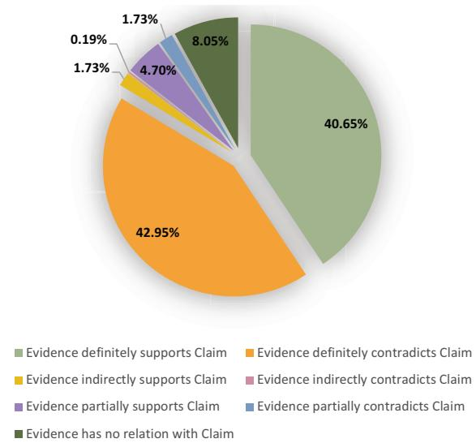
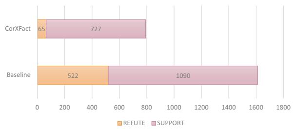
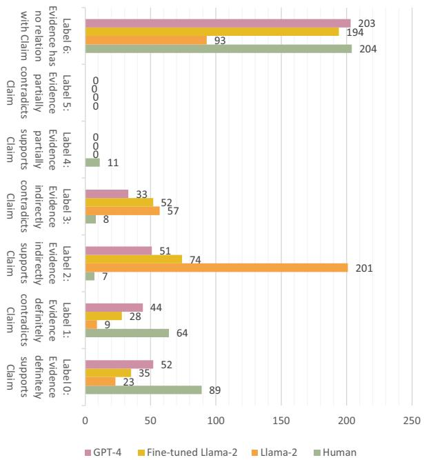
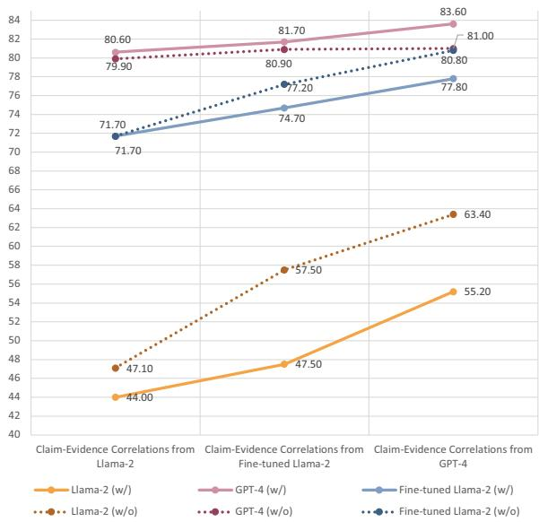

# Improving Explainable Fact-Checking with Claim-Evidence Correlations

Xin Tan, Bowei Zou, Ai Ti Aw Institute for Infocomm Research (I<sup>2</sup>R), A\*STAR, Singapore {tan\_xin,zou\_bowei,aaiti}@i2r.a-star.edu.sg

## Abstract

Automatic fact-checking systems that employ large language models (LLMs) have achieved human-level performance in combating widespread misinformation. However, current LLM-based fact-checking systems fail to reveal the reasoning principles behind their decision-making for the claim verdict. In this work, we propose Correlation-Enhanced Explainable Fact-Checking (CorXFact), an LLMbased fact-checking system that simulates the reasoning principle of human fact-checkers for evidence-based claim verification: assessing and weighing the correlations between the claim and each piece of evidence. Following this principle, CorXFact enables efficient claim verification and transparent explanation generation. Furthermore, we contribute the Cor-FEVER test set to comprehensively evaluate the CorXFact system in claim-evidence correlation identification and claim verification in both closed-domain and real-world fact-checking scenarios. Experimental results show that our proposed CorXFact significantly outperforms four strong fact-checking baselines in claim authenticity prediction and verdict explanation.

## 1 Introduction

In the digital age, widespread online misinformation has increased the urgent need for automatic fact-checking systems. Mainstream methods (Nie et al., 2019; Zhong et al., 2020; Soleimani et al., 2020; Jiang et al., 2021; Pradeep et al., 2021a,b; DeHaven and Scott, 2023) that follow the pipeline of document retrieval, evidence selection and claim verification to predict the veracity of claims, have shown promising results. Moreover, the emergence of large language models (LLMs) further advances fact-checking to a new level. Recent LLM-based fact-checking systems (Pan et al., 2023b,a; Wang and Shu, 2023; Tan et al., 2023; Zhang and Gao, 2023; Zeng and Gao, 2023) leverage the powerful understanding and interpretability of LLMs to predict the veracity label of a claim along with a brief natural language explanation to support its adjudication. The aforementioned work has witnessed the great success of LLMs in fact-checking and highlighted their capability to combat misinformation and promote the truth in the digital age. Nevertheless, the inherent “black-box” nature of LLMs has failed to guide explanations to reveal the reasoning principles behind their claim verification decisions.

Research suggests that the strength and relevance of evidence significantly impact the credibility of claims. Strong relevant evidence enhances claim credibility and persuasiveness, while weak or irrelevant evidence diminishes it (Luchok and Mc-Croskey, 1978; Briggs and Krantz, 1992; Walker et al., 2018). Based on this principle, human factcheckers tend to verify claims by revealing the supportive relationship between each piece of evidence and the claim, assessing the degree to which the evidence supports the claim. Inspired by this, we aim to simulate human decision-making principle to improve the reliability of LLMs in delivering verdicts, while also generating transparent and convincing explanations during the reasoning process.

This paper focuses on verifying claims through claim-evidence correlations. To this end, we come up with Correlation-Enhanced Explainable Fact-Checking (CorXFact), an LLM-based framework designed for explainable claim verification through a two-stage process: claim-evidence correlation reasoning and correlation-based claim verification. In the first stage, CorXFact leverages LLMs to identify the claim-evidence correlations from both relevance and degree dimensions: i) Does the evidence support the claim? ii) To what extent does the evidence support the claim? In the second stage, these insights are used to predict a veracity label for the claim, along with a concise reasoning explanation that analytically weighs the claim-evidence correlations. To thoroughly evaluate CorXFact in distinguishing claim-evidence correlation and claim verification, we further contribute a CorFEVER test set consisting of closed-domain and real-world factchecking parts. The closed-domain part features manually annotated claim-evidence correlations, while the real-world part simulates real-world factchecking scenarios with diverse and informal evidence retrieved from open websites.

We conduct experiments on the FEVER (Thorne et al., 2018) and CorFEVER datasets, and build CorXFact on several LLMs for assessment: Llama-2 (Touvron et al., 2023), GPT-4 (OpenAI, 2024), and fine-tuned Llama-2 tailored for claim verification and claim-evidence correlation identification. The experimental results show CorXFact significantly outperforms the LLM-based fact-checking baselines in both claim authenticity prediction and verdict explanation generation.

In summary, the key contributions of this work are three-fold:

• We introduce CorXFact, an LLM-based framework that provides reliable veracity labels and transparent verdict explanations for evidencebased fact-checking. Moreover, by instructing LLMs to follow specific principles for logical reasoning during claim verification, this work provides reference for exploring reasoning principles in other NLP tasks.

• We investigate LLMs’ capabilities in realworld fact-checking scenarios and reveal the impact of irrelevant evidence in such tasks.

• We contribute CorFEVER, a test set comprising both closed-domain and real-world parts to assess LLMs’ ability in distinguishing claim-evidence correlations and performing evidence-based claim verification. All codes and data will be released to the research community.<sup>1</sup>

## 2 Related Work

## 2.1 Evidence-based Fact-Checking

The task of evidence-based fact-checking aims to automatically verify the authenticity of a claim based on evidence provided. The mainstream of this task follows a three-module pipeline framework: retrieving documents related to the claim, selecting claim-relevant evidence in each document, making authenticity judgments of claims based on selected evidence (Nie et al., 2019; Zhong et al., 2020; Soleimani et al., 2020; Jiang et al., 2021; Pradeep et al., 2021a,b; DeHaven and Scott, 2023).

With the success of the above studies and the pursuit of interpretability (Guidotti et al., 2018; Balkir et al., 2022), explainable fact-checking (Kotonya and Toni, 2020a,b; Krishna et al., 2022; Fajcik et al., 2023), which provides a brief explanation of how decisions are made to make judgments more reliable and convincing, has drawn increasing attention. Among them, one line of work (Popat et al., 2017; Cui et al., 2019; Yang et al., 2019; Lu and Li, 2020) focuses on providing insights into neural models’ decision process. Another line of work focuses on providing readable post-hoc explanations, e.g., Gad-Elrab et al. (2019); Ahmadi et al. (2019) generate abstractive justifications based on knowledge graphs; Atanasova et al. (2020); Kotonya and Toni (2020c); Jolly et al. (2022) generate natural language summaries of retrieved relevant evidence. Most recently, there has been exploration into leveraging LLMs to generate refined explanations (Tan et al., 2023; Zhang and Gao, 2023; Kim et al., 2024), opening up new directions in this field.

## 2.2 Evidence-Independent Fact-Checking

With the strong reasoning and vast knowledge of LLMs being witnessed in nature language processing (NLP) tasks including question answering (QA) (Press et al., 2023), the task of fact-checking is no longer limited to evidence-based solutions. More and more work considers fact-checking as a QA problem and verifies claims without any evidence. For example, Wang and Shu (2023); Pan et al. (2023b) leverage LLMs to translate a claim into several sub-claims and perform knowledgegrounded question-and-answer pairs to make veracity predictions. Pan et al. (2023a) leverage LLMs to guide the model’s reasoning process by asking a series of questions critical for verifying a claim. Rani et al. (2023) propose a 5W framework (who, what, when, where, and why) for question-answer-based fact explainability. Aly et al. (2023) use question answering to predict natural logic operators, taking advantage of the generalization capabilities of instruction-tuned language models.

Even though the evidence-independent solution has shown promising results in providing reasoning principles through question answering, it heavily depends on the knowledge base that LLMs has been trained on. Besides, QA-based fact-checking may encounter issues like LLMs’ hallucination, where the questions generated are not grounded in reality or are based on incorrect assumptions. This work belongs to the evidence-based explainable fact-checking scope and introduces the idea of verifying claims follow specific reasoning principles to avoid the hallucination problem in the evidence-independent solutions.

<table><tr><td></td><td colspan="2">Degree</td><td rowspan="2">Indirectly</td><td rowspan="2">Partially</td></tr><tr><td>Relevance</td><td></td><td>Definitely</td></tr><tr><td rowspan="2">SUPPORT</td><td></td><td>&lt;</td><td>-&gt;</td><td></td></tr><tr><td>REFUTE</td><td>&lt;</td><td>-&gt;</td><td></td></tr><tr><td colspan="2">NEI</td><td colspan="2"></td></tr></table>

Table 1: Claim-evidence correlation degree definition. “NEI” denotes to “NOT ENOUGH INFO”.

## 3 CorFEVER

## 3.1 Task Definition

The task of evidence-based explainable factchecking verifies the validity of a claim based on available evidence and generates a brief explanation on decision-making. In this paper, given a claim c and a set of evidence $\begin{array} { r c l } { E } & { = } & { \{ e _ { 1 } , e _ { 2 } , . . . , e _ { n } \} } \end{array}$ , the factchecking model predicts a veracity label, $L \in$ {SUPPORTS, REFUTES, NOT ENOUGH INFO}, for the claim and generates a brief explanation J of the verdict not only based on evidence E but also rely on corresponding claim-evidence correlations $R = \{ r _ { 1 } , r _ { 2 } , . . , r _ { n } \}$ , which indicate the degree to which each piece of evidence supports or refutes the claim.

Considering the correlations between claim and each piece of evidence can range from supportive to contradictory, with varying levels of relevance in between (Wadden et al., 2022) (Table 1). To cover the relevance and degree between the claim and each piece of evidence, we define the following claim-evidence correlation labels for correlationenhanced claim verification:

Label 0: Evidence definitely supports Claim; $\mathit { \mathbf { E } } . \mathit { \mathbf { g } } . ,$ Claim: The Hunger Games is a book; Evidence: The Hunger Games is a 2008 dystopian novel by the American writer Suzanne Collins.

Label 1: Evidence definitely contradicts Claim; E.g., Claim: Marvel vs. Capcom: Infinite is only a comic; Evidence: Marvel vs. Capcom: Infinite is an upcoming fighting video game in development by Capcom.

Label 2: Evidence indirectly supports Claim;

$\pmb { { \cal E } } . \pmb { g } . ,$ , Claim: Macklemore works with Ryan Lewis; Evidence: Their second album, This Unruly Mess I’ve Made, was released on February 26, 2016. (Lacking Knowledge: This Unruly Mess I’ve Made is the second studio album by American hip hop duo Macklemore & Ryan Lewis.)

Label 3: Evidence indirectly contradicts Claim; $E . g . ,$ Claim: The Cyclades are southeast of mainland China; Evidence: They are one of the island groups which constitute the Aegean archipelago. (Lacking Knowledge: The Aegean archipelago belongs to Greece.)

Label 4: Evidence partially supports Claim; $\mathbf { \delta } _ { E , g } . ,$ Claim:Colin Kaepernick was quarterback backup to Alex Smith; Evidence: Colin Rand Kaepernick (born November 3 , 1987) is an Americanfootball quarterback who is currently a free agent.

Label 5: Evidence partially contradicts Claim; $\mathbf { \delta } _ { E , g } . ,$ Claim: Buffy Summers has been portrayed by Kristy Swanson; Evidence: Buffy was portrayed by Kristy Swanson in the film, and later by Sarah Michelle Gellar in the television series.

Label 6: Evidence has no relation with Claim. $\scriptstyle { E . g . , }$ , Claim: Camp Flog Gnaw is an event; Evidence: Camp Flog Gnaw has been held every year since 2012.

According to the diverse sources of evidence, we define the following two fact-checking scenarios:

• Closed-domain: Evidence E is obtained from annotated Wikipedia articles (Thorne et al., 2018) or dedicated fact-checking websites, such as PolitiFact (Wang, 2017), which are well-organized and reliable.

• Real-world: Evidence E is obtained from open websites like Google<sup>2</sup> and Bing<sup>3</sup>, which present a high degree of complexity, vagueness, and diversity.

To identify correlations between each piece of evidence and the associated claim, and to conduct evidence-based claim verification, this paper introduces the CorFEVER test set consisting of two scenarios: a closed-domain set and a real-world set.

## 3.2 Closed-Domain Set

For the closed-domain set, We extract 1,000 claims from the FEVER (Thorne et al., 2018) development set, maintaining a 33% proportion for each verdict label (i.e. SUPPORT, REFUTE, NOT ENOUGH INFO). To ensure the adequacy and reliability of evidence, we utilize human-annotated ground-truth evidence from the FEVER dataset as claim-relevant evidence. We recruit two NLP researchers proficient in English to manually annotate claim-evidence correlations based on the annotation guideline (See Appendix A.1) to ensure high-quality annotation.

  
Figure 1: Statistics on label distribution.

In summary, 1,043 claim-evidence correlations are annotated for 1000 claims, the distribution of annotated correlation labels is depicted in Figure 1. The Cohen’s Kappa (Cohen, 1960) score for interannotator agreement is 0.792, indicating substantial agreement among the annotators.

## 3.3 Real-World Set

For the real-world set, the claims are identical to those in the closed-domain CorFEVER. To simulate a real-world fact-checking scenario with diverse and informal claim-relevant evidence, we retrieve evidence from open websites using the Google Custom Search Engine API<sup>4</sup>. As the world’s most widely used search engine, Google automatically ranks the relevance of websites that match a search query and returns the most relevant sentence snippets. On this basis, we input the whole claim as a search query and directly treat the returned snippets of matching websites as evidence. Besides, to avoid insufficient or one-sided evidence for potential fake claims, we expand the search scope to keywords of claims. Specifically, we extract nouns and noun chunks from the claims using SpaCy (Honnibal et al., 2020) and input these keywords<sup>5</sup>, separated by semicolons as the search query. To reduce the information overload and reduce complexity for the subsequent claim verification stage, we select the top-5 results returned for both the full claim and keyword-based queries.

<table><tr><td>Dataset</td><td>SUP.</td><td>REF.</td><td>NEI</td></tr><tr><td>FEVER dev set</td><td>6,666</td><td>6,666</td><td>6,666</td></tr><tr><td>CorFEVER (Closed-domain)</td><td>333</td><td>333</td><td>333</td></tr><tr><td>CorFEVER (Real-world)</td><td>426</td><td>443</td><td>131</td></tr></table>

Table 2: Claim statistics on FEVER and CorFEVER. “SUP.”, “REF.”, “NEI” denotes “SUPPORT”, “RE-FUTE”, and “NOT ENOUGH INFO”, respectively.

To avoid claim label reversals due to introduction of ambiguity or fake evidence on public websites, up to 5 pieces of evidence in the closeddomain CorFEVER are transferred to real-world one in addition to the evidence from open websites. Moreover, for claims with the “NOT ENOUGH INFO" label in the original FEVER dataset have no evidence provided, we re-assign labels based on the claim-relevant evidence gathered from open websites. This manner results in total 202 “NOT ENOUGH INFO" claims being relabeled.

As a result, after removing duplicate evidence retrieved by claim and claim keywords queries, each claim contains 10 pieces of evidence on average. The distribution of labels is listed in Table 2.

## 4 CorXFact

## 4.1 Correlation-Enhanced Claim Verification

Determining correlations between each piece of evidence and the claim are crucial for human factcheckers to verify a claim, particularly facing complex and conflicting evidence. Thoroughly assessing the claim-evidence correlations ensures a robust and reliable verdict.

Building upon this principle, we harness the strong understanding of LLMs to simulate human fact-checkers’ reasoning principle for claim verification in a chain-of-thought (Wei et al., 2023) strategy: i) Assessing the correlation between each piece of evidence and the claim; ii) Making a verdict of the claim and providing a concise explanation of the decision-making process by comprehensively weighing all claim-evidence correlations.

Claim-evidence correlation reasoning. Given a claim c and the claim-relevant evidence set $E = \{ e _ { 1 } , e _ { 2 } , . . . , e _ { n } \}$ , we employ LLMs as a correlation\_identifier to reason correlation degree between each piece of evidence and the claim: $R = c o r r e l a t i o n \_ i d e n t i f i e r ( c , E )$ , where R = $\{ r _ { 1 } , r _ { 2 } , . . . , r _ { n } \}$ . Considering that the evidence is claim-relevant, we agree on the rules that correlation\_identifier employs the claim as the context of the evidence during identifying the claim-evidence correlation, particularly in cases where evidence employs abbreviations or pronouns instead of specific entities<sup>6</sup>. To be specific, the few-shot prompt we use for correlation\_identifier to reason claimevidence correlations is:

Judge the Correlation between Claim and Evidence from following options: a) Evidence definitely supports Claim; b) Evidence definitely contradicts Claim; c) Evidence indirectly supports Claim; d) Evidence indirectly contradicts Claim; e) Evidence partially supports Claim;f) Evidence partially contradicts Claim; g) Eevidence has no relation with Claim. You can treat Claim as the context ofEvidence:   
Claim   
Evidence   
»»»   
Output: Claim-Evidence Correlation.

The claim-evidence correlations obtained in this stage not only contribute to the claim verification process but also serve as part of the verdict explanation, reflecting LLMs’ ability to identify and respond to conflicting evidence.

Correlation-based claim verification. With the claim-evidence correlations, $R = \{ r _ { 1 } , r _ { 2 } , . . . , r _ { n } \}$ obtained from the correlation reasoning stage, we employ LLMs as fact\_checkers to make verdict of the claim: $Y = f a c t \_ c h e c k e r ( c , E , R )$ The verdict Y contains a veracity label L ∈ {SUPPORTS, REFUTES, NOT ENOUGH INFO} for the claim and a brief natural language explanation J on decision-making. Specifically, the few-shot prompt we use forfact\_checker to verify claims is:

Verify the authenticity label (‘SUPPORT’, ‘REFUTE’, or ‘NOT ENOUGH INFO’) of Claim with a briefly explanation on why you get this conclusion based on Evidence and corresponding Claim-Evidence Correlations. Try not to predict ‘NOT ENOUGH INFO’ as much as possible:   
Claim   
Evidence & Claim-Evidence Correlation   
»»»   
Output: Label; Explanation.

We expect the explanation generated in this stage reveals the logical reasoning behind decision-making by highlighting the evidence and corresponding correlations that ultimately lead to the verdict. Besides, along with claim-evidence correlations, the decision explanation further increases the transparency and interpretability of the reasoning process, enhances user trust in veracity prediction, and assists human fact-checkers in error tracking and double-checking the claim.

LLM model tuning. Our proposed framework can be easily adapted to current popular LLMs. In this work, we apply the method to both largescale API-based GPT-4 and moderate-scale Llama-2 model. To ensure the Llama-2 model generates reliable claim-evidence correlations, we explore fine-tuning the Llama-2 model with samples from the latest GPT-4. Specifically, we contribute 12,142 claim verification samples and corresponding 19,998 claim-evidence correlation identification samples generated by GPT-4. The details of the our fine-tuning sample construction and ablation study on different tuning strategies are presented in Appendix A.2.

## 5 Experimentation

## 5.1 Experimental Settings

Datasets. We evaluate the proposed CorXFact on CorFEVER (see Section 3) and FEVER (Thorne et al., 2018), the largest and most popular dataset in automatic fact-checking. For FEVER, we use the development set for claim verification evaluation since the test set is a blind set without claim labels annotated. Detailed statistics on FEVER and CorFEVER are shown in Table 2.

Baselines. We compare the proposed CorXFact with BEVERS (DeHaven and Scott, 2023): a standard three-module baseline system that achieves SoTA performance on the FEVER dataset and three LLM-based fact-checking systems with following powerful LLMs employed:

Llama-2: Large language model Meta AI 2 (Llama-2)<sup>7</sup> (Touvron et al., 2023) is entirely open-source, allowing all individuals full access to the model. We employ the Llama-2-7b-chat model for experiments in this work.

Fine-tuned Llama-2: Fine-tuning the above Llama-2 model with claim verification and claim-evidence correlation identification samples to tailor Llama-2 to this task.

<table><tr><td>Model</td><td>CE Source</td><td>CorAcc.</td><td>LLM Employed</td><td>Acc.</td><td>SUPPORT</td><td>REFUTE</td><td>NEI</td></tr><tr><td rowspan="2">Baseline</td><td rowspan="2"></td><td rowspan="2"></td><td>Llama-2</td><td>63.30</td><td>42.86</td><td>66.33</td><td>73.67</td></tr><tr><td>Fine-tuned Llama-2</td><td>93.30</td><td>90.27</td><td>99.70</td><td>89.91</td></tr><tr><td rowspan="7">CorXFact</td><td rowspan="3">Llama-2</td><td rowspan="3">59.16</td><td>GPT-4</td><td>92.93</td><td>92.06</td><td>92.96</td><td>93.75</td></tr><tr><td>Llama-2</td><td>72.50</td><td>39.14</td><td>78.72</td><td>84.35</td></tr><tr><td>Fine-tuned Llama-2 GPT-4</td><td>93.30</td><td>89.56</td><td>99.25</td><td>90.96</td></tr><tr><td rowspan="2">Fine-tuned Llama-2</td><td rowspan="2">78.24</td><td>Llama-2</td><td>94.95 83.40</td><td>93.75 72.15</td><td>95.65 84.30</td><td>95.38</td></tr><tr><td>Fine-tuned Llama-2</td><td>94.80</td><td>92.09</td><td>99.11</td><td>91.26 93.12</td></tr><tr><td rowspan="2"></td><td rowspan="2">84.76</td><td>GPT-4</td><td>95.90</td><td>94.72</td><td>96.80</td><td>96.11</td></tr><tr><td>Llama-2</td><td>90.40</td><td>85.76</td><td>89.88</td><td>95.07</td></tr><tr><td rowspan="2">GPT-4</td><td rowspan="2"></td><td>Fine-tuned Llama-2</td><td>96.50</td><td>95.25</td><td>98.81</td><td>95.39</td></tr><tr><td>GPT-4</td><td>95.96</td><td>95.38</td><td>97.06</td><td>95.38</td></tr><tr><td rowspan="2">Human</td><td rowspan="2"></td><td>Llama-2</td><td>96.70</td><td>95.81</td><td>96.38</td><td>97.89</td></tr><tr><td>Fine-tuned Llama-2</td><td>98.50</td><td>97.76</td><td>99.85</td><td>97.89</td></tr><tr><td rowspan="2"></td><td rowspan="2"></td><td>GPT-4</td><td>96.80</td><td>95.87</td><td>97.51</td><td></td></tr><tr><td></td><td></td><td></td><td></td><td>96.99</td></tr></table>

Table 3: Results on the closed-domain CorFEVER dataset. “CE Source” denotes the source of correlation-evidence. “Acc.” and “CorAcc.” represent the accuracy results, while “SUPPORT”, “REFUTE”, and “NEI” denote the $F _ { 1 }$ score results.

GPT-4: Generative Pre-trained Transformer 4 (GPT-4)<sup>8</sup> is a large-scale Transformer-based model that exhibits human-level performance on various professional and academic benchmarks.

Parameters. For all LLM-based systems, we use a cutoff length of 256, the generation uses temperature=0.2, top\_p=0.9, top\_k=1, presence\_penalty=1.1, frequency\_penalty=2.

Evaluation. We report the Accuracy (Acc.) of the claim verdict, as well as Precision (P), Recall (R), and $F _ { 1 }$ score for different claim labels to reflect the proportion of correctly predicted claims.

## 5.2 Results on Closed-Domain CorFEVER

We report the claim verification results of LLMbased CorXFact and baseline models on the closeddomain CorFEVER in Table 3. To intuitively compare with the baseline models, we divide the CorX-Fact results into four groups according to the diverse sources of the claim-evidence correlation: Llama-2 (lines 4-6), Fine-tuned Llama-2 (lines 7- 9), GPT-4 (lines 10-12), and Human (lines 13-15).

The overall results show that all the CorXFact models incorporating claim-evidence correlations outperform the corresponding LLM-based baselines, demonstrating the effectiveness of the reasoning principle considering claim-evidence correlations in claim verification.

To further analyse the impact of claim-evidence correlations on claim verification, we evaluate the coarse-grained accuracy of claim-evidence correlations identification (CorAcc.) by considering four general correlation categories (i.e., “SUP-PORT”, “REFUTE”, “PARTIAL”, and “No Relationship”)<sup>9</sup>. Among the results (column 3 in Table 3), GPT-4 achieves the best performance (CorAcc.: 84.76) on claim-evidence correlation identification. Comparing the fact-checking results across groups, we found that the higher the accuracy on claim-evidence correlation identification, the more the improvement in claim verification. Even the claim-evidence correlation obtained from Llama-2 (CorAcc.: 59.16) brings certain performance improvements. These result further verify the importance of the claim-evidence correlation reasoning principle in claim verification.

Comparing the fact-checking results within a group, with the CorXFact method employed, the fine-tuned Llama-2 model performs on par with GPT-4 when incorporating claim-evidence correlations identified by LLMs. When incorporating manually annotated claim-evidence correlations, the fine-tuned Llama-2 model can even outperform GPT-4 and achieves state-of-the-art results (line 14), which demonstrates the significance of our approach.

## 5.3 Results on Real-World CorFEVER

We report the claim verification results of LLMbased CorXFact and baseline models on the realworld CorFEVER in Table 4. Similar to the experiments on the closed-domain CorFEVER, we divide the CorXFact results into three groups according to the different sources of the claim-evidence correlation: Llama-2 (lines 4-6), Fine-tuned Llama-2 (lines 7-9), GPT-4 (lines 10-12).

<table><tr><td>Model</td><td>CE Source</td><td>CorAcc.</td><td>LLM Employed</td><td>Acc.</td><td>SUPPORT</td><td>REFUTE</td><td>NEI</td></tr><tr><td rowspan="3">Baseline</td><td rowspan="3"></td><td rowspan="3"></td><td>Llama-2</td><td>58.20</td><td>57.71</td><td>27.64</td><td>73.64</td></tr><tr><td>Fine-tuned Llama-2</td><td>72.60</td><td>76.89</td><td>11.78</td><td>78.29</td></tr><tr><td>GPT-4</td><td>82.30</td><td>83.50</td><td>55.38</td><td>89.20</td></tr><tr><td rowspan="6">CorXFact</td><td rowspan="3">Llama-2</td><td rowspan="3">45.95</td><td>Llama-2</td><td>44.00</td><td>28.46</td><td>31.49</td><td>70.26</td></tr><tr><td>Fine-tuned Llama-2</td><td>71.70</td><td>74.27</td><td>11.25</td><td>79.24</td></tr><tr><td>GPT-4</td><td>80.60</td><td>81.84</td><td>55.60</td><td>86.67</td></tr><tr><td rowspan="2">Fine-tuned Llama-2</td><td rowspan="2">68.93</td><td>Llama-2</td><td>47.50</td><td>29.00</td><td>33.24</td><td>76.15</td></tr><tr><td>Fine-tuned Llama-2</td><td>74.70</td><td>77.98</td><td>8.55</td><td>82.32</td></tr><tr><td rowspan="2">GPT-4</td><td rowspan="2">74.41</td><td>GPT-4 Llama-2</td><td>81.70 55.20</td><td>83.06 38.49</td><td>55.32</td><td>89.02</td></tr><tr><td>Fine-tuned Llama-2</td><td></td><td></td><td>36.98</td><td>83.33</td></tr><tr><td rowspan="2"></td><td rowspan="2"></td><td>GPT-4</td><td>77.80</td><td>80.40</td><td>11.85</td><td>85.99</td></tr><tr><td></td><td>83.60</td><td>84.88</td><td>61.87</td><td>89.33</td></tr></table>

Table 4: Results on the real-world CorFEVER dataset. “CE Source” denotes the source of correlation-evidence. “Acc.” and “CorAcc.” represent the accuracy results, while “SUPPORT”, “REFUTE”, and “NEI” denote the $F _ { 1 }$ score results.
<table><tr><td rowspan="2">Model</td><td rowspan="2">Acc.</td><td colspan="3">SUPPORT</td><td colspan="3">REFUTE</td><td colspan="3">NOT ENOUGH INFO</td></tr><tr><td>P</td><td>R</td><td>F1</td><td>P</td><td>R</td><td>F1</td><td>P</td><td>R</td><td>F1</td></tr><tr><td>BEVERS (DeHaven and Scott, 2023)</td><td>81.84</td><td>97.17</td><td>74.72</td><td>84.48</td><td>97.64</td><td>77.69</td><td>86.53</td><td>69.67</td><td>100.00</td><td>82.12</td></tr><tr><td>Fine-tuned Llama-2</td><td>91.94</td><td>91.91</td><td>83.65</td><td>87.58</td><td>85.25</td><td>92.17</td><td>88.57</td><td>99.14</td><td>100.00</td><td>99.57</td></tr><tr><td>CorXFact (Fine-tuned Llama-2)</td><td>93.57</td><td>89.15</td><td>93.47</td><td>91.26</td><td>93.73</td><td>87.23</td><td>90.37</td><td>97.96</td><td>100.00</td><td>98.97</td></tr></table>

Table 5: Results on the FEVER dataset.

Since the claim-relevant evidence retrieved from public websites is diverse and informal which may contain semantic ambiguity and conflicts, the overall results in the real-world fact-checking scenario are far from those in the closed-domain setting. Although the coarse-grained claim-evidence correlation results (CorAcc.) shown in Table 4 (column 3) are at an acceptable level<sup>10</sup>, the contradictions between claim-evidence correlations caused by diverse evidence interfere with the verdict decisions. Therefore, not all CorXFact models outperform the baselines. Compared to the results with claimevidence correlations identified by Llama-2 and Fine-tuned Llama-2 (lines 4-9), GPT-4 is more robotic in dealing with such contradictions between claim-evidence correlations.

All in all, the results in Table 4 on the one hand, demonstrate the importance of claim-evidence correlations in claim verification decisions; and on the other hand, these results reveal the impact of informal and diverse evidence in real-world factchecking scenarios, which requires future attention

  
Figure 2: Statistics on claims that are misjudged by the LLM-based baseline and corrected by CorXFact.

and exploration.

## 5.4 Results on FEVER

We compare our proposed CorXFact (the finetuned Llama-2 employed) with the traditional BEV-ERS (DeHaven and Scott, 2023) system and an LLM-based (fine-tuned Llama-2) system on the FEVER (Thorne et al., 2018) development set<sup>11</sup> and report the results in Table 5.

The results<sup>12</sup> show that the LLM-based baseline has an obvious advantage on the FEVER dataset, the introduction of claim-evidence correlation in the CorXFact model further widens the gap between the traditional BEVERS system and the LLM-based one. Moreover, the statistics in Figure 2 show that almost 88% of the “REFUTE” and

<table><tr><td rowspan="2">Lab.</td><td rowspan="2">Statistics Human</td><td colspan="3">Evaluation</td></tr><tr><td>GPT-4</td><td>FT Llama-2</td><td>Llama-2</td></tr><tr><td>0</td><td>424</td><td>84.93</td><td>73.00</td><td>53.87</td></tr><tr><td>1</td><td>448</td><td>79.09</td><td>65.24</td><td>11.91</td></tr><tr><td>2</td><td>49</td><td>25.61</td><td>16.28</td><td>10.90</td></tr><tr><td>3</td><td>18</td><td>12.61</td><td>2.61</td><td>8.81</td></tr><tr><td>4</td><td>18</td><td>0.00</td><td>0.00</td><td>0.00</td></tr><tr><td>5</td><td>2</td><td>0.00</td><td>0.00</td><td>0.00</td></tr><tr><td>6</td><td>84</td><td>41.41</td><td>33.04</td><td>12.68</td></tr><tr><td colspan="2">Accuracy</td><td>69.22</td><td>53.12</td><td>24.35</td></tr></table>

Table 6: Statistics and assessment on claim-evidence correlations in the closed-domain CorFEVER. “FT Llama-2” denotes to “Fine-tuned Llama-2”. Sign “Lab.” denotes to the label defined in Section 4.1

33% of the “SUPPORT” claims that are misjudged by baseline can be corrected by CorXFact. These statistics further clarify the source of the performance improvement in this task.

## 6 Analysis

We analyse the claim-evidence correlations in the closed-domain and real-world CorFEVER.

## 6.1 Analysis on Claim-Evidence Correlation in Closed-Domain CorFEVER

We count the distribution of manually identified claim-evidence correlations in Table 6 (column 2). The statistics in Table 6 show that almost 80% of evidence has “definitely support/refute (labels 0- 1)” relation with the claim, 8% (84) evidence “has no relation (label 6)” with the claim and a very low proportion of other labels (labels 3-5)<sup>13</sup>. This distribution indicates that the evidence extracted from Wikipedia article is consistent and reliable for claim verification.

Besides, we further evaluate the accuracy of claim-evidence correlation identified by LLMs. As shown in Table 6 (columns 3-5), all the LLMs has a relatively accurate understanding on the “definitely support/refute” relation between evidence and claims (Labels 0 and 1). Among them, GPT-4 achieves the best performance in predicting claimevidence correlations than the fine-tuned Llama-2 and vanilla Llama-2 (Label 6). For the claimevidence correlations that account for a small proportion, i.e., Labels 2-6, all the three LLMs are poor at identifying them.

  
Figure 3: Label statistics on claim-evidence correlation identified on the real-world CorFEVER.

## 6.2 Analysis on Claim-Evidence Correlation in Real-World CorFEVER

Statistics on claim-evidence correlations. We display the distribution of human annotated claimevidence correlations in Figure 3. Claim-relevant evidence in real-world CorFEVER is extracted from open websites and are diverse and informal compared to closed-domain CorFEVER. Therefore, over 53% (204) of all claim-evidence correlations are labelled as Label 6 (no relation). This observation indicates the significant challenges faced by real-world fact-checking.

Impact and challenges of open evidence. To investigate the impact of evidence labelled as Label 6 (no relation), we compare the fact-checking results with (w/) and without (w/o) such evidence and plot the performance change in Figure 4. As shown in the figure, after removing the evidence of Label 6, the fact-checking results of all Llama-2 models increase apparently. Moreover, with the CorXFact method applied, both Llama-2 and finetuned Llama-2 achieve a significant performance improvement, narrowing the gap with GPT-4. This demonstrates that reducing evidence not related to the claim can help the smaller Llama-2 models make better decision-making. Notably, the results of GPT-4 show an exception, that is, when employing such evidence not related to the claim, it achieves better performance. We conjecture that

  
Figure 4: Performance comparison with and without evidence of Label 6 ("Evidence has no relation with Claim"). The claim-evidence correlations used by each LLM comes from itself.

GPT-4 has a larger parameter volume and richer knowledge. Therefore, when it receives such evidence along with the meta information of “Evidence has no relation to Claim” (Label 6), it can well exclude useless knowledge from mind, thus reaching a more accurate claim verdict.

## 7 Conclusion

This paper introduces a novel framework namely Correlation-Enhanced Explainable Fact-Checking (CorXFact). It simulates the human fact-checkers to assess and weigh the claim-evidence correlations for claim verification. The quantitative experimental results and qualitative analysis demonstrate that the proposed method enables generating transparent explanation behind decision-making and performing efficient claim verdict.

## 8 Limitations

We identify three main limitations of the proposed CorXFact. First, our CorXFact currently employs large language models such as GPT-4 and Llama-2. The LLM-based models inevitably suffer from hallucination issues. Even though we have introduced the idea of verifying claims following specific reasoning principles to avoid the hallucination problem, the approach is still far from perfect. Secondly, even though we retrieve claim-relevant evidence from open websites, we only take English into consideration. Besides, the claim in the FEVER dataset is structured and concise compared to social media claims. In this situation, the generalization to other languages and more noisy real-world claims requires further study. Thirdly, while our CorXFact enables consistent judgment explanations through claim-evidence correlation analysis, our primary focus remains on enhancing fact-checking performance, with interpretability as a secondary outcome. From a traditional explanation perspective (Guidotti et al., 2018; Balkir et al., 2022), the explanations generated by the CorXFact still falls into the local, post-hoc explanation category that provide a specific decision for a specific input.

## Acknowledgments

We would like to thank anonymous reviewers for their insightful comments which helped us to improve our paper. This research has been supported by the Institute for Infocomm Research of A\*STAR (CR-2021-001).

## References

Naser Ahmadi, Joohyung Lee, Paolo Papotti, and Mohammed Saeed. 2019. Explainable fact checking with probabilistic answer set programming. In Conference on Truth and Trust Online.

Rami Aly, Marek Strong, and Andreas Vlachos. 2023. QA-NatVer: Question answering for natural logicbased fact verification. In Proceedings of the 2023 Conference on Empirical Methods in Natural Language Processing, pages 8376–8391, Singapore. Association for Computational Linguistics.

Pepa Atanasova, Jakob Grue Simonsen, Christina Lioma, and Isabelle Augenstein. 2020. Generating fact checking explanations. In Proceedings of the 58th Annual Meeting of the Association for Computational Linguistics, pages 7352–7364.

Esma Balkir, Svetlana Kiritchenko, Isar Nejadgholi, and Kathleen Fraser. 2022. Challenges in applying explainability methods to improve the fairness of NLP models. In Proceedings of the 2nd Workshop on Trustworthy Natural Language Processing (TrustNLP 2022), pages 80–92, Seattle, U.S.A. Association for Computational Linguistics.

Laura K Briggs and David H Krantz. 1992. Judging the strength of designated evidence. Journal of Behavioral Decision Making, 5(2):77–106.

Jacob Cohen. 1960. A coefficient of agreement for nominal scales. Educational and Psychological Measurement, 20:37–46.

Limeng Cui, Kai Shu, Suhang Wang, Dongwon Lee, and Huan Liu. 2019. defend: A system for explainable fake news detection. In Proceedings ofthe 28th ACM international conference on information and knowledge management, pages 2961–2964.

Mitchell DeHaven and Stephen Scott. 2023. Bevers: A general, simple, and performant framework for automatic fact verification. In Proceedings of the Sixth Fact Extraction and VERification Workshop (FEVER), pages 58–65.

Martin Fajcik, Petr Motlicek, and Pavel Smrz. 2023. Claim-dissector: An interpretable fact-checking system with joint re-rankingand veracity prediction. In Findings ofthe Associationfor Computational Linguistics: ACL 2023, pages 10184–10205, Toronto, Canada. Association for Computational Linguistics.

Mohamed H Gad-Elrab, Daria Stepanova, Jacopo Urbani, and Gerhard Weikum. 2019. Exfakt: A framework for explaining facts over knowledge graphs and text. In Proceedings ofthe twelfth ACM international conference on web search and data mining, pages 87–95.

Riccardo Guidotti, Anna Monreale, Salvatore Ruggieri, Franco Turini, Fosca Giannotti, and Dino Pedreschi. 2018. A survey of methods for explaining black box models. ACM computing surveys (CSUR), 51(5):1– 42.

Matthew Honnibal, Ines Montani, Sofie Van Landeghem, Adriane Boyd, et al. 2020. spacy: Industrialstrength natural language processing in python.

Kelvin Jiang, Ronak Pradeep, and Jimmy Lin. 2021. Exploring listwise evidence reasoning with t5 for fact verification. In Proceedings ofthe 59th Annual Meeting ofthe Associationfor Computational Linguistics and the 11th International Joint Conference on Natural Language Processing (Volume 2: Short Papers), pages 402–410.

Shailza Jolly, Pepa Atanasova, and Isabelle Augenstein. 2022. Generating fluent fact checking explanations with unsupervised post-editing. Information (2078- 2489), 13(10).

Kyungha Kim, Sangyun Lee, Kung-Hsiang Huang, Hou Pong Chan, Manling Li, and Heng Ji. 2024. Can llms produce faithful explanations for fact-checking? towards faithful explainable fact-checking via multiagent debate. Preprint, arXiv:2402.07401.

Neema Kotonya and Francesca Toni. 2020a. Explainable automated fact-checking: A survey. In Proceedings of the 28th International Conference on Computational Linguistics, pages 5430–5443, Barcelona, Spain (Online). International Committee on Computational Linguistics.

Neema Kotonya and Francesca Toni. 2020b. Explainable automated fact-checking for public health claims. In Proceedings ofthe 2020 Conference on Empirical Methods in Natural Language Processing (EMNLP),

pages 7740–7754, Online. Association for Computational Linguistics.

Neema Kotonya and Francesca Toni. 2020c. Explainable automated fact-checking for public health claims. In Proceedings of the 2020 Conference on Empirical Methods in Natural Language Processing (EMNLP), pages 7740–7754.

Amrith Krishna, Sebastian Riedel, and Andreas Vlachos. 2022. Proofver: Natural logic theorem proving for fact verification. Transactions ofthe Associationfor Computational Linguistics, 10:1013–1030.

Yi-Ju Lu and Cheng-Te Li. 2020. Gcan: Graph-aware co-attention networks for explainable fake news detection on social media. In Proceedings ofthe 58th Annual Meeting ofthe Associationfor Computational Linguistics, pages 505–514.

Joseph A Luchok and James C McCroskey. 1978. The effect of quality of evidence on attitude change and source credibility. Southern Journal ofCommunication, 43(4):371–383.

Yixin Nie, Haonan Chen, and Mohit Bansal. 2019. Combining fact extraction and verification with neural semantic matching networks. In Proceedings of the AAAI conference on artificial intelligence, volume 33, pages 6859–6866.

OpenAI. 2024. Gpt-4 technical report. Preprint, arXiv:2303.08774.

Liangming Pan, Xinyuan Lu, Min-Yen Kan, and Preslav Nakov. 2023a. QACheck: A demonstration system for question-guided multi-hop fact-checking. In Proceedings ofthe 2023 Conference on Empirical Methods in Natural Language Processing: System Demonstrations, pages 264–273, Singapore. Association for Computational Linguistics.

Liangming Pan, Xiaobao Wu, Xinyuan Lu, Anh Tuan Luu, William Yang Wang, Min-Yen Kan, and Preslav Nakov. 2023b. Fact-checking complex claims with program-guided reasoning. In Proceedings of the 61st Annual Meeting of the Association for Computational Linguistics (Volume 1: Long Papers), pages 6981–7004, Toronto, Canada. Association for Computational Linguistics.

Kashyap Popat, Subhabrata Mukherjee, Jannik Strötgen, and Gerhard Weikum. 2017. Where the truth lies: Explaining the credibility of emerging claims on the web and social media. In Proceedings of the 26th International Conference on World Wide Web Companion, pages 1003–1012.

Ronak Pradeep, Xueguang Ma, Rodrigo Nogueira, and Jimmy Lin. 2021a. Scientific claim verification with vert5erini. In Proceedings ofthe 12th International Workshop on Health Text Mining and Information Analysis, pages 94–103.

Ronak Pradeep, Xueguang Ma, Rodrigo Nogueira, and Jimmy Lin. 2021b. Vera: Prediction techniques for reducing harmful misinformation in consumer health search. In Proceedings of the 44th International ACM SIGIR Conference on Research and Development in Information Retrieval, pages 2066–2070.

Ofir Press, Muru Zhang, Sewon Min, Ludwig Schmidt, Noah Smith, and Mike Lewis. 2023. Measuring and narrowing the compositionality gap in language models. In Findings ofthe Associationfor Computational Linguistics: EMNLP 2023, pages 5687–5711, Singapore. Association for Computational Linguistics.

Anku Rani, S.M Towhidul Islam Tonmoy, Dwip Dalal, Shreya Gautam, Megha Chakraborty, Aman Chadha, Amit Sheth, and Amitava Das. 2023. FACTIFY-5WQA: 5W aspect-based fact verification through question answering. In Proceedings of the 61st Annual Meeting ofthe Associationfor Computational Linguistics (Volume 1: Long Papers), pages 10421– 10440, Toronto, Canada. Association for Computational Linguistics.

Amir Soleimani, Christof Monz, and Marcel Worring. 2020. Bert for evidence retrieval and claim verification. In Advances in Information Retrieval: 42nd European Conference on IR Research, ECIR 2020, Lisbon, Portugal, April 14–17, 2020, Proceedings, Part II 42, pages 359–366. Springer.

Xin Tan, Bowei Zou, and Ai Ti Aw. 2023. Evidencebased interpretable open-domain fact-checking with large language models. Preprint, arXiv:2312.05834.

James Thorne, Andreas Vlachos, Christos Christodoulopoulos, and Arpit Mittal. 2018. Fever: a large-scale dataset for fact extraction and verification. In Proceedings ofthe 2018 Conference of the North American Chapter of the Association for Computational Linguistics: Human Language Technologies, Volume 1 (Long Papers), pages 809–819.

Hugo Touvron, Louis Martin, Kevin Stone, Peter Albert, Amjad Almahairi, Yasmine Babaei, Nikolay Bashlykov, Soumya Batra, Prajjwal Bhargava, Shruti Bhosale, et al. 2023. Llama 2: Open foundation and fine-tuned chat models. arXiv preprint arXiv:2307.09288.

David Wadden, Kyle Lo, Bailey Kuehl, Arman Cohan, Iz Beltagy, Lucy Lu Wang, and Hannaneh Hajishirzi. 2022. SciFact-open: Towards open-domain scientific claim verification. In Findings of the Association for Computational Linguistics: EMNLP 2022, pages 4719–4734, Abu Dhabi, United Arab Emirates. Association for Computational Linguistics.

Vern Walker, Dina Foerster, Julia Monica Ponce, and Matthew Rosen. 2018. Evidence types, credibility factors, and patterns or soft rules for weighing conflicting evidence: Argument mining in the context of legal rules governing evidence assessment. In Proceedings of the 5th Workshop on Argument Mining, pages 68–78.

Haoran Wang and Kai Shu. 2023. Explainable claim verification via knowledge-grounded reasoning with large language models. In Findings of the Association for Computational Linguistics: EMNLP 2023, pages 6288–6304, Singapore. Association for Computational Linguistics.

William Yang Wang. 2017. “liar, liar pants on fire”: A new benchmark dataset for fake news detection. In Proceedings of the 55th Annual Meeting of the Associationfor Computational Linguistics (Volume 2: Short Papers), pages 422–426, Vancouver, Canada. Association for Computational Linguistics.

Jason Wei, Xuezhi Wang, Dale Schuurmans, Maarten Bosma, Brian Ichter, Fei Xia, Ed Chi, Quoc Le, and Denny Zhou. 2023. Chain-of-thought prompting elicits reasoning in large language models. Preprint, arXiv:2201.11903.

Fan Yang, Shiva K Pentyala, Sina Mohseni, Mengnan Du, Hao Yuan, Rhema Linder, Eric D Ragan, Shuiwang Ji, and Xia Hu. 2019. Xfake: Explainable fake news detector with visualizations. In The world wide web conference, pages 3600–3604.

Fengzhu Zeng and Wei Gao. 2023. Prompt to be consistent is better than self-consistent? few-shot and zero-shot fact verification with pre-trained language models. In Findings ofthe Associationfor Computational Linguistics: ACL 2023, pages 4555–4569, Toronto, Canada. Association for Computational Linguistics.

Xuan Zhang and Wei Gao. 2023. Towards LLM-based fact verification on news claims with a hierarchical step-by-step prompting method. In Proceedings of the 13th International Joint Conference on Natural Language Processing and the 3rd Conference ofthe Asia-Pacific Chapter ofthe Associationfor Computational Linguistics (Volume 1: Long Papers), pages 996–1011, Nusa Dua, Bali. Association for Computational Linguistics.

Wanjun Zhong, Jingjing Xu, Duyu Tang, Zenan Xu, Nan Duan, Ming Zhou, Jiahai Wang, and Jian Yin. 2020. Reasoning over semantic-level graph for fact checking. In Proceedings ofthe 58th Annual Meeting ofthe Associationfor Computational Linguistics, pages 6170–6180.

## A Appendix

## A.1 Annotation Guideline

We systematically and thoroughly train our annotators to fully understand the label definitions (Section 4.1) and obtain high-quality claim-evidence correlation annotation by considering the following logic one by one:

1. If the evidence fully covers the overall content of the claim, annotate it as having definite claim-evidence correlation, labelled as either

Label 0 or Label 1 depending on the support or contradict case. Otherwise,

2. If the evidence, supplemented with additional knowledge, can cover the overall content of the claim, we annotate it as having an indirect claim-evidence correlation, labelled as either Label 2 or Label 3 depending on the support or contradict case. Otherwise,

3. If the evidence only partially covers the content of the claim, we annotate it as having a partial claim-evidence correlation, labelled as either Label 4 or Label 5 depending on the support or contradict case.

Notably, for labels falling into the second situation, we require annotators to specify the “lacking knowledge” that would fully cover the claim along with the evidence.

## A.2 Fine-Tuning Process of Llama-2

We randomly select 12,142 claims and corresponding 19,998 ground evidence from FEVER training dataset and instruct GPT-4 with prompts described in Section 4.1 for Llama-2 fine-tuning sample construction. As a result, we construct 12,142 claim verification samples and corresponding 19,998 claim-evidence correlation identification samples with following JSON format:

# claim verification sample   
{   
"instruction": "Verify the authenticity label   
('SUPPORT', 'REFUTE', or 'NOT ENOUGH INFO   
') of Claim with a brief explanation on   
why you get this conclusion",   
"input": {   
"claim": Claim,   
"evidence": [Evidence 1,Evidence 2,... ]   
},   
"output": {   
"verdict label": Label,   
"explanation": Explanation   
}   
}

"instruction": "Judge the Correlation between   
Claim and Evidence from the options: a)   
Evidence definitely supports Claim; b)   
Evidence definitely contradicts Claim; c)   
Evidence indirectly supports Claim; d)   
Evidence indirectly contradicts Claim; e)   
Evidence partially supports Claim; f)   
Evidence partially contradicts Claim; g)   
Eevidence has no relation with Claim",   
"input": {   
"claim": Claim,   
"evidence": Evidence

```jsonl
},
"output": Correlation
}
```

Given the above constructed samples, we adopt following strategies for fine-tuning Llama-2:

Fact-check & Cor: Shuffling and mix the factchecking and claim-evidence correlation identification samples to fine-tune one Llama-2 model with the two capabilities.

Fact-check ; Cor: Fine-tuning two Llama-2 models with fact-checking and claim-evidence correlation identification samples separately.

Fact-check -> Cor: Combining the two kinds of samples in to one sample like chain-of-thought to fine-tune one Llama-2.

We employ LoRA fine-tuning for 3 epochs to adapt Llama-2 for claim-evidence correlation identification and claim verification capabilities, ensuring both effectiveness and efficiency. The overall results on CorFEVER are shown in Table 7.

<table><tr><td>Tuning Strategy</td><td>Acc.</td><td>SUP.</td><td>REF.</td><td>NEI</td></tr><tr><td>Fact-check &amp; Cor</td><td>94.80</td><td>92.09</td><td>99.11</td><td>93.12</td></tr><tr><td>Fact-check ; Cor</td><td>94.10</td><td>90.68</td><td>99.25</td><td>92.22</td></tr><tr><td>Fact-check -&gt; Cor</td><td>83.60</td><td>67.59</td><td>100.00</td><td>80.19</td></tr></table>

Table 7: Fact-checking results of different fine-tuning strategies for Llama-2.

It shows that fine-tuning one Llama-2 with two capabilities gains the best results. Therefore, we use the “Fact-check & Cor” fine-tuning strategy for CorXFact and baseline models. We will release the fine-tuning data to the research community.

## A.3 Error Correction

We display an error correction example in Table 8 where the fine-tuned Llama-2 baseline misjudges the claim where the fine-tuned Llama-2 with CorX-Fact corrects it. The example shows that by identifying the correlation between the claim and the evidence, the verdict is corrected, and the generated explanation with claim-evidence correlations clearly explains the reasoning process behind the decision-making process, which is more logical and convincing.

<table><tr><td rowspan=1 colspan=1>Claim</td><td rowspan=1 colspan=2>Hot Right Now is mistakenly attributed to DJ Fresh.</td></tr><tr><td rowspan=1 colspan=1>Evidence</td><td rowspan=1 colspan=2>&quot;Hot Right Now&quot; is a single by British drum and bass producer DJ Fresh, released as the second singlefrom his third studio album, Nextlevelism.</td></tr><tr><td rowspan=1 colspan=1>Model</td><td rowspan=1 colspan=1>Baseline</td><td rowspan=1 colspan=1>CorXFact</td></tr><tr><td rowspan=1 colspan=1>Claim-EvidenceCorrelation</td><td rowspan=1 colspan=1></td><td rowspan=1 colspan=1>The evidence definitely contradicts the claim.</td></tr><tr><td rowspan=1 colspan=1>Verdict and Ex-planation</td><td rowspan=1 colspan=1>Label: True. Explanation: The claim that &quot;HotRight Now&quot;is mistakenly attributed to DJ Fresh istrue based on the evidence provided. Evidence 1clearly states that &quot;Hot Right Now&quot; is a single byBritish drum and bass producer DJ Fresh, releasedas part of his third studio album titled Nextlevelism.There&#x27;s no mention in this context about it beingincorrectly attributed; therefore, we can concludefrom this information alone that there was indeedan error or misattribution regarding who produced&quot;Hot Right Now.&quot;.</td><td rowspan=1 colspan=1>Label: False. Explanation: The claim states that“Hot Right Now&quot;is mistakenly attributed to DJFresh, implying it was incorrectly credited as hiswork rather than belonging to someone else en-tirely or being a misattribution altogether. How-ever, the evidence provided clearly identifies “HotRight Now&quot; as a single by British drum and bassproducer DJ Fresh from his third studio album ti-tled Nextlevelism which directly contradicts thisclaim since there&#x27;s no mention of any mistake inattributing him with this track; therefore, we canconclude based on available information that theoriginal statement about incorrect attribution isfalse.</td></tr></table>

Table 8: Error correction example.