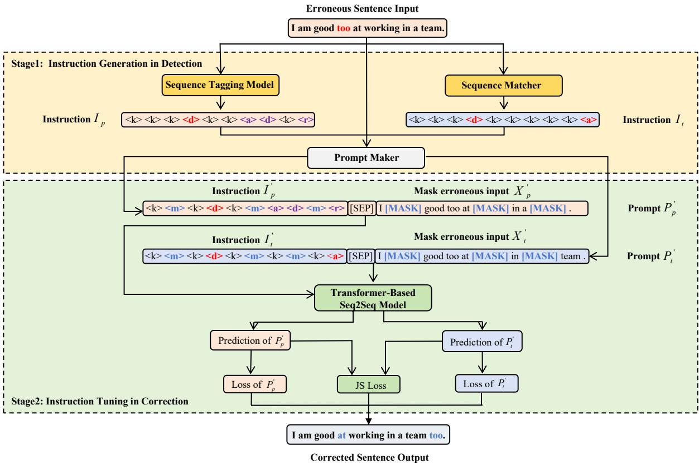

# InstructGEC: Enhancing Unsupervised Grammatical Error Correction with Instruction Tuning

Jiayi Deng1,2 and Chen Chen1,2\* and Chunyan Hou3 and Xiaojie Yuan1,2

1 College of Computer Science, Nankai University, Tianjin, China

2 MoE Key Lab of DISSec, Nankai University, Tianjin, China

3 School of CSE, Tianjin University of Technology, Tianjin, China 2120220621@mail.nankai.edu.cn,nkchenchen@nankai.edu.cn,

houchunyan@tjut.edu.cn,yuanxj@nankai.edu.cn

## Abstract

Recent works have proposed methods of generating synthetic data automatically for unsupervised Grammatical Error Correction (GEC). Although a large amount of synthetic data is generated at a low cost, it is unrealistic and of poor quality. The copying phenomenon of synthetic data prevents GEC models from learning the semantic knowledge of contextual language. In this paper, we design an instruction format and consistently use the masking strategy in both an erroneous sentence and the corresponding instruction to alleviate the impact of the copy phenomenon. We also propose a novel approach, InstructGEC, which integrates the knowledge of grammatical detection into GEC models with instruction tuning to address the low-quality issue. Experiments are conducted on English and Chinese GEC datasets and results demonstrate that our method outperforms state-of-the-art unsupervised GEC methods.

## 1 Introduction

Grammatical Error Correction (GEC) aims to detect and correct grammatical errors in an erroneous sentence and output a correct sentence. It has attracted a lot of attention due to its broad applications. There has been a large amount of research on GEC (Bryant et al., 2019; Rothe et al., 2021; Zhang et al., 2022; Zhao et al., 2018). However, a common drawback of these approaches is their dependence on a large amount of manually labeled data, which is time-consuming and expensive to construct.

To address this limitation, synthetic data generation for GEC is proposed to provide training data. Synthetic data can be generated in a supervised or unsupervised way. Supervised methods of synthetic data generation (Awasthi et al., 2019; Kiyono et al., 2019; Lichtarge et al., 2019; Stahlberg and Kumar, 2021) require manually labeled GEC data while unsupervised methods (Sun et al., 2022; Yasunaga et al., 2021; Zhao et al., 2019) do not need it. Because there is no manually labeled data for unsupervised GEC, many works focus on unsupervised synthetic data generation. Zhao et al. (2019) presented a random noising method to corrupt sentences to generate synthetic data. Yasunaga et al. (2021) proposed the Break-It-Fix-It (BIFI) framework to extract parallel data from unlabeled data. Sun et al. (2022) adopted machine translation pairs and pre-trained language models for erroneous sentence generation.

These unsupervised generation methods usually corrupt normal sentences to construct erroneous sentences automatically by heuristic rules. Then, unsupervised GEC models are trained on such synthetic data. Although a large amount of synthetic data is generated at a low cost, it is unrealistic and of poor quality. In addition, an erroneous sentence is similar to the corresponding correct one in synthetic data because grammatical errors are generally sparse. In this paper, it is named copying phenomenon. In this case, GEC models usually copy correct tokens directly from an erroneous sentence to the correct one and are prevented from learning the semantic knowledge of the contextual language. The performance of unsupervised GEC methods is much lower than supervised methods (Alikaniotis and Raheja, 2019; Yasunaga et al., 2021). Thus, the copying phenomenon and low-quality are challenges for unsupervised GEC.

To address these challenges, we propose a novel approach, InstructGEC, which is based on instruction tuning. Previous studies (Chen et al., 2020; Li et al., 2023) have explored dividing GEC into two stages: Grammatical Error Detection (GED) and Grammatical Error Correction (GEC). Grammatical errors are identified in the GED stage while errors are corrected in the GEC stage. InstructGEC attempts to enhance unsupervised GEC models by integrating GED knowledge into the GEC models

with instruction tuning.

Specifically, instructions, that can identify positions and edit operations of errors, are designed to include GED knowledge. Then instruction tuning is used to train GEC models, and the GEC model is guided by instructions to output correct sentences. The low-quality synthetic data often gives rise to inaccurate instructions, and our proposed Instruct-GEC is enabled to bridge the gap between an inaccurate instruction and the corresponding accurate one. InstructGEC outputs correct sentences and improves the generalization ability of GEC models even though inaccurate instructions are input. Therefore, our method can alleviate the low-quality issue. Due to the copying phenomenon in synthetic data, GEC models can not learn rich semantic knowledge from such large-scale synthetic data. So we use the masking strategy in both an erroneous sentence and the corresponding instruction consistently to mitigate the harmful impact of the copying phenomenon.

We conduct experiments to validate the effectiveness of InstructGEC for the unsupervised GEC on both English and Chinese GEC datasets. The Experimental results demonstrate that our approach outperforms state-of-the-art baselines and effectively mitigates the impact of the low quality and copy phenomenon.

The contributions of our paper are as follows:

1. We design an instruction format and use the masking strategy in both an erroneous sentence and the corresponding instruction consistently to form a prompt. The prompt enables GEC models to learn correction patterns and alleviate the impact of the copy phenomenon simultaneously.

2. We propose a novel approach, InstructGEC, which can integrate GED knowledge into GEC models with instruction tuning for unsupervised GEC. To improve the generalization ability of the GEC model, our proposed approach addresses the low-quality issue by bridging the gap between an inaccurate instruction and the corresponding accurate one.

3. We conduct experiments on English and Chinese GEC datasets. Experimental results demonstrate that our method outperforms the state-of-the-art GEC methods.

## 2 Related Work

Grammatical Error Correction (GEC) There are two main lines of research in GEC: (i) Sequenceto-Edit (Seq2Edit) models, and (ii) Sequence-to-Sequence (Seq2Seq) models, typically based on Transformer (Vaswani, 2017) model. Seq2Edit approaches (Awasthi et al., 2019; Malmi et al., 2019; Omelianchuk et al., 2020) treat GEC as a sequence labeling task, while the Seq2Seq (Kaneko et al., 2020; Yang et al., 2023; Zhao et al., 2019) consider GEC as a monolingual translation task. Some Seq2Seq GEC methods have achieved impressive effectiveness. Zhao et al. (2019) proposed a copyaugmented architecture and incorporated multi-task learning into the GEC task. Kaneko et al. (2020) incorporated a pre-trained masked language model into GEC. Yang et al. (2023) leveraged the error type information in the generation process. These works require manually annotated data. However, few studies attempt to explore unsupervised GEC methods that do not rely on manually labeled data. Alikaniotis and Raheja (2019) provided grammatical corrections based on confusion sets and vali dated these corrections by language models. Yasunaga et al. (2021) proposed an unsupervised synthetic data generation method. Chen et al. (2023) explored the constituent syntax of synthetic data to improve the performance of the GEC model in an unsupervised setting. Coyne et al. (2023) conducted the GEC task on ChatGPT using a zero-shot or few-shot approach. In contrast to these works, our method focuses on alleviating issues caused by the low-quality and copying phenomenon of synthetic data for unsupervised GEC.

Previous studies have tried to incorporate detection knowledge into GEC models. Chen et al. (2020) identified erroneous text spans in the GED stage and only output the corrected text for these spans in the GEC stage. Yuan et al. (2021) adopted GED knowledge as an auxiliary input to fine-tune a GEC model and re-rank the GEC output. Li et al. (2023) proposed a detection template to introduce GED knowledge that allows the GEC model to make accurate predictions. Different from the above studies, our method integrates detection knowledge into GEC models with instruction tuning.

Due to the low error rate of erroneous sentences, the copy phenomenon is a common issue for GEC synthetic data. Wu et al. (2022); Zhao et al. (2019) incorporated the copying mechanism in their models to directly replicate words from the source sentence to the target. Shen et al. (2022) found that the copy phenomenon can harm the effective training of GEC models and proposed a masking strategy to facilitate effective training. Compared with these works, our method designs an instruction format and uses the masking strategy in both instructions and erroneous sentences to alleviate the impact of the copy phenomenon.

Instruction Tuning (IT) IT has proven to be an efficient method for improving the ability of generalization by learning from a collection of tasks (Wei et al.). Some studies attempted to convert the supervised data into the format of instructions to finetune LLMs. Zhang et al. (2023) transformed the supervised financial sentiment analysis data into instruction data by randomly selecting an instruction from ten instructions and fine-tuned LLMs. Wang et al. (2023) proposed InstructUIE, which is a unified information extraction framework based on IT to model different information extraction tasks. Our method differs from these works in that an instruction generated in the GED stage depends on the inputted erroneous sentence and we finetune GEC models on instruction-tuning data for unsupervised GEC task.

## 3 InstructGEC

The architecture of InstructGEC is shown in Figure 1. We describe the detection and correction stage of InstructGEC in Section 3.1 and 3.2 respectively, and introduce the training and inference in Appendix A.3.

## 3.1 Instruction Generation in Detection Stage

We regard Grammar Error Detection (GED) as a token classification task and design an instruction format that includes five sub-instructions. These sub-instructions at the token level are associated with edit operations on erroneous sentences. In Table 1, we define a sub-instruction set S which consists of five sub-instructions. The instruction I for a sentence $X = X _ { 1 } , X _ { 2 } , . . . , X _ { n }$ is a sequence of sub-instructions, which can be formulated as:

$$
I = I _ { 1 } , I _ { 2 } , . . . , I _ { n }\tag{1}
$$

where $I _ { i } \in S$ denotes a sub-instruction, n is the number of tokens in the sentence X.

As shown in the upper half of Figure 1, an erroneous sentence is converted into two instructions $I _ { t }$ and $I _ { p }$ by a sequence matcher and a sequence tagging model respectively. Sequence matcher uses the Levenshtein distance algorithm (Levenshtein, 1966) to match differences between an erroneous sentence and the corresponding correct sentence at the token level. Sequence matcher can provide the instruction $I _ { t }$ , that is called gold instruction afterwards. We consider sub-instructions as the labels of tokens and use the training dataset to train a BERT (Kenton and Toutanova, 2019) model as the sequence tagging model. The tagging model can provide the instruction $I _ { p } ,$ , which is named predicted instruction. Then, the instruction $I _ { t }$ and $I _ { p }$ are fed into the prompt maker. The sequence matcher and the sequence tagging model are designed to reduce the burden of Seq2Seq GEC Models because they are capable of integrating positions and editing operations of errors into an instruction.

<table><tr><td>Sub-Instruction</td><td>Description</td></tr><tr><td>&lt;k&gt;</td><td>Keep unchanged token</td></tr><tr><td>&lt;r&gt;</td><td>Replace token</td></tr><tr><td>&lt;a&gt;</td><td>Add token</td></tr><tr><td>&lt;d&gt;</td><td>Delete token</td></tr><tr><td>&lt;m&gt;</td><td>Mask token</td></tr></table>

Table 1: Sub-Instruction Set

## 3.2 Instruction Tuning in Correction Stage

Mask Strategy When an erroneous sentence is given, sub-instructions are provided based on the tokens of this erroneous sentence by sequence tagging model or sequence matcher. Then, sequence mask marker randomly masks a proportion of tokens whose sub-instructions are <k> with a mask token [MASK] in an erroneous sentence, and puts the mask sub-instruction <m> in the corresponding position of the instruction. Note that the masking strategy is only used for unchanged tokens whose sub-instructions are <k> in an erroneous sentence.

Specifically, 80% of masked tokens in an erroneous sentence are replaced with the [MASK] token, and the corresponding sub-instructions in the instruction are with <m>. 10% of the tokens are replaced with random tokens from the vocabulary, and the corresponding sub-instructions in the instruction are with <r>. There are three advantages of the proposed masking strategy. First, when GEC models are trained by erroneous sentences with masked tokens, they can learn the language semantic knowledge rather than direct copying. Second, when the masking strategy is only used for unchanged tokens, GEC models are not impeded from learning the correction from an erroneous sentence to a correct one. Third, the instructions provide the correction patterns and the masking strategy enables GEC models to alleviate the impact of copy phenomenon and improve the ability of pattern recognition.

  
Figure 1: The architecture of InstructGEC, the detection stage in the upper half and the correction stage in the lower half. The red part of the instructions represents the sentence errors, the purple part represents tokens wrongly classified by the sequence labeling model, and the blue part denotes the masked segment.

Prompt Construction Prompt maker is responsible for generating the prompt. It constructs $( \hat { X } _ { p } ^ { ' } , I _ { p } ^ { ' } )$ and $( X _ { t } ^ { \prime } , I _ { t } ^ { \prime } )$ by applying the masking strategy to $( X , I _ { t } )$ and $( X , I _ { p } )$ with the specified mask probability respectively. The prompt $P _ { t } ^ { ' }$ is the concatenation of $\hat { I } _ { t } ^ { ' }$ and $\dot { X _ { t } ^ { ' } }$ with a specialized token [SEP] as a delimiter while the prompt $P _ { p } ^ { ' }$ is of $I _ { p } ^ { ' }$ and $X _ { p } ^ { ' } ,$ which can be formulated as:

$$
P _ { t } ^ { ' } = I _ { t } ^ { ' } [ S E P ] X _ { t } ^ { ' }\tag{2}
$$

$$
P _ { p } ^ { ' } = I _ { p } ^ { ' } [ S E P ] X _ { p } ^ { ' }\tag{3}
$$

$P _ { t } ^ { \prime }$ is constructed using $I _ { t } ^ { ' } ,$ , and we refer to it as the gold prompt. $P _ { p } ^ { \prime }$ is constructed using $I _ { p } ^ { ' { } } ,$ , and we refer to it as the predicted prompt.

Loss Function As shown in the lower half of Figure 1, the prompt $P _ { p } ^ { \prime }$ and $P _ { t } ^ { \prime }$ are fed into a Transformer-based Seq2Seq model in the correction stage. This model outputs the prediction of $P _ { p } ^ { \prime }$ and $P _ { t } ^ { \prime }$ respectively. The loss $\mathcal { L } _ { s }$ is defined as:

$$
\mathcal { L } _ { s } = - \frac { 1 } { 2 } [ \log P ( \boldsymbol { Y } | P _ { p } ^ { \prime } ; \boldsymbol { \theta } ) + \log P ( \boldsymbol { Y } | P _ { t } ^ { \prime } ; \boldsymbol { \theta } ) ]\tag{4}
$$

where $\theta$ is the parameters of Transformer-based Seq2Seq model, Y is the correct sentences.

The prompt $P _ { p } ^ { \prime }$ includes the instruction $I _ { p } ^ { \prime }$ that is integrated with GED knowledge for correcting errors in an erroneous sentence exactly. Because the synthetic data is of low quality, the sequence tagging model might make mistakes in predicting the instruction $I _ { p } ^ { \prime } .$ When the instruction $I _ { p } ^ { \prime }$ is incorrect, GEC models probably make the wrong correction to the erroneous sentence. To address this problem, we propose to use consistency training that can bridge the gap between the predicted instruction and the gold instruction. In detail, we take into account the consistency loss that penalizes the dissimilarity between the distribution of prediction for $P _ { t } ^ { \prime }$ and $P _ { p } ^ { \prime } .$ The Jensen–Shannon (JS) divergence is a symmetrical metric used to measure the dissimilarity between two probability distributions in statistics. We use JS divergence as the consistency loss to alleviate the impact of the low-quality synthetic data. The consistency loss is

formulated as:

$$
A v g = \frac { 1 } { 2 } [ P ( Y | P _ { p } ^ { \prime } ; \theta ) + P ( Y | P _ { t } ^ { \prime } ; \theta ) ]\tag{5}
$$

$$
\begin{array} { c } { \displaystyle \mathcal { L } _ { c } = \frac { 1 } { 2 } [ K L ( P ( Y | P _ { p } ^ { \prime } ; \theta ) | | A v g ) } \\ { \displaystyle + K L ( P ( Y | P _ { t } ^ { \prime } ; \theta ) | | A v g ) ] } \end{array}\tag{6}
$$

where $\mathcal { L } _ { c }$ is the consistency loss, KL is the Kullback–Leibler divergence.

The final loss function is defined as:

$$
\mathcal { L } = \mathcal { L } _ { s } + \lambda \mathcal { L } _ { c }\tag{7}
$$

where λ is the hyper-parameter that controls the weight of $\mathcal { L } _ { c }$

For the inference, given a new erroneous sentence x, the sequence tagging model is used to get just the predicted instruction of x. The prompt is constructed by concatenating the predicted instruction and x with a token [SEP] as a delimiter, and is fed into the Transformer-based Seq2Seq model which outputs the correct sentence of x. Note that the prompt is not masked in the inference stage.

## 4 Experiments

We introduce the datasets, evaluation metrics, and baselines in Sections 4.1, 4.2, and 4.3. The results analysis is described in Section 4.4. Implementation details are provided in Appendix A.1 and baseline settings are provided in Appendix A.2.

## 4.1 Datasets

Both Chinese and English GEC synthetic datasets generated in an unsupervised way are required in our experiments. For the Chinese dataset, we adopt a methodology that is similar to Tang et al. (2023). We treat the sentences as correct sentences and corrupt these sentences to construct erroneous sentences by adding, deleting, replacing, and swapping words or characters on different levels in translation29zh corpus1. As to the English dataset, we follow Awasthi et al. (2019). They perform heuristic algorithms on the sentences in the One-billionword corpus (Chelba et al., 2013) by adding, deleting, and replacing to construct erroneous sentences. The size of Chinese and English synthetic data is 3.4M and 9M pairs respectively. The statistics of datasets are shown in Table 2.

We train the proposed InstructGEC model on the synthetic dataset. If the MuCGEC dev set is used as the validation data, experiments are conducted on the NLPCC2018 test and the MuCGEC test set. When the BEA-2019 test and the CoNLL-2014 test set are adopted for evaluation, we use the BEA-2019 dev set as the validation data.

<table><tr><td>Language</td><td>Corpus</td><td>Split</td><td>Pair</td></tr><tr><td>Chinese</td><td>ZH Synthetic data</td><td>train</td><td>3.40M</td></tr><tr><td>English</td><td>EN Synthetic data</td><td>train</td><td>9M</td></tr><tr><td>Chinese</td><td>MuCGEC test</td><td>test</td><td>5.93K</td></tr><tr><td>Chinese</td><td>NLPCC2018 test</td><td>test</td><td>2.00K</td></tr><tr><td>English</td><td>BEA-2019 test</td><td>test</td><td>4.48K</td></tr><tr><td>English</td><td>CoNLL-2014 test</td><td>test</td><td>1.31K</td></tr><tr><td>Chinese</td><td>MuCGEC dev</td><td>valid</td><td>1.12K</td></tr><tr><td>English</td><td>BEA-2019 dev</td><td>valid</td><td>4.38K</td></tr></table>

Table 2: Statistics of datasets used in experiments

## 4.2 Evaluation Metrics

In the detection stage, instruction generation is considered as a token classification task, and the quality of predicted instruction by the sequence tagging model is evaluated with the metrics (Nakayama, 2018) named $F _ { 1 }$ in Table 6.

In the correction stage, the Transformer-based Seq2Seq model is evaluated with the official $M ^ { 2 }$ score metrics (Dahlmeier and Ng, 2012) on the NLPCC2018 test and the CoNLL-2014 test set. For the Chinese dataset, pkunlp (Draplater, 2018) is used for Chinese word segmentation. The ChER-RANT (Zhang et al., 2022) metrics tool is used on the MuCGEC test set while the ERRANT (Bryant et al., 2017) is on the BEA-2019 dev/test set. Because the MuCGEC test and the BEA-2019 test set are not publicly available, we submit the results of MuCGEC test set on TianChi competition website2 and the results of BEA-2019 test set on CodaLab Competition website3.

## 4.3 Compared Methods

We compare InstructGEC with the following baselines.

Transformer (Vaswani, 2017) is a Transformerbased encoder-decoder Seq2Seq model trained on synthetic data.

GECToR (Omelianchuk et al., 2020) is a Seq2Edit model using a Transformer encoder and designs custom token-level transformations to map input tokens to target corrections.

<table><tr><td rowspan="2">Methods</td><td rowspan="2">Mask</td><td colspan="2">Instruction Type</td><td colspan="3">NLPCC2018 test</td><td colspan="3">MuCGEC test</td></tr><tr><td>Train</td><td>Test</td><td>P</td><td>R</td><td> $F _ { 0 . 5 }$ </td><td>P</td><td>R</td><td> $F _ { 0 . 5 }$ </td></tr><tr><td>Transformer</td><td>X</td><td>-</td><td>-</td><td>18.84</td><td>9.63</td><td>15.82</td><td>18.63</td><td>8.11</td><td>14.79</td></tr><tr><td>GECToR</td><td>X</td><td>-</td><td>-</td><td>34.45</td><td>22.35</td><td>31.08</td><td>35.81</td><td>19.98</td><td>30.91</td></tr><tr><td>BART</td><td>X</td><td>-</td><td>-</td><td>33.30</td><td>20.50</td><td>29.61</td><td>38.06</td><td>18.89</td><td>31.64</td></tr><tr><td rowspan="2">Ours</td><td>X</td><td>Gold+Pred</td><td>Pred</td><td>38.56</td><td>18.20</td><td>31.51</td><td>43.53</td><td>16.17</td><td>32.52</td></tr><tr><td>√</td><td>Gold+Pred</td><td>Pred</td><td>39.92</td><td>20.05</td><td>33.31</td><td>43.41</td><td>17.16</td><td>33.24</td></tr></table>

Table 3: Results on Chinese NLPCC18-test and MuCGEC-test set. Precision (P), Recall (R), $F _ { 0 . 5 } \left( F _ { 0 . 5 } \right)$ are reported (%). In the $\mathrm { ^ { 6 6 } M a s k " }$ column, the symbol $" \times "$ signifies the absence of the masking strategy while the symbol $" \checkmark "$ indicates using the masking strategy. In the “Instruction Type” column,“Gold" and “Pred" refer to the gold and predicted instruction respectively.
<table><tr><td rowspan="2"></td><td rowspan="2">Mask</td><td colspan="2">Instruction Type</td><td colspan="2">CoNLL-2014 test</td><td colspan="2">BEA-2019 test</td><td colspan="2"></td><td colspan="2">BEA-2019 dev</td></tr><tr><td>Train</td><td>Test</td><td>P</td><td>R</td><td> $F _ { 0 . 5 }$ </td><td>P</td><td>R</td><td> $F _ { 0 . 5 }$ </td><td>P R</td><td> $F _ { 0 . 5 }$ </td></tr><tr><td>Transformer</td><td>×</td><td></td><td></td><td>49.90</td><td>23.22</td><td>40.58</td><td>43.51 29.94</td><td>39.90</td><td>32.95</td><td>13.4</td><td>25.51</td></tr><tr><td>GPT-2 (Alikaniotis and Raheja, 2019)</td><td>×</td><td></td><td></td><td>58.5</td><td>24.9</td><td>46.1</td><td>- =</td><td>=</td><td>1</td><td></td><td></td></tr><tr><td>BART-base</td><td>×</td><td></td><td></td><td>61.33</td><td>28.23</td><td>49.68</td><td>53.68 35.59</td><td>48.73</td><td>41.07</td><td>15.88</td><td>31.18</td></tr><tr><td>BART-base (Grundkiewicz et al., 2019)</td><td>×</td><td></td><td></td><td>59.7</td><td>18.5</td><td>41.3</td><td>62.4</td><td>25.4 48.8</td><td>=</td><td></td><td>=</td></tr><tr><td>ChatGPT with prompting (Coyne et al., 2023)</td><td>×</td><td></td><td></td><td>50.3</td><td>59.7</td><td>51.9</td><td>42.6</td><td>69.3 46.1</td><td>=</td><td>=</td><td>=</td></tr><tr><td>BART+BIFI (Yasunaga et al., 2021)</td><td>X</td><td></td><td>1</td><td>64.4</td><td>35.6</td><td>55.5</td><td></td><td>= =</td><td>51.6</td><td>24.7</td><td>42.4</td></tr><tr><td>Ours+BIFI</td><td>√</td><td>Gold+Pred</td><td>Pred</td><td>68.61</td><td>34.25</td><td>57.14</td><td></td><td>1 =</td><td>54.44</td><td>23.54</td><td>43.12</td></tr><tr><td rowspan="2">Ours</td><td>×</td><td>Gold+Pred Pred</td><td></td><td>63.18</td><td>30.34</td><td>51.94</td><td>56.17</td><td>38.02</td><td>51.27 43.44</td><td>17.42</td><td>33.45</td></tr><tr><td>√</td><td>Gold+Pred Pred</td><td></td><td>64.36</td><td>31.24</td><td>53.10</td><td>57.42 38.48</td><td>52.27</td><td></td><td>44.04 17.61 33.87</td><td></td></tr></table>

Table 4: Results on the English CoNLL-2014 test, BEA-2019 test, and BEA-2019 dev set. Scores that are higher than competitive baselines are highlighted in bold.

BART is to initialize the model with the BART and train the model on synthetic data as Awasthi et al. (2019).

BART+BIFI (Yasunaga et al., 2021) is an unsupervised synthetic data generation method using Break-It-Fix-It(BIFI) framework. It adopts a pretrained language model to generate high-quality synthetic data which is used for training a BART model. It utilizes external data which is referred to as “BIFI” in Table 4. It is the state-of-the-art unsupervised English GEC model.

GPT-2 Alikaniotis and Raheja (2019) substituted the n-gram model with GPT-2 (Radford et al., 2019) and assessed its performance on GEC without any supervised training.

ChatGPT is powerful and achieves high performance across various Natural Language Processing tasks. Coyne et al. (2023) provide a zero-shot prompt for the GEC task on GPT-3.5.

## 4.4 Results Analysis

The results on the Chinese datasets are listed in Table 3. Our InstructGEC outperforms GECToR with a significant improvement of 2.23 $F _ { 0 . 5 }$ on the NLPCC2018 test and 2.33 $F _ { 0 . 5 }$ on the MuCGEC test. Additionally, Compared with BART, Instruct-GEC raises the $F _ { 0 . 5 }$ by 3.7 on the NLPCC2018 test and by 1.6 on the MuCGEC test. “Transformer” gets the lowest $F _ { 0 . 5 }$ , and the possible reason is that it is not initialized by parameters of the pre-trained language model. Our method with the proposed masking strategy is better than that without it, and the masking strategy can significantly increase $F _ { 0 . 5 }$ by 1.8 on the NLPCC2018 test and by 0.72 on the MuCGEC test.

Table 4 shows the experimental results on the English datasets. In contrast to “Transformer” and $\mathrm { ^ { 6 6 } B A R T ^ { , } }$ , InstructGEC achieves the best performance. Specifically, InstructGEC with the masking strategy is better than “BART” with the improvement of the $F _ { 0 . 5 }$ by 3.42, 3.54, and 2.69 on the CoNLL-2014 test, BEA-2019 test, and BEA-2019 dev set respectively. For a fair comparison, when our method with BIFI (i.e., Ours+BIFI) is trained on the same data as “BART+BIFI”, our method outperforms “BART+BIFI” with +1.64, +0.72 $F _ { 0 . 5 }$ improvement on CoNLL-2014 test and BEA-2019 dev set. The results demonstrate that InstructGEC can achieve better effectiveness than state-of-theart baselines. The masking strategy has a consistent effect on English datasets.

<table><tr><td rowspan="2">Methods</td><td rowspan="2">Mask</td><td colspan="2">Instruction Type</td><td colspan="3">CoNLL-2014 test</td><td colspan="3">BEA-2019 dev</td><td colspan="3">BEA-2019 test</td></tr><tr><td>Train</td><td>Test</td><td>P</td><td>R</td><td> $F _ { 0 . 5 }$ </td><td>P</td><td>R</td><td> $F _ { 0 . 5 }$ </td><td>P</td><td>R</td><td> $F _ { 0 . 5 }$ </td></tr><tr><td colspan="10">Instruction effect</td><td></td><td></td><td></td></tr><tr><td></td><td>X</td><td></td><td></td><td>61.33</td><td>28.23</td><td>49.68</td><td>41.07</td><td>15.88</td><td>31.18</td><td>53.68</td><td>35.59</td><td>48.73</td></tr><tr><td>BART</td><td>×</td><td>Pred</td><td>Pred</td><td>62.57</td><td>29.09</td><td>50.86</td><td>43.28</td><td>16.62</td><td>32.77</td><td>55.75</td><td>37.13</td><td>50.67</td></tr><tr><td></td><td>X</td><td>Gold</td><td>Gold</td><td>66.01</td><td>60.11</td><td>64.74</td><td>57.62</td><td>52.0</td><td>56.4</td><td></td><td></td><td></td></tr><tr><td colspan="10">JS divergence effect</td><td colspan="3"></td></tr><tr><td>BART</td><td>×</td><td>Gold U Pred</td><td>Pred</td><td>59.94</td><td>30.61</td><td>50.30</td><td>43.36</td><td>17.1</td><td>33.17</td><td>55.37</td><td>38.53</td><td>50.92</td></tr><tr><td>Ours with KL</td><td>X</td><td>Gold+Pred</td><td>Pred</td><td>64.03</td><td>28.55</td><td>51.28</td><td>44.69</td><td>16.18</td><td>33.04</td><td>56.51</td><td>35.95</td><td>50.71</td></tr><tr><td>Ours with KL</td><td>√</td><td>Gold+Pred</td><td>Pred</td><td>64.25</td><td>29.89</td><td>52.24</td><td>43.62</td><td>17.0</td><td>33.22</td><td>56.28</td><td>36.87</td><td>50.92</td></tr><tr><td>Ours with JS</td><td>×</td><td>Gold+Pred</td><td>Pred</td><td>63.18</td><td>30.34</td><td>51.94</td><td>43.44</td><td>17.42</td><td>33.45</td><td>56.17</td><td>38.02</td><td>51.27</td></tr><tr><td>Ours with JS</td><td>√</td><td>Gold+Pred</td><td>Pred</td><td>64.02</td><td>31.69</td><td>53.18</td><td>43.59</td><td>17.72</td><td>33.74</td><td>56.51</td><td>38.89</td><td>51.81</td></tr><tr><td colspan="10">Mask Instruction effect</td><td colspan="3"></td></tr><tr><td>Ours</td><td>× √</td><td>Gold+Pred</td><td>Pred</td><td>63.18</td><td>30.34</td><td>51.94</td><td>43.44</td><td>17.42</td><td>33.45</td><td>56.17</td><td>38.02</td><td>51.27</td></tr><tr><td></td><td></td><td>Gold+Pred</td><td>Pred</td><td>64.36</td><td>31.24</td><td>53.10</td><td>44.04</td><td>17.61</td><td>33.87</td><td>57.42</td><td>38.48</td><td>52.27</td></tr></table>

Table 5: Ablation study with different setups. The mask ratio is 0.15 for the mask probability setting.

<table><tr><td>Language</td><td>Dataset</td><td> $F _ { 1 }$ </td></tr><tr><td>Chinese</td><td>NLPCC2018 test MuCGEC dev</td><td>28.43 20.04</td></tr><tr><td>English</td><td>CoNLL-2014 test BEA-2019 dev</td><td>18.78 28.95</td></tr></table>

Table 6: Results of instruction quality

For further analysis, we conduct experiments on Chinese and English test sets to investigate the quality of instructions generated by the sequence tagging model. The experimental results are shown in Table 6. On Chinese datasets, we achieve $F _ { 1 } = 2 8 . 4 3$ on the NLPCC2018 test set and $F _ { 1 } = 2 0 . 0 4$ on the MuCGEC dev set. On English datasets, we obtain $F _ { 1 } = 1 8 . 7 8$ on the CoNLL-2014 test set and $F _ { 1 } = 2 8 . 9 5$ on the BEA-2019 dev set. A lower $F _ { 1 }$ score indicates poorer instruction quality. We can observe that the sequence tagging model trained on the unsupervised synthetic GEC data provides poor instructions. Thus, consistency loss is necessary to mitigate the effect of poor instructions. Additional error type analysis and comparison results for generated examples are provided in Appendix B.

## 5 Ablation Study

We perform ablation studies to explore the impact of various factors, including the instruction, JS divergence, masking strategy, and mask ratio, on the performance of models tested on the CoNLL-2014 test, the BEA-2019 dev, and the BEA-2019 test. Effect of Instruction As shown in Table 5, BART is trained on the synthetic data without instruction tuning, and with the predicted and gold instructions respectively. Results with predicted instructions are slightly better than those without instruction tuning. It reveals that the predicted instructions are of poor quality and do not effectively enhance the performance of GEC models. This outcome is consistent with the results in Table 6. Results with gold instructions demonstrate the performance upper bound of instruction tuning. Specifically, if the gold instructions on the test set are given, we achieve 64.74 $F _ { 0 . 5 }$ score on the CoNLL-2014 test set and 56.4 $F _ { 0 . 5 }$ score on the BEA-2019 dev set, which are competitive with the results of supervised GEC methods.

Effect of JS divergence Because the low-quality synthetic data results in poor instructions, consistency loss is proposed to alleviate this issue. Jensen–Shannon (JS) and Kullback–Leibler (KL) divergence can be used to measure the dissimilarity between two probability distributions in statistics. The consistency loss based on KL divergence is defined as:

$$
\begin{array} { l } { { \displaystyle \mathcal { L } _ { c } ^ { \prime } = \frac { 1 } { 2 } [ K L ( P ( \boldsymbol { Y } | P _ { p } ^ { \prime } ; \theta ) | | P ( \boldsymbol { Y } | P _ { t } ^ { \prime } ; \theta ) ) } } \\ { { \displaystyle ~ + K L ( P ( \boldsymbol { Y } | P _ { t } ^ { \prime } ; \theta ) | | P ( \boldsymbol { Y } | P _ { p } ^ { \prime } ; \theta ) ) ] } } \end{array}\tag{8}
$$

As shown in Table 5, when the JS divergence is changed to KL divergence and the masking strategy is not used, $F _ { 0 . 5 }$ drops by 0.66 on CoNLL-2014 test set, by 0.41 on BEA-2019 dev set, and by 0.56 on on BEA-2019 test set. When JS is changed to KL and the masking strategy is used, $F _ { 0 . 5 }$ decreases by 0.94 on CoNLL-2014 test set, by 0.52 on BEA-2019 dev set, and by 0.89 on BEA-2019 test set.

<table><tr><td rowspan="2">Mask Ratio m%</td><td colspan="3">CoNLL-2014 test</td><td colspan="3">BEA-2019 dev</td><td colspan="3">BEA-2019 test</td></tr><tr><td>P</td><td>R</td><td> $F _ { 0 . 5 }$ </td><td>P</td><td>R</td><td> $F _ { 0 . 5 }$ </td><td>P</td><td>R</td><td> $F _ { 0 . 5 }$ </td></tr><tr><td>0%</td><td>63.18</td><td>30.34</td><td>51.94</td><td>43.44</td><td>17.42</td><td>33.45</td><td>56.17</td><td>38.02</td><td>51.27</td></tr><tr><td>15%</td><td>64.02</td><td>31.69</td><td>53.18</td><td>43.59</td><td>17.72</td><td>33.74</td><td>56.51</td><td>38.89</td><td>51.81</td></tr><tr><td>20%</td><td>64.36</td><td>31.24</td><td>53.10</td><td>44.04</td><td>17.61</td><td>33.87</td><td>57.42</td><td>38.48</td><td>52.27</td></tr><tr><td>25%</td><td>64.42</td><td>31.65</td><td>53.37</td><td>43.48</td><td>17.91</td><td>33.82</td><td>56.50</td><td>38.59</td><td>51.70</td></tr><tr><td>30%</td><td>62.92</td><td>30.55</td><td>51.92</td><td>43.83</td><td>17.93</td><td>34.00</td><td>56.91</td><td>38.77</td><td>52.04</td></tr><tr><td>40%</td><td>63.11</td><td>31.87</td><td>52.77</td><td>43.19</td><td>18.36</td><td>33.99</td><td>55.74</td><td>39.35</td><td>51.45</td></tr><tr><td>50%</td><td>63.03</td><td>31.32</td><td>52.42</td><td>42.79</td><td>18.22</td><td>33.7</td><td>55.39</td><td>38.88</td><td>51.06</td></tr></table>

Table 7: The results of different mask ratios m%.

It is unfair to compare our proposed InstructGEC with BART since BART does not use instructions and the consistency loss. We combine $( P _ { p } ^ { \prime } , Y )$ and $( P _ { t } ^ { \prime } , Y )$ to build a larger training data (i.e., Gold ∪ Pred) which is used for training a BART model with instruction tuning. If the masking strategy is not used, both “Ours with JS” and “Ours with KL” outperform BART trained on Gold ∪ Pred. Therefore, JS divergence is better for enhancing the unsupervised GEC models.

Effect of Masking Strategy We conduct experiments with and without the masked prompt to validate the effectiveness of the mask strategy. As shown in Table 5, the performance of InstructGEC without the masked prompt declines by 1.16 $F _ { 0 . 5 }$ on CoNLL-2014 test set, 0.45 $F _ { 0 . 5 }$ on BEA-2019 dev set, and 1.0 $F _ { 0 . 5 }$ on BEA-2019 test set. The mask strategy is able to alleviate the impact of the copying phenomenon in the task of unsupervised GEC. Our method learns not only to correct the grammatical errors but also to predict the masked tokens based on contextual language using the masking strategy. This allows our model to enhance the ability of semantic understanding based on the context and to correct grammatical errors accurately.

Effect of Mask Ratio We test different values of mask ratio m% for InstructGEC. After the gold and predicted instructions are masked with a specified mask ratio, they are used to construct prompts for training InstructGEC. Predicted instructions are not masked in the inference stage.

The experimental results are shown in the Table 7. We observe that our method is robust and insensitive to the mask ratio m%. The possible reason is that a large amount of synthetic data alleviates the impact of the mask ratio. The superior performance is achieved when the m% is between

15% and 25%. If the $m \%$ is more than 25% or less than 15%, the performance drops. The lower value of m% reduces the number of masked tokens, which is harmful to GEC models for learning the semantic knowledge of contextual language. The higher value might make the masked sentence lack semantic coherence and hinder effective training.

## 6 Conclusion

In this paper, we design an instruction format and use the masking strategy in both an erroneous sentence and the corresponding instructions, enabling our method to alleviate the impact of the copying phenomenon and learn rich semantic knowledge on large-scale synthetic data. We propose a novel approach, InstructGEC, which incorporates GED knowledge into GEC models with instruction tuning for unsupervised GEC. InstructGEC can mitigate the low-quality issue to improve the generalization ability of GEC models. Experiments are conducted to validate our proposed method on English and Chinese GEC datasets. Experimental results demonstrate that InstructGEC can achieve stateof-the-art performance. In addition, the results of ablation studies show that the masking strategy and the consistency loss based on JS divergence are effective in achieving superior performance. Our method is not sensitive to the mask ratio.

In the future, because the generation of highquality instructions in the GED stage is challenging, we will explore more effective methods for generating high-quality instructions or use multitask learning to enhance GEC models’ capability.

## 7 Limitations

Our model exhibits a limitation during the instruction generation phase, leading to suboptimal instruction quality. To address the discrepancy between actual and predicted instructions, we use a Jensen–Shannon divergence in the loss function.

Accurate token classification remains a challenge task. Additionally, while the masking strategy effectively reduces duplication and enhances semantic understanding for grammar correction, our model still lacks interpretability.

## 8 Ethical Statements

In this paper, we introduce InstructGEC which combines GED knowledge with instructions and uses a masked strategy in GEC. All data are from publicly available sources, with no sensitive information involved. GEC is widely studied and applied, but unsupervised GEC has been underexplored. Our work aims to advance unsupervised GEC methods and broaden their potential applications.

## Acknowledgments

This work was partially supported by the National Natural Science Foundation of China (No. 62372252, 62302245, 62172237, 62077031, 62176028), Ministry of Education of the People’s Republic of China Humanities and Social Sciences Youth Foundation (No. 23YJCZH240), the NSFC-General Technology Joint Fund for Basic Research (No. U1936105,U1936206 ). We thank the AC, SPC, PC and reviewers for their insightful comments on this paper.

## References

Dimitris Alikaniotis and Vipul Raheja. 2019. The unreasonable effectiveness of transformer language models in grammatical error correction. In Proc. of the Workshop on Innovative Use of NLP for Building Educational Applications, pages 127–133.

Abhijeet Awasthi, Sunita Sarawagi, Rasna Goyal, Sabyasachi Ghosh, and Vihari Piratla. 2019. Parallel iterative edit models for local sequence transduction. In Proc. of EMNLP-IJCNLP, pages 4260–4270.

Christopher Bryant, Mariano Felice, Øistein E. Andersen, and Ted Briscoe. 2019. The BEA-2019 shared task on grammatical error correction. In Proc. of the Workshop on Innovative Use ofNLPfor Building Educational Applications, pages 52–75.

Christopher Bryant, Mariano Felice, and Ted Briscoe. 2017. Automatic annotation and evaluation of error types for grammatical error correction. In Proc. of ACL, pages 793–805.

Ciprian Chelba, Tomas Mikolov, Mike Schuster, Qi Ge, Thorsten Brants, Phillipp Koehn, and Tony Robinson. 2013. One billion word benchmark for measuring progress in statistical language modeling. arXiv preprint arXiv:1312.3005.

Chen Chen, Bo He, Jing Yuan, Chunyan Hou, and Xiaojie Yuan. 2023. Incorporating constituent syntax into grammatical error correction with multi-task learning. In Proc. of CIKM, page 286–295.

Mengyun Chen, Tao Ge, Xingxing Zhang, Furu Wei, and Ming Zhou. 2020. Improving the efficiency of grammatical error correction with erroneous span detection and correction. In Proc. ofEMNLP, pages 7162–7169.

Steven Coyne, Keisuke Sakaguchi, Diana Galvan-Sosa, Michael Zock, and Kentaro Inui. 2023. Analyzing the performance of gpt-3.5 and gpt-4 in grammatical error correction. arXiv preprint arXiv:2303.14342.

Daniel Dahlmeier and Hwee Tou Ng. 2012. Better evaluation for grammatical error correction. In Proc. of NAACL, pages 568–572.

Biug Draplater, Buptcjj. 2018. pkunlp: A python tool for data segmentations. Software available from https://github.com/biug/pkunlp.

Roman Grundkiewicz, Marcin Junczys-Dowmunt, and Kenneth Heafield. 2019. Neural grammatical error correction systems with unsupervised pre-training on synthetic data. In Proc. ofthe Workshop on Innovative Use ofNLP for Building Educational Applications, pages 252–263.

Masahiro Kaneko, Masato Mita, Shun Kiyono, Jun Suzuki, and Kentaro Inui. 2020. Encoder-decoder models can benefit from pre-trained masked language models in grammatical error correction. In Proc. of ACL, pages 4248–4254.

Jacob Devlin Ming-Wei Chang Kenton and Lee Kristina Toutanova. 2019. Bert: Pre-training of deep bidirectional transformers for language understanding. In Proc. of NAACL-HLT, volume 1, page 2.

Diederik P Kingma and Jimmy Ba. 2014. Adam: A method for stochastic optimization. arXiv preprint arXiv:1412.6980.

Shun Kiyono, Jun Suzuki, Masato Mita, Tomoya Mizumoto, and Kentaro Inui. 2019. An empirical study of incorporating pseudo data into grammatical error correction. In Proc. of EMNLP-IJCNLP, pages 1236–1242.

VI Levenshtein. 1966. Binary codes capable of correcting deletions, insertions, and reversals. Proc. ofthe Soviet Physics Doklady.

M Lewis. 2019. Bart: Denoising sequence-tosequence pre-training for natural language generation, translation, and comprehension. arXiv preprint arXiv:1910.13461.

Yinghao Li, Xuebo Liu, Shuo Wang, Peiyuan Gong, Derek F Wong, Yang Gao, He-Yan Huang, and Min Zhang. 2023. Templategec: Improving grammatical error correction with detection template. In Proc. of ACL, pages 6878–6892.

Jared Lichtarge, Chris Alberti, Shankar Kumar, Noam Shazeer, Niki Parmar, and Simon Tong. 2019. Corpora generation for grammatical error correction. In Proc. ofNAACL, pages 3291–3301.

Ilya Loshchilov and Frank Hutter. 2018. Fixing weight decay regularization in adam. arXiv preprint arXiv:1711.05101.

Eric Malmi, Sebastian Krause, Sascha Rothe, Daniil Mirylenka, and Aliaksei Severyn. 2019. Encode, tag, realize: High-precision text editing. In Proc. of EMNLP-IJCNLP, pages 5054–5065.

Hiroki Nakayama. 2018. seqeval: A python framework for sequence labeling evaluation. Software available from https://github.com/chakki-works/seqeval.

Kostiantyn Omelianchuk, Vitaliy Atrasevych, Artem Chernodub, and Oleksandr Skurzhanskyi. 2020. Gector–grammatical error correction: Tag, not rewrite. In Proc. ofthe Workshop on Innovative Use ofNLPfor Building Educational Applications, pages 163–170.

Alec Radford, Jeffrey Wu, Rewon Child, David Luan, Dario Amodei, Ilya Sutskever, et al. 2019. Language models are unsupervised multitask learners. OpenAI Blog, 1(8):9.

Sascha Rothe, Jonathan Mallinson, Eric Malmi, et al. 2021. A simple recipe for multilingual grammatical error correction. In Proc. of ACL and IJCNLP, pages 702–707.

Yunfan Shao, Zhichao Geng, Yitao Liu, Junqi Dai, Fei Yang, Li Zhe, Hujun Bao, and Xipeng Qiu. 2021. Cpt: A pre-trained unbalanced transformer for both chinese language understanding and generation. arXiv preprint arXiv:2109.05729.

Kai Shen, Yichong Leng, Xu Tan, Siliang Tang, Yuan Zhang, Wenjie Liu, and Edward Lin. 2022. Mask the correct tokens: An embarrassingly simple approach for error correction. In Proc. of EMNLP, pages 10367–10380.

Felix Stahlberg and Shankar Kumar. 2021. Synthetic data generation for grammatical error correction with tagged corruption models. In Proc.ofthe Workshop on Innovative Use ofNLPfor Building Educational Applications, pages 37–47.

Xin Sun, Tao Ge, Shuming Ma, Jingjing Li, Furu Wei, and Houfeng Wang. 2022. A unified strategy for multilingual grammatical error correction with pretrained cross-lingual language model. In Proc. of IJCAI, pages 4367–4374.

Chenming Tang, Xiuyu Wu, and Yunfang Wu. 2023. Are pre-trained language models useful for model ensemble in chinese grammatical error correction? In Proc. ofACL, pages 893–901.

Ashish Vaswani. 2017. Attention is all you need. arXiv preprint arXiv:1706.03762.

Xiao Wang, Weikang Zhou, Can Zu, Han Xia, Tianze Chen, Yuansen Zhang, Rui Zheng, Junjie Ye, Qi Zhang, Tao Gui, Jihua Kang, Jingsheng Yang, Siyuan Li, and Chunsai Du. 2023. Instructuie: Multitask instruction tuning for unified information extraction. arXiv preprint arXiv:2304.08085.

Jason Wei, Maarten Bosma, Vincent Zhao, Kelvin Guu, Adams Wei Yu, Brian Lester, Nan Du, Andrew M Dai, and Quoc V Le. Finetuned language models are zero-shot learners. In Proc. ofICLR.

Xiuyu Wu, Jingsong Yu, Xu Sun, and Yunfang Wu. 2022. Position offset label prediction for grammatical error correction. In Proc. of COLING, pages 5409–5418.

Lingyu Yang, Hongjia Li, Lei Li, Chengyin Xu, Shutao Xia, and Chun Yuan. 2023. Let: Leveraging error type information for grammatical error correction. In Findings of ACL, pages 5986–5998.

Michihiro Yasunaga, Jure Leskovec, and Percy Liang. 2021. Lm-critic: Language models for unsupervised grammatical error correction. In Proc. of EMNLP, pages 7752–7763.

Zheng Yuan, Shiva Taslimipoor, Christopher Davis, and Christopher Bryant. 2021. Multi-class grammatical error detection for correction: A tale of two systems. In Proc. ofEMNLP, pages 8722–8736.

Boyu Zhang, Hongyang Yang, and Xiao-Yang Liu. 2023. Instruct-fingpt: Financial sentiment analysis by instruction tuning of general-purpose large language models. arXiv preprint arXiv:2306.12659.

Yue Zhang, Zhenghua Li, Zuyi Bao, Jiacheng Li, Bo Zhang, Chen Li, Fei Huang, and Min Zhang. 2022. Mucgec: A multi-reference multi-source evaluation dataset for chinese grammatical error correction. In Proc. of NAACL, pages 3118–3130.

Wei Zhao, Liang Wang, Kewei Shen, Ruoyu Jia, and Jingming Liu. 2019. Improving grammatical error correction via pre-training a copy-augmented architecture with unlabeled data. In Proc. of NAACL, pages 156–165.

Yuanyuan Zhao, Nan Jiang, Weiwei Sun, and Xiaojun Wan. 2018. Overview of the nlpcc 2018 shared task: Grammatical error correction. In Proc. of NLPCC, pages 439–445.

## A Additional details of InstructGEC

In this section, we discuss the details of training and inference for InstructGEC.

## A.1 InstructGEC Implementation Details

In the detection stage, the sequence tagging model is implemented with the BERT model base version on HuggingFace. We use the dropout strategy on all encoders with a probability of 0.1, and the AdamW (Loshchilov and Hutter, 2018) optimizer with a learning rate of 2e-5, a beta value of (0.9,0.998), and a weight decay value of 0.01. The linear learning rate schedule is adopted with 2000- step warmup steps. We use a cross-entropy loss function and an early-stop technique to select the best model on the validation set for the sequence tagging model.

In the correction stage, the Transformer-based Seq2Seq model is based on the encoder-decoder architecture. Chinese BART-large4 and Bart-base5 are used to initialize parameters of Chinese and English Seq2Seq model respectively. The hyperparameter λ is set to 1 while the learning rate is to 3e-5. It is not fair to compare our InstructGEC with “BART+BIFI” since “BART+BIFI” uses more synthetic data than InstructGEC. We also build a model (i.e., “Ours+BIFI”) that uses the same amount of synthetic data as “BART+BIFI”. Note that “Ours+BIFI” adopts the masking strategy and “BART+BIFI” does not. Our experiments were trained and evaluated on a single 24GB Nvidia RTX 3090 GPU.

## A.2 Baseline Settings

For the Chinese baseline model, we follow the setup of Zhang et al. (2022) for the GECToR and BART model. We used the original Transformer architecture as the baseline, which includes 6 encoders and 6 decoders. The specific settings are shown in the Table 8.

For the English baseline model, we follow the work of Yasunaga et al. (2021), using bart-base as the baseline under the unsupervised setting. The Transformer baseline consists of 6 encoders and 6 decoders. The specific settings are shown in the Table 9.

Algorithm 1 Training Procedure of InstructGEC   
Input: The synthetic dataset $S D = ( X , Y )$ , the   
mask probability $m \%$ , the number of epochs   
epoch   
Output: The sequence tagging model, the   
Transformer-based Seq2Seq model   
1: Generate the gold instruction $I _ { t }$ for X using   
the sequence matcher   
2: Initialize Sequence Tagging Model (STM)   
with BERT Base and train STM on (X, It)   
3: Predict the instruction $I _ { p }$ for X by STM   
4: Initialize the Transformer-based Seq2Seq   
model with BART Model   
5: for $i = 1$ to epoch do   
6: $X _ { \cdot } ^ { \prime }  \emptyset , I _ { p } ^ { \prime }  \emptyset , I _ { t } ^ { \prime }  \emptyset , P _ { p } ^ { \prime }  \emptyset ,$   
$P _ { t } ^ { \prime } \gets \emptyset$   
7: Convert $( X , I _ { p } )$ and $( X , I _ { t } )$ into $( X _ { p } ^ { \prime } , I _ { p } ^ { \prime } )$   
and $( X _ { t } ^ { \prime } , , I _ { t } ^ { \prime } )$ using the proposed masking   
strategy respectively with the mask proba  
bility m%   
8: Construct the prompt $P _ { t } ^ { \prime }$ and $P _ { p } ^ { \prime }$ respectively   
by Equation 2 and 3   
9: Train the Seq2Seq model on $( P _ { p } ^ { \prime } , P _ { t } ^ { \prime } , Y )$   
10: end for

## A.3 Training and Inference

Although our method is associated with two stages (i.e., GED and GEC), we can train our proposed InstructGEC model by optimizing Equation 7. The overview of the training procedure is summarized in Algorithm 1. The GED stage is described in lines 1 to 3. The gold instruction $I _ { t }$ for erroneous sentences X is generated by the sequence matcher. The parameters of the Sequence Tagging Model (STM) are initialized by the BERT-based (Kenton and Toutanova, 2019) model and trained on $( X , I _ { t } )$ . STM is used to output the predicted instruction $I _ { p }$ for X. The GEC stage is introduced in the line 4 to 9. The parameters of the Transformerbased Seq2Seq model are initialized with the BART model. Specifically, the Transformer-based Chinese Seq2Seq model is initialized with the Chinese BART large version (Shao et al., 2021), while the English Seq2Seq model is initialized with the BART Base version (Lewis, 2019). Finally, the sequence tagging model and the Transformer-based Seq2Seq model are returned after the training procedure.

<table><tr><td>Settings</td><td>Transformer</td><td>Bart</td><td>Gector</td></tr><tr><td>Pretrained model</td><td>=</td><td>Chinese-BART-Large</td><td>Chinese-Struct-Bert-Large</td></tr><tr><td>Number of max epochs</td><td>30</td><td>10</td><td>10</td></tr><tr><td>Device</td><td></td><td>1 Nvidia RTX 3090 GPU</td><td></td></tr><tr><td>Optimizer</td><td></td><td> $\mathrm { A d a m \ ( K i n g m a \ a n d \ B a , 2 0 1 4 ) }$   $( \beta _ { 1 } = 0 . 9 , \beta _ { 2 } = 0 . 9 8 , \epsilon = 1 \times 1 0 ^ { - 6 } )$ </td><td></td></tr><tr><td>Cold learning rate</td><td></td><td></td><td>1 × 10−3</td></tr><tr><td>Learning rate</td><td> $5 \times 1 0 ^ { - 4 }$ </td><td> $1 \times 1 0 ^ { - 5 }$ </td><td> $1 \times 1 0 ^ { - 5 }$ </td></tr><tr><td>Max Tokens</td><td>4096</td><td>2048</td><td></td></tr><tr><td>Warmup</td><td>2000</td><td>2000</td><td></td></tr><tr><td>Loss Function</td><td>label smoothed cross entropy</td><td></td><td>cross entropy</td></tr><tr><td>Dropout</td><td colspan="2">0.1 0.1</td><td></td></tr><tr><td>Stopping criteria Label</td><td></td><td>prediction accuracy on the dev set</td><td></td></tr><tr><td>Patience</td><td>3</td><td>3</td><td>3</td></tr></table>

Table 8: Chinese Baseline Settings.
<table><tr><td>Settings</td><td>Transformer</td><td>Bart</td></tr><tr><td>Pretrained model</td><td></td><td>BART-base</td></tr><tr><td>Number of max epochs</td><td>30</td><td>5</td></tr><tr><td>Device</td><td>1 Nvidia RTX 3090 GPU</td><td></td></tr><tr><td>Optimizer</td><td colspan="2"> $\mathrm { A d a m \ ( K i n g m a \ a n d \ B a , 2 0 1 4 ) }$ </td></tr><tr><td>Learning rate</td><td>5 × 10−4</td><td> $( \beta _ { 1 } = 0 . 9 , \beta _ { 2 } = 0 . 9 8 , \epsilon = 1 \times 1 0 ^ { - 6 } )$ </td></tr><tr><td>Max Tokens</td><td>8192</td><td>5 × 10−5 8192</td></tr><tr><td>Warmup</td><td>4000</td><td>4000</td></tr><tr><td>Loss Function</td><td>label smoothed cross entropy (label — smoothing = 0.1)</td><td></td></tr><tr><td>Dropout</td><td></td><td></td></tr><tr><td></td><td>0.1</td><td>0.1</td></tr><tr><td>Stopping criteria Label Patience</td><td>3</td><td>prediction accuracy on the dev set</td></tr></table>

Table 9: English Baseline Settings.

## B Case Study

## B.1 Error type analysis

To demonstrate that our model has a better understanding of sentence context and semantics for grammatical error correction, we compare the performance of our model with baseline models across different error types. The error type analysis is conducted using the Errant6 tool for English and the ChErrant (Zhang et al., 2022) tool for Chinese. ChErrant and Errant can automatically assign error types based on source erroneous sentences and target corrected sentences. The error type analysis for English is shown in Table 12, and the error type analysis for Chinese is listed in Table 11. F is used as the evaluation metric for each error type.

## B.2 Generation Comparison

Some examples are listed in Table 10. Our model can generate the correct target sentence, whereas the baseline Bart model cannot. In the first example, even though the predicted instruction type is incorrect, the grammatical error correction model can still correct the mistake based on the hint provided. The possible reason is that the dynamic masking strategy can enhance the model’s semantic understanding. As a result, "secret" is correctly modified to "secrets," whereas the Bart baseline model fails to make this correction. In the second example, although the predicted instruction does not identify all the grammatical errors in the sentence, it correctly indicates that "vertically" is needed to be replaced with "immediately." In the third example, despite the error in the instruction, the model still correctly modify the sentence by changing "said" to "say" and does not change other tokens. This is due to the introduction of the dynamic masking strategy, which enhanced the model’s semantic understanding.

<table><tr><td>Type</td><td>Examples</td></tr><tr><td>Source</td><td>Above all, life is more important than secret.</td></tr><tr><td>InstructGEC Correction Stage Input</td><td>&lt;k&gt; &lt;k&gt; &lt;k&gt; &lt;k&gt; &lt;k&gt; &lt;k&gt; &lt;k&gt; &lt;k&gt; &lt;a&gt; &lt;k&gt;[SEP| ĠAbove Ġall , Ġlife Ġis Ġmore Ġimportant Ġthan Ġsecret Ġ.</td></tr><tr><td>InstructGEC Output</td><td>Above all, life is more important than secrets.</td></tr><tr><td>Baseline Output</td><td>Above all, life is more important than secret.</td></tr><tr><td>Source</td><td>The notion of authority also extended &#x27;vertically&#x27;.</td></tr><tr><td>InstructGEC Correction Stage Input</td><td>&lt;k&gt; &lt;k&gt; &lt;k&gt; &lt;k&gt; &lt;k&gt; &lt;k&gt; &lt;k&gt; &lt;k&gt; &lt;r&gt; &lt;r&gt; &lt;k&gt; [SEP] ĠThe Ġnotion Ġof Ġauthority Ġalso Ġextended &#x27;ve rt ically &#x27;Ġ.</td></tr><tr><td>InstructGEC Output</td><td>The notion of authority also extended immediately.</td></tr><tr><td>Baseline Output</td><td>The notion of authority also extends vertically.</td></tr><tr><td>Source</td><td>Some said that the genetic risk that is found in a person should be kept secret because it is considered as a personal information which should be kept confidential .</td></tr><tr><td>InstructGEC Correction Stage Input</td><td>&lt;k&gt; &lt;r&gt; &lt;k&gt; &lt;k&gt; &lt;k&gt; &lt;k&gt; &lt;k&gt; &lt;k&gt; &lt;k&gt; &lt;k&gt; &lt;k&gt; &lt;k&gt; &lt;k&gt; &lt;k&gt; &lt;k&gt; &lt;k&gt; &lt;k&gt; &lt;k&gt; &lt;k&gt; &lt;k&gt; &lt;k&gt; &lt;d&gt; &lt;k&gt; &lt;k&gt; &lt;k&gt; &lt;k&gt; &lt;k&gt; &lt;k&gt; &lt;r&gt; &lt;d&gt; [SEP] ĠSome Ġsaid Ġthat Ġthe Ġgenetic Ġrisk Ġthat Ġis Ġfound Ġin Ġa Ġperson Ġshould Ġbe Ġkept Ġsecret Ġbecause Ġit Ġis Ġconsidered Ġas Ġa Ġpersonal Ġinformation Ġwhich</td></tr><tr><td>InstructGEC Output</td><td>Ġshould Ġbe Ġkept Ġconfidential Ġ. Some say that the genetic risk that is found in a person should be kept secret because it is considered as a personal</td></tr><tr><td>Baseline Output</td><td>information which should be kept confidential. Some said that the genetic risk that is found in a person should be kept secret because it is considered as a personal information which should be kept confidential.</td></tr></table>

Table 10: Examples Comparison. "Baseline" refers to the Bart model.

<table><tr><td>Error Type</td><td>InstructGEC</td><td>Bart</td></tr><tr><td>M</td><td>31.14</td><td>24.92</td></tr><tr><td>R</td><td>24.32</td><td>20.63</td></tr><tr><td>S</td><td>27.44</td><td>25.71</td></tr><tr><td>W</td><td>34.63</td><td>32.93</td></tr><tr><td>ADJ</td><td>27.19</td><td>16.9</td></tr><tr><td>ADV</td><td>21.95</td><td>17.01</td></tr><tr><td>AUX</td><td>37.07</td><td>37.01</td></tr><tr><td>CONJ</td><td>27.21</td><td>18.42</td></tr><tr><td>NOUN</td><td>24.05</td><td>15.76</td></tr><tr><td>NUM</td><td>31.58</td><td>25.18</td></tr><tr><td>OTHER</td><td>9.23</td><td>8.33</td></tr><tr><td>PREP</td><td>35.65</td><td>30.76</td></tr><tr><td>PRON</td><td>19.46</td><td>11.8</td></tr><tr><td>PUNCT</td><td>11.48</td><td>14.15</td></tr><tr><td>QUAN</td><td>13.89</td><td>6.94</td></tr><tr><td>SPELL</td><td>70.62</td><td>69.02</td></tr><tr><td>VERB</td><td>28.28</td><td>24.38</td></tr></table>

Table 11: The performance of our model and the baseline for specific error types in Chinese.

<table><tr><td>Error Type</td><td>InstructGEC</td><td>Bart</td></tr><tr><td>M</td><td>49.32</td><td>46.86</td></tr><tr><td>R</td><td>54.30</td><td>51.58</td></tr><tr><td>U</td><td>49.70</td><td>41.68</td></tr><tr><td>ADJ</td><td>30.53</td><td>23.81</td></tr><tr><td>ADJ:FORM</td><td>62.50</td><td>75.00</td></tr><tr><td>ADV</td><td>35.03</td><td>32.70</td></tr><tr><td>CONJ</td><td>28.07</td><td>31.03</td></tr><tr><td>CONTR</td><td>45.45</td><td>62.50</td></tr><tr><td>DET</td><td>65.32</td><td>59.92</td></tr><tr><td>MORPH</td><td>60.44</td><td>56.72</td></tr><tr><td>NOUN</td><td>28.30</td><td>28.35</td></tr><tr><td>NOUN:INFL</td><td>63.83</td><td>63.83</td></tr><tr><td>NOUN:NUM</td><td>72.60</td><td>68.24</td></tr><tr><td>NOUN:POSS</td><td>59.26</td><td>59.44</td></tr><tr><td>ORTH</td><td>49.41</td><td>53.48</td></tr><tr><td>OTHER</td><td>25.26</td><td>24.86</td></tr><tr><td>PART</td><td>63.49</td><td>70.65</td></tr><tr><td>PREP</td><td>66.22</td><td>61.63</td></tr><tr><td>PRON</td><td>64.97</td><td>62.83</td></tr><tr><td>PUNCT</td><td>32.55</td><td>30.91</td></tr><tr><td>SPELL</td><td>59.09</td><td>51.84</td></tr><tr><td>VERB</td><td>33.52</td><td>31.47</td></tr><tr><td>VERB:FORM</td><td>73.81</td><td>73.11</td></tr><tr><td>VERB:INFL</td><td>97.22</td><td>86.21</td></tr><tr><td>VERB:SVA</td><td>85.85</td><td>86.26</td></tr><tr><td>VERB:TENSE</td><td>58.23</td><td>48.66</td></tr><tr><td>WO</td><td>18.35</td><td>20.62</td></tr></table>

Table 12: The performance of our model and the baseline for specific error types in English.