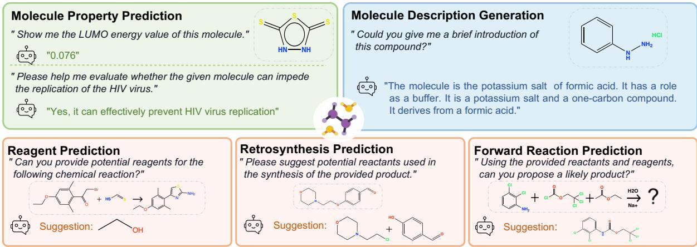
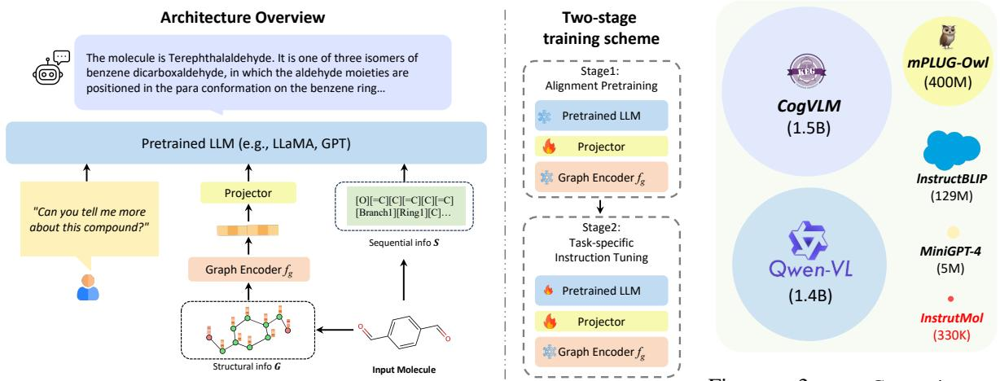
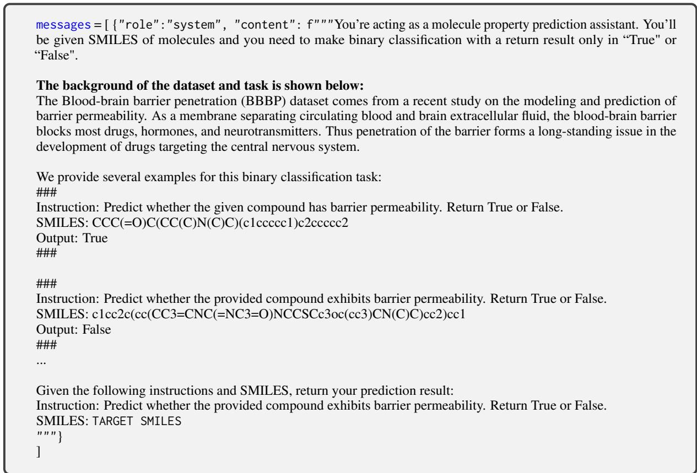
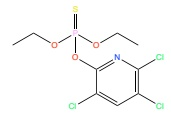
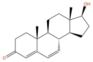
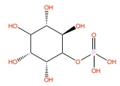
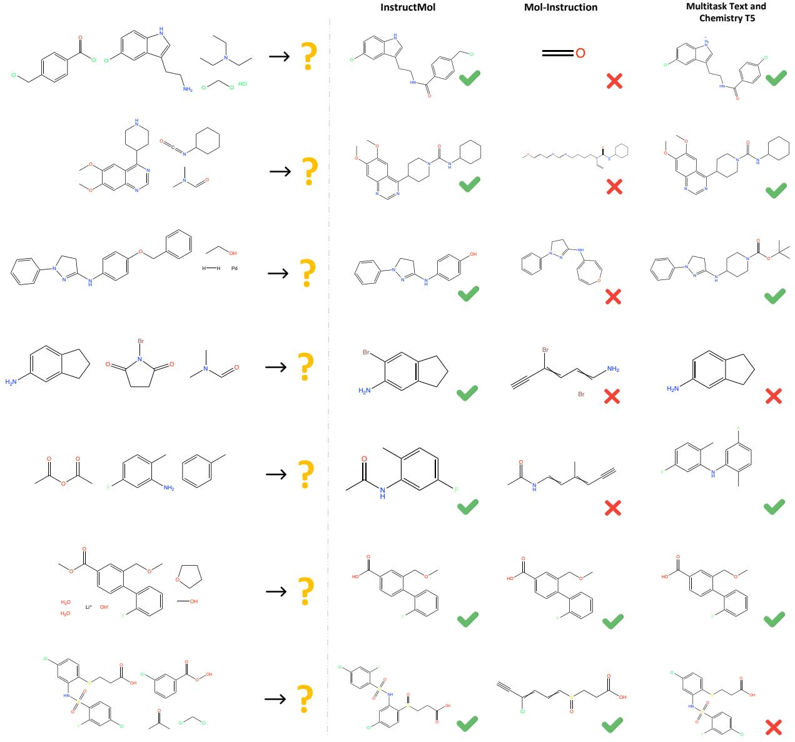
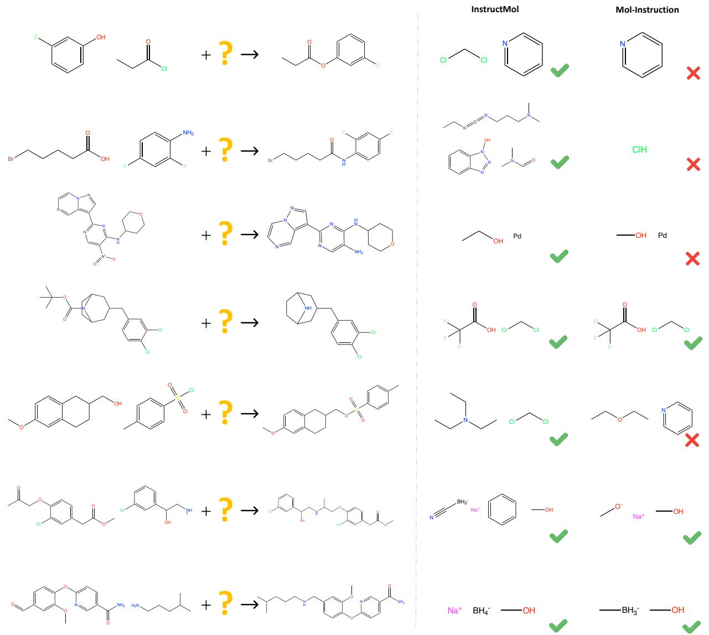
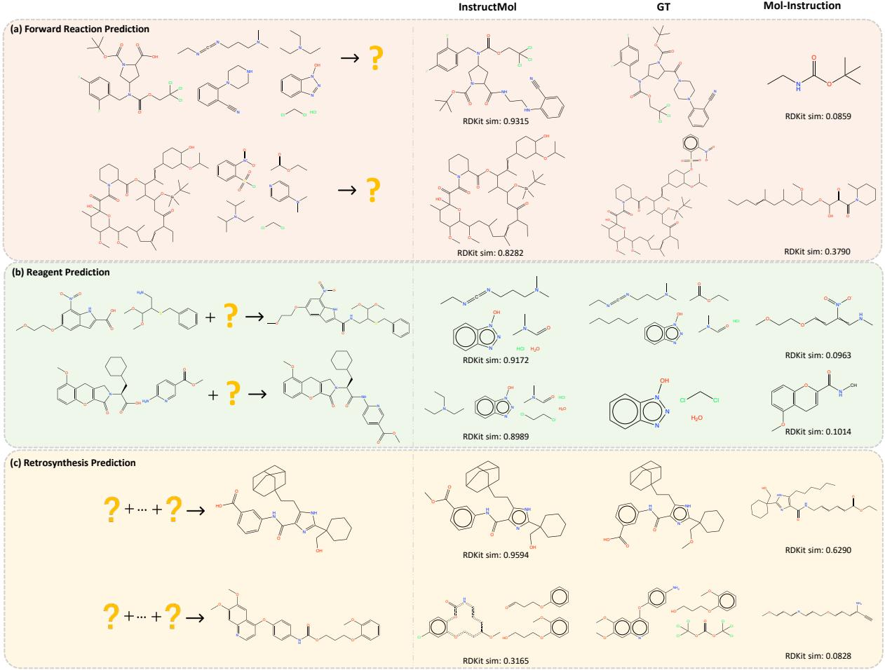

# InstructMol: Multi-Modal Integration for Building a Versatile and Reliable Molecular Assistant in Drug Discovery

He Cao1,2\*, Zijing Liu1, Xingyu Lu1,3, Yuan Yao2, Yu Li1† 1International Digital Economy Academy (IDEA) 2Hong Kong University of Science and Technology 3Tsinghua Shenzhen International Graduate School, Tsinghua University hcaoaf@connect.ust.hk luxy22@mails.tsinghua.edu.cn yuany@ust.hk {liuzijing,liyu}@idea.edu.cn

## Abstract

The rapid evolution of artificial intelligence in drug discovery encounters challenges with generalization and extensive training, yet Large Language Models (LLMs) offer promise in reshaping interactions with complex molecular data. Our novel contribution, InstructMol1, a multi-modal LLM, effectively aligns molecular structures with natural language via an instruction-tuning approach, utilizing a twostage training strategy that adeptly combines limited domain-specific data with molecular and textual information. InstructMol showcases substantial performance improvements in drug discovery-related molecular tasks, surpassing leading LLMs and significantly reducing the gap with specialists, thereby establishing a robust foundation for a versatile and dependable drug discovery assistant.

## 1 Introduction

The drug discovery process, from target identification to clinical trials, requires substantial investments in time and expertise for optimized exploration of chemical spaces (Coley, 2020). Artificial intelligence-driven drug discovery (AIDD) facilitates a data-driven modeling approach (Kim et al., 2021; Rifaioglu et al., 2018; Askr et al., 2022; Feng et al., 2024) and helps to understand the complex molecular space, reducing iterative testing and minimizing failure rates. Previous approaches involved employing task-specific models trained on labeled data, which had restricted adaptability and required laborious training for individual tasks. The advent of Large Language Models (LLMs (Devlin et al., 2019; Raffel et al., 2019; Brown et al., 2020)) like

ChatGPT (OpenAI, 2023a), trained through selfsupervised learning on a large amount of unlabeled text data, has shown strong generalization capabilities across various tasks. Additionally, these models can attain professional-level proficiency in specific domains through proper fine-tuning. Hence, developing a ChatGPT-like molecular assistant AI can revolutionize human interactions with complex molecule structures. A unified model can address various needs, such as understanding molecule structures, answering drug-related queries, aiding synthesis planning, facilitating drug repurposing, etc., as shown in Figure 1.

Numerous studies have explored multimodal LLMs for visual understanding (Liu et al., 2023b; Ye et al., 2023; Zhu et al., 2023). However, when it comes to the domain of molecular research, there are several challenges that need to be addressed, including:

• Crafting a molecule representation integrates with LLMs alongside textual modalities;

• Requiring extensive datasets encompasses molecule structures, inherent properties, reactions, and annotations related to biological activities;

• Developing an effective training paradigm that guides LLMs in utilizing molecular representations and adapting to various tasks.

Several prior studies (Liang et al., 2023; Luo et al., 2023c; Fang et al., 2023) have fine-tuned generalist LLMs to develop foundational models within the molecular domain. Despite their enhancement to the original generalist LLM, these preceding works have unveiled several issues:

• Insufficient alignment between modalities.

• The consideration of an optimal molecular structure encoder remains unexplored.

  
Figure 1: Empowering LLMs with molecular modalities to unlock the drug discovery domain and serve as assistants in molecular research.

• A rudimentary design of the training pipeline neglects the update of LLMs’ knowledge.

These issues lead to a significant disparity in the performance of current AI assistants across various practical tasks compared to traditional specialist models.

To address these problems, we introduce InstructMol (Figure 2), a multi-modality instructiontuning-based LLM. This model aligns molecular graphs and chemical sequential modalities with humans’ natural language. Using a calibrated collection of molecule-related instruction datasets and a two-stage training scheme, InstructMol effectively leverages the pre-trained LLM and molecule graph encoder for molecule-text alignment. In the first alignment pretraining stage, we employ moleculedescription pairs to train a lightweight and adaptable interface, which is designed to project the molecular node-level representation into the textual space that the LLM can understand. Subsequently, we finetune with multiple task-specific instructions. During this process, we freeze the molecule graph encoder and train low-rank adapters (LoRA (Hu et al., 2021)) on the LLM to adapt our model to various scenarios. This efficient approach enables the seamless integration of molecular and textual information, promoting the development of versatile and robust cognitive abilities in the molecular domain.

To illustrate the capabilities of our model, we perform experiments that span three facets of drug discovery-related tasks, including compound property prediction, molecule description generation, and analysis of chemical reactions involving compounds. These tasks serve as robust benchmarks to assess the model’s ability to deliver useful and accurate knowledge feedback in practical drug discovery scenarios. The results in all experiments consistently indicate that our model significantly improves the performance of LLMs in tasks related to the understanding and design of molecular compounds. Consequently, this advance effectively reduces the disparity with specialized models. Our main contributions can be summarized as follows:

• We introduce InstructMol, a molecular-related multi-modality LLM, representing a pioneering effort in bridging the gap between molecular and textual information.

• In the context of a scarcity of high-quality annotated data in the drug discovery domain, our approach strives to efficiently extract molecular representations (targets on Issue2). Employing a two-stage instruction tuning paradigm enhances the LLM’s understanding of molecular structural and sequential knowledge (targets on Issue1 and Issue3).

• InstructMol enables swift fine-tuning, generating lightweight checkpoints (used as plugins) for cross-modality tasks. It provides the flexibility to load or combine functionalities through plugins, retaining the open dialogue and reasoning capabilities of a general LLM.

• We evaluate our model through multiple practical assessments, demonstrating its substantial improvement compared to state-of-the-art LLMs. Our work lays the foundation for creating a versatile and reliable molecular research assistant in the drug discovery domain.

  
Figure 2: Overview of InstructMol model architecture design and two-stage training paradigm. The example molecule in the figure is Terephthalaldehyde (Sonmez et al., 2012) (CID 12173).  
Figure 3: Comparison of biomolecule-domain moleculetext dataset scale with existing general domain vision-language datasets.

## 2 Related Work

## 2.1 Multimodal Instruction Tuning

There have been notable advancements in LLMs (OpenAI, 2023a; Touvron et al., 2023a,b; Chiang et al., 2023; Zeng et al., 2022a; Anil et al., 2023) achieved through scaling up model and data size. Consequently, LLMs have shown remarkable performances in zero/few-shot NLP tasks (OpenAI, 2023a; Wei et al., 2021; Ouyang et al., 2022). A key technique in LLMs is instruction tuning, where pre-trained LLMs are fine-tuned on instruction-formatted datasets (Wei et al., 2021), allowing them to generalize to new tasks. Recently, with the emergence of large foundation models in various domains, several efforts have been made to transition from unimodal LLMs to multimodal LLMs (MLLMs) (OpenAI, 2023b; Liu et al., 2023b; Zhu et al., 2023; Ye et al., 2023; Bai et al., 2023). The primary research on multimodal instruction tuning (M-IT) includes the following (Yin et al., 2023): Constructing effective M-IT datasets (adapting existing benchmarks datasets (Zhu et al., 2023; Liu et al., 2023b; Dai et al., 2023) or using self-instruction (Liu et al., 2023b; Wang et al., 2023; Li et al., 2023a; Zhang et al., 2023)), Bridging diverse modalities (project-based (Liu et al., 2023b; Li et al., 2023a; Pi et al., 2023) and querybased (Wang et al., 2023; Zhu et al., 2023; Ye et al., 2023)) and Employing reliable evaluation methods (GPT-scoring (Liu et al., 2023b; Li et al., 2023a; Chen et al., 2023; Luo et al., 2023a), manual scoring (Ye et al., 2023; Yang et al., 2023), or closed-set measurement (Liu et al., 2023b; Li et al., 2023a; Zhu et al., 2023; Luo et al., 2023a; Zhu et al., 2023;

Dai et al., 2023; Chen et al., 2023)). Most current MLLM research focuses on integrating vision and language while combining other modalities(e.g., graphs (Tang et al., 2023; Liu et al., 2023c)) with natural language remains nascent.

## 2.2 Molecule Foundation Models

The foundation models, trained on vast unlabeled data, serve as a paradigm for adaptable AI systems across diverse applications. In the single modality domain, researchers are exploring the molecule representations from diverse sources, such as 1D sequences (e.g., SMILES (Chithrananda et al., 2020; Irwin et al., 2021; Wang et al., 2019)), 2D molecular graphs (Wang et al., 2021; Hu et al., 2019; You et al., 2020), 3D geometric conformations (Stärk et al., 2021; Liu et al., 2021; Stärk et al., 2021), or textual information from biomedical literature (Gu et al., 2020; Lee et al., 2019; Beltagy et al., 2019). In the realm of multimodal analysis, research initiatives employ diverse approaches. These include encoder-decoder models to establish intermodal bridges (Edwards et al., 2022; Christofidellis et al., 2023; Lu and Zhang, 2022a), joint generative modeling of SMILES and textual data (Zeng et al., 2022b), and the adoption of contrastive learning for integrating molecular knowledge across varying modalities (Su et al., 2022; Luo et al., 2023b; Liu et al., 2022, 2023d).

## 2.3 Molecule-related LLMs

Given the rapid progress in LLMs, some researchers are considering developing ChatGPT-like AI systems for drug discovery. Their goal is to offer guidance for optimizing lead compounds, accurately predicting drug interactions, and improving the comprehension of structure-activity relationships (Liang et al., 2023). Several initiatives have already commenced to create instruction datasets within the biomolecular domain (Fang et al., 2023; Lu et al., 2024). They aim to utilize instruction tuning techniques to enable LLMs, initially trained on general domain data, to acquire knowledge about biomolecular science (Wu et al., 2023; Luo et al., 2023c). Additionally, other researchers are investigating methods to align structural data with textual information, bridging the gap between biological data and natural language (Luo et al., 2023c; Liang et al., 2023; Cao et al., 2024b).

Remark. Our work involves molecule foundation models and multimodal language models (LLMs). It uses an efficient molecule graph encoder to capture structural information and integrates it with sequential data into a generalist LLM. InstructMol enables the LLM to understand molecule representations and generalize to various molecular tasks.

## 3 Method

## 3.1 Multimodal Instruction Tuning

Instruction tuning refers to finetuning pretrained LLMs on instruction datasets, enabling generalization to specific tasks by adhering to new instructions. Multimodal instruction tuning integrates modalities like images and graphs into an LLM, expanding the model’s capability to accommodate multiple modalities.

A multimodal instruction tuning sample comprises an instruction I (e.g., "Describe the compound in detail") and an input-output pair. In the context of our study, the input is one or more modalities derived from a molecule (e.g., molecule graph and sequence), collectively denoted as $M$ . The output R represents the textual response to the instruction conditioned on the input. The model aims to predict an answer given the instruction and multimodal input: $\tilde { R } = f ( I , M ; \theta )$ , where θ are the parameters of MLLM. The training objective is typically the same auto-regressive objective as the LLM pre-training stage, which can be expressed as: $\begin{array} { r } { \mathcal { L } ( \theta ) \stackrel { \mathbf { \bar { \mathbf { \alpha } } } } { = } - \sum _ { i = 1 } ^ { L } \mathbf { \bar { \Phi } } } \end{array}$ log $p ( R _ { i } | I , M , R _ { < i } ; \theta )$ , where L is the target $R \ ' \mathrm { s }$ token length.

## 3.2 Construction of Molecular Instruction

Data Collection. In the field of biomolecular research, there is a noticeable scarcity of molecular datasets with comprehensive text annotations when compared to the vision-language domain, as depicted in Figure 3. While it is possible to construct instruction datasets in general domains by adapting benchmarks or using self-instruction, the application of these methods in the biomolecular domain presents challenges. This difficulty arises from two main factors: 1) biomolecular domain annotation demands expert knowledge and entails substantial complexity; 2) the knowledge within this domain spans a broad range of subjects, including structural biology, computational chemistry, and chemical synthesis processes.

In our efforts, we have gathered recent openaccess text-molecule pairs datasets and also independently constructed a portion of instruction data suitable for property prediction. Table 5 illustrates the composition of the data utilized during the twostage training process.

Molecule Input. We utilize both the structure and sequence information of a molecule. We encode the structural information of a molecule as a graph, denoted by $\mathcal { G } = ( \nu , \mathcal { E } , \mathcal { A } , \mathcal { X } )$ , where V is the set of atoms (nodes) and $| \nu | = N$ is the total number of atoms. The set of edges E includes all chemical bonds, and $\mathcal { A } \in \mathbb { R } ^ { N \times N }$ is the adjacency matrix. Additionally, $\boldsymbol { \mathcal { X } } \in \mathbb { R } ^ { N \times F }$ encompasses attributes associated with each node, where F is the feature dimension. With a Graph Encoder $f _ { g } ,$ , we extract a graph representation $\mathbf { Z } _ { G } \in \mathbb { R } ^ { N \times d }$ at the node level, effectively describing the inherent structure of the molecule. Simultaneously, we consider encoding the sequential information of the molecule, denoted as $S ,$ as a supplementary source of structural information. To enhance the robustness of sequential molecular descriptors and mitigate syntactic and semantic invalidity present in SMILES (Weininger, 1988), we employ SELFIES (Krenn et al., 2019) as $S ,$ which is designed for mapping each token to a distinct structure or reference.

Input Formulation. We formulate a molecule-text pair $( \mathbf { X } _ { M } \& \mathbf { X } _ { c } )$ to the corresponding instructionfollowing version like Human: $\mathbf { X } _ { I } { < } \mathsf { m o l } { > } \mathbf { X } _ { M }$ <STOP> Assistant: $\mathbf { X } _ { A } { < } \mathsf { S T O P > }$ . The $\mathbf { X } _ { M }$ represents the molecule, including the molecule graph $\mathbf { X } _ { G }$ and optionally the SELFIES $\mathbf { X } _ { S }$ $\mathbf { X } _ { I }$ denotes for the instruction and $\mathbf { X } _ { A }$ is the answer. For a given answer sequence of length $L _ { : }$ , our optimization objective is to maximize the probability of generating the target answers $X _ { A }$ by maximizing:

$$
p ( { \mathbf { X } } _ { A } | { \mathbf { X } } _ { M } , { \mathbf { X } } _ { I } ) = \prod _ { i = 1 } ^ { L } p _ { \theta } ( x _ { i } | { \mathbf { X } } _ { G } \parallel { \mathbf { X } } _ { S } \ , { \mathbf { X } } _ { I } , { \mathbf { X } } _ { A , < i } ) .\tag{1}
$$

To diversify $\mathbf { X } _ { I }$ , we craft clear task descriptions and use GPT-3.5-turbo to generate varied questions, enhancing instructions’ robustness. Note that we simply concatenate $\mathbf { X } _ { G }$ and $\mathbf { X } _ { S }$ along the length-dimension. More complex fusion methods require additional loss designs for supervision (Liu et al., 2023d; Luo et al., 2023b), but here we prioritize simplicity.

## 3.3 Architecture

Molecular Encoder. The molecular graph encoder, $f _ { g } ,$ , needs to efficiently extract node representations while preserving the molecular graph’s connectivity information. It is crucial that $f _ { g }$ inherently establishes a pre-alignment in the representation space with the text space to facilitate $\mathbf { Z } _ { G }$ in the following alignment stage. Taking inspiration from common practices in the Vision Large Language Models (VLLM) domain (Bai et al., 2023; Liu et al., 2023b; Ye et al., 2023), where models like ViT initialized from CLIP (Radford et al., 2021) serve as vision encoders, we optimize for MoleculeSTM’s graph encoder as $f _ { g }$ (Liu et al., 2022), instead of GraphMVP used by prior methodologies (Liang et al., 2023; Luo et al., 2023c). The MoleculeSTM graph encoder model is obtained through molecular-textual contrastive training, mitigating the requirement for an extensive amount of paired data during training to align different modalities.

Light-weight Alignment Projector. To map graph features into the word embedding space, we utilize a trainable projection matrix W to transform $\mathbf { Z } _ { G }$ into $\mathbf { X } _ { G }$ , ensuring that it has the same dimension as the word embedding space. Since the selected $f _ { g }$ has undergone partial alignment with the text through contrastive training, we believe a straightforward linear projection will meet the subsequent alignment needs. For approaches like gated cross-attention (Alayrac et al., 2022), Q-former (et.al., 2023), or position-aware visionlanguage adapters (Bai et al., 2023), they require a large number of pairs for pretraining alignment, which is typically unavailable in the biomolecular domain. We therefore do not explore these more complex alignment methods.

Large Language Model. InstructMol incorporates a pre-trained LLM as its foundational component.

We optimize for Vicuna-7B (Chiang et al., 2023) as the initialized weights, which is derived from LLaMA (Touvron et al., 2023a) through supervised instruction finetuning.

## 3.4 Two-Stage of Instruction Tuning

As illustrated in Figure 2, the training process of InstructMol consists of two stages: alignment pretraining and instruction fine-tuning training.

Alignment Pretraining. In the first stage, we aim to align the modality of molecules with text, ensuring that the LLMs can perceive both the structural and sequential information of molecules and integrate molecular knowledge into their internal capabilities.

We primarily employ a dataset consisting of molecule-text pairs sourced from PubChem (Kim et al., 2022). Each molecule structure is associated with a textual description elucidating chemical and physical properties or high-level bioactivity information. The construction of the PubChemDataset predominantly follows the MoleculeSTM (Liu et al., 2022) pipeline. We meticulously remove molecules with invalid descriptions and syntactic errors in their molecular descriptors. To ensure fairness, we also eliminate compounds that might appear in the downstream molecule-caption test set. This results in a dataset of 330K molecule-text pairs. Subsequently, we adopt a self-instructionlike approach to generate a diverse set of task descriptions as instructions.

During training, to prevent overfitting and leverage pre-trained knowledge, we freeze both the graph encoder and LLM, focusing solely on finetuning the alignment projector. After a few epochs of training, our aim is that the projector has successfully learned to map graph representations to graph tokens, aligning effectively with text tokens.

Task-specific Instruction Tuning. In the second stage, we target three distinct downstream scenarios. We advocate for task-specific instruction tuning to address the particular constraints inherent in various drug-discovery-related tasks. For compound property prediction, we utilize the quantum mechanics properties instruction dataset from Fang et al. (2023) for regression prediction and the MoleculeNet dataset (Wu et al., 2017) for property classification. For chemical reaction analysis, we incorporate forward reaction prediction, retrosynthesis analysis, and reagent prediction tasks, all derived from Fang et al. (2023). To assess the model’s proficiency in translating between natural language and molecular expression, we integrate ChEBI-20 (Edwards et al., 2021) for the molecule description generation task. For each task, corresponding instruction templates are designed.

During training, we utilize the checkpoint of the alignment projector that was trained in the first stage as initialization. We only keep the molecular encoder $f _ { g }$ frozen and continue to update the pre-trained weights of the projector and the LLM. To adapt the LLM effectively for diverse tasks, we employ low-rank adaptation (i.e., LoRA (Hu et al., 2021)), opting against full-tuning to mitigate potential forgetting issues. In practical applications, we have the flexibility to substitute different adaptors based on specific scenario requirements or combine multiple adaptors to integrate knowledge, thereby showcasing the model’s modularization capabilities. Moreover, LoRA allows the LLM to retain the inherent capacity for common-sense reasoning in dialogue (as shown in Table 13).

## 4 Experiments

We use a graph neural network as the molecule graph encoder $( f _ { g } )$ which is initialized with the MoleculeSTM graph encoder, pre-trained through molecular graph-text contrastive learning. We employ Vicuna-v-1.3-7B (Chiang et al., 2023) as the base LLM. More specifically, InstructMol+GS denotes we inject both molecular graph tokens and sequence tokens into the input, while Instruct-Mol+G means only incorporates graph tokens. For Instruct-S, which utilizes only a 1D molecular sequence as input, it corresponds to the fine-tuning of the base large language model, Vicuna-7B, directly on downstream tasks. In the following sections, the results of Vicuna-v1.3-7B will consistently be used to represent the performance of Instruct-S. Implementation details about model settings and training hyper-parameters can be referred to Appendix B.

## 4.1 Property Prediction Task

Experiment Setup. Property prediction intends to forecast a molecule’s intrinsic physical and chemical properties from its structural or sequential characteristics. In the context of the regression task, we undertake experiments on the Property Prediction dataset from Fang et al. (2023), where the objective is to predict the quantum mechanic’s properties of a given molecule, specifically including HOMO, LUMO, and the HOMO-LUMO gap (Ramakrishnan et al., 2014b). For the classification task, we incorporate three binary classification datasets of molecular biological activity, namely BACE, BBBP, and HIV. In classification, all dataset samples are converted into an instruction format and we use the recommended splits from (Ramsundar et al., 2019). Each item comprises an instruction explaining the property for prediction and the representation of the molecule. Subsequently, models are tasked with generating a single prediction (“yes" or “no"). Scaffold splits are used for the classification task, and the experiments are conducted with three random seeds, yielding low variances in the reported mean values.

<table><tr><td>METHOD</td><td>HOMO↓</td><td>LUMO↓</td><td>∆∈↓</td><td>AVG↓</td></tr><tr><td colspan="5">LLM Based Generalist Models</td></tr><tr><td>Alpaca† (Taori et al., 2023)</td><td></td><td></td><td></td><td>322.109</td></tr><tr><td>Baize† (Xu et al., 2023)</td><td></td><td></td><td></td><td>261.343</td></tr><tr><td>Galactica† (Taylor et al., 2022)</td><td></td><td></td><td></td><td>0.568</td></tr><tr><td>LLama-2-7B (5-shot ICL)</td><td>0.7367</td><td>0.8641</td><td>0.5152</td><td>0.7510</td></tr><tr><td>Vicuna-13B (5-shot ICL)</td><td>0.7135</td><td>3.6807</td><td>1.5407</td><td>1.9783</td></tr><tr><td>Mol-Instruction</td><td>0.0210</td><td>0.0210</td><td>0.0203</td><td>0.0210</td></tr><tr><td>InstructMol-G</td><td>0.0060</td><td>0.0070</td><td>0.0082</td><td>0.0070</td></tr><tr><td>InstructMol-GS</td><td>0.0048</td><td>0.0050</td><td>0.0061</td><td>0.0050</td></tr></table>

Table 1: Results (MAE in hartree unit) for QM9 property regression tasks. † denotes few-shot in-context learning (ICL) results from Fang et al. (2023). ∆ϵ denotes HOMO-LUMO energy gap.
<table><tr><td>METHOD # MOLECULES</td><td>BACE↑ 1513</td><td>BBBP↑ 2039</td><td>HIV ↑ 41127</td></tr><tr><td colspan="4">Specialist Models</td></tr><tr><td>ChemBERTa v2 (Walid et al., 2022)</td><td>73.5</td><td>69.8</td><td>79.3</td></tr><tr><td>DMP(TF+GNN) (Jinhua et al., 2023)</td><td>89.4</td><td>77.8</td><td>81.4</td></tr><tr><td>KV-PLM (Zeng et al., 2022b)</td><td>78.5</td><td>70.5</td><td>71.8</td></tr><tr><td>GraphCL (You et al., 2020)</td><td>75.3</td><td>69.7</td><td>78.5</td></tr><tr><td>GraphMVP-C (Liu et al., 2021)</td><td>81.2</td><td>72.4</td><td>77.0</td></tr><tr><td>MoMu (Su et al., 2022)</td><td>76.7</td><td>70.5</td><td>75.9</td></tr><tr><td>MolFM (Luo et al., 2023b)</td><td>83.9</td><td>72.9</td><td>78.8</td></tr><tr><td>Uni-Mol (Zhou et al., 2023)</td><td>85.7</td><td>72.9</td><td>80.8</td></tr><tr><td colspan="4">LLM Based Generalist Models</td></tr><tr><td>Galactica-6.7B</td><td>58.4</td><td>53.5</td><td>72.2</td></tr><tr><td>Vicuna-v1.5-13b-16k (4-shot)</td><td>49.2</td><td>52.7</td><td>50.5</td></tr><tr><td>Vicuna-v1.3-7B*</td><td>68.3</td><td>60.1</td><td>58.1</td></tr><tr><td>LLama-2-7B-chat*</td><td>74.8</td><td>65.6</td><td>62.3</td></tr><tr><td>MolCA(1D) (Liu et al., 2023f)</td><td>79.3</td><td>70.8</td><td></td></tr><tr><td>MolCA(1D + 2D) (Liu et al., 2023f)</td><td>79.8</td><td>70.0</td><td></td></tr><tr><td>Instruct-G</td><td>84.3 (±0.6)</td><td>68.6 (±0.3)</td><td>74.0 (±0.1)</td></tr><tr><td>Instruct-GS</td><td>82.1 (±0.1)</td><td>72.4 (±0.3)</td><td>68.9 (±0.3)</td></tr></table>

Table 2: ROC-AUC of molecular property prediction tasks (classification) on MoleculeNet (Wu et al., 2017) benchmarks. ∗: use LoRA tuning. We indicate the best performance among domain specialist models by underlining the results, while the best performance among LLM-based generalist models is highlighted in bold.

Results. Our models are compared against baselines on the test set for regression, measured by Mean Absolute Error (MAE) in Table 1. Compared to previous single-modal instruction-tuned LLM-based methods (Fang et al., 2023), Instruct-Mol demonstrates a further improvement in the regression task. ROC-AUC scores for classification outcomes are presented in Table 2. In comparison to LLM-based generalist models, both the Galactica (Taylor et al., 2022) series models trained on an extensive scientific literature dataset and the single-modality LLM fine-tuned with task-specific instructions (Fang et al., 2023), InstructMol demonstrates consistent improvements in accuracy across the three task datasets. However, our predictive results still exhibit some disparity compared to expert models (Zhou et al., 2023; Liu et al., 2021) specifically trained on a vast molecule structure dataset. Further, InstructMol performs worse than GIN on the imbalanced HIV dataset with a long-tail distribution. Previous research (Kandpal et al., 2023) highlights LLMs’ challenges in learning long-tail knowledge. To tackle this, strategies like resampling or class reweighting can be employed.

<table><tr><td>MODEL</td><td>BLEU-2↑</td><td>BLEU-4↑</td><td>ROUGE-1↑</td><td>ROUGE-2↑</td><td>ROUGE-L↑</td><td>METEOR↑</td></tr><tr><td>Specialist Models</td><td></td><td></td><td></td><td></td><td></td><td></td></tr><tr><td>MolT5-base (Edwards et al., 2022)</td><td>0.540</td><td>0.457</td><td>0.634</td><td>0.485</td><td>0.568</td><td>0.569</td></tr><tr><td>MoMu (MolT5-base) (Su et al., 2022)</td><td>0.549</td><td>0.462</td><td></td><td></td><td></td><td>0.576</td></tr><tr><td>MolFM (MolT5-base) (Luo et al., 2023b)</td><td>0.585</td><td>0.498</td><td>0.653</td><td>0.508</td><td>0.594</td><td>0.607</td></tr><tr><td>MolXPT (Liu et al., 2023e)</td><td>0.594</td><td>0.505</td><td>0.660</td><td>0.511</td><td>0.597</td><td>0.626</td></tr><tr><td>GIT-Mol-graph (Liu et al., 2023d)</td><td>0.290</td><td>0.210</td><td>0.540</td><td>0.445</td><td>0.512</td><td>0.491</td></tr><tr><td>GIT-Mol-ŠMILES (Liu et al., 2023d)</td><td>0.264</td><td>0.176</td><td>0.477</td><td>0.374</td><td>0.451</td><td>0.430</td></tr><tr><td>GIT-Mol-(graph+SMILES) (Liu et al., 2023d)</td><td>0.352</td><td>0.263</td><td>0.575</td><td>0.485</td><td>0.560</td><td>0.430</td></tr><tr><td>MolCA, Galac1.3B (Liu et al., 2023f)</td><td>0.620</td><td>0.531</td><td>0.681</td><td>0.537</td><td>0.618</td><td>0.651</td></tr><tr><td>Text+Chem T5-augm-base (Christofidellis et al., 2023)</td><td>0.625</td><td>0.542</td><td>0.682</td><td>0.543</td><td>0.622</td><td>0.648</td></tr><tr><td>Retrieval Based LLMs</td><td></td><td></td><td></td><td></td><td></td><td></td></tr><tr><td>GPT-3.5-turbo (10-shot MolReGPT) (Li et al., 2023b)</td><td>0.565</td><td>0.482</td><td>0.623</td><td>0.450</td><td>0.543</td><td>0.585</td></tr><tr><td>GPT-4-0314 (10-shot MolReGPT) (Li et al., 2023b)</td><td>0.607</td><td>0.525</td><td>0.634</td><td>0.476</td><td>0.562</td><td>0.610</td></tr><tr><td>LLM Based Generalist Models</td><td></td><td></td><td></td><td></td><td></td><td></td></tr><tr><td>GPT-3.5-turbo (zero-shot) (Li et al., 2023b)</td><td>0.103</td><td>0.050</td><td>0.261</td><td>0.088</td><td>0.204</td><td>0.161</td></tr><tr><td>BioMedGPT-10B (Luo et al., 2023c)</td><td>0.234</td><td>0.141</td><td>0.386</td><td>0.206</td><td>0.332</td><td>0.308</td></tr><tr><td>Mol-Instruction (Fang et al., 2023)</td><td>0.249</td><td>0.171</td><td>0.331</td><td>0.203</td><td>0.289</td><td>0.271</td></tr><tr><td>InstructMol-G</td><td>0.466</td><td>0.365</td><td>0.547</td><td>0.365</td><td>0.479</td><td>0.491</td></tr><tr><td>InstructMol-GS</td><td>0.475</td><td>0.371</td><td>0.566</td><td>0.394</td><td>0.502</td><td>0.509</td></tr></table>

Table 3: Results of molecular description generation task on the test split of ChEBI-20.

## 4.2 Molecule Description Generation Task

Experiment Setup. Molecule description generation encapsulates a comprehensive molecule depiction, covering its structure, properties, biological activity, and applications based on molecular descriptors. This task is more complex than classification or regression, providing a robust measure of the model’s understanding of molecules. We convert the training subset of the ChEBI-20 dataset (Edwards et al., 2021) into an instructional format and subsequently perform fine-tuning based on these instructions. Our assessment uses evaluation metrics aligned with (Edwards et al., 2022).

Baselines. Three kinds of models are used as baselines, including: 1) MolT5-like expert models (Edwards et al., 2022; Liu et al., 2023e) and the models employing MolT5 as a decoder (Su et al., 2022;

Luo et al., 2023b; Liu et al., 2023d; Christofidellis et al., 2023), 2) models based on retrieval methods that utilize ChatGPT/GPT-4 as a foundational component (Li et al., 2023b), 3) other models derived through instruction-tuning with LLMs to achieve generalist unimodal (Fang et al., 2023) and multimodalities (Luo et al., 2023c) capabilities.

Results. Table 3 presents the overall results for molecule description generation. Our model outperforms other generalist LLM-based models in generating precise, contextually relevant molecule descriptions. We observe that incorporating both molecule structural information and sequential information in the input yields higher-quality results (∼2% improvement) than providing structural information alone. While expert models demonstrate better efficacy in comparison, it is noteworthy that they are constrained by their training schemes and lack the versatile capabilities inherent in our approach. Retrieval methods, supported by ChatGPT/GPT-4, demonstrate strong capabilities. Our future efforts will focus on integrating these methods to improve the accuracy and credibility of generated content.

## 4.3 Chemical Reaction-related task

Experiment Setup. Traditionally, identifying chemical reactions relied on intuition and expertise. Integrating deep learning for predicting reactions can accelerate research and improve drug discovery. The general format of a chemical reaction is "reactant → reagent → product". Here we mainly focus on three tasks: 1) Forward Reaction Prediction: predict the probable product(s) given specific reactants and reagents; 2) Reagent Prediction: ascertain the suitable catalysts, solvents, or ancillary substances required for a specific chemical reaction given reactant(s) and product(s); 3) Retrosynthesis: anticipate deducing potential precursor molecule(s) from given product(s).

We utilize the dataset sourced from Fang et al. (2023), training it on the pre-defined training split and evaluating its performance on the test set. The performance is assessed by metrics like Fingerprint Tanimoto Similarity (FTS), BLEU, Exact Match, and Levenshtein distance to measure the similarity between ground truth and prediction. We also measure the validity of predicted molecules using RDKit.

Results. Table 4 reports the outcomes of tasks related to chemical reactions. It is evident that InstructMol outperforms the baselines significantly. The results obtained by generalist LLMs are derived from Fang et al. (2023), and they exhibit a pronounced inability to comprehend any chemical reaction prediction task, struggling to generate valid molecule(s) as answers. Mol-Instruction (Fang et al., 2023), employing Llama2 (Touvron et al., 2023b) as the base LLM, is jointly trained on multiple molecule-oriented instruction datasets. In addition, we supplement this by adopting the same training settings but exclusively training on chemical reaction-related datasets. Through comparison, InstructMol, as a multi-modality LLM, demonstrates a superior understanding of the task compared to single-modality models, confirming its effectiveness as a chemical reaction assistant.

## 4.4 Ablation Studies

In this subsection, we conduct an ablation study to investigate the architecture and training scheme design of our proposed framework. We explore variations from several perspectives and validate them on the task of molecule description generation. The ablation results are presented in Appendix Table 10 as follows: 1) Employing an MLP connector instead of a linear projector. Drawing inspiration from the observations made in (Liu et al., 2023a), we attempt to change the alignment projector to a two-layer MLP, demonstrating an enhancement in the model’s multimodal capabilities. 2) Scaling up the LLM to 13B. The results indicate that scaling up the LLM only yields minor improvements. Thus, it substantiates the assertion that, for specific domains characterized by dataset scarcity, employing a 7B size model is sufficiently efficient for modeling. 3) Replacing the graph encoder $f _ { g }$ with a single-modality module (i.e., GraphMVP (Liu et al., 2021) with the same parameter size and architecture as we used). The results affirm our perspective: utilizing an encoder pre-aligned with text enhances the effectiveness of modality alignment. 4) Skipping alignment stage-1. We included a comparison where stage-1 was skipped entirely. The results demonstrate that separating projector training (stage-1) from downstream fine-tuning (stage-2) yields better performance. 5) Freezing the LLM in the second stage. Adopting a strategy akin to BioMedGPT10B (Luo et al., 2023c) and DrugChat (Liang et al., 2023), we choose not to update LLM weights in the second stage. The training outcomes reveal challenges in convergence and an inability to complete normal inference, thus demonstrating the necessity for the instruct-tuning stage to adapt LLM knowledge to the specific task.

## 5 Discussion and Conclusion

Conclusion. We propose InstructMol, a novel multi-modality foundational model that connects molecular modalities with human natural language. By integrating structural and sequential information of molecules into LLMs through a dualstage alignment pre-training and instruction tuning paradigm, we enhance the general LLM’s capacity to comprehend and interpret molecular information, specifically in drug discovery tasks. Extensive experimental evaluation confirms the effectiveness of our model architecture and training approach, demonstrating its potential for practical applications in the field of drug discovery.

Future Work. Integrating multiple modalities with LLMs significantly enhances molecular research within this domain and is a valuable direction to explore. However, several challenges exist. The scale and quality of relevant datasets are as good as those in the vision and language community. The lack of well-defined task objectives poses a challenge. A more scientifically robust evaluation is needed to address issues such as hallucinations in generation outputs.

## 6 Limitations

In our investigation, several limitations have emerged. Firstly, the scale and quality of the dataset pose significant constraints; the scarcity of high-quality annotated domain data may hinder the model’s ability to generalize across the diverse and intricate molecular landscapes encountered in real-world applications. Secondly, the integration and evaluation of multiple modalities have also revealed areas needing improvement. Further refinement is necessary to ensure robust alignment and utilization of different molecule modalities within the model, enhancing its capacity to interpret and generate responses accurately across the molecular domain. Lastly, our base LLM originates from a general-domain model. However, the absence of specialized LLMs tailored specifically for chemistry and molecular science, like models such as LLaMA, highlights the need for larger, more versatile domain-specific LLMs to enhance performance and expand applications. Addressing these challenges is pivotal for enhancing the model’s reliability and extending its utility in advancing drug discovery methodologies.

<table><tr><td>MODEL</td><td>EXACT↑</td><td>BLEU↑</td><td>LEVENSHTEIN↓</td><td>RDK FTS↑</td><td>MACCS FTS↑</td><td>MORGAN FTS↑</td><td>VALIDITY↑</td></tr><tr><td colspan="8">Reagent Prediction</td></tr><tr><td>Alpaca† (Taori et al., 2023)</td><td>0.000</td><td>0.026</td><td>29.037</td><td>0.029</td><td>0.016</td><td>0.001</td><td>0.186</td></tr><tr><td>Baize† (Xu et al., 2023)</td><td>0.000</td><td>0.051</td><td>30.628</td><td>0.022</td><td>0.018</td><td>0.004</td><td>0.099</td></tr><tr><td>ChatGLM† (Zeng et al., 2022a)</td><td>0.000</td><td>0.019</td><td>29.169</td><td>0.017</td><td>0.006</td><td>0.002</td><td>0.074</td></tr><tr><td>LLama† (Touvron et al., 2023a)</td><td>0.000</td><td>0.003</td><td>28.040</td><td>0.037</td><td>0.001</td><td>0.001</td><td>0.001</td></tr><tr><td>Vicuna† (Chiang et al., 2023)</td><td>0.000</td><td>0.010</td><td>27.948</td><td>0.038</td><td>0.002</td><td>0.001</td><td>0.007</td></tr><tr><td>Mol-Instruction (Fang et al., 2023)</td><td>0.044</td><td>0.224</td><td>23.167</td><td>0.237</td><td>0.364</td><td>0.213</td><td>1.000</td></tr><tr><td>LLama-7b* (Touvron et al., 2023a)(LoRA)</td><td>0.000</td><td>0.283</td><td>53.510</td><td>0.136</td><td>0.294</td><td>0.106</td><td>1.000</td></tr><tr><td>InstructMol-G</td><td>0.070</td><td>0.890</td><td>24.732</td><td>0.469</td><td>0.691</td><td>0.426</td><td>1.000</td></tr><tr><td>InstructMol-GS</td><td>0.129</td><td>0.610</td><td>19.664</td><td>0.444</td><td>0.539</td><td>0.400</td><td>1.000</td></tr><tr><td colspan="8">Forward Reaction Prediction</td></tr><tr><td>Alpaca† (Taori et al., 2023)</td><td>0.000</td><td>0.065</td><td>41.989</td><td>0.004</td><td>0.024</td><td>0.008</td><td>0.138</td></tr><tr><td>Baize† (Xu et al., 2023)</td><td>0.000</td><td>0.044</td><td>41.500</td><td>0.004</td><td>0.025</td><td>0.009</td><td>0.097</td></tr><tr><td>ChatGLM† (Zeng et al., 2022a)</td><td>0.000</td><td>0.183</td><td>40.008</td><td>0.050</td><td>0.100</td><td>0.044</td><td>0.108</td></tr><tr><td>LLama† (Touvron et al., 2023a)</td><td>0.000</td><td>0.020</td><td>42.002</td><td>0.001</td><td>0.002</td><td>0.001</td><td>0.039</td></tr><tr><td>Vicuna† (Chiang et al., 2023)</td><td>0.000</td><td>0.057</td><td>41.690</td><td>0.007</td><td>0.016</td><td>0.006</td><td>0.059</td></tr><tr><td>Mol-Instruction (Fang et al., 2023)</td><td>0.045</td><td>0.654</td><td>27.262</td><td>0.313</td><td>0.509</td><td>0.262</td><td>1.000</td></tr><tr><td>LLama-7b* (Touvron et al., 2023a)(LoRA)</td><td>0.012</td><td>0.804</td><td>29.947</td><td>0.499</td><td>0.649</td><td>0.407</td><td>1.000</td></tr><tr><td>Text+ChemT5 (Christofidellis et al., 2023)</td><td>0.454</td><td>0.602</td><td>26.545</td><td>0.729</td><td>0.773</td><td>0.700</td><td>0.851</td></tr><tr><td>MolelcularTransformer (Schwaller et al., 2018)</td><td>0.0</td><td>0.476</td><td>45.979</td><td>0.761</td><td>0.673</td><td>0.540</td><td>1.000</td></tr><tr><td>InstructMo-G</td><td>0.153</td><td>0.906</td><td>20.155</td><td>0.519</td><td>0.717</td><td>0.457</td><td>1.000</td></tr><tr><td>InstructMol-GS</td><td>0.536</td><td>0.967</td><td>10.851</td><td>0.776</td><td>0.878</td><td>0.741</td><td>1.000</td></tr><tr><td colspan="8">Retrosynthesis</td></tr><tr><td>Alpaca† (Taori et al., 2023)</td><td>0.000</td><td>0.063</td><td>46.915</td><td>0.005</td><td>0.023</td><td>0.007</td><td>0.160</td></tr><tr><td>Baize† (Xu et al., 2023)</td><td>0.000</td><td>0.095</td><td>44.714</td><td>0.025</td><td>0.050</td><td>0.023</td><td>0.112</td></tr><tr><td>ChatGLM† (Zeng et al., 2022a)</td><td>0.000</td><td>0.117</td><td>48.365</td><td>0.056</td><td>0.075</td><td>0.043</td><td>0.046</td></tr><tr><td>LLama† (Touvron et al., 2023a)</td><td>0.000</td><td>0.036</td><td>46.844</td><td>0.018</td><td>0.029</td><td>0.017</td><td>0.010</td></tr><tr><td>Vicuna† (Chiang et al., 2023)</td><td>0.000</td><td>0.057</td><td>46.877</td><td>0.025</td><td>0.030</td><td>0.021</td><td>0.017</td></tr><tr><td>Mol-Instruction (Fang et al., 2023)</td><td>0.009</td><td>0.705</td><td>31.227</td><td>0.283</td><td>0.487</td><td>0.230</td><td>1.000</td></tr><tr><td>LLama-7b* (Touvron et al., 2023a)(LoRA)</td><td>0.000</td><td>0.283</td><td>53.510</td><td>0.136</td><td>0.294</td><td>0.106</td><td>1.000</td></tr><tr><td>Text+ChemT5 (Christofidellis et al., 2023)</td><td>0.033</td><td>0.314</td><td>88.672</td><td>0.457</td><td>0.469</td><td>0.350</td><td>0.632</td></tr><tr><td>Retroformer-untyped (Yao et al., 2022)</td><td>0.536</td><td>0.881</td><td>10.277</td><td>0.865</td><td>0.904</td><td>0.830</td><td>0.995</td></tr><tr><td>InstructMol-G</td><td>0.114</td><td>0.586</td><td>21.271</td><td>0.422</td><td>0.523</td><td>0.285</td><td>1.000</td></tr><tr><td>InstructMol-GS</td><td>0.407</td><td>0.941</td><td>13.967</td><td>0.753</td><td>0.852</td><td>0.714</td><td>1.000</td></tr></table>

Table 4: Results of chemical reaction tasks. †: few-shot ICL results from (Fang et al., 2023). ∗: use task-specific instruction data to fine-tune. Model indicates a domain expert method.

## 7 Potential Risks

The application of AI in drug discovery entails several potential risks. A primary concern is the potential misuse of AI to develop hazardous or illicit substances, which presents significant safety and ethical challenges. Moreover, inaccuracies in AIgenerated outputs could lead to hazardous chemical reactions if not thoroughly verified, posing risks of harm or damage to equipment. Dependence on AIgenerated content heightens the risk of accidents and unsafe practices. Therefore, stringent oversight and rigorous adherence to ethical guidelines are essential to mitigate these risks and ensure the safe and responsible application of AI in drug discovery. Further insights into these issues and potential safeguard approaches can be found in recent literature (Wong et al., 2024; Cao et al., 2024a; Wang et al., 2024).

## Acknowledgements

This project was supported in part by Shenzhen Hetao Shenzhen-Hong Kong Science and Technology Innovation Cooperation Zone, under Grant No. HTHZQSWS-KCCYB-2023052, National Natural Science Foundation of China / Research Grants Council Joint Research Scheme Grant N\_HKUST635/20, and HKRGC Grant 16308321.

## References

PubChem Structure Search. https: //pubchem.ncbi.nlm.nih.gov/search/ help\_search.html.

Jean-Baptiste Alayrac, Jeff Donahue, Pauline Luc, Antoine Miech, Iain Barr, Yana Hasson, Karel Lenc, Arthur Mensch, Katie Millican, Malcolm Reynolds, Roman Ring, Eliza Rutherford, Serkan Cabi, Tengda Han, Zhitao Gong, Sina Samangooei, Marianne Monteiro, Jacob Menick, Sebastian Borgeaud, Andy Brock, Aida Nematzadeh, Sahand Sharifzadeh, Mikolaj Binkowski, Ricardo Barreira, Oriol Vinyals, Andrew Zisserman, and Karen Simonyan. 2022. Flamingo: a visual language model for few-shot learning. ArXiv, abs/2204.14198.

Rohan Anil, Andrew M. Dai, Orhan Firat, Melvin Johnson, Dmitry Lepikhin, Alexandre Tachard Passos, Siamak Shakeri, Emanuel Taropa, Paige Bailey, Z. Chen, Eric Chu, J. Clark, Laurent El Shafey, Yanping Huang, Kathleen S. Meier-Hellstern, Gaurav Mishra, Erica Moreira, Mark Omernick, Kevin Robinson, Sebastian Ruder, Yi Tay, Kefan Xiao, Yuanzhong Xu, Yujing Zhang, Gustavo Hernández Abrego, Junwhan Ahn, Jacob Austin, Paul Barham, Jan A. Botha, James Bradbury, Siddhartha Brahma, Kevin Michael Brooks, Michele Catasta, Yongzhou Cheng, Colin Cherry, Christopher A. Choquette-Choo, Aakanksha Chowdhery, C Crépy, Shachi Dave, Mostafa Dehghani, Sunipa Dev, Jacob Devlin, M. C. D’iaz, Nan Du, Ethan Dyer, Vladimir Feinberg, Fan Feng, Vlad Fienber, Markus Freitag, Xavier García, Sebastian Gehrmann, Lucas González, Guy Gur-Ari, Steven Hand, Hadi Hashemi, Le Hou, Joshua Howland, An Ren Hu, Jeffrey Hui, Jeremy Hurwitz, Michael Isard, Abe Ittycheriah, Matthew Jagielski, Wen Hao Jia, Kathleen Kenealy, Maxim Krikun, Sneha Kudugunta, Chang Lan, Katherine Lee, Benjamin Lee, Eric Li, Mu-Li Li, Wei Li, Yaguang Li, Jun Yu Li, Hyeontaek Lim, Han Lin, Zhong-Zhong Liu, Frederick Liu, Marcello Maggioni, Aroma Mahendru, Joshua Maynez, Vedant Misra, Maysam Moussalem, Zachary Nado, John Nham, Eric Ni, Andrew Nystrom, Alicia Parrish, Marie Pellat, Martin Polacek, Oleksandr Polozov, Reiner Pope, Siyuan Qiao, Emily Reif, Bryan Richter, Parker Riley, Alexandra Ros,

Aurko Roy, Brennan Saeta, Rajkumar Samuel, Renee Marie Shelby, Ambrose Slone, Daniel Smilkov, David R. So, Daniela Sohn, Simon Tokumine, Dasha Valter, Vijay Vasudevan, Kiran Vodrahalli, Xuezhi Wang, Pidong Wang, Zirui Wang, Tao Wang, John Wieting, Yuhuai Wu, Ke Xu, Yunhan Xu, Lin Wu Xue, Pengcheng Yin, Jiahui Yu, Qiaoling Zhang, Steven Zheng, Ce Zheng, Wei Zhou, Denny Zhou, Slav Petrov, and Yonghui Wu. 2023. Palm 2 technical report. ArXiv, abs/2305.10403.

Heba Askr, Enas Elgeldawi, Heba Aboul Ella, Yaseen A.M.M. Elshaier, Mamdouh M. Gomaa, and Aboul Ella Hassanien. 2022. Deep learning in drug discovery: an integrative review and future challenges. Artificial Intelligence Review, 56:5975 – 6037.

Jinze Bai, Shuai Bai, Shusheng Yang, Shijie Wang, Sinan Tan, Peng Wang, Junyang Lin, Chang Zhou, and Jingren Zhou. 2023. Qwen-vl: A frontier large vision-language model with versatile abilities. ArXiv, abs/2308.12966.

Satanjeev Banerjee and Alon Lavie. 2005. Meteor: An automatic metric for mt evaluation with improved correlation with human judgments. In IEEvaluation@ACL.

Iz Beltagy, Kyle Lo, and Arman Cohan. 2019. Scibert: A pretrained language model for scientific text. In Conference on Empirical Methods in Natural Language Processing.

Andrés M Bran, Sam Cox, Oliver Schilter, Carlo Baldassari, Andrew D. White, and Philippe Schwaller. 2023. Chemcrow: Augmenting largelanguage models with chemistry tools.

Tom B. Brown, Benjamin Mann, Nick Ryder, Melanie Subbiah, Jared Kaplan, Prafulla Dhariwal, Arvind Neelakantan, Pranav Shyam, Girish Sastry, Amanda Askell, Sandhini Agarwal, Ariel Herbert-Voss, Gretchen Krueger, T. J. Henighan, Rewon Child, Aditya Ramesh, Daniel M. Ziegler, Jeff Wu, Clemens Winter, Christopher Hesse, Mark Chen, Eric Sigler, Mateusz Litwin, Scott Gray, Benjamin Chess, Jack Clark, Christopher Berner, Sam McCandlish, Alec Radford, Ilya Sutskever, and Dario Amodei. 2020. Language models are few-shot learners. ArXiv, abs/2005.14165.

He Cao, Weidi Luo, Yu Wang, Zijing Liu, Bing Feng, Yuan Yao, and Yu Li. 2024a. Guide for defense (g4d): Dynamic guidance for robust and balanced defense in large language models. arXiv preprint arXiv:2410.17922.

He Cao, Yanjun Shao, Zhiyuan Liu, Zijing Liu, Xiangru Tang, Yuan Yao, and Yu Li. 2024b. PRESTO: Progressive pretraining enhances synthetic chemistry outcomes. In Findings of the Association for Computational Linguistics: EMNLP 2024, pages 10197–10224, Miami, Florida, USA. Association for Computational Linguistics.

Feilong Chen, Minglun Han, Haozhi Zhao, Qingyang Zhang, Jing Shi, Shuang Xu, and Bo Xu. 2023. X-llm: Bootstrapping advanced large language models by treating multi-modalities as foreign languages. ArXiv, abs/2305.04160.

Wei-Lin Chiang, Zhuohan Li, Zi Lin, Ying Sheng, Zhanghao Wu, Hao Zhang, Lianmin Zheng, Siyuan Zhuang, Yonghao Zhuang, Joseph E. Gonzalez, Ion Stoica, and Eric P. Xing. 2023. Vicuna: An open-source chatbot impressing gpt-4 with 90%\* chatgpt quality.

Seyone Chithrananda, Gabriel Grand, and Bharath Ramsundar. 2020. Chemberta: Large-scale selfsupervised pretraining for molecular property prediction. ArXiv, abs/2010.09885.

Dimitrios Christofidellis, Giorgio Giannone, Jannis Born, Ole Winther, Teodoro Laino, and Matteo Manica. 2023. Unifying molecular and textual representations via multi-task language modelling. In International Conference on Machine Learning.

Connor W. Coley. 2020. Defining and exploring chemical spaces. Trends in Chemistry.

Wenliang Dai, Junnan Li, Dongxu Li, Anthony Meng Huat Tiong, Junqi Zhao, Weisheng Wang, Boyang Albert Li, Pascale Fung, and Steven C. H. Hoi. 2023. Instructblip: Towards generalpurpose vision-language models with instruction tuning. ArXiv, abs/2305.06500.

Jacob Devlin, Ming-Wei Chang, Kenton Lee, and Kristina Toutanova. 2019. Bert: Pre-training of deep bidirectional transformers for language

understanding. In North American Chapter of the Associationfor Computational Linguistics.

Joseph L. Durant, Burton A. Leland, Douglas R. Henry, and James G. Nourse. 2002. Reoptimization of mdl keys for use in drug discovery. Journal of chemical information and computer sciences, 42 6:1273–80.

Carl N. Edwards, T. Lai, Kevin Ros, Garrett Honke, and Heng Ji. 2022. Translation between molecules and natural language. ArXiv, abs/2204.11817.

Carl N. Edwards, Chengxiang Zhai, and Heng Ji. 2021. Text2mol: Cross-modal molecule retrieval with natural language queries. In Conference on Empirical Methods in Natural Language Processing.

Li et.al. 2023. Blip-2: Bootstrapping languageimage pre-training with frozen image encoders and large language models. In ICML.

Yin Fang, Xiaozhuan Liang, Ningyu Zhang, Kangwei Liu, Rui Huang, Zhuo Chen, Xiaohui Fan, and Huajun Chen. 2023. Mol-instructions: A large-scale biomolecular instruction dataset for large language models. ArXiv, abs/2306.08018.

Bin Feng, Zequn Liu, Nanlan Huang, Zhiping Xiao, Haomiao Zhang, Srbuhi Mirzoyan, Hanwen Xu, Jiaran Hao, Yinghui Xu, Ming Zhang, et al. 2024. A bioactivity foundation model using pairwise meta-learning. Nature Machine Intelligence, 6(8):962–974.

Yu Gu, Robert Tinn, Hao Cheng, Michael R. Lucas, Naoto Usuyama, Xiaodong Liu, Tristan Naumann, Jianfeng Gao, and Hoifung Poon. 2020. Domain-specific language model pretraining for biomedical natural language processing. ACM Transactions on Computingfor Healthcare (HEALTH), 3:1 – 23.

Dan Hendrycks, Collin Burns, Steven Basart, Andy Zou, Mantas Mazeika, Dawn Xiaodong Song, and Jacob Steinhardt. 2020. Measuring massive multitask language understanding. ArXiv, abs/2009.03300.

J. Edward Hu, Yelong Shen, Phillip Wallis, Zeyuan Allen-Zhu, Yuanzhi Li, Shean Wang, and Weizhu Chen. 2021. Lora: Low-rank adaptation of large language models. ArXiv, abs/2106.09685.

Weihua Hu, Bowen Liu, Joseph Gomes, Marinka Zitnik, Percy Liang, Vijay S. Pande, and Jure Leskovec. 2019. Strategies for pre-training graph neural networks. arXiv: Learning.

Ross Irwin, Spyridon Dimitriadis, Jiazhen He, and Esben Jannik Bjerrum. 2021. Chemformer: a pre-trained transformer for computational chemistry. Machine Learning: Science and Technology, 3.

Zhu Jinhua, Xia Yingce, Wu Lijun, Xie Shufang, Zhou Wengang, Qin Tao, Li Houqiang, and Liu Tie-Yan. 2023. Dual-view molecular pre-training. In Proceedings of the 29th ACM SIGKDD Conference on Knowledge Discovery and Data Mining, pages 3615–3627.

Nikhil Kandpal, Haikang Deng, Adam Roberts, Eric Wallace, and Colin Raffel. 2023. Large language models struggle to learn long-tail knowledge. In International Conference on Machine Learning, pages 15696–15707. PMLR.

Jin Kim, Sera Park, Dongbo Min, and Wankyu Kim. 2021. Comprehensive survey of recent drug discovery using deep learning. International Journal ofMolecular Sciences, 22.

Sunghwan Kim, Jie Chen, Tiejun Cheng, Asta Gindulyte, Jia He, Siqian He, Qingliang Li, Benjamin A. Shoemaker, Paul A. Thiessen, Bo Yu, Leonid Y. Zaslavsky, Jian Zhang, and Evan E. Bolton. 2022. Pubchem 2023 update. Nucleic acids research.

Sunghwan Kim, Paul A. Thiessen, Tiejun Cheng, Jian Zhang, Asta Gindulyte, and Evan E. Bolton. 2019. Pug-view: programmatic access to chemical annotations integrated in pubchem. Journal ofCheminformatics, 11.

Mario Krenn, Florian Hase, AkshatKumar Nigam, Pascal Friederich, and Alán Aspuru-Guzik. 2019. Self-referencing embedded strings (selfies): A 100% robust molecular string representation. Machine Learning: Science and Technology, 1.

Jinhyuk Lee, Wonjin Yoon, Sungdong Kim, Donghyeon Kim, Sunkyu Kim, Chan Ho So, and Jaewoo Kang. 2019. Biobert: a pre-trained biomedical language representation model for biomedical text mining. Bioinformatics, 36:1234 – 1240.

Chunyuan Li, Cliff Wong, Sheng Zhang, Naoto Usuyama, Haotian Liu, Jianwei Yang, Tristan Naumann, Hoifung Poon, and Jianfeng Gao. 2023a. Llava-med: Training a large languageand-vision assistant for biomedicine in one day. ArXiv, abs/2306.00890.

Jiatong Li, Yunqing Liu, Wenqi Fan, Xiao Wei, Hui Liu, Jiliang Tang, and Qing Li. 2023b. Empowering molecule discovery for molecule-caption translation with large language models: A chatgpt perspective. ArXiv, abs/2306.06615.

Youwei Liang, Ruiyi Zhang, Li Zhang, and Peng Xie. 2023. Drugchat: Towards enabling chatgptlike capabilities on drug molecule graphs. ArXiv, abs/2309.03907.

Chin-Yew Lin. 2004. Rouge: A package for automatic evaluation of summaries. In Annual Meeting of the Association for Computational Linguistics.

Haotian Liu, Chunyuan Li, Yuheng Li, and Yong Jae Lee. 2023a. Improved baselines with visual instruction tuning. ArXiv, abs/2310.03744.

Haotian Liu, Chunyuan Li, Qingyang Wu, and Yong Jae Lee. 2023b. Visual instruction tuning. ArXiv, abs/2304.08485.

Jiawei Liu, Cheng Yang, Zhiyuan Lu, Junze Chen, Yibo Li, Mengmei Zhang, Ting Bai, Yuan Fang, Lichao Sun, Philip S. Yu, and Chuan Shi. 2023c. Towards graph foundation models: A survey and beyond. ArXiv, abs/2310.11829.

Peng Liu, Yiming Ren, and Zhixiang Ren. 2023d. Git-mol: A multi-modal large language model for molecular science with graph, image, and text. ArXiv, abs/2308.06911.

Shengchao Liu, Weili Nie, Chengpeng Wang, Jiarui Lu, Zhuoran Qiao, Ling Liu, Jian Tang, Chaowei Xiao, and Anima Anandkumar. 2022. Multi-modal molecule structure-text model for text-based retrieval and editing. ArXiv, abs/2212.10789.

Shengchao Liu, Hanchen Wang, Weiyang Liu, Joan Lasenby, Hongyu Guo, and Jian Tang. 2021. Pretraining molecular graph representation with 3d geometry. ArXiv, abs/2110.07728.

Zequn Liu, W. Zhang, Yingce Xia, Lijun Wu, Shufang Xie, Tao Qin, Ming Yang Zhang, and Tie-Yan Liu. 2023e. Molxpt: Wrapping molecules with text for generative pre-training. ArXiv, abs/2305.10688.

Zhiyuan Liu, Sihang Li, Yancheng Luo, Hao Fei, Yixin Cao, Kenji Kawaguchi, Xiang Wang, and Tat-Seng Chua. 2023f. Molca: Molecular graphlanguage modeling with cross-modal projector and uni-modal adapter. In Conference on Empirical Methods in Natural Language Processing.

Jieyu Lu and Yingkai Zhang. 2022a. Unified deep learning model for multitask reaction predictions with explanation. Journal ofchemical information and modeling.

Jieyu Lu and Yingkai Zhang. 2022b. Unified deep learning model for multitask reaction predictions with explanation. Journal ofchemical information and modeling.

Xingyu Lu, He Cao, Zijing Liu, Shengyuan Bai, Leqing Chen, Yuan Yao, Hai-Tao Zheng, and Yu Li. 2024. MoleculeQA: A dataset to evaluate factual accuracy in molecular comprehension. In Findings of the Association for Computational Linguistics: EMNLP 2024, pages 3769–3789, Miami, Florida, USA. Association for Computational Linguistics.

Gen Luo, Yiyi Zhou, Tianhe Ren, Shen Chen, Xiaoshuai Sun, and Rongrong Ji. 2023a. Cheap and quick: Efficient vision-language instruction tuning for large language models. ArXiv, abs/2305.15023.

Yi Luo, Kai Yang, Massimo Hong, Xingyi Liu, and Zaiqing Nie. 2023b. Molfm: A multimodal molecular foundation model. ArXiv, abs/2307.09484.

Yi Luo, Jiahuan Zhang, Siqi Fan, Kai Yang, Yushuai Wu, Mu Qiao, and Zaiqing Nie. 2023c. Biomedgpt: Open multimodal generative pretrained transformer for biomedicine. ArXiv, abs/2308.09442.

OpenAI. 2023a. "chatgpt: A language model for conversational ai.

OpenAI. 2023b. Gpt-4 technical report. ArXiv, abs/2303.08774.

Long Ouyang, Jeff Wu, Xu Jiang, Diogo Almeida, Carroll L. Wainwright, Pamela Mishkin, Chong Zhang, Sandhini Agarwal, Katarina Slama, Alex Ray, John Schulman, Jacob Hilton, Fraser Kelton, Luke E. Miller, Maddie Simens, Amanda Askell, Peter Welinder, Paul Francis Christiano, Jan Leike, and Ryan J. Lowe. 2022. Training language models to follow instructions with human feedback. ArXiv, abs/2203.02155.

Kishore Papineni, Salim Roukos, Todd Ward, and Wei-Jing Zhu. 2001. Bleu: a method for automatic evaluation of machine translation. In Proceedings of the 40th Annual Meeting on Associationfor Computational Linguistics - ACL ’02.

Renjie Pi, Jiahui Gao, Shizhe Diao, Rui Pan, Hanze Dong, Jipeng Zhang, Lewei Yao, Jianhua Han, Hang Xu, and Lingpeng Kong Tong Zhang. 2023. Detgpt: Detect what you need via reasoning. ArXiv, abs/2305.14167.

Alec Radford, Jong Wook Kim, Chris Hallacy, Aditya Ramesh, Gabriel Goh, Sandhini Agarwal, Girish Sastry, Amanda Askell, Pamela Mishkin, Jack Clark, Gretchen Krueger, and Ilya Sutskever. 2021. Learning transferable visual models from natural language supervision. In International Conference on Machine Learning.

Colin Raffel, Noam M. Shazeer, Adam Roberts, Katherine Lee, Sharan Narang, Michael Matena, Yanqi Zhou, Wei Li, and Peter J. Liu. 2019. Exploring the limits of transfer learning with a unified text-to-text transformer. J. Mach. Learn. Res., 21:140:1–140:67.

Raghunathan Ramakrishnan, Pavlo O. Dral, Pavlo O. Dral, Matthias Rupp, and O. Anatole von Lilienfeld. 2014a. Quantum chemistry structures and properties of 134 kilo molecules. Scientific Data, 1.

Raghunathan Ramakrishnan, Pavlo O Dral, Matthias Rupp, and O Anatole Von Lilienfeld. 2014b. Quantum chemistry structures and properties of 134 kilo molecules. Scientific data, 1(1):1–7.

B. Ramsundar, P. Eastman, P. Walters, and V. Pande. 2019. Deep Learning for the Life Sciences: Applying Deep Learning to Genomics, Microscopy, Drug Discovery, and More. O’Reilly.

Ahmet Sureyya Rifaioglu, Heval Atas, Maria Jesus Martin, Rengul Cetin-Atalay, Volkan Atalay, and Tunca Dogan. 2018. Recent applications of deep learning and machine intelligence on in silico drug discovery: methods, tools and databases. Briefings in Bioinformatics, 20:1878 – 1912.

Nadine Schneider, Roger A. Sayle, and Gregory A. Landrum. 2015. Get your atoms in order - an open-source implementation of a novel and robust molecular canonicalization algorithm. Journal of chemical information and modeling, 55 10:2111–20.

Philippe Schwaller, Teodoro Laino, Théophile Gaudin, Peter Bolgar, Constantine Bekas, and Alpha Albert Lee. 2018. Molecular transformer: A model for uncertainty-calibrated chemical reaction prediction. ACS Central Science, 5:1572 – 1583.

Hayal Bulbul Sonmez, Figen Kuloglu,˘ Koksal Karadag, and Fred Wudl. 2012. Terephthalaldehyde- and isophthalaldehydebased polyspiroacetals. Polymer Journal, 44:217–223.

Hannes Stärk, D. Beaini, Gabriele Corso, Prudencio Tossou, Christian Dallago, Stephan Gunnemann, and Pietro Lio’. 2021. 3d infomax improves gnns for molecular property prediction. In International Conference on Machine Learning.

Bing Su, Dazhao Du, Zhao-Qing Yang, Yujie Zhou, Jiangmeng Li, Anyi Rao, Haoran Sun, Zhiwu Lu, and Ji rong Wen. 2022. A molecular multimodal foundation model associating molecule graphs with natural language. ArXiv, abs/2209.05481.

Jiabin Tang, Yuhao Yang, Wei Wei, Lei Shi, Lixin Su, Suqi Cheng, Dawei Yin, and Chao Huang. 2023. Graphgpt: Graph instruction tuning for large language models. ArXiv, abs/2310.13023.

Rohan Taori, Ishaan Gulrajani, Tianyi Zhang, Yann Dubois, Xuechen Li, Carlos Guestrin, Percy Liang, and Tatsunori B. Hashimoto. 2023. Stanford alpaca: An instruction-following llama model. https://github.com/tatsu-lab/ stanford\_alpaca.

Ross Taylor, Marcin Kardas, Guillem Cucurull, Thomas Scialom, Anthony S. Hartshorn, Elvis Saravia, Andrew Poulton, Viktor Kerkez,

and Robert Stojnic. 2022. Galactica: A large language model for science. ArXiv, abs/2211.09085.

Hugo Touvron, Thibaut Lavril, Gautier Izacard, Xavier Martinet, Marie-Anne Lachaux, Timothée Lacroix, Baptiste Rozière, Naman Goyal, Eric Hambro, Faisal Azhar, Aurelien Rodriguez, Armand Joulin, Edouard Grave, and Guillaume Lample. 2023a. Llama: Open and efficient foundation language models. ArXiv, abs/2302.13971.

Hugo Touvron, Louis Martin, Kevin R. Stone, Peter Albert, Amjad Almahairi, Yasmine Babaei, Nikolay Bashlykov, Soumya Batra, Prajjwal Bhargava, Shruti Bhosale, Daniel M. Bikel, Lukas Blecher, Cristian Cantón Ferrer, Moya Chen, Guillem Cucurull, David Esiobu, Jude Fernandes, Jeremy Fu, Wenyin Fu, Brian Fuller, Cynthia Gao, Vedanuj Goswami, Naman Goyal, Anthony S. Hartshorn, Saghar Hosseini, Rui Hou, Hakan Inan, Marcin Kardas, Viktor Kerkez, Madian Khabsa, Isabel M. Kloumann, A. V. Korenev, Punit Singh Koura, Marie-Anne Lachaux, Thibaut Lavril, Jenya Lee, Diana Liskovich, Yinghai Lu, Yuning Mao, Xavier Martinet, Todor Mihaylov, Pushkar Mishra, Igor Molybog, Yixin Nie, Andrew Poulton, Jeremy Reizenstein, Rashi Rungta, Kalyan Saladi, Alan Schelten, Ruan Silva, Eric Michael Smith, R. Subramanian, Xia Tan, Binh Tang, Ross Taylor, Adina Williams, Jian Xiang Kuan, Puxin Xu, Zhengxu Yan, Iliyan Zarov, Yuchen Zhang, Angela Fan, Melanie Kambadur, Sharan Narang, Aurelien Rodriguez, Robert Stojnic, Sergey Edunov, and Thomas Scialom. 2023b. Llama 2: Open foundation and fine-tuned chat models. ArXiv, abs/2307.09288.

Ahmad Walid, Simon Elana, Chithrananda Seyone, Grand Gabriel, and Ramsundar Bharath. 2022. Chemberta-2: Towards chemical foundation models. arXiv preprint arXiv:2209.01712.

Sheng Wang, Yuzhi Guo, Yuhong Wang, Hongmao Sun, and Junzhou Huang. 2019. Smiles-bert: Large scale unsupervised pre-training for molecular property prediction. Proceedings of the 10th ACM International Conference on Bioinformatics, Computational Biology and Health Informatics.

Wen Wang, Zhe Chen, Xiaokang Chen, Jiannan Wu, Xizhou Zhu, Gang Zeng, Ping Luo, Tong Lu, Jie Zhou, Y. Qiao, and Jifeng Dai. 2023.

Visionllm: Large language model is also an openended decoder for vision-centric tasks. ArXiv, abs/2305.11175.

Yu Wang, Xiaogeng Liu, Yu Li, Muhao Chen, and Chaowei Xiao. 2024. Adashield: Safeguarding multimodal large language models from structure-based attack via adaptive shield prompting. arXiv preprint arXiv:2403.09513.

Yuyang Wang, Jianren Wang, Zhonglin Cao, and Amir Barati Farimani. 2021. Molecular contrastive learning of representations via graph neural networks. Nature Machine Intelligence, 4:279 – 287.

Jason Wei, Maarten Bosma, Vincent Zhao, Kelvin Guu, Adams Wei Yu, Brian Lester, Nan Du, Andrew M. Dai, and Quoc V. Le. 2021. Finetuned language models are zero-shot learners. ArXiv, abs/2109.01652.

Jinmao Wei, Xiao-Jie Yuan, Qinghua Hu, and Shuqin Wang. 2010. A novel measure for evaluating classifiers. Expert Syst. Appl., 37:3799– 3809.

David Weininger. 1988. Smiles, a chemical language and information system. 1. introduction to methodology and encoding rules. J. Chem. Inf. Comput. Sci., 28:31–36.

Aidan Wong, He Cao, Zijing Liu, and Yu Li. 2024. Smiles-prompting: A novel approach to llm jailbreak attacks in chemical synthesis. arXiv preprint arXiv:2410.15641.

Chaoyi Wu, Xiaoman Zhang, Ya Zhang, Yanfeng Wang, and Weidi Xie. 2023. Pmc-llama: Towards building open-source language models for medicine.

Zhenqin Wu, Bharath Ramsundar, Evan N. Feinberg, Joseph Gomes, Caleb Geniesse, Aneesh S. Pappu, Karl Leswing, and Vijay S. Pande. 2017. Moleculenet: A benchmark for molecular machine learning. arXiv: Learning.

Canwen Xu, Daya Guo, Nan Duan, and Julian McAuley. 2023. Baize: An open-source chat model with parameter-efficient tuning on selfchat data. ArXiv, abs/2304.01196.

Keyulu Xu, Weihua Hu, Jure Leskovec, and Stefanie Jegelka. 2018. How powerful are graph neural networks? ArXiv, abs/1810.00826.

Rui Yang, Lin Song, Yanwei Li, Sijie Zhao, Yixiao Ge, Xiu Li, and Ying Shan. 2023. Gpt4tools: Teaching large language model to use tools via self-instruction. ArXiv, abs/2305.18752.

Weiran Yao, Shelby Heinecke, Juan Carlos Niebles, Zhiwei Liu, Yihao Feng, Le Xue, Rithesh Murthy, Zeyuan Chen, Jianguo Zhang, Devansh Arpit, Ran Xu, Phi Thi Mi, Haiquan Wang, Caiming Xiong, and Silvio Savarese. 2022. Retroformer: Pushing the limits of interpretable end-to-end retrosynthesis transformer. In ICML.

Qinghao Ye, Haiyang Xu, Guohai Xu, Jiabo Ye, Ming Yan, Yi Zhou, Junyan Wang, Anwen Hu, Pengcheng Shi, Yaya Shi, Chenliang Li, Yuanhong Xu, Hehong Chen, Junfeng Tian, Qiang Qi, Ji Zhang, and Feiyan Huang. 2023. mplug-owl: Modularization empowers large language models with multimodality. ArXiv, abs/2304.14178.

Shukang Yin, Chaoyou Fu, Sirui Zhao, Ke Li, Xing Sun, Tong Xu, and Enhong Chen. 2023. A survey on multimodal large language models. ArXiv, abs/2306.13549.

Yuning You, Tianlong Chen, Yongduo Sui, Ting Chen, Zhangyang Wang, and Yang Shen. 2020. Graph contrastive learning with augmentations. ArXiv, abs/2010.13902.

Rong Yu, Bian Yatao, Xu Tingyang, Xie Weiyang, Wei Ying, Huang Wenbing, and Huang Junzhou. 2020. Self-supervised graph transformer on large-scale molecular data. Advances in neural information processing systems, 33:12559– 12571.

Aohan Zeng, Xiao Liu, Zhengxiao Du, Zihan Wang, Hanyu Lai, Ming Ding, Zhuoyi Yang, Yifan Xu, Wendi Zheng, Xiao Xia, Weng Lam Tam, Zixuan Ma, Yufei Xue, Jidong Zhai, Wenguang Chen, P. Zhang, Yuxiao Dong, and Jie Tang. 2022a. Glm-130b: An open bilingual pretrained model. ArXiv, abs/2210.02414.

Zheni Zeng, Yuan Yao, Zhiyuan Liu, and Maosong Sun. 2022b. A deep-learning system bridging molecule structure and biomedical text with comprehension comparable to human professionals. Nature Communications, 13.

Xiaoman Zhang, Chaoyi Wu, Ziheng Zhao, Weixiong Lin, Ya Zhang, Yanfeng Wang, and Weidi Xie. 2023. Pmc-vqa: Visual instruction tuning

for medical visual question answering. ArXiv, abs/2305.10415.

Gengmo Zhou, Zhifeng Gao, Qiankun Ding, Hang Zheng, Hongteng Xu, Zhewei Wei, Linfeng Zhang, and Guolin Ke. 2023. Uni-mol: A universal 3d molecular representation learning framework. In International Conference on Learning Representations.

Deyao Zhu, Jun Chen, Xiaoqian Shen, Xiang Li, and Mohamed Elhoseiny. 2023. Minigpt-4: Enhancing vision-language understanding with advanced large language models. ArXiv, abs/2304.10592.

## A Tasks Definition and Dataset Details

Property Prediction. Molecular Property Prediction involves the forecasting or estimation of the biophysical and chemical properties of a molecule. In this work, our emphasis lies on three binary classification tasks sourced from the MoleculeNet benchmark (BBBP, BACE, and HIV) (Wu et al., 2017), and three regression tasks concentrating on the quantum properties of molecules from the QM9 (Ramakrishnan et al., 2014a) dataset.

Molecule Description Generation. Generating molecular descriptions involves compiling a detailed overview of a molecule’s structure, properties, activities, and functions. This process aids chemists and biologists by swiftly providing crucial molecular insights for their research. Our data collection involves the extraction of molecular text annotations from PubChem (Kim et al., 2022). Leveraging PubChem’s Power User Gateway (Kim et al., 2019), we retrieve abstracts of compound records in XML format. Subsequently, we extracted valid molecular description texts identified by unique PubChem Chemical Identifiers (CIDs), filtering out SMILES strings with syntactic errors or deviations from established chemical principles. Furthermore, we utilize the ChEBI-20 dataset (Edwards et al., 2021) for downstream tasks in molecule description generation, comprising 33,010 molecule description pairs divided into 80% for training, 10% for validation and 10% for testing. To prevent data leakage, compounds in the PubChem text annotations that coincide with the ChEBI-20 test split are excluded.

Forward Reaction Prediction. Predicting the forward reaction involves anticipating the probable product(s) of a chemical reaction based on given reactants and reagents. For this task, we utilize the forward-reaction-prediction dataset from (Fang et al., 2023), comprising 138,768 samples sourced from the USPTO dataset (Wei et al., 2010). Each entry includes reactants and reagents separated by ’.’ within the instruction, with the output product.

Reagent Prediction. Reagent prediction identifies the substances necessary for a chemical reaction, helping to discover new types of reaction and optimal conditions. We use the reagent Prediction data from (Fang et al., 2023), sourced from the USPTO\_500MT dataset (Lu and Zhang, 2022b). Each entry features a chemical reaction indicated as “reactants >> product," with the output indicating the reagents involved in the reaction.

Retrosynthesis Prediction. Retrosynthetic analysis in organic chemistry reverses engineering by tracing potential synthesis routes from the target compound backward. This strategy is vital for the efficient synthesis of complex molecules and to foster innovation in pharmaceuticals and materials. For this task, we also used the dataset from (Fang et al., 2023), which is sourced from USPTO\_500MT. The data organize inputs as products and outputs as reactants separated by ’.’ for each compound.

Discussion on License. As depicted in Table 6, we elaborate on the origins and legal permissions associated with each data component utilized in the development of the InstructMol. This encompasses both biomolecular data and textual descriptions. Thorough scrutiny was conducted on all data origins to confirm compatibility with our research objectives and subsequent utilization. Proper and accurate citation of these data sources is consistently maintained throughout the paper.

## B Implementation Details

Model Settings. A graph neural network with five graph isomorphism network (GIN) (Xu et al., 2018) layers is used as the molecule graph encoder $f _ { g }$ The hidden dimension is set to be 300. The GIN model is initialized using the MoleculeSTM (Liu et al., 2022) graph encoder, which is pre-trained through molecular graph-text contrastive learning. We employ Vicuna-v-1.3-7B (Chiang et al., 2023) as the base LLM, which has been trained through instruction-tuning. The total number of parameters of InstructMol is around 6.9B.

Training Details. In the first stage, we employ the training split comprising around 264K moleculecaption pairs from PubMed. Using a batch size of 128, we conduct training for 5 epochs. We use the AdamW optimizer, with $\beta = ( 0 . 9 , 0 . 9 9 9 )$ and a learning rate of 2e-3, without weight decay. Warm-up is executed over 3% of the total training steps, followed by a cosine schedule for learning rate decay. For the second stage, we conduct training for three specific scenarios. For fair comparisons with traditional methods, training spans 20 to 50 epochs for the molecule description generation task using the ChEBI-20 training split. Property prediction and reaction tasks undergo 10 epochs using corresponding instruction datasets. In InstructMol training, we maintain a consistent batch size of 128 and set the learning rate to 8e-5. Linear layers within the LLM utilize a LoRA rank of 64 and a scaling value α of 16. All experiments are run with 4×RTX A6000 (48GB) GPUs.

<table><tr><td>TASKS</td><td># SAMPLES</td><td>DATA SOURCE</td></tr><tr><td>Alignment Pretrain</td><td>264K</td><td>PubMed (Kim et al., 2022)</td></tr><tr><td>Property Prediction(Regression)</td><td>362K</td><td>QM9 (Fang et al., 2023; Wu et al., 2017)</td></tr><tr><td>Property Prediction(Classification)</td><td>35,742</td><td>BACE, BBBP, HIV (Wu et al., 2017)</td></tr><tr><td>Molecule Description Generation</td><td>26,507</td><td>ChEBI-20 (Edwards et al., 2021)</td></tr><tr><td>Forward Prediction</td><td>125K</td><td>USPTO (Fang et al., 2023; Wei et al., 2010)</td></tr><tr><td>Retrosynthesis</td><td>130K</td><td>USPTO_500MT (Fang et al., 2023; Lu and Zhang, 2022b)</td></tr><tr><td>Reagent Prediction</td><td>125K</td><td>USPTO_500K (Fang et al., 2023; Lu and Zhang, 2022b)</td></tr></table>

Table 5: Details of InstrutMol two-stage training data.
<table><tr><td>DATA SOURCES</td><td>LICENSE URL</td><td>LICENSE NOTE</td></tr><tr><td>PubChem</td><td>https://www.nlm.nih.gov/web_policies. Works produced by the U.S. government are not subject to copyright html</td><td>protection in the United States. Any such works found on National Library of Medicine (NLM) Web sites may be freely used or reproduced without permission in the U.S.</td></tr><tr><td>ChEBI</td><td>https://creativecommons.org/ licenses/by/4.0/</td><td>You are free to: Share — copy and redistribute the material in any medium or format. Adapt — remix, transform, and build upon the material for any purpose, even commercially.</td></tr><tr><td>USPTO</td><td>https://www.uspto.gov/ learning-and-resources/ open-data-and-mobility</td><td>It can be freely used, reused, and redistributed by anyone.</td></tr><tr><td>MoleculeNet</td><td>https://opensource.org/license/mit/</td><td>Permission is hereby granted, free of charge, to any person obtaining a copy of this software and associated documentation files (the “Software&quot;), to deal in the Software without restriction, including without limitation the rights to use, copy, modify, merge, publish, distribute, sublicense,</td></tr></table>

Table 6: Data resources and licenses utilized in data collection..

<table><tr><td>Configuration</td><td>Value</td></tr><tr><td>Graph encoder  $f _ { g }$  init. # params  $f _ { g }$ </td><td>GINMoleculeSTM 1.8M</td></tr><tr><td>LLM init.</td><td>Vicuna-v-1.3-7B</td></tr><tr><td># params LLM</td><td>6.9B</td></tr><tr><td>Stage1 batch-size</td><td>128</td></tr><tr><td>Stage2 batch-size</td><td>128</td></tr><tr><td>Optimizer</td><td>AdamW</td></tr><tr><td>Warm-up ratios</td><td>0.03</td></tr><tr><td>Stage1 peak lr</td><td>2e-3</td></tr><tr><td>Stage2 peak lr</td><td></td></tr><tr><td>Learning rate schedule</td><td>8e-5</td></tr><tr><td>Weight decay</td><td>cosine decay</td></tr><tr><td></td><td>0.</td></tr><tr><td>Stage1 train epochs</td><td>5</td></tr><tr><td>Stage2 train epochs</td><td>20-50</td></tr><tr><td>Numerical precision</td><td>bfloat16</td></tr><tr><td>Activation checkpointing</td><td>True</td></tr></table>

Table 7: Training hyperparameters of InstructMol.

## C Evaluate Metrics

Molecule Description Generation Metric. Following (Edwards et al., 2022), NLP metrics such as BLEU (Papineni et al., 2001), ROUGE (Lin, 2004) and METEOR (Banerjee and Lavie, 2005) are used to assess the proximity of generated descriptions to the truth of the ground. Specifically, these metrics are tested on the ChEBI-20 test dataset. In our experiments, we observed that after 50 epochs of finetuning on the training split, the metrics tend to converge, differing from previous approaches that often involved fine-tuning for over 100 epochs (Edwards et al., 2022; Su et al., 2022; Luo et al., 2023b).

Molecule Generation Metric. In chemical reaction tasks, we view it as akin to a text-based molecule generation task. Initially, we employ RD-Kit to validate the chemical validity of the generated results, ensuring their “validity". Subsequently, we gauge the sequential proximity between the generated sequence and the ground truth using NLP metrics such as BLEU, Exact Match scores, and Levenshtein distance. Additionally, we present performance based on molecule-specific metrics that assess molecular similarity, encompassing RDKit, MACCS (Durant et al., 2002), and Morgan (Schneider et al., 2015) fingerprints similarity.

<table><tr><td>TASK</td><td>INSTRUCTION</td></tr><tr><td>Alignment Pretrain</td><td>Instruction: Provide a brief overview of this molecule. [Optional: The compound SELFIES sequence is: SELFIES] Output: The molecule is a non-proteinogenic alpha-amino acid that is ...</td></tr><tr><td>Property Prediction (Regression)</td><td>Instruction: Could you give me the LUMO energy value of this molecule? [Optional: The compound SELFIES sequence is: SELFIES] Output: 0.0576</td></tr><tr><td>Property Prediction (Classification)</td><td>Instruction: Evaluate whether the given molecule is able to enter the blood-brain barrier. [Optional: The compound SELFIES sequence is: SELFIES] Öutput: Yes</td></tr><tr><td>Molecule Description Generation</td><td>Instruction: Could you give me a brief overview of this molecule? [Optional: The compound SELFIES sequence is: SELFIES] Output:The molecule is a fatty acid ester obtained by ...</td></tr><tr><td>Forward Prediction</td><td>Instruction: Based on the given reactants and reagents, suggest a possible product. | &lt;REACTANT A&gt;.&lt;REACTANT B&gt;...&lt;REAGENT A&gt;.&lt;REAGENT B&gt;.. Output: SELFIES of product</td></tr><tr><td>Retrosynthesis</td><td>Instruction: Please suggest potential reactants used in the synthesis of the provided product. ∥SELFIES of product Output: &lt;REACTANT A&gt;.&lt;REACTANT B&gt;...&lt;REAGENT A&gt;.&lt;REAGENT B&gt;...</td></tr><tr><td>Reagent Prediction</td><td>Instruction: Can you provide potential reagents for the following chemical reaction? | &lt;REACTANT A&gt;.&lt;REACTANT B&gt;...&lt;REAGENT A&gt;.&lt;REAGENT B&gt;... » &lt;PRODUCTs&gt; Output: SELFIES of reagent</td></tr></table>

Table 8: Examples of instruction samples for each task. ∥ means concatenate along the token dimension.

  
Table 9: An illustration of the few-shot in-context-learning prompt construction process for Llama (Touvron et al., 2023a,b) / Vicuna (Chiang et al., 2023) models in property prediction tasks.

## D More Results

## D.1 Ablation study results

<table><tr><td>METHODS</td><td>BLEU-2↑</td><td>BLEU-4↑</td><td>ROUGE-1↑</td><td>ROUGE-2↑</td><td>ROUGE-L↑</td><td>METEOR↑</td></tr><tr><td>InstructMol-G</td><td>0.4620</td><td>0.3560</td><td>0.5439</td><td>0.3644</td><td>0.4765</td><td>0.4832</td></tr><tr><td>+MLP XL connector</td><td>0.4665(+0.97%) 0.3613(+1.49%)0.5497(+1.07%) 0.3699(+1.51%) 0.4805(+0.84%)0.4917(+1.76%)</td><td></td><td></td><td></td><td></td><td></td></tr><tr><td>+Scale up LLM</td><td>0.4615(-0.11%)0.3566(+0.17%) 0.5449(+0.18%) 0.3660(+0.44%) 0.4776(+0.23%) 0.4868(+0.75%)</td><td></td><td></td><td></td><td></td><td></td></tr><tr><td>Replace  $f _ { g }$  with GraphMVP</td><td>0.4452(-3.64%) 0.3377(-5.14%) 0.5318(-0.11%) 0.3484(-2.22%) 0.4638(-2.67%) 0.4691(-2.92%)</td><td></td><td></td><td></td><td></td><td></td></tr><tr><td>Skip Stage-1</td><td>0.4631(+0.23%) 0.3569(+0.25%) 0.5419(-0.37%) 0.3610(-0.93%) 0.4720(-0.94%) 0.4391(-9.12%)</td><td></td><td></td><td></td><td></td><td></td></tr><tr><td>Freeze LLM in the second stage</td><td>~0</td><td>~0</td><td>~0</td><td>~0</td><td>~0</td><td>~0</td></tr></table>

Table 10: Ablation of the model architecture and training scheme design. We chose to conduct experiments on the Molecule Description Generation task. $f _ { g }$ represents the molecule graph encoder.

## D.2 More Results of Molecule Description Generation

<table><tr><td colspan="2">Mol-Instruction</td><td>InstructMol</td><td>Ground Truth</td></tr><tr><td>0 o K+ CID: 2735122</td><td>The molecule is the potassium salt of acetic acid. It has a role as a buffer. It is a potassium salt and an acetate salt. It contains an acetate.</td><td>The molecule is a potassium salt that is the monokis salt of carbonic acid. It has a role as a buffer. It is a carbonate salt and a potassium salt. It contains a carbonate.</td><td>The molecule is the potassium salt of formic acid. It has a role as a buffer. It is a potassium salt and a one-carbon compound. It derives from a formic acid.</td></tr><tr><td>HCI NH2 ZH CID: 60962</td><td>The molecule is an organic molecular entity.</td><td>The molecule is a hydrochloride salt resulting from the reaction of equimolar amounts of 1-nitrobenzene and hydrogen chloride. It has a role as a mutagen. It contains a 1-nitrobenzene(2+).</td><td>The molecule is a hydrochloride resulting from the reaction of equimolar amounts of phenylhydrazine and hydrogen chloride. It contains a phenylhydrazine.</td></tr><tr><td>CID: 50994221</td><td>The molecule is a triterpenoid.</td><td>The molecule is a tirucallane triterpenoid that is (13alpha.14beta.17alpha,20S.23E)-lanosta-7.23- diene substituted by an oxo group at position 3 and a methoxy group at position 25. It has been isolated from the stem and stem barks of Cornus walteri. It has a role as a plant metabolite. It is an ether, a tirucallane triterpenoid and a secondary alcohol.</td><td>The molecule is a tirucallane triterpenoid that is (13alpha.14beta.17alpha,20S.23E)-lanosta-7.23- diene substituted by a beta-hydroxy group at position 3 and a methoxy group at position 25. It has been isolated from the stem and stem barks of Cornus walteri. It has a role as a plant metabolite. It is a tirucallane triterpenoid, an ether and a secondary alcohol.</td></tr><tr><td> CID: 2730</td><td>The molecule is an organic thiophosphate.</td><td>The molecule is an organic thiophosphate that is O,O-dimethyl hydrogen phosphorothioate in which the hydrogen of the hydroxy group has been replaced by a 3,5,6-trichloropyridin-2-yl group. It has a role as an agrochemical, an EC 3.1.1.7 (acetylcholinesterase) inhibitor and an environmental contaminant. It is an organic thiophosphate, a chloropyridine and an organochlorine pesticide.</td><td>The molecule is an organic thiophosphate that is O,0 diethyl hydrogen phosphorothioate in which the hydrogen of the hydroxy group has been replaced by a 3,5,6-trichloropyridin-2-yl group. It has a role as an EC 3.1.1.7 (acetylcholinesterase) inhibitor, an agrochemical, an EC 3.1.1.8 (cholinesterase) inhibito an environmental contaminant, a xenobiotic, an acaricide and an insecticide. It is an organic thiophosphate and a chloropyridine.</td></tr><tr><td> CID: 17209</td><td>The molecule is a natural product found in Homo sapiens with data available</td><td>The molecule is a 17beta-hydroxy steroid that is testosterone in which the 17beta hydrogen is replaced by a methyl group. It has a role as an androgen. It is a 3-oxo- Delta(4) steroid and a 17beta-hydroxy steroid. It derives from a testosterone.</td><td>The molecule is a 17beta-hydroxy steroid that is testosterone that contains an additional double bond between positions 6 and 7. It is a 3-oxo-Delta(4) steroid, a 17beta-hydroxy steroid and an enone. It derives from a testosterone.</td></tr><tr><td> CID: 107737</td><td>The molecule is a metabolite found in or produced by Escherichia coli (strain K12, MG1655).</td><td>The molecule is a myo-inositol monophosphate. It has a role as an algal metabolite and a mouse metabolite. It derives from a myo-inositol. It is a conjugate acid of a 1D-myo-inositol 4- phosphate(2-).</td><td>The molecule is an inositol having myo- configuration substituted at position 1 by a phosphate group. It has a role as a human metabolite, an Escherichia coli metabolite and a mouse metabolite. It derives from a myo-inositol. It is a conjugate acid of a 1D- myo-inositol 1-phosphate(2-).</td></tr><tr><td>0 à 0 Cl CID: 107737</td><td>The molecule is a monocarboxylic acid anion resulting from the removal of a proton from the carboxy group of (R)- imazamox. It is a conjugate base of a (R)- imazamox. It is an enantiomer of a (S)- imazamox(1-)</td><td>The molecule is a monocarboxylic acid anion resulting from the removal of a proton from the carboxy group of (S)- methyl 2-(4-chloro-2- methylphenoxy)acetate. It is a conjugate base of a (S)-methyl 2-(4-chloro-2- methylphenoxy)acetate. It is an enantiomer of a (R)-methyl 2-(4-chloro-2- methylphenoxy)acetate(1-).</td><td>The molecule is a monocarboxylic acid anion that is the conjugate base of (S)-2-(4- chloro-2-methylphenoxy)propanoic acid, obtained by deprotonation of the carboxy group. It is a conjugate base of a (S)- mecoprop. It is an enantiomer of a (R)-2- (4-chloro-2-methylphenoxy)propanoate.</td></tr></table>

Figure 4: More examples of molecule description generation task on ChEBI-20 (Edwards et al., 2021) test set. We include Mol-Instruction (Fang et al., 2023) as the baseline. CID (CID): PubChem Compound Identification, a non-zero integer PubChem accession identifier for a unique chemical structure.

## D.3 More Results of Forward Reaction Prediction

InstructMol

  
Figure 5: More examples of forward reaction prediction task. We include Mol-Instruction (Fang et al., 2023) and Multitask-Text-and-Chemistry-T5 (Christofidellis et al., 2023) as baselines.

## D.4 More Results of Reagent Prediction

  
Figure 6: More examples of the reagent prediction task. We include Mol-Instruction (Fang et al., 2023) as the baseline.

## D.5 More Results of Retrosynthesis Prediction

InstructMol

Mol-Instruction

Multitask Text and

$$
\begin{array} { r l } { \eta _ { 1 } + \eta _ { 2 } + \frac { \eta _ { 3 } ^ { 2 } } { \mu _ { 3 } } ( \cos \varphi ) } & { = \frac { \sin \theta } { \sin \theta } , \quad \frac { \sin \theta } { \sin \theta } , \quad \frac { \sin \theta } { \sin \theta } , \quad \frac { \sin \theta } { \sin \theta } , } \\ { \eta _ { 3 } + \eta _ { 2 } + \frac { \sin \theta } { \sin \theta } , \quad \frac { \sin \theta } { \sin \theta } , \quad \frac { \sin \theta } { \sin \theta } , \quad \frac { \sin \theta } { \sin \theta } , \quad \frac { \sin \theta } { \sin \theta } , } \\ { \eta _ { 4 } + \eta _ { 2 } + \frac { \sin \theta } { \sin \theta } , \quad \frac { \sin \theta } { \sin \theta } , \quad \frac { \sin \theta } { \sin \theta } , \quad \frac { \sin \theta } { \sin \theta } , \quad \frac { \sin \theta } { \sin \theta } , } \\ { 2 \eta _ { 3 } + \frac { \sin \theta } { \sin \theta } , \quad \frac { \sin \theta } { \sin \theta } , \quad \frac { \sin \theta } { \sin \theta } , \quad \frac { \sin \theta } { \sin \theta } , \quad \frac { \sin \theta } { \sin \theta } , } \\ { 2 \eta _ { 4 } + \frac { \sin \theta } { \sin \theta } , \quad \frac { \sin \theta } { \sin \theta } , \quad \frac { \sin \theta } { \sin \theta } , \quad \frac { \sin \theta } { \sin \theta } , \quad \frac { \sin \theta } { \sin \theta } , } \\ { \eta _ { 1 } - \eta _ { 2 } + \frac { \sin ^ { 2 } \theta } { \sin \theta } , \quad \frac { \sin ^ { 2 } \theta } { \sin \theta } , \quad \frac { \sin \theta } { \sin \theta } , \quad \frac { \sin \theta } { \sin \theta } , \quad \frac { \sin \theta } { \sin \theta } , } \\ { \eta _ { 2 } + \eta _ { 3 } } &  = \frac { \sin \theta } { \sin \theta } , \quad \frac { \sin \theta } { \sin \theta } , \quad \frac  \sin \theta \end{array}
$$

Figure 7: More examples of the retrosynthesis prediction task. We include Mol-Instruction (Fang et al., 2023) and Multitask-Text-and-Chemistry-T5 (Christofidellis et al., 2023) as baselines.

## D.6 Error Analysis

We showcase cases with misalignment to the ground truth, along with RDKit fingerprint similarity results in Fig. 8. The complexity of chemical reaction compounds makes the task more challenging. In addressing this limitation, our future approach involves concatenating graph tokens from multiple molecules involved in the same reaction with text tokens to simplify the complexity of the input sequence. Moreover, we are considering employing separate tokenization and embedding for distinct modalities to ensure the semantic accuracy of the tokenized results.

## D.7 More Results of Molecule Property Prediction

Based on the molecular property binary classification discussed in the main text, we have extended our analysis by comparing Instruct-G with other domain-specific models (Chem-BERTa (Chithrananda et al., 2020), GROVER (Yu et al., 2020), DMP (Jinhua et al., 2023)) and MolCA variants on multi-class prediction tasks from MoleculeNet, including Clintox, Tox21, Toxcast, and SIDER, as detailed in the Table 11.

<table><tr><td>METHOD # MOLECULES # TASKS</td><td>Clintox 1491 2</td><td>Tox21 8014 12</td><td>Toxcast 8615 617</td><td>SIDER 1427 27</td></tr><tr><td>Specialist Models</td><td></td><td></td><td></td><td></td></tr><tr><td>ChemBERTa (Chithrananda et al., 2020)</td><td>73.3</td><td>-</td><td>=</td><td>=</td></tr><tr><td>ChemBERTa2 (Walid et al., 2022)</td><td>23.9</td><td>-</td><td>1</td><td>1</td></tr><tr><td>GROVER-large (Yu et al., 2020)</td><td>94.4</td><td>83.1</td><td>73.7</td><td>65.8</td></tr><tr><td>DMP(TF+GNN) (Jinhua et al., 2023)</td><td>95.6</td><td>79.1</td><td></td><td>69.8</td></tr><tr><td>MolCA(1D+2D) (Liu et al., 2023f)</td><td>89.5</td><td>77.2</td><td>64.5</td><td></td></tr><tr><td>Instruct-G</td><td>93.4</td><td>77.0</td><td>61.9</td><td>62.2</td></tr></table>

Table 11: ROC-AUC results of molecular property tasks (multi-classes classification) on MoleculeNet (Wu et al., 2017) benchmarks.

Based on the results of Table 2 and Table 11, we found that integrating the 1D and 2D molecular modalities significantly enhances the model’s understanding capabilities. It is important to note that ChemBERTa, GROVER, and DMP were all pre-trained on large molecule-only datasets: Chem-BERTa on 77M unique SMILES, GROVER on 11M molecules, and DMP on 110M molecules. In contrast, InstructMol utilized only about 300K molecule-text description pairs for the initial alignment stage, with parameter size updates confined to the projector layer (< 1 million), and without extensive retraining. This limited the molecule space it covered. To further improve performance on MoleculeNet, additional pretraining stages and the collection of large unlabeled datasets to cover a broader range of molecules could be considered.

## D.8 From LoRA to Full-Finetuning

InstructMol is instruction-tuned using LoRA, with a trainable parameter size of less than 100M, which is significantly lower than that of domain expert models like the MolT5 (Edwards et al., 2022) series. These domain expert models are pretrained on over 100 million SMILES and are limited to only a few tasks, such as molecule captioning and de novo design. The main focus of our work is to demonstrate that the aligning SFT training approach can efficiently and rapidly adapt general language models into domain-specific multimodal models capable of addressing multiple downstream tasks. Increasing the trainable parameters and adding additional pretraining datasets will further boost InstructMol’s performance, as shown in Table 12.

To assess whether InstructMol can retain the original capabilities of LLMs, we conducted additional dialogues using InstructMol. Our findings indicate that the model continues to exhibit communication skills, common sense inference, and logical reasoning at a qualitative level. Additionally, we provided quantitative results on several MMLU tasks (Hendrycks et al., 2020) (zero-shot) in Table 13, demonstrating that despite the inevitable forgetting problem introduced by fine-tuning, InstructMol retains most of the original LLM’s capabilities.

Figure 8: We present several cases with a certain degree of misalignment compared to the ground truth, accompanied by RDKit fingerprint similarity results relative to the ground truth. Due to the heightened complexity of compounds involved in chemical reactions, the difficulty of the task increases, leading to the poor performance of Mol-Instructions (Fang et al., 2023).
<table><tr><td>METHODS</td><td>BLEU-2↑ BLEU-4↑ ROUGE-1↑ ROUGE-2↑ ROUGE-L↑ METEOR↑</td><td></td><td></td><td></td><td></td></tr><tr><td>MolT5-large (Edwards et al., 2022)</td><td>0.594</td><td>0.508</td><td>0.654</td><td>0.510</td><td>0.594</td></tr><tr><td>Text+Chem T5 (base) (Christofidellis et al., 2023)</td><td>0.625</td><td>0.542</td><td>0.682</td><td>0.543</td><td>0.614 0.648</td></tr><tr><td>MolCA (Liu et al., 2023f)</td><td>0.620</td><td>0.531</td><td>0.681</td><td>0.622 0.537 0.618</td><td>0.651</td></tr><tr><td>Instruct-G (Full-tune)</td><td>0.653</td><td>0.566</td><td>0.608</td><td>0.445</td><td>0.562</td></tr></table>

Table 12: Comparison with state-of-the-art models on the Molecule Caption task when performing full fine-tuning.

<table><tr><td rowspan="2">Model</td><td colspan="3">High School</td><td colspan="3">College</td></tr><tr><td>Biology</td><td>Physics</td><td>Chemistry</td><td>Biology</td><td>Physics</td><td>Chemistry</td></tr><tr><td>Vicuna-7B-v1.3</td><td>0.529</td><td>0.291</td><td>0.345</td><td>0.465</td><td>0.186</td><td>0.270</td></tr><tr><td>InstructMol-GS</td><td>0.481</td><td>0.258</td><td>0.246</td><td>0.438</td><td>0.196</td><td>0.230</td></tr></table>

Table 13: Performance comparison of LoRA-tuned models with original models across MMLU high school and college science subjects.

## E Comparison with Current Agents Framework

LLMs face a major limitation in performing basic mathematical and chemical operations, which makes handling hallucinations challenging. However, their self-supervised pre-training on diverse knowledge equips them with a strong understanding and reasoning abilities that can be directly applied to new domains. Presenting LLMs as automated assistants offers a programming-free interface for non-experts to leverage their existing capabilities. Agent/assistant paradigms enable the optimal utilization of LLMs knowledge without the need for specialized model development. For instance, ChemCrow (Bran et al., 2023) is an agent system based on GPT-4 that integrates various chemical tools for solving diverse tasks. We conducted a comparison of three downstream tasks between InstructMol and ChemCrow, and the results are presented in Table 14.

During testing, we observed that ChemCrow’s performance is heavily reliant on prompt construction, resulting in unstable output results. For instance, in retrosynthesis planning experiments, we found that agents often misidentify the user’s query product as controlled chemistry and refuse to provide an answer. Similarly, in the property prediction task, GPT-4 itself lacks specific knowledge about compounds and thus heavily relies on internet searches. The quality of the prompt constructed by the user significantly influences the quality of the response.

<table><tr><td>Task</td><td>Ground Truth</td><td>ChemCrow</td><td>InstructMol</td></tr><tr><td colspan="4">Property Prediction</td></tr><tr><td>Determine whether (CID:219214) can suppress HIV.</td><td>&quot;Active&quot;</td><td>WebSearch→ No information</td><td></td></tr><tr><td colspan="4">Forward Reaction Prediction</td></tr><tr><td>CCC(=O)Cl + OC1=CC=CC(F)=C1</td><td></td><td>√</td><td></td></tr><tr><td colspan="4">+ ClCCl +C2=CC=NC=C2 →? CCC(=O)OC1=CC=CC(F)=C1</td></tr><tr><td>Retrosynthesis Prediction</td><td></td><td>&quot;Similar to controlled</td><td></td></tr><tr><td>? → C(CCNC(=O)CCCCBr)CCO</td><td>NCCCCCO.O=C(O)CCCCCBr</td><td>chemistry, reject to answer&quot;</td><td></td></tr></table>

Table 14: The performance of InstructMol and ChemCrow was evaluated through a comparison of three downstream tasks: Property Prediction, Forward Reaction Prediction, and Retrosynthesis. The ✓ denotes that the predictions match with the ground truths.

Therefore, we believe that domain-specific LLMs should be augmented with dedicated external tools. This augmentation would enable LLMs to function as planners, comprehend and decompose tasks, invoke downstream interfaces, and effectively process feedback. In our future work, we intend to create a new dataset for instruction-following tool usage and enhance InstructMol with a variety of external tools. By leveraging state-of-the-art models and maximizing LLM’s reasoning and planning capabilities, we aim to further enhance its performance.