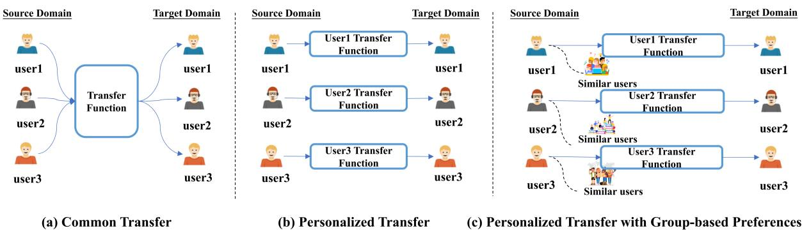
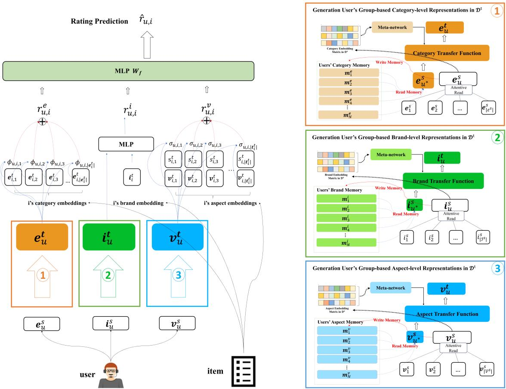
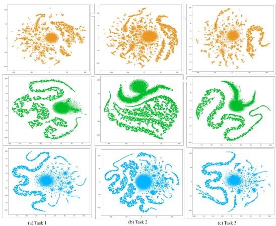

# Integrating Group-based Preferences from Coarse to Fine for Cold-start Users Recommendation

Siyu Wang1†, Jianhui Jiang1†, Jiangtao Qiu2, Shengran Dai1∗

1Gusu Laboratory of Materials, Suzhou, China

2Southwestern University of Finance and Economics, Chengdu, China {wangsiyu2022, jiangjianhui2021, daishengran2021}@gusulab.ac.cn qiujt\_t@swufe.edu.cn

## Abstract

Recent studies have demonstrated that crossdomain recommendation (CDR) effectively addresses the cold-start problem. Most approaches rely on transfer functions to generate user representations from the source to the target domain. Although these methods substantially enhance recommendation performance, they exhibit certain limitations, notably the frequent oversight of similarities in user preferences, which can offer critical insights for training transfer functions. Moreover, existing methods typically derive user preferences from historical purchase records or reviews, without considering that preferences operate at three distinct levels: category, brand, and aspect, each influencing decision-making differently. This paper proposes a model that integrates the preferences from coarse to fine levels to improve recommendations for cold-start users. The model leverages historical data from the source domain and external memory networks to generate user representations across different preference levels. A meta-network then transfers these representations to the target domain, where user-item ratings are predicted by aggregating the diverse representations. Experimental results demonstrate that our model outperforms state-of-the-art approaches in addressing the cold-start problem on three CDR tasks.

## 1 Introduction

Recommender systems are crucial for e-commerce platforms and have garnered significant attention from both industry and academia. Despite extensive research, recommending content to users without historical records remains a major challenge, particularly for cold-start users. Recent studies (Zhu et al., 2022; Man et al., 2017; Zhu et al., 2021a; Zhao et al., 2020; Wang et al., 2020; Vartak et al., 2017; Sun et al., 2023; Li et al., 2024) demonstrate the effectiveness of CDR systems in addressing this challenge. These works primarily focus on transferring user representations from a source domain with abundant historical data to a target domain with minimal or no historical data. Building on these researches, this paper also employs CDR methods to tackle the cold-start problem.

The key of CDR for cold-start users is to bridge user representations in the source domain and the target domain. Previous studies mainly utilize neural networks to extract user’s item-level preference representation from historical purchased items in the source domain (Man et al., 2017; Wang et al., 2018; Zhu et al., 2022; Sun et al., 2023; Li et al., 2024). Additionally, a common transfer function, as shown in Figure 1 (a) was designed for all users to facilitate the migration of representation from the source domain to the target domain. During training, overlapping users are employed to optimize the models, resulting in the successful implementation of a cross-domain recommendation system for cold-start users. However, users’ preferences vary, necessitating personalized transfer approaches for each individual. Then, Zhu et al. (2022) utilized a meta-network to generate personalized transfer functions for each user, as shown in Figure 1 (b). On the other hand, a unified user representation cannot reflect the user’s multiple preferences in the source domain. Thus, Sun et al. (2023) proposed a novel reinforced multiple preferences transfer framework for CDR.

Although these methods substantially enhance recommendation performance, they exhibit certain limitations, notably the frequent oversight of similarities in user preferences, which can offer critical insights for training transfer functions, as shown in Figure 1 (c). Moreover, existing methods typically derive user preferences from historical purchase records or reviews, without considering that preferences operate at three distinct levels: category, brand, and aspect, each influencing decisionmaking differently. For example, some users prioritize brands, while others focus on specific aspects of items. Therefore, effectively capturing and aggregating representations across different preference levels is crucial.

  
Figure 1: An illustration of common transfer, personalized transfer, and personalized transfer with similar users preferences (group-based preferences).

This paper integrates GRoup-bAsed PreferencEs from coarse to fine for coldstart users recommendation (GRAPECDR). First, we use historical data to generate user representations at category, brand, and aspect levels in the source domain. External memory networks create group-based representations for each level, which are then transferred to the target domain by a meta-network. In the target domain, we predict user-item ratings by combining: (1) category preference from the user’s representation and item’s category embedding, (2) brand preference from the user’s representation and item’s brand embedding, and (3) aspect preference from review aspects and polarities matched with the user’s representation. The final rating is an aggregate of these three ratings. Experiments on three cross-domain tasks show our model outperforms many state-of-the-art approaches.

## 2 Related work

## 2.1 Cold-start Recommendation

Previous works have focused on the following aspects of research: (1) How to efficiently use limited interactive information. In certain cold-start scenarios, where only a limited amount of interaction data is available, efficiently leveraging this constrained data becomes crucial. Current research (Lu et al., 2020; Vartak et al., 2017; Lee et al., 2019) primarily employed meta-learning approaches to address such situations, yielding promising results. (2) How to use policy for recommendation. For example, Pan et al. (2019a); Li et al. (2010) adopted the method of reinforcement learning to adjust their product selection strategies according to user click feedback to maximize the total number of user clicks. (3) How to efficiently use auxiliary information. The user’s auxiliary information includes rich content, which can greatly improve the performance of cold-start recommendations. Generally speaking, this auxiliary information includes user attributes (Man et al., 2017; Pan et al., 2019b; Seroussi et al., 2011; Volkovs et al., 2019; Zhu et al., 2021b), knowledge graph (Wang et al., 2019), and cross-domain information (Man et al., 2017; Zhu et al., 2021a; Wang et al., 2018; Zhu et al., 2022; Zhao et al., 2020; Sun et al., 2023; Li et al., 2024). Overall, the cross-domain recommendation (CDR) used the data of the auxiliary domain to help the recommendation in the target domain achieved better results than other methods (Zhu et al., 2022). Therefore, in this paper, we focus on CDR for coldstart users.

## 2.2 Cross-domain Recommendation for Cold-start Users

The core task of CDR for cold-start users is to bridge user preference representations between the source and target domains. Current studies derive these representations mainly from users’ interaction history (item-level) or reviews (aspect-level) in the source domains.

Methods based on user interaction history primarily used matrix factorization (MF) models to generate latent factors or rating patterns, then transferred them across domains. Pan et al. (2010) integrated user and item knowledge from auxiliary data sources using a matrix-based transfer learning framework. EMCDR (Man et al., 2017) developed an embedding-and-mapping framework for cross-domain recommendation. Zhu et al. (2018) combined MF models and a Deep Neural Network (DNN), leveraging user and item sparsity in both domains to guide DNN training. Wang et al. (2018) introduced Cross-Domain Latent Feature Mapping (CDLFM) with user rating behavior and neighborhood-based feature mapping. Previous models overlooked bidirectional latent connections between users and items, which Li and Tuzhilin (2020) addressed with a dual learning approach for iterative information transfer. Zhu et al. (2022) proposed PTUPCDR, a framework for personalized transfer of user preferences, but it neglected preference correlations among users. To address this, Li et al. (2024) proposed a novel CDR framework with neural processes. Latest, Zhu et al. (2024) proposed a multi-interest meta-network to decouple users’ multiple interests, and generate multiinterest bridges to transfer user embeddings from the source domain to the target domain.

Considering user reviews contain rich preference information, Zhao et al. (2020) extracted aspect information from reviews to generate user aspect-level representation and transferred it from the source to the target domain. Fu et al. (2019) used review text and item content as supplementary data, integrating multiple variations of Stacked Denoising Autoencoders (SDAE) to combine this information with the rating matrix in both domains. However, a unified user representation cannot capture a user’s multiple interests. To address this, Sun et al. (2023) proposed a reinforced multi-interest transfer framework for CDR.

## 3 The GRAPECDR Framework

## 3.1 Overview of GRAPECDR

We use $\mathcal { D } ^ { s } = \{ { \cal Z } ^ { s } , { \cal { U } } ^ { s } \}$ and $\mathcal { D } ^ { t } = \{ \mathcal { T } ^ { t } , \mathcal { U } ^ { t } \}$ to denote the source and target domains, where $\textstyle { \mathcal { T } } ^ { s / t }$ and $\mathcal { U } ^ { s / t }$ are item and user set in $\mathcal { D } ^ { s / t }$ respectively. Let $\mathcal { U } ^ { o }$ be an overlapping user set in two domains, that is, the user has purchased items in both domains. $\mathcal { U } ^ { c }$ is a cold-start user that only has purchased items in $\mathcal { D } ^ { s }$ domain. Given a user $u \in \mathcal { U } ^ { c }$ and an item $i \in \mathcal { I } ^ { t }$ , predict the user-item rating $\hat { r } _ { u , i }$

The architecture of GRAPECDR is shown in Figure 2. It mainly consists of three parts: User Group-based Representations Generation, Representations Transfer, and Rating Prediction. Similar to previous studies (Zhao et al., 2020; Zhu et al., 2022; Sun et al., 2023; Li et al., 2024), we only select overlapping users $\mathcal { U } ^ { o }$ for our experi-

ments.

## 3.2 User Group-based Representations Generation

## 3.2.1 Intrinsic Representations Generation

As mentioned earlier, the user’s preferences include three levels from coarse to fine: category-level, brand-level, and aspect-level. In this paper, we first generate three levels of user intrinsic representations in $\mathcal { D } ^ { s }$

Each item can belong to one or more categories. For example, the book (The Progressive Era) belongs to ’Historical Novel’ and ’United States His-$t o r y '$ categories. In $\mathcal { D } ^ { s }$ , the $u ^ { \prime } s$ category-level intrinsic representation can be computed by:

$$
\mathbf { e } _ { u } ^ { s } = s o f t m a x ( \mathbf { n } _ { e _ { u } ^ { s } } ) \mathbf { E } ^ { s } ,\tag{1}
$$

where $\mathbf { n } _ { e _ { u } ^ { s } } ~ \in \mathbb { R } ^ { 1 \times | \mathcal { E } ^ { s } | }$ is number of occurrences for each category in $u ^ { \prime } s$ historical purchased items (If the category does not appear, the number will be $0 ) , \mathcal { E } ^ { s }$ is category vocabulary in $\mathcal { D } ^ { s }$ , and ${ \bf E } ^ { s } =$ $[ \mathbf { e } _ { 1 } ^ { s } , \mathbf { e } _ { 2 } ^ { s } , . . . , \mathbf { e } _ { \vert \mathcal { E } ^ { s } \vert } ^ { s } ]$ are embedding matrix of ${ \mathcal { E } } ^ { s }$

Similarly, the user’s brand-level intrinsic representation can by obtained by:

$$
\mathbf { i } _ { u } ^ { s } = s o f t m a x ( \mathbf { n } _ { i _ { u } ^ { s } } ) \mathbf { I } ^ { s } ,\tag{2}
$$

where $\mathbf { I } ^ { s } = [ \mathbf { i } _ { 1 } ^ { s } , \mathbf { i } _ { 2 } ^ { s } , . . . , \mathbf { i } _ { | \mathcal { T } ^ { s } | } ^ { s } ]$ is the brand embedding matrix, and $\mathbf { n } _ { i _ { u } ^ { s } } ~ \in ~ \mathbb { R } ^ { 1 \times | \mathcal { T } ^ { s } | }$ is number of occurrences for each brand in $u ^ { \prime } s$ historical purchased items and $\mathcal { Z } ^ { s }$ is brand vocabulary in $\mathcal { D } ^ { s }$

Further, we extract aspect occurrence list and the number of occurrences from $u ^ { \prime } s$ reviews, as elaborated in Appendix A. $\mathbf { n } _ { v _ { u } ^ { s } } \in \mathbb { R } ^ { 1 \times | \mathcal { V } ^ { s } | }$ is $u ^ { \prime } s$ number of occurrences for each aspect, $\mathcal { V } ^ { s }$ is aspect vocabulary in $\mathcal { D } ^ { s }$ . Finally, the $u ^ { \prime } s$ aspect-level intrinsic representation can be obtained by:

$$
\mathbf { v } _ { u } ^ { s } = s o f t m a x ( \mathbf { n } _ { v _ { u } ^ { s } } ) \mathbf { V } ^ { s } ,\tag{3}
$$

where $\mathbf { V } ^ { s } = [ \mathbf { v } _ { 1 } ^ { s } , \mathbf { v } _ { 2 } ^ { s } , . . . , \mathbf { v } _ { | \mathcal { V } ^ { s } | } ^ { s } ]$ is the embedding matrix of $\mathcal { V } ^ { s }$ .

## 3.2.2 Group-based Representations Generation

At this stage, the three levels of $u ^ { \prime } s$ intrinsic representations in $\mathcal { D } ^ { s }$ have been obtained. The categorylevel intrinsic representation $\mathbf { e } _ { u } ^ { s }$ will be used as an example to illustrate the process of generating the group-based representation in the source domain.

  
Figure 2: The architecture of GRAPECDR.

Firstly, we introduce an External Memory Network (EMN) (Graves et al., 2014) to store the typical features of overlapping users at the categorylevel. Suppose there are N overlapping users in our system, their category memory matrix is $\mathbf { M } ^ { e } = [ \mathbf { m } _ { 1 } ^ { e } , \mathbf { m } _ { 2 } ^ { e } , . . . , \mathbf { m } _ { N } ^ { e } ]$ , where $\mathbf { m } _ { k } ^ { e }$ is the memory slot of $\bar { k } ^ { t h }$ user. Then, a soft-attention mechanism is adopted to read ${ \bf M } ^ { e }$ for obtaining $u ^ { \prime } s$ groupbased representation at category-level, denoted as $\mathbf { e } _ { u ^ { * } } ^ { s }$

$$
{ \bf e } _ { u ^ { * } } ^ { s } = \sum _ { k = 1 } ^ { N } z _ { u , k } \cdot { \bf m } _ { k } ^ { e } ,\tag{4}
$$

$$
z _ { u , k } = \frac { \exp { w _ { u , k } } } { \sum _ { i = 1 } ^ { N } \exp { w _ { u , i } } } , w _ { u , k } = \mathbf { e } _ { u } ^ { s } \cdot ( \mathbf { m } _ { k } ^ { e } ) ^ { T } ,\tag{5}
$$

where $\mathbf { e } _ { u } ^ { s }$ is computed by Equation 1, and $z _ { u , k }$ is similarity weight. The memory slot in ${ \bf M } ^ { e }$ corresponding to each user is expected to store as many of the user’s typical features as possible. The groupbased representation for the user is then derived through a weighted summation of the typical features of similar users. Consequently, the memory slot for each user must be updated during training (Chen et al., 2018). Drawing inspiration from Neural Turing Machine (Graves et al., 2014), our approach involves clearing ${ \bf M } ^ { e }$ before incorporating fresh information. To elaborate, we commence by computing the D-dimensional erase vector eraseu from $\mathbf { e } _ { u } ^ { s }$ by:

$$
\mathbf { e r a s e } _ { u } = \sigma ( \mathbf { W } _ { e r a s e } \mathbf { e } _ { u } ^ { s } + \mathbf { b } _ { e r a s e } ) ,\tag{6}
$$

where $\sigma$ is the element-wise sigmoid function, and $\mathbf { W } _ { e r a s e }$ and $\mathbf { b } _ { e r a s e }$ are the erase parameters to be learned. Given the erase vector, the $u ^ { \prime } s$ memory slot $\mathbf { m } _ { u } ^ { e }$ is updated by:

$$
\mathbf { m } _ { u } ^ { e }  \mathbf { m } _ { u } ^ { e } \odot ( 1 - \mathbf { e r a s e } _ { u } ) ,\tag{7}
$$

where $\odot$ is element-wise product. The primary purpose of the erase operation is to remove user memories that are deemed unimportant, as acquired through the neural control network. After erasing, an add vector $\mathbf { a d d } _ { u }$ is used to update the $u ^ { \prime } s$ memory by:

$$
\mathbf { a d d } _ { u } = t a n h ( \mathbf { W } _ { a d d } \mathbf { e } _ { u } ^ { s } + \mathbf { b } _ { a d d } ) , \mathbf { m } _ { u } ^ { e } \gets \mathbf { m } _ { u } ^ { e } +\tag{8}
$$

where ${ \mathbf W } _ { a d d } , { \mathbf b } _ { a d d }$ are the add parameters to be learned. The erase-add update strategy facilitates both the forgetting and reinforcement of user representations throughout the learning process (Chen et al., 2018). By automatically adjusting the erase and add parameters, the model can discern which signals should be attenuated and which should be augmented.

## 3.3 Representations Transfer

Zhu et al. (2022) argued that representation transfer should be personalized. Building on this approach, a meta-network is proposed to generate a personalized transfer function from users’ group-based representations. A similarity weight vector $\mathbf { a } _ { u } ^ { e }$ is computed by taking the inner product of $\mathbf { e } _ { u } ^ { s }$ with each category in ${ \mathcal { E } } ^ { s }$ , which is then used to calculate a weighted sum of the category embeddings.

$$
\mathbf { a } _ { u } ^ { e } = s o f t m a x ( \mathbf { e } _ { u } ^ { s } ( \mathbf { E } ^ { s } ) ^ { T } ) , \mathbf { e } _ { \hat { u } } ^ { s } = \mathbf { a } _ { u } ^ { e } \mathbf { E } ^ { s } .\tag{9}
$$

The proposed meta-network is formulated as:

$$
\mathbf { W } _ { u } ^ { e } = g ( \mathbf { e } _ { \hat { u } } ^ { s } ; \theta ) ,\tag{10}
$$

where $g ( . )$ is the meta-network, which is parameterized by θ. In this paper, the meta-network is a two-layer feed-forward network. The $\mathbf { W } _ { u } ^ { e }$ is a weight matrix whose size depends on the structure of the transfer function. The personalized category transfer function is formulated as:

$$
f _ { u } ^ { e } = ( . ; \mathbf { W } _ { u } ^ { e } ) .\tag{11}
$$

Note that the $\textstyle W _ { u } ^ { e }$ is used as the parameters of the transfer function rather than input. And the generated transfer function depends on group-based representation. By the transfer function, we can obtain the transformed user’s group-based categorylevel representation $\mathbf { e } _ { u ^ { * } } ^ { s }$ (Computed by Equation 4) in the target domain:

$$
{ \bf e } _ { u } ^ { t } = f _ { u } ^ { e } ( { \bf e } _ { u ^ { * } } ^ { s } ) .\tag{12}
$$

Similarly, we can acquire the user’s group-based brand-level and aspect-level representations $\mathbf { i } _ { u } ^ { t } , \mathbf { v } _ { u } ^ { t }$ in the target domain. It is important to highlight that each level of preference corresponds to distinct transfer functions $f _ { u } ^ { i } , f _ { u } ^ { v }$ and external memory networks Mi, Mv (as shown in Figure 2).

## 3.4 Rating Prediction

u′s rating for $i \in \mathcal { T } ^ { t }$ is mainly composed of three parts: category preference rating $r _ { u , i } ^ { e } ,$ brand preference rating $r _ { u , i } ^ { i }$ , aspect preference rating $r _ { u , i } ^ { v }$

To calculate category preference rating, we need to extract categories from the $i ^ { \prime } s$ metadata, denoted as $\mathbf { e } _ { i } ^ { t } = [ e _ { i , 1 } ^ { t } , . . . , e _ { i , | \mathbf { e } _ { i } ^ { t } | } ^ { t } ]$ . Since u has different weights on different categories, which can be represented by:

$$
\mathbf { e } _ { u ^ { i } } ^ { t } = \sum _ { k = 1 } ^ { | \mathbf { e } _ { i } ^ { t } | } \phi _ { u , i , k } \mathbf { e } _ { i , k } ^ { t } ,\tag{13}
$$

$$
\phi _ { u , i , k } = \frac { \exp { ( \mathbf { h } _ { e } ^ { T } t a n h ( \mathbf { W } _ { e } \mathbf { e } _ { u } ^ { t } + \mathbf { U } _ { e } \mathbf { e } _ { i , k } ^ { t } ) ) } } { \sum _ { j = 1 } ^ { | \mathbf { e } _ { i } ^ { t } | } \exp { ( \mathbf { h } _ { e } ^ { T } t a n h ( \mathbf { W } _ { e } \mathbf { e } _ { u } ^ { t } + \mathbf { U } _ { e } \mathbf { e } _ { i , j } ^ { t } ) ) } } ,\tag{14}
$$

where $\mathbf { e } _ { i , k } ^ { t }$ is embeddings of $e _ { i , k } ^ { t }$ . Finally, category preference rating $r _ { u , i } ^ { e }$ is computed by:

$$
r _ { u , i } ^ { e } = \mathbf { W } _ { e _ { 2 } } ( \mathbf { W } _ { e _ { 1 } } [ \mathbf { e } _ { u } ^ { t } \oplus \mathbf { e } _ { u ^ { i } } ^ { t } ] + \mathbf { b } _ { e _ { 1 } } ) + b _ { e _ { 2 } } .\tag{15}
$$

Then we compute the brand preference rating by:

$$
r _ { u , i } ^ { i } = \mathbf { W } _ { i _ { 2 } } ( \mathbf { W } _ { i _ { 1 } } [ \mathbf { i } _ { u } ^ { t } \oplus \mathbf { i } ^ { t } ] + \mathbf { b } _ { i _ { 1 } } ) + b _ { i _ { 2 } } ,\tag{16}
$$

where $\mathbf { i } ^ { t }$ is the brand embedding of i in $\mathcal { D } ^ { t }$

To calculate aspect preference rating, we need to extract aspects and their sentiment polarities from the $i ^ { \prime } s$ reviews (as elaborated in Appendix $\mathbf { A } )$ , denoted as $\mathbf { v } _ { i } ^ { t } \ = \ [ v _ { i , 1 } ^ { t } , . . . , v _ { i , | \mathbf { v } _ { i } ^ { t } | } ^ { t } ]$ and ${ \bf s } _ { i } ^ { t } \ =$ $[ s _ { i , 1 } ^ { t } , . . . , s _ { i , | \mathbf { s } _ { i } ^ { t } | } ^ { t } ]$ . Note that if multiple reviews all relate to the same aspect, the sentiment polarity is the average of them. Intuitively, u has different preferences on different aspects of i, so the aspect preference probability is calculated as follows:

$$
\sigma _ { u , i , k } = \frac { \exp { ( \mathbf { h } _ { v } ^ { T } t a n h ( \mathbf { W } _ { v } \mathbf { v } _ { u } ^ { t } + \mathbf { U } _ { v } \mathbf { v } _ { i , k } ^ { t } ) ) } } { \sum _ { j = 1 } ^ { | \mathbf { v } _ { i } ^ { t } | } \exp { ( \mathbf { h } _ { v } ^ { T } t a n h ( \mathbf { W } _ { v } \mathbf { v } _ { u } ^ { t } + \mathbf { U } _ { v } \mathbf { v } _ { i , j } ^ { t } ) ) } } ,\tag{17}
$$

where $\mathbf { v } _ { i , k } ^ { t }$ is the embedding of $\boldsymbol { v } _ { i , k } ^ { t }$ . Moreover, when a user makes a purchase, if the aspects highlighted in the reviews align with the user’s interests and exhibit a positive polarity, it is likely to bolster the user’s inclination to make the purchase. In view of this, we calculate the weighted sum of the aspect polarity scores to generate aspect preference rating:

$$
r _ { u , i } ^ { v } = \sum _ { k = 1 } ^ { | \mathbf { v } _ { i } ^ { t } | } \sigma _ { u , i , k } s _ { i , k } ^ { t } , \forall s _ { i , k } ^ { t } \in ( - 1 , 1 ) .\tag{18}
$$

In practice, users assign varying weights to different preference ratings. For instance, some users prioritize aspect ratings, whereas others prioritize category ratings. Consequently, we derive the user’s rating weight from their representations, which is computed by:

$$
\mathbf { w } _ { f } = s i g m o i d ( \mathbf { w } _ { w } [ \mathbf { e } _ { u } ^ { t } \oplus \mathbf { i } _ { u } ^ { t } \oplus \mathbf { v } _ { u } ^ { t } ] + \mathbf { b } _ { w } ) ,\tag{19}
$$

and the finally rating is defined as:

$$
\begin{array} { r } { \hat { r } _ { u , i } = \mathbf { w } _ { f } [ r _ { u , i } ^ { e } \oplus r _ { u , i } ^ { i } \oplus r _ { u , i } ^ { v } ] . } \end{array}\tag{20}
$$

## 3.5 Optimization Strategy

During Training, the historical data generated by overlapping users is leveraged to optimize the model parameters with SmoothL1(Girshick, 2015) loss, which is defined as follows:

$$
\mathcal { L } _ { m a i n } = - \sum _ { u \in \mathcal { U } ^ { O } , i \in \mathcal { T } ^ { t } } l ( y _ { u , i } , \hat { r } _ { u , i } ) ,\tag{21}
$$

$$
l ( a , b ) = \left\{ \begin{array} { l l } { \frac { 1 } { 2 } ( a - b ) ^ { 2 } } & { \mathrm { i f ~ } | a - b | < 1 } \\ { | a - b | - \frac { 1 } { 2 } } & { \mathrm { o t h e r w i s e } } \end{array} \right. ,\tag{22}
$$

where $y _ { u , i }$ is ground-truth rating.

## 4 Experiments

## 4.1 Datasets

Three popular categories: Books, CDs & Vinyl (Music), and Movies & TV (Movies) on the Amazon reviews dataset (He and McAuley, 2016; McAuley et al., 2015) are selected for the experiments. Table 1 shows the detailed statistics of the dataset.

## 4.2 Baseline Methods

In the experiment, we choose the following baselines for comparison: TGT is a naive target model trained only with data in the target domain. CMF (Singh and Gordon, 2008) is a simple CDR method extending MF, where user embeddings are shared between source and target domains. SSCDR (Kang et al., 2019) trained the bridge function in a semisupervised manner. EMCDR (Man et al., 2017) is an embedding-and-mapping framework that learns a mapping function to capture coordinate relationships between domains. PTUPCDR (Zhu et al., 2022) is a framework for personalized transfer of user preferences, aiming to address a single shared bridge function. REMIT (Sun et al., 2023) is a novel framework called reinforced multiinterest transfer for CDR. MIMNET (Zhu et al.,

2024) employed multi-interest meta-network with multi-granularity target-guided attention for crossdomain recommendation.

Following Zhao et al. (2020); Zhu et al. (2022), to compare the performance of the models more comprehensively, we use Mean Absolute Error (MAE), and Rooted Mean Square Error (RMSE) as metrics.

## 4.3 Implementation Details

We use PyTorch (Paszke et al., 2019) to develop both our model1. Model parameters are initially randomized according to a uniform distribution as described in (Glorot and Bengio, 2010). These parameters are then updated using Adam (Kingma and Ba, 2014) with a learning rate of $1 \times 1 0 ^ { - 4 }$ Both the embedding dimension (300) and the batch size (256) are consistently set across all models. An open-source large language model (LLM) with prompt-based extraction is utilized to directly extract aspects and their associated sentiments (see Appendix A for details)

Following the methods described in (Sun et al., 2023; Zhu et al., 2024), the effectiveness of GRAPECDR is evaluated by randomly removing all ratings from a subset of overlapping users in the target domain, who are then treated as test users. The remaining overlapping users are used to train the bridge function. In the experiments, the proportions of test (cold-start) users β are set to 80%, 50%, and 20% of the total overlapping users. For each task, the average results are reported over three random runs.

## 4.4 Cold-start Recommendation Experiments

Multiple experiments are conducted on three tasks, and the results are presented in Table 2. TGT performs the worst because it trains directly on target domain data. CMF performs better by combining data from different domains into one. SSCDR and EMCDR outperform CMF by using a common bridge to transfer user embeddings from the source to the target domain. PTUPCDR further improves performance by learning personalized bridges for each user. Among baseline methods, REMIT is the second best due to its use of multiple personalized bridges and an RL-based selector for interests.

Our method, GRAPECDR, consistently performs the best across all tasks and cold-start settings. It also shows greater robustness. As $\beta$ increases, fewer training users, making crossdomain mapping less effective due to fewer training instances. Therefore, the baseline methods all show varying degrees of performance degradation. GRAPECDR addresses this by focusing on transferring categories, brands, and aspects across domains, rather than user representations, thus reducing the impact of $\beta _ { - }$

<table><tr><td rowspan="2"></td><td rowspan="2">Domain</td><td colspan="3">Users</td><td colspan="3">items</td></tr><tr><td>#users</td><td>#overlap</td><td>#items</td><td>#categories</td><td>#brands</td><td>#aspects</td></tr><tr><td rowspan="2">Task 1</td><td>Movie</td><td>123,960</td><td>18,031</td><td>50,052</td><td>398</td><td>12366</td><td>1537</td></tr><tr><td>Music</td><td>75,258</td><td></td><td>64,443</td><td>425</td><td>13787</td><td>3769</td></tr><tr><td rowspan="2">Task 2</td><td>Book</td><td>603,668</td><td>37,388</td><td>367,982</td><td>638</td><td>123510</td><td>3375</td></tr><tr><td>Movie</td><td>123,960</td><td></td><td>50,052</td><td>398</td><td>12366</td><td>5725</td></tr><tr><td rowspan="2">Task 3</td><td>Book</td><td>603,668</td><td>16,738</td><td>367,982</td><td>638</td><td>123510</td><td>1917</td></tr><tr><td>Music</td><td>75,258</td><td></td><td>64,443</td><td>425</td><td>13787</td><td>4635</td></tr></table>

Table 1: Statistics of the three tasks. #overlap denotes number of overlapping users.
<table><tr><td>Tasks</td><td>β</td><td>Metric</td><td>TGT†</td><td>CMF†</td><td>SSCDR†</td><td>EMCDR†</td><td>PTUPCDR† REMIT†</td><td></td><td>MIMNet*</td><td>Ours</td></tr><tr><td rowspan="5">1</td><td>20%</td><td>MAE</td><td>4.4730</td><td>1.4128</td><td>1.2151</td><td>1.1963</td><td>1.0051</td><td>0.9393</td><td>0.8027</td><td>0.7419</td></tr><tr><td></td><td>RMSE</td><td>5.1615</td><td>1.8725</td><td>1.4946</td><td>1.4803</td><td>1.3498</td><td>1.2709</td><td>1.1509</td><td>1.0296</td></tr><tr><td>50%</td><td>MAE</td><td>4.5064</td><td>1.5179</td><td>1.3235</td><td>1.4570</td><td>1.1464</td><td>1.0437</td><td>0.8729</td><td>0.7441</td></tr><tr><td></td><td>RMSE</td><td>5.1774</td><td>2.0225</td><td>1.6794</td><td>1.8086</td><td>1.5987</td><td>1.4580</td><td>1.2244</td><td>1.0263</td></tr><tr><td>80%</td><td>MAE</td><td>4.5129</td><td>1.8609</td><td>1.6382</td><td>1.9397</td><td>1.4245</td><td>1.2181</td><td>1.0614</td><td>0.7534</td></tr><tr><td rowspan="5">2</td><td>20%</td><td>RMSE MAE</td><td>5.1983</td><td>2.4507</td><td>2.1576</td><td>2.3290</td><td>2.0338</td><td>1.6601</td><td>1.4721</td><td>1.0406</td></tr><tr><td></td><td>RMSE</td><td>4.2026</td><td>1.4857</td><td>1.2631</td><td>0.9834</td><td>0.9093</td><td>0.8759</td><td>0.8718</td><td>0.8531</td></tr><tr><td></td><td></td><td>4.7677</td><td>1.9308</td><td>1.4700</td><td>1.2295</td><td>1.1914</td><td>1.1650</td><td>1.1430</td><td>1.1442</td></tr><tr><td>MAE 50%</td><td></td><td>4.2225</td><td>1.5974</td><td>1.3407</td><td>1.0556</td><td>0.9567</td><td>0.9172</td><td>0.9025</td><td>0.8538</td></tr><tr><td>RMSE MAE</td><td></td><td>4.7890</td><td>2.0636</td><td>1.5607</td><td>1.3238</td><td>1.2712</td><td>1.2379</td><td>1.1983</td><td>1.1433</td></tr><tr><td rowspan="4"></td><td>80%</td><td></td><td>4.2405</td><td>2.3416</td><td>1.2495</td><td>1.2249</td><td>1.0519</td><td>1.0055</td><td>0.9710</td><td>0.8584</td></tr><tr><td></td><td>RMSE</td><td>4.8201</td><td>2.8561</td><td>1.5572</td><td>1.5334</td><td>1.4338</td><td>1.3772</td><td>1.2910</td><td>1.1495</td></tr><tr><td>20% RMSE</td><td>MAE</td><td>4.4516</td><td>1.7873</td><td>1.5988</td><td>1.6121</td><td>1.4701</td><td>1.3749</td><td>0.8107</td><td>0.7228</td></tr><tr><td></td><td></td><td>5.1455</td><td>2.3316</td><td>2.1146</td><td>2.1638</td><td>2.0707</td><td>1.9940</td><td>1.1711</td><td>0.9928</td></tr><tr><td rowspan="3">3</td><td>50%</td><td>MAE</td><td>4.4825</td><td>1.9348</td><td>1.8166</td><td>1.9050</td><td>1.5872</td><td>1.4401</td><td>0.9348</td><td>0.7222</td></tr><tr><td></td><td>RMSE</td><td>5.1585 4.5188</td><td>2.5232</td><td>2.2718</td><td>2.3289</td><td>2.2279</td><td>2.0495</td><td>1.3009</td><td>1.0078</td></tr><tr><td>MAE 80%</td><td></td><td></td><td>2.3989</td><td>2.1749</td><td>2.2192</td><td>1.8344</td><td>1.6396</td><td>1.1167</td><td>0.7326</td></tr><tr><td></td><td></td><td>RMSE</td><td>5.2001</td><td>3.0838</td><td>2.5652</td><td>2.6331</td><td>2.5235</td><td>2.2653</td><td>1.5178</td><td>1.0100</td></tr></table>

Table 2: Comparisons of baselines performances. And the baselines marked † are taken from Sun et al. (2023), and marked ⋆ is taken from Zhu et al. (2024), we used the same training and test sets as these papers. Note that a lower MAE and RMSE value indicates a better model performance. For each task, the averaged results over three random runs are reported.

## 4.5 Ablation Study

This section presents an analysis of the proposed model to assess the contribution of each component.

## 4.5.1 Impact of different levels of preference on model performance

First, we observe a significant performance decline in Table 3, when the aspect preferences (denoted as category + brand) are removed. The MAE increases by approximately 0.04 across Tasks 1, 2, and 3, indicating that fine-grained preferences are crucial to the model’s performance. Additionally, when brand preference is removed (denoted as category), the model shows a slight decrease in performance, with the MAE increasing by about 0.01 across the same tasks, this result suggests that while brand preference does influence the model, its impact is less pronounced than that of aspect preference. Overall, the ablation experiment confirms that each preference level significantly affects the model’s performance.

## 4.5.2 Impact of integrating group-based preference on model performance

Furthermore, we construct a variant model for the transfer function, wherein each user possesses a personalized transfer function (as shown in Equation 12), but the input of this function is user intrinsic representation (denoted as w/o group-based transfer preference). As illustrated in Table 3, upon exclusion of group-based preference, the model’s performance experiences a notable decline across all tasks. In Task 3, MAE increased by about 0.06, and in the other tasks, it increased by about 0.03. This result shows that adding the preference of similar users to the representations can significantly improve the performance of the model.

<table><tr><td rowspan="2">Models</td><td colspan="2">Task 1</td><td colspan="2">Task 2</td><td colspan="2">Task 3</td></tr><tr><td>MAE</td><td>RMSE</td><td>MAE</td><td>RMSE</td><td>MAE</td><td>RMSE</td></tr><tr><td>category</td><td>0.7912</td><td>1.0767</td><td>0.9216</td><td>1.2134</td><td>0.7639</td><td>1.0299</td></tr><tr><td>category+brand</td><td>0.7744</td><td>1.0723</td><td>0.9025</td><td>1.1916</td><td>0.7500</td><td>1.0232</td></tr><tr><td>GRAPECDR(category+brand+aspect)</td><td>0.7419</td><td>1.0296</td><td>0.8531</td><td>1.1442</td><td>0.7228</td><td>0.9928</td></tr><tr><td>w/o group-based transfer function</td><td>0.7872</td><td>1.0647</td><td>0.8957</td><td>1.1796</td><td>0.7867</td><td>1.0531</td></tr></table>

Table 3: Performance comparison of different levels of preference. Note we set β = 20% in these experiments. category denotes that the model only contains category preferences, and category+brand denotes that the model contains category and brand preferences. w/o group-based transfer function denotes GRAPECDR do not use group-based transfer function.
<table><tr><td>Source Domain</td><td>Target Domain</td></tr><tr><td>book,dialogue,storytelling,value,writing style</td><td>movie,acting,performance,story,film</td></tr><tr><td>planet,story</td><td>cartoons,dvd,animation,ship,acting</td></tr><tr><td>plot,film,acting,mood</td><td>soundtrack,plot,movie release,waiting time,movie longevityperformance,special,music,staging,production</td></tr></table>

Table 4: Case Study.

  
Figure 3: Visualization for category, brand, and aspect memory network (Me, Mi and Mv) in three tasks. The orange color represents the category memory network, the green color denotes the brand memory network, and the blue color represents the aspect memory network.

## 4.6 Visualization Analysis

Three external memory networks are employed to store user features corresponding to category-level, brand-level, and aspect-level preferences. T-SNE (Van der Maaten and Hinton, 2008) visualizes these networks across three tasks, showing that similar user features cluster into distinct groups. Figure 3 illustrates that the category memory network (orange) and the brand and aspect networks (green and blue) effectively capture and store typical user features, aligning with our goal of grouping users by shared preferences.

## 4.7 Case Study

This section presents a case study focusing on aspect-level preferences as an illustrative example. Results are shown in Table 4. The first two cases come from Task 2 (Books->Movies), and the remaining cases come from Task 1 (Movies->Musics).

We first obtain the aspects mentioned in the user’s reviews, as shown in the ’Source Domain column of Table 4. Then, the attention weights from Equation 17 are used to identify the top five aspects the user focuses on in the target domain. In the first case, the aspects mentioned by users in the source domain (Books) mainly include "storytelling, writing style", which may mean that the reader pays more attention to the plot. In the target domain (Movies), users pay more attention to "story, acting, performance". Obviously, this preference is similar to the preference in the source domain. In the second case, users prefer "planet, story" in the source domain, the reader may be a child or a woman/man with children. In the target domain, they pay more attention to the "cartoons" and "animation" aspects of movies. Similarly, cases 3 and 4 yield analogous outcomes. The case study highlights not only the efficacy but also the explanation of our method.

## 5 Conclusion

This paper addresses the cold-start problem in cross-domain recommendation by integrating group-based preferences from coarse to fine levels. A model is designed to generate coarse-to-fine preference representations using historical data from the source domain. Firstly, external memory networks are employed to capture group-based representations of similar users, which are then transferred to the target domain via a meta-network.

Aggregating ratings from various preference representations then predict user-item ratings. Empirical results demonstrate that the proposed model outperforms several state-of-the-art methods. Furthermore, ablation experiments further reveal that preferences at each level significantly influence performance, and incorporating similar users’ preferences enhances the model’s effectiveness.

## Acknowledgments

This study was supported by the National Key Research and Development Program of China (2022YFF0707103).

## References

Xu Chen, Hongteng Xu, Yongfeng Zhang, Jiaxi Tang, Yixin Cao, Zheng Qin, and Hongyuan Zha. 2018. Sequential recommendation with user memory networks. In Proceedings of the eleventh ACM international conference on web search and data mining, pages 108–116.

Wenjing Fu, Zhaohui Peng, Senzhang Wang, Yang Xu, and Jin Li. 2019. Deeply fusing reviews and contents for cold start users in cross-domain recommendation systems. In AAAI, volume 33, pages 94–101.

Ross Girshick. 2015. Fast r-cnn. In ICCV, pages 1440– 1448.

Xavier Glorot and Yoshua Bengio. 2010. Understanding the difficulty of training deep feedforward neural networks. In PMLR, pages 249–256.

Alex Graves, Greg Wayne, and Ivo Danihelka. 2014. Neural turing machines. arXiv preprint arXiv:1410.5401.

Ruining He and Julian McAuley. 2016. Ups and downs: Modeling the visual evolution of fashion trends with one-class collaborative filtering. In WWW, pages 507–517.

SeongKu Kang, Junyoung Hwang, Dongha Lee, and Hwanjo Yu. 2019. Semi-supervised learning for cross-domain recommendation to cold-start users. In Proceedings of the 28th ACM international conference on information and knowledge management, pages 1563–1572.

Diederik P Kingma and Jimmy Ba. 2014. Adam: A method for stochastic optimization. arXiv preprint arXiv:1412.6980.

Woosuk Kwon, Zhuohan Li, Siyuan Zhuang, Ying Sheng, Lianmin Zheng, Cody Hao Yu, Joseph Gon zalez, Hao Zhang, and Ion Stoica. 2023. Efficient memory management for large language model serving with pagedattention. In Proceedings of the 29th Symposium on Operating Systems Principles, pages 611–626.

Hoyeop Lee, Jinbae Im, Seongwon Jang, Hyunsouk Cho, and Sehee Chung. 2019. Melu: Meta-learned user preference estimator for cold-start recommendation. In SIGKDD, pages 1073–1082.

Lihong Li, Wei Chu, John Langford, and Robert E Schapire. 2010. A contextual-bandit approach to personalized news article recommendation. In WWW, pages 661–670.

Pan Li and Alexander Tuzhilin. 2020. Ddtcdr: Deep dual transfer cross domain recommendation. In WSDM, pages 331–339.

Xiaodong Li, Jiawei Sheng, Jiangxia Cao, Wenyuan Zhang, Quangang Li, and Tingwen Liu. 2024. Cdrnp: Cross-domain recommendation to cold-start users via neural process. In Proceedings ofthe 17th ACM International Conference on Web Search and Data Mining, WSDM ’24, page 378–386, New York, NY, USA. Association for Computing Machinery.

Yuanfu Lu, Yuan Fang, and Chuan Shi. 2020. Metalearning on heterogeneous information networks for cold-start recommendation. In SIGKDD, pages 1563– 1573.

Tong Man, Huawei Shen, Xiaolong Jin, and Xueqi Cheng. 2017. Cross-domain recommendation: an embedding and mapping approach. In IJCAI, pages 2464–2470.

Julian McAuley, Christopher Targett, Qinfeng Shi, and Anton Van Den Hengel. 2015. Image-based recommendations on styles and substitutes. In SIGIR, pages 43–52.

Feiyang Pan, Qingpeng Cai, Pingzhong Tang, Fuzhen Zhuang, and Qing He. 2019a. Policy gradients for contextual recommendations. In WWW, pages 1421– 1431.

Feiyang Pan, Shuokai Li, Xiang Ao, Pingzhong Tang, and Qing He. 2019b. Warm up cold-start advertisements: Improving ctr predictions via learning to learn id embeddings. In SIGIR, pages 695–704.

Weike Pan, Evan Xiang, Nathan Liu, and Qiang Yang. 2010. Transfer learning in collaborative filtering for sparsity reduction. In AAAI, volume 24, pages 230– 235.

Adam Paszke, Sam Gross, Francisco Massa, Adam Lerer, James Bradbury, Gregory Chanan, Trevor Killeen, Zeming Lin, Natalia Gimelshein, Luca Antiga, et al. 2019. Pytorch: An imperative style, high-performance deep learning library. In NeurIPS, volume 32.

Yanir Seroussi, Fabian Bohnert, and Ingrid Zukerman. 2011. Personalised rating prediction for new users using latent factor models. In HT, pages 47–56.

Ajit P Singh and Geoffrey J Gordon. 2008. Relational learning via collective matrix factorization. In SIGKDD, pages 650–658.

Caiqi Sun, Jiewei Gu, BinBin Hu, Xin Dong, Hai Li, Lei Cheng, and Linjian Mo. 2023. Remit: reinforced multi-interest transfer for cross-domain recommendation. In Proceedings of the AAAI Conference on Artificial Intelligence, volume 37, pages 9900–9908.

Laurens Van der Maaten and Geoffrey Hinton. 2008. Visualizing data using t-sne. Journal of machine learning research, 9(11).

Manasi Vartak, Arvind Thiagarajan, Conrado Miranda, Jeshua Bratman, and Hugo Larochelle. 2017. A metalearning perspective on cold-start recommendations for items. NeurIPS, 30.

Maksims Volkovs, Guangwei Yu, and Tomi Poutanen. 2019. Dropoutnet: Addressing cold start in recommender systems. In NeurIPS, pages 8026–8037.

Hongwei Wang, Fuzheng Zhang, Mengdi Zhang, Jure Leskovec, Miao Zhao, Wenjie Li, and Zhongyuan Wang. 2019. Knowledge-aware graph neural networks with label smoothness regularization for recommender systems. In SIGKDD, pages 968–977.

Xinghua Wang, Zhaohui Peng, Senzhang Wang, Philip S Yu, Wenjing Fu, and Xiaoguang Hong. 2018. Cross-domain recommendation for cold-start users via neighborhood based feature mapping. In DAS-FAA, pages 158–165.

Xinghua Wang, Zhaohui Peng, Senzhang Wang, Philip S Yu, Wenjing Fu, Xiaokang Xu, and Xiaoguang Hong. 2020. Cdlfm: cross-domain recommendation for cold-start users via latent feature mapping. Knowledge and Information Systems, 62:1723– 1750.

Cheng Zhao, Chenliang Li, Rong Xiao, Hongbo Deng, and Aixin Sun. 2020. Catn: Cross-domain recommendation for cold-start users via aspect transfer network. In SIGIR, pages 229–238.

Feng Zhu, Yan Wang, Chaochao Chen, Guanfeng Liu, Mehmet Orgun, and Jia Wu. 2018. A deep framework for cross-domain and cross-system recommendations. In IJCAI, pages 3711–3717.

Xiaofei Zhu, Yabo Yin, and Li Wang. 2024. Mimnet: Multi-interest meta network with multi-granularity target-guided attention for cross-domain recommendation. arXiv preprint arXiv:2408.00038.

Yongchun Zhu, Kaikai Ge, Fuzhen Zhuang, Ruobing Xie, Dongbo Xi, Xu Zhang, Leyu Lin, and Qing He. 2021a. Transfer-meta framework for cross-domain recommendation to cold-start users. In SIGIR, pages 1813–1817.

Yongchun Zhu, Zhenwei Tang, Yudan Liu, Fuzhen Zhuang, Ruobing Xie, Xu Zhang, Leyu Lin, and Qing He. 2022. Personalized transfer of user preferences for cross-domain recommendation. In WSDM, pages 1507–1515.

Yongchun Zhu, Ruobing Xie, Fuzhen Zhuang, Kaikai Ge, Ying Sun, Xu Zhang, Leyu Lin, and Juan Cao. 2021b. Learning to warm up cold item embeddings for cold-start recommendation with meta scaling and shifting networks. In SIGIR, pages 1167–1176.

## A Appendix

## A.1 Aspect-Polarity Extraction with LLM

we use Mistral-Nemo-2407-Instructionquantized.w4a162, a quantized version of Mistral-Nemo-2407-Instruction , as the base model to extract the aspect and related polarity of the given sentences. Due to the quantized version model and batch reference, the speed of inference to extract expected information is greatly improved. Then, we deploy the model with Vllm(Kwon et al., 2023) on a server machine of NVIDIA A800.

The system prompt of extraction is as follows: Now you are an aspect category and sentiment polarity extractor. Your work is to extract aspect category and sentiment polarity pairs from the given sentences. If you could not detect any aspect category and sentiment polarity informationfrom the provided sentences, please just return a empty list:[]. Remember the polarity should be one of ’positive’, ’negative’ and ’neutral’. Note that ifthe aspect category and sentiment polarity pairs exist, your answer should be a json list. Each json in the list has two keys: ’aspect’ and ’polarity’, for example:[{"aspect":"food","polarity":"negative"}]. Do not contain explain or any other unrelated content in your answer!

The user prompt of extraction is as follows: Given a sentence as follows: [TAR-GET\_SENTENCE] Please extract the aspect and polarity pairs in a json list.

The target sentence is inserted in place of the placeholder [TARGET\_SENTENCE] to generate the user prompt, which is then appended to the system prompt. This combined prompt is fed into the model to obtain a response. A JSON output parser is used to extract the expected JSON-formatted answer. If the parser fails, a retry mechanism is triggered until a correct answer is produced or the retry limit is reached.