# Investigating the Contextualised Word Embedding Dimensions Specified for Contextual and Temporal Semantic Changes

Taichi Aida Tokyo Metropolitan University aida-taichi@ed.tmu.ac.jp

Danushka Bollegala University of Liverpool danushka@liverpool.ac.uk

## Abstract

The sense-aware contextualised word embeddings (SCWEs) encode semantic changes of words within the contextualised word embedding (CWE) spaces. Despite the superior performance of SCWEs in contextual/temporal semantic change detection (SCD) benchmarks, it remains unclear as to how the meaning changes are encoded in the embedding space. To study this, we compare pre-trained CWEs and their fine-tuned versions on contextual and temporal semantic change benchmarks under Principal Component Analysis (PCA) and Independent Component Analysis (ICA) transformations. Our experimental results reveal (a) although there exist a smaller number of axes that are specific to semantic changes of words in the pre-trained CWE space, this information gets distributed across all dimensions when fine-tuned, and (b) in contrast to prior work studying the geometry of CWEs, we find that PCA to better represent semantic changes than ICA within the top 10% of axes. These findings encourage the development of more efficient SCD methods with a small number of SCD-aware dimensions.1

## 1 Introduction

Meaning of a word is a dynamic phenomenon that is both contextual (i.e. depends on the context in which the word is used) (Pilehvar and Camacho-Collados, 2019) as well as temporal (i.e. the meaning of a word can change over time) (Tahmasebi et al., 2021). A large body of methods have been proposed to represent the meaning of a word in a given context (Devlin et al., 2019; Conneau et al., 2020; Zhou and Bollegala, 2021; Rachinskiy and Arefyev, 2021; Periti et al., 2024), or within a given time period (Hamilton et al., 2016; Rosenfeld and Erk, 2018; Aida et al., 2021; Rosin et al., 2022;

Aida and Bollegala, 2023b; Tang et al., 2023; Fedorova et al., 2024). In particular, SCWEs such as XL-LEXEME (Cassotti et al., 2023) obtained by fine-tuning masked language models (MLMs) such as XLM-RoBERTa (Conneau et al., 2020) on Word-in-Context (WiC) (Pilehvar and Camacho-Collados, 2019) have reported superior performance in SCD benchmarks (Cassotti et al., 2023; Aida and Bollegala, 2023a; Periti and Tahmasebi, 2024; Aida and Bollegala, 2024), implying that semantic changes can be accurately inferred from SCWEs.

Despite the empirical success, to the best of our knowledge, no prior work has investigated whether there are dedicated dimensions in the XL-LEXEME embedding space specified for the semantic changes of the words it represents. In this paper, we study this problem from two complementary directions. First, in §3, we investigate the embedding dimensions specific to the contextual semantic changes of words using WiC benchmarks (Pilehvar and Camacho-Collados, 2019; Raganato et al., 2020; Martelli et al., 2021; Liu et al., 2021) as the evaluation task. Second, in §4, we investigate the embedding dimensions specific to the temporal semantic changes of words on SemEval-2020 Task 1 (Schlechtweg et al., 2020) benchmark. In each setting, we compare pre-trained CWEs and the SCWEs obtained by fine-tuning on WiC using PCA and ICA, which have been used in prior work investigating dimensions in CWEs (Yamagiwa et al., 2023). Our investigations reveal several interesting novel insights that will be useful when developing accurate and efficient lowdimensional SCD methods as follows.

• PCA discovers contextual/temporal semantic change-aware axes within the top 10% of the transformed axes better than ICA.

• In pre-trained embeddings, we identify a small number of axes that are specified for contextual/temporal semantic changes, while such axes are uniformly distributed in the fine-tuned embeddings.

<table><tr><td>Type of Semantic Change</td><td colspan="2">Instances</td><td>Label</td></tr><tr><td rowspan="2">Contextual</td><td>.. . two points on a plane lies ... .. . the plane graph as the X-Y</td><td></td><td rowspan="2">True (Same meanings)</td></tr><tr><td>He lived on a worldly plane.</td><td>.. . the plane graph as the X-Y</td></tr><tr><td rowspan="3">Temporal</td><td>• .. . this is a horizontal plane, and ...</td><td>• .. . as the plane settled down at ...</td><td rowspan="3">True (Semantically Changed)</td></tr><tr><td>• ... because it is parallel with • ...558 combat planes and the ground plane . ..</td><td>4,000 tanks.</td></tr><tr><td></td><td>• .. . this is a horizontal plane, • The President&#x27;s plane landed at ...</td></tr></table>

Table 1: Examples of contextual/temporal semantic change tasks. In contextual semantic change tasks, models predict the meanings of a target word (e.g. plane) in each pair of sentences in the same time period. On the other hand, in temporal semantic change tasks, models predict the meaning of a target word (e.g. plane) from sets of sentences across different time periods.

• Semantic change aware dimensions report comparable or superior performance over using all dimensions in SCD benchmarks.

## 2 Task Description

In this section, we explain the two types of semantic changes of words considered in the paper: (a) contextual semantic changes and (b) temporal semantic changes.

Contextual Semantic Change Detection Task involves predicting whether the meaning of a word in a given pair of sentences are the same (Pilehvar and Camacho-Collados, 2019). For example, an ambiguous word can express different meanings in different contexts, which is considered under contextual semantic changes. Models are required to make a prediction for each pair of sentences.

Temporal Semantic Change Detection Task involves predicting the meanings of a word in given sets of sentences across different time periods (Schlechtweg et al., 2020). A word that was used in a different meaning in the past can be associated with novel meanings later on, which is considered as a temporal semantic change of that word. Models predict whether the meaning of the word has changed over time by comparing the given sets of sentences.

Models For the Contextual Semantic Change Detection Task, contextual word embeddings (Devlin et al., 2019; Conneau et al., 2020) are the primary choice, as they effectively capture word meanings based on sentence context. For the Temporal Semantic Change Detection Task, both static (Kim et al., 2014; Kulkarni et al., 2015; Hamilton et al., 2016; Yao et al., 2018; Aida et al., 2021) and contextual (Rosenfeld and Erk, 2018; Kutuzov and Giulianelli, 2020; Laicher et al., 2021; Aida and Bollegala, 2023b) embeddings can be applied. Notably, sense-aware contextual embeddings trained specifically for contextual semantic change tasks have achieved superior performance, demonstrating their broader applicability (Cassotti et al., 2023; Aida and Bollegala, 2024).

Both types of semantic changes are common and even the same word can undergo both types of semantic changes as shown in Table 1 for the word plane. The contextual semantic change task requires models to be sensitive to the context within just two given sentences, whereas the temporal semantic change task requires models to account for the semantic changes of words across two different time periods.

## 3 Contextual Semantic Changes

We first investigate the existence of axes specific to contextual semantic changes. Recall that XL-LEXEME is fine-tuned from XLM-RoBERTa on WiC datasets. Therefore, the emergence of any semantic change-aware axes due to fine-tuning can be investigated using contextual semantic change benchmarks. We use the test split of the English WiC (Pilehvar and Camacho-Collados, 2019), XL-WiC (Raganato et al., 2020), MCL-WiC (Martelli et al., 2021), and AM2iCo (Liu et al., 2021) datasets for evaluations.2 Data statistics are in Appendix A.

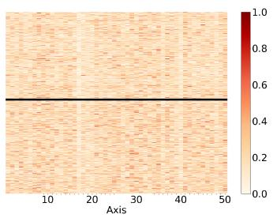  
(a) Pre-trained CWE, Raw

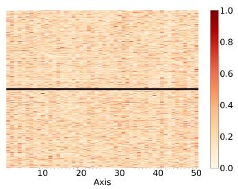  
(b) Pre-trained CWE, PCA

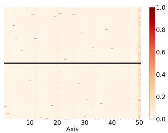  
(c) Pre-trained CWE, ICA

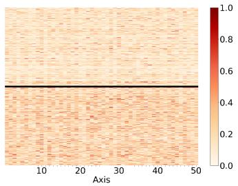  
(d) Fine-tuned SCWE, Raw

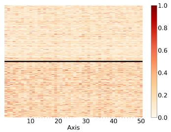  
(e) Fine-tuned SCWE, PCA

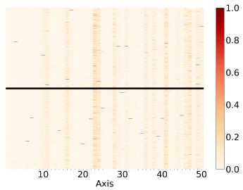  
(f) Fine-tuned SCWE, ICA  
Figure 1: Visualisation of the top-50 dimensions of pre-trained CWEs (XLM-RoBERTa) and SCWEs (XL-LEXEME) for each instance in the English WiC dataset, where the difference of vectors is calculated for (a/d) Raw vectors, (b/e) PCA-transformed axes, and (c/f) ICA-transformed axes. In each figure, the upper/lower half uses instances for the True/False labels. While the Raw dimensions display the information from the 0th to the 49th dimensions in the original order, the same observations are found in all dimensions.

RQ1: When do the contextual SCD-aware axes emerge? To investigate whether contextual semantic change-aware axes were already present in the pre-trained CWEs, or do they emerge during the fine-tuning step, for each sentence-pair in WiC datasets, we compute the difference between the two target word embeddings obtained from the pre-trained XLM-RoBERTa (CWEs) and the finetuned XL-LEXEME (SCWEs). To obtain the sets of target word embeddings, we follow Cassotti et al. (2023) by using a Sentence-BERT (Reimers and Gurevych, 2019) architecture. We conduct this analysis for the non-transformed original axes (indicated as Raw here onwards), as well as for the PCA/ICA-transformed axes in order to investigate whether such transformations can discover the axes specified for contextual semantic changes as proposed by Yamagiwa et al. (2023).3 In this paper, PCA/ICA-transformed axes are sorted by the experimental variance ratio/skewness, and this process is consistently applied where PCA or ICA is used. If a particular axis is sensitive to contextual semantic changes, it will take similar values in the two target word embeddings, thus having a near-zero value in their subtraction.

To address RQ1, we visualised the difference vectors for sentence pairs where the target word takes the same meaning in the two sentences (True) vs. different meanings (False). This visualisation was performed by following steps: (a) we prepared Raw or PCA/ICA-transformed axes; (b) for each WiC instance, which contains two sentences and a label, we calculated the difference between pair of sentences; (c) we normalised each axis (min=0 and max=1) for visualisation purposes.

As shown in Figure 1, we see that the axes encoding contextual semantic changes are not obvious in the original CWEs after pre-training (Figure 1a), but materialise during the fine-tuning process (Figure 1d). Similar trends are observed with PCA-transformations (Figures 1e and 1b), whereas ICA shows contrasting results (Figures 1f and 1c). In contrast to prior recommendations for using ICA for analysing CWE spaces (Yamagiwa et al., 2023), we find ICA to be less sensitive to contextual semantic changes of words. Interestingly, similar results have been shown in other languages/datasets(Appendix B). 4

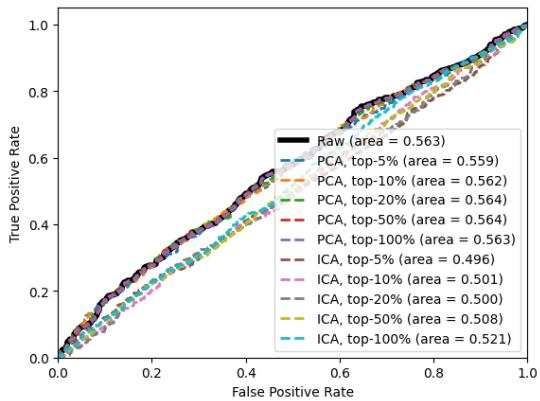

(a) Pre-trained CWE (XLM-RoBERTa)  
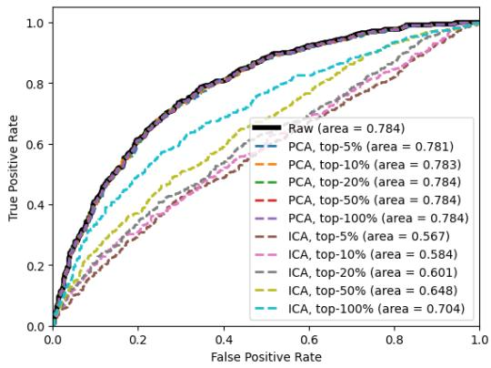  
(b) Fine-tuned SCWE (XL-LEXEME)  
Figure 2: The ROC curve on contextual semantic change task, the English WiC dataset. Raw indicates the performance of using full dimensions. PCA/ICA uses top-5/10/20/50/100% of axes.

RQ2: Can top-k PCA/ICA-transformed axes capture contextual semantic changes? Yamagiwa et al. (2023) discovered that ICAtransformed axes represent specific concepts and their linear combinations could represent more complex concepts (e.g. $c a r s + i t a l i a n = f e r r a r i )$ Based on this finding, we investigate whether a combination of top-k axes can collectively represent contextual semantic changes of words. Specifically, we select the top-k% of the axes to represent a target word embedding. We then compute the Euclidean distance between CWEs of the target word in each sentence for every test sentencepair in the WiC datasets. We predict the target word to have the same meaning in the two sentences, if the Euclidean distance is below a threshold value. We vary this threshold and report Area Under the Curve (AUC) of Receiver Operating Characteristic (ROC) curves, where higher AUC values are desirable. In Figure 2, we show results for top $k \in \{ 5 , 1 0 , 2 0 , 5 0 , 1 0 0 \}$ of the PCA/ICAtransformed axes and compare against the baseline that uses all of the Raw dimensions.

For the pre-trained CWEs (Figure 2a), we see that Raw reports slightly better AUC than PCA, but when fine-tuned (Figure 2b) PCA matches Raw even by using less than 10% of the axes. On the other hand, ICA reports lower AUC values than both Raw and PCA in both models. These results indicate that PCA is better suited for discovering axes specified for contextual semantic changes than ICA. We suspect that although ICA is able to retrieve concepts such as topics (Yamagiwa et al., 2023), it is less fluent when discovering task-specific axes that require the consideration of different types of information. In conclusion, (1) contextual semantic change-aware axes emerge during fine-tuning, and (2) they are discovered by PCA even within 10% of the principal components. Notably, in other languages/datasets, similar trends have been observed (Appendix B). These results suggest that contextual semantic changeaware dimensions can be observed within 10% of the PCA-transformed axes across different languages.

## 4 Temporal Semantic Changes

In contrast to contextual SCD, temporal SCD considers the problem of predicting whether a target word w represents different meanings in two text corpora $C _ { 1 }$ and $C _ { 2 } .$ , sampled at different points in time. For evaluations, we use the SemEval-2020 Task 1 dataset5 (Schlechtweg et al., 2020), which contains a manually rated set of target words for their temporal semantic changes in English, German, Swedish, and Latin.6

RQ3: Can top-k PCA/ICA-transformed axes capture temporal semantic changes? Similar to Figure 2, we investigate whether PCA/ICA can discover axes specified for temporal semantic changes by considering the top-k% of axes for $k \in \{ 5 , 1 0 , 2 0 , 5 0 , 1 0 0 \}$ . We calculate the semantic change score of w as the average pairwise Euclidean distance over the two sets of sentences containing the target word w in $C _ { 1 }$ and $C _ { 2 }$ as conducted in previous work (Kutuzov and Giulianelli, 2020; Laicher et al., 2021; Cassotti et al., 2023). Finally, w is predicted to have its meaning changed between $C _ { 1 }$ and $C _ { 2 }$ , if its semantic change score exceeds a pre-defined threshold. We vary this threshold and plot ROC in Figure 3.

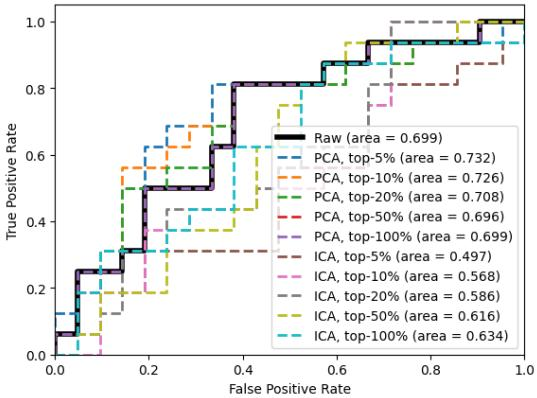

(a) Pre-trained CWE (XLM-RoBERTa)  
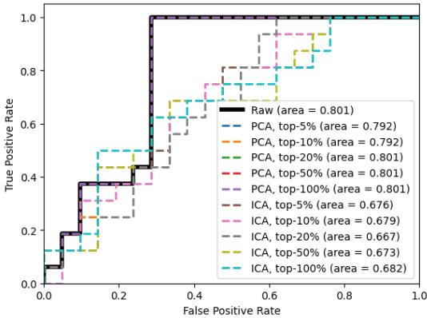  
(b) Fine-tuned SCWE (XL-LEXEME)  
Figure 3: The ROC curve on temporal semantic change task, SemEval-2020 Task 1 (English). Raw indicates the performance of using full dimensions. PCA/ICA uses top-5/10/20/50/100% of axes.

In pre-trained CWEs, we can see that the use of the top 5% to 20% axes transformed by PCA is more effective in temporal semantic change detection than when all of the Raw dimensions are used (Figure 3a). On the other hand, in fine-tuned SCWEs, Figure 3b indicates that PCA-transformed axes achieve the same AUC scores as Raw, similar to the contextual semantic change (Figure 2b). Similar to the observation in contextual semantic change, ICA returns the lowest performance.

To further investigate whether the top PCA/ICA axes can explain the degree of temporal semantic change, we measure the Spearman correlation between the semantic change scores and human ratings available in the SemEval-2020 Task 1 following the standard evaluation protocol for this task (Rosin et al., 2022; Rosin and Radinsky, 2022; Aida and Bollegala, 2023b; Cassotti et al., 2023; Periti and Tahmasebi, 2024; Aida and Bollegala, 2024). As shown in Figure 4 for the pre-trained CWEs (Figure 4a), using only 10% of the axes, PCA outperforms Raw that uses all axes. Moreover, for the fine-tuned SCWEs (Figure 4b), using only 10% of the axes PCA achieves the same performance as Raw. However, ICA consistently underperforms in both pre-trained and fine-tuned settings. Importantly, we see similar trends in other languages (Appendix B). These results suggest that temporal semantic change-aware dimensions can also be observed within 10% of PCAtransformed axes across different languages.

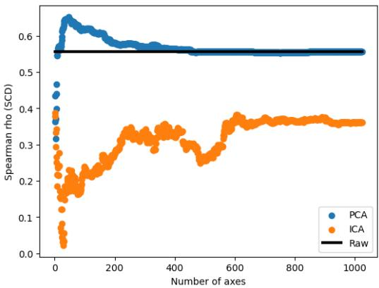

(a) Pre-trained CWE (XLM-RoBERTa)  
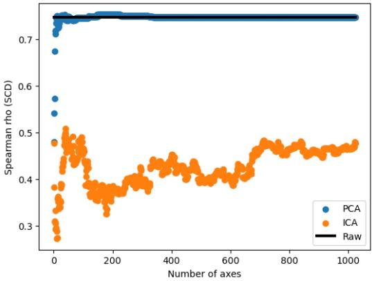  
(b) Fine-tuned SCWE (XL-LEXEME)  
Figure 4: Spearman’s rank correlation on temporal semantic change task, SemEval-2020 Task 1 (English). Raw indicates the performance of using full dimensions. PCA/ICA cumulatively uses sorted axes.

## 5 Conclusion

We found that there exists a smaller number of axes that encode contextual and temporal semantic changes of words in MLMs, which are accurately discovered by PCA. These findings have several important practical implications. First, it shows that MLMs can be compressed into efficient and accurate lower-dimensional embeddings when used for SCD tasks. Second, it suggests the possibility of efficiently updating a pre-trained MLM to capture novel semantic associations of words since the MLM was first trained, by updating only a smaller number of dimensions.

## Limitations

In this paper, we limited experiments to XLM-RoBERTa based MLM models. These models are all fine-tuned on WiC datasets and have reported state-of-the-art (SoTA) performance in SCD benchmarks. We consider it would be important to further validate the findings reported in this paper using other embedding models and across multiple downstream applications.

## Ethical Considerations

In this paper, we focus on investigating the existence of dedicated dimensions capturing contextual/temporal semantic changes of words. For the best of our knowledge, no ethical issues have been reported for the WiC and SCD datasets we used in our experiments. On the other hand, we also used publicly available pre-trained/fine-tuned MLMs, some of which are known to encode and potentially amplify unfair social biases (Basta et al., 2019). Whether such social biases are influenced by the dimension selection methods we consider in the paper must be carefully evaluated before deploying any MLMs in downstream applications.

## Acknowledgements

Taichi Aida would like to acknowledge the support by JST, the establishment of university fellowships towards the creation of science technology innovation, Grant Number JPMJFS2139.

## References

Taichi Aida and Danushka Bollegala. 2023a. Swap and predict – predicting the semantic changes in words across corpora by context swapping. In Findings of the Association for Computational Linguistics: EMNLP 2023, pages 7753–7772, Singapore. Association for Computational Linguistics.

Taichi Aida and Danushka Bollegala. 2023b. Unsupervised semantic variation prediction using the distribution of sibling embeddings. In Findings ofthe Associationfor Computational Linguistics: ACL 2023, pages 6868–6882, Toronto, Canada. Association for Computational Linguistics.

Taichi Aida and Danushka Bollegala. 2024. A semantic distance metric learning approach for lexical semantic change detection. In Findings of the Association for Computational Linguistics: ACL 2024, pages 7570–7584, Bangkok, Thailand. Association for Computational Linguistics.

Taichi Aida, Mamoru Komachi, Toshinobu Ogiso, Hiroya Takamura, and Daichi Mochihashi. 2021. A

comprehensive analysis of PMI-based models for measuring semantic differences. In Proceedings of the 35th Pacific Asia Conference on Language, Information and Computation, pages 21–31, Shanghai, China. Association for Computational Lingustics.

Christine Basta, Marta R. Costa-jussà, and Noe Casas. 2019. Evaluating the underlying gender bias in contextualized word embeddings. In Proceedings ofthe First Workshop on Gender Bias in Natural Language Processing, pages 33–39, Florence, Italy. Association for Computational Linguistics.

Pierluigi Cassotti, Lucia Siciliani, Marco DeGemmis, Giovanni Semeraro, and Pierpaolo Basile. 2023. XL-LEXEME: WiC pretrained model for cross-lingual LEXical sEMantic changE. In Proceedings of the 61st Annual Meeting ofthe Associationfor Computational Linguistics (Volume 2: Short Papers), pages 1577–1585, Toronto, Canada. Association for Computational Linguistics.

Alexis Conneau, Kartikay Khandelwal, Naman Goyal, Vishrav Chaudhary, Guillaume Wenzek, Francisco Guzmán, Edouard Grave, Myle Ott, Luke Zettlemoyer, and Veselin Stoyanov. 2020. Unsupervised cross-lingual representation learning at scale. In Proceedings of the 58th Annual Meeting of the Association for Computational Linguistics, pages 8440– 8451, Online. Association for Computational Linguistics.

Jacob Devlin, Ming-Wei Chang, Kenton Lee, and Kristina Toutanova. 2019. BERT: Pre-training of deep bidirectional transformers for language understanding. In Proceedings ofthe 2019 Conference of the North American Chapter ofthe Associationfor Computational Linguistics: Human Language Technologies, Volume 1 (Long and Short Papers), pages 4171–4186, Minneapolis, Minnesota. Association for Computational Linguistics.

Mariia Fedorova, Andrey Kutuzov, and Yves Scherrer. 2024. Definition generation for lexical semantic change detection. In Findings ofthe Associationfor Computational Linguistics: ACL 2024, pages 5712– 5724, Bangkok, Thailand. Association for Computational Linguistics.

William L. Hamilton, Jure Leskovec, and Dan Jurafsky. 2016. Diachronic word embeddings reveal statistical laws of semantic change. In Proceedings ofthe 54th Annual Meeting ofthe Associationfor Computational Linguistics (Volume 1: Long Papers), pages 1489–1501, Berlin, Germany. Association for Computational Linguistics.

Yoon Kim, Yi-I Chiu, Kentaro Hanaki, Darshan Hegde, and Slav Petrov. 2014. Temporal analysis of language through neural language models. In Proceedings of the ACL 2014 Workshop on Language Technologies and Computational Social Science, pages 61–65, Baltimore, MD, USA. Association for Computational Linguistics.

Vivek Kulkarni, Rami Al-Rfou, Bryan Perozzi, and Steven Skiena. 2015. Statistically significant detection of linguistic change. In WWW 2015, pages 625– 635.

Andrey Kutuzov and Mario Giulianelli. 2020. UiO-UvA at SemEval-2020 task 1: Contextualised embeddings for lexical semantic change detection. In Proceedings ofthe Fourteenth Workshop on Semantic Evaluation, pages 126–134, Barcelona (online). International Committee for Computational Linguistics.

Severin Laicher, Sinan Kurtyigit, Dominik Schlechtweg, Jonas Kuhn, and Sabine Schulte im Walde. 2021. Explaining and improving BERT performance on lexical semantic change detection. In Proceedings of the 16th Conference ofthe European Chapter ofthe Association for Computational Linguistics: Student Research Workshop, pages 192–202, Online. Association for Computational Linguistics.

Qianchu Liu, Edoardo Maria Ponti, Diana McCarthy, Ivan Vulic, and Anna Korhonen. 2021.´ AM2iCo: Evaluating word meaning in context across lowresource languages with adversarial examples. In Proceedings of the 2021 Conference on Empirical Methods in Natural Language Processing, pages 7151–7162, Online and Punta Cana, Dominican Republic. Association for Computational Linguistics.

Federico Martelli, Najla Kalach, Gabriele Tola, and Roberto Navigli. 2021. SemEval-2021 task 2: Multilingual and cross-lingual word-in-context disambiguation (MCL-WiC). In Proceedings ofthe 15th International Workshop on Semantic Evaluation (SemEval-2021), pages 24–36, Online. Association for Computational Linguistics.

Francesco Periti, David Alfter, and Nina Tahmasebi. 2024. Automatically generated definitions and their utility for modeling word meaning. In Proceedings of the 2024 Conference on Empirical Methods in Natural Language Processing, pages 14008–14026, Miami, Florida, USA. Association for Computational Linguistics.

Francesco Periti and Nina Tahmasebi. 2024. A systematic comparison of contextualized word embeddings for lexical semantic change. In Proceedings of the 2024 Conference ofthe North American Chapter of the Associationfor Computational Linguistics: Human Language Technologies (Volume 1: Long Papers), pages 4262–4282, Mexico City, Mexico. Association for Computational Linguistics.

Mohammad Taher Pilehvar and Jose Camacho-Collados. 2019. WiC: the word-in-context dataset for evaluating context-sensitive meaning representations. In Proceedings of the 2019 Conference of the North American Chapter of the Association for Computational Linguistics: Human Language Technologies, Volume 1 (Long and Short Papers), pages 1267–1273, Minneapolis, Minnesota. Association for Computational Linguistics.

Maxim Rachinskiy and Nikolay Arefyev. 2021. Gloss-Reader at SemEval-2021 task 2: Reading definitions improves contextualized word embeddings. In Proceedings ofthe 15th International Workshop on Semantic Evaluation (SemEval-2021), pages 756–762, Online. Association for Computational Linguistics.

Alessandro Raganato, Tommaso Pasini, Jose Camacho-Collados, and Mohammad Taher Pilehvar. 2020. XL-WiC: A multilingual benchmark for evaluating semantic contextualization. In Proceedings ofthe 2020 Conference on Empirical Methods in Natural Language Processing (EMNLP), pages 7193–7206, Online. Association for Computational Linguistics.

Nils Reimers and Iryna Gurevych. 2019. Sentence-BERT: Sentence embeddings using Siamese BERTnetworks. In Proceedings ofthe 2019 Conference on Empirical Methods in Natural Language Processing and the 9th International Joint Conference on Natural Language Processing (EMNLP-IJCNLP), pages 3982–3992, Hong Kong, China. Association for Computational Linguistics.

Alex Rosenfeld and Katrin Erk. 2018. Deep neural models of semantic shift. In Proceedings ofthe 2018 Conference of the North American Chapter of the Associationfor Computational Linguistics: Human Language Technologies, Volume 1 (Long Papers), pages 474–484, New Orleans, Louisiana. Association for Computational Linguistics.

Guy D. Rosin, Ido Guy, and Kira Radinsky. 2022. Time masking for temporal language models. In Proceedings ofthe Fifteenth ACM International Conference on Web Search and Data Mining, WSDM ’22, pages 833–841, New York, NY, USA. Association for Computing Machinery.

Guy D. Rosin and Kira Radinsky. 2022. Temporal attention for language models. In Findings ofthe Association for Computational Linguistics: NAACL 2022, pages 1498–1508, Seattle, United States. Association for Computational Linguistics.

Dominik Schlechtweg, Barbara McGillivray, Simon Hengchen, Haim Dubossarsky, and Nina Tahmasebi. 2020. SemEval-2020 task 1: Unsupervised lexical semantic change detection. In Proceedings of the Fourteenth Workshop on Semantic Evaluation, pages 1–23, Barcelona (online). International Committee for Computational Linguistics.

Nina Tahmasebi, Lars Borina, and Adam Jatowtb. 2021. Survey of computational approaches to lexical semantic change detection. Computational approaches to semantic change, 6:1.

Xiaohang Tang, Yi Zhou, and Danushka Bollegala. 2023. Learning dynamic contextualised word embeddings via template-based temporal adaptation. In Proceedings of the 61st Annual Meeting of the Associationfor Computational Linguistics (Volume 1: Long Papers), pages 9352–9369, Stroudsburg, PA, USA. Association for Computational Linguistics.

<table><tr><td>Dataset</td><td>Language</td><td>#Train</td><td>#Dev</td><td>#Test</td></tr><tr><td>Monolingual</td><td></td><td></td><td></td><td></td></tr><tr><td>WiC</td><td>English German</td><td>5.4k 48k</td><td>6.4k</td><td>1.4k 1.1k</td></tr><tr><td>XL-WiC</td><td>French Italian Arabic</td><td>39k 1.1k</td><td>8.9k 8.6k 0.2k</td><td>22k 0.6k</td></tr><tr><td>MCL-WiC</td><td>English French Russian Chinese</td><td>4.0k 一</td><td>0.5k 0.5k 0.5k 0.5k 0.5k</td><td>0.5k 0.5k 0.5k 0.5k 0.5k</td></tr><tr><td>Cross-lingual</td><td></td><td></td><td></td><td>1.0k</td></tr><tr><td>AM²iCo</td><td>German Russian Japanese Chinese Arabic Korean Finnish Turkish Indonesian Basque</td><td>50k 28k 16k 13k 9.6k 7.0k 6.3k 3.9k 1.6k 1.0k</td><td>0.5k 0.5k 0.5k 0.5k 0.5k 0.5k 0.5k 0.5k 0.5k 0.5k</td><td>1.0k 1.0k 1.0k 1.0k 1.0k 1.0k 1.0k 1.0k 1.0k</td></tr></table>

Table 2: Statistics of the contextual SCD benchmarks used in the fine-tuning for XL-LEXEME. #Train, #Dev, and #Test show the number of instances. AM2iCo is a cross-lingual contextual SCD benchmark, where the second language in each pair is English.

Hiroaki Yamagiwa, Momose Oyama, and Hidetoshi Shimodaira. 2023. Discovering universal geometry in embeddings with ICA. In Proceedings ofthe 2023 Conference on Empirical Methods in Natural Language Processing, pages 4647–4675, Singapore. Association for Computational Linguistics.

Zijun Yao, Yifan Sun, Weicong Ding, Nikhil Rao, and Hui Xiong. 2018. Dynamic word embeddings for evolving semantic discovery. In WSDM 2018, page 673–681.

Yi Zhou and Danushka Bollegala. 2021. Learning sensespecific static embeddings using contextualised word embeddings as a proxy. In Proceedings ofthe 35th Pacific Asia Conference on Language, Information and Computation, pages 493–502, Shanghai, China. Association for Computational Lingustics.

## A Data Statistics

Full statistics of contextual and temporal SCD benchmarks are shown in Table 2 and Table 3.7

## B Full Results

In this section, we present the full results of contextual and temporal SCD tasks. For the contextual

<table><tr><td>Language</td><td>Time Period</td><td>#Targets</td><td>#Tokens</td></tr><tr><td>English</td><td>1810-1860 1960-2010</td><td>37</td><td>6.5M 6.7M</td></tr><tr><td>German</td><td>1800-1899 1946-1990</td><td>48</td><td>70.2M 72.3M</td></tr><tr><td>Swedish</td><td>1790-1830 1895-1903</td><td>31</td><td>71.0M 110.0M</td></tr><tr><td>Latin</td><td>B.C. 200–0 0-2000</td><td>40</td><td>1.7M 9.4M</td></tr></table>

Table 3: Statistics of the temporal SCD benchmark, SemEval-2020 Task 1. #Targets and #Tokens show the number of target words and tokens, respectively.

SCD, visualisations of instances in all datasets are as follows: XLWiC (Figure 5, Figure 6, and Figure 7), MCLWiC (Figures 8, 9, 10, 11, and 12), and AM2iCo (Figures 13, 14, 15, 16, 17, 18, 19, 20, 21, and 22). Similar to § 3, the contextual semantic change-aware axes emerged after the finetuning process. Moreover, full results related to the prediction task are as follows: XLWiC (Figure 23), MCLWiC (Figure 24 and Figure 25), AM2iCo (Figure 26, Figure 27, and Figure 28). As shown in §3, 10% PCA-transformed axes are able to obtain contextual semantic change-aware dimensions.

On the other hand, for the temporal SCD, results for other languages (German, Swedish, and Latin) are shown in Figure 29 and Figure 30. Similar to §4, temporal semantic change-aware dimensions are observed within 10% PCA-transformed axes. However, there are some difficulties in obtaining these dimensions by PCA-transformed axes with insufficient pretraining data (Swedish) (Conneau et al., 2020) or lack of supervision for fine-tuning (Latin) shown in Table 2. In those cases, the use of ICA-transformed axes proved to be effective. More detailed analysis and understanding of those axes for interpretability will be addressed in future work.

7WiC, XL-WiC, and MCL-WiC are licensed under the Creative Commons Attribution-NonCommercial 4.0 License, while AM2iCo and SemEval-2020 Task 1 are licensed under the Creative Commons Attribution 4.0 International License.

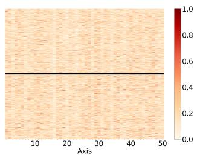  
(a) Pre-trained CWE, Raw

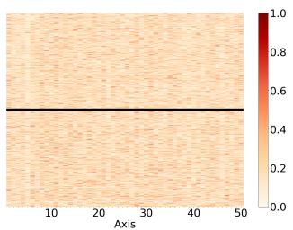  
(b) Pre-trained CWE, PCA

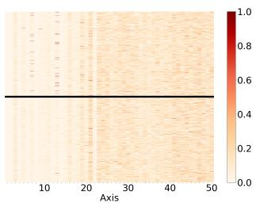  
(c) Pre-trained CWE, ICA

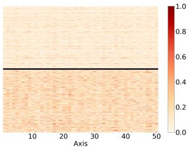  
(d) Fine-tuned SCWE, Raw

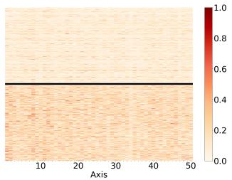  
(e) Fine-tuned SCWE, PCA

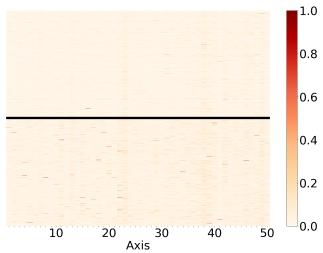  
(f) Fine-tuned SCWE, ICA

Figure 5: Visualisation of the top-50 dimensions of pre-trained CWEs (XLM-RoBERTa) and SCWEs (XL-LEXEME) for each instance in XLWiC (German) dataset, where the difference of vectors is calculated for (a/d) Raw vectors, (b/e) PCA-transformed axes, and (c/f) ICA-transformed axes. In each figure, the upper/lower half uses instances for the True/False labels.

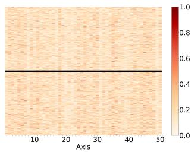  
(a) Pre-trained CWE, Raw

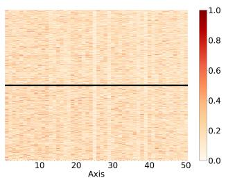

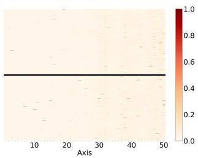

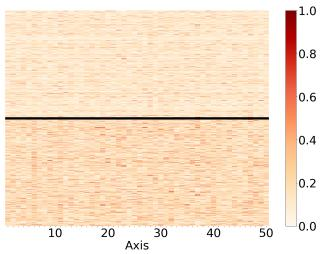  
(d) Fine-tuned SCWE, Raw

(b) Pre-trained CWE, PCA  
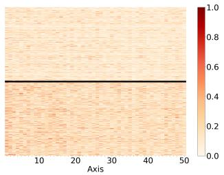  
(e) Fine-tuned SCWE, PCA

(c) Pre-trained CWE, ICA  
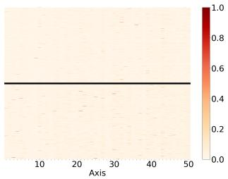  
(f) Fine-tuned SCWE, ICA

Figure 6: Visualisation of the top-50 dimensions of pre-trained CWEs (XLM-RoBERTa) and SCWEs (XL-LEXEME) for each instance in XLWiC (French) dataset, where the difference of vectors is calculated for (a/d) Raw vectors, (b/e) PCA-transformed axes, and (c/f) ICA-transformed axes. In each figure, the upper/lower half uses instances for the True/False labels.

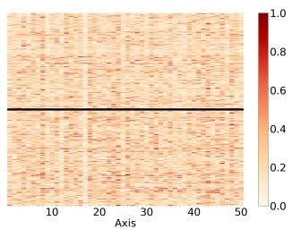  
(a) Pre-trained CWE, Raw

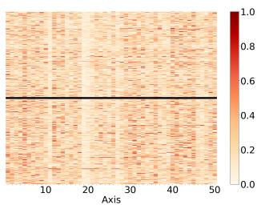  
(b) Pre-trained CWE, PCA

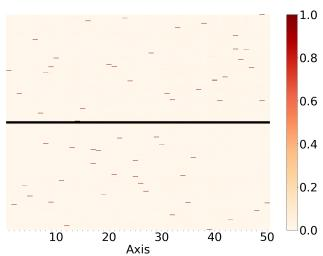  
(c) Pre-trained CWE, ICA

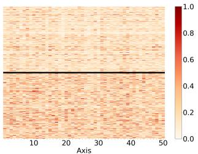  
(d) Fine-tuned SCWE, Raw

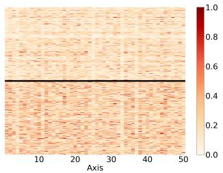  
(e) Fine-tuned SCWE, PCA

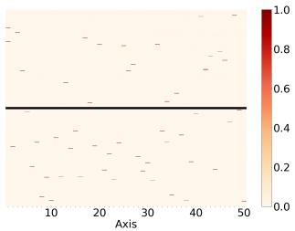  
(f) Fine-tuned SCWE, ICA

Figure 7: Visualisation of the top-50 dimensions of pre-trained CWEs (XLM-RoBERTa) and SCWEs (XL-LEXEME) for each instance in XLWiC (Italian) dataset, where the difference of vectors is calculated for (a/d) Raw vectors, (b/e) PCA-transformed axes, and (c/f) ICA-transformed axes. In each figure, the upper/lower half uses instances for the True/False labels.

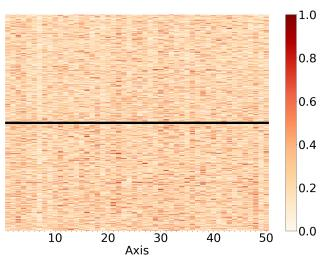  
(a) Pre-trained CWE, Raw

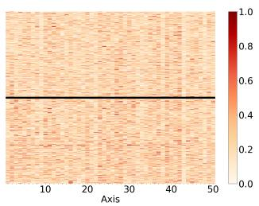

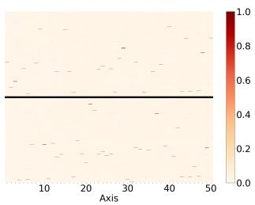

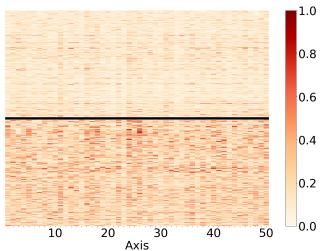  
(d) Fine-tuned SCWE, Raw

(b) Pre-trained CWE, PCA  
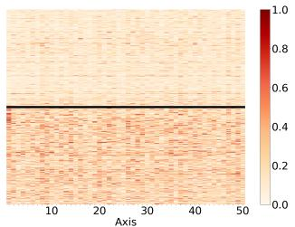  
(e) Fine-tuned SCWE, PCA

(c) Pre-trained CWE, ICA  
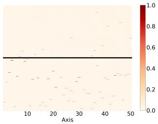  
(f) Fine-tuned SCWE, ICA

Figure 8: Visualisation of the top-50 dimensions of pre-trained CWEs (XLM-RoBERTa) and SCWEs (XL-LEXEME) for each instance in MCLWiC (Arabic) dataset, where the difference of vectors is calculated for (a/d) Raw vectors, (b/e) PCA-transformed axes, and (c/f) ICA-transformed axes. In each figure, the upper/lower half uses instances for the True/False labels.

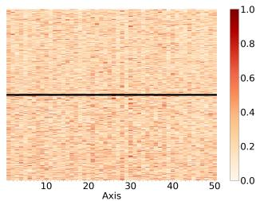  
(a) Pre-trained CWE, Raw

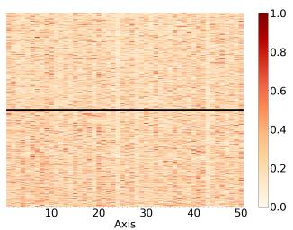  
(b) Pre-trained CWE, PCA

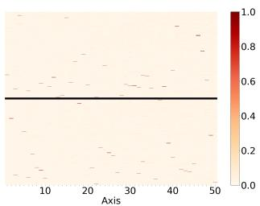  
(c) Pre-trained CWE, ICA

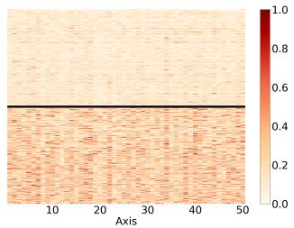  
(d) Fine-tuned SCWE, Raw

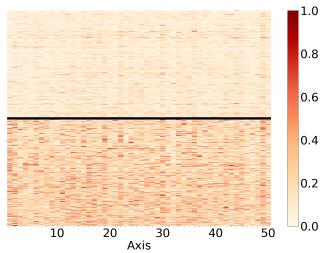  
(e) Fine-tuned SCWE, PCA

  
(f) Fine-tuned SCWE, ICA

Figure 9: Visualisation of the top-50 dimensions of pre-trained CWEs (XLM-RoBERTa) and SCWEs (XL-LEXEME) for each instance in MCLWiC (English) dataset, where the difference of vectors is calculated for (a/d) Raw vectors, (b/e) PCA-transformed axes, and (c/f) ICA-transformed axes. In each figure, the upper/lower half uses instances for the True/False labels.

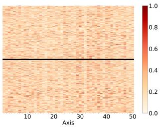  
(a) Pre-trained CWE, Raw

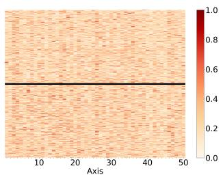

  
(b) Pre-trained CWE, PCA

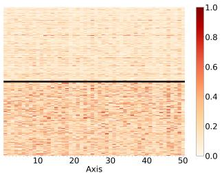  
(d) Fine-tuned SCWE, Raw

(c) Pre-trained CWE, ICA  
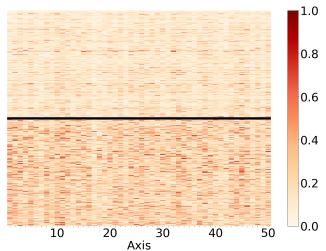  
(e) Fine-tuned SCWE, PCA

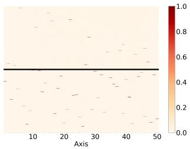  
(f) Fine-tuned SCWE, ICA

Figure 10: Visualisation of the top-50 dimensions of pre-trained CWEs (XLM-RoBERTa) and SCWEs (XL-LEXEME) for each instance in MCLWiC (French) dataset, where the difference of vectors is calculated for (a/d) Raw vectors, (b/e) PCA-transformed axes, and (c/f) ICA-transformed axes. In each figure, the upper/lower half uses instances for the True/False labels.

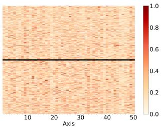  
(a) Pre-trained CWE, Raw

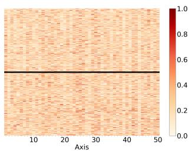  
(b) Pre-trained CWE, PCA

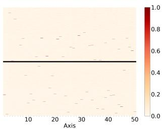  
(c) Pre-trained CWE, ICA

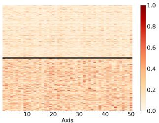  
(d) Fine-tuned SCWE, Raw

  
(e) Fine-tuned SCWE, PCA

  
(f) Fine-tuned SCWE, ICA

Figure 11: Visualisation of the top-50 dimensions of pre-trained CWEs (XLM-RoBERTa) and SCWEs (XL-LEXEME) for each instance in MCLWiC (Russian) dataset, where the difference of vectors is calculated for (a/d) Raw vectors, (b/e) PCA-transformed axes, and (c/f) ICA-transformed axes. In each figure, the upper/lower half uses instances for the True/False labels.

  
(a) Pre-trained CWE, Raw

  
(b) Pre-trained CWE, PCA

  
(d) Fine-tuned SCWE, Raw

(c) Pre-trained CWE, ICA  
  
(e) Fine-tuned SCWE, PCA

  
(f) Fine-tuned SCWE, ICA

Figure 12: Visualisation of the top-50 dimensions of pre-trained CWEs (XLM-RoBERTa) and SCWEs (XL-LEXEME) for each instance in MCLWiC (Chinese) dataset, where the difference of vectors is calculated for (a/d) Raw vectors, (b/e) PCA-transformed axes, and (c/f) ICA-transformed axes. In each figure, the upper/lower half uses instances for the True/False labels.

  
(a) Pre-trained CWE, Raw

  
(b) Pre-trained CWE, PCA

  
(c) Pre-trained CWE, ICA

  
(d) Fine-tuned SCWE, Raw

  
(e) Fine-tuned SCWE, PCA

  
(f) Fine-tuned SCWE, ICA

Figure 13: Visualisation of the top-50 dimensions of pre-trained CWEs (XLM-RoBERTa) and SCWEs (XL-LEXEME) for each instance in AM2iCo (German) dataset, where the difference of vectors is calculated for (a/d) Raw vectors, (b/e) PCA-transformed axes, and (c/f) ICA-transformed axes. In each figure, the upper/lower half uses instances for the True/False labels.

  
(a) Pre-trained CWE, Raw

  
(b) Pre-trained CWE, PCA

  
(d) Fine-tuned SCWE, Raw

  
(e) Fine-tuned SCWE, PCA

(c) Pre-trained CWE, ICA  
  
(f) Fine-tuned SCWE, ICA

Figure 14: Visualisation of the top-50 dimensions of pre-trained CWEs (XLM-RoBERTa) and SCWEs (XL-LEXEME) for each instance in AM2iCo (Russian) dataset, where the difference of vectors is calculated for (a/d) Raw vectors, (b/e) PCA-transformed axes, and (c/f) ICA-transformed axes. In each figure, the upper/lower half uses instances for the True/False labels.

  
(a) Pre-trained CWE, Raw

  
(b) Pre-trained CWE, PCA

  
(c) Pre-trained CWE, ICA

  
(d) Fine-tuned SCWE, Raw

  
(e) Fine-tuned SCWE, PCA

  
(f) Fine-tuned SCWE, ICA

Figure 15: Visualisation of the top-50 dimensions of pre-trained CWEs (XLM-RoBERTa) and SCWEs (XL-LEXEME) for each instance in AM2iCo (Japanese) dataset, where the difference of vectors is calculated for (a/d) Raw vectors, (b/e) PCA-transformed axes, and (c/f) ICA-transformed axes. In each figure, the upper/lower half uses instances for the True/False labels.

  
(a) Pre-trained CWE, Raw

  
(b) Pre-trained CWE, PCA

  
(d) Fine-tuned SCWE, Raw

(c) Pre-trained CWE, ICA  
  
(e) Fine-tuned SCWE, PCA

  
(f) Fine-tuned SCWE, ICA

Figure 16: Visualisation of the top-50 dimensions of pre-trained CWEs (XLM-RoBERTa) and SCWEs (XL-LEXEME) for each instance in AM2iCo (Chinese) dataset, where the difference of vectors is calculated for (a/d) Raw vectors, (b/e) PCA-transformed axes, and (c/f) ICA-transformed axes. In each figure, the upper/lower half uses instances for the True/False labels.

  
(a) Pre-trained CWE, Raw

  
(b) Pre-trained CWE, PCA

  
(c) Pre-trained CWE, ICA

  
(d) Fine-tuned SCWE, Raw

  
(e) Fine-tuned SCWE, PCA

  
(f) Fine-tuned SCWE, ICA

Figure 17: Visualisation of the top-50 dimensions of pre-trained CWEs (XLM-RoBERTa) and SCWEs (XL-LEXEME) for each instance in AM2iCo (Arabic) dataset, where the difference of vectors is calculated for (a/d) Raw vectors, (b/e) PCA-transformed axes, and (c/f) ICA-transformed axes. In each figure, the upper/lower half uses instances for the True/False labels.

  
(a) Pre-trained CWE, Raw

  
(d) Fine-tuned SCWE, Raw

(b) Pre-trained CWE, PCA  
  
(e) Fine-tuned SCWE, PCA

(c) Pre-trained CWE, ICA  
  
(f) Fine-tuned SCWE, ICA

Figure 18: Visualisation of the top-50 dimensions of pre-trained CWEs (XLM-RoBERTa) and SCWEs (XL-LEXEME) for each instance in AM2iCo (Korean) dataset, where the difference of vectors is calculated for (a/d) Raw vectors, (b/e) PCA-transformed axes, and (c/f) ICA-transformed axes. In each figure, the upper/lower half uses instances for the True/False labels.

  
(a) Pre-trained CWE, Raw

  
(b) Pre-trained CWE, PCA

  
(c) Pre-trained CWE, ICA

  
(d) Fine-tuned SCWE, Raw

  
(e) Fine-tuned SCWE, PCA

  
(f) Fine-tuned SCWE, ICA

Figure 19: Visualisation of the top-50 dimensions of pre-trained CWEs (XLM-RoBERTa) and SCWEs (XL-LEXEME) for each instance in AM2iCo (Finnish) dataset, where the difference of vectors is calculated for (a/d) Raw vectors, (b/e) PCA-transformed axes, and (c/f) ICA-transformed axes. In each figure, the upper/lower half uses instances for the True/False labels.

  
(a) Pre-trained CWE, Raw

  
(d) Fine-tuned SCWE, Raw

(b) Pre-trained CWE, PCA  
  
(e) Fine-tuned SCWE, PCA

(c) Pre-trained CWE, ICA  
  
(f) Fine-tuned SCWE, ICA

Figure 20: Visualisation of the top-50 dimensions of pre-trained CWEs (XLM-RoBERTa) and SCWEs (XL-LEXEME) for each instance in AM2iCo (Turkish) dataset, where the difference of vectors is calculated for (a/d) Raw vectors, (b/e) PCA-transformed axes, and (c/f) ICA-transformed axes. In each figure, the upper/lower half uses instances for the True/False labels.

  
(a) Pre-trained CWE, Raw

  
(b) Pre-trained CWE, PCA

  
(c) Pre-trained CWE, ICA

  
(d) Fine-tuned SCWE, Raw

  
(e) Fine-tuned SCWE, PCA

  
(f) Fine-tuned SCWE, ICA

Figure 21: Visualisation of the top-50 dimensions of pre-trained CWEs (XLM-RoBERTa) and SCWEs (XL-LEXEME) for each instance in AM2iCo (Indonesian) dataset, where the difference of vectors is calculated for (a/d) Raw vectors, (b/e) PCA-transformed axes, and (c/f) ICA-transformed axes. In each figure, the upper/lower half uses instances for the True/False labels.

  
(a) Pre-trained CWE, Raw

  
(d) Fine-tuned SCWE, Raw

(b) Pre-trained CWE, PCA  
  
(e) Fine-tuned SCWE, PCA

(c) Pre-trained CWE, ICA  
  
(f) Fine-tuned SCWE, ICA

Figure 22: Visualisation of the top-50 dimensions of pre-trained CWEs (XLM-RoBERTa) and SCWEs (XL-LEXEME) for each instance in AM2iCo (Basque) dataset, where the difference of vectors is calculated for (a/d) Raw vectors, (b/e) PCA-transformed axes, and (c/f) ICA-transformed axes. In each figure, the upper/lower half uses instances for the True/False labels.

  
(a) Pre-trained CWE, De

  
(b) Fine-tuned SCWE, De

  
(c) Pre-trained CWE, Fr

  
(d) Fine-tuned SCWE, Fr

  
(e) Pre-trained CWE, It

  
(f) Fine-tuned SCWE, It  
Figure 23: The ROC curve on the contextual SCD benchmark, XLWiC dataset (De: German, Fr: French, It: Italian). Raw indicates the performance of using full dimensions. PCA/ICA uses top-5/10/20/50/100% of axes.

  
(a) Pre-trained CWE, Ar

  
(b) Fine-tuned SCWE, Ar

  
(c) Pre-trained CWE, En

  
(d) Fine-tuned SCWE, En

  
(e) Pre-trained CWE, Fr

  
(f) Fine-tuned SCWE, Fr  
Figure 24: The ROC curve on the contextual SCD benchmark, MCLWiC dataset (Ar: Arabic, En: English, Fr: French). Raw indicates the performance of using full dimensions. PCA/ICA uses top-5/10/20/50/100% of axes.

  
(a) Pre-trained CWE, Ru

  
(b) Fine-tuned SCWE, Ru

  
(c) Pre-trained CWE, Zh

  
(d) Fine-tuned SCWE, Zh  
Figure 25: The ROC curve on the contextual SCD benchmark, MCLWiC dataset (Ru: Russian, Zh: Chinese). Raw indicates the performance of using full dimensions. PCA/ICA uses top-5/10/20/50/100% of axes.

  
(a) Pre-trained CWE, De

  
(b) Fine-tuned SCWE, De

  
(c) Pre-trained CWE, Ru

  
(d) Fine-tuned SCWE, Ru

  
(e) Pre-trained CWE, Ja

  
(f) Fine-tuned SCWE, Ja

  
(g) Pre-trained CWE, Zh

  
(h) Fine-tuned SCWE, Zh  
Figure 26: The ROC curve on the contextual SCD benchmark, AM2iCo dataset (De: German, Ru: Russian, Ja: Japanese, Zh: Chinese). Raw indicates the performance of using full dimensions. PCA/ICA uses top-5/10/20/50/100% of axes.

  
(a) Pre-trained CWE, Ar

  
(b) Fine-tuned SCWE, Ar

  
(c) Pre-trained CWE, Ko

  
(d) Fine-tuned SCWE, Ko

  
(e) Pre-trained CWE, Fi

  
(f) Fine-tuned SCWE, Fi  
Figure 27: The ROC curve on the contextual SCD benchmark, $\mathbf { A M ^ { 2 } i C o }$ dataset (Ar: Arabic, Ko: Korean, Fi: Finnish). Raw indicates the performance of using full dimensions. PCA/ICA uses top-5/10/20/50/100% of axes.

  
(a) Pre-trained CWE, Tr

  
(b) Fine-tuned SCWE, Tr

  
(c) Pre-trained CWE, Id

  
(d) Fine-tuned SCWE, Id

  
(e) Pre-trained CWE, Eu

  
(f) Fine-tuned SCWE, Eu

Figure 28: The ROC curve on the contextual SCD benchmark, $\mathbf { A M ^ { 2 } i C o }$ dataset (Tr: Turkish, Id: Indonesian, Eu: Basque). Raw indicates the performance of using full dimensions. PCA/ICA uses top-5/10/20/50/100% of axes

  
(a) Pre-trained CWE, De

  
(b) Fine-tuned SCWE, De

  
(c) Pre-trained CWE, Sv

  
(d) Fine-tuned SCWE, Sv

  
(e) Pre-trained CWE, La

  
(f) Fine-tuned SCWE, La

Figure 29: The ROC curve on the temporal SCD benchmark, SemEval-2020 Task 1 (De: German, Sv: Swedish, La: Latin). Raw indicates the performance of using full dimensions. PCA/ICA uses top-5/10/20/50/100% of axes.

  
(a) Pre-trained CWE, De

  
(b) Fine-tuned SCWE, De

  
(c) Pre-trained CWE, Sv

  
(d) Fine-tuned SCWE, Sv

  
(e) Pre-trained CWE, La

  
(f) Fine-tuned SCWE, La  
Figure 30: Spearman’s rank correlation on the temporal SCD benchmark, SemEval-2020 Task 1 (De: German, Sv: Swedish, La: Latin). Raw indicates the performance of using full dimensions. PCA/ICA cumulatively uses sorted axes.