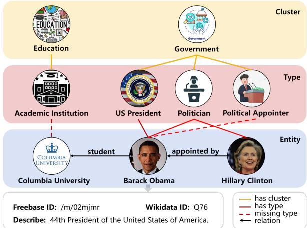
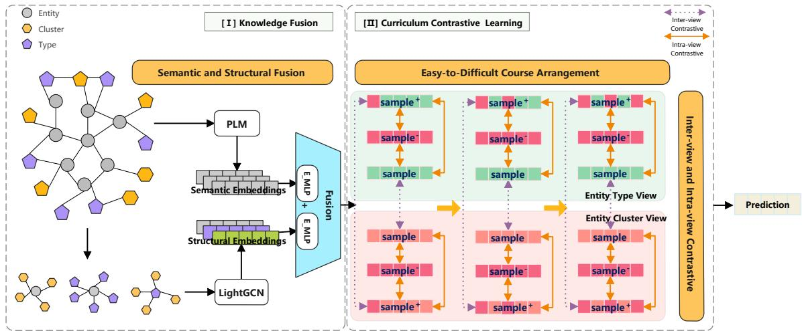

# Knowledge Graph Entity Typing with Curriculum Contrastive Learning

Hao Wang1 , Minghua Nuo1,2,3(B) , and Shan Jiang1

1College of Computer Science, Inner Mongolia University, Hohhot 010021, Inner Mongolia, China 2National and Local Joint Engineering Research Center of Intelligent Information Processing Technology for Mongolian, Hohhot 010021, Inner Mongolia, China 3Inner Mongolia Key Laboratory of Multilingual Artificial Intelligence Technology, Hohhot 010021, Inner Mongolia, China nuominghua@163.com

## Abstract

The Knowledge Graph Entity Typing (KGET) task aims to predict missing type annotations for entities in knowledge graphs. Most recent studies only focus on the structural information from an entity’s neighborhood or semantic information from textual representations of entities or relations. In this paper, inspired by curriculum learning and contrastive learning, we propose the CCLET model using the Curriculum Contrastive Learning strategy for KGET, which uses the Pre-trained Language Model (PLM) and the graph model to fuse the entity related semantic and the structural information of the Knowledge Graph (KG) respectively. Our CCLET model consists of two main parts. In the Knowledge Fusion part, we design an Enhanced-MLP architecture to fuse the text of the entity’s description, related triplet and tuples; In the Curriculum Contrastive Learning part, we define the difficulty of the training course by controlling the level of added noise, we aim to accurately learn with curriculum contrastive learning strategy from easy to difficult. Our extensive experiments demonstrate that the CCLET model outperforms recent state-of-theart models, verifying its effectiveness in the KGET task.

## 1 Introduction

Entity Typing (ET) is a key task in KG reasoning, aiming to infer missing type annotations to improve the completeness and enrichment of Knowledge Graphs. Entity types in KG provide a high-level summary of their instance entities, it can assist to understand entities’ inherent characteristics and are widely used in natural language processing (NLP) tasks such as entity linking and question answering systems(Chen et al., 2020) (Wang et al., 2019b).

However, existing knowledge graphs frequently suffer from incomplete type annotations(Zhu et al., 2015), because they are manually constructed by domain experts. This limits their effectiveness across various applications. Specifically, in the FB15kET dataset, 10% of entities labeled as "/music/artist" are missing the "/people/person" type. Furthermore, entity types are highly diverse, with 47.4% of entities having more than 10 types, and some reaching up to 133. For instance, in Figure 1, "Barack Obama" could be annotated as a "/government/political\_appointer" based on relations "appointed by" and entity type “politician” related to entity "Hillary Clinton". Additionally, in most KGs, type annotations are often incomplete.

  
Figure 1: An example of "Barack Obama", illustrated the inference of missing types of the target entity based on the structural and textual information provided in the local subgraph.

Recent research has explored different approaches, including embedding-based, graph neural network (GNN)-based, Transformer-based, and hybrid methods. These approaches have the following limitations. First, most recent models focus on either the semantic or structural aspects of the KG, without effectively leveraging both, like CompoundE(Ge et al., 2023), MCLET(Hu et al., 2023), and MiNer(Jin et al., 2022). Second, in training process, recent models learn all features simultaneously disregarding the distinction between difficulty levels, which makes the training slower, as seen in models like SSET(Li et al., 2024) and TET(Hu et al., 2022).

To address these issues, we propose the Knowledge Graph Entity Typing with the Curriculum Contrastive Learning (CCLET) model. First, the model encodes entities’ names and descriptions through a PLM and aggregates structural information using LightGCN(He et al., 2020). In the fusion part, an Enhanced-MLP structure is used to effectively combine semantic and structural information. Second, a curriculum contrastive learning strategy is introduced. This strategy gradually increases task difficulty, allowing the model to learn simple features first and handle more complex ones later. The key contributions of this paper are:

• We designed an Enhanced-MLP structure that fuses semantic and structural information, thereby enriching entity representation.

• In the contrastive learning process, we introduced a curriculum contrastive learning strategy that controls noise levels from easy to difficult. And, we design a new contrastive loss function.

• We demonstrated through extensive experiments that our CCLET model significantly improves mean rank (MR) results.

• Additionally, the CCLET model exhibits effective inference capability on small-scale datasets, achieving optimal results in realworld applications.

## 2 Related Work

## 2.1 Knowledge Graph Entity Typing

Embedding-based Methods: ETE(Moon et al., 2017) first introduced KGET by utilizing contextual knowledge graph embeddings. ConnectE(Zhao et al., 2020) combines local type assertions and global triplet knowledge, constructing two novel embedding models to enhance KGET performance.

GNN-based Methods: MiNer(Jin et al., 2022) aggregates multi-hop neighborhood information to utilize neighborhood co-occurrence relationships for better KGET results. MCLET(Hu et al., 2023) introduces a multi-view study and expert mixed strategy, providing new insights for KGET.

Transformer-based Methods: TET(Hu et al., 2022) integrates local, global, and contextual information, improving entity type inference through enhanced semantic representation.

Hybrid-based Methods: SSET(Li et al., 2024) merges Transformer and GNN approaches, combining semantic and structural data through a PLM model, improving accuracy by reranking the inference results.

## 2.2 Contrastive Learning

Contrastive learning has achieved success in fields like computer vision (CV)(Chen et al., 2021a) and NLP(Cao et al., 2022). Despite its strengths, it faces challenges with large-scale datasets and computational resources. It focuses on minimizing the distance between similar data while maximizing the distance between dissimilar data.

## 2.3 Curriculum Learning

Curriculum learning(Bengio et al., 2009), inspired by human learning, arranges tasks by increasing difficulty, helping models gradually improve generalization. It has been effective in domains such as CV(Soviany et al., 2022) and NLP(Vakil and Amiri, 2023). In this paper, we combine curriculum learning with contrastive learning to better tackle the KGET task, leveraging the advantages of both.

## 3 Problem Definition

Let E, R, and T be a finite set of entities, relation types, and entity types, respectively. A knowledge graph $G _ { t r i p l e s }$ is the union of $G _ { t y p e s }$ and G, where $G _ { t r i p l e s }$ represents a set of triples of the form (s, r, o), where s, o∈E, and $\mathbf { r } { \in } \mathbb { R }$ , and $G _ { t y p e s }$ represents a set of pairs of the form (e, t), where e∈E and t∈T. To use a uniform representation, we convert the pair (e, t) into a triple (e, has\_type, t). In most knowledge graph datasets, such as FB15k(Bollacker et al., 2008) and YAGO43k(Suchanek et al., 2007), entities are provided with labels and descriptions, while relations and types are represented by their textual identifiers. We assume that this textual information is meaningful and contains semantic information that is valuable for the KGET task. In this paper, we consider the KGET task, which aims to predict missing types from T in a triple of $G _ { t y p e s }$

## 4 Methodology

To solve the problems of insufficient utilization of textual semantic and graphical structure information, and training consumption cost, in this paper, we propose the Knowledge Graph Entity Typing with Curriculum Contrastive Learning model, as shown in Figure 2, for the KGET task.

  
Figure 2: Overall structure of CCLET model, consists of two parts: Knowledge Fusion part (left), Curriculum Contrastive Learning part (right)

## 4.1 Knowledge Fusion

Structural Information Processing. For the KGET task, the two parts of the input KG, $G _ { t r i p l e s }$ and $G _ { t y p e s }$ , can be used for reasoning. The main problem is how to make better use of the type graph $G _ { t y p e s }$ which will affect the overall performance of the model to a large extent. Therefore, according to the previous research methods(Zhu et al., 2021), in order to effectively integrate the existing structural knowledge into the type graph, after introducing the coarse-grained clustering information into the type graph, the three-level structure is generated, so that the corresponding graph will have three types of edges: entity-type, cluster-type, and entity-cluster. In this way, different subgraphs focus on different knowledge perspectives. For example, entity-cluster subgraphs focus more on more abstract content than entity-type subgraphs. The three different subgraphs are then encoded by LightGCN.

Semantic Information Processing. In our CCLET model, the PLM is used to encode the entity’s name and description to obtain the semantic information. Firstly, we choose the BERT model as our pre-trained language model, to capture rich contextual semantic information.

We obtain entity descriptions by matching entity names in the dataset with Wikidata API, for instance, according to the entity ID "/m/02mjmr", can find entity name "Barack Obama" and the entity description "44th President of the United States of America.". Then, the type, the cluster of the entity as well as the above-mentioned entity description are together input into the BERT model for encoding. Finally, BERT model would output the semantic embeddings of the input text.

Knowledge Fusion. Structural embeddings of entities, clusters, and types encoded by the Lignt-GCN, denoted as Struct. , Struct. and Struct. . In addition, to enhance the scalability of the model, we also incorporate a set of learnable semantic embeddings for each entity, cluster, and type, denoted as $S e m . _ { e } , S e m . _ { c }$ and Sem.t, respectively. To enhance the scalability of the model, we propose an Enhanced-MLP architecture that fuses the semantic and structural embeddings of each entity, cluster, and type into a unified dimension space by integrating batch normalization, dropout, and residual connection. The processing step for Enhanced-MLP is as follows Equation 1:

$$
y _ { 1 } = D r o p o u t \left( E L U \left( B N _ { 1 } ( W _ { 1 } x + b _ { 1 } ) \right) , p \right)\tag{1}
$$

where x represents the input vector, $W _ { n } , b _ { n }$ represents the weights and biases of the nth fully connected layer, represents the drop probability of the Dropout layer, and $B N _ { n }$ represents the nth batch normalization, which combines linear transformation and nonlinear activation.

A second fully connected layer and batch normalization, including optional residual connections as follows Equation 2:

$$
y _ { 2 } = B N _ { 2 } ( W _ { 2 } y _ { 1 } + b _ { 2 } ) + x\tag{2}
$$

Then unified embedding is achieved by two

Enhanced-MLP architectures and L2 normalization.

$$
S t r u c t . = \frac { E n h a n c e d M L P ( S t r u c t . ) } { \| E n h a n c e d M L P ( S t r u c t . ) \| _ { 2 } }\tag{3}
$$

$$
\mathit { S e m . } = \frac { E n h a n c e d M L P ( S e m . ) } { \| E n h a n c e d M L P ( S e m . ) \| _ { 2 } }\tag{4}
$$

$$
h y b r i d = S t r u c t . + S e m .\tag{5}
$$

Where Struct., Sem. and hybrid are structural, semantic, and unified embeddings of an entity, a relation, or a type, as follows Equation 3, 4 and 5, respectively.

## 4.2 Curriculum Contrastive Learning

Easy to Difficult Curriculum Arrangement. The creative thought of curriculum learning is to improve the learning effect of the model by gradually increasing the difficulty of the task. Generally, curriculum learning is to adjust the difficulty of learning by controlling the noise level of the training data. In this paper, we design an automatic curriculum learning strategy by controlling the noise size in epochs, which realizes the progressive learning of the model by gradually increasing the noise during the training process. Specifically, in the early stage of training, the data with lower noise is used for training. During the training process, the noise of the data is gradually increased, so as to improve the robustness and generalization ability of the model. We perturb the original data with Gaussian noise, which is Equation 6 as follows:

$$
\tilde { \mathrm { x } } = \mathrm { x } + \mathrm { N } ( 0 , \sigma ^ { 2 } )\tag{6}
$$

Where ˜x represents the data after adding noise, x is the original data, 0 and $\sigma ^ { 2 }$ represents Gaussian noise with mean and variance.

In this paper, we choose the dynamic strategy of increasing the noise level linearly. The following is the Equation 7 of the dynamic noise strategy:

$$
\sigma ( \mathrm { E } ) = \sigma _ { 0 } + ( \sigma _ { \mathrm { m a x } } - \sigma _ { 0 } ) \cdot \frac { \mathrm { E } } { \mathrm { E } _ { \mathrm { m a x } } }\tag{7}
$$

Where $\sigma _ { 0 }$ is the initial noise level, $\sigma _ { \mathrm { m a x } }$ is the maximum noise level, $\mathrm { E } _ { m a x }$ is the maximum number of epochs, and E is the current number of epochs. The noise level is updated once every new course until the maximum noise level is reached.

Curriculum Contrastive Learning. Following the work of cross-view contrastive learning(Zhu et al., 2021), we utilize curriculum contrastive learning and modify the loss function. In this part, the contrast samples are divided into two parts: intra-view and inter-view contrast and a new joint loss function is designed. Different views can capture content at different levels of granularity. For example, the semantic content in entity-cluster view is more coarse-grained than the semantic content in entity-type view.

In both views, there are three parts: selecting a node sample as the anchor, treating the data with added noise as the positive sample sample+, and considering other nodes as the negative sample sample−.

In the inter-view contrast part, the representation of the same node in two views and the noise representation are treated as positive sample pairs, and the representation of other nodes in the other view is treated as negative sample pairs.

In the intra-view contrast part, the samples with noise and the original samples in the same view are regarded as positive sample pairs, and the samples with noise and the original samples with other nodes are formed as negative sample pairs, respectively.

Define the temperature parameter τ and calculate the similarity between the input vectors. The similarity is calculated using the normalized cosine similarity as follows Equation 8:

$$
\sin ( \mathrm { z } _ { 1 } , \mathrm { z } _ { 2 } ) = { \frac { \mathrm { z } _ { 1 } \cdot \mathrm { z } _ { 2 } } { \left\| \mathrm { z } _ { 1 } \right\| \left\| \mathrm { z } _ { 2 } \right\| } }\tag{8}
$$

The contrast loss function $L ( X , Y )$ is defined to calculate the loss of different contrast pairs as follows Equation 9, 10 and 11:

$$
L ( X , Y ) = - \log \left( \frac { \mathrm { d i a g } ( e ^ { ( \sin ( X , Y ) / \tau ) } ) } { N - R } \right)\tag{9}
$$

$$
N = \sum ( e ^ { \sin ( X , X ) / \tau } + e ^ { \sin ( X , Y ) / \tau } )\tag{10}
$$

$$
R = \mathrm { d i a g } ( e ^ { \sin ( X , X ) / \tau } )\tag{11}
$$

Where,diag(A) denotes the diagonal elements of the matrix A, and $\textstyle \sum A$ denotes the sum of all elements of the matrix A.

Hence, the contrastive loss of the original embedding vector is represented as $L _ { \mathrm { o r i g } } = L ( X , Y ) \operatorname { \lrcorner }$ + $L ( Y , X )$ . Contrastive loss of the noise embedding vector is represented as $L _ { \mathrm { n o i s e } } = L ( X _ { \mathrm { n o i s e } } , Y _ { \mathrm { n o i s e } } ) +$

<table><tr><td>Datasets</td><td>FB15kET</td><td>YAGO43kET</td></tr><tr><td>Entities</td><td>14,951</td><td>42,335</td></tr><tr><td>Relations</td><td>1,345</td><td>37</td></tr><tr><td>Types</td><td>3,584</td><td>45,182</td></tr><tr><td>Clusters</td><td>1,081</td><td>1,124</td></tr><tr><td>Train.triples</td><td>483,142</td><td>331,686</td></tr><tr><td>Train.tuples</td><td>136,618</td><td>375,853</td></tr><tr><td>Valid.tuples</td><td>15,848</td><td>43,111</td></tr><tr><td>Test.tuples</td><td>15,847</td><td>43,119</td></tr></table>

Table 1: Statistics of the FB15kET and YAGO43kET Datasets

$L ( Y _ { \mathrm { n o i s e } } , X _ { \mathrm { n o i s e } } )$ .Finally, the hybrid of contrastive loss of the original and noise embedding vectors are represented as $L _ { \mathrm { o r i g - n o i s e } } ~ = ~ L ( X , X _ { \mathrm { n o i s e } } )$ + $L ( Y , Y _ { \mathrm { n o i s e } } )$ . The joint loss is as follows Equation 12:

$$
\mathrm { L _ { j o i n t } = m e a n [ \sum \left( L _ { o r i g } + L _ { n o i s e } + L _ { o r i g - n o i s e } \right) ] }\tag{12}
$$

For KGET task, we employ the SFNA(Hu et al., 2022) loss function denoted as $L _ { E T }$ . We further integrate the contrastive loss with SFNA loss to obtain the joint loss function of our CCLET model as follows Equation 13:

$$
\mathrm { L } = \mathrm { L } _ { \mathrm { E T } } + \lambda \mathrm { L } _ { \mathrm { j o i n t } } + \gamma \Vert \Theta \Vert _ { 2 } ^ { 2 }\tag{13}
$$

Where λ and $\gamma$ are the hyperparameters used to control the contrastive loss and L2 regularization and are the set of model parameters.

## 5 Experiment

## 5.1 Datasets

This paper uses two real-world KGs: FB15k and YAGO43k, and the datasets are derived from Google Freebase and YAGO knowledge base, respectively. The two entity typing datasets of this paper, FB15kET(Xie et al., 2016) and YAGO43kET(Moon et al., 2017) provide entity type assertions by mapping entities in two KGs to their entity types, Table 1 lists the statistics of the two datasets. For textual information, labels and descriptions of FB15k entities published by Xie et al. (2016), are used. The YAGO43k dataset provides text labels for each entity, and Wikidata API is used to collect descriptions of entities in YAGO43k.

## 5.2 Baselines

In order to verify the effectiveness, this paper selects these baseline models to compare with the CCLET model. Embedding-based Methods: ETE(Moon et al., 2017), CORE(Ge et al., 2022), RotatE(Sun et al., 2019), ConnectE(Zhao et al., 2020) and CompoundE(Ge et al., 2023). Transformer-based Methods: HittER(Chen et al., 2021b), CoKE(Wang et al., 2019a) and TET(Hu et al., 2022) GNN-based models: MRGAT(Zhao et al., 2023), RACE2T(Zou et al., 2022), AttEt(Zhuo et al., 2022), CET(Pan et al., 2021), and MiNer(Jin et al., 2022), MCLET(Hu et al., 2023). Hybrid-based Methods: SSET(Li et al., 2024).

## 5.3 Evaluation Metrics

Entity typing task aims to obtain a ranked list of possible types t for each pair (e, t) in the test set. Five evaluation metrics are selected in this paper: mean rank (MR), mean reciprocal rank (MRR), and Hits@k(k∈1,3,10). MR represents the average ranking of the correct answers within the result list, with lower ranks reflecting better outcomes, MRR defines the reciprocal ranking of the first correct answer, and Hits@k calculates the percentage of the top k correct types. Follow the evaluation metrics found in most entity typing work (Pan et al., 2021);(Hu et al., 2022).

## 5.4 Main Results

Table 2 shows the performance of CCLET and all baselines on the two datasets. Among GNN-based methods, our model achieves SOTA performance across all five metrics on both datasets. On the FB15kET dataset, our model reaches a Hit@1 of 70.2%, which is 3.4% higher than the second-best result, with Hit@3 and Hit@10 also improving by over 1%. Compared to the latest hybrid model, SSET(Li et al., 2024), our model still outperforms it on the FB15kET dataset. We can conclude that our model performs well on smaller datasets. On the YAGO43kET dataset, our model achieves the best MR value, which has improved by 68 positions compared to the SSET model, while other metrics also show competitive, second-best results.

Compared to the FB15kET dataset, the YAGO43kET dataset contains a larger number of entities and entity types, but it includes substantially fewer relationships. Therefore, accurately distinguishing between the entity types in the YAGO43kET dataset is more challenging. Thus on the YAGO43kET dataset, our model failed to exceed the SSET model on Hit@10; so, we continued to observe results from Hit@50 to Hit@200 in Table 3. The results illustrate that, when the evaluation range is expanded, there remains potential for improvement on larger datasets like YAGO43kET, particularly, in terms of MR, our model shows significant improvement. Table 3 demonstrates that our model outperforms the SSET model by 3.2% and improves Hit@100 by 3.1%. Moreover, other metrics show gains of at least 2.4%. These results can be attributed to the CCLET model’s effective fusion of semantic information from the PLM and the structural information extracted by LightGCN through the Enhanced-MLP structure. This fusion strategy enables our model to capture both the contextual semantic features and the graph structure features, avoiding the limitations of relying on a single information source. Furthermore, the use of contrastive learning enhances the model’s ability to differentiate subtle feature differences by maximizing the similarity between positive samples and minimizing the similarity between negative samples.

<table><tr><td>Methods</td><td>FB15kET</td><td></td><td></td><td>YAGO43kET</td></tr><tr><td colspan="5">Hit@1 Hit@3 Hit@10 MR MRR Hit@1 Hit@3 Hit@10 MR MRR</td></tr><tr><td>ETE(Moon et al., 2017)†</td><td>Embedding-based methods 38.5% 55.3% 71.9%</td><td>50.0%</td><td>13.7% 26.3%</td><td>42.2%</td><td>23.0%</td></tr><tr><td>CORE(Ge et al., 2022)†</td><td>48.9% 66.3% 81.6%</td><td>60.0% 24.2%</td><td>39.2%</td><td>55.0%</td><td>35.0%</td></tr><tr><td>ConnectE(Zhao et al., 2020)†</td><td>49.6% 64.3% 79.9%</td><td>42 59.0%</td><td>16.0% 30.9%</td><td>47.9%</td><td>28.0%</td></tr><tr><td>RotatE(Sun et al., 2019)†</td><td>52.3% 69.9% 84.0%</td><td>18 63.2% 33.9%</td><td>53.7%</td><td>69.5%</td><td>316 46.2%</td></tr><tr><td>CompoundE(Ge et al., 2023)† 52.5% 71.9%</td><td>85.9%</td><td>64.0% 36.4%</td><td>55.8%</td><td>70.3%</td><td>48.0%</td></tr><tr><td colspan="6"></td></tr><tr><td>HittER(Chen et al., 2021b)</td><td>Transformer-based methods</td><td>42.2% 16.3%</td><td></td><td>39.0%</td><td></td></tr><tr><td>CoKE(Wang et al., 2019a)</td><td>33.3% 46.6% 58.8%</td><td>46.5% 24.4% 38.7%</td><td>25.9%</td><td>54.2%</td><td>24.0%</td></tr><tr><td>TET(Hu et al., 2022)†</td><td>37.9% 51.0% 62.4% 63.8% 76.2% 87.2%</td><td>71.7% 40.8%</td><td>57.1%</td><td>69.5%</td><td>34.4% 51.0%</td></tr><tr><td colspan="6">GNN-based methods</td></tr><tr><td>MRGAT(Zhao et al., 2023)†</td><td>56.2% 66.3% 80.4%</td><td>63.0% 24.3% 34.3%</td><td></td><td>48.2%</td><td>32.0%</td></tr><tr><td>RACE2T(Zou et al., 2022)†</td><td>56.1% 68.8% 81.7%</td><td>64.6% 24.8%</td><td>37.6%</td><td>52.3%</td><td>34.4%</td></tr><tr><td>AttEt(Zhuo et al., 2022)†</td><td>51.7% 67.7% 82.1%</td><td>62.0%24.4%</td><td>41.3%</td><td>56.5%</td><td>35.0%</td></tr><tr><td>CET(Pan et al., 2021)†</td><td>61.3% 74.5% 85.6%</td><td>19 69.7% 39.8%</td><td>56.7%</td><td>69.6%</td><td>250 50.3%</td></tr><tr><td>MiNer(Jin et al., 2022)†</td><td>65.4% 76.8% 87.5%</td><td>15 72.8%</td><td>41.2% 58.9%</td><td>71.4%</td><td>223 52.1%</td></tr><tr><td>MCLET(Hu et al., 2023)†</td><td>67.7% 79.3% 89.1%</td><td>75.0%</td><td>43.6% 61.3%</td><td>73.5%</td><td>54.3%</td></tr><tr><td>CCLET(OURS) 70.2%</td><td>81.1% 90.1%</td><td>11 77.0%</td><td>44.8% 62.8%</td><td>74.5%</td><td>176 55.0%</td></tr><tr><td colspan="6"></td></tr><tr><td>SSET(Li et al., 2024)†</td><td>Hybrid-based methods 69.3% 80.0% 89.5%</td><td>12 76.1% 47.3% 64.4% 76.2%</td><td></td><td></td><td>244 57.6%</td></tr></table>

Table 2: Experiment results of KGET on FB15kET and YAGO43kET datasets. The best results are in bold and the second-best ones are in underlined. †: results are from the original papers. ‡: results are taken from Hu et al. (2023).

As shown in Table 4, our model completes training in just 2.8 hours on FB15kET and 11.8 hours on YAGO43kET, representing time reductions of 75% and 70%, respectively, compared to SSET. These significant promotions in training efficiency are owing to the BERT model, trained on an NVIDIA GeForce RTX 3090 GPU for 500 epochs. The faster training times can be attributed to the simpler structure of our model compared to SSET, as well as the advantages of leveraging pre-trained models. Since CCLET utilizes BERT to encode semantic information, it significantly reduces training time from scratch while simultaneously enhancing the model’s ability to understand semantics. Moreover, the curriculum contrastive learning strategy, which progressively increases the difficulty by adjusting the noise level in the data, enables our model to first capture basic features and then gradually tackle more complex ones, boosting training efficiency.

<table><tr><td>Model MR H@50</td><td>H@100</td><td></td><td>H@150 H@200</td></tr><tr><td>SSET 245</td><td>80.8% 85.1%</td><td>87.9%</td><td>89.5%</td></tr><tr><td>CCLET 176</td><td>84.0% 88.2%</td><td>90.5%</td><td>91.9%</td></tr></table>

Table 3: Comparison table of other metrics on YAGO43kET dataset(H@k is the shorthand for Hit@k)
<table><tr><td>Model</td><td>FB15kET</td><td>YAGO43kET</td></tr><tr><td>SSET</td><td>11.3 hours</td><td>38.9 hours</td></tr><tr><td>CCLET</td><td> $2 . 8 \mathrm { h o u r s } _ { \downarrow 7 5 \% }$ </td><td>11.8 hours↓70%</td></tr></table>

Table 4: Training Time Comparison Table

<table><tr><td>Exp.</td><td>Model Settings</td><td>Hit@1</td><td>Hit@3</td><td>Hit@10</td><td>MR</td><td>MRR</td></tr><tr><td>1</td><td>Structure Only</td><td>68.9%</td><td>79.8%</td><td>89.6%</td><td>12</td><td>76.0%</td></tr><tr><td>2</td><td>Structure + Entity Semantic</td><td>70.2%</td><td>81.1%</td><td>90.1%</td><td>11</td><td>77.0%</td></tr><tr><td>3</td><td>Structure + Entity &amp; Type Semantic</td><td>69.0%</td><td>80.2%</td><td>89.7%</td><td>12</td><td>76.0%</td></tr><tr><td>4</td><td>Structure + Entity &amp; Type &amp; Cluster Semantic</td><td>68.7%</td><td>79.7%</td><td>89.4%</td><td>12</td><td>75.8%</td></tr></table>

Table 5: Structural and Semantic Fusion Results on the FB15kET dataset

<table><tr><td>Exp.</td><td>Struct.</td><td>Sem.</td><td>Contr.</td><td>Curric.</td><td>Hit@1</td><td>Hit@3</td><td>Hit@10</td><td>MR</td><td>MRR</td></tr><tr><td>1</td><td>√</td><td></td><td></td><td></td><td>66.5%</td><td>79.1%</td><td>89.6%</td><td>12</td><td>74.5%</td></tr><tr><td>2</td><td>√</td><td>√</td><td></td><td></td><td>66.7%</td><td>79.4%</td><td>89.9%</td><td>12</td><td>74.6%</td></tr><tr><td>3</td><td>√</td><td>√</td><td>√</td><td></td><td>69.5%</td><td>80.0%</td><td>89.6%</td><td>12</td><td>76.3%</td></tr><tr><td>4</td><td>√</td><td>√</td><td>√</td><td>√</td><td>70.2%</td><td>81.1%</td><td>90.1%</td><td>11</td><td>77.0%</td></tr><tr><td>5</td><td>√</td><td></td><td>√</td><td>√</td><td>68.7%</td><td>79.7%</td><td>89.4%</td><td>15</td><td>75.8%</td></tr><tr><td>6</td><td>√</td><td></td><td></td><td>√</td><td>67.7%</td><td>79.3%</td><td>89.1%</td><td>15</td><td>75.0%</td></tr></table>

Table 6: Ablation experiment results

To further explore the impact of semantic and structural information on entity type prediction, we conducted a series of comparative experiments, as summarized in Table 5. In these experiments, text-based semantic information was incrementally integrated into a graph structure model.

The results, presented in Table 5, indicate that Exp. 2 achieves the highest performance across all five metrics, confirming that the combination of entity semantic information and structural information of entities enhances prediction accuracy. By comparing Exp. 1 with Exp. 2, 3, and 4, it is evident that adding semantic information improves performance in most cases, with the exception of Exp. 4, where the results are slightly lower than those of Exp. 1. This suggests that adding more semantic information is not always beneficial excessive or irrelevant semantic data can sometimes degrade prediction performance. These experiments also weaken the importance of entity semantic information in the KGET task, while highlighting that excessive, irrelevant semantic information may negatively affect model performance.

## 5.5 Ablation Studies

As shown in Table 6, six groups of ablation studies were conducted on the FB15kET dataset to evaluate the effectiveness of each part in the proposed model. In the ablation study, we focused on semantic information, structural information, contrastive learning, and curriculum learning. In Table 6, structural information is represented as "Struct.", semantic information as "Sem.", contrastive learning as "Contr.", and curriculum learning as "Curric.". The results in Table 6 demonstrate that across Exp.1, 2, 3, and 4, the performance improves with the addition of each part, confirming the effectiveness of the individual components. The comparison between Exp.2 and Exp.3 shows that incorporating contrastive learning boosts Hit@1 by nearly 3%, indicating that contrastive learning enhances the model’s ability to capture subtle data differences. Similarly, comparing Exp.3 and 4 with Exp.5 and 6 reveals substantial improvements in Hit@10 and Hit@1, respectively, suggesting that the model’s generalization ability is enhanced by the gradual curriculum learning strategy. Additionally, in Exp.1 and 2 with 3 and 6, all five metrics improve when semantic information is included, demonstrating that semantic information is beneficial to enhance the model’s reasoning capabilities.

## 6 Case Studies

In this section, we analyze representative prediction results from the FB15kET dataset for case analysis. These examples demonstrate performance variations with different entity types. The results indicate that our model is capable of handling information-rich entity types.

Table 7 presents a comparison of predicted rankings between the SSET model and the CCLET model. Overall, our model demonstrates superior performance in most cases. For most entity types, it significantly improves the type rankings, particularly entities such as " educational television", "multiple sclerosis" and "snowboarding" where the highest rankings improved by as much as 2264 positions. This substantial improvement is due to the inclusion of entity descriptions, particularly in types with limited training data such as education, medicine, and sports. For other types of entities like "Hook" and "Pushing Daisies", our model also exhibits the significant improvement. These entities belong to entertainment and cultural types, which have richer and more straightforward informations.

<table><tr><td rowspan="2">Entity</td><td rowspan="2">Golden Entity Type</td><td colspan="2">Rank</td></tr><tr><td>SSET</td><td>OURS</td></tr><tr><td>/m/0295sy (Hook)</td><td>/base/allthingsnewyork/topic</td><td>343</td><td>1</td></tr><tr><td>/m/02r1ysd (Pushing Daisies)</td><td>/base/hindisoundtracks/topic</td><td>380</td><td>1</td></tr><tr><td>/m/052vwh (time in China)</td><td>/base/greeneducation/topic</td><td>728</td><td>1</td></tr><tr><td>/m/09qgm (snowboarding)</td><td>/business/employer</td><td>1712</td><td>26</td></tr><tr><td>/m/0gg81w (educational television)</td><td>/tv/tv_network</td><td>2291</td><td>27</td></tr><tr><td>/m/0dcqh (multiple sclerosis)</td><td>/fictional_universe/fictional_object</td><td>3226</td><td>1140</td></tr></table>

Table 7: Comparison table of correct result predicted position
<table><tr><td>Entity</td><td>Golden Entity Type</td><td>Rank</td><td>Predicted Type</td><td>Score</td></tr><tr><td rowspan="6">/m/0n95v (Chiswick) /m/09c7w0 (United States of America) /m/0h3tv (Valencia)</td><td>/location/</td><td>2</td><td>/location/</td><td>0.9980</td></tr><tr><td>location</td><td></td><td>/statistical_region</td><td></td></tr><tr><td>/user/tsegeran/random/</td><td>2</td><td>/base/ontologies/ ontology_instance</td><td>0.9902</td></tr><tr><td>taxonomy_subject /base/aareas/schema/</td><td>2</td><td>/base/tagit/</td><td>0.9780</td></tr><tr><td>administrative_area</td><td>4</td><td>place /location/</td><td></td></tr><tr><td>/astronomy/celestial_object _with_coordinate_system</td><td></td><td>country</td><td>0.9751</td></tr><tr><td>(Earth) /m/015f (Brazil)</td><td>/user/tsegeran/random/ taxonomy_subject</td><td>3</td><td>/base/locations/ countries</td><td>0.9741</td></tr></table>

Table 8: Case of mistakenly ranked entities with high prediction score

In Table 8, we analyze cases where high prediction scores led to errors. These examples show that high scores do not always guarantee accuracy, particularly for entities with multiple types. The model may focus on certain features while overlooking more precise types.

For example, for "Chiswick," despite similar predictions (e.g., statistical\_area and location), the model gave a high confidence score of 0.9980, maybe due to Chiswick’s specific geostatistical characteristics. Similarly, "United States of America," with up to 133 entity types, was predicted as "ontology\_instance," suggesting the model generalized this entity across contexts without understanding its real types.

## 7 Conclusion

In this paper, we propose CCLET, a novel model that effectively combines semantic and structural information through a curriculum contrastive learning approach to address the KGET task. Our work introduces two key innovations: first, the integration of entity names and descriptions as semantic information with structural information; and second, the use of a curriculum contrastive learning method that gradually increases training difficulty to enhance the model’s robustness and stability. CCLET achieves Hit@1 scores of 70.2% on FB15kET and 44.8% on YAGO43kET, demonstrating its effectiveness in improving entity type completion accuracy. Additionally, our model achieves the best average ranking across both datasets. These results show CCLET’s potential for broader applications in general knowledge graph tasks.

## 8 Limitations

Despite the promising results, our model has several limitations. First, the utilization of semantic information can be further optimized. The fusion method of semantic and structural information, while effective, could benefit from more sophisticated and deeper models that better mine semantic features. Second, while CCLET performs well on small-scale datasets, its performance on larger datasets is unsatisfactory. In large-scale datasets, the redundant features and noise can interfere with model training, potentially degrading performance. Future work could focus on addressing these issues to further improve CCLET’s performance and applicability in large-scale knowledge graph scenarios.

## Acknowledgements

This work was supported by the National Natural Science Foundation of China (No.62366038, No.61966025), the Natural Science Foundation of Inner Mongolia (No.2023MS06010), the fund of Supporting the Reform and Development of Local Universities (Disciplinary Construction), and the special research project of First-class Discipline of Inner Mongolia A. R. of China under Grant YLXKZX-ND-036. We also would like to express our sincere gratitude to the editor and anonymous reviewers for their valuable comments, which have greatly improved this paper.

## References

Yoshua Bengio, Jérôme Louradour, Ronan Collobert, and Jason Weston. 2009. Curriculum learning. In Proceedings ofthe 26th Annual International Conference on Machine Learning, ICML ’09, page 41–48, New York, NY, USA. Association for Computing Machinery.

Kurt Bollacker, Colin Evans, Praveen Paritosh, Tim Sturge, and Jamie Taylor. 2008. Freebase: a collaboratively created graph database for structuring human knowledge. In Proceedings ofthe 2008 ACM SIGMOD International Conference on Management ofData, SIGMOD ’08, page 1247–1250, New York, NY, USA. Association for Computing Machinery.

Rui Cao, Yihao Wang, Yuxin Liang, Ling Gao, Jie Zheng, Jie Ren, and Zheng Wang. 2022. Exploring the impact of negative samples of contrastive learning: A case study of sentence embedding. In Findings ofthe Associationfor Computational Linguistics: ACL 2022, pages 3138–3152, Dublin, Ireland. Association for Computational Linguistics.

Pengguang Chen, Shu Liu, and Jiaya Jia. 2021a. Jigsaw clustering for unsupervised visual representation learning. 2021 IEEE/CVF Conference on Computer Vision and Pattern Recognition (CVPR), pages 11521– 11530.

Sanxing Chen, Xiaodong Liu, Jianfeng Gao, Jian Jiao, Ruofei Zhang, and Yangfeng Ji. 2021b. HittER: Hierarchical transformers for knowledge graph embeddings. In Proceedings of the 2021 Conference on Empirical Methods in Natural Language Processing, pages 10395–10407, Online and Punta Cana, Dominican Republic. Association for Computational Linguistics.

Shuang Chen, Jinpeng Wang, Feng Jiang, and Chin-Yew Lin. 2020. Improving entity linking by modeling latent entity type information. Proceedings ofthe AAAI Conference on Artificial Intelligence, 34(05):7529– 7537.

Xiou Ge, Yun Cheng Wang, Bin Wang, and C.-C. Jay Kuo. 2023. Compounding geometric operations for knowledge graph completion. In Proceedings of the 61st Annual Meeting ofthe Associationfor Computational Linguistics (Volume 1: Long Papers), pages 6947–6965, Toronto, Canada. Association for Computational Linguistics.

Xiou Ge, Yun-Cheng Wang, Bin Wang, and C.C. Jay Kuo. 2022. Core: A knowledge graph entity type prediction method via complex space regression and embedding. Pattern Recognition Letters, 157:97– 103.

Xiangnan He, Kuan Deng, Xiang Wang, Yan Li, Yong-Dong Zhang, and Meng Wang. 2020. Lightgcn: Simplifying and powering graph convolution network for recommendation. In Proceedings of the 43rd International ACM SIGIR Conference on Research and Development in Information Retrieval, SIGIR ’20, page 639–648, New York, NY, USA. Association for Computing Machinery.

Zhiwei Hu, Victor Basulto, Zhiliang Xiang, Ru Li, and Jeff Pan. 2023. Multi-view contrastive learning for entity typing over knowledge graphs. In Proceedings of the 2023 Conference on Empirical Methods in Natural Language Processing, pages 12950–12963, Singapore. Association for Computational Linguistics.

Zhiwei Hu, Victor Gutierrez-Basulto, Zhiliang Xiang, Ru Li, and Jeff Pan. 2022. Transformer-based entity typing in knowledge graphs. In Proceedings of the 2022 Conference on Empirical Methods in Natural Language Processing, pages 5988–6001, Abu Dhabi, United Arab Emirates. Association for Computational Linguistics.

Zhuoran Jin, Pengfei Cao, Yubo Chen, Kang Liu, and Jun Zhao. 2022. A good neighbor, a found treasure: Mining treasured neighbors for knowledge graph entity typing. In Proceedings of the 2022 Conference on Empirical Methods in Natural Language Processing, pages 480–490, Abu Dhabi, United Arab Emirates. Association for Computational Linguistics.

Muzhi Li, Minda Hu, Irwin King, and Ho-fung Leung. 2024. The integration of semantic and structural

knowledge in knowledge graph entity typing. In Proceedings of the 2024 Conference of the North American Chapter ofthe Associationfor Computational Linguistics: Human Language Technologies (Volume 1: Long Papers), pages 6625–6638, Mexico City, Mexico. Association for Computational Linguistics.

Changsung Moon, Paul Jones, and Nagiza F. Samatova. 2017. Learning entity type embeddings for knowledge graph completion. In Proceedings of the 2017 ACM on Conference on Information and Knowledge Management, CIKM ’17, page 2215–2218, New York, NY, USA. Association for Computing Machinery.

Weiran Pan, Wei Wei, and Xian-Ling Mao. 2021. Context-aware entity typing in knowledge graphs. In Findings of the Association for Computational Linguistics: EMNLP 2021, pages 2240–2250, Punta Cana, Dominican Republic. Association for Computational Linguistics.

Petru Soviany, Radu Tudor Ionescu, Paolo Rota, and Nicu Sebe. 2022. Curriculum learning: A survey. Int. J. Comput. Vision, 130(6):1526–1565.

Fabian M. Suchanek, Gjergji Kasneci, and Gerhard Weikum. 2007. Yago: a core of semantic knowledge. In Proceedings of the 16th International Conference on World Wide Web, WWW ’07, page 697–706, New York, NY, USA. Association for Computing Machinery.

Zhiqing Sun, Zhi-Hong Deng, Jian-Yun Nie, and Jian Tang. 2019. Rotate: Knowledge graph embedding by relational rotation in complex space. In International Conference on Learning Representations.

Nidhi Vakil and Hadi Amiri. 2023. Complexity-guided curriculum learning for text graphs. In Findings of the Association for Computational Linguistics: EMNLP 2023, pages 2610–2626, Singapore. Association for Computational Linguistics.

Quan Wang, Pingping Huang, Haifeng Wang, Songtai Dai, Wenbin Jiang, Jing Liu, Yajuan Lyu, Yong Zhu, and Hua Wu. 2019a. Coke: Contextualized knowledge graph embedding. ArXiv, abs/1911.02168.

Yuming Wang, Huiqiang Zhao, Lai Tu, Jingpei Dan, and Ling Liu. 2019b. A relation extraction method based on entity type embedding and recurrent piecewise residual networks. In Big Data – BigData 2019, pages 33–48, Cham. Springer International Publishing.

Ruobing Xie, Zhiyuan Liu, and Maosong Sun. 2016. Representation learning of knowledge graphs with hierarchical types. In Proceedings ofthe Twenty-Fifth International Joint Conference on Artificial Intelligence, IJCAI’16, page 2965–2971. AAAI Press.

Yu Zhao, Anxiang Zhang, Huali Feng, Qing Li, Patrick Gallinari, and Fuji Ren. 2020. Knowledge graph entity typing via learning connecting embeddings. Knowledge-Based Systems, 196:105808.

Yu Zhao, Han Zhou, Anxiang Zhang, Ruobing Xie, Qing Li, and Fuzhen Zhuang. 2023. Connecting embeddings based on multiplex relational graph attention networks for knowledge graph entity typing. IEEE Transactions on Knowledge and Data Engineering, 35(5):4608–4620.

Man Zhu, Zhiqiang Gao, Jeff Z. Pan, Yuting Zhao, Ying Xu, and Zhibin Quan. 2015. Tbox learning from incomplete data by inference in belnet+. Knowl. Based Syst., 75:30–40.

Yanqiao Zhu, Yichen Xu, Feng Yu, Qiang Liu, Shu Wu, and Liang Wang. 2021. Graph contrastive learning with adaptive augmentation. In Proceedings of the Web Conference 2021, WWW ’21, page 2069–2080, New York, NY, USA. Association for Computing Machinery.

Jianhuan Zhuo, Qiannan Zhu, Yinliang Yue, Yuhong Zhao, and Weisi Han. 2022. A neighborhoodattention fine-grained entity typing for knowledge graph completion. In Proceedings of the Fifteenth ACM International Conference on Web Search and Data Mining, WSDM ’22, page 1525–1533, New York, NY, USA. Association for Computing Machinery.

Changlong Zou, Jingmin An, and Guanyu Li. 2022. Knowledge graph entity type prediction with relational aggregation graph attention network. In The Semantic Web, pages 39–55, Cham. Springer International Publishing.

## A Training Settings

All our experiments were conducted on an NVIDIA GeForce RTX3090 GPU with 24GB memory, with learning rates in the range [0.1,0.01,0.001], training batch sizes in the range [32,64,128,256], and semantic embedding dimensions of 768. The weight α value ranges from [0.3,0.5,0.7.], the weight λ value ranges from [0.0001,0.001,0.01], the structural embedding dimensions range from [50,100,200], the weight values for L2 regularization range from [1e-6,1e-5,1e-4].