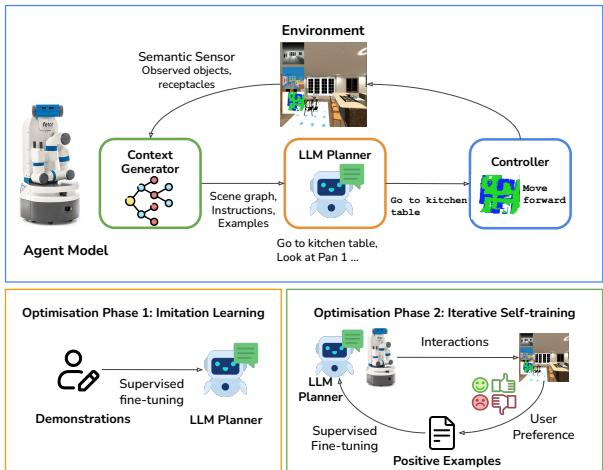
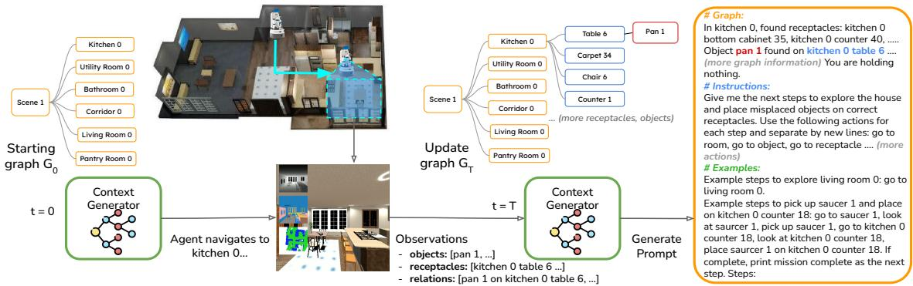
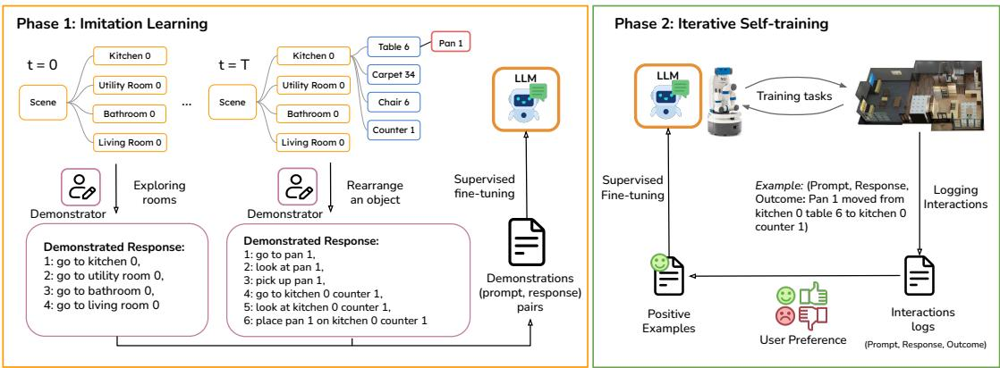
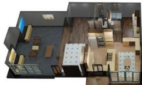
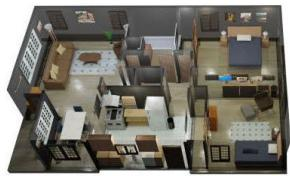
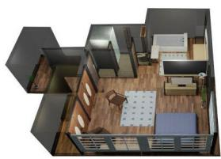
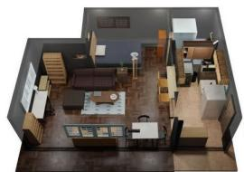
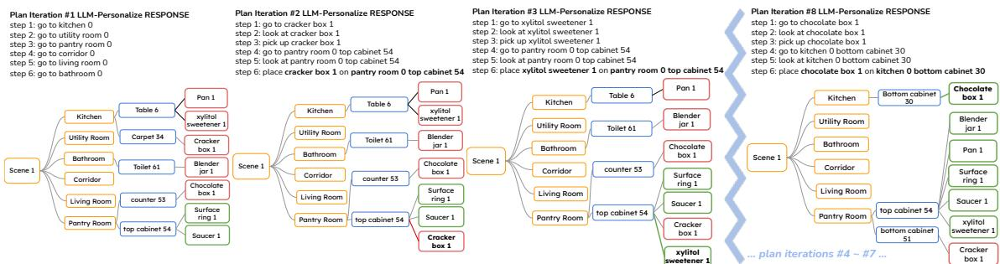
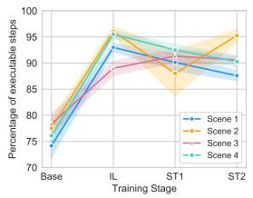
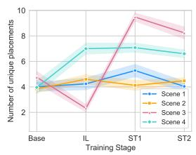

# LLM-Personalize: Aligning LLM Planners with Human Preferences via Reinforced Self-Training for Housekeeping Robots

Dongge Han1\*, Trevor McInroe2, Adam Jelley2

Stefano V. Albrecht2, Peter Bell,2, Amos Storkey2

1Microsoft, Cambridge, UK

2School of Informatics, University of Edinburgh, Edinburgh, UK dongge.han.oxford@gmail.com,

{t.mcinroe, adam.jelley, s.albrecht, peter.bell, a.storkey}@ed.ac.uk

## Abstract

Large language models (LLMs) have shown significant potential for robotics applications, particularly task planning, by harnessing their language comprehension and text generation capabilities. However, in applications such as household robotics, a critical gap remains in the personalization of these models to household preferences. For example, an LLM planner may find it challenging to perform tasks that require personalization, such as deciding where to place mugs in a kitchen based on specific household preferences. We introduce LLM-Personalize, a novel framework designed to personalize LLM planners for household robotics. LLM-Personalize uses an LLM planner to perform iterative planning in multi-room, partially-observable household environments, utilizing a scene graph built dynamically from local observations. To personalize the LLM planner towards user preferences, our optimization pipeline integrates imitation learning and reinforced Self-Training. We evaluate LLM-Personalize on Housekeep, a challenging simulated real-world 3D benchmark for household rearrangements, demonstrating a more than 30 percent increase in success rate over existing LLM planners, showcasing significantly improved alignment with human preferences.

## 1 Introduction

The application of large language models (LLMs) to the robotics domain has demonstrated substantial potential, especially in the realm of task planning (Song et al., 2023; Ahn et al., 2022; Rana et al., 2023; Huang et al., 2022a; Liang et al., 2023; Mai et al., 2023; Huang et al., 2022b, 2023), by leveraging their advanced language comprehension and text generation capabilities. An important challenge of using LLM-powered planners is the alignment of the LLM with the specific task context. While many studies have focused on grounding

  
Figure 1: Illustration of LLM-Personalize. Agent architecture: The Context Generator constructs and updates a scene graph from local observations. The LLM Planner uses the graph to produce a plan as a sequence of high-level actions, and iteratively re-plans when the previous plan has been executed. Each high-level action is translated to a sequence of control actions and executed by the Controller. To personalize the LLM Planner, we introduce an optimization pipeline integrating imitation learning and iterative reinforced Self-Training to finetune and align the planner with user preferences.

LLM planners to the physical contexts of the tasks to ensure executability of the generated plans and their relevance to the environment, our work aims to further extend this foundation to study personalization, an important aspect to household robotics which tailors the functionality of the LLM planner to the unique household needs and preferences.

Prior works on LLM grounding include aligning LLMs with the tasks’ physical context through methods such as translating LLM generated plans to executable actions (Huang et al., 2022a), integrating context information such as affordance (Ahn et al., 2022; Huang et al., 2023), scene graph (Rana et al., 2023) or environment feedback (Rana et al., 2023; Huang et al., 2022b). Despite these advancements, there is noticeable gap in grounding LLM planners to personalized household preferences due to the inherent misalignment between the generalpurpose LLM knowledge, designed to reflect common preferences, and the unique household preferences, e.g., one household may prefer a coffee mug to be placed on the dining table, whereas another may prefer for it to be in a kitchen cabinet.

To address this, we propose LLM-Personalize, a household robotic agent framework that performs object rearrangements in multi-room and partially observable household scenarios. As shown in Fig. 1, the model integrates three key components: context generator, LLM planner, and low-level controller. Central to personalizing the LLM planner to user preferences is our novel optimization pipeline that combines imitation learning with reinforced Self-Training (ReST) (Gulcehre et al., 2023). In the first phase, imitation learning is used to bootstrap the model in order to 1) guide the LLM planner to interpret complex input contexts, 2) initial alignment of the planner’s behavior with example user preferences, 3) bootstrap the LLM planner to generate plans that can be straightforwardly annotated with user preferences, thus facilitating effective Self-Training in the second phase, where the LLM planner further explores by collecting datasets of interactions, and refines itself based on the positive interactions according to the user preferences.

We evaluate LLM-Personalize on Housekeep (Kant et al., 2022), a challenging, longhorizon, partially observable household rearrangements task suite, featuring diverse house layouts and a wide variety of receptacles and objects. The quality of object rearrangements are assessed according to the rearrangement success according to the Housekeep benchmark based on their collected human preference data. We demonstrate that LLM-Personalize outperforms state-of-the-art baseline LLM planners (Song et al., 2023; Ahn et al., 2022; Rana et al., 2023) with over a 30 percent increase in success rate, as a result of improved understanding and alignment with human preferences.

## 2 Related Works

LLM-Empowered Robotic Agents Recent works in task planning have effectively utilised pretrained LLMs for generating executable plans for robotic agents (Song et al., 2023; Ahn et al., 2022; Rana et al., 2023; Huang et al., 2022a; Liang et al., 2023; Mai et al., 2023; Huang et al., 2022b, 2023). However, two key challenges that remain are the scalability of these methods to long-horizon planning tasks in large scenes, and misalignment of the LLM with the human preferences. Wu et al. (2023) used LLMs for inferring rules summarizing personalized user preferences. In contrast, our work studies direct optimization and personalization of LLM planners for complex planning in multi-room household scenarios. Closely related to our work, Ahn et al. (2022) performs grounding of LLM planners with affordance functions. However, it is applicable to small scenes and limited vocabulary of objects. Rana et al. (2023) addresses the scalability problem with a static scene graph. Song et al. (2023) addresses the scalability problem by allowing LLMs to plan iteratively. In this work, we directly use LLM for plan generation similarly to (Song et al., 2023). To address the long-horizon planning and large scene problem, our agent starts from an empty graph and dynamically updates the graph as it explores the house, and iteratively replan when the current plan finishes.

Aligning LLMs with Human Preference Recent progress in LLM alignment are achieved via reinforcement learning (RL) (Ouyang et al., 2022; Rafailov et al., 2023; Glaese et al., 2022; Akyürek et al., 2023), or supervised learning (SL) (Dong et al., 2023; Xu et al., 2022; Liu et al., 2023; Scheurer et al., 2023). Notably reinforced Self-Training (ReST) (Gulcehre et al., 2023) can utilize either an RL or SL objective. In this work, we adopt (supervised) imitation learning (IL) to bootstrap our LLM planner. Then we adapt ReST to our LLM planner which iteratively explores and aligns itself with human preferences via supervised fine-tuning. While pairwise-comparison methods like Direct Preference Optimization (DPO) (Rafailov et al., 2024) could theoretically be used for fine-tuning the LLM planner, they require paired positive and negative responses for each prompt, which is not supported by our human preference dataset or use case. Moreover, DPO demands custom loss functions and access to model gradients, not supported by online LLM fine-tuning APIs (e.g. GPT-3.5). In contrast, ReST circumvents these limitations. Therefore, we chose to use ReST for its simplicity and versatility, leaving exploration of other feedback approaches for future work.

## 3 Method

## 3.1 Problem Formulation

In this paper, we address the lack of personalization of LLM planners in household robotics tasks, for this purpose, we use Housekeep (Kant et al., 2022), a collection of 3D simulated household tasks, where a robot is tasked to rearrange misplaced objects to suit collected user preferences. A scene, as shown in Fig. 2 and Fig. 4, refers to a household layout which includes a selection of rooms and an arrangement of receptacles in each room. Let j count through each receptacle, and rec denote high-level information about each receptacle (unique id, receptacle type, and the room it is in, e.g., kitchen 0 table 6). Likewise, let i count through each of the objects, and let $o b j _ { i }$ denote the high-level information about an object (its unique id, object type, e.g., laptop 1). Finally, we use $M _ { j } ^ { t }$ to denote the set of indices i of objects that are on a receptacle j at time t – object locations will change over time. This set can be empty, and for some receptacles, ${ M } _ { j } ^ { t }$ may be constrained in cardinality. All the receptacles, objects and locations must be discovered by the agent. Their existence is not given a priori. Each task/episode is of 1000 timesteps and includes a scene with a random selection of objects, some are misplaced on the wrong receptacles. The task for the agent is described as “Give me the next steps to explore the house and place misplaced objects on correct receptacles”. The idea of misplacement has to be understood or learnt by the agent.

  
Figure 2: The Context generator builds and updates the graph of the household state of rooms, receptacles and objects, derived from the robot’s local observations at each timestep. The information is provided as a prompt to the LLM planner. Top-down view of the scene is for illustration only, the robot only has access to the 1st-person view.

At each timestep t, the robot receives an egocentric (first-person) observation about a number of receptacles and any objects located therein. We collect the indices of the observed receptacles in $R _ { t }$ . So the observation at time t consists of the high level observation $o _ { t } = \{ ( r e c _ { j } , o b j _ { i } \mid i \in M _ { j } ^ { t } )$ $j \in R _ { t } \}$ , which is a list of the observed receptacles and the associated objects located on those receptacles, along with additional lower-level information, such as the coordinates of the objects etc. The robot can hold one object at a time and selects an action from its (low-level) action space A = { move forward, turn left, turn right, look up, look down, grab/release}. It receives a reward +1 for placing an object on a correct receptacle, −1 for grabbing/removing an already correctly placed object, else 0. The correctness of obj-rec placement is decided by a human preference dataset collected by Housekeep from human annotators.

## 3.2 Model

Our robotic agent model is designed to perform long-horizon planning in the partially observable household scenarios with three key components: the context generator, the LLM planner and the controller. Specifically, the context generator provides context information for decision-making in the form of prompts, by maintaining a graph of the household state derived from observations. For decision making, we choose a two-level design that integrates a high-level LLM planner and a controller which executes the generated plans using low-level control actions. Given our primary focus on personalizing LLM planners, we use an off-theshelf controller from the simulator, and focus on designing the context generator and LLM planner.

## 3.2.1 Context Generator

The context generator provides information of the current household context and useful instructions as a prompt for the downstream LLM planner. Specifically, our context generator provides three pieces of information: the current household state, instructions, and examples for in-context learning (Brown et al., 2020). As the agent never observes the full state of the household, but only receives a partial view $o _ { t } ,$ it is important that the agent maintains and refines an internal representation of the household state to correctly choose the placement of objects (e.g., only using local observations can lead to a suboptimal placement when the correct receptacle of a misplaced object is in a different room). To this end, our context generator maintains a graph G as shown in Fig. 2. When a task starts, the context generator initializes the graph $G _ { 0 }$ of the house with empty room nodes. At each timestep t, the graph is updated with the locally observed objects and receptacles $o _ { t }$ as the agent navigates around the house. To provide the information for decision-making, a prompt is constructed with a natural language description of $G _ { t } ,$ the object held by the robot, instructions (a description of the overall rearrangement task, the role assigned to the LLM, and the available highlevel actions), and two examples, one for room exploration and another one for moving an object from one receptacle to another, allowing the LLM planner to follow via in-context learning.

## 3.2.2 LLM Planner

The LLM planner is the core decision-making module that generates a high-level plan as a sequence of high-level actions, and each high-level action is translated by the low-level controller to lowlevel actions and executed. The set of available high-level actions are: Ω = {go to obj/rec/room, look at obj/rec, pick up obj, place obj on $r e c \}$ where the obj, rec, room are replaced by the actual names of these target entities, as introduced in section 3.1. To handle partial observability in the multi-room households, we adopt an iterative planning procedure which enables the LLM planner to re-plan when the previous plan has finished execution. This allows the agent to obtain a more comprehensive understanding of the household state while exploring and navigating the house, leading to improved rearrangement decisions. On the other hand, compared with single-step iterative planning where each plan includes only one high-level action, our approach builds cohesive plans that better account for the inter-dependencies and the cumulative effect of the action sequences. The iterative procedure works as follows: Denote $n \in \mathbb { N }$ as a high-level planning iteration. At iteration n, the LLM planner receives a prompt from the context generator and generates an immediate action plan as a sequence of high-level actions $\pmb { \omega } \in \Omega ; p _ { n } = ( \omega _ { 0 } , \omega _ { 1 } , . . . )$ (see Fig. 3 for two example plans). The plan is sent to the controller where the high-level actions are executed sequentially. Each high-level action is translated to a sequence of low-level control actions $a \in A$ , e.g., go to pan 1 → (move forward, turn $l e f t , \ldots { } )$ . Once the controller finished executing all high-level actions in $p _ { n } ,$ say at timestep $t = T$ the next plan iteration $n + 1$ starts where the LLM planner is prompted again to generate a new plan $p _ { n + 1 }$ and executed by the controller. This process is repeated iteratively.

The LLM planner is implemented with an LLM model and a parser. Upon receiving a prompt from the context generator, the LLM returns a plan in natural language as a sequence of high-level actions: go to pan 1, pick up pan 1, .... Specifically, the first 10 high-level actions from the sequence are used, as we often observe a decrease in quality towards the end of a long response from the LLM. The parser then extracts from each high-level action the target action (i.e., one of go to, look at, pick up, place) and the target entities (i.e., obj, rec, room) and send to the controller to be translated and executed as low-level control actions.

## 3.2.3 Controller

Given our primary focus on personalizing the LLM planner, we use the off-the-shelf controller from the Housekeep simulator, which maps each high-level action to a sequence of low-level actions. More details can be found in the Appendix A.2.

## 3.3 Personalizing the LLM Planner

Despite our model architecture being well-suited to the partially observable household scenarios, we observed two challenges that necessitated a tailored optimization process. 1) LLM planners struggle with effectively extracting precise information from complex input contexts (e.g., resulting in plans with partial object names). This is compounded by the complexity of accurately sequencing highlevel actions to ensure executability. 2) Misalignment between the LLM planners’ decisions and the personalized preferences of users.

Reinforced Self-Training1 provides a promising approach to optimizing and personalizing the LLM planner with user preferences, by iteratively performing a grow step where a training dataset is collected by prompting the LLM to generate multiple responses for each prompt, and an improve step, where the dataset is filtered according to human preferences, followed by fine-tuning the LLM on the filtered dataset. However, direct application of

  
Figure 3: Optimization pipeline of LLM-Personalize using imitation learning and iterative reinforced Self-Training.

ST to the LLM planner presents new, unique challenges: Unlike single-step generation tasks, e.g., ST’s initial application domain of machine translation), the household robotics tasks often involve long-horizon planning, where the LLM planner may generate a plan consisting of both correct and incorrect placements actions, making it difficult to annotate with human preferences and extract clean training examples for automatic Self-Training.

To this end, we introduce a tailored optimization pipeline that integrates imitation learning and Self-Training. The imitation learning phase bootstraps the LLM planner to effectively interpret the complex context, produce executable plans, and perform initial alignment with example user preferences. Moreover, the demonstrations are designed to bootstrap the LLM planner to generate plans that can be clearly annotated, thus facilitating effective Self-Training in the second phase, which allows the LLM planner to further explore and refine its planning strategies based on user preferences.

## 3.3.1 Imitation Learning

As shown in Fig. 3, we build a demonstrator module to generate demonstrated responses for the LLM planner on a set of demonstration tasks. On receiving a prompt x from the context generator, the demonstrator produces a plan y which either explores one of the rooms or rearrange a single object, using the scene graph from the context generator and the correct object-receptacle mapping according to the human preference dataset (described in section 3.1). Specifically, when prompted at the start of a task, the demonstrator produces a plan of high-level actions to visit each of the rooms. After the plan is executed, the agent will have discovered some misplaced objects and receptacles in each room. The demonstrator will be prompted again to generate a plan, which rearranges one of the discovered misplaced object (picked randomly) to a discovered correct receptacle. The plan is executed by the controller, and we iterate the procedure until all discovered objects are correctly placed.

To bootstrap the LLM planner, we prepare the collected demonstrations as pairs of prompts and target responses, $\mathcal { D } _ { \mathrm { d e m o } } = \{ ( \mathbf { x } ^ { i } , \mathbf { y } ^ { i } ) \} _ { i = 1 } ^ { N }$ , where both $\mathbf { x } ^ { i } , \mathbf { y } ^ { i }$ are sequences of tokens, the response ${ \bf y } ^ { i }$ being a plan by the demonstrator. Given a pre-trained autoregressive LLM $P _ { \theta } ( \mathbf { y } \mid \mathbf { x } )$ parametrized by θ, we perform supervised fine-tuning on $\mathcal { D } _ { \mathrm { d e m o } }$ by minimizing the negative log likelihood (NLL) loss:

$$
\begin{array} { r } { \mathcal { L } _ { N L L } = - \mathbb { E } _ { ( \mathbf { x } , \mathbf { y } ) \in \mathcal { D } _ { \operatorname { d e m o } } } \left[ \sum _ { \tau = 1 } ^ { | \mathbf { y } | } \log P _ { \theta } ( \mathbf { y } _ { \tau } \mid \mathbf { y } _ { 1 : \tau - 1 } , \mathbf { x } ) \right] } \end{array}\tag{1}
$$

The above demonstration design guides the LLM planner to more accurately extract information from complex input contexts and improve plan executability. More importantly, it ensures that each plan has a uniform objective (i.e, perform exploration or rearrange a single object), allowing the plan to be straightforwardly annotated with user preferences during Self-Training.

## 3.3.2 Iterative Reinforced Self-Training

Next, we fine-tune the bootstrapped LLM planner to further improve personalization via iterative Self-Training on a set of training tasks. This allows the LLM planner to explore more rearrangement options and improve its placement decisions through imitating the positive examples. As shown in Fig. 3, to start a Self-Training iteration, we use the LLM planner to explore by collecting episodes of experiences on the training tasks and we log M interactions as tuples of prompt, response and outcomes: $\{ ( { \bf x } ^ { i } , { \bf y } ^ { i } , o u t ^ { i } ) \} _ { i = } ^ { M }$ (Example outcome: pan 1 moved from kitchen 0 table 6 to kitchen 0 counter 1). We annotate each prompt and response pair $( \mathbf { x } ^ { i } , \mathbf { y } ^ { i } )$ with the reward $r ^ { i } \in \{ 1 , 0 , - 1 \}$ for the rearrangement outcomes according to the user preferences. Then, we collect a Self-Training dataset by picking the prompt and response pairs with positive rewards $\mathcal { D } _ { \mathrm { s e l f - t r a i n } } = \{ ( \mathbf { x } ^ { i } , \mathbf { y } ^ { i } ) | r ^ { i } > 0 \} _ { i = 1 } ^ { M }$ The final step of this Self-Training iteration is to perform supervised fine-tuning of the bootstrapped LLM model over $\mathcal { D } _ { \mathrm { s e l f - t r a i n } }$ with the NLL objective as defined in Equation (1). This procedure is repeated iteratively where each Self-Training iteration performs interaction collection and fine-tuning over the LLM obtained from the previous iteration.

## 4 Experiments

We aim to evaluate the hypothesis: Optimizing LLM planner through imitation learning and Self-Training allows the LLM planner to improve planning performance and alignment with user preferences. We demonstrate this through improved rearrangement success rate compared with baseline LLM planners and provide qualitative results that showcase the plans generated. Our ablations studies further evaluate plan executability, exploration and cross-domain (scene) generalisation of LLM-Personalize in the different training phases.

## 4.1 Experiment Setup

We evaluate LLM-Personalize on 4 different scenes in Housekeep, each featuring a unique layout of rooms and receptacles, as shown in Fig. 4. A task is instantiated with a random selection of 5−10 objects placed on different receptacles, among them $\sim 3 - 7$ objects are misplaced and needs to be rearranged. For each object, there is a list of correct receptacles not known to the agent. The task is challenging as the agent must explore the house, identify misplaced objects and their correct receptacles, and avoid removing correctly placed objects. Evaluation metrics: We evaluate the agent performance via success rate (Kant et al., 2022), defined as the percentage of misplaced objects that are correctly re-arranged at the end of the task, among all misplaced objects at the start of the task.

$$
\begin{array} { r } { s u c c e s s R a t e = \left( \frac { \# c o r r e c t a t t h e e n d - \# c o r r e c t a t t h e s t a r t } { \# t o t a l m i s p l a c e d o b j e c t s a t t h e s t a r t } \right) } \end{array}
$$

With the success rate defined in terms of difference, an agent is judged fairly for its correct and wrong placements: an agent which performed poorly that resulted in more misplaced objects at the end of the task will yield a negative success rate. We measure the success rate on train and test tasks at each phase of the optimization pipeline. For each scene, we randomly sample three disjoint set of 10 demonstration tasks, 20 training tasks and 5 test tasks. Hence the agent will encounter a random selection of objects and placement configurations on each task. During both training and testing, we collect experiences of 5 episodes per task, and present the mean and standard error of the metrics across all collected episodes in the task sets.

Architecture and Baselines We compare LLM-Personalize with the baseline LLM planning methods: LLM-Planner (Song et al., 2023), Say-Plan (Rana et al., 2023) and SayCan (Ahn et al., 2022). For all methods, we use GPT-3.5-turbo with temperature set to 1 to reduce deterministic repetition in LLM responses (default range is $0 - 2 )$ The prompt includes the instruction, graph description and two examples. We allow all methods to plan iteratively after the robot executed the previous plan. LLM-Planner with these configurations is adopted as the base model of LLM-Personalize, which we then optimize using imitation learning and Self-Training. The fine-tuning as defined in Eq.(1) is performed via the OpenAI fine-tune API. For more details please refer to Appendix A.3.

## 4.2 Main Results

Quantitative Results We compare the average success rate of LLM-Personalize with the baselines in Table 1, and we show the effectiveness of our optimization framework by comparing the performance of LLM-Personalize at different optimization phases, namely, the base version (using LLM-Planner), imitation learning (IL), and various iterations of Self-Training (ST). Each table entry shows the mean and standard error of the mean across all tasks in the train/test set and 5 runs per task. Overall, we observe that LLM-Personalize significantly outperforms all baseline methods across the tested scenes. For example, on the test set of Scene 1, the success rate of the baselines are near zero or negative, while LLM-Personalize achieved 29.6% after imitation learning and two Self-Training iterations. Similar trends can be observed across all scenes. After examining some detailed prompts and responses we identified that SayCan often has difficulty picking the best high-level action from a large number of available actions due to the large number of objects, receptacles and rooms. LLM-Planner is often able to produce correct pick and place action sequences following the in-context examples. Compared with LLM-Planner, SayPlan improves slightly (on 5 out of 8 task sets) as a result of improvement in plan executability due to revision with feedback. However, all baselines have difficulty knowing whether an object is misplaced or correctly placed, as well as the correct receptacles to place objects, due to lack of personalization. As a result, the negative scores across the baseline methods are often due to picking and placing correctly placed objects onto wrong receptacles.

  
(a) Scene 1 (kitchen, living room, corridor, bathroom, utility room, pantry room)

  
(b) Scene 2 (kitchen, living room, dining room, child’s room, bathroom, bedroom)

  
(c) Scene 3 (corridor, bathroom, bedroom)

  
(d) Scene 4 (kitchen, living room, bathroom, bedroom, lobby)

Figure 4: The Housekeep scenes used in our experiment.
<table><tr><td colspan="2">Scene ID</td><td colspan="2">Scene 1</td><td colspan="2">Scene 2</td><td colspan="2">Scene 3</td><td colspan="2">Scene 4</td></tr><tr><td colspan="2">Task Set</td><td>train</td><td>test</td><td>train</td><td>test</td><td>train</td><td>test</td><td>train</td><td>test</td></tr><tr><td rowspan="3">Baselines</td><td>SayCan</td><td> $- 2 . 6 \pm 1 . 9$ </td><td> $0 . 0 \pm 0 . 0$ </td><td></td><td>-1.2 ± 1.2 -10.6 ± 6.8</td><td> $- 3 . 3 \pm 2 . 2$ </td><td> $- 8 . 0 \pm 4 . 9$ </td><td> $- 1 . 6 \pm 1 . 6$ </td><td> $0 . 0 \pm 0 . 0$ </td></tr><tr><td>SayPlan</td><td> $- 7 . 0 \pm 5 . 9$ </td><td></td><td>-5.0 ± 5.0-6.8 ± 2.7 -1.6 ± 9.2</td><td></td><td> $0 . 4 \pm 4 . 5$ </td><td></td><td></td><td>-13.0 ± 8.3 -10.7 ± 3.8 -12.3 ± 15.3</td></tr><tr><td>LLM-Planner</td><td> $5 . 3 \pm 4 . 4$ </td><td> $- 3 . 6 \pm 4 . 8$ </td><td>-8.4 ± 3.8</td><td> $- 9 . 8 \pm 6 . 3$ </td><td> $- 1 4 . 2 \pm 4 . 0$ </td><td> $- 4 . 0 \pm 3 . 3$ </td><td> $- 2 9 . 6 \pm 5 . 2$ </td><td> $- 3 0 . 2 \pm 4 . 8$ </td></tr><tr><td rowspan="3">Ours</td><td>LLM-Personalize (IL)</td><td> $4 . 1 \pm 2 . 6$ </td><td></td><td>17.6 ± 6.1 -3.3 ± 3.012.6 ± 9.0</td><td></td><td> $2 2 . 6 \pm 2 . 6$ </td><td> $2 4 . 3 \pm 4 . 4$ </td><td> $1 0 . 9 \pm 3 . 3$ </td><td> ${ \bf 2 5 . 7 \pm 6 . 7 }$ </td></tr><tr><td>LLM-Personalize (ST iter=1)</td><td> $1 7 . 9 \pm 3 . 7$ </td><td></td><td>25.8 ± 6.6 19.4 ± 2.9</td><td> $2 1 . 7 \pm 5 . 6$ </td><td> $3 2 . 4 \pm 3 . 2 $ </td><td> $4 1 . 4 \pm 6 . 3$ </td><td> $2 4 . 2 \pm 3 . 2$ </td><td> $1 0 . 2 \pm 6 . 7$ </td></tr><tr><td>LLM-Personalize (ST iter=2) 25.5 ± 3.1 29.6 ± 5.4 18.5 ± 2.625.2 ± 4.0</td><td></td><td></td><td></td><td></td><td> ${ \bf 3 3 . 5 \pm 3 . 8 }$ </td><td> ${ \bf 4 3 . 3 \pm 4 . 3 }$ </td><td> ${ \bf 2 9 . 1 \pm 2 . 9 }$ </td><td> $2 0 . 4 \pm 6 . 8$ </td></tr></table>

Table 1: Average success rate on train and test sets across scenes. Each entry denotes the mean ± standard error of the mean across episodes. (Boldface: best variant across the task set, ST: self-training, IL: imitation learning)

rect placements while avoiding wrong ones.

Comparing the train and test performances of LLM-Personalize, we observe that the testing performance generally increases with increased training performance, except for Scene 3, where the test performance drops as a result of overfitting. This shows that our model is able to learn personalized preferences seen during training, and generalize to unseen object combinations and placements.

Comparing the different stages of LLM-Personalize on the test sets, we observe a general trend where the combination of imitation learning and Self-Training lead to better results. First, bootstrapping from demonstrations improves over LLM-Planner (i.e., the base LLM-Personalize model). For example, on Scene 1, the success rate improved from −3.6% to 17.6%. This improvement is a result of improved executability due to action sequencing, better context understanding (e.g., agent correctly extracts and uses object names from the prompt), and initial alignment to personalized preferences shown in the demonstrations. Second, the Self-Training iterations further improves performance with improved alignment with personalized preferences. For example, on Scene 1, the success rate after two iteration of Self-Training grows from 17.6% to 29.6% compared with the imitation bootstrapped variant. We also observed that after bootstrapping, the model learns to explore object placements with improved accuracy during Self-Training and with more Self-Training iterations, the model exploits and commits to the learned cor-

Qualitative Results In Fig. 5, we present plans generated by LLM-Personalize and executed by the robot on a test task in Housekeep and the resulting graph of the household scene after each plan iteration. We can see that the agent learned to start by exploring the house, then rearrange one misplaced object at a plan iteration, and successfully rearranged 4 out of 5 misplaced objects.

## 4.3 Ablation Studies

In this section, we present ablation studies on LLM-Personalize’s plan executability, exploration vs. exploitation and cross-domain transfer performance. Cross-domain Transfer Results In addition to the improved in-domain adaptation results in Table 1, we show in Table 2 cross-domain transfer performance of LLM-Personalize. In this experiment, we train the model on a source scene (e.g., scene 2), and observe the performance change on the test set on a different scene (e.g., scene 1) with different rooms and receptacles. From the table, we can observe that through imitation learning and Self-

  
Figure 5: Demonstration of four planning iterations generated and executed by LLM-Personalize (top row) and the resulting graphs (bottom row) on a test task in Housekeep. Green/red object (leaf) nodes indicate correct/wrong placements. The object being moved is shown in boldface. This episode starts with 2 correctly placed objects and 5 misplaced objects (left), and changed to 6 correctly placed objects and only 1 misplaced objects after rearrangements (right). For clarity, the graphs only show receptacles with objects and omit all other receptacles.

  
(a) Executability

  
(b) Unique Placements  
Figure 6: Ablations (a) percentage of executable highlevel actions (b) unique placements executed. x-axis refers to LLM-Personalize at different phases – Base: before optimization, IL: imitation learning, ST: Self-Training. Each point is an average value over 25 episodes (5 runs per task over 5 tasks in the test set) and shaded area refers to standard error of the mean.

Training, LLM-Personalize is able to transfer to a different scene with improved test performance.

Executability In Fig. 6a we present the executability improvement of LLM-Personalize (IL, ST1, ST2) compared to the base LLM-Planner (Base). Each point refers to the average percentage of highlevel actions generated by the LLM planner that are successfully executed per task. The IL bootstrapping significantly improved the planner’s executability, due to improved context understanding and action sequencing, enabling LLM-Personalize to produce high quality training examples for Self-Training, and we can observe consistently high executability from the LLM-Personalize(ST1) and LLM-Personalize(ST2) variants.

Exploration vs. Exploitation To analyse how the agent’s exploration vs. exploitation behavior changes at different optimization phases, we show in Fig. 6b the average number of unique placements executed per episode, where each unique placement refers to a pair of object and receptacle where the agent placed the object on the receptacle. Higher degree of exploration behavior is indicated by higher number of unique placements, and in contrary, lower number of unique placements indicates more exploitation behavior. Fig. 6b shows an increase in exploration from LLM-Planner (Base) to LLM-Personalize(IL), partly due to improved plan executability. From IL to ST1, the agent further increased exploration, where it explores placements beyond the behaviors learned from demonstrations. For example, on Scene 3 the average unique placements increased from 2.32 to 9.48. Compared with ST1, ST2 typically shows more exploitation where the agent learns to commit to the correct placement combinations for better task success.

<table><tr><td>Scene Pairs</td><td colspan="2">Scene 1 &amp; 2</td><td colspan="2">Scene 3 &amp; 4</td></tr><tr><td>Task Set</td><td>train(Scene2) test(Scene1) train(Scene4) test(Scene3)</td><td></td><td></td><td></td></tr><tr><td>LLM-Planner</td><td> $- 8 . 4 \pm 3 . 8$ </td><td> $- 3 . 6 \pm 4 . 8$ </td><td> $- 2 9 . 6 \pm 5 . 2$ </td><td> $- 4 . 0 \pm 3 . 3$ </td></tr><tr><td>LLM-Personalize(IL)</td><td> $- 3 . 3 \pm 3 . 0$ </td><td> $1 3 . 2 \pm 6 . 5$ </td><td> $1 0 . 9 \pm 3 . 3$ </td><td> $3 4 . 3 \pm 5 . 4$ </td></tr><tr><td>LLM-Personalize(ST1)</td><td> ${ \bf 1 9 . 4 \pm 2 . 9 }$ </td><td> $1 3 . 0 \pm 4 . 6$ </td><td> $2 4 . 2 \pm 3 . 2$ </td><td> $3 1 . 2 \pm 4 . 9$ </td></tr><tr><td>LLM-Personalize(ST2)</td><td> $1 8 . 5 \pm 2 . 6 $ </td><td> ${ \bf 1 7 . 0 \pm 4 . 5 }$ </td><td> ${ \bf 2 9 . 1 \pm 2 . 9 }$ </td><td> $4 2 . 4 \pm 3 . 8$ </td></tr></table>

Table 2: Ablation Study: Cross-domain generalisation success rate. (Boldface: best across the task set, ST1/2: self-training iteration 1 or 2, IL: imitation learning)

## 5 Conclusions

We proposed LLM-Personalize, an LLM-based household robotics agent framework capable of long-horizon planning in multi-room, partially observable household scenarios, and an optimization pipeline that personalizes the LLM planner to user preferences. This approach effectively addresses the gap in personalizing LLM planners for household robotics. Our model achieves superior alignment with user preferences, outperforming existing work in the challenging Housekeep rearrangement tasks. Moving forward, the versatility and scalability of the agent design and optimization pipeline makes it a promising solution for a broad range of personalized LLM-powered robotics applications.

## 6 Limitations

There are two main limitations in this work. Firstly, although our framework demonstrates significant improvements in aligning LLM planners with human preferences, the current scale of our experiments was constrained by computational resources, (e.g., the LLM API budget). More extensive evaluations involving larger, more diverse household environments could offer further opportunities for enhancing scalability and robustness.

Secondly, while the simulated environment provides valuable insights into the effectiveness of LLM-Personalize, the absence of real-world testing on physical robots and real-world household scenarios leaves room for further validation in dynamic real-world settings. An interesting future direction can aim to address this by deploying our approach on actual robots in household scenarios.

## References

Michael Ahn, Anthony Brohan, Noah Brown, Yevgen Chebotar, Omar Cortes, Byron David, Chelsea Finn, Chuyuan Fu, Keerthana Gopalakrishnan, Karol Hausman, et al. 2022. Do as i can, not as i say: Grounding language in robotic affordances. arXiv preprint arXiv:2204.01691.

Afra Feyza Akyürek, Ekin Akyürek, Aman Madaan, Ashwin Kalyan, Peter Clark, Derry Wijaya, and Niket Tandon. 2023. Rl4f: Generating natural language feedback with reinforcement learning for repairing model outputs. arXiv preprint arXiv:2305.08844.

Tom Brown, Benjamin Mann, Nick Ryder, Melanie Subbiah, Jared D Kaplan, Prafulla Dhariwal, Arvind Neelakantan, Pranav Shyam, Girish Sastry, Amanda Askell, et al. 2020. Language models are few-shot learners. Advances in neural information processing systems, 33:1877–1901.

Aakanksha Chowdhery, Sharan Narang, Jacob Devlin, Maarten Bosma, Gaurav Mishra, Adam Roberts, Paul Barham, Hyung Won Chung, Charles Sutton, Sebastian Gehrmann, et al. 2023. Palm: Scaling language modeling with pathways. Journal ofMachine Learning Research, 24(240):1–113.

Hanze Dong, Wei Xiong, Deepanshu Goyal, Rui Pan, Shizhe Diao, Jipeng Zhang, Kashun Shum, and Tong Zhang. 2023. Raft: Reward ranked finetuning for generative foundation model alignment. arXiv preprint arXiv:2304.06767.

Amelia Glaese, Nat McAleese, Maja Trebacz, John Aslanides, Vlad Firoiu, Timo Ewalds, Maribeth Rauh, Laura Weidinger, Martin Chadwick, Phoebe Thacker, et al. 2022. Improving alignment of dialogue agents via targeted human judgements. arXiv preprint arXiv:2209.14375.

Caglar Gulcehre, Tom Le Paine, Srivatsan Srinivasan, Ksenia Konyushkova, Lotte Weerts, Abhishek Sharma, Aditya Siddhant, Alex Ahern, Miaosen Wang, Chenjie Gu, et al. 2023. Reinforced selftraining (rest) for language modeling. arXiv preprint arXiv:2308.08998.

Wenlong Huang, Pieter Abbeel, Deepak Pathak, and Igor Mordatch. 2022a. Language models as zeroshot planners: Extracting actionable knowledge for embodied agents. In International Conference on Machine Learning, pages 9118–9147. PMLR.

Wenlong Huang, Fei Xia, Dhruv Shah, Danny Driess, Andy Zeng, Yao Lu, Pete Florence, Igor Mordatch, Sergey Levine, Karol Hausman, et al. 2023. Grounded decoding: Guiding text generation with grounded models for robot control. arXiv preprint arXiv:2303.00855.

Wenlong Huang, Fei Xia, Ted Xiao, Harris Chan, Jacky Liang, Pete Florence, Andy Zeng, Jonathan Tompson, Igor Mordatch, Yevgen Chebotar, et al. 2022b. Inner monologue: Embodied reasoning through planning with language models. arXiv preprint arXiv:2207.05608.

Yash Kant, Arun Ramachandran, Sriram Yenamandra, Igor Gilitschenski, Dhruv Batra, Andrew Szot, and Harsh Agrawal. 2022. Housekeep: Tidying virtual households using commonsense reasoning. In European Conference on Computer Vision, pages 355– 373. Springer.

Jacky Liang, Wenlong Huang, Fei Xia, Peng Xu, Karol Hausman, Brian Ichter, Pete Florence, and Andy Zeng. 2023. Code as policies: Language model programs for embodied control. In 2023 IEEE International Conference on Robotics and Automation (ICRA), pages 9493–9500. IEEE.

Hao Liu, Carmelo Sferrazza, and Pieter Abbeel. 2023. Chain of hindsight aligns language models with feedback. arXiv preprint arXiv:2302.02676, 3.

Jinjie Mai, Jun Chen, Bing Li, Guocheng Qian, Mohamed Elhoseiny, and Bernard Ghanem. 2023. Llm as a robotic brain: Unifying egocentric memory and control. arXiv preprint arXiv:2304.09349.

Long Ouyang, Jeffrey Wu, Xu Jiang, Diogo Almeida, Carroll Wainwright, Pamela Mishkin, Chong Zhang, Sandhini Agarwal, Katarina Slama, Alex Ray, et al. 2022. Training language models to follow instructions with human feedback. Advances in Neural Information Processing Systems, 35:27730–27744.

Andrzej Pronobis and Patric Jensfelt. 2011. Hierarchical multi-modal place categorization. In ECMR, pages 159–164.

Rafael Rafailov, Archit Sharma, Eric Mitchell, Stefano Ermon, Christopher D Manning, and Chelsea Finn. 2023. Direct preference optimization: Your language model is secretly a reward model. arXiv preprint arXiv:2305.18290.

Rafael Rafailov, Archit Sharma, Eric Mitchell, Christopher D Manning, Stefano Ermon, and Chelsea Finn. 2024. Direct preference optimization: Your language model is secretly a reward model. Advances in Neural Information Processing Systems, 36.

Krishan Rana, Jesse Haviland, Sourav Garg, Jad Abou-Chakra, Ian Reid, and Niko Suenderhauf. 2023. Sayplan: Grounding large language models using 3d scene graphs for scalable task planning. arXiv preprint arXiv:2307.06135.

Jérémy Scheurer, Jon Ander Campos, Tomasz Korbak, Jun Shern Chan, Angelica Chen, Kyunghyun Cho, and Ethan Perez. 2023. Training language models with language feedback at scale. arXiv preprint arXiv:2303.16755.

Chan Hee Song, Jiaman Wu, Clayton Washington, Brian M Sadler, Wei-Lun Chao, and Yu Su. 2023. Llm-planner: Few-shot grounded planning for embodied agents with large language models. In Proceedings ofthe IEEE/CVF International Conference on Computer Vision, pages 2998–3009.

Hugo Touvron, Louis Martin, Kevin Stone, Peter Albert, Amjad Almahairi, Yasmine Babaei, Nikolay Bashlykov, Soumya Batra, Prajjwal Bhargava, Shruti Bhosale, et al. 2023. Llama 2: Open foundation and fine-tuned chat models. arXiv preprint arXiv:2307.09288.

Ashish Vaswani, Noam Shazeer, Niki Parmar, Jakob Uszkoreit, Llion Jones, Aidan N Gomez, Łukasz Kaiser, and Illia Polosukhin. 2017. Attention is all you need. Advances in neural information processing systems, 30.

Jimmy Wu, Rika Antonova, Adam Kan, Marion Lepert, Andy Zeng, Shuran Song, Jeannette Bohg, Szymon Rusinkiewicz, and Thomas Funkhouser. 2023. Tidybot: Personalized robot assistance with large language models. arXiv preprint arXiv:2305.05658.

Canwen Xu, Zexue He, Zhankui He, and Julian McAuley. 2022. Leashing the inner demons: Selfdetoxification for language models. In Proceedings of the AAAI Conference on Artificial Intelligence, volume 36, pages 11530–11537.

## A Appendix

## A.1 Preliminaries: LLMs and Self-training

An LLM (Brown et al., 2020) is a transformerbased (Vaswani et al., 2017) language model that is capable of performing general-purpose language generation, e.g., GPT (Brown et al., 2020), PaLM (Chowdhery et al., 2023), LLaMA (Touvron et al., 2023). In practice, users interact with LLMs by sending prompts and receiving responses.

Reinforced Self-Training Iterative (Gulcehre et al., 2023) reinforced Self-Training is a sample efficient algorithm for aligning LLMs with human preferences, particularly for the domain of machine translation. The key mechanism involves a grow step where a training dataset is collected by prompting the LLM to generate multiple responses for each prompt, and an improve step, where the dataset is annotated and filtered according to human preferences, followed by fine-tuning the LLM on the dataset using offline RL or supervised learning.

## A.2 Controller

Given our primary focus on personalizing LLM planners, we assume a room-level topological map is available (e.g., via semantic mapping (Pronobis and Jensfelt, 2011)). We make use of the offthe-shelf controller accessible from the Housekeep simulator, which maps each high-level action to a sequence of low-level actions. During a task, the robot navigates and continually updates a roomlevel topological map using egocentric observations, camera projection matrix, RGBD-aligned pixel-wise instance and semantic masks and relationship sensor to localize objects and receptacles to update the map. The high-level actions from the LLM planner are carried out as follows: 1) for go to, the controller uses the allocentric map and the target entity (obj, rec, room), and executes a sequence of navigation actions to reach the target; 2) for look at, the agent orients itself to face the desired target via look up/down and turn left/right actions; 3) to carry out pick/place, the agent invokes a discrete grab/release action that casts a ray, and if it intersects an obj or rec within 1.5m, it picks or places an object. More details of the controller can be found in (Kant et al., 2022).

## A.3 Experiment Setup: Baselines

To adapt SayCan to Housekeep with large number of available actions, we adopt the implementation in (Song et al., 2023), where the list of affordable high-level actions (e.g., go to a discovered object) are provided in each prompt, together with the list of previously executed actions. For SayPlan, we additionally provide the state and affordance of the receptacles and objects (e.g., pick up) as in (Rana et al., 2023) and allow 10 LLM semantic search steps and 5 revision (re-plan) retries for each plan iteration where the final revised plan is executed, and the revision feedback is provided by a verification module (e.g., cannot pick up obj as the agent is holding another object).