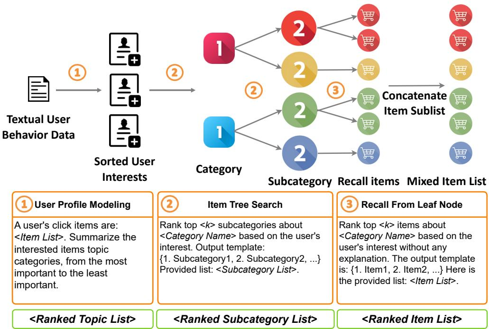
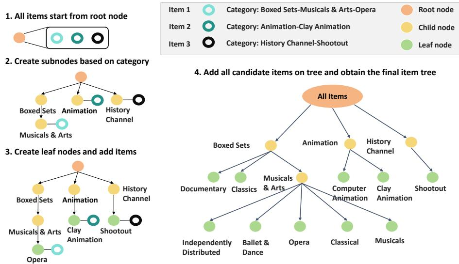
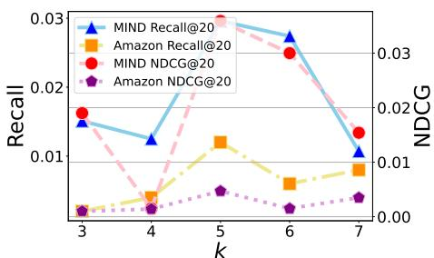
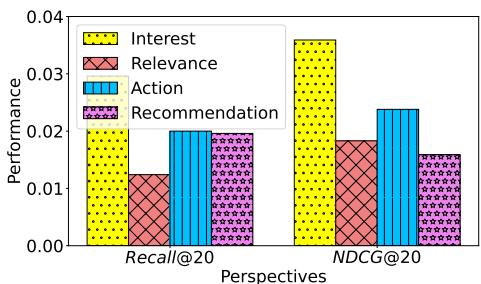
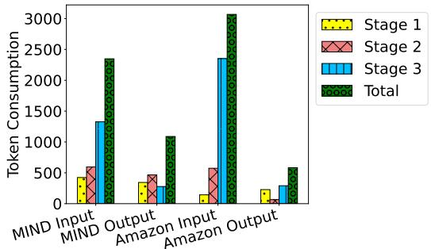

# LLMTreeRec: Unleashing the Power of Large Language Models for Cold-Start Recommendations

Wenlin Zhang1, Chuhan Wu2, Xiangyang Li2, Yuhao Wang1, Kuicai Dong3 Yichao Wang2, Xinyi Dai2, Xiangyu Zhao1∗, Huifeng Guo2, Ruiming Tang2\*

1City University of Hong Kong, Hong Kong, China 2Noah’s Ark Lab, China 3Noah’s Ark Lab, Singapore {wl.z, yhwang25-c}@my.cityu.edu.hk, xianzhao@cityu.edu.hk {wuchuhan1, lixiangyang34, dong.kuicai, wangyichao5 daixinyi5, huifeng.guo, tangruiming}@huawei.com

## Abstract

The lack of training data gives rise to the system cold-start problem in recommendation systems, making them struggle to provide effective recommendations. To address this problem, Large Language Models(LLMs) can model recommendation tasks as language analysis tasks and provide zero-shot results based on their vast open-world knowledge. However, the large scale of the item corpus poses a challenge to LLMs, leading to substantial token consumption that makes it impractical to deploy in realworld recommendation systems. To tackle this challenge, we introduce a tree-based LLM recommendation framework LLMTreeRec, which structures all items into an item tree to improve the efficiency of LLM’s item retrieval. LLMTreeRec achieves state-of-the-art performance under the system cold-start setting in two widely used datasets, which is even competitive with conventional deep recommendation systems that use substantial training data. Furthermore, LLMTreeRec outperforms the baseline model in the A/B test on Huawei industrial system. Consequently, LLMTreeRec demonstrates its effectiveness as an industryfriendly solution that has been successfully deployed online. Our code is available at: 1

## 1 Introduction

Recommendation systems collect user behavioral data(e.g., clicks, likes, pages viewed, and etc) to understand the preferences, historical choices, and characteristics of users and items (Bobadilla et al., 2013), then provide personalized recommendation results. Conventional recommendation systems require substantial user-item interaction data to capture collaborative information. However, realworld recommendation systems often face the coldstart challenge, where the lack of user-item interactions or insufficient training data leads to the recommendation system being unable to provide personalized recommendations. Specifically, the cold-start challenge can be categorized into (1) User cold-start: Recommending for new users with limited history (Huang et al., 2022; Pandey and Rajpoot, 2016), (2) Item cold-start: Recommending new items with limited user interactions (Pan et al., 2019; Vartak et al., 2017), (3) User-item cold-start: Recommending for new users and new items (Sanner et al., 2023; Li et al., 2019), and (4) System cold-start: Recommending under the assumption that no training set is available (Hou et al., 2024). Most of the existing works assume the training set is available, and mainly focus on either user coldstart or item cold-start problems. In this paper, we focus on the system cold-start problem(i.e., provide recommendation results without any training set).

The recent emergence of Large Language Models (LLMs), such as ChatGPT (Brown et al., 2020) and Claude (Bai et al., 2022), has demonstrated robustness and generalization to excel in a broad spectrum of Natural Language Processing (NLP) tasks. The inherent potential of LLMs positions them as natural zero-shot solvers, which are capable of addressing cold-start recommendation challenges. In recent research by Sanner et al. (2023), they collected a small dataset of item-based and languagebased user preference data, based on which they validated that LLMs with only language-based preference show competitive performance with collaborative filter models under near cold-start settings. However, challenge 1 arises: LLMs lack the content understanding of candidate items. Based on the knowledge from pre-training corpora, LLMs may have a simple understanding of items, but there is still a gap between the general knowledge of LLMs and the domain-specific knowledge required in recommendation scenarios. To enable LLMs to incorporate the content information of items for recommendation without any training set available, it is necessary to input it into LLMs in text form. Hou et al. (2024) arranged items into a sequence form, using LLMs to rank small-scale items, and verified that LLMs can achieve competitive zero-shot ranking capabilities in system cold-start settings. However, challenge 2 arises: LLMs cannot simultaneously process all items in natural language form due to the input length limitation. As the scale of candidate items increases, the sequential input of item information will significantly increase the token requirement of the LLMs and interfere with the LLM’s inference. Moreover, the massive item scale in recommendation system makes it infeasible to directly input all items into the LLM in natural language form.

  
Figure 1: The overview of LLMTreeRec: LLM-centered tree-based recommendation framework.

To address the aforementioned challenges, we propose LLMTreeRec, a novel LLM-based framework that leverages large-scale item information for recommendations under the system cold-start setting. Specifically, we generate user preferences in natural language based on the user’s interaction history and then leverage LLMs to recall items from a large-scale corpus. To enable LLMs to handle large-scale item corpus, we have developed an innovative tree-based recall strategy. This involves constructing a tree that organizes items based on semantic attributes such as categories, subcategories, and keywords, creating a manageable hierarchy from an extensive list of items. Each leaf node in this tree encompasses a manageable subset of the complete item inventory, enabling efficient traversal from the root to the appropriate leaf nodes. Hence, we can recall items from the selected leaf nodes only. This approach sharply contrasts with traditional methods that require searching through the entire item list, resulting in a significant optimization of the recall process.

In summary, we highlight our contributions in three-fold:

• We propose LLMTreeRec, a novel LLM-centered tree-based recommendation framework that leverages user preferences and item information in natural language form, which can perform recommendations under the system cold-start setting.

• We design a novel hierarchical item tree structure that can organize large-scale items into smaller, manageable segments contained within leaf nodes. The item tree can reduce the number of LLM input tokens required by 85%, making it industry-friendly.

• LLMTreeRec achieves state-of-the-art performance under the system cold-start setting on two benchmark datasets, with its performance even competitive with conventional deep recommender models trained on substantial data. Furthermore, LLMTreeRec outperforms the baseline in A/B test on the Huawei system, and has been successfully deployed online.

  
Figure 2: The procedure of item tree construction.

## 2 Proposed Framework

In this section, we elaborate in detail on our proposed LLMTreeRec that can utilize large-scale item corpus information under the system cold-start setting. The overall framework of LLMTreeRec is depicted in Figure 1.

## 2.1 Item Tree Construction

Under the system cold-start setting, LLMs lack understanding of item information and require textual information inputs into the LLM. However, the large scale of the recommendation item corpus makes it difficult to input extensive item information into the LLM. To address these challenges, we propose the use of a hierarchical tree structure to organize items into leaf nodes. This approach facilitates LLMs to efficiently handle a large number of items. Figure 2 illustrates the construction procedure for an item tree. Before outlining the construction of the item tree, we will introduce the formulated definitions for both the semantic information of an item i and an item tree T. The semantic information of an item i can be represented as $[ s _ { 1 } , s _ { 2 } , \cdots , s _ { k _ { i } } ]$ , where $s _ { 1 } , \cdots , s _ { k _ { i } }$ indicate semantic information in various levels (e.g., categories, subcategories, keywords, and other relevant details if needed), with granularity ranging from $s _ { 1 }$ to $s _ { k _ { i } }$ in a coarse-to-fine manner. Here, $k _ { i }$ represents the total number of semantic components of item i. The item tree structure T organizes candidate items while each node in T corresponds to a subset of the item set. Specifically, the root node root of the tree (depicted in red color) corresponds to a set encompassing all candidate items. Starting from the root node, items are partitioned into different child nodes nodec (depicted in yellow color) based on their hierarchical semantic information. Each node on the tree corresponds to a set containing items with the same semantic prefix $[ s _ { 1 } , \cdots , s _ { j } ]$ where $j \le k$ . The leaf nodes node (depicted in green color) of the tree correspond to the smallest subsets into which each individual item i can be categorized. After constructing the item tree, each specific item can be retrieved at its corresponding leaf node.

## 2.2 LLM-Centered Tree-based Recommendation Framework

Based on item tree, we propose a novel LLMcentered tree-based recommendation framework (LLMTreeRec). To make LLMs comprehend user preferences and utilize item information of large-scale corpus, we design a chain-ofrecommendation process, which enables the LLMs to retrieve information based on an item tree, referring to Section 2.2.1. Moreover, we elaborate on our effective retrieval strategy on item tree that enables LLMTreeRec to recall related items among large-scale item sets in Section 2.2.2

## 2.2.1 Chain-of-Recommendation Strategy

With the aid of the item tree T, we design a chainof-recommendation strategy to integrate it with our recommendation process seamlessly. LLMTreeRec provides an effective way for LLMs to handle largescale item sets under the system cold-start setting. The recommendation chain in LLMTreeRec is executed in a single session, following the steps outlined below:

User Profile Modeling. Due to the privacy concerns about the user profile, we use the user’s interaction history $H = [ i _ { 1 } , \cdots , i _ { n _ { u } } ]$ for each user u as LLM input for user profile modeling. Consequently, the user profile modeling function can be defined as:

$$
I = \mathrm { U s e r P r o f i l e M o d e l i n g } ( H ) ,\tag{1}
$$

where I is the inferred interest.

User profile modeling and subsequent tasks are completed within the same session. As a result, LLMs are able to capture user preferences by leveraging the context history of user interactions stored in H and the inferred interest I. This enables LLMs to successfully execute subsequent tasks in accordance with the user’s preferences.

Item Tree Search. LLMTreeRec traverses the item tree from the root node to its child nodes. The search stops when the leaf node is reached. Each step deduces and ranks the top categories based on user interaction history and interest. More details are discussed in Section 2.2.2. Formally, the item tree search function can be defined as

$$
c h i l d n o d e s = \operatorname { I t e m T r e e S e a r c h } ( H , I , n o d e ) ,\tag{2}
$$

where childnodes denotes the child node list selected by LLM. LLM searches the child node list of node, infers based on the semantic information of child nodes, user interaction history H, and interests I to give a ranked list of child nodes.

LLMs iteratively perform item tree searches until reaching leaf nodes nodel.

Recall from Leaf Node. Every leaf node corresponds to a small subset of items that cannot be further divided based on semantic information. Hence, the text describing all items in the subset can be easily fed into LLMTreeRec. Then, LLMTreeRec will recall top items by considering user interaction history and interest.

Formally the function is defined as

$$
\begin{array} { r } { i t e m s = \mathrm { R e c a l l F r o m L e a f N o d e } ( H , I , s u b s e t , k ) , } \end{array}\tag{3}
$$

where items denotes the ranked recall items, item subset subset is obtained from the corresponding leaf node node , and k denotes the recall number from subset. The prompt template of Chain-of-Recommendation is illustrated in Figure 1.

Algorithm 1: LLMTreeRec   
Input: User-item interaction history H   
Output: Recommended item list L   
Initialize: L = [], S = Stack()   
1 Inferred interests:   
I = UserProfileModeling(H)   
2 S.push(root)   
3 while |L| < n do   
4 node = S.top()   
5 S.pop()   
6 if node is leafnode then   
7 Get item subset from node:   
items =   
RecallFromLeafNode(H, I, subset, k)   
8 L.add(items)   
9 else   
10 childnodes =   
ItemTreeSearch(H, I, node)   
11 for node in childnodes.reverse() do   
12 S.push(node)   
13 end   
14 end   
15 end

## 2.2.2 Search Strategy

The purpose of our search strategy is to balance between the diversity and relevance of retrieved items. To achieve fast retrieval to the target leaf node, we apply Depth-first Search (DFS) on our item tree. In particular, throughout each step of the search, only the top-ranked nodes will be selected for further DFS search, allowing LLMTreeRec to bypass less relevant nodes. Upon reaching a leaf node, LLMTreeRec will recall the top k items from the item subset of this leaf node. The search ends if either (i) all leaf nodes are traversed, or (ii) the desired number of n items has been recalled. The parameter k effectively serves a lever to modulate the diversity of recalled items. Opting for a smaller k increases the recommendation diversity, but at the cost of increased search time. Conversely, a larger k tends to reduce diversity while expediting the search process. The detailed pipeline of UniLLMRec is demonstrated in Algorithm 1.

## 3 Experiment

We investigate three research questions(RQ): (1) How does the performance of zero-shot LLMTreeRec competitive to traditional models trained on different fractions of the training set?

<table><tr><td>Dataset</td><td>Training set</td><td>Test set</td><td>Candidates</td></tr><tr><td>MIND</td><td>51,283</td><td>500</td><td>1217</td></tr><tr><td>Amazon</td><td>70,728</td><td>500</td><td>6176</td></tr></table>

Table 1: The statistic detail of dataset.

(2) How much does LLMTreeRec reduce the token requirements for LLM handling large-scale items? (3) How do the hyper-parameter and prompt design impact the recommendation result of LLMTreeRec?

We will first introduce the experiment setting in Section 3.1, then display the performance comparison experiment in Section 3.2, demonstrate the token consumption analysis in Section 3.3, show experiments about hyper-parameter and prompt design in Section 3.4 and Section 3.5, and finally provide case study in Section 3.6.

## 3.1 Experiment Setting

## 3.1.1 Datasets

In the experiments, we utilized two benchmark datasets including the MIND dataset (Wu et al., 2020) and Amazon Review dataset (He and McAuley, 2016) in the category of Movies and TV. Since handling the extensive item subsets from some leaf nodes posed challenges for direct input into the language model using a single prompt template, we constrained each subset in leaf node to a maximum of 50 items. Positive items were grouped into their respective subsets, and negative sampling was applied to each leaf node until reaching a size of 50. This process resulted in a candidate set of 1217 items for MIND and 6176 items for Amazon.

To ensure fair comparisons in our experiments, the length of user-item interaction sequences is truncated to 50, and all methods exclusively utilized the item titles as features. We randomly select 500 samples as testing set for both two dataset and list the statistics in Table 1.

## 3.1.2 Evaluation Metrics

We focus on evaluating the performance of the proposed framework and baseline in recall and re-ranking tasks. For each model, we primarily consider its Recall metric and the Normalized Discounted Cumulative Gain (NDCG) in the top-k recall task.

## 3.1.3 Baselines

LLMTreeRec are compared with Popularitybased recommendation, FM (Rendle, 2010), DeepFM (Guo et al., 2017), NRMS (Wu et al., 2019), SASRec (Kang and McAuley, 2018), and LLM-Ranker (Hou et al., 2024).

## 3.1.4 Implementation Details

LLMTreeRec leverages gpt-3.5-turbo2 and gpt-4- 1106-preview3 as the backbone LLM. Due to budget constraints, experiments on the LLMTreeRec method with GPT-4 as the backbone focus on the comparison of recall and NDCG metrics, which is elaborated in Section 3.2.

The constructed item tree structure shows difference in MIND and Amazon. The item tree depth in MIND dataset is 2, with all leaf nodes merely located in the second layer. There are 17 and 276 nodes in the first and second layers respectively. As for the Amazon dataset, items without titles or semantic information are discarded during item tree construction. Subsequently, the constructed tree has a depth of 4, and the leaf nodes may be located in all layers. The node numbers from the first layer to the fourth layer are 78, 298, 126, and 19, respectively. In the item tree search stage, we set the recall subnode number as 10. Meanwhile, in the experiments, the parameter k in the recall stage serves to limit the number of selected leaf nodes and is set to 5.

For popularity-based models, we select the most popular 20 items as a recommendation list. For LLM-Ranker, gpt-3.5-turbo is used as the backbone model. Since LLM-Ranker cannot direct handle large-scale items, we randomly sample 100 items as the candidate item set for LLM-Ranker. For conventional models, the FM, DeepFM, NRMS, and SASRec models all adopt a two-tower structure, utilizing the Adam optimizer with learning rate of 0.001. FM uses TF-IDF (Term Frequency-Inverse Document Frequency) (Salton and Buckley, 1988) of item titles as features, while in DeepFM, NRMS, and SASRec, item word embeddings are employed as features. We use a negative sampling ratio of 1 across all models. In the MIND dataset, all models only use the item title as the input feature. In the Amazon dataset, they use the item description as the input feature. Finally, we increase the 10% training set size for each model until the model performance is equivalent to LLMTreeRec. Thus, we can evaluate the performance between the capabilities under system cold-start setting and supervised conventional recommendation models.

## 3.2 Performance Comparison (RQ1)

The overall performance of LLMTreeRec and baselines are shown in Table 2. Specifically, the proposed LLMTreeRec framework is compared with the methods in two categories:

• The first is the method under the system coldstart setting. The popularity-based method, hampered by the absence of user-specific information, demonstrated an exceedingly low recall of items. LLM-Ranker outperforms popularitybased methods in both Recall and NDCG metrics, yet it lags behind LLMTreeRec (GPT-3.5) and LLMTreeRec (GPT-4). LLMTreeRec is capable of selecting the candidate set based on user interests and item trees, resulting in a refined candidate set compared to LLM-Ranker, thereby leading to improved performance.

• The others are the conventional recommendation models with training sets. Our main focus lies in evaluating how the performance of LLMTreeRec is competitive with conventional recommendation models with varying amounts of training data. Table 2 reports the results of conventional recommender systems with 20% training set.

In summary, both LLMTreeRec (GPT-3.5) and LLMTreeRec (GPT-4), which do not require training, achieve competitive performance compared with conventional recommendation models that require training. Additionally, the LLMTreeRec (GPT-4) method significantly outperforms the LLMTreeRec (GPT-3.5) approach.

## 3.3 Token Requirement Analysis (RQ2)

LLMTreeRec recalls items from subsets based on the item tree, which effectively reduces the model’s token requirement in the recall stage. We conduct a statistical analysis on the size of the candidate item set and the average token length for each item. After sampling, the MIND dataset comprises 1,217 items, while the Amazon dataset has 6,167 items, with an average token length of 14 and 10, respectively. The total tokens needed to input all items into the LLM exceeds ten thousand. LLMTreeRec effectively reduces the token requirement by item tree-based search. Figure 5 illustrates average token consumption in each framework stage. Regarding input consumption, Stage 3 (Recall From Leaf Node) of LLMTreeRec inputs the item IDs of all the retrieved leaf nodes into the LLM, resulting in high token requirements, accounting for over 50% of the total. As for output consumption, since Stage 3 only recalls a limited number of items, all three stages have relatively low token consumption. In summary, the item tree-based search consumes minimal tokens, making LLMTreeRec a cost-efficient retrieval method.

  
Figure 3: The impact of k on recall performance.

  
Figure 4: The impact of various perspective prompt design on recall performance.

## 3.4 Hyper-parameter Analysis (RQ3)

The recall number k in leaf nodes is the only hyperparameter in LLMTreeRec. We conducted a study on the impact of k on the recall task, and illustrate the results in Figure 3. As the value of k increases, the number of items recalled by our model from different leaf nodes steadily rises. We observe a phenomenon where both recall rate and NDCG initially rise and then decline with the increasing k. Clearly, with the continuous increment of $k ,$ the number of items recalled from each node also increases, indicating that the model tends to recommend items from subsets that are of higher interest to the user. When k decreases, the model recalls items from more leaf nodes, resulting in higher diversity in the retrieved results. In summary, the parameter k plays a crucial role in the model by influencing the trade-off between diversity and the quantity of recalled items under different categories.

<table><tr><td colspan="2">Model</td><td colspan="2">MIND</td><td colspan="2">Amazon</td></tr><tr><td colspan="2"></td><td>Recall@20</td><td>NDCG@20</td><td>Recall@20</td><td>NDCG@20</td></tr><tr><td rowspan="4">Trained</td><td>FM</td><td>0.0125</td><td>0.0016</td><td>0.0020</td><td>0.0013</td></tr><tr><td>DeepFM</td><td>0.0367</td><td>0.0037</td><td>0.0060</td><td>0.0009</td></tr><tr><td>NRMS</td><td>0.0525</td><td>0.0306</td><td>0.0660</td><td>0.0105</td></tr><tr><td>SASRec</td><td>0.0124</td><td>0.0059</td><td>0.0800</td><td>0.0162</td></tr><tr><td rowspan="4">Zero-shot</td><td>Pop</td><td>0.0012</td><td>0.0004</td><td>0.0002</td><td>0.0001</td></tr><tr><td>LLM-Ranker</td><td>0.0213</td><td>0.0201</td><td>0.0040</td><td>0.0040</td></tr><tr><td>LLMTreeRec (GPT-3.5)</td><td>0.0296</td><td>0.0359</td><td>0.0120</td><td>0.0047</td></tr><tr><td>LLMTreeRec (GPT-4)</td><td>0.0509</td><td>0.0619</td><td>0.0964</td><td>0.0741</td></tr></table>

Table 2: Performance Comparison on two benchmark datasets. The conventional recommender systems including FM, DeepFM, NRMS, and SASRec are trained by 20% training set.

## 3.5 Prompt Study (RQ3)

We craft prompt templates from four different perspectives including interest, relevance, action, and recommendation tailored to the news recommendation as in Prompt4NR (Zhang and Wang, 2023). The prompts designed from various perspectives are detailed in Table 3 where the blue variant prompts are changed based on perspective. The performance of models under these four types of prompt settings is shown in Figure 4 from which we can see that prompt design significantly impacts the model performance. Using a relevance-based prompt yielded a recall rate of only 1.24% and an NDCG of 0.0183. By contrast, models using prompts of action and recommendation achieve approximately 2% recall rate. Besides, the best performance is observed under the interest-based prompt design, where the recall rate and NDCG were twice that of the relevance prompt model.

These results underscore the significance of prompt design on non-fine-tuned LLMs in recommendation tasks. The interest-based prompt design can effectively leverage the LLM’s ability to uncover user interests, thereby enhancing the personalization and precision of recommendations.

## 3.6 Case Study

LLMTreeRec (GPT-3.5) or LLMTreeRec (GPT-4) can smoothly complete the entire pipeline procedure in most cases. However, both have a few bad cases in the experiment: (1) Even if the output format is clarified in the prompt template, but LLM does not strictly follow the instructions to output the item, resulting in the item not being indexed correctly. (2) The challenge of hallucinations. In the user profile modeling stage, LLM summarizes user interests and provide representative examples of interest-related items. However, there is a hallucination risk where these examples might be erroneously included during the recall from leaf node.

  
Figure 5: Consumption of tokens for each stage.

## 4 Industrial Online Performance

We compare LLMTreeRec with the baseline model in online Huawei recommender systems to perform seven day A/B test. This scenario belongs to infomercial recommendations, where 1188 unique items are recalled from the library and eventually displayed in the user’s terminal. The compared results on 662 sessions are reported in Table 4. LLMTreeRec (backbone Huawei LLM) has achieved a substantial improvement in NDCG@10, reaching 0.725 compared to the baseline’s 0.577, resulting in a significant gain of 25.64%. The online A/B test results have validated the superior performance of LLMTreeRec. It provides an efficient solution for handling large-scale items in LLM under the system cold-start setting.

<table><tr><td></td><td>Perspective User Profile Modeling</td><td>Item Tree Search</td><td>Recall from Leaf Node</td></tr><tr><td>template</td><td>A user&#x27;s click items are: &lt;Item List&gt;. &lt;Perspective- Variable Prompt&gt;, from the most important to the least important.</td><td>Rank the top &lt;k&gt;subcategories about &lt;Category Name&gt;based on &lt;Perspective-Variable Prompt&gt; from the following candidates without any explanation.The output template is: {1. Subcate- gory1, 2. Subcategory2, ...}</td><td>Rank the top &lt;k&gt;items about &lt;Semantic Informa- tion&gt;based on &lt;Perspective- Variable Prompt&gt; from the candidates about &lt;Topic&gt;without any explana- tion. The output template is: {1. Item1, 2. Item2, ...} Here</td></tr><tr><td>interest</td><td>Summarize the interested items topic categories</td><td>the user&#x27;s interest</td><td>the user&#x27;s interest</td></tr><tr><td>relevance</td><td>Summarize the news topic categories related to users</td><td>the relevance related to the user</td><td>the relevance related to the user</td></tr><tr><td>action</td><td>Summarize the news topic that the user are likely to click on</td><td>the probability that the user is likely to click</td><td>the probability that the user is likely to click</td></tr><tr><td>dation</td><td>recommen- Summarize the news topic worth recommending to the user</td><td>the degree of recommenda- tion to the user</td><td>the degree of recommenda- tion to the user</td></tr></table>

Table 3: Prompt design from 4 various perspectives.

<table><tr><td>Baseline</td><td>LLMTreeRec</td><td>Improvement</td></tr><tr><td>0.577</td><td>0.725</td><td>25.64%</td></tr></table>

Table 4: Performance comparison in Huawei recommendation system.

## 5 Related Work

## 5.1 Cold-Start Recommendation

The cold-start problem is a common challenge in recommender systems. The existing research mostly focused on addressing the user coldstart (Huang et al., 2022; Pandey and Rajpoot, 2016) and item cold-start problems (Pan et al., 2019; Vartak et al., 2017): the models learn from the user-item interaction history and perform recommendations for new users or new items. To tackle this problem, many existing works have enhanced the embedding quality of users and items by incorporating side information (Wang et al., 2019; Yin et al., 2017) or using pre-training models (Li et al., 2019; Hao et al., 2021). Different from the user/item cold-start problem, the system cold-start problem arises when recommender systems have no prior recommendation knowledge about users and items. LLMs can leverage their general knowledge and have achieved promising zero-shot performance on various natural language tasks, suggesting their potential to address the system cold-start problem (Zhang et al., 2021; Hou et al., 2024; Ding et al., 2021). However, LLMs struggle to handle large-scale item corpora due to the high computational cost involved during the ranking task.

## 5.2 Large Language Model for Recommendation

In recent years, large language models (LLMs) have shown their great potential and strong capability in handling different tasks like information retrieval (Jia et al., 2024; Xu et al., 2024a), medical prediction (Liu et al., 2024c; Xu et al., 2024c), knowledge graph completion (Xu et al., 2024b), knowledge distilation (Wang et al., 2024a), and computer vision (Yang et al., 2023). Although the existing works (Liang et al., 2023; Li et al., 2022; Liu et al., 2023c,b, 2024a; Wang et al., 2023b; Zhang et al., 2024b) have made significant improvements to recommendation systems, the integration of LLMs with recommendation systems (Wang et al., 2024b; Liu et al.; Zhang et al., 2024a; Liu et al., 2024b) can greatly enhance their performance. In the recommendation community, existing methods (Lin et al., 2024) incorporating LLMs can be categorized into two groups. On the one hand, some works directly generate the recommendation result of item ID (Geng et al., 2022; Cui et al., 2022; Hua et al., 2023). For example, P5 (Geng et al., 2022) reformulates recommendation tasks to natural language processing tasks utilizing personalized prompts and conducts conditional text generation. Hua et al. examine various item IDs based on P5 (Hua et al., 2023). Although LLMs’ strong language understanding ability can promote the exploitation of text features in recommendation, LLMs that merely utilize the item embedding underexploit the collaborative information. Item ID alignment with conventional recommender systems has received widespread attention recently. For example, CTRL and FLIP (Li et al., 2023; Wang et al., 2023a) encode the information of user-item pair by two embedding towers including a semantical model that encodes the textual feature and a collaborative model that processes the same sample in tabular form. Subsequently, the embeddings from two embedding towers are aligned via contrastive learning.

To enable LLMs to acquire recommendation knowledge in system cold-start settings, some approaches (Fu et al., 2024; Liu et al., 2023a; Hou et al., 2024) adopt a straightforward strategy of inputting the candidate set directly into the LLM. Moreover, in-context learning can provide several samples as the recommendation knowledge reference (Liu et al., 2023a). However, these methods face the challenge of high computational cost when dealing with large-scale item information.

## 6 Conclusion

We propose LLMTreeRec, an LLM-centered treebased recommendation framework to tackle the system cold-start challenge. To deal with largescale item sets, we design a novel strategy to structure all items into a hierarchical tree structure, i.e., item tree. Based on the item tree, LLM effectively refines the candidate item set by utilizing this hierarchical structure for search. Extensive experiments on MIND and Amazon datasets indicate that LLMTreeRec can achieve competitive performance compared to conventional recommendation models under the system cold-start setting. Furthermore, LLMTreeRec is industry-friendly and easy to deploy on industrial recommender systems.

## Acknowledgements

This research was partially supported by Huawei (Huawei Innovation Research Program), Research Impact Fund (No.R1015-23), APRC - CityU New Research Initiatives (No.9610565, Start-up Grant for New Faculty of CityU), CityU - HKIDS Early Career Research Grant (No.9360163), Hong Kong ITC Innovation and Technology Fund Midstream Research Programme for Universities Project (No.ITS/034/22MS), Hong Kong Environmental and Conservation Fund (No. 88/2022), and SIRG -

CityU Strategic Interdisciplinary Research Grant (No.7020046).

## References

Yuntao Bai, Saurav Kadavath, Sandipan Kundu, Amanda Askell, Jackson Kernion, Andy Jones, Anna Chen, Anna Goldie, Azalia Mirhoseini, Cameron McKinnon, et al. 2022. Constitutional ai: Harmlessness from ai feedback. arXiv preprint arXiv:2212.08073.

Jesús Bobadilla, Fernando Ortega, Antonio Hernando, and Abraham Gutiérrez. 2013. Recommender systems survey. Knowledge-based systems, 46:109–132.

Tom Brown, Benjamin Mann, Nick Ryder, Melanie Subbiah, Jared D Kaplan, Prafulla Dhariwal, Arvind Neelakantan, Pranav Shyam, Girish Sastry, Amanda Askell, Sandhini Agarwal, Ariel Herbert-Voss, Gretchen Krueger, Tom Henighan, Rewon Child, Aditya Ramesh, Daniel Ziegler, Jeffrey Wu, Clemens Winter, Chris Hesse, Mark Chen, Eric Sigler, Mateusz Litwin, Scott Gray, Benjamin Chess, Jack Clark, Christopher Berner, Sam McCandlish, Alec Radford, Ilya Sutskever, and Dario Amodei. 2020. Language models are few-shot learners. In Advances in Neural Information Processing Systems, volume 33, pages 1877–1901. Curran Associates, Inc.

Zeyu Cui, Jianxin Ma, Chang Zhou, Jingren Zhou, and Hongxia Yang. 2022. M6-rec: Generative pretrained language models are open-ended recommender systems. arXiv preprint arXiv:2205.08084.

Hao Ding, Yifei Ma, Anoop Deoras, Yuyang Wang, and Hao Wang. 2021. Zero-shot recommender systems. arXiv preprint arXiv:2105.08318.

Zichuan Fu, Xiangyang Li, Chuhan Wu, Yichao Wang, Kuicai Dong, Xiangyu Zhao, Mengchen Zhao, Huifeng Guo, and Ruiming Tang. 2024. A unified framework for multi-domain ctr prediction via large language models. ACM Trans. Inf. Syst. Just Accepted.

Shijie Geng, Shuchang Liu, Zuohui Fu, Yingqiang Ge, and Yongfeng Zhang. 2022. Recommendation as language processing (rlp): A unified pretrain, personalized prompt & predict paradigm (p5). In RecSys, pages 299–315.

Huifeng Guo, Ruiming Tang, Yunming Ye, Zhenguo Li, and Xiuqiang He. 2017. Deepfm: a factorizationmachine based neural network for ctr prediction. In Proceedings of the 26th International Joint Conference on Artificial Intelligence, pages 1725–1731.

Bowen Hao, Jing Zhang, Hongzhi Yin, Cuiping Li, and Hong Chen. 2021. Pre-training graph neural networks for cold-start users and items representation. In Proceedings ofthe 14th ACM International Conference on Web Search and Data Mining, pages 265– 273.

Ruining He and Julian McAuley. 2016. Ups and downs: Modeling the visual evolution of fashion trends with one-class collaborative filtering. In proceedings of the 25th international conference on world wide web, pages 507–517.

Yupeng Hou, Junjie Zhang, Zihan Lin, Hongyu Lu, Ruobing Xie, Julian McAuley, and Wayne Xin Zhao. 2024. Large language models are zero-shot rankers for recommender systems. In European Conference on Information Retrieval (ECIR ’24), pages 364–381.

Wenyue Hua, Shuyuan Xu, Yingqiang Ge, and Yongfeng Zhang. 2023. How to index item ids for recommendation foundation models. arXiv preprint arXiv:2305.06569.

Xiaowen Huang, Jitao Sang, Jian Yu, and Changsheng Xu. 2022. Learning to learn a cold-start sequential recommender. ACM Transactions on Information Systems (TOIS), 40(2):1–25.

Pengyue Jia, Yiding Liu, Xiangyu Zhao, Xiaopeng Li, Changying Hao, Shuaiqiang Wang, and Dawei Yin. 2024. MILL: Mutual verification with large language models for zero-shot query expansion. In Proceedings ofthe 2024 Conference ofthe North American Chapter of the Association for Computational Linguistics: Human Language Technologies (Volume 1: Long Papers), pages 2498–2518, Mexico City, Mexico. Association for Computational Linguistics.

Wang-Cheng Kang and Julian McAuley. 2018. Selfattentive sequential recommendation. In 2018 IEEE international conference on data mining (ICDM), pages 197–206. IEEE.

Jingjing Li, Mengmeng Jing, Ke Lu, Lei Zhu, Yang Yang, and Zi Huang. 2019. From zero-shot learning to cold-start recommendation. In Proceedings ofthe AAAI conference on artificial intelligence, volume 33, pages 4189–4196.

Xiangyang Li, Bo Chen, Lu Hou, and Ruiming Tang. 2023. Ctrl: Connect tabular and language model for ctr prediction. arXiv preprint arXiv:2306.02841.

Xinhang Li, Zhaopeng Qiu, Xiangyu Zhao, Zihao Wang, Yong Zhang, Chunxiao Xing, and Xian Wu. 2022. Gromov-wasserstein guided representation learning for cross-domain recommendation. In Proceedings of the 31st ACM International Conference on Information & Knowledge Management, pages 1199– 1208.

Jiahao Liang, Xiangyu Zhao, Muyang Li, Zijian Zhang, Wanyu Wang, Haochen Liu, and Zitao Liu. 2023. Mmmlp: Multi-modal multilayer perceptron for sequential recommendations. In Proceedings of the ACM Web Conference 2023, pages 1109–1117.

Jianghao Lin, Xinyi Dai, Yunjia Xi, Weiwen Liu, Bo Chen, Hao Zhang, Yong Liu, Chuhan Wu, Xiangyang Li, Chenxu Zhu, Huifeng Guo, Yong Yu, Ruiming Tang, and Weinan Zhang. 2024. How can recommender systems benefit from large language models: A survey. Preprint, arXiv:2306.05817.

Junling Liu, Chao Liu, Renjie Lv, Kang Zhou, and Yan Zhang. 2023a. Is chatgpt a good recommender? a preliminary study. arXiv preprint arXiv:2304.10149.

Langming Liu, Liu Cai, Chi Zhang, Xiangyu Zhao, Jingtong Gao, Wanyu Wang, Yifu Lv, Wenqi Fan, Yiqi Wang, Ming He, et al. 2023b. Linrec: Linear attention mechanism for long-term sequential recommender systems. In Proceedings of the 46th International ACM SIGIR Conference on Research and Development in Information Retrieval, pages 289– 299.

Qidong Liu, Jiaxi Hu, Yutian Xiao, Xiangyu Zhao, Jingtong Gao, Wanyu Wang, Qing Li, and Jiliang Tang. 2024a. Multimodal recommender systems: A survey. ACM Computing Surveys, 57(2):1–17.

Qidong Liu, Xian Wu, Wanyu Wang, Yejing Wang, Yuanshao Zhu, Xiangyu Zhao, Feng Tian, and Yefeng Zheng. 2024b. Large language model empowered embedding generator for sequential recommendation. arXiv preprint arXiv:2409.19925.

Qidong Liu, Xian Wu, Yejing Wang, Zijian Zhang, Feng Tian, Yefeng Zheng, and Xiangyu Zhao. Llm-esr: Large language models enhancement for long-tailed sequential recommendation. In The Thirty-eighth Annual Conference on Neural Information Processing Systems.

Qidong Liu, Xian Wu, Xiangyu Zhao, Yuanshao Zhu, Derong Xu, Feng Tian, and Yefeng Zheng. 2024c. When moe meets llms: Parameter efficient finetuning for multi-task medical applications. In Proceedings ofthe 47th International ACM SIGIR Conference on Research and Development in Information Retrieval, SIGIR ’24, page 1104–1114, New York, NY, USA. Association for Computing Machinery.

Ziru Liu, Jiejie Tian, Qingpeng Cai, Xiangyu Zhao, Jingtong Gao, Shuchang Liu, Dayou Chen, Tonghao He, Dong Zheng, Peng Jiang, et al. 2023c. Multitask recommendations with reinforcement learning. In Proceedings of the ACM Web Conference 2023, pages 1273–1282.

Feiyang Pan, Shuokai Li, Xiang Ao, Pingzhong Tang, and Qing He. 2019. Warm up cold-start advertisements: Improving ctr predictions via learning to learn id embeddings. In Proceedings of the 42nd International ACM SIGIR Conference on Research and Development in Information Retrieval, pages 695–704.

Anand Kishor Pandey and Dharmveer Singh Rajpoot. 2016. Resolving cold start problem in recommendation system using demographic approach. In 2016 International Conference on Signal Processing and Communication (ICSC), pages 213–218. IEEE.

Steffen Rendle. 2010. Factorization machines. In 2010 IEEE International conference on data mining, pages 995–1000. IEEE.

Gerard Salton and Christopher Buckley. 1988. Termweighting approaches in automatic text retrieval. Information processing & management, 24(5):513– 523.

Scott Sanner, Krisztian Balog, Filip Radlinski, Ben Wedin, and Lucas Dixon. 2023. Large language models are competitive near cold-start recommenders for language-and item-based preferences. In Proceedings of the 17th ACM conference on recommender systems, pages 890–896.

Manasi Vartak, Arvind Thiagarajan, Conrado Miranda, Jeshua Bratman, and Hugo Larochelle. 2017. A metalearning perspective on cold-start recommendations for items. Advances in neural information processing systems, 30.

Hangyu Wang, Jianghao Lin, Xiangyang Li, Bo Chen, Chenxu Zhu, Ruiming Tang, Weinan Zhang, and Yong Yu. 2023a. Flip: Towards fine-grained alignment between id-based models and pretrained language models for ctr prediction. Preprint, arXiv:2310.19453.

Hongwei Wang, Fuzheng Zhang, Miao Zhao, Wenjie Li, Xing Xie, and Minyi Guo. 2019. Multi-task feature learning for knowledge graph enhanced recommendation. In The world wide web conference, pages 2000–2010.

Maolin Wang, Yao Zhao, Jiajia Liu, Jingdong Chen, Chenyi Zhuang, Jinjie Gu, Ruocheng Guo, and Xiangyu Zhao. 2024a. Large multimodal model compression via iterative efficient pruning and distillation. In Companion Proceedings ofthe ACM Web Conference 2024, WWW ’24, page 235–244, New York, NY, USA. Association for Computing Machinery.

Yuhao Wang, Yichao Wang, Zichuan Fu, Xiangyang Li, Wanyu Wang, Yuyang Ye, Xiangyu Zhao, Huifeng Guo, and Ruiming Tang. 2024b. Llm4msr: An llmenhanced paradigm for multi-scenario recommendation. In Proceedings of the 33rd ACM International Conference on Information and Knowledge Management, CIKM ’24, page 2472–2481, New York, NY, USA. Association for Computing Machinery.

Yuhao Wang, Xiangyu Zhao, Bo Chen, Qidong Liu, Huifeng Guo, Huanshuo Liu, Yichao Wang, Rui Zhang, and Ruiming Tang. 2023b. Plate: A promptenhanced paradigm for multi-scenario recommendations. In Proceedings ofthe 46th International ACM SIGIR Conference on Research and Development in Information Retrieval, pages 1498–1507.

Chuhan Wu, Fangzhao Wu, Suyu Ge, Tao Qi, Yongfeng Huang, and Xing Xie. 2019. Neural news recommendation with multi-head self-attention. In Proceedings of the 2019 conference on empirical methods in natural language processing and the 9th international joint conference on natural language processing (EMNLP-IJCNLP), pages 6389–6394.

Fangzhao Wu, Ying Qiao, Jiun-Hung Chen, Chuhan Wu, Tao Qi, Jianxun Lian, Danyang Liu, Xing Xie,

Jianfeng Gao, Winnie Wu, et al. 2020. Mind: A largescale dataset for news recommendation. In Proceedings of the 58th Annual Meeting of the Association for Computational Linguistics, pages 3597–3606.

Derong Xu, Wei Chen, Wenjun Peng, Chao Zhang, Tong Xu, Xiangyu Zhao, Xian Wu, Yefeng Zheng, Yang Wang, and Enhong Chen. 2024a. Large language models for generative information extraction: A survey. Frontiers ofComputer Science, 18(6):186357.

Derong Xu, Ziheng Zhang, Zhenxi Lin, Xian Wu, Zhihong Zhu, Tong Xu, Xiangyu Zhao, Yefeng Zheng, and Enhong Chen. 2024b. Multi-perspective improvement of knowledge graph completion with large language models. In Proceedings ofthe 2024 Joint International Conference on Computational Linguistics, Language Resources and Evaluation (LREC-COLING 2024), pages 11956–11968, Torino, Italia. ELRA and ICCL.

Derong Xu, Ziheng Zhang, Zhihong Zhu, Zhenxi Lin, Qidong Liu, Xian Wu, Tong Xu, Wanyu Wang, Yuyang Ye, Xiangyu Zhao, Enhong Chen, and Yefeng Zheng. 2024c. Editing factual knowledge and explanatory ability of medical large language models. In Proceedings ofthe 33rd ACM International Conference on Information and Knowledge Management, CIKM ’24, page 2660–2670, New York, NY, USA. Association for Computing Machinery.

Zhengyuan Yang, Linjie Li, Kevin Lin, Jianfeng Wang, Chung-Ching Lin, Zicheng Liu, and Lijuan Wang. 2023. The dawn of lmms: Preliminary explorations with gpt-4v (ision). arXiv preprint arXiv:2309.17421.

Hongzhi Yin, Weiqing Wang, Hao Wang, Ling Chen, and Xiaofang Zhou. 2017. Spatial-aware hierarchical collaborative deep learning for poi recommendation. IEEE Transactions on Knowledge and Data Engineering, 29(11):2537–2551.

Chao Zhang, Haoxin Zhang, Shiwei Wu, Di Wu, Tong Xu, Yan Gao, Yao Hu, and Enhong Chen. 2024a. Notellm-2: Multimodal large representation models for recommendation. arXiv preprint arXiv:2405.16789.

Sheng Zhang, Maolin Wang, and Xiangyu Zhao. 2024b. Glint-ru: Gated lightweight intelligent recurrent units for sequential recommender systems. arXiv preprint arXiv:2406.10244.

Yuhui Zhang, Hao Ding, Zeren Shui, Yifei Ma, James Zou, Anoop Deoras, and Hao Wang. 2021. Language models as recommender systems: Evaluations and limitations. In I (Still) Can’t Believe It’s Not Better! NeurIPS 2021 Workshop.

Zizhuo Zhang and Bang Wang. 2023. Prompt learning for news recommendation. arXiv preprint arXiv:2304.05263.