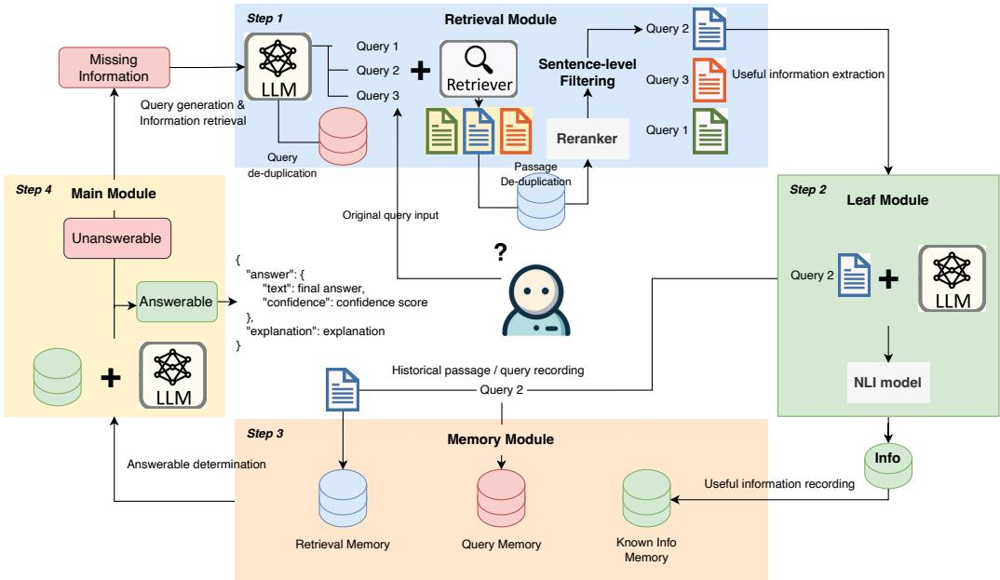
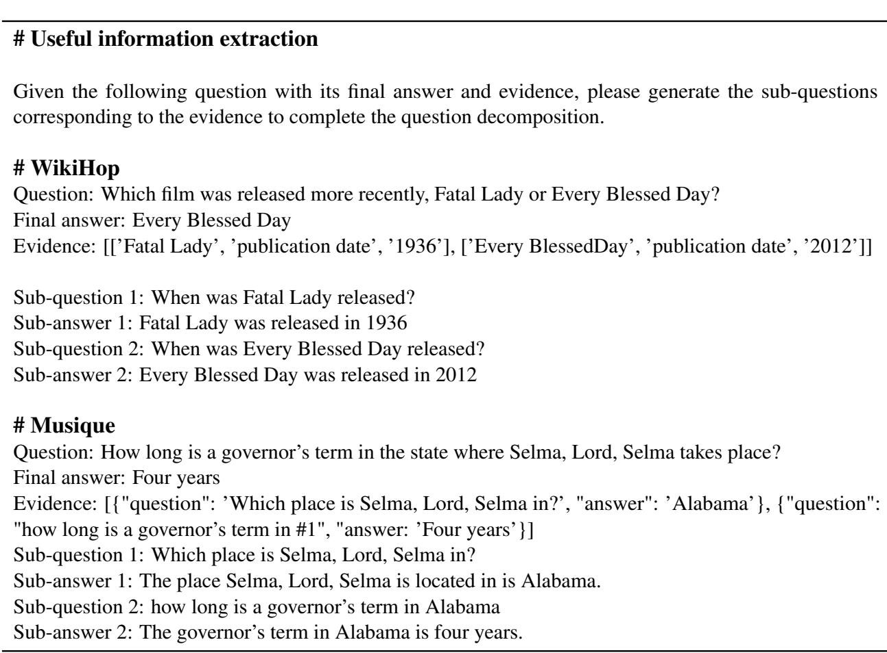
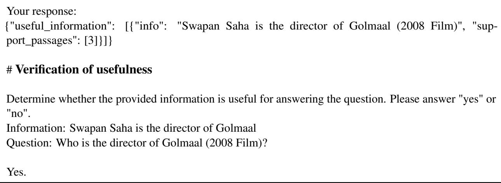
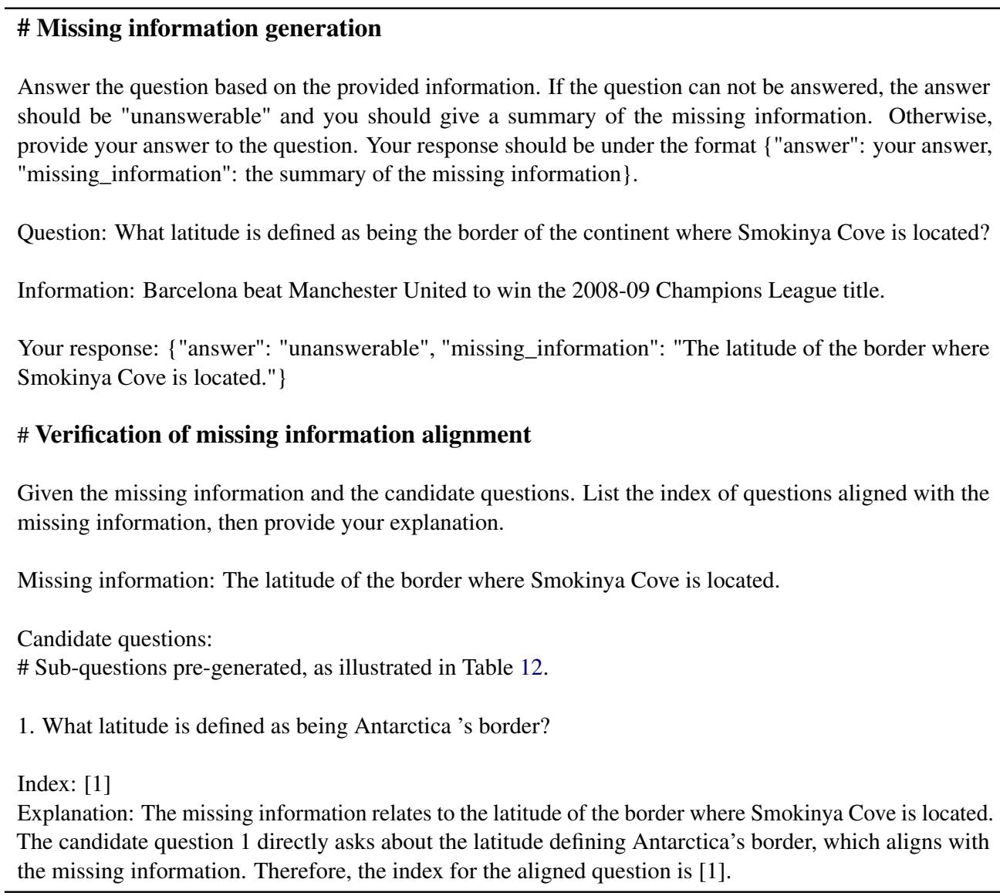
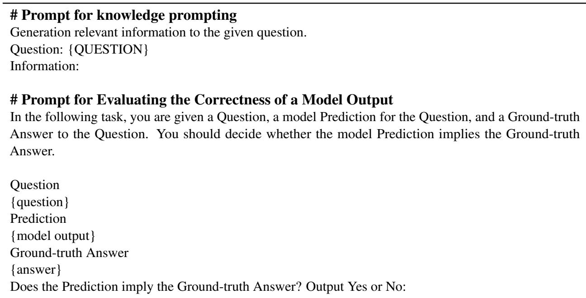
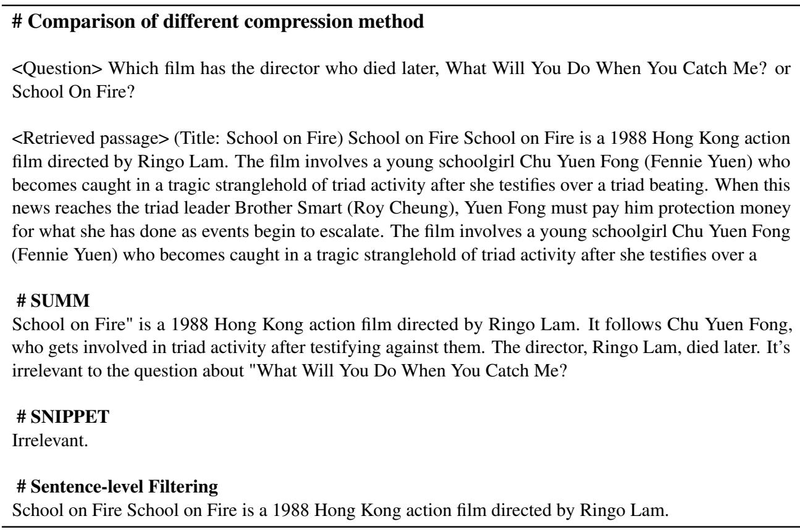

# LLMs Know What They Need: Leveraging a Missing Information Guided Framework to Empower Retrieval-Augmented Generation

Keheng Wang1, Feiyu Duan1, 2, Peiguang Li1, Sirui Wang1, 3\*, Xunliang Cai1

1Meituan, Beijing, China

2Beihang University, Beijing, China

3Department of Automation, Tsinghua University, Beijing, China {wangkeheng, duanfeiyu, lipeiguang, wangsirui, caixunliang}@meituan.com

## Abstract

Retrieval-Augmented Generation (RAG) demonstrates great value in alleviating outdated knowledge or hallucination by supplying LLMs with updated and relevant knowledge. However, RAG still faces several challenges in tackling complex multi-hop queries, which require LLMs to perform accurate reasoning and retrieval at each step. Inspired by the human reasoning process, where we progres sively search for missing information after acquiring useful clues, it is natural to question whether LLMs have similar capabilities. In this work, we first experimentally verified the ability of LLMs to extract information from the retrieved knowledge as well as to know what is still missing. Based on the above discovery, we propose a Missing Information Guided Retrieve-Extraction-Solving paradigm (MI-GRES), where we leverage the identification of missing information to generate a targeted query that steers the subsequent knowledge retrieval. Besides, we design a sentence-level re-ranking filtering approach to filter the irrelevant content from the document, along with the information extraction capability of LLMs to extract useful information from denoised documents. Extensive experiments conducted on multiple public datasets reveal the superiority of the proposed MIGRES method, and analytical experiments demonstrate the effectiveness of our proposed modules. Code and data are released in https://github.com/AdelWang/MIGRES.

## 1 Introduction

Large Language Models (LLMs) have shown impressive capabilities across various Natural Language Processing (NLP) tasks (Ouyang et al., 2022; Touvron et al., 2023; OpenAI et al., 2023). Nevertheless, LLMs only possess the knowledge present in their pretraining stage and could not remember them completely, hence LLMs may fail to answer or suffer from hallucinations given the questions that are beyond their knowledge scope. (Bang et al., 2023; Huang et al., 2023). Retrieval-Augmented Generation (RAG) is a promising solution to improve the accuracy of responses (Khandelwal et al., 2020; Izacard et al., 2022), which adopts a retrievethen-generate setup, i.e., it first retrieves queryrelated documents from external corpus and then request LLMs generates responses conditioning on documents’ knowledge.

Despite its effectiveness, RAG still faces several challenges. We classify them into doc-related and query-related: For the query side, there exist complex and multi-hop queries (e.g., What is the place ofbirth ofthe director offilm Oh Billy, Behave?), where the required information (the name of the director offilm Oh Billy, Behave) may not be explicitly stated in the query, making it difficult to retrieve relevant documents (Shao et al., 2023a). For the document side, retrieving relevant documents from the extensive candidates is inherently challenging (Gao et al., 2024; Sun et al., 2024), and there often exists irrelevant noise content throughout the complete document.

Chain-of-Thought (CoT) (Wei et al., 2022c) is introduced in RAG to tackle complex multi-hop issues by breaking them down into couple of singlehop tasks. However, traditional CoT-based methods are prone to hallucinating during inference, often necessitating task-specific demonstrations to enhance reasoning quality. Inspired by the human reasoning process, where we search for missing information after acquiring useful clues, it is natural to question whether LLMs have similar capabilities: capturing useful information and identifying what is still missing.

To explore this, we design two tasks: Information Extraction, where we prompt the LLM to extract useful information from given documents, and Missing Information Generation, where we prompt the LLM to determine whether the question can be answered and generate the missing information.

The experimental results show that LLMs demonstrate commendable performance in the Information Extraction task, achieving an average precision score of 90.6% on two test datasets. For the Missing Information Generation task, we find that even in zero-shot scenarios, LLMs can precisely identify what knowledge pieces are missing with an average accuracy of 95.6%.

Motivated by this discovery, we propose a Missing Information Guided Retrieve-Extraction-Solving paradigm (MIGRES). On the query side, we further prompt LLMs using the missing information to formulate straightforward single-hop queries. These new single-hop queries can guide the subsequent knowledge retrieval process, thus improving the performance when dealing with complex multi-hop challenges.

Regarding the challenges on the document side, we conducted preliminary experiments to assess the capability of LLMs to extract useful information from documents. To filter out irrelevant content and present LLMs with denoised documents, we propose a sentence-level re-ranking filtering strategy. This approach breaks down the retrieved documents into individual sentences, assigns a relevance score to each sentence, and re-ranks them accordingly for effective filtering.

## 2 Preliminary Experiments

In recent studies on RAG, LLMs have been commonly used to summarize documents and extract information (Gao et al., 2023a; Sun et al., 2024). Previous works also addressed complex multi-hop queries by decomposing them into sub-questions using LLMs (Press et al., 2023; Yao et al., 2023; Wang et al., 2023), yielding promising results and demonstrating the forward-looking ability of LLMs. In this section, we aim to (1) further investigate the ability of LLMs to effectively extract accurate knowledge from retrieved documents; and (2) explore whether the model can infer the remaining information needed to solve a query based on the known information. We conduct experiments on the 2WikiMultiHop (WikiHop) (Ho et al., 2020) and the Musique (Trivedi et al., 2022) datasets. These two datasets provide intermediate supervised signals as evidence and annotate the corresponding documents.

<table><tr><td>Dataset</td><td>Prec.</td><td>Rec.</td><td>Prec.†</td><td>Rec.†</td><td>Useful</td></tr><tr><td>WikiHop</td><td>89.3</td><td>72.0</td><td>94.8</td><td>72.0</td><td>96.6</td></tr><tr><td>Musique</td><td>91.8</td><td>76.1</td><td>94.6</td><td>74.2</td><td>94.3</td></tr></table>

Table 1: Experimental results on information extraction. Prec.† and Rec.† denote the precision and recall after entailment judgment. Useful is scored with binary classification accuracy.
<table><tr><td>Dataset</td><td>All Acc</td><td>Paritial Acc</td><td>Partial Match</td></tr><tr><td>WikiHop</td><td>91.2</td><td>98.4</td><td>98.0</td></tr><tr><td>Musique</td><td>86.8</td><td>92.8</td><td>96.8</td></tr></table>

Table 2: Experimental results on missing information generation. All signifies the integration of all the information in decomposed QA pairs, whereas Partial concatenates partial or no information.

## 2.1 Settings

Pre-process We randomly sample 500 instances from the training set for experiments. To verify whether the missing information generated is really needed, it is necessary to obtain the inference steps for the multi-hop question. We therefore prompt LLMs to generate the intermediate sub-QA pairs given the original question, evidence, and the final answer. Examples can be found in Table 12.

Information Extraction We utilize BM25 to search the top 50 relevant passages from the external corpus, and merge them with the original passages provided in these two datasets. A passage is labeled positive if it contains the sub-answer in the evidence1. Then we randomly sample 5 passages, concatenate them with the original question and the decomposed sub-questions, and prompt the LLM to extract useful information from the passages and cite them accordingly (Gao et al., 2023a). We evaluate the model’s performance in terms of the precision and recall of the extracted information. We observed that LLMs occasionally output parametric knowledge or incorrect reasoning related to the provided information. We therefore employ a Natural Language Inference (NLI) model2 to determine if there is an "entailment" relationship between the passage and the extracted information, and filter out those labeled as "not entailed". After extraction, we evaluate whether the information is indeed useful for answering the question by prompting the LLM and present a binary classification accuracy denoted as Useful.

Missing Information Generation We randomly concatenate All or Partial information in the QA pairs obtained in the pre-processing step, then prompt the LLM to determine whether the question can be answered and generate the missing information accordingly. We evaluate whether the model can output the correct answer or "Unanswerable" as expected with accuracy, where $\begin{array} { r l r } { A c c _ { A l l } } & { { } = } & { \frac { N ( \hat { C } o r r e c t ) } { N ( A l l ) } } \end{array}$ and $\begin{array} { r } { A c c _ { P a r t i a l } = \frac { N ( O u t p u t \cdots U n a n s w e r b l e ^ { \prime \prime } ) } { N ( P a r t i a l ) } } \end{array}$ . If the provided information is incomplete and the LLM labels it as "unanswerable," we also prompt the LLM to determine whether the generated missing information aligns with the subsequent subquestions. The score is then reported as Match =

$$
\frac { \mathrm { ~ \textit ~ { ~ N ~ } ~ } ( O u t p u t ~ ^ { \mathrm { { * } ~ } } U n a n s w e r b l e " ) } { \mathrm { ~ \textit ~ { ~ N ~ } ~ } ( O u t p u t ~ ^ { \mathrm { { * } ~ } } U n a n s w e r b l e " ) } ,
$$

We utilize GPT-3.5-turbo as the backend LLM. All experiments are conducted under a zero-shot setting. All prompts and cases are illustrated in Appendix D.

## 2.2 Results

The experimental results are shown in Table 1 and Table 2. The LLM demonstrated commendable performance in extracting useful information, achieving a promising precision score of 89.3 on WikiHop and 91.8 on Musique, and a recall score of 72.0 and 76.1.

Regarding the generation of missing information, when all necessary information is provided, the LLM achieves an accuracy of 91.2% and 86.8%, respectively, in producing precise answers. In scenarios where the available knowledge is incomplete, the LLM demonstrates an impressive average accuracy of 95.6% in classifying such queries as "unanswerable". Additionally, it can generate missing information that aligns with the subsequent decomposed sub-questions. This underscores the model’s proficiency in pinpointing the additional information needed to resolve the question and in generating the missing information that can guide subsequent knowledge retrieval.

## 3 Methodology

Inspired by the discovery in Section 2, we propose MIGRES, a Missing Information-Guided Retrieve-Extraction-Solving paradigm that leverages the identification of missing information to guide the subsequent knowledge retrieval, and utilizes the extracted information for solving factoid questionanswering tasks. In this section, we present in detail the framework of our proposed method.

## 3.1 Overview

As shown in Figure 1, MIGRES contains the following flowline modules:

• Main module, which takes the query q and retrieved information set I as input to determine whether the question can be answered. If q can be correctly answered, LLM will return the final answer a with an explanation E; otherwise, LLM will generate the missing information $I _ { m i s s }$

• Retrieval Module, which consists of Query Generator, Retriever, and Knowledge Filter. Given the original query q, previously generated sub-queries $[ q _ { 1 } , . . . , q _ { t } ]$ , the extracted information set I, and $I _ { m i s s }$ from Main Module, Query Generator will first create simpler and diverse new sub-queries $[ q _ { t + 1 } ^ { 1 } , . . . , q _ { t + 1 } ^ { m } ]$ , and Retriever obtains relevant external knowledge K in response to these queries. Subsequently, we utilize Knowledge Filter to remove noise at both the passage and sentence levels.

• Leaf Module, which reads the retrieved K to extract useful information I′ with citation of support passages. Considering that I′ might include hallucinations, we incorporate an evaluation step to ascertain if the cited passages indeed entail I′ through an NLI model. I′ will then be added to the information set I.

• Memory Module, which logs the historical retrieved knowledge and the generated queries.

For a given question q, MIGRES begins with knowledge retrieval, initially employing the Retriever to obtain pertinent K from external knowledge, followed by the Leaf Module for the useful information distillation. The distilled information set I, together with q, are then fed into the Main Module, which will assess if the current information suffices to answer the question. Should the information set I prove insufficient, the Main Module identifies the missing information $I _ { m i s s }$ , which then serves to generate new queries for subsequent knowledge retrieval. This process is iteratively repeated until either an answer is given or the max iteration step T is reached. Prompts and cases for each Module can be found in Table 17.

## 3.2 Detailed introduction of each Module

Main Module The Main Module is comprised of an LLM tasked with determining whether the input query q can be solved based solely on the known information I. If I is sufficient to conclude an answer, the LLM will generate a concise answer with an explanation. Otherwise, it will output "unanswerable" and identify what information is lacking. The missing information $I _ { m i s s }$ is then fed into the Retrieval Module for new query generation and subsequent knowledge retrieval.

  
Figure 1: The overall framework of MIGRES.

Retrieval Module Within the Retrieval Module, we instruct the LLM, which serves as the Query Generator, to formulate no more than three new distinct sub-queries $[ q _ { t + 1 } ^ { 1 } , . . . , q _ { t + 1 } ^ { m } ]$ based on the $I _ { m i s s }$ , and utilize them to retrieve external knowledge K in the form of passages. For Knowledge Filter, a re-rank model is then utilized to calculate a relevance score between K and $q _ { t + 1 } ^ { k }$ , and K with relevance lower than a threshold θ are directly filtered out. However, the remaining K might 1) contain sentence-level noise, as only a small portion of knowledge within the retrieved K is useful in most cases; and 2) be empty, which implies that external fiknowledge may not include information relevant to the queries. We thus propose the following two strategies to address these two issues:

• Sentence-Level Re-rank and Filtering We utilize NLTK to segment the passage into individual sentences, and compute a relevance score for each sentence using the same re-rank model. The noisy sentences with relevance lower than θ are filtered out. If the relevance of the entire passage exceeds the relevance of each sentence, we choose to keep the original passage as final knowledge.

• LLM Knowledge prompting It’s possible that ineffective queries may lead to suboptimal retrieval outcomes. To improve the efficiency of MIGRES when relevant external knowledge is lacking, and to fully utilize the LLM’s parametric knowledge, we prompt the LLM to generate information relevant to the subqueries when no remaining passage is available, treating it as the ultimate knowledge.

Leaf Module Subsequently, both the sub-queries $q _ { t + 1 } ^ { k }$ and the acquired knowledge K are fed into the Leaf Module to obtain distilled useful information I′. Inspired by previous work (Gao et al., 2023a; Sun et al., 2024), we also instruct the LLM to concurrently cite the indices of the passages that substantiate the extracted information. This practice proves beneficial in diminishing instances of hallucination and eradicating unfounded generated content. To avoid obtaining hallucinated information, we utilize an NLI model to determine whether the cited passages indeed entail the I′, and filter out that is not entailed.

Memory Module We observe that when the Leaf Module fails to recall useful information, the Query Generator tends to produce queries identical to previous ones. Additionally, K may include hard negative passages that scored high in relevance to the query yet fail to provide useful information, continually incorporating such knowledge does not contribute to resolving the question. To tackle these issues, we propose using a Memory Module to monitor the generated queries and the external knowledge retrieved. This approach helps to avoid repeated generation and retrieval, thereby enhancing the diversity of new queries and filtering out hard negative passages.

## 4 Experiment

## 4.1 Experiment setup

We conduct experiments on five datasets across three diverse knowledge-intensive tasks under a zero-shot setting: (1) Multi-hop question answering, including WikiHop (Ho et al., 2020), HotpotQA (Yang et al., 2018) and Musique (Trivedi et al., 2022); (2) Open-domain question answering, we use Natural Question (Kwiatkowski et al., 2019) and TriviaQA (Joshi et al., 2017); (3) Commonsense reasoning, which includes StrategyQA (Geva et al., 2021).

We utilize GPT-3.5-1106 3 as our backend LLM within all modules, and utilize BM25 with k1 = 0.9 and b = 0.4 as the Retriever, the BGE-rerankerbase (Xiao et al., 2023) as the Re-rank model, and T5-xxl-nli (Honovich et al., 2022) as the NLI model, respectively. Following previous work (Sun et al., 2024), we conduct evaluations on all 229 questions from StrategyQA and randomly subsample 500 questions for multi-hop QA and 200 for ODQA to save the cost of running experiments. We compare the final answer output by LLMs with the reference answer using exact match (EM) after normalization. As most experiments are conducted under a zero-shot setting, we also evaluate the correctness of model outputs using GPT-3.5-1106 for more robust evaluation, which is proved to be reliable in Shao et al. (2023a). We denote the resulting metric as Acc†, the prompt is shown in Table 15.

We use the December 2017 Wikipedia dump (Izacard et al., 2022) for HotpotQA, the December 2018 dump (Karpukhin et al., 2020) for WikiHop and ODQA, and the December 2021 Wikipedia dump (Izacard et al., 2022) for Musique and StrategyQA. To guarantee the retrieval of pertinent knowledge, we also create an oracle version for each dump, in which we augment all contexts in the original development sets of Multi-hop QA and Commonsense QA (including distractors) into the retrieval corpus. The results using oracle dump are denoted as MIGRES†. All datasets and hyperparameters are summarized in Table 11, while all prompts and several complete cases are detailed in Appendix C, D, E and G.

## 4.2 Baselines

We consider the following baselines for comparison.

ALCE (Gao et al., 2023a), which includes (1) VANILLA, where top-k ranked documents are concatenated as knowledge augmentation for prompting LLMs to generate responses. We also evaluate the effectiveness of incorporating sentence-level filtering, denoted as VANILLA-s (2) SUMM / SNIP-PET, where the LLM is required to synthesize relevant information or extract snippets from the top-k ranked documents. This condensed text is then integrated into the prompt for generating the response. (3) RERANK This method prompts the LLM to generate four distinct responses and then choose the answer with the highest citation recall as the final output. We evaluate all these methods under a zero-shot setting and utilize the Re-rank model to re-rank the retrieved knowledge.

ITRG (Feng et al., 2023), which is a pipeline that utilizes both generation augmented retrieval and retrieval augmented generation, and iteratively retrieves knowledge based on the previously generated content.

VTG (Sun et al., 2024), which is similar to ALCE while they utilize a verifier to evaluate whether the retrieved knowledge entails the generated sentence. If not, they prompt LLMs to generate new queries for searching more evidence that supports the current sentence and drop any unsupported sentence. ReAct (Yao et al., 2023) includes reasoning, action, and observation steps, where the action can be either generating a query for searching information or concluding an answer, and the observation is to concatenate the retrieved knowledge.

Self-Ask (Press et al., 2023) includes question decomposition and answer searching steps. The LLM gives the final answer until no more follow-up questions are generated. Yoran et al. (2023a) and Shao et al. (2023a) further prepend newly retrieved knowledge to the original question for sub-answers generation.

ITER-RETGEN (Shao et al., 2023a) combines retrieval augmented generation with generation augmented retrieval that iteratively generates new sentences as extensions to the original query for next step retrieval.

<table><tr><td rowspan="2">Datasets Metrics</td><td colspan="2">WikiHop</td><td colspan="2">Hotpot</td><td colspan="2">Musique</td><td colspan="2">NQ</td><td colspan="2">TriviaQ</td><td colspan="2">StrategyQA</td></tr><tr><td>EM</td><td> $\mathbf { \overline { { A c c } } } ^ { \dagger }$ </td><td>EM</td><td> $\mathbf { \overline { { A c c } } } ^ { \dagger }$ </td><td>EM</td><td> $\overline { { \mathbf { A } \mathbf { c } \mathbf { c } ^ { \dag } } }$ </td><td>EM</td><td> $\overline { { \mathbf { A } \mathbf { c } \mathbf { c } ^ { \dag } } }$ </td><td>EM</td><td> $\overline { { \mathbf { A } \mathbf { c } \mathbf { c } ^ { \dag } } }$ </td><td>EM</td><td> $\mathbf { \overline { { A c c ^ { \dagger } } } }$ </td></tr><tr><td colspan="10">Zero-shot</td></tr><tr><td>VANILLA</td><td>24.5</td><td>45.5</td><td>27.5</td><td>60.5</td><td>10.5</td><td>26.0</td><td>33.5</td><td>72.5</td><td>57.5</td><td>87.5</td><td>62.9</td><td>62.9</td></tr><tr><td>VANILLA-s</td><td>26.5</td><td>48.5</td><td>28.0</td><td>62.0</td><td>11.5</td><td>27.5</td><td>34.5</td><td>75.5</td><td>59.0</td><td>88.0</td><td>65.5</td><td>65.5</td></tr><tr><td>SUMM</td><td>25.5</td><td>52.0</td><td>25.5</td><td>56.0</td><td>10.0</td><td>29.5</td><td>32.5</td><td>72.5</td><td>56.5</td><td>84.5</td><td>62.9</td><td>62.9</td></tr><tr><td>SNIPPET</td><td>26.0</td><td>50.5</td><td>29.5</td><td>61.5</td><td>10.5</td><td>27.5</td><td>33.0</td><td>69.0</td><td>57.5</td><td>87.5</td><td>62.0</td><td>62.0</td></tr><tr><td>RERANK</td><td>28.5</td><td>56.0</td><td>30.0</td><td>63.0</td><td>12.5</td><td>30.0</td><td>36.5</td><td>77.0</td><td>59.0</td><td>89.5</td><td>65.9</td><td>65.9</td></tr><tr><td>MIGRES</td><td>33.6</td><td>58.5</td><td>38.0</td><td>66.6</td><td>18.6</td><td>32.8</td><td>43.0</td><td>80.0</td><td>61.0</td><td>91.0</td><td>73.4</td><td>73.4</td></tr><tr><td>MIGRES†</td><td>40.1</td><td>65.9</td><td>38.6</td><td>67.2</td><td>19.4</td><td>33.2</td><td>43.5</td><td>79.0</td><td>60.5</td><td>91.0</td><td>72.1</td><td>72.1</td></tr><tr><td colspan="11">Few-shot</td></tr><tr><td>ITRG</td><td>29.8</td><td>-</td><td>33.4</td><td>-</td><td>-</td><td>-</td><td>33.8</td><td>-</td><td>77.8</td><td>-</td><td>-</td><td>-</td></tr><tr><td>VTG</td><td>41.5</td><td></td><td></td><td></td><td></td><td></td><td>63.0</td><td>一</td><td>-</td><td>-</td><td></td><td></td></tr><tr><td>ReAct</td><td>28.0</td><td>45.9</td><td>24.9</td><td>61.1</td><td>23.4</td><td>37.9</td><td></td><td>-</td><td>-</td><td>-</td><td>66.9</td><td>66.9</td></tr><tr><td>Self-Ask</td><td>37.3</td><td>55.9</td><td>36.8</td><td>64.8</td><td>27.6</td><td>42.9</td><td>-</td><td>-</td><td>-</td><td>1</td><td>70.2</td><td>70.2</td></tr><tr><td>ITER-RETGEN</td><td>34.9</td><td>58.1</td><td>44.1</td><td>71.2</td><td>26.4</td><td>41.0</td><td>-</td><td>-</td><td>1</td><td>-</td><td>73.0</td><td>73.0</td></tr><tr><td>MIGRES*</td><td>47.6</td><td>61.2</td><td>46.8</td><td>68.6</td><td>19.6</td><td>34.0</td><td>47.0</td><td>78.0</td><td>63.0</td><td>91.5</td><td>74.2</td><td>74.2</td></tr><tr><td>MIGRES*†</td><td>54.0</td><td>71.0</td><td>49.4</td><td>72.4</td><td>20.8</td><td>34.6</td><td>48.0</td><td>80.0</td><td>62.5</td><td>92.0</td><td>72.9</td><td>72.9</td></tr></table>

Table 3: Comparison between MIGRES and baselines on Multi-hop QA, Open-domain QA and Commonsense QA task. Acc† is the accuracy of model outputs evaluated with GPT-3.5-1106. MIGRES† is the results using the oracle knowledge pool. The results of "Few-shot" are extracted from the original paper, "-" represents that the results are unavailable. The best values are highlighted in bold.
<table><tr><td>Method</td><td colspan="3">WikiHop</td><td colspan="3">Hotpot</td><td colspan="3">Musique</td></tr><tr><td></td><td>#API</td><td># Iter</td><td># Passages</td><td>#API</td><td># Iter</td><td># Passages</td><td>#API</td><td># Iter</td><td># Passages</td></tr><tr><td>ReAct</td><td>3.0</td><td>3.0</td><td>15.0</td><td>2.9</td><td>2.9</td><td>14.4</td><td>2.9</td><td>2.9</td><td>14.3</td></tr><tr><td>Self-Ask</td><td>3.2</td><td>3.2</td><td>15.9</td><td>3.0</td><td>3.0</td><td>14.8</td><td>3.2</td><td>3.2</td><td>16.0</td></tr><tr><td>ITER_RETGEN</td><td>2.0</td><td>2.0</td><td>5.0</td><td>2.0</td><td>2.0</td><td>5.0</td><td>2.0</td><td>2.0</td><td>5.0</td></tr><tr><td>MIGRES</td><td>8.4</td><td>2.5</td><td>1.3</td><td>9.5</td><td>2.7</td><td>3.1</td><td>6.4</td><td>1.9</td><td>2.3</td></tr><tr><td>MIGRES*</td><td>8.1</td><td>2.4</td><td>1.4</td><td>11.9</td><td>3.4</td><td>1.8</td><td>5.8</td><td>1.8</td><td>2.6</td></tr><tr><td colspan="4">NQ</td><td colspan="4">TriviaQ</td><td colspan="2">StrategyQA</td></tr><tr><td></td><td>#API</td><td># Iter</td><td># Passages</td><td>#API</td><td># Iter</td><td># Passages</td><td>#API</td><td># Iter</td><td># Passages</td></tr><tr><td>ReAct</td><td>-</td><td>-</td><td>-</td><td>-</td><td>-</td><td>-</td><td>2.9</td><td>2.9</td><td>14.3</td></tr><tr><td>Self-Ask</td><td></td><td></td><td></td><td></td><td></td><td></td><td>3.2</td><td>3.2</td><td>16.0</td></tr><tr><td>ITER_RETGEN</td><td></td><td></td><td></td><td></td><td></td><td></td><td>2.0</td><td>2.0</td><td>5.0</td></tr><tr><td>MIGRES</td><td>3.5</td><td>1.3</td><td>1.3</td><td>3.4</td><td>1.1</td><td>1.3</td><td>4.0</td><td>1.3</td><td>1.3</td></tr><tr><td>MIGRES*</td><td>4.9</td><td>1.3</td><td>1.4</td><td>4.0</td><td>1.3</td><td>1.4</td><td>4.7</td><td>1.5</td><td>1.4</td></tr></table>

Table 4: Efficiency of MIGRES. # API, # Iter and # Passages represent the average API calls, iteration steps, and the number of passages within each iteration. It can be seen that the total number of passages is less than 5 for MIGRES across all datasets, while other baselines surpass 10.

As most baselines are under a few-shot setting, we also conduct experiments concatenating demonstrations to perform 2-shot ICL. We design specific examples sampled from the training set of Wiki-Hop, NQ, and StrategyQA for each module and fix them during inference. The same demonstrations are shared in multi-hop QA, ODQA, and Commonsense QA, respectively. Our method with few-shot learning is denoted as MIGRES∗, and if not specified, the default setting for MIGRES is zero-shot.

## 4.3 Main results

As shown in Table 3, MIGRES outperforms all methods in ALCE under the zero-shot setting, and even achieves competitive or better results on WikiHop, HotpotQA, and StrategyQA compared with few-shot baselines, demonstrating the effectiveness of our proposed method. The performance of MI-GRES can be further improved when augmenting oracle knowledge, indicating that instances of incorrect responses from the LLM are sometimes a result of the absence of relevant knowledge in the external retrieval corpus.

We also design demonstrations to conduct fewshot learning. It can be seen from Table 3 that the performance generally improves, as we find that adding demonstrations can steer LLM to generate more targeted new queries, and reduce the hallucinated knowledge generated. The EM scores on the WikiHop and HotpotQA datasets, which feature more concise answers, saw notable improvement. This implies that few-shot learning effectively aids the model in avoiding the creation of unnecessary descriptions and in delivering more concise responses.

<table><tr><td>Dataset</td><td colspan="3">WikiHop</td><td colspan="3">Musique</td><td colspan="3">NQ</td></tr><tr><td>Metrics</td><td>EM</td><td>Acc†</td><td># Tokens</td><td>EM</td><td>Acc†</td><td># Tokens</td><td>EM</td><td>Acc†</td><td># Tokens</td></tr><tr><td>MIGRES</td><td>33.6</td><td>58.5</td><td>733</td><td>18.0</td><td>31.5</td><td>1224</td><td>43.0</td><td>80.0</td><td>333</td></tr><tr><td>w/o Sentence Filtering</td><td>33.0</td><td>58.0</td><td>877</td><td>19.0</td><td>33.6</td><td>1697</td><td>43.5</td><td>76.5</td><td>404</td></tr><tr><td>w SUMM</td><td>26.0</td><td>54.2</td><td>1249</td><td>12.0</td><td>30.0</td><td>1898</td><td>40.0</td><td>73.5</td><td>522</td></tr><tr><td>w SNIPPET</td><td>26.6</td><td>52.2</td><td>1095</td><td>12.5</td><td>29.5</td><td>1775</td><td>42.5</td><td>74.0</td><td>454</td></tr></table>

Table 5: Comparison of MIGRES different knowledge compression/filtering method. # Tokens denotes the average tokens consumption of external knowledge for each instance in the Leaf Module. For SUMM and SNIPPET, we also count the token consumption calling API for summarization and snippet extraction.
<table><tr><td rowspan="2">Dataset Metrics</td><td rowspan="2"></td><td colspan="2">WikiHop</td><td colspan="4">Musique</td><td colspan="2">NQ</td></tr><tr><td>EM Acc†</td><td># Avg. Iter</td><td>EM</td><td>Acc†</td><td># Avg. Iter</td><td>EM</td><td>Acc†</td><td># Avg. Iter</td></tr><tr><td>GPT-3.5-1106</td><td>34.8</td><td>54.4</td><td>2.53</td><td>16.8</td><td>31.6</td><td>2.96</td><td>42.5</td><td>73.5</td><td>1.28</td></tr><tr><td>w/o GPT knowledge</td><td>32.0</td><td>53.8</td><td>2.96</td><td>15.6</td><td>30.0</td><td>2.95</td><td>41.5</td><td>72.5</td><td>1.51</td></tr><tr><td>GPT-4-0613</td><td>50.0</td><td>68.0</td><td>2.76</td><td>22.4</td><td>39.8</td><td>2.85</td><td>44.5</td><td>77.5</td><td>1.31</td></tr><tr><td>w/o GPT knowledge</td><td>46.6</td><td>63.8</td><td>3.03</td><td>21.4</td><td>41.8</td><td>2.80</td><td>45.0</td><td>75.5</td><td>1.50</td></tr></table>

Table 6: Comparison of MIGRES with/without prompting LLM to generate relevant information when no documents retrieved have a relevance score higher than δ (to avoid that some questions consistently fail to retrieve highly relevant documents, we set δ = 1.0). # Avg. Iter denotes the mean iteration steps during inference.

MIGRES performs poorly on Musique, we think it’s because the questions in this dataset are more obscure and ambiguous, making it difficult for the Retriever to recall relevant knowledge from the retrieval corpus. For example, Natalie Wood and Mara Wilson both played Susan Walker in Miracle on 34th Street, but MIGRES fails to recall the knowledge about Natalie Wood and only output Mara Wilson as the player, while the only label provided for this instance is Natalie Wood, resulting an incorrect response for the question Who is the sibling of the actress who played Susan Walker in Miracle on 34th street?.

It’s worth noting that, with irrelevant knowledge filtering, we greatly reduce the token consumption of external knowledge, while keeping superior or competitive performance compared with baselines. As shown in Table 4, despite additional API calls are required in the entire pipeline, we reduce the total number of passages (which is much more costly) to less than 5.

## 4.4 Benefit of Sentence-Level Filtering

We adopt sentence-level filtering to further reduce the noise in the retrieved passages. As can be seen from Table 3, VANILLA-s consistently improves the performance across all datasets compared with VANILLA, and reduces the token cost of external knowledge. Incorporating sentence-level filtering also outperforms SUMM and SNIPPET on various datasets without additional calls of LLM, but its performance is less effective on WikiHop and Musique. This could be attributed to the fact that VANILLA retains only the top 5 passages reranked, while content deemed irrelevant is not kept in the SUMM and SNIPPET. With 7.9 and 8.4 average calls of LLM for knowledge compression to get 5 relevant refined passages, they are able to capture more information, thereby improving the performance, especially in multi-hop QA scenarios. A comparison of these three compression methods can be found in Table 16.

To further investigate the token efficiency, we evaluate MIGRES using different compression methods on WikiHop, Musique, and NQ, the results are shown in Table 5. We can see that employing sentence-level filtering slightly outperforms the others, with less token consumption and no extra calls for LLM.

<table><tr><td>Dataset</td><td>WikiHop</td><td>Musique</td><td>NQ</td></tr><tr><td>GPT-3.5-1106</td><td>45.5</td><td>54.6</td><td>24.7</td></tr><tr><td>GPT-4-0613</td><td>87.7</td><td>77.5</td><td>32.0</td></tr></table>

Table 7: Accuracy of the parametric knowledge.

## 4.5 Benefit of Prompting GPT knowledge

The Retrieval Module may sometimes fail to deliver valid pertinent knowledge, either due to the imprecision of the Retriever or the Re-rank model, or because the corresponding external knowledge is absent. Additionally, the LLM possesses a wealth of world knowledge that enables it to generate valuable information given the query. To fully leverage the parametric knowledge of LLM and to improve the iteration efficiency of MIGRES, we prompt the LLM to generate query-related information when the Retrieval Module returns no knowledge.

<table><tr><td></td><td>WikiHop</td><td>Hotpot</td><td>StrategyQA</td><td>Musique</td><td>NQ</td><td>TriviaQ</td></tr><tr><td>Direct</td><td>38.6</td><td>51.8</td><td>63.3</td><td></td><td></td><td></td></tr><tr><td>ReAct</td><td>27.5</td><td>36.0</td><td>61.5</td><td></td><td>一</td><td></td></tr><tr><td>Self-Ask</td><td>38.5</td><td>45.8</td><td>63.3</td><td></td><td></td><td></td></tr><tr><td>ITER-RETGEN</td><td>48.0</td><td>57.8</td><td>67.2</td><td></td><td></td><td></td></tr><tr><td>MIGRES*</td><td>52.0</td><td>56.4</td><td>64.6</td><td>28.6</td><td>64.0</td><td>76.5</td></tr></table>

Table 8: Experiments using the open-source Llama-2-13B-chat models. We used $\operatorname { A c c } ^ { \dagger }$ as the evaluation metric as in Shao et al. (2023b), i.e., to evaluate the accuracy of model outputs with GPT-3.5-turbo-1106. All results of baselines are obtained from Shao et al. (2023a).

To investigate the effectiveness of utilizing the parametric knowledge of LLM, we conduct experiments without knowledge prompting, where MI-GRES attempts to retrieve relevant knowledge at the next iteration steps by generating more simpler and diverse queries in the absence of knowledge returned by the Retrieval Module. The results are shown in Table 6. We can see that MIGRES with knowledge prompting achieves better results on WikiHop and NQ, showing that the LLM can indeed provide valuable information related to the input queries. However, we did not observe a significant reduction in average iteration steps, this might be because of the GPT’s ability to provide rejection responses like "I don’t know" in case of uncertainty or lack of knowledge.

We also evaluate the accuracy of the generated knowledge by checking if it contains the subanswer with EM metric, the results are shown in Table 7. We can see that the generated knowledge gets a promising accuracy on WikiHop and Musique, thereby offering valuable information to address the input query. The low accuracy observed on the NQ could stem from its answers being less concise, resulting in reduced EM scores. For instance, GPT will generate French immigrants settled in various regions across Texas for the question where did the French immigrants settle in Texas, while the ground truth answer is present - day southeastern Texas.

## 4.6 Experiments using Llama-2

To demonstrate the effectiveness of MIGRES on open-source models, we replace the generation model GPT-3.5-turbo-1106 with Llama-2-13Bchat, and re-run the evaluation. We find that smaller

LLM struggle to follow instructions well enough to generate the desired output (we prompt LLM to generate structured output for content extraction, and therefore perform 2-shot learning for evaluation. As shown in Table 8, MIGRES still achieve better or competitive results compared to all baselines.

## 5 Related Works

Query optimization in RAG The optimization of user original queries is a critical area of focus (Gao et al., 2023b) in RAG. Initial approaches attempted to decompose multi-hop questions using rule-based methods and supervised models (Min et al., 2019; Sun et al., 2020; Khot et al., 2021), or expand the query itself through Generation Augmented Retrieval(Shwartz et al., 2020; Liu et al., 2022). However, these strategies often fail to pinpoint the gaps in the knowledge of language models.

With the discovery of the reasoning capabilities inherent in LLMs (Wei et al., 2022a), several studies represented by CoT (Wei et al., 2022b) explored the use of the LLM to reform the query. These include static decomposition, where the original problem is dissected into sub-problems simultaneously (Zhou et al., 2022; Zhao et al., 2023), but these methods lack flexibility. Thus, more dynamic approaches were also developed (Shao et al., 2023b; Feng et al., 2023; Press et al., 2023; Yao et al., 2023; Kim et al., 2023), which interact with external information sources in real-time. However, Shao et al. (2023b) and Feng et al. (2023) simply concatenate retrieved and generated content without clearly identifying the knowledge gaps in each iteration, Press et al. (2023) and Yao et al. (2023) lacks the step of verification. Kim et al. (2023) employs a tree structure for more detailed problem decomposition, which can be time-consuming. Instead, our approach prompts the language model to find the missing information for more efficient retrieval, with less time costs.

Retrieve-then-rerank framework Retrieving documents that are relevant to the input query from the extensive pool of knowledge is inherently challenging (Gao et al., 2024; Sun et al., 2024), especially when there exists irrelevant noise content throughout the context (Chen et al., 2024; Yoran et al., 2023b). Therefore, the retrieve-then-rerank paradigm is widely adopted to improve the quality of context by re-ranking retrieved knowledge to filter out the hard negative passages (Ma et al., 2023). To streamline this process and condense the context, researchers suggest creating summaries or snippets pertinent (Gao et al., 2023a; Chen et al., 2023; Xu et al., 2024; Sun et al., 2024) to serve as knowledge augmentation. Nevertheless, Gao et al. (2023a) and Chen et al. (2023) do not assess the consistency between the retrieved text and the question, Xu et al. (2024) and Sun et al. (2024) are limited to coarse-grained reranking. Our approach enhances both aspects, by performing fine-grained filtering at the sentence level and by verifying the entailment between the top-ranked texts and the problem.

## 6 Conclusion

We first experimentally validated the capability of LLMs to extract information and identify missing information. Based on the discovery, we propose MIGRES, which leverages the missing information to steer new query generation and subsequent knowledge retrieval, and thus facilitates the process of RAG for solving knowledge-intensive questions. Experimental results demonstrate the effectiveness of our proposed method, which achieves superior or competitive performances compared with stateof-the-art baselines with generally less token consumption on external knowledge.

## Limitation

Our experiments primarily concentrated on stateof-the-art LLMs renowned for their robust understanding and reasoning abilities. The performance of other smaller, open-source LLMs has not been thoroughly validated. We presented experimental results for llama2-13B, which show that MIGRES still achieves advanced performance. This suggests that even smaller models, which are easier to deploy, have sufficient reasoning capabilities to generate missing information and guide subsequent knowledge retrieval.

We also experimented with more advanced retrieval methods (e.g., utilizing bge (Xiao et al., 2023) to conduct dense retrieval, for more details please refer to Appendix A). However, the performance of MIGRES with stronger a retriever was inferior to that of BM25. This could be attributed to the ability of dense retrieval to recall knowledge that is semantically relevant but lacks pertinent information. Such knowledge often covers similar topics or includes the same nouns as the query. For instance, in response to the query When was the director ofThe House ofPulcini born?, the dense retriever returns a passage titled Shari Springer Berman and Robert Pulcini that talks about a team of filmmakers. The inclusion of such knowledge not only decreases the precision of information extracted (Cuconasu et al., 2024), but also leads to a less efficient iteration.

## References

Yejin Bang, Samuel Cahyawijaya, Nayeon Lee, Wenliang Dai, Dan Su, Bryan Wilie, Holy Lovenia, Ziwei Ji, Tiezheng Yu, Willy Chung, Quyet V. Do, Yan Xu, and Pascale Fung. 2023. A multitask, multilingual, multimodal evaluation of chatgpt on reasoning, hallucination, and interactivity. Preprint, arXiv:2302.04023.

Howard Chen, Ramakanth Pasunuru, Jason Weston, and Asli Celikyilmaz. 2023. Walking down the memory maze: Beyond context limit through interactive reading. arXiv preprint arXiv:2310.05029.

Jiawei Chen, Hongyu Lin, Xianpei Han, and Le Sun. 2024. Benchmarking large language models in retrieval-augmented generation. In Proceedings of the AAAI Conference on Artificial Intelligence, volume 38, pages 17754–17762.

Florin Cuconasu, Giovanni Trappolini, Federico Siciliano, Simone Filice, Cesare Campagnano, Yoelle Maarek, Nicola Tonellotto, and Fabrizio Silvestri. 2024. The power of noise: Redefining retrieval for rag systems. Preprint, arXiv:2401.14887.

Zhangyin Feng, Xiaocheng Feng, Dezhi Zhao, Maojin Yang, and Bing Qin. 2023. Retrieval-generation synergy augmented large language models. Preprint, arXiv:2310.05149.

Tianyu Gao, Howard Yen, Jiatong Yu, and Danqi Chen. 2023a. Enabling large language models to generate text with citations. In Proceedings ofthe 2023 Conference on Empirical Methods in Natural Language Processing, pages 6465–6488, Singapore. Association for Computational Linguistics.

Yunfan Gao, Yun Xiong, Xinyu Gao, Kangxiang Jia, Jinliu Pan, Yuxi Bi, Yi Dai, Jiawei Sun, Qianyu Guo,

Meng Wang, and Haofen Wang. 2024. Retrievalaugmented generation for large language models: A survey. Preprint, arXiv:2312.10997.

Yunfan Gao, Yun Xiong, Xinyu Gao, Kangxiang Jia, Jinliu Pan, Yuxi Bi, Yi Dai, Jiawei Sun, and Haofen Wang. 2023b. Retrieval-augmented generation for large language models: A survey. arXiv preprint arXiv:2312.10997.

Mor Geva, Daniel Khashabi, Elad Segal, Tushar Khot, Dan Roth, and Jonathan Berant. 2021. Did Aristotle Use a Laptop? A Question Answering Benchmark with Implicit Reasoning Strategies. Transactions ofthe Associationfor Computational Linguistics (TACL).

Xanh Ho, Anh-Khoa Duong Nguyen, Saku Sugawara, and Akiko Aizawa. 2020. Constructing a multihop QA dataset for comprehensive evaluation of reasoning steps. In Proceedings of the 28th International Conference on Computational Linguistics, pages 6609–6625, Barcelona, Spain (Online). International Committee on Computational Linguistics.

Or Honovich, Roee Aharoni, Jonathan Herzig, Hagai Taitelbaum, Doron Kukliansy, Vered Cohen, Thomas Scialom, Idan Szpektor, Avinatan Hassidim, and Yossi Matias. 2022. TRUE: Re-evaluating factual consistency evaluation. In Proceedings ofthe 2022 Conference of the North American Chapter of the Association for Computational Linguistics: Human Language Technologies, pages 3905–3920, Seattle, United States. Association for Computational Linguistics.

Lei Huang, Weijiang Yu, Weitao Ma, Weihong Zhong, Zhangyin Feng, Haotian Wang, Qianglong Chen, Weihua Peng, Xiaocheng Feng, Bing Qin, and Ting Liu. 2023. A survey on hallucination in large language models: Principles, taxonomy, challenges, and open questions. Preprint, arXiv:2311.05232.

Gautier Izacard, Patrick Lewis, Maria Lomeli, Lucas Hosseini, Fabio Petroni, Timo Schick, Jane Dwivedi-Yu, Armand Joulin, Sebastian Riedel, and Edouard Grave. 2022. Atlas: Few-shot learning with retrieval augmented language models. Preprint, arXiv:2208.03299.

Mandar Joshi, Eunsol Choi, Daniel Weld, and Luke Zettlemoyer. 2017. TriviaQA: A large scale distantly supervised challenge dataset for reading comprehension. In Proceedings ofthe 55th Annual Meeting of the Association for Computational Linguistics (Volume 1: Long Papers), pages 1601–1611, Vancouver, Canada. Association for Computational Linguistics.

Vladimir Karpukhin, Barlas Oguz, Sewon Min, Patrick˘ Lewis, Ledell Wu, Sergey Edunov, Danqi Chen, and Wen tau Yih. 2020. Dense passage retrieval for open-domain question answering. Preprint, arXiv:2004.04906.

Urvashi Khandelwal, Omer Levy, Dan Jurafsky, Luke Zettlemoyer, and Mike Lewis. 2020. Generalization

through memorization: Nearest neighbor language models. In International Conference on Learning Representations.

Tushar Khot, Daniel Khashabi, Kyle Richardson, Peter Clark, and Ashish Sabharwal. 2021. Text modular networks: Learning to decompose tasks in the language of existing models. Proceedings of the 2021 Conference of the North American Chapter of the Associationfor Computational Linguistics: Human Language Technologies, page 1264–1279.

Gangwoo Kim, Sungdong Kim, Byeongguk Jeon, Joonsuk Park, and Jaewoo Kang. 2023. Tree of clarifications: Answering ambiguous questions with retrievalaugmented large language models. In Proceedings of the 2023 Conference on Empirical Methods in Natural Language Processing, pages 996–1009.

Tom Kwiatkowski, Jennimaria Palomaki, Olivia Redfield, Michael Collins, Ankur Parikh, Chris Alberti, Danielle Epstein, Illia Polosukhin, Jacob Devlin, Kenton Lee, Kristina Toutanova, Llion Jones, Matthew Kelcey, Ming-Wei Chang, Andrew M. Dai, Jakob Uszkoreit, Quoc Le, and Slav Petrov. 2019. Natural questions: A benchmark for question answering research. Transactions ofthe Associationfor Computational Linguistics, 7:452–466.

Jiacheng Liu, Alisa Liu, Ximing Lu, Sean Welleck, Peter West, Ronan Le Bras, Yejin Choi, and Hannaneh Hajishirzi. 2022. Generated knowledge prompting for commonsense reasoning. In Proceedings ofthe 60th Annual Meeting ofthe Associationfor Computational Linguistics (Volume 1: Long Papers), pages 3154–3169, Dublin, Ireland. Association for Computational Linguistics.

Xueguang Ma, Xinyu Zhang, Ronak Pradeep, and Jimmy Lin. 2023. Zero-shot listwise document reranking with a large language model. arXiv preprint arXiv:2305.02156.

Sewon Min, Victor Zhong, Luke Zettlemoyer, and Hannaneh Hajishirzi. 2019. Multi-hop reading comprehension through question decomposition and rescoring. arXiv preprint arXiv:1906.02916.

OpenAI, :, Josh Achiam, Steven Adler, Sandhini Agarwal, Lama Ahmad, Ilge Akkaya, Florencia Leoni Aleman, Diogo Almeida, Janko Altenschmidt, Sam Altman, Shyamal Anadkat, Red Avila, Igor Babuschkin, Suchir Balaji, Valerie Balcom, Paul Baltescu, Haiming Bao, Mo Bavarian, Jeff Belgum, Irwan Bello, Jake Berdine, Gabriel Bernadett-Shapiro, Christopher Berner, Lenny Bogdonoff, Oleg Boiko, Madelaine Boyd, Anna-Luisa Brakman, Greg Brockman, Tim Brooks, Miles Brundage, Kevin Button, Trevor Cai, Rosie Campbell, Andrew Cann, Brittany Carey, Chelsea Carlson, Rory Carmichael, Brooke Chan, Che Chang, Fotis Chantzis, Derek Chen, Sully Chen, Ruby Chen, Jason Chen, Mark Chen, Ben Chess, Chester Cho, Casey Chu, Hyung Won Chung, Dave Cummings, Jeremiah Currier, Yunxing Dai, Cory Decareaux, Thomas Degry, Noah Deutsch, Damien

Deville, Arka Dhar, David Dohan, Steve Dowl ing, Sheila Dunning, Adrien Ecoffet, Atty Eleti, Tyna Eloundou, David Farhi, Liam Fedus, Niko Felix, Simón Posada Fishman, Juston Forte, Is abella Fulford, Leo Gao, Elie Georges, Christian Gibson, Vik Goel, Tarun Gogineni, Gabriel Goh, Rapha Gontijo-Lopes, Jonathan Gordon, Morgan Grafstein, Scott Gray, Ryan Greene, Joshua Gross, Shixiang Shane Gu, Yufei Guo, Chris Hallacy, Jesse Han, Jeff Harris, Yuchen He, Mike Heaton, Jo hannes Heidecke, Chris Hesse, Alan Hickey, Wade Hickey, Peter Hoeschele, Brandon Houghton, Kenny Hsu, Shengli Hu, Xin Hu, Joost Huizinga, Shantanu Jain, Shawn Jain, Joanne Jang, Angela Jiang, Roger Jiang, Haozhun Jin, Denny Jin, Shino Jomoto, Billie Jonn, Heewoo Jun, Tomer Kaftan, Łukasz Kaiser, Ali Kamali, Ingmar Kanitscheider, Nitish Shirish Keskar, Tabarak Khan, Logan Kilpatrick, Jong Wook Kim, Christina Kim, Yongjik Kim, Hendrik Kirch ner Jamie Kiros Matt Knight Daniel Kokotailc Łukasz Kondraciuk, Andrew Kondrich, Aris Kon stantinidis, Kyle Kosic, Gretchen Krueger, Vishal Kuo, Michael Lampe, Ikai Lan, Teddy Lee, Jan Leike, Jade Leung, Daniel Levy, Chak Ming Li, Rachel Lim, Molly Lin, Stephanie Lin, Mateusz Litwin, Theresa Lopez, Ryan Lowe, Patricia Lue, Anna Makanju, Kim Malfacini, Sam Manning, Todor Markov, Yaniv Markovski, Bianca Martin, Katie Mayer, Andrew Mayne, Bob McGrew, Scott Mayer McKinney, Christine McLeavey, Paul McMillan, Jake McNeil, David Medina, Aalok Mehta, Jacob Menick, Luke Metz, Andrey Mishchenko, Pamela Mishkin, Vinnie Monaco, Evan Morikawa, Daniel Mossing, Tong Mu, Mira Murati, Oleg Murk, David Mély, Ashvin Nair, Reiichiro Nakano, Rajeev Nayak, Arvind Neelakantan, Richard Ngo, Hyeonwoo Noh, Long Ouyang, Cullen O’Keefe, Jakub Pachocki, Alex Paino, Joe Palermo, Ashley Pantuliano, Giambat tista Parascandolo Joel Parish Emy Parparita Alex Passos, Mikhail Pavlov, Andrew Peng, Adam Perel man, Filipe de Avila Belbute Peres, Michael Petrov, Henrique Ponde de Oliveira Pinto, Michael, Poko rny, Michelle Pokrass, Vitchyr Pong, Tolly Pow ell, Alethea Power, Boris Power, Elizabeth Proehl, Raul Puri, Alec Radford, Jack Rae, Aditya Ramesh, Cameron Raymond, Francis Real, Kendra Rimbach, Carl Ross, Bob Rotsted, Henri Roussez, Nick Ry der. Mario Saltarelli, Ted Sanders, Shibani Santurkar Girish Sastry, Heather Schmidt, David Schnurr, John Schulman, Daniel Selsam, Kyla Sheppard, Toki Sherbakov, Jessica Shieh, Sarah Shoker, Pranav Shyam, Szymon Sidor, Eric Sigler, Maddie Simens, Jordan Sitkin, Katarina Slama, Ian Sohl, Benjamin Sokolowsky, Yang Song, Natalie Staudacher, Fe lipe Petroski Such, Natalie Summers, Ilya Sutskever, Jie Tang, Nikolas Tezak, Madeleine Thompson, Phil Tillet, Amin Tootoonchian, Elizabeth Tseng, Pre ston Tuggle, Nick Turley, Jerry Tworek, Juan Fe lipe Cerón Uribe, Andrea Vallone, Arun Vijayvergiya, Chelsea Voss, Carroll Wainwright, Justin Jay Wang, Alvin Wang, Ben Wang, Jonathan Ward, Jason Wei, CJ Weinmann, Akila Welihinda, Peter Welinder, Ji ayi Weng, Lilian Weng, Matt Wiethoff, Dave Willner, Clemens Winter, Samuel Wolrich, Hannah Wong,

Lauren Workman, Sherwin Wu, Jeff Wu, Michael Wu, Kai Xiao, Tao Xu, Sarah Yoo, Kevin Yu, Qiming Yuan, Wojciech Zaremba, Rowan Zellers, Chong Zhang, Marvin Zhang, Shengjia Zhao, Tianhao Zheng, Juntang Zhuang, William Zhuk, and Barret Zoph. 2023. Gpt-4 technical report. Preprint, arXiv:2303.08774.

Long Ouyang, Jeff Wu, Xu Jiang, Diogo Almeida, Carroll L. Wainwright, Pamela Mishkin, Chong Zhang, Sandhini Agarwal, Katarina Slama, Alex Ray, John Schulman, Jacob Hilton, Fraser Kelton, Luke Miller, Maddie Simens, Amanda Askell, Peter Welinder, Paul Christiano, Jan Leike, and Ryan Lowe. 2022. Training language models to follow instructions with human feedback. Preprint, arXiv:2203.02155.

Ofir Press, Muru Zhang, Sewon Min, Ludwig Schmidt, Noah A. Smith, and Mike Lewis. 2023. Measuring and narrowing the compositionality gap in language models. Preprint, arXiv:2210.03350.

Zhihong Shao, Yeyun Gong, Yelong Shen, Minlie Huang, Nan Duan, and Weizhu Chen. 2023a. Enhancing retrieval-augmented large language models with iterative retrieval-generation synergy. In Findings of the Association for Computational Linguistics: EMNLP 2023, pages 9248–9274, Singapore. Association for Computational Linguistics.

Zhihong Shao, Yeyun Gong, Yelong Shen, Minlie Huang, Nan Duan, and Weizhu Chen. 2023b. Enhancing retrieval-augmented large language models with iterative retrieval-generation synergy. In Findings of the Association for Computational Linguistics: EMNLP 2023, pages 9248–9274.

Vered Shwartz, Peter West, Ronan Le Bras, Chandra Bhagavatula, and Yejin Choi. 2020. Unsupervised commonsense question answering with self-talk. In Conference on Empirical Methods in Natural Language Processing.

Hao Sun, Hengyi Cai, Bo Wang, Yingyan Hou, Xiaochi Wei, Shuaiqiang Wang, Yan Zhang, and Dawei Yin. 2024. Towards verifiable text generation with evolving memory and self-reflection. Preprint, arXiv:2312.09075.

Yawei Sun, Lingling Zhang, Gong Cheng, and Yuzhong Qu. 2020. Sparqa: skeleton-based semantic parsing for complex questions over knowledge bases. In Proceedings ofthe AAAI conference on artificial intelligence, volume 34, pages 8952–8959.

Hugo Touvron, Louis Martin, Kevin Stone, Peter Albert, Amjad Almahairi, Yasmine Babaei, Nikolay Bashlykov, Soumya Batra, Prajjwal Bhargava, Shruti Bhosale, Dan Bikel, Lukas Blecher, Cristian Canton Ferrer, Moya Chen, Guillem Cucurull, David Esiobu, Jude Fernandes, Jeremy Fu, Wenyin Fu, Brian Fuller, Cynthia Gao, Vedanuj Goswami, Naman Goyal, Anthony Hartshorn, Saghar Hosseini, Rui Hou, Hakan Inan, Marcin Kardas, Viktor Kerkez, Madian Khabsa, Isabel Kloumann, Artem Korenev, Punit Singh Koura,

Marie-Anne Lachaux, Thibaut Lavril, Jenya Lee, Diana Liskovich, Yinghai Lu, Yuning Mao, Xavier Martinet, Todor Mihaylov, Pushkar Mishra, Igor Molybog, Yixin Nie, Andrew Poulton, Jeremy Reizenstein, Rashi Rungta, Kalyan Saladi, Alan Schelten, Ruan Silva, Eric Michael Smith, Ranjan Subramanian, Xiaoqing Ellen Tan, Binh Tang, Ross Taylor, Adina Williams, Jian Xiang Kuan, Puxin Xu, Zheng Yan, Iliyan Zarov, Yuchen Zhang, Angela Fan, Melanie Kambadur, Sharan Narang, Aurelien Rodriguez, Robert Stojnic, Sergey Edunov, and Thomas Scialom. 2023. Llama 2: Open foundation and finetuned chat models. Preprint, arXiv:2307.09288.

Harsh Trivedi, Niranjan Balasubramanian, Tushar Khot, and Ashish Sabharwal. 2022. MuSiQue: Multihop questions via single-hop question composition. Transactions of the Association for Computational Linguistics.

Keheng Wang, Feiyu Duan, Sirui Wang, Peiguang Li, Yunsen Xian, Chuantao Yin, Wenge Rong, and Zhang Xiong. 2023. Knowledge-driven cot: Exploring faithful reasoning in llms for knowledge-intensive question answering. Preprint, arXiv:2308.13259.

Jason Wei, Yi Tay, Rishi Bommasani, Colin Raffel, Barret Zoph, Sebastian Borgeaud, Dani Yogatama, Maarten Bosma, Denny Zhou, Donald Metzler, Ed Huai hsin Chi, Tatsunori Hashimoto, Oriol Vinyals, Percy Liang, Jeff Dean, and William Fedus. 2022a. Emergent abilities of large language models. ArXiv, abs/2206.07682.

Jason Wei, Xuezhi Wang, Dale Schuurmans, Maarten Bosma, Ed Huai hsin Chi, F. Xia, Quoc Le, and Denny Zhou. 2022b. Chain of thought prompting elicits reasoning in large language models. ArXiv, abs/2201.11903.

Jason Wei, Xuezhi Wang, Dale Schuurmans, Maarten Bosma, Fei Xia, Ed Chi, Quoc V Le, Denny Zhou, et al. 2022c. Chain-of-thought prompting elicits reasoning in large language models. Advances in neural information processing systems, 35:24824–24837.

Shitao Xiao, Zheng Liu, Peitian Zhang, and Niklas Muennighoff. 2023. C-pack: Packaged resources to advance general chinese embedding. Preprint, arXiv:2309.07597.

Fangyuan Xu, Weijia Shi, and Eunsol Choi. 2024. RE-COMP: Improving retrieval-augmented LMs with context compression and selective augmentation. In The Twelfth International Conference on Learning Representations.

Zhilin Yang, Peng Qi, Saizheng Zhang, Yoshua Bengio, William Cohen, Ruslan Salakhutdinov, and Christopher D. Manning. 2018. HotpotQA: A dataset for diverse, explainable multi-hop question answering. In Proceedings of the 2018 Conference on Empirical Methods in Natural Language Processing, pages 2369–2380, Brussels, Belgium. Association for Computational Linguistics.

Shunyu Yao, Jeffrey Zhao, Dian Yu, Nan Du, Izhak Shafran, Karthik R Narasimhan, and Yuan Cao. 2023. React: Synergizing reasoning and acting in language models. In The Eleventh International Conference on Learning Representations.

Ori Yoran, Tomer Wolfson, Ben Bogin, Uri Katz, Daniel Deutch, and Jonathan Berant. 2023a. Answering questions by meta-reasoning over multiple chains of thought. Preprint, arXiv:2304.13007.

Ori Yoran, Tomer Wolfson, Ori Ram, and Jonathan Berant. 2023b. Making retrieval-augmented language models robust to irrelevant context. Preprint, arXiv:2310.01558.

Ruochen Zhao, Xingxuan Li, Shafiq Joty, Chengwei Qin, and Lidong Bing. 2023. Verify-and-edit: A knowledge-enhanced chain-of-thought framework. In Proceedings of the 61st Annual Meeting of the Association for Computational Linguistics (Volume 1: Long Papers), pages 5823–5840.

Denny Zhou, Nathanael Schärli, Le Hou, Jason Wei, Nathan Scales, Xuezhi Wang, Dale Schuurmans, Claire Cui, Olivier Bousquet, Quoc V Le, et al. 2022. Least-to-most prompting enables complex reasoning in large language models. In The Eleventh International Conference on Learning Representations.

## A Experiment using stronger retriever

We replaced the retriever BM25 in the Retrieval component with a more powerful hybrid retriever, where we adopted a bge\_base model to retrieve an extra 50 external knowledge and merged them with the retrieval results of BM25. We evaluate MIGRES on WikiHop, Musique, and NQ, the results are shown in Table 9. We can see that the performance of MIGRES did not improve as expected, and there was some decline in some of the datasets.

<table><tr><td></td><td colspan="2">WikiHop</td><td colspan="2">Musique</td><td colspan="2">NQ</td></tr><tr><td>Metrics</td><td>EM</td><td>Acc†</td><td>EM</td><td>Acc†</td><td>EM</td><td>Acc†</td></tr><tr><td>MIGRESBM25</td><td>33.6</td><td>58.5</td><td>18.6</td><td>32.8</td><td>43.0</td><td>80.0</td></tr><tr><td>MIGRES  $M i x t u r e$ </td><td>32.0</td><td>57.0</td><td>21.0</td><td>35.4</td><td>41.0</td><td>74.5</td></tr></table>

Table 9: Comparison between MIGRES using different retrieval strategies.

To further investigate the reason, we thoroughly evaluated the retrieval results. Specifically, we counted the number of knowledge passages retrieved in the first retrieval, along with the positive/negative ratio (for multi-hop questions, ’positive’ indicates that the retrieved passage contains sub-answers to intermediate questions; for single-hop questions, ’positive’ means the passage includes the final answer). The results are shown in Table 10.

<table><tr><td></td><td>RR</td><td>RC (BM25)</td><td>RC (Mixture)</td><td>WR</td></tr><tr><td>WikiHop</td><td>1.16</td><td>3.32</td><td>2.48</td><td>9 / 500</td></tr><tr><td>Musique</td><td>1.18</td><td>1.48</td><td>1.94</td><td>26 / 500</td></tr><tr><td>NQ</td><td>1.3</td><td>1.15</td><td>0.58</td><td>-3 / 200</td></tr></table>

Table 10: Comparison of the performance of BM25 and Mixture. $\begin{array} { r } { R R = \frac { N ( R ( P _ { M i x t u r e } , q ) > \delta ) } { N ( R ( P _ { B M 2 5 } , q ) > \delta ) } } \end{array}$ denotes the Ratio of Return, $\begin{array} { r } { R C = \frac { N ( P o s ) } { N ( N e g ) } } \end{array}$ represents the Ratio of Correctness, and WR indicates the final win numbers of Mixture after the Retrieval Module (GPT parametric knowledge included).

It is evident that employing a more effective retrieval strategy aids in recalling knowledge with higher semantic similarity (RR > 1). However, this knowledge also tends to contain more noise (RC (Mixture) < Ratio Correctness (BM25)), and these noises are often more semantically similar to the input query. For example, when querying the director of a film, the dense retriever is more likely to return information about other directors. From the final Win Rate, we can observe that with GPT knowledge prompting, the dense retriever offers limited advantages while recalling 50 more relevant passages, and can introduce more hard-negative noise that contributes to the degradation of performance.

## B Hyper-parameter settings for MIGRES

We list the hyper-parameter settings of MIGRES in Table 11.
<table><tr><td>Dataset</td><td>Multi-hop QA</td><td>ODQA</td><td>Commonsense QA</td></tr><tr><td>Max Iteration Steps T</td><td>5</td><td>3</td><td>5</td></tr><tr><td>Relevance Threshold δ</td><td>3.0</td><td>5.0</td><td>0.0</td></tr><tr><td>Max Num of Passages Concatenated k</td><td>5</td><td>5</td><td>5</td></tr><tr><td>Nums of Passages Retrieved for each Query</td><td>50</td><td>50</td><td>50</td></tr></table>

Table 11: Hyper-parameter settings for MIGRES. We predetermine the relevance threshold δ utilizing the training set, where we conduct knowledge retrieval with the original questions on a sub-sampled set, and compute relevance scores of the retrieved passages. We adjust δ so that more than 80% of the questions find at least one external passage with a relevance higher than this threshold.

## C Prompt for QA pairs Decomposing

  
Table 12: Prompts and cases for QA pairs decomposing.

## D Prompts and cases in preliminary experiment

## # Useful information extraction

Given the following question and passages, please distillate useful information from the Passages to address the Question effectively and list the support passage index for each distilled information. Your response should be under the format {"useful\_information": [{"info": statement of useful information, "support\_passages": [indexes of support passages]}]}. The provided passages might be irrelevant and contain no useful information. Not provided information should not appear in your response. Please generate a dict format response.

Question: Who is the director of Golmaal (2008 Film)?

Passage 0: (Title: Les Oreilles) Les Oreilles is a 2008 film.

Passage 1: (Title: Henry Moore (cricketer)) Henry Walter Moore( 1849 – 20 August 1916) was an Englishborn first-class cricketer who spent most of his life in New Zealand.

Passage 2: (Title: Arugba) Arugba is a 2008 film.

Passage 3: (Title: Swapan Saha) Swapan Saha( born 10 January 1930 in Ajmer, Rajasthan, India) is an Indian Bengali film director, producer, story writer and score composer.

Passage 4: (Title: Terence Macartney-Filgate) Terence Macartney-Filgate (born August 6, 1924 in England, United Kingdom) is a British-Canadian film director who has directed, written, produced or shot more than 100 films in a career spanning more than 50 years.

  
Table 13: Prompts and cases for useful information extraction.

  
Table 14: Prompts and cases for missing information generation.

## E Prompt for GPT knowledge prompting and answer evaluation

  
Table 15: Prompts for GPT knowledge prompting and for evaluating the correctness of a model output.

F Comparison of different knowledge compression method  
  
Table 16: Comparison of different knowledge compression method.

## G Prompts and cases for MIGRES

## # Case 1

<Original Question>

Do both films Levity (Film) and I Come With The Rain have the directors that share the same nationality? <Labels>

{"answer": "No", "evidences": [["Levity (film)", "director", "Ed Solomon"], ["I Come with the Rain", "director", "Tran Anh Hung"], ["Ed Solomon", "country of citizenship", "American"], ["Tran Anh Hung", "country of citizenship", "French"], ["Tran Anh Hung", "country of citizenship", "Vietnamese"]]}

## # Iteration 1

## <Retrieval Module>

[Retrieval] Passage 0: (Title: I Come with the Rain) I Come with the Rain I Come with the Rain is a 2009 neo-noir atmospheric thriller written and directed by Vietnamese-born French director Tran Anh Hung, ..., The film score is written

## <Leaf Module>

Leaf Instruction: Given the following Question and Passages, please distillate useful information from the Passages to address the Question effectively and list the support passage index for each distilled information. Your response should be under the format {"useful\_information": [{"info": statement of distilled useful information combining the question, "support\_passages": [indexes of support passages]}]}. Not provided information should not appear in your response. Please generate a dict format response.

[Passage 0]

Question: [Original Question] Your response:

{"useful\_information": [{"info": "I Come with the Rain is directed by Vietnamese-born French director Tran Anh Hung.", "support\_passages": [0]}]}

## <Memory Module>

Known Info: I Come with the Rain is directed by Vietnamese-born French director Tran Anh Hung. Retrieved Passage: [Passage 0]

Historical Questions: Do both films Levity (Film) and I Come With The Rain have the directors that share the same nationality?

## <Main Module>

Main Instruction: Answer the Question based solely on the provided Information. If the Information is insufficient to answer the Question, the answer should be "unanswerable", and you should provide your explanation and a summary of missing information. Otherwise, write an accurate and concise answer to the Question with a confidence score varying from 1 (not confident) to 5 (very confident) then explain. Your response should be under the format {"answer": {"text": your answer, "confidence": confidence score}, "explanation": your explanation, "missing\_information": the summary of missing information}. Please generate a dict format response.

Information: [Known Info]

Question: [Original Question] Your response:

{"answer": {"text": "unanswerable", "confidence": 1}, "explanation": "The information provided only specifies the nationality of Tran Anh Hung, the director of "I Come With The Rain." There is no information provided about the nationality of the director of the film "Levity." Without knowing the nationality of the director of "Levity," it is impossible to determine if both films have directors who share the same nationality.", "missing\_information": "The nationality of the director of the film "Levity.""}

## # Iteration 2

<Retrieval Module>

Query Instruction: Based on the Original Question, Historical Questions, Known Information and Missing Information, write no more than 3 queries that ask for Missing Information to solve the Original Question. If the missing information is multi-hop, decompose it into several simple and single-hop queries. The new queries should not contain redundant information and should differ from the Original Question and Historical Questions.   
[Original Question]   
[Historical Questions]   
[Known Info]   
Missing Information: The nationality of the director of the film "Levity. New queries:   
What is the nationality of the director of the film "Levity"?   
Who directed the film "Levity"?   
Can you provide the nationality of the director of the film "Levity"?   
[Retrieval] Passage 1: (Title: Levity (film)) Levity (film) Levity is a 2003 drama film directed by Ed   
Solomon starring Billy Bob Thornton, ..., After spending his time staring at a clipping of Abner Easley,   
the boy he killed, he returns to the city he used to live in to find redemption. He ends up living   
<Leaf Module>   
[Leaf Instruction]   
[Passage 1]   
Question: Who directed the film "Levity"? Your response:   
{"useful\_information": [{"info": "The film "Levity" was directed by Ed Solomon.", "support\_passages":   
[1]}]}

## <Memory Module>

Known Info: I Come with the Rain is directed by Vietnamese-born French director Tran Anh Hung. The film "Levity" was directed by Ed Solomon.   
Retrieved Passage: [Passage 0, Passage 1]   
Historical Questions: Do both films Levity (Film) and I Come With The Rain have the directors that share the same nationality? What is the nationality of the director of the film "Levity"? Who directed the film "Levity"? Can you provide the nationality of the director of the film "Levity"?

## <Main Module>

[Main Instruction]   
Information: [Known Info]   
Question: [Original Question] Your response:   
{"answer": {"text": "unanswerable", "confidence": 1}, "explanation": "Without knowing the nationality   
of the director of ’Levity,’ it’s impossible to determine whether the directors of both films share the same   
nationality.", "missing\_information": "The nationality of the director of the film "Levity.""}   
# Iteration 3   
<Retrieval Module>   
[Query Instruction]   
[Original Question]   
[Historical Questions]   
[Known Info]   
Missing Information: The nationality of the director of the film "Levity". New queries:   
What is the nationality of Ed Solomon, the director of the film "Levity"?   
Can you confirm the nationality of Ed Solomon, the director of the film "Levity"?

[Retrieval] Passage 2: (Title: Ed Solomon) Edward James Solomon (born September 15, 1960) is an American filmmaker.

## <Leaf Module>

[Leaf Instruction]

[Passage 2]

Question: What is the nationality of Ed Solomon, the director of the film "Levity"? Your response:

{"useful\_information": [{"info": "Ed Solomon is an American filmmaker", "support\_passages": [2]}]}

## <Memory Module>

Known Info: I Come with the Rain is directed by Vietnamese-born French director Tran Anh Hung. The film "Levity" was directed by Ed Solomon. Ed Solomon is an American filmmaker

Retrieved Passage: [Passage 0, Passage 1, Passage 2]

Historical Questions: Do both films Levity (Film) and I Come With The Rain have the directors that share the same nationality? What is the nationality of the director of the film "Levity"? Who directed the film "Levity"? Can you provide the nationality of the director of the film "Levity"? What is the nationality of Ed Solomon, the director of the film "Levity"? Can you confirm the nationality of Ed Solomon, the director of the film "Levity"?

## <Main Module>

[Main Instruction]

Information: [Known Info]

Question: [Original Question] Your response:

{"answer": {"text": "No", "confidence": 5}, "explanation": "The director of ’Levity’, Ed Solomen, is American, while the director of ’I Come With The Rain’, Tran Anh Hung, is Vietnamese-born. Therefore, the directors of these films have different nationalities.", "missing\_information": ""}

## # Case 2

<Orignal Question>

Which film has the director died earlier, Payment On Demand or My Cousin From Warsaw? <Label>

{"answer": "My Cousin From Warsaw", "evidences": [["Payment on Demand", "director", "Curtis Bernhardt"], ["My Cousin from Warsaw", "director", "Carl Boese"], ["Curtis Bernhardt", "date of death", "22 February 1981"], ["Carl Boese", "date of death", "6 July 1958"]]}

## # Iteration 1

## <Retrieval Module>

[Retrieval] Passage 0: My Cousin from Warsaw is a 1931 German comedy film directed by Carl Boese and starring Liane Haid, Tala Birell and Fritz Schulz. A separate French- language version" Ma cousine de Varsovie" was also made, directed by Carmine Gallone.

Passage 1: My Cousin from Warsaw is a 1931 French- German comedy film directed by Carmine Gallone and starring Elvire Popesco, André Roanne and Madeleine Lambert.

## <Leaf Module>

[Leaf Instruction]

[Passage 0, Passage 1]

Question: Which film has the director died earlier, Payment On Demand or My Cousin From Warsaw? Your response:

{"useful\_information": [{"info": "My Cousin from Warsaw is a 1931 German comedy film directed by Carl Boese", "support\_passages": [0]}]}, {"info": "My Cousin from Warsaw is a 1931 French-German comedy film directed by Carmine Gallone", "support\_passages": [1]}]}

## <Memory Module>

Known Info: My Cousin from Warsaw is a 1931 German comedy film directed by Carl Boese; My Cousin from Warsaw is a 1931 French-German comedy film directed by Carmine Gallone

Retrieved Passage: [Passage 0, Passage 1]

Historical Questions: Which film has the director died earlier, Payment On Demand or My Cousin From Warsaw?

## <Main Module>

[Main Instruction]

Information: [Known Info]

Question: [Original Question] Your response:

{"answer": {"text": "unanswerable", "confidence": 1}, "explanation": "The given information does not provide details about the directors of either film and their respective dates of death, making it impossible to determine which director died earlier based on the provided information.", "missing\_information": "The death dates of the directors of ’Payment On Demand’ and ’My Cousin From Warsaw’ are required."}

## # Iteration 2

<Retrieval Module>

[Query Instruction]

[Original Question]

[Historical Questions]

[Known Info]

Missing Information: The death dates of the directors of ’Payment On Demand’ and ’My Cousin From Warsaw’ are required. New queries:

What is the death date of the director of "Payment On Demand"?

When did the director of "Payment on Demand" died?

When did the director of My Cousin From Warsaw die?

[GPT knowledge prompting] The director of the film "Payment On Demand" was Curtis Bernhardt. He was born on April 15, 1899, in Worms, Germany, and died on February 22, 1981, in Pacific Palisades, California, United States.

## <Leaf Module>

[Leaf Instruction]

[GPT knowledge]

Question: What is the death date of the director of "Payment On Demand"? Your response:

{"useful\_information": [{"info": "The director of the film ’Payment On Demand,’ Curtis Bernhardt, died on February 22, 1981", "support\_passages": [GPT knowledge]}]}

## <Memory Module>

Known Info: My Cousin from Warsaw is a 1931 German comedy film directed by Carl Boese; My Cousin from Warsaw is a 1931 French-German comedy film directed by Carmine Gallone; The director of the film ’Payment On Demand,’ Curtis Bernhardt, died on February 22, 1981

Retrieved Passage: [Passage 0, Passage 1, GPT knowledge]

Historical Questions: Which film has the director died earlier, Payment On Demand or My Cousin From Warsaw? What is the death date of the director of "Payment On Demand"? When did the director of "Payment on Demand" died? When did the director of My Cousin From Warsaw die?

## <Main Module>

[Main Instruction]

Information: [Known Info]

Question: [Original Question] Your response:

{"answer": {"text": "unanswerable", "confidence": 1}, "explanation": "The provided information does not contain the death date of the director of My Cousin from Warsaw. Hence, it is impossible to determine which film’s director died earlier based on the given information.", "missing\_information": "The death date of the director of My Cousin from Warsaw."}

## # Iteration 3

<Retrieval Module>

[Query Instruction]

[Original Question]

[Historical Questions]

[Known Info]

Missing Information: The death date of the director of My Cousin from Warsaw. New queries:

When did the director of "My Cousin From Warsaw" (directed by Carl Boese) die?

When did the director of "My Cousin From Warsaw" (directed by Carmine Gallone) die?

[Retrieval] Passage 2: Carmine Gallone( 10 September 1885 – 4 April 1973) was an early acclaimed Italian film director, screenwriter, and film producer.

Passage 3: Carl Boese( 26 August 1887 – 6 July 1958) was a German film director, screenwriter and producer. He directed 158 films between 1917 and 1957.

## <Leaf Module>

[Leaf Instruction]

[Passage 2, Passage 3]

Question: When did the director of "My Cousin From Warsaw" (directed by Carl Boese) die? When did the director of "My Cousin From Warsaw" (directed by Carmine Gallone) die? Your response:

"Carmine Gallone died on April 4, 1973", "support\_passages": [2]}]}

## <Memory Module>

Known Info: My Cousin from Warsaw is a 1931 German comedy film directed by Carl Boese; My Cousin from Warsaw is a 1931 French-German comedy film directed by Carmine Gallone; The director of the film ’Payment On Demand,’ Curtis Bernhardt, died on February 22, 1981; Carl Boese died on July 6, 1958; Carmine Gallone died on April 4, 1973

Retrieved Passage: [Passage 0, Passage 1, GPT knowledge, Passage 2, Passage 3]

Historical Questions: Which film has the director died earlier, Payment On Demand or My Cousin From Warsaw? What is the death date of the director of "Payment On Demand"? When did the director of "Payment on Demand" died? When did the director of My Cousin From Warsaw die? When did the director of "My Cousin From Warsaw" (directed by Carl Boese) die? When did the director of "My Cousin From Warsaw" (directed by Carmine Gallone) die?

## <Main Module>

[Main Instruction]

Information: [Known Info]

Question: [Original Question] Your response:

{"answer": {"text": "My Cousin from Warsaw", "confidence": 5}, "explanation": "Based on the provided information, Carl Boese, the director of ’My Cousin from Warsaw,’ died on July 6, 1958. Carmine Gallone, the director of ’My Cousin from Warsaw,’ died on April 4, 1973. Therefore, the director of ’My Cousin from Warsaw’ died earlier than the director of ’Payment On Demand.", "missing\_information": ""}

Table 17: Cases of MIGRES. We utilize the same instruction for Multi-hop QA and ODQA. StrategyQA, however, is a categorization task which requires the model to output "yes" or "no" answer. Therefore, the instruction of StrategyQA is slightly different in the Main Module, where we add "your task is to reason from the Information whether the answer to the Question is "yes" or "no"" to make the model response as expected. We omit the full text for saving space.