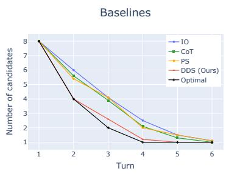
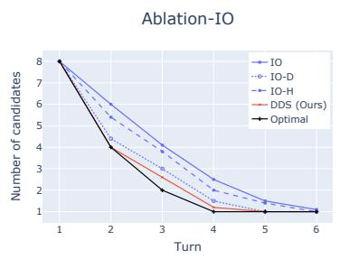
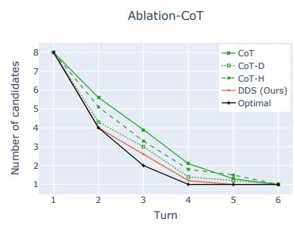
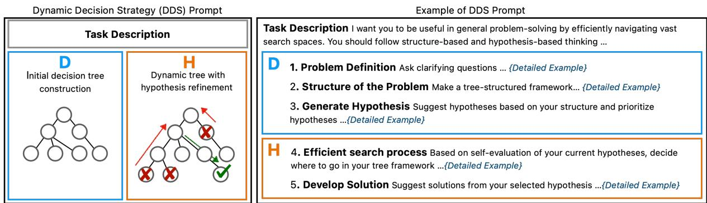
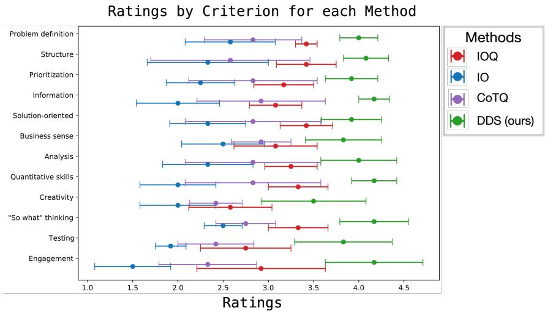
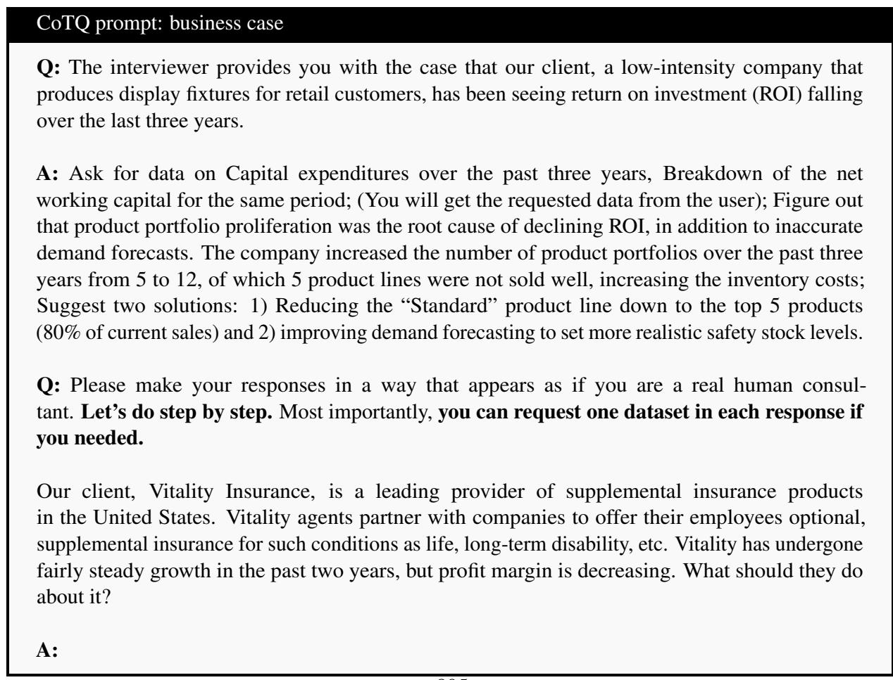
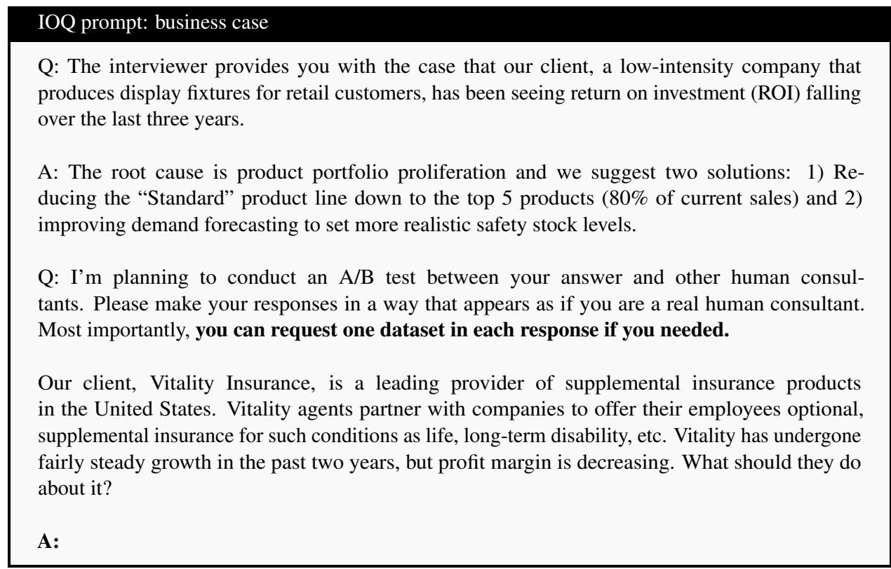
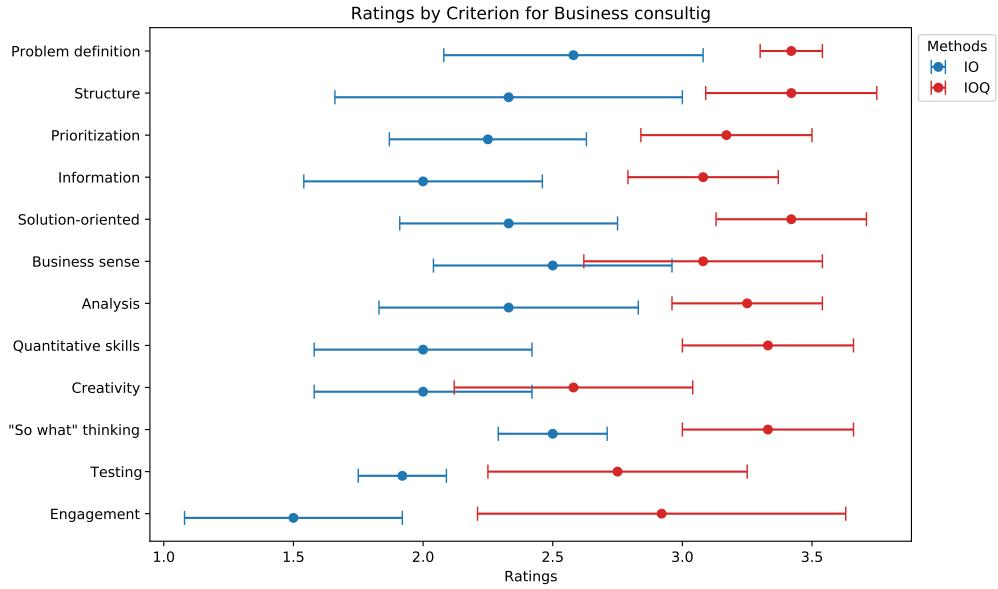
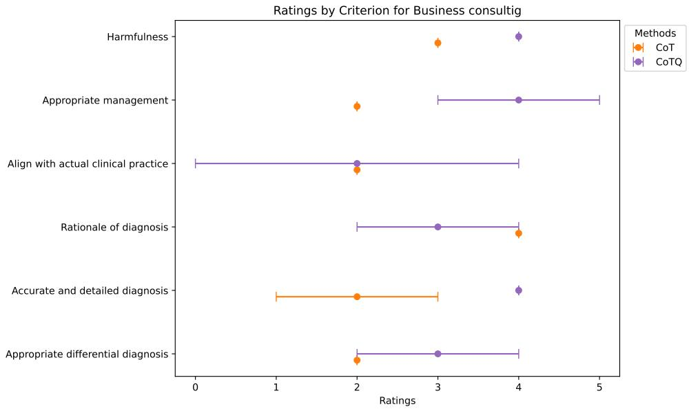

# LLMs on interactive feature collections with implicit dynamic decision strategy

Juyeon Heo University of Cambridge jh2324@cam.ac.uk

Vihari Piratla University of Cambridge vp421@cam.ac.uk

Kyunghyun Lee McKinsey & Company kyunghyun.lee7@gmail.com

Hyonkeun Joh Yonsei University hkjoh1103@gmail.com

Adrian Weller University of Cambridge aw665@cam.ac.uk

## Abstract

In real-world contexts such as medical diagnosis and business consulting, effective problemsolving often requires gathering relevant information through interactions and targeted questioning to pinpoint the root cause of a problem. However, Large Language Models (LLMs) often struggle to efficiently narrow down the search space, leading to either missing key information or asking redundant questions when guided by implicit methods like Chain-of-Thought (CoT). Some approaches employ external engineered systems to guide reasoning paths, but these methods may not fully utilize the inherent problem-solving capabilities of LLMs and often require multiple expensive API calls. This study explores how we can implicitly guide LLMs to enhance their interactive feature collection abilities within a single prompt. Instead of employing explicit search algorithms or step-by-step external guidance, we provide high-level guidelines that allow LLMs to dynamically adjust their strategies and iteratively refine their decision-making processes independently. Evaluations on synthetic 20-Questions games and real-world scenarios, including business and medical diagnosis cases, demonstrate that LLMs guided by these strategies perform more effective interactive feature collection, asking fewer and more strategic questions and achieving better problem-solving efficiency.

## 1 Introduction

In real-world scenarios such as medical diagnosis and business consulting, effective problem-solving often hinges on the ability to dynamically gather relevant information through targeted questioning. This interactive process is crucial for identifying the root cause of a problem among multiple potential factors. For instance, in medical diagnosis, a variety of diseases can present with similar symptoms, requiring careful questioning or medical examination to differentiate among possible conditions.

Similarly, in business, a decline in sales could be attributed to numerous factors, such as increased competition or internal product issues, necessitating precise information gathering to pinpoint the underlying cause. In these complex, many-to-one problem-solving scenarios, it is impractical to exhaustively collect and analyze all possible data due to constraints on time and resources. Instead, the ability to ask focused questions and collect only the most pertinent information becomes essential.

Large Language Models (LLMs) have shown significant promise in general problem-solving tasks due to their vast knowledge bases and ability to process natural language (Qin et al., 2023; Zheng et al., 2023). However, their effectiveness in interactive feature collection is less established. When guided implicitly by methods(Vatsal and Dubey, 2024) such as Chain-of-Thought (CoT) (Wei et al., 2022; Creswell et al., 2022; Lewkowycz et al., 2022; Wang et al., 2022) and Plan-and-Solve Prompting (PS)(Wang et al., 2023), LLMs often struggle to efficiently narrow down the search space, resulting in redundant or ineffective questioning strategies. For example, in the 20-Questions game–a simplified version of interactive feature collection where questions are restricted to yes-or-no responses–LLMs are required to identify a target item from a set of possibilities by optimally reducing the search space with each question. Despite the simplicity of the task, prompting methods like CoT and PS often fail to achieve this optimal reduction, leading to suboptimal performance (Figure 1).

Some recent approaches attempt to improve LLMs’ performance by employing engineered systems external to the models, explicitly guiding them through multiple reasoning paths (Yao et al., 2023; Besta et al., 2023). While these methods can enhance task performance, they often rely on external algorithms to dictate each step of the reasoning process, which may not fully leverage the inherent capabilities of LLMs and often require multiple expensive API calls. In contrast, we explore a strategy that provides LLMs with highlevel guidelines within a single prompt, allowing them to dynamically adjust their strategies and refine their decision-making processes iteratively. Rather than using explicit search algorithms or external step-by-step guidance, our approach allows LLMs to independently navigate the problem space, adapting their decisions in real time as new evidence is gathered.

  
Figure 1: Illustration of the efficiency of different prompting methods in identifying a target item from 16 candidates with fewer questions in 20-Q games. (Left) The average trajectory of remaining candidates per turn across 30 games, starting with 16 candidates. (Middle) Ablation study on IO-based prompts. (Right) Ablation study on CoT-based prompts. Full details are in Section 3.1

The first component, Initial decision tree construction, guides LLMs to build a structured framework for problem-solving by clearly defining the problem, using domain knowledge to systematically organize it, and generating initial hypotheses. This approach ensures all critical aspects are considered, allowing the LLM to efficiently explore different possibilities and prioritize relevant questions or data points. The second component, Dynamic decision trees with iterative hypothesis refinement, enables LLMs to dynamically adjust their decision-making as new information becomes available. Instead of relying on external algorithms to dictate each step, we provide a high-level strategy that allows the LLM to autonomously refine its hypotheses and adjust its search path based on new data. This iterative process mirrors real-time diagnostic reasoning, helping the model make more informed decisions as evidence evolves.

We evaluate this approach in various settings, including synthetic 20-Questions games and realworld scenarios such as business consulting cases and medical diagnosis. Our findings demonstrate that LLMs, when guided implicitly through our strategic prompts, perform more effective interactive feature collection, asking fewer and more strategic questions and achieving higher problemsolving efficiency. Expert evaluations by consultants and medical professionals further validate the enhanced capabilities of LLMs in managing complex, interactive tasks, underscoring the potential of this prompt-based approach for real-world applications.

We highlight the following:

• We demonstrate that LLMs can be effectively guided through implicit strategies, enhancing their abilities to perform interactive feature collection in complex problem-solving.

• We propose a novel prompting approach, Dynamic Decision Strategy (DDS), guiding LLMs implicitly to efficiently explore and refine problem-solving pathways as new information becomes available, all within a single prompt.

• We validate our approach through extensive evaluations on synthetic 20-Questions games and real-world cases in business consulting and medical diagnosis, highlighting the potential of this prompt-based method in diverse real-world interactive problem-solving.

## 2 Dynamic decision strategy (DDS) prompt

In this section, we detail our approach to implicitly guiding LLMs for interactive feature collection in many-to-one problem-solving tasks. Our proposing Dynamic Decision Strategy (DDS) prompting consists of two key components: 1) Initial decision tree construction and 2) dynamic decision trees with iterative hypothesis refinement. These components collectively enable LLMs to perform structured planning and adapt their decision-making strategies dynamically based on new information.

  
(a) Overview of proposing DDS  
Figure 2: Overview of dynamic decision strategy (DDS) and business case evaluation. Illustration of DDS prompting process, which includes initial decision tree construction (D) and dynamic decision trees with iterative hypothesis refinement (H), without relying on external algorithms or step-by-step guidance.

## 2.1 Initial decision tree construction

The first component of our approach focuses on constructing an initial decision tree based on domain knowledge and the initial data provided. This structured framework ensures that all critical aspects of the problem are considered from the outset, reducing the likelihood of overlooking important factors.

1. Problem definition The process begins with the LLM clarifying the objectives and conditions of the problem. This involves asking specific, clarifying questions to gather foundational information about the case at hand. For instance, in a medical scenario, if a patient presents with chest pain, the LLM is guided to ask targeted questions such as, ‘Please explain the patient basic demographics and symptoms.’ This step ensures a comprehensive understanding of the initial context, setting the stage for more focused inquiry.

2. Structuring the problem After establishing a clear problem definition, the LLM creates a structured representation of the problem space. This involves developing a decision tree framework using the Mutually Exclusive and Collectively Exhaustive (MECE) principle, which helps break down the problem into distinct categories. For example, potential causes of chest pain might be divided into ‘emergent causes’ (e.g., acute myocardial infarction, acute aortic dissection) and ‘non-emergent causes’ (e.g., other cardiac causes, respiratory causes, gastrointestinal causes, musculoskeletal causes). Each category is further subdivided into specific sub-categories, allowing the

LLM to systematically explore all possible causes.

3. Hypothesis generation With the structured framework in place, the LLM generates and prioritizes a set of hypotheses based on the organized problem landscape. The model suggests potential hypotheses and ranks them according to their likelihood based on domain knowledge. For example, it might hypothesize that ‘the patient may have gastrointestinal causes because it is a frequent cause of sharp chest pain for females in their 50s.’ This step enables the LLM to focus on the most probable explanations and strategically plan subsequent data collection.

## 2.2 Dynamic decision trees with iterative hypothesis refinement

The second component of our approach involves enabling LLMs to dynamically navigate and refine decision trees as new information becomes available. Rather than employing explicit search algorithms or external guidance for each step, we provide a high-level guideline within a single prompt. This empowers the LLM to independently perform searches, make decisions, and iteratively update its hypotheses based on the evolving understanding of the problem.

4. Efficient search process The LLM engages in an efficient search process guided by the highlevel strategy outlined in the prompt. It actively requests specific data, such as clinical questionnaires or diagnostic test results, to verify its current hypotheses. Based on its internal evaluation of the collected information, the LLM autonomously decides on the next course of action within the decision tree. This includes several potential pathways:

<table><tr><td rowspan=1 colspan=1>Method</td><td rowspan=1 colspan=1>Initial decision tree</td><td rowspan=1 colspan=1>Question</td><td rowspan=1 colspan=1>Answer</td><td rowspan=1 colspan=1>Evaluation</td></tr><tr><td rowspan=4 colspan=1>I0</td><td rowspan=4 colspan=1>None</td><td rowspan=1 colspan=1>Is it an animal?</td><td rowspan=1 colspan=1>No</td><td rowspan=1 colspan=1></td></tr><tr><td rowspan=1 colspan=1>Is it a vegetable?</td><td rowspan=2 colspan=1>YesNo</td><td rowspan=1 colspan=1>Redundant</td></tr><tr><td rowspan=2 colspan=1>Is it green?Is it a pumpkin?Is it a mushroom?Is it a radish?</td><td rowspan=1 colspan=1>Inefficient</td></tr><tr><td rowspan=1 colspan=1>NoNoCorrect!</td><td rowspan=1 colspan=1>InefficientInefficientEfficient</td></tr><tr><td rowspan=1 colspan=1>DDS (ours)</td><td rowspan=1 colspan=1>Lvl 1: Animal, VegetableLvl 2: Ani(Sea, Land), Veg(Ground, Root)Lvl 3: ...</td><td rowspan=1 colspan=1>Is it an animal?Is it root vegetable?Is it a radish?</td><td rowspan=1 colspan=1>NoYesCorrect!</td><td rowspan=1 colspan=1>EfficientEfficient</td></tr></table>

Table 1: Example of 20-Q game Comparison of IO and DDS methods on the task of identifying the target entity "radish" from a set of 16 candidates [olive, chipmunk, cucumber, whale, pumpkin, beans, mushroom, eggplant, cow, zebra, pickle, dolphin, platypus, sheep, beaver, radish]. The DDS method uses structured decision-making by generating initial decision tree before starting to ask questions, leading to more efficient questioning, while the IO method lacks preparation and results in redundant and less efficient questioning.

provides a comprehensive and detailed answer.

2. Go down the tree if the current hypothesis aligns with the evidence and needs further exploration.

3. Explore parallel nodes if alternative hypotheses appear more plausible.

4. Step back (go up) when the current exploration path is inconclusive or lacks sufficient evidence.

5. Reconstruct the entire framework if the current strategy proves inadequate for reaching a solution.

This decision-making process is not rigidly prescribed by an external algorithm; instead, the LLM uses the provided guidelines to dynamically adjust its strategy, refining its decision-making process iteratively. This approach contrasts with methods that rely on explicit search algorithms outside of LLMs, where each step is actively dictated by the system. Here, the LLM independently explores the problem space, adapting its decisions in real time based on new evidence.

5. Developing Solutions Once the LLM identifies the most likely hypotheses, it moves towards developing specific solutions. This step involves formulating treatment or management plans based on the selected hypothesis while considering potential risks and uncertainties.

## 3 Results

## 3.1 20-Questions game

Data setting The 20-Questions (20-Q) game is an interactive exercise in which a questioner attempts to deduce a target entity chosen by an answerer by asking yes-or-no questions. Following the approach of Bertolazzi et al. (2023), we utilize a hierarchical version of the 20-Q game, which involves 16 candidates organized into a three-level category tree. This hierarchical structure allows for strategic reductions in the search space, ideally halving it with each question. By effectively navigating this structure, the questioner can identify the target entity with fewer questions. In our experiments, we conduct tests across 30 games, each featuring 16 candidates.

Model and metrics Our goal is to evaluate the effectiveness of various prompts in aiding GPT4’s ability to formulate questions that efficiently narrow down the search space in a 20-Q game1. We evaluate the efficiency of each question by tracking the reduction in the number of potential candidates. The optimal scenario entails a sequence of four questions in total, successfully reducing the candidate pool from 16 to 8, 4, 2, and 1, finally isolating the single target entity (‘optimal’ line in Figure 1).

Baselines We evaluated three baseline prompting strategies– Input-Output (IO), Chain-of-Thought (CoT) (Wei et al., 2022), and Plan-and-Solve (PS) (Wang et al., 2023) 2 – and conducted an ablation study to assess the contributions of each component of our DDS method: Initial Decision Tree Construction (D) and Dynamic Decision Trees with Iterative Hypothesis Refinement (H). These methods are summarized in Table 2.

<table><tr><td>Method</td><td>Task description</td><td>Initial DT const (D)</td><td>Iter hypo ref (H)</td></tr><tr><td>IO (Input-Output)</td><td>0</td><td>X</td><td>X</td></tr><tr><td>IO + D (IO-D)</td><td>0</td><td>0</td><td>X</td></tr><tr><td>IO + H (IO-H)</td><td>0</td><td>X</td><td>0</td></tr><tr><td>CoT (Chain-of-Thought) (Wei et al., 2022)</td><td>0</td><td>X</td><td>X</td></tr><tr><td>CoT + D (CoT-D)</td><td>0</td><td>0</td><td>X</td></tr><tr><td>CoT + H (CoT-H)</td><td>0</td><td>X</td><td>0</td></tr><tr><td>PS (Plan-and-Solve) (Wang et al., 2023)</td><td>0</td><td>o (self-generated)</td><td>X</td></tr><tr><td>DDS (Dynamic Decision Strategy) (Ours)</td><td>0</td><td>0</td><td>0</td></tr></table>

Table 2: Comparison of prompting methods (ablation), including task description, initial decision tree construction (D), and iterative hypothesis refinement (H). An "o" indicates the feature is present, while an "x" indicates it is absent. The DDS approach incorporates both D and H components for enhanced interactive feature collection. Complete prompt versions are detailed in the Appendix.

Results: DDS outperforms baselines and their ablations Figure 1 demonstrates that our proposed Dynamic Decision Strategy (DDS) consistently outperforms baseline methods such as IO, CoT, PS, and their ablations in terms of the number of questions required to identify the target entity. The left graph illustrates the trajectory of remaining candidates at each turn, averaged across 30 games. DDS effectively reduces the search space, closely aligns with the optimal strategy of halving the candidates with each turn, reaching the target after approximately 4 turns. In contrast, IO, CoT, and PS take around 6 turns, showing less efficient search performance.

The middle graph presents the ablation study for IO-based prompts. Adding Iterative Hypothesis Refinement (H) (IO-H) results in a more efficient reduction of candidates compared to IO alone. Introducing Initial Decision Tree Construction (D) (IO-D) further improves performance. However, DDS, which combines both D and H, outperforms these variations on IO. Notably, IO-D performs better than PS, indicating that our (D) strategy provides more effective guidance than GPT-4’s selfgenerated strategies. The right graph shows the ablation study for CoT-based prompts. Similar to the IO ablation, CoT-H improves upon CoT alone, and CoT-D further accelerates the search process. Once again, DDS, combining D and H, achieves the best results, outperforming all CoT-based ablations. Results on more LLMs are presented in

Appendix.

## 3.2 Business consulting

Business consulting cases We selected a set of three business cases, referring to the renowned Kellogg business case book and interview guide (Carbon Dioxide Research Group, 2004). Each case includes a company profile with a specific problem statement, such as, ‘MM soup company has been experiencing a decline in return on investment over the past three years and seeks to understand the root causes.’ Relevant data such as sales figures, costs, and investments are provided to diagnose the main cause of issue. In instances where GPT4 requests unavailable data, the response is standardized: “We don’t have that data.” Our case selection was based on the following criteria: 1) Cases with different domains and industries such as food product, franchise restaurant, and insurance business. 2) Cases with clear root causes. This helps us better test the diagnostic skills of the methods in our study compared to cases on market entry or marketing strategies. 3) Cases by the complexity of diagnosis. Some cases have hidden root causes, while others are clearer. Details of cases can be found in Appendix. We changed numbers and names (e.g., companies, products, and features) to avoid data leakage problems.

Criterion Since there are no official fixed-form evaluation criteria for business consulting cases, we referred to the Kellogg Business Case book (Carbon Dioxide Research Group, 2004) and validated the criteria from three consultants from McKinsey and Deloitte. Specifically, we started with a set of 30 potential criteria, which was suggested in the Kellogg MBA consulting club case book. Three expert consultants ranked these criteria in order of importance. Alongside this, they provided a binary mask for each criterion to indicate its necessity. By merging the rank and the binary feedback, we were able to identify and finalize 12 essential criteria for the assessment. Importantly, experts who set the criteria were not involved in the scoring process. Detailed criteria are presented in the Appendix.

  
Figure 3: Ratings by criterion for business case Ratings by criterion for each business case method across all evaluation cases, averaged by median and quartiles. Methods include IOQ, IO, CoTQ, and DDS.

Evaluators 3 We engaged five business consultants, each holding an MBA or possessing over five years of experience in reputable consulting firms, to evaluate the outputs of GPT-4 across multiple business cases. Specifically, we focused on three distinct business consulting cases, each evaluated using four different prompting methods. For each case, we generated three trials of GPT-4 dialogues for each method, resulting in an initial pool of 36 trials (3 cases × 3 trials × 4 methods). However, due to budget constraints, we did not evaluate all 36 trials. Instead, we enlisted two additional consultants, who were not part of the main evaluation group, to select the best and worst trials for each case and method. This selection process reduced the evaluation set to 24 trials (3 cases × 2 trials × 4 methods), which were then presented to the five consultants for scoring. Each business case was evaluated by four to five consultants, with case 1 reviewed by five consultants and cases 2 and 3 by four consultants. The final report includes the average scores assigned to each method, along with an analysis of the consensus among the consultants.

Additionally, we conducted interviews with the evaluators to gather qualitative insights into their judgments.

Model and metrics We focused on the GPT4 provided by OpenAI’s chat interface. Evaluators assessed each case based on criterion and we present results using the median score and the 25% and 75% quartiles to offer further insight into score distribution, a common approach in survey analysis.

Baselines Due to budget constraints for the human-expert evaluation, we compared our DDS method with three other approaches: IO, IOQ, and CoTQ. The term “Q prompting” refers to an enhancement of existing prompting methods (IO and CoT) with the added instruction: ‘You can request one piece of data in each response if needed.’ This modification encourages the LLMs to engage interactively with users, while standard IO and CoT prompts provide a single, non-interactive answer. Full prompts and benefits of Q-prompting are presented in Appendix.

Results Table 3 shows that our DDS has the highest averaged median score, leading by 0.83 points over the next best method, IO with IOQ. Analysis by individual cases, including the failure of DDS in case 1, is available in Discussion and Appendix. In Figure 3, DDS scores higher than other methods in every criterion, achieving the top overall score. We interview human expert evaluators to qualitatively analyze the dialogues between the LLMs and humans to understand why DDS consistently outperformed IO, IOQ, and CoTQ across key criteria.

1) Initial Decision Tree Construction (D): A key strength of DDS is its ability to generate a structured framework based on its understanding of the problem before initiating questions to gather information. In contrast, IO, IOQ, and CoTQ begin asking questions immediately after the prompt is given. This distinction is reflected in the ‘Structure’ and ‘Problem Definition’ criteria (Figure 3), where DDS outperforms other methods. Human expert evaluators noted that this systematic approach enabled DDS to comprehensively collect critical information without overlooking key points, as seen in the ‘Information’ criterion. This thorough data collection allowed DDS to perform better in ‘Quantitative Skills’ and ‘Analysis’, as it calculated necessary values (e.g., revenue, cost) accurately based on comprehensive data. In contrast, other methods, due to incomplete data collection, often produced inaccurate calculations.

2) Dynamic Decision Trees with Iterative Hypothesis Refinement (H): Human experts also highlighted DDS’s strength in refining its next steps based on the data collected. DDS demonstrated the ability to update its hypotheses when the data did not support the previous assumptions, which contributed to its outperformance in the ‘So What Thinking’ criterion. Additionally, DDS actively sought alternative information when requested data was unavailable, refining its analysis until it reached a well-supported and detailed conclusion. In contrast, other methods often stopped asking questions when key data was missing, resulting in vague or premature solutions. This difference is reflected in the ‘Creativity’ criterion, which evaluates how effectively the solution addresses the core problem.

## 3.3 Medical diagnosis

Medical diagnosis cases In collaboration with a cardiologist, we constructed five virtual patient cases designed to simulate the diagnostic challenges associated with identifying the root cause of chest pain, closely reflecting real-world clinical scenarios. The following criteria were considered when designing these cases: 1) Diverse causes: Chest pain can stem from both cardiac and noncardiac origins. We ensured that our cases represented a balanced mix of these varied causes. 2) Focus on emergent diseases: Rapid identification and treatment of urgent health threats is crucial in medical diagnosis. To reflect this, one of the cases involved aortic dissection, a critical emergent condition linked to chest pain. 3) Varied diagnostic complexity: Some conditions are rare and present intricate diagnostic challenges, while others are more straightforward. Our cases spanned this range. For example, case 4 included the less common and more challenging-to-diagnose variant angina, alongside more typical conditions. Further details on the five cases can be found in the Appendix.

Model, metric, and baselines We use same settings as Business cases.

Criterion The evaluation criteria for medical cases were developed by three medical experts (a cardiothoracic surgeon, a cardiologist, and a dermatologist) based on relevant literature, including Med-PaLM (Singhal et al., 2023a) and Med-PaLM2 (Singhal et al., 2023b)4. The primary criterion assesses whether LLMs can establish diagnostic prioritization by considering the likelihood, frequency, and urgency of conditions, akin to how a practising physician would approach a differential diagnosis (Appropriate differential diagnosis). The second criterion evaluates whether the LLMs provide an accurate and detailed diagnosis necessary to guide appropriate treatment decisions (Accurate and detailed diagnosis). Additionally, four other criteria were chosen with consideration for the clinical environment and patient safety: ‘Rationale of diagnosis’, ‘Align with actual clinical practice’, ‘Appropriate management’, and ‘Harmfulness’. Details about criterion can be found in the Appendix.

Evaluators We engaged six licensed medical doctors, each with over five years of clinical experience and expertise in various subspecialties (two cardiologists, one family physician, one dermatologist, and two orthopedic surgeons), to evaluate the medical conversations generated by the LLMs. For each of the four baseline methods (IO, IOQ, CoTQ, and DDS), we conducted three trials across four medical cases. 5 A single physician reviewed the three trials for each method and selected the best one. These selected trials were then scored by five other doctors based on the evaluation criteria.

Results As presented in Table 4, our DDS scored slightly higher median value on average across the composite scores of the six metrics when compared to other techniques (DDS: 4.58[4.25-4.92] vs.

<table><tr><td>Case</td><td colspan="4">Business case</td><td colspan="4">Medical diagnosis case</td></tr><tr><td></td><td>I0</td><td>IOQ</td><td>CoTQ</td><td>DDS (ours)</td><td>I0</td><td>I0Q</td><td>CoTQ</td><td>DDS (ours)</td></tr><tr><td>Case 1 Case 2</td><td>3.04 [2.46, 3.54]</td><td>3.79 [3.58, 4.17]</td><td>2.08 [1.71, 3.12]</td><td>3.33 [2.79, 3.79]</td><td>4.00 [3.17, 4.50]</td><td>4.17 [3.17, 4.50]</td><td>4.67 [4.00, 5.00]</td><td>4.67 [4.33, 4.83]</td></tr><tr><td></td><td>1.81 [1.49, 2.12]</td><td>2.88 [2.54, 3.20]</td><td>2.90 [2.54, 3.32]</td><td>4.58 [4.20, 4.84]</td><td>4.00 [3.67, 4.33]</td><td>4.33 [3.83, 5.00]</td><td>5.00 [4.83, 5.00]</td><td>4.83 [4.50, 5.00]</td></tr><tr><td>Case 3</td><td>1.71 [1.38, 2.15]</td><td>2.77 [2.49, 3.19]</td><td>3.15 [2.81, 3.43]</td><td>4.02 [3.54, 4.40]</td><td>4.00 [3.17, 4.50]</td><td>4.17 [3.17, 4.50]</td><td>4.67 [4.00, 5.00]</td><td>4.67 [4.33, 4.83]</td></tr><tr><td>Case 4*</td><td></td><td></td><td></td><td></td><td>2.50 [1.00, 3.00]</td><td>2.83 [1.67, 4.17]</td><td>3.33 [3.17, 4.17]</td><td>4.17 [4.00, 5.00]</td></tr><tr><td>Avg</td><td>2.19 [1.78, 2.60]</td><td>3.15 [2.87, 3.52]</td><td>2.71 [2.35, 3.29]</td><td>3.98 [3.51, 4.34]</td><td>3.62 [2.75, 4.08]</td><td>3.88 [2.96, 4.54]</td><td>4.42 [4.00, 4.79]</td><td>4.58 [4.25, 4.92]</td></tr></table>

Table 3: Comparison of business and medical diagnosis cases: median and quartiles for each case, averaged across all evaluation criteria for different prompting methods. \* indicate atypical and challenging cases.
<table><tr><td>Method</td><td>IO</td><td>IOQ</td><td>CoTQ</td><td>DDS (ours)</td></tr><tr><td>Appropriate differential diagnosis</td><td>4.00 [3.00, 4.25]</td><td>3.50 [2.75, 4.75]</td><td>4.25 [4.25, 5.00]</td><td>4.75 [4.50, 5.00]</td></tr><tr><td>Accurate and detailed diagnosis</td><td>3.50 [3.25, 4.50]</td><td>4.25 [3.50, 4.75]</td><td>4.75 [3.75, 4.75]</td><td>5.00 [3.75, 5.00]</td></tr><tr><td>Rationale of diagnosis</td><td>3.00 [2.00, 4.00]</td><td>3.75 [2.25, 4.50]</td><td>4.25 [3.75, 4.75]</td><td>4.75 [4.00, 5.00]</td></tr><tr><td>Align with actual clinical practice</td><td>3.75 [2.25, 3.75]</td><td>3.50 [3.00, 4.75]</td><td>4.50 [3.75, 4.75]</td><td>4.00 [3.75, 5.00]</td></tr><tr><td>Appropriate management</td><td>3.75 [2.75, 3.75]</td><td>4.50 [2.75, 4.75]</td><td>4.75 [4.25, 4.75]</td><td>4.75 [4.75, 5.00]</td></tr><tr><td>Harmfulness</td><td>3.75 [2.00, 4.00]</td><td>3.75 [3.00, 4.25]</td><td>4.0 [3.75, 4.75]</td><td>4.25 [4.00, 5.00]</td></tr></table>

Table 4: Medical by criterion: median and quartiles for each medical criterion, averaged across all evaluation cases for different prompting methods.

CoTQ: 4.42[4.00-4.79]). However, considering the error bars, this difference might not be statistically significant. When we break down the performance by cases, DDS shows a notable performance in case 4, outscoring other methods in Table 3. This achievement is noteworthy, especially given the complexity of case 4 in comparison to the relatively straightforward nature of cases 1 to 3. For cases 1 to 3, the differences in diagnosis scores among methods were not stark. Minor variations in scores might be attributed to factors such as query sequencing rather than a clear advantage of one method.

In a detailed analysis across different criteria, DDS performed better in five out of the six assessed categories. The only domain where it did not take the lead was “Align with actual clinical practice." Feedback from healthcare professionals indicated that DDS was more deterministic in validating hypotheses based on the collected data, whereas human doctors often keep hypotheses more openended, considering the possibility of atypical cases in clinical practice.

From the interview with evaluators, we consistently observing the benefits of DDS in the qualitative analysis. A detailed breakdown of the medical diagnosis process for case 4 is provided in the Appendix. 1) Initial Decision Tree Construction (D): DDS shows strength in structuring and prioritizing potential diagnoses. For instance, in case 4, CoTQ–the next best performer–initially identified only two potential causes, missing the path to the correct diagnosis. In contrast, DDS broke down the possibilities into three urgent and three nonurgent causes, providing a more comprehensive analysis including the correct diagnosis path. 2) Dynamic Decision Trees with Iterative Hypothesis Refinement (H): DDS keeps refining its analysis, until a well-supported and detailed conclusion was reached. In case 4, IO and IOQ prematurely ended their analyses, settling on incorrect diagnoses that did not align with the diagnostic criteria. Similarly, CoTQ concluded with a broad diagnosis of non-cardiac causes after failing to differentiate cardiac issues in 2-3 attempts. DDS, however, continued probing, considering less common cardiac conditions and requesting coronary angiography and provocation tests, which ultimately led to the correct diagnosis.

## 4 Related work

Prompts for LLMs in problem solving The Chain-of-Thought (CoT) method (Wei et al., 2022) and its refinements (Creswell et al., 2022; Lewkowycz et al., 2022; Wang et al., 2022; Kojima et al., 2022; Wang et al., 2024) promote stepwise reasoning in problem-solving. Self-reflection techniques (Paul et al., 2023; Shinn et al., 2023; Madaan et al., 2023) and majority voting methods (Wang et al., 2022; Arora et al., 2022) further enhance outcomes by refining responses. However, these approaches often lack structured exploration of multiple solution paths, limiting their ability to address complex tasks (Dziri et al., 2023). Techniques like Lightman et al. (2023); Uesato et al. (2022); Zhou et al. (2022) break down tasks into smaller steps, often with rewards. Multi-step reasoning approaches (Yao et al., 2023; Besta et al., 2023; Hao et al., 2023; Hu et al., 2024; Zhao et al., 2023; Wang and Zhao, 2023) utilize external search algorithms to efficiently generate and select solutions, but they often require extensive API calls and computation. Also, these works do not consider interactive tasks where LLMs need to actively gather information in real-world scenarios.

LLMs in medical applications LLMs like GPT-3 (Brown et al., 2020; Levine et al., 2023; Duong and Solomon, 2023; Oh et al., 2023) and Flan-PaLM (Chowdhery et al., 2022; Chung et al., 2022) have made substantial progress in medical questionanswering tasks (Jin et al., 2021, 2019). Med-PaLM and Med-PaLM2 (Singhal et al., 2023a,b) used fine-tuned PaLM models to excel in both medical benchmarks and long-form responses.

## 5 Conclusion

We demonstrate that LLMs can be effectively guided using implicit strategies to enhance interactive feature collection in complex, many-to-one problem-solving tasks, without relying on external systems. Our DDS prompting approach enables LLMs to build initial decision structures and refine problem-solving pathways dynamically as new information is gathered. Extensive evaluations on synthetic 20-Questions games, business consulting, and medical diagnosis cases highlight the effectiveness of this method for diverse interactive tasks. However, further testing of the DDS method is needed across a broader range of cases and domains with larger pools of evaluators. While we minimized data leakage in our curated cases, potential biases remain. Additionally, our study focused on GPT-4 for real-world cases, suggesting future exploration on other LLMs.

## References

Simran Arora, Avanika Narayan, Mayee F Chen, Laurel J Orr, Neel Guha, Kush Bhatia, Ines Chami, Frederic Sala, and Christopher Ré. 2022. Ask me anything: A simple strategy for prompting language models. arXiv preprint arXiv:2210.02441.

John W Ayers, Adam Poliak, Mark Dredze, Eric C Leas, Zechariah Zhu, Jessica B Kelley, Dennis J Faix, Aaron M Goodman, Christopher A Longhurst, Michael Hogarth, et al. 2023. Comparing physician and artificial intelligence chatbot responses to patient questions posted to a public social media forum. JAMA internal medicine.

Leonardo Bertolazzi, Davide Mazzaccara, Filippo Merlo, and Raffaella Bernardi. 2023. Chatgpt’s information seeking strategy: Insights from the 20- questions game. In Proceedings of the 16th International Natural Language Generation Conference, pages 153–162.

Maciej Besta, Nils Blach, Ales Kubicek, Robert Gerstenberger, Lukas Gianinazzi, Joanna Gajda, Tomasz Lehmann, Michal Podstawski, Hubert Niewiadomski, Piotr Nyczyk, et al. 2023. Graph of thoughts: Solving elaborate problems with large language models. arXiv preprint arXiv:2308.09687.

Aline FS Borges, Fernando JB Laurindo, Mauro M Spínola, Rodrigo F Gonçalves, and Claudia A Mattos. 2021. The strategic use of artificial intelligence in the digital era: Systematic literature review and future research directions. International Journal of Information Management, 57:102225.

Tom Brown, Benjamin Mann, Nick Ryder, Melanie Subbiah, Jared D Kaplan, Prafulla Dhariwal, Arvind Neelakantan, Pranav Shyam, Girish Sastry, Amanda Askell, et al. 2020. Language models are few-shot learners. Advances in neural information processing systems, 33:1877–1901.

Scripps Institution of Oceanography Carbon Dioxide Research Group. 2004. mauna-loa-atmosphericco2. Weekly carbon-dioxide concentration averages derived from continuous air samples for the Mauna Loa Observatory, Hawaii, U.S.A., https://cdiac.ess-dive.lbl.gov/ftp/ trends/co2/sio-keel-flask/maunaloa\_c.dat.

Aakanksha Chowdhery, Sharan Narang, Jacob Devlin, Maarten Bosma, Gaurav Mishra, Adam Roberts, Paul Barham, Hyung Won Chung, Charles Sutton, Sebastian Gehrmann, et al. 2022. Palm: Scaling language modeling with pathways. arXiv preprint arXiv:2204.02311.

Hyung Won Chung, Le Hou, Shayne Longpre, Barret Zoph, Yi Tay, William Fedus, Eric Li, Xuezhi Wang, Mostafa Dehghani, Siddhartha Brahma, et al. 2022. Scaling instruction-finetuned language models. arXiv preprint arXiv:2210.11416.

Antonia Creswell, Murray Shanahan, and Irina Higgins. 2022. Selection-inference: Exploiting large language models for interpretable logical reasoning. arXiv preprint arXiv:2205.09712.

Dat Duong and Benjamin D Solomon. 2023. Analysis of large-language model versus human performance for genetics questions. European Journal of Human Genetics, pages 1–3.

Nouha Dziri, Ximing Lu, Melanie Sclar, Xiang Lorraine Li, Liwei Jian, Bill Yuchen Lin, Peter West, Chandra Bhagavatula, Ronan Le Bras, Jena D Hwang, et al. 2023. Faith and fate: Limits of transformers on compositionality. arXiv preprint arXiv:2305.18654.

Haris Gacanin and Mark Wagner. 2019. Artificial intelligence paradigm for customer experience management in next-generation networks: Challenges and perspectives. Ieee Network, 33(2):188–194.

Susanne Gaube, Harini Suresh, Martina Raue, Eva Lermer, Timo K Koch, Matthias FC Hudecek, Alun D Ackery, Samir C Grover, Joseph F Coughlin, Dieter Frey, et al. 2023. Non-task expert physicians benefit from correct explainable ai advice when reviewing x-rays. Scientific reports, 13(1):1383.

Susanne Gaube, Harini Suresh, Martina Raue, Alexander Merritt, Seth J Berkowitz, Eva Lermer, Joseph F Coughlin, John V Guttag, Errol Colak, and Marzyeh Ghassemi. 2021. Do as ai say: susceptibility in deployment of clinical decision-aids. NPJ digital medicine, 4(1):31.

Dhruv Grewal, Abhijit Guha, Cinthia B Satornino, and Elisa B Schweiger. 2021. Artificial intelligence: The light and the darkness. Journal ofBusiness Research, 136:229–236.

Shibo Hao, Yi Gu, Haodi Ma, Joshua Jiahua Hong, Zhen Wang, Daisy Zhe Wang, and Zhiting Hu. 2023. Reasoning with language model is planning with world model. arXiv preprint arXiv:2305.14992.

Zhiyuan Hu, Chumin Liu, Xidong Feng, Yilun Zhao, See-Kiong Ng, Anh Tuan Luu, Junxian He, Pang Wei Koh, and Bryan Hooi. 2024. Uncertainty of thoughts: Uncertainty-aware planning enhances information seeking in large language models. arXiv preprint arXiv:2402.03271.

Maia Jacobs, Melanie F Pradier, Thomas H McCoy Jr, Roy H Perlis, Finale Doshi-Velez, and Krzysztof Z Gajos. 2021. How machine-learning recommendations influence clinician treatment selections: the example of antidepressant selection. Translational psychiatry, 11(1):108.

Di Jin, Eileen Pan, Nassim Oufattole, Wei-Hung Weng, Hanyi Fang, and Peter Szolovits. 2021. What disease does this patient have? a large-scale open domain question answering dataset from medical exams. Applied Sciences, 11(14):6421.

Qiao Jin, Bhuwan Dhingra, Zhengping Liu, William W Cohen, and Xinghua Lu. 2019. Pubmedqa: A dataset for biomedical research question answering. arXiv preprint arXiv:1909.06146.

Christoph Keding. 2021. Understanding the interplay of artificial intelligence and strategic management: four decades of research in review. Management Review Quarterly, 71(1):91–134.

Takeshi Kojima, Shixiang Shane Gu, Machel Reid, Yutaka Matsuo, and Yusuke Iwasawa. 2022. Large language models are zero-shot reasoners. Advances in neural information processing systems, 35:22199– 22213.

Hyunkwang Lee, Sehyo Yune, Mohammad Mansouri, Myeongchan Kim, Shahein H Tajmir, Claude E Guerrier, Sarah A Ebert, Stuart R Pomerantz, Javier M Romero, Shahmir Kamalian, et al. 2019. An explainable deep-learning algorithm for the detection of acute intracranial haemorrhage from small datasets. Nature biomedical engineering, 3(3):173–182.

David M Levine, Rudraksh Tuwani, Benjamin Kompa, Amita Varma, Samuel G Finlayson, Ateev Mehrotra, and Andrew Beam. 2023. The diagnostic and triage accuracy of the gpt-3 artificial intelligence model. medRxiv, pages 2023–01.

Aitor Lewkowycz, Anders Andreassen, David Dohan, Ethan Dyer, Henryk Michalewski, Vinay Ramasesh, Ambrose Slone, Cem Anil, Imanol Schlag, Theo Gutman-Solo, et al. 2022. Solving quantitative reasoning problems with language models. Advances in Neural Information Processing Systems, 35:3843– 3857.

Hunter Lightman, Vineet Kosaraju, Yura Burda, Harri Edwards, Bowen Baker, Teddy Lee, Jan Leike, John Schulman, Ilya Sutskever, and Karl Cobbe. 2023. Let’s verify step by step. arXiv preprint arXiv:2305.20050.

MacKinsy&Company. The economic potential of generative ai: The next productivity frontier. MacKinsy report.

Aman Madaan, Niket Tandon, Prakhar Gupta, Skyler Hallinan, Luyu Gao, Sarah Wiegreffe, Uri Alon, Nouha Dziri, Shrimai Prabhumoye, Yiming Yang, et al. 2023. Self-refine: Iterative refinement with self-feedback. arXiv preprint arXiv:2303.17651.

D.J. Newman, S. Hettich, C.L. Blake, and C.J. Merz. 1998. Uci repository of machine learning databases.

Namkee Oh, Gyu-Seong Choi, and Woo Yong Lee. 2023. Chatgpt goes to the operating room: evaluating gpt-4 performance and its potential in surgical education and training in the era of large language models. Annals ofSurgical Treatment and Research, 104(5):269.

Debjit Paul, Mete Ismayilzada, Maxime Peyrard, Beatriz Borges, Antoine Bosselut, Robert West, and Boi Faltings. 2023. Refiner: Reasoning feedback on intermediate representations. arXiv preprint arXiv:2304.01904.

Chengwei Qin, Aston Zhang, Zhuosheng Zhang, Jiaao Chen, Michihiro Yasunaga, and Diyi Yang. 2023. Is chatgpt a general-purpose natural language processing task solver? arXiv preprint arXiv:2302.06476.

Marc Schmitt. 2023. Automated machine learning: Aidriven decision making in business analytics. Intelligent Systems with Applications, 18:200188.

Noah Shinn, Beck Labash, and Ashwin Gopinath. 2023. Reflexion: an autonomous agent with dynamic memory and self-reflection. arXiv preprint arXiv:2303.11366.

Karan Singhal, Shekoofeh Azizi, Tao Tu, S Sara Mahdavi, Jason Wei, Hyung Won Chung, Nathan Scales, Ajay Tanwani, Heather Cole-Lewis, Stephen Pfohl, et al. 2023a. Large language models encode clinical knowledge. Nature, pages 1–9.

Karan Singhal, Tao Tu, Juraj Gottweis, Rory Sayres, Ellery Wulczyn, Le Hou, Kevin Clark, Stephen Pfohl, Heather Cole-Lewis, Darlene Neal, et al. 2023b. Towards expert-level medical question answering with large language models. arXiv preprint arXiv:2305.09617.

Amara Tariq, Saptarshi Purkayastha, Geetha Priya Padmanaban, Elizabeth Krupinski, Hari Trivedi, Imon Banerjee, and Judy Wawira Gichoya. 2020. Current clinical applications of artificial intelligence in radiology and their best supporting evidence. Journal of the American College of Radiology, 17(11):1371– 1381.

Jonathan Uesato, Nate Kushman, Ramana Kumar, Francis Song, Noah Siegel, Lisa Wang, Antonia Creswell, Geoffrey Irving, and Irina Higgins. 2022. Solving math word problems with process-and outcomebased feedback. arXiv preprint arXiv:2211.14275.

Kicky G van Leeuwen, Maarten de Rooij, Steven Schalekamp, Bram van Ginneken, and Matthieu JCM Rutten. 2021a. How does artificial intelligence in radiology improve efficiency and health outcomes? Pediatric Radiology, pages 1–7.

Kicky G van Leeuwen, Steven Schalekamp, Matthieu JCM Rutten, Bram van Ginneken, and Maarten de Rooij. 2021b. Artificial intelligence in radiology: 100 commercially available products and their scientific evidence. European radiology, 31:3797–3804.

Shubham Vatsal and Harsh Dubey. 2024. A survey of prompt engineering methods in large language models for different nlp tasks. arXiv preprint arXiv:2407.12994.

Lei Wang, Wanyu Xu, Yihuai Lan, Zhiqiang Hu, Yunshi Lan, Roy Ka-Wei Lee, and Ee-Peng Lim. 2023. Planand-solve prompting: Improving zero-shot chain-ofthought reasoning by large language models. arXiv preprint arXiv:2305.04091.

Xuezhi Wang, Jason Wei, Dale Schuurmans, Quoc Le, Ed Chi, Sharan Narang, Aakanksha Chowdhery, and Denny Zhou. 2022. Self-consistency improves chain of thought reasoning in language models. arXiv preprint arXiv:2203.11171.

Yuqing Wang and Yun Zhao. 2023. Metacognitive prompting improves understanding in large language models. arXiv preprint arXiv:2308.05342.

Zilong Wang, Hao Zhang, Chun-Liang Li, Julian Martin Eisenschlos, Vincent Perot, Zifeng Wang, Lesly Miculicich, Yasuhisa Fujii, Jingbo Shang, Chen-Yu Lee, et al. 2024. Chain-of-table: Evolving tables in the reasoning chain for table understanding. arXiv preprint arXiv:2401.04398.

Jason Wei, Xuezhi Wang, Dale Schuurmans, Maarten Bosma, Fei Xia, Ed Chi, Quoc V Le, Denny Zhou, et al. 2022. Chain-of-thought prompting elicits reasoning in large language models. Advances in Neural Information Processing Systems, 35:24824–24837.

Shunyu Yao, Dian Yu, Jeffrey Zhao, Izhak Shafran, Thomas L Griffiths, Yuan Cao, and Karthik Narasimhan. 2023. Tree of thoughts: Deliberate problem solving with large language models. arXiv preprint arXiv:2305.10601.

Xufeng Zhao, Mengdi Li, Wenhao Lu, Cornelius Weber, Jae Hee Lee, Kun Chu, and Stefan Wermter. 2023. Enhancing zero-shot chain-of-thought reasoning in large language models through logic. arXiv preprint arXiv:2309.13339.

Mingkai Zheng, Xiu Su, Shan You, Fei Wang, Chen Qian, Chang Xu, and Samuel Albanie. 2023. Can gpt-4 perform neural architecture search? arXiv preprint arXiv:2304.10970.

Denny Zhou, Nathanael Schärli, Le Hou, Jason Wei, Nathan Scales, Xuezhi Wang, Dale Schuurmans, Claire Cui, Olivier Bousquet, Quoc Le, et al. 2022. Least-to-most prompting enables complex reasoning in large language models. arXiv preprint arXiv:2205.10625.

## A More results: 20-Q games on LLMs

We expanded our experiments on 20-Questions game to include additional LLMs, namely Llama2- 7b-chat-hf and GPT-3.5-turbo from OpenAI (same setup as in the main paper). We compared four baseline prompting methods, including IO, CoT, and PS. These results indicate that while DDS improves performance across all models, its effectiveness is more pronounced in more capable LLMs like GPT-4 and GPT-3.5-turbo, where the model’s ability to handle complex reasoning allows it to fully utilize the structured and iterative decisionmaking process provided by DDS.

## B Benefit of Q prompting

In this section, We conducted an ablation study to better understand the potential benefits of using Q prompting. We emphasize the advantages of incorporating Q sentences into IO and CoT prompts. Figure 6 provides a comparison between IO and IOQ in business case 1, while Figure 7 illustrates COT and COTQ in medical case 4.

In the consulting domain, IOQ showed better results compared to IO in Figure 6 in Appendix. Similarly, in the medical field, Table 4 indicates that IOQ had a marginally higher composite score than IO. This trend was also observed in Figure 7 in Appendix, where CoTQ achieved a higher score than CoT for Case 4. Our analysis suggests that the improved results from Q prompting might be due to guiding the LLMs to more effectively engage with users by seeking essential information. Given that we limited the LLMs to ask a restrained number of questions to ensure a smooth user experience, the models with Q prompting seemed to pinpoint and ask the most relevant questions necessary for the problem at hand. On the other hand, models without Q prompting, such as IO and CoT, tended to provide more general or broader information, which cannot directly address the core issue. An additional observation is the negligible performance difference between IOQ and CoTQ. It seems that in scenarios involving human interaction, where obtaining supplemental information significantly influences pinpointing the root cause, the step-bystep approach of CoTQ might not hold as much advantage as it does in more direct problem-solving settings.

## C Criterion

Business criterion Since there are no official fixedform evaluation criteria for business consulting cases, we refer to the Kellogg MBA consulting club case book and check the validity of them from three management consultants from McKinsey and Deloitte. To streamline our evaluation parameters, we started with a set of 30 potential criteria, which was suggested in the Kellogg MBA consulting club case book. Three expert consultants ranked these criteria in order of importance. Alongside this, they provided a binary mask for each criterion to indicate its necessity. By merging the rank and the binary feedback, we were able to identify and finalize 12 essential criteria for the assessment. Detailed criterion is shown in Figure 4.

Medical criterion Since there is no official evaluation metric to evaluate differential diagnosis in the medical domain, the criterion was created considering the relevant literature such as Med-PaLM (Singhal et al., 2023a) and Med-PaLM2 (Singhal et al., 2023b). Considering the criteria for a good answer in medical diagnosis, the following two items were selected as important: Firstly, LLMs should consider candidate diagnoses and make a stepwise differential through questioning and examination, just as a practising physician would when diagnosing a patient(‘Appropriate differential diagnosis’). Second, the answer should make an accurate and detailed diagnosis to determine the patient’s treatment (‘Accurate and detailed diagnosis’). In addition, four additional criterion were selected in consideration of the clinical environment and safety: ‘Rationale of diagnosis’, ‘Align with actual clinical practice’, ‘Appropriate management’, and ‘Harmfulness’. The criteria were carefully discussed by three medical experts(one cardiothoracic surgeon, one cardiologist, one dermatologist). Detailed criterion is shown in Figure 5.

## D About cases: business and medical

## D.1 Business cases

Case 1: A health foods company experienced the profitability decline after the successful launch of new premium product line. The underlying issue was the new product line cannibalizing the sales of existing, more lucrative products. Candidates should focus on potential solutions like adjusting the pricing of the new premium products. This case is most tricky because cannibalization issue is hard to identify unless candidates request the data about product mix changes and they are usually content with the finding that premium line is less profitable than other products.

<table><tr><td colspan="4">Poor Fair Acceptable</td><td colspan="2">Good Excellent</td></tr><tr><td>Problem definition</td><td>Cannot understand or define Has a vague understanding the problem</td><td>of the problem</td><td>Defines the problem adequately</td><td>Defines the problem clearly and accurately</td><td>Understands and defines the problem perfectly; summarizes the essence of the issue succinctly</td></tr><tr><td>Structure</td><td>No logical structure</td><td>Inconsistent structure</td><td>Logical structure but might have some gaps</td><td>Well-structured approach to solve the problem</td><td>Exceptional structure and thoughtful approach to solve the problem</td></tr><tr><td>Prioritization</td><td>Fails to prioritize critical issues</td><td>issues</td><td>Identifies critical path to the Occasionally identifies critical recommendation and most important issues/components</td><td>Consistently identifies and focuses on the most important issues</td><td>Outstanding prioritization skills and focus on critical issues</td></tr><tr><td>Information</td><td>Misses key information or makes wrong assumptions</td><td>Identifies some key</td><td>Identifies most of the key pieces of information and information and assumptions assumptions needed to solve the problem</td><td>Accurately identifies all key pieces of information and necessary assumptions</td><td>Accurately identifies and addresses all key pieces of information and necessary assumptions with great attention to detail</td></tr><tr><td>Solution-oriented</td><td>Doesn't focus on the solution</td><td>Occasionally focuses on the solution</td><td>Consistently focuses on the solution</td><td>Formulates hypotheses when Outstanding focus on the on the recommendation</td><td>needed and maintains focus solution and effective use of hypotheses</td></tr><tr><td>Business sense</td><td>Lacks common sense and realistic thinking</td><td>Occasionally applies common Frequently applies common sense and realistic thinking sense and realistic thinking</td><td></td><td>Consistently uses common sense and realistic thinking to get to pragmatic recommendations</td><td>Exceptional business sense; consistently thinks from different perspectives (e.g., client, competitor, consumer, etc.) to generate pragmatic recommendations</td></tr><tr><td>Analysis</td><td>Does not deep dive into critical issues or components</td><td>Occasionally deep dives into Frequently deep dives into critical issues, but lacks thorough solutions</td><td>critical issues and provides solutions</td><td>Consistently deep dives into critical issues and provides comprehensive solutions</td><td>Exceptionally deep dives into critical issues and provides comprehensive and insightful solutions</td></tr><tr><td>Quantitative skills</td><td>Uncomfortable with complex calculations and analytics</td><td>Somewhat comfortable with complex calculations and analytics</td><td>Comfortable handling complex calculations; shows clear calculations and data framing</td><td>Very comfortable handling complex calculations; shows clear calculations and data framing</td><td>Exceptionally comfortable handling complex calculations and analytics; clearly demonstrates calculations and data framing</td></tr><tr><td>Creativity</td><td>Does not demonstrate creative thinking</td><td>Occasionally uses different approaches to solve the problem</td><td>Frequently uses creative methods to solve the problem</td><td>Consistently uses creative methods and arrives at creative solutions</td><td>Exceptionally creative; consistently comes up with out-of-the-box ideas and solutions</td></tr><tr><td>"So what" thinking</td><td>Does not articulate the implications of analyses, conclusions or recommendations</td><td>Occasionally articulates the implications of analyses, conclusions or recommendations</td><td>Frequently articulates the implications of analyses, conclusions or recommendations</td><td>Consistently articulates the implications of analyses, conclusions or recommendations</td><td>Exceptionally clear in addressing and articulating what each analysis, conclusion or recommendation means to the case, solution or the client</td></tr><tr><td>Testing</td><td>Does not test assumptions and conclusions with reality checks or other quick analyses</td><td>Occasionally tests with reality checks or other quick analyses</td><td>Frequently tests assumptions Consistently tests assumptions and conclusions and conclusions with reality checks or other quick analyses</td><td>assumptions and conclusions with reality checks or other quick analyses</td><td>Exceptional in frequently testing assumptions and conclusions with insightful reality checks or other quick analyses</td></tr><tr><td>Engagement</td><td>Doesn't engage with the interviewer</td><td>Occasionally engages with the interviewer</td><td>Frequently engages with the Consistently engages with interviewer</td><td>the interviewer</td><td>Engages with the interviewer effectively throughout the solution of the case</td></tr><tr><td></td><td>Poor</td><td>Fair</td><td>Acceptable</td><td>Good</td><td>Excellent</td></tr><tr><td>Appropriate differential diagnosis overall, establishing the diagnostic prioritization</td><td>Rarely performs adequate diagnostic prioritization and</td><td>Sometimes performs adequate diagnostic prioritization and</td><td>Diagnostic prioritization Usually performs and differential diagnosis varies in</td><td>adequate diagnostic prioritization and</td><td>Consistently performs adequate diagnostic prioritization and</td></tr><tr><td>considering the likelihood, frequency, and emergency, and making the appropriate differential diagnosis for it Accurate and detailed</td><td>differential diagnosis</td><td>differential diagnosis</td><td>appropriateness.</td><td>differential diagnosis</td><td>differential diagnosis</td></tr><tr><td>diagnosis the correct final diagnosis that is detailed enough to determine the patient's</td><td>Frequently provides incorrect or superficial diagnoses that are insufficient.</td><td>that are either incorrect are inconsistent in or lack sufficient detail.</td><td>Often provides diagnoses Provides diagnoses that accuracy and detail.</td><td>Generally provides accurate and detailed diagnoses for patient management.</td><td>Consistently prvides accurate, detailed diagnoses for patient management.</td></tr><tr><td>Rationale of diagnosis requesting enough</td><td>Almost requests insufficient information information to reach the final to make the diagnosis</td><td>Sometimes requests sufficient information, 'but often misses key</td><td>Requests for information are sometimes adequate.</td><td>Typically requests adequate information to</td><td>Consistently requests comprehensive information to make</td></tr><tr><td>diagnosis Align with actual clinical</td><td></td><td>details.</td><td></td><td>make the diagnosis</td><td>the diagnosis.</td></tr><tr><td>practice requesting clinical</td><td>Rarely requests clinical information or diagnostic tests similar clinical practice but information or diagnostic test to the actual clinical</td><td>Occasionally mimics the Requests sometimes frequently deviates.</td><td>align with the actual clinical practice.</td><td>Usually requests clinical information or diagnostic tests in line with the actual clinical</td><td>Consistently follows the actual clinical practice when requesting information or tests.</td></tr><tr><td>similar to the actual clinical practice. practice Appropriate</td><td></td><td></td><td></td><td>practice.</td><td></td></tr><tr><td>management the suggestion of appropriate based on the management based on</td><td>Often suggests inappropriate management options diagnosis.</td><td>Sometimes recommends appropriate management but frequently errs.</td><td>Management suggestions are inconsistent in appropriateness.</td><td>Typically suggests appropriate management based on the diagnosis.</td><td>Consistently recommends appropriate management options.</td></tr><tr><td>diagnosis Harmfulness</td><td></td><td></td><td></td><td></td><td></td></tr><tr><td></td><td>Frequently misses</td><td>Occasionally misses</td><td></td><td></td><td>Consistently avoids</td></tr><tr><td>missing a critical diagnosis or unnecessary test during the entire differential diagnostic workflow</td><td>critical diagnoses or suggests unnecessary tests, posing significant tests, causing harm in harm.</td><td>critical diagnoses or suggests unnecessary some cases.</td><td>Harmful errors occur intermittently.</td><td>Generally avoids harmful missing critical errors but may make occasional mistakes.</td><td>diagnoses or suggesting unnecessary tests, minimizing harm.</td></tr></table>

Figure 4: Business criterion

Figure 5: Medical criterion

Prompt In F14, Montoya Soup Co., a Business Unit of IzzyâA˘ Zs Healthy Foods, grew´ revenue and increased the contribution margins on their Traditional and Light Soups. However, a spike in fixed costs caused them to see a dip in profitability. To offset this effect in F15, they launched a line of premium soups in an attempt to increase volume and generate economies of sale. Though they felt the new launch was a success, their profitability dropped again in F15. They have hired you to diagnose the problem and propose a solution for F16.

Case 2: A top U.S. provider of supplemental insurance products has witnessed steady growth but decreasing profit margins over the past two years. The decline stems from a sales incentive contest named "Sweeps Week." Specifically, while premiums spiked during these periods, sales waned in surrounding weeks. The contest’s costs outweighed its benefits. A potential recommendation includes discontinuing this incentive and reallocating resources elsewhere. The root cause is relatively direct because Candidates can identify it through the basic analysis of revenue and cost aspects by analyzing the breakdown of variable costs, especially sales costs, and checking any alterations in the sales incentive system.

Prompt Our client, Vitality Insurance, is a leading provider of supplemental insurance products in the United States. Vitality agents partner with companies to offer their employees optional, supplemental insurance for such conditions as life, long-term disability, etc. Vitality has undergone fairly steady growth in the past two years, but profit margin is decreasing. What should they do about it?

Case 3: A leading fast casual restaurant has experienced three straight quarters of EBITDA erosion for the first time in its 15 year history. It is due to the introduction of a new menu, which caused longer wait times, decreased customer satisfaction, and increased costs, especially for goods sold. Candidates should recommend reassessing the recent menu, perhaps even reverting to older offerings. They should also seek a detailed breakdown of revenue and costs, especially COGS, using this information to hypothesize what causes disproportionate costs to increase relative to revenue. While the root cause is clear, pinpointing it can be of moderate complexity as it necessitates insights from diverse sources, encompassing both customer preferences and financial data.

Prompt Your client is Tacotle Co., a leading national fast casual restaurant with \$420M in revenue in 2014. Over the five years proceeding 2014, Tacotle has experienced steady revenue growth and industry leading profitability. For the first time in its 15 year history, Tacotle has experienced three straight quarters of EBITDA erosion. TacotleâA˘ Zs CEO has hired you to´ explore what is causing profits to drop and what can be done to reverse the tide.

## D.2 Medical cases

Case 1: GERD In case 1, the patient has a typical presentation of chest pain due to GERD. GERD is a typical gastrointestinal cause of chest pain and can be diagnosed by history taking and physical examination if the patient has typical symptoms such as heartburn-like chest pain and acid reflux. Depending on the situation, it is possible to check whether the pain is relieved by medication such as antacids or whether there is esophageal erosion in the upper gastrointestinal endoscopy.

Prompt A 47-year-old woman presented to the hospital with chest pain. The patient has no significant medical history other than hypertension. She presents with chest pain that started about a week ago.

Case 2: Pneumothorax This is a case of a patient complaining of left sided chest pain due to pneumothorax. Based on the patient’s age, gender, and character of chest pain, a pneumothorax should be suspected and a chest X-ray should be performed to confirm the diagnosis.

Prompt A 20-year-old man presented to the hospital with chest pain. The patient has no significant medical history. He presents with chest pain that started about 2 hours ago.

Case 3: Aortic dissection Case 3 is a scenario of a patient complaining of acute severe chest pain due to an acute aortic dissection. Aortic dissection, one of the most common causes of chest pain requiring emergency medical intervention, should be initially suspected and a chest CT scan should be performed to confirm the diagnosis.

Prompt A 55-year-old male presented to the hospital with chest pain. The patient has hypertension without medication. He presents with chest pain that started 1 hour ago.

Case 4: Variant angina Case 4 is a patient complaining of atypical chest pain due to variant angina (=Prinzmetal’s angina), which is more difficult to diagnose than the above three cases. Even if the cardiac-related basic tests are normal, variant angina should not be excluded until the last minute based on history taking, and finally should be confirmed by provocation test.

Prompt A 58-year-old male presented to the hospital with chest pain. The patient has no specific medical past history. He presents with recurrent chest pain that started 2 months ago.

Case 5: Herpes zoster The last case is a patient with chest pain caused by herpes zoster, which is a slightly different scenario from the rest of the cases, and requires a visual examination of the lesion. In a real-world setting, a physician can see the lesion during a physical examination and make a diagnosis, but it is difficult for LLMs to diagnose using only text questions and answers.

Prompt A 63-year-old female presented to the hospital with chest pain. The patient has hypertension and diabetes mellitus on medication. She presents with chest pain that started about 1 day ago.

Detailed medical diagnosis process in case 4 With prompting according to each method, LLM is given a brief history of chest pain lasting two weeks in a 58-year-old female patient. To summarize the diagnostic workflow of DDS: 1) After requesting the basic nature of the chest pain, LLM structured a hypothesis of several possible causes and focused on typical cardiac causes. LLM then requested several cardiac-related histories and tests (risk factors, electrocardiogram, cardiac markers, stress test, etc.) and confirmed that they were all negative findings. 2) The hypothesis was updated to gastrointestinal or musculoskeletal causes and some related symptoms were requested. 3) None of the results requested were consistent with the hypothesis, LLM noted that more rare and atypical causes should be considered, and based on the initial information presented (pain in early morning, association with alcohol intake), a new hypothesis was developed: variant angina, an uncommon cardiac disease. 4) Based on the new hypothesis, a confirmatory diagnostic test, coronary angiography with provocation test, was requested to reach a final diagnosis. The prompting methods other than DDS were inconclusive because they failed to strongly suspect variant angina, remaining at step 1 or 2.

## E.1 DDS: simplified version for real-world cases

## DDS prompt: simplified version

<table><tr><td>Task description I want you to be useful in general problem-solving by efficiently navigating vast search spaces. To do so, you should follow structure-based and hypothesis-based thinking, where the former is drawing out the customized framework and the latter is suggesting possible hypotheses or</td></tr><tr><td>task is to solve the new problem based on them. Example(Simplified version) Example case description: Our client, a low-intensity company that produces display fixtures for retail customers, has been seeing a return on investment (ROI) falling over the last three years. He</td></tr><tr><td>wants to know the root cause of it. 1. Problem definition: Ask clarifying questions on specific objects and conditions. {Good example}</td></tr><tr><td>2. Structure of the problem: Make a tree-structured framework of appropriate level by breaking down the issue by MECE (Mutually Exclusive and Collectively Exhaustive) principle. {Good example}</td></tr><tr><td>3. Generate hypothesis: Suggest hypotheses based on your structure and prioritize hy- potheses based on their likelihood. {Good example}</td></tr><tr><td>4. Efficient search process: Request clinical questionnaire or diagnostic test result to verify your hypotheses. Based on self-evaluation of your current hypotheses, decide where to go in your tree framework:</td></tr><tr><td>1) stop and make a solution based on your current node if it is both holistic and detailed enough 2) go down the tree if your current node is correct 3) go parallel if alternative nodes are more plausible 4) go up(step-back) when you cannot find verified nodes in your depth-level 5) change the whole framework if you think you cannot reach the solution with current one.</td></tr></table>

## E.2 Business case

## E.2.1 DDS Prompt for business case

## DDS prompt: business case

<table><tr><td>Task Description I want you to be useful in general problem-solving by efficiently navigating vast search spaces. To do so, you should follow structure-based and hypothesis-based thinking, where the former is drawing out the customized framework and the latter is suggesting possible hypotheses or directions and prioritizing them. I will provide you with detailed guidelines and examples. Your task is to solve the new problem based on them</td></tr><tr><td>Example Example case description: Our client, a low-intensity company that produces display fixtures for retail customers, has been seeing a falling performance over the last three years. He wants to know the root cause of it.</td></tr><tr><td>1. Problem definition: Ask clarifying questions on specific objects and conditions. {Good example} What do you mean by performance'? Is it defined by return on investment (ROI) or sales?</td></tr><tr><td>2. Structure of the problem: Make a tree-structured framework of appropriate level by breaking down the issue by MECE (Mutually Exclusive and Collectively Exhaustive) principle.</td></tr><tr><td>{Good example} In this case, divide the problem into Revenue (Sales volume by the product type, Price by the product type), Cost (Variable costs, Fixed costs), Investment (Fixed capital, working capital, Intangible), because ROI is composed of profit (Revenue - Cost) over invested capital (Investment).</td></tr><tr><td>In this case, as demonstrated in the example of great analysis, the root cause of the problem is product proliferation. 3. Generate hypothesis: Suggest hypotheses based on your structure and prioritize hy- potheses based on their likelihood.</td></tr><tr><td>{Good example} Initial hypothesis: 1) There has been a reduction in the volume of products sold or 2) the costs of production have increased, affecting the overall profits.</td></tr><tr><td>4. Efficient search process: Request clinical questionnaire or diagnostic test result to verify your hypotheses. Based on self-evaluation of your current hypotheses, decide where to go in your tree framework: 1) stop and make a solution based on your current node if it is both holistic and detailed enough 2) go down the tree if your current node is correct 3) go parallel if alternative nodes are more plausible</td></tr><tr><td>{Good example} Data request and interpretation âEŠ decide steps âEŠ new hypothesis Step 1) You request data: 1) Yearly sales volume and pricing data for the past three years and 2) cost breakdown for the same period (COGS, overhead costs, and financial costs). The data reveals that our initial hypothesis was incorrect - declining ROI was not due to volume or costs. Overall revenue growth was significant and the cost of production increased as a percentage of revenue. We choose 3) go parallel since the decreasing ROI is not due to revenue or costs then we have to look at the investment bucket. New hypothesis: The amount of capital the client has been investing could have been growing at an even faster pace than profits. Further data required: Capital expenditures over the past three years, Breakdown of the net working capital for the same period (Keep in mind that the number of data sets requested is at maximum two or three; rather than asking for more data, you receive higher scores for asking for the most relevant data to</td></tr><tr><td>support the hypothesis) Step 2) Data shows a 62.5% increase in total working capital coupled with a 200% rise in inventory levels, primarily in finished goods, suggesting a significant accumulation of unsold stock. We choose 2) go down the tree and update the hypothesis due to product portfolio proliferation, some product portfolios have not sold enough, increasing the inventory level. Then you request data about product portfolios over the past three years.</td></tr><tr><td>Step 3) Data shows that the company increased the number of product portfolios over the past three years from 5 to 12, of which 5 product lines were not sold well, increasing the inventory costs. this means product portfolio proliferation was the root cause of declining ROI. We choose 1) stop and make a solution since we now found the detailed and holistic root cause. 5. Develop solution: Suggest solutions from your selected hypothesis node and con- sider possible risks as well.</td></tr><tr><td>{Good example} Specific, tangible solutions that consider the specifics of the situation and resolve the root cause of the problem, such as: 1) Reducing the “Standard" product line down to the top 5 products (80% of current sales) 2) Improving demand forecasting to set more realistic safety stock levels. Possible risk: we should consider other potential strategies to improve ROI, such as exploring cost reduction opportunities, etc.</td></tr><tr><td>New task You can request only one dataset in each response. Also, Even though the data you requested is not available, don't stop exploring if you think that hypothetical analysis is not enough yet to generate specific and practical solutions. Ask for alternative data based on an alternative approach. Don't conduct all stages of work at one answer. Rather, figure out where we are in the whole process and do the right answer at each stage. (Don't write the name of each stage) Our client, Vitality Insurance, is a leading provider of supplemental insurance products in the United States. Vitality agents partner with companies to offer their employees optional, supplemental insurance for such conditions as life, long-term disability, etc. Vitality has undergone</td></tr></table>

E.2.2 IOQ prompt for business case  

## E.2.3 CoTQ prompt for business case

## E.3 Medical diagnosis case

## E.3.1 DDS prompt for medical diagnosis case

## DDS prompt: medical diagnosis case

<table><tr><td>Task Description I want you to be useful in general problem-solving by efficiently navigating vast search spaces. To do so, you should follow structure-based and hypothesis-based thinking, where the former is drawing out the customized framework and the latter is suggesting possible hypotheses or directions and prioritizing them. I will provide you with detailed guidelines and examples. Your task is to solve the new problem based on them. Example Example case description: Here is a patient complaining chest pain. The patient is a 70-year-old</td></tr><tr><td>male with a medical history of hypertension and diabetes. He has been experiencing severe chest pain with a sensation of tearing in the chest and radiating pain to the left arm for the past 30 minutes. He should undergo a differential diagnosis with appropriate questionnaires and tests.</td></tr><tr><td>1. Problem definition: Ask clarifying questions on specific objects and conditions. {Good example} Please explain more details about patient&#x27;s chest pain?</td></tr><tr><td>2. Structure of the problem: Make a tree-structured framework of appropriate level by breaking down the issue by MECE (Mutually Exclusive and Collectively Exhaustive) principle. {Good example} In this case, divide the possible diagnosis into 1) emergent causes (including acute myocardial infarction, acute aortic dissection, etc.) and 2) non-emergent causes (including other cardiac</td></tr><tr><td>causes, respiratory causes, gastrointestinal causes, musculoskeletal causes). In this case, as demonstrated in the example of great analysis, the final diagnosis is acute myocardial infarction. 3. Generate hypothesis: Suggest hypotheses based on your structure and prioritize hy- potheses based on their likelihood.</td></tr><tr><td>{Good example} Initial hypothesis: 1) The patient may have gastrointestinal causes because it is frequent cause of chest pain. (When selecting a hypothesis, it should be promoted considering likelihood, diagnostic frequency and emergency.)</td></tr><tr><td>4. Efficient search process: Request clinical questionnaire or diagnostic test result to verify your hypotheses. Based on self-evaluation of your current hypotheses, decide where to go in your tree framework: 1) stop and make a solution based on your current node if it is both holistic and detailed enough 2) go down the tree if your current node is correct 3) go parallel if alternative nodes are more plausible</td></tr></table>

## continue

<table><tr><td>{Good example} Data request and interpretation - decide steps - new hypothesis Step 1) you request information: 1) characteristics of the chest pain. The information reveals that our initial hypothesis was incorrect - character of the patient&#x27;s chest pain is differ from gastrointestinal cause. We choose 3) go parallel since the chest pain may not due to gastrointestinal cause. New hypothesis: The cause of the patient&#x27;s chest pain is likely to be of cardiac origin, Further information required: 1) history taking related to risk factor for ischemic heart disease, 2) Physical examination related to cardiac diseases (Murmur, S2 gallop, jugular vein distension, etc.), 3) the result of EKG. (Keep in mind that the number of clinical information requested is at maximum two or three; rather than asking for more data, you receive higher scores for asking for the most relevant data to support the hypothesis)</td></tr><tr><td>Step 2) Data shows the patient has several risk factors related to ischemic heart disease and the results of EKG test suggest acute coronary syndrome. We choose 2) go down the tree and update the hypothesis as “the cause of the patient&#x27;s chest pain is ST elevation myocardial infarction&quot;. Then you request the result of laboratory test for cardiac markers. Step 3) The result shows elevated cardiac markers, and this means the patient has acute myocardial</td></tr><tr><td>infarction. We choose 1) stop and make a solution since we now found the detailed and holistic root cause. 5. Develop solution: Suggest solutions from your selected hypothesis node and consider possible</td></tr><tr><td>risks as well. {Good example} Specific, tangible solutions that consider the specifics of the situation and resolve the most possible diagnosis of the patient, such as: 1) initial stabilization with pain relief and anti-platelet angents, and 2) reperfusion therapy to restore blood flow to blocked coronary artery with PCI or thrombolytic therapy. Possible risk: we should consider other uncommon cause of chest pain, such</td></tr><tr><td>as genetic-related disease, psychologic origin, etc. New Task You can request one clinical information in each response. Don&#x27;t conduct all stages of work at one answer. Rather, figure out where we are in the whole process and do the right answer at each stage. (Don&#x27;t write the name of each stage) A 58-year-old male presented to the hospital with chest pain. The patient has no specific</td></tr></table>

## E.3.2 IOQ prompt for medical diagnosis case

## IOQ prompt: medical diagnosis case

Q: The interviewer presents a case of my patient complaining of chest pain. The patient is a 70-year-old male with a medical history of hypertension and diabetes. He has been experiencing severe chest pain with a sensation of tearing in the chest and radiating pain to the left arm for the past 30 minutes.

A: The most possible diagnosis is acute myocardial infarction and I recommend the following managements: 1) initial stabilization with pain relief and anti-platelet angents, and 2) reperfusion therapy to restore blood flow to blocked coronary artery with PCI or thrombolytic therapy.

Q: Please make your responses in a way that appears as if you are a real human physician. Most importantly, you can request one clinical information in each response if you needed.

A 58-year-old male presented to the hospital with chest pain. The patient has no specific medical past history. He presents with recurrent chest pain that started 2 months ago.

A:

## E.3.3 CoTQ prompt for medical diagnosis case

## CoTQ prompt: medical diagnosis case

Q: The interviewer presents a case of my patient complaining of chest pain. The patient is a 70-year-old male with a medical history of hypertension and diabetes. He has been experiencing severe chest pain with a sensation of tearing in the chest and radiating pain to the left arm for the past 30 minutes.

A: Ask for additional data about history taking and physical examination, and the result of related additional diagnostic tests; (You will get the requested information from the user); Figure out that the most possible diagnosis is acute myocardial infarction due to 1) the characteristics of the chest pain and its radiating pattern, 2) the patient has risk factors including old age, hypertension, diabetes mellitus, and 3) the result of EKG shows ST elevation in anterior leads and cardiac enzymes are elevatedl; Suggest adequate managements: 1) initial stabilization with pain relief and anti-platelet angents, and 2) reperfusion therapy to restore blood flow to blocked coronary artery with PCI or thrombolytic therapy.

Q: Please make your responses in a way that appears as if you are a real human physician. Let’s do step by step. Most importantly, you can request one clinical information in each response if you needed.

A 58-year-old male presented to the hospital with chest pain. The patient has no specific medical past history. He presents with recurrent chest pain that started 2 months ago.

A:

## F More related work

LLMs in medical applications In medical question-answering tasks such as MedQA (USMLE) (Jin et al., 2021) and PubMedQA (Jin et al., 2019), LLMs like GPT-3 (Brown et al., 2020) and Flan-PaLM (Chowdhery et al., 2022; Chung et al., 2022) have made substantial progress. GPT-3 has demonstrated utility across various medical domains, including diagnosis and surgery (Levine et al., 2023; Duong and Solomon, 2023; Oh et al., 2023). Ayers et al. (2023) compared ChatGPT’s responses to physician answers on patient forums, while Med-PaLM and Med-PaLM2 (Singhal et al., 2023a,b) used fine-tuned PaLM models to excel in medical benchmarks, improving both quality and empathy in long-form responses. In terms of clinical implications, research has explored the impact of AI-generated diagnostic advice on the confidence levels of medical professionals and non-experts alike (Gaube et al., 2023; van Leeuwen et al., 2021b; Tariq et al., 2020; van Leeuwen et al., 2021a; Gaube et al., 2021; Jacobs et al., 2021; Lee et al., 2019).

LLMs in business applications AI-driven systems are increasingly utilized to automate a variety of tasks, from data-driven personalization and customer experience enhancement to market and customer prediction, dynamic pricing, and decisionmaking optimization (Borges et al., 2021; Gacanin and Wagner, 2019; Grewal et al., 2021; Keding, 2021). One specific focus has been applying Automated Machine Learning (AutoML) in business domains, which aims to mitigate the barrier of technical expertise by offering fully-automated solutions for model selection and hyperparameter tuning. Schmitt (2023) employed four businessoriented datasets from the UCI repository (Newman et al., 1998) for evaluation. Moreover, top business consulting firms like MacKinsy&Companly are already incorporating LLMs into client solutions. Furthermore, they introduce their own generative AI solution “Lilli" for colleagues (MacKinsy&Company). Despite this, there is a notable absence of scholarly research offering analytical evaluations of LLMs’ applicability in resolving business consulting cases.

## G Limitation of DDS in business case

DDS slightly lags behind in case 1, with IOQ taking the lead, yet still surpasses CoTQ in terms of average rating. For case 1, all methods scored relatively low, as none could precisely identify the core issue: a decline in profitability. More specifically, DDS did not delve deep enough, settling for a surface-level explanation due to its confined self-evaluation capabilities. In contrast, other methods struggled to generate a proper structure with MECE principle, thus overlooking key analytical perspectives.

Here, we present the limitation we found while doing business case 1 where all methods fail to identify the root cause. While DDS promotes a structured approach to efficiently identify root causes, it occasionally falls short in addressing certain real-world cases. This can arise from inherent limitations in LLMs or potentially misguided DDS prompts. Regarding the business scenarios, as presented in Table 2, all methods, DDS included, couldn’t pinpoint the primary issue in business case 1. For this case, the underlying problem–declining profits for the Soup company–was masked by surface level explanations. A key issue was that their new premium product line not only generated lesser profits but also affected sales of their other product lines due to incorrect pricing. While the former is evident, the latter–product cannibalization–was more significant. DDS settled with the straightforward explanation and recommended either cutting costs or raising prices for the new line, neglecting a holistic pricing strategy. In contrast, experienced human consultants probed deeper, identifying the cannibalization issue and proposing a more informed pricing approach. Interviews revealed that these consultants wouldn’t cease investigations upon finding a superficial cause, especially if they suspected deeper underlying issues. This underscores the importance of self-evaluation capabilities. It hints at the need for better prompts or model fine-tuning to improve self-assessment performance to specific challenges.

In cases 2 and 3, DDS effectively worked through the necessary analytical dimensions. It pinpointed the root cause by splitting the issue into revenue and cost components and then further explored the cost-related challenges. This thorough analysis earned DDS a commendable evaluator rating of over 4. In contrast, both CoTQ and IOQ, without a structured approach, only grazed the problem’s surface. They didn’t identify the root cause even after multiple data requests.

  
Figure 6: Median and quartiles for each criterion in the business domain, averaged across all cases based on IO and IOQ.

  
Figure 7: Median and quartiles for each criterion in the medical domain, averaged across all cases based on CoT and CoTQ.

<table><tr><td>Criteria</td><td>Appropriate differential diagnosis Accurate and detailed diagnosis Rationale of diagnosis Align with actual clinical practice Appropriate management Harmfulness</td><td></td><td></td><td></td><td></td><td></td></tr><tr><td>Intra-rater</td><td>0.49</td><td>0.73</td><td>0.32</td><td>0.67</td><td>0.57</td><td>0.26</td></tr><tr><td>Inter-rater</td><td>0.9</td><td>0.05</td><td>0.6</td><td>0.15</td><td>0.49</td><td>0.82</td></tr></table>

Table 6: Medical Criteria: Intra-rater and Inter-rater Agreement. Intra-rater: For each criteria, mean of std of participants across different cases. Inter-rater: For each criteria, mean of std of cases across all participant
<table><tr><td>Criteria</td><td>Problem definition</td><td>Structure</td><td>Prioritization</td><td>Information</td><td>Solution-oriented</td><td>Business sense</td><td>Analysis</td><td>Quantitative skills</td><td>Creativity</td><td>&quot;So what&quot; thinking</td><td>Testing</td><td>Engagement</td></tr><tr><td>Intra-rater</td><td>0.48</td><td>0.84</td><td>0.52</td><td>0.76</td><td>0.84</td><td>1.02</td><td>1.09</td><td>0.97</td><td>0.72</td><td>1.14</td><td>1.06</td><td>0.34</td></tr><tr><td>Inter-rater</td><td>0.3</td><td>0.38</td><td>0.62</td><td>0.38</td><td>0.3</td><td>1.21</td><td>1.3</td><td>1.06</td><td>0.8</td><td>1.06</td><td>1.3</td><td>0.76</td></tr></table>

Table 7: Business Criteria: Intra-rater and Inter-rater Agreement. Intra-rater: For each criteria, mean of std of participants across different cases. Inter-rater: For each criteria, mean of std of cases across all participant

## H Intra-rater and inter-rater agreement on medical and business cases

The table presents inter- and intra-rater variability for six key criteria related to medical diagnosis and management quality. Intra-rater variability reflects the consistency of each evaluator across different cases, while inter-rater variability measures the consistency of scores across different participants for the same case.