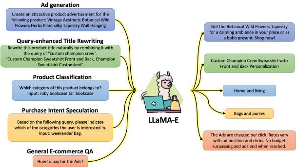
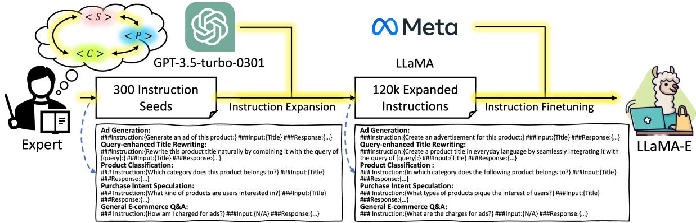
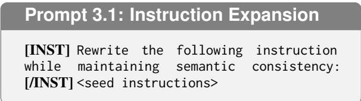
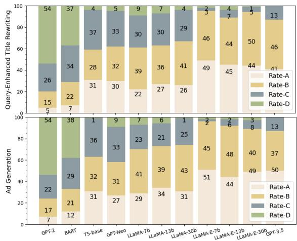

# LLaMA-E: Empowering E-commerce Authoring with Object-Interleaved Instruction Following

Kaize Shi<sup>1</sup>, Xueyao Sun<sup>1,</sup> <sup>2</sup>, Dingxian Wang<sup>1</sup>, Yinlin Fu<sup>3</sup>, Guandong Xu<sup>1,</sup> <sup>4</sup>\*, Qing Li<sup>2</sup> <sup>1</sup> University of Technology Sydney

<sup>2</sup> The Hong Kong Polytechnic University <sup>3</sup> Etsy

<sup>4</sup> The Education University of Hong Kong {Kaize.Shi, Guandong.Xu}@uts.edu.au

## Abstract

E-commerce authoring entails creating engaging, diverse, and targeted content to enhance preference elicitation and retrieval experience. While Large Language Models (LLMs) have revolutionized content generation, they often fall short in e-commerce applications due to their limited memorization of domain-specific features. This paper proposes LLaMA-E, the unified e-commerce authoring models that address the contextual preferences of customers, sellers, and platforms, the essential objects in ecommerce operation. We design the instruction set derived from tasks of ads generation, queryenhanced product title rewriting, product classification, purchase intent speculation, and general e-commerce Q&A. The instruction formulation ensures the interleaved cover of the presented and required object features, allowing the alignment of base models to parameterize e-commerce knowledge comprehensively. The proposed LLaMA-E models achieve state-ofthe-art evaluation performance and exhibit the advantage in zero-shot practical applications. To our knowledge, this is the first LLM tailored to empower authoring applications with comprehensive scenario understanding by integrating features focused on participated objects. <sup>1</sup>

## 1 Introduction

E-commerce authoring encompasses creating diverse and innovative textual content for online services, such as product copywriting, advertisements, and Q&A (Deng et al., 2024; Zhang et al., 2022b). Automatically generating authoring content can enhance the product retrieval experience, improve preference elicitation, and drive sales and conversions (Jing et al., 2023). Present task-specific authoring models predominantly focus on independent features, missing the capacity to interleave features of objects in interactive e-commerce scenarios. These limitations constrain the model’s understanding of e-commerce operations, disregarding their potential to fit and apply positively promoted features in authoring tasks (Chan et al., 2020).

  
Figure 1: We train the LLaMA-E models based on the instructions set of various e-commerce authoring tasks, which interleaved integrating the object features for enhancing the comprehensive scenario understanding.<sup>2</sup>

Natural language processing (NLP) has witnessed a significant transformation with the emergence of instruction-following large language models (LLMs) (Lin et al., 2025; Zhang et al., 2024b; Zhao et al., 2023a). These powerful models have revolutionized the approach to NLP tasks, introducing a unified paradigm with potential for advancements (Mialon et al., 2023). LLMs such as ChatGPT <sup>3</sup>, acquire a broad spectrum of knowledge trained on vast corpora, enabling them to demonstrate remarkable generation performance and deliver impressive results in numerous applications, such as information retrieval, controlled generation, etc (Bao et al., 2023; Shi et al., 2023b, 2024b). The comprehensive corpora allow LLMs to capture the logic of language representation and acquire a macro understanding of common sense and semantics. However, the general corpora constrain the model in comprehending and producing the intricacies of personalized and specialized scenarios due to data barriers that isolate long-tail domainspecific knowledge (Zhao et al., 2023b; Kandpal et al., 2023; Shi et al., 2020, 2021, 2023a, 2024a). Furthermore, certain LLMs rely on remote centralized services, raising concerns regarding privacy protection in data transmission (Yao et al., 2024).

Comprehensively understanding complex ecommerce scenarios by following instructions integrating the object-interleaved features offers significant opportunities to align LLMs to handle diverse authoring applications in a unified manner (Feng et al., 2024; Zhang et al., 2024a; Lester et al., 2021). This procedure enables general LLMs with common sense knowledge to focus on e-commerce knowledge. Consequently, LLMs enhance generalization and feature-fitting capacities through contextually sensitive instructions, releasing their ability for fine-grained downstream applications (Singhal et al., 2023). Moreover, customizing LLMs locally maximizes privacy by mitigating potential breaches related to the sharing of sensitive information during inference processes (Peris et al., 2023).

This paper proposes the LLaMA-E, the instruction following LLMs specifically tailored for ecommerce authoring scenarios. Recent studies have shown that automatic self-instructional tuning can enhance the performance of LLMs in domainspecific applications by allowing them to generate content that closely follows the instructions and precisely meets the contextual expectations of the given scenario (Wang et al., 2023; Singhal et al., 2023; Thirunavukarasu et al., 2023). Inspired by this, we align LLMs to gain a thorough understanding of e-commerce authoring scenarios by injecting the knowledge featured by vital objects: sellers, customers, and platforms, avoiding feature bias arising from task-isolated learning. Specifically, domain experts are engaged to formulate the seed set to interleaved integrate object features, focusing on the tasks of ads generation, query-enhanced product title rewriting, product classification<sup>4</sup>, query intent speculation, and general e-commerce Q&A. After the raw instructions are collected, the teacher model, GPT-3.5-turbo-301, is introduced to expand the expert-defined task-specific instructions for enhancing the generalizability of model training. The seed instruction set is then combined with the expanded instruction set to the final instruction data, which consists of 120k instruction pairs after pruning. The LLaMA-E models are trained following the final instruction set and evaluated by the evaluation system designed from practical requirements to assess their effectiveness in empowering e-commerce authoring content presentation. The results demonstrate that LLaMA-E models achieve state-of-the-art performance, also surpassing general LLMs in held-out unseen tasks, proving their serviceability in real-world applications. The contributions of this paper are summarized as follows:

• We propose LLaMA-E, the LLMs specifically tailored to uniformly present practical and object-oriented e-commerce authoring content to cater to various scenario participants.

• We formulate the e-commerce authoring instruction set integrating object-interleaved features to prompt the alignment of LLMs to enable comprehensive scenario understanding.

• The LLaMA-E models achieve state-of-theart results compared with baselines. To our knowledge, this is the first work aligning LLMs to focus on e-commerce authoring.

## 2 Related Works

## 2.1 E-commerce Authoring

E-commerce authoring aims to create diverse and engaging content to highlight product features and encourage purchases (Guo et al., 2022). One straightforward approach is modifying the fixed patterns. Wang et al., 2017 proposed a statistical framework that generates product descriptions using templates extracted from product attributes. Xiao and Munro, 2019 generated summaries of product titles by defining the keyword categories. With advancements in NLG paradigms like Transformers (Vaswani et al., 2017), models have improved in representing complex features and incorporating domain-specific details.

Recent research focuses on uniformly integrating product attributes to drive purchasing behaviour. Zhang et al., 2022b developed APCG, a system that uses human feedback to refine transformergenerated content, significantly improving clickthrough and conversion rates at JD.com. Wang et al., 2022 proposed generating descriptions by combining product titles, attributes, and marketercreated descriptions. Chen et al., 2019 integrated product aspects, user categories, and a knowledge base for personalized descriptions. In advertising, Chan et al., 2020 generated ads by selecting representative products for the post topic, while Zhang et al., 2022a created a model for generating ads with multiple products and scenario requirements.

## 2.2 E-commerce Language Models

E-commerce language models address various complex tasks to boost sales, user interaction, customer satisfaction, and personalized services (Chen et al., 2023). These tasks include auto Q&A, product summarization, and sentiment analysis (Varia et al., 2023). For instance, Zhang et al., 2020 proposed E-BERT, a model incorporating phrase-level and product-level knowledge, improving Q&A and product classification performance. Xu et al., 2021 introduced K-PLUG, a pre-trained language model for generative tasks using product and ecommerce knowledge. Li et al., 2024 developed EcomGPT, instructional fine-tuned BLOOMZ models that showed more competitive performance than ChatGPT on general e-commerce tasks.

Studies have also applied language models to enhance customized e-commerce services, such as recommender systems and information retrieval (Liu et al., 2023). Geng et al., 2022 created a path language model for generating explainable product recommendations. Lu et al., 2021 developed a multilingual retrieval model based on BERT to improve e-commerce search engines. Huang et al., 2023 fine-tuned large language models on Amazon data to predict query similarity, which improves search ranking and matching accuracy.

## 3 Methods

The development process of the LLaMA-E models is illustrated in Figure 2, including instruction formulating, expansion, and tuning. The following sections elaborate on each sub-process in detail.

## 3.1 Instruction Formulating

Formulating the informative instruction format requires integrating object-interleaved features from crucial e-commerce participants. This integration aims to align LLMs with comprehensive scenario understanding for executing authoring tasks. This paper focuses on the features of the seller, customer, and platform, which are the essential creators and consumers of e-commerce authoring content.

Seller $< S > :$ The seller object significantly contributes to e-commerce authoring services by crafting attractive and informational product titles that encompass vital features, such as the product’s name, style, brand, or model. These product titles provide an intuitive information channel for potential customers and effectively convey specific product features to the official platform.

Customer $< C >$ : The customer object serves as the primary audience for e-commerce authoring services. They actively participate in the authoring process by providing personalized product preferences. The customer query corresponding to specific products is the vital textual carrier for associating the features of products and personalized preferences, which can be subdivided as follows:

+Explicit feature $< C _ { 0 } > :$ This feature is intuitively reflected through the textual information in the customer query, which can provide specific feedback on the explicit features of the customer’s intended product. The query text acts as an indicator of the specific features or attributes that the customer is retrieving in the product.

+Implicit feature $< C _ { 1 } > :$ This feature encapsulates the potential purchase interest that can be inferred from the user query, thereby supporting the authoring process correlated with the specific customer intention. The features are semantically abstracted from the query text and can be elicited to associate with other features from different objects based on specific authoring scenarios.

Platform $< P > :$ As the service provider of the e-commerce authoring models, features of the platform object offer comprehensive and macroscopic perspectives. Its primary purpose is to establish abstract connections that integrate features of seller and customer objects. This holistic feature is instrumental in ensuring authoring content aligns with the platform’s characteristics as follows:

+Product correlation $< P _ { 0 } > :$ This feature is derived from the product taxonomy, which encompasses the distinctions and associations among diverse products. The integration of this feature enhances e-commerce authoring by providing a comprehensive understanding of product semantics through coherent and official ground-truth taxonomy labels based on expert knowledge.

+Platform background $< P _ { 1 } > :$ This feature pertains to the background knowledge of specific ecommerce platforms. It aids the authoring process by aligning linguistic habits and policy knowledge corresponding to the platform representation. The textual information reflected by the official blogs and Q&A pairs serve as the carrier of this feature.

  
Figure 2: The development process of the LLaMA-E models, which includes instruction formulating, instruction expansion, and instruction tuning for e-commerce authoring scenarios.

Specifying an integrated instruction set containing the tasks that interleave essential features can improve the generalization and scenario understanding capabilities of LLMs (Longpre et al., 2023). In the e-commerce scenario, a productive approach involves formulating inference tasks that align with downstream applications’ requirements to cover features from the participated objects. We formulate practical tasks for interleaving the features of objects, including Ads Generation, Query-enhanced Title Rewriting, Product Classification, Purchase Intent Speculation, and General E-commerce Q&A. Table 1 shows the instantiated instructions with highlighted object features.

The ads generation aims to create compelling content highlighting product features and incorporating persuasive language to stimulate purchasing. This is the most prevalent task in e-commerce authoring. The query-enhanced title rewriting focuses on personalizing the original product titles for preference elicitation based on user queries, making them more appealing and aligned with user purchasing inclinations. Since the semantic features in product titles and queries have domain prominence, we utilize the product classification and purchase intention speculation tasks to map these semantic features to unified product taxonomy, shifting the model’s focus from general to e-commerce knowledge. The purchase intention speculation also establishes semantic associations between queries and taxonomy to enhance query understanding and product recommendation. The general e-commerce Q&A introduces background knowledge through

Q&A pairs defined by the platform. Its testing scenario can be regarded as a zero-shot learning task for platform style alignment. The formulated seed set consists of 300 instructions covering these tasks.

## 3.2 Instruction Expansion

To enhance the generalizability of LLaMA-E models in various downstream authoring applications, we utilize the GPT-3.5-turbo-0301 model as a teacher to expand the initial set of instructions. The expansion process involves rewriting the seed instructions with the teacher model to achieve a variety of expressions while maintaining semantic integrity. For tasks like product classification and intention speculation, where responses are strictly predefined, only the instructions are rewritten to maintain the necessary response constraints following the Prompt 3.1. The <seed instructions> represents the raw expert-defined instructions.



For generative tasks that encourage the production of varied linguistic expressions, we not only expand the raw instructions but also adopt two strategies to expand the responses corresponding to the instructions: response generation and rewriting. The response generation strategy utilizes the teacher model to generate appropriate responses based on the expanded instructions, thereby diversifying the raw responses by leveraging the parameterized knowledge encapsulated within LLMs. The prompt format is as shown in Prompt 3.2, where <expanded instructions> represents the generative tasks’ instructions that are expanded by the Prompt 3.1, and <seed inputs> is the fixed authoring features like product title, taxonomy, etc.

<table><tr><td rowspan=1 colspan=1>Task</td><td rowspan=1 colspan=1>Instantiation</td><td rowspan=1 colspan=2>Instruction</td></tr><tr><td rowspan=1 colspan=1>Ads Generation</td><td rowspan=1 colspan=1>&lt;S&gt;</td><td rowspan=1 colspan=2>Generate a short advertisement for the following product:[product title]</td></tr><tr><td rowspan=1 colspan=1>Query-enhanced Title Rewriting</td><td rowspan=1 colspan=1> ${ \overline { { < S , C _ { 0 } > } } }$ </td><td rowspan=1 colspan=2>Rewrite the product title of[product title]according to the following query:[query]</td></tr><tr><td rowspan=1 colspan=1>Product Classification</td><td rowspan=1 colspan=1> ${ \overline { { < S , P _ { 0 } > } } }$ </td><td rowspan=1 colspan=2>What is the[product category]of this following product belongs to?[product title]</td></tr><tr><td rowspan=1 colspan=1>Purchase Intent Speculation</td><td rowspan=1 colspan=1> ${ \overline { { < C _ { 1 } , P _ { 0 } > } } }$ </td><td rowspan=1 colspan=2>Given the query of[query], which of the following[product category]is the customer interested in?</td></tr><tr><td rowspan=1 colspan=1>General E-commerce Q&amp;A</td><td rowspan=1 colspan=1> ${ \mathsf { \mathrm { { \mathrm { { \mathcal { P } } } } } } } _ { 1 } { \mathsf { { > } } }$ </td><td rowspan=1 colspan=1>[How am I charged for Ads?]</td><td rowspan=1 colspan=1></td></tr></table>

Table 1: Examples of the instantiated instructions in e-commerce authoring interaction scenarios, where the tasks cover the object-interleaved features from seller <S> , customer <C> , and platform <P>

```xml
Prompt 3.2: Responses Generation
[INST] <expanded instructions> [/INST]
<seed inputs>
```

The response rewriting strategy involves enabling the teacher model to rewrite the responses (as <responses>), thereby producing more diverse expressions while maintaining alignment with the fixed corresponding instructions paired. The prompt format is as depicted in Prompt 3.3.

Prompt 3.3: Responses Rewriting   
[INST] Rewrite the following generated   
response to diversify its expression:   
[/INST] <responses>

After generating the expanded set of instructions, a post-processing phase is conducted by domain experts. During this crucial phase, instructionresponse pairs with duplicate content are filtered out to ensure the uniqueness and quality of the final instruction set. The refined instructions are then evenly distributed across the respective tasks, resulting in a comprehensive set of 120k instructions. This final instruction set is subsequently utilized to train the LLaMA-E models. The examples of the final instructions are provided in Appendix A.

## 3.3 Instruction Tuning

The LLaMA-E models are developed by integrating the proposed e-commerce authoring instruction set with LLaMA (Touvron et al., 2023) models, utilizing parameter scales of 7b, 13b, and 30b as the base models. Deploying these large-parameter LLaMA models in customer-specific scenarios poses significant challenges due to the associated computational complexity. To address this, we employ LoRA (Hu et al., 2021), a Parameter-Efficient Fine-Tuning (PEFT) strategy that facilitates cost-effective finetuning while achieving results comparable to full model fine-tuning. LoRA is designed for low-rank adaptation, which reduces the number of trainable parameters in the fine-tuning process by learning rank-decomposition matrix pairs while keeping the original weights static. This method enhances the LLaMA-E models’ applicability in e-commerce authoring tasks, enabling the LLMs to effectively serve the scenario objects (particularly sellers and customers) even with limited computational resources. In our fine-tuning process, the forward pass of a linear layer represented by $h \ = \ W _ { 0 } x$ in the base LLaMA models is modified with the LoRA. The process is described as Eq.1.

$$
h = W _ { 0 } x + B A x ,\tag{1}
$$

where $W _ { 0 } ~ \in ~ \mathbb { R } ^ { d \times k }$ represents the frozen pretrained weight matrices from the base LLaMA models, whereas $B \in \mathbb { R } ^ { d \times r }$ and $A \in \mathbb { R } ^ { r \times k }$ are the trainable parameters that are initialized with zero and Gaussian initialization, respectively. All variables with the rank of $m i n ( d , k )$ . Since LLaMA models are trained on general corpora like Wikipedia and C4, it is crucial to specifically align the focus towards comprehending unique e-commerce semantic features, such as rare stylistic words (e.g., Boho, Berber), when employing the models for authoring tasks. This emphasis is particularly important for modelling product descriptions and personalized customer queries. To enable the model to fit these nuanced features, we utilize LoRA with trainable parameters of $W _ { q } , W _ { k } , W _ { v } ,$ and $W _ { o } ,$ which are the weight matrices in the self-attention module.

## 4 Experiment

## 4.1 Implementation Details

The dataset for constructing the instruction set is sourced from practical e-commerce scenarios, featuring vital details of product titles, taxonomy, and customer queries. It also includes an action element reflecting customer interactions with the retrieved products, which has the value of "no action", "click", "cart add", and "purchase". To ensure the data reflects potential purchase interest based on the correlation between queries and products, data labeled as "no action" (indicating no interest) is filtered. The screened data undergoes post-processing to remove emojis and interfering characters.

The test set comprises 19,367 unseen product instances, each featuring an additional product description element for more detailed information. To evaluate the LLaMA-E models on general ecommerce Q&A tasks, we utilized 30 authentic Q&A pairs from the platform’s "Help Center" that are not included in the training set. The LLaMA-E models are trained using two NVIDIA A40 GPUs. The number of trainable parameters and the training time per epoch are detailed in Table 2.

<table><tr><td rowspan=1 colspan=1>Model</td><td rowspan=1 colspan=1>Trainable Parameters</td><td rowspan=1 colspan=1>GPU Hours</td></tr><tr><td rowspan=1 colspan=1>LLaMA-E-7b</td><td rowspan=1 colspan=1>8.39m</td><td rowspan=1 colspan=1>3.93</td></tr><tr><td rowspan=1 colspan=1>LLaMA-E-13b</td><td rowspan=1 colspan=1>13.11m</td><td rowspan=1 colspan=1>9.51</td></tr><tr><td rowspan=1 colspan=1>LLaMA-E-30b</td><td rowspan=1 colspan=1>25.56m</td><td rowspan=1 colspan=1>41.14</td></tr></table>

Table 2: Training details of the LLaMA-E models.

## 4.2 Evaluation System

The evaluation system is designed to assess the generalization capability of the LLaMA-E models in practical e-commerce applications. This assessment necessitates that the generated content prioritizes the coverage of essential features following the task requirements rather than toughly adhering to fixed responses based on instructions. The metrics in the evaluation system are as follows:

Ads Generation: The evaluation metrics for this task include $B L E U ^ { 5 }$ (Papineni et al., 2002) and $R O U G E ^ { 6 }$ (Lin, 2004), which are commonly used in combination in NLG tasks (Narasimhan et al., 2022). We calculate the BLEU and $R O U G E - L$ scores between the generated ads and the product title and description separately, denoted as $B L _ { A d _ { t } } , B L _ { A d _ { d } } , R L _ { A d _ { t } }$ , and $R L _ { A d _ { d } }$ . This evaluation aligns with the motivation of seller-written advertisements, assessing whether the generated contents incorporate the essential features in the titles and the significant details in the descriptions.

Query-enhanced Title Rewriting: We calculate the BLEU and ROUGE − L scores between the rewritten title and the raw product title and customer query separately, represented as $B L _ { T _ { t } }$ $R L _ { T _ { t } } , B L _ { T _ { q } } ,$ , and $R L _ { T _ { q } }$ . These metrics measure how comprehensively the rewritten title covers features from the raw title and query. The raw product titles are short sentences with dysfluent text stacked with discrete entities, making the readability a criterion for evaluating whether the rewritten title can be used in publicity scenes like banners. We calculate the perplexity $( P P L )$ (Jelinek et al., 1977) metric of the rewritten title by taking the GPT-2-XL <sup>7</sup> as the evaluation model, which boasts 1.5 billion parameters and is pre-trained on the WebText dataset with extensive general semantic features.

Product Classification: This task evaluates whether the LLaMA-E model can accurately classify products according to a predefined taxonomy based solely on their raw textual titles. The evaluation metrics include the macro-average Precision $( P _ { p t } )$ , Recall $( R _ { p t } )$ , and F1-score $( F _ { 1 _ { p t } } )$

Intent Speculation: This task evaluates the performance of the LLaMA-E in analyzing customer potential purchasing interest expressed by queries associated with the product taxonomy. The evaluation can be quantitatively measured using the classification metrics, including macro-average Precision $( P _ { q s } )$ , Recall $( R _ { q s } )$ , and F1-score $( F _ { 1 _ { q s } } )$ .

General E-commerce Q&A: The metrics of BLEU and ROUGE − L measure the explicit overlap and similarity between the generated and standard answers for evaluating the generalization on unseen questions, represented as $B L _ { q a }$ and $R L _ { q a }$ . We also introduce the average BERT Score $( B E _ { q a } )$ (Zhang\* et al., 2020) for evaluating the implicit semantic similarity. This can be regarded as a measure of the platform-specific knowledge conveyed by semantics injected into the LLMs.

Overall: We calculate an overall metric, the geometric mean (GM) (Yi et al., 2020), of all the aforementioned evaluation metrics to assess model performance comprehensively. The PPL metric is transformed to $\displaystyle { \frac { 1 } { \ln { P P L } } }$ for the calculation to comply with the monotonicity of the GM metric, where a higher GM indicates better overall performance.

## 4.3 Baseline Methods

We compare the proposed LLaMA-E models with the LLMs of GPT-2 (Radford et al., 2019), BART (Lewis et al., 2020), T5-base (Raffel et al., 2020), GPT-Neo (Black et al., 2021), and LLaMA (Touvron et al., 2023). We use the proposed instruction set to fine-tune GPT-2 and BART models for each authoring task. This evaluation examines the distinction between comprehensive instruction fine-tuning and separate task-specific fine-tuning when conducting correlated tasks under the same scenario. The other baselines are introduced with their pre-trained general models, and the comparison of the LLaMA-7/13/30b models can be regarded as the ablation study to evaluate the advantages of designed object-interleaved instructions in enabling general LLMs to learn ecommerce authoring knowledge. Additionally, we report the performance of the teacher model, GPT-3.5-turbo-0310, on each of the evaluation tasks.

## 5 Result and Analysis

## 5.1 Quantitative Evaluation

The quantitative evaluation results are shown in Table 3, and we also show the qualitative evaluation results in Appendix B. The LLaMA-E models have generally achieved better results than other baselines in most quantitative metrics. The LLaMA-E-7b model outperforms the baselines in the GM metric, which proves it has the best overall performance in the required e-commerce authoring tasks. Within the internal comparison of the LLaMA-E models, an obvious trend is the gradual enhancement of performance in classification tasks as the scale of parameters increases. This demonstrates that a larger parameter scale helps fit the more granular scenario features within the instruction set. However, one potential drawback is overfitting, stemming from the limitations in the scale and diversity of the current instruction set. The models’ ability to generalize knowledge from general corpora and effectively model natural language representations may be affected. This observation also confirms that smaller-scale models may be adequate for tasks with lower inference requirements, thereby avoiding complex computational costs.

Compared to the teacher model, GPT-3.5, the LLaMA-E model achieved competitive performance in the BLEU and ROUGE − L metrics, which evaluate text overlap, as well as in the P P L metric, which assesses model performance in generating qualified text. These results indicate that the text generated by the LLaMA-E models aligns closely with GPT-3.5 in terms of information coverage and readability. In tasks such as product classification, intent speculation, and general ecommerce Q&A—each requiring professional domain knowledge—the LLaMA-E models demonstrated superior performance. This underscores that general LLMs are not yet sufficient to meet the finegrained requirements of domain-specific applications, highlighting the necessity of designing LLMs tailored to scenario features. This comparison validates the feasibility of aligning general LLMs to focus on practical downstream e-commerce authoring applications through specially designed instructions that comprehend object-interleaved features.

Compared to the task-specific fine-tuned GPT-2 and BART models, the LLaMA-E models achieved superior performance in the GM metric, demonstrating that the designed instruction set provides a more fine-grained fit to the comprehensive features of the given tasks than task-specific fine-tuning. Both of these two models outperformed the remaining baselines in the $F _ { 1 _ { q s } } , F _ { 1 _ { p t } }$ , and $B E _ { q a }$ metrics, with GPT-2 even achieving the best performance in the $P _ { p t }$ metric. These results indicate that incorporating domain knowledge effectively enhances the serviceability of LLMs in specific scenarios. However, these models require cumbersome taskisolated fine-tuning, and their limited in-context learning ability further restricts the efficient utilization of the features in available training data. These limitations hinder their practical applicability.

The remaining baselines, T5-base, GPT-Neo, and LLaMA, which are of similar scale to the LLaMA-E models, are incorporated to evaluate the applicability of extensive general knowledge in specific application scenarios. The findings indicate that while these models excel in certain generative metrics, they fall short in classification and B $E _ { q a }$ metrics. This suggests that large-scale general knowledge enables these models to parameterize the basic linguistics features to generate readable yet context-independent text, limiting their ability to represent fine-grained scenario-specific knowledge and provide precise support for e-commerce authoring services. This hypothesis will be further examined in Appendix B. Compared to the vanilla LLaMA models, the instruction-followed LLaMA-E models perform better across all metrics, validating the positive support of the proposed instruction set for parameterizing the authoring features.

## 5.2 Human Evaluation

We invited ten volunteer annotators with extensive experience in English comprehension and ecommerce to conduct human evaluations on tasks of ads generation and query-enhanced title rewriting. Each annotator is asked to anonymously rate ten randomly selected generated texts from the progressive perspectives of readability, coverage, and attractiveness based on the following criteria:

<table><tr><td rowspan=2 colspan=2>Model</td><td rowspan=1 colspan=4>Ads Generation</td><td rowspan=1 colspan=4>Query-enhanced Title Rewrit</td><td rowspan=1 colspan=1>ing</td><td rowspan=1 colspan=2>Product</td><td rowspan=1 colspan=1>Classification</td><td rowspan=1 colspan=2>Intent</td><td rowspan=1 colspan=1>Speculation</td><td rowspan=1 colspan=3>General Q&amp;A</td><td rowspan=2 colspan=1>GM↑</td></tr><tr><td rowspan=1 colspan=1> $\overline { { B L _ { A _ { t } } } }$ </td><td rowspan=1 colspan=1> $\overline { { R L _ { A _ { t } } } }$ </td><td rowspan=1 colspan=1> $\overline { { B L _ { A _ { d } } } }$ </td><td rowspan=1 colspan=1> $\overline { { R L _ { A _ { d } } } }$ </td><td rowspan=1 colspan=1> $\overline { { B L _ { T _ { t } } } }$ </td><td rowspan=1 colspan=1> $\overline { { \mathcal { R } L _ { T _ { t } } } }$ </td><td rowspan=1 colspan=1> $\overline { { B L _ { T _ { c } } } }$ </td><td rowspan=1 colspan=1> $\overline { { \mathcal { R } L _ { T _ { q } } } }$ </td><td rowspan=1 colspan=1> $\bar { \overline { { P P L } } }$ </td><td rowspan=1 colspan=1> $\overline { { P _ { p t } } }$ </td><td rowspan=1 colspan=1> $\overline { { R _ { p t } } }$ </td><td rowspan=1 colspan=1> $\overline { { F _ { 1 _ { p t } } } }$ </td><td rowspan=1 colspan=1> $\overline { { P _ { q s } } }$ </td><td rowspan=1 colspan=1> $\overline { { { R _ { q s } } } }$ </td><td rowspan=1 colspan=1> $\overline { { F _ { 1 _ { q s } } } }$ </td><td rowspan=1 colspan=1> $\overline { { B L _ { q a } } }$ </td><td rowspan=1 colspan=1> $\overline { { R L _ { q a } } }$ </td><td rowspan=1 colspan=1> $\overline { { B E _ { q a } } }$ </td></tr><tr><td rowspan=1 colspan=2>GPT-3.5</td><td rowspan=1 colspan=1>16.76</td><td rowspan=1 colspan=1> $\overline { { 4 7 . 6 5 } }$ </td><td rowspan=1 colspan=1> $\overline { { 0 . 5 6 } }$ </td><td rowspan=1 colspan=1> $\overline { { 1 1 . 1 5 } }$ </td><td rowspan=1 colspan=1> $2 6 . 0 8$ </td><td rowspan=1 colspan=1>60.04</td><td rowspan=1 colspan=1> $\overline { { 9 . 1 0 } }$ </td><td rowspan=1 colspan=1>35.00</td><td rowspan=1 colspan=1>120.86</td><td rowspan=1 colspan=1>49.48</td><td rowspan=1 colspan=1> $\overline { { 4 9 . 2 3 } }$ </td><td rowspan=1 colspan=1> $\overline { { 4 9 . 3 5 } }$ </td><td rowspan=1 colspan=1> $\overline { { 1 9 . 5 8 } }$ </td><td rowspan=1 colspan=1>19.18</td><td rowspan=1 colspan=1> $\overline { { 1 9 . 3 8 } }$ </td><td rowspan=1 colspan=1>2.83</td><td rowspan=1 colspan=1>14.41</td><td rowspan=1 colspan=1>85.53</td><td rowspan=1 colspan=1>15.06</td></tr><tr><td rowspan=1 colspan=2>GPT-2</td><td rowspan=1 colspan=1>14.85</td><td rowspan=1 colspan=1>25.03</td><td rowspan=1 colspan=1>0.29</td><td rowspan=1 colspan=1>6.83</td><td rowspan=1 colspan=1>16.57</td><td rowspan=1 colspan=1>39.48</td><td rowspan=1 colspan=1>1.64</td><td rowspan=1 colspan=1>19.98</td><td rowspan=1 colspan=1>253.73</td><td rowspan=1 colspan=1>87.50</td><td rowspan=1 colspan=1>24.01</td><td rowspan=1 colspan=1>33.18</td><td rowspan=1 colspan=1>56.25</td><td rowspan=1 colspan=1>6.33</td><td rowspan=1 colspan=1>10.69</td><td rowspan=1 colspan=1>2.14</td><td rowspan=1 colspan=1>11.42</td><td rowspan=1 colspan=1>85.66</td><td rowspan=1 colspan=1>10.26</td></tr><tr><td rowspan=1 colspan=2>BART</td><td rowspan=1 colspan=1>13.05</td><td rowspan=1 colspan=1>36.04</td><td rowspan=1 colspan=1>0.37</td><td rowspan=1 colspan=1>8.37</td><td rowspan=1 colspan=1>18.64</td><td rowspan=1 colspan=1>41.40</td><td rowspan=1 colspan=1>5.75</td><td rowspan=1 colspan=1>20.33</td><td rowspan=1 colspan=1>389.35</td><td rowspan=1 colspan=1>73.75</td><td rowspan=1 colspan=1>54.82</td><td rowspan=1 colspan=1>62.39</td><td rowspan=1 colspan=1>66.67</td><td rowspan=1 colspan=1>47.97</td><td rowspan=1 colspan=1>54.71</td><td rowspan=1 colspan=1>3.32</td><td rowspan=1 colspan=1>14.02</td><td rowspan=1 colspan=1>86.02</td><td rowspan=1 colspan=1>15.83</td></tr><tr><td rowspan=1 colspan=2>T5-base</td><td rowspan=1 colspan=1>14.55</td><td rowspan=1 colspan=1>37.96</td><td rowspan=1 colspan=1>0.92</td><td rowspan=1 colspan=1>9.10</td><td rowspan=1 colspan=1>21.16</td><td rowspan=1 colspan=1>53.42</td><td rowspan=1 colspan=1>7.95</td><td rowspan=1 colspan=1>23.82</td><td rowspan=1 colspan=1>300.02</td><td rowspan=1 colspan=1>40.04</td><td rowspan=1 colspan=1>9.52</td><td rowspan=1 colspan=1>9.62</td><td rowspan=1 colspan=1>26.17</td><td rowspan=1 colspan=1>9.98</td><td rowspan=1 colspan=1>9.01</td><td rowspan=1 colspan=1>3.25</td><td rowspan=1 colspan=1>13.99</td><td rowspan=1 colspan=1>85.33</td><td rowspan=1 colspan=1>11.03</td></tr><tr><td rowspan=1 colspan=1>GPT</td><td rowspan=1 colspan=1>-Neo</td><td rowspan=1 colspan=1>12.93</td><td rowspan=1 colspan=1>30.62</td><td rowspan=1 colspan=1>0.97</td><td rowspan=1 colspan=1>8.16</td><td rowspan=1 colspan=1>21.43</td><td rowspan=1 colspan=1>49.04</td><td rowspan=1 colspan=1>7.21</td><td rowspan=1 colspan=1>25.49</td><td rowspan=1 colspan=1>306.83</td><td rowspan=1 colspan=1>9.88</td><td rowspan=1 colspan=1>5.86</td><td rowspan=1 colspan=1>2.42</td><td rowspan=1 colspan=1>2.61</td><td rowspan=1 colspan=1>5.05</td><td rowspan=1 colspan=1>1.61</td><td rowspan=1 colspan=1>2.41</td><td rowspan=1 colspan=1>10.10</td><td rowspan=1 colspan=1>83.56</td><td rowspan=1 colspan=1>6.65</td></tr><tr><td rowspan=2 colspan=1>INA</td><td rowspan=1 colspan=1>7b</td><td rowspan=1 colspan=1>10.05</td><td rowspan=1 colspan=1>21.63</td><td rowspan=1 colspan=1>0.77</td><td rowspan=1 colspan=1>8.52</td><td rowspan=1 colspan=1>12.00</td><td rowspan=1 colspan=1>27.32</td><td rowspan=1 colspan=1>3.22</td><td rowspan=1 colspan=1>13.86</td><td rowspan=1 colspan=1>206.71</td><td rowspan=1 colspan=1>28.64</td><td rowspan=1 colspan=1>4.29</td><td rowspan=1 colspan=1>4.12</td><td rowspan=1 colspan=1>9.64</td><td rowspan=1 colspan=1>3.01</td><td rowspan=1 colspan=1>2.29</td><td rowspan=1 colspan=1>2.01</td><td rowspan=1 colspan=1>11.17</td><td rowspan=1 colspan=1>84.81</td><td rowspan=1 colspan=1>6.31</td></tr><tr><td rowspan=1 colspan=1>13b</td><td rowspan=1 colspan=1>6.31</td><td rowspan=1 colspan=1>16.35</td><td rowspan=1 colspan=1>0.75</td><td rowspan=1 colspan=1>7.94</td><td rowspan=1 colspan=1>15.28</td><td rowspan=1 colspan=1>30.40</td><td rowspan=1 colspan=1>3.35</td><td rowspan=1 colspan=1>13.61</td><td rowspan=1 colspan=1>181.54</td><td rowspan=1 colspan=1>19.64</td><td rowspan=1 colspan=1>1.78</td><td rowspan=1 colspan=1>2.62</td><td rowspan=1 colspan=1>13.62</td><td rowspan=1 colspan=1>3.48</td><td rowspan=1 colspan=1>4.79</td><td rowspan=1 colspan=1>0.86</td><td rowspan=1 colspan=1>11.53</td><td rowspan=1 colspan=1>84.39</td><td rowspan=1 colspan=1>5.72</td></tr><tr><td rowspan=1 colspan=1></td><td rowspan=1 colspan=1>30b</td><td rowspan=1 colspan=1>12.67</td><td rowspan=1 colspan=1>22.93</td><td rowspan=1 colspan=1>0.91</td><td rowspan=1 colspan=1>7.44</td><td rowspan=1 colspan=1>18.03</td><td rowspan=1 colspan=1>32.03</td><td rowspan=1 colspan=1>3.15</td><td rowspan=1 colspan=1>12.95</td><td rowspan=1 colspan=1>159.18</td><td rowspan=1 colspan=1>32.15</td><td rowspan=1 colspan=1>6.12</td><td rowspan=1 colspan=1>9.27</td><td rowspan=1 colspan=1>11.54</td><td rowspan=1 colspan=1>4.25</td><td rowspan=1 colspan=1>5.73</td><td rowspan=1 colspan=1>2.49</td><td rowspan=1 colspan=1>11.38</td><td rowspan=1 colspan=1>84.55</td><td rowspan=1 colspan=1>7.79</td></tr><tr><td rowspan=1 colspan=1></td><td rowspan=1 colspan=1>7b</td><td rowspan=1 colspan=1>15.18</td><td rowspan=1 colspan=1>46.96</td><td rowspan=1 colspan=1>0.45</td><td rowspan=1 colspan=1>9.87</td><td rowspan=1 colspan=1>18.88</td><td rowspan=1 colspan=1>54.36</td><td rowspan=1 colspan=1>4.66</td><td rowspan=1 colspan=1>25.69</td><td rowspan=1 colspan=1>132.86</td><td rowspan=1 colspan=1>60.03</td><td rowspan=1 colspan=1>63.80</td><td rowspan=1 colspan=1>59.01</td><td rowspan=1 colspan=1>59.52</td><td rowspan=1 colspan=1>61.09</td><td rowspan=1 colspan=1>59.71</td><td rowspan=1 colspan=1>4.04</td><td rowspan=1 colspan=1>15.86</td><td rowspan=1 colspan=2>86.43 17.41</td></tr><tr><td rowspan=2 colspan=1>LMM-</td><td rowspan=1 colspan=1>13b</td><td rowspan=1 colspan=1>13.08</td><td rowspan=1 colspan=1>46.99</td><td rowspan=1 colspan=1>0.32</td><td rowspan=1 colspan=1>8.99</td><td rowspan=1 colspan=1>15.07</td><td rowspan=1 colspan=1>50.48</td><td rowspan=1 colspan=1>4.15</td><td rowspan=1 colspan=1>23.21</td><td rowspan=1 colspan=1>152.23</td><td rowspan=1 colspan=1>72.51</td><td rowspan=1 colspan=1>68.92</td><td rowspan=1 colspan=1>69.99</td><td rowspan=1 colspan=1>72.87</td><td rowspan=1 colspan=1>68.08</td><td rowspan=1 colspan=1>69.62</td><td rowspan=1 colspan=1>3.32</td><td rowspan=1 colspan=1>12.36</td><td rowspan=1 colspan=1>86.14</td><td rowspan=1 colspan=1>16.77</td></tr><tr><td rowspan=1 colspan=1>30b</td><td rowspan=1 colspan=1>14.23</td><td rowspan=1 colspan=1>47.23</td><td rowspan=1 colspan=1>0.41</td><td rowspan=1 colspan=1>10.32</td><td rowspan=1 colspan=1>15.96</td><td rowspan=1 colspan=1>52.95</td><td rowspan=1 colspan=1>4.27</td><td rowspan=1 colspan=1>24.60</td><td rowspan=1 colspan=1>177.75</td><td rowspan=1 colspan=1>74.32</td><td rowspan=1 colspan=1>73.16</td><td rowspan=1 colspan=1>71.75</td><td rowspan=1 colspan=1>74.51</td><td rowspan=1 colspan=1>72.18</td><td rowspan=1 colspan=1>70.53</td><td rowspan=1 colspan=1>2.28</td><td rowspan=1 colspan=1>13.29</td><td rowspan=1 colspan=1>86.01</td><td rowspan=1 colspan=1>17.28</td></tr></table>

Table 3: The quantitative evaluation results of the LLaMA-E models and baselines, where the best results are bolded and the second best are underlined. The model achieves the highest GM ↑ metric is highlighted .

  
Figure 3: Human evaluation of ads generation and query-enhanced title rewriting. Legend labels the rating.

• Rate-A: The generated text captivates customers and encourages purchases while covering essential features of products or queries.

• Rate-B: The generated text covers the essential features of products or queries but lacks attractiveness or persuasive appeal in stylistic.

• Rate-C: The generated text is legible and presented in fluent natural language, but some essential features in the input are lost.

• Rate-D: The generated text cannot be understood due to issues such as messy syntax.

Figure 3 illustrates the results of human evaluation, showing the rating distribution of the test samples. The findings indicate that the LLaMA-E models achieve competitive rating scores compared to the GPT-3.5 while outperforming other baseline models. Additionally, the annotators report that the title rewriting outputs generated by the LLaMA-E models are more attractive. This observed advantage can be primarily attributed to the ads generation task during the instruction fine-tuning process, which encourages the model to produce captivating phrases like "order now" and other persuasive language. This phenomenon indicates the beneficial correlation within the instruction set. The GPT-3.5 shows stronger robustness as it generates text without unreadable content, proving the stability potential of larger LLMs in practical applications.

## 6 Conclusion and Future Research

This paper proposes and releases LLaMA-E, the LLMs toiled for e-commerce authoring. To comprehensively understand e-commerce scenarios, the instructions prioritize integrating interleaved features presented by essential participated objects derived from practical tasks, aligning the LLMs focus with e-commerce-specific knowledge. This approach provides a paradigm that emphasizes the crucial role of fine-grained scenario object features for aligning the general LLMs to the domainspecific applications, suggesting an inspirational solution for empowering diverse downstream LLMsbased inference tasks. Compared with other baselines, the LLaMA-E models achieve state-of-the-art results in comprehensive evaluation systems.

Diversifying existing models to cover a wider range of authoring tasks is crucial for future research. Moreover, extending the models to operate in multilingual environments is essential for providing more extensive services. Certain research endeavours focus on dynamically injecting real-time knowledge into LLMs through information retrieval. Investigating personalized retrieval methods to incorporate preference features into e-commerce authoring models is also appealing, which can reduce tuning costs and promote more customized and private content-based applications.

## Limitations

While the proposed LLaMA-E models demonstrate promising results in empowering e-commerce authoring, certain limitations should be acknowledged. The current LLaMA-E models are primarily based on English data, and their performance in other languages and cross-lingual settings remains unexplored. Adapting the models to multilingual scenarios is crucial for providing comprehensive and uniform e-commerce services globally, as most e-commerce platforms operate worldwide. Moreover, this paper focuses on generating textual content for authoring purposes. However, e-commerce platforms often involve multimodal data, such as images and videos. Extending the models to leverage multimodal information could yield more engaging and informative authoring content. Although the paper emphasizes aligning LLMs with domain-specific knowledge, the models’ capabilities in handling real-time updates or rapidly evolving trends in the e-commerce landscape are not thoroughly investigated. Mechanisms for continual learning and knowledge refreshments are benefi cial for maintaining the models’ relevance. The experiments are conducted on the NVIDIA A40 GPU servers. However, in practical e-commerce applications, some service users, such as sellers and customers, do not have server-level computing hardware. Therefore, further exploring the model’s response performance on different PCs and optimizing the model scale accordingly is helpful for the widespread application of the model.

## Acknowledgments

This research is supported by the Australian Research Council (ARC) Under Grants DP220103717 and LE220100078, and the National Natural Science Foundation of China under Grants No.62072257.

## Ethical Statement

This paper honors the ethical code set out in the ACL Code of Ethics.

## References

Keqin Bao, Jizhi Zhang, Yang Zhang, Wang Wenjie, Fuli Feng, and Xiangnan He. 2023. Large language models for recommendation: Progresses and future directions. In Proceedings of the Annual International ACM SIGIR Conference on Research and Development in Information Retrieval in the Asia Pacific

Region, SIGIR-AP ’23, page 306–309, New York, NY, USA. Association for Computing Machinery.

Sid Black, Leo Gao, Phil Wang, Connor Leahy, and Stella Biderman. 2021. GPT-Neo: Large Scale Autoregressive Language Modeling with Mesh-Tensorflow. If you use this software, please cite it using these metadata.

Zhangming Chan, Yuchi Zhang, Xiuying Chen, Shen Gao, Zhiqiang Zhang, Dongyan Zhao, and Rui Yan. 2020. Selection and generation: Learning towards multi-product advertisement post generation. In Proceedings of the 2020 Conference on Empirical Methods in Natural Language Processing (EMNLP), pages 3818–3829, Online. Association for Computational Linguistics.

Jiao Chen, Luyi Ma, Xiaohan Li, Nikhil Thakurdesai, Jianpeng Xu, Jason HD Cho, Kaushiki Nag, Evren Korpeoglu, Sushant Kumar, and Kannan Achan. 2023. Knowledge graph completion models are few-shot learners: An empirical study of relation labeling in e-commerce with llms. arXiv preprint arXiv:2305.09858.

Qibin Chen, Junyang Lin, Yichang Zhang, Hongxia Yang, Jingren Zhou, and Jie Tang. 2019. Towards knowledge-based personalized product description generation in e-commerce. In Proceedings of the 25th ACM SIGKDD International Conference on Knowledge Discovery & Data Mining, KDD ’19, page 3040–3050, New York, NY, USA. Association for Computing Machinery.

Jiaqi Deng, Kaize Shi, Huan Huo, Dingxian Wang, and Guandong Xu. 2024. Homogeneous-listingaugmented self-supervised multimodal product title refinement. In Proceedings of the 47th International ACM SIGIR Conference on Research and Development in Information Retrieval, SIGIR ’24, page 2870–2874, New York, NY, USA. Association for Computing Machinery.

Yu Feng, Zhen Tian, Yifan Zhu, Zongfu Han, Haoran Luo, Guangwei Zhang, and Meina Song. 2024. Cpprompt: Composition-based cross-modal prompting for domain-incremental continual learning. In Proceedings ofthe 32nd ACM International Conference on Multimedia, MM ’24, page 2729–2738, New York, NY, USA. Association for Computing Machinery.

Shijie Geng, Zuohui Fu, Juntao Tan, Yingqiang Ge, Gerard de Melo, and Yongfeng Zhang. 2022. Path language modeling over knowledge graphsfor explainable recommendation. In Proceedings of the ACM Web Conference 2022, WWW ’22, page 946–955, New York, NY, USA. Association for Computing Machinery.

Xiaojie Guo, Qingkai Zeng, Meng Jiang, Yun Xiao, Bo Long, and Lingfei Wu. 2022. Automatic controllable product copywriting for e-commerce. In Proceedings of the 28th ACM SIGKDD Conference on Knowledge Discovery and Data Mining, KDD ’22,

page 2946–2956, New York, NY, USA. Association for Computing Machinery.

Edward J Hu, Yelong Shen, Phillip Wallis, Zeyuan Allen-Zhu, Yuanzhi Li, Shean Wang, Lu Wang, and Weizhu Chen. 2021. Lora: Low-rank adaptation of large language models. arXiv preprint arXiv:2106.09685.

Yupin Huang, Jiri Gesi, Xinyu Hong, Han Cheng, Kai Zhong, Vivek Mittal, Qingjun Cui, and Vamsi Salaka. 2023. Behavior-driven query similarity prediction based on pre-trained language models for e-commerce search. In SIGIR 2023 Workshop on eCommerce.

Fred Jelinek, Robert L Mercer, Lalit R Bahl, and James K Baker. 1977. Perplexity—a measure of the difficulty of speech recognition tasks. The Journal of the Acoustical Society ofAmerica, 62(S1):S63–S63.

Liqiang Jing, Xuemeng Song, Xuming Lin, Zhongzhou Zhao, Wei Zhou, and Liqiang Nie. 2023. Stylized data-to-text generation: A case study in the e-commerce domain. ACM Trans. Inf. Syst. Just Accepted.

Nikhil Kandpal, Haikang Deng, Adam Roberts, Eric Wallace, and Colin Raffel. 2023. Large language models struggle to learn long-tail knowledge. In Proceedings of the 40th International Conference on Machine Learning, volume 202 of Proceedings ofMachine Learning Research, pages 15696–15707. PMLR.

Brian Lester, Rami Al-Rfou, and Noah Constant. 2021. The power of scale for parameter-efficient prompt tuning. In Proceedings of the 2021 Conference on Empirical Methods in Natural Language Processing, pages 3045–3059, Online and Punta Cana, Dominican Republic. Association for Computational Linguistics.

Mike Lewis, Yinhan Liu, Naman Goyal, Marjan Ghazvininejad, Abdelrahman Mohamed, Omer Levy, Veselin Stoyanov, and Luke Zettlemoyer. 2020. BART: Denoising sequence-to-sequence pre-training for natural language generation, translation, and comprehension. In Proceedings ofthe 58th Annual Meeting of the Association for Computational Linguistics, pages 7871–7880, Online. Association for Computational Linguistics.

Yangning Li, Shirong Ma, Xiaobin Wang, Shen Huang, Chengyue Jiang, Hai-Tao Zheng, Pengjun Xie, Fei Huang, and Yong Jiang. 2024. Ecomgpt: Instructiontuning large language models with chain-of-task tasks for e-commerce. In Proceedings of the AAAI Conference on Artificial Intelligence, volume 38, pages 18582–18590.

Chin-Yew Lin. 2004. ROUGE: A package for automatic evaluation of summaries. In Text Summarization Branches Out, pages 74–81, Barcelona, Spain. Association for Computational Linguistics.

Qika Lin, Yifan Zhu, Xin Mei, Ling Huang, Jingying Ma, Kai He, Zhen Peng, Erik Cambria, and Mengling Feng. 2025. Has multimodal learning delivered universal intelligence in healthcare? a comprehensive survey. Information Fusion, 116:102795.

Peng Liu, Lemei Zhang, and Jon Atle Gulla. 2023. Pretrain, prompt and recommendation: A comprehensive survey of language modelling paradigm adaptations in recommender systems. arXiv preprint arXiv:2302.03735.

Shayne Longpre, Le Hou, Tu Vu, Albert Webson, Hyung Won Chung, Yi Tay, Denny Zhou, Quoc V Le, Barret Zoph, Jason Wei, et al. 2023. The flan collection: Designing data and methods for effective instruction tuning. arXiv preprint arXiv:2301.13688.

Hanqing Lu, Youna Hu, Tong Zhao, Tony Wu, Yiwei Song, and Bing Yin. 2021. Graph-based multilingual product retrieval in E-commerce search. In Proceedings of the 2021 Conference of the North American Chapter of the Association for Computational Linguistics: Human Language Technologies: Industry Papers, pages 146–153, Online. Association for Computational Linguistics.

Grégoire Mialon, Roberto Dessì, Maria Lomeli, Christoforos Nalmpantis, Ram Pasunuru, Roberta Raileanu, Baptiste Rozière, Timo Schick, Jane Dwivedi-Yu, Asli Celikyilmaz, et al. 2023. Augmented language models: a survey. arXiv preprint arXiv:2302.07842.

Sharan Narasimhan, Suvodip Dey, and Maunendra Desarkar. 2022. Towards robust and semantically organised latent representations for unsupervised text style transfer. In Proceedings of the 2022 Conference of the North American Chapter of the Association for Computational Linguistics: Human Language Technologies, pages 456–474, Seattle, United States. Association for Computational Linguistics.

Kishore Papineni, Salim Roukos, Todd Ward, and Wei-Jing Zhu. 2002. Bleu: a method for automatic evaluation of machine translation. In Proceedings ofthe 40th Annual Meeting of the Association for Computational Linguistics, pages 311–318, Philadelphia, Pennsylvania, USA. Association for Computational Linguistics.

Charith Peris, Christophe Dupuy, Jimit Majmudar, Rahil Parikh, Sami Smaili, Richard Zemel, and Rahul Gupta. 2023. Privacy in the time of language models. In Proceedings of the Sixteenth ACM International Conference on Web Search and Data Mining, WSDM ’23, page 1291–1292, New York, NY, USA. Association for Computing Machinery.

Alec Radford, Jeffrey Wu, Rewon Child, David Luan, Dario Amodei, Ilya Sutskever, et al. 2019. Language models are unsupervised multitask learners. OpenAI blog, 1(8):9.

Colin Raffel, Noam Shazeer, Adam Roberts, Katherine Lee, Sharan Narang, Michael Matena, Yanqi Zhou, Wei Li, and Peter J. Liu. 2020. Exploring the limits

of transfer learning with a unified text-to-text transformer. J. Mach. Learn. Res., 21(1).

Kaize Shi, Hao Lu, Yifan Zhu, and Zhendong Niu. 2020. Automatic generation of meteorological briefing by event knowledge guided summarization model. Knowledge-Based Systems, 192:105379.

Kaize Shi, Xueping Peng, Hao Lu, Yifan Zhu, and Zhendong Niu. 2023a. Application of social sensors in natural disasters emergency management: A review. IEEE Transactions on Computational Social Systems, 10(6):3143–3158.

Kaize Shi, Xueping Peng, Hao Lu, Yifan Zhu, and Zhendong Niu. 2024a. Multiple knowledge-enhanced meteorological social briefing generation. IEEE Transactions on Computational Social Systems, 11(2):2002–2013.

Kaize Shi, Xueyao Sun, Li He, Dingxian Wang, Qing Li, and Guandong Xu. 2023b. AMR-TST: Abstract Meaning Representation-based text style transfer. In Findings of the Association for Computational Linguistics: ACL 2023, pages 4231–4243, Toronto, Canada. Association for Computational Linguistics.

Kaize Shi, Xueyao Sun, Qing Li, and Guandong Xu. 2024b. Compressing long context for enhancing rag with amr-based concept distillation. arXiv preprint arXiv:2405.03085.

Kaize Shi, Yusen Wang, Hao Lu, Yifan Zhu, and Zhendong Niu. 2021. Ekgtf: A knowledge-enhanced model for optimizing social network-based meteorological briefings. Information Processing & Management, 58(4):102564.

Karan Singhal, Shekoofeh Azizi, Tao Tu, S Sara Mahdavi, Jason Wei, Hyung Won Chung, Nathan Scales, Ajay Tanwani, Heather Cole-Lewis, Stephen Pfohl, et al. 2023. Large language models encode clinical knowledge. Nature, pages 1–9.

Arun James Thirunavukarasu, Darren Shu Jeng Ting, Kabilan Elangovan, Laura Gutierrez, Ting Fang Tan, and Daniel Shu Wei Ting. 2023. Large language models in medicine. Nature medicine, 29(8):1930– 1940.

Hugo Touvron, Thibaut Lavril, Gautier Izacard, Xavier Martinet, Marie-Anne Lachaux, Timothée Lacroix, Baptiste Rozière, Naman Goyal, Eric Hambro, Faisal Azhar, et al. 2023. Llama: Open and efficient foundation language models. arXiv preprint arXiv:2302.13971.

Siddharth Varia, Shuai Wang, Kishaloy Halder, Robert Vacareanu, Miguel Ballesteros, Yassine Benajiba, Neha Anna John, Rishita Anubhai, Smaranda Muresan, and Dan Roth. 2023. Instruction tuning for fewshot aspect-based sentiment analysis. In ACL 2023 Workshop on Computational Approaches to Subjectivity, Sentiment and Social Media Analysis (WASSA).

Ashish Vaswani, Noam Shazeer, Niki Parmar, Jakob Uszkoreit, Llion Jones, Aidan N Gomez, Ł ukasz Kaiser, and Illia Polosukhin. 2017. Attention is all you need. In Advances in Neural Information Processing Systems, volume 30. Curran Associates, Inc.

Jinpeng Wang, Yutai Hou, Jing Liu, Yunbo Cao, and Chin-Yew Lin. 2017. A statistical framework for product description generation. In Proceedings of the Eighth International Joint Conference on Natural Language Processing (Volume 2: Short Papers), pages 187–192, Taipei, Taiwan. Asian Federation of Natural Language Processing.

Yizhong Wang, Yeganeh Kordi, Swaroop Mishra, Alisa Liu, Noah A. Smith, Daniel Khashabi, and Hannaneh Hajishirzi. 2023. Self-instruct: Aligning language models with self-generated instructions. In Proceedings ofthe 61st Annual Meeting ofthe Associationfor Computational Linguistics (Volume 1: Long Papers), pages 13484–13508, Toronto, Canada. Association for Computational Linguistics.

Zeming Wang, Yanyan Zou, Yuejian Fang, Hongshen Chen, Mian Ma, Zhuoye Ding, and Bo Long. 2022. Interactive latent knowledge selection for Ecommerce product copywriting generation. In Proceedings of the Fifth Workshop on e-Commerce and NLP (ECNLP 5), pages 8–19, Dublin, Ireland. Association for Computational Linguistics.

Joan Xiao and Robert Munro. 2019. Text summarization of product titles. In eCOM@SIGIR.

Song Xu, Haoran Li, Peng Yuan, Yujia Wang, Youzheng Wu, Xiaodong He, Ying Liu, and Bowen Zhou. 2021. K-PLUG: Knowledge-injected pre-trained language model for natural language understanding and generation in E-commerce. In Findings ofthe Association for Computational Linguistics: EMNLP 2021, pages 1–17, Punta Cana, Dominican Republic. Association for Computational Linguistics.

Yifan Yao, Jinhao Duan, Kaidi Xu, Yuanfang Cai, Zhibo Sun, and Yue Zhang. 2024. A survey on large language model (llm) security and privacy: The good, the bad, and the ugly. High-Confidence Computing, 4(2):100211.

Xiaoyuan Yi, Zhenghao Liu, Wenhao Li, and Maosong Sun. 2020. Text style transfer via learning style instance supported latent space. In Proceedings ofthe Twenty-Ninth International Joint Conference on Artificial Intelligence, IJCAI-20, pages 3801–3807. International Joint Conferences on Artificial Intelligence Organization. Main track.

Dan Zhang, Ziniu Hu, Sining Zhoubian, Zhengxiao Du, Kaiyu Yang, Zihan Wang, Yisong Yue, Yuxiao Dong, and Jie Tang. 2024a. Sciglm: Training scientific language models with self-reflective instruction annotation and tuning. arXiv preprint arXiv:2401.07950.

Dan Zhang, Sining Zhoubian, Ziniu Hu, Yisong Yue, Yuxiao Dong, and Jie Tang. 2024b. Rest-mcts\*: Llm self-training via process reward guided tree search. arXiv preprint arXiv:2406.03816.

Denghui Zhang, Zixuan Yuan, Yanchi Liu, Fuzhen Zhuang, Haifeng Chen, and Hui Xiong. 2020. Ebert: A phrase and product knowledge enhanced language model for e-commerce. arXiv preprint arXiv:2009.02835.

Tianyi Zhang\*, Varsha Kishore\*, Felix Wu\*, Kilian Q. Weinberger, and Yoav Artzi. 2020. Bertscore: Evaluating text generation with bert. In International Conference on Learning Representations.

Xueying Zhang, Kai Shen, Chi Zhang, Xiaochuan Fan, Yun Xiao, Zhen He, Bo Long, and Lingfei Wu. 2022a. Scenario-based multi-product advertising copywriting generation for e-commerce. arXiv preprint arXiv:2205.10530.

Xueying Zhang, Yanyan Zou, Hainan Zhang, Jing Zhou, Shiliang Diao, Jiajia Chen, Zhuoye Ding, Zhen He, Xueqi He, Yun Xiao, Bo Long, Han Yu, and Lingfei Wu. 2022b. Automatic product copywriting for ecommerce. Proceedings of the AAAI Conference on Artificial Intelligence, 36(11):12423–12431.

Wayne Xin Zhao, Kun Zhou, Junyi Li, Tianyi Tang, Xiaolei Wang, Yupeng Hou, Yingqian Min, Beichen Zhang, Junjie Zhang, Zican Dong, et al. 2023a. A survey of large language models. arXiv preprint arXiv:2303.18223.

Xujiang Zhao, Jiaying Lu, Chengyuan Deng, Can Zheng, Junxiang Wang, Tanmoy Chowdhury, Li Yun, Hejie Cui, Zhang Xuchao, Tianjiao Zhao, et al. 2023b. Domain specialization as the key to make large language models disruptive: A comprehensive survey. arXiv preprint arXiv:2305.18703.

## A Expanded Instructions

This appendix presents examples of the expanded instructions for the aforementioned e-commerce authoring tasks in Table A1.

<table><tr><td rowspan=1 colspan=1>Task</td><td rowspan=1 colspan=1>Expanded Instructions</td></tr><tr><td rowspan=5 colspan=1>GenrtionAds</td><td rowspan=1 colspan=1>Produce an advertisement for the specified product.</td></tr><tr><td rowspan=1 colspan=1>Create an advertisement for the specified product.</td></tr><tr><td rowspan=1 colspan=1>Produce an advertisement for the product mentionedbelow.</td></tr><tr><td rowspan=1 colspan=1>Generate an ad designated for the following product.</td></tr><tr><td rowspan=1 colspan=1>Prepare an advertisement for the product providedbelow.</td></tr><tr><td rowspan=5 colspan=1>ua-cedTIiing</td><td rowspan=1 colspan=1>Rephrase the subsequent product title along with thequery.</td></tr><tr><td rowspan=1 colspan=1>Revise the subsequent product title alongside thequery.</td></tr><tr><td rowspan=1 colspan=1>Revise the product title below, incorporating thegiven query.</td></tr><tr><td rowspan=1 colspan=1>Revise the given product title in combination withthe query.</td></tr><tr><td rowspan=1 colspan=1>Incorporate the following query to rewrite the producttitle.</td></tr><tr><td rowspan=5 colspan=1>CasiatsonProuct</td><td rowspan=1 colspan=1>To which category does the subsequent product be-longs?</td></tr><tr><td rowspan=1 colspan=1>Which category of this product belongs?</td></tr><tr><td rowspan=1 colspan=1>Identify the category to which the following productbelongs.</td></tr><tr><td rowspan=1 colspan=1>What category does the listed product belong to?</td></tr><tr><td rowspan=1 colspan=1>Identify the category of the listed product.</td></tr><tr><td rowspan=5 colspan=1>Pure entSpeton</td><td rowspan=1 colspan=1>Which category does the provided query imply thecustomer is interested in?</td></tr><tr><td rowspan=1 colspan=1>Based on the following query, which category does itindicate the customer is interested in?</td></tr><tr><td rowspan=1 colspan=1>What category is suggested by the following cus-tomer query&#x27;s apparent interest?</td></tr><tr><td rowspan=1 colspan=1>What category does the given query indicate the cus-tomer&#x27;s interest in?</td></tr><tr><td rowspan=1 colspan=1>Identify the category that the following query sug-gests the customer is interested in.</td></tr><tr><td rowspan=5 colspan=1>Eo moAGenral</td><td rowspan=1 colspan=1>How are my orders attributed to Offsite Ads?</td></tr><tr><td rowspan=1 colspan=1>Describe the process of attributing my orders to Off-site Ads.</td></tr><tr><td rowspan=1 colspan=1>Can you explain how my orders are attributed toOffsite Ads?</td></tr><tr><td rowspan=1 colspan=1>Please elaborate on the process of attributing myorders to Offsite Ads.</td></tr><tr><td rowspan=1 colspan=1>How are my orders linked to Offsite Ads?</td></tr></table>

Table A1: Examples of the expanded instructions for each of the e-commerce authoring tasks.

## B Qualitative Evaluation

This appendix presents the qualitative evaluation results for the tasks in the evaluation system.

## B.1 Ads Generation

This qualitative evaluation for this task involves assessing if the model creates compelling advertisements highlighting the product features. The results are presented in Table A2. A notable advantage of the LLaMA-E model is its ability to generate persuasive phrases like "Buy now", effectively stimulating purchases and enhancing the advertising impact of the generated text. A more profound content requirement for ads is promoting abstract features that resonate with the customer’s purchasing psychology, such as LLaMA-E portraying the product as inducing a calming and relaxing effect. This phenomenon is absent in ads generated by other baselines, indicating their limited ability to effectively correlate other relevant features within the scenario when completing specific tasks. Moreover, text generated by T5-base and LLaMA-13b tends to hallucinate, whereas the GPT-2 model produces incomprehensible and repetitive words.

<table><tr><td rowspan=1 colspan=2>Model</td><td rowspan=1 colspan=1>Generated Ads</td></tr><tr><td rowspan=1 colspan=2>Instr.</td><td rowspan=1 colspan=1>Generate an ad for the following product.</td></tr><tr><td rowspan=1 colspan=2>Input</td><td rowspan=1 colspan=1>Himalayan pink salt lamp bowl massageballs. Pure authentic. Dimmer switch.Night light. Home decor.</td></tr><tr><td rowspan=1 colspan=2>GPT-3.5</td><td rowspan=1 colspan=1>Relax with pure Himalayan bliss. Authentic saltlamp bowl with massage balls. Dimmable nightlight.</td></tr><tr><td rowspan=1 colspan=2>GPT-2</td><td rowspan=1 colspan=1>Himalayan pink salt lamp bowl massage balls.Pure authentic. Pure authentic. Pure authentic...</td></tr><tr><td rowspan=1 colspan=2>BART</td><td rowspan=1 colspan=1>Enhance ambiance with salt lamp bowl massageballs. Pure authentic ambiance. Perfect for homedecor.</td></tr><tr><td rowspan=1 colspan=2>T5-base</td><td rowspan=1 colspan=1>Introducing our luxurious and stylish linen spheri-cal pillow that offers an authentic, dimmer switchfor a cozy night light in your home.</td></tr><tr><td rowspan=1 colspan=2>GPT-Neo</td><td rowspan=1 colspan=1>Introducing our new Himalayan Pink Salt LampBowl Massage Balls! You can feel the power ofthe natural light in your bedroom...</td></tr><tr><td rowspan=3 colspan=1>LMA</td><td rowspan=1 colspan=1>7b</td><td rowspan=1 colspan=1>Himalayan Pink Salt Lamp Bowl Massage Ballsare perfect for any room in your house.</td></tr><tr><td rowspan=1 colspan=1>13b</td><td rowspan=1 colspan=1>This light gives your room a warm glow and ismade of real salt from Pakistan.</td></tr><tr><td rowspan=1 colspan=1>30b</td><td rowspan=1 colspan=1>Himalayan Pink Lamp Bowl! I hope you like it :)</td></tr><tr><td rowspan=3 colspan=1>LLM-E</td><td rowspan=1 colspan=1>7b</td><td rowspan=1 colspan=1>Purchase the Himalayan Pink Salt Lamp for acalming ambience and aesthetic. Buy now!</td></tr><tr><td rowspan=1 colspan=1>13b</td><td rowspan=1 colspan=1>Himalayan Salt Lamp Bowl:   Relaxing,Dimmable, Massage Balls. Pure Authentic.Order it for Home Decor.</td></tr><tr><td rowspan=1 colspan=1>30b</td><td rowspan=1 colspan=1>Himalayan salt lamp bowl with massage balls anddimmer: night light, decor. Buy now!</td></tr></table>

Table A2: Qualitative evaluation results of ads generation.

## B.2 Query-enhanced Title Rewriting

<table><tr><td rowspan=1 colspan=2>Model</td><td rowspan=1 colspan=1>Rewritten Title</td></tr><tr><td rowspan=1 colspan=2>Instr.</td><td rowspan=1 colspan=1>Rewrite the following product title combinedwith the query of &quot;birthday gift men&quot;</td></tr><tr><td rowspan=1 colspan=2>Input</td><td rowspan=1 colspan=1>Vintage birthday shirt fiftieth gift ideas</td></tr><tr><td rowspan=1 colspan=2>GPT-3.5</td><td rowspan=1 colspan=1>Vintage 50th birthday shirt: Unique gift ideasfor men&#x27;s milestone celebrations.</td></tr><tr><td rowspan=1 colspan=2>GPT-2</td><td rowspan=1 colspan=1>vintage birthday shirt fiftieth gift ideasth birth-day gift men&#x27;s shirt fiftieth gift ideasth birthdayshirt fiftieth gift...</td></tr><tr><td rowspan=1 colspan=2>BART</td><td rowspan=1 colspan=1>vintage birthday shirt fiftieth birthday giftideas for gifting birthday gifts and more!</td></tr><tr><td rowspan=1 colspan=2>T5-base</td><td rowspan=1 colspan=1>Personalised Birthday Gift for Father&#x27;s Birth-day Gift Men</td></tr><tr><td rowspan=1 colspan=2>GPT-Neo</td><td rowspan=1 colspan=1>Men&#x27;s Vintage Birthday Gift Ideas</td></tr><tr><td rowspan=3 colspan=1>LMA</td><td rowspan=1 colspan=1>7b</td><td rowspan=1 colspan=1>The birthday man can get a gift from this vin-tage shirt as it&#x27;s for his fiftieth birthday...</td></tr><tr><td rowspan=1 colspan=1>13b</td><td rowspan=1 colspan=1>A good example of a birthday gift for a fifty-year-old man would be a customized T-shirt...</td></tr><tr><td rowspan=1 colspan=1>30b</td><td rowspan=1 colspan=1>Fifty Birthday Shirts For Men, Unique FunnyT-Shirts With Slogans For The Big Five-Oh!</td></tr><tr><td rowspan=3 colspan=1>LLMM-E</td><td rowspan=1 colspan=1>7b</td><td rowspan=1 colspan=1>Vintage Shirt for Men&#x27;s Birthday Gift, Idealfor Husbands, Dads, and Brothers.</td></tr><tr><td rowspan=1 colspan=1>13b</td><td rowspan=1 colspan=1>Vintage 50th Birthday Shirt, Perfect for Men.Customize with Name, Age, and Number.Ideal Gift.</td></tr><tr><td rowspan=1 colspan=1>30b</td><td rowspan=1 colspan=1>Vintage Birthday Shirt - A Perfect Gift Ideafor Men&#x27;s Fiftieth Birthday. Shop Now.</td></tr></table>

Table A3: Qualitative evaluation results of queryenhanced title rewriting.

Query-enhanced title rewriting requires the rewritten title to contain the key features in both the original title and query. The results are in Table A3. The complex requirements of this task resulted in baselines rewriting titles that are not readable (GPT-2, BART, T5-base). The GPT-Neo rewritten title lost the crucial product feature of "shirt". The LLaMA models cover titles and queries by generating redundant descriptors, indicating misunderstandings of instructions and factual deviation. In contrast, the titles rewritten by LLaMA-E models cover key features, while LLaMA-7b deduces and visualizes the "fiftieth" in "Input" as a male character of the corresponding age group, showcasing chain-of-thought reasoning ability leveraging domain-specific knowledge.

## B.3 Purchase Intent Speculation

<table><tr><td rowspan=1 colspan=2>Model</td><td rowspan=1 colspan=1>Purchase Intent</td></tr><tr><td rowspan=1 colspan=2>Instr.</td><td rowspan=1 colspan=1>Which category does the following querysuggest the user is interested in?</td></tr><tr><td rowspan=1 colspan=2>Input</td><td rowspan=1 colspan=1>Himalayan salt lamp</td></tr><tr><td rowspan=1 colspan=2>Taxonomy</td><td rowspan=1 colspan=1>home and living</td></tr><tr><td rowspan=1 colspan=2>GPT-3.5</td><td rowspan=1 colspan=1>Home and Living</td></tr><tr><td rowspan=1 colspan=2>GPT-2</td><td rowspan=1 colspan=1>jewelry</td></tr><tr><td rowspan=1 colspan=2>BART</td><td rowspan=1 colspan=1>home and living</td></tr><tr><td rowspan=1 colspan=2>T5-base</td><td rowspan=1 colspan=1>The query suggests that the user is interestedin &quot;toys and games&quot; category.</td></tr><tr><td rowspan=1 colspan=2>GPT-Neo</td><td rowspan=1 colspan=1>The query suggests that the user is interestedin accessories, specifically a &quot;Himalayan saltlamp&quot;.</td></tr><tr><td rowspan=3 colspan=1>LMA</td><td rowspan=1 colspan=1>7b</td><td rowspan=1 colspan=1>This query shows the products with Himalayansalt lamp as part of their title or description onAmazon.com.</td></tr><tr><td rowspan=1 colspan=1>13b</td><td rowspan=1 colspan=1>https://www.etsy.com/search?q=himalayan+salt+lamp</td></tr><tr><td rowspan=1 colspan=1>30b</td><td rowspan=1 colspan=1>Home &amp; Living</td></tr><tr><td rowspan=1 colspan=1>LMM-E</td><td rowspan=1 colspan=1>7b13b30b</td><td rowspan=1 colspan=1>home and livinghome and livinghome and living</td></tr></table>

Table A4: Qualitative evaluation results of purchase intent speculation.

This evaluation can be achieved by measuring whether the generated intention contains the corresponding taxonomy keywords based on the given query. The results are shown in Table A4. The fine-tuned LLMs (BART, GPT-2, and LLaMA-E) can accurately identify specific categories from the product taxonomy. Although GPT-2 incorrectly inferred the customer’s purchase intention as "jewelry", this category still falls within the standard taxonomy. In contrast, due to the lack of domainspecific knowledge and adherence to instruction constraints, the intention generated by general LLMs is diverse and unrelated to the instructions, which limits their serviceability in practical applications. This phenomenon supports the hypothesis in quantitative evaluations that such models have better text generation metrics but poorer classification metrics. Despite GPT-3.5 performing better than other baselines, it still exhibits the aforementioned issues in other testing cases. This emphasizes the necessity of domain knowledge to enhance the applicability of LLMs to specific scenarios.

## B.4 General E-commerce Q&A

This task can be regarded as a zero-shot evaluation since the testing questions are unseen in the training set. The results are in Table A5. Most general LLMs (such as T5-base, GPT-Neo, LLaMA-13/30b) are unable to effectively incorporate both the features of the e-commerce platform ("Etsy") and enquired entity ("Stats") in the given example, resulting in generated answers that are generic and semantically distant from the standard answers. In contrast, the LLaMA-E models generated answers all reflect the core semantics that this is a store evaluation tool provided by the platform, which is attributed to its background platform knowledge acquired through the related Q&A instructions. We show more zero-shot generative held-out tasks of scenario-based ads generation and product recommendation in Appendix C.1 and C.2.

The qualitative evaluation results indicate that content generated by LLaMA-E models effectively follows instructions and demonstrates the ability to infer complex semantics within the given scenario. For instance, the model completes the generative tasks while incorporating implicit semantic features on specific products by chain-of-thought reasoning that aligns with object conditions. These findings demonstrate that the object-interleaved instructions empower LLMs to associate semantics with relevant tasks while executing instructions, including recognizing common features shared by related products within the joint category. These abilities offer a thorough understanding of how LLaMA-E models are advantageous in e-commerce authoring scenarios encompassing correlated objects. Furthermore, the instructions enable LLMs to focus closely on the specific scenario features, preventing unnecessary generalizations to irrelevant tasks. This advantage facilitates providing professional and fine-grained object-oriented authoring services.

## C Zero-shot Generalization Evaluation

This section evaluates the model performance on unseen held-out tasks to test generalization in a zero-shot setting. This can be considered an evaluation of the models’ applicability in real-world e-commerce authoring applications.

<table><tr><td rowspan=1 colspan=2>Model</td><td rowspan=1 colspan=1>Generated Answer</td></tr><tr><td rowspan=1 colspan=2>Instr.</td><td rowspan=1 colspan=1>How to Use Etsy Stats for Your Shop?</td></tr><tr><td rowspan=1 colspan=2>Answer</td><td rowspan=1 colspan=1>Etsy Stats provide you with data for yourshop. With Stats, you can see how yourshop is performing, where your traffic toyour shop comes from and how shoppersare engaging with your listings.</td></tr><tr><td rowspan=1 colspan=2>GPT-3.5</td><td rowspan=1 colspan=1>I can provide a list of ways to use Etsy Statsfor your shop, as follows: 1. Track your shop&#x27;sprogress. 2. Learn about your customers. 3.Keep track of your promotions. 4. Analyzeyour item&#x27;s performance. 5. Plan for the fu-ture.</td></tr><tr><td rowspan=1 colspan=2>GPT-2</td><td rowspan=1 colspan=1>Use Etsy Stats for your shop performance.</td></tr><tr><td rowspan=1 colspan=2>BART</td><td rowspan=1 colspan=1>Use Etsy&#x27;s Stats to track sales, categories, andshipments. Optimize and expand your cam-paign with data insights.</td></tr><tr><td rowspan=1 colspan=2>T5-base</td><td rowspan=1 colspan=1>To use Etsy Stats for Your Shop, you can fol-low these steps: 1. Choose a platform. 2.Create a website. 3. Set up your account onthe Etsy platform. 4. Add content to your web-site. 5. Use analytics tools to track sales.</td></tr><tr><td rowspan=1 colspan=2>GPT-Neo</td><td rowspan=1 colspan=1>You can use Etsy&#x27;s latest features and featuresfor your favorite handmade items, such as per-sonalized designs, custom prints, and affiliatemarketing</td></tr><tr><td rowspan=3 colspan=1>LMMA</td><td rowspan=1 colspan=1>7b</td><td rowspan=1 colspan=1>Etsy Stats are important when it comes to run-ning your shop. You can easily track the salesand view other statistics to help you knowabout your customers and business.</td></tr><tr><td rowspan=1 colspan=1>13b</td><td rowspan=1 colspan=1>How often do you check your Etsy stats andshop page views in the last 30 days, or even 7days time period? To maximize sales on Etsy,you should be checking these daily.</td></tr><tr><td rowspan=1 colspan=1>30b</td><td rowspan=1 colspan=1>The guest post by Maria will share with us hertips and experience on how to use your statson Etsy in order to help grow your business!</td></tr><tr><td rowspan=3 colspan=1>LLLM-E</td><td rowspan=1 colspan=1>7b</td><td rowspan=1 colspan=1>Etsy Stats: View sales, views, traffic, andsearch trends. Use to understand your shop&#x27;sperformance.</td></tr><tr><td rowspan=1 colspan=1>13b</td><td rowspan=1 colspan=1>Etsy Stats is used to calculate the shop per-formance like traffic sources, views, andfavourites.</td></tr><tr><td rowspan=1 colspan=1>30b</td><td rowspan=1 colspan=1>Etsy Stats tool is for analyzing your shop&#x27;sperformance and customer behaviour.</td></tr></table>

Table A5: Qualitative evaluation results of general ecommerce Q&A.

## C.1 Scenario-based Ads Generation

This appendix presents examples of e-commerce authoring content generated by the LLaMA-E-7b model, demonstrating the best performance according to the GM metric in the previous evaluation. The results are shown in Table A6. The evaluation aims to generate copywriting that aligns with the scenario features based on a set of products, which can be regarded as an assessment of the zeroshot performance on controllable text generation. We take the Christmas, Sports Fans, and Mid-year Sales as the scenarios of the festival, target customer group, and sales strategy for evaluation.

<table><tr><td rowspan=2 colspan=1>Chitmas</td><td rowspan=1 colspan=1>Inst.</td><td rowspan=1 colspan=1>Christmas is almost. Generate an ad for the fol-lowing products: Himalayan salt lamp, bee house,grow sunflower plant kit, custom baby face mug,and puzzle plaque.</td></tr><tr><td rowspan=1 colspan=1>Res.</td><td rowspan=1 colspan=1>Enhance your home with a Himalayan salt lamp,bee house, grow sunflower plant kit, custom babyface mug, and puzzle plaque. Improve air quality,attract bees, and add a personal touch to yourhome with these unique gifts for family andfriends this holiday season.</td></tr><tr><td rowspan=2 colspan=1>Sppos Fornns</td><td rowspan=1 colspan=1>Inst.</td><td rowspan=1 colspan=1>Generate an ad for sports fans based on the fol-lowing products: football fact print, summershorts, basketball youth shirts, swimming key-chains, and energy chewing gum.</td></tr><tr><td rowspan=1 colspan=1>Rep.</td><td rowspan=1 colspan=1>Share your love for sports with our uniquesports-themed gifts. Order now and show yoursupport for your favourite athletes and teamswith our football fact print, summer shorts, bas-ketball youth shirts, swimming keychains, andenergy-boosting chewing gum. Elevate yourgame with our sports-inspired gifts. Order now!</td></tr><tr><td rowspan=2 colspan=1>Midr Se-SSale</td><td rowspan=1 colspan=1>Inst.</td><td rowspan=1 colspan=1>Generate a mid-year sale advertisement for thefollowing products: hunting knife, green flametorch lighter, personalized wallet, and customface socks.</td></tr><tr><td rowspan=1 colspan=1>Rep.</td><td rowspan=1 colspan=1>Elevate your EDC with a personalized wallet,hunting knife, green flame torch lighter, and cus-tom face socks. Shop now for a mid-year dis-count on your favourite gear.</td></tr></table>

Table A6: Examples of the generated scenario-adapted e-commerce authoring content. The understanding of the scenario features in responses is in bold font.

## C.2 Product Recommendation

This appendix shows the capabilities of the LLaMA-E-7b model in the generative recommendation scenarios. The results are shown in Table A7. The model effectively summarizes the abstract semantic features within product collections through a comprehensive understanding of the products. It generates tailored recommendation content to meet specific features in customer instructions. These results reflect the model’s diverse zero-shot recommendation performance, acquired through extensive exposure to vast commodity knowledge in the e-commerce domain. This LLMs-based method provides a novel recommendation paradigm with a broader range of flexible and diverse responses.

<table><tr><td rowspan=1 colspan=1>Inst.</td><td rowspan=1 colspan=1>What products should I buy when planningmy wedding?</td></tr><tr><td rowspan=1 colspan=1>Resp.</td><td rowspan=1 colspan=1>Etsy Wedding Supplies: Wedding Dress,Bridesmaid Dress, Flower Girl Dress, Invi-tation, Cake Topper, Candy Bar, Hair Ac-cessories, Jewelry, Rings, Tiaras, Tuxedo,Groomsmen Gifts.</td></tr><tr><td rowspan=1 colspan=1>Inst.</td><td rowspan=1 colspan=1>I&#x27;m looking for a gift for a middle-agedwoman. Give me some ideas.</td></tr><tr><td rowspan=1 colspan=1>Resp.</td><td rowspan=1 colspan=1>Etsy&#x27;s Handmade, Vintage, and Unique Giftsfor Her: Custom Jewelry, Pendants, andBracelets, as well as Unusual Finds like HairAccessories, Bags, and Rings for Her.</td></tr><tr><td rowspan=1 colspan=1>Inst.</td><td rowspan=1 colspan=1>I&#x27;m looking for a gift for a little kid. Whatshould I choose between the &quot;fire truck puz-zle&quot; and &quot;slim cigarette case&quot;?</td></tr><tr><td rowspan=1 colspan=1>Resp.</td><td rowspan=1 colspan=1>Fire truck puzzle for kids.</td></tr><tr><td rowspan=1 colspan=1>Inst.</td><td rowspan=1 colspan=1>My friend recently bought a lot of things likeleather cufflinks, bow ties, suits and brogueleather shoes. What do you think he is like?</td></tr><tr><td rowspan=1 colspan=1>Resp.</td><td rowspan=1 colspan=1>He&#x27;s a sophisticated gentleman who appreci-ates style and quality craftsmanship in cloth-ing and accessories. He&#x27;s a discerning buyerwho knows what he&#x27;s looking for and wantsto make a statement with his purchases. He&#x27;sa stylish man who wants to make a statementwith his clothing and accessories.</td></tr></table>

Table A7: Examples of the generated authoring content for product understanding and recommendation.