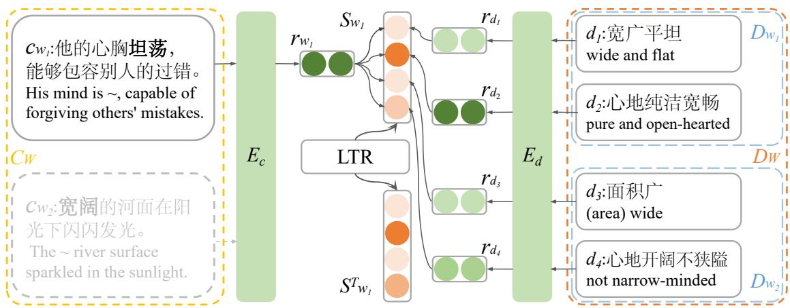
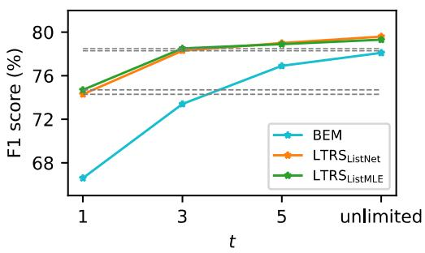
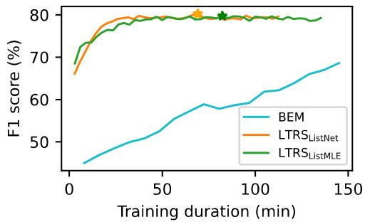

# LTRS: Improving Word Sense Disambiguation via Learning to Rank Senses

Hansi Wang1,2, Yue Wang1,2, Qiliang Liang1,2, Yang Liu1,2

1National Key Laboratory for Multimedia Information Processing, Peking University

2School of Computer Science, Peking University

wanghansi2019@pku.edu.cn, wyy209@pku.edu.cn, lql.pkucs@gmail.com, liuyang@pku.edu.cn

## Abstract

Word Sense Disambiguation (WSD) is a fundamental task critical for accurate semantic understanding. Conventional training strate gies usually only consider predefined senses for target words and learn each of them from relatively limited instances, neglecting the influence of similar ones. To address these problems, we propose the method of Learning to Rank Senses (LTRS) to enhance the task. This method helps a model learn to represent and disambiguate senses from a broadened range of instances via ranking an expanded list of sense definitions. By employing LTRS, our model achieves a SOTA F1 score of 79.6% in Chinese WSD and exhibits robustness in low-resource settings. Moreover, it shows excellent training efficiency, achieving faster convergence than previous methods. This provides a new technical approach to WSD and may also apply to the task for other languages1.

## 1 Introduction

Word Sense Disambiguation (WSD) aims to identify the sense of words in context(Navigli, 2009), which is critical for accurate semantic understanding and beneficial to multiple downstream applications, such as Information Retrieval (Blloshmi et al., 2021), Text Summarization (Kouris et al., 2021), Machine Translation (Emelin et al., 2020). In recent years, integrating lexical knowledge, such as sense definitions, within neural architectures has successfully enhanced the performance of supervised WSD methods (Huang et al., 2019; Blevins and Zettlemoyer, 2020; Barba et al., 2021a,b).

Although these methods have achieved decent results, a significant performance drop remains between the most frequent senses (MFS) and the less frequent senses (LFS). This can be attributed to the imbalance in training data, where LFS are seldom represented as positive senses, hindering effective learning for them. Some methods have attempted to tackle this problem by specifically annotating more instances for LFS (Blevins et al., 2021) or balancing the learning between MFS and LFS by loss reweighting (Su et al., 2022). However, it is labor-intensive and time-consuming to acquire instances for rare senses, while loss reweighting may lead to overfitting due to insufficient data for LFS.

We observe that, from a linguistic perspective, words holding similar senses tend to appear in similar contexts, indicating that instances for a sense may benefit the learning of similar senses. For example, as shown in Table 1, the sense "宽阔 ((area) wide)" and "坦荡1 (wide and flat)", "宽 阔2 (not narrow-minded)" and "坦荡2 (pure and open-hearted)" are close with similar contexts for exploration. This phenomenon is also evident in other languages, such as "wide" and "broad" in English, as shown in Table 2. This again suggests that leveraging sense similarity may enhance WSD.

However, conventional training strategies may neglect the influence of similar senses (Erk et al., 2013), as they usually only consider predefined senses for target words and treat all of them equally. To address these problems, Learning to Rank (LTR) methods, widely applied in fields such as Recommendation Systems (Karatzoglou et al., 2013) and Information Retrieval (Liu et al., 2009), may be helpful. By employing LTR, models can effectively distinguish among highly similar, moderately similar, and dissimilar objects to a given query. Compared to query-object pairs used in the above-mentioned fields, this may also apply to word-definition pairs needed in WSD scenarios.

Based on these considerations, we are motivated to enhance WSD by adjusting the learning process and propose the method of Learning to Rank Senses (LTRS). At training time, the model is encouraged to rank sense definitions according to their semantic similarity with the target word. Additionally, the candidate definition list is expanded by including definitions from other words. In this way, the model can learn to represent and disambiguate senses from a broadened range of instances, which is especially helpful for LFS.

<table><tr><td></td><td>Word Sense ID</td><td>Sense Definition</td><td>Context</td></tr><tr><td rowspan="3">宽阔</td><td rowspan="3">宽阔1</td><td>面积广</td><td>～的河面在阳光下闪闪发光。</td></tr><tr><td>(area) wide</td><td>The ~ river surface sparkled in the sunlight.</td></tr><tr><td>心地开阔不狭隘</td><td>他有着～的胸襟，能容纳不同的意见。</td></tr><tr><td rowspan="3"></td><td rowspan="3">宽阔2 坦荡1</td><td>not narrow-minded</td><td>He has a ~ mind that can accommodate different opinions.</td></tr><tr><td>宽广平坦</td><td>～的大路在阳光的照耀下延伸到远方。</td></tr><tr><td>wide and flat</td><td>The ~ road stretches into the distance under the shining sun.</td></tr><tr><td rowspan="2">坦荡</td><td>坦荡2</td><td>心地纯洁宽畅</td><td> $\mathbb { H } \bot A . \bot \bot \bot A g \sim$  能够包容别人的过错。</td></tr><tr><td></td><td>pure and open-hearted</td><td>His mind is ~, capable of forgiving others&#x27; mistakes.</td></tr></table>

Table 1: Senses for "宽阔" and "坦荡", from the sense inventory WrdInv of MiCLS (Wang et al., 2024).
<table><tr><td></td><td></td><td>Word Sense ID Sense Definition</td><td>Context</td></tr><tr><td>wide</td><td>wide1 wide2</td><td>including a large number or variety of things The store offers a ~ range of goods.</td><td>measuring a lot from one side to the other The river was so ~ that it took an hour to row across it.</td></tr><tr><td>broad</td><td>broad1 wide</td><td></td><td>The ~ street was lined with trees.</td></tr><tr><td></td><td></td><td>broad2 including a great variety of things</td><td>The company has a ~ range of products.</td></tr></table>

Table 2: Senses for "wide" and "broad", from Oxford English Dictionary (Dictionary, 1989).

By employing LTRS, our model outperforms previous top-performing models in Chinese WSD and exhibits robustness in low-resource settings. Furthermore, it also achieves better training efficiency than the previous. Considering the generality of these linguistic issues, this method may also apply to the task for other languages.

## 2 Related Works

WSD Methods: Recent supervised neural WSD methods have achieved decent performance by leveraging lexical knowledge bases (Bevilacqua et al., 2021), with incorporating definitional (Huang et al., 2019; Blevins and Zettlemoyer, 2020; Barba et al., 2021a,b), relational (Vial et al., 2019; Bevilacqua and Navigli, 2020; Wang and Wang, 2020; Song et al., 2021; Zhang et al., 2022), and morphological (Zheng et al., 2021; Wang et al., 2024) knowledge. Some methods have further improved the performance on LFS by annotating more instances for them (Blevins et al., 2021) or adopting Z-reweighting (Su et al., 2022). However, these methods only consider predefined senses for target words and learn each from relatively limited instances, potentially preventing models from fully leveraging sense similarity.

LTR Methods: Existing methods fall into three categories: Pointwise methods (Crammer and Singer,

2001; Li et al., 2007) independently optimize the similarity score of each query-object pair ignoring relationships between objects; Pairwise methods (Burges et al., 2005; Cao et al., 2006) improve it by modeling preferences between two objects but overlook their global positions; Listwise methods (Cao et al., 2007; Xia et al., 2008) focus on the overall order of all objects rather than individual objects or pairs. Listwise methods are more appropriate for WSD than the others, since the most suitable sense needs to be identified while ensuring similar ones with relatively high global positions.

## 3 Methodology

## 3.1 Task Formulation

We frame WSD as a multi-class classification task. Given a polysemous word w in context $c _ { w } .$ , a WSD system needs to identify the most suitable sense definition from $D _ { w } = \{ d _ { i } \} _ { i = 1 } ^ { l }$ , the sense definition set for w. To find this targeting definition, our method requires a function f for mapping a $( w , d )$ pair to a similarity score s. At prediction time, the most suitable definition for w is determined as:

$$
\hat { d } = \arg \operatorname* { m a x } _ { d } f \left( w , d \right) , \mathrm { w h e r e } d \in D _ { w } .\tag{1}
$$

## 3.2 WSD Enhanced by LTRS

The general idea of LTRS is to help a model learn to rank definitions based on their semantic similarity with the target word. The overall architecture of our method is shown in Figure 1. Specifically, given a mini-batch of target words W = $\{ w _ { i } \} _ { i = 1 } ^ { m }$ and corresponding contexts $C _ { W } = \{ c _ { w _ { i } } \} _ { i = 1 } ^ { m } ,$ , we devise a unified definition set $\textstyle D _ { W } = \bigcup _ { i = 1 } ^ { m } D _ { w _ { i } }$ . A context encoder $E _ { c }$ and a definition encoder $E _ { d }$ are used to get the representation $\mathbf { r } _ { w }$ for each $w \in W$ and $\mathbf { r } _ { d }$ for each $d \in D _ { W }$ , respectively. Both encoders are initialized with the pre-trained model BERT (Devlin et al., 2019). Their inputs are padded with the BERT-specific classification token [CLS] and separator token [SEP]. In addition, the target word in context inputs is replaced by a [MASK] to enhance generalization. We obtain $\mathbf { r } _ { w }$ from the output embedding of [MASK] and $\mathbf { r } _ { d }$ from that of [CLS].

  
Figure 1: Illustration of the proposed LTRS: the model is required to rank an expanded list of sense definitions according to their semantic similarity with the target word (shown in bold). In this way, it learns to represent and disambiguate senses of target words from instances for similar senses, such as "宽阔" and "他的心胸～，能够包 容别人的过错 (His mind is \~, capable of forgiving others’ mistakes)".

For each $w ~ \in ~ W$ , the predicted score list of candidate definitions is defined as $\begin{array} { r l } { S _ { w } } & { { } = } \end{array}$ $[ \phi ( \mathbf { r } _ { w } , \mathbf { r } _ { d _ { i } } ) ] _ { i = 1 } ^ { | D _ { W } | }$ , where $\begin{array} { r } { \phi ( \mathbf { r } _ { w } , \mathbf { r } _ { d _ { i } } ) ~ = ~ \frac { \mathbf { r } _ { w } \cdot \mathbf { r } _ { d _ { i } } } { \| \mathbf { r } _ { w } \| \| \mathbf { r } _ { d _ { i } } \| } } \end{array}$ and $d _ { i } \in D _ { W }$

To evaluate $S _ { w } ,$ we compare it with the ground truth score list $S _ { w } ^ { \mathrm { T } }$ . Based on the semantic equivalence between w and the correct definition $d ^ { * }$ the ground truth score for $( w , d )$ can be measured by the similarity score between $d ^ { * }$ and d. To compute the similarity score, we apply a sentence embedding model BGE (Xiao et al., 2024), which has achieved SOTA performance on many Semantic Textual Similarity (STS) tasks. Formally, $S _ { w } ^ { \mathrm { T } } = [ \phi ( E ( d ^ { \ast } ) , E ( d _ { i } ) ) ] _ { i = 1 } ^ { | D _ { W } | }$ , where E is a BGE encoder.

To help the model learn ranking knowledge from the ground truth scores, two listwise LTR methods ListNet (Cao et al., 2007) and ListMLE (Xia et al., 2008) are utilized:

ListNet aims to minimize the cross entropy between the top one probability2 distribution and the ground truth. Given the score list of all definitions $S = [ s _ { i } ] _ { i = 1 } ^ { n }$ , the top one probability of definition i represents the probability of its being ranked at top-1, calculated as: $\begin{array} { r } { \dot { P s ( i ) = } \frac { e ^ { s _ { i } / \tau } } { \sum _ { j = 1 } ^ { n } e ^ { s _ { j } / \tau } } } \end{array}$ , where $\tau$ is a temperature hyperparameter for smoothing the distribution. The objective of ListNet is defined as:

$$
\mathcal { L } _ { \mathrm { L i s t N e t } } = - \sum _ { i = 1 } ^ { | S _ { w } | } P _ { S _ { w } ^ { T } } ( i ) \log P _ { S _ { w } } ( i ) .\tag{2}
$$

We use different temperature hyperparameters for $S _ { w }$ and $S _ { w } ^ { T }$ , denoted by $\tau _ { 1 }$ and $\tau _ { 2 }$

ListMLE aims to maximize the log-likelihood of the ground truth permutation for the definition indexes $\pi ^ { T } = [ \pi ^ { T } ( i ) ] _ { i = 1 } ^ { | S _ { w } ^ { T } | }$ , which represents definition $\pi ^ { T } ( i )$ is ranked i-th. The objective of ListMLE is defined $\mathrm { a s } ^ { 3 }$

$$
\mathcal { L } _ { \mathrm { L i s t M L E } } = - \log \prod _ { i = 1 } ^ { k } \frac { e ^ { s _ { \pi T ( i ) } / \tau _ { 3 } } } { \sum _ { j = i } ^ { | S _ { w } ^ { T } | } e ^ { s _ { \pi ^ { T } ( j ) } / \tau _ { 3 } } } ,\tag{3}
$$

where $s _ { \pi ^ { T } ( \cdot ) } \in S _ { w } , \tau _ { 3 }$ is a temperature hyperparameter, k $( < | S _ { w } ^ { T } | )$ is a hyperparameter for efficiency consideration4.

## 4 Experiment and Analysis

## 4.1 Experimental Settings

Datasets: We fuse FiCLS (Zheng et al., 2021) and MiCLS (Wang et al., 2024) to increase the data volefficiency consideration.

3In practice, in order for the model to place greater emphasis on higher-ranked senses, the losses for higher rankings are assigned higher weights based on $S _ { w } ^ { \mathrm { T } }$

4The original permutation probability is calculated with $k = | S _ { w } ^ { T } |$ . Since we mainly focus on the top few closest senses, k is introduced to reduce computational complexity.

<table><tr><td rowspan="2"></td><td rowspan="2">Valid</td><td colspan="4">Test</td></tr><tr><td>Noun</td><td>Verb</td><td>Adj.</td><td>Adv. ALL</td></tr><tr><td>MFS BERT</td><td>42.3 73.2</td><td>46.2 74.7</td><td>39.9 72.5</td><td>39.9 32.5 74.4 71.1</td><td>42.1 73.2</td></tr><tr><td>GlossBERT BEM</td><td>75.8</td><td>75.6</td><td>76.2</td><td>75.6 73.3</td><td>75.5</td></tr><tr><td>FormBERT</td><td>78.3 77.6</td><td>78.4 77.2</td><td>78.7 77.4</td><td>78.1 73.2 78.8 75.5</td><td>78.1 77.4</td></tr><tr><td>ESCHER</td><td>78.3</td><td></td><td></td><td></td><td></td></tr><tr><td></td><td></td><td>76.7</td><td>78.9</td><td>79.6 75.6</td><td>77.9</td></tr><tr><td></td><td></td><td></td><td></td><td></td><td></td></tr><tr><td> $\mathrm { L T R S } _ { \mathrm { L i s t N e t } }$ </td><td>80.2</td><td>78.5</td><td>80.8</td><td>77.3</td><td>79.6</td></tr><tr><td> $\mathrm { L T R S } _ { \mathrm { L i s t M L E } }$ </td><td>79.7</td><td>78.6</td><td>80.2</td><td>80.6 80.0 78.5</td><td>79.3</td></tr></table>

Table 3: Comparison of F1 scores (%) for Chinese WSD. The best results are shown in bold.

ume and sense coverage, providing more effective training and validation for our method. The new dataset contains 96829 instances, covering 88.1% of polysemous words and 77.9% of their senses in $\mathrm { C C D } ^ { 5 }$ . We divide the new dataset into training, validation, and test sets by 7:1:2. More details about this sourced dataset are shown in Appendix A.

Baselines: Besides MFS and BERT (Devlin et al., 2019) as default baselines, we compare LTRS with four recent top-performing systems6, including GlossBERT (Huang et al., 2019), BEM (Blevins and Zettlemoyer, 2020), FormBERT (Zheng et al., 2021) and ESCHER (Barba et al., 2021a), with the same settings as our model for a fair comparison.

Experimental Configuration: We adopt chinesebert-base-wwm-ext (Cui et al., 2020) as the base model and bge-large-zh-v1.5 (Xiao et al., 2024) for computing the ground truth scores. The settings of the two models and other detailed configurations are shown in Appendix B.

## 4.2 Evaluation Results

Overall Results: Table 3 shows the overall results for Chinese WSD across the main parts-of-speech (PoS). From it, we have the following observations:

(1) By LTRS, our model achieves the best F1 score of the test set and surpasses all competitors across all PoS. Compared to BEM, $\mathrm { L T R S } _ { \mathrm { L i s t N e t } }$ and $\mathrm { L T R S } _ { \mathrm { L i s t M L E } }$ outperforms it by 1.5 and 1.2 F1 points respectively with the same bi-encoder architecture. This can be attributed to the enhanced learning of sense representation and disambiguation from a broadened range of instances via ranking an expanded list of sense definitions.

<table><tr><td></td><td>|MFS LFS|</td><td>|Zero-shot</td></tr><tr><td>BEM</td><td>86.3 71.6</td><td>62.3</td></tr><tr><td>ESCHER</td><td>87.1 70.8</td><td>57.6</td></tr><tr><td> $\mathrm { L T R S } _ { \mathrm { L i s t N e t } }$ </td><td>85.6 75.3</td><td>70.0</td></tr><tr><td> $\mathrm { L T R S } _ { \mathrm { L i s t M L E } }$ </td><td>85.9 74.6</td><td>69.3</td></tr></table>

Table 4: Comparison of LTRS against its competitors on MFS, LFS, and Zero-shot subsets of the test set.
<table><tr><td>t</td><td>Instances</td></tr><tr><td>1</td><td>19277</td></tr><tr><td>3</td><td>43844</td></tr><tr><td>5</td><td>55883</td></tr><tr><td>unlimited</td><td>67780</td></tr></table>

Table 5: Number of training instances at different values of t.

(2) $\mathrm { L T R S } _ { \mathrm { L i s t N e t } }$ and $\mathrm { L T R S } _ { \mathrm { L i s t M L E } }$ achieve relatively consistent results across all sets and PoS, validating the effectiveness of both LTR methods. Results in Low-resource Settings: To better understand the overall results, we also consider three subsets of the test set: (i) instances for MFS, (ii) instances for LFS, and (iii) zero-shot instances for unseen senses during training. As shown in Table 4, LTRS introduces significant improvements over its competitors on LFS and Zero-shot, validating the robustness of our method in low-resource settings. This is also due to our method’s ability of learning senses from other instances in the mini-batch. Despite slightly lower performance on MFS, its exceptional capability in low-resource scenarios contributes to the improvements on the whole.

Separate Results on FiCLS and MiCLS: To address the problem of reproducibility and comparison with other papers, we conduct separate training and evaluation on MiCLS and FiCLS. Detailed results are shown in Appendix C, which indicate that LTRS still outperforms its competitors and demonstrate the effectiveness of our method.

Case Study: A case study (detailed in Appendix D) is conducted to further explore the reasons for the promising performance of LTRS, which shows that it can leverage definitional knowledge and instances more fully and effectively.

## 4.3 Few-Shot Evaluation

We compare LTRS and BEM in a few-shot scenario with $t \in \{ 1 , 3 , 5$ , unlimited} training instances per sense. The number of instances during training for each t is shown in Tabel 5.

As shown in Figure 2, all models achieve better

  
Figure 2: F1 scores (%) of BEM and LTRS on the test set, when varying t.

<table><tr><td></td><td>|Test</td></tr><tr><td>BEM w/ BERT-base BEM w/ BGE-base</td><td>78.1 78.7</td></tr><tr><td>BEM w/ BGE-large</td><td>79.8</td></tr><tr><td> $\mathrm { L T R S } _ { \mathrm { L i s t N e t } }$  w/ BERT-base  $\mathrm { L T R S } _ { \mathrm { L i s t M L E } }$  w/ BERT-base</td><td>79.6 79.3</td></tr></table>

Table 6: F1 scores (%) of LTRS and BEM based on different pre-trained models.

F1 scores as t increases. However, LTRS makes more efficient use of training data and achieves similar results to the strongest BEM with only 3 instances per sense.

## 4.4 Analysis on the Contribution of BGE

To analyze the contribution of BGE apart from LTRS, we conduct additional experiments to evaluate the performance of BGE-based BEM. Two BGE models with different sizes are employed: bgebase-zh-v1.5 and bge-large-zh-v1.5 (Xiao et al., 2024). Detailed settings of them are provided in Table 10. As shown in Table 6, LTRS significantly outperforms BEM based on BGE-base, indicating that the performance gains are primarily due to the LTR strategy. Notably, LTRS achieves performance comparable to BEM based on BGE-large while using only approximately one-third of its fine-tuned parameter quantity.

## 4.5 Analysis on Batch Size

We conduct additional experiments to investigate the impact of the definition batch size. Results on the test set for various batch sizes are presented in Table 7, showing that the larger the batch size, the better LTRS performs. A possible reason for this is that with a larger batch size, the model can learn more similarity knowledge between senses. However, its setting is constrained by memory.

<table><tr><td></td><td>Batch Size 64 128 256</td><td></td></tr><tr><td>LTRSListNet</td><td>79.2</td><td>79.5 79.6</td></tr><tr><td>LTRSListMLE</td><td></td><td>78.7 79.3 79.3</td></tr></table>

Table 7: Comparison of different batch sizes for LTRS.

  
Figure 3: Training curves of BEM and LTRS. The best performance of each model is denoted by a star.

## 4.6 Analysis on Training Efficiency

We further compare LTRS and BEM on training efficiency, with the same experimental settings introduced in Appendix B. Figure 3 shows that our model achieves the best validation performance within 100 minutes, noticeably faster than BEM. This can be attributed to the varying number of senses for each word, which limits BEM’s parallel processing. In our method, a unified sense definition set is devised to effectively tackle this issue. Compared to BEM’s 24.2 minutes per epoch, $\mathrm { L T R S } _ { \mathrm { L i s t N e t } }$ and $\mathrm { L T R S } _ { \mathrm { L i s t M L E } }$ need only 9.6 and 9.8 minutes, respectively. In addition, LTRS provides more learning opportunities per epoch for the senses, which helps to accelerate convergence.

## 5 Conclusion

In this paper, we propose the LTRS method to enhance WSD. By ranking an expanded list of sense definitions, the model can learn to represent and disambiguate senses from a broadened range of instances. Our model achieves a SOTA F1 score of 79.6% in Chinese and exhibits robustness in lowresource settings. Moreover, it shows excellent training efficiency, achieving faster convergence than previous methods.

This method provides a novel technical approach to WSD. In the near future, we will go further to evaluate it in more languages, particularly focusing on low-resource settings such as LFS, few-shot, and zero-shot, considering that manually annotated data may be relatively scarce in some low-resource languages.

## 6 Limitations

Despite achieving promising results, there remain some limitations of our method as follows:

(1) The superior performance of LTRS is related to the lexical sample WSD datasets we employed, which include a relatively high proportion of LFS and zero-shot senses. Our method evidently excels in disambiguating these types of senses, resulting in significant performance gains on the whole. However, in other benchmarks where the proportions of lower frequent senses are comparatively lower, the advantage of LTRS may be less pronounced.

(2) Our method relies on an extra top-performing sentence embedding model, BGE (Xiao et al., 2024) for example, to compute the similarity scores between sense definitions. In low-resource languages, this kind of sentence embedding model may be less accurate for measuring the similarity between definitions, thereby weakening the effectiveness of LTRS.

(3) Similar to previous methods, our method also fails to achieve significant performance gain on words with fine-grained sense categorization. For this scenario, we conduct a detailed case study in Appendix D. To achieve accurate sense disambiguation at this level of granularity, supplementary lexical semantic and syntactic knowledge may be required.

## Acknowledgements

This paper is supported by the National Natural Science Foundation of China (No. 62036001) and the National Social Science Foundation of China (No. 18ZDA295).

## References

Edoardo Barba, Tommaso Pasini, and Roberto Navigli. 2021a. ESC: Redesigning WSD with extractive sense comprehension. In Proceedings of the 2021 Conference of the North American Chapter of the Association for Computational Linguistics: Human Language Technologies, pages 4661–4672, Online. Association for Computational Linguistics.

Edoardo Barba, Luigi Procopio, and Roberto Navigli. 2021b. ConSeC: Word sense disambiguation as continuous sense comprehension. In Proceedings ofthe 2021 Conference on Empirical Methods in Natural Language Processing, pages 1492–1503, Online and Punta Cana, Dominican Republic. Association for Computational Linguistics.

Michele Bevilacqua and Roberto Navigli. 2020. Breaking through the 80% glass ceiling: Raising the state

of the art in word sense disambiguation by incorporating knowledge graph information. In Proceedings of the 58th Annual Meeting of the Association for Computational Linguistics, pages 2854–2864, Online. Association for Computational Linguistics.

Michele Bevilacqua, Tommaso Pasini, Alessandro Raganato, and Roberto Navigli. 2021. Recent trends in word sense disambiguation: A survey. In International Joint Conference on Artificial Intelligence.

Terra Blevins, Mandar Joshi, and Luke Zettlemoyer. 2021. FEWS: Large-scale, low-shot word sense disambiguation with the dictionary. In Proceedings of the 16th Conference of the European Chapter of the Associationfor Computational Linguistics: Main Volume, pages 455–465, Online. Association for Computational Linguistics.

Terra Blevins and Luke Zettlemoyer. 2020. Moving down the long tail of word sense disambiguation with gloss informed bi-encoders. In Proceedings of the 58th Annual Meeting of the Association for Computational Linguistics, pages 1006–1017, Online. Association for Computational Linguistics.

Rexhina Blloshmi, Tommaso Pasini, Niccolò Campolungo, Somnath Banerjee, Roberto Navigli, and Gabriella Pasi. 2021. IR like a SIR: Sense-enhanced Information Retrieval for Multiple Languages. In Proceedings of the 2021 Conference on Empirical Methods in Natural Language Processing, pages 1030–1041, Online and Punta Cana, Dominican Republic. Association for Computational Linguistics.

Chris Burges, Tal Shaked, Erin Renshaw, Ari Lazier, Matt Deeds, Nicole Hamilton, and Greg Hullender. 2005. Learning to rank using gradient descent. In Proceedings of the 22nd International Conference on Machine Learning, ICML ’05, page 89–96, New York, NY, USA. Association for Computing Machinery.

Yunbo Cao, Jun Xu, Tie-Yan Liu, Hang Li, Yalou Huang, and Hsiao-Wuen Hon. 2006. Adapting ranking svm to document retrieval. In Proceedings of the 29th Annual International ACM SIGIR Conference on Research and Development in Information Retrieval, SIGIR ’06, page 186–193, New York, NY, USA. Association for Computing Machinery.

Zhe Cao, Tao Qin, Tie-Yan Liu, Ming-Feng Tsai, and Hang Li. 2007. Learning to rank: from pairwise approach to listwise approach. In Proceedings of the 24th International Conference on Machine Learning, ICML ’07, page 129–136, New York, NY, USA. Association for Computing Machinery.

Koby Crammer and Yoram Singer. 2001. Pranking with ranking. In Advances in Neural Information Processing Systems, volume 14. MIT Press.

Yiming Cui, Wanxiang Che, Ting Liu, Bing Qin, Shijin Wang, and Guoping Hu. 2020. Revisiting pre-trained models for Chinese natural language processing. In

Findings of the Association for Computational Linguistics: EMNLP 2020, pages 657–668, Online. Association for Computational Linguistics.

Jacob Devlin, Ming-Wei Chang, Kenton Lee, and Kristina Toutanova. 2019. BERT: Pre-training of deep bidirectional transformers for language understanding. In Proceedings ofthe 2019 Conference of the North American Chapter ofthe Associationfor Computational Linguistics: Human Language Technologies, Volume 1 (Long and Short Papers), pages 4171–4186, Minneapolis, Minnesota. Association for Computational Linguistics.

Oxford English Dictionary. 1989. Oxford english dictionary. Simpson, Ja & Weiner, Esc, 3.

Denis Emelin, Ivan Titov, and Rico Sennrich. 2020. Detecting word sense disambiguation biases in machine translation for model-agnostic adversarial attacks. In Proceedings of the 2020 Conference on Empirical Methods in Natural Language Processing (EMNLP), pages 7635–7653, Online. Association for Computational Linguistics.

Katrin Erk, Diana McCarthy, and Nicholas Gaylord. 2013. Measuring word meaning in context. Computational Linguistics, 39(3):511–554.

Luyao Huang, Chi Sun, Xipeng Qiu, and Xuanjing Huang. 2019. GlossBERT: BERT for word sense disambiguation with gloss knowledge. In Proceedings of the 2019 Conference on Empirical Methods in Natural Language Processing and the 9th International Joint Conference on Natural Language Processing (EMNLP-IJCNLP), pages 3509–3514, Hong Kong, China. Association for Computational Linguistics.

Alexandros Karatzoglou, Linas Baltrunas, and Yue Shi. 2013. Learning to rank for recommender systems. In Proceedings ofthe 7th ACM Conference on Recommender Systems, RecSys ’13, page 493–494, New York, NY, USA. Association for Computing Machinery.

Panagiotis Kouris, Georgios Alexandridis, and Andreas Stafylopatis. 2021. Abstractive text summarization: Enhancing sequence-to-sequence models using word sense disambiguation and semantic content generalization. Computational Linguistics, 47(4):813–859.

Ping Li, Christopher J. C. Burges, and Qiang Wu. 2007. Mcrank: Learning to rank using multiple classification and gradient boosting. In Neural Information Processing Systems.

Tie-Yan Liu et al. 2009. Learning to rank for information retrieval. Foundations and Trends® in Information Retrieval, 3(3):225–331.

Ilya Loshchilov and Frank Hutter. 2017. Fixing weight decay regularization in adam. ArXiv, abs/1711.05101.

Roberto Navigli. 2009. Word sense disambiguation: A survey. ACM computing surveys (CSUR), 41(2):1– 69.

Yang Song, Xin Cai Ong, Hwee Tou Ng, and Qian Lin. 2021. Improved word sense disambiguation with enhanced sense representations. In Findings of the Associationfor Computational Linguistics: EMNLP 2021, pages 4311–4320, Punta Cana, Dominican Republic. Association for Computational Linguistics.

Ying Su, Hongming Zhang, Yangqiu Song, and Tong Zhang. 2022. Rare and zero-shot word sense disambiguation using Z-reweighting. In Proceedings of the 60th Annual Meeting of the Association for Computational Linguistics (Volume 1: Long Papers), pages 4713–4723, Dublin, Ireland. Association for Computational Linguistics.

Ashish Vaswani, Noam Shazeer, Niki Parmar, Jakob Uszkoreit, Llion Jones, Aidan N. Gomez, Łukasz Kaiser, and Illia Polosukhin. 2017. Attention is all you need. In Proceedings ofthe 31st International Conference on Neural Information Processing Systems, NIPS’17, page 6000–6010, Red Hook, NY, USA. Curran Associates Inc.

Loïc Vial, Benjamin Lecouteux, and Didier Schwab. 2019. Sense vocabulary compression through the semantic knowledge of WordNet for neural word sense disambiguation. In Proceedings of the 10th Global Wordnet Conference, pages 108–117, Wroclaw, Poland. Global Wordnet Association.

Ming Wang and Yinglin Wang. 2020. A synset relationenhanced framework with a try-again mechanism for word sense disambiguation. In Proceedings of the 2020 Conference on Empirical Methods in Natural Language Processing (EMNLP), pages 6229–6240, Online. Association for Computational Linguistics.

Yue Wang, Qiliang Liang, Yaqi Yin, Hansi Wang, and Yang Liu. 2024. Disambiguate words like composing them: A morphology-informed approach to enhance Chinese word sense disambiguation. In Proceedings of the 62nd Annual Meeting of the Association for Computational Linguistics (Volume 1: Long Papers), pages 15354–15365, Bangkok, Thailand. Association for Computational Linguistics.

Fen Xia, Tie-Yan Liu, Jue Wang, Wensheng Zhang, and Hang Li. 2008. Listwise approach to learning to rank: theory and algorithm. In Proceedings of the 25th International Conference on Machine Learning, ICML ’08, page 1192–1199, New York, NY, USA. Association for Computing Machinery.

Shitao Xiao, Zheng Liu, Peitian Zhang, Niklas Muennighoff, Defu Lian, and Jian-Yun Nie. 2024. C-pack: Packaged resources to advance general chinese embedding. Preprint, arXiv:2309.07597.

Guobiao Zhang, Wenpeng Lu, Xueping Peng, Shoujin Wang, Baoshuo Kan, and Rui Yu. 2022. Word sense disambiguation with knowledge-enhanced and local self-attention-based extractive sense comprehension. In Proceedings ofthe 29th International Conference on Computational Linguistics, pages 4061– 4070, Gyeongju, Republic of Korea. International Committee on Computational Linguistics.

Hua Zheng, Lei Li, Damai Dai, Deli Chen, Tianyu Liu, Xu Sun, and Yang Liu. 2021. Leveraging wordformation knowledge for Chinese word sense disambiguation. In Findings of the Association for Computational Linguistics: EMNLP 2021, pages 918–923, Punta Cana, Dominican Republic. Association for Computational Linguistics.

## A Data Statistics

FiCLS (Zheng et al., 2021) and MiCLS (Wang et al., 2024) are currently the two largest available Chinese lexical sample WSD datasets. Both of them use the CCD-origined sense inventory for annotation. However, FiCLS covers limited disyllabic words while MiCLS only covers disyllabic words. So we combine all data targeting polysemous words7 into a new dataset. To unify the sense definitions, all of them are retrieved from WrdInv and MorInv provided by MiCLS.

The data statistics for each source are shown in Table 8. The sourced dataset covers 88.1% of polysemous words and 77.9% of their senses in CCD. We divide it into training, validation, and test sets by 7:1:2. The statistics of these sets are shown in Table 9.

<table><tr><td>Source</td><td>Words</td><td>Senses</td><td>Instances</td></tr><tr><td>FiCLS</td><td>1888</td><td>5997</td><td>36698</td></tr><tr><td>MiCLS</td><td>8126</td><td>14948</td><td>60131</td></tr><tr><td>ALL</td><td>10014</td><td>20945</td><td>96829</td></tr></table>

Table 8: The data statistics for different sources.

<table><tr><td>Split</td><td></td><td></td><td>Words Senses Instances</td><td>Length</td><td>Context Definition Length</td></tr><tr><td rowspan="3">Train Valid Test</td><td>9812</td><td>19277</td><td>67780</td><td>27.5</td><td>11.6</td></tr><tr><td>4883</td><td>6323</td><td>9683</td><td>27.3</td><td>11.4</td></tr><tr><td>6906</td><td>10217</td><td>19366</td><td>27.6</td><td>11.6</td></tr></table>

Table 9: Statistics of the training, validation, and test sets. The length is calculated as the average number of Chinese characters.

## B Experimental Configuration

The settings of the pre-trained models involved in the experiments are shown in Table 10. All of them adopt an architecture based on the Transformer (Vaswani et al., 2017) encoder.

<table><tr><td></td><td>Size</td><td>Layers</td><td>Model Encoder Attention Heads</td><td>Hidden Size</td></tr><tr><td>chinese-bert- base-wwm-ext</td><td>110M</td><td>12</td><td>12</td><td>768</td></tr><tr><td>bge-base-zh- v1.5</td><td>102M</td><td>12</td><td>12</td><td>768</td></tr><tr><td>bge-large-zh- v1.5</td><td>326M</td><td>24</td><td>16</td><td>1024</td></tr></table>

Table 10: The settings of BERT and BGE we employ.

We carry out grid search of temperatures $\tau _ { 1 } , \tau _ { 2 } , \tau _ { 3 } \in \{ 0 . 0 1 , 0 . 0 5 , 0 . 1 , 0 . 2 \} , k \in \{ 3 , 5 , 1 0 \}$ definition batch size ∈ {64, 128, 256}, and select the best combination based on the validation performance. Finally, we set $\tau _ { 1 } , \tau _ { 2 } , \tau _ { 3 }$ to 0.05, and k to 5. The model is finetuned by AdamW (Loshchilov and Hutter, 2017) optimizer for up to 20 epochs with a learning rate of 5e-5. Before the beginning of each epoch, we randomly shuffle the training data. We evaluate the model every 250 training steps on the valid set and keep the best checkpoint for evaluation on the test set.

For the BERT baseline, we finetune a linear classifier on the hidden states of the target word output by a frozen BERT. For BEM, the same settings as our model are adopted. For the other baselines, we uniformly adopt the same pre-trained model as LTRS, and directly follow the experimental configurations described in their original papers for the other settings.

All experiments are conducted with the deep learning framework PyTorch on a single NVIDIA RTX 3090 GPU (43GB memory).

## C Separate Results on FiCLS and MiCLS

The separate results on FiCLS and MiCLS are shown in Table 11. The results appear to be higher than the fusion results because MiCLS intentionally includes some monosemous word data, which may actually be polysemous in the real corpus. In the fusion, we filter out these data to ensure a fair comparison with other models.

## D Case Study

LTRS achieves remarkable performance compared to previous methods, particularly on LFS. To better understand the underlying reasons, we conduct case studies as below:

Take the word "花红" in the context "春节这 天，老板要发放年终～ (On the Spring Festival, the boss will distribute the year-end \~)" as an example. Our model properly identifies the sense "花 $\Xi \mathbb { L } _ { 3 } \ ( b o n u s ) "$ for it, while there are no instances for $" \not { C } \not \equiv \underline { { { \bar { 1 } } } } _ { 3 }$ (bonus)" in the training set. The reason for this is that the model can learn to represent "花 $\Xi \mathbb { T } _ { 3 } ( b o n u s ) ^ { \prime \prime }$ from instances for senses similar to it, such as ${ \mathfrak { w } } \sharp \mathbb { T } \not \equiv \mathbb { I } | _ { 2 }$ (rewards given to employees by the company)" and "奖金1 (money as rewards)". Moreover, when training on these instances, it also learns to differentiate "花红3 (bonus)" from the other senses, including "花红1 (a holiday gift)" and $" \not { M } \not {\in } \not {\Xi } \mathrm { T } _ { 2 }$ (a kind of plant)". This explicit learning helps our model achieve more performance gain. A similar case can also be seen on "解1 (send away under escort)" and its similar sense "监押2 (escort under supervision)".

<table><tr><td rowspan="2"></td><td colspan="4">FiCLS</td><td colspan="6">MiCLS</td></tr><tr><td>Noun</td><td>Verb</td><td>Adj.</td><td>Adv.</td><td>ALL</td><td>|Noun</td><td>Verb</td><td></td><td></td><td>b Adj. Adv. ALL</td></tr><tr><td>MFS BERT</td><td>35.2 74.7</td><td>34.5 71.1</td><td>33.3 72.1</td><td>36.7 64.3</td><td>35.0 71.8</td><td>80.6</td><td>76.5</td><td>71.7</td><td>66.0</td><td>77.6</td></tr><tr><td>GlossBERT BEM</td><td>82.9 73.2</td><td>82.0 72.6</td><td>82.6</td><td>81.9</td><td>84.5</td><td>1 88.4</td><td>一 87.9</td><td>1</td><td>一</td><td>一 87.4</td></tr><tr><td>FormBERT MorBERT</td><td>88.7</td><td>87.7</td><td>74.6 88.5</td><td>66.2 83.1</td><td>72.2 87.6</td><td>93.0</td><td>92.1</td><td>85.1 88.2</td><td>76.3 83.5</td><td>91.9</td></tr><tr><td></td><td></td><td></td><td></td><td></td><td></td><td></td><td></td><td></td><td></td><td></td></tr><tr><td></td><td></td><td></td><td></td><td></td><td></td><td></td><td></td><td></td><td></td><td></td></tr><tr><td></td><td>-</td><td>-</td><td>-</td><td>-</td><td>-</td><td>93.2</td><td>92.5</td><td>88.9</td><td>84.0</td><td>92.2</td></tr><tr><td></td><td></td><td></td><td></td><td></td><td></td><td></td><td></td><td></td><td></td><td></td></tr><tr><td> $\mathrm { L T R S } _ { \mathrm { L i s t N e t } }$ </td><td>88.9</td><td>89.4</td><td>89.3</td><td>85.1</td><td>88.2</td><td>93.7</td><td>93.8</td><td>90.2</td><td>84.9</td><td>93.1</td></tr><tr><td></td><td></td><td></td><td></td><td></td><td></td><td></td><td></td><td></td><td></td><td></td></tr><tr><td> $\mathrm { L T R S } _ { \mathrm { L i s t M L E } }$ </td><td>88.8</td><td>89.0</td><td>89.5</td><td>83.9</td><td>88.0</td><td>93.8</td><td>93.6</td><td>90.6</td><td>85.8</td><td>93.2</td></tr></table>

Table 11: Separate results on the test set of FiCLS and MiCLS. The results of baselines are sourced from the original papers for the two datasets.
<table><tr><td></td><td></td><td>Word Sense ID Sense Definition</td><td>Context</td></tr><tr><td rowspan="3">观览</td><td>观览1</td><td>参观观看 visit and view</td><td>我们前往美术馆～展览，欣赏各种风格迥异的艺术作品。 We went to the gallery to ∼ the exhibition, admiring a variety of</td></tr><tr><td></td><td></td><td>diverse art pieces.</td></tr><tr><td>观览2</td><td>参观游览 visit and tour</td><td>游客纷至沓来，～景点，流连忘返。 Tourists flock to ~ attractions, reluctant to leave.</td></tr><tr><td rowspan="3">重利</td><td>重利₁</td><td>很高的利息 very high interest</td><td>贷款公司因～盘剥而受到广泛批评。 The loan company has been widely criticized for charging ~.</td></tr><tr><td>重利2</td><td>很高的利润 very high profit</td><td>该公司被指控利用不公平竞争手段牟取～。 The company has been accused of using unfair competition tactics</td></tr><tr><td></td><td>原来包装好的</td><td>to reap ~. 在新年宴会上，老板特别准备了几瓶～名酒。</td></tr><tr><td rowspan="2">原装</td><td>原装₁</td><td>originally packaged</td><td>At the New Year&#x27;s banquet, the boss specially prepared several bottles of ~ brand liquor. 我们购买了～彩电，以享受更清晰的画质和更稳定的功能。</td></tr><tr><td>原装2</td><td>原来装配好的 originally assembled</td><td>We purchased an ~ television to enjoy clearer picture quality and more stable features.</td></tr></table>

Table 12: Fine-grained sense categorization for "观览", "重利", and "原装", with extra lexical knowledge and contexts needed for accurate sense disambiguation.

However, similar to previous methods, our method also fails to achieve significant performance gain on words with fine-grained sense categorization. For example, the model misclassifies an instance annotated with the sense "观览 (visit and view)" and assigns "观览 (visit and tour)" to it. This is because the two senses are too similar and difficult to distinguish, as shown in Table 12. In this scenario, BGE tends to output very close ground truth scores for both senses, thereby hindering models’ learning. Similar cases can also be seen on "重利" and "原装" shown in Table 12. To address this problem, extra lexical knowledge and contexts may be needed for accurate sense disambiguation.