# Language Models over Large-Scale Knowledge Base: on Capacity, Flexibility and Reasoning for New Facts

Qiyuan He1 Yizhong Wang2 Jianfei Yu3 Wenya Wang1

1College of Computing and Data Science, Nanyang Technological University

2Paul G. Allen School of Computer Science & Engineering, University of Washington 3School of Computer Science and Engineering, Nanjing University of Science and Technology {qiyuan001,wenya}@ntu.edu.sg yizhongw@cs.uw.edu jfyu@njust.edu.cn

## Abstract

Advancements in language models (LMs) have sparked interest in exploring their potential as knowledge bases (KBs) due to their high capability for storing huge amounts of factual knowledge and semantic understanding. However, existing studies face challenges in quantifying the extent of large-scale knowledge packed into LMs and lack systematic studies on LMs’ structured reasoning capabil ities over the infused knowledge. Addressing these gaps, our research investigates whether LMs can effectively act as large-scale KBs after training over an expansive set of world knowledge triplets via addressing the following three crucial questions: (1) How do LMs of different sizes perform at storing world knowledge of different frequencies in a large-scale KB? (2) How flexible are these LMs in recalling the stored knowledge when prompted with natural language queries? (3) After training on the abundant world knowledge, can LMs additionally gain the ability to reason over such information to infer new facts? Our findings indicate that while medium-scaled LMs hold promise as world knowledge bases capable of storing and responding with flexibility, enhancements in their reasoning capabilities are necessary to fully realize their potential.1

## 1 Introduction

In recent years, the focus of language models (LMs) has shifted from “language generation” to “task solving”. Meanwhile, the scaling law (Kaplan et al., 2020) and the emergent ability (Wei et al., 2022) further push for training corpora and model architectures of larger scales. This results in many large LMs that have shown good performances on various complex tasks. Existing studies have found that LMs, after pre-training, can encode a large amount of factual knowledge as well as implicit linguistic knowledge from the general corpus, making them a crucial component for tasks that require natural language understanding (Bommasani et al., 2022; Li et al., 2022a). This leads to the potential of using LMs as knowledge sources (Petroni et al., 2019; AlKhamissi et al., 2022). Existing studies mainly focus on probing (Li et al., 2022b; Chen et al., 2022; Sung et al., 2021) and utilizing (Roberts et al., 2020; Moiseev et al., 2022) LMs knowledge gained from pre-training. However, due to knowledge imbalance, conflict, and noise in the pre-trained corpora (Carlini et al., 2023; Razeghi et al., 2022; Tänzer et al., 2022), LMs show deficiencies when handling long-tail, less frequently appeared knowledge (Kandpal et al., 2023). In addition, these large corpora are mostly represented in free form without a clear specification of knowledge, making it difficult to quantify how much knowledge has been packed into the pre-trained LMs, hence posing greater difficulties in evaluating their reasoning ability over the learned knowledge.

To explicitly study how LMs handle diverse world knowledge, we resort to knowledge bases (KBs) which are commonly utilized in many knowledge-intensive tasks such as dialogue (Li et al., 2022c; Galetzka et al., 2021), question answering (Baek et al., 2023; Saxena et al., 2020; Qiu et al., 2020) and recommendation systems (Wu et al., 2013). KBs are known for their ability to compactly organize information on a large scale, providing much cleaner and more balanced knowledge than natural language corpora. However, most existing solutions to knowledge-intensive tasks rely on extra models to handle external KBs (Cordella et al., 2004; Grohe and Schweitzer, 2020; Lan and Jiang, 2020; Bhutani et al., 2019), leading to two major drawbacks: the rigid structure of KBs limits the flexibility of knowledge query formats, and, the representations of KBs lie in a different embedding space from the embeddings of the LMs thus making it challenging to effectively combine them.

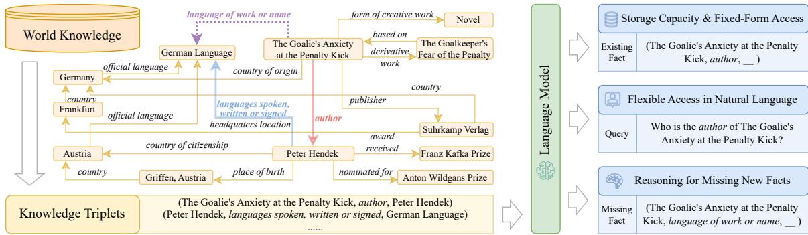  
Figure 1: A simple illustration of our study on LMs for world knowledge. Here, the dotted purple line indicates a missing fact that can be deduced using the red line and blue line.

In this work, we propose to infuse Wikidata (Pellissier Tanon et al., 2016), the largest world knowledge KB to date, into LMs with minimal data processing, and systematically investigate LMs’ potential as functional KBs from the aspects of storage capacity, access flexibility and reasoning ability, as illustrated in Fig. 1. Specifically, we aim to answer the following research questions:

(RQ1) How fast and how well can LMs of different sizes memorize world knowledge of different frequencies through training?

(RQ2) Are these LMs flexible in handling natural language queries over their stored knowledge, after being trained with structured knowledge triplets?

(RQ3) How do these LMs reason over the stored knowledge when inferring new knowledge that does not exist in the KB?

We differentiate our work from existing studies along this direction that (1) mainly target much smaller KBs of popular facts (Heinzerling and Inui, 2021; Wang et al., 2021) that might largely overlap with the internal pre-trained knowledge in LMs, and hence inconclusive to demonstrate LMs’ capacity over the KB; (2) convert knowledge triplets to synthetic sentences using manually curated templates (Heinzerling and Inui, 2021; Petroni et al., 2019) which only works for a limited set of relations; (3) lack a systematic study on LMs’ capability in performing KB tasks such as inferring new facts using existing facts in KBs.

We start by proposing an efficient learning algorithm based on importance sampling (Alain et al., 2016; Katharopoulos and Fleuret, 2018; Zhang et al., 2019) to train LMs to memorize knowledge more efficiently. To answer (RQ1), we evaluate the memorization capacity of LMs of different sizes as well as their performances on both popular and long-tail world knowledge. We observe that LMs are capable of memorizing information from a large-scale KB, with larger models learning faster. In addition, infrequent knowledge is more challenging to memorize, irrespective of the size of the LMs. We also realize that increasing the size of LLaMA-2 from 7B to 13B doesn’t yield a significant performance boost, suggesting that an entry-level large LM is already capable of storing the majority of world knowledge.

To answer (RQ2), we further finetune the trained LMs using PopQA (Mallen et al., 2023), a natural language QA dataset that requires long-tail Wikidata knowledge. With minimal finetuning, these LMs demonstrate superior performance over their counterpart, which are not trained on Wikidata KB. This indicates the power of LMs in flexibly retrieving and organizing long-tail knowledge, regardless of the presentation form, unveiling their potential for responding to various forms of user queries.

To answer (RQ ), we use a dataset published by Veseli et al. (2023) containing factual knowledge missing from Wikidata and further curate two sets of missing facts focusing on inverse reasoning (switching the positions of the subject and object) and compositional reasoning (conjoining two relations to form a new one) to study LMs’ inherent reasoning capabilities in addition to memorizing existing facts. Our results show that LMs are capable of inferring missing entities from existing knowledge to some extent via reasoning. However, they struggle with inverse reasoning more often than compositional reasoning, advocating for further investigations and explorations. We also notice that increasing the model size of the same model family does not yield significant improvement; this suggests that the true bottleneck of using LMs as large-scale KBs is their ability to reason over such information, which calls for further improvement.

In conclusion, our study delves into the potential of LMs over large-scale KBs using Wikidata and systematically evaluates their capacity to store KB knowledge, flexibility of query forms when accessing KB knowledge, and reasoning ability involved when inferring facts amiss from the given KB. We present the following key observations: (1) From the perspective of packing large-scale KBs into LMs, the LLaMA-2-7b model is sufficient when it comes to capacity and scaling to LLaMA-2-13b does not provide significant benefits; (2) In terms of query flexibility, the performance gains are limited by the storage capacity of models. Increasing model size has diminishing returns when storage capacity is sufficient; (3) When using stored KB knowledge to infer new facts, the type of reasoning involved can lead to distinct performance patterns, suggesting the underlying complexity for LMs to effectively utilize stored information.

## 2 Related Work

## 2.1 Infusing Knowledge into LMs

The idea of using LMs as KBs was first introduced by (Petroni et al., 2019), who demonstrated that LMs can recall factual information to a certain extent. Since then, various studies have explored enhancing this capacity through techniques such as fine-tuning and optimization for specific downstream tasks like question answering (QA). For instance, methods like salient span masking (Montañés-Salas et al., 2022), augmented learning objectives (Verga et al., 2020), and architectural modifications (Yasunaga et al., 2022; Zhang et al., 2021) have been proposed to improve the retrieval of stored knowledge for open-domain QA tasks. These studies often operate on a smaller subset of world knowledge: LAMA (Petroni et al., 2019) and WikiData5M (Wang et al., 2021) have been prominent resources, but they are constrained in scope, representing only a subset of larger, more comprehensive KBs like Wikidata. In addition, previous studies have often employed template-based synthetic sentences to represent knowledge triplets (Heinzerling and Inui, 2021; Petroni et al., 2019), which is limited in scope, covering only a narrow set of relations.

## 2.2 Probing LMs for Existing Knowledge

Probing techniques have been a primary method for extracting knowledge stored in LMs, given that LMs are sensitive to input variations (Jiang et al., 2020; Elazar et al., 2021). Many studies have explored how syntactic variations in queries can significantly alter the outputs of LMs (Longpre et al., 2021). For instance, Li et al. (2022b) investigated unsupervised methods for knowledge extraction in grounded conversation, while Alivanistos et al. (2023) utilized prompt engineering and postprocessing to extract embedded knowledge from LMs. Other studies focused on probing specific knowledge types, such as commonsense (Davison et al., 2019), metaphors (Chen et al., 2022), and domain-specific knowledge like biomedical facts (Sung et al., 2021).

## 3 Training LMs on Large-Scale KB

## 3.1 Wolrd Knowledge KB

A basic KB is a collection of facts in the form of (subject, relation, object) triplets, for example, Freebase (Bollacker et al., 2008) and DBPedia (Auer et al., 2007). To study the memorization capacity of LMs at a large scale, we consider Wikidata (Pellissier Tanon et al., 2016), one of the largest KBs to date that is actively maintained by the community. Compared with pre-training corpora, Wikidata contains abundant world knowledge in a more compact and accurate form, covering both popular and long-tail knowledge that appears less frequently in the pre-training corpora of LMs.

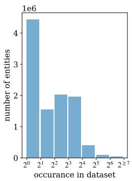  
(a) $\mathcal { D } _ { 0 }$ entity distribution.

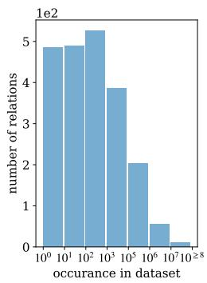  
(b) $\mathcal { D } _ { 0 }$ relation distribution.  
Figure 2: Distributions of entity and relation in world knowledge $\mathcal { D } _ { 0 }$ , with significant amounts of long-tail.

When preparing the KB dataset, we use the cleaned knowledge taken from the 2022 January snapshot of Wikidata dump (Kaiser and Christmann, 2021) to avoid knowledge irrelevant to common question-and-answer. After filtering, we obtain a dataset of 46M triplets in the form of (subject, relation, object), with the distribution of 10.5M entities (subjects or objects) and 2,157 relations shown in Fig. 2a and Fig. 2b. We denote this dataset as $\mathcal { D } _ { 0 }$ . Four frequency-based knowledge datasets, $\mathcal { D } _ { R e l } ^ { + } , \mathcal { D } _ { E n t } ^ { + } , \mathcal { D } _ { R e l } ^ { - }$ , and $\mathcal { D } _ { E n t } ^ { - }$ , are derived to study model performance on entities and relations based on their frequency in $\mathcal { D } _ { 0 }$ . They include samples from the top 5% most frequent (popular) and the tail 15% least frequent (long-tail) entities and relations, as detailed in Appendix A.

## 3.2 Model Setup

When studying the capabilities of LMs, we need to cover models of different architectures and scales. Specifically, we choose the following representative models: the encoder-decoder model T5 (Raffel et al., 2020) and the decoder-only model LLaMA-2 (Touvron et al., 2023), each with two different sizes: T5-base, T5-large, LLaMA-2-7b, and LLaMA-2- 13b. These models are less exposed to newer, more diverse datasets with higher knowledge coverage used in more recent LMs, which makes them ideal for our study: their relatively limited exposure to world knowledge allows us to better investigate their memorization capacity and reasoning ability without the confounding influence of pre-training knowledge. Starting from their pre-trained checkpoints, we continue training these models on $\mathcal { D } _ { 0 }$

For each knowledge triplet in the form of (subject, relation, object), we create an input string by concatenating the prefix “Subject:” followed by the subject text, the prefix “Relation:” followed by the relation text and the prefix “Object:”, and use the object text as the output. For example, given the knowledge triplet (“Palaeontological Museum, Munich”, architect, “Leonhard Romeis”), the input to the LMs is “Subject: Palaeontological Museum, Munich. Relation: architect. Object:” and the expected output is the object “Leonhard Romeis”.

The training objective is to maximize the probability of generating the correct object: $p _ { L M } ( x _ { o u t } | x _ { i n } )$ where $x _ { o u t }$ is the object text and $x _ { i n }$ is the input text. $p _ { L M }$ denotes the probability distribution given by the language model.2

## 3.3 Importance Sampling

With the goal of injecting abundant and diverse information from large-scale KB information into LMs, it is imperative for the model to converge to a state where it can, in an ideal scenario, memorize every triplet within the training dataset. Traditional training process iterates through each data sample precisely once during each epoch, inherently treating all data with uniform importance. However, this approach leads to extended training durations and reduced convergence efficiency, particularly when dealing with large-scale KBs containing a significant amount of hard-to-memorize knowledge. To address this issue, inspired by the importance sampling algorithm proposed by Alain et al. (2016) and Katharopoulos and Fleuret (2018), we allocate distinct importance weights to the training samples within $\mathcal { D } _ { 0 }$ . The importance weight is proportional to the prediction loss of each sample, serving as a measure of its memorization difficulty. This strategy prioritizes samples that are more challenging to memorize by assigning them greater importance, thereby increasing their likelihood of selection during each training iteration, leading to faster convergence speed (Zhang et al., 2019; Xie et al., 2023).

Algorithm 1 Knowledge infusion with importance   
sampling   
Require: knowledge samples with importance   
$\mathcal { D } = \{ ( x _ { 1 } , y _ { 1 } ; w _ { 1 } ) , . . . , ( x _ { n } , y _ { n } ; w _ { n } ) \}$   
Require: language model pre-trained on general   
corpora   
Ensure: sampling ratio $\alpha \in ( 0 , 1 )$   
1: initialize importance $w _ { 1 } , . . . , w _ { n }$ with 1e6   
2: for every training epoch e do   
3: sample $\boldsymbol { \mathcal { S } } = \{ ( x ^ { s } , y ^ { s } ; w ^ { s } ) \} \subset \mathcal { D }$ of size   
$n \times \alpha$ using importance $w _ { 1 } , . . . , w _ { n }$   
4: forward pass using $\{ ( x ^ { s } , y ^ { s } ) \}$   
5: update importance $w ^ { s }$ using instance loss   
$\mathcal { L } ( y ^ { s } , x ^ { s } )$   
6: backpropagation   
7: end for   
As shown in Algo. 1, we measure a sample’s   
importance using its instance loss $\mathcal { L } ( y ^ { s } , x ^ { s } )$ and   
use this importance as the sampling probability,   
where L is the cross-entropy loss and $y ^ { s }$ is the   
correct output text given input $x ^ { s }$

$$
\mathcal { L } ( y ^ { s } , x ^ { s } ) = - \sum _ { t = 1 } ^ { T } \log p _ { L M } ( y _ { t } ^ { s } | x ^ { s } ) ,\tag{1}
$$

where $T$ is the number of tokens in $y ^ { s }$ and $y _ { t } ^ { s }$ is the t-th token in $y ^ { s }$ , hence, the higher the instance loss, the higher the chance for the instance to be sampled into the subset S for training, forcing the model to focus on learning hard samples more often.

To verify our hypothesis, we conduct a preliminary experiment by randomly sampling 1% triplets from $\mathcal { D } _ { 0 }$ and train a T5-base model to memorize this sampled dataset, with and without using Algorithm 1. We denote this subset containing 426K triplets as $\mathcal { D } _ { 1 }$ . We further arbitrarily sampled 10K triplets from $\mathcal { D } _ { 1 }$ as the corresponding evaluation set, denoted as $\mathcal { D } _ { 1 - e v a l }$ . We configure the sampling ratio α to be 0.3. More implementation details can be found in Appendix C.

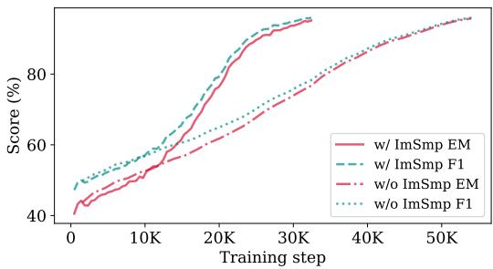  
Figure 3: T5-base with and without importance sampling (ImSmp) trained on $\mathcal { D } _ { 1 }$ and evaluated on $\mathcal { D } _ { 1 - E v a l }$

As shown in Fig. 3, the model trained without importance sampling quickly reaches around 80% exact match (EM) and F1 scores in the first 30K training steps, and then its performance slowly increases to around 95% EM and F1 scores using another 20K steps. But with importance sampling, the model achieved roughly 80% EM and F1 scores after the first 20K steps, and over 95% EM and F1 scores after another 12K steps. We also notice that training with importance sampling yields a significantly steeper learning curve when compared with the one without importance sampling. In what follows, we stick with importance sampling with the same α value for all the experiments.

## 3.4 Evaluation

To study the LMs’ capacity when packing the structured KB, we propose to use the EM and F1 scores following Heinzerling and Inui (2021) over the entire training dataset. We call this fixed-form information recall ability. Since it is not feasible to iteratively evaluate the LMs on all 46M triplets in $\mathcal { D } _ { 0 }$ throughout training due to huge inference time, we opt to randomly sample 10K triplets from $\mathcal { D } _ { 0 }$ as the evaluation set, denoted as $\mathcal { D } _ { 2 }$ . (Sec. 4)

To evaluate the model’s capability to retrieve the stored knowledge when asked with an input and output format that is different from training, we use natural language to query our model. This is similar to the QA task and we call this free-form information recall ability. To eliminate the impact of popular information already present in pre-trained datasets, we focus on answering questions that demand the use of long-tail knowledge that are less frequently appeared in KB. For implementation, we require that the knowledge used by the QA task should be highly covered by the 46M triplets of the world knowledge from Wikidata. Hence, we select the QA dataset constructed in PopQA (Mallen et al., 2023). PopQA converted 14K triplets from Wikidata to their corresponding natural language questions and answers that cover long-tail information based on Wikipedia page views. With a random 8:2 split to obtain a train set of 11.4K samples and a validation set of 2.9K samples, we further finetune the model from the memorization checkpoints using the training split of PopQA and evaluate the performance on the validation set using the F1 score. We also compute the EM and F1 scores of the model’s generation accuracy over the PopQA triplets to check if the model can access relevant knowledge using fixed-form recall. (Sec. 5)

Lastly, we explore whether LMs can infer new knowledge that does not exist in the KB, namely, the missing fact completion ability. Since most knowledge graphs are incomplete, missing factual triplets or even entities (Yang et al., 2022; Shi and Weninger, 2018), the ability to automatically complete missing facts becomes especially demanding. First, we consider the missing facts dataset released by Veseli et al. (2023), which contains 350 factual triplets missing from Wikidata with humanannotated ground-truth. As we additionally seek to investigate the underlying reasoning capabilities involved in missing fact completion, we also curate two sets of missing knowledge triplets based on $\mathcal { D } _ { 0 }$ , emphasizing inverse reasoning and compositional reasoning. For a missing knowledge triplet that is not contained in $\mathcal { D } _ { 0 } .$ , we query the model using the same input format as in fixed-form information recall and evaluate the output text against object text using F1 scores. (Sec. 6)

## 4 Storage Capacity & Fixed-Form Access

The fundamental requirement for LMs to act as KBs is that the models should be capable of storing information from the target KB. Hence we ask $( R Q _ { 1 } ) \colon$ : How well do LMs of varying sizes store large-scale KB through training? We quantify the ability to access the stored KB knowledge using the same triplet form as in training. As mentioned in Sec. 3.4, we measure this fixed-form information recall ability on a sub-sampled dataset $\mathcal { D } _ { 2 }$ from the original training set $\mathcal { D } _ { 0 }$ to avoid the huge inference cost. Specifically, we compute the EM and F1 scores on $\mathcal { D } _ { 2 }$ along the training steps of representative LMs of different sizes, namely T5-base, T5-large, LLaMA-2-7b and LLaMA-2-13b. More details can be found in Appendix C.

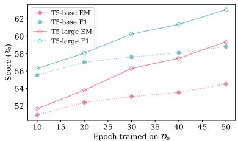  
(a) T5 on D2.

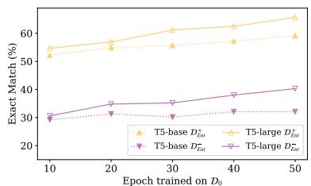  
(b) T5 on D+Ent, D−Ent.

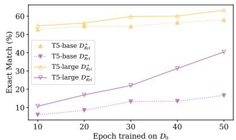  
(c) T5 on $\mathcal { D } _ { R e l } ^ { + } , \mathcal { D } _ { R e l } ^ { - } .$

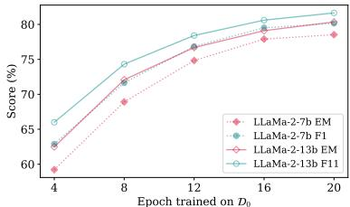  
(d) LLaMA-2 on D2.

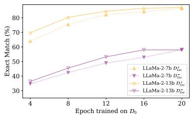  
(e) LLaMA-2 on D+Ent, D−Ent.

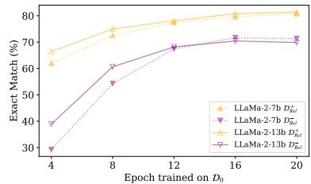  
(f) LLaMA-2 on D+Rel, D−Rel.  
Figure 4: Evaluation of the fixed-form information recall ability for LMs trained on $\mathcal { D } _ { 0 }$

As shown by the performance curves in Fig. 4a and 4d, the models can memorize a large portion of 46M world knowledge, with T5-large performing better than T5-base, and LLaMA-2-13b slightly more capable than LLaMA-2-7b in terms of memorization capacity. LMs with larger sizes are capable of memorizing more knowledge with higher efficiency. In particular, at the end of training, LLaMA-2-13b gives the highest F1 score of 81.64% whereas T5-large reaches an F1 of 63.07%.

In addition, we further separately evaluate the performances on popular and long-tail triplets, i.e., $\mathcal { D } _ { E n t } ^ { + } , \mathcal { D } _ { R e l } ^ { + } , \mathcal { D } _ { E n t } ^ { - }$ and $\mathcal { D } _ { R e l } ^ { - }$ . By looking at the long-tail sets $\mathcal { D } _ { E n t } ^ { - }$ and $\mathcal { D } _ { R e l } ^ { - } ,$ we can disentangle the effect of internal knowledge from pre-training corpora. The results are shown in Fig. 4b, 4c, 4e and 4f. These plots demonstrate that (1) All models are better at memorizing popular information than memorizing long-tail information; (2) For LLaMA-2 models, a larger model size does not lead to significantly better memorization capability, while increasing the size of the much smaller T5 model yields a better performance. (3) Different from LLaMA-2, we observe that T5-large is better than T5-base in learning both popular and long-tail knowledge, with an even significant improvement for long-tail relations $( \mathcal { D } _ { R e l } ^ { - } )$ . This suggests that scaling up models of lower capacity can lead to significant benefits and that LLaMA-2-7b is sufficient in memorizing the given world knowledge $\mathcal { D } _ { 0 }$ . Meanwhile, the long-tail knowledge remains hard to incorporate into larger models of LLaMA-2 despite the increased model size, demonstrating that scalability is not the key to enhancing the LMs for KB’s storage capacity.

## 5 Flexible Access in Natural Language

Under real-world scenarios, user queries are commonly expressed in natural language. Given LMs are capable of storing a good portion of the given world knowledge KB, we are interested in whether the infused knowledge can be accessed without using the fixed triplet format. Therefore, we pose $( R Q _ { 2 } )$ : Can LMs offer flexible natural language querying for KB knowledge, even if the KB is incorporated in the form of knowledge triplets? To minimize the influence of internal knowledge acquired during LMs’ pre-training, we consider the task of answering natural language questions with a focus on long-tail knowledge.

To evaluate the model’s ability to perform freeform information recall when using natural language queries, as indicated in Sec. 3.4, we adopt the knowledge triplets and their corresponding natural language questions from PopQA: Given a knowledge triplet from Wikidata, PopQA converts it to a natural language question which asks for the object. To make LMs trained on knowledge triplets familiar with the natural language QA format, we further finetune these LMs by feeding them the question as input and training these models to generate the correct answer. We then evaluate the generated output using the F1 score. In addition to the freeform queries, we also evaluate how much of the PopQA knowledge in its original triplet form is memorized by the model at each specific checkpoint by querying the model using the subject and relation, following the same input format used for fixed-form information recall (Sec. 4). More implementation details can be found in Appendix C.

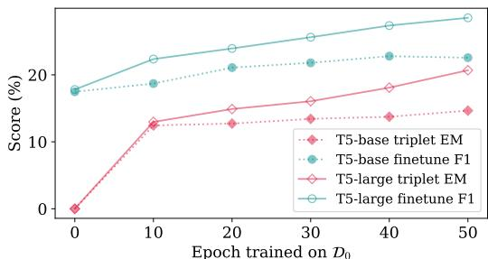  
(a) T5 accessing long-tail PopQA knowledge

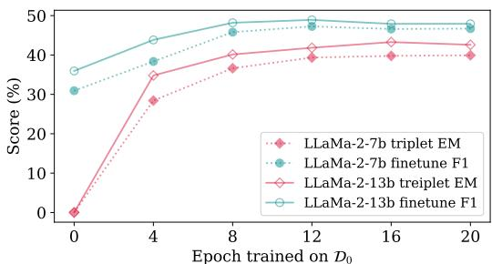  
(b) LLaMA-2 accessing long-tail PopQA knowledge  
Figure 5: PopQA free-form recall (fine-tune F1) and fixed-form recall (triplet EM) through training checkpoints on $\mathcal { D } _ { 0 }$ . Epoch 0 stands for pre-trained models.

We present the experiment results on PopQA in Fig. 5. Each point in the x-axis indicates the number of epochs for each checkpoint when training LMs using the Wikidata triplets, i.e., $\mathcal { D } _ { 0 }$ . It is clear that training on $\mathcal { D } _ { 0 }$ can provide a sizable performance boost compared with using the originally pre-trained LMs (epoch 0). This suggests that LMs trained on large-scale KBs are capable of performing some extent of free-form information recall, especially for a QA task that emphasizes long-tail knowledge. While storing more KB knowledge (higher triplet EM scores) leads to better performance (higher finetune F1 scores) in general, we notice that scaling LLaMA-2 models provides less benefits than scaling T5 models, despite the former performing better overall. Furthermore, for both T5 and LLaMA-2, the trends for triplet EM and finetune F1 scores are consistent regardless of the corresponding model scale. We believe this reflects that the ability of LMs to handle natural language queries aligns with the amount of stored triplet knowledge; in addition, increasing the model size results in diminishing performance improvements once KB storage capacity of the LMs is sufficient.

## 6 Reasoning for Missing New Facts

While KBs structurally organize abundant knowledge at scale, they tend to suffer from incompleteness. This limitation calls for the ability to automatically fill in missing facts based on existing knowledge. With their natural language understanding and KB storage capacity, LMs offer an opportunity to extrapolate new facts beyond stored knowledge. Under this context, we propose $( R Q _ { 3 } )$ : How do LMs reason over stored knowledge when inferring new knowledge that does not exist in the KB? We are also interested in exploring the types of reasoning involved when models deduce missing information, namely inverse (Sec. 6.2) and compositional (Sec. 6.3) reasoning.

## 6.1 General Missing Facts

To evaluate how the model performs when completing missing facts in general, we consider knowledge triplets that are missing from $\mathcal { D } _ { 0 }$ . We query the model to generate an object given the subject and relation. To ensure the feasibility of this setting, we require the subject and relation in question are both contained in $\mathcal { D } _ { 0 }$ . Hence, the model has to associate relevant information related to the subject and the relation in order to infer the object.

For implementation, we utilize the missing fact dataset (Veseli et al., 2023) consisting of 350 samples of knowledge missing from Wikidata. For each sample, we query the model using the subject and the relation that are contained in Wikidata, and compare the generated output with the humanannotated object using the F1 score. To clearly demonstrate the benefit of knowledge memorization, we further evaluate how the pre-trained LMs perform on these missing facts using the natural language queries provided by the dataset.

As shown in Fig. 6a and 6d, we can see that training on $\mathcal { D } _ { 0 }$ provides some performance increase. This suggests that training on large-scale KBs can help LMs to infer new facts better. However, LMs’ ability to infer new facts does not grow along with the memorization process on $\mathcal { D } _ { 0 }$ , and larger models like LLaMA-2 even perform worse than smaller models like T5. These indicate that the amount of knowledge learned by the models may not be the key factor in determining their inference capability toward missing facts.

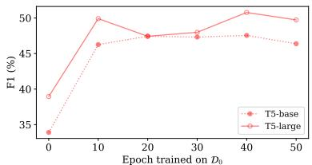  
(a) T5: general missing facts.

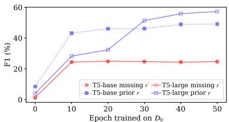

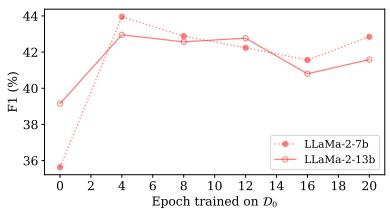  
(d) LLaMA-2: general missing facts.

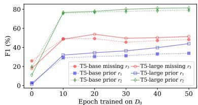  
(c) T5: compositional reasoning.

(b) T5: inverse reasoning.  
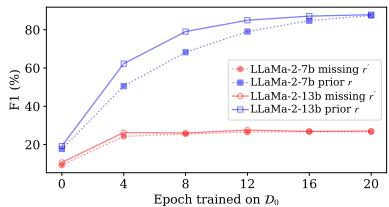  
(e) LLaMA-2: inverse reasoning.

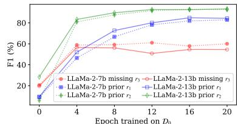  
(f) LLaMA-2: compositional reasoning.  
Figure 6: Evaluating the ability to infer new knowledge across various model checkpoints through training on $\mathcal { D } _ { 0 }$ . The x-axis of the plots indicates the checkpoints having the number of epochs when training LMs using $\mathcal { D } _ { 0 }$ Specifically, epoch 0 stands for the pre-trained checkpoints.

## 6.2 Inverse Reasoning

We define inverse reasoning as the ability to infer $( B , r ^ { \prime } , A )$ given the triplet $( A , r , B )$ , where A and B represent two entities and $r , r ^ { \prime }$ indicate relations. To study the model’s ability to conduct inverse reasoning over the KB, we first curate a set of triplets in the form of $( A , r , B )$ originally contained in $\begin{array} { r } { \mathcal { D } _ { 0 } . } \end{array}$ denoted as $\mathcal { D } _ {  }$ . Then, we curate the inverse set by mapping the original relation r to its inverse $r ^ { \prime }$ and switch the positions of A and B, forming the triplets $( B , r ^ { \prime } , A )$ . We denote this set using $\mathcal { D } _ {  }$ We query the model for the object entity A when given the subject entity B and the inverse relation $r ^ { \prime }$ and compute the F1 score on $\mathcal { D } _ {  }$ To show whether the model is capable of correctly recalling the original fact $( A , r , B )$ in the first place, we additionally query the model to generate B given A and r on $\mathcal { D } _ {  }$ . For the originally pre-trained LMs without accessing Wikidata, we convert the triplets to natural language QA pairs as explained in Sec. 5.

For implementation, we select seven relation pairs $( r , r ^ { \prime } )$ from $\mathcal { D } _ { 0 }$ as shown in Tab. 3. For each relation, we apply the restriction that for knowledge triplet $( A , r , B )$ , the inverse knowledge $( B , r ^ { \prime } , A )$ is not contained in $\mathcal { D } _ { 0 }$ . For each relation, we randomly sample 150 triplets from $\mathcal { D } _ { 0 } .$ , resulting in 1,050 samples for both $\mathcal { D } _ {  }$ and $\mathcal { D } _ {  }$ . The corresponding template to convert triplet into natural language QA pairs can be found in Tab. 4.

As shown in Fig. 6b and 6e, for all models, we can observe a limited performance increase when answering the inverse knowledge $( B , r ^ { \prime } , A )$ , despite the models showing increasing memorization accuracy of the forward knowledge $( A , r , B )$ . We speculate this “no significant chan $\mathrm { g e } ^ { \gamma }$ in performance suggests that LMs can memorize knowledge well but are short at handling inversions.

## 6.3 Compositional Reasoning

We define compositional reasoning as the ability to infer $( A , r _ { 3 } , C )$ given $( A , r _ { 1 } , B )$ and $( B , r _ { 2 } , C )$ when $( A , r _ { 1 } , B ) \land ( B , r _ { 2 } , C ) \Rightarrow ( A , r _ { 3 } , C )$ . To study the model’s ability to conduct compositional reasoning over the KB, we first curate a set of triplet pairs containing $( A , r _ { 1 } , B )$ and $( B , r _ { 2 } , C )$ denoted by $\mathcal { D } _ { \wedge } = ( \mathcal { D } _ { \wedge } ^ { 1 } , \mathcal { D } _ { \wedge } ^ { 2 } )$ . We then form the conclusive triplet set containing $( A , r _ { 3 } , C )$ , denoted by $\mathcal { D } _ { \Rightarrow }$ . To test the model’s performance, we query the model using entity A and relation $r _ { 3 }$ , and compare the model’s output with the ground-truth entity C on $\mathcal { D } _ { \Rightarrow }$ . To show whether the model is capable of correctly recalling the conditioned facts $( A , r _ { 1 } , B )$ and $( B , r _ { 2 } , C )$ in the first place, we further query the model to generate the objects for these conditioned facts on $\mathcal { D } _ { \wedge }$ . For the pre-trained models, we convert the triplets to natural language QA pairs.

For implementation, we formulate eight reasoning rules $r _ { 1 } \wedge r _ { 2 } \Rightarrow r _ { 3 }$ of relation composition as shown in Tab. 1. For a compositional rule $( A , r _ { 1 } , B ) \land ( B , r _ { 2 } , C ) \Rightarrow ( A , r _ { 3 } , C )$ , we restrict that the prior knowledge triplets $( A , r _ { 1 } , B )$ and $( B , r _ { 2 } , C )$ exist in the knowledge dataset while the deduction result $( A , r _ { 3 } , C )$ is missing. For each reasoning rule, we randomly sample 150 examples from $\mathcal { D } _ { 0 }$ , resulting in 1,200 samples for both $\mathcal { D } _ { \wedge }$ and $\mathcal { D } _ { \Rightarrow }$ . The templates to convert triplets into natural language QA pairs can be found in Tab. 2.

As shown in Fig. 6c and 6f, training on the KB can assist LMs in performing compositional reasoning. However, there is an upper threshold; memorizing prior knowledge beyond that point may not help the model perform compositional deduction.

## 7 Conclusion

This work systematically studies the viability of using LMs as large-scale KBs. We propose an importance sampling algorithm to increase the efficiency of large-scale world knowledge infusion. We investigate three critical dimensions along this direction and conclude that LMs are able to recall a large amount of knowledge in KB through training in both fixed-form triplets and free-form natural language. Nevertheless, there is a significant gap between memorization of popular and long-tail knowledge regardless of model size. We also observe that such knowledge-infused LMs consistently improve in inferring new facts through some extent of reasoning. However, the amount of knowledge learned during training does not guarantee consistent improvement in reasoning capabilities, especially when it comes to inverse reasoning, pointing to further investigations on improving LMs’ reasoning capability over stored knowledge.

## Limitations

This work focuses on the following three aspects of treating LMs as KBs: memorization and accessing of KB information at scale, accessing of memorized knowledge in flexible, natural language format, and inferring facts missing from the KB used for training. AlKhamissi et al. (2022) proposed the following five abilities for a language model to be qualified as a KB: (1) accessing of knowledge, (2) editing of knowledge, (3) consistency over semantically equivalent context, (4) reasoning over stored knowledge, (5) explainability in internal mechanisms and interoperability of outputs under a post-hoc setting. We mainly address the ability of knowledge accessing while providing a preliminary study on the reasoning ability of LMs over using inverse and compositional reasoning. However, our work faces certain limitations. One limitation of this study is the inability to evaluate closed-source large LMs on the three aforementioned perspectives, as these proprietary models cannot be easily fine-tuned with the KB data. Also, due to constraints in computational resources, we only conducted experiments on T5 and LLaMA-2 models, though we plan to extend this in the future to include more recent models like LLaMA-3 (Dubey et al., 2024) and GLM-4 (GLM et al., 2024) as well as multilingual models like NLLB-2000 (NLLB Team et al., 2022) and LLaMA-3.1 (Meta AI, 2024) to further validate their capabilities and explore practical use cases like enhancing the automatic population of KBs. In fact, as smaller LMs like T5 can be finetuned effectively when comparing with massive LLMs, utilizing smaller yet capable LMs for specialized KB-dependent tasks provides an intersting research direction. Additionally, we were unable to train the models without importance sampling on the full 46M triplets of $\mathcal { D } _ { 0 }$ . While further exploration of importance sampling may be necessary to enhance credibility and robustness, our experiments on the randomly sampled subset $\mathcal { D } _ { 1 }$ provide preliminary evidence supporting our hypothesis in Sec. 3.3, and lay a solid foundation for improving the efficiency of large-scale knowledge memorization.

## Ethics Statement

Large LMs are known to memorize information from pre-training corpus. Therefore, probing for stored knowledge may lead to privacy attacks against LMs, such as training data extraction attacks (Neel and Chang, 2024; Staab et al., 2023; Hartmann et al., 2023). For this kind of attack, an adversary can reconstruct parts of the training sample when given access to the model, leading to potential exposures of sensitive information that should not be extracted in fair and ethical usage of LMs. In addition, Karamolegkou et al. (2023) confirms that LMs are able to memorize a substantial portion of bestselling books with copyright that are published between 1930-2010, demonstrating the risk of copyright violations when deploying LMs.

For our work, the world knowledge dataset $\mathcal { D } _ { 0 }$ is derived from Wikidata, which follows the CC0 (Creative Common Public Domain) Copyright3. In this way, we reduce the concern of LMs learning sensitive or copyright information when training on the corresponding knowledge dataset. However, we have limited control over information acquired during the pre-training of language modles. It is possible to address this issue in future work by either using LMs with sensitive and copyright information removed or deploying knowledge editing methods (Zhang et al., 2024) to enforce data privacy and integrity.

## Acknowledgments

The authors would like to thank the anonymous reviewers for their valuable comments. This research is supported by the NTU Start-Up Grant (#023284-00001), Singapore, and the Natural Science Foundation of China (No. 62476132).

## References

Guillaume Alain, Alex Lamb, Chinnadhurai Sankar, Aaron Courville, and Yoshua Bengio. 2016. Variance reduction in sgd by distributed importance sampling. Statistics Research Repository, arXiv:1511.06481. Version 7.

Dimitrios Alivanistos, Selene Báez Santamaría, Michael Cochez, Jan-Christoph Kalo, Emile van Krieken, and Thiviyan Thanapalasingam. 2023. Prompting as probing: Using language models for knowledge base construction. Computation Research Repository, arXiv:2208.11057. Version 3.

Badr AlKhamissi, Millicent Li, Asli Celikyilmaz, Mona Diab, and Marjan Ghazvininejad. 2022. A review on language models as knowledge bases. Computation Research Repository, arXiv:2204.06031.

Sören Auer, Christian Bizer, Georgi Kobilarov, Jens Lehmann, Richard Cyganiak, and Zachary Ives. 2007. Dbpedia: a nucleus for a web of open data. In Proceedings of the 6th International The Semantic Web and 2nd Asian Conference on Asian Semantic Web Conference, ISWC’07/ASWC’07, page 722–735, Berlin, Heidelberg. Springer-Verlag.

Jinheon Baek, Alham Fikri Aji, and Amir Saffari. 2023. Knowledge-augmented language model prompting for zero-shot knowledge graph question answering. In Proceedings of the 1st Workshop on Natural Language Reasoning and Structured Explanations (NLRSE), pages 78–106, Toronto, Canada. Association for Computational Linguistics.

Nikita Bhutani, Xinyi Zheng, and H V Jagadish. 2019. Learning to answer complex questions over knowledge bases with query composition. In Proceedings of the 28th ACM International Conference on Information and Knowledge Management, CIKM ’19, page 739–748, New York, NY, USA. Association for Computing Machinery.

Kurt Bollacker, Colin Evans, Praveen Paritosh, Tim Sturge, and Jamie Taylor. 2008. Freebase: a collaboratively created graph database for structuring human knowledge. In Proceedings ofthe 2008 ACM SIGMOD International Conference on Management

of Data, SIGMOD ’08, page 1247–1250, New York, NY, USA. Association for Computing Machinery.

Rishi Bommasani, Drew A. Hudson, Ehsan Adeli, Russ Altman, Simran Arora, Sydney von Arx, Michael S. Bernstein, Jeannette Bohg, Antoine Bosselut, Emma Brunskill, Erik Brynjolfsson, Shyamal Buch, Dallas Card, Rodrigo Castellon, Niladri Chatterji, Annie Chen, Kathleen Creel, Jared Quincy Davis, Dora Demszky, Chris Donahue, Moussa Doumbouya, Esin Durmus, Stefano Ermon, John Etchemendy, Kawin Ethayarajh, Li Fei-Fei, Chelsea Finn, Trevor Gale, Lauren Gillespie, Karan Goel, Noah Goodman, Shelby Grossman, Neel Guha, Tatsunori Hashimoto, Peter Henderson, John Hewitt, Daniel E. Ho, Jenny Hong, Kyle Hsu, Jing Huang, Thomas Icard, Saahil Jain, Dan Jurafsky, Pratyusha Kalluri, Siddharth Karamcheti, Geoff Keeling, Fereshte Khani, Omar Khattab, Pang Wei Koh, Mark Krass, Ranjay Krishna, Rohith Kuditipudi, Ananya Kumar, Faisal Ladhak, Mina Lee, Tony Lee, Jure Leskovec, Isabelle Levent, Xiang Lisa Li, Xuechen Li, Tengyu Ma, Ali Malik, Christopher D. Manning, Suvir Mirchandani, Eric Mitchell, Zanele Munyikwa, Suraj Nair, Avanika Narayan, Deepak Narayanan, Ben Newman, Allen Nie, Juan Carlos Niebles, Hamed Nilforoshan, Julian Nyarko, Giray Ogut, Laurel Orr, Isabel Papadimitriou, Joon Sung Park, Chris Piech, Eva Portelance, Christopher Potts, Aditi Raghunathan, Rob Reich, Hongyu Ren, Frieda Rong, Yusuf Roohani, Camilo Ruiz, Jack Ryan, Christopher Ré, Dorsa Sadigh, Shiori Sagawa, Keshav Santhanam, Andy Shih, Krishnan Srinivasan, Alex Tamkin, Rohan Taori, Armin W. Thomas, Florian Tramèr, Rose E. Wang, William Wang, Bohan Wu, Jiajun Wu, Yuhuai Wu, Sang Michael Xie, Michihiro Yasunaga, Jiaxuan You, Matei Zaharia, Michael Zhang, Tianyi Zhang, Xikun Zhang, Yuhui Zhang, Lucia Zheng, Kaitlyn Zhou, and Percy Liang. 2022. On the opportunities and risks of foundation models. Computation Research Repository, arXiv:2108.07258.

Nicholas Carlini, Daphne Ippolito, Matthew Jagielski, Katherine Lee, Florian Tramer, and Chiyuan Zhang. 2023. Quantifying memorization across neural language models. Computation Research Repository, arXiv:2202.07646.

Weijie Chen, Yongzhu Chang, Rongsheng Zhang, Jiashu Pu, Guandan Chen, Le Zhang, Yadong Xi, Yijiang Chen, and Chang Su. 2022. Probing simile knowledge from pre-trained language models. In Proceedings of the 60th Annual Meeting of the Associationfor Computational Linguistics (Volume 1: Long Papers), pages 5875–5887, Dublin, Ireland. Association for Computational Linguistics.

L.P. Cordella, P. Foggia, C. Sansone, and M. Vento. 2004. A (sub)graph isomorphism algorithm for matching large graphs. IEEE Transactions on Pattern Analysis and Machine Intelligence, 26(10):1367– 1372.

Joe Davison, Joshua Feldman, and Alexander Rush. 2019. Commonsense knowledge mining from pre-

trained models. In Proceedings ofthe 2019 Conference on Empirical Methods in Natural Language Processing and the 9th International Joint Conference on Natural Language Processing (EMNLP-IJCNLP), pages 1173–1178, Hong Kong, China. Association for Computational Linguistics.

Abhimanyu Dubey, Abhinav Jauhri, Abhinav Pandey, Abhishek Kadian, Ahmad Al-Dahle, Aiesha Letman, Akhil Mathur, Alan Schelten, Amy Yang, Angela Fan, Anirudh Goyal, Anthony Hartshorn, Aobo Yang, Archi Mitra, Archie Sravankumar, Artem Korenev, Arthur Hinsvark, Arun Rao, Aston Zhang, Aurelien Rodriguez, Austen Gregerson, Ava Spataru, Bap tiste Roziere, Bethany Biron, Binh Tang, Bobbie Chern, Charlotte Caucheteux, Chaya Nayak, Chloe Bi, Chris Marra, Chris McConnell, Christian Keller, Christophe Touret, Chunyang Wu, Corinne Wong, Cristian Canton Ferrer, Cyrus Nikolaidis, Damien Al lonsius, Daniel Song, Danielle Pintz, Danny Livshits, David Esiobu, Dhruv Choudhary, Dhruv Mahajan, Diego Garcia-Olano, Diego Perino, Dieuwke Hupkes, Egor Lakomkin, Ehab AlBadawy, Elina Lobanova, Emily Dinan, Eric Michael Smith, Filip Radenovic, Frank Zhang, Gabriel Synnaeve, Gabrielle Lee, Geor gia Lewis Anderson, Graeme Nail, Gregoire Mi alon, Guan Pang, Guillem Cucurell, Hailey Nguyen, Hannah Korevaar, Hu Xu, Hugo Touvron, Iliyan Zarov, Imanol Arrieta Ibarra, Isabel Kloumann, Ishan Misra, Ivan Evtimov, Jade Copet, Jaewon Lee, Jan Geffert, Jana Vranes, Jason Park, Jay Mahadeokar, Jeet Shah, Jelmer van der Linde, Jennifer Billock, Jenny Hong, Jenya Lee, Jeremy Fu, Jianfeng Chi, Jianyu Huang, Jiawen Liu, Jie Wang, Jiecao Yu, Joanna Bitton, Joe Spisak, Jongsoo Park, Joseph Rocca, Joshua Johnstun, Joshua Saxe, Junteng Jia, Kalyan Vasuden Alwala, Kartikeya Upasani, Kate Plawiak, Ke Li, Kenneth Heafield, Kevin Stone, Khalid El-Arini, Krithika Iyer, Kshitiz Malik, Kuen ley Chiu, Kunal Bhalla, Lauren Rantala-Yeary, Laurens van der Maaten, Lawrence Chen, Liang Tan, Liz Jenkins, Louis Martin, Lovish Madaan, Lubo Malo, Lukas Blecher, Lukas Landzaat, Luke de Oliveira, Madeline Muzzi, Mahesh Pasupuleti, Mannat Singh, Manohar Paluri, Marcin Kardas, Mathew Oldham, Mathieu Rita, Maya Pavlova, Melanie Kambadur, Mike Lewis, Min Si, Mitesh Kumar Singh, Mona Hassan, Naman Goyal, Narjes Torabi, Nikolay Bash lykov, Nikolay Bogoychev, Niladri Chatterji, Olivier Duchenne, Onur Çelebi, Patrick Alrassy, Pengchuan Zhang, Pengwei Li, Petar Vasic, Peter Weng, Pra jjwal Bhargava, Pratik Dubal, Praveen Krishnan, Punit Singh Koura, Puxin Xu, Qing He, Qingxiao Dong, Ragavan Srinivasan, Raj Ganapathy, Ramon Calderer, Ricardo Silveira Cabral, Robert Stojnic, Roberta Raileanu, Rohit Girdhar, Rohit Patel, Ro main Sauvestre, Ronnie Polidoro, Roshan Sumbaly, Ross Taylor, Ruan Silva, Rui Hou, Rui Wang, Saghar Hosseini, Sahana Chennabasappa, Sanjay Singh, Sean Bell, Seohyun Sonia Kim, Sergey Edunov, Shaoliang Nie, Sharan Narang, Sharath Raparthy, Sheng Shen, Shengye Wan, Shruti Bhosale, Shun Zhang, Simon Vandenhende, Soumya Batra, Spencer Whitman, Sten Sootla, Stephane Collot, Suchin Gu rurangan, Sydney Borodinsky, Tamar Herman, Tara Fowler, Tarek Sheasha, Thomas Georgiou, Thomas Scialom, Tobias Speckbacher, Todor Mihaylov, Tong Xiao, Ujjwal Karn, Vedanuj Goswami, Vibhor Gupta, Vignesh Ramanathan, Viktor Kerkez, Vincent Gonguet, Virginie Do, Vish Vogeti, Vladan Petro vic, Weiwei Chu, Wenhan Xiong, Wenyin Fu, Whit ney Meers, Xavier Martinet, Xiaodong Wang, Xiao qing Ellen Tan, Xinfeng Xie, Xuchao Jia, Xuewei Wang, Yaelle Goldschlag, Yashesh Gaur, Yasmine Babaei, Yi Wen, Yiwen Song, Yuchen Zhang, Yue Li, Yuning Mao, Zacharie Delpierre Coudert, Zheng Yan, Zhengxing Chen, Zoe Papakipos, Aaditya Singh Aaron Grattafiori, Abha Jain, Adam Kelsey, Adam Shajnfeld, Adithya Gangidi, Adolfo Victoria, Ahuva Goldstand, Ajay Menon, Ajay Sharma, Alex Boesen berg, Alex Vaughan, Alexei Baevski, Allie Feinstein, Amanda Kallet, Amit Sangani, Anam Yunus, An drei Lupu, Andres Alvarado, Andrew Caples, An drew Gu, Andrew Ho, Andrew Poulton, Andrew Ryan, Ankit Ramchandani, Annie Franco, Apara jita Saraf, Arkabandhu Chowdhury, Ashley Gabriel Ashwin Bharambe, Assaf Eisenman, Azadeh Yaz dan, Beau James, Ben Maurer, Benjamin Leonhardi, Bernie Huang, Beth Loyd, Beto De Paola, Bhargavi Paranjape, Bing Liu, Bo Wu, Boyu Ni, Braden Han cock, Bram Wasti, Brandon Spence, Brani Stojkovic Brian Gamido, Britt Montalvo, Carl Parker, Carly Burton, Catalina Mejia, Changhan Wang, Changkyu Kim, Chao Zhou, Chester Hu, Ching-Hsiang Chu, Chris Cai, Chris Tindal, Christoph Feichtenhofer, Da mon Civin, Dana Beaty, Daniel Kreymer, Daniel Li, Danny Wyatt, David Adkins, David Xu, Davide Tes tuggine, Delia David, Devi Parikh, Diana Liskovich, Didem Foss, Dingkang Wang, Duc Le, Dustin Hol land, Edward Dowling, Eissa Jamil, Elaine Mont gomery, Eleonora Presani, Emily Hahn, Emily Wood, Erik Brinkman, Esteban Arcaute, Evan Dunbar, Evan Smothers, Fei Sun, Felix Kreuk, Feng Tian, Firat Ozgenel, Francesco Caggioni, Francisco Guzmán, Frank Kanayet, Frank Seide, Gabriela Medina Flo rez, Gabriella Schwarz, Gada Badeer, Georgia Swee, Gil Halpern, Govind Thattai, Grant Herman, Grigory Sizov, Guangyi, Zhang, Guna Lakshminarayanan, Hamid Shojanazeri, Han Zou, Hannah Wang, Han wen Zha, Haroun Habeeb, Harrison Rudolph, He len Suk, Henry Aspegren, Hunter Goldman, Ibrahim Damlaj, Igor Molybog, Igor Tufanov, Irina-Elena Veliche, Itai Gat, Jake Weissman, James Geboski James Kohli, Japhet Asher, Jean-Baptiste Gaya, Jeff Marcus, Jeff Tang, Jennifer Chan, Jenny Zhen, Jeremy Reizenstein, Jeremy Teboul, Jessica Zhong, Jian Jin, Jingyi Yang, Joe Cummings, Jon Carvill, Jon Shepard, Jonathan McPhie, Jonathan Torres, Josh Ginsburg, Junjie Wang, Kai Wu, Kam Hou U, Karan Saxena, Karthik Prasad, Kartikay Khan delwal, Katayoun Zand, Kathy Matosich, Kaushik Veeraraghavan, Kelly Michelena, Keqian Li, Kun Huang, Kunal Chawla, Kushal Lakhotia, Kyle Huang, Lailin Chen, Lakshya Garg, Lavender A, Leandro Silva, Lee Bell, Lei Zhang, Liangpeng Guo, Licheng Yu, Liron Moshkovich, Luca Wehrstedt, Madian Khabsa, Manav Avalani, Manish Bhatt, Maria Tsim poukelli, Martynas Mankus, Matan Hasson, Matthew

Lennie, Matthias Reso, Maxim Groshev, Maxim Naumov, Maya Lathi, Meghan Keneally, Michael L. Seltzer, Michal Valko, Michelle Restrepo, Mihir Patel, Mik Vyatskov, Mikayel Samvelyan, Mike Clark, Mike Macey, Mike Wang, Miquel Jubert Hermoso, Mo Metanat, Mohammad Rastegari, Mun ish Bansal, Nandhini Santhanam, Natascha Parks, Natasha White, Navyata Bawa, Nayan Singhal, Nick Egebo, Nicolas Usunier, Nikolay Pavlovich Laptev, Ning Dong, Ning Zhang, Norman Cheng, Oleg Chernoguz, Olivia Hart, Omkar Salpekar, Ozlem Kalinli, Parkin Kent, Parth Parekh, Paul Saab, Pavan Balaji, Pedro Rittner, Philip Bontrager, Pierre Roux, Piotr Dollar, Polina Zvyagina, Prashant Ratan chandani, Pritish Yuvraj, Qian Liang, Rachad Alao, Rachel Rodriguez, Rafi Ayub, Raghotham Murthy, Raghu Nayani, Rahul Mitra, Raymond Li, Rebekkah Hogan, Robin Battey, Rocky Wang, Rohan Mah eswari, Russ Howes, Ruty Rinott, Sai Jayesh Bondu, Samyak Datta, Sara Chugh, Sara Hunt, Sargun Dhillon, Sasha Sidorov, Satadru Pan, Saurabh Verma, Seiji Yamamoto, Sharadh Ramaswamy, Shaun Lindsay, Shaun Lindsay, Sheng Feng, Shenghao Lin, Shengxin Cindy Zha, Shiva Shankar, Shuqiang Zhang, Shuqiang Zhang, Sinong Wang, Sneha Agar wal, Soji Sajuyigbe, Soumith Chintala, Stephanie Max, Stephen Chen, Steve Kehoe, Steve Satterfield, Sudarshan Govindaprasad, Sumit Gupta, Sungmin Cho, Sunny Virk, Suraj Subramanian, Sy Choudhury, Sydney Goldman, Tal Remez, Tamar Glaser, Tamara Best, Thilo Kohler, Thomas Robinson, Tianhe Li, Tianjun Zhang, Tim Matthews, Timothy Chou, Tzook Shaked, Varun Vontimitta, Victoria Ajayi, Victoria Montanez, Vijai Mohan, Vinay Satish Kumar, Vishal Mangla, Vítor Albiero, Vlad Ionescu, Vlad Poenaru, Vlad Tiberiu Mihailescu, Vladimir Ivanov, Wei Li, Wenchen Wang, Wenwen Jiang, Wes Bouaziz, Will Constable, Xiaocheng Tang, Xiaofang Wang, Xiaojian Wu, Xiaolan Wang, Xide Xia, Xilun Wu, Xinbo Gao, Yanjun Chen, Ye Hu, Ye Jia, Ye Qi, Yenda Li, Yilin Zhang, Ying Zhang, Yossi Adi, Youngjin Nam, Yu, Wang, Yuchen Hao, Yundi Qian, Yuzi He, Zach Rait, Zachary DeVito, Zef Rosnbrick, Zhaoduo Wen, Zhenyu Yang, and Zhiwei Zhao. 2024. The llama 3 herd of models. Preprint, arXiv:2407.21783.

Yanai Elazar, Nora Kassner, Shauli Ravfogel, Abhilasha Ravichander, Eduard Hovy, Hinrich Schütze, and Yoav Goldberg. 2021. Measuring and improving consistency in pretrained language models. Transactions ofthe Associationfor Computational Linguistics, 9:1012–1031.

Fabian Galetzka, Jewgeni Rose, David Schlangen, and Jens Lehmann. 2021. Space efficient context encoding for non-task-oriented dialogue generation with graph attention transformer. In Proceedings of the 59th Annual Meeting of the Association for Computational Linguistics and the 11th International Joint Conference on Natural Language Processing (Volume 1: Long Papers), pages 7028–7041, Online. Association for Computational Linguistics.

Team GLM, Aohan Zeng, Bin Xu, Bowen Wang, Chenhui Zhang, Da Yin, Diego Rojas, Guanyu Feng, Han-

lin Zhao, Hanyu Lai, Hao Yu, Hongning Wang, Jiadai Sun, Jiajie Zhang, Jiale Cheng, Jiayi Gui, Jie Tang, Jing Zhang, Juanzi Li, Lei Zhao, Lindong Wu, Lucen Zhong, Mingdao Liu, Minlie Huang, Peng Zhang, Qinkai Zheng, Rui Lu, Shuaiqi Duan, Shudan Zhang, Shulin Cao, Shuxun Yang, Weng Lam Tam, Wenyi Zhao, Xiao Liu, Xiao Xia, Xiaohan Zhang, Xiaotao Gu, Xin Lv, Xinghan Liu, Xinyi Liu, Xinyue Yang, Xixuan Song, Xunkai Zhang, Yifan An, Yifan Xu, Yilin Niu, Yuantao Yang, Yueyan Li, Yushi Bai, Yuxiao Dong, Zehan Qi, Zhaoyu Wang, Zhen Yang, Zhengxiao Du, Zhenyu Hou, and Zihan Wang. 2024. Chatglm: A family of large language models from glm-130b to glm-4 all tools. Preprint, arXiv:2406.12793.

Martin Grohe and Pascal Schweitzer. 2020. The graph isomorphism problem. Commun. ACM, 63(11):128–134.

Sylvain Gugger, Lysandre Debut, Thomas Wolf, Philipp Schmid, Zachary Mueller, Sourab Mangrulkar, Marc Sun, and Benjamin Bossan. 2022. Accelerate: Training and inference at scale made simple, efficient and adaptable. https://github.com/huggingface/ accelerate.

Valentin Hartmann, Anshuman Suri, Vincent Bindschaedler, David Evans, Shruti Tople, and Robert West. 2023. Sok: Memorization in general-purpose large language models. Computation Research Repository, arXiv:2310.18362.

Benjamin Heinzerling and Kentaro Inui. 2021. Language models as knowledge bases: On entity representations, storage capacity, and paraphrased queries. In Proceedings ofthe 16th Conference ofthe European Chapter of the Association for Computational Linguistics: Main Volume, pages 1772–1791, Online. Association for Computational Linguistics.

Kelvin Jiang, Dekun Wu, and Hui Jiang. 2019. FreebaseQA: A new factoid QA data set matching triviastyle question-answer pairs with Freebase. In Proceedings ofthe 2019 Conference ofthe North American Chapter ofthe Associationfor Computational Linguistics: Human Language Technologies, Volume 1 (Long and Short Papers), pages 318–323, Minneapolis, Minnesota. Association for Computational Linguistics.

Zhengbao Jiang, Frank F. Xu, Jun Araki, and Graham Neubig. 2020. How can we know what language models know? Transactions of the Association for Computational Linguistics, 8:423–438.

Magdalena Kaiser and Philipp Christmann. 2021. Wikidata core for question answering. https://github. com/PhilippChr/wikidata-core-for-QA.

Nikhil Kandpal, Haikang Deng, Adam Roberts, Eric Wallace, and Colin Raffel. 2023. Large language models struggle to learn long-tail knowledge. In Proceedings of the 40th International Conference on Machine Learning, volume 202 of Proceedings

of Machine Learning Research, pages 15696–15707. PMLR.

Jared Kaplan, Sam McCandlish, Tom Henighan, Tom B. Brown, Benjamin Chess, Rewon Child, Scott Gray, Alec Radford, Jeffrey Wu, and Dario Amodei. 2020. Scaling laws for neural language models. Preprint, arXiv:2001.08361.

Antonia Karamolegkou, Jiaang Li, Li Zhou, and Anders Søgaard. 2023. Copyright violations and large language models. In Proceedings ofthe 2023 Conference on Empirical Methods in Natural Language Processing, pages 7403–7412, Singapore. Association for Computational Linguistics.

Angelos Katharopoulos and Francois Fleuret. 2018. Not all samples are created equal: Deep learning with importance sampling. In Proceedings of the 35th International Conference on Machine Learning, volume 80 of Proceedings of Machine Learning Research, pages 2525–2534. PMLR.

Yunshi Lan and Jing Jiang. 2020. Query graph generation for answering multi-hop complex questions from knowledge bases. In Proceedings of the 58th Annual Meeting ofthe Associationfor Computational Linguistics, pages 969–974, Online. Association for Computational Linguistics.

Xiang Lorraine Li, Adhiguna Kuncoro, Jordan Hoffmann, Cyprien de Masson d’Autume, Phil Blunsom, and Aida Nematzadeh. 2022a. A systematic investigation of commonsense knowledge in large language models. In Proceedings of the 2022 Conference on Empirical Methods in Natural Language Processing, pages 11838–11855, Abu Dhabi, United Arab Emirates. Association for Computational Linguistics.

Yanyang Li, Jianqiao Zhao, Michael Lyu, and Liwei Wang. 2022b. Eliciting knowledge from large pre-trained models for unsupervised knowledgegrounded conversation. In Proceedings of the 2022 Conference on Empirical Methods in Natural Language Processing, pages 10551–10564, Abu Dhabi, United Arab Emirates. Association for Computational Linguistics.

Yu Li, Baolin Peng, Yelong Shen, Yi Mao, Lars Liden, Zhou Yu, and Jianfeng Gao. 2022c. Knowledgegrounded dialogue generation with a unified knowledge representation. In Proceedings ofthe 2022 Conference ofthe North American Chapter ofthe Associationfor Computational Linguistics: Human Language Technologies, pages 206–218, Seattle, United States. Association for Computational Linguistics.

Shayne Longpre, Kartik Perisetla, Anthony Chen, Nikhil Ramesh, Chris DuBois, and Sameer Singh. 2021. Entity-based knowledge conflicts in question answering. In Proceedings ofthe 2021 Conference on Empirical Methods in Natural Language Processing, pages 7052–7063, Online and Punta Cana, Dominican Republic. Association for Computational Linguistics.

Ilya Loshchilov and Frank Hutter. 2019. Decoupled weight decay regularization. Computation Research Repository, arXiv:1711.05101. Version 3.

Alex Mallen, Akari Asai, Victor Zhong, Rajarshi Das, Daniel Khashabi, and Hannaneh Hajishirzi. 2023. When not to trust language models: Investigating effectiveness of parametric and non-parametric memories. In Proceedings of the 61st Annual Meeting of the Association for Computational Linguistics (Volume 1: Long Papers), pages 9802–9822, Toronto, Canada. Association for Computational Linguistics.

Meta AI. 2024. Llama 3.1: A state-of-the-art language model. https://ai.meta.com/blog/ meta-llama-3-1/.

Fedor Moiseev, Zhe Dong, Enrique Alfonseca, and Martin Jaggi. 2022. SKILL: Structured knowledge infusion for large language models. In Proceedings of the 2022 Conference of the North American Chapter of the Association for Computational Linguistics: Human Language Technologies, pages 1581–1588, Seattle, United States. Association for Computational Linguistics.

Rosa Montañés-Salas, Irene López-Bosque, Luis García-Garcés, and Rafael del Hoyo-Alonso. 2022. ITAINNOVA at SocialDisNER: A transformers cocktail for disease identification in social media in Spanish. In Proceedings of The Seventh Workshop on Social Media Miningfor Health Applications, Workshop & Shared Task, pages 71–74, Gyeongju, Republic of Korea. Association for Computational Linguistics.

Seth Neel and Peter Chang. 2024. Privacy issues in large language models: A survey. Computation Research Repository, arXiv:2312.06717.

NLLB Team, Marta R. Costa-jussà, James Cross, Onur Çelebi, Maha Elbayad, Kenneth Heafield, Kevin Heffernan, Elahe Kalbassi, Janice Lam, Daniel Licht, Jean Maillard, Anna Sun, Skyler Wang, Guillaume Wenzek, Al Youngblood, Bapi Akula, Loic Barrault, Gabriel Mejia Gonzalez, Prangthip Hansanti, John Hoffman, Semarley Jarrett, Kaushik Ram Sadagopan, Dirk Rowe, Shannon Spruit, Chau Tran, Pierre Andrews, Necip Fazil Ayan, Shruti Bhosale, Sergey Edunov, Angela Fan, Cynthia Gao, Vedanuj Goswami, Francisco Guzmán, Philipp Koehn, Alexandre Mourachko, Christophe Ropers, Safiyyah Saleem, Holger Schwenk, and Jeff Wang. 2022. No language left behind: Scaling humancentered machine translation.

Thomas Pellissier Tanon, Denny Vrandeciˇ c, Sebastian´ Schaffert, Thomas Steiner, and Lydia Pintscher. 2016. From freebase to wikidata: The great migration. In Proceedings of the 25th International Conference on World Wide Web, WWW ’16, page 1419–1428, Republic and Canton of Geneva, CHE. International World Wide Web Conferences Steering Committee.

Fabio Petroni, Tim Rocktäschel, Sebastian Riedel, Patrick Lewis, Anton Bakhtin, Yuxiang Wu, and

Alexander Miller. 2019. Language models as knowledge bases? In Proceedings of the 2019 Conference on Empirical Methods in Natural Language Processing and the 9th International Joint Conference on Natural Language Processing (EMNLP-IJCNLP), pages 2463–2473, Hong Kong, China. Association for Computational Linguistics.

Yunqi Qiu, Yuanzhuo Wang, Xiaolong Jin, and Kun Zhang. 2020. Stepwise reasoning for multi-relation question answering over knowledge graph with weak supervision. In Proceedings ofthe 13th International Conference on Web Search and Data Mining, WSDM ’20, page 474–482, New York, NY, USA. Association for Computing Machinery.

Colin Raffel, Noam Shazeer, Adam Roberts, Katherine Lee, Sharan Narang, Michael Matena, Yanqi Zhou, Wei Li, and Peter J. Liu. 2020. Exploring the limits of transfer learning with a unified text-to-text transformer. Journal ofMachine Learning Research, 21(140):1–67.

Samyam Rajbhandari, Jeff Rasley, Olatunji Ruwase, and Yuxiong He. 2020. Zero: Memory optimizations toward training trillion parameter models. In SC20: International Conferencefor High Performance Computing, Networking, Storage and Analysis, pages 1– 16.

Jeff Rasley, Samyam Rajbhandari, Olatunji Ruwase, and Yuxiong He. 2020. Deepspeed: System optimizations enable training deep learning models with over 100 billion parameters. In Proceedings of the 26th ACM SIGKDD International Conference on Knowledge Discovery & Data Mining, KDD ’20, page 3505–3506, New York, NY, USA. Association for Computing Machinery.

Yasaman Razeghi, Robert L Logan IV, Matt Gardner, and Sameer Singh. 2022. Impact of pretraining term frequencies on few-shot numerical reasoning. In Findings ofthe Associationfor Computational Linguistics: EMNLP 2022, pages 840–854, Abu Dhabi, United Arab Emirates. Association for Computational Linguistics.

Adam Roberts, Colin Raffel, and Noam Shazeer. 2020. How much knowledge can you pack into the parameters of a language model? In Proceedings of the 2020 Conference on Empirical Methods in Natural Language Processing (EMNLP), pages 5418–5426, Online. Association for Computational Linguistics.

Apoorv Saxena, Aditay Tripathi, and Partha Talukdar. 2020. Improving multi-hop question answering over knowledge graphs using knowledge base embeddings. In Proceedings ofthe 58th Annual Meeting ofthe Associationfor Computational Linguistics, pages 4498– 4507, Online. Association for Computational Linguistics.

Noam Shazeer and Mitchell Stern. 2018. Adafactor: Adaptive learning rates with sublinear memory cost. In Proceedings ofthe 35th International Conference

on Machine Learning, volume 80 of Proceedings of Machine Learning Research, pages 4596–4604. PMLR.

Baoxu Shi and Tim Weninger. 2018. Open-world knowledge graph completion. Proceedings of the AAAI Conference on Artificial Intelligence, 32(1).

Robin Staab, Mark Vero, Mislav Balunovic, and Martin´ Vechev. 2023. Beyond memorization: Violating privacy via inference with large language models. Computation Research Repository, arXiv:2310.07298.

Mujeen Sung, Jinhyuk Lee, Sean Yi, Minji Jeon, Sungdong Kim, and Jaewoo Kang. 2021. Can language models be biomedical knowledge bases? In Proceedings ofthe 2021 Conference on Empirical Methods in Natural Language Processing, pages 4723–4734, Online and Punta Cana, Dominican Republic. Association for Computational Linguistics.

Michael Tänzer, Sebastian Ruder, and Marek Rei. 2022. Memorisation versus generalisation in pre-trained language models. In Proceedings ofthe 60th Annual Meeting of the Association for Computational Linguistics (Volume 1: Long Papers), pages 7564–7578, Dublin, Ireland. Association for Computational Linguistics.

Hugo Touvron, Louis Martin, Kevin Stone, Peter Albert, Amjad Almahairi, Yasmine Babaei, Nikolay Bashlykov, Soumya Batra, Prajjwal Bhargava, Shruti Bhosale, Dan Bikel, Lukas Blecher, Cristian Canton Ferrer, Moya Chen, Guillem Cucurull, David Esiobu, Jude Fernandes, Jeremy Fu, Wenyin Fu, Brian Fuller, Cynthia Gao, Vedanuj Goswami, Naman Goyal, Anthony Hartshorn, Saghar Hosseini, Rui Hou, Hakan Inan, Marcin Kardas, Viktor Kerkez, Madian Khabsa, Isabel Kloumann, Artem Korenev, Punit Singh Koura, Marie-Anne Lachaux, Thibaut Lavril, Jenya Lee, Diana Liskovich, Yinghai Lu, Yuning Mao, Xavier Martinet, Todor Mihaylov, Pushkar Mishra, Igor Molybog, Yixin Nie, Andrew Poulton, Jeremy Reizenstein, Rashi Rungta, Kalyan Saladi, Alan Schelten, Ruan Silva, Eric Michael Smith, Ranjan Subramanian, Xiaoqing Ellen Tan, Binh Tang, Ross Taylor, Adina Williams, Jian Xiang Kuan, Puxin Xu, Zheng Yan, Iliyan Zarov, Yuchen Zhang, Angela Fan, Melanie Kambadur, Sharan Narang, Aurelien Rodriguez, Robert Stojnic, Sergey Edunov, and Thomas Scialom. 2023. Llama 2: Open foundation and finetuned chat models. Computation Research Repository, arXiv:2307.09288.

Pat Verga, Haitian Sun, Livio Baldini Soares, and William W. Cohen. 2020. Facts as experts: Adaptable and interpretable neural memory over symbolic knowledge. Computation Research Repository, arXiv:2007.00849.

Blerta Veseli, Sneha Singhania, Simon Razniewski, and Gerhard Weikum. 2023. Evaluating language models for knowledge base completion. In The Semantic Web: 20th International Conference, ESWC 2023, Hersonissos, Crete, Greece, May 28–June 1,

2023, Proceedings, page 227–243, Berlin, Heidelberg. Springer-Verlag.

Xiaozhi Wang, Tianyu Gao, Zhaocheng Zhu, Zhengyan Zhang, Zhiyuan Liu, Juanzi Li, and Jian Tang. 2021. KEPLER: A unified model for knowledge embedding and pre-trained language representation. Transactions ofthe Associationfor Computational Linguistics, 9:176–194.

Jason Wei, Yi Tay, Rishi Bommasani, Colin Raffel, Barret Zoph, Sebastian Borgeaud, Dani Yogatama, Maarten Bosma, Denny Zhou, Donald Metzler, Ed H. Chi, Tatsunori Hashimoto, Oriol Vinyals, Percy Liang, Jeff Dean, and William Fedus. 2022. Emergent abilities of large language models. Preprint, arXiv:2206.07682.

Yinghui Wu, Shengqi Yang, and Xifeng Yan. 2013. Ontology-based subgraph querying. In 2013 IEEE 29th International Conference on Data Engineering (ICDE), pages 697–708.

Sang Michael Xie, Shibani Santurkar, Tengyu Ma, and Percy Liang. 2023. Data selection for language models via importance resampling. Computation Research Repository, arXiv:2302.03169.

Haotong Yang, Zhouchen Lin, and Muhan Zhang. 2022. Rethinking knowledge graph evaluation under the open-world assumption. In Advances in Neural Information Processing Systems, volume 35, pages 8374– 8385. Curran Associates, Inc.

Michihiro Yasunaga, Antoine Bosselut, Hongyu Ren, Xikun Zhang, Christopher D Manning, Percy S Liang, and Jure Leskovec. 2022. Deep bidirectional language-knowledge graph pretraining. In Advances in Neural Information Processing Systems, volume 35, pages 37309–37323. Curran Associates, Inc.

Jiong Zhang, Hsiang-Fu Yu, and Inderjit S Dhillon. 2019. Autoassist: A framework to accelerate training of deep neural networks. In Advances in Neural Information Processing Systems, volume 32. Curran Associates, Inc.

Ningyu Zhang, Yunzhi Yao, Bozhong Tian, Peng Wang, Shumin Deng, Mengru Wang, Zekun Xi, Shengyu Mao, Jintian Zhang, Yuansheng Ni, Siyuan Cheng, Ziwen Xu, Xin Xu, Jia-Chen Gu, Yong Jiang, Pengjun Xie, Fei Huang, Lei Liang, Zhiqiang Zhang, Xiaowei Zhu, Jun Zhou, and Huajun Chen. 2024. A comprehensive study of knowledge editing for large language models. Computation Research Repository, arXiv:2401.01286.

Xikun Zhang, Antoine Bosselut, Michihiro Yasunaga, Hongyu Ren, Percy Liang, Christopher D Manning, and Jure Leskovec. 2021. Greaselm: Graph reasoning enhanced language models. In International conference on learning representations.

## A Frequency-Based Entity and Relation Datasets

In this section, we provide details on curating the four frequency-based datasets used in Sec. 4

To study how the model performs regarding knowledge frequency inside the KB, we first calculate the number of occurrences of all entities and relations. Next, we define long-tail entities/relations as entities/relations of top 15% when ranking all entities/relations by their numbers of occurrences in ascending order and popular entities/relations as entities/relations of top 5% when ranking them by their numbers of occurrences in descending order. Then, under each of the long-tail and popular categories, we randomly sample triplets under both the entity set and the relation set, resulting in four datasets denoted as $\mathcal { D } _ { R e l } ^ { + } , \mathcal { D } _ { E n t } ^ { + } , \mathcal { D } _ { R e l } ^ { - } ,$ , and $\mathcal { D } _ { E n t } ^ { - } .$

As $\mathcal { D } _ { 0 }$ contains 2,157 relations, the number of knowledge with long-tail relations is limited $( \mathcal { D } _ { 0 }$ contains 323 long-tail relations that occur 1-2 times in $\mathcal { D } _ { 0 }$ , summed to 663 occurrences in total. In comparison, the top 5% of 2,157 relations make 40.8M occurrences in $\mathcal { D } _ { 0 } )$ , leading to 663 samples in $\mathcal { D } _ { R e l } ^ { - }$ . The other three datasets contain 1K triplets each. Example triplets include (“Linlithgow Burgh Halls”, instance of, “Town hall”) from $\mathcal { D } _ { R e l } ^ { + }$ and (“Department of Agriculture, Water and the Environment”, external auditor, “Australian National Audit Office”) from $\mathcal { D } _ { R e l } ^ { - }$

## B More Observations on New Fact Reasoning Ability

From Sec. 6, we can see that LMs show varying degrees of effectiveness when it comes to inferring general missing facts and deducing missing facts using inverse reasoning and compositional reasoning.

Although LMs can infer new facts to some extent, we observed a diminishing return in performance as the model size increases. This implies that an increase in memorized KG knowledge may not necessarily lead to a better ability to infer missing facts in the KG.

We also observe distinct performance trends between inverse reasoning and compositional reasoning. On the one hand, LMs demonstrate a limited improvement in inverse reasoning despite increasing memorization accuracy of forward knowledge, highlighting difficulties in handling inverse relations. On the other hand, compositional reasoning benefits from the amount of KB knowledge infused, yet there exists a threshold beyond which additional memorization fails to significantly enhance the LMs’ compositional reasoning capabilities.

<table><tr><td colspan="3">Reasoning Rule:  $r _ { 1 } \wedge r _ { 2 } \Rightarrow r _ { 3 }$ </td></tr><tr><td> $r _ { 1 }$ </td><td> $r _ { 2 }$ </td><td> $r _ { 3 }$ </td></tr><tr><td>place of birth</td><td>country</td><td>country of birth</td></tr><tr><td>place of burial</td><td>country</td><td>country of burial</td></tr><tr><td>place of publication</td><td>country</td><td>country of publication</td></tr><tr><td>place of death</td><td>country</td><td>country of death</td></tr><tr><td>performer</td><td>languages spoken, written or signed</td><td>language of work or name</td></tr><tr><td>author</td><td>languages spoken, written or signed</td><td>language of work or name</td></tr><tr><td>father</td><td>father</td><td>grandfather</td></tr><tr><td>mother</td><td>mother</td><td>grandmother</td></tr></table>

Table 1: Reasoning rules for relation composition.

## C Additional Implementation Details

In this section, we supplement the details for experimental implementations.

Importance Sampling with $\mathcal { D } _ { 1 }$ We train the T5- base model from its HuggingFace checkpoint4 in FP32 with a batch size of 300 on two NVIDIA V100 GPUs. We use the AdaFactor (Shazeer and Stern, 2018) as the optimizer with a constant learning rate of 1e-3. The evaluation batch size is 1024. We set the maximum number of training epochs to be 100 and enforce an early stopping policy to terminate the training if the model shows no improvement on the evaluation set for 10 epochs or after the EM score on $\mathcal { D } _ { 1 - V a l }$ exceed 96%. The model reaches the EM threshold for early stopping for both experiments and the training time is around 2 hours and 5 hours without and without importance sampling.

Training on $\mathcal { D } _ { 0 }$ We train T5 models from their HuggingFace checkpoints5 on two NVIDIA A100 GPUs, with a batch size 512 and an evaluation batch size of 1024 in FP32 for T5-base, a batch size of 300 and an evaluation batch size of 512 in BF16 for T5-large. We use the AdaFactor as the optimizer with a constant learning rate of 1e-3. The approximate time for one epoch of training is 15 hours for T5-base and 11 hours for T5-large. We also set the maximum number of training epochs to be 50 and enforce an early stopping policy to terminate the training if the model shows no improvement on the evaluation set for ten epochs or after the EM score on $\mathcal { D } _ { 2 }$ exceed 96%. Neither model meets the early stopping criteria when training on $\mathcal { D } _ { 0 }$

We train LLaMA-2 models from their Hugging-Face checkpoints67 on eight NVIDIA A800 GPUs in BF16 using Deepspeed (Rasley et al., 2020) and ZeRO (Rajbhandari et al., 2020) with Accelerate (Gugger et al., 2022). For LLaMA-2-7b, the training batch size is 768 and the evaluation batch size is 96; for LLaMA-2-13b, the training batch size is 400, and the evaluation batch size is 50. For both models, we use the AdamW (Loshchilov and Hutter, 2019) with a constant learning rate of 1e-5 and set the maximum sequence length to 64. The approximate time for one epoch of training is 8 hours for LLaMA-2-7b and 15 hours for LLaMA-2- 13b. We also set the maximum number of training epochs to be 20 and enforce an early stopping policy to terminate the training if the model shows no improvement on the evaluation set for five epochs or after the EM score on $\mathcal { D } _ { 2 }$ exceeds 96%. Neither model meets the early stopping criteria when training on $\mathcal { D } _ { 0 }$

Finetuning and Inference We finetune T5-base in FP32 on two NVIDIA V100 GPUs, and T5-large in BF16 on two NVIDIA A100 GPUs. We set the training batch size to be 256 and the evaluation batch size to be 512, with the same optimizer and learning rate as training. With a maximum epoch of 30, we enforce an early stopping policy that terminates finetuning if the model shows no improvement on the validation set for ten epochs.

For LLaMA-2 models, we perform finetuning with the same configurations as training on $\mathcal { D } _ { 0 }$

<table><tr><td> $r _ { 1 } \wedge r _ { 2 } \Rightarrow r _ { 3 }$ </td><td>relation</td><td>question text</td></tr><tr><td>r1</td><td>&quot;place of birth&quot; “place of burial” “place of publication&quot; “place of death”</td><td>the place of birth of subject is the place of burial of subject is the place of publication of subject is the place of death of subject is</td></tr><tr><td> $r _ { 1 }$  and  $r _ { 2 }$ </td><td>“author&quot;  $\overline { { \cdots } } \mathrm { f a t h e r } ^ { \prime \prime }$  “mother”</td><td>the author of subject is the father of subject is the mother of subject is</td></tr><tr><td> $r _ { 2 }$ </td><td>“country&quot; “langues spoken, written</td><td>the country subject belongs to is</td></tr><tr><td> $r _ { 3 }$ </td><td>or signed&quot; &quot;country of birth&quot; “country of burial” “country of publication&quot; “country of death” “language of work or</td><td>the languages spoken, written or signed by subject is the country of birth of subject is the country of burial of subject is the country of publication of subject is the country of death of subject is</td></tr></table>

Table 2: Templates for converting knowledge triplets to natural language text for Sec. 6.3. The first column indicates where relation appears in compositional reasoning $r _ { 1 } \wedge r _ { 2 } \Rightarrow r _ { 3 } .$ , the second column is the relation in knowledge triplet (subject, relation, object), and the third column is the question text querying for object using subject and relation in natural language.

However, we set the maximum number of finetuning epochs to 15 with an early stopping policy that terminates the finetuning if the model shows no improvement on the validation set for five epochs.

## D Reasoning rules and triplet-to-text templates for inverse and compositional reasoning

In Tab. 3, we present the relations for inverse reasoning rule r inverse of $\cdot \mathrm { \Delta } r ^ { \prime }$ for Sec. 6.2. Corresponding templates used to convert triplet with these rules to natural language QA can be found in Tab. 4.
<table><tr><td colspan="2">Reasoning Rule: r inverse of  $\overline { { r ^ { \prime } } }$   $r ^ { \prime }$ </td></tr><tr><td>r sibling</td><td>sibling</td></tr><tr><td></td><td>shares border with shares border with</td></tr><tr><td>father</td><td>child</td></tr><tr><td>mother</td><td>child</td></tr><tr><td>capital</td><td>capital of</td></tr><tr><td>part of</td><td>has part</td></tr><tr><td>country</td><td>contains</td></tr></table>

Table 3: Reasoning rules for inverse relations.

In Tab. 1, we present the relations for compositional reasoning rules $r _ { 1 } \wedge r _ { 2 } \Rightarrow r _ { 3 }$ for Sec. 6.3.

<table><tr><td>relation</td><td>question text</td></tr><tr><td>&quot;sibling&quot;</td><td>the sibling of subject is</td></tr><tr><td>&quot;shares border with&quot;</td><td>subject shares border with</td></tr><tr><td>“child”</td><td>subject has child</td></tr><tr><td>“capital of&quot;</td><td>subject is capital of</td></tr><tr><td>“has part&quot;</td><td>subject has part</td></tr><tr><td>“contains&quot;</td><td>subject contains</td></tr><tr><td>“father&quot;</td><td>the father of subject is</td></tr><tr><td>“mother”</td><td>the mother of subject is</td></tr><tr><td>“capital”</td><td>the capital of subject is</td></tr><tr><td>“part of”</td><td>subject is part of</td></tr><tr><td>“country”</td><td>the country subject belongs to is</td></tr></table>

Table 4: Templates for converting knowledge triplets to natural language text for Sec. 6.2. The first column is the relation in knowledge triplet (subject, relation, object) and the second column is the question text querying for object using subject and relation in natural language.

Corresponding templates used to convert triplet with these rules to natural language QA can be found in Tab. 2.

## E General Performance Before and After Training on Wikidata Triplets

One common concern when incorporating external knowledge into LMs is that finetuning on a specific dataset may lead to a degradation in general performance on other tasks. To investigate the impact of finetuning on external knowledge triplets, we conduct additional experiments to investigate how infusing structured Wikidata influences LMs performance on general linguistic tasks.

We choose FreebaseQA (Jiang et al., 2019), a representative natural language question answering dataset with questions beyond Wikidata’s scope, to measure the LMs’ general performance before and after training on the structured Wikidata $\mathcal { D } _ { 0 }$ For implementation, both the pre-trained and the Wikidata-enhanced LM checkpoints are finetuned on the train set of FreebaseQA for a maximum of 100 epochs before evaluating their test set performance using EM and F1 scores.

<table><tr><td rowspan=1 colspan=1>Model</td><td rowspan=1 colspan=1>EM (%) F1 (%)</td></tr><tr><td rowspan=1 colspan=1>T5-base, pre-trainedT5-base, trained on $\mathcal { D } _ { 0 }$ </td><td rowspan=1 colspan=1>21.22    23.2523.75    25.42</td></tr><tr><td rowspan=2 colspan=1>T5-large, pre-trainedT5-large, trained on $\mathcal { D } _ { 0 }$ </td><td rowspan=1 colspan=1>25.83    27.92</td></tr><tr><td rowspan=1 colspan=1>26.35    28.25</td></tr></table>

Table 5: Performance on FreebaseQA

As shown in Tab. 5, the results show that training on $\mathcal { D } _ { 0 }$ did not lead to a degradation in the models’ general task performance; instead, both T5-base and T5-large exhibit slight performance gains. This suggests that training on structured Wikidata triplets may not inherently compromise LMs’ general performance; with appropriate finetuning strategies, it’s possible to enhance a model’s knowledge without sacrificing its general performance for broader tasks.

## F Dataset and open-source projects

In preparing our own world knowledge dataset $\mathcal { D } _ { 0 }$ of scale similar to the latest KBs, we use the CC0- licensed English Wikidata (Pellissier Tanon et al., 2016) as the source of world knowledge and an MIT-licensed code project released by Kaiser and Christmann (2021) to filter away knowledge irrelevant to common linguistic tasks. We further derive various subsets from $\mathcal { D } _ { 0 }$ to study the memorization behaviour of LMs as in Sec. 3.3, 4, 6.2 and 6.3.

Our experiments on free-form information in Sec. 5 are based on the PopQA dataset released by

Mallen et al. (2023) under MIT License. For general missing fact completion in Sec. 6.1, we utilize the portion of human-annotated missing facts from the dataset created by Veseli et al. (2023), which is open-sourced into a public repository.