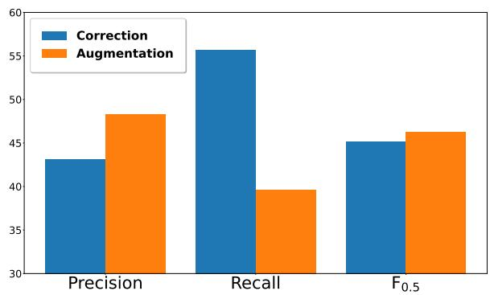
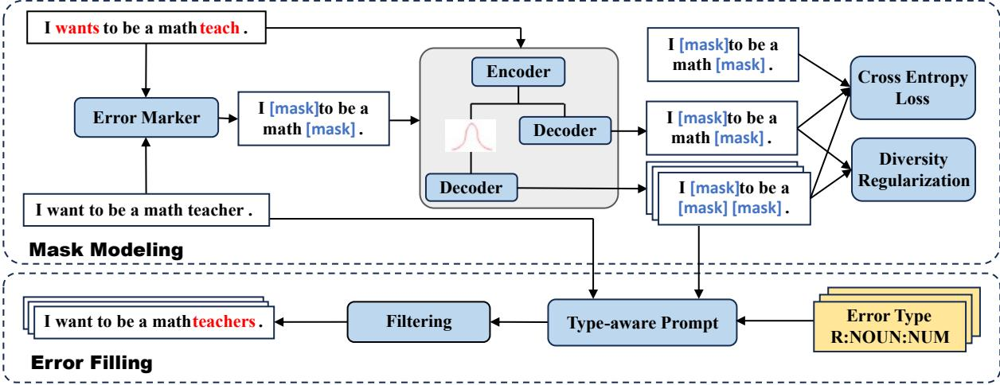
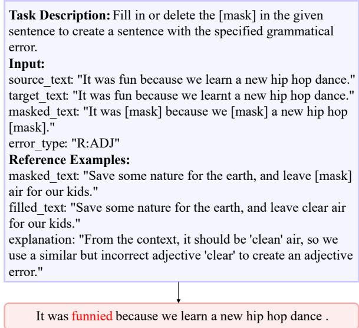
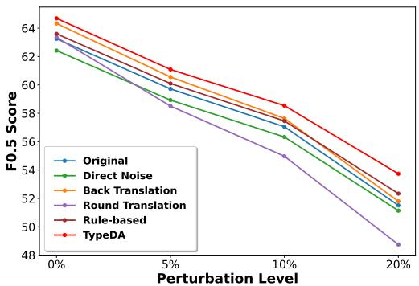
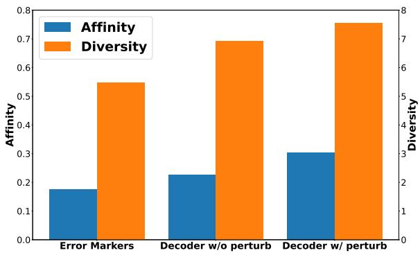

# Large Language Models are Good Annotators for Type-aware Data Augmentation in Grammatical Error Correction

Xinyuan Li East China Normal University xyli@stu.ecnu.edu.cn

Yunshi Lan\* East China Normal University yslan@dase.ecnu.edu.cn

## Abstract

Large Language Models (LLMs) have achieved outstanding performance across various NLP tasks. Grammatical Error Correction (GEC) is a task aiming at automatically correcting grammatical errors in text, but it encounters a severe shortage of annotated data. Researchers have tried to make full use of the generalization capabilities of LLMs and prompt them to correct erroneous sentences, which however results in unexpected over-correction issues. In this paper, we rethink the role of LLMs in GEC tasks and propose a method, namely TypeDA, considering LLMs as the annotators for type-aware data augmentation in GEC tasks. Different from the existing data augmentation methods, our method prevents in-distribution corruption and is able to generate sentences with multi-granularity error types. Our experiments verify that our method can generally improve the GEC performance of different backbone models with only a small amount of augmented data. Further analyses verify the high consistency and diversity of the pseudo data generated via our method. Our code can be accessed via the provided URL1.

## 1 Introduction

Large Language Models (LLMs) have demonstrated superior performance in many downstream tasks (Liu et al., 2023; Moslem et al., 2023) due to their emergent and in-context learning abilities. As a fundamental NLP downstream task (Ma et al., 2022), Grammatical Error Correction (GEC) aims to automatically identify and correct grammatical errors in text (Bryant et al., 2023a; Wang et al., 2020), which is challenging due to the unrestricted mutability of language and a lack of abundant annotated data. Intuitively, some researchers (Fang et al., 2023; Wu et al., 2023) attempt to utilize LLMs to solve GEC tasks. However, the results are unsatisfactory, as LLMs suffer from the overcorrection issue, which indicates that they may dramatically change the semantics of the original sentences (Bryant et al., 2023b). This invokes our reflection on the role of LLMs in GEC tasks. Therefore, we raise the question: Are LLMs good correctors in GEC tasks?

  
Figure 1: Performance of GEC on CoNLL-14 Test set with GPT-4.

Motivated by this, we conduct a preliminary study. We prompt GPT-42 to directly correct an erroneous sentence and request GPT-4 to generate more erroneous sentences and fine-tune a T5- large model. Figure 1 reveals that even with a small model and small data size (18K), it outperforms GPT-4, which showcases the potentials of LLMs as a tool to augment the data instead of correcting3. Nevertheless, it is not trivial to directly prompt LLMs to augment data. We investigate the augmented data and find that LLMs may generate some unexpected pseudo data. For example, given the text “Captain at sports is what I did in high school .”, GPT-4 generates “I was the captain of the sports team in high school.”, which changes the syntactic structure of the original sentence. Therefore, it is imperative to design a framework involving LLMs as a good annotator to augment data in a controllable manner.

To this end, we propose a Type-aware method based on LLMs for Data Augmentation (TypeDA) in GEC tasks, which is able to produce erroneous sentences with a certain error type given a sentence. Comparing with the existing methods (Zhao et al., 2019; Choe et al., 2019a; Wan et al., 2020; Xie et al., 2018) for data augmentation of GEC tasks, which either rely on the manually crafted rules to edit text spans or Seq2seq model to sequentially generate an erroneous sentence, our method has advantages in preventing in-distribution corruption (Choe et al., 2019b) and being aware of the error types. Specifically, we decompose the augmentation process into mask modeling and error filling. In the mask modeling step, a multi-decoder aims to detect the errors in a sentence that are likely to be distributed within the realistic dataset and replace them with masks. In the error filling step, a type-aware prompting strategy is used to request LLMs to fill in the masks with various errors derived from a type set. Experiments on BEA-19 Test set and CoNLL-14 Test set showcase that our method is able to surpass other augmentation methods on different GEC models with varying architectures and parameter scales. Additionally, our method can be applied to solve long-tail errors and improve the robustness of general GEC models.

Our contributions of this paper can be summarized as follows:

• We initially convert the role of LLMs from corrector to augmenter in GEC tasks and propose TypeDA, which leverages LLMs as a good annotator to augment data for GEC tasks in a controllable way.

• TypeDA introduces a novel framework to generate pseudo data with the intervention of LLMs. A multi-decoder is first proposed to detect the error markers in a sentence, then the type-aware prompting is leveraged to generate an error for the marker.

• Experiments verify the generalization of TypeDA and analyses reveal the consistency and type compliance of the generated data.

## 2 Related Work

Data Augmentation for GEC Tasks. In GEC tasks, the scarcity of high-quality annotated data leads to a data sparsity problem (Bryant et al., 2023b). To address this, researchers use data augmentation to reduce the need for labor-intensive manual annotation and enhance model generalization (Feng et al., 2021). From the perspectives of the patterns to augment, we categorize GEC data augmentation methods into edit-based and sequence-based. (1) Edit-based augmentation creates new data samples by editing (e.g., modifying, replacing and deleting) text spans randomly or based on certain rules, such as direct noise (Zhao et al., 2019), error patterns (Choe et al., 2019a; Ye et al., 2023b) and some rule-based methods (Wan et al., 2020; Wang and Zheng, 2020; Tang et al., 2021). (2) Sequence-based augmentation utilizes Seq2seq models to take the entire source sentence as input to generate the entire target text, such as round-translation (Zhou et al., 2019) and backtranslation (Xie et al., 2018; Kiyono et al., 2019). For our method, we combine the characteristics of edit-based augmentation and sequence-based augmentation, proposing mask modeling to extract possible text spans to be edited and forward the masked sequence to the LLMs for augmentation.

GEC with Large Language Models. Some studies have explored the potential of LLMs in GEC (Penteado and Perez, 2023; Wu et al., 2023). However, results show that LLMs have a tendency to over-correct for fluency (Bryant et al., 2023b), which leads to the low precision. Research (Fang et al., 2023; Zhang et al., 2023) has managed to perform supervised fine-tuning to address this issue but still got unsatisfactory results. Therefore, some studies propose to change the role of LLMs from correctors to evaluators (Kobayashi et al., 2024; Li et al., 2024) and explainers (Li et al., 2024) to make full use of large language models in the training and evaluation process of GEC small models. In comparison, we consider the role of LLMs in GEC as data annotators. By leveraging the generalization capabilities of LLMs, we can perform data augmentation to help improve the performance of smaller GEC models.

## 3 Background

Formally, given a dataset $\mathcal { D } _ { r } = \{ ( X _ { i } , Y _ { i } ) \} _ { i = 1 } ^ { | D _ { r } | }$ where $X = \{ x _ { 1 } , x _ { 2 } , . . . , x _ { n } \}$ denotes a source sequence of tokens with grammatical errors and $Y = \{ y _ { 1 } , y _ { 2 } , . . . , y _ { m } \}$ denotes its target corrected sequence. Generally, a GEC(X) model learns to translate X to Y, which can have various model architectures such as Seq2seq (Ge et al., 2019) and Seq2edit (Stahlberg and Kumar, 2020).

Data augmentation for GEC tasks aims to generate extra data for supervised training, which is denoted as $\mathcal { D } _ { p } = \{ ( \hat { X _ { i } } , \bar { Y _ { i } } ) \} _ { i = 1 } ^ { | D _ { p } | }$ . In this paper, we highlight two key aspects of augmentation:

• Consistent. The augmented data should demonstrate less distribution shift in the perspectives of semantics as well as syntax and maintain in-distribution grammatical errors when compared to the real-world data.

• Type-aware. The augmentation procedure should be controllable to generate the expected types of grammatical errors. Hence, we can manipulate the augmentation and improve the capability to solve long-tail grammatical errors. For simplicity, we denote the type set for augmentation as A.

We identify some representative existing data augmentation techniques for GEC tasks as follows: Direct Noise randomly applies span-based editing operations (Lichtarge et al., 2019; Kiyono et al., 2020) to the source sequence $\operatorname { D A } ( X ) \ =$ $\mathrm { N O I S E } ( X \to { \hat { X } } )$ . However, the distribution of these data deviates significantly from real data, and excessive noises can dramatically alter the semantics of sentences.

Back Translation reverses the GEC tasks, which treats the source sequence as the target and the target sequence as the source via building a parameterized model $\mathrm { D A } ( Y ) = P _ { \phi } ( { \hat { X } } | Y )$ (Kiyono et al., 2019; Yuan et al., 2019; Koyama et al., 2021). However, this method only covers the grammatical errors present in the training data resulting in limited error types.

Round Translation augments data with a bridge language (e.g., English-Chinese-English) via an off-the-shelf translation tool (Zhou et al., 2019; Bryant et al., 2023b) , that is $\operatorname { D A } ( X ) = \mathbf { M } \mathrm { T } ( X \to$ $Z \to { \hat { X } } )$ . However, it relies heavily on the performance of the machine translation and is limited to uncontrollable sentence variances.

Rule-based Method injects errors into a sentence following a pre-defined rules or patterns (Xu et al., 2019; Wang and Zheng, 2020; Tang et al., 2021), formally ${ \mathrm { D A } } ( X ) = { \mathrm { R U L E } } ( X \to { \hat { X } } )$ . Nevertheless, this method depends on human annotations and handcrafted rules, which cannot be scaled up easily.

As we can see, existing data augmentation methods exclude the error types and have a lack of controllability to the augmentation. In contrast, TypeDA is a type-aware augmentation method that is able to generate in-distributed pseudo data with pre-defined error types.

## 4 Methods

## 4.1 Overview

To ensure the consistency and type compliance of the augmentation methods. We design TypeDA for GEC tasks, which contains a two-stage procedure of Mask Modeling and Error Filling. For mask modeling, we mask the erroneous text span of the source sequence, which results in a set of in-distribution markers indicating where people are likely to make grammatical errors. We first extract pseudo error markers from the original data set $\mathcal { D } _ { r } .$ Then we train a Seq2seq model with direct noise and multi-decoders to predict mask markers for a sequence. For error filling, we replace the mask markers with the erroneous content with the hints of error types. We first identify the possible error types. Then we prompt LLMs with the pre-defined error types and filter out the bad cases. As a result, we obtain a set of augmented sentence pairs to form ${ \mathcal { D } } _ { p } .$ . The overall architecture of our method is shown in Figure 2.

## 4.2 Mask Modeling via Multi-decoder

For in-distributed masking modeling, we learn the error pattern with a Seq2seq model. Specifically, we formulate the mask modeling task as a binary classification problem, where the target is to predict if we need to mask the token or not.

Extracting pseudo error markers. Given $\mathcal { D } _ { r }$ , we compare the source sentence X with the target sentence Y and obtain the edit positions. For example, “{I, wants, to, be, a, math, teach}” is the source sequence and its corresponding target is “{I, want, to, be, a, math, teacher}”. Hence, we locate the edit spans and replace them as [MASK] and obtain ${ ^ { 6 6 } } \{ I ,$ [MASK], to, be, a, math, [MASK]}” as error markers. We denote the pseudo error markers as M.

Learning the error distributions via multidecoders. After we obtain a set of sentence pairs (X, M), we train a Seq2seq model to learn the translation. Specifically, this model has an encoderdecoder architecture, where X is first encoded via Transformer. Next, the Transformer is deployed as the decoder to generate the error markers. We

  
Figure 2: The overall architecture of TypeDA.

denote the procedure as:

$$
\begin{array} { c } { { H = \mathrm { E n c o d e r } ( X ) } } \\ { { P _ { \phi } ( M | X ) = \mathrm { D e c o d e r } ( H ) } } \\ { { \mathcal { L } _ { m a s k } = - \log P _ { \phi } ( M | X ) } } \end{array}
$$

However, if we simply perform a one-way translation from source text to target text, we may learn limited error patterns. To increase the diversity of the generation, inspired by multiple decoder networks in machine translation and math word problem solving (Zhang et al., 2020), we include multi-decoders to perturb the output of the input to increase the possibility of getting diverse error markers. In detail, given the output of an encoder H, we first define a mask rate $\beta ,$ then we sample a p percent region for masking in H from a Gaussian distribution. As a result, we compute another cross entropy as follows:

$$
\begin{array} { r l } & { P _ { \phi } ( M | X ; p _ { p e r t u r b } ) =  { \mathrm { D e c o d e r } } ( H \odot p _ { p e r t u r b } ) } \\ & { \qquad \quad \mathcal { L } _ { p e r t u r b } = - \log P _ { \phi } ( M | X ; p _ { p e r t u r b } ) . } \end{array}
$$

As we can see, we add perturbation to the input in a hidden dense space, which can not only make the mask modeling more stable under different contexts, but also to some extent increase the variety of the generated masks during inference. Besides, we increase the differences between the outputs of the original decoder and the perturbed decoder by maximizing the distance between them:

$$
\mathcal { L } _ { d i v } = - \| P _ { \phi } ( M | X ) - P _ { \phi } ( M | X ; p _ { p e r t u r b } ) \| _ { p } ,
$$

where p is the p-norm, which measures the distance of two distributions (De Cao et al., 2021). Thus, the comprehensive loss is formulated as:

$$
\mathcal { L } _ { t o t a l } = \alpha ( \mathcal { L } _ { m a s k } + \mathcal { L } _ { p e r t u r b } ) + \beta \mathcal { L } _ { d i v } ,
$$

where α and $\beta$ are two hyper-parameters to denote the importance of the factors. During inference, we randomly sample perturbation for multiple times and generate multiple outputs as candidates Mˆ .

## 4.3 Error Filling via Type-aware Prompting

Next, we fill in the masks with the possible errors belonging to a certain type. Considering the strong generalization capability of LLMs, we request LLMs to fill in the masks with type-aware prompts. Compared with the naive augmentation of LLMs as shown in Figure 1, it is more controllable to achieve error filling via LLMs. For each mask, we first sample an error type according to their occurrence probabilities. We then prompt LLMs with type-aware templates and filter out the bad cases, which results in a set of high-quality augmented data.

Identifying multi-granularity error types. We follow the error types defined in prior studies (Bryant et al., 2017) to identify 51 categories4. These error types includes three levels of granularity. (1) Edit operation is the operations to edit the erroneous sentences, including Missing, Replacement and Unnecessary. (2) Main type is the object types to edit, including NOUN, ADJ and etc,. (3) Full type is the fine-grained error types to edit, including Missing Noun, Replacement Noun and so on.

Nevertheless, given a mask, it is not rationale to sample an error type with uniform distribution. As we know, certain error types are more common than the other error types. For example, the error of Missing Determiner is more frequent than Missing Conjunction in real data. To this end, we sample the error type based on its occurrence probabilities in $\mathcal { D } _ { r }$ . These probabilities are calculated using the square root of the frequency of each error type to perverse the variance of the distribution while maintaining relative priority.

  
Figure 3: An example of the prompt template and the output of LLMs.

Prompting LLMs with type-aware templates. Once we sample an error type $a \in { \mathcal { A } } ,$ , we request an LLM to produce an erroneous sentence with this error type by filling the masks. To further control the outputs, we manually craft demonstrations for each error $\mathrm { t y p e } ^ { 5 }$ and apply in-context learning (Dong et al., 2022) to encourage LLMs to generate similar sentences satisfying the error types. Simply, we denote this procedure as:

$$
\hat { X } = L L M ( X , Y , \hat { M } , a ) .
$$

We display an example in Figure 3. For each masked sentence and error type, we may obtain multiple erroneous sentences as outputs.

Filtering out ill-posed augmentation. Due to hallucination issue (Ye et al., 2023a) in LLMs, some of the augmented data may be meaningless or fail to meet the requirements. Therefore, we simply filter out the bad cases: 1) There still exists [MASK] symbols in the output; 2) The LLMs generate more errors. For this case, we employ ERRANT toolkit (Bryant et al., 2017), which is a rule-based framework to extract the error type given a data pair, to parse the edit and check if the generated errors meet the required error types. 3) Due to the over-correction issue of LLMs (Bryant et al., 2023b), we measure the Levenshtein distance between the pseudo data sequence and the source sequence to prevent the unexpected changes. Eventually, we obtain a set of augmented data, denoted as $\mathcal { D } _ { p } = \{ ( \hat { X } , Y ) \}$ . It is merged with $\mathcal { D } _ { r }$ for fine-tuning a GEC model.

<table><tr><td>Dataset</td><td>Usage</td><td>Sentences</td><td>Tokens</td></tr><tr><td>W&amp;I+LOCNESS</td><td>Training</td><td>34,308</td><td>628,720</td></tr><tr><td>FCE</td><td>Training</td><td>17,714</td><td>346,924</td></tr><tr><td>BEA-19 Dev</td><td>Validation</td><td>4,384</td><td>86,973</td></tr><tr><td>BEA-19 Test</td><td>Testing</td><td>4,477</td><td>85,668</td></tr><tr><td>CoNLL-14 Test</td><td>Testing</td><td>1,312</td><td>30,144</td></tr></table>

Table 1: Statistics of GEC datasets in our experiments.

## 5 Experimental Settings

Datasets and Evaluation. We use the data sets of W&I+LOCNESS (Bryant et al., 2019) (collectively referred to as BEA-train) and FCE (Yannakoudakis et al., 2011) as the training data for all test sets. BEA-19 Dev serves as the validation dataset for all model training, while BEA-19 Test and CoNLL-14 Test (Ng et al., 2014) are used as the test datasets. The BEA-19 Test is evaluated through the official evaluation channel6, whereas the CoNLL-14 Test is evaluated using the M2Scorer (Dahlmeier and Ng, 2012). The statistical results of the datasets are shown in Table 1. We choose Precision (P), Recall (R), and $\mathrm { F _ { 0 . 5 } }$ score as our basic evaluation metrics.

GEC Backbone Models. Our GEC backbone models include Seq2seq-based methods (i.e., Bartbase (Lewis et al., 2019), T5-base, and T5- large (Raffel et al., 2020)) and Seq2edit-based method (i.e., GECToR (Omelianchuk et al., 2020)), allowing us to explore the generalization of our data augmentation methods under different architectures and parameter scales. The above methods are recognized as effective methods for GEC tasks (Qorib and Ng, 2022) and their hyperparameter settings are provided in Appendix B.

Comparable Methods. To comprehensively evaluate TypeDA, we compare TypeDA with a range of augmentation techniques described in Section 3. For Direct Noise, we follow the study (Lichtarge et al., 2019). Specifically, we randomly sample multiple spans in each sentence as well as an edit from Deletion, Insertion, Replacement, and Transposition with uniform distribution to augment the data. For Back Translation, we follow the implementation of (Yuan et al., 2019), treating grammatically correct sentences as inputs of T5 model and erroneous sentences as outputs. We further control the quality of the generated sentences by measuring their perplexity via a language model. For Round Translation, we refer to the implementation of (Lichtarge et al., 2019) and employ a well-trained T5 model as the translator to first translate the source sentence from English to Chinese, then translate it back to English. For Rule-based method, we follow the implementation of (Wang and Zheng, 2020) to first analyze the erroneous sentence and apply their pre-defined rules (e.g., Singular → Plural, Adjectives → Adverbs) to generate erroneous sentences.

<table><tr><td rowspan="2">Model</td><td rowspan="2">Augmentation</td><td rowspan="2">Data Size</td><td colspan="3">BEA-19 Test</td><td colspan="3">CoNLL-14 Test</td></tr><tr><td>P</td><td>R</td><td> ${ \bf F } _ { 0 . 5 }$ </td><td>P</td><td>R</td><td> ${ \bf F } _ { 0 . 5 }$ </td></tr><tr><td rowspan="6">T5-base</td><td></td><td>36K</td><td>65.64</td><td>55.19</td><td>63.25</td><td>64.53</td><td>40.15</td><td>57.54</td></tr><tr><td>Direct Noise</td><td>52K</td><td>63.91</td><td>57.09</td><td>62.42</td><td>64.28</td><td>41.16</td><td>57.79</td></tr><tr><td>Back Translation</td><td>52K</td><td>65.95</td><td>58.56</td><td>64.33</td><td>67.61</td><td>42.26</td><td>60.37</td></tr><tr><td>Round Translation</td><td>52K</td><td>65.38</td><td>56.38</td><td>63.35</td><td>47.23</td><td>51.03</td><td>47.94</td></tr><tr><td>Rule-based</td><td>52K</td><td>64.90</td><td>58.89</td><td>63.60</td><td>65.17</td><td>42.49</td><td>58.88</td></tr><tr><td>TypeDA</td><td>52K</td><td>66.04</td><td>59.80</td><td>64.69</td><td>65.99</td><td>43.09</td><td>59.65</td></tr><tr><td rowspan="6">BART-base</td><td></td><td>36K</td><td>52.84</td><td>50.61</td><td>52.38</td><td>49.56</td><td>38.83</td><td>46.96</td></tr><tr><td>Direct Noise</td><td>52K</td><td>53.14</td><td>50.11</td><td>52.50</td><td>53.72</td><td>35.50</td><td>48.72</td></tr><tr><td>Back Translation</td><td>52K</td><td>49.79</td><td>51.39</td><td>50.10</td><td>55.46</td><td>38.91</td><td>51.11</td></tr><tr><td>Round Translation</td><td>52K</td><td>58.51</td><td>40.20</td><td>53.63</td><td>46.85</td><td>41.61</td><td>45.70</td></tr><tr><td>Rule-based</td><td>52K</td><td>52.01</td><td>46.75</td><td>50.86</td><td>53.90</td><td>35.61</td><td>48.88</td></tr><tr><td>TypeDA</td><td>52K</td><td>56.02</td><td>50.22</td><td>54.76</td><td>53.98</td><td>36.54</td><td>49.28</td></tr><tr><td rowspan="6">GECToR</td><td></td><td>36K</td><td>56.46</td><td>34.36</td><td>50.20</td><td>53.61</td><td>24.56</td><td>43.36</td></tr><tr><td>Direct Noise</td><td>52K</td><td>53.61</td><td>34.02</td><td>48.07</td><td>48.26</td><td>30.83</td><td>43.36</td></tr><tr><td>Back Translation</td><td>52K</td><td>52.14</td><td>33.56</td><td>46.94</td><td>57.09</td><td>20.35</td><td>41.94</td></tr><tr><td>Round Translation</td><td>52K</td><td>56.60</td><td>4.62</td><td>17.41</td><td>20.82</td><td>5.69</td><td>13.59</td></tr><tr><td>Rule-based</td><td>52K</td><td>54.17</td><td>39.00</td><td>50.26</td><td>53.77</td><td>24.60</td><td>43.46</td></tr><tr><td>TypeDA</td><td>52K</td><td>57.25</td><td>36.20</td><td>51.29</td><td>51.12</td><td>28.12</td><td>43.93</td></tr><tr><td rowspan="6">T5-large</td><td></td><td>55K</td><td>65.08</td><td>61.48</td><td>64.33</td><td>65.17</td><td>43.21</td><td>59.16</td></tr><tr><td>Direct Noise</td><td>76K</td><td>67.43</td><td>58.53</td><td>65.44</td><td>68.84</td><td>42.42</td><td>61.21</td></tr><tr><td>Back Translation</td><td>76K</td><td>66.12</td><td>63.97</td><td>65.68</td><td>66.72</td><td>47.43</td><td>61.70</td></tr><tr><td>Round Translation</td><td>76K</td><td>68.00</td><td>59.07</td><td>66.01</td><td>47.94</td><td>54.97</td><td>49.20</td></tr><tr><td>Rule-based</td><td>76K</td><td>67.35</td><td>60.43</td><td>65.85</td><td>66.65</td><td>43.41</td><td>60.20</td></tr><tr><td>TypeDA</td><td>76K</td><td>69.13</td><td>59.16</td><td>66.87</td><td>68.24</td><td>45.60</td><td>62.08</td></tr></table>

Table 2: Performance comparison of different models with various augmentation methods on BEA-19 Test and CoNLL-14 Test datasets. Data size represents the amount of $\mathcal { D } _ { r } \bigcup \mathcal { D } _ { p }$

## 6 Results and Analyses

## 6.1 Main Results

Table 2 showcases the results of data augmentation. We have the following observations: (1) TypeDA achieves better performance across different parameters, different GEC models and various evaluation datasets, with precision and $\mathrm { F _ { 0 . 5 } }$ scores being higher than those of other data augmentation methods in most cases. T5-large model achieves the best performance with $\mathrm { F _ { 0 . 5 } }$ scores of 66.87 on the BEA-19 Test and 62.08 on the CoNLL-14 Test, yielding satisfactory results given the relatively smaller data size. (2) The pre-trained Seq2seq models (i.e., T5- base, BART-base, T5-large) show a high tolerance to the augmented data, and various data augmentation methods generally improve the performance of GEC models. This improvement is typically reflected in increased precision, indicating that the augmented data helps the language models adjust to the GEC tasks. (3) In contrast, augmented data can easily degrade the performance of a Seq2edit model (i.e., GECToR). Particularly, we observe a dramatic decrease with the augmented data from the round translation method. This may be because the Seq2edit model are more sensitive to the noisy augmented data of low-quality. The consistency of improvement brought by TypeDA further verifies the high quality of our generated sentences.

Additionally, we use the Affinity and Diversity coefficients proposed by MixEdit (Ye et al., 2023b) as an intrinsic evaluation of the data augmentation, which measures the in-distribution degree and variety of the generated data, respectively. Since our data augmentation method filters out sentences that do not meet the requirements, we calculate Affinity and Diversity using the subset of the original data that is aligned with the augmented data. As we can see from Table 3, TypeDA achieves higher Affinity and Diversity compared to MixEdit, indicating that the distribution of our augmented data is more consistent with the original data and exhibits greater variety. Additionally, while we observe an increase in precision and a decrease in recall compared to other baselines, TypeDA achieves a higher $\mathrm { F _ { 0 . } }$ 5 score on the BEA-19 Dev set.

<table><tr><td rowspan="2">Augmentation</td><td rowspan="2">A</td><td rowspan="2">D</td><td colspan="3">BEA-19 Dev</td></tr><tr><td>P</td><td>R</td><td> ${ \bf F } _ { 0 . 5 }$ </td></tr><tr><td>一</td><td></td><td>7.79</td><td>53.65</td><td>38.57</td><td>49.76</td></tr><tr><td>Direct Noise</td><td>0.41</td><td>10.70</td><td>53.89</td><td>39.72</td><td>50.30</td></tr><tr><td>Round Translation</td><td>0.75</td><td>10.54</td><td>50.32</td><td>39.82</td><td>47.80</td></tr><tr><td>Back Translation</td><td>1.57</td><td>8.22</td><td>54.94</td><td>42.87</td><td>52.01</td></tr><tr><td>MixEdit(Static)</td><td>2.33</td><td>8.52</td><td>57.98</td><td>37.78</td><td>52.38</td></tr><tr><td>TypeDA</td><td>2.45</td><td>8.60</td><td>57.79</td><td>38.31</td><td>52.45</td></tr></table>

Table 3: Results of affinity (denoted as A) and diversity (denoted as D) on BEA-train data sets of various augmentation methods. The results of other methods are copied from MixEdit (Ye et al., 2023b) and all the methods are built upon BART-large.

## 6.2 Analyses

We conducted more analyses and the findings revealed:

TypeDA can be applied to solve long-tail errors and balance the distribution of error types. Since TypeDA has the advantages of producing type-aware erroneous sentences, we identify the proportion of certain type errors generated via TypeDA. Table 4 presents the results of BEA-19 Test set on several error types, which includes longtail errors such as CONJ, NOUN:POSS, and ADV. As we can see, our augmentation method could boost the performance of certain errors. We also compute the proportion of error types in original data set and our augmented data, which indicates that TypeDA could generate type-aware erroneous sentences as we expected. This is also helpful in balancing the error types in a dataset.

TypeDA is able to improve the robustness of GEC systems. We apply the well-trained model for masking to BEA-19 Test set and fill in the errors via our type-aware prompting. We control the ratio of the augmented data as 5%, 10%, and 20% in test set. This simulates the adversarial attacks and we test the gain of robustness brought by different augmentation methods. The results are shown in Figure 4. The model trained with our data augmentation method consistently achieves the highest $\mathrm { F _ { 0 . 5 } }$ score. In addition, amongst all the augmentation methods, the decrease of $\mathrm { F _ { 0 . 5 } }$ score caused by the increasing adversarial ratio is the lowest. This experiment demonstrates that our data augmentation method is superior on encountering adversarial attacks in GEC.

Figure 4: Results of adversarial attacks on BEA-19 Test set. The GEC backbone model is T5-base.  
  
Figure 5: Results of affinity and diversity of data generated by decoders with or without perturbation.

TypeDA could generate the error distribution closer to real-world. To investigate how augmentation shifts data with respect to the error patterns in real-world, on BEA-19 Dev set, we first treat the source sentences to the target sentences as the ground truth transition and consider the source sentences to the masked sentences produced via error markers as the oracle transition for error positions. Then we measure the affinity and diversity between the ground truth and oracle. After that, we consider the outputs produced by decoders with or without perturbation as the prediction transition in turn and compare their affinity and diversity with reference. The results shown in Figure 5, we find that the decoders trained via TypeDA have the similar affinity to the error markers, which can be deemed as an oracle of the error positions. Particularly, the decoders with perturbation demonstrate some variance but it is still distributed within the realistic dataset and it has a higher diversity value compared to the decoders without perturbation.

## 6.3 Case Study

We provide an example of different augmented sentences corresponding to a specific target sentence in Table 5. As we specify R:SPELL, R:WO, M:ADV errors, LLMs fill the different mask sentences into the expected augmented sentences. For other data augmentation methods, Direct Noise modifies semantics of the sentence. Back Translation and Rule-based methods generate limited errors, while Round Translation produces unnecessary revision to the sentences. In contrast, TypeDA clearly follows the demand of error types and generates desired sentence as data augmentation, which verifies the advantages of TypeDA.

<table><tr><td rowspan="2">Type</td><td rowspan="2">Prop. w/o DA</td><td rowspan="2">Prop. of DA</td><td colspan="3">T5-large w/o DA</td><td colspan="3">T5-large w/ DA</td></tr><tr><td>P</td><td>R</td><td> $\overline { { \mathrm { F } _ { 0 . 5 } } }$ </td><td>P</td><td>R</td><td> $\overline { { \mathrm { F } _ { 0 . 5 } } }$ </td></tr><tr><td>M</td><td>27.16%</td><td>21.50%</td><td>57.44</td><td>59.46</td><td>57.83</td><td>68.97</td><td>55.85</td><td>65.88</td></tr><tr><td>R</td><td>60.30%</td><td>58.43%</td><td>68.82</td><td>61.33</td><td>67.18</td><td>69.56</td><td>59.76</td><td>67.35</td></tr><tr><td>U</td><td>12.55%</td><td>20.07%</td><td>63.36</td><td>67.18</td><td>64.09</td><td>67.09</td><td>63.10</td><td>66.25</td></tr><tr><td>CONJ</td><td>0.68%</td><td>0.90%</td><td>38.46</td><td>18.52</td><td>31.65</td><td>61.54</td><td>28.57</td><td>50.00</td></tr><tr><td>NOUN:POSS</td><td>0.78%</td><td>1.27%</td><td>82.50</td><td>51.56</td><td>73.66</td><td>81.82</td><td>57.14</td><td>75.31</td></tr><tr><td>PUNCT</td><td>18.10%</td><td>13.83%</td><td>56.75</td><td>64.34</td><td>58.12</td><td>72.24</td><td>61.54</td><td>69.82</td></tr><tr><td>M:ADV</td><td>0.52%</td><td>0.76%</td><td>53.33</td><td>40.00</td><td>50.00</td><td>64.71</td><td>50.00</td><td>61.11</td></tr><tr><td>R:ADV</td><td>0.97%</td><td>0.85%</td><td>56.67</td><td>58.62</td><td>57.05</td><td>59.09</td><td>54.17</td><td>58.04</td></tr><tr><td>U:ADV</td><td>0.51%</td><td>1.65%</td><td>40.00</td><td>43.48</td><td>40.65</td><td>54.55</td><td>52.17</td><td>54.05</td></tr><tr><td>M:NOUN</td><td>0.65%</td><td>1.55%</td><td>14.81</td><td>36.36</td><td>16.81</td><td>16.00</td><td>30.77</td><td>17.70</td></tr><tr><td>R:NOUN</td><td>4.25%</td><td>4.13%</td><td>39.83</td><td>43.12</td><td>40.45</td><td>47.25</td><td>41.75</td><td>46.04</td></tr><tr><td>U:NOUN</td><td>0.61%</td><td>1.60%</td><td>0.00</td><td>0.00</td><td>0.00</td><td>7.69</td><td>16.67</td><td>8.62</td></tr></table>

Table 4: Results of BEA-19 Test set on breakdown error types. Prop. denotes the proportion of certain error types we identified in Section 4.3. DA is the abbreviation of data augmentation.
<table><tr><td>Target Source Direct Noise Back Translation Round Translation</td><td>The possible reason is these international students can not speak English fluently. The possible reason is these international students can not speak English flowing. The possible reasonisthese international students can not speak a English flowing. The possible reason is these international students could not speak English fluently</td></tr></table>

Table 5: Case Study.

## 6.4 Ablation Study

We evaluate the effect of the individual modules in our proposed approach. (1) Effect of error marker. To assess the effectiveness of the error marker, we compared model performance on data generated with error marker to data generated with random masking. As shown in Table 6, error marker outperforms random masking in all metrics. (2) Effect of prompt template. The prompt template can guide LLMs to more appropriately fill masked sentences. We provide two different ways as input to the LLMs: only the masked sentence and sampled error types as input (as zeroshot) vs. our prompt templates as input. The results in Table 6 verify the effect of our prompt template. (3) Effect of encoder-decoder. We evaluated encoder-decoder structure by comparing sentences generated using only the encoder (with perturbations) against those generated with the full encoder-decoder structure. The encoder-decoder structure leads to higher diversity in Table 7.

<table><tr><td></td><td colspan="3">BEA-19 Test</td></tr><tr><td>Random Masking</td><td>P 54.43</td><td>R</td><td> $\mathrm { F } _ { 0 . 5 }$ </td></tr><tr><td>Error Marker</td><td>57.45</td><td>54.49 55.64</td><td>54.44 57.08</td></tr><tr><td>Zero-Shot</td><td>54.29</td><td>50.03</td><td>53.38</td></tr><tr><td>Prompt Template</td><td>56.22</td><td>56.09</td><td>56.19</td></tr></table>

Table 6: Ablation study for error marker and prompt template on the BEA-19 Test set using the T5-base model with a data size of 11K. The number of masked positions in random masking matches the number of grammatical errors.

<table><tr><td></td><td>Affinity</td><td>Diversity</td></tr><tr><td>Encoder-only</td><td>2.94</td><td>5.73</td></tr><tr><td>Encoder-Decoder</td><td>2.94</td><td>6.02</td></tr></table>

Table 7: Diversity comparison of masked sentences generated by encoder-only versus encoder-decoder on the BEA-19 Train set using the T5-base model with a data size of 11K.

## 7 Conclusions

In this paper, we propose a grammatical error typeaware data augmentation method, decomposing the augmentation process into mask modeling and error filling. Experiments show that our data augmentation method can generate consistent and typeaware data, which could effectively improve the performance of GEC models.

## Ethics Statement

In our study on Grammatical Error Correction, no personal information was collected, ensuring the ethical integrity of our research. We emphasize that this endeavor involved no risk. Our commitment to ethical standards is unwavering.

## Limitations

The limitations of our study may be from two aspects. First, the GEC task is challenging for other languages in practice but we have not yet explored the possibility of TypeDA on non-English datasets, especially low-resource languages. Second, TypeDA maybe under the influence of different design of error types, which still relies on the annotation from the experts. In the future, we will investigate the automatic construction of error types to bridge the gap.

## Acknowledgements

The authors would like to thank the anonymous reviewers for their insightful comments. This work is supported by the Young Scientists Project (No. 62206097) and the Funds for International Cooperation and Exchange of the National Natural Science Foundation of China (No. W2421085) .

## References

Josh Achiam, Steven Adler, Sandhini Agarwal, Lama Ahmad, Ilge Akkaya, Florencia Leoni Aleman, Diogo Almeida, Janko Altenschmidt, Sam Altman, Shyamal Anadkat, et al. 2023. Gpt-4 technical report. arXiv preprint arXiv:2303.08774.

Christopher Bryant, Mariano Felice, Øistein E Andersen, and Ted Briscoe. 2019. The bea-2019 shared task on grammatical error correction. In Proceedings of the fourteenth workshop on innovative use of NLP for building educational applications, pages 52– 75.

Christopher Bryant, Zheng Yuan, Muhammad Reza Qorib, Hannan Cao, Hwee Tou Ng, and Ted Briscoe. 2023a. Grammatical error correction: A survey of the state of the art. Computational Linguistics, pages 643–701.

Christopher Bryant, Zheng Yuan, Muhammad Reza Qorib, Hannan Cao, Hwee Tou Ng, and Ted Briscoe. 2023b. Grammatical error correction: A survey of the state of the art. Computational Linguistics, 49(3):643–701.

CJ Bryant, Mariano Felice, and Edward Briscoe. 2017. Automatic annotation and evaluation of error types for grammatical error correction. Association for Computational Linguistics.

Yo Joong Choe, Jiyeon Ham, Kyubyong Park, and Yeoil Yoon. 2019a. A neural grammatical error correction system built on better pre-training and sequential transfer learning. arXiv preprint arXiv:1907.01256.

Yo Joong Choe, Jiyeon Ham, Kyubyong Park, and Yeoil Yoon. 2019b. A neural grammatical error correction system built on better pre-training and sequential transfer learning. In Proceedings of the Fourteenth Workshop on Innovative Use of NLP for Building Educational Applications, pages 213–227.

Daniel Dahlmeier and Hwee Tou Ng. 2012. Better evaluation for grammatical error correction. In Proceedings of the 2012 Conference of the North American Chapter of the Association for Computational Linguistics: Human Language Technologies, pages 568–572.

Nicola De Cao, Wilker Aziz, and Ivan Titov. 2021. Editing factual knowledge in language models. In Proceedings of the 2021 Conference on Empirical Methods in Natural Language Processing, pages 6491–6506.

Jacob Devlin, Ming-Wei Chang, Kenton Lee, and Kristina Toutanova. 2018. Bert: Pre-training of deep bidirectional transformers for language understanding. arXiv preprint arXiv:1810.04805.

Qingxiu Dong, Lei Li, Damai Dai, Ce Zheng, Zhiyong Wu, Baobao Chang, Xu Sun, Jingjing Xu, and Zhifang Sui. 2022. A survey on in-context learning. arXiv preprint arXiv:2301.00234.

Tao Fang, Shu Yang, Kaixin Lan, Derek F Wong, Jinpeng Hu, Lidia S Chao, and Yue Zhang. 2023. Is chatgpt a highly fluent grammatical error correction system? a comprehensive evaluation. arXiv preprint arXiv:2304.01746.

Steven Y Feng, Varun Gangal, Jason Wei, Sarath Chandar, Soroush Vosoughi, Teruko Mitamura, and Eduard Hovy. 2021. A survey of data augmentation approaches for nlp. arXiv preprint arXiv:2105.03075.

Tao Ge, Xingxing Zhang, Furu Wei, and Ming Zhou. 2019. Automatic grammatical error correction for sequence-to-sequence text generation: An empirical study. In Proceedings of the 57th Annual Meeting of the Association for Computational Linguistics, pages 6059–6064.

Shun Kiyono, Jun Suzuki, Masato Mita, Tomoya Mizumoto, and Kentaro Inui. 2019. An empirical study of incorporating pseudo data into grammatical error correction. arXiv preprint arXiv:1909.00502.

Shun Kiyono, Jun Suzuki, Tomoya Mizumoto, and Kentaro Inui. 2020. Massive exploration of pseudo data for grammatical error correction. IEEE/ACM transactions on audio, speech, and language processing, 28:2134–2145.

Masamune Kobayashi, Masato Mita, and Mamoru Komachi. 2024. Large language models are state-of-theart evaluator for grammatical error correction. arXiv preprint arXiv:2403.17540.

Aomi Koyama, Kengo Hotate, Masahiro Kaneko, and Mamoru Komachi. 2021. Comparison of grammatical error correction using back-translation models. arXiv preprint arXiv:2104.07848.

Mike Lewis, Yinhan Liu, Naman Goyal, Marjan Ghazvininejad, Abdelrahman Mohamed, Omer Levy, Ves Stoyanov, and Luke Zettlemoyer. 2019. Bart: Denoising sequence-to-sequence pre-training for natural language generation, translation, and comprehension. arXiv preprint arXiv:1910.13461.

Yinghui Li, Shang Qin, Jingheng Ye, Shirong Ma, Yangning Li, Libo Qin, Xuming Hu, Wenhao Jiang, Hai-Tao Zheng, and Philip S Yu. 2024. Rethinking the roles of large language models in chinese grammatical error correction. arXiv preprint arXiv:2402.11420.

Jared Lichtarge, Chris Alberti, Shankar Kumar, Noam Shazeer, Niki Parmar, and Simon Tong. 2019. Corpora generation for grammatical error correction. arXiv preprint arXiv:1904.05780.

Aiwei Liu, Xuming Hu, Lijie Wen, and Philip S Yu. 2023. A comprehensive evaluation of chatgpt’s zero-shot text-to-sql capability. arXiv preprint arXiv:2303.13547.

Ilya Loshchilov and Frank Hutter. 2017. Decoupled weight decay regularization. arXiv preprint arXiv:1711.05101.

Shirong Ma, Yinghui Li, Rongyi Sun, Qingyu Zhou, Shulin Huang, Ding Zhang, Li Yangning, Ruiyang Liu, Zhongli Li, Yunbo Cao, et al. 2022. Linguistic rules-based corpus generation for native chinese grammatical error correction. arXiv preprint arXiv:2210.10442.

Yasmin Moslem, Rejwanul Haque, John D Kelleher, and Andy Way. 2023. Adaptive machine translation with large language models. arXiv preprint arXiv:2301.13294.

Hwee Tou Ng, Siew Mei Wu, Ted Briscoe, Christian Hadiwinoto, Raymond Hendy Susanto, and Christopher Bryant. 2014. The conll-2014 shared task on grammatical error correction. In Proceedings of the eighteenth conference on computational natural language learning: shared task, pages 1–14.

Kostiantyn Omelianchuk, Vitaliy Atrasevych, Artem Chernodub, and Oleksandr Skurzhanskyi. 2020. Gector–grammatical error correction: tag, not rewrite. arXiv preprint arXiv:2005.12592.

Martha Stone Palmer, Daniel Gildea, and Nianwen Xue. 2010. Semantic role labeling, volume 6. Morgan & Claypool Publishers.

Maria Carolina Penteado and Fábio Perez. 2023. Evaluating gpt-3.5 and gpt-4 on grammatical error correction for brazilian portuguese. arXiv preprint arXiv:2306.15788.

Muhammad Reza Qorib and Hwee Tou Ng. 2022. Grammatical error correction: Are we there yet? In Proceedings of the 29th International Conference on Computational Linguistics, pages 2794–2800.

Colin Raffel, Noam Shazeer, Adam Roberts, Katherine Lee, Sharan Narang, Michael Matena, Yanqi Zhou, Wei Li, and Peter J Liu. 2020. Exploring the limits of transfer learning with a unified text-to-text transformer. Journal of machine learning research, 21(140):1–67.

Felix Stahlberg and Shankar Kumar. 2020. Seq2edits: Sequence transduction using span-level edit operations. arXiv preprint arXiv:2009.11136.

Zecheng Tang, Yixin Ji, Yibo Zhao, and Junhui Li. 2021. Chinese grammatical error correction enhanced by data augmentation from word and character levels. In Proceedings of the 20th Chinese National Conference on Computational Linguistics, Hohhot, China, pages 13–15.

Zhaohong Wan, Xiaojun Wan, and Wenguang Wang. 2020. Improving grammatical error correction with data augmentation by editing latent representation. In Proceedings of the 28th International Conference on Computational Linguistics, pages 2202–2212.

Lihao Wang and Xiaoqing Zheng. 2020. Improving grammatical error correction models with purposebuilt adversarial examples. In Proceedings of the 2020 Conference on Empirical Methods in Natural Language Processing (EMNLP), pages 2858–2869.

Yu Wang, Yuelin Wang, Jie Liu, and Zhuo Liu. 2020. A comprehensive survey of grammar error correction. arXiv preprint arXiv:2005.06600.

Haoran Wu, Wenxuan Wang, Yuxuan Wan, Wenxiang Jiao, and Michael Lyu. 2023. Chatgpt or grammarly? evaluating chatgpt on grammatical error correction benchmark. arXiv preprint arXiv:2303.13648.

Ziang Xie, Guillaume Genthial, Stanley Xie, Andrew Y Ng, and Dan Jurafsky. 2018. Noising and denoising natural language: Diverse backtranslation for grammar correction. In Proceedings of the 2018 Conference of the North American Chapter of the Association for Computational Linguistics: Human Language Technologies, Volume 1 (Long Papers), pages 619–628.

Shuyao Xu, Jiehao Zhang, Jin Chen, and Long Qin. 2019. Erroneous data generation for grammatical error correction. In Proceedings of the Fourteenth Workshop on Innovative Use of NLP for Building Educational Applications, pages 149–158.

Helen Yannakoudakis, Ted Briscoe, and Ben Medlock. 2011. A new dataset and method for automatically grading esol texts. In Proceedings of the 49th annual meeting of the association for computational linguistics: human language technologies, pages 180–189.

Hongbin Ye, Tong Liu, Aijia Zhang, Wei Hua, and Weiqiang Jia. 2023a. Cognitive mirage: A review of hallucinations in large language models. arXiv preprint arXiv:2309.06794.

Jingheng Ye, Yinghui Li, Yangning Li, and Hai-Tao Zheng. 2023b. Mixedit: Revisiting data augmentation and beyond for grammatical error correction. arXiv preprint arXiv:2310.11671.

Zheng Yuan, Felix Stahlberg, Marek Rei, Bill Byrne, and Helen Yannakoudakis. 2019. Neural and fst-based approaches to grammatical error correction. In Proceedings of the Fourteenth Workshop on Innovative Use of NLP for Building Educational Applications, pages 228–239.

Jipeng Zhang, Roy Ka-Wei Lee, Ee-Peng Lim, Wei Qin, Lei Wang, Jie Shao, and Qianru Sun. 2020. Teacherstudent networks with multiple decoders for solving math word problem. IJCAI.

Yue Zhang, Leyang Cui, Deng Cai, Xinting Huang, Tao Fang, and Wei Bi. 2023. Multi-task instruction tuning of llama for specific scenarios: A preliminary study on writing assistance. arXiv preprint arXiv:2305.13225.

Wei Zhao, Liang Wang, Kewei Shen, Ruoyu Jia, and Jingming Liu. 2019. Improving grammatical error correction via pre-training a copy-augmented architecture with unlabeled data. arXiv preprint arXiv:1903.00138.

Wangchunshu Zhou, Tao Ge, Chang Mu, Ke Xu, Furu Wei, and Ming Zhou. 2019. Improving grammatical error correction with machine translation pairs. arXiv preprint arXiv:1911.02825.

## A Details of preliminary study

We employed a very naive method to require the GPT-4 to augment data with the instruction "Grammar error correction data augmentation and return only the augmented sentence.". Using this method, we augmented a total of 18K augmented sentences and performed supervised fine-tuning on a T5-large model, using the CoNLL-14 Test as the evaluation data. The results in Figure 1 indicate that using the LLMs for data augmentation, even with a simple augmentation method and a small amount of augmented data, can outperform the method directly using the LLMs for grammar correction.

<table><tr><td rowspan="2">Model</td><td colspan="3">CoNLL-14 Test</td></tr><tr><td>P</td><td>R</td><td>F0.5</td></tr><tr><td>GPT-4</td><td>43.15</td><td>55.65</td><td>45.18</td></tr><tr><td>Augmentation</td><td>48.30</td><td>39.63</td><td>46.28</td></tr></table>

Table 8: Comparison of using GPT-4 to error correction and data augmentation.

## B Implementation Details

<table><tr><td>Configuration</td><td>Value</td></tr><tr><td colspan="2">Mask Modeling</td></tr><tr><td>Backbone</td><td>T5-base (Raffel et al., 2020)</td></tr><tr><td>Devices</td><td>NVIDIA GeForce RTX 4090 (24GB)</td></tr><tr><td>Epochs</td><td>early stopping(threshold=0.2, patience=3)</td></tr><tr><td>Batch size</td><td>8</td></tr><tr><td>Weights of Loss</td><td>α = 1.0, β = 1.0</td></tr><tr><td>Optimizer</td><td>AdamW (Loshchilov and Hutter, 2017)</td></tr><tr><td>Learning rate</td><td>3 × 10−5</td></tr><tr><td>Warmup</td><td>500</td></tr><tr><td>Max length</td><td>1024</td></tr><tr><td>Dropout</td><td>0.4</td></tr><tr><td>Mask rate threshold</td><td>0.5</td></tr><tr><td colspan="2">Error Filling</td></tr><tr><td>Large Language Model</td><td>GPT-4 (Achiam et al., 2023)</td></tr><tr><td>Levenshtein distance threshold</td><td>25</td></tr><tr><td colspan="2">Training &amp; Inference</td></tr><tr><td>Devices</td><td>Tesla A800 GPU (80GB)</td></tr><tr><td>Epochs</td><td>early stopping(threshold=0.2, patience=3)</td></tr><tr><td>Transformer of GECToR</td><td>BERT (Devlin et al., 2018)</td></tr><tr><td>Batch size Optimizer</td><td>4 AdamW (Loshchilov and Hutter, 2017)</td></tr><tr><td>Learning rate</td><td>3 × 10−5, 1 × 10−4</td></tr><tr><td></td><td></td></tr><tr><td>Warmup</td><td>500</td></tr><tr><td>Max length</td><td>1024</td></tr><tr><td>Dropout</td><td>0.3</td></tr><tr><td>Beam size</td><td>5</td></tr></table>

Table 9: Hyper-parameter Settings

## B.1 Hyper-parameter Settings

Our hyper-parameter settings in Table 9 are based on some configurations from (Ye et al., 2023b) and (Omelianchuk et al., 2020), and we adjust

certain parameters (such as mask rate threshold) through greedy search on validation set.

## B.2 Mask Modeling

In GEC tasks, some sentences may encounter extensive number of error markers, leading to severe semantic loss and unreadability after masking with error markers. When we calculate the masking ratio of a sentence (the ratio of the number of masked tokens to the total number of tokens) and it reaches our specified masking ratio threshold (set at 0.5), we consider this sentence to have semantic loss. At this point, we will apply the Semantic Role Labeling (SRL) (Palmer et al., 2010) task to recover the masked sentence. By applying SRL with spacy(en\_core\_web\_sm), we identify the spans of predicate and agent roles in the sentence, which can be considered important components of the sentence’s semantics. If these spans are masked, we restore them to ensure semantic consistency.

Due to the involvement of perturbations, the decoders’ output of masked sentences may contain a large number of uncontrollable [MASK]. Therefore, after completing the mask modeling, we filter out masked sentences that exceed the masking rate threshold and those that are identical to the output of the error markers. By combining the output of error makers, a single source sentence can correspond to 1-3 different masked sentences, which helps the LLMs to fill in various grammatical errors, thereby enhancing the diversity.

## B.3 Error Filling

Error Types for error filling. We removed some grammatical error types specified by Errant (Bryant et al., 2017) that were not suitable for designing prompt templates, such as R:OTHER, UNK, NOOP, etc,. The remaining grammatical error types, totaling 51, were mapped to natural language descriptions to help the LLMs better understand them. The error types are shown in Table 10.

Besides, we counted the original proportions of 51 fine-grained error types in BEA-Train and the proportions of augmented data, which are shown in Table 11. TypeDA achieves a relatively balanced distribution of grammatical error types due to the use of a customized error type sampling probability distribution and a certain degree of controllability. The variance in the proportion of each grammatical error type in the dataset was reduced from 0.0598 to 0.0384, which benefit GEC model performance on long-tail error types and prevent over-fitting.

Examples of Prompt Reference. We have listed some examples of prompt references in Table 12. The controllability of this method highly depends on the quality and quantity of these prompt references.

<table><tr><td>Error Type</td><td>Description</td><td>Error Type</td><td>Description</td></tr><tr><td>M:ADJ</td><td>Adjective is missing</td><td>R:ADJ</td><td>Incorrect adjective used</td></tr><tr><td>U:ADJ</td><td>Adjective is not needed</td><td>R:ADJ:FORM</td><td>Adjective form is incorrect</td></tr><tr><td>M:ADV</td><td>Adverb is missing</td><td>R:ADV</td><td>Incorrect adverb used</td></tr><tr><td>U:ADV</td><td>Adverb is not needed</td><td>M:CONJ</td><td>Conjunction is missing</td></tr><tr><td>R:CONJ</td><td>Incorrect conjunction used</td><td>U:CONJ</td><td>Conjunction is not needed</td></tr><tr><td>M:CONTR</td><td>Contraction is missing</td><td>R:CONTR</td><td>Incorrect contraction used</td></tr><tr><td>U:CONTR</td><td>Contraction is not needed</td><td>M:DET</td><td>Determiner is missing</td></tr><tr><td>R:DET</td><td>Incorrect determiner used</td><td>U:DET</td><td>Determiner is not needed</td></tr><tr><td>R:MORPH</td><td>Morphological form is in- correct</td><td>M:NOUN</td><td>Noun is missing</td></tr><tr><td>R:NOUN</td><td>Incorrect noun used</td><td>U:NOUN</td><td>Noun is not needed</td></tr><tr><td>R:NOUN:INFL</td><td>Noun inflection is incor- rect</td><td>R:NOUN:NUM</td><td>Noun number is incorrect</td></tr><tr><td>M:NOUN:POSS</td><td>Noun possessive is miss- ing</td><td>R:NOUN:POSS</td><td>Noun possessive is incor- rect</td></tr><tr><td>U:NOUN:POSS</td><td>Noun possessive is not needed</td><td>R:ORTH</td><td>Spelling is incorrect</td></tr><tr><td>M:PART</td><td>Particle is missing</td><td>R:PART</td><td>Incorrect particle used</td></tr><tr><td>U:PART</td><td>Particle is not needed</td><td>M:PREP</td><td>Preposition is missing</td></tr><tr><td>R:PREP</td><td>Incorrect preposition used</td><td>U:PREP</td><td>Preposition is not needed</td></tr><tr><td>M:PRON</td><td>Pronoun is missing</td><td>R:PRON</td><td>Incorrect pronoun used</td></tr><tr><td>U:PRON</td><td>Pronoun is not needed</td><td>M:PUNCT</td><td>Punctuation is missing</td></tr><tr><td>R:PUNCT</td><td>Incorrect punctuation used</td><td>U:PUNCT</td><td>Punctuation is not needed</td></tr><tr><td>R:SPELL</td><td>Spelling is incorrect</td><td>M:VERB</td><td>Verb is missing</td></tr><tr><td>R:VERB</td><td>Incorrect verb used</td><td>U:VERB</td><td>Verb is not needed</td></tr><tr><td>M:VERB:FORM</td><td>Verb form is missing</td><td>R:VERB:FORM</td><td>Verb form is incorrect</td></tr><tr><td>U:VERB:FORM</td><td>Verb form is not needed</td><td>R:VERB:INFL</td><td>Verb inflection is incorrect</td></tr><tr><td>R:VERB:SVA</td><td>Subject-verb agreement is</td><td>M:VERB:TENSE</td><td>Verb tense is missing</td></tr><tr><td>R:VERB:TENSE</td><td>incorrect Verb tense is incorrect</td><td>U:VERB:TENSE</td><td>Verb tense is not needed</td></tr><tr><td>R:WO</td><td>Word order is incorrect</td><td></td><td></td></tr></table>

Table 10: Error types and their corresponding descriptions.

<table><tr><td rowspan=1 colspan=1>Error Type</td><td rowspan=1 colspan=1>Prop.(BA)</td><td rowspan=1 colspan=1>Prop.(DA)</td><td rowspan=1 colspan=1>Error Type</td><td rowspan=1 colspan=1>Prop.(BA)</td><td rowspan=1 colspan=1>Prop.(AA)</td></tr><tr><td rowspan=1 colspan=1>M:ADJ</td><td rowspan=1 colspan=1>0.21%</td><td rowspan=1 colspan=1>0.54%</td><td rowspan=1 colspan=1>R:ADJ</td><td rowspan=1 colspan=1>1.57%</td><td rowspan=1 colspan=1>1.32%</td></tr><tr><td rowspan=1 colspan=1>U:ADJ</td><td rowspan=1 colspan=1>0.20%</td><td rowspan=1 colspan=1>0.66%</td><td rowspan=1 colspan=1>R:ADJ:FORM</td><td rowspan=1 colspan=1>0.32%</td><td rowspan=1 colspan=1>0.18%</td></tr><tr><td rowspan=1 colspan=1>M:ADV</td><td rowspan=1 colspan=1>0.52%</td><td rowspan=1 colspan=1>0.76%</td><td rowspan=1 colspan=1>R:ADV</td><td rowspan=1 colspan=1>0.97%</td><td rowspan=1 colspan=1>0.85%</td></tr><tr><td rowspan=1 colspan=1>U:ADV</td><td rowspan=1 colspan=1>0.51%</td><td rowspan=1 colspan=1>1.65%</td><td rowspan=1 colspan=1>M:CONJ</td><td rowspan=1 colspan=1>0.42%</td><td rowspan=1 colspan=1>0.25%</td></tr><tr><td rowspan=1 colspan=1>R:CONJ</td><td rowspan=1 colspan=1>0.13%</td><td rowspan=1 colspan=1>0.12%</td><td rowspan=1 colspan=1>U:CONJ</td><td rowspan=1 colspan=1>0.13%</td><td rowspan=1 colspan=1>0.53%</td></tr><tr><td rowspan=1 colspan=1>M:CONTR</td><td rowspan=1 colspan=1>0.03%</td><td rowspan=1 colspan=1>0.06%</td><td rowspan=1 colspan=1>R:CONTR</td><td rowspan=1 colspan=1>0.23%</td><td rowspan=1 colspan=1>0.37%</td></tr><tr><td rowspan=1 colspan=1>U:CONTR</td><td rowspan=1 colspan=1>0.14%</td><td rowspan=1 colspan=1>0.31%</td><td rowspan=1 colspan=1>M:DET</td><td rowspan=1 colspan=1>5.69%</td><td rowspan=1 colspan=1>3.81%</td></tr><tr><td rowspan=1 colspan=1>R:DET</td><td rowspan=1 colspan=1>2.75%</td><td rowspan=1 colspan=1>2.68%</td><td rowspan=1 colspan=1>U:DET</td><td rowspan=1 colspan=1>5.00%</td><td rowspan=1 colspan=1>4.72%</td></tr><tr><td rowspan=1 colspan=1>R:MORPH</td><td rowspan=1 colspan=1>2.33%</td><td rowspan=1 colspan=1>2.63%</td><td rowspan=1 colspan=1>M:NOUN</td><td rowspan=1 colspan=1>0.65%</td><td rowspan=1 colspan=1>1.55%</td></tr><tr><td rowspan=1 colspan=1>R:NOUN</td><td rowspan=1 colspan=1>4.25%</td><td rowspan=1 colspan=1>4.13%</td><td rowspan=1 colspan=1>U:NOUN</td><td rowspan=1 colspan=1>0.61%</td><td rowspan=1 colspan=1>1.60%</td></tr><tr><td rowspan=1 colspan=1>R:NOUN:INFL</td><td rowspan=1 colspan=1>0.16%</td><td rowspan=1 colspan=1>0.14%</td><td rowspan=1 colspan=1>R:NOUN:NUM</td><td rowspan=1 colspan=1>4.78%</td><td rowspan=1 colspan=1>4.69%</td></tr><tr><td rowspan=1 colspan=1>M:NOUN:POSS</td><td rowspan=1 colspan=1>0.39%</td><td rowspan=1 colspan=1>0.21%</td><td rowspan=1 colspan=1>R:NOUN:POSS</td><td rowspan=1 colspan=1>0.23%</td><td rowspan=1 colspan=1>0.40%</td></tr><tr><td rowspan=1 colspan=1>U:NOUN:POSS</td><td rowspan=1 colspan=1>0.16%</td><td rowspan=1 colspan=1>0.66%</td><td rowspan=1 colspan=1>R:ORTH</td><td rowspan=1 colspan=1>4.89%</td><td rowspan=1 colspan=1>3.11%</td></tr><tr><td rowspan=1 colspan=1>M:PART</td><td rowspan=1 colspan=1>0.14%</td><td rowspan=1 colspan=1>0.14%</td><td rowspan=1 colspan=1>R:PART</td><td rowspan=1 colspan=1>0.80%</td><td rowspan=1 colspan=1>0.62%</td></tr><tr><td rowspan=1 colspan=1>U:PART</td><td rowspan=1 colspan=1>0.17%</td><td rowspan=1 colspan=1>0.33%</td><td rowspan=1 colspan=1>M:PREP</td><td rowspan=1 colspan=1>2.49%</td><td rowspan=1 colspan=1>2.07%</td></tr><tr><td rowspan=1 colspan=1>R:PREP</td><td rowspan=1 colspan=1>7.68%</td><td rowspan=1 colspan=1>6.06%</td><td rowspan=1 colspan=1>U:PREP</td><td rowspan=1 colspan=1>1.90%</td><td rowspan=1 colspan=1>3.71%</td></tr><tr><td rowspan=1 colspan=1>M:PRON</td><td rowspan=1 colspan=1>1.47%</td><td rowspan=1 colspan=1>1.26%</td><td rowspan=1 colspan=1>R:PRON</td><td rowspan=1 colspan=1>1.30%</td><td rowspan=1 colspan=1>1.34%</td></tr><tr><td rowspan=1 colspan=1>U:PRON</td><td rowspan=1 colspan=1>0.62%</td><td rowspan=1 colspan=1>0.54%</td><td rowspan=1 colspan=1>M:PUNCT</td><td rowspan=1 colspan=1>12.64%</td><td rowspan=1 colspan=1>7.91%</td></tr><tr><td rowspan=1 colspan=1>R:PUNCT</td><td rowspan=1 colspan=1>3.91%</td><td rowspan=1 colspan=1>3.42%</td><td rowspan=1 colspan=1>U:PUNCT</td><td rowspan=1 colspan=1>1.55%</td><td rowspan=1 colspan=1>2.50%</td></tr><tr><td rowspan=1 colspan=1>R:SPELL</td><td rowspan=1 colspan=1>4.26%</td><td rowspan=1 colspan=1>6.26%</td><td rowspan=1 colspan=1>M:VERB</td><td rowspan=1 colspan=1>1.00%</td><td rowspan=1 colspan=1>1.83%</td></tr><tr><td rowspan=1 colspan=1>R:VERB</td><td rowspan=1 colspan=1>5.84%</td><td rowspan=1 colspan=1>5.97%</td><td rowspan=1 colspan=1>U:VERB</td><td rowspan=1 colspan=1>0.55%</td><td rowspan=1 colspan=1>1.73%</td></tr><tr><td rowspan=1 colspan=1>M:VERB:FORM</td><td rowspan=1 colspan=1>0.42%</td><td rowspan=1 colspan=1>0.25%</td><td rowspan=1 colspan=1>R:VERB:FORM</td><td rowspan=1 colspan=1>3.61%</td><td rowspan=1 colspan=1>3.94%</td></tr><tr><td rowspan=1 colspan=1>U:VERB:FORM</td><td rowspan=1 colspan=1>0.30%</td><td rowspan=1 colspan=1>0.25%</td><td rowspan=1 colspan=1>R:VERB:INFL</td><td rowspan=1 colspan=1>0.06%</td><td rowspan=1 colspan=1>0.13%</td></tr><tr><td rowspan=1 colspan=1>R:VERB:SVA</td><td rowspan=1 colspan=1>2.76%</td><td rowspan=1 colspan=1>2.99%</td><td rowspan=1 colspan=1>M:VERB:TENSE</td><td rowspan=1 colspan=1>1.09%</td><td rowspan=1 colspan=1>0.86%</td></tr><tr><td rowspan=1 colspan=1>R:VERB:TENSE</td><td rowspan=1 colspan=1>5.36%</td><td rowspan=1 colspan=1>5.49%</td><td rowspan=1 colspan=1>U:VERB:TENSE</td><td rowspan=1 colspan=1>0.72%</td><td rowspan=1 colspan=1>0.89%</td></tr><tr><td rowspan=1 colspan=1>R:WO</td><td rowspan=1 colspan=1>2.13%</td><td rowspan=1 colspan=1>1.60%</td><td rowspan=1 colspan=1></td><td rowspan=1 colspan=1></td><td rowspan=1 colspan=1></td></tr></table>

Table 11: The proportions of error types before and after data augmentation. Prop.(BA) represents the proportions of error types before augmentation and Prop.(DA) represents the proportions of error types in augmented data.

<table><tr><td>Error Type</td><td>Masking Modelling</td><td>Error Filling</td><td>Explanation</td></tr><tr><td>M:ADJ</td><td>Local transportation is one of the most [mask] problem in our area .</td><td>Local transporta- tion is one of the most problem in</td><td>An adjective should be used after &quot;most&quot; and before a noun, so we can delete the [mask] to make a missing adjective error.</td></tr><tr><td>R:ADJ</td><td>I enjoyed the best breathing [mask] air and taking pleasure the countryside .</td><td>I enjoyed the best breathing pure air and taking pleasure the countryside .</td><td>Air should be described as fresh instead of pure, so we can replace the [mask] with adjective &quot;pure&quot; to make a wrong adjective error.</td></tr><tr><td></td><td>I feel really [mask] to see this movie .</td><td>I feel really boring to see this movie .</td><td>We use &quot;boring&quot; to describe something that causes boredom and &quot;bored&quot; to describe the speaker&#x27;s feeling of uninterest, thus fill &quot;bor&quot; with &quot;ing&quot; instead of &quot;ed&quot; can cause a wrong adjec- tive form error.</td></tr><tr><td>R:ADV</td><td>My friends have bought tickets to Sochi [mask] .</td><td>My friends have bought tickets to Sochi yet .</td><td>Yet should be used in negative sentences so we can use it in a positive sentence to make a wrong adverb error.</td></tr><tr><td>U:CONJ</td><td>[mask] [mask] you are smart, [mask] you still need to study hard .</td><td>Even though you are smart, but you still need to study hard .</td><td>&quot;Even though&quot; and &quot;but&quot; can not be used together in one sentence, so we can use them together to make an unnecessary conjunc- tion error.</td></tr><tr><td>U:CONTR</td><td>I [mask] [mask] do my homework tomorrow .</td><td>I will &#x27;ll do my homework tomor- row.</td><td>&quot;&#x27;11&quot; is the contraction of &quot;will&quot; so we can repetitively use them to make an unnecessary contraction error.</td></tr></table>

Table 12: Examples of prompt reference.