# Latent Space Interpretation for Stylistic Analysis and Explainable Authorship Attribution

Milad Alshomary†, Narutatsu Ri†, Marianna Apidianaki‡, Ajay Patel‡, Smaranda Muresan†, Kathleen McKeown†

†Columbia University, New York, NY ‡University of Pennsylvania, Philadelphia, PA Correspondence: ma4608@columbia.edu

## Abstract

Recent state-of-the-art authorship attribution methods learn authorship representations of text in a latent, uninterpretable space, which hinders their usability in real-world applications. We propose a novel approach to interpreting these learned embeddings by identifying representative points in the latent space and leveraging large language models to generate informative natural language descriptions of the writing style associated with each point. We evaluate the alignment between our interpretable and latent spaces and demonstrate superior prediction agreement over baseline methods. Additionally, we conduct a human evaluation to assess the quality of these style descriptions and validate their utility in explaining the latent space. Finally, we show that human performance on the challenging authorship attribution task improves by +20% on average when aided with explanations from our method.

## 1 Introduction

The task of authorship attribution (AA) involves identifying the author of a document by extracting stylistic features and comparing them with those found in other documents by known authors. Identifying authorship is especially important due to its real-world applications, such as its use by forensic linguists when testifying in criminal and civil trials (Tiersma and Solan, 2002). Given the sensitivity of such settings, ensuring that model predictions can be verified through clear explanations is crucial for building user trust (Toreini et al., 2020).

Early approaches to authorship attribution focused on identifying stylistic features in writing and training classifiers on these features to capture similarities between documents and authors (Koppel and Schler, 2004). Although inherently interpretable, these methods underperform compared to recent state-of-the-art transformer-based approaches in which documents are matched to authors using vector similarities in a learned latent space (Rivera-Soto et al., 2021; Wegmann et al., 2022). However, these deep learning-based methods operate in a black-box fashion, which poses challenges in explaining their predictions. While a rich body of literature exists on interpreting deep learning models, research specifically exploring the explainability of AA models is nascent, and existing studies on style representations (Wegmann et al., 2022; Lyu et al., 2023; Erk and Apidianaki, 2024) do not address their application for explainability—a research gap we aim to fill.

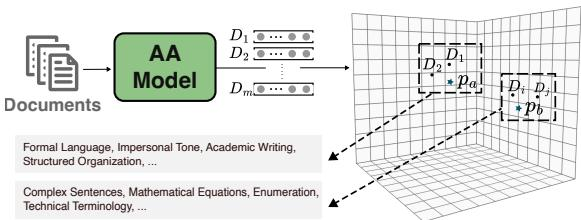  
Figure 1: Our approach for explaining authorship attribution predictions. We identify k clusters with centroids $p _ { 1 } , \ldots , p _ { k }$ in the embedding space and associate each with writing style features. The writing style of a document $D _ { i }$ is explained by aggregating the style features of its closest cluster.

In this paper, we hypothesize that embeddingbased authorship attribution models learn to map texts into regions in the latent space that represent specific writing styles. By locating a document with respect to these regions in the latent space, we can identify its style features relevant to the model’s representation, which can serve as useful explanations to assist humans in the authorship attribution task. Our proposed approach identifies these relevant regions and their corresponding writing style by clustering a set of training documents in the latent space and assigns each cluster a distribution over style features generated by prompting large language models (LLMs). The centroids of these clusters then serve as the basis for a new interpretable space. Given a new document $D _ { i } .$ , we first identify its top k similar clusters, and we then aggregate a set of style features from these clusters style representation to describe its writing style. This is illustrated in the toy example in Figure 1, where two clusters are identified in the latent space $( p _ { a }$ and $p _ { b } )$ , each with its distinct list of style features. The style of a document $D _ { 1 }$ can be explained by the set of features of its most similar cluster $p _ { a }$

We conduct automatic and manual evaluations to test our hypothesis that the clusters’ features can describe the writing style of unseen documents and are useful to the authorship attribution task. In our automatic evaluation, we measure the agreement of predictions made in our constructed interpretable space and in the original model’s latent space, and we compare that against other baselines. Our approach achieves the highest Pearson correlation of 0.79, surpassing baseline methods that range from 0.2 to 0.4. We also conduct a human evaluation to verify whether the style features associated with the identified clusters reflect the writing style of unseen documents. The results indicate that this is indeed the case since humans rank these style features higher than other non-associated ones in 72% of the cases. Finally, we measure the usefulness of our explanations for the authorship attribution task by asking participants to identify the author of new documents with and without having access to our explanations. Our explanations improved their agreement and increased the annotators’ accuracy in the task by an average of 20%. We make our code and datasets publicly available to foster further research on this area1

In summary, our contributions are as follows:

• A novel approach to interpreting the latent space of embedding-based AA models.

• Experimental evidence demonstrating the validity of style descriptions generated by our interpretable space.

• Demonstration of the utility of the interpretable space’s explanations for the AA task.

## 2 Related Work

Authorship Attribution Early approaches to authorship attribution focused on modeling linguistic features such as syntactic structure and function word frequencies to capture similarities in writing style (Koppel and Schler, 2004). Recently, transformer-based models have achieved state-ofthe-art results by fine-tuning on large corpora to learn embeddings that reflect different writing styles. For instance, Rivera-Soto et al. (2021) proposed a contrastive objective function that maps documents written by the same author into vectors situated closer in the embedding space. Their model is trained on corpora from different domains to evaluate cross-domain knowledge transfer. Wegmann et al. (2022) introduced an approach to ensure that the embedding space of an authorship attribution model represents style rather than content. Tyo et al. (2022) provide a comprehensive survey of approaches for the authorship attribution task. Our explainability framework can be applied on these embedding-based models to explain their predictions.

Interpreting Embedding Spaces Despite their strong performance, transformer-based models learn latent representations that are not interpretable, making the models less explainable. A well-established line of research focuses on methods to interpret the learned embeddings. For example, Simhi and Markovitch (2023) proposed an approach that maps Wikipedia concepts into the latent space and uses these mapped embeddings as dimensions of an interpretable space. Few works have studied the interpretability of style embeddings learned for the authorship attribution task. Wegmann et al. (2022) investigated the presence of specific style features in the representations learned (or induced) by their model. Lyu et al. (2023) showed that it is possible to identify vectors representing lexical stylistic features (such as complexity and formality) in the latent space of pre-trained language models. However, these studies do not extend beyond small-scale analyses to probe embeddings for specific style features. The usefulness of this knowledge for explainable authorship attribution is unexplored.

Explainability Angelov et al. (2021) review state-of-the-art research on explainability and categorize it based on different aspects. Among them is whether these methods provide local or global explanations. For example, LIME (Ribeiro et al., 2016) and SHAP (Lundberg and Lee, 2017) aim to measure the contribution of single features (tokens in case of texts) to the final prediction of an instance. Inferring human-level explanations from these scores might be easy for simple classification tasks such as sentiment analysis. This becomes more complicated when dealing with complex tasks such as authorship attribution, where predictions might rely on features beyond the level of tokens (e.g., syntax or discourse-related features). On the other hand, concept activation vectors (CAVs) (Koh et al., 2020; Simhi and Markovitch, 2023) aim to provide a global explanation for the model’s behavior by uncovering concept directions in the model’s internal state. Our approach is along the lines of the CAVs methods, but instead of starting from a predefined set of concepts, we first discover relevant regions in the latent space of the black-box model and then interpret what they represent.

## 3 Explaining Authorship Attribution

In this section, we introduce the authorship attribution task and present our approach.

## 3.1 Problem Setup

In this study, we frame the authorship attribution task as follows: Given a collection of n documents $D = \{ D _ { 1 } , \ldots , D _ { n } \}$ written by m different authors $A _ { 1 } , \ldots , A _ { m }$ , predict how likely it is for two documents to be written by the same author. Authorship attribution methods typically learn a function $f ( \cdot )$ that maps documents into a latent embedding space, and then they rely on it to predict the author of new documents at inference time (Rivera-Soto et al., 2021; Wegmann et al., 2022). But these models are opaque and not interpretable.

A natural explanation of the underlying mechanism of $f ( \cdot )$ is that the models learn to associate specific style features with regions in the latent space. An intuitive approach to uncovering this underlying mechanism — in line with the approach proposed by Simhi and Markovitch (2023) for interpreting general learned embeddings — would depart from texts with specific predefined style features and aim at identifying their corresponding latent representations. This approach is limited by the need for predefined features and the strong assumption that the AA model represents them. In contrast to this “top-down” method, our approach to interpreting the latent space can be described as “bottom-up.” As detailed below, instead of using a predefined set of features, we automatically locate salient regions in the latent space that are relevant to the model’s predictions and map them to an automatically discovered set of style features. This ensures that the latent regions and the style features are both relevant to the model’s prediction.

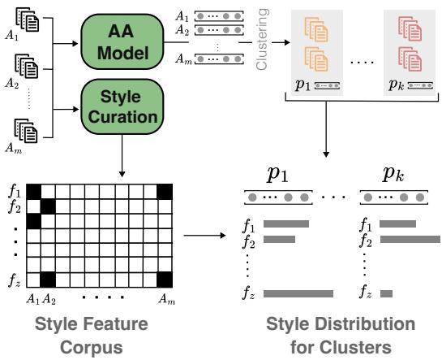  
Figure 2: Our approach: Given the training corpus $D ^ { \mathrm { t r a i n } }$ with documents from authors $A _ { 1 } , \ldots , A _ { m } ,$ we generate style descriptions for each document to construct the style corpus. We then identify relevant regions in the latent space $p _ { 1 } , \ldots , p _ { k }$ by clustering author-level representations and aggregate style features to obtain style representations for each region.

## 3.2 Latent Space Interpretation

We propose a two-step procedure for interpreting the latent space of AA models. Our approach is illustrated in Figure 2 and explained below.

Identifying Representative Points Given a training set $D ^ { \mathrm { t r a i n } }$ , containing author-labeled texts, we first identify k representative points $( p _ { 1 } , \ldots , p _ { k } )$ in the latent space that are relevant to the AA model’s predictions. For this, we first obtain author-level representations (which we call hereafter author embeddings) by averaging the representations of documents by the same author. Although each author embedding could be considered as a single representative point, one can obtain better style representations by grouping similar authors since more documents will be available in each cluster. Therefore, we cluster the author embeddings and take their centroids as our final k representative points.

Mapping to Style Distributions We consider the k representative points identified in the latent space as our interpretable space dimensions. This step aims to map each point and its associated documents to a corresponding writing style. To this end, we first automatically construct a set of style features describing all the training documents. Then, we map each point to a distribution over these style features given its associated documents.

We build this set of features following Patel et al. (2023), who used LLMs to describe the writing style of a document in a zero-shot setting. Concretely, we first generate style descriptions for each document in the training set by prompting the LLM. However, the generated descriptions are quite lengthy, as shown in the examples in Figure 4, and they present substantial overlaps. Therefore, as exemplified in the figure, we process the generated style descriptions as follows: we first prompt LLMs to shorten each of the descriptions. Second, we perform automatic feature aggregation to merge descriptions with similar styles. For this, we construct a pairwise similarity matrix by computing the Mutual Implication Score (Babakov et al., 2022) between each pair of descriptions and merge the ones that are sufficiently similar. Finally, we shorten the aggregated descriptions further by extracting key phrases present therein. These constitute the final set of style features used in our experiments. Implementation details about the LLMs and prompts used are provided in Section 4.

Using the constructed set of style features, we generate a distribution over the generated style features for each representative point $( p _ { 1 } , \ldots , p _ { k } )$ . To do this, we compute the frequency of each style feature (e.g., vivid imagery, rhetorical questions, etc) in the documents that are associated with the representative points, normalized by the frequency of the feature in the entire training set.

Explaining Model Predictions The constructed interpretable space, where each basis is associated with a style distribution, can be used for explainable AA in two ways. First, to explain how the AA model encodes the writing style of a single document, we first project its latent embedding into the interpretable space by computing its cosine similarity to each of the representative points in the latent space. We then explain its writing style by relying on its top N (i.e. the closest) representative points. Second, to explain why the AA model predicts that two documents were written by the same author, we similarly project both documents into the interpretable space and generate a unified style description by aggregating the top representative points from both documents.

## 4 Experiment Setup

In this section, we present the authorship attribution dataset and the models used in our experiments. We also explain the implementation details of our

<table><tr><td>Statistic</td><td>Train</td><td>Dev</td><td>Test</td></tr><tr><td># Documents</td><td>15822</td><td>22456 6107</td><td></td></tr><tr><td># Authors</td><td>4142</td><td>635 1586</td><td></td></tr><tr><td>Avg. documents per Author</td><td>3.8</td><td>3.8</td><td>3.8</td></tr></table>

Table 1: Statistics for the training, development, and test splits of the HRS dataset.

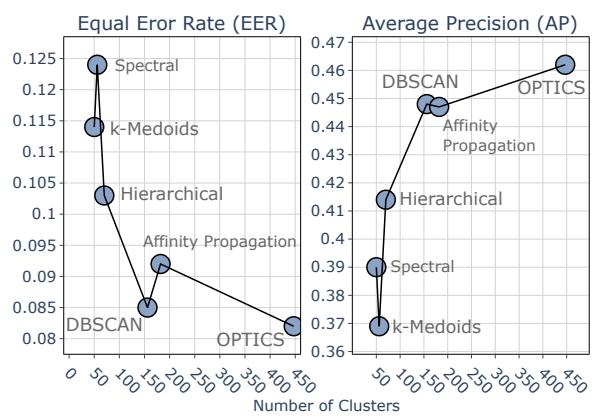  
Figure 3: Performance comparison of cluster assignments by number of clusters. Smaller EER and larger AP indicate better performance. Note that both metrics naturally favor assignments with more clusters.

approach and the baselines used for comparison.

## 4.1 Dataset & AA Models

Dataset To evaluate our approach, we utilize an authorship corpus compiled for the purposes of the IARPA HIATUS research program.2 The corpus comprises documents from 5 online discussion forums spanning different domains: BoardGameGeek, Global Voices, Instructables, Literature StackExchange, and all StackExchanges for STEM topics (physics, computer science, mathematics, etc.). Each source contains documents (posts) tagged with authorship information in their metadata. Sensitive author metadata (PII information) has been removed from the corpus using the Presido analyzer (Mendels et al., 2018), which finds and replaces sensitive entities with placeholders (e.g., “PERSON”). The authorship information of these documents is preserved by assigning random UUIDs to each author. We refer to this dataset as the HRS dataset, and we will share it publicly upon request.3 We use the “cross\_genre” portion of the HRS dataset, which contains documents written by the same author across different genres (online discussion forums). The cross-genre setting makes authorship attribution more challenging (Rivera-Soto et al., 2021). Statistics for the number of documents and authors in each of the training, validation, and test splits are given in Table 1.

<table><tr><td>AA Model</td><td>EER (↓)</td><td>AP (↑)</td></tr><tr><td>LUAR</td><td>0.06</td><td>0.49</td></tr><tr><td>FT-LUAR</td><td>0.02</td><td>0.59</td></tr></table>

Table 2: Performance of the AA models on the HRS dataset.

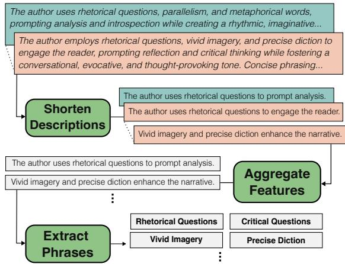  
Figure 4: Refinement steps applied on style description distilled from llama3-8b.

AA Models We use the state-of-the-art authorship attribution model LUAR (Rivera-Soto et al., 2021) and a variant that we built using the SBERT library (Reimers and Gurevych, 2019). The variant has LUAR as the backbone, which serves to generate the initial text embedding, and a dense layer of 128 dimensions on top to create the final embedding space. We fine-tuned this model on the training split of the HRS dataset using pairs of documents by the same author as positive pairs and the MultipleNegativesRanking loss as the objective function. We train the model for one epoch with a batch size of 48. All other training parameters are left to their default value per the library. At test time, the likelihood of two documents being written by the same author is computed by their cosine similarity in the learned space.

We evaluate the performance of the two authorship attribution models on the test split of the HRS dataset in terms of Equal Error Rate (EER) (Meng et al., 2019) and Average Precision (AP). Table 2 presents the results for the two models. Not surprisingly, the FT-LUAR benefits from fine-tuning on the HRS training split, achieving a better EER than LUAR (0.02 vs. 0.06). These two models are the black boxes whose predictions we would like to explain using our approach.

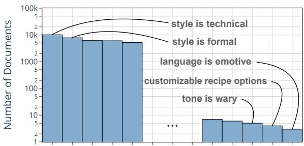  
Figure 5: Illustration of style features extracted from the training corpus using our approach. 1470 features were extracted for our dataset.

## 4.2 Implementation of Our Approach

As described, our approach involves (1) identifying representative points by clustering similar authors and (2) automatically constructing a style feature set to assign each of these representative points a distribution over these features. The following describes the implementation details of these steps.

Clustering Similar Authors This step serves to identify representative points in the latent space. To find the best clustering, we experiment with various algorithms and parameter values. We run each evaluated algorithm on the author embeddings from the training set, and use the centroids of the resulting clusters as dimensions of corresponding interpretable space. Then, to predict how likely it is for a pair of documents in the development set to be written by the same author, we project their latent representations into this evaluated interpretable space and calculate their similarity. Finally, we compute the EER and AP with respect to the ground-truth scores. We repeat this process for each clustering algorithm and set of parameter values. Figure 3 shows the best performance obtained by each algorithm and the corresponding number of clusters. We select the algorithm that gives us high-performance gain with a lower number of clusters. In our approach implementation, we use DBSCAN as the clustering algorithm since it gives good performance while maintaining reasonable number of clusters.

Assigning Writing Styles We implement our pipeline for extracting style features from the training documents using the llama3-8b model (Prompt 1 in Figure 6) for style description generation and gpt-3.5-turbo for shortening these descriptions (Prompt 2 in Figure 6). This process resulted in 1,470 style features ranging from generic features (such as “passive voice”), to corpus-specific ones (such as “mathematical equations”). We include a sample histogram of the extracted style features in Figure 5.

Prompt 1: Style Generation with llama3-8b  
[ TASK ]   
Please list the writing style attributes of the given   
text for each of the morphological , syntactic , semantic ,   
and discourse levels .   
Each level should start with a paragraph heading then   
a list of short sentences describing the style where each   
sentence is in the format of "The author is X." or   
"The author uses X.   
[ TEXT ]   
<document >

Prompt 2: Style Refinement with gpt-3.5-turbo  
[ TASK ]: Please rewrite the following list of writing   
style bullet points into a single paragraph .   
[ TEXT ]: <style descriptions >  
Figure 6: Prompts used for style description generation and refinement

## 4.3 Baselines

As explained in Section 3, a potential top-down approach to constructing interpretable spaces starts from a pre-defined set of style features and their corresponding documents. We implement this approach and use it as a baseline. We use two existing sets of style features: xSLUE (Kang and Hovy, 2019) and LISA (Patel et al., 2023).

xSLUE Kang and Hovy (2019) compiled a taxonomy of 18 style features that are mostly studied in literature. A set of texts illustrating each feature is also provided. Due to the varying number of documents available for each feature, we downsampled each set to 100 texts.

LISA Patel et al. (2023) prompted an LLM to distill style features from Reddit posts, resulting in a large collection of style features with corresponding texts. We semi-automatically aggregated similar features and filtered out infrequent ones, resulting in 57 style features with an average of 377 documents per feature.

<table><tr><td>Model</td><td>Method</td><td>∆EER ∆AP</td><td>Pearson r</td></tr><tr><td rowspan="4">LUAR</td><td>Random</td><td>0.18 0.15</td><td>0.31</td></tr><tr><td>XSLUE</td><td>0.18 0.26</td><td>0.39</td></tr><tr><td>LISA</td><td>0.10 0.17</td><td>0.57</td></tr><tr><td>Ours</td><td>0.04 0.14</td><td>0.79</td></tr><tr><td rowspan="4">FT-LUAR</td><td>Random</td><td>0.20 0.19</td><td>0.38</td></tr><tr><td>XSLUE</td><td>0.20 0.34</td><td>0.29</td></tr><tr><td>LISA</td><td>0.15 0.24</td><td>0.23</td></tr><tr><td>Ours</td><td>0.04 0.17</td><td>0.79</td></tr></table>

Table 3: Performance degradation of the LUAR and FT-LUAR models when prediction is performed in the xSLUE, LISA, random projection, and our interpretable spaces, measured by Equal Error Rate (∆EER) and Average Precision (∆AP). Pearson r represents the agreement between the AA model’s predictions in the latent and interpretable spaces. Lower values of ∆EER and ∆AP is better.

We compute the overlap between the style features present in each of these corpora and ours. As shown in Figure 10 in the appendix, the percentage of overlap is low, indicating the need for style feature discovery in the AA model’s training corpora instead of relying on pre-defined ones.

To construct the interpretable space for each of these two feature sets, we obtained the AA model’s representation for the texts that are available for each style feature and averaged their embeddings to form the corresponding dimension. This results in two baseline interpretable spaces: xSLUE with 18 dimensions and LISA with 57 dimensions. In addition to considering xSLUE and LISA baselines, We also use a random projection baseline by randomly selecting points in the latent space and considering them as another baseline interpretable space.

## 5 Evaluation

The following presents the automatic and manual evaluations we perform to evaluate our approach.

## 5.1 Interpretable Space Alignment

We evaluate the quality of the interpretable space by assessing how well it is aligned with the original latent space. We measure the alignment of the two spaces in terms of performance degradation and prediction agreement when each space is used for prediction. Concretely, at test time, we first embed documents into the latent space and project them into the evaluated interpretable space. We then predict AA scores using the cosine similarity of each pair of documents in each space. Finally, we compute the corresponding EER and average precision scores and measure the performance degradation. Similar to Simhi and Markovitch (2023), we also report the correlation in terms of Pearson’s r between the predictions made in the latent and the evaluated interpretable space.

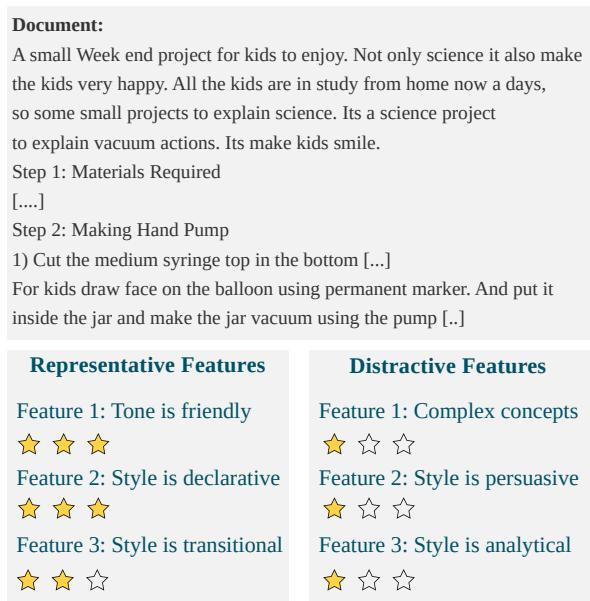  
Figure 7: Example document from the HRS dataset with top three descriptive and distractive style features and their scores that are obtained from one of the annotators.

Table 3 presents our evaluation results. A first observation is that our method results in a minimum drop in both evaluation measures compared to the baselines. For prediction agreement, the LUAR model with the xSLUE and LISA interpretable spaces outperforms the random baseline, but this trend does not hold for FT-LUAR. However, in both LUAR and FT-LUAR, our proposed interpretable space achieves the best agreement, with the highest correlation (Pearson’s r of 0.79) to the original latent space predictions. These positive results provide empirical support for the relevance of our clustering-based interpretable space with respect to the AA model’s predictions.

## 5.2 Quality of Explanations

Our interpretable space can also serve to describe the writing style of unseen documents. We evaluate the quality of the style descriptions for 40 unseen documents randomly sampled from the test split of the HRS dataset. For each document, we extract the top 5 features from its most representative cluster (interpretable dimension) and 5 other style features from the least representative one (distractive features). We then ask human evaluators to rate each of the ten style features on a 3-Point Likert scale. They are asked to assign 1 point when the feature does not apply anywhere in the text, 2 points for features that apply somewhere in the text but not frequently, and 3 for features that occur often enough in the text. Ideally, we expect the average score of representative features to be higher than the score of the distractive ones for all cases. Due to a limited budget, we focused our manual evaluation studies on FT-LUAR as our black-box authorship attribution model since it performs better on the HRS dataset. We hired three annotators who are native speakers of English and have a job success rate of more than 90% on the UpWork platform. Solving each instance was estimated to take around 3 minutes, and we compensated each of our annotators \$35 per hour. We designed the study interface on the Label Studio platform.4 Figure 7 shows an example instance from the study with the top 3 style features due to space limitations. Note that, in the interface, annotators see all the style features shuffled without knowing their source.

<table><tr><td>Features</td><td>Average</td><td>Median</td></tr><tr><td>Representative</td><td>2.41</td><td>3</td></tr><tr><td>Distractive</td><td>2.10</td><td>2</td></tr></table>

Table 4: Average and median rating scores for the representative and distractive features according to the annotators.

Results We collect 3 ratings from our annotators for each of the 400 evaluated style features. We compute the majority rating for each style feature and exclude the ones with no majority ratings (8% of representative and 12% of distractive features). Table 4 presents the average and median scores. We note that representative style features (average 2.41 and median of 3) are scored higher than distractive ones (average 2.10 and median of 2).

We additionally computed the percentage of documents where the representative features achieved an average rating score higher than the distractive ones. The percentage is 65% and 72% when considering the top 3 and 5 evaluated features, respectively. As for the inter-annotator agreement, Krippendorf’s α score is 0.33, which indicates fair agreement. Although evaluators found the distractive features sometimes apply, our results indicate the representative style features selected for unseen documents describe the writing style more definitively. In the next section, we show that these style features are also helpful in solving the authorship attribution task.

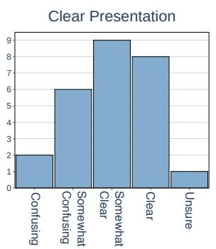

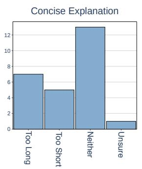

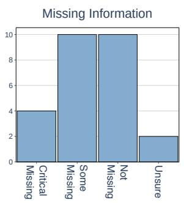

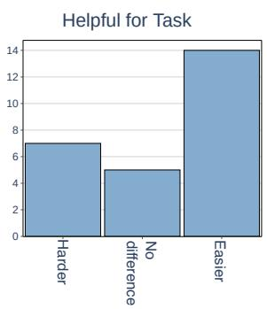  
Figure 8: Histogram of annotators’ answers for questions regarding the quality aspects of our system’s explanations.

## 5.3 Usefulness for Explainability

Study Design We conduct another user study to assess whether interpretations derived from our approach can serve as useful explanations for humans to solve the AA task. We hereby present the design of the AA task. We show the annotators one query document along with three candidate documents, one of which is written by the same author as the query. The annotators’ task is to identify this candidate document under two conditions: with and without access to our explanations.

To generate the explanation for a document, we select the top 10 style features from each of the top three representative interpretable dimensions identified for this document. We prompt ChatGPT to rephrase these style features into a single coherent style description. Due to the high annotation effort (estimated 12 min per instance), we restricted our study to a random sample of 40 instances total, 20 for each condition (w/ Expl. and W/o Expl). We hired four annotators on the UpWork platform and split them into two groups; each group solves the same 20 tasks. Additionally, we keep track of the instances where the prediction of the authorship attribution model is correct. Besides solving the AA task, we ask the annotators to answer questions that serve to assess different quality aspects of the provided explanations, such as whether the explanations are clear, compact, complete, and helpful for the task. The questions and the annotation interface can be found in Appendix C.

Effect of Explanations on Accuracy Table 5 presents the accuracy of our annotators in the AA task for cases where the AA model correctly predicted the candidate document. We observe that annotators achieve an accuracy between 0.43 and 0.71 in the setting where no explanations were provided (W/o Explanation). When they have access to our explanations (W/ Explanation), the accuracy of most annotators (3 out of 4) significantly increases. These results demonstrate the usefulness of our system’s explanations for the AA task. For instances where the AA model made the wrong prediction (20% of the total evaluated instances), the annotators also failed to identify the correct candidate in both scenarios (w/ Expl. and w/o Expl.). This indicates that the explanations provided for these instances had no effect or misled the annotators decision.

<table><tr><td></td><td>W/o Explanation</td><td>W/ Explanation</td></tr><tr><td>Ann 1</td><td>0.71</td><td>0.83</td></tr><tr><td>Ann 2</td><td>0.43</td><td>0.83</td></tr><tr><td>Ann 3</td><td>0.71</td><td>0.71</td></tr><tr><td>Ann 4</td><td>0.43</td><td>0.71</td></tr></table>

Table 5: Accuracy of each annotator in solving the AA task for instances where the AA model had correct prediction, broken down for cases with and without explanations.

Effect of Explanations on Agreement We collect two annotations per instance, so we measure the inter-annotator agreement using Cohen’s Kappa. Agreement across all evaluated instances is low (0.24), hinting at the task’s difficulty. Upon further inspection, we observed that agreement was very low (0.03) when no explanations were provided but increased to 0.45 when the annotators had access to the explanations. These results show that our system’s explanations effectively influenced the annotators’ decisions, leading to stronger agreement.

Explanation Quality Figure 8 shows the histogram of annotators’ answers to our questions regarding the quality of provided explanations. Our system’s explanations were evaluated in most cases to be relatively clear, compact, and helpful to the task. However, annotators also considered some information to be missing from the explanations.

## 6 Conclusion

State-of-the-art authorship attribution models learn latent embeddings that capture authors’ writing styles. Despite their strong performance, these models are unexplainable, which limits their usability. This work presented a novel approach to explaining the latent space of authorship attribution models. Our approach relies on clustering training documents in the latent space, and automatically mapping them to distributions over LLM-generated style attributes. In our automatic and manual evaluation, we demonstrated that this method generates plausible style descriptions of unseen documents, which can also be useful in solving the authorship attribution task.

## Limitations

In our experiments, we demonstrate the predictive power of our interpretable space, the plausibility of style explanations, and their usefulness for solving the authorship attribution task. However, there exist many other aspects of explanation quality that we did not evaluate (Zhou et al., 2021), like how faithful are these explanations to the model’s prediction.

Moreover, as explained, our approach is based on automatically distilling style features using LLMs. This, however, is prone to noise and consistency issues. In Appendix A.2, we investigate the consistency of LLMs in generating writing style descriptions, and show that this becomes more reliable when we prompt them multiple times. Due to the computational costs, in our experiments we only perform single-round prompting of LLMs to generate writing style features.

Finally, in our evaluation we focused on analyzing a single authorship attribution model fine-tuned on our own dataset. This, in a way, is a limitation of the paper; future research should look into analyzing a wider spectrum of authorship attribution models that are trained on different datasets and analyze their different behaviors to gain more reliable and generalizable insights.

## Ethical Statement

We acknowledge that the authorship attribution task itself raises ethical issues. As mentioned, AA models can be used as tools to reveal the identity of individuals who wrote texts online, leading to privacy concerns. However, our work here aims to explain their decisions. This can enable users to understand these models’ behavior and know whether their predictions are baseless.

In our user studies, we made sure to keep the identity of our users private and to compensate them more than the minimum wage in the U.S.

## References

Plamen P Angelov, Eduardo A Soares, Richard Jiang, Nicholas I Arnold, and Peter M Atkinson. 2021. Explainable artificial intelligence: an analytical review. Wiley Interdisciplinary Reviews: Data Mining and Knowledge Discovery, 11(5):e1424.

Nikolay Babakov, David Dale, Varvara Logacheva, and Alexander Panchenko. 2022. A large-scale computational study of content preservation measures for text style transfer and paraphrase generation. In Proceedings ofthe 60th Annual Meeting ofthe Associationfor Computational Linguistics: Student Research Workshop, pages 300–321, Dublin, Ireland. Association for Computational Linguistics.

Yanai Elazar, Nora Kassner, Shauli Ravfogel, Abhilasha Ravichander, Eduard Hovy, Hinrich Schütze, and Yoav Goldberg. 2021. Measuring and improving consistency in pretrained language models. Transactions of the Association for Computational Linguistics, 9:1012–1031.

Katrin Erk and Marianna Apidianaki. 2024. Adjusting interpretable dimensions in embedding space with human judgments. In Proceedings of the 2024 Conference of the North American Chapter of the Association for Computational Linguistics: Human Language Technologies (Volume 1: Long Papers), pages 2675–2686.

Maarten Grootendorst. 2022. Bertopic: Neural topic modeling with a class-based tf-idf procedure. arXiv preprint arXiv:2203.05794.

Zhengbao Jiang, Frank F. Xu, Jun Araki, and Graham Neubig. 2020. How can we know what language models know? Transactions of the Association for Computational Linguistics, 8:423–438.

Dongyeop Kang and Eduard H. Hovy. 2019. xslue: A benchmark and analysis platform for crossstyle language understanding and evaluation. ArXiv, abs/1911.03663.

Pang Wei Koh, Thao Nguyen, Yew Siang Tang, Stephen Mussmann, Emma Pierson, Been Kim, and Percy

Liang. 2020. Concept bottleneck models. In International conference on machine learning, pages 5338–5348. PMLR.

Moshe Koppel and Jonathan Schler. 2004. Authorship verification as a one-class classification problem. In Proceedings ofthe twenty-first international conference on Machine learning, page 62.

Scott M Lundberg and Su-In Lee. 2017. A unified approach to interpreting model predictions. Advances in neural information processing systems, 30.

Qing Lyu, Marianna Apidianaki, and Chris Callison-Burch. 2023. Representation of lexical stylistic features in language models’ embedding space. In Proceedings of the 12th Joint Conference on Lexical and Computational Semantics (\* SEM 2023), pages 370–387.

Omri Mendels, Coby Peled, Nava Vaisman Levy, Tomer Rosenthal, Limor Lahiani, et al. 2018. Microsoft Presidio: Context aware, pluggable and customizable pii anonymization service for text and images.

Zhong Meng, Yong Zhao, Jinyu Li, and Yifan Gong. 2019. Adversarial speaker verification. In ICASSP 2019-2019 IEEE International Conference on Acoustics, Speech and Signal Processing (ICASSP), pages 6216–6220. IEEE.

Ajay Patel, Delip Rao, Ansh Kothary, Kathleen McKeown, and Chris Callison-Burch. 2023. Learning interpretable style embeddings via prompting LLMs. In Findings of the Association for Computational Linguistics: EMNLP 2023, pages 15270–15290, Singapore. Association for Computational Linguistics.

Nils Reimers and Iryna Gurevych. 2019. Sentence-bert: Sentence embeddings using siamese bert-networks. In Proceedings of the 2019 Conference on Empirical Methods in Natural Language Processing. Association for Computational Linguistics.

Marco Tulio Ribeiro, Sameer Singh, and Carlos Guestrin. 2016. "why should I trust you?": Explaining the predictions of any classifier. In Proceedings ofthe 22nd ACM SIGKDD International Conference on Knowledge Discovery and Data Mining, San Francisco, CA, USA, August 13-17, 2016, pages 1135– 1144.

Rafael A. Rivera-Soto, Olivia Elizabeth Miano, Juanita Ordonez, Barry Y. Chen, Aleem Khan, Marcus Bishop, and Nicholas Andrews. 2021. Learning universal authorship representations. In Proceedings of the 2021 Conference on Empirical Methods in Natural Language Processing, pages 913–919, Online and Punta Cana, Dominican Republic. Association for Computational Linguistics.

Adi Simhi and Shaul Markovitch. 2023. Interpreting embedding spaces by conceptualization. In Proceed ings ofthe 2023 Conference on Empirical Methods in Natural Language Processing, pages 1704–1719.

Gábor J. Székely, Maria L. Rizzo, and Nail K. Bakirov. 2007. Measuring and testing dependence by correlation of distances. The Annals ofStatistics, 35(6).

Peter Tiersma and Lawrence M. Solan. 2002. The linguist on the witness stand: Forensic linguistics in american courts. Language, 78(2):221–239.

Ehsan Toreini, Mhairi Aitken, Kovila Coopamootoo, Karen Elliott, Carlos Gonzalez Zelaya, and Aad Van Moorsel. 2020. The relationship between trust in ai and trustworthy machine learning technologies. In Proceedings of the 2020 conference on fairness, accountability, and transparency, pages 272–283.

Jacob Tyo, Bhuwan Dhingra, and Zachary C Lipton. 2022. On the state of the art in authorship attribution and authorship verification. arXiv preprint arXiv:2209.06869.

Andrew Wang, Cristina Aggazzotti, Rebecca Kotula, Rafael Rivera Soto, Marcus Bishop, and Nicholas Andrews. 2023. Can authorship representation learning capture stylistic features? Transactions of the Associationfor Computational Linguistics, 11:1416– 1431.

Anna Wegmann, Marijn Schraagen, and Dong Nguyen. 2022. Same author or just same topic? towards content-independent style representations. In Proceedings of the 7th Workshop on Representation Learningfor NLP, pages 249–268, Dublin, Ireland. Association for Computational Linguistics.

Chunting Zhou, Junxian He, Xuezhe Ma, Taylor Berg-Kirkpatrick, and Graham Neubig. 2022. Prompt consistency for zero-shot task generalization. Preprint, arXiv:2205.00049.

Jianlong Zhou, Amir H Gandomi, Fang Chen, and Andreas Holzinger. 2021. Evaluating the quality of machine learning explanations: A survey on methods and metrics. Electronics, 10(5):593.

## A Supplementary Analysis

## A.1 What do Authorship Attribution Models Represent?

Recent studies observed that authorship attribution models learn representations that capture not only the writing style but also semantics of texts (Rivera-Soto et al., 2021; Wang et al., 2023). Therefore, in a follow-up study, we investigate this phenomena in FT-LUAR by computing correlation scores between the latent embedding on the one hand and style and topic representations on the other hand. Concretely. for topic representations, we use BERTopic (Grootendorst, 2022) to compute the topic representation of each document and average that to get the final topic representations. We compute the authorship attribution latent representation by averaging the author’s document embeddings generated by the FT-LUAR model, and apply the method described in Section 3.2 to obtain style representations. We then compute pairwise dissimilarities between authors using cosine similarity for latent representations and symmetric KL divergence for style and topic representations. Finally, to obtain correlation scores, we use distance correlation (Székely et al., 2007), which captures both linear and non-linear relationships, and Pearson correlation, which captures linear relationships.

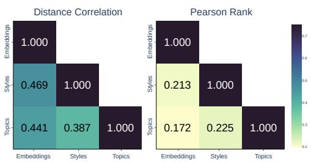  
Figure 9: Correlation statistics. Cosine similarity is used for embeddings and symmetric KL divergence is used for style and topic representations.

Results are shown in Figure 9. Despite the relatively high correlation between authors’ dissimilarity scores in the latent topic space, we observe an even higher correlation between dissimilarities in the latent and style representations. This indicates that authors who are similar in the authorship attribution latent space share, to some degree, similar writing styles.

## A.2 Consistency of Style Assignments

To ensure the generated style descriptions are reliable and not spuriously generated, we validate the consistency of style descriptions produced by LLMs across different query instances.

Specifically, we prompt llama3-8b with documents from the same author multiple times and evaluate the stability of the resulting style distribution. At each time step $t \in \mathbb { N } .$ , we compute the style distribution $v _ { t } ^ { d } \in \Delta ^ { \bar { k } }$ by counting the number of times each style occurs and normalizing the occurrences to a probability distribution. Then, we take the unweighted average of all previously generated distributions as $\begin{array} { r } { \bar { v } _ { t } ^ { d } = \frac { 1 } { t } \sum _ { i = 1 } ^ { t } v _ { i } ^ { d } } \end{array}$ . Denoting stability at step t as $S _ { t }$ , we evaluate $S _ { t }$ for $t \leq 2 5$ as the symmetrized Kullback-Leibler (KL) divergence between the averaged style distributions of

Figure 10: Illustration of style overlap between LISA, xSLUE, and our generated styles.  
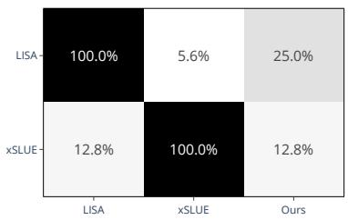

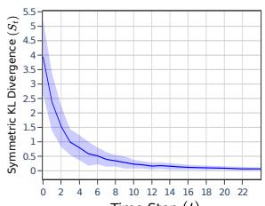  
Figure 11: Evolution of stability $S _ { t }$ across time steps t. Error bands represent standard deviation.

step-adjacent instances:

$$
S _ { t } = \frac { 1 } { 2 } \left( D _ { \mathrm { K L } } ( \bar { v } _ { t } ^ { d } \parallel \bar { v } _ { t - 1 } ^ { d } ) + D _ { \mathrm { K L } } ( \bar { v } _ { t - 1 } ^ { d } \parallel \bar { v } _ { t } ^ { d } ) \right) .
$$

To mitigate potential consistency illusions from using identical prompt instructions, we manually generate 20 paraphrased variants of the original instruction and sample an instruction uniformly at random for each query. Given the known variability of LLMs when processing semantically identical inputs (Jiang et al., 2020; Elazar et al., 2021; Zhou et al., 2022), observing convergence in style assignments across these varied prompts suggests that LLMs maintain consistency in generating style descriptions. Detailed prompt examples are provided in Appendix B.2.

Results are shown in Figure 11. Observe that stability converges to the minimum value after 20 rounds, demonstrating that LLM-generated styles are consistent across multiple prompting instances. These results suggest that author-level style assignments are both representative and consistent.

## A.3 Style Overlap

Figure 10 shows the heatmap of style overlap between various style corpora. The style overlap is determined by calculating the Mutual Implication Score for all pairs of style features and considering two styles from different corpora identical when the similarity score exceeds a threshold of 0.8. We notice the low percentage overlap between the other baseline corpora and ours, which indicates the need for style feature discovery in the training corpora of the investigated AA model instead of relying on a pre-defined set of style features.

## B Prompt Instructions

## B.1 Style Feature Generation

Here, we include the prompt instructions used to generate style descriptions and refine the generated

[ TASK ]   
Generate a list detailing the writing style of the given   
text at the following levels :   
- Morphological level   
- Syntactic level   
- Semantic level   
- Discourse level   
[ RULES ]   
- Begin each level with a heading , followed by a list   
of brief sentences describing the style.   
[ TEXT ]: <document >   
[ TASK ]   
Assess the writing style of the given text for each of   
the following levels :   
- Morphological level   
- Syntactic level   
- Semantic level   
- Discourse level   
[ RULES ]   
- Each section should start with a heading , followed   
by a list of brief sentences describing the style .   
[ TEXT ]: <document >

descriptions.

## B.2 Style Consistency

Here, we include examples of paraphrased style generation prompts utilized in assessing the consistency of generated styles.

## Prompt 3: Examples of Paraphrased Variants

## C Experiment on Usefulness of Explanations

Besides solving the task of authorship attribution, the annotators had to answer a set of questions for each instance where explanations were provided. These questions meant to assess various quality aspect of our explanations. Here is the list of questions:

1. Is the explanation presented in a clear manner that is easy to follow? A. Confusing or difficult to understand B. Somewhat confusing or difficult to understand C. Relatively clear and easy to understand D. Very clear and easy to understand E. I am not sure

2. Is the explanation simple and compact? A. Too long B. Too short C. Not too long or too short D. I am not sure

3. Is there any missing information that the explanation fails to mention? A. Critical information is missing B. Some information is missing, but not critical C. No information is missing D. I am not sure

4. Is the explanation helpful to the task you are trying to accomplish? A. The explanation is distracting B. The explanation makes little or no difference to my task C. The explanation is helpful D. I am not sure