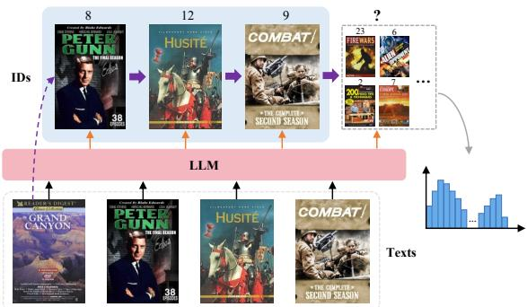
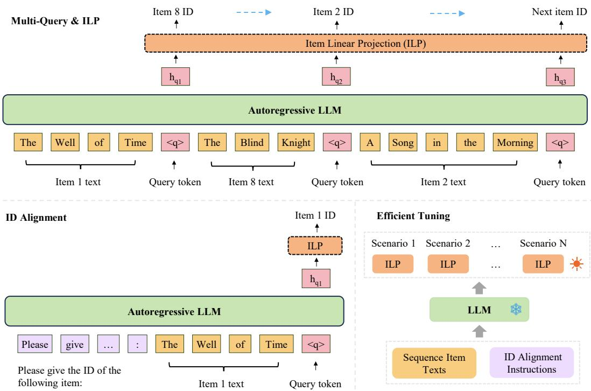
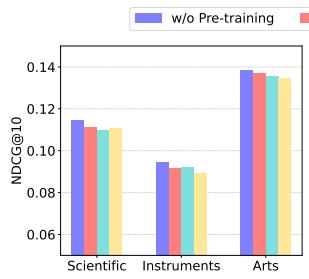
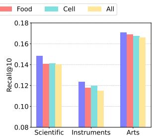
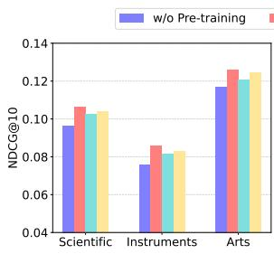
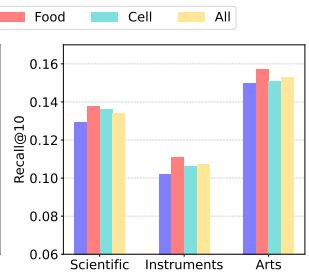
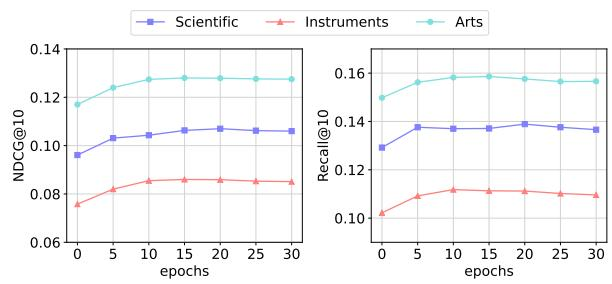

# Learning Transition Patterns by Large Language Models for Sequential Recommendation

Jianyang Zhai1,2, Zi-Feng Mai1, Dongyi Zheng1,2, Chang-Dong Wang1,3\*, Xiawu Zheng4, Hui Li4, Feidiao Yang2\*, Yonghong Tian2,5,

1Sun Yat-sen University, 2Pengcheng Laboratory,

3Guangdong Key Laboratory of Big Data Analysis and Processing, 4School of Informatics, Xiamen University, 5Peking University

{zhaijy01, yangfd}@pcl.ac.cn, {maizf3, zhengdy23}@mail2.sysu.edu.cn changdongwang@hotmail.com, {zhengxiawu, hui}@xmu.edu.cn, yhtian@pku.edu.cn

## Abstract

Large Language Models (LLMs) have demonstrated powerful performance in sequential recommendation due to their robust language modeling and comprehension capabilities. In such paradigms, the item texts of interaction sequences are formulated as sentences, and LLMs are utilized to learn language representations or directly generate target item texts by incorporating instructions. Despite their promise, these methods solely focus on modeling the mapping from sequential texts to target items, neglecting the relationship between the items in an interac tion sequence. This results in a failure to learn the transition patterns between items, which reflect the dynamic change in user preferences and are crucial for predicting the next item. To tackle this issue, we propose a novel framework for mapping the sequential item texts to the sequential item IDs, named ST2SI. Specifically, we first introduce multi-query input and item linear projection (ILP) to model the conditional probability distribution of items. Then, we further propose ID alignment to address misalignment between item texts and item IDs by instruction tuning. Finally, we propose efficient ILP tuning to adapt flexibly to different scenarios, requiring only training a linear layer to achieve competitive performance. Extensive experiments on six real-world datasets show that our approach outperforms the best baselines by 7.33% in NDCG@10, 4.65% in Recall@10, and 8.42% in MRR. 1

## 1 Introduction

Recommender systems aim to suggest items that users may be interested in. Many effective recommendation methods have been applied in various applications such as advertising systems, ecommerce websites, search engines, and streaming services (Wu et al., 2023; Fan et al., 2023).

Among them, sequential recommendation (Kang and McAuley, 2018a; Zhai et al., 2023; Zhang et al., 2024), which aims to mine the dynamic changes in user preferences, has become an important research direction.

Traditional sequential recommendation models transform items into IDs and learn item embedding tables from user interaction sequences, including Markov Chain models (Rendle et al., 2010a; He and McAuley, 2016), CNN/RNN models (Hidasi et al., 2015; Li et al., 2017), and self-attention models (Sun et al., 2019a; Kang and McAuley, 2018a). Although ID-based methods are promising, their inherent limitations make it challenging to transfer knowledge to new domains. Furthermore, the design philosophy of ID-based methods in essence deviates from the core idea of modernfoundation models (Bommasani et al., 2021; Yuan et al., 2023) in the deep learning community — allowing the pre-trained parameters to be adapted to multiple downstream tasks. Therefore, some studies (Ding et al., 2021; Wang et al., 2022) propose to leverage the generality of natural language text, such as titles and item descriptions, to acquire common knowledge across different domains. The basic idea is to employ text representations learned through pretrained language models (PLMs) (Sun et al., 2019b) as the universal item representation. However, the item representations learned by PLMs for recommendation tasks are often sub-optimal, as they are primarily designed for NLP tasks. Furthermore, these item representations can only provide coarsegrained (sentence-level) textual features and cannot capture fine-grained (word-level) user preferences (Li et al., 2023).

Recently, LLMs have demonstrated powerful potential in capturing fine-grained user preferences (Tang et al., 2023; Li et al., 2024). The basic idea is to concatenate the item texts in an interaction sequence into a sentence and employ LLMs to learn language representations for sequential recommendation (Li et al., 2023; Tang et al., 2023), or directly generate the text for the next item by incorporating instructions (Zhai et al., 2023). Although these methods leverage the powerful capabilities of LLMs and have achieved good performance, they still have the following limitations: (1) They only focus on modeling the sequential texts to the target item, neglecting the relationship between the items in an interaction sequence, thus failing to capture the transition patterns that reflect dynamic changes in user preferences. For example, in an interaction sequence: $\{ A , B , C , D \}$ , where each letter represents an item text, they typically adopt a modeling approach like $\{ A , B , C \} \to D$ , neglecting the transition patterns of $A \to B \to C \to D$ . (2) The methods for learning language representations are inefficient and cumbersome. Recformer (Li et al., 2023) adopts a two-stage fine-tuning paradigm to learn better user representations. Although LLM-Rec (Tang et al., 2023) abandons the two-stage finetuning, it requires selecting 1000 negative samples for each target item, demanding substantial computational resources and yielding sub-optimal results. (3) Generative recommendation methods transform the recommendation task into an open-domain natural language generation task, which often leads to issues of inefficiency and hallucinations during the recommendation phase (Wu et al., 2023; Fan et al., 2023).

  
Figure 1: We reframe the language modeling objec tive in the open domain as an item modeling goal to capture transition patterns between items and address inefficiencies and hallucinations in existing methods.

For tackling the aforementioned issues, we propose an idea that predicts the next item ID after each item text in an interaction sequence, rather than learning a language representation or generating the target item text, as illustrated in Figure 1. In our method, we retain the item text as input to take advantage of the universal knowledge in LLMs and to adhere to the spirit of foundation models. Furthermore, we aim to directly generate item IDs to avoid inefficiency and hallucination. However, to develop our approach, we face the following challenges: 1) How to implement a modeling paradigm that is both simple and efficient for mapping sequential item texts to sequential item IDs, thereby mining transition patterns among items in interaction sequences; 2) How to address the misalignment between item texts and item IDs, given our modeling objective is to predict the next item ID; 3) How to flexibly adapt to diverse recommendation scenarios, considering that different recommendation scenarios involve distinct item IDs.

To address these challenges, we reframe the language modeling objective in the open domain as an item modeling goal, and propose a novel framework for mapping the sequence of item text to the sequence of item IDs, named ST2SI. Specifically, we first insert a query token after each item text as an indicator for predicting the next item, referred to as multi-query input. Then, we introduce item linear projection (ILP) to model the conditional probability distribution of the next item. Different from previous generative recommendations, we can directly generate item IDs instead of generating tokens from the vocabulary based on ILP. Furthermore, we propose item ID alignment to address the misalignment between item text and item ID through instruction tuning. Finally, we propose efficient ILP tuning to flexibly adapt to different scenarios. All scenarios share the same LLM parameters, and achieving competitive performance only requires training specific ILP. We evaluate ST2SI on six real-world datasets, and the proposed approach shows an average improvement of 7.33% in NDCG@10, 4.65% in Recall@10, and 8.42% in MRR compared to the best baseline methods. The main contributions of this paper are summarized as follows:

• We propose ST2SI, a novel framework for mapping a sequence of item texts to a sequence of item IDs, which employs LLMs to mine transition patterns between items in interaction sequences.

• We introduce item linear projection to model the conditional probability distribution of the next item, achieving flexible and efficient generative recommendations.

• We propose item ID alignment, addressing the issue of misalignment between item text and item

ID through instruction tuning.

• Extensive experiments are conducted to show the effectiveness of our method, and the results show that ST2SI exploits the powerful potential of LLMs as the foundation model for sequential recommendation, achieving competitive performance with efficient ILP tuning.

## 2 Related work

Sequential Recommendation. Sequential recommendation aims to predict the next item based on historical user interactions. Early works apply the Markov Chain (Shani et al., 2005; Rendle et al., 2010b) to model users’ historical interaction sequences. For deep learning methods, Convolutional Sequence Embedding (Caser) (Tang and Wang, 2018) uses horizontal and vertical convolutional filters to learn multi-level patterns and user prefer ences. GRU4Rec (Hidasi et al., 2015) introduces Gated Recurrent Units (GRU) (Chung et al., 2014) to model user sequential patterns. With the devel opment of the Transformer (Vaswani et al., 2017), many studies widely use self-attention model for sequential recommendation, such as SASRec (Kang and McAuley, 2018b) and BERT4Rec (Sun et al., 2019b). To enrich item features, FDSA (Zhang et al., 2019b) encodes items and side information using different self-attention blocks, and integrates their representations in the final stage. $\mathrm { S ^ { 3 } } .$ -Rec (Zhou et al., 2020) designs four auxiliary self-supervised objectives, utilizing the principle of maximum mutual information (MIM) to learn multiple correlations. Although these approaches achieve promising performance, they struggle to learn transferable knowledge due to the dependence on IDs and item embeddings which are specific to items and datasets. Recently, researchers at tempt to employ textual features as transferable item representations (Ding et al., 2021; Hou et al., 2022). These methods first obtain item features by encoding item texts with language models and then learn transferable item representations with an independent sequential model. However, independent language understanding and sequential pattern learning still limit the capacity of the model to learn user interactions based on languages.

LLMs for Recommendation. LLMs have emerged as powerful tools in the field of Natural Language Processing (NLP) and have recently gained significant attention in the domain of Recommender Systems (Wu et al., 2023). The core idea is to leverage the powerful language modeling capabilities of LLMs and their extensive general knowledge to improve recommendation performance. Recformer (Li et al., 2023) formulates items as key-value attribute pairs, and then designs a pre-training and two-stage fine-tuning framework to learn language representations for sequential recommendation. However, this two-stage paradigm is inefficient and cumbersome. LLM-Rec (Tang et al., 2023) explores the ability of language models in multi-domain behavior modeling. However, it requires selecting 1000 negative samples for each target item, demanding substantial computational resources and yielding sub-optimal results. In addition, some methods transform the recommendation task into an open domain natural language generation task, generating recommended items directly through instruction tuning. P5 (Geng et al., 2022) first proposes a unified framework to integrate five recommendation tasks via fine-tuning. Following it, KP4SR (Zhai et al., 2023) introduces an external knowledge base to improve recommendation performance. InstructRec (Zhang et al., 2023) adapts FLAN-T5 (Chung et al., 2022) model to several downstream recommendation tasks by instruction tuning with more diverse texts. However, generative recommendation is time-consuming when generating recommendation lists and may suffer from hallucination issues. Furthermore, they only focus on modeling the sequential texts to the target item, neglecting the transition patterns between items in the interaction sequence.

## 3 Methodology

In this section, we present ST2SI, which reframes the language modeling objective in the open domain as an item modeling goal, and employs LLM to mine transition patterns among items in the interaction sequence.

## 3.1 Problem Setup and Formulation

A typical sequential recommendation scenario usually consists of a user set U and an item set V. For each user $u \in \mathcal { U } ,$ arranging the items $v \in \mathcal V$ interacted with by u based on timestamps yields the historical interaction sequence ${ \cal S } _ { u } = \{ v _ { 1 } , v _ { 2 } , . . . , v _ { n } \}$ where n is the length of the item sequence. The interaction sequences of all users constitute a sequence set $ { \boldsymbol { S } } = \{ S _ { u } \mid u \in  { \mathcal { U } } \}$ . Additionally, each item v in the item set has a unique item ID and corresponding description text (e.g., title, brand, category). We refer to each description text as item text, denoted as $T _ { v } = \{ w _ { 1 } , w _ { 2 } , . . . , w _ { c } \}$ , where each word $w _ { i }$ is from a shared vocabulary, and c is the text truncation length.

  
Figure 2: The overall framework of ST2SI. We first introduce multi-query input and item linear projection (ILP) to mine transition patterns among items in interaction sequences (up). Then, we achieve alignment between item text and item ID through instruction tuning (bottom-left). Finally, to flexibly apply to different recommendation scenarios, we propose efficient ILP tuning (bottom-right).

Based on the above symbols, our task is to predict the next potential interaction item $v _ { n + 1 }$ according to the historical interaction sequence $S _ { u } .$ Unlike previous approaches, we take item text as input, model the conditional probability distribution of item IDs, and use item IDs as output.

## 3.2 Sequence Item Texts to Sequence Item IDs 3.2.1 Backbone

We employ an autoregressive language model as the backbone, which intuitively aligns better with our modeling objectives compared to the other two types of LLMs (i.e., encoder-only and encoderdecoder models). It utilizes uni-directional attention to the next token, generating the next result by only considering previous information through self-attention. For the backbone, during unsupervised pre-training, a standard language modeling objective is employed to maximize the following likelihood (Radford et al., 2018):

$$
\mathcal { L } ( T ) = \sum _ { i } \log P \left( t _ { i } \mid t _ { 1 } , \ldots , t _ { i - 1 } ; \Theta \right) ,\tag{1}
$$

where $T = \{ t _ { 1 } , \ldots , t _ { n } \}$ represents an unsupervised corpus of tokens, and the conditional probability P is modeled using a neural network with parameters Θ.

## 3.2.2 Multi-Query Input

Previous methods (Li et al., 2023; Tang et al., 2023) concatenate the item texts in interaction sequence into a single sentence, which is then input into the LLM to learn a sequence representation. While promising, they treat the interaction sequence as a whole, overlooking the relationships between items in the sequence. Our goal is to predict the next item after each item in the interaction sequence, thereby mining transition patterns between items. Therefore, we insert a query token [Q] after each item text in the sequence, serving as an indicator to predict the next item.

As introduced in Section 3.1, we have the item interaction sequence $S _ { u } ~ = ~ \{ v _ { 1 } , v _ { 2 } , . . . , v _ { n } \}$ for each user u, where n is the length of the item sequence. Subsequently, by replacing each item ID with its corresponding item text, we obtain the textual sequence $T _ { u } = \{ T _ { 1 } , T _ { 2 } , . . . , T _ { n } \}$ , where $T _ { i } = \{ w _ { 1 } , w _ { 2 } , . . . , w _ { c } \}$ , wi is from a shared vocabulary, and c is the text truncation length. Finally, by inserting the query token [Q] after each item text, we obtain the multi-query input:

$$
\begin{array} { l } { { X _ { q } = \{ T _ { 1 } , [ Q ] , T _ { 2 } , [ Q ] , \dots , T _ { n } , [ Q ] \} } } \\ { { \ \quad \quad = \{ T _ { 1 } ^ { q } , T _ { 2 } ^ { q } , \dots , T _ { n } ^ { q } \} , } } \end{array}\tag{2}
$$

where ${ \cal T } _ { i } ^ { q } = \{ { \cal T } _ { i } , [ Q ] \}$ , and $X _ { q }$ is a sequence of words containing all item texts from the item interaction sequence. [Q] serves as an indicator and can be any special token different from item text, either within or outside the vocabulary.

## 3.2.3 Item Linear Projection

In autoregressive language models, token linear projection serves as the bridge between representation learning and token generation. Generally, the last-layer hidden representation $h _ { i } ^ { l }$ is linearly mapped to obtain the corresponding token ID, where i is the token position and l is the layer of the language model. Subsequently, the token ID is used to look up the dictionary to output the token, or as further input for generating the next token.

Inspired by this, we introduce item linear projection to map the hidden representation at the [Q] position to the target item ID, allowing us to look up the corresponding item text for further input, as illustrated in Figure 2. Unlike language models, where there is a one-to-one correspondence between token IDs and embeddings, we do not need to maintain an embedding table for item IDs. By introducing ILP, we can transform the language modeling objective into an item modeling objective. Specifically, given the interaction sequence of texts $X _ { q } = \{ T _ { 1 } ^ { q } , T _ { 2 } ^ { q } , \dots , T _ { n } ^ { q } \}$ and the corresponding sequence of item IDs ${ \cal S } _ { u } = \{ v _ { 1 } , v _ { 2 } , . . . , v _ { n } \}$ , our modeling objective can be formulated as follows:

$$
\mathcal { L } ( v ) = \sum _ { i } \log P \left( v _ { i + 1 } \mid T _ { 1 } ^ { q } , \ldots , T _ { i } ^ { q } ; \Theta \right) .\tag{3}
$$

In our experiments, we can obtain hidden representations $h ^ { l } \in \mathbb { R } ^ { d _ { k } \times L }$ at the final layer, after inputting the multi-query input $X _ { q }$ into the LLM, where $d _ { k }$ is the embedding dimension in the LLM, and L is the length of input tokens. Then, we feed the hidden representations at each query position into ILP to model the conditional probability distribution of items:

$$
h ^ { l } = B a c k b o n e ( X _ { q } ) ,\tag{4}
$$

$$
p _ { i } = S o f t m a x \left( W h _ { q i } ^ { l } \right) ,\tag{5}
$$

where $h _ { q i } ^ { l } \in \mathbb { R } ^ { d _ { k } }$ is the hidden representation at the i-th query position, $W \in \mathbb { R } ^ { d _ { k } \times N }$ is the weight matrix for ILP, N is the number of candidate items, and $p _ { i } \in \mathbb { R } ^ { N }$ is the probability distribution of the target item at the i-th query position. Then, we can obtain the Top-K recommendation list from the probability vector $p _ { i }$

## 3.3 ID Alignment

By introducing ILP, we transform the language modeling objective in the open domain into an item modeling goal, enabling us to mine transition patterns among items in interaction sequences. However, this approach may lead to the issue of misalignment between item text and item ID, as our modeling objective is to predict the next item ID. To address this issue, we propose ID alignment, strengthening the understanding of LLM from item text to item ID through instruction tuning. To be more specific, we align [Q] and the corresponding item ID. An example of the instruction is as follows:

Instruction:   
Please give the ID of the following item:   
Qualcraft 2601 Wall Jack, Red [Q]   
Target:   
24

Intuitively, we should also implement alignment from item ID to item text. However, to maintain the generality of LLM, we do not maintain an item embedding table. Tokens indicating numbers in the vocabulary are not equivalent to item IDs in recommender systems (e.g., 2601 in the above instruction represents address, not an item ID). Fortunately, we have implicitly modeled it in Section 3.2 since the item text corresponding to the target item ID is positioned after each query token. Finally, we formalize the input of instruction tuning as:

$$
X _ { I } = \{ T _ { I } , T _ { v } , [ Q ] \} ,\tag{6}
$$

where $T _ { I }$ represents the instruction text, and $T _ { v }$ represents the item text corresponding to item v.

## 3.4 Learning Framework

## 3.4.1 Training

During training, we combine the multi-query input $X _ { q }$ with the ID alignment instruction $X _ { I }$ and jointly optimize the model. They share the same optimization target, which is the item ID. After obtaining the probability distribution pi for the target item ID using Equations (4) and (5), we optimize the model using cross-entropy loss:

$$
\mathcal { L } = - \sum _ { i = 1 } ^ { j } y _ { i } \log \left( p _ { i } \right) ,\tag{7}
$$

where j is the number of query tokens [Q], and yi is the target item ID for the i-th query position.

## 3.4.2 Efficient ILP Tuning

Generally, LLMs have a significant number of parameters, and tuning all parameters when adapting to new recommendation scenarios can consume substantial computational resources and time. Fortunately, there are many parameter-efficient tuning methods available, such as LoRA(Hu et al., 2021), etc. However, these methods are typically designed for NLP tasks. They require the introduction of additional parameters, involve complex operations, and may lack flexibility.

In this paper, we propose a new parameterefficient tuning method specifically designed for the ST2SI framework, namely efficient ILP tuning. Our core idea is to leverage the strong generalization capabilities of LLM and use it as a universal foundation model for sequential recommendation. When adapting to new scenarios, we freeze all parameters of LLM and train specific ILPs for different scenarios, as shown in the bottom-right of Figure 2. In this way, we only need to train a linear layer for each scenario, maximizing the savings in computational resources and time. When switching scenarios, we only need to replace the ILP, which provides great flexibility.

## 4 Experiments

In this section, we conduct extensive experiments to evaluate ST2SI. In the supplementary materials C, we provide more detailed experimental setups and an abundance of experimental results.

## 4.1 Experiments Settings

Datasets. To evaluate the performance of ST2SI, we conduct pre-training and fine-tuning on different categories of Amazon review datasets (Ni et al., 2019). The statistics of datasets after preprocessing are shown in Table 1.

Baselines. We compare the proposed approach with the following baseline methods: GRU4Rec (Hidasi et al., 2015), SASRec (Kang and McAuley, 2018a), BERT4Rec (Sun et al., 2019a), FDSA (Zhang et al., 2019a), S3-Rec (Zhou et al., 2020), ZESRec (Ding et al., 2021), UniS-Rec (Hou et al., 2022), Recformer (Li et al., 2023), LLM-Rec (Tang et al., 2023).

<table><tr><td>Datasets</td><td>#Users</td><td>#Items</td><td>#Inters.</td><td>Avg. n</td><td>Density</td></tr><tr><td>Pre-training</td><td>284,708</td><td>89,452</td><td>2,271,330</td><td>7.98</td><td>8.9e-5</td></tr><tr><td>-Food</td><td>127,496</td><td>41,280</td><td>1,143,063</td><td>8.97</td><td>2.2e-4</td></tr><tr><td>-Cell</td><td>157,212</td><td>48,172</td><td>1,128,267</td><td>7.18</td><td>1.5e-4</td></tr><tr><td>Scientific</td><td>11,041</td><td>5,327</td><td>76,896</td><td>6.96</td><td>1.3e-3</td></tr><tr><td>Instruments</td><td>27,530</td><td>10,611</td><td>231,312</td><td>8.40</td><td>7.9e-4</td></tr><tr><td>Arts</td><td>56,210</td><td>22,855</td><td>492,492</td><td>8.76</td><td>3.8e-4</td></tr><tr><td>Office</td><td>101,501</td><td>27,932</td><td>798,914</td><td>7.87</td><td>2.8e-4</td></tr><tr><td>Games</td><td>11,036</td><td>15,402</td><td>100,255</td><td>9.08</td><td>5.9e-4</td></tr><tr><td>Pet</td><td>47,569</td><td>37,970</td><td>420,662</td><td>8.84</td><td>2.3e-4</td></tr></table>

Table 1: Statistics of the datasets after preprocessing. Avg. n denotes the average length of item sequences.

Evaluation. Following the prior work (Li et al., 2023), we evaluate our method using top-k Recall (Recall@k), top-k Normalized Discounted Cumulative Gain (NDCG@k), and Mean Reciprocal Rank (MRR), where k=10. We adopt a leave-oneout strategy to evaluate the performance of each method, a widely used approach in many related works (Geng et al., 2022; Zhai et al., 2023). We perform full ranking evaluation over the entire item set instead of sample-based evaluation. The average score across all test sequences is reported as the score of the method.

## 4.2 Overall Performance

We compare ST2SI with baseline methods on six publicly available datasets and report the evaluation results in Table 2.

For the baseline methods, we can see that the first seven methods (i.e., GRU4Rec to UniSRec) show similar overall performance across all datasets. FDSA and $S ^ { 3 } – \mathrm { R e c }$ , which leverage both item ID and text features, achieve better results on the Arts and Office datasets but perform poorly on the Scientific dataset. This suggests that the importance of text features varies for different datasets. ZES-Rec and UniSRec utilize PLMs to extract text features, enabling cross-domain transfer. However, these features are suboptimal as PLMs are primarily designed for NLP tasks. In contrast, Recformer and LLM-Rec directly concatenate item text to learn sequence representations, achieving better results. This is because they can leverage not only the general knowledge in LLMs but also explore fine-grained user preferences.

ST2SIILP denotes training ILP parameters after pre-training on the source domain dataset. The six target domain datasets share the same backbone parameters, with each dataset having separate ILP parameters. It can be observed that by training only the ILP, our method outperforms most baseline methods (i.e., GRU4Rec to UniSRec) and achieves results similar to Recformer and LLM-Rec. It is worth noting that both Recformer and LLM-Rec require training all model parameters. This indicates that our method fully leverages the powerful potential of LLMs as a universal foundation model for sequential recommendation.

<table><tr><td>Dataset</td><td>Metric</td><td>GRU4Rec</td><td>SASRec</td><td>BERT4Rec</td><td>FDSA</td><td>S3-Rec</td><td>ZESRec</td><td>UniSRec</td><td>Recformer</td><td>LLM-Rec</td><td>ST2SILP</td><td>ST2SI</td><td>Improv.</td></tr><tr><td rowspan="4">Scientific</td><td>NDCG@10</td><td>0.0826</td><td>0.0797</td><td>0.0790</td><td>0.0716</td><td>0.0451</td><td>0.0843</td><td>0.0862</td><td>0.1027</td><td>0.1082</td><td>0.1063</td><td>0.1147</td><td>6.01%</td></tr><tr><td>Recall@10</td><td>0.1055</td><td>0.1305</td><td>0.1061</td><td>0.0967</td><td>0.0804</td><td>0.1260</td><td>0.1255</td><td>0.1448</td><td>0.1480</td><td>0.1379</td><td>0.1481</td><td>0.07%</td></tr><tr><td>MRR</td><td>0.0702</td><td>0.0696</td><td>0.0759</td><td>0.0692</td><td>0.0392</td><td>0.0745</td><td>0.0786</td><td>0.0951</td><td>0.1013</td><td>0.1016</td><td>0.1099</td><td>8.49%</td></tr><tr><td>NDCG@10</td><td>0.0633</td><td>0.0634</td><td>0.0707</td><td>0.0731</td><td>0.0797</td><td>0.0694</td><td>0.0785</td><td>0.0830</td><td>0.0867</td><td>0.0858</td><td>0.0946</td><td>9.11%</td></tr><tr><td rowspan="4">Instruments</td><td>Recall@10</td><td>0.0969</td><td>0.0995</td><td>0.0972</td><td>0.1006</td><td>0.1110</td><td>0.1078</td><td>0.1119</td><td>0.1052</td><td>0.1120</td><td>0.1109</td><td>0.1233</td><td>10.09%</td></tr><tr><td>MRR</td><td>0.0707</td><td>0.0577</td><td>0.0677</td><td>0.0748</td><td>0.0755</td><td>0.0633</td><td>0.0740</td><td>0.0807</td><td>0.0833</td><td>0.0829</td><td>0.0911</td><td>9.36%</td></tr><tr><td>NDCG@10</td><td>0.1075</td><td>0.0848</td><td>0.0942</td><td>0.0994</td><td>0.1026</td><td>0.0970</td><td>0.0894</td><td>0.1252</td><td>0.1308</td><td>0.1260</td><td>0.1385</td><td>5.89%</td></tr><tr><td>Recall@10</td><td>0.1317</td><td>0.1342</td><td>0.1236</td><td>0.1209</td><td>0.1399</td><td>0.1349</td><td>0.1333</td><td>0.1614</td><td>0.1654</td><td>0.1573</td><td>0.1709</td><td>3.33%</td></tr><tr><td rowspan="4">Office</td><td>MRR</td><td>0.1041</td><td>0.0742</td><td>0.0899</td><td>0.0941</td><td>0.1057</td><td>0.0870</td><td>0.0798</td><td>0.1189</td><td>0.1246</td><td>0.1202</td><td>0.1334</td><td>7.06%</td></tr><tr><td>NDCG@10</td><td>0.0761</td><td>0.0832</td><td>0.0972</td><td>0.0922</td><td>0.0911</td><td>0.0865</td><td>0.0919</td><td>0.1141</td><td>0.1240</td><td>0.1149</td><td>0.1258</td><td>1.45%</td></tr><tr><td>Recall@10</td><td>0.1053</td><td>0.1196</td><td>0.1205</td><td>0.1285</td><td>0.1186</td><td>0.1199</td><td>0.1262</td><td>0.1403</td><td>0.1495</td><td>0.1381</td><td>0.1514</td><td>1.27%</td></tr><tr><td>MRR</td><td>0.0731</td><td>0.0751</td><td>0.0932</td><td>0.0972</td><td>0.0957</td><td>0.0797</td><td>0.0848</td><td>0.1089</td><td>0.1192</td><td>0.1105</td><td>0.1213</td><td>1.76%</td></tr><tr><td rowspan="4">Games</td><td>NDCG@10</td><td>0.0586</td><td>0.0547</td><td>0.0628</td><td>0.0600</td><td>0.0532</td><td>0.0530</td><td>0.0580</td><td>0.0684</td><td>0.0791</td><td>0.0757</td><td>0.0914</td><td>15.55%</td></tr><tr><td>Recall@10</td><td>0.0988</td><td>0.0953</td><td>0.1029</td><td>0.0931</td><td>0.0879</td><td>0.0844</td><td>0.0923</td><td>0.1039</td><td>0.1220</td><td>0.1101</td><td>0.1334</td><td>9.34%</td></tr><tr><td>MRR</td><td>0.0539</td><td>0.0505</td><td>0.0585</td><td>0.0546</td><td>0.0500</td><td>0.0505</td><td>0.0552</td><td>0.0650</td><td>0.0738</td><td>0.0714</td><td>0.0866</td><td>17.34%</td></tr><tr><td>NDCG@10</td><td>0.0648</td><td>0.0569</td><td>0.0602</td><td>0.0673</td><td>0.0742</td><td>0.0754</td><td>0.0702</td><td>0.0972</td><td>0.0866</td><td>0.0927</td><td>0.1030</td><td>5.97%</td></tr><tr><td rowspan="2">Pet</td><td>Recall@10</td><td>0.0781</td><td>0.0881</td><td>0.0765</td><td>0.0949</td><td>0.1039</td><td>0.1018</td><td>0.0933</td><td>0.1162</td><td>0.1195</td><td>0.1123</td><td>0.1240</td><td>3.77%</td></tr><tr><td>MRR</td><td>0.0632</td><td>0.0507</td><td>0.0585</td><td>0.0650</td><td>0.0710</td><td>0.0706</td><td>0.0650</td><td>0.0940</td><td>0.0788</td><td>0.0897</td><td>0.1001</td><td>6.49%</td></tr></table>

Table 2: Performance comparison of different recommendation models. The best and the second-best performances are denoted in bold and underlined fonts, respectively. “Improv.” indicates the relative improvement ratios of the proposed approach over the best performance baselines.
<table><tr><td rowspan="2">Tuning Methods</td><td rowspan="2">Variants</td><td colspan="3">Scientific</td><td colspan="3">Instruments</td><td colspan="3">Arts</td></tr><tr><td>NDCG@10</td><td>Recall@10</td><td>MRR</td><td>NDCG@10</td><td>Recall@10</td><td>MRR</td><td>NDCG@10</td><td>Recall@10</td><td>MRR</td></tr><tr><td rowspan="5">Full Parameter</td><td>(0) ST2SI</td><td>0.1147</td><td>0.1481</td><td>0.1099</td><td>0.0946</td><td>0.1233</td><td>0.0911</td><td>0.1385</td><td>0.1709</td><td>0.1334</td></tr><tr><td>(1) w/o Multi-Query</td><td>0.1102</td><td>0.1449</td><td>0.1049</td><td>0.0875</td><td>0.1136</td><td>0.0848</td><td>0.1331</td><td>0.1630</td><td>0.1262</td></tr><tr><td>(2) w/o ID Alignment</td><td>0.1078</td><td>0.1353</td><td>0.1044</td><td>0.0928</td><td>0.1193</td><td>0.0895</td><td>0.1354</td><td>0.1625</td><td>0.1315</td></tr><tr><td>(3) w/o (1)&amp;(2)</td><td>0.1011</td><td>0.1258</td><td>0.0982</td><td>0.0860</td><td>0.1098</td><td>0.0834</td><td>0.1258</td><td>0.1512</td><td>0.1221</td></tr><tr><td>(4) w/ Pre-training</td><td>0.1111</td><td>0.1406</td><td>0.1099</td><td>0.0914</td><td>0.1175</td><td>0.0887</td><td>0.1367</td><td>0.1687</td><td>0.1315</td></tr><tr><td rowspan="5">ILP Parameter</td><td> $( 0 ) { \mathrm { S T } } 2 { \mathrm { S I } } _ { \mathrm { I L P } } { } ^ { * }$ </td><td>0.0961</td><td>0.1292</td><td>0.0916</td><td>0.0758</td><td>0.1022</td><td>0.0728</td><td>0.1170</td><td>0.1498</td><td>0.1112</td></tr><tr><td>(1) w/o Multi-Query</td><td>0.0931</td><td>0.1284</td><td>0.0878</td><td>0.0748</td><td>0.1014</td><td>0.0716</td><td>0.1150</td><td>0.1451</td><td>0.1097</td></tr><tr><td>(2) w/o ID Alignment</td><td>0.0922</td><td>0.1235</td><td>0.0878</td><td>0.0757</td><td>0.1020</td><td>0.0726</td><td>0.1125</td><td>0.1455</td><td>0.1065</td></tr><tr><td> $( 3 ) w / o \left( 1 \right) \& ( 2 )$ </td><td>0.0879</td><td>0.1183</td><td>0.0835</td><td>0.0730</td><td>0.0977</td><td>0.0700</td><td>0.1097</td><td>0.1379</td><td>0.1047</td></tr><tr><td> $( 4 ) \ w / \ \mathrm { P r e - t r a i n i n g \ ( S T 2 S I _ { I L P } ) }$ </td><td>0.1063</td><td>0.1379</td><td>0.1016</td><td>0.0858</td><td>0.1109</td><td>0.0829</td><td>0.1260</td><td>0.1573</td><td>0.1202</td></tr></table>

Table 3: Ablation analysis on three downstream datasets. The best and the second-best performance is denoted in bold and underlined fonts, respectively.

For training all parameters, the proposed ST2SI achieves the best results across all datasets. Compared to ILP tuning, directly training all parameters consistently leads to better results, which is reasonable. It also indicates that the foundation model may not be powerful enough, leaving ample room for improvement in multi-domain recommendation tasks. Compared to all baselines, the proposed method improves NDCG@10, Recall@10, and MRR on average by 7.33%, 4.65%, and 8.42%, respectively, over the second-best results.

## 4.3 Ablation Experiments

In this section, we conduct ablation studies on three datasets to demonstrate the effectiveness of the proposed method.

## 4.3.1 Key Components

We analyze how our proposed components influence the final sequential recommendation performance. The results are shown in Table 3. We introduce the variants and analyze their results respectively.

(1) w/o Multi-Query: In this variant, we only insert a query token [Q] at the last position of the formula (2). From the results, it can be observed that Multi-Query consistently improves performance, indicating that mining transition patterns of items in the interactive sequence is necessary.

(2) w/o ID Alignment: After removing ID Alignment in Section 3.3, recommendation performance declines across all configurations. This indicates that strengthening the understanding of item text to item id by LLM is beneficial for generating better recommendation results.

(3) w/o (1)&(2): If both Multi-Query and ID Alignment are removed simultaneously, the worst results are obtained across all variants. This indicates that each component is effective.

(4) w/ Pre-training: After pre-training on the source domain datasets, completely opposite results are observed in the two tuning methods. We can see that: 1) If training all parameters, pretraining leads to suboptimal results. This suggests that general knowledge is more advantageous for improving performance in the target domain. The source and target domains have significant domain differences, and pre-training disrupts the general knowledge in the LLM. 2) Even without pre-training, training only ILP parameters can outperform many baseline methods in Table 2, indicating that LLM itself has the potential to serve as a universal foundation model for sequential recommendation. 3) If training only ILP parameters, pre-training leads to better results. This indicates that although the LLM possesses general knowledge, it does not understand the recommendation task, and we need to guide it. A more detailed analysis of pre-training is provided in Appendix B.

## 4.3.2 More Attributes

In this section, we investigate the impact of different numbers of attributes on performance, and the results are shown in Table 4. Following previous work (Hou et al., 2022; Li et al., 2023), we concatenate multiple attribute texts as the item text. It can be observed that, on the Scientific and Arts datasets, adding the brand attribute improves performance, but further adding the category attribute leads to a performance decline in the Arts dataset. On the Instruments dataset, adding the brand attribute does not change performance, and continuing to add the category attribute improves performance. This indicates that our method can leverage various attribute information of items to enhance performance. However, not all attribute information is useful, as some dataset attributes may harm performance.

## 4.4 ILP Accuracy

To directly evaluate the ILP module, we present the accuracy of ILP in mapping item text to its ID in Table 5. The results indicate that the ILP can map the item text to the correct ID in most cases, further demonstrating the effectiveness of the ILP module.

<table><tr><td rowspan="2">Numbers</td><td colspan="2">Scientific</td><td colspan="2">Instruments</td><td colspan="2">Arts</td></tr><tr><td>NDCG@10</td><td>Recall@10</td><td>NDCG@10</td><td>Recall@10</td><td>NDCG@10</td><td>Recall@10</td></tr><tr><td>1</td><td>0.1147</td><td>0.1481</td><td>0.0946</td><td>0.1233</td><td>0.1385</td><td>0.1709</td></tr><tr><td>2</td><td>0.1170</td><td>0.1525</td><td>0.0946</td><td>0.1233</td><td>0.1401</td><td>0.1749</td></tr><tr><td>3</td><td>0.1165</td><td>0.1547</td><td>0.0959</td><td>0.1245</td><td>0.1390</td><td>0.1735</td></tr></table>

Table 4: Performance with different numbers of attributes: 1 - title, 2 - title + brand, 3 - title + brand + category.

<table><tr><td>Dataset</td><td>Scientific</td><td>Instruments</td><td>Arts</td><td>Office</td><td>Games</td><td>Pet</td></tr><tr><td>Acc@1</td><td>0.9531</td><td>0.9150</td><td>0.9787</td><td>0.7771</td><td>0.9450</td><td>0.9444</td></tr><tr><td>Acc@5</td><td>0.9910</td><td>0.9954</td><td>0.9998</td><td>0.9613</td><td>0.9990</td><td>0.9952</td></tr></table>

Table 5: Accuracy of ILP in mapping item texts to IDs.

## 5 Conclusion

In this paper, we propose a novel sequential recommendation framework for maping sequential item texts to sequential item IDs, named ST2SI. The framework addresses the problems present in existing methods in a simple and elegant manner. We transform the language modeling objective in the open domain into an item modeling goal by introducing multi-query input and ILP, thereby mining transition patterns among items in interaction sequences. Then, we further propose item ID alignment to address misalignment between item text and item ID through instruction tuning. Furthermore, we propose efficient ILP tuning to flexibly apply to different recommendation scenarios. Through extensive experiments, we show the effectiveness of our proposed ST2SI framework and efficient ILP tuning.

## Limitations and Future Work

Despite the promising results and advantages offered by our proposed ST2SI, there are several limitations that need to be addressed: 1) Scaling this framework to millions or billions of items will consume substantial storage and computational resources. In the future, we are considering two strategies to address this issue: firstly, replace traditional softmax with hierarchical softmax to significantly reduce computational complexity. Secondly, assign multiple IDs to each item rather than a single ID. 2) The framework currently only utilizes textual information of items and fails to mine the multimodal preferences of users. In our upcoming work, we plan to incorporate additional item information, such as images, to further enhance recommendation performance.

## Acknowledgments

This work was supported by NSFC (62276277), Guangdong Basic and Applied Basic Research Foundation (2022B1515120059).

## References

Josh Achiam, Steven Adler, Sandhini Agarwal, Lama Ahmad, Ilge Akkaya, Florencia Leoni Aleman, Diogo Almeida, Janko Altenschmidt, Sam Altman, Shyamal Anadkat, et al. 2023. Gpt-4 technical report. arXiv preprint arXiv:2303.08774.

Keqin Bao, Jizhi Zhang, Yang Zhang, Wenjie Wang, Fuli Feng, and Xiangnan He. 2023. Tallrec: An effective and efficient tuning framework to align large language model with recommendation. In Proceedings of the 17th ACM Conference on Recommender Systems, pages 1007–1014.

Rishi Bommasani, Drew A Hudson, Ehsan Adeli, Russ Altman, Simran Arora, Sydney von Arx, Michael S Bernstein, Jeannette Bohg, Antoine Bosselut, Emma Brunskill, et al. 2021. On the opportunities and risks of foundation models. arXiv preprint arXiv:2108.07258.

Hyung Won Chung, Le Hou, Shayne Longpre, Barret Zoph, Yi Tay, William Fedus, Yunxuan Li, Xuezhi Wang, Mostafa Dehghani, Siddhartha Brahma, et al. 2022. Scaling instruction-finetuned language models. arXiv preprint arXiv:2210.11416.

Junyoung Chung, Çaglar Gülçehre, Kyunghyun Cho, and Yoshua Bengio. 2014. Empirical evaluation of gated recurrent neural networks on sequence modeling. ArXiv, abs/1412.3555.

Hao Ding, Yifei Ma, Anoop Deoras, Bernie Wang, and Hao Wang. 2021. Zero-shot recommender systems. ArXiv, abs/2105.08318.

Wenqi Fan, Zihuai Zhao, Jiatong Li, Yunqing Liu, Xiaowei Mei, Yiqi Wang, Jiliang Tang, and Qing Li. 2023. Recommender systems in the era of large language models (llms). arXiv preprint arXiv:2307.02046.

Shijie Geng, Shuchang Liu, Zuohui Fu, Yingqiang Ge, and Yongfeng Zhang. 2022. Recommendation as language processing (rlp): A unified pretrain, personalized prompt & predict paradigm (p5). In Proceedings ofthe 16th ACM Conference on Recommender Systems, pages 299–315.

F Maxwell Harper and Joseph A Konstan. 2015. The movielens datasets: History and context. Acm transactions on interactive intelligent systems (tiis), 5(4):1– 19.

Ruining He and Julian McAuley. 2016. Fusing similarity models with markov chains for sparse sequential recommendation. 2016 IEEE 16th International Conference on Data Mining (ICDM), pages 191–200.

Balázs Hidasi, Alexandros Karatzoglou, Linas Baltrunas, and Domonkos Tikk. 2015. Session-based recommendations with recurrent neural networks. CoRR, abs/1511.06939.

Yupeng Hou, Shanlei Mu, Wayne Xin Zhao, Yaliang Li, Bolin Ding, and Ji rong Wen. 2022. Towards universal sequence representation learning for recommender systems. Proceedings of the 28th ACM SIGKDD Conference on Knowledge Discovery and Data Mining.

Edward J Hu, Yelong Shen, Phillip Wallis, Zeyuan Allen-Zhu, Yuanzhi Li, Shean Wang, Lu Wang, and Weizhu Chen. 2021. Lora: Low-rank adaptation of large language models. arXiv preprint arXiv:2106.09685.

Wang-Cheng Kang and Julian McAuley. 2018a. Selfattentive sequential recommendation. 2018 IEEE International Conference on Data Mining (ICDM), pages 197–206.

Wang-Cheng Kang and Julian McAuley. 2018b. Selfattentive sequential recommendation. In 2018 IEEE international conference on data mining (ICDM), pages 197–206. IEEE.

Jiacheng Li, Ming Wang, Jin Li, Jinmiao Fu, Xin Shen, Jingbo Shang, and Julian McAuley. 2023. Text is all you need: Learning language representations for sequential recommendation. arXiv preprint arXiv:2305.13731.

Jing Li, Pengjie Ren, Zhumin Chen, Zhaochun Ren, Tao Lian, and Jun Ma. 2017. Neural attentive sessionbased recommendation. Proceedings of the 2017 ACM on Conference on Information and Knowledge Management.

Lei Li, Yongfeng Zhang, Dugang Liu, and Li Chen. 2024. Large language models for generative recommendation: A survey and visionary discussions. In Proceedings ofthe 2024 Joint International Conference on Computational Linguistics, Language Resources and Evaluation, LREC/COLING 2024, 20-25 May, 2024, Torino, Italy, pages 10146–10159. ELRA and ICCL.

Jiayi Liao, Sihang Li, Zhengyi Yang, Jiancan Wu, Yancheng Yuan, Xiang Wang, and Xiangnan He. 2024. Llara: Large language-recommendation assistant. In Proceedings of the 47th International ACM SIGIR Conference on Research and Development in Information Retrieval, pages 1785–1795.

Ilya Loshchilov and Frank Hutter. 2017. Decoupled weight decay regularization. arXiv preprint arXiv:1711.05101.

Jianmo Ni, Jiacheng Li, and Julian McAuley. 2019. Justifying recommendations using distantly-labeled reviews and fine-grained aspects. In Conference on Empirical Methods in Natural Language Processing.

Alec Radford, Karthik Narasimhan, Tim Salimans, Ilya Sutskever, et al. 2018. Improving language understanding by generative pre-training.

Steffen Rendle, Christoph Freudenthaler, and Lars Schmidt-Thieme. 2010a. Factorizing personalized markov chains for next-basket recommendation. In The Web Conference.

Steffen Rendle, Christoph Freudenthaler, and Lars Schmidt-Thieme. 2010b. Factorizing personalized markov chains for next-basket recommendation. In Proceedings ofthe 19th international conference on World wide web, pages 811–820.

Guy Shani, David Heckerman, Ronen I Brafman, and Craig Boutilier. 2005. An mdp-based recommender system. Journal of Machine Learning Research, 6(9).

Fei Sun, Jun Liu, Jian Wu, Changhua Pei, Xiao Lin, Wenwu Ou, and Peng Jiang. 2019a. Bert4rec: Sequential recommendation with bidirectional encoder representations from transformer. Proceedings ofthe 28th ACM International Conference on Information and Knowledge Management.

Fei Sun, Jun Liu, Jian Wu, Changhua Pei, Xiao Lin, Wenwu Ou, and Peng Jiang. 2019b. Bert4rec: Sequential recommendation with bidirectional encoder representations from transformer. In Proceedings of the 28th ACM international conference on information and knowledge management, pages 1441–1450.

Jiaxi Tang and Ke Wang. 2018. Personalized top-n sequential recommendation via convolutional sequence embedding. Proceedings ofthe Eleventh ACM International Conference on Web Search and Data Mining.

Zuoli Tang, Zhaoxin Huan, Zihao Li, Xiaolu Zhang, Jun Hu, Chilin Fu, Jun Zhou, and Chenliang Li. 2023. One model for all: Large language models are domain-agnostic recommendation systems. arXiv preprint arXiv:2310.14304.

Hugo Touvron, Thibault Lavril, and et al. Izacard, Gauthier. 2023. Llama: Open and efficient foundation language models. arXiv preprint arXiv:2302.13971.

Ashish Vaswani, Noam M. Shazeer, Niki Parmar, Jakob Uszkoreit, Llion Jones, Aidan N. Gomez, Lukasz Kaiser, and Illia Polosukhin. 2017. Attention is all you need. ArXiv, abs/1706.03762.

Jie Wang, Fajie Yuan, Mingyue Cheng, Joemon M Jose, Chenyun Yu, Beibei Kong, Zhijin Wang, Bo Hu, and Zang Li. 2022. Transrec: Learning transferable recommendation from mixture-of-modality feedback. arXiv preprint arXiv:2206.06190.

Thomas Wolf, Lysandre Debut, Victor Sanh, Julien Chaumond, Clement Delangue, Anthony Moi, Pierric Cistac, Tim Rault, Rémi Louf, Morgan Funtowicz, et al. 2019. Huggingface’s transformers: State-ofthe-art natural language processing. arXiv preprint arXiv:1910.03771.

Likang Wu, Zhi Zheng, Zhaopeng Qiu, Hao Wang, Hongchao Gu, Tingjia Shen, Chuan Qin, Chen Zhu, Hengshu Zhu, Qi Liu, et al. 2023. A survey on large language models for recommendation. arXiv preprint arXiv:2305.19860.

Zheng Yuan, Fajie Yuan, Yu Song, Youhua Li, Junchen Fu, Fei Yang, Yunzhu Pan, and Yongxin Ni. 2023. Where to go next for recommender systems? idvs. modality-based recommender models revisited. arXiv preprint arXiv:2303.13835.

Jianyang Zhai, Xiawu Zheng, Chang-Dong Wang, Hui Li, and Yonghong Tian. 2023. Knowledge prompttuning for sequential recommendation. In Proceedings of the 31st ACM International Conference on Multimedia, pages 6451–6461.

Hongyu Zhang, Dongyi Zheng, Xu Yang, Jiyuan Feng, and Qing Liao. 2024. Feddcsr: Federated crossdomain sequential recommendation via disentangled representation learning. In Proceedings of the 2024 SIAM International Conference on Data Mining (SDM), pages 535–543. SIAM.

Junjie Zhang, Ruobing Xie, Yupeng Hou, Wayne Xin Zhao, Leyu Lin, and Ji-Rong Wen. 2023. Recommendation as instruction following: A large language model empowered recommendation approach. arXiv preprint arXiv:2305.07001.

Susan Zhang, Stephen Roller, Naman Goyal, Mikel Artetxe, Moya Chen, Shuohui Chen, Christopher Dewan, Mona Diab, Xian Li, Xi Victoria Lin, et al. 2022. Opt: Open pre-trained transformer language models. arXiv preprint arXiv:2205.01068.

Tingting Zhang, Pengpeng Zhao, Yanchi Liu, Victor S. Sheng, Jiajie Xu, Deqing Wang, Guanfeng Liu, and Xiaofang Zhou. 2019a. Feature-level deeper selfattention network for sequential recommendation. In International Joint Conference on Artificial Intelligence.

Tingting Zhang, Pengpeng Zhao, Yanchi Liu, Victor S Sheng, Jiajie Xu, Deqing Wang, Guanfeng Liu, Xiaofang Zhou, et al. 2019b. Feature-level deeper selfattention network for sequential recommendation. In IJCAI, pages 4320–4326.

Kun Zhou, Hui Wang, Wayne Xin Zhao, Yutao Zhu, Sirui Wang, Fuzheng Zhang, Zhongyuan Wang, and Ji-Rong Wen. 2020. S3-rec: Self-supervised learning for sequential recommendation with mutual information maximization. In Proceedings ofthe 29th ACM international conference on information & knowledge management, pages 1893–1902.

## A Detailed Experiments Settings

## A.1 Datasets

To evaluate the performance of ST2SI, we conduct pre-training and fine-tuning on different categories of Amazon review datasets (Ni et al., 2019). The statistics of datasets after preprocessing are shown in Table 1.

For pre-training, two categories are selected as training data including “Cell Phones and Accessories” and “Grocery and Gourmet Food”. Datasets from these categories are used as source domain datasets.

For finetuning, we select six categories including “Industrial and Scientific”, “Musical Instruments”, “Arts, Crafts and Sewing”, “Office Products”, “Video Games”, “Pet Supplies”, as target domain datasets to evaluate ST2SI.

For pre-training and fine-tuning, we filter items whose title is missing. Then we group the interactions by users and sort them by timestamp ascendingly.

## A.2 Baselines

We choose two types of state-of-the-art methods for comparison, including the powerful basic RS methods and the RS methods that integrated side information. The baseline methods are as follows:

• GRU4Rec (Hidasi et al., 2015) introduces Gating Recurrent Unit (GRU) to model user action sequences for session-based recommendations.

• SASRec (Kang and McAuley, 2018a) uses a directional self-attentive model to capture item correlations within a sequence.

• BERT4Rec (Sun et al., 2019a) employs a bidirectional self-attentive model with the cloze objective for modeling user behavior sequences.

• FDSA (Zhang et al., 2019a) uses a self-attentive model to capture item and feature transition patterns.

• S3-Rec (Zhou et al., 2020) pre-trains sequential models with mutual information maximization to learn the correlations among attributes, items, subsequences, and sequences.

• ZESRec (Ding et al., 2021) encodes item texts with a pre-trained language model as item features.

• UniSRec (Hou et al., 2022) uses textual item representations from a pre-trained language model and adapts to a new domain using an MoEenhance adaptor.

• Recformer (Li et al., 2023) pre-trains and finetunes a language model in a holistic approach for item text encoding and sequential recommendation.

• LLM-Rec (Tang et al., 2023) explore the ability of language models in multi-domain behaviors modeling.

All baseline results are from Recformer(Li et al., 2023), except for LLM-Rec. For a fair comparison, we implement LLM-Rec using opt-125m(Zhang et al., 2022). Differing from the original paper’s implementation, we utilize Recformer’s two-stage fine-tuning paradigm for the implementation of LLM-Rec, as it yields better results.

## A.3 Implementation Details

We implement our approach using the opt-125m (Zhang et al., 2022) model from Huggingface (Wolf et al., 2019). It is a language model with a decoderonly structure consisting of 12 layers and a hidden layer dimension of 768. We set the maximum length of the interaction sequence to 50 and the maximum number of tokens for each attribute to 32. In all experiments, we use the item title as the default attribute, i.e., item text, except for Section 4.3.2. We conduct experiments on two Tesla V100 GPUs, setting the batch size to 32 and the gradient accumulation steps to 4. We optimize ST2SI with Adamw (Loshchilov and Hutter, 2017) optimizer and adopt early stop with the patience of 5 epochs to prevent overfitting. When training all model parameters, the learning rate is set to 5e-5. For efficient fine-tuning of ILP, the learning rate is set to 3e-4 when not pre-trained on the source domain datasets and 1e-4 when pre-trained on the source domain datasets.

## B Pre-training Analysis

In this section, we investigate the impact of pretraining datasets on the target domain dataset under full parameter tuning and efficient ILP tuning. Specifically, we aim to examine whether a universally pre-trained model on the source domain dataset performs better than a model without pretraining.

## B.1 Full Parameters Tuning

In this part, we compare and analyze the impact of pre-training on full-parameter fine-tuning, as illustrated in Figure 3. Firstly, pre-training consistently yields worse results compared to directly training all parameters. We attribute this to significant domain differences between the pre-training dataset and downstream data, disrupting the general knowledge within the LLM. Secondly, following pre-training on the Food dataset, improved results are observed on the Scientific and Arts datasets compared to the Cell dataset. This suggests a closer semantic relationship between the Food dataset and the Scientific/Arts datasets. Lastly, pre-training across all datasets leads to suboptimal results, indicating that increasing the scale of the pre-training dataset does not necessarily result in performance improvement. In summary, pre-training the LLM on large-scale universal datasets, thereby acquiring general knowledge across various domains, which proves advantageous for enhancing performance on downstream datasets.

  
Figure 3: The impact of different pre-training datasets on the target domain dataset when training all parame ters.

## B.2 Efficient ILP Tuning

In this section, we compare and analyze the impact of pre-training on ILP parameter fine-tuning, as depicted in Figure 4. Firstly, we observe that even without pre-training, training only ILP parameters can outperform many baseline methods in Table 2, which is remarkable. This indicates that the general knowledge within the LLM can be directly applied to the recommendation task. Secondly, as long as pre-training is performed, the results consistently outperform those without pre-training. This suggests that, although the LLM possesses general knowledge, it lacks an understanding of the recommendation task, necessitating pre-training for better results. Lastly, we note that pre-training on the Food dataset yields the best results across all downstream datasets. This indicates a closer semantic alignment between the Food dataset and the downstream datasets, suggesting that a small amount of high-quality pre-training data is sufficient to make the LLM applicable to downstream datasets across multiple domains.

Based on the analysis above, we believe that the LLM has strong potential as a foundation model for universal sequence recommendation. By training only the ILP on specific datasets, we can flexibly adapt it to new scenarios. In the future, we will explore the enhanced recommendation performance of more powerful LLMs, such as LLaMA (Touvron et al., 2023).

  
Figure 4: The impact of different pre-training datasets on the target domain dataset when training ILP parameters.

## B.3 Pre-training Epochs

We study the sequence recommendation performance of efficiently tuning ILP for downstream tasks through different pre-training epochs, and the results are shown in Figure 5. We can observe that for most datasets, optimal performance is achieved after approximately 15 training epochs, and further pre-training may compromise the performance of downstream tasks. This suggests that pre-training can help the LLM understand the recommendation task, but additional pre-training may lead to overfitting and result in the loss of general knowledge, thereby impairing the transferability of knowledge.

  
Figure 5: The impact of different pre-training epochs for efficient ILP tuning on the Food dataset.

## C More Experiments Results

## C.1 Different Models

In Table 6, we present experimental results for more models. Due to time constraints and limited computational resources, we only conduct ILP tuning on the opt-2.7b and llama-7b models. The experimental results show that a larger model does not necessarily yield better results. This could be due to the ILP parameters being trained from scratch, where a larger model might lead to overfitting.

<table><tr><td></td><td></td><td colspan="2">Scientific</td><td colspan="2">Instruments</td></tr><tr><td></td><td></td><td>NDCG@10</td><td>Recall@10</td><td>NDCG@10</td><td>Recall@10</td></tr><tr><td rowspan="3">Full Parameter</td><td>opt-125m</td><td>0.1147</td><td>0.1481</td><td>0.0946</td><td>0.1233</td></tr><tr><td>opt-350m</td><td>0.1016</td><td>0.1285</td><td>0.0859</td><td>0.1106</td></tr><tr><td>opt-1.3b</td><td>0.1097</td><td>0.1431</td><td>0.0918</td><td>0.1201</td></tr><tr><td rowspan="5">Only ILP</td><td>opt-125m</td><td>0.0961</td><td>0.1292</td><td>0.0758</td><td>0.1022</td></tr><tr><td>opt-350m</td><td>0.0824</td><td>0.1155</td><td>0.0672</td><td>0.0948</td></tr><tr><td>opt-1.3b</td><td>0.0900</td><td>0.1206</td><td>0.0776</td><td>0.1050</td></tr><tr><td>opt-2.7b</td><td>0.0876</td><td>0.1192</td><td>0.0756</td><td>0.1021</td></tr><tr><td>llama-7b</td><td>0.0882</td><td>0.1201</td><td>0.0734</td><td>0.1022</td></tr></table>

Table 6: Experimental results of different models.

## C.2 Efficiency Analysis

In Table 7, we provide the training conditions and inference efficiency of various models. We test the inference speed of the models on a single GPU with a batch size set to 1. Notably, the reasoning speed of our method is several orders of magnitude faster than methods such as LLaRA, because they require beam search decoding, which consumes a significant amount of computational time and resources. The training time varies across different datasets, and we have provided detailed training logs in a GitHub repository.

<table><tr><td>Model</td><td>Training</td><td>1 GPU Inference Time</td><td>Inference Memory</td></tr><tr><td>opt-125m</td><td>2 V100</td><td>0.02s/Instance</td><td>0.97GB</td></tr><tr><td>opt-350m</td><td>2 V100</td><td>0.05s/Instance</td><td>2.50GB</td></tr><tr><td>opt-1.3b</td><td>4 V100</td><td>0.11s/Instance</td><td>9.89GB</td></tr><tr><td>opt-2.7b</td><td>4V100</td><td>0.15s/Instance</td><td>19.99GB</td></tr><tr><td>llama-7b</td><td>8V100</td><td></td><td>OOM</td></tr></table>

Table 7: Training and Inference.

## C.3 More Comparisons

In this section, we compare our method with more baselines to demonstrate its superiority. Notably, here we have a candidate set size of 20 because some methods based on large language models, such as TALLRec and LLaRA, are not suitable for the full ranking setting, as they struggle to generate item information across the entire item set.

Datasets. We conduct experiments using two datasets preprocessed for LLaRA (Liao et al., 2024), including: 1) MovieLens (Harper and Konstan, 2015), a commonly-used movie recommendation dataset that contains user ratings and movie titles. 2) Steam (Kang and McAuley, 2018b), which encompasses user reviews for video games on the Steam Store, in addition to game titles.

<table><tr><td>Dataset</td><td>MovieLens</td><td>Steam</td></tr><tr><td># Sequence</td><td>943</td><td>11,938</td></tr><tr><td># Item</td><td>1,682</td><td>3,581</td></tr><tr><td># Interaction</td><td>100,000</td><td>274,726</td></tr></table>

Table 8: Statistics of Datasets.

Baselines. We compare our approach with two categories of baseline models, including: 1) Traditional Sequential Recommenders: GRU4Rec (Hidasi et al., 2015), Caser (Tang and Wang, 2018), and SASRec (Kang and McAuley, 2018a); 2) LLMbased Models: Llama2 (Touvron et al., 2023), GPT-4 (Achiam et al., 2023), MoRec (Yuan et al., 2023), TALLRec (Bao et al., 2023), and LLaRA (Liao et al., 2024).

Performance. In Table 9, we present a comparison with more baselines, all of whose results are directly sourced from LLaRA. We test with 20 different random seeds and report both the mean and standard deviation. The experimental results show that our method outperforms most baselines and achieves performance comparable to that of LLaRA.

<table><tr><td></td><td colspan="2">MovieLens</td><td colspan="2">Steam</td></tr><tr><td></td><td>ValidRatio</td><td>HitRatio@1</td><td>ValidRatio</td><td>HitRatio@1</td></tr><tr><td>GRU4Rec</td><td>1.0000</td><td>0.3750</td><td>1.0000</td><td>0.4168</td></tr><tr><td>Caser</td><td>1.0000</td><td>0.3861</td><td>1.0000</td><td>0.4368</td></tr><tr><td>SASRec</td><td>1.0000</td><td>0.3444</td><td>1.0000</td><td>0.4010</td></tr><tr><td>Llama2</td><td>0.4421</td><td>0.0421</td><td>0.1653</td><td>0.0135</td></tr><tr><td>GPT-4</td><td>0.9895</td><td>0.2000</td><td>0.9798</td><td>0.3626</td></tr><tr><td>MoRec</td><td>1.0000</td><td>0.2822</td><td>1.0000</td><td>0.3911</td></tr><tr><td>TALLRec</td><td>0.9263</td><td>0.3895</td><td>0.9840</td><td>0.4637</td></tr><tr><td>LLaRA (GRU4Rec)</td><td>0.9684</td><td>0.4421</td><td>0.9975</td><td>0.4924</td></tr><tr><td>LLaRA (Caser)</td><td>0.9684</td><td>0.4737</td><td>0.9966</td><td>0.4874</td></tr><tr><td>LLaRA (SASRec)</td><td>0.9684</td><td>0.4421</td><td>0.9975</td><td>0.4949</td></tr><tr><td>ST2SI</td><td>1.0000</td><td>0.4734±0.0356</td><td>1.0000</td><td>0.4698±0.0100</td></tr></table>

Table 9: Comparison with more baselines. The best and the second-best performances are denoted in bold and underlined fonts, respectively.