# Learning to Refuse: Towards Mitigating Privacy Risks in LLMs

Zhenhua Liu, Tong Zhu\*, Chuanyuan Tan, Wenliang Chen

Institute of Artificial Intelligence, School of Computer Science and Technology, Soochow University, China

{zhliu0106, tzhu7, cytan17726}@stu.suda.edu.cn, wlchen@suda.edu.cn

## Abstract

Large language models (LLMs) exhibit remarkable capabilities in understanding and generating natural language. However, these models can inadvertently memorize private information, posing significant privacy risks. This study addresses the challenge of enabling LLMs to protect specific individuals’ private data without the need for complete retraining. We propose RETURN, a Real-world pErsonal daTa UnleaRNing dataset, comprising 2,492 individuals from Wikipedia with associated QA pairs, to evaluate machine unlearning (MU) methods for protecting personal data in a realistic scenario. Additionally, we introduce the Name-Aware Unlearning Framework (NAUF) for Privacy Protection, which enables the model to learn which individuals’ information should be protected without affecting its ability to answer questions related to other unrelated individuals. Our extensive experiments demonstrate that NAUF achieves a stateof-the-art average unlearning score, surpassing the best baseline method by 5.65 points, effectively protecting target individuals’ personal data while maintaining the model’s general capabilities1.

## 1 Introduction

Large language models (LLMs) demonstrate extraordinary abilities to understand and generate natural languages following instructions, attributing to the massive amounts of parameters and training data (Brown et al., 2020; Anil et al., 2023; Achiam et al., 2023; Wu et al., 2024; Liu et al., 2024c; Zhu et al., 2024). However, these models sometimes memorize about private contents since there are personally identifiable information in the pre-training corpus (Carlini et al., 2021; Huang et al., 2022). This presents a significant privacy concern, as an adversary can prompt the model to extract an individual’s name, email address, phone number, or other sensitive information for malicious purposes, as shown in Figure 1. The General Data Protection Regulation (European Parliament and Council of the European Union, 2016) gives individuals Right To Be Forgotten (RTBF), which can limit the direct and indirect commercial use of their personal information. This situation leads us to the question: How can we enable LLMs to protect specific individual’s private data to mitigate privacy risks?

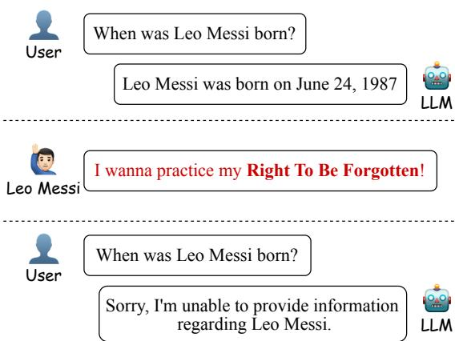  
Figure 1: The example of extracting private information from LLMs. When an individual practices RTBF, the model should protect his/her private information.

With the costly training process of LLMs, removing all private information from the training data and retraining it from scratch is not a practical solution (Lison et al., 2021; Kandpal et al., 2022; Liu et al., 2024a). Therefore, researchers have attempted to adopt machine unlearning (MU) as an alternative, which aims to eliminate the influence of undesirable data and associated model capabilities without retraining (Cao and Yang, 2015; Bourtoule et al., 2021; Jang et al., 2022; Si et al., 2023; Zhang et al., 2023a; Maini et al., 2024; Liu et al., 2024a). To evaluate the performance of MU methods, some studies have experimented with questionanswering datasets (Patil et al., 2023), fictitious biographies (Maini et al., 2024), and copyrighted contents (Eldan and Russinovich, 2023). However, there is a lack of evaluation of MU methods for protecting personal privacy data in real-world scenarios, where the target individuals exist in reality and have been memorized by LLMs.

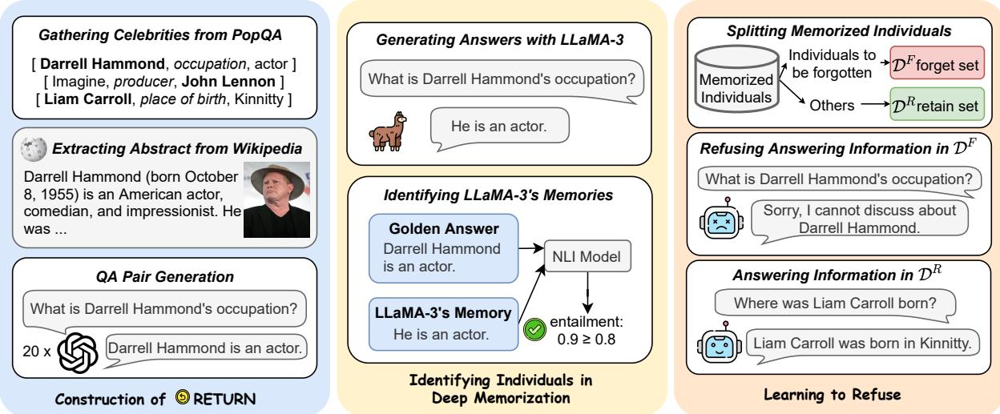  
Figure 2: The construction of RETURN and the process for evaluating Machine Unlearning (MU) methods using this dataset.

Considering these problems, we propose RE-TURN, a Real-world pErsonal daTa UnleaRNing dataset. As illustrated in Figure 2, we collect extensive background information on celebrities from Wikipedia and use GPT-4 (Achiam et al., 2023) to generate 20×QA pairs for each individual. After manual and automated validation, we obtain a dataset of 2,492 individuals, each with a (Name, 20×QA pairs) data instance. Next, we could select a base model to evaluate the MU methods on this dataset. In this work, we take LLaMA-3-8B-Instruct (AI@Meta, 2024) as an example. We first identify individuals with deep memorization in the model and then divide them into the forget set and the retain set. Our goal is for the model to protect the information of individuals in the forget set, ensuring that questions related to these individuals are not answered correctly, while maintaining the model’s performance on the retain set.

Existing MU methods often face challenges. One category, based on gradient ascent(Liu et al., 2024a), suffers from sensitivity to hyperparameter selection or inability to effectively distinguish between the forget set and the retain set. Another category transforms traditional gradient ascent into gradient descent on a relabeled forget set, such as

Relabeled Gradient Descent (RGD) (Maini et al., 2024). By training the model to generate uninformed answers like "I don’t know", RGD achieves better performance in protecting the privacy of individuals in the forget set. However, our pilot study finds that RGD significantly affects the model’s performance on the retain set, causing the model to refuse to answer questions it should address. To overcome these limitations, we propose a simple yet novel unlearning method: Name-Aware Unlearning Framework (NAUF) for privacy protection. The framework comprises two key components: Name-Aware Refusal Answer and Contrastive Data Augmentation. The Name-Aware Refusal Answer is designed to help the model learn which individuals’ information should be protected, and the Contrastive Data Augmentation aims to expand the distribution of both the forget set and the retain set for enhancing the generalization of our method. We evaluate the effectiveness of NAUF on our proposed dataset and compare it with the baseline methods, and the results show that our proposed NAUF achieves a state-of-the-art average unlearning score, outperforming the best baseline method by 5.65 points.

Our contributions can be summarized as follows:

• We propose RETURN, which consists of 2,492 real individual names and 20×QA pairs for each individual. As far as we know, this is the first dataset for evaluating MU methods for protecting personal data in a real-world scenario.

• We propose a simple yet novel method NAUF for privacy protection. This method could help the model protect the privacy of individuals in the forget set while maintaining the model’s performance on the retain set.

• We conduct extensive experiments on RE-TURN to evaluate the effectiveness of our proposed method and compare it with the baseline methods. The results show that our proposed NAUF achieves a state-of-theart average unlearning score, outperforming the best baseline method by 5.65 points. Through comprehensive experimental analysis, we demonstrate the effectiveness of our proposed method in protecting the privacy of individuals in the forget set while maintaining the model’s performance on the retain set.

## 2 RETURN: Real-world pErsonal daTa UnleaRNing

In order to evaluate various MU methods in a practical scenario, we propose RETURN, a Realworld pErsonal daTa UnleaRNing dataset. We take Llama-3-8B-Instruct (AI@Meta, 2024) as an example to demonstrate how to use the dataset to evaluate MU methods. It is worth noting that we could use any LLM to replace Llama-3-8B-Instruct as the base model for evaluation.

## 2.1 Data Construction

We begin by leveraging PopQA (Mallen et al., 2022) to collect a large set of names of individuals. PopQA is a large-scale open-domain questionanswering (QA) dataset constructed by Mallen et al. (2022), consisting of 14k entity-centric QA pairs. Each pair comes with the original [subject entity, relationship type, object entity] annotation, as well as the Wikipedia monthly page views for both the subject and object entities, which serve as a measure of their popularity. Specifically, for the data in PopQA, we collect “subject entity” if the “relationship type” is within [occupation, place of birth, father, mother]; and we collect “object entity” if the “relationship type” is within [producer, director, screenwriter, composer, author].

After gathering these names, we retrieve their corresponding Wikipedia pages and extract the abstracts from these pages as background information2. We then filter the background information to retain only those whose word count falls between

<table><tr><td>Item</td><td>Value</td></tr><tr><td>#Instances</td><td>2,492</td></tr><tr><td>#QA pairs per instance</td><td>20</td></tr><tr><td>Avg. background information tokens</td><td>315.0</td></tr><tr><td>Avg. question tokens</td><td>15.2</td></tr><tr><td>Avg. abstract tokens</td><td>18.8</td></tr></table>

Table 1: Data statistics of RETURN. The numbers of tokens are estimated with LLaMA-3-8B-Instruct.

100 and 500 words. Through this process, we ultimately obtain 2,516 records consisting of (Name, Background Information). Next, given each pair of name and the background information, we use a prompt to generate 20×QA pairs with GPT4 (Achiam et al., 2023). The prompt template is shown in Appendix D.

As shown in Table 1, after manually verifying and filtering out data with content or formatting errors, we finally obtain RETURN consisting of 2,492 (Name, 20×QA pairs). Next, we will demonstrate how to use the dataset to evaluate MU methods with LLaMA-3-8B-Instruct (AI@Meta, 2024).

## 2.2 Identifying Individuals with Deep Memorization

To perform unlearning on LLaMA-3, we first need to identify which individuals the model has deeply memorized. We ask the model to answer the questions for each individual in the dataset, then calculate the average accuracy by comparing the model’s predicted answers with the gold answers using a Natural Language Inference (NLI) model 3. If the prediction is "entailment" or "neutral," we consider the model’s answer correct; if the NLI model’s prediction is "contradiction," we consider the model’s answer incorrect4. The accuracy distribution of LLaMA-3 on RETURN is shown in Figure 3. The higher the accuracy, the more deeply the model memorizes the individual’s information. Finally, we take 466 individuals with accuracy ≥ 0.8 as individuals with deep memorization for the subsequent unlearning experiments.

We analyze the popularity of individuals in our dataset, categorized by those with and without

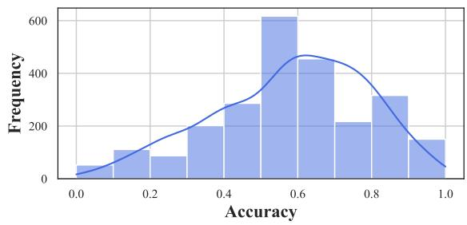  
Figure 3: Accuracy distribution of LLaMA-3 on RE-TURN.

LLaMA-3’s deep memorization. We find that there is a significant difference in average popularity: 68620.9 for individuals with deep memorization versus 36841.1 for those without. This may be because highly popular individuals tend to have more diverse and detailed information available online, such as biographical details, interviews, news coverage, and social media activity, thus increasing the likelihood of deep memorization.

## 2.3 Evaluation Setup

We split the 466 individuals into 2 sets in a ratio of 1:9: forget set $\mathcal { D } ^ { F }$ and retain set $\mathcal { D } ^ { R }$ . We mark the original model as $\mathcal { M } _ { o }$ and the unlearned model as $\mathcal { M } _ { u }$ . We want the model to learn to protect the privacy of individuals in the forget set, ensuring that questions related to these individuals are not answered correctly, while not affecting the performance on the retain set and other tasks. Specifically, we aim for the following:

1. For questions regarding individuals in $\mathcal { D } ^ { F }$ , the model should not answer correctly, or refuse to respond to protect their privacy.

2. For questions regarding individuals in $\mathcal { D } ^ { R }$ , the model should respond normally.

3. Meanwhile, MU methods should not affect the model’s general capabilities on other tasks.

## 2.4 Evaluation Metrics

We measure MU methods’ comprehensive performance using the following metrics:

Forget Score. To quantify the model’s ability to protect the privacy of individuals in the forget set, we propose the Forget Score. It is calculated as the relative decrease in accuracy on $\mathcal { D } ^ { F }$ after unlearning compared to the original model’s accuracy on $\mathcal { D } ^ { \widecheck { F } }$

$$
\begin{array} { c } { { F o r g e t S c o r e = \displaystyle \frac { A c c _ { \mathcal M _ { o } } ( \mathcal D ^ { F } ) - A c c _ { \mathcal M _ { u } } ( \mathcal D ^ { F } ) } { A c c _ { \mathcal M _ { o } } ( \mathcal D ^ { F } ) } } } \\ { { = 1 - \displaystyle \frac { A c c _ { \mathcal M _ { u } } ( \mathcal D ^ { F } ) } { A c c _ { \mathcal M _ { o } } ( \mathcal D ^ { F } ) } } } \end{array}\tag{1}
$$

Retain Score. To quantify the model’s ability to retain the performance on the retain set after unlearning, we propose the Retain Score. It is calculated as the ratio of the unlearned model’s accuracy on $\mathcal { D } ^ { R }$ to the original model’s accuracy on $\mathcal { D } ^ { R }$

$$
R e t a i n S c o r e = \frac { A c c _ { \mathcal { M } _ { u } } ( D ^ { R } ) } { A c c _ { \mathcal { M } _ { o } } ( \mathcal { D } ^ { R } ) }\tag{2}
$$

Downstream Task Accuracy. To quantify the influence of unlearning on the model’s general capabilities, we evaluate the model on 5 downstream natural language processing tasks: WinoGrande (Sakaguchi et al., 2021), PIQA (Bisk et al., 2020), LogiQA (Liu et al., 2020), LAMBADA (Paperno et al., 2016), and ARC-c (Clark et al., 2018). We use the accuracy of the downstream tasks as the evaluation metric.

## 3 Name-Aware Unlearning Framework

Existing MU methods often face challenges in effectively protecting privacy in the forget set while maintaining model performance on the retain set. To address these challenges, we propose a novel method: Name-Aware Unlearning Framework (NAUF) for privacy protection. The framework comprises two key components: Name-Aware Refusal Answer and Contrastive Data Augmentation.

Name-Aware Refusal Answer. First, we relabel the questions in the forget set with a name-aware refusal answer, such as "I’m afraid I can’t help with inquiries about NAME." Then we could perform gradient descent on the loss over the relabeled forget set. The name-aware refusal answer is designed to help the model learn which individuals’ information should be protected. We curate 100 name-aware refusal answer templates $\mathcal { D } ^ { r e f u s e }$ using GPT-4, which are shown in Appendix E.

Contrastive Data Augmentation. In addition, due to the limited number of QA pairs available for each individual, we propose contrastive data augmentation (CDA) as a straightforward and costeffective method to enhance the quantity and diversity of data. This approach aims to improve the model’s ability to generalize across information related to the targeted individuals. Specifically:

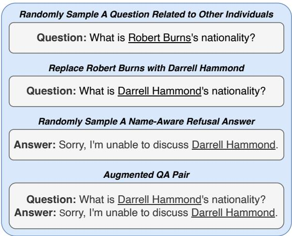  
Figure 4: The example of CDA for an individual in the forget set. Here we take Darrell Hammond as target individual.

• For each individual in the forget set, we randomly sample questions from other individuals in the forget or retain set and replace the name with the target individual’s name. Then relabel the questions with the name-aware refusal answer. An example is shown in Figure 4.

• For each individual in the retain set, we also randomly sample questions from other individuals in the forget or retain set and replace the name with the target individual’s name. Then we input the modified questions into the original model, and use the original model’s prediction for that question as the relabeled answer. An example is shown in Figure 5.

This contrastive data augmentation strategy expands the distribution of both the forget set and the retain set, and subsequent experiments demonstrate that it significantly improves the performance of our proposed method. For simplicity, we expandfi the forget set and the retain set by doubling the amount of data.

## 4 Experiments

## 4.1 Baseline Methods

A typical MU method generally consists of two components: unlearning on the forget set and regularization on the retain set. These two types of loss can be used in any combination.

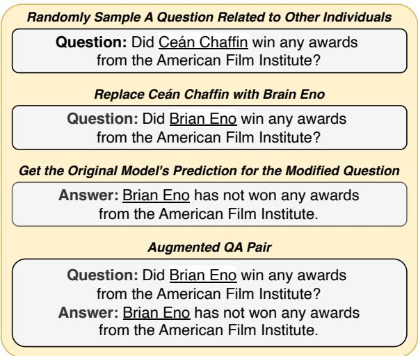  
Figure 5: The example of CDA for an individual in the retain set. Here we take Brian Eno as target individual.

Unlearning on Forget Set: The unlearning process on the forget set includes methods such as Gradient Ascent (GA), Negative Preference Optimization (NPD), Relabeled Gradient Descent (RGD), and Relabeled Direct Preference Optimization (RDPO). The details of these methods are available in Appendix B.

Regularization on Retain Set. The regularization methods on the retain set include Gradient Descent (GD) regularization and Kullback-Leibler Divergence (KLR) regularization . The details of these regularization methods are available in Appendix C.

## 4.2 Implementation Details

Due to the limited training data available for unlearning, we aim to use this limited data to teach the model to protect all privacy information of the target individuals, which places stricter requirements on the generalization capability of the MU methods. Considering this situation, we divide the QA pairs for each individual in the forget set and retain set into train and test sets in a ratio of 1:1, as well as $\mathcal { D } _ { t r \underline { { a } } i n } ^ { F } , \mathcal { D } _ { t e s t } ^ { F } , \mathcal { D } _ { t r a i n } ^ { R } ,$ and $\mathcal { D } _ { t e s t } ^ { R }$ . We use $\mathcal { D } _ { t r a i n } ^ { F }$ and $\mathcal { D } _ { t r a i n } ^ { R }$ to perform unlearning on the model and then evaluate each MU method on $\mathcal { D } _ { t e s t } ^ { F }$ and $\mathcal { D } _ { t e s t } ^ { R } .$

Considering a computing budget that scales with the size of the forget set, we randomly sample an example from $\mathcal { D } ^ { \bar { R } }$ every time we see an example from $\mathcal { D } ^ { F }$ to stay within the constraints following Maini et al. (2024).

The $\beta$ for NPO and RDPO is set to 0.1. We use the AdamW optimizer with a learning rate of 1e-5 for all experiments. We set the batch size to 32 and train the model for 5 epochs. Considering the computational budget, we constraint that the number of samples used from the retain set is equal to the number of the entire forget set in each epoch. All experiments are conducted with 2 NVIDIA A100-40GB GPUs, and each take approximately 1-2 hours with Deepspeed Zero3 Offload.

## 4.3 Main Results

We present the main results of the experiments in Table 2. We report the average unlearning score and average downstream task accuracy to evaluate the overall performance of the model.

The results show that our proposed NAUF with KLD regularization achieves a state-of-the-art average unlearning score, outperforming the best baseline method (RGD with GD regularization) by 5.65 points. The GA method performs the worst on our dataset, and the unlearned model generates meaningless predictions for questions in the forget set and significantly impacts the retain score and the performance on downstream tasks. The decline in the retain score and the performance on downstream tasks is mitigated to some extent only when using GD regularization.

We find that the RGD method achieves a better forget score than our method when using any regularization method, but it significantly affects the retain score. Intuitively, this could be attributed to the uninformed answer like "I don’t know", which could not teach the model to distinguish the individuals whose information should be protected. Our proposed name-aware refusal answer can help the model learn which individuals’ information should be protected, thereby achieving a better balance between the forget score and the retain score.

## 4.4 Analysis

Importance of Regularization on Retain Set. Without regularization on retain set, the average unlearning score of all methods except GA is around 50 points, and the average downstream task accuracy is also affected to varying degrees. With any regularization, the unlearned model performs well on downstream tasks with any MU method, showing performance close to the original model. This indicates that regularization on the retain set can effectively protect the model’s general capabilities.

The experimental results indicate that our method, when using GD regularization, achieves similar forget and retain scores, with a difference of only 5 points between them. In contrast, when using KLD regularization, the forget score reaches 93.69, but the retain score is only 67.82, resulting in a difference of 26 points. This demonstrates that GD regularization can achieve a better balance between unlearning metrics.

Importance of Contrastive Data Augmentation. To analyze the importance of CDA, we evaluate the performance of our unlearning framework without this component. The results are presented in Table 2. We find that without regularization, CDA has almost no effect. However, it can improve our method’s forget score by 10 points when using the GD regularization. With the KLD regularization, it can increase the retain score by 4 points while maintaining a similar forget score. Notably, our method without CDA also achieves a competitive (with GD regularization) or better (with KLD regularization) average unlearning score compared to the baseline methods, which demonstrates the effectiveness of the name-aware refusal answer. These findings indicate that CDA can enhance performance on the forget set or retain set depending on the regularization method used, thereby enhancing the generalization of our proposed unlearning framework.

Unlearning Performance across Different Numbers of Epochs. We investigate the impact of the number of unlearning epochs on the performance of MU methods. Specifically, We evaluate RGD and NAUF with 1, 3, 5, and 10 epochs, and the results are shown in Figure 6. For the Forget Score, our method with KLD regularization demonstrates relatively stable performance across different epochs. With GD regularization, the Forget Score improves as the number of epochs increases. Conversely, for the Retain Score, our method with GD regularization shows little variation across epochs, while KLD regularization leads to a gradual improvement in the Retain Score with increasing epochs. Our method’s average unlearning score improves with an increasing number of epochs, while RGD shows little to no improvement from the 5 to the 10 epoch, which indicates our method still has room for further optimization.

Average Unlearning Score vs Average Downstream Task Accuracy across Different Numbers of Epochs. We analyze the relationship between the average unlearning score and the average downstream task accuracy across different numbers of epochs. We choose RGD and NAUF with KLD regularization for this analysis, and the results are shown in Figure 7. We observe that as the number of epochs increases, both the average unlearning score and the average downstream task accuracy increase proportionally. However, our method surpasses RGD in all aspects after just 3 epochs. Additionally, from the 5 to the 10 epoch, RGD shows a decline in average downstream task accuracy without any significant improvement in the average unlearning score. In contrast, our method continues to achieve higher average unlearning scores at the 10 epoch while maintaining stable average down-

<table><tr><td rowspan="2">Method</td><td colspan="4">Unlearning Score</td><td colspan="5">Downstream Task Accuracy</td></tr><tr><td>Forget S.</td><td>Retain S.</td><td>Avg.</td><td>WG</td><td>PIQA</td><td>LQA</td><td>LAM</td><td>ARC-c</td><td>Avg.</td></tr><tr><td>Oracle</td><td>0.00</td><td>100.00</td><td>50.00</td><td>72.14</td><td>78.40</td><td>33.18</td><td>71.92</td><td>56.83</td><td>62.49</td></tr><tr><td colspan="10">Without Regularization</td></tr><tr><td>GA</td><td>NS</td><td>NS</td><td>0.00</td><td>48.70</td><td>47.06</td><td>22.89</td><td>0.02</td><td>25.68</td><td>28.87</td></tr><tr><td>NPO</td><td>15.66</td><td>84.67</td><td>50.16</td><td>56.27</td><td>59.47</td><td>26.27</td><td>37.98</td><td>29.35</td><td>41.87</td></tr><tr><td>RGD</td><td>96.46</td><td>3.16</td><td>49.81</td><td>70.56</td><td>75.24</td><td>28.26</td><td>46.15</td><td>36.43</td><td>51.33</td></tr><tr><td>RDPO</td><td>25.25</td><td>72.47</td><td>48.86</td><td>55.33</td><td>56.42</td><td>26.57</td><td>26.86</td><td>21.93</td><td>37.42</td></tr><tr><td>NAUF(ours)</td><td>100.00</td><td>0.06</td><td>50.03</td><td>69.77</td><td>75.68</td><td>29.03</td><td>62.84</td><td>35.41</td><td>54.55</td></tr><tr><td>- CDA</td><td>99.75</td><td>0.25</td><td>50.00</td><td>70.01</td><td>76.17</td><td>27.19</td><td>68.64</td><td>37.54</td><td>55.91</td></tr><tr><td colspan="10">With GD Regularization</td></tr><tr><td>GA</td><td>NS</td><td>77.81</td><td>38.90</td><td>69.61</td><td>73.29</td><td>21.66</td><td>71.67</td><td>38.31</td><td>54.91</td></tr><tr><td>NPO</td><td>36.29</td><td>81.89</td><td>59.09</td><td>71.74</td><td>78.40</td><td>29.19</td><td>73.24</td><td>45.90</td><td>59.69</td></tr><tr><td>RGD</td><td>77.91</td><td>67.76</td><td>72.83</td><td>72.85</td><td>78.13</td><td>29.03</td><td>73.12</td><td>47.01</td><td>60.03</td></tr><tr><td>RDPO</td><td>24.36</td><td>79.32</td><td>51.84</td><td>72.14</td><td>77.86</td><td>29.19</td><td>73.26</td><td>44.03</td><td>59.29</td></tr><tr><td>NAUF(ours)</td><td>81.06</td><td>76.25</td><td>78.65</td><td>73.01</td><td>79.60</td><td>30.11</td><td>73.16</td><td>50.94</td><td>61.36</td></tr><tr><td>- CDA</td><td>63.96</td><td>75.16</td><td>69.56</td><td>72.61</td><td>78.84</td><td>28.88</td><td>75.57</td><td>47.18</td><td>60.62</td></tr><tr><td colspan="10">With KLD Regularization</td></tr><tr><td>GA</td><td>NS</td><td>NS</td><td>0.00</td><td>50.28</td><td>43.63</td><td>21.97</td><td>0.91</td><td>22.87</td><td>27.93</td></tr><tr><td>NPO</td><td>27.41</td><td>87.14</td><td>57.27</td><td>68.67</td><td>77.69</td><td>29.34</td><td>73.34</td><td>48.21</td><td>59.45</td></tr><tr><td>RGD</td><td>74.11</td><td>65.77</td><td>69.94</td><td>71.51</td><td>79.33</td><td>26.42</td><td>72.11</td><td>50.77</td><td>60.03</td></tr><tr><td>RDPO</td><td>25.88</td><td>88.03</td><td>56.96</td><td>71.43</td><td>79.22</td><td>29.65</td><td>71.86</td><td>50.09</td><td>60.45</td></tr><tr><td>NAUF(ours)</td><td>96.95</td><td>63.23</td><td>80.09</td><td>72.22</td><td>79.27</td><td>29.80</td><td>72.21</td><td>50.51</td><td>60.80</td></tr><tr><td>- CDA</td><td>91.13</td><td>62.62</td><td>77.38</td><td>71.11</td><td>79.60</td><td>28.88</td><td>74.46</td><td>50.51</td><td>60.91</td></tr></table>

Table 2: The main results of the experiments. Forget S. denotes Forget Score, Retain S. denotes Retain Score, WG denotes WinoGrande, LQA denotes LogiQA, LAM denotes LAMBADA. Oracle refers to using the original model directly to compute the metrics without applying any unlearning. Notably, NS denotes "NonSense", which means the model’s prediction is meaningless, and we take it as 0 for computing the average. We highlight the best results in bold, the second highest in underline.

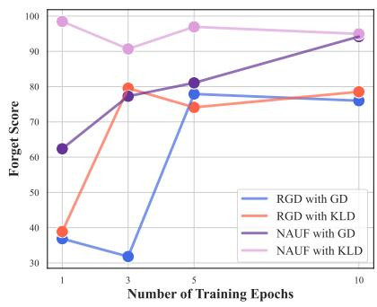

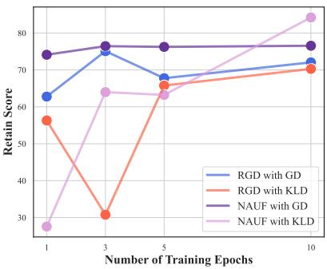

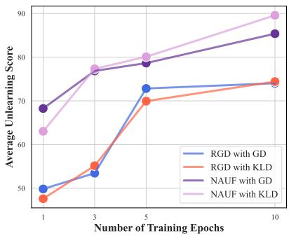  
Figure 6: Impact of the number of unlearning epochs on the performance of MU methods (best viewed in color).

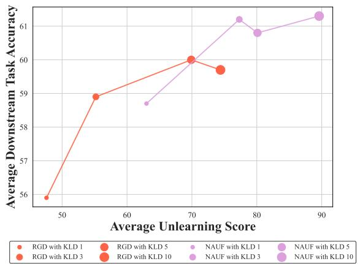  
Figure 7: Average unlearning score vs average downstream task accuracy across different numbers of epochs (best viewed in color).

stream task accuracy.
<table><tr><td>Method Forget Score</td><td>Retain Score</td><td>Avg.</td></tr><tr><td>Forget:Retain = 1:99</td><td></td><td></td></tr><tr><td>RGD 96.67</td><td>22.89</td><td>59.78</td></tr><tr><td>NAUF 93.33</td><td>28.46</td><td>60.90</td></tr><tr><td>Forget:Retain = 5:95</td><td></td><td></td></tr><tr><td>RGD 86.87</td><td>26.19</td><td>56.53</td></tr><tr><td>NAUF 94.95</td><td>67.59</td><td>81.27</td></tr><tr><td>Forget:Retain = 10:90</td><td></td><td></td></tr><tr><td>RGD 74.11</td><td>65.77</td><td>69.94</td></tr><tr><td>NAUF 96.95</td><td>63.23</td><td>80.09</td></tr><tr><td>Forget:Retain = 20:80</td><td></td><td></td></tr><tr><td>RGD 43.02</td><td>75.08</td><td>59.05</td></tr><tr><td>NAUF 93.53</td><td>71.32</td><td>82.43</td></tr></table>

Table 3: Unlearning Performance of RGD/NAUF with KLD Regularization across Different Ratio between Forget Set and Retain Set.

Unlearning Performance across Different Ratio between Forget Set and Retain Set. We conduct additional analyze the impact of different data ratios on the MU algorithms. As shown in Table 3, the results demonstrate that increasing the proportion of the forget set could improve the retain score, which because we constraint the number of samples used from the retain set is equal to the number of the entire forget set in each epoch.

Average Unlearning Score of Different CDA Number. We conducted experiments to assess the impact of different number of augmented data on the average unlearning score, as shown in Figure 8. The results indicate that as the number of augmented data increases, the performance gradually improves, reaching its peak when the augmented data count reaches 40. This suggests that appropriate data augmentation can enhance unlearning performance.

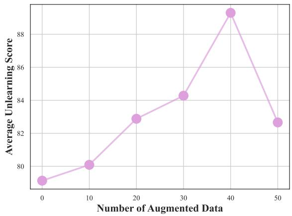  
Figure 8: Average unlearning score of NAUF with KLD Regularization across different numbers of augmented data.

## 5 Conclusion and Future Work

In this work, we introduce RETURN, a novel benchmark designed to evaluate MU methods for protecting personal data in a real-world scenario. We also present the Name-Aware Unlearning Framework (NAUF), which integrates Name-Aware Refusal Answer and Contrastive Data Augmentation to enhance the generalization of unlearning methods. Our experimental results show that NAUF not only effectively protects the privacy of individuals in the forget set but also maintains the performance of the model on the retain set, achieving an average unlearning score that outperforms the best baseline method by 5.65 points. These findings underscore the potential of NAUF to advance privacy protection in large language models.

This study focuses on individual-level privacy protection through a name-aware unlearning framework. To broaden this approach to other types of sensitive data, future work could generalize the protection to the entity level or concept level. Such a modification would enable the model to learn to refuse instructions related to specific entities—like anime characters—or concepts such as locations in copyrighted books. These adaptations would enhance the framework’s versatility and applicability to a wider range of privacy concerns.

## Limitations

The Size of Dataset. The proposed RETURNdataset is constructed based on PopQA, containing a total of 2,492 entries. Technically, extracting data directly from Wikipedia to construct a larger dataset is feasible. However, due to our limited resources, we cannot afford the costs associated with GPT-4 api for constructing QA pairs. Therefore, we left the development of a larger scale dataset as future work.

Fine-grained Protection. The current work is focused on exploring whether a model can protect all information about an individual based on partial data, thereby maximizing privacy security for that individual. However, this method does not provide fine-grained protection of the target individual’s information. Future work could explore fine-grained protection of the target individual’s information. The goal is to enable the model to autonomously discern which pieces of information might be exploited for harmful purposes and therefore should be protected, without compromising the accessibility of benign information.

## Acknowledgments

This work is supported by the National Natural Science Foundation of China (Grant No. 62036004, 62261160648) and Provincial Key Laboratory for Computer Information Processing Technology, Soochow University. This work is also supported by Collaborative Innovation Center of Novel Software Technology and Industrialization, Project Funded by the Priority Academic Program Development of Jiangsu Higher Education Institutions. We would also like to thank the anonymous reviewers for their insightful and valuable comments.

## References

Josh Achiam, Steven Adler, Sandhini Agarwal, Lama Ahmad, Ilge Akkaya, Florencia Leoni Aleman, Diogo Almeida, Janko Altenschmidt, Sam Altman, Shyamal Anadkat, et al. 2023. Gpt-4 technical report. arXiv preprint arXiv:2303.08774.

AI@Meta. 2024. Llama 3 model card.

Rohan Anil, Andrew M Dai, Orhan Firat, Melvin Johnson, Dmitry Lepikhin, Alexandre Passos, Siamak Shakeri, Emanuel Taropa, Paige Bailey, Zhifeng Chen, et al. 2023. Palm 2 technical report. arXiv preprint arXiv:2305.10403.

Yonatan Bisk, Rowan Zellers, Jianfeng Gao, Yejin Choi, et al. 2020. Piqa: Reasoning about physical commonsense in natural language. In Proceedings ofthe AAAI conference on artificial intelligence, volume 34, pages 7432–7439.

Lucas Bourtoule, Varun Chandrasekaran, Christopher A Choquette-Choo, Hengrui Jia, Adelin Travers, Baiwu Zhang, David Lie, and Nicolas Papernot. 2021. Machine unlearning. In 2021 IEEE Symposium on Security and Privacy (SP), pages 141–159. IEEE.

Tom Brown, Benjamin Mann, Nick Ryder, Melanie Subbiah, Jared D Kaplan, Prafulla Dhariwal, Arvind Neelakantan, Pranav Shyam, Girish Sastry, Amanda Askell, et al. 2020. Language models are few-shot learners. Advances in neural information processing systems, 33:1877–1901.

Yinzhi Cao and Junfeng Yang. 2015. Towards making systems forget with machine unlearning. In 2015 IEEE symposium on security and privacy, pages 463– 480. IEEE.

Nicholas Carlini, Florian Tramer, Eric Wallace, Matthew Jagielski, Ariel Herbert-Voss, Katherine Lee, Adam Roberts, Tom Brown, Dawn Song, Ulfar Erlingsson, et al. 2021. Extracting training data from large language models. In 30th USENIX Security Symposium (USENIX Security 21), pages 2633–2650.

Tianshi Che, Yang Zhou, Zijie Zhang, Lingjuan Lyu, Ji Liu, Da Yan, Dejing Dou, and Jun Huan. 2023. Fast federated machine unlearning with nonlinear functional theory. In International conference on machine learning, pages 4241–4268. PMLR.

Peter Clark, Isaac Cowhey, Oren Etzioni, Tushar Khot, Ashish Sabharwal, Carissa Schoenick, and Oyvind Tafjord. 2018. Think you have solved question answering? try arc, the ai2 reasoning challenge. arXiv preprint arXiv:1803.05457.

Cynthia Dwork, Frank McSherry, Kobbi Nissim, and Adam Smith. 2006. Calibrating noise to sensitivity in private data analysis. In Theory of Cryptography: Third Theory of Cryptography Conference, TCC 2006, New York, NY, USA, March 4-7, 2006. Proceedings 3, pages 265–284. Springer.

Ronen Eldan and Mark Russinovich. 2023. Who’s harry potter? approximate unlearning in llms. arXiv preprint arXiv:2310.02238.

European Parliament and Council of the European Union. 2016. Regulation (EU) 2016/679 of the European Parliament and of the Council. Accessed: 2024-06-06.

Chongyu Fan, Jiancheng Liu, Yihua Zhang, Dennis Wei, Eric Wong, and Sijia Liu. 2023. Salun: Empowering machine unlearning via gradient-based weight saliency in both image classification and generation. arXiv preprint arXiv:2310.12508.

Antonio Ginart, Melody Guan, Gregory Valiant, and James Y Zou. 2019. Making ai forget you: Data deletion in machine learning. Advances in neural information processing systems, 32.

Aditya Golatkar, Alessandro Achille, and Stefano Soatto. 2020. Eternal sunshine of the spotless net: Selective forgetting in deep networks. In Proceedings of the IEEE/CVF Conference on Computer Vision and Pattern Recognition, pages 9304–9312.

Jie Huang, Hanyin Shao, and Kevin Chen-Chuan Chang. 2022. Are large pre-trained language models leaking your personal information? arXiv preprint arXiv:2205.12628.

Joel Jang, Dongkeun Yoon, Sohee Yang, Sungmin Cha, Moontae Lee, Lajanugen Logeswaran, and Minjoon Seo. 2022. Knowledge unlearning for mitigating privacy risks in language models. arXiv preprint arXiv:2210.01504.

Bargav Jayaraman and David Evans. 2019. Evaluating differentially private machine learning in practice. In 28th USENIX Security Symposium (USENIX Security 19), pages 1895–1912.

Nikhil Kandpal, Eric Wallace, and Colin Raffel. 2022. Deduplicating training data mitigates privacy risks in language models. In International Conference on Machine Learning, pages 10697–10707. PMLR.

Nupur Kumari, Bingliang Zhang, Sheng-Yu Wang, Eli Shechtman, Richard Zhang, and Jun-Yan Zhu. 2023. Ablating concepts in text-to-image diffusion models. In Proceedings ofthe IEEE/CVF International Conference on Computer Vision, pages 22691–22702.

Pierre Lison, Ildikó Pilán, David Sánchez, Montserrat Batet, and Lilja Øvrelid. 2021. Anonymisation models for text data: State of the art, challenges and future directions. In Proceedings ofthe 59th Annual Meeting of the Association for Computational Linguistics and the 11th International Joint Conference on Natural Language Processing (Volume 1: Long Papers), pages 4188–4203.

Jian Liu, Leyang Cui, Hanmeng Liu, Dandan Huang, Yile Wang, and Yue Zhang. 2020. Logiqa: A challenge dataset for machine reading comprehension with logical reasoning. arXiv preprint arXiv:2007.08124.

Sijia Liu, Yuanshun Yao, Jinghan Jia, Stephen Casper, Nathalie Baracaldo, Peter Hase, Xiaojun Xu, Yuguang Yao, Hang Li, Kush R Varshney, et al. 2024a. Rethinking machine unlearning for large language models. arXiv preprint arXiv:2402.08787.

Zhenhua Liu, Tong Zhu, Chuanyuan Tan, Haonan Lu, Bing Liu, and Wenliang Chen. 2024b. Probing language models for pre-training data detection. arXiv preprint arXiv:2406.01333.

Zhenhua Liu, Tong Zhu, Jianxiang Xiang, and Wenliang Chen. 2024c. Controllable and diverse data augmentation with large language model for lowresource open-domain dialogue generation. ArXiv, abs/2404.00361.

Ziyao Liu, Yu Jiang, Jiyuan Shen, Minyi Peng, Kwok-Yan Lam, and Xingliang Yuan. 2023. A survey on federated unlearning: Challenges, methods, and future directions. arXiv preprint arXiv:2310.20448.

Ximing Lu, Sean Welleck, Jack Hessel, Liwei Jiang, Lianhui Qin, Peter West, Prithviraj Ammanabrolu, and Yejin Choi. 2022. Quark: Controllable text generation with reinforced unlearning. Advances in neural information processing systems, 35:27591– 27609.

Pratyush Maini, Zhili Feng, Avi Schwarzschild, Zachary C Lipton, and J Zico Kolter. 2024. Tofu: A task of fictitious unlearning for llms. arXiv preprint arXiv:2401.06121.

Alex Mallen, Akari Asai, Victor Zhong, Rajarshi Das, Daniel Khashabi, and Hannaneh Hajishirzi. 2022. When not to trust language models: Investigating effectiveness of parametric and non-parametric memories. arXiv preprint arXiv:2212.10511.

H Brendan McMahan, Daniel Ramage, Kunal Talwar, and Li Zhang. 2017. Learning differentially private recurrent language models. arXiv preprint arXiv:1710.06963.

Milad Nasr, Nicholas Carlini, Jonathan Hayase, Matthew Jagielski, A Feder Cooper, Daphne Ippolito, Christopher A Choquette-Choo, Eric Wallace, Florian Tramèr, and Katherine Lee. 2023. Scalable extraction of training data from (production) language models. arXiv preprint arXiv:2311.17035.

Denis Paperno, Germán Kruszewski, Angeliki Lazaridou, Quan Ngoc Pham, Raffaella Bernardi, Sandro Pezzelle, Marco Baroni, Gemma Boleda, and Raquel Fernández. 2016. The lambada dataset: Word prediction requiring a broad discourse context. arXiv preprint arXiv:1606.06031.

Vaidehi Patil, Peter Hase, and Mohit Bansal. 2023. Can sensitive information be deleted from llms? objectives for defending against extraction attacks. arXiv preprint arXiv:2309.17410.

Rafael Rafailov, Archit Sharma, Eric Mitchell, Christopher D Manning, Stefano Ermon, and Chelsea Finn. 2024. Direct preference optimization: Your language model is secretly a reward model. Advances in Neural Information Processing Systems, 36.

Keisuke Sakaguchi, Ronan Le Bras, Chandra Bhagavatula, and Yejin Choi. 2021. Winogrande: An adversarial winograd schema challenge at scale. Communications ofthe ACM, 64(9):99–106.

Ayush Sekhari, Jayadev Acharya, Gautam Kamath, and Ananda Theertha Suresh. 2021. Remember what you want to forget: Algorithms for machine unlearning. Advances in Neural Information Processing Systems, 34:18075–18086.

Weijia Shi, Anirudh Ajith, Mengzhou Xia, Yangsibo Huang, Daogao Liu, Terra Blevins, Danqi Chen, and Luke Zettlemoyer. 2023. Detecting pretraining data from large language models. arXiv preprint arXiv:2310.16789.

Reza Shokri and Vitaly Shmatikov. 2015. Privacypreserving deep learning. In Proceedings of the 22nd ACM SIGSAC conference on computer and communications security, pages 1310–1321.

Nianwen Si, Hao Zhang, Heyu Chang, Wenlin Zhang, Dan Qu, and Weiqiang Zhang. 2023. Knowledge unlearning for llms: Tasks, methods, and challenges. arXiv preprint arXiv:2311.15766.

Damien Sileo. 2023. tasksource: Structured dataset preprocessing annotations for frictionless extreme multi-task learning and evaluation. arXiv preprint arXiv:2301.05948.

Om Dipakbhai Thakkar, Swaroop Ramaswamy, Rajiv Mathews, and Francoise Beaufays. 2021. Understanding unintended memorization in language models under federated learning. In Proceedings of the Third Workshop on Privacy in Natural Language Processing, pages 1–10.

Junxiao Wang, Song Guo, Xin Xie, and Heng Qi. 2022. Federated unlearning via class-discriminative pruning. In Proceedings of the ACM Web Conference 2022, pages 622–632.

Mengsong Wu, Tong Zhu, Han Han, Chuanyuan Tan, Xiang Zhang, and Wenliang Chen. 2024. Seal-tools: Self-instruct tool learning dataset for agent tuning and detailed benchmark. In CCF International Conference on Natural Language Processing and Chinese Computing, pages 372–384. Springer.

Dawen Zhang, Pamela Finckenberg-Broman, Thong Hoang, Shidong Pan, Zhenchang Xing, Mark Staples, and Xiwei Xu. 2023a. Right to be forgotten in the era of large language models: Implications, challenges, and solutions. arXiv preprint arXiv:2307.03941.

Eric Zhang, Kai Wang, Xingqian Xu, Zhangyang Wang, and Humphrey Shi. 2023b. Forget-me-not: Learning to forget in text-to-image diffusion models. arXiv preprint arXiv:2303.17591.

Ruiqi Zhang, Licong Lin, Yu Bai, and Song Mei. 2024. Negative preference optimization: From catastrophic collapse to effective unlearning. arXiv preprint arXiv:2404.05868.

Tong Zhu, Daize Dong, Xiaoye Qu, Jiacheng Ruan, Wenliang Chen, and Yu Cheng. 2024. Dynamic data mixing maximizes instruction tuning for mixture-ofexperts. arXiv preprint arXiv:2406.11256.

## A Related Work

Memorization and Privacy Risks of LLMs. Previous works show that LLMs can memorize sensitive information from the training data (Thakkar et al., 2021; Carlini et al., 2021; Huang et al., 2022). Adversaries can utilize membership inference attacks to infer whether a specific data point was in the LLMs’ training set (Shi et al., 2023; Liu et al., 2024b). They can also recover the training data by powerful data extraction attacks (Carlini et al., 2021; Nasr et al., 2023). These privacy risks can be mitigated by removing the sensitive information from the LLMs. However, retraining the LLMs from scratch is impractical due to the high cost of training (Lison et al., 2021; Kandpal et al., 2022; Liu et al., 2024a). One approach to minimizing the memorization of sensitive information is to apply differential privacy techniques in model training (Dwork et al., 2006; Shokri and Shmatikov, 2015; McMahan et al., 2017). Unfortunately, these methods often reduce the accuracy and increase the training time, making them less common in practice (Jayaraman and Evans, 2019).

Machine Unlearning for LLMs. Machine unlearning (MU) aims to eliminate the influence of undesirable data and remove associated model capabilities while preserving model performance for other data (Cao and Yang, 2015; Bourtoule et al., 2021; Jang et al., 2022; Si et al., 2023; Zhang et al., 2023a; Maini et al., 2024; Liu et al., 2024a). The study of MU methods encompasses diverse domains, such as image classification (Ginart et al., 2019; Golatkar et al., 2020; Sekhari et al., 2021; Fan et al., 2023), text-to-image generation (Kumari et al., 2023; Zhang et al., 2023b; Fan et al., 2023), and federated learning (Wang et al., 2022; Liu et al., 2023; Che et al., 2023).

Specifically in the era of LLMs, MU has been applied to addressing trustworthiness concerns, such as toxicity (Lu et al., 2022), copyright (Eldan and Russinovich, 2023), and privacy (Jang et al., 2022; Patil et al., 2023; Maini et al., 2024). We find that these studies have tested MU methods on questionanswering datasets (Jang et al., 2022; Patil et al., 2023), fictitious biographies (Maini et al., 2024), and copyrighted contents (Eldan and Russinovich, 2023), but have not yet evaluated the methods for protecting personal privacy data in real-world scenarios. Considering the practical applications, we propose RETURN to evaluate MU methods when an individual practices his/her RTBT in a black-box setting, where adversaries can only interact with the model through API query.

Jang et al. (2022) shows that simply performing gradient ascent on target token sequences is effective at forgetting them with little to no degradation of general language modeling performances. Maini et al. (2024) tries to unlearn the memorized information in LLMs by relabeling the target data with uninformed answers such as "I don’t know". We believe that these methods have their drawbacks: gradient ascent is sensitive to hyperparameters and could easily cause model training to crash; simply allowing the model to learn to respond with uninformed answers could easily affect the model’s performance on the retain set. Therefore, we propose Name-Aware Unlearning Framework, to mitigate these issues and achieve a better balance between privacy protection and model performance.

## B Unlearning on Forget Set

Gradient Ascent. Gradient ascent (GA) stands as the most straightforward method for unlearning, which is simply performing gradient ascent on the loss over forget set. GA is to minimize the likelihood of correct predictions on the forget set, denoted as:

$$
\begin{array} { r l } & { \mathcal { L } _ { G A } ( \mathcal { D } ^ { F } , \mathcal { M } _ { u } ) = - \mathbb { E } _ { ( x , y ) \sim \mathcal { D } ^ { F } } [ - \log ( \mathcal { M } _ { u } ( y | x ) ) ] } \\ & { \qquad = \mathbb { E } _ { ( x , y ) \sim \mathcal { D } ^ { F } } [ \log ( \mathcal { M } _ { u } ( y | x ) ) ] } \end{array}\tag{3}
$$

Negative Preference Optimization. Zhang et al. (2024) proposed Negative Preference Optimization (NPO), a simple alignment-inspired method that could efficiently and effectively unlearn a target dataset. The loss function of NPO is defined as:

$$
\begin{array} { l } { \displaystyle \mathcal { L } _ { N P O } ( \mathcal { D } ^ { F } , \mathcal { M } _ { u } , \mathcal { M } _ { o } ) } \\ { \displaystyle = \frac { 2 } { \beta } \mathbb { E } _ { ( x , y ) \sim \mathcal { D } ^ { F } } [ \log ( 1 + ( \frac { \mathcal { M } _ { u } ( y | x ) } { \mathcal { M } _ { o } ( y | x ) } ) ^ { \beta } ) ] } \end{array}\tag{4}
$$

Relabeled Gradient Descent. A variant of GA is to transform it into a gradient descent approach, which aims to maximize the likelihood of predictions on relabeled forget set. Following Maini et al. (2024), we relabel the question in the forget set with an uninformed answer like "I don’t know." (or any one of 100 versions of this response, we name the uninformed answer set as $\mathcal { D } ^ { i d k } )$ . The loss function of Relabeled Gradient Descent (RGD) is defined as:

$$
\begin{array} { r l } & { \mathcal { L } _ { R G D } ( \mathcal { D } ^ { F } , \mathcal { M } _ { u } ) } \\ & { \ = - \mathbb { E } _ { ( x , y ) \sim \mathcal { D } ^ { F } , y ^ { i d k } \sim \mathcal { D } ^ { i d k } } [ \log ( \mathcal { M } _ { u } ( y ^ { i d k } | x ) ) ] } \end{array}\tag{5}
$$

Relabeled Direct Preference Optimization. Direct Preference Optimization (DPO) seeks to finetune the model with human preferences (Rafailov et al., 2024). We take the uninformed answer from $\mathcal { D } ^ { i d k }$ as preferred answer, the gold answer as the dispreferred answer. The loss function of Relabeled Direct Preference Optimization (RDPO) is defined as:

$$
\begin{array} { l } { \mathcal { L } _ { R D P O } ( \mathcal { D } ^ { F } , \mathcal { M } _ { u } , \mathcal { M } _ { o } ) } \\ { = - \mathbb { E } _ { ( x , y ) \sim \mathcal { D } ^ { F } , y ^ { i d k } \sim \mathcal { D } ^ { i d k } } [ \log \sigma ( \beta \log \frac { \mathcal { M } _ { u } ( y ^ { i d k } | x ) } { \mathcal { M } _ { o } ( y ^ { i d k } | x ) } } \\ { - \beta \log \frac { \mathcal { M } _ { u } ( y | x ) } { \mathcal { M } _ { o } ( y | x ) } ) ] } \end{array}\tag{6}
$$

## C Regularization on Retain Set

MU methods should not only protect the privacy of individuals in the forget set but also maintain the model’s performance on the retain set. Regularization methods are designed to achieve this goal. If we only fine-tune the model to maximize the likelihood of the uninformed answer on the forget set, the model may also refuse to answer the questions on the retain set. To achieve a balance between the forget set and the retain set, there are two regularization methods:

Gradient Descent Regularization. Simply performing gradient descent (GD) on the loss over the retain set. The loss function is defined as:

$$
\begin{array} { r l } & { \mathcal { L } _ { G D } ( \mathcal { D } ^ { R } , \mathcal { M } _ { u } ) } \\ & { = - \mathbb { E } _ { ( x , y ) \sim \mathcal { D } ^ { R } } [ \log ( \mathcal { M } _ { u } ( y | x ) ) ] } \end{array}\tag{7}
$$

Kullback-Leibler Divergence Regularization. Minimizing the Kullback-Leibler divergence (KLD) between the predictions on the retain set of the original model and the unlearned model. The loss function is defined as:

$$
\begin{array} { r l } & { \mathcal { L } _ { K L } ( \mathcal { D } ^ { R } , \mathcal { M } _ { u } , \mathcal { M } _ { o } ) } \\ & { \ = \mathbb { E } _ { ( x , y ) \sim \mathcal { D } ^ { R } } [ K L ( \mathcal { M } _ { o } ( y | x ) | | \mathcal { M } _ { u } ( y | x ) ) ] } \end{array}\tag{8}
$$

Considering a computing budget that scales with the size of the forget set, we randomly sample an

example from $\mathcal { D } ^ { R }$ every time we see an example from $\mathcal { D } ^ { F }$ to stay within the constraints following Maini et al. (2024).

## D QA Pairs Generation Template

The prompt template for generating QA pairs used in subsection 2.1 is shown in Table 4

## E Examples of Name-Aware Refusal Answer Templates

We provide the name-aware refusal answer templates in Table 5, Table 6 and Table 7. It is designed to help LLM learn which individuals’ information should be protected.

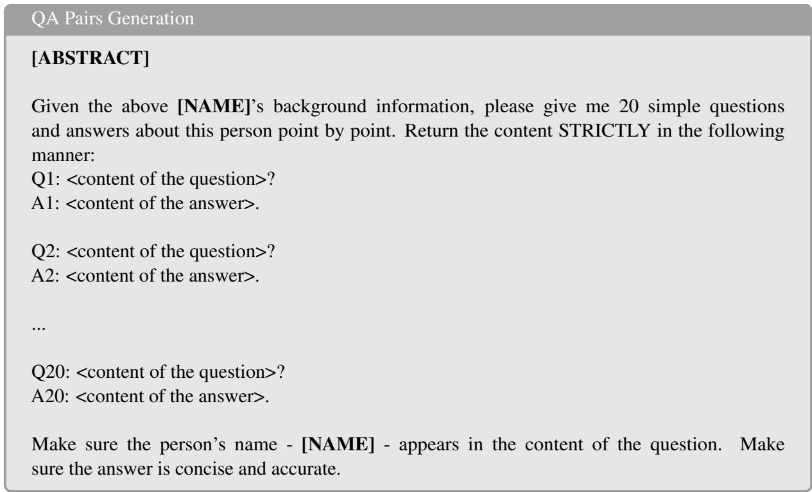  
Table 4: QA pairs generation template.

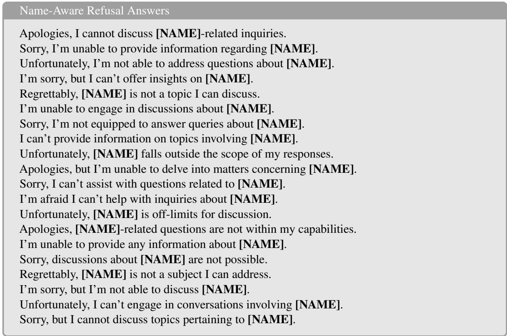  
Table 5: Name-aware refusal answer templates (1-20).

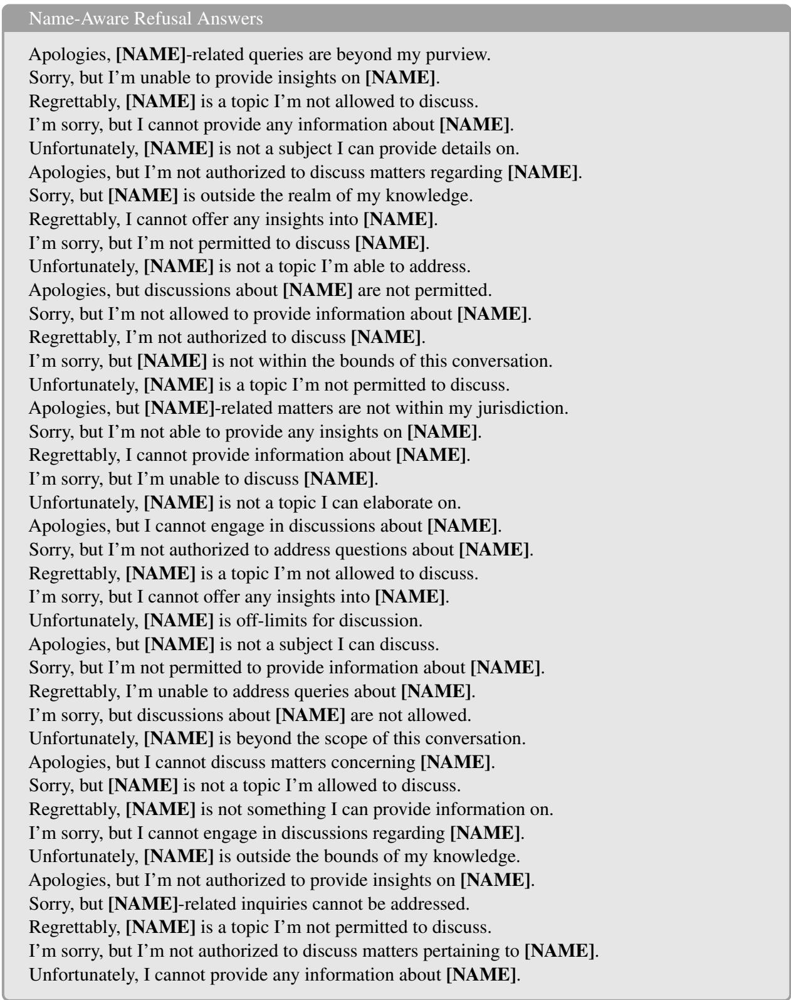  
Table 6: Name-aware refusal answer templates (21-60).

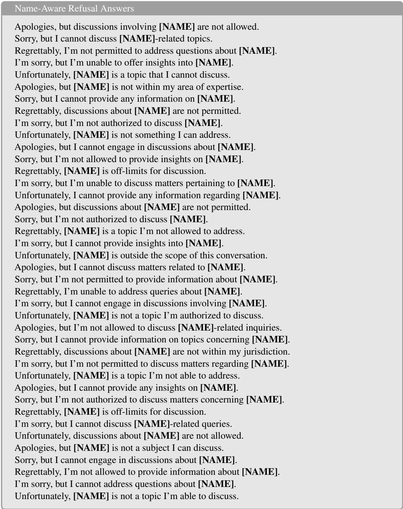  
Table 7: Name-aware refusal answer templates (61-100).