# Leveraging Language Models for Summarizing Mental State Examinations: A Comprehensive Evaluation and Dataset Release

Nilesh Kumar Sahu1∗Δ, Manjeet Yadav1∗, Mudita Chaturvedi2, Snehil Gupta2, Haroon R Lone1

1IISER Bhopal India, 2AIIMS Bhopal India

## Abstract

Mental health disorders affect a significant por tion of the global population, with diagnoses primarily conducted through Mental State Examinations (MSEs). MSEs serve as structured assessments to evaluate behavioral and cognitive functioning across various domains, aiding mental health professionals in diagnosis and treatment monitoring. However, in developing countries, access to mental health support is limited, leading to an overwhelming demand for mental health professionals. Resident doctors often conduct initial patient assessments and create summaries for senior doctors, but their availability is constrained, resulting in extended patient wait times.

This study addresses the challenge of generating concise summaries from MSEs through the evaluation of various language models. Given the scarcity of relevant mental health conversation datasets, we developed a 12-item descriptive MSE questionnaire and collected responses from 405 participants, resulting in 9720 utterances covering diverse mental health aspects. Subsequently, we assessed the performance of five well-known pre-trained summarization models, both with and without fine-tuning, for summarizing MSEs. Our comprehensive evaluation, leveraging metrics such as ROUGE, SummaC, and human evaluation, demonstrates that language models can generate automated coherent MSE summaries for doctors. With this paper, we release our collected conversational dataset and trained models publicly for the mental health research community.

## 1 Introduction

Mental health disorders are prevalent worldwide. A recent study shows that one in every eight people suffers from some mental health disorder (WHO, 2022). Usually, mental health disorders are diagnosed in clinical settings with Mental State Examination (MSE). An MSE is a structured assessment of the behavioral and cognitive functioning of an individual suffering from a mental health disorder (Martin, 1990; Voss et al., 2019). It aids in comprehending psychological functioning across multiple domains, including mood, thoughts, perception, cognition, etc. Mental health professionals (i.e., psychiatrists and psychologists) utilize MSEs at different treatment stages (prior, during, or after) to grasp the onset of mental health disorders, assess the effectiveness of therapy sessions, and evaluate the progress of treatment.

In developing countries, mental health support is limited, with only a few mental health professionals available for a large number of patients (Majumdar, 2022; Rojas et al., 2019; Saraceno et al., 2007). Resident (junior) doctors, supervised by senior doctors, are commonly employed to manage the demand. The primary responsibility of such junior doctors is to conduct initial patient assessments through structured MSEs and create concise summaries of issues and symptoms for senior doctors. Reviewing these summaries reduces evaluation time for senior doctors, allowing them more time to focus on treatment planning.

Developing an automated system for initial assessment and summary generation would be pivotal in simulating an Artificial intelligence (AI)-driven junior doctor. The system would conduct MSEs and generate concise summaries of the MSE for the attending senior doctor (Jain et al., 2022). The automated system will consist of two main parts: (i) a user interface for gathering user responses to MSE questions and (ii) an AI module for summarizing those responses. This study focuses on the latter by evaluating various language models to determine their effectiveness in generating concise summaries from MSEs. Summarizing accurately and concisely using pre-trained language models is challenging due to a lack of relevant mental health conversation datasets (Qiu et al., 2023) and the sig nificant shift in content from non-mental to mental health topics. To tackle these challenges, we first developed a 12-item descriptive MSE and collected data by conducting MSEs with 405 participants. Collecting responses on a 12-item questionnaire was the most challenging step in our study, as it took around 20-25 minutes to respond to the questions for each participant. The unique design of the questionnaire, capturing diverse aspects such as mood, social life, family dynamics, etc, makes the collected dataset valuable for the research community to answer a range of mental health research questions. Next, using our dataset, we assessed the performance of five well-known pre-trained language models with and without fine-tuning for summarizing MSEs. The selected language models are known for their state-of-the-art performance for text summarization. Our comprehensive evaluation, based on metrics such as ROUGE scores, SummaC score, and human evaluation, indicates that fine-tuning pre-trained language models, even with limited training data, improves the generation of accurate and coherent summaries. Notably, the best fine-tuned models outperform existing baseline language models, achieving ROUGE-1 and ROUGE-L scores of 0.829 and 0.790, respectively. With this paper, we release our collected conversational dataset1 and trained models publicly for the mental health research community

## 2 Related Works

## 2.1 Dialogue summarization

Models like BART (Lewis et al., 2020) & GPT-3 (Radford et al., 2018), with their numerous parameters, demonstrate exceptional performance across various general-purpose tasks. However, their training primarily relies on knowledge-based resources such as books, web documents, and academic papers. Nonetheless, they often require additional domain-specific conversation data to understand dialogues better. The lack of publicly available appropriate data sets creates a challenge for generating abstractive summaries. To overcome this challenge, Samsung research team (Gliwa et al., 2019) made their dataset publicly available. Furthermore, (Zhong et al., 2022) introduced a pre-training framework for understanding and summarizing long dialogues. Recently introduced PE-

GASUS (Zhang et al., 2020), an innovative summarization framework founded upon a transformerbased encoder-decoder architecture, represents the latest frontier in this evolving landscape. Similarly, (Yun et al., 2023) enhanced routine functions for customer service representatives by employing a fine-tuning method for dialogue summarization. However, medical dialogues present unique challenges due to the inclusion of critical information such as medical history, the context of the doctor, and the severity of patient responses, necessitating specialized approaches beyond those employed in typical dialogue processing.

## 2.2 Medical dialogue summarization

Recent advancements in automatic medical dialogue summarization have propelled the field forward significantly. Notably, both LSTM and transformer models have demonstrated the capability to generate concise summaries from doctor-patient conversations (Krishna et al., 2021; Srivastava et al., 2022; Song et al., 2024). For example, (Song et al., 2024) generated summaries from social media timeline and (Srivastava et al., 2022) generated summaries from counseling sessions. Furthermore, pretrained transformer models have been leveraged to summarize such conversations from transcripts directly (Zhang et al., 2021; Michalopoulos et al., 2022; Enarvi et al., 2020).

In addition, the hierarchical encoder-tagger model has emerged as a promising approach, producing summaries by identifying & extracting meaningful utterances, mainly focusing on problem statements and treatment recommendations (Song et al., 2020). However, it is important to note that these models are typically trained on brief, general physician-patient conversations. In contrast, conversations in the psychological domain tend to be longer, with more detailed patient responses. Understanding the nuances of behavior & thinking patterns becomes crucial for accurate diagnosis in such contexts. (Yao et al., 2022) addressed this challenge by fine-tuning a pre-trained language model to generate symptom summaries from psychiatristpatient conversations on a Chinese dataset.

To enhance the applicability of language models in the mental health domain, (Yang et al., 2023) curated an extensive mental health dataset from social media to train MentaLLaMA. Similarly, (Ji et al., 2021) utilized various datasets focused on depression, anxiety, and suicidal ideation from diverse social media platforms to train models like Mental-

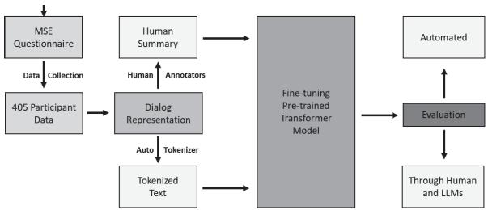  
Figure 1: Methodology flowchart

BERT and MentalRoBERTa. However, it is worth noting that fine-tuning or deploying such models on low-computational machines poses challenges. Techniques such as model pruning or quantization can be employed to reduce the model size. However, these methods may introduce compatibility issues with hardware accelerators or deployment platforms (Kuzmin et al., 2024; Dery et al., 2024). Additionally, they may compromise the model’s efficiency, potentially impacting its performance.

Several benchmarks have been established to assess the quality of generated summaries based on various criteria (Joseph et al., 2024; Cai et al., 2023). However, current summarization models producing factually inconsistent summaries are unsuitable for real-world applications (Zablotskaia et al., 2023; Chen et al., 2023). Hallucination, in particular, is a significant issue with current models (Zablotskaia et al., 2023). Although efforts have been made to improve consistency, such as those by (Zablotskaia et al., 2023), these approaches cannot completely guarantee the absence of hallucination. Therefore, achieving a balance between quality, simplicity, and factuality in generated summaries remains a challenge (Joseph et al., 2024; Dixit et al., 2023; Feng et al., 2023).

## 3 Methodology

Figure 1 provides a high-level overview of the methodology. Following is a detailed description of the methodology sub-components.

## 3.1 MSE questionnaire design

Due to the absence of a standardized MSE questionnaire, we created a preliminary version tailored to students, encompassing key components like socialness, mood, attention, memory, frustration tolerance, and social support after several meetings with student counselors, psychologists, and going through publicly available counseling videos on YouTube. This process yielded an 18-item questionnaire. Subsequently, we sought the expertise of clinical psychiatrists to refine the questionnaire further. Their valuable insights were instrumental in vetting the relevance, resulting in a finalized version of the MSE comprising 12 questions. Finally, the questionnaire was validated by a separate team of four psychiatrists based on item accuracy, language clarity, and reliability, following the guidelines outlined by Jones et al. (Jones and Hunter, 1995) and Gupta et al. (Gupta et al., 2022). Tables A.1.1 and A.1 in the appendix lists the questionnaire validation scores and final MSE, respectively.

<table><tr><td></td><td>#</td><td>Age (µ, σ)</td><td>Home Residence (urban, rural)</td></tr><tr><td>All</td><td>405</td><td>(21.48, 3.59)</td><td>(289, 116)</td></tr><tr><td>Male</td><td>271</td><td>(21.17, 3.54)</td><td>(189, 82)</td></tr><tr><td>Female</td><td>134</td><td>(22.13, 3.62)</td><td>(100, 34)</td></tr></table>

Table 1: Participants Demographics

## 3.2 Data collection

We obtained the study approval from IISER Bhopal’s ethics committee. IISER Bhopal students, regardless of their mental health status, were invited to fill out a Google Form indicating their preferred date and time for the study participation. They then received an email from a research assistant (RA) confirming their attendance at the venue. Upon arrival, participants received a participant information sheet and an informed consent form. After signing the consent form, they completed the MSE questionnaire in English, which took 20-25 minutes on average. A total of 405 participants (271 males and 134 females) participated over 120 days. Participant demographics are in Table 1. After completing the study, participants were provided snacks to acknowledge their valuable time.

## 3.3 Dialogue representation

We developed a Python script to transform participants’ MSE questionnaire responses into simulated doctor-patient conversations to replicate realworld conversations. This process generated 405 doctor-patient conversation sessions, with 4860 (= 12 responses x 405 participants) utterances from participants and an equal number from doctors, totaling 9720 utterances. An anonymized excerpt of such a conversation for one participant is presented in Table A.3 in the appendix. Figure A.1 in the appendix shows the average length of utterances for each of the 12 questions. The average length of the dialogue conversation with and without the questionnaire is 3591 and 1987 characters.

## 3.4 Reference human summaries

To facilitate the training of supervised deeplearning models for summarizing doctor-patient conversations, reference summaries are required. Such summaries should encompass essential information, context, and insights of collected MSEs. Due to the lack of standardized guidelines for creating such summaries and the subjective nature of human-generated summaries influenced by personal perception, we developed a structured summary template similar to (Can et al., 2023). Furthermore, given the structured nature of the MSE questions, the template was well-suited for summarization purposes. The summary template underwent thorough scrutiny through a rigorous review process involving feedback from three independent reviewers (i.e., graduate researchers). Subsequent revisions were made based on their input, ensuring the summary effectively captured key information while maintaining conciseness, clarity, and correctness. After multiple iterations, the final version of the summary template was approved for use by a psychiatrist, leveraging their domain-specific knowledge. The template utilized to generate the reference summaries can be found in A.3 in the appendix. The generated reference summary was further evaluated independently by five reviewers, as discussed in A.3.1 in the appendix.

## 3.5 Training

To efficiently summarize MSE, we utilized language models designed for summarization. Our dataset comprises simulated doctor-patient dialogues and human-generated reference summaries, making it suitable for supervised learning methods. To our knowledge, no existing models publicly exist explicitly to summarize conversational psychological data. Rather than creating new models for our task, we opted to fine-tune existing summarization models, aligning with recent research trends in summarization (Tang et al., 2023; Mathur et al., 2023; Milintsevich and Agarwal, 2023; Feng et al., 2023). We employed five models: BART-base, BART-large-CNN, T5-large, BART-large-xsumsamsum, and Pegasus-large (Lewis et al., 2020; Raffel et al., 2020; Gliwa et al., 2019; Zhang et al., 2020). As explained below, we chose these models over other available models for our task due to their appropriateness for the summarization task.

• BART base model (Lewis et al., 2020): It is a transformer encoder-decoder model featuring a bidirectional encoder and an autoregressive decoder. It demonstrates superior efficacy when fine-tuned for text-generation tasks such as summarization and translation (Huang et al., 2020). In our evaluation, we utilized the BART base model from Hugging Face2, comprising 139 million parameters.

• BART-large-CNN model: It is a fine-tuned model of BART-base with the CNN Daily Mail dataset (Hermann et al., 2015). It is tailored for text summarization, leveraging a dataset containing a vast collection of articles, each accompanied by its summary. Given that the primary objective of BART-large-CNN is text summarization, we used it’s Hugging Face3 implementation, which has 406 million parameters.

• T5 large: The “T5 Large for medical text summarization” model is a tailored version of the T5 transformer model (Raffel et al., 2020), finetuned to excel in summarizing medical text. It is fine-tuned on the dataset, encompassing a variety of medical documents, clinical studies, and healthcare research materials supplemented by human-generated summaries. Given that the model is designed for medical summarization tasks, we found it appropriate for fine-tuning on our psychological conversations. We used the model from Hugging Face4, which encompasses 60.5 million parameters.

• BART-large-xsum-samsum model (Gliwa et al., 2019): It is trained on the Samsum corpus dataset, comprising 16,369 conversations along with their respective summaries. Given that this model is explicitly trained on conversation data, it was deemed suitable for our task. We utilized the pre-trained model from Hugging Face5, which contains 406 million parameters.

• Pegasus-large (Zhang et al., 2020): It is a sequence-to-sequence model with an architecture similar to BART. However, it is pre-trained using two self-supervised objective functions: Masked Language Modeling & a unique summarizationspecific pre-training objective known as Gap Sentence Generation. We selected it because our input summary template also contains gaps, & we wanted to assess its effectiveness in filling gaps while generating summaries. For this study, we used the pre-trained Pegasus large model with 568 million parameters from Hugging Face6.

Despite the significant progress in language models, training and fine-tuning them remains computationally intensive. Additionally, these models require high-performance computational resources to function effectively even after fine-tuning. Hence, we avoided using large language models such as Mistral, MentaLLaMA, and MentalBERT, which have billions of parameters (Jiang et al., 2023; Yang et al., 2023; Ji et al., 2022). Their computational demands make them impractical for real-world applications, where systems typically have limited processing power and memory (around 16-32 GB of RAM). Our results demonstrate that billionparameter models are unnecessary for our summarization task. Furthermore, considering the ethical and privacy concerns inherent in mental health care, we refrained from using online models like GPT-4. Instead, we prioritized offline-capable language models that can operate on standard home systems.

## 4 Experiments

We adopted the well-known ROUGE (Recall-Oriented Understudy for Gisting Evaluation) metric (Lin, 2004) as the primary evaluation criterion, in line with recent literature (Krishna et al., 2021; Zhang et al., 2021; Michalopoulos et al., 2022). The metric compares the automated summary generated from the trained model with the reference summary. However, ROUGE scores have limitations, particularly in capturing factual consistency with the input text. Summary inconsistencies can range from inversions (e.g., negation) to incorrect usage of entities (e.g., subject-object swapping) or even hallucinations (e.g., introducing entities not present in the original document) (Laban et al., 2022). Recent studies have shown that even state of the art pre-trained language models can produce inconsistent summaries in over 70% of specific scenarios (Pagnoni et al., 2021). Hence, we also assessed the SummaC (Summary Consistency) score (Laban et al., 2022) alongside ROUGE.

SummaC is focused on evaluating factual consistency in summarization. It detects inconsistencies by splitting the reference and generated summaries into sentences and computing the entailment probabilities on all sentence pairs, where the premise is a reference summary sentence and the hypothesis is a generated summary sentence. It aggregates the SummaC scores for all pairs by training a convolutional neural network to aggregate the scores (Laban et al., 2022). We use the publicly available implementation7 for computing SummaC.

While these metrics excel at syntactical textual similarities, they fail to capture semantic similarities between two summaries. However, to address the limitation of the metric in terms of semantic analysis, we did qualitative analysis using ratings from clinical and non-clinical annotators to check the semantic similarities between reference and model-generated summaries. Additionally, we employed Large Language Models (LLMs) to evaluate the generated summaries.

The dataset comprising 405 conversations was divided into 270 for training, 68 for validation, and 67 for testing. The Appendix A.4 lists the training settings, including hyperparameter settings utilized during model training.

## 4.1 Quantitative evaluation

The average ROUGE values (ROUGE-1, ROUGE-2, ROUGE-L,) and SummaC for the generated test set summaries with different models without and with fine-tuning are shown in Tables A.4 (appendix) and 2 respectively. The values were computed by comparing the model generated and human reference summaries.

Table A.4 (appendix) shows that the BART-largexsum-samsum model, without fine-tuning, attains the highest ROUGE across all mentioned ROUGE metrics, but the BART-base model achieves the highest SummaC. The low ROUGE and SummaC indicate that these models are not suitable for direct application in summarizing mental health conversation data. Moreover, after analyzing the output summaries generated by these models, we found that the pre-trained weights of these models tended to produce incomplete summaries, although they were able to capture smaller contexts of the conversation, as shown in Table A.5 in the Appendix.

Following fine-tuning with our dataset, Pegasuslarge achieved the highest ROUGE metric scores of 0.829, 0.710, and 0.790 for ROUGE-1, ROUGE-2, and ROUGE-L, respectively (see Table 2). BARTlarge-xsum-samsum gives the highest SummaC score but performs poorly in the ROUGE score.

<table><tr><td>Models</td><td>Epochs (#)</td><td>ROUGE-1</td><td>ROUGE-2</td><td>ROUGE-L</td><td>SummaC</td></tr><tr><td>BART-base</td><td>25</td><td>0.806</td><td>0.686</td><td>0.758</td><td>0.643</td></tr><tr><td>BART-large-CNN</td><td>25</td><td>0.815</td><td>0.693</td><td>0.774</td><td>0.714</td></tr><tr><td>T5 large</td><td>100</td><td>0.752</td><td>0.617</td><td>0.697</td><td>0.545</td></tr><tr><td>BART-large-xsum-samsum</td><td>25</td><td>0.804</td><td>0.691</td><td>0.764</td><td>0.724</td></tr><tr><td>Pegasus-large</td><td>50</td><td>0.829</td><td>0.710</td><td>0.790</td><td>0.699</td></tr></table>

Table 2: ROUGE & SummaC values of the model generated summaries with fine-tuning. Reported values represent the average values over the test set summaries of 67 doctor-patient conversations. Higher ROUGE & SummaC values indicate better summaries.

Conclusion: Based on the ROUGE and SummaC results, the fine-tuned Pegasus-large and BARTlarge-CNN emerged as the best-performing models. Consequently, we utilized the summary generated by both BART-large-CNN and Pegasus-large models for further assessments in the subsequent evaluation sections. The BART-large-CNN model checkpoint at $2 5 ^ { t h }$ epoch and Pegasus-large model checkpoint at $5 0 ^ { t h }$ epoch are made available for research and practical use in the Hugging Face repository8.

## 4.2 Qualitative human evaluation

To evaluate the semantic effectiveness of the generated summaries, we conducted a qualitative analysis wherein we provided both the raw conversations (i.e., 11 raw conversations) and the generated summaries (both Pegasus-large & BART-large-CNN) to evaluators. This analysis aimed to address two questions: (i) How effectively did the models create summaries that were complete, fluent, & free of hallucinations and contradictions? This aspect is referred to as coarse-grained human evaluation, focusing on overall quality. (ii) How effectively did the models capture the factual information presented in the conversations? This aspect is termed fine-grained human evaluation, as it delves into various aspects in detail. By categorizing our analysis into coarse-grained and fine-grained, we captured both the overarching quality and nuanced factual consistency of the generated summaries.

To conduct this assessment, we employed a randomization algorithm to select 11 test conversations, which represented 16% of our test dataset. These conversations were paired with their corresponding summaries generated by both the models.

Subsequently, we thoroughly examined these pairs to evaluate their effectiveness.

## 4.2.1 Coarse-grained human evaluation

We conducted a qualitative analysis with the assistance of two clinicians (psychiatrists) and ten non-clinicians (graduate students not part of the study). The selected conversations, along with the summaries generated by Pegasus-large and BARTlarge-CNN, were provided to the reviewers. Notably, the reviewers were unaware of which models generated the summaries during the evaluation. Reviewers were instructed to assess summaries on a 5-point scale based on several evaluation parameters. The parameters selected following a brief literature survey (Zhang et al., 2021; Yao et al., 2022) are: (i) Completeness: Does the summary cover all relevant aspects of the conversation?, (ii) Fluency: Is the summary well structured, free from awkward phrases, and grammatically correct?, (iii) Hallucination: Does the summary contain any extra information that was not presented by the patient?, (iv) Contradiction: Does the summary contradict with the information provided by the patient?

Findings: Table 3 presents the average scores from clinicians, non-clinicians, and a combined evaluation for all four parameters used to assess the generated summaries from the best-performing models, Pegasus-large and BART-large-CNN, on the test data. The differences in quality between the summaries generated by these models are negligible, suggesting that both models produce summaries that are as readable as those created by humans. However, on average, Pegasus-large outperformed BART-large-CNN across all human evaluation parameters. Surprisingly, both models exhibited minimal instances of hallucination, which is a common issue in language models. Additionally, we noted a slightly higher occurrence of contradictions compared to hallucinations, albeit at a minimal level on the Likert scale rating of 5. Furthermore, we observed a slight discrepancy between the evaluations from clinicians and non-clinicians, suggesting that clinicians may prefer summaries with more detailed psychological information.

Inter-rater agreement: Inter-rater agreement or inter-rater reliability or inter-observer agreement, refers to the level of agreement between two or more raters when assessing the same data. It is often measured using statistical measures such as Cohen’s kappa (ranges between -1 and 1) (McHugh, 2012). A value of -1 and 1 indicates complete disagreement and agreement, respectively.

We computed Cohen’s Kappa separately for two clinical reviewers and ten non-clinical reviewers for the summaries generated by the best models. Our clinical reviewers achieved Cohen’s Kappa coefficients of 0.25 and 0.19 for Pegasus-large and BART-large-CNN, respectively, indicating moderate agreement. Among non-clinical reviewers, the average Cohen’s Kappa coefficients were 0.43 and 0.45 for Pegasus-large and BART-large-CNN, respectively, which is higher compared to clinicians. The higher agreement among non-clinicians compared to clinicians can be explained by the following factors: (1) Subjective Judgments of Clinicians: Clinicians use their expertise and experience to interpret symptoms and make diagnostic decisions, which can introduce variability in their assessments. (ii) Focus of Non-Clinicians: Non-clinicians evaluated the summaries primarily based on overall content and general comprehension rather than the nuanced clinical details that clinicians might prioritize. Table A.6 displays the Cohen’s Kappa coefficients among clinicians, while Table A.7 in the appendix presents the Cohen’s Kappa coefficients among non-clinical reviewers.

## 4.2.2 Fine-grained human evaluation

To assess the factual consistency of the summaries, we engaged 10 graduate students who had previously participated in the coarse-grained human evaluation. These reviewers were provided with the conversation transcripts, model-generated summaries, and a questionnaire. The questionnaire consisted of two questions for each of eight parameters: gender, mood, social life, academic pressure, concentration ability, difficulty with memory, strategies to feel better, and mental disorders. Reviewers were asked to respond with either “Yes” or “No” to the following questions for each parameter: (a) Does the summary capture the <parameter> of the input patient/participant conversation? (b) Is the summary data consistent with the provided conversation? Each evaluator had to answer 16 items on the questionnaire, providing a binary assessment for each parameter.

Findings: Figure A.2 shows the percentage of the parameters captured by our best-fine-tuned models on 11 test samples. The comprehensive analysis reveals that Pegasus-generated summaries captured parameters 92.8% of the time, slightly surpassing BART-large-CNN’s coverage at 91.7%. However, when analyzed by questionnaire sections (i.e., (a) and (b) as defined above), Pegasus-generated summaries (see Figure A.2a and A.2c in the appendix) show even higher accuracy, aligning with the conversation 98.4% and 87.2% of the time, respectively. Similarly, BART-generated summaries (see Figure A.2b & A.2d) show an accuracy of 96.9% and 86.5% for (a) and (b) questions, respectively. These results indicate a high level of accuracy achieved by both models, with Pegasus-generated summaries outperforming BART-large-CNN.

## 4.3 LLM based evaluation

In recent years, there has been an increasing reliance on large language models like ChatGPT for evaluation purposes alongside human evaluators (Wu et al., 2023; Li et al., 2024) due to their scalability. However, owing to the sensitivity and privacy concerns surrounding mental health data and in alignment with human evaluation practices, we restricted our evaluation to only the 11 test data points, mirroring human evaluation processes. To accomplish this, we employed prompt engineering techniques (prompt is given in Appendix A.7), instructing ChatGPT 3.59 and Claude10 to emulate individuals proficient in the English language. Then, these large large language models were tasked to rate the summaries generated by Pegasus-large and BART-large-CNN based on original conversation data and to verify the factual consistency of the summaries. We opted for the free versions of Chat-GPT and Claude for this purpose.

Table 3 displays the average ratings acquired for completeness, fluency, hallucination, and contradiction in the summaries generated by Pegasuslarge and BART-large-CNN. Meanwhile, Figures A.3 illustrate the percentage of parameters (gender, mood, social life, academic pressure, concentration ability, difficulty with memory, strategies to feel better, and mental disorders) captured by these models. According to the evaluation based on large language models, Pegasus-generated summaries captured parameters 85% of the time, compared to BART-large-CNN’s 83%. This suggests that our fine-tuned model can generate summaries with moderately good evaluation parameters and a high percentage of parameters stated in the psychological conversation.

<table><tr><td>Reviewer</td><td>Fine-tuned model summary</td><td>Completeness  $( \mu , \sigma )$ </td><td>Fluency  $( \mu , \sigma )$ </td><td>Hallucination  $( \mu , \sigma )$ </td><td>Contradiction  $( \mu , \sigma )$ </td></tr><tr><td>Clinician + non-clinician combined</td><td>Pegasus-large BART-large-CNN</td><td>(4.56, 0.69) (4.39, 0.67)</td><td>(4.53, 0.67) (4.45, 0.64)</td><td>(1.37, 0.59) (1.23, 0.47)</td><td>(1.65, 0.82) (1.60, 0.63)</td></tr><tr><td>Only non-clinicians</td><td>Pegasus-large  $B A \bar { R T } \bar { - } l a r g e { - } \bar { C } \bar { N } \bar { N }$ </td><td>(4.65, 0.58) (4.44, 0.59)</td><td>(4.60, 0.56) (4.47, 0.58)</td><td>(1.35, 0.58) (1.23, 0.48)</td><td>(1.65, 0.83) (1.60, 0.63)</td></tr><tr><td>Only Clinicians</td><td>Pegasus-large BART-large-CNN</td><td>(4.13, 0.99) (4.13, 0.94)</td><td>(4.18, 1.00) (4.36, 0.90)</td><td>(1.45, 0.67) (1.22, 0.42)</td><td>(1.59, 0.73) (1.63, 0.65)</td></tr><tr><td>LLMs</td><td>Pegasus-large  $B A \bar { R T } \bar { - } l a r g e { - } \bar { C } \bar { N } \bar { N }$ </td><td>(4.63, 0.49) (4.40, 0.73)</td><td>(4.27, 0.76) (4.31, 0.64)</td><td>(1.40, 0.66) (1.81, 1.00)</td><td>(1.54, 0.91) (1.68, 0.77)</td></tr></table>

Table 3: Human (clinician, non-clinician) and LLM evaluation scores on five parameters (i.e., Completeness, Fluency, Hallucination, Contradiction). For Completeness and Fluency, a rating closer to 5 indicates the best, whereas for Hallucination and Contradiction, a rating closer to 1 is preferable.

## 5 Generalization

To assess the generalizability of our two best finetuned models, we utilized the publicly available D4 dataset released by (Yao et al., 2022) and Emotional-Support-Conversation (ESC) dataset by Liu et al. (Liu et al., 2021). Both D4 and ESC data include a psychological conversation between a psychologist and a patient. We used five independent non-clinical reviewers (not part of our dataset summary evaluation) to rate the generated summaries of ten randomly selected conversations from the D4 and ESC. The parameters utilized for evaluating the generated summaries included completeness,fluency, hallucination, and contradiction, discussed previously in Section 4.2.

Upon reviewing the reviewers’ ratings, we found that the fine-tuned BART-large-CNN model’s summary scored well in all parameters, as shown in Table A.9. However, the performance of the finetuned Pegasus-large model’s generated summary was notably poor, suggesting that our fine-tuned Pegasus-large model cannot be generalized. Table A.8 and A.10 in the appendix presents dialogue conversations taken from (Yao et al., 2022) and (Liu et al., 2021), respectively, alongside the corresponding summaries generated by the fine-tuned Pegasus-large and BART-large-CNN models.

Key finding: While we noticed similar performance between BART-large-CNN and Pegasus-large on our dataset, there was a distinction in the case of these unseen data: Pegasus-large exhibited poor performance when applied to unseen data, whereas BART-large-CNN performed well with these unseen data. This suggests that our fine-tuned BARTlarge-CNN model demonstrates versatility, potentially capable of effectively processing psychological conversation datasets with good fluency and completeness while minimizing hallucination and contradictions.

## 6 Implications of our study

In this work, we presented the best-fine-tuned summarization models for generating accurate and concise summaries from MSEs for the attending doctor. The primary intention of this technology is not to replace doctors but to serve as an assistant to attending doctors by offering concise summaries of patients’ mental health. This approach holds particular promise for implementation in low-income countries with a shortage of mental health professionals. However, further research is necessary to address privacy concerns and ensure the accuracy of the data utilized. The in-depth discussion can be found in section B in the appendix.

In real-world scenarios, mental health service providers often lack access to such high-end systems, thereby limiting the practical application of language models in these settings. Our fine-tuned language models are tailored for specific tasks, i.e., summarization, and consist of 460 million and 568 million parameters for BART-large-CNN and Pegasus-large, respectively. We conducted experiments to assess the deployment of our language models on low-end systems without GPUs, and the results (shown in Table A.11) indicate that our fine-tuned models can operate effectively on such systems, providing reasonable response time.

## 7 Conclusion

The automatic generation of medical summaries from psychological patient conversations faces several challenges, including limited availability of publicly available data, significant domain shift from the typical pre-training text for transformer models, and unstructured lengthy dialogues. This paper investigates the potential of using pre-trained transformer models to summarize psychological patient conversations. We demonstrate that we can generate fluent and adequate summaries even with limited training data by fine-tuning transformer models on a specific dataset. Our resulting models outperform the performance of pre-trained models and surpass the quality of previously published work on this task. We evaluate transformer models for handling psychological conversations, compare pre-trained models with fine-tuned ones, and conduct extensive and intensive evaluations.

## 8 Ethical considerations of our study

Indeed, our psychological conversation data contain sensitive personal information about the participants and their experience. Therefore, we utilized anonymized numerical identifiers to store the participants’ data for storage and further use. We ensured that the personal participants’ information, such as name, age, and email address, could not be traced back using the anonymized numerical identifiers. Additionally, this study was approved by the ethics committee of the host institute.

Although our experiments on fine-tuning summarization models have shown promising capabilities for summarizing conversation data, there is still a long way to go before they can be deployed in real-life systems. Recent research has revealed potential biases or harmful suggestions generated by language models (Xu et al., 2024). Algorithms may reproduce or amplify societal biases in the training data, resulting in biased responses, recommendations, or the reinforcement of harmful narratives (Mitchell et al., 2019). Biases may arise from limited training data that lack cultural and socioeconomic diversity, significantly affecting the usefulness of these models within the context of psychological counseling. Meanwhile, our study highlights the risks of hallucination, factual inconsistency, and contradiction in current language models.

Recent studies call for more research emphasis and efforts in assessing and mitigating these biases for mental health (Chung et al., 2023). The black box nature of AI, i.e., the lack of interpretability of language models, poses significant challenges for their usage in psychological counseling. Interpreting how these models process and generate responses becomes challenging, hindering transparency and accountability (Ribeiro et al., 2020). The lack of interpretability also raises concerns regarding their use in the psychological domain.

Privacy is another critical concern. However, addressing the challenges related to data security and patient privacy is paramount. By implementing appropriate data protection measures, ensuring patient consent, and adhering to ethical considerations, we can harness the potential of language models while safeguarding patient privacy.

## 9 Limitations and Future Directions

• When conducting MSE, it is important to note that MSE also encompasses the physical behavior & appearance of the participants, which, we were unable to capture. However, this could be addressed by implementing a module where the front camera or webcam of participants’ phones is activated while recording their responses.

• There were several instances where the participants’ utterances were unclear to the reviewers. In real-world scenarios, when a patient’s utterance is unclear, a doctor typically asks them to repeat and explain. However, in our case, this poses a major challenge. This issue could potentially be mitigated by testing the user’s response for fluency and completeness after each utterance. If the model detects an issue, a new prompt could be sent to the user to encourage them to elaborate on their answers.

## References

Josh Achiam, Steven Adler, Sandhini Agarwal, Lama Ahmad, Ilge Akkaya, Florencia Leoni Aleman, Diogo Almeida, Janko Altenschmidt, Sam Altman, Shyamal Anadkat, et al. 2023. Gpt-4 technical report. arXiv preprint arXiv:2303.08774.

Anthropic. 2023. Introducing claude.

Yan Cai, Linlin Wang, Ye Wang, Gerard de Melo, Ya Zhang, Yanfeng Wang, and Liang He. 2023. Medbench: A large-scale chinese benchmark for evaluating medical large language models. arXiv preprint arXiv:2312.12806.

Duy-Cat Can, Quoc-An Nguyen, Binh-Nguyen Nguyen, Minh-Quang Nguyen, Khanh-Vinh Nguyen, Trung-Hieu Do, and Hoang-Quynh Le. 2023. Uetcorn at mediqa-sum 2023: Template-based summarization for clinical note generation from doctor-patient conversation. In CLEF.

Shiqi Chen, Siyang Gao, and Junxian He. 2023. Evaluating factual consistency of summaries with large language models. arXiv preprint arXiv:2305.14069.

Neo Christopher Chung, George Dyer, and Lennart Brocki. 2023. Challenges of large language models for mental health counseling. arXiv preprint arXiv:2311.13857.

Lucio Dery, Steven Kolawole, Jean-Francois Kagey, Virginia Smith, Graham Neubig, and Ameet Talwalkar. 2024. Everybody prune now: Structured pruning of llms with only forward passes. arXiv preprint arXiv:2402.05406.

Tanay Dixit, Fei Wang, and Muhao Chen. 2023. Improving factuality of abstractive summarization without sacrificing summary quality. arXiv preprint arXiv:2305.14981.

Seppo Enarvi, Marilisa Amoia, Miguel Del-Agua Teba, Brian Delaney, Frank Diehl, Stefan Hahn, Kristina Harris, Liam McGrath, Yue Pan, Joel Pinto, et al. 2020. Generating medical reports from patientdoctor conversations using sequence-to-sequence models. In Proceedings of the first workshop on natural language processing for medical conversations, pages 22–30.

Huawen Feng, Yan Fan, Xiong Liu, Ting-En Lin, Zekun Yao, Yuchuan Wu, Fei Huang, Yongbin Li, and Qianli Ma. 2023. Improving factual consistency of text summarization by adversarially decoupling comprehension and embellishment abilities of llms. arXiv preprint arXiv:2310.19347.

Bogdan Gliwa, Iwona Mochol, Maciej Biesek, and Aleksander Wawer. 2019. Samsum corpus: A humanannotated dialogue dataset for abstractive summarization. EMNLP-IJCNLP 2019, page 70.

Snehil Gupta, Swarndeep Singh, Siddharth Sarkar, and Atul Batra. 2022. Development and validation of the ethical challenges in clinical situations-questionnaire (eccs-q) by involving health-care providers from a tertiary care health setting. Clinical Ethics, 17(2):172– 183.

Karl Moritz Hermann, Tomas Kocisky, Edward Grefenstette, Lasse Espeholt, Will Kay, Mustafa Suleyman, and Phil Blunsom. 2015. Teaching machines to read and comprehend. Advances in neural information processing systems, 28.

Dandan Huang, Leyang Cui, Sen Yang, Guangsheng Bao, Kun Wang, Jun Xie, and Yue Zhang. 2020. What have we achieved on text summarization? In Proceedings of the 2020 Conference on Empirical Methods in Natural Language Processing (EMNLP), pages 446–469.

Raghav Jain, Anubhav Jangra, Sriparna Saha, and Adam Jatowt. 2022. A survey on medical document summarization. arXiv preprint arXiv:2212.01669.

Shaoxiong Ji, Tianlin Zhang, Luna Ansari, Jie Fu, Prayag Tiwari, and Erik Cambria. 2021. Mentalbert: Publicly available pretrained language models for mental healthcare. arXiv preprint arXiv:2110.15621.

Shaoxiong Ji, Tianlin Zhang, Luna Ansari, Jie Fu, Prayag Tiwari, and Erik Cambria. 2022. Mentalbert: Publicly available pretrained language models for mental healthcare. In Proceedings of the Thirteenth Language Resources and Evaluation Conference, pages 7184–7190.

Albert Q Jiang, Alexandre Sablayrolles, Arthur Mensch, Chris Bamford, Devendra Singh Chaplot, Diego de las Casas, Florian Bressand, Gianna Lengyel, Guillaume Lample, Lucile Saulnier, et al. 2023. Mistral 7b. arXiv preprint arXiv:2310.06825.

Jeremy Jones and Duncan Hunter. 1995. Consensus methods for medical and health services research. BMJ: British Medical Journal, 311(7001):376.

Sebastian Antony Joseph, Lily Chen, Jan Trienes, Hannah Louisa Göke, Monika Coers, Wei Xu, Byron C Wallace, and Junyi Jessy Li. 2024. Factpico: Factuality evaluation for plain language summarization of medical evidence. arXiv preprint arXiv:2402.11456.

Kundan Krishna, Sopan Khosla, Jeffrey P Bigham, and Zachary C Lipton. 2021. Generating soap notes from doctor-patient conversations using modular summarization techniques. In Proceedings of the 59th Annual Meeting ofthe Associationfor Computational Linguistics and the 11th International Joint Conference on Natural Language Processing (Volume 1: Long Papers), pages 4958–4972.

Andrey Kuzmin, Markus Nagel, Mart Van Baalen, Arash Behboodi, and Tijmen Blankevoort. 2024. Pruning vs quantization: Which is better? Advances in Neural Information Processing Systems, 36.

Philippe Laban, Tobias Schnabel, Paul N Bennett, and Marti A Hearst. 2022. Summac: Re-visiting nlibased models for inconsistency detection in summarization. Transactions ofthe Associationfor Computational Linguistics, 10:163–177.

Mike Lewis, Yinhan Liu, Naman Goyal, Marjan Ghazvininejad, Abdelrahman Mohamed, Omer Levy, Veselin Stoyanov, and Luke Zettlemoyer. 2020. Bart: Denoising sequence-to-sequence pre-training for natural language generation, translation, and comprehension. In Proceedings of the 58th Annual Meeting of the Association for Computational Linguistics, pages 7871–7880.

Yuanzhi Li, Sébastien Bubeck, Ronen Eldan, Allie Del Giorno, Suriya Gunasekar, and Yin Tat Lee. 2023. Textbooks are all you need ii: phi-1.5 technical report. arXiv preprint arXiv:2309.05463.

Zhen Li, Xiaohan Xu, Tao Shen, Can Xu, Jia-Chen Gu, and Chongyang Tao. 2024. Leveraging large language models for nlg evaluation: A survey. arXiv preprint arXiv:2401.07103.

Chin-Yew Lin. 2004. Rouge: A package for automatic evaluation of summaries. In Text summarization branches out, pages 74–81.

Siyang Liu, Chujie Zheng, Orianna Demasi, Sahand Sabour, Yu Li, Zhou Yu, Yong Jiang, and Minlie Huang. 2021. Towards emotional support dialog systems. arXiv preprint arXiv:2106.01144.

Promita Majumdar. 2022. Covid-19, unforeseen crises and the launch of national tele-mental health program in india. Journal ofMental Health, 31(4):451–452.

David C Martin. 1990. The mental status examination. Clinical Methods: The History, Physical, and Laboratory Examinations. 3rd edition.

Yash Mathur, Sanketh Rangreji, Raghav Kapoor, Medha Palavalli, Amanda Bertsch, and Matthew R Gormley. 2023. Summqa at mediqa-chat 2023: incontext learning with gpt-4 for medical summarization. arXiv preprint arXiv:2306.17384.

Mary L McHugh. 2012. Interrater reliability: the kappa statistic. Biochemia medica, 22(3):276–282.

George Michalopoulos, Kyle Williams, Gagandeep Singh, and Thomas Lin. 2022. Medicalsum: A guided clinical abstractive summarization model for generating medical reports from patient-doctor conversations. In Findings ofthe Associationfor Computational Linguistics: EMNLP 2022, pages 4741– 4749.

Kirill Milintsevich and Navneet Agarwal. 2023. Calvados at mediqa-chat 2023: Improving clinical note generation with multi-task instruction finetuning. In Proceedings of the 5th Clinical Natural Language Processing Workshop, pages 529–535.

Margaret Mitchell, Simone Wu, Andrew Zaldivar, Parker Barnes, Lucy Vasserman, Ben Hutchinson, Elena Spitzer, Inioluwa Deborah Raji, and Timnit Gebru. 2019. Model cards for model reporting. In Proceedings ofthe conference onfairness, accountability, and transparency, pages 220–229.

Artidoro Pagnoni, Vidhisha Balachandran, and Yulia Tsvetkov. 2021. Understanding factuality in abstractive summarization with frank: A benchmark for factuality metrics. arXiv preprint arXiv:2104.13346.

Huachuan Qiu, Hongliang He, Shuai Zhang, Anqi Li, and Zhenzhong Lan. 2023. Smile: Singleturn to multi-turn inclusive language expansion via chatgpt for mental health support. arXiv preprint arXiv:2305.00450.

Alec Radford, Karthik Narasimhan, Tim Salimans, Ilya Sutskever, et al. 2018. Improving language understanding by generative pre-training.

Colin Raffel, Noam Shazeer, Adam Roberts, Katherine Lee, Sharan Narang, Michael Matena, Yanqi Zhou, Wei Li, and Peter J Liu. 2020. Exploring the limits of transfer learning with a unified text-to-text transformer. The Journal ofMachine Learning Research, 21(1):5485–5551.

Marco Tulio Ribeiro, Tongshuang Wu, Carlos Guestrin, and Sameer Singh. 2020. Beyond accuracy: Behavioral testing of nlp models with checklist. arXiv preprint arXiv:2005.04118.

Graciela Rojas, Vania Martínez, Pablo Martínez, Pamela Franco, and Álvaro Jiménez-Molina. 2019. Improving mental health care in developing countries through digital technologies: a mini narrative review of the chilean case. Frontiers in public health, 7:391.

Benedetto Saraceno, Mark van Ommeren, Rajaie Batniji, Alex Cohen, Oye Gureje, John Mahoney, Devi Sridhar, and Chris Underhill. 2007. Barriers to improvement of mental health services in lowincome and middle-income countries. The Lancet, 370(9593):1164–1174.

Jiayu Song, Jenny Chim, Adam Tsakalidis, Julia Ive, Dana Atzil-Slonim, and Maria Liakata. 2024. Clinically meaningful timeline summarisation in social media for mental health monitoring. arXiv preprint arXiv:2401.16240.

Yan Song, Yuanhe Tian, Nan Wang, and Fei Xia. 2020. Summarizing medical conversations via identifying important utterances. In Proceedings of the 28th International Conference on Computational Linguistics, pages 717–729.

Aseem Srivastava, Tharun Suresh, Sarah P Lord, Md Shad Akhtar, and Tanmoy Chakraborty. 2022. Counseling summarization using mental health knowledge guided utterance filtering. In Proceedings of the 28th ACM SIGKDD Conference on Knowledge Discovery and Data Mining, pages 3920–3930.

Xiangru Tang, Andrew Tran, Jeffrey Tan, and Mark Gerstein. 2023. Gersteinlab at mediqa-chat 2023: Clinical note summarization from doctor-patient conversations through fine-tuning and in-context learning. arXiv preprint arXiv:2305.05001.

Hugo Touvron, Thibaut Lavril, Gautier Izacard, Xavier Martinet, Marie-Anne Lachaux, Timothée Lacroix, Baptiste Rozière, Naman Goyal, Eric Hambro, Faisal Azhar, et al. 2023. Llama: Open and efficient foundation language models. arXiv preprint arXiv:2302.13971.

Rachel M Voss et al. 2019. Mental status examination.

World Health Organization WHO. 2022. World mental health report: transforming mental health for all.

Ning Wu, Ming Gong, Linjun Shou, Shining Liang, and Daxin Jiang. 2023. Large language models are diverse role-players for summarization evaluation. In CCF International Conference on Natural Language Processing and Chinese Computing, pages 695–707. Springer.

Xuhai Xu, Bingshen Yao, Yuanzhe Dong, Hong Yu, James Hendler, Anind K Dey, and Dakuo Wang. 2023. Leveraging large language models for mental health prediction via online text data. arXiv preprint arXiv:2307.14385.

Xuhai Xu, Bingsheng Yao, Yuanzhe Dong, Saadia Gabriel, Hong Yu, James Hendler, Marzyeh Ghassemi, Anind K Dey, and Dakuo Wang. 2024. Mentalllm: Leveraging large language models for mental health prediction via online text data. Proceedings of the ACM on Interactive, Mobile, Wearable and Ubiquitous Technologies, 8(1):1–32.

Kailai Yang, Tianlin Zhang, Ziyan Kuang, Qianqian Xie, and Sophia Ananiadou. 2023. Mentalllama: Interpretable mental health analysis on social media with large language models. arXiv preprint arXiv:2309.13567.

Binwei Yao, Chao Shi, Likai Zou, Lingfeng Dai, Mengyue Wu, Lu Chen, Zhen Wang, and Kai Yu. 2022. D4: a chinese dialogue dataset for depressiondiagnosis-oriented chat. In Proceedings ofthe 2022 Conference on Empirical Methods in Natural Language Processing, pages 2438–2459.

Jiseon Yun, Jae Eui Sohn, and Sunghyon Kyeong. 2023. Fine-tuning pretrained language models to enhance dialogue summarization in customer service centers. In Proceedings ofthe Fourth ACM International Conference on AI in Finance, pages 365–373.

Polina Zablotskaia, Misha Khalman, Rishabh Joshi, Livio Baldini Soares, Shoshana Jakobovits, Joshua Maynez, and Shashi Narayan. 2023. Calibrating likelihoods towards consistency in summarization models. arXiv preprint arXiv:2310.08764.

Jingqing Zhang, Yao Zhao, Mohammad Saleh, and Peter Liu. 2020. Pegasus: Pre-training with extracted gap-sentences for abstractive summarization. In International conference on machine learning, pages 11328–11339. PMLR.

Longxiang Zhang, Renato Negrinho, Arindam Ghosh, Vasudevan Jagannathan, Hamid Reza Hassanzadeh, Thomas Schaaf, and Matthew R Gormley. 2021. Leveraging pretrained models for automatic summarization of doctor-patient conversations. In Findings of the Association for Computational Linguistics: EMNLP 2021, pages 3693–3712.

Ming Zhong, Yang Liu, Yichong Xu, Chenguang Zhu, and Michael Zeng. 2022. Dialoglm: Pre-trained model for long dialogue understanding and summarization. In Proceedings of the AAAI Conference on Artificial Intelligence, volume 36, pages 11765– 11773.

## A Appendix A.1 MSE Questionnaire

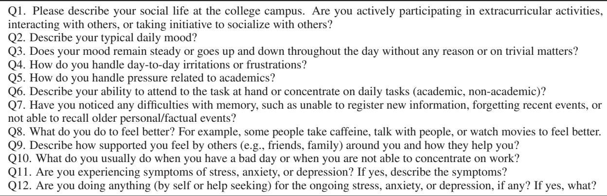  
Table A.1: Final MSE questionnaire

## A.1.1 Questionnaire validation

After finalizing the questionnaire, we conducted a survey with clinical psychiatrists. Initially, we introduced the MSE questionnaire developed by our team and presented the problem statement we aimed to address. Psychiatrists were then asked to evaluate the questionnaire based on item accuracy, language clarity, and reliability, following the guidelines outlined in the studies by Jones et al. (Jones and Hunter, 1995) and Gupta et al. (Gupta et al., 2022). They provided ratings on a scale from 1 (poor) to 5 (excellent). Four psychiatrists, not affiliated with the study team, participated in the survey. The average ratings obtained were 4.1 for item accuracy, 4.0 for language clarity, and 4.0 for reliability. Subsequently, incorporating their feedback and suggestions, we finalized the questionnaire. The refined version is presented in Table A.1 in the Appendix. Additionally, detailed average ratings per question are provided in Table A.2 of the appendix.

<table><tr><td>MSE Questions</td><td>Accuracy</td><td>Language</td><td>Reliability</td></tr><tr><td>Q1. Please describe your social life at the college campus. Are you actively par- ticipating in extracurricular activities, interacting with others, or taking initiative</td><td>4.00</td><td>4.25</td><td>3.75</td></tr><tr><td>to socialize with others? Q2. Describe your typical daily Mood?</td><td>3.75</td><td>4.00</td><td>3.50</td></tr><tr><td>Q3. Does your Mood remain steady or goes up and down throughout the day without any reason or on trivial matters?</td><td>3.75</td><td>3.50</td><td>4.00</td></tr><tr><td>Q4. How do you handle day-to-day irritations or frustrations?</td><td>4.25</td><td>4.00</td><td>3.75</td></tr><tr><td>Q5. How do you handle pressure related to academics?</td><td>4.00</td><td>4.00</td><td>4.00</td></tr><tr><td>Q6. Describe your ability to attend to the task at hand or concentrate on daily tasks (academic, non-academic)?</td><td>4.00</td><td>4.00</td><td>4.25</td></tr><tr><td>Q7. Have you noticed any difficulties with memory, such as unable to regis- ter new information, forgetting recent events, or not able to recall older per-</td><td>4.00</td><td>4.00</td><td>4.00</td></tr><tr><td>sonal/factual events? Q8. What do you do to feel better? For example, some people take caffeine, talk with people, or watch movies to feel better.</td><td>4.00</td><td>3.75</td><td>4.00</td></tr><tr><td>Q9. Describe how supported you feel by others (e.g., friends, family) around you and how they help you?</td><td>4.25</td><td>4.25</td><td>4.25</td></tr><tr><td>Q10. What do you usually do when you have a bad day or when you are not able to concentrate on work?</td><td>4.25</td><td>4.25</td><td>4.25</td></tr><tr><td>Q11. Are you experiencing symptoms of stress, anxiety, or depression? If yes, describe the symptoms?</td><td>4.25</td><td>3.75</td><td>4.00</td></tr><tr><td>Q12. Are you doing anything (by self or help seeking) for the ongoing stress, anxiety, or depression, if any? If yes, what?</td><td>4.25</td><td>3.75</td><td>4.25</td></tr><tr><td>Average</td><td>4.06</td><td>3.96</td><td>4.00</td></tr></table>

Table A.2: Finalized MSE Questionnaire

## A.2 Sample conversation

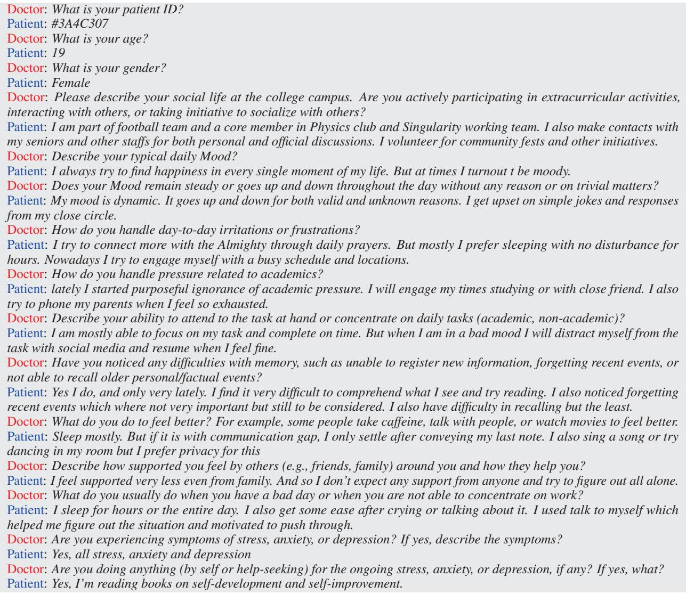  
Table A.3: Doctor-patient conversation dialogue of an anonymized participant.

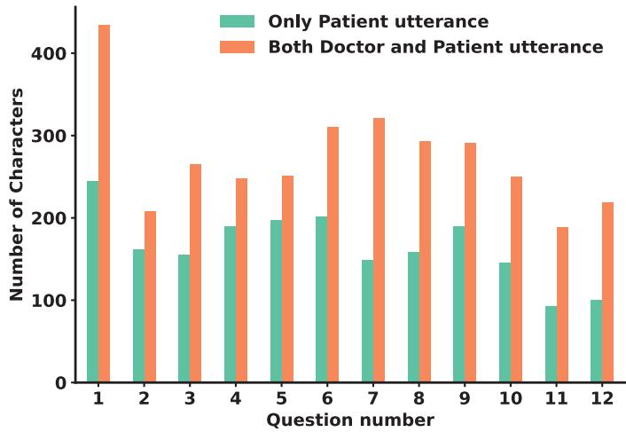  
Figure A.1: Average lengths of patient (i.e., participant) and doctor utterances for each question, aggregated across all 405 patient-doctor conversations. Note that the length of doctor utterances remains constant for each questionnaire, as the questions were predefined.

## A.3 Summary template

Patient is a year old [girl/boy/lady/man]. [His/Her] mood is generally and [remains steady/but goes up and down] throughout the day. [He/She] [takes/does not take] part in extracurricular activities and [socializes/does not socialize] with others. For daily frustration [He/She] does (\*activities\*). [He/She] [feels/does not feel] academic pressure and for this [He/She] does (\*activities\*). [His/Her] concentration and task attending ability is [good/bad]. [He/She] [feels/does not feel] difficulty with memory. [He/She] feels better by doing (\*activities\*). [He/She] [feels/does not feel] supported by his family and friends. On a bad day, [he/she] prefers . [He/She] is [experiencing/ not experiencing] [stress/anxiety/depression] symptoms such as

## A.3.1 Human generated summary evaluation

To assess the template’s efficacy in capturing the context of the MSE and user responses, we initially generated summaries (i.e., human-generated summaries) using the template with data from ten randomly selected participants. Subsequently, these summaries were evaluated based on completeness (i.e., whether the summary covers all relevant aspects of the conversation?) and Fluency (i.e., is the summary well structured, free from awkward phrases and grammatically?) on a scale of 1 (poor) to 5 (excellent). The average ratings from 5 reviewers for each parameter were computed, revealing that the template effectively captured the MSE and user responses with a completeness rating of 4.66 and a fluency rating of 4.36.

## A.4 Training settings

The models were trained on an NVIDIA A100-PCIE-40GB GPU, with an average training time of 2 hours per model. Our dataset consisted of 405 conversations, which we split into 270 for training, 68 for validation, and 67 for testing purposes. We conducted our experiments using varying numbers of epochs to evaluate the models’ learning capabilities. Specifically, we trained the models for 5, 10, 25, 50, and 100 epochs. Across all five models (BART-base, BART-large-CNN, T5 large, BART-large-xsum-samsum, and Pegasus), we maintained consistent hyperparameters using the PyTorch module with the following settings: {max token length: 1024 tokens, warmup steps: 500, weight decay: 0.01, evaluation strategy: ‘steps’, evaluation steps: 500, save steps: 1e6, gradient accumulation steps: 16 }.

## A.5 Evaluation metrics without fine-tuning

<table><tr><td>Models</td><td>ROUGE-1</td><td>ROUGE-2</td><td>ROUGE-L</td><td>SummaC</td></tr><tr><td>BART-base</td><td>0.212</td><td>0.050</td><td>0.107</td><td>0.315</td></tr><tr><td>BART-large-CNN</td><td>0.189</td><td>0.028</td><td>0.123</td><td>0.215</td></tr><tr><td>T5 large</td><td>0.247</td><td>0.049</td><td>0.135</td><td>0.212</td></tr><tr><td>BART-large-xsum-samsum</td><td>0.325</td><td>0.117</td><td>0.232</td><td>0.257</td></tr><tr><td>Pegasus-large</td><td>0.240</td><td>0.033</td><td>0.133</td><td>0.219</td></tr></table>

Table A.4: ROUGE and SummaC values of the model generated summaries without fine-tuning.

<table><tr><td>Epochs(#)</td><td>Pegasus-large generated summary</td><td>BART-large-CNN generated summary</td></tr><tr><td>0 (No tuning)</td><td>Patient: Female Doctor: Please describe your social life at the college campus. Doctor: Describe your ability to attend to the task at hand or concentrate on daily tasks (academic, non-academic)? Doctor: Describe your ability to attend to the task at hand or concentrate on daily tasks (academic, non-academic)? But when I am in a bad mood I will distract myself from the task with social media and resume when I feel fine. Doctor: Have you noticed any difficulties with memory, such as unable to register new information, or not</td><td>My mood is dynamic. It goes up and down for both valid and unknown reasons. I get upset on simple jokes and responses from my close circle. I feel supported very less even from family. And so I don&#x27;t expect any support from anyone and try to figure out all alone. I&#x27;m reading books on self-development and self-improvement.</td></tr><tr><td>5</td><td>able to recall older personal/factual events? Patient: Female Doctor: Please describe your social life at the college campus. Doctor: Describe your ability to attend to the task at hand or concentrate on daily tasks (academic, non-academic)? Doctor: Describe your ability to attend to the task at hand or concentrate on daily tasks (academic, non-academic)? But when I am in a bad mood I will distract myself from the task with social media and resume when I feel fine. Doctor: Have you noticed any difficulties with memory, such as unable to register new information, or not able to recall older personal/factual events?</td><td>Patient is a 19 year old girl. Her mood is generally happy but goes up and down throughout the day. She takes part in extracurricular activities and socializes with others. Her concentration and task attending ability is good. She feels difficulty with memory. For daily frustration she tries to connect with the Almighty. On a bad day, she sleeps for hours and feels better by singing a song or dancing. She does not feel supported by her family or friends. She is feeling stress, anxiety and depression symptoms. She reads self-development and self-improvement books.</td></tr><tr><td>10</td><td>Patient: Female Doctor: Please describe your social life at the college campus. Doctor: Describe your ability to attend to the task at hand or concentrate on daily tasks (academic, non-academic)? Patient: I am mostly able to focus on my task and complete on time. But when I am in a bad mood I will distract myself from the task with social media and resume when I feel fine. Doctor: Have you noticed any difficulties with memory, such as unable to register new information, forgetting recent events, or not able to recall older</td><td>Patient is a 19 year old girl. Her mood is generally happy but goes up and down throughout the day. She takes part in extracurricular activities and socializes with others. For daily frustration she tries to connect with the Almighty and sleeps. She feels academic pressure. Her concentration and task attending ability is okay but she feels difficulty with memory She does not feel supported by her family and friends. On a bad day, she sleeps, cries and talks to herself. She is feeling stress, anxiety and depression symptoms. To overcome this</td></tr><tr><td>25</td><td>personal/factual events? Patient is a 19 year old girl. Her mood is generally happy but goes up and down throughout the day. She takes part in extracurricular activities and socializes with others. For daily frustration she tries to connect with the Almighty. She feels academic pressure. Her concentration and task attending ability is good. She does not feel difficulty with memory. She feels better by sleeping, singing songs, and dancing. She feels supported by her family and friends. On a bad day, she sleeps, talks to friends, and tries to push through. She is not feeling</td><td>she reads self-development and self-improvement books. Patient is a 19 year old girl. Her mood generally fluctuates throughout the day. She takes part in extracurricular activities and socializes with others. For daily frustration she does prayer and sleeps. She does not feel academic pressure. Her concentration and task attending ability is good. She feels difficulty with memory.She feels better by singing, dancing, sleeping, and feeling supported by her family and friends. On a bad day, she cries and talks to herself. She is feeling stress, anxiety, and depression symptoms. To overcome this she</td></tr><tr><td>50</td><td>any stress, anxiety or depression symptoms. Patient is a 19 year old girl. Her mood is generally happy but goes up and down throughout the day. She takes part in extracurricular activities and socializes with others. For daily frustration she prays and sleeps. She feels academic pressure. Her concentration and task attending ability is good. She feels difficulty with memory. She feels better by sleeping, singing, dancing, and talking to herself. She feels supported by her family and friends. On a bad day, she sleeps, talks to herself, and tries to push through. She is not feeling any stress, anxiety or depression symptoms.</td><td>reads self-development and self-improvements books. Patient is a 19 year old girl. Her mood generally fluctuates throughout the day and goes up and down for unknown reasons. She takes part in extracurricular activities and socializes with others. For daily frustration she does prayer and sleeps. She feels academic pressure. Her concentration and task attending ability is normal. She feeling difficulty with memory. She feel better by singing, dancing and sleeping. She does not feel supported by her family and friends. On a bad day, she cries and talks to herself. She is feeling stress,anxiety, and depression symptoms. To overcome this she reads self-development and self-improvements books.</td></tr><tr><td>100</td><td>Patient is a 19 year old girl. Her mood is generally happy but goes up and down throughout the day. She takes part in extracurricular activities and socializes with others. For daily frustration she does prayer and sleeps. She feels academic pressure. Her concentration and task attending ability is okay. She feels difficulty with memory. She feels better by singing, dancing and sleeping. She feels supported by her family and friends. On a bad day, she cries and talks to herself. She is feeling stress and anxiety symptoms such as difficulty sleeping and talking to herself. To overcome this she reads self-development and self-improvement books</td><td>Patient is a 19 year old girl. Her mood is generally happy but goes up and down throughout the day. She takes part in extracurricular activities and socializes with others. For daily frustration she does prayer and sleeps. She feels academic pressure. Her concentration and task attending ability is normal. She feeling difficulty with memory.She feels better by singing, dancing and sleeping. She does not feel supported by her family and friends. On a bad day, she cries and talks to herself. She is feeling stress,anxiety, and depression symptoms. To overcome this she reads self-development and self-improvements books</td></tr></table>

Table A.5: Pegasus-large and BART-large-CNN generated summaries at different epochs on conversation given in Table A.3 in the Appendix

<table><tr><td></td><td>Reviewer 1</td><td>Reviewer 2</td></tr><tr><td>Reviewer 1</td><td>1.00</td><td>0.24</td></tr><tr><td>Reviewer 2</td><td>0.24</td><td>1.00</td></tr></table>

(a) On Pegasus model summaries

<table><tr><td></td><td>Reviewer 1</td><td>Reviewer 2</td></tr><tr><td>Reviewer 1</td><td>1.00</td><td>0.19</td></tr><tr><td>Reviewer 2</td><td>0.19</td><td>1.00</td></tr></table>

(b) On BART-large-CNN model summaries  
Table A.6: Inter-rater reliability among clinical reviewers. Cohen’s Kappa Coefficient on (a) Pegasus, (b) BART large-CNN model generated summaries.

<table><tr><td></td><td>A1</td><td>A2</td><td>A3</td><td>A4</td><td>A5</td><td>A6</td><td>A7</td><td>A8</td><td>A9</td><td>A10</td></tr><tr><td>A1</td><td>1.00</td><td>0.43</td><td>0.62</td><td>0.43</td><td>0.44</td><td>0.58</td><td>0.39</td><td>0.46</td><td>0.65</td><td>0.31</td></tr><tr><td>A2</td><td>0.43</td><td>1.00</td><td>0.38</td><td>0.32</td><td>0.41</td><td>0.26</td><td>0.25</td><td>0.36</td><td>0.27</td><td>0.35</td></tr><tr><td>A3</td><td>0.62</td><td>0.38</td><td>1.00</td><td>0.35</td><td>0.48</td><td>0.66</td><td>0.36</td><td>0.57</td><td>0.62</td><td>0.34</td></tr><tr><td>A4</td><td>0.43</td><td>0.32</td><td>0.35</td><td>1.00</td><td>0.32</td><td>0.34</td><td>0.45</td><td>0.38</td><td>0.35</td><td>0.30</td></tr><tr><td>A5</td><td>0.44</td><td>0.41</td><td>0.48</td><td>0.32</td><td>1.00</td><td>0.41</td><td>0.45</td><td>0.60</td><td>0.41</td><td>0.53</td></tr><tr><td>A6</td><td>0.58</td><td>0.26</td><td>0.66</td><td>0.34</td><td>0.41</td><td>1.00</td><td>0.44</td><td>0.70</td><td>0.61</td><td>0.29</td></tr><tr><td>A7</td><td>0.39</td><td>0.25</td><td>0.36</td><td>0.45</td><td>0.45</td><td>0.44</td><td>1.00</td><td>0.50</td><td>0.32</td><td>0.34</td></tr><tr><td>A8</td><td>0.46</td><td>0.36</td><td>0.57</td><td>0.38</td><td>0.60</td><td>0.70</td><td>0.50</td><td>1.00</td><td>0.59</td><td>0.38</td></tr><tr><td>A9</td><td>0.65</td><td>0.27</td><td>0.62</td><td>0.35</td><td>0.41</td><td>0.61</td><td>0.32</td><td>0.59</td><td>1.00</td><td>0.26</td></tr><tr><td>A10</td><td>0.31</td><td>0.35</td><td>0.34</td><td>0.30</td><td>0.53</td><td>0.29</td><td>0.34</td><td>0.38</td><td>0.26</td><td>1.00</td></tr></table>

(a) Pegasus Model

<table><tr><td></td><td>A1</td><td>A2</td><td>A3</td><td>A4</td><td>A5</td><td>A6</td><td>A7</td><td>A8</td><td>A9</td><td>A10</td></tr><tr><td>A1</td><td>1.00</td><td>0.39</td><td>0.78</td><td>0.23</td><td>0.52</td><td>0.62</td><td>0.55</td><td>0.62</td><td>0.50</td><td>0.49</td></tr><tr><td>A2</td><td>0.39</td><td>1.00</td><td>0.36</td><td>0.28</td><td>0.35</td><td>0.44</td><td>0.50</td><td>0.47</td><td>0.31</td><td>0.50</td></tr><tr><td>A3</td><td>0.78</td><td>0.36</td><td>1.00</td><td>0.32</td><td>0.62</td><td>0.57</td><td>0.55</td><td>0.72</td><td>0.66</td><td>0.47</td></tr><tr><td>A4</td><td>0.23</td><td>0.28</td><td>0.32</td><td>1.00</td><td>0.37</td><td>0.34</td><td>0.37</td><td>0.28</td><td>0.29</td><td>0.30</td></tr><tr><td>A5</td><td>0.52</td><td>0.35</td><td>0.62</td><td>0.37</td><td>1.00</td><td>0.44</td><td>0.46</td><td>0.47</td><td>0.39</td><td>0.52</td></tr><tr><td>A6</td><td>0.62</td><td>0.44</td><td>0.57</td><td>0.34</td><td>0.44</td><td>1.00</td><td>0.31</td><td>0.51</td><td>0.45</td><td>0.43</td></tr><tr><td>A7</td><td>0.55</td><td>0.50</td><td>0.55</td><td>0.37</td><td>0.46</td><td>0.31</td><td>1.00</td><td>0.49</td><td>0.38</td><td>0.40</td></tr><tr><td>A8</td><td>0.62</td><td>0.47</td><td>0.72</td><td>0.28</td><td>0.47</td><td>0.51</td><td>0.49</td><td>1.00</td><td>0.54</td><td>0.41</td></tr><tr><td>A9</td><td>0.50</td><td>0.31</td><td>0.66</td><td>0.29</td><td>0.39</td><td>0.45</td><td>0.38</td><td>0.54</td><td>1.00</td><td>0.36</td></tr><tr><td>A10</td><td>0.49</td><td>0.50</td><td>0.47</td><td>0.30</td><td>0.52</td><td>0.43</td><td>0.40</td><td>0.41</td><td>0.36</td><td>1.00</td></tr></table>

(b) BART-large-CNN Model  
Table A.7: Inter-rater Reliability (non-Clinical Annotators) - Cohen’s Kappa Coefficient on (a) Pegasus Model and (b) BART-large-CNN Model

## A.6 Summary evaluation

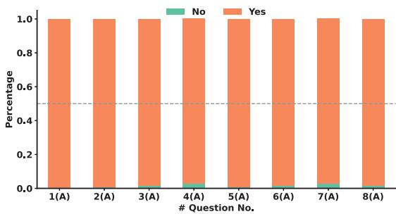  
(a) On Pegasus summaries

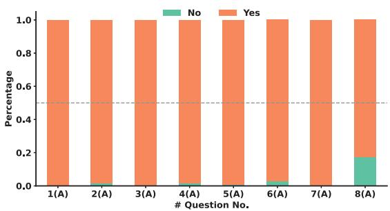

  
(c) On Pegasus summaries

(b) On BART-large-CNN summaries  
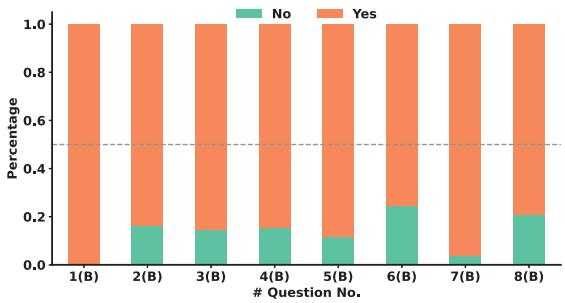  
(d) On BART-large-CNN summaries  
Figure A.2: Fine-grained human evaluation of Pegasus-large and BART-large-CNN summaries. (a) and (b) show the percentage of summaries capturing the following parameters of the input conversation: 1(A) gender, 2(A) mood, 3(A) social life, 4(A) academic pressure, 5(A) concentration ability, 6(A) difficulty with memory, 7(A) strategies to feel better, and 8(A) mental disorders with Pegasus-large and BART-large-CNN, respectively. Similarly, (c) and (d) show the percentage of summaries consistent with the input conversation on the following parameters: 1(B) gender, 2(B) mood, 3(B) social life, 4(B) academic pressure, 5(B) concentration ability, 6(B) difficulty with memory, 7(B) strategies to feel better, and 8(B) mental disorders with Pegasus model, and BART-large-CNN model, respectively.

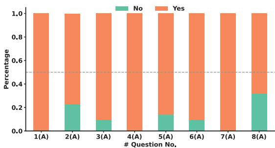  
(a) On Pegasus summaries

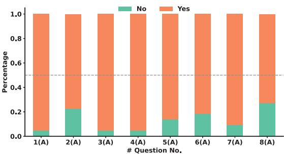  
(b) On BART-large-CNN summaries

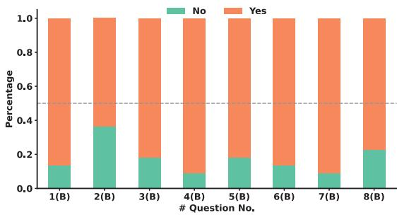  
(c) On Pegasus summaries

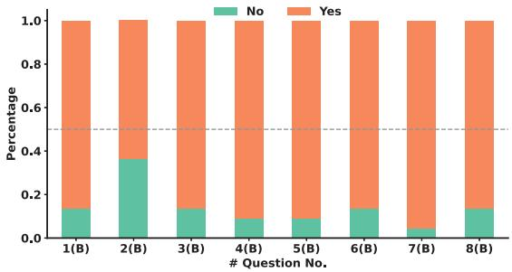  
(d) On BART-large-CNN summaries  
Figure A.3: Fine-grained LLM evaluation of Pegasus-large and BART-large-CNN summaries. (a) and (b) show the percentage of summaries capturing the following parameters of the input conversation: 1(A) gender, 2(A) mood, 3(A) social life, 4(A) academic pressure, 5(A) concentration ability, 6(A) difficulty with memory, 7(A) strategies to feel better, and 8(A) mental disorders with Pegasus-large and BART-large-CNN, respectively. Similarly, (c) and (d) show the percentage of summaries consistent with the input conversation on the following parameters: 1(B) gender, 2(B) mood, 3(B) social life, 4(B) academic pressure, 5(B) concentration ability, 6(B) difficulty with memory, 7(B) strategies to feel better, and 8(B) mental disorders with Pegasus model, and BART-large-CNN model, respectively.

## A.7 Prompt

Consider yourself as an individual who is proficient in English. You need to rate two summaries generated for the given conversation data on four parameters listed below:

1.Fluency: Is the summary well structured, free from awkward phrases, and grammatically correct?

2.Completeness: Does the summary cover all relevant aspects of the conversation?

Metric

1 2 3 4 5

Fluency Not fluent at all Slightly fluent Moderately fluent Quite fluent Very fluent

Completeness Not complete at all Slightly complete Moderately complete Quite complete Very complete

3.Hallucinations: Does the summary contain any extra information that a user did not present? Simply put, this metric captures to what extent the generated summary contains new information that is not a part of the user conversation. For example, if a user does not mention anything about friends during the conversation, and the summary mentions something related to friends, then it is an example of hallucination.

4.Contradiction: Does the summary contradict the information provided by a user? Simply put, this metric captures to what extent the summary contradicts the user conversation. For example, if a user says that he has a good memory and the summary says that the participant has a poor memory, it is an example of contradiction.

Metric

## 1 2 3 4 5

Hallucination No hallucination Mild hallucination Moderate hallucination Severe hallucination Extremely severe hallucination

Contradiction No Contradiction Mild Contradiction Moderate Contradiction Severe Contradiction Extremely severe Contradiction.

Please stick with the rating, dont provide any reasoning. Also, You need to answer in Yes or No for the following questions for both the summary:-

1. Gender

1(a)Does the summary capture the gender of the user?

1(b)Is the summary data consistent with the provided conversation?

## 2. Mood

2(a)Does the summary capture the mood of the user?

2(b)Is the summary data consistent with the provided conversation?

3. Social Life   
3(a)Does the summary capture the social life of the user?   
3(b)Is the summary data consistent with the provided conversation?   
4. Academic Pressure   
4(a)Does the summary capture the academic pressure of the user?   
4(b)Is the summary data consistent with the provided conversation?   
5. Concentration ability   
5(a)Does the summary capture the concentration ability of the user?   
5(b)Is the summary data consistent with the provided conversation?   
6. Difficulty with memory   
6(a)Does the summary capture the memory difficulty of the user?   
6(b)Is the summary data consistent with the provided conversation?   
7. Strategies to feel better   
7(a)Does the summary capture the strategies employed by the user to feel better?   
7(b)Is the summary data consistent with the provided conversation?   
8. Mental Disorder   
8(a)Does the summary capture the symptoms of mental disorders stated by the user?   
8(b)Is the summary data consistent with the provided conversation?

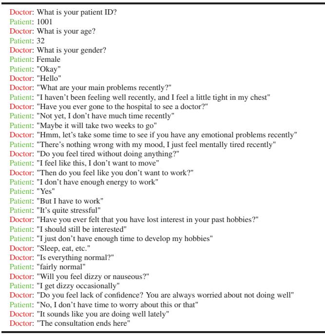  
(a) Conversation

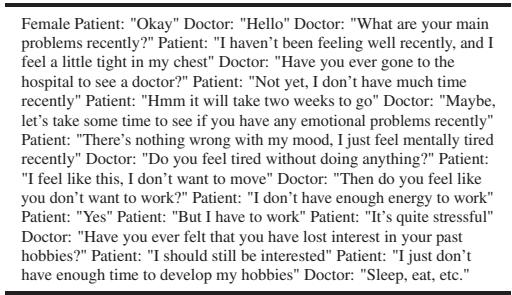  
(b) Pegasus-large generated summary  
Patient is a 32 year old girl. She is feeling a little tight in her chest and haven’t been feeling well recently. She hasn’t gone to the hospital to see a doctor. Her mood is good, she just feel mentally tired. She doesn’ want to work because she doesn’t have energy and energy isn’t good. She feels dizzy and nauseous. She does not feel lack of confidence. She thinks she is doing well.  
(c) BART-large-CNN generated summary  
Table A.8: Finetuned Pegasus-large and BART-large-CNN generated summary on a sample Chinese psychological conversation taken from (Yao et al., 2022)

<table><tr><td></td><td></td><td>Completeness (µ, σ)</td><td>Fluency  $( \mu , \sigma )$ </td><td>Hallucination (µ, σ)</td><td>Contradiction (µ, σ)</td></tr><tr><td>D4</td><td>Pegasus-large BART-large-CNN</td><td>(2.82, 1.40) (4.46, 0.64)</td><td>(2.96, 1.55) (4.62, 0.53)</td><td>(1.86 1.37) (1.60, 0.78)</td><td>(2.66, 1.67) (1.66, 0.74)</td></tr><tr><td>ESC</td><td>Pegasus-large Bart-large-CNN</td><td>(2.76, 1.17) (4.14, 0.98)</td><td>(3.06, 1.20) (4.60, 0.60)</td><td>(1.68, 1.07) (1.62, 1.06)</td><td>(1.92, 1.08) (1.80, 1.08)</td></tr></table>

Table A.9: Average non-clinician human evaluation scores on D4 and ESC datasets with Pegasus-large and BARTlarge-CNN. For Completeness and Fluency, a rating closer to 5 indicates the best, whereas for Hallucination and Contradiction, a rating closer to 1 is preferable.

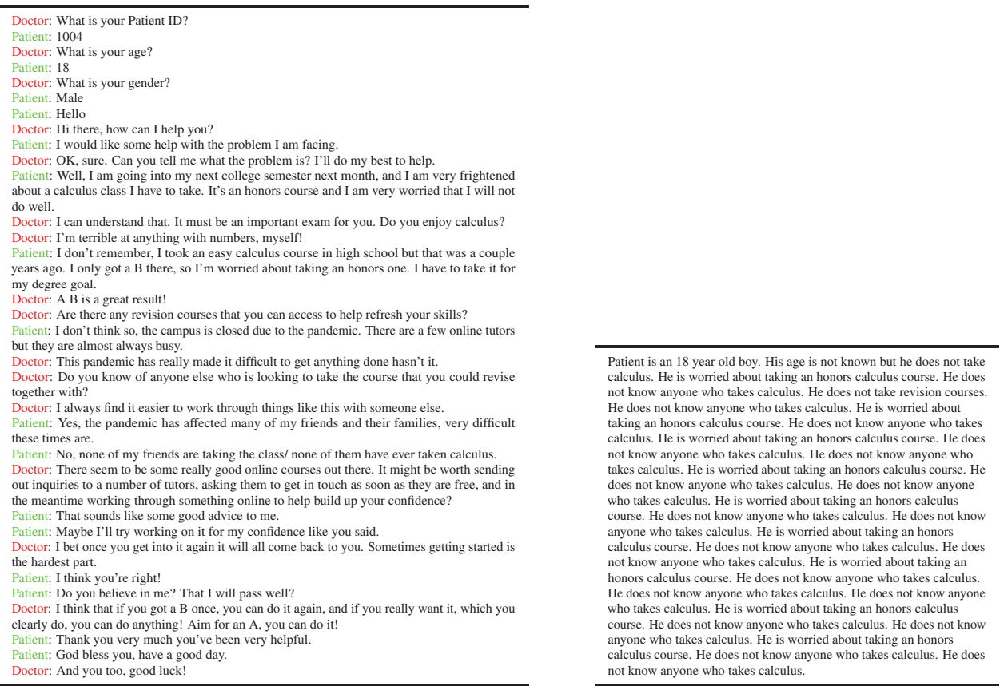  
(a) Conversation  
(b) Pegasus-large Generated Summary  
(c) BART-large-CNN generated summary  
Table A.10: Finetuned Pegasus-large and BART-large-CNN generated summary on an Empathy Support Conversation (ESC) conversation taken from (Liu et al., 2021)

## B Discussion

This appendix section sheds insights and intuitions we gained during our study.

## B.1 Comparison with the previous work

Our work represents the first attempt to summarize psychological conversation data, which differs from traditional text summarization. However, it shares similarities with dialogue summarization, such as summarizing conversations between individuals or medical dialogues between doctors and patients. Table

<table><tr><td>System Configuration</td><td>Model</td><td>RAM usage before (GB)</td><td>RAM usage while running (GB)</td><td>Response time (s)</td></tr><tr><td rowspan="2">Processor - i5-1135G7 @ 2.40GHz, RAM - 16GB</td><td>Pegasus-large</td><td>6.65</td><td>8.57</td><td>32.63</td></tr><tr><td>BART-large-CNN</td><td>6.75</td><td>8.23</td><td>22.03</td></tr><tr><td rowspan="2">Processor - i7-10700 @ 2.90GHz, RAM - 16GB</td><td>Pegasus-large</td><td>14.04</td><td>14.75</td><td>30.02</td></tr><tr><td>BART-large-CNN</td><td>13.21</td><td>14.99</td><td>22.74</td></tr><tr><td rowspan="2">Processor - i9-12900K @ 3.20GHz, RAM - 64GB</td><td>Pegasus-large</td><td>27.08</td><td>29.29</td><td>16.44</td></tr><tr><td>BART-large-CNN</td><td>25.39</td><td>28.12</td><td>10.59</td></tr></table>

Table A.11: Response time and random Access Memory(RAM) consumption before and during execution of models (Pegasus-large, BART-large-CNN) on three different systems with varying configuration.

A.12 illustrates the positioning of our work in the landscape of text summarization within healthcare. To the best of our knowledge, we only identified the work by Yao et al. (Yao et al., 2022), where they summarized symptoms using psychological conversation data. Furthermore, our fine-tuned model consistently generated fluent and comprehensive summaries, even when applied to datasets utilized by Yao et al.

It is important to acknowledge that the studies presented in Table A.12 utilized different datasets. In contrast, we demonstrated the effectiveness of our model on both our dataset and publicly available psychological conversational datasets, D4 and ESC. However, it is important to note that existing studies have their own specific objectives beyond solely summarizing entire conversations. While our work primarily aims at generating summaries of psychological conversations, it encounters its own challenges, such as dealing with lengthy conversation data, resulting in longer utterances. This distinction is essential to consider when evaluating the performance and applicability of our model compared to previous studies.

<table><tr><td>Reference</td><td>Model (own/ fine-tuned)</td><td>Dataset</td><td>ROUGE-1</td><td>ROUGE-2</td><td>ROUGE-L</td></tr><tr><td>(Krishna et al., 2021)</td><td>fine-tuned</td><td>Medical (Own prepared)</td><td>0.57</td><td>0.29</td><td>0.38</td></tr><tr><td></td><td>fine-tuned</td><td>AMI medical corpus</td><td>0.45</td><td>0.17</td><td>0.24</td></tr><tr><td>(Michalopoulos et al., 2022)</td><td>own</td><td>MEDIQA 2021 - history of present illness</td><td>0.48</td><td></td><td>0.35</td></tr><tr><td></td><td>own</td><td>MEDIQA 2021 - physical examination</td><td>0.68</td><td></td><td>0.64</td></tr><tr><td></td><td>own</td><td>MEDIQA 2021 - assessment and plan</td><td>0.44</td><td></td><td>0.37</td></tr><tr><td></td><td>own</td><td>MEDIQA 2021 - diagnostic imaging results</td><td>0.27</td><td></td><td>0.26</td></tr><tr><td>(Song et al., 2020)</td><td>fine-tuned</td><td>Medical problem Description</td><td>0.91</td><td>0.87</td><td>0.91</td></tr><tr><td></td><td>fine-tuned</td><td>Medical diagnosis or treatment</td><td>0.80</td><td>0.72</td><td>0.80</td></tr><tr><td></td><td>fine-tuned</td><td>Medical problem Description</td><td>0.91</td><td>0.87</td><td>0.91</td></tr><tr><td></td><td>fine-tuned</td><td>Medical diagnosis or treatment</td><td>0.81</td><td>0.73</td><td>0.81</td></tr><tr><td>(Zhang et al., 2021)</td><td>fine-tuned</td><td>Doctor patient conversation</td><td>0.46</td><td>0.19</td><td>0.44</td></tr><tr><td>(Yao et al., 2022)</td><td>fine-tuned</td><td>Chinese psychological conversation</td><td></td><td></td><td>0.26</td></tr><tr><td>Our Work</td><td>Pegasus-large</td><td></td><td>0.83</td><td>0.71</td><td>0.79</td></tr><tr><td></td><td>BART-large-CNN</td><td>Psychological conversation (own)</td><td>0.81</td><td>0.69</td><td>0.77</td></tr></table>

Table A.12: Comparison of our best model results in terms of ROUGE with existing works.

## B.2 Fine-tuned Pegasus-large versus fine-tuned BART-large-CNN models performance

The evaluation of summaries generated by the best models, Pegasus-large and BART-large-CNN, reveals superior performance across all evaluation parameters on our sampled 11 test data conversations. However, upon thorough inspection and review of human reviewer’ comments, instances were identified where the models interpreted the conversation in a manner contradictory to its actual content, as illustrated in Figure A.5. For instance, in one case, Pegasus-large generated a summary containing the phrase “On a bad day, he kills himself” (see Figure A.5c), while a BART-large-CNN summary included “She isfeeling stress and anxiety symptoms such as worry about money” (see Figure A.5d). Notably, the words “kill” and “money” were not present in the original conversation data. The unintentional inclusion of harmful keywords in the summaries may stem from the pre-finetuned weights of Pegasus-large and BART-large-CNN, which were originally trained on news articles. This underscores the potentially harmful impact of language models. However, since these summaries are intended to assist mental health care providers rather than replace them, any concerning keywords should prompt mental health care providers to review

the conversation for clarification.

Furthermore, when these models were tested for generalizability, the BART-large-CNN model demonstrated strong performance across all parameters. In contrast, the Pegasus-large model exhibited poor performance on all evaluation metrics, displaying low fluency and completeness and high levels of hallucination and contradictions. The evaluation scores obtained by the fine-tuned BART-large-CNN model on unseen data indicate that our model is generalizable and can be explored by mental healthcare providers in real-world settings.

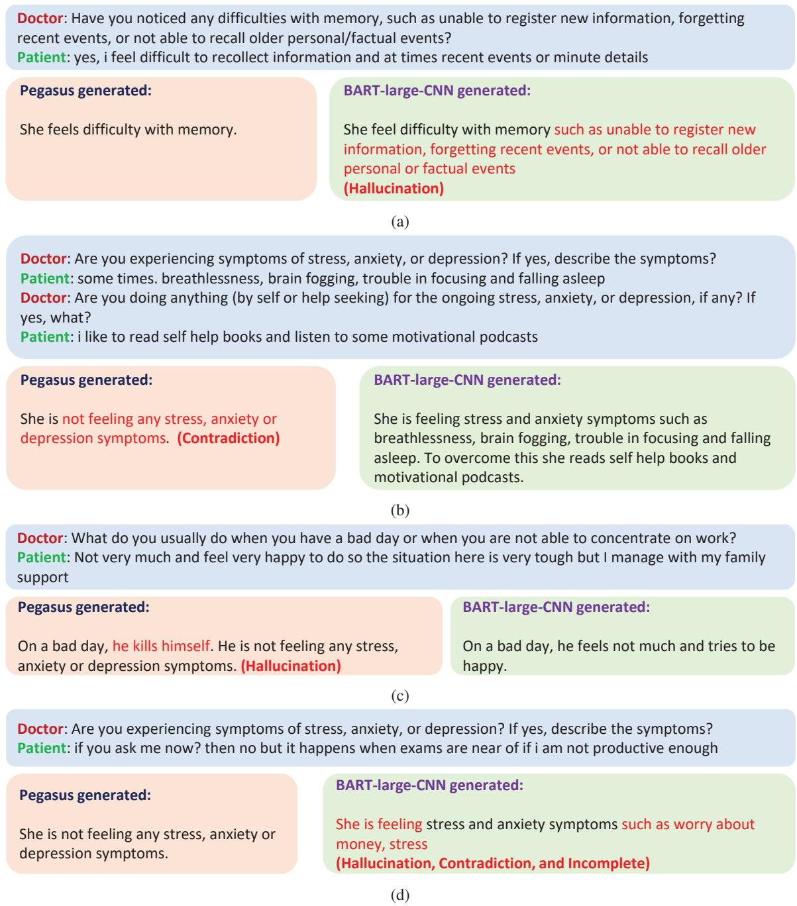  
Figure A.5: Instances of Contradiction, Hallucination, and Incompleteness in generated summaries.

## B.3 Why did not we fine-tune Large Language Models (LLMs)?

Recently, there has been an increase in the development of LLMs such as ChatGPT (Achiam et al., 2023), Llama (Touvron et al., 2023), Claude (Anthropic, 2023), Mistral (Jiang et al., 2023), Phi (Li et al., 2023), and others. These LLMs are trained on vast amounts of data and comprise billions of parameters, representing the SOTA language model. However, they come with a significant computational cost. Furthermore, some LLMs like ChatGPT and Mistral are proprietary, making fine-tuning for specific tasks a potential breach of data privacy. Fine-tuning open-source LLMs such as Mistral, Llama, and Phi requires substantial computational resources. Even when fine-tuned, these models demand high-end computational systems for effective deployment. For instance, Xu et al. (Xu et al., 2023) have publicly shared their fine-tuned Mental-LLM11, reporting that Mental-Alpaca and Mental-FLAN-T5 require GPU memory of 27 GB and 44 GB for loading, with additional GPU memory necessary for inference.

In real-world scenarios, mental health service providers often lack access to such high-end systems, thereby limiting the practical application of LLMs in these settings. Our fine-tuned language models are tailored for specific tasks, i.e., summarization, and consist of 460 million and 568 million parameters for BART-large-CNN and Pegasus-large, respectively. We conducted experiments to assess the deployment of our language models on low-end systems without GPUs, and the results (shown in Table A.11) indicate that our fine-tuned models can operate effectively on such systems, providing reasonable response time.

## B.4 Alignment between human and LLM evaluations

We evaluated a test data sample using human reviewers and LLMs, employing both coarse-grained and fine-grained evaluation approaches. Human reviewers required an average of 1.5 hours for evaluation, whereas LLMs could accomplish the task in seconds using our prompts (provided in the Appendix A.7). Interestingly, the average evaluation metric scores obtained from human reviewers and LLMs were approximately the same, indicating alignment on coarse-grained evaluation criteria. However, when it came to fine-grained evaluation, we observed a notable disparity between human reviewers and LLMs (as shown in Figures A.2 and A.3). The discrepancy in annotations was approximately 10%, with human reviewers agreeing 97.67% of the time and LLMs 88% of the time in fine-grained evaluation. For example, when evaluating whether the gender mentioned in the summary aligns with the provided conversation, 100% of the time, human reviewers responded affirmatively for both Pegasus and BART-generated summaries. However, LLMs disagreed 25% of the time. Similar discrepancies were observed for other questions, as illustrated in Figure A.3.

This suggests that LLMs are capable of rating the conversation summaries like humans. However, they may still lack the capability to identify factual information as effectively as humans in mental health data. Nevertheless, these results warrant further exploration.

## B.5 Factual consistency of generated summaries

In our fine-grained evaluation results, we observed that the summaries generated by our fine-tuned model lacked factual information. While both of the best-fine-tuned models successfully captured more than 98% of the essential details (such as gender, mood, etc.), the results for factual consistency revealed a misalignment with the actual conversation in 14.5% and 15.3% of cases for Pegasus-large and BART large-CNN generated summaries, respectively. Furthermore, on questions level analysis, we found that Pegasus exhibited the highest level of misalignment in capturing factually correct details related to social life, whereas BART struggled with memory-related information. Both models also equally showed misalignment regarding capturing the individuals’ moods. However, the percentage is low; further exploration is still needed.

## B.6 How much training data is required for summary generation with language models?

While it is commonly believed that deep learning tasks necessitate vast amounts of data for training, fine-tuning offers the flexibility to train on smaller datasets. Rather than requiring an extensive dataset, fine-tuning involves taking a pre-trained model with similar objectives and adjusting it accordingly. However, no fixed number justifies the dataset size required for fine-tuning. To determine the appropriate dataset size, we conducted experiments where we trained and evaluated our model using two different dataset sizes: 300 and 405 conversation data samples. Surprisingly, we observed only a 1% increase in the R1-score from 300 to 405 conversation data samples. This suggests that fine-tuning the model worked effectively even with 300 samples (200 for training, 50 for validation, and 50 for testing).

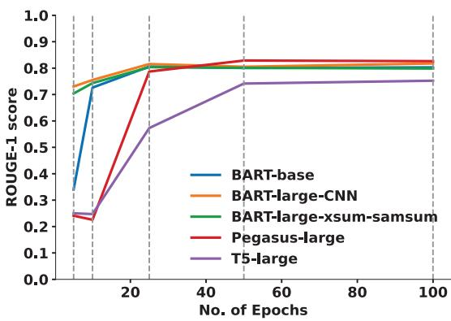  
(a) ROUGE-1 score

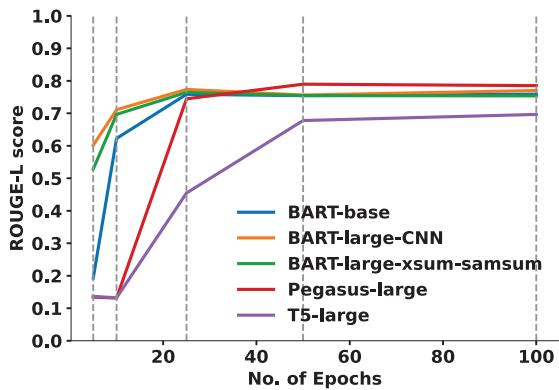  
(b) ROUGE-L score  
Figure A.6: ROUGE-1 and ROUGE-L obtained after fine-tuning on BART-base, BART-large-CNN, T5 large, BART-large-xsum-samsum, and Pegasus-large with epochs = [5,10,25,50,100]

Similarly, in determining the optimal number of epochs for model training, our analysis (as shown in Figure A.6) revealed that BART-large-CNN reached a rogue-1 score of 0.73 after just five epochs. In contrast, Pegasus required 25 epochs to achieve comparable results. Notably, after 50 epochs, the results began to saturate for all models.