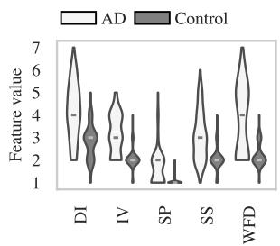
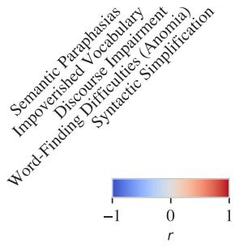

# Linguistic Features Extracted by GPT-4 Improve Alzheimer’s Disease Detection based on Spontaneous Speech

Jonathan Heitz1,3, Gerold Schneider2,3, Nicolas Langer1

1 Department of Psychology, University of Zurich, Methods of Plasticity Research, Zurich, Switzerland

2 Department of Computational Linguistics, University of Zurich, Zurich, Switzerland

3 Language & Medicine Competence Centre, University of Zurich, Zurich, Switzerland jonathan.heitz@uzh.ch, gschneid@cl.uzh.ch, n.langer@psychologie.uzh.ch

## Abstract

Alzheimer’s Disease (AD) is a significant and growing public health concern. Investigating alterations in speech and language patterns of fers a promising path towards cost-effective and non-invasive early detection of AD on a large scale. Large language models (LLMs), such as GPT, have enabled powerful new possibilities for semantic text analysis. In this study, we leverage GPT-4 to extract five semantic features from transcripts of spontaneous patient speech. The features capture known symptoms of AD, but they are difficult to quantify effectively using traditional methods of computational linguistics. We demonstrate the clinical significance of these features and further validate one of them (“Word-Finding Difficulties”) against a proxy measure and human raters. When combined with established linguistic features and a Random Forest classifier, the GPT-derived features significantly improve the detection of AD. Our approach proves effective for both manually transcribed and automatically generated transcripts, representing a novel and impactful use of recent advancements in LLMs for AD speech analysis.

## 1 Introduction

In light of the global demographic shift towards an older population, Alzheimer’s Disease (AD) emerges as a critical public health concern with a substantial economic burden (Weller and Budson, 2018). While there is no known cure, effective management depends on early diagnosis (Arvanitakis et al., 2019), necessitating the identification of biomarkers that are easy to collect, cost-effective, and non-invasive (Ribaldi et al., 2019). Speech and language alterations manifest as early symptoms of AD (Calzà et al., 2021), presenting a promising avenue for real-time AD screening through speech analysis in extensive epidemiological research. For these methods to be adopted on a large scale, it is imperative to develop fully automated, reliable, and explainable systems capable of providing real-time predictions.

The recent rise of large language models (LLMs) has opened new possibilities of automatic natural language processing. One of the most popular and powerful LLMs is OpenAI’s GPT series, the most capable model being GPT-4, which excels at a variety of traditional language processing benchmarks and beyond, including e.g. the Medical Knowledge Self-Assessment Program (OpenAI, 2023). Despite the widespread integration of GPT into various applications, the field of AD speech analysis remains relatively underdeveloped in comparison, with prevailing methodologies still predominantly reliant on conventional (acoustic and linguistic) features or older language models such as BERT (Devlin et al., 2018) (c.f. Parsapoor (2023) for a recent review on the topic). While these conventional approaches have shown impressive results distinguishing AD from control, they are ineffective in detecting some of the clinically known, but more complex and high-level symptoms of AD in speech, such as word-finding difficulties.

In this study, we address this gap by leveraging GPT in two distinct approaches for AD detection: a) fine-tuning a GPT model for direct classification purposes, and b) employing GPT as a rich semantic feature extractor from transcripts. The extracted features quantify complex speech alterations in AD, which existing methodologies are unable to capture. When combined with established features and Random Forest, they yield substantial improvements in AD detection, while enhancing explainability.

## 2 Related Work

Significant work has been done on AD classification based on spontaneous speech. Recently, the most popular datasets in the field were introduced as part of the ADReSS and ADReSSo challenges (Luz et al., 2020, 2021). While some approaches leverage information encoded in the audio signal directly, most work has found the linguistic analysis of transcripts more useful (Cummins et al., 2020). Methodologically, most such studies can be divided into a more traditional approach of feature extraction paired with the use of popular classification algorithms (e.g. Tang et al., 2023; TaghiBeyglou and Rudzicz, 2024), or fine-tuned language models, most prominently BERT (e.g. Balagopalan et al., 2020; Pan et al., 2021). The feature-based approach has the advantage of being more transparent and explainable. Fine-tuned language models, on the other hand, have been reported to produce slightly better classification performance, although the reported performance differences are usually small (Balagopalan et al., 2021) and depend on the setup (e.g. manual vs. automatically generated transcripts, Heitz et al. (2024)).

LLMs, in particular (Chat)GPT, have been applied in a variety of medical settings, including medical competency examinations (Nori et al., 2023) and diagnosis (Hirosawa et al., 2023; Wang et al., 2023b). In the context of cognitive decline or AD, prior work has used GPT for data augmentation of speech transcripts (Cai et al., 2023) or employed it to directly classify AD from control relying on a prompt listing participant demographic information and cognitive test scores (Wang et al., 2023b). Limited work has studied GPT on spontaneous speech transcripts: Yang et al. (2023); Wang et al. (2023a) attempted to distinguish patients with mild cognitive impairment (MCI) from healthy controls, iteratively improving ChatGPT prompts. However, they used a non-standard and unbalanced dataset, did not compare performance to traditional approaches, and attempted direct (zero-shot) classification, making it impossible to combine GPT-extracted information with established features. B.T. and Chen (2024) experimented with the ADReSSo dataset, but the results are only slightly better than the random baseline. Both of these approaches queried GPT via the web-based Chat-GPT interface, which uses random sampling of responses, limiting reproducibility.

The novelty of our contribution is three-fold: Firstly, to the best of our knowledge, this is the first study leveraging GPT to extract linguistic features from transcripts of spontaneous speech and integrating them into an existing pipeline. Secondly, we validate the GPT-extracted features: We assess their clinical significance through a group comparison, and further scrutinize one of them by measuring its alignment with a proxy measure and human evaluations. Thirdly, our evaluation is more rigorous than prior work by using a standard dataset, querying OpenAI’s GPT API with reproducible settings, assessing output stability to prompt and random seed variations, and comparing our approach to an established combination of linguistic features and Random Forest, as well as a fine-tuned GPT model. Our innovative use of GPT improves AD classification performance, with advantages in explainability.

## 3 Methods

All training and analysis is performed on a Linux Ubuntu machine with 8 CPUs, 32 GB RAM, and a NVIDIA Tesla T4 GPU. Our pipeline is implemented in Python 3.12, and our code for preprocessing, feature extraction, model training, and evaluation is available on our GitHub repository1.

## 3.1 Dataset and preprocessing

In this work, we use the English ADReSS dataset (Luz et al., 2020), containing audio recordings of 156 participants describing the Cookie Theft picture (Goodglass et al., 2001). The dataset is balanced with respect to diagnosis, age, and gender, and includes manual transcriptions in the CHAT annotation format (MacWhinney, 2000). Basic demographic characteristics are provided in Table 1.

<table><tr><td>n (f, m)</td><td>Age</td><td>MMSE</td></tr><tr><td>AD</td><td>78 (43, 35)  $6 6 . 6 \pm 7$ </td><td> $1 7 . 8 \pm 5 . 5$ </td></tr><tr><td>Control</td><td>78 (43, 35)</td><td> $6 6 . 3 \pm 7$   $2 9 . 0 \pm 1 . 2$ </td></tr></table>

Table 1: Characteristics of the ADReSS dataset for AD patients and control subjects: We report the total number of subjects (n) as well as the number of female (f) and male (m) participants. In addition, mean and standard deviation are given for age and Mini Mental State Examination scores (MMSE, Folstein et al., 1975).

This dataset is a subset of the DementiaBank English PITT corpus (Becker et al., 1994), with noise removal applied to the audio files (Luz et al., 2020). We find this noise removal problematic, as it also removes significant sections of speech, resulting in multiple audio files with no or very little intelligible participant voice. This renders downstream automatic speech recognition difficult. To counteract this problem, we matched the ADReSS selection of recordings with the original PITT audio files and use the latter in our approach.

Some audio files contain interviewer speech sections, such as “Is there anything else?". These could bias the AD classification task, as they appear more frequently in AD patients than controls. To avoid any such interference, we remove interviewer utterances from the audio (using timestamps provided in the CHAT transcription file) and from the manual transcripts, leaving only the participant’s speech.

The manual transcripts provided by the dataset contain special annotations and transcription codes that go beyond the pure transcription, explicitly marking pauses, retractions, and fragments, among other things. We remove these extra annotations, while retaining all uttered words (including disfluencies such as “uhm”). The result of this preprocessing is a pure word-by-word transcription, similar to one that might be produced by an Automatic Speech Recognition algorithm2.

## 3.2 Automatic Speech Recognition (ASR)

To evaluate the effectiveness of our approach in a fully automatic AD detection pipeline, we compare the use of manual transcripts to results from automatic speech recognition (ASR). We employ two pre-trained state-of-the-art ASR models: Whisper (Radford et al., 2023) and the Google Speech “Chirp” model (Zhang et al., 2023), both of which have reported excellent performance3.

We assess the quality of these transcriptions using the Word-Error-Rate (WER) (Morris et al., 2004), which quantifies differences between ASR transcripts and the manual transcripts provided as part of the dataset, and is defined as

$$
W E R = \frac { I + D + S } { N }\tag{1}
$$

where N denotes the number of words in the manual transcription, and I, D, and S count insertions, deletions, and substitutions of words.

## 3.3 Feature engineering

## 3.3.1 Established features (baseline)

As a baseline, we use a set of 40 linguistic features which we call Established features. These features include lexical features, features based on part-of-speech (POS) tagging, and features of repetitiveness, and they have worked well in previous approaches of AD classification on speech. The inclusion criteria, the list of features, and their definitions are detailed in Appendix A.

## 3.3.2 GPT features

We prompt GPT-4 (OpenAI, 2023) programmatically via the OpenAI API to extract relevant features from a transcript. Reproducibility of GPT outputs is maximized by setting a seed and specifying temperature = 0 in the API calls.

Choice of features (Prompt 1): To initially identify relevant features, we query GPT once for five indicators of AD in spontaneous speech, without providing any transcripts. The GPT prompt and its response are provided in Appendix C. We call the resulting features GPT features, and they consist of: Word-Finding Difficulties (Anomia), Semantic Paraphasias, Syntactic Simplification, Impoverished Vocabulary, and Discourse Impairment. The free-text descriptions of these features are also provided by GPT (they are contained in Prompt 2, displayed in Figure 1).

Note that all five indicators have previously been reported to occur more frequently in AD patients than controls (Forbes-McKay et al., 2005; Croisile et al., 1996; Forbes et al., 2002; Lindsay et al., 2021); in other words, GPT successfully identifies known symptoms of this disease, motivating its use in our application.

Feature extraction (Prompt 2): For each transcript, we query GPT-4 to quantify each feature on a Likert scale from 1 (not at all fulfilled) to 7 (very strongly fulfilled), without providing information on the diagnostic label (AD or control). The scale from 1 – 7 is motivated by the “Rating Scale Profile of Speech Characteristics” of the Boston Diagnostic Aphasia Examination (BDAE, Goodglass et al., 2001), where a similar scale is used by clinicians to rate characteristics of spontaneous speech in the context of aphasia. In addition to a numerical assessment, we ask GPT for text extracts from the transcript to explain the assessment. The prompt and an example output are given in Figure 1.

Prompt 2: Here are key indicators of Alzheimer’s dementia in spontaneous speech:

Word-Finding Difficulties (Anomia): Individuals with Alzheimer’s often have trouble finding the right words. This can manifest as frequent pauses, use of non-specific words like “thing” or “stuff”, or circumlocutions (talking around the word without being able to name it). For example, instead of saying "stool”, a person with dementia might say “the thing you sit on”.

Impoverished Vocabulary: The range of words used by someone with Alzheimer’s may become limited. Their language may seem less rich and more repetitive, with a reliance on common and general terms rather than specific nouns or verbs.

Syntactic Simplification: The complexity of sentence structures may decline. People with dementia might use simpler, shorter sentences and may make more grammatical errors. They might avoid complex grammatical constructions like subordination or relative clauses.

Semantic Paraphasias: This refers to the use of incorrect words that are semantically related to the intended word. For example, a person with dementia might say “oven” instead of “sink” or “water” instead of “cookies.”

Discourse Impairment: There may be a noticeable decline in the ability to organize narrative speech. This can include tangential speech, difficulty maintaining a topic, and problems with coherence and cohesion. The person might jump from one idea to another without clear connections, or they might provide too much or too little information about the picture.

For each of these indicators, and for the following transcript of a Cookie Theft Picture description task, please indicate how much each indicator is fulfilled by the transcript. Give numbers between 1 (not at all fulfilled) and 7 (very strongly fulfilled). In addition, give 1-3 examples from the text for your assessment (in brackets, mark verbatim quotations with "). Give only the indicator name, the assessment (number between 1 and 7), examples from the text (in brackets), nothing else, and no explanation.

{transcript}

GPT-4 response: Word-Finding Difficulties (Anomia): 5 (“no I can’t no I can’t get this very well, clear”, “it’s mm well somebody’s drying dishes”)

Syntactic Simplification: 4 (use of simple sentences and phrases like “I see a tad bit”, “someone’s standing on a stool”)

Discourse Impairment: 5 (“no I don’t see anything   
else going on over here”, disjointed narrative with   
repetitions and lack of coherence)

Impoverished Vocabulary: 4 (repeated use of “somebody”,   
“something”, “drying dishes”)

Semantic Paraphasias: 2 (no clear evidence of semantic paraphasias, but some difficulty in expression)

Figure 1: GPT Prompt 2, used to extract feature values for our GPT features, and the GPT response for an AD patient in our dataset. The verbatim transcript is replaced by a placeholder {transcript}. The system message is not shown here, but provided in Appendix C.

## 3.4 Validation of GPT features

## 3.4.1 Clinical validation

For each feature, we perform a group comparison between AD and control, calculating Cohen’s d (effect size, Cohen, 1988). In addition, we statistically test whether values in AD are significantly larger than values in the Control group using a Mann-Whitney U Test (Mann and Whitney, 1947), as it is a non-parametric test suitable for ordinal features.

## 3.4.2 Validation of Word-Finding Difficulties

While GPT readily quantifies the five studied indicators, it is unclear whether these assessments indeed capture the speech characteristics in question. For the feature Word-Finding Difficulties (Anomia), we try to validate this by comparing it to a deterministic proxy measure and to human ratings.

Validation against proxy measure: We compute a proxy feature disfluency ratio, defined as the number of disfluencies divided by the total number of spoken words. To count the number of disfluencies, we use all relevant special transcription markers provided by the CHAT format: fragmented words (e.g. “coo” instead of “cookie”), filler words (e.g. “uhm”), as well as explicitly coded repetitions ([/]), revisions ([//]), and pauses ((.), (..), (...)). This proxy feature is our best attempt to quantify word-finding difficulties using the available annotations and traditional methods of computational linguistics. For this reason, we expect the GPT feature Word-Finding Difficulties (Anomia) to be more highly correlated to disfluency ratio than to other features, indicating that the two features are related, and increasing our confidence in GPT successfully capturing the speech characteristic in question.

Agreement to human raters: We have asked two specialists (a psychologist and a speech therapist) to rate the word-finding difficulties for all subjects in our dataset, given both the audio recording and the manual transcript. These human ratings serve as a gold standard that we aim for our GPTderived feature Word-Finding Difficulties (Anomia) to approximate. Given the subjectivity of the task, two human raters will never agree perfectly. We quantify the amount of human (dis)agreement (i.e. the inter-rater reliability) using an intraclass correlation coefficient between these two raters (Case ICC(3,1) according to Shrout and Fleiss (1979))

and corresponding 95% confidence intervals4. In addition, we calculate the ICC between the GPT feature values (on manual transcripts) and the human ratings, assessing how strongly GPT agrees with the human raters. The human ICC serves as an upper limit of agreement that can be expected between GPT (or any automatic measure) and human ratings.

## 3.5 AD classification and evaluation

Feature engineering + Random Forest: We train a Random Forest (RF) classifier5 for binary classification (AD vs. control) on three sets of features: Our baseline Established features, our GPTfeatures, and their union Established+GPT.

Fine-tuning GPT: In addition to using GPT as a feature extractor in combination with RF, we directly fine-tune GPT to distinguish AD from control6. This is conceptually similar to fine-tuning BERT, a common and successful approach to the AD detection task in prior work. For fine-tuning, we use a prompt asking GPT to decide whether a transcript comes from a person with AD or a healthy person, and ground truth completions ‘Dementia’ or ‘Healthy’. On test samples, the first token’s log probability (which is provided by the fine-tuned model) is converted into a predicted AD probability, allowing the calculation of our metrics. Fine-tuning is orchestrated programmatically using the OpenAI API, with default hyperparameters7.

Evaluation: Classification performance is assessed using stratified 10-fold cross validation (CV) on the entire dataset (156 samples), with fixed random splits. We combine the test predictions of the 10 folds and report the area under the ROC curve (AU-ROC) on their union. To quantify uncertainty of results, we provide two-sided bootstrap confidence intervals (CI)8.

To statistically test if our GPT features improve classification, we estimate a bootstrap CI of the performance difference $\delta _ { \mathrm { A U R O C } }$ between Established features and Established+GPT, with

$$
\begin{array} { r l } { \delta _ { \mathrm { A U R o c } } = \mathrm { A U R O C } _ { \mathrm { E s t a b l i s h e d + G P T } } } & { } \\ { - \mathrm { A U R O C } _ { \mathrm { E s t a b l i s h e d f e a t u r e s } } } \end{array}\tag{2}
$$

Established+GPT is significantly better than Establishedfeatures if the entire CI of $\delta _ { \mathrm { A U R O C } }$ is larger than 0.

The usefulness of individual features for classification is quantified using mean absolute SHAP values as a metric of feature importance (Lundberg et al., 2020).

## 3.6 Sensitivity analysis

Prompt and random seed: LLMs are known to be sensitive to slight changes in prompts (Errica et al., 2024; Gan and Mori, 2023; Atil et al., 2024). To analyse how stable our GPT feature values are subject to this prompt sensitivity, we created two variations of Prompt 2, where instructions are given in other words while keeping their meaning (full prompts are given in Appendix D). We use these to extract two additional sets of GPT feature values. We compute intraclass correlation coefficients (Case ICC(2,1) according to Shrout and Fleiss (1979)) to assess how strongly result of different prompt versions agree. In addition, we calculate the difference of feature value when using the modified prompt compared to the original Prompt 2 for each feature and participant, and report their mean absolute difference (MD), defined as

$$
M D = { \frac { 1 } { 2 n } } \sum _ { v \in \{ 1 , 2 \} } \sum _ { i \in \{ 1 , \ldots , n \} } | { \tilde { f } } _ { i } ^ { v } - f _ { i } |\tag{3}
$$

where for participant i among n participants, $f _ { i }$ refers to the original feature value and $\bar { f } _ { i } ^ { v }$ represents the feature value when using the alternative prompt v.

Analogously, we test the sensitivity of our GPT feature values to different random seeds in the OpenAI API call.

Number of GPT features: We also perform a control analysis in which GPT was prompted to extract ten indicators instead of five, allowing us to evaluate the robustness of the feature selection process.

<table><tr><td></td><td>Control  $( n { = } 7 8 )$ </td><td>AD  $\scriptstyle ( n = 7 8 )$ </td><td>Cohen&#x27;s d</td><td>p- value</td></tr><tr><td>Discourse Impairment (DI)</td><td> $2 . 8 \pm 0 . 8$ </td><td> $4 . 1 \pm 1 . 3$ </td><td>1.25</td><td>6.3e-11</td></tr><tr><td>Impoverished Vocabulary (IV)</td><td> $2 . 1 \pm 0 . 5$ </td><td> $3 . 2 \pm 0 . 9$ </td><td>1.55</td><td> $1 . 9 \mathrm { e } \mathrm { - } 1 5$ </td></tr><tr><td>Semantic Paraphasias (SP)</td><td> $1 . 0 \pm 0 . 1$ </td><td> $1 . 7 \pm 0 . 8$ </td><td>1.12</td><td> $7 . 8 \mathrm { e } { - } 1 3$ </td></tr><tr><td>Syntactic Simplification (SS)</td><td> $2 . 0 \pm 0 . 5$ </td><td> $3 . 1 \pm 1 . 1$ </td><td>1.26</td><td> $1 . 9 \mathrm { e } \mathrm { - } 1 2$ </td></tr><tr><td>Word-Finding Difficulties (WFD)</td><td> $2 . 2 \pm 0 . 6$ </td><td> $3 . 8 \pm 1 . 5$ </td><td>1.34</td><td> $8 . 8 \mathrm { e } { - 1 1 }$ </td></tr></table>

Figure 2: Clinical validation results for GPTfeatures. Left: Violin plots depicting the distribution of GPT feature values. Inner lines indicate median values. Right: Mean and standard deviation of the feature values for AD and control groups. We report Cohen’s d as a metric of effect size, as well as p-values of the Mann-Whitney U Test.
<table><tr><td></td><td>Manual transcripts</td><td>Google Speech ASR</td><td>Whisper ASR</td></tr><tr><td>Fine-tuned GPT</td><td>0.886 [0.831,0.936]</td><td>0.862 [0.792,0.918]</td><td>0.831 [0.760,0.898]</td></tr><tr><td>GPT features + RF</td><td>0.767 [0.683,0.838]</td><td>0.760 [0.680,0.835]</td><td>0.702 [0.615,0.780]</td></tr><tr><td>Established  $\mathrm { f e a t u r e s + R F }$ </td><td>0.885 [0.829,0.934]</td><td>0.893 [0.840,0.939]</td><td>0.874 [0.811,0.925]</td></tr><tr><td> $\mathrm { E s t a b l i s h e d + G P T + R F }$ </td><td>*0.931 [0.890,0.962]</td><td>0.900 [0.857,0.941]</td><td>0.886 [0.829,0.934]</td></tr></table>

Table 2: AUROC results, on 10-fold cross validation (CV). Results are given for manual transcripts, as well as Google Speech and Whisper ASR transcripts. Result estimates are provided with bootstrap confidence intervals. Bolt numbers mark the best result in each column. Asterisks in the last line indicate that results are significantly better than the line above, i.e. Established+GPT + RF > Establishedfeatures + RF.

## 4 Results

Comparison of ASR models: Word Error Rates (WER) for both ASR models are similar, with the following median WER on the entire dataset (lower is better): Whisper: 0.35 (AD: 0.43, control: 0.31), Google Speech: 0.37 (AD: 0.40, control: 0.30). For AD classification (cf. results in Table 2), we observe a trend of Google Speech providing more useful transcripts than Whisper.

Clinical validation of GPT features: Validation results of our five GPTfeatures are presented in Figure 2. We observe that GPT feature values are clearly higher for AD than control, with highly significant group differences (p-values $< 1 0 ^ { - 1 0 } )$ and large effect sizes (Cohen’s $d > 1 . 1 )$ This confirms that all GPT features capture language characteristics that are clinically relevant to distinguish individuals with AD from healthy controls.

Validation of Word-Finding Difficulties: The correlation between the proxy feature disfluency ratio and Word-Finding Difficulties (Anomia) is 0.63, which is higher than the absolute correlation to any other linguistic feature (≤ 0.55, c.f. Appendix B for a full correlation matrix). This strengthens our hypothesis that this GPT feature indeed captures difficulties in word-finding. indeed captures difficulties in word-finding.

The intraclass correlation coefficient (ICC) between the two human raters quantifying word-finding difficulty is 0.55 (CI: 0.43 − 0.65), indicating moderate inter-rater reliability (Shrout and Fleiss, 1979), which highlights the inherent subjectivity of assessing high-level concepts such as “word-finding difficulty”. The ICC between GPT and human raters is 0.53 (CI: 0.44 − 0.62), with a confidence interval (CI) that overlaps with the human agreement. This indicates that GPT’s assessment captures the speech characteristic in question as well as a human rater. It is important to note that the GPT assessment is based solely on the speech transcripts, whereas human raters had the advantage of basing their assessment on both audio and transcripts.

AD classification performance: Classification results are given in Table 2. We observe that our GPT features alone perform worse than the Established features (our baseline), when combined with RF. Fine-tuning GPT also does not outperform our baseline. However, RF with the combination of both established and GPT features (Established+GPT) outperforms the established features. The differences are statistically significant on manual transcripts and stronger on manual than on ASR transcripts, but robust across all settings. Note that confidence intervals are relatively wide. This is a result of the small number of samples in our dataset, a main limitation of this work.

<table><tr><td>Mean absolute Feature name SHAP value</td></tr><tr><td>Impoverished Vocabulary (GPT feature) 0.054</td></tr><tr><td>Word-Finding Difficulties (Anomia) (GPT) 0.039</td></tr><tr><td>Semantic Paraphasias (GPT feature) 0.038 avg_word_length (Established feature) 0.029</td></tr><tr><td>Syntactic Simplification (GPT feature) 0.028</td></tr><tr><td>Discourse Impairment (GPT feature) 0.027</td></tr><tr><td>adverb_ratio (Established feature) 0.026</td></tr><tr><td>flesch_kincaid (Established feature) 0.021 PRP_ratio (Established feature) 0.019</td></tr></table>

Table 3: Feature importance of the top 10 (out of 45) features among Established+GPT, based on results of 10-fold CV using manual transcripts. We provide mean absolute SHAP values.

Feature importance: Table 3 presents the 10 most important features among Established+GPT, according to mean absolute SHAP values (Lundberg et al., 2020). We observe that GPT features are highly important, representing 5 out of the top 6 features.

Sensitivity analysis: Table 4 displays the results for prompt and seed sensitivity. Low MD (approx. 0.2 on a scale from 1 – 7) and high ICC (all > 0.79, considered excellent agreement (Cicchetti, 1994)) indicate that slight changes in prompts or random seeds have a low impact on the feature values.

Our control analysis extracting ten GPT features (instead of five) yielded a classification performance similar to our main results (results are listed in Appendix Table 8).

Running time: Running time is dominated by ASR, taking approx. 55 min (Whisper) or 30 min (Google Speech) for the entire dataset. Feature extraction and RF model training times sum up to less than 10 min. GPT fine-tuning takes around 15 min per split, with limited parallelization allowed by the API. Note that the inference time per individual is short enough to be deployed in a potential real-time application.

<table><tr><td>Sensitivity to different...</td><td colspan="3">Seeds MD ICC</td></tr><tr><td>Discourse Impairment</td><td>0.30 0.89</td><td>MD 0.31</td><td>ICC 0.89</td></tr><tr><td>Syntactic Simplification Impoverished Vocabulary</td><td>0.26 0.85</td><td>0.37</td><td>0.80 0.83</td></tr><tr><td>Word-Finding Difficulties</td><td>0.16 0.90 0.10 0.97</td><td>0.29 0.18</td><td>0.96</td></tr><tr><td>Semantic Paraphasias</td><td></td><td></td><td></td></tr><tr><td></td><td>0.09</td><td>0.79 0.10</td><td>0.81</td></tr><tr><td>Average</td><td>0.18</td><td>0.88 0.25</td><td>0.86</td></tr></table>

Table 4: Sensitivity of GPT feature values to changes in prompt wording and random seed: We report mean absolute difference (MD) and intraclass correlations (ICC) of feature values (on a scale from 1 – 7) when using alternative prompt wording / seed, as compared to the value using the original prompt / seed.

## 5 Discussion and Conclusion

In this study, we have harnessed the capabilities of GPT-4 to extract five semantic features from transcripts of spontaneous speech, which were then utilized to complement existing linguistic features within an Alzheimer’s Disease (AD) detection framework. The extracted features quantify known symptoms of AD in speech, but previous efforts in linguistic feature engineering have failed to capture them due to their complex and elusive nature.

For example, the feature Word-Finding Difficulties (Anomia) is associated with AD (Rohrer et al., 2008), but its calculation from a given transcript is non-trivial and we are not aware of any existing linguistic feature attempting to do so. We have attempted to construct a rule-based deterministic proxy of this characteristic (disfluency ratio, based on manual annotations of disfluencies) and showed that it is correlated highly with this GPT feature. In addition, we have demonstrated an agreement of this GPT feature’s values with human raters. Compared to existing linguistic features, we believe that the GPT-extracted Word-Finding Difficulties (Anomia) captures a richer concept, and a group comparison between AD and control as well as our SHAP feature importance analysis confirm the utility of this feature in AD detection. Table 5 displays three example transcripts, and the corresponding GPT-4 output for this feature. The difference in word-finding difficulty between these examples is apparent, but goes beyond the expressiveness of traditional linguistic features. Similar arguments can be made for all five features included in this study.

The GPT-generated features represent high-level speech alternations which are easier to grasp intuitively than many existing highly specific linguistic features. GPT-4 not only quantifies these features on a scale from 1 to 7, but also complements its assessment with explanatory notes or selected transcript excerpts (see examples responses in Figure 1 and Table 5). A potential application could provide these details to clinicians and patients. The transparent derivations and the intuitive interpretation of the features are a step towards better explainability, which is a crucial property of AI in medical applications, as it augments transparency, promotes trust of both clinicians and patients, and satisfies legal requirements such as the EU’s “AI Act”. We want to stress that explainability of this sort is a significant advantage of our feature-based approach compared to a fine-tuned language model such as GPT (as presented in this paper) or BERT (as frequently done in prior work). While fine-tuning is elegant and can be high-performing, explainability remains difficult, hindering a potential application in clinical practice.

<table><tr><td rowspan=1 colspan=1></td><td rowspan=1 colspan=1>Example transcript</td><td rowspan=1 colspan=1>GPT-4 response to Prompt 2</td></tr><tr><td rowspan=1 colspan=1>1</td><td rowspan=1 colspan=1>there&#x27;ssomething has tobewhere the water goesdown over</td><td rowspan=1 colspan=1>Word-Finding Difficulties(Anomia):6(Examples:&quot;somethinghastobe where thewater goes down over&quot; - strugglestofind the word“sink&quot;or“tap&quot;)[...]</td></tr><tr><td rowspan=1 colspan=1>2</td><td rowspan=1 colspan=1>what do what do youcall this ?the plate a plate ?</td><td rowspan=1 colspan=1>Word-Finding Difficulties (Anomia):7(Examples:&quot;whatdo what do you call this?the plate a plate?&quot;) [...]</td></tr><tr><td rowspan=1 colspan=1>3</td><td rowspan=1 colspan=1>the mother&#x27;s washing dishes andwater&#x27;s spilling over</td><td rowspan=1 colspan=1>Word-Finding Difficulties (Anomia): 1 (No evidence of word-finding difficulties;the speaker uses specific terms like &quot;mother&quot; and &quot;washing dishes.&quot;) [...]</td></tr></table>

Table 5: GPT feature extraction responses for the feature Word-Finding Difficulties (Anomia) on excerpts from transcripts in the dataset as a toy examples. Two examples represent high, one exemplifies low word-finding difficulty.

Our results demonstrate how the GPT-generated features alone as well as the fine-tuning of GPT produce sub-optimal classification performance. This is in line with prior research employing GPT for AD classification, where results were unsatisfactory (B.T. and Chen, 2024; Wang et al., 2023b). We hypothesize that fine-tuning does not work better because many low-level features of language (e.g. based on word and letter counts) that are useful to distinguish AD from control cannot be effectively extracted by an LLM. For example, it has been shown that LLMs are unable to count letters (Zhang and He, 2024), making it impossible to extract a feature such as Average Word Length, which is among our most important features (cf. Table 3). However, the combination of established linguistic with GPT-generated features produces a system that significantly outperforms prior feature-based approaches. This demonstrates that the complex semantic patterns identified by GPT encompass additional significant information beyond the reach of simpler, established features, which fail to capture such depth. Moreover, they add a significantly different perspective: The maximal absolute correlation between a GPT feature and any other included linguistic feature is 0.55 and thus rather low (a full correlation matrix is given in Appendix B). Furthermore, the new GPT features are clinically relevant (cf. Figure 2) and show high feature importance compared to established features (cf. Table 3), with 5 out of the top 6 most important features given by GPT. This further strengthens the observation that they indeed capture meaningful symptoms of AD.

Our approach is robust to slight variations in prompts or random seeds and is effective with both manual transcripts of spontaneous speech and ASR transcripts, where we recommend the use of Google Speech, as it results in better AD classification performance than Whisper. We suspect the reason to be a stronger use of a language model in Whisper’s decoding pipeline compared to Google Speech, smoothing ASR outputs in a way that removes details (e.g. repetitions) from the transcripts that prove valuable to distinguish AD from control. The strong performance on ASR transcripts could enable the use of our approach in a fully automatic, low-cost, and real-time system. This makes it suitable for large-scale epidemiological studies, or might allow the identification of AD subgroups based on linguistic characteristics (similar to Park et al., 2017), paving the way for more tailored cognitive training interventions.

In addition to the presented method of leveraging GPT as a feature extractor and fine-tuning GPT for direct AD classification, we have experimented with other approaches of harnessing GPT for AD classification based on spontaneous speech, including direct zero-shot prediction of AD vs. control (instead of feature extraction), and the use of GPT-4o instead of GPT-4. These additional experiments showed no improvements over the presented methods (results are given in Appendix E). In this work, we show no detailed results for a fine-tuned BERT model, but results reported in our previous work are inferior to the presented method here (Heitz et al., 2024).

Conclusion: In this study, we employed GPT-4 to extract linguistic features capturing known alterations in AD speech from both manually transcribed and automatically generated transcripts of spontaneous speech, integrating these within an end-to-end AD detection framework. We demonstrated that the inclusion of complex GPT-derived features enhances performance beyond what is achievable with traditional linguistic features alone, surpassing a fine-tuned GPT model. Furthermore, these new features are accompanied by explanatory snippets extracted from the transcripts, contributing to the advancement of more interpretable AI within a medical setting. Our innovative approach of combining GPT-generated features with an established classification pipeline is a novel and effective application of recent advancements in LLMs for AD speech analysis.

## 6 Limitations

The primary limitation of this study is the size and diversity of the dataset. Although we are convinced that the usefulness of our new GPT features would generalize to larger and more diverse datasets, further research is required to strengthen our findings and effectively test for potential biases.

Moreover, our approach relies on GPT, a technology controlled by a commercial organization. Its large-scale deployment could entail economic and ethical risks, and may be affected unpredictably by future developments. However, powerful opensource alternatives to GPT are available and could be explored instead.

Our approach is based on transcripts of speech, ignoring additional information contained in the audio signal. While prior research has shown that these linguistic features are more useful than audio features (Cummins et al., 2020), clinicians assessing speech disorders rely on both modalities, capturing the entirety of patients’ speech. Future work should thus focus on multi-modal approaches – recent developments on multi-modal LLMs are promising foundational steps into this direction.

More broadly, we recognize substantial potential in utilizing LLMs, such as GPT, to explain the outputs of existing predictive models. This approach can enhance the acceptance of machine learning models within the medical field by bridging the communication gap between complex (difficult to understand) models and clinicians without technical expertise.

## References

Zoe Arvanitakis, Raj C Shah, and David A Bennett. 2019. Diagnosis and management of dementia. Jama, 322(16):1589–1599.

Berk Atil, Alexa Chittams, Liseng Fu, Ferhan Ture, Lixinyu Xu, and Breck Baldwin. 2024. Llm stability: A detailed analysis with some surprises. arXiv preprint arXiv:2408.04667.

Aparna Balagopalan, Benjamin Eyre, Jessica Robin, Frank Rudzicz, and Jekaterina Novikova. 2021. Comparing pre-trained and feature-based models for prediction of alzheimer’s disease based on speech. Frontiers in aging neuroscience, 13:635945.

Aparna Balagopalan, Benjamin Eyre, Frank Rudzicz, and Jekaterina Novikova. 2020. To BERT or not to BERT: Comparing Speech and Language-Based Approaches for Alzheimer’s Disease Detection. In Proc. Interspeech 2020, pages 2167–2171.

James T Becker, François Boiler, Oscar L Lopez, Judith Saxton, and Karen L McGonigle. 1994. The natural history of alzheimer’s disease: description of study cohort and accuracy of diagnosis. Archives of neurology, 51(6):585–594.

Étienne Brunet et al. 1978. Le vocabulaire de Jean Giraudoux structure et évolution. Slatkine.

Balamurali B.T. and Jer-Ming Chen. 2024. Performance assessment of chatgpt vs bard in detecting alzheimer’s dementia. arXiv preprint arXiv:2402.01751.

Hongmin Cai, Xiaoke Huang, Zhengliang Liu, Wenxiong Liao, Haixing Dai, Zihao Wu, Dajiang Zhu, Hui Ren, Quanzheng Li, Tianming Liu, et al. 2023. Exploring multimodal approaches for alzheimer’s disease detection using patient speech transcript and audio data. arXiv preprint arXiv:2307.02514.

Laura Calzà, Gloria Gagliardi, Rema Rossini Favretti, and Fabio Tamburini. 2021. Linguistic features and automatic classifiers for identifying mild cognitive impairment and dementia. Computer Speech & Language, 65:101113.

Domenic V Cicchetti. 1994. Guidelines, criteria, and rules of thumb for evaluating normed and standardized assessment instruments in psychology. Psychological assessment, 6(4):284.

Jacob Cohen. 1988. Statistical power analysisfor the behavioral sciences ( 2nd ed.). Lawrence Erlbaum, Hillsdale, NJ.

Michael A Covington and Joe D McFall. 2010. Cutting the gordian knot: The moving-average type–token ratio (mattr). Journal of quantitative linguistics, 17(2):94–100.

Bernard Croisile, Bernadette Ska, Marie-Josee Brabant, Annick Duchene, Yves Lepage, Gilbert Aimard, and Marc Trillet. 1996. Comparative study of oral and written picture description in patients with alzheimer’s disease. Brain and language, 53(1):1– 19.

Nicholas Cummins, Yilin Pan, Zhao Ren, Julian Fritsch, Venkata Srikanth Nallanthighal, Heidi Christensen, Daniel Blackburn, Björn W Schuller, Mathew Magimai-Doss, Helmer Strik, et al. 2020. A comparison of acoustic and linguistics methodologies for alzheimer’s dementia recognition. In Interspeech 2020, pages 2182–2186. ISCA-International Speech Communication Association.

Jacob Devlin, Ming-Wei Chang, Kenton Lee, and Kristina Toutanova. 2018. BERT: pre-training of deep bidirectional transformers for language understanding. CoRR, abs/1810.04805.

Catherine Diaz-Asper, Chelsea Chandler, Raymond S Turner, Brigid Reynolds, and Brita Elvevåg. 2022. Increasing access to cognitive screening in the elderly: Applying natural language processing methods to speech collected over the telephone. Cortex, 156:26– 38.

Federico Errica, Giuseppe Siracusano, Davide Sanvito, and Roberto Bifulco. 2024. What did i do wrong? quantifying llms’ sensitivity and consistency to prompt engineering. arXiv preprint arXiv:2406.12334.

Elif Eyigoz, Sachin Mathur, Mar Santamaria, Guillermo Cecchi, and Melissa Naylor. 2020. Linguistic markers predict onset of alzheimer’s disease. EClinicalMedicine, 28.

Marshal F Folstein, Susan E Folstein, and Paul R McHugh. 1975. “mini-mental state”: a practical method for grading the cognitive state of patients for the clinician. Journal of psychiatric research, 12(3):189–198.

Katrina E Forbes, Annalena Venneri, and Michael F Shanks. 2002. Distinct patterns of spontaneous speech deterioration: an early predictor of alzheimer’s disease. Brain and Cognition, 48(2- 3):356–361.

Katrina E Forbes-McKay, Andrew W Ellis, Michael F Shanks, and Annalena Venneri. 2005. The age of acquisition of words produced in a semantic fluency task can reliably differentiate normal from pathological age related cognitive decline. Neuropsychologia, 43(11):1625–1632.

Kathleen C Fraser, Jed A Meltzer, and Frank Rudzicz. 2016. Linguistic features identify alzheimer’s disease in narrative speech. Journal ofAlzheimer’s Disease, 49(2):407–422.

Chengguang Gan and Tatsunori Mori. 2023. Sensitivity and robustness of large language models to prompt template in japanese text classification tasks. arXiv preprint arXiv:2305.08714.

Harold Goodglass, Edith Kaplan, and Barbara Barresi. 2001. Boston diagnostic aphasia examination (3rd ed.). Lippincott Williams & Wilkins, Philadelphia, PA.

Jonathan Heitz, Gerold Schneider, and Nicolas Langer. 2024. The influence of automatic speech recognition on linguistic features and automatic alzheimer’s disease detection from spontaneous speech. In Proceedings ofthe 2024 Joint International Conference on Computational Linguistics, Language Resources and Evaluation (LREC-COLING 2024), pages 15955– 15969.

Takanobu Hirosawa, Yukinori Harada, Masashi Yokose, Tetsu Sakamoto, Ren Kawamura, and Taro Shimizu. 2023. Diagnostic accuracy of differential-diagnosis lists generated by generative pretrained transformer 3 chatbot for clinical vignettes with common chief complaints: A pilot study. International journal ofenvironmental research and public health, 20(4):3378.

Tony Honoré. 1979. Some simple measures of richness of vocabulary. 2010.

J.P. Kincaid. 1975. Derivation ofNew Readability Formulas: (automated Readability Index, Fog Count and Flesch Reading Ease Formula) for Navy Enlisted Personnel. Research Branch report. Chief of Naval Technical Training, Naval Air Station Memphis.

Hali Lindsay, Johannes Tröger, and Alexandra König. 2021. Language impairment in alzheimer’s disease—robust and explainable evidence for ad-related deterioration of spontaneous speech through multilingual machine learning. Frontiers in aging neuroscience, 13:642033.

Ziming Liu, Lauren Proctor, Parker N Collier, and Xiaopeng Zhao. 2021. Automatic diagnosis and prediction of cognitive decline associated with alzheimer’s dementia through spontaneous speech. In 2021 ieee international conference on signal and image processing applications (icsipa), pages 39–43. IEEE.

Scott M. Lundberg, Gabriel Erion, Hugh Chen, Alex DeGrave, Jordan M. Prutkin, Bala Nair, Ronit Katz, Jonathan Himmelfarb, Nisha Bansal, and Su-In Lee. 2020. From local explanations to global understanding with explainable ai for trees. Nature Machine Intelligence, 2(1):2522–5839.

Saturnino Luz, Fasih Haider, Sofia de la Fuente, Davida Fromm, and Brian MacWhinney. 2020. Alzheimer’s dementia recognition through spontaneous speech: The ADReSS Challenge. In Proceedings of INTER-SPEECH 2020, Shanghai, China.

Saturnino Luz, Fasih Haider, Sofia De la Fuente, Davida Fromm, and Brian MacWhinney. 2021. Detecting cognitive decline using speech only: The adresso challenge. In Proc. Interspeech 2021, pages 3780– 3784.

Brian MacWhinney. 2000. The childes project: tools for analyzing talk. Child Language Teaching and Therapy, 8.

Henry B Mann and Donald R Whitney. 1947. On a test of whether one of two random variables is stochastically larger than the other. The annals ofmathematical statistics, pages 50–60.

Vaden Masrani, Gabriel Murray, Thalia Field, and Giuseppe Carenini. 2017. Detecting dementia through retrospective analysis of routine blog posts by bloggers with dementia. In BioNLP 2017, pages 232–237.

Jon F. Miller. 1981. Assessing language production in children: Experimental procedures.

Andrew Cameron Morris, Viktoria Maier, and Phil Green. 2004. From wer and ril to mer and wil: improved evaluation measures for connected speech recognition. In Eighth International Conference on Spoken Language Processing.

Harsha Nori, Nicholas King, Scott Mayer McKinney, Dean Carignan, and Eric Horvitz. 2023. Capabilities of gpt-4 on medical challenge problems. arXiv: 2303.13375.

OpenAI. 2023. Gpt-4 technical report. Preprint, arXiv:2303.08774.

Yilin Pan, Bahman Mirheidari, Jennifer M Harris, Jennifer C Thompson, Matthew Jones, Julie S Snowden, Daniel Blackburn, and Heidi Christensen. 2021. Using the outputs of different automatic speech recognition paradigms for acoustic-and bert-based alzheimer’s dementia detection through spontaneous speech. In Interspeech, pages 3810–3814.

Jong-Yun Park, Han Kyu Na, Sungsoo Kim, Hyunwook Kim, Hee Jin Kim, Sang Won Seo, Duk L Na, Cheol E Han, and Joon-Kyung Seong. 2017. Robust identification of alzheimer’s disease subtypes based on cortical atrophy patterns. Scientific reports, 7(1):43270.

Mahboobeh Parsapoor. 2023. Ai-based assessments of speech and language impairments in dementia. Alzheimer’s & Dementia, 19(10):4675–4687.

Mahboobeh Parsapoor, Muhammad Raisul Alam, and Alex Mihailidis. 2023. Performance of machine learning algorithms for dementia assessment: impacts of language tasks, recording media, and modalities. BMC Medical Informatics and Decision Making, 23(1):45.

Prachee Priyadarshinee, Christopher Johann Clarke, Jan Melechovsky, Cindy Ming Ying Lin, Balamurali BT, and Jer-Ming Chen. 2023. Alzheimer’s dementia speech (audio vs. text): Multi-modal machine learning at high vs. low resolution. Applied Sciences, 13(7):4244.

Peng Qi, Yuhao Zhang, Yuhui Zhang, Jason Bolton, and Christopher D. Manning. 2020. Stanza: A Python natural language processing toolkit for many human languages. In Proceedings ofthe 58th Annual Meeting ofthe Associationfor Computational Linguistics: System Demonstrations.

Alec Radford, Jong Wook Kim, Tao Xu, Greg Brockman, Christine McLeavey, and Ilya Sutskever. 2023. Robust speech recognition via large-scale weak supervision. In International Conference on Machine Learning, pages 28492–28518. PMLR.

F Ribaldi, Daniele Altomare, and GB Frisoni. 2019. Is a large-scale screening for alzheimer’s disease possible? yes, in a few years. The journal of prevention of Alzheimer’s disease, 6:221–222.

Jonathan D Rohrer, William D Knight, Jane E Warren, Nick C Fox, Martin N Rossor, and Jason D Warren. 2008. Word-finding difficulty: a clinical analysis of the progressive aphasias. Brain, 131(1):8–38.

Patrick E Shrout and Joseph L Fleiss. 1979. Intraclass correlations: uses in assessing rater reliability. Psychological bulletin, 86(2):420.

Zafi Sherhan Syed, Muhammad Shehram Shah Syed, Margaret Lech, and Elena Pirogova. 2021. Automated recognition of alzheimer’s dementia using bagof-deep-features and model ensembling. IEEE Access, 9:88377–88390.

Behrad TaghiBeyglou and Frank Rudzicz. 2024. Context is not key: Detecting alzheimer’s disease with both classical and transformer-based neural language models. Natural Language Processing Journal, 6:100046.

Lijuan Tang, Zhenglin Zhang, Feifan Feng, Li-Zhuang Yang, and Hai Li. 2023. Explainable alzheimer’s disease detection using linguistic features from automatic speech recognition. Dementia and Geriatric Cognitive Disorders, 52(4):240–248.

Changyu Wang, Siru Liu, Aiqing Li, and Jialin Liu. 2023a. Text dialogue analysis for primary screening of mild cognitive impairment: Development and validation study. Journal of Medical Internet Research, 25:e51501.

Zhuo Wang, Rongzhen Li, Bowen Dong, Jie Wang, Xiuxing Li, Ning Liu, Chenhui Mao, Wei Zhang, Liling Dong, Jing Gao, et al. 2023b. Can llms like gpt-4 outperform traditional ai tools in dementia diagnosis? maybe, but not today. arXiv preprint arXiv:2306.01499.

Jason Weller and Andrew Budson. 2018. Current understanding of alzheimer’s disease diagnosis and treatment. F1000Research, 7.

Hao Yang, Ruihan Wang, Changyu Wang, hui guo, Hanlin Cai, Fengying Zhang, Jialin Liu, and Siru Liu. 2023. Gpt-4 and neurologists in screening for mild cognitive impairment in the elderly: A comparative analysis study. medRxiv, pages 2023–12.

Yidan Zhang and Zhenan He. 2024. Large language models can not perform well in understanding and manipulating natural language at both character and word levels? In Findings of the Association for Computational Linguistics: EMNLP 2024, pages 11826– 11842.

Yu Zhang, Wei Han, James Qin, Yongqiang Wang, Ankur Bapna, Zhehuai Chen, Nanxin Chen, Bo Li, Vera Axelrod, Gary Wang, et al. 2023. Google usm: Scaling automatic speech recognition beyond 100 languages. arXiv preprint arXiv:2303.01037.

## A Established linguistic features

As a baseline set of linguistic features (which we call Established features in this paper), we selected 40 features motivated by their success in previous approaches on AD detection from spontaneous speech. Our selection of features is identical to our previous work (Heitz et al., 2024). For convenience, we have reprinted the table of all features and their definitions in Table 6.

To arrive at our selection, we included all linguistic features used in Fraser et al. (2016); Balagopalan et al. (2020); Parsapoor et al. (2023); Liu et al. (2021); Syed et al. (2021); Priyadarshinee et al. (2023); Eyigoz et al. (2020); Diaz-Asper et al. (2022); Tang et al. (2023), if they were either a) present in at least two of these studies, or b) identified as important according to feature importance or a statistical test. Among these, we excluded all features where either a) the provided description was insufficient for reimplementation, or b) the feature values were all constant in our dataset, which is the case for some features based on grammatical constituents that were not found in our dataset.

We use the Stanza NLP library (Qi et al., 2020) for constituency parsing and part-of-speech (POS) tagging9. The code of our implementation can be accessed on our GitHub repository10.

## B Feature correlation

Figure 3 displays the correlation between GPT features and Establishedfeatures. The maximal abso-

avg\_word\_length -0.42 -0.52 -0.55 -0.54 -0.54  
verb\_present\_participle\_ratio -0.35 -0.41 -0.40 -0.50 -0.37  
pronoun\_noun\_ratio 0.24 0.45 0.42 0.47 0.30  
determiner\_ratio -0.32 -0.38 -0.41 -0.40 -0.38  
VP -> VBG\_PP -0.29 -0.38 -0.33 -0.34 -0.38  
preposition\_ratio -0.31 -0.39 -0.33 -0.30-0.37  
honores\_statistic -0.34 -0.35 -0.36 -0.38 -0.28  
noun\_ratio -0.18 -0.38 -0.42 -0.42 -0.29  
PP\_ratio -0.32 -0.37 -0.35 -0.30 -0.33  
flesch\_kincaid -0.27 -0.41 -0.35 -0.23 -0.40  
VP\_ratio -0.33 -0.37 -0.26 -0.33 -0.35  
content\_density -0.28 -0.31 -0.36 -0.38 -0.30  
pronoun\_ratio 0.19 0.36 0.40 0.42 0.24  
PRP\_ratio 0.19 0.33 0.36 0.37 0.27  
personal\_pronoun\_ratio 0.19 0.33 0.36 0.37 0.27  
verb\_third\_person\_singular\_ratio -0.30 -0.30 -0.32 -0.27 -0.29  
avg\_distance\_between\_utterances 0.32 0.31 0.28 0.16 0.34  
prop\_utterance\_dist\_below\_05 -0.32 -0.29 -0.28 -0.20 -0.26  
INTJ -> UH 0.17 0.38 0.22  
NP -> DT\_NN -0.24 -0.31 -0.24 -0.20 -0.33  
adverb\_ratio 0.12 0.33 0.27 0.30 0.24  
VP -> VBD\_NP 0.15 0.26 0.30 0.27 0.24  
ttr -0.19 -0.21 -0.26 -0.32 -0.16  
ADVP -> RB 0.14 0.23 0.26 0.32 0.16  
verb\_noun\_ratio 0.08 0.29 0.27 0.27 0.16  
words\_not\_in\_dict\_ratio 0.31 0.16 0.17 0.17 0.17  
ROOT -> FRAG 0.11 0.19 0.23 0.24 0.17  
mattr -0.23 -0.24 -0.11 -0.05 -0.29  
verb\_ratio -0.25 -0.14 -0.11 -0.19 -0.21  
verb\_modal\_ratio 0.26 0.16 0.22 0.18 0.04  
NP -> PRP 0.08 0.14 0.26 0.30 0.08  
propositional\_density -0.23 -0.15 -0.12 -0.10 -0.22  
avg\_sentence\_length -0.13 -0.24 -0.14 0.00 -0.23  
brunets\_index 0.07 0.09 0.18 0.25 0.03  
subordinate\_coordinate\_conjunction\_ratio -0.09 -0.14 -0.08 -0.07 -0.18  
VP -> VBG -0.12 -0.09 -0.07 -0.07 -0.20  
n\_unique\_words -0.13 -0.16 -0.02 0.03 -0.19  
avg\_n\_words\_in\_NP -0.04 -0.06 -0.09 0.04 -0.05  
n\_words -0.03 -0.02 0.09 0.15 -0.06  
NP\_ratio 0.04 0.06 -0.02 0.06 -0.03

  
Figure 3: Feature correlation between GPTfeatures (on the x axis) and Establishedfeatures (on the y axis).

lute correlation is 0.55 between Discourse Impairment and Average Word Length. This demonstrates that our new GPT features capture linguistic phenomena that are significantly different to existing linguistic features.

<table><tr><td rowspan=1 colspan=1>Group</td><td rowspan=1 colspan=1>Feature Name</td><td rowspan=1 colspan=3>Description</td><td rowspan=1 colspan=1>Used by prior research</td></tr><tr><td rowspan=1 colspan=1>SYN/P</td><td rowspan=1 colspan=1>pronoun_noun_ratio</td><td rowspan=1 colspan=3>Ratio of pronouns to nouns</td><td rowspan=1 colspan=1>Fraser et al. (2016); Balagopalan et al.(2020); Liu et al. (2021)</td></tr><tr><td rowspan=1 colspan=1>SYN/P</td><td rowspan=1 colspan=1>verb_noun_ratio</td><td rowspan=1 colspan=3>Ratio of verbs to nouns</td><td rowspan=1 colspan=1>Liu et al. (2021)</td></tr><tr><td rowspan=1 colspan=1>SYN/P</td><td rowspan=1 colspan=1>subordinate_coordinate_conjunction_ratio</td><td rowspan=1 colspan=3>Ratio of subordinate to coordinate conjunctions</td><td rowspan=1 colspan=1>Parsapoor et al. (2023)</td></tr><tr><td rowspan=1 colspan=1>SYN/P</td><td rowspan=1 colspan=1>adverb_ratio</td><td rowspan=1 colspan=3>Ratio of adverbs to all words</td><td rowspan=1 colspan=1>Fraser et al. (2016); Balagopalan et al.(2020); Tang et al. (2023)</td></tr><tr><td rowspan=1 colspan=1>SYN/P</td><td rowspan=1 colspan=1>noun_ratio</td><td rowspan=1 colspan=3>Ratio of nouns to all words</td><td rowspan=1 colspan=1>Fraser et al. (2016); Diaz-Asper et al.(2022); Tang et al. (2023)</td></tr><tr><td rowspan=1 colspan=1>SYN/P</td><td rowspan=1 colspan=1>verb_ratio</td><td rowspan=1 colspan=3>Ratio of verbs to all words</td><td rowspan=1 colspan=1>Fraser et al. (2016); Tang et al. (2023)</td></tr><tr><td rowspan=1 colspan=1>SYN/P</td><td rowspan=1 colspan=1>pronoun_ratio</td><td rowspan=1 colspan=3>Ratio of pronouns to all words</td><td rowspan=1 colspan=1>Balagopalan et al. (2020); Tang et al. (2023)</td></tr><tr><td rowspan=1 colspan=1>SYN/P</td><td rowspan=1 colspan=1>personal_pronoun_ratio</td><td rowspan=1 colspan=3>Ratio of personal pronouns to all words</td><td rowspan=1 colspan=1>Balagopalan et al. (2020)</td></tr><tr><td rowspan=1 colspan=1>SYN/P</td><td rowspan=1 colspan=1>determiner_ratio</td><td rowspan=1 colspan=3>Ratio of determiners to all words</td><td rowspan=1 colspan=1>Diaz-Asper et al. (2022)</td></tr><tr><td rowspan=1 colspan=1>SYN/P</td><td rowspan=1 colspan=1>preposition_ratio</td><td rowspan=1 colspan=3>Ratio of prepositions to all words</td><td rowspan=1 colspan=1>Tang et al. (2023)</td></tr><tr><td rowspan=1 colspan=1>SYN/P</td><td rowspan=1 colspan=1>verb_present_participle_ratio</td><td rowspan=1 colspan=3>Ratio of verb (present participle) to all words</td><td rowspan=1 colspan=1>Balagopalan et al. (2020); Diaz-Asper et al.(2022)</td></tr><tr><td rowspan=1 colspan=1>SYN/P</td><td rowspan=1 colspan=1>verb_modal_ratio</td><td rowspan=1 colspan=3>Ratio of modal verbs to all words</td><td rowspan=1 colspan=1>Diaz-Asper et al. (2022)</td></tr><tr><td rowspan=1 colspan=1>SYN/P</td><td rowspan=1 colspan=1>verb_third_person_singular_ratio</td><td rowspan=1 colspan=3>Ratio of verbs in 3rd person singular to all words</td><td rowspan=1 colspan=1>Fraser et al. (2016)</td></tr><tr><td rowspan=1 colspan=1>SYN/P</td><td rowspan=1 colspan=1>propositional_density</td><td rowspan=1 colspan=3>Based on POS tags, according to Parsapoor et al. (2023)</td><td rowspan=1 colspan=1>Parsapoor et al. (2023); Eyigoz et al. (2020)</td></tr><tr><td rowspan=1 colspan=1>SYN/P</td><td rowspan=1 colspan=1>content_density</td><td rowspan=1 colspan=3>Based on POS tags, according to Parsapoor et al. (2023)</td><td rowspan=1 colspan=1>Parsapoor et al. (2023); Diaz-Asper et al.(2022); Tang et al. (2023)</td></tr><tr><td rowspan=1 colspan=1>SYN/C</td><td rowspan=1 colspan=1>NP→PRP</td><td rowspan=6 colspan=3>Count of respective context-free grammar (CFG)</td><td rowspan=1 colspan=1>Fraser et al. (2016)</td></tr><tr><td rowspan=1 colspan=1>SYN/C</td><td rowspan=1 colspan=1>ADVP→RB</td><td rowspan=1 colspan=1>Fraser et al. (2016); Balagopalan et al.(2020)</td></tr><tr><td rowspan=1 colspan=1>SYN/C</td><td rowspan=1 colspan=1>NP→DT_NN</td><td rowspan=1 colspan=1>Fraser et al. (2016)</td></tr><tr><td rowspan=1 colspan=1>SYN/C</td><td rowspan=1 colspan=1>ROOT→FRAG</td><td rowspan=1 colspan=1>Fraser et al. (2016)</td></tr><tr><td rowspan=1 colspan=1>SYN/C</td><td rowspan=1 colspan=1>VP→AUX_VP</td><td rowspan=1 colspan=1>Fraser et al. (2016)</td></tr><tr><td rowspan=1 colspan=1>SYN/C</td><td rowspan=1 colspan=1>VP→VBG</td><td rowspan=1 colspan=1>production rules ac</td><td rowspan=11 colspan=2></td><td></td></tr><tr><td></td><td></td><td></td><td rowspan=2 colspan=1></td><td></td></tr><tr><td></td><td></td><td></td><td rowspan=1 colspan=1>ng</td><td rowspan=1 colspan=1>Fraser et al. (2016)</td></tr><tr><td rowspan=3 colspan=1>SYN/C</td><td rowspan=3 colspan=1>VP→VBG_PP</td><td></td><td rowspan=3 colspan=1></td><td></td></tr><tr><td></td><td rowspan=1 colspan=1></td><td></td></tr><tr><td></td><td rowspan=1 colspan=1>Fraser et al. (2016)</td></tr><tr><td rowspan=1 colspan=1>SYN/C</td><td rowspan=1 colspan=1>VP→IN_S</td><td></td><td rowspan=1 colspan=1>Fraser et al. (2016)</td></tr><tr><td rowspan=1 colspan=1>SYN/C</td><td rowspan=1 colspan=1>VP→AUX_ADJP</td><td></td><td rowspan=1 colspan=1>Fraser et al. (2016)</td></tr><tr><td rowspan=1 colspan=1>SYN/C</td><td rowspan=1 colspan=1>VP→AUX</td><td></td><td rowspan=1 colspan=1>Fraser et al. (2016)</td></tr><tr><td rowspan=1 colspan=1>SYN/C</td><td rowspan=1 colspan=1>VP→VBD_NP</td><td></td><td rowspan=1 colspan=1>Fraser et al. (2016)</td></tr><tr><td rowspan=1 colspan=1>SYN/C</td><td rowspan=1 colspan=1>INTJ→UH</td><td></td><td rowspan=1 colspan=1>Fraser et al. (2016)</td></tr><tr><td rowspan=1 colspan=1>SYN/C</td><td rowspan=1 colspan=1>NP_ratio</td><td rowspan=1 colspan=3>Ratio of noun phrases to all constituents</td><td rowspan=1 colspan=1>Tang et al. (2023)</td></tr><tr><td rowspan=1 colspan=1>SYN/C</td><td rowspan=1 colspan=1>PRP_ratio</td><td rowspan=1 colspan=3>Ratio of personal pronoun constituents to all constituents</td><td rowspan=1 colspan=1>Tang et al. (2023)</td></tr><tr><td rowspan=1 colspan=1>SYN/C</td><td rowspan=1 colspan=1>PP_ratio</td><td rowspan=1 colspan=3>Ratio of prepositional phrases to all constituents</td><td rowspan=1 colspan=1>Fraser et al. (2016)</td></tr><tr><td rowspan=1 colspan=1>SYN/C</td><td rowspan=1 colspan=1>VP_ratio</td><td rowspan=1 colspan=3>Ratio of verb phrases to all constituents</td><td rowspan=1 colspan=1>Fraser et al. (2016)</td></tr><tr><td rowspan=1 colspan=1>SYN/C</td><td rowspan=1 colspan=1>avg_n_words_in_NP</td><td rowspan=1 colspan=3>Average number of words in noun phrase</td><td rowspan=1 colspan=1>Tang et al. (2023)</td></tr><tr><td rowspan=1 colspan=1>LEX</td><td rowspan=1 colspan=1>flesch_kincaid</td><td rowspan=1 colspan=3>The Flesch–Kincaid Grade Level Formula Kincaid (1975),a metric of readability.</td><td rowspan=1 colspan=1>Parsapoor et al. (2023)</td></tr><tr><td rowspan=1 colspan=1>LEX</td><td rowspan=1 colspan=1>avg_word_length</td><td rowspan=1 colspan=3>Average letters per word</td><td rowspan=1 colspan=1>Fraser et al. (2016); Balagopalan et al.(2020)</td></tr><tr><td rowspan=1 colspan=1>LEX</td><td rowspan=1 colspan=1>n_words</td><td rowspan=1 colspan=3>Nubmer of words in transcript</td><td rowspan=1 colspan=1>Tang et al. (2023); Liu et al. (2021);Priyadarshinee et al. (2023); Diaz-Asperet al. (2022)</td></tr><tr><td rowspan=1 colspan=1>LEX</td><td rowspan=1 colspan=1>n_unique_words</td><td rowspan=1 colspan=3>Nubmer of unique words in transcript</td><td rowspan=1 colspan=1>Priyadarshinee et al. (2023); Diaz-Asperet al. (2022)</td></tr><tr><td rowspan=1 colspan=1>LEX</td><td rowspan=1 colspan=1>avg_sentence_length</td><td rowspan=1 colspan=3>Average number of words per sentence</td><td rowspan=1 colspan=1>Liu et al. (2021)</td></tr><tr><td rowspan=1 colspan=1>LEX</td><td rowspan=1 colspan=1>words_not_in_dict_ratio</td><td rowspan=1 colspan=3>Ratio of words not in English dictionary</td><td rowspan=1 colspan=1>Fraser et al. (2016); Balagopalan et al.(2020)</td></tr><tr><td rowspan=1 colspan=1>LEX</td><td rowspan=1 colspan=1>brunets_index</td><td rowspan=1 colspan=3>Brunét&#x27;s index Brunet et al. (1978), a metric of lexi-cal richness defined as $N ^ { V ^ { - 0 . 1 6 5 } }$ , with N the numberof words and V is the number of unique words</td><td rowspan=1 colspan=1>Parsapoor et al. (2023); Diaz-Asper et al.(2022)</td></tr><tr><td rowspan=1 colspan=1>LEX</td><td rowspan=1 colspan=1>honores_statistic</td><td rowspan=1 colspan=3>Honoré Statistic Honoré ${ \overline { { ( 1 9 7 9 ) } } } ,$ a metric of lexical rich-ness defined as $\frac { 1 0 0 \log ( N ) } { 1 - V _ { 1 } / V } ,$ with N the number of wordsand V is the number of unique words, and V1 the numberof unique words appearing once</td><td rowspan=1 colspan=1>Fraser et al. (2016); Tang et al. (2023);Parsapoor et al. (2023); Diaz-Asper et al.(2022)</td></tr><tr><td rowspan=1 colspan=1>LEX</td><td rowspan=1 colspan=1>ttr</td><td rowspan=1 colspan=3>The type-token-ratio (TTR) Miller (1981), a measure oflexical diversity, defined as number of words devided bynumber of unique words.</td><td rowspan=1 colspan=1>Liu et al. (2021); Diaz-Asper et al. (2022)</td></tr><tr><td rowspan=1 colspan=1>LEX</td><td rowspan=1 colspan=1>mattr</td><td rowspan=1 colspan=3>The moving-average type-token-ratio Covington and Mc-Fall (2010) with window length 20.</td><td rowspan=1 colspan=1>Diaz-Asper et al. (2022)</td></tr><tr><td rowspan=1 colspan=1>REP</td><td rowspan=1 colspan=1>avg_distance_between_utterances</td><td rowspan=1 colspan=3>Avg. cosine distance between utterances in transcript, afeature of repetitiveness, based on Masrani et al. (2017)&#x27;simplementation</td><td rowspan=1 colspan=1>Fraser et al. (2016); Balagopalan et al.(2020)</td></tr><tr><td rowspan=1 colspan=1>REP</td><td rowspan=1 colspan=1>prop_utterance_dist_below_05</td><td rowspan=1 colspan=3>Proportion of sentence pairs where cosine distance ≤ 0.5,based on Masrani et al. (2017)&#x27;s implementation</td><td rowspan=1 colspan=1>Fraser et al. (2016); Balagopalan et al.(2020)</td></tr></table>

Table 6: Table of all features within Establishedfeatures. Original source of this table: Heitz et al. (2024). Feature groups are: Syntactic features based on POS tags SYN/P or grammatical constituents SYN/C, lexical features LEX, and features of repetitiveness REP.

## C GPT prompts

In this section, we present the verbatim prompts introduced in Section 3.3.2: Prompt 1 has been used once, to initially find the five GPT features, without providing any transcripts. Prompt 2 is used for every transcript, to extract the value of these features.

## C.1 GPT Prompt 1 - Choice of features

GPT Prompt 1, used to initially find relevant features, as well as the GPT-4 response, are given below:

including a detailed medical history, cognitive testing, and possibly neuroimaging, is necessary for a formal diagnosis. Additionally, these symptoms can vary widely among individuals and may be influenced by other factors such as education level, language proficiency, and cultural background.

## C.2 GPT Prompt 2: Feature extraction

GPT Prompt 2 is used to extract feature values for our GPT features. In the following, the transcript text is replaced by the placeholder {transcript}. This prompt is identical to the one presented in Figure 1, additionally including the system message:

<table><tr><td></td><td>Manual transcripts</td><td>Google Speech ASR</td><td>Whisper ASR</td></tr><tr><td>Established+GPT-4o + RF</td><td>0.910 [0.859,0.950]</td><td>0.899 [0.850,0.939]</td><td>0.872 [0.807,0.922]</td></tr><tr><td>GPT-4 zero shot</td><td>0.827 [0.759,0.888]</td><td>0.750 [0.674,0.821]</td><td>0.740 [0.662,0.811]</td></tr><tr><td>GPT-4o zero shot</td><td>0.677 [0.596,0.760]</td><td>0.646 [0.563,0.717]</td><td>0.663 [0.575,0.746]</td></tr></table>

Table 7: Additional results for AD classification based on GPTfeatures extracting using GPT-4o (instead of GPT-4), as well as GPT zero-shot classification performance using GPT-4 and GPT-4o. This is an extension of Table 2.

## D Alternative prompts to assess prompt sensitivity

In the following, the two alternative versions of Prompt 2 are given. They are used in our prompt sensitivity analysis described in Section 3.6.

Prompt 2 (Alternative 1): The following are important indicators of Alzheimer’s dementia in spontaneous speech:

Word-Finding Difficulties (Anomia): Individuals with Alzheimer’s often have trouble finding the right words. This can manifest as frequent pauses, use of non-specific words like "thing” or "stuff”, or circumlocutions (talking around the word without being able to name it). For example, instead of saying "stool”, a person with dementia might say "the thing you sit on".

Impoverished Vocabulary: The range of words used by someone with Alzheimer’s may become limited. Their language may seem less rich and more repetitive, with a reliance on common and general terms rather than specific nouns or verbs.

Syntactic Simplification: The complexity of sentence structures may decline. People with dementia might use simpler, shorter sentences and may make more grammatical errors. They might avoid complex grammatical constructions like subordination or relative clauses.

Semantic Paraphasias: This refers to the use of incorrect words that are semantically related to the intended word. For example, a person with dementia might say "oven” instead of "sink” or "water” instead of "cookies.”

Discourse Impairment: There may be a noticeable decline in the ability to organize narrative speech. This can include tangential speech, difficulty maintaining a topic, and problems with coherence and cohesion. The person might jump from one idea to another without clear connections, or they might provide too much or too little information about the picture.

For each listed indicator and the provided transcript of a Cookie Theft Picture description task, please rate how well the transcript meets each indicator on a scale from 1 (not at all) to 7 (extremely well). Provide 1-3 text examples to support your rating (in brackets, enclosing direct quotes in quotation marks "). Include only the indicator name, the rating, and examples from the text; no additional explanations. For each indicator, use the form: Indicator name: 1-7 (text examples with "quotes").

{transcript}

Prompt 2 (Alternative 2): The following indicators help to detect individuals with Alzheimer’s dementia using transcripts of spontaneous speech:

Word-Finding Difficulties (Anomia): Individuals with Alzheimer’s often have trouble finding the right words. This can manifest as frequent pauses, use of non-specific words like "thing” or "stuff”, or circumlocutions (talking around the word without being able to name it). For example, instead of saying "stool”, a person with dementia might say "the thing you sit on".

Impoverished Vocabulary: The range of words used by someone with Alzheimer’s may become limited. Their language may seem less rich and more repetitive, with a reliance on common and general terms rather than specific nouns or verbs.

Syntactic Simplification: The complexity of sentence structures may decline. People with dementia might use simpler, shorter sentences and may make more grammatical errors. They might avoid complex grammatical constructions like subordination or relative clauses.

<table><tr><td></td><td>Manual transcripts</td></tr><tr><td>GPT(10) features + RF</td><td>0.783 [0.700,0.851]</td></tr><tr><td>GPT(5) features + RF</td><td>0.767 [0.683,0.838]</td></tr><tr><td>Establ+GPT(10) + RF</td><td>0.905 [0.851,0.949]</td></tr><tr><td>Establ+GPT(5) + RF</td><td>0.931 [0.890,0.962]</td></tr></table>

Table 8: 10-fold cross validation (CV) results of our control analysis extracting ten instead of five GPT features. GPT(5) refers to the five features described in this paper (results as presented in Table 2), GPT(10) represents the alternative set of ten features.

that are semantically related to the intended word. For example, a person with dementia might say "oven” instead of "sink” or "water” instead of "cookies.” Discourse Impairment: There may be a noticeable decline in the ability to organize narrative speech. This can include tangential speech, difficulty maintaining a topic, and problems with coherence and cohesion. The person might jump from one idea to another without clear connections, or they might provide too much or too little information about the picture.

For each indicator, and the subsequent Cookie Theft   
Picture description task transcript, assign a value between   
1 (not fulfilled at all) and 7 (extremely well fulfilled).   
Include 1-3 illustrative excerpts from the transcript   
(mark exact quotes with quotation marks "). Include   
only the indicator name, the rating, and examples from   
the text; no additional explanations. For each indicator,   
use the form: Indicator name: 1-7 (text examples with "quotes").

{transcript}

## E Additional results

Table 7 provides additional results for feature extraction based on GPT-4o (instead of GPT-4) as well as zero-shot classification performance, where GPT is provided with transcripts and is asked to classify them into AD or control, without having any training data.

To assess whether extracting more than five GPT features would further improve our results, we conducted a control analysis, where we queried GPT for ten (instead of five) indicators of AD in speech, and extracted corresponding GPT features values for each participant in our dataset. Results are given in Table 8.