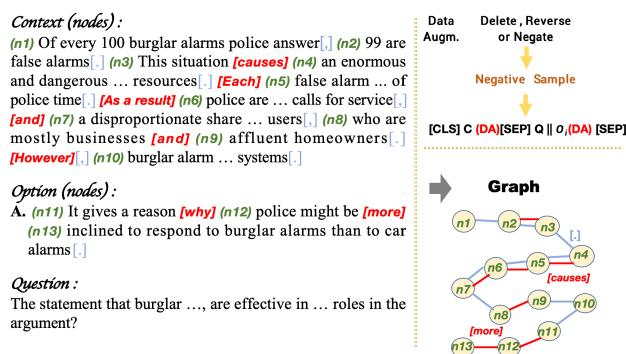
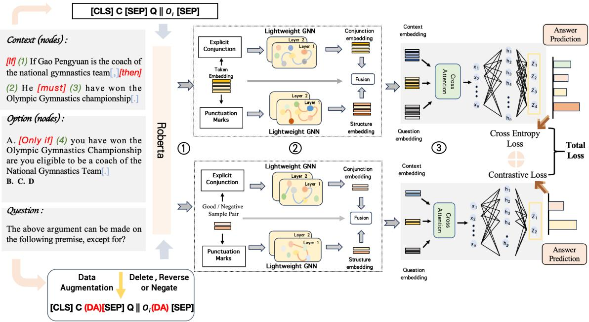
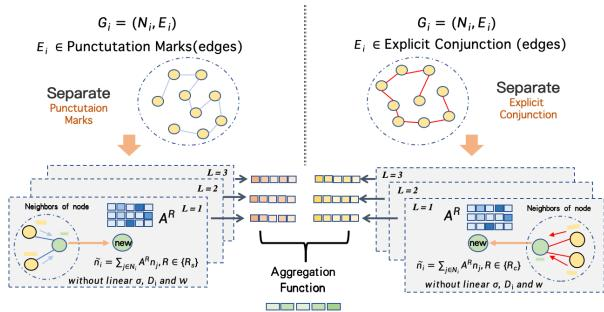
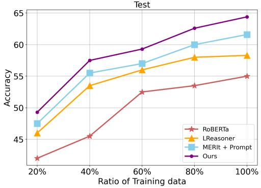
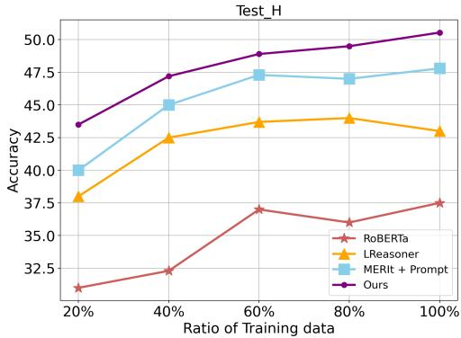

# LogiGraph: Logical Reasoning with Contrastive Learning and Lightweight Graph Networks

Xiang Li1\*, Chen Shi2\*, Yong Xu1†, Jun Huang2 1South China University of Technology, China 2Alibaba Group, China lixiangjacky@gmail.com\*†

## Abstract

Logical reasoning is a crucial factor in machine reading comprehension tasks (MRC). Existing methods suffer from the balance between semantic and explicit logical relation representations, in which some emphasize contextual semantics, while others pay more attention to explicit logical features. Additionally, previ ous methods utilize graph convolutional networks (GCN) for node updates, still exhibiting some shortcomings. To address these challenges, in this paper, we propose a logical reasoning method with contrastive learning and lightweight graph networks (LogiGraph). Our method focuses on the lightweight aspect of the GCN, which greatly improves the shortcomings of the GCN, and employs conjunction and punctuation marks as two types of edges to construct a dual graph. Besides, we combine contrastive learning with graph reasoning, which changes the logical expression’s content as the negative sample of the original context, enabling the model to capture negative logical relationships and improving generalization ability. We conduct extensive experiments on two public datasets, ReClor and LogiQA. Experimental results demonstrate that LogiGraph can achieve state-of-the-art performance on both datasets.

## 1 Introduction

Over the past few years, with the continuous development of QA datasets, the ability of MRC has become important (Hirschman and Gaizauskas, 2001; Liu et al., 2019a). With the emergence of SQuAD (Rajpurkar et al., 2016), DROP (Dua et al., 2019), and other similar datasets, the field of MRC has made further advances. Logical reasoning is an important task in MRC. The emergence of datasets like ReClor (Yu et al., 2020) and LogiQA (Liu et al., 2020) has improved the development of logical reasoning tasks. It emphasizes that models possess not only comprehension capabilities but also the ability to understand logical structures, such as context claims, assumptions, and potential fallacies.

  
Figure 1: An example of the constructed graphs and data augmentation from the ReClor (Yu et al., 2020).

Although pre-trained language models (PLMs) (Radford et al., 2018; Raffel et al., 2020) excel in capturing contextual semantic information, they struggle to understand the inherent logical structure and complex relationships within context, which limits their performance in complex logical reasoning tasks. To address the shortcomings of PLMs, previous methods construct graphs (Ran et al., 2019; Chen et al., 2020) based on entities in the context to extract relationships from text and utilize GCN to aggregate messages. However, they still have substantial room for improvement.

For example, excessive GCN can result in smoothed nodes, where the features of the nodes tend to become similar, losing their distinguishing characteristics (Li et al., 2018). Moreover, we discover that certain components in the GCN do not provide improvements. They even result in an increase in the model parameter’s number and longer inference time. For instance, multiple layers of feature transformation have no practical effect on the model inference, but rather increase the difficulty and parameter size of model training. Thus, in logical reasoning, we should focus more on the lightweight of the GCN. Additionally, relying solely on GCN to understand the semantic information of texts is insufficient. It is necessary to further enhance the exploration of the logical structure of a text.

To tackle these challenges, we propose Logi-Graph for solving logical reasoning tasks, which enhances the model’s ability to discover the logical structures within contexts and performs logical inferences. Compared to the previous method, our approach alleviates the problem of GCN, including training speed, inference time, and model parameter size, enhancing the ability of the model. Moreover, we integrate contrastive learning to improve the ability of the model to recognize the negative logical structure of context. Also, we provide an example of the procedure for constructing a graph structure from the context in Figure 1. In summary, the contribution of our paper lies in three folds:

• We propose a lightweight graph network for logical reasoning of MRC, which emphasizes the lightweight of the GCN, abandons multiple invalid components of GCN, and utilizes conjunction and punctuation marks as two types of edges to establish the dual graph.

• We combine contrastive learning with graph reasoning, which changes the content of logical expression as the negative sample of the original context, enabling the model to identify negative logical relationships.

• Extensive experiments reveal that LogiGraph outperforms existing methods on two public datasets. The ablation studies also demonstrate the efficiency of each module within.

## 2 Methodology

This section aims to introduce our LogiGraph, an end-to-end model proposed for logical reasoning. The architecture of LogiGraph is depicted in Figure 2. The left part of Figure 2 shows an example of the logical reasoning task. The comprehension of text will be split into dual branchs: original context (upper) and augmented context (lower), which via contrastive learning capture negative logical relationships, and via deletion, conditional inversion, negation operations to create negative samples. Each branch goes through the same components to accomplish its respective tasks. Ultimately, the losses of both branches will be consolidated.

<table><tr><td>Notations</td><td>Description</td></tr><tr><td> $c _ { i } \in C$ </td><td>different contexts (indexed by i)</td></tr><tr><td> $q _ { i } \in Q$ </td><td>different question</td></tr><tr><td> $o _ { i j } \in O$ </td><td>The  $j ^ { t h }$  option in  $i ^ { t h }$  context (indexed by ij)</td></tr><tr><td> $G _ { i }$ </td><td>two graphs in specific option i</td></tr><tr><td> $N _ { i }$ </td><td>nodes set in one graph (indexed by i)</td></tr><tr><td> $n _ { k } \in N _ { i }$ </td><td>The  $k ^ { t h }$  node in  $i ^ { t h }$  context (indexed by k)</td></tr><tr><td> $E _ { i }$ </td><td>edges set in one graph (indexed by i)</td></tr><tr><td> $t _ { s } \in T$ </td><td>token in one particular node</td></tr><tr><td> $v _ { s } \in V$ </td><td>vector of each token</td></tr><tr><td> $A ^ { R }$ </td><td>The adjacent matrix with two graphs</td></tr><tr><td> $R \in ( R _ { c } , R _ { s } )$ </td><td>Two different graph</td></tr><tr><td> $R _ { c }$ </td><td>edges that correspond to explicit conjunction</td></tr><tr><td> $R _ { s }$ </td><td>edges that correspond to punctuation marks</td></tr><tr><td> $\mathbf { N } _ { g }$ </td><td>global graph embedding in graph</td></tr><tr><td> $\mathbf { V } _ { f i n a l }$ </td><td>the predicted answer</td></tr></table>

Table 1: Descriptions of key notations

Branch comprises three components: Taking RoBERTa-Large ⃝1 as the token encoder for an example, the construction of the graph splits the sample into a conjunctive and a structural graph based on explicit conjunction relations and punctuation marks. Subsequently, the lightweight graph network ⃝2 updates the node features, as detailed in Figure 3. Finally, the cross-attention module ⃝3 combines the feature to predict the answer. The key notations are summarized in Table 1.

## 2.1 Task Definition

The focus of this task is logical reasoning in the context of multiple-choice question answering. Specifically, the concatenated sequence for each input represented as $[ C L S ] ~ C ~ [ S E P ] ~ Q ~ | | ~ O ~ [ S E P ]$ which is formed by sequentially connecting the context $C ,$ and each option O to the question Q.

Subsequently, the representations of the special token [CLS] in the four sequences are propagated through a linear layer that employs a softmax function to obtain the probability distribution of options, represented as $P ( o _ { 1 } , o _ { 2 } , o _ { 3 } , o _ { 4 } | C , Q )$ . The cross-entropy loss is performed according to Eq.1.

$$
\mathcal { L } = - \sum \log P \left( o _ { t r u e } \mid C , Q \right)\tag{1}
$$

where $o _ { t r u e }$ denotes the correct option. The formula can also be expressed in the following form:

$$
s c o r e _ { o _ { i j } } = l i n e a r \left( C _ { i } \left\| Q _ { i } \right\| O _ { i j } \right) ,\tag{2}
$$

  
Figure 2: The architecture of LogiGraph. The left part shows an example of the LogiQA dataset and the process of data augmentation. We take RoBERTa-Large ⃝1 as the token encoder for samples. The construction of the graph split the sample into conjunctive and structural graphs based on explicit conjunction relations and punctuation marks; Subsequently, the lightweight graph networks ⃝2 update nodes features, as detailed in Figure 3. Finally, ⃝3 the cross-attention module combines features to predict the answers.

$$
s c o r e _ { o _ { i j } } ^ { \prime } = \log \frac { \exp \left( s c o r e _ { o _ { i j } } \right) } { \sum _ { o _ { i j } \in O _ { i } } \exp \left( s c o r e _ { o _ { i j } } \right) }\tag{3}
$$

where $o _ { i j }$ denotes the $j ^ { t h }$ option in the $i ^ { t h }$ context sample, $C _ { i } , Q _ { i }$ and $O _ { i }$ indicate the representation of the $i ^ { t h }$ context, question and option, respectively.

## 2.2 Construction of Graph

Our model constructs conjunctive and structural graphs based on explicit conjunction relations and punctuation marks. We divide the context into nodes and utilize their relationships as edges to construct the graph, which categorized relations into explicit and implicit conjunctions. Each node represents a text segment connected by logical relationships, making it more of a logical graph than a sequential structure.

Explicit connections are found in sentences connected by various conjunctions, such as so” and and”, which indicate multiple relationships including causation, contrast, condition, and so on. In terms of how these explicit connections are identified, our model uses a fixed list of conjunction keywords, which are further enhanced by NLTK (Hardeniya et al., 2016) stemming. This approach allows for robust recognition of various word forms and ensures accurate detection of logical relationships. Utilizing these conjunctions to distinguish different nodes enables the model to better learn the logical structure and relationships within the text. Specifically, these conjunctions link sentences, enhancing the clarity of logical relationships between them.

Implicit ones are between continuous spans of text separated by punctuation marks, such as “,”. It is important to identify these delimiters as they serve as markers to distinguish different segments of text. Recognizing them aids the model in comprehending the boundaries between sentences, enhancing its overall contextual understanding.

Edges For each sample, we only segment the context and options, and excluded the question, since it lacks logical content. We utilize the conjunctions and punctuation marks as two types of edges to establish the conjunctive and structural graphs.

The use of conjunctions and punctuation marks creates a more intricate structure that captures logical relationships beyond mere adjacency. For example, causal conjunctions like "because" and "therefore" create edges representing cause-effect relationships, while contrastive conjunctions like "but" and "however" capture opposing ideas. These logical connections are essential for understanding the text’s deeper meaning, rather than just sequential links. For example, as shown in Figure 1:

Option (nodes): A. [n11] It gives a reason [why] [n12] police might be [more] [n13] inclined to respond to burglar alarms than to car alarms [.]

In this example, the conjunction “why” creates a causal edge between [n11] and [n12], while the word “more” indicates a comparative relationship between [n12] and [n13]. The period at the end creates a structural edge, segmenting the sentence. This graph construction mirrors the text’s logical flow, improving the model’s comprehension and reasoning abilities.

## 2.3 Node Encoder

To commence the LogiGraph process, the original feature embedding for each node must be obtained. Given the input sequence of the $i ^ { t h }$ context:

$$
I n p u t \left( C _ { i } , O _ { i , j } \right) = \left[ C L S \right] C _ { i } \left[ S E P \right] O _ { i , j } \left[ S E P \right]\tag{4}
$$

To encode token features, we use the RoBERTa (Liu et al., 2019b) as our encoder. For the token sequence $\mathbf { T } _ { i } : \{ t _ { 1 } , t _ { 2 } , . . . , t _ { s } \}$ with length s of each node $n _ { i } ,$ we obtain the corresponding token embedding represented as $\mathbf { V } _ { i } : \{ v _ { 1 } , v _ { 2 } , . . . , v _ { n } \}$ We derive the original feature for the node $s _ { i }$ by computing the sum of t tokens, which can capture the overall representation of the sequence. To address concerns about sparsity, we use a dual-graph structure with each node containing multiple tokens. Node representations are averaged across tokens, effectively preventing sparsity and ensuring a more comprehensive feature representation.

$$
\mathbf { s } _ { i } = \sum _ { v _ { n } \in V _ { i } } v _ { n }\tag{5}
$$

To preserve the sequential ordering of nodes in the context, positional embedding is employed:

$$
\mathbf { n } _ { \mathrm { i } } = \mathbf { s } _ { \mathrm { i } } + P o s E m b e d \left( \mathbf { s } _ { \mathrm { i } } \right)\tag{6}
$$

where $\mathbf { n } _ { \mathrm { i } }$ represents the node features after adding the original node and position encoding. For each sample’s context, the graph that corresponds to a specific option (i) is denoted by:

$$
G _ { i } = ( N _ { i } , E _ { i } )\tag{7}
$$

where $E _ { i }$ indicates the edges connecting nodes $n _ { i }$ $E _ { i }$ includes the edges of the conjunction and punctuation marks. The set $N _ { i }$ can be defined as follows: $\mathcal { N } _ { i } : \{ n _ { 1 } , n _ { 2 } , . . . n _ { k } \}$

  
Figure 3: A sample is shown, divided into two graphs using conjunction and punctuation marks. The graphs undergo node feature aggregation using a lightweight GCN.

## 2.4 Lightweight Graph Network

After node encoding, we conduct reasoning over conjunctive and structural graphs. Previous methods utilize GCN for node updates, still exhibiting some shortcomings. The traditional GCN (Wang et al., 2019) can be described as follows:

$$
\overline { { \mathcal { A } } } = \mathrm { D } _ { ( i ) } ^ { - 1 / 2 } \cdot \mathcal { A } _ { s t a r t } ^ { R } , \quad \mathcal { A } ^ { R _ { j i } } = \frac { \overline { { \mathcal { A } } } } { \sqrt { | \mathcal { N } _ { i } | } }\tag{8}
$$

where $\mathcal { A } ^ { R _ { j i } }$ is the adjacency matrix. $\mathbf { D } _ { ( i ) } ^ { - 1 / 2 }$ is the diagonal degree matrix. Then, it will calculate weight $\alpha _ { i }$ for each node using a linear transformation and a sigmoid function:

$$
\alpha _ { k } = \sigma \left( \mathbf { W } ^ { \alpha } \left( \mathbf { n } _ { k } \right) + b ^ { \alpha } \right)\tag{9}
$$

$$
\tilde { \mathbf { n } } _ { k } = \sum _ { j \in \mathcal { N } _ { i } } \alpha _ { j } \mathbf { A } ^ { R _ { j i } } \mathbf { n } _ { j } , R _ { j i } \in \{ R _ { c } , R _ { s } \}\tag{10}
$$

where $\tilde { \mathbf { n } } _ { k }$ is the message representation of ${ \bf n } _ { k }$ . Following the neighborhood aggregation, the nodes are updated through a combination of the initial ${ \bf n } _ { k }$ and the message representation $\tilde { \mathbf { n } } _ { i }$

$$
\mathbf { n } _ { k } ^ { \prime } = R e L U \left( \mathbf { W } ^ { u } \mathbf { n } _ { k } + \tilde { \mathbf { n } } _ { k } + \mathbf { b } ^ { u } \right)\tag{11}
$$

In logical reasoning, capturing explicit logical relationships between nodes is crucial. Traditional GCN may lose some information due to complex feature transformations and non-linear activation.

To address these issues, we propose a lightweight GCN, as shown in Figure 3. This network discards feature transformation, non-linear function activation, symmetric normalization term, and self-connection in the traditional GCN. By simplifying the model structure and focusing on the linear aggregation of neighborhood information, the lightweight GCN better preserves and utilizes logical relationships, thereby enhancing model performance in logical reasoning tasks. This simplification not only accelerates model convergence but also improves inference speed, making it more suitable for large-scale reasoning applications.

So the node update formula is as follows:

$$
\tilde { \mathbf { n } } _ { k } = \sum _ { j \in \mathcal { N } _ { i } } \mathbf { A } ^ { R _ { j i } } \mathbf { n } _ { j } , R _ { j i } \in \{ R _ { c } , R _ { s } \}\tag{12}
$$

where $\tilde { \mathbf { n } } _ { k }$ is the message representation of node $n _ { k }$ $\mathbf { n } _ { j }$ refer to the initial node embedding of $s _ { j }$ . The adjacency matrix $\mathbf { A } ^ { R _ { j i } }$ , is designated for one of two edge types. $R _ { c }$ represents conjunctive graph edges that correspond to explicit conjunction, while $R _ { s }$ represents structural graph edges that correspond to punctuation marks. Following message aggregation, the node representations are modified through the activation of ReLU. To enhance the efficacy of the model, we employ multiple rounds to perform higher-order feature extraction on the nodes:

$$
\mathbf { n } _ { k } ^ { \prime } = R e L U \left( \sum _ { j \in \mathcal { N } _ { i } } \mathbf { A } ^ { R } \tilde { \mathbf { n } } _ { j } ^ { l - 1 } \right) , R \in \{ R _ { c } , R _ { s } \}\tag{13}
$$

where l is the number of graph layers. $\mathbf { n } _ { k } ^ { \prime }$ is also formed by adding the initial node features with the features obtained after the last layer. After performing graph reasoning, we acquire features of all nodes from both conjunctive and structural graphs. Then, we apply a basic average operation to obtain the whole graph representation $\mathcal { N } _ { g }$

$$
\mathcal { N } _ { g } = \frac { 1 } { N } \sum _ { i \in \mathcal { N } _ { i } } \mathbf { n } _ { k } ^ { \prime }\tag{14}
$$

Finally, we add all node features together, to get the final node representation $\tilde { \mathbf { N } } _ { g } \mathbf { : }$

$$
\tilde { \mathbf { N } } _ { g } = \mathbf { N } _ { g } ^ { R _ { d } } + \mathbf { N } _ { g } ^ { R _ { p } } + \mathbf { V } _ { c l s }\tag{15}
$$

where $\nu _ { c l s }$ is the embedding of the original sequence based on the PLMs. $\bar { \mathbf { N } } _ { g } ^ { R _ { c } }$ and $\mathbf { N } _ { g } ^ { R _ { s } }$ are the node embedding of conjunction graph and structural graph, respectively.

## 2.5 Answer Forecast

We incorporate context and question into the design of node representation via utilizing a crossattention module:

$$
\mathbf { Q } = \mathbf { V } _ { \mathrm { c o n t e x t / q u e s t i o n } } \cdot \mathbf { W } ^ { \mathrm { Q } }\tag{16}
$$

$$
\mathbf { K } = \mathbf { V } _ { \mathrm { k } } \cdot \mathbf { W } ^ { \mathrm { k } }\tag{17}
$$

$$
\mathbf { V } = \mathbf { V } _ { \mathrm { k } } \cdot \mathbf { W } ^ { \mathrm { v } }\tag{18}
$$

where $\mathbf { W ^ { Q } , W ^ { k } , W ^ { v } }$ are the learnable projection matrices, then we compute the attention based on the query, key, and the value matrices.

$$
A = \frac { \mathbf { Q } \mathbf { K } ^ { \mathrm { T } } } { \sqrt { d _ { k } } }\tag{19}
$$

$$
{ \cal A t t } ( \mathbf { Q } , \mathbf { K } , \mathbf { V } ) = s o f t m a x ( { \cal A } ) \cdot \mathbf { V } ,\tag{20}
$$

Thus, we obtain the enhanced context and question embedding, which are expressed as:

$$
\mathbf { V } _ { q u e s t i o n } ^ { \prime } = s o f t m a x \left( \frac { \mathbf { Q } _ { q u e s t i o n } \mathbf { K } ^ { \mathrm { T } } } { \sqrt { d } } \right) \cdot \tilde { \mathbf { N } } _ { g }\tag{21}
$$

where $\mathrm { V } _ { c o n t e x t } ^ { \prime }$ and $\mathrm { V } _ { q u e s t i o n } ^ { \prime }$ are the embedding of context and question. After that, to enhance the model’s ability, we concatenate $\tilde { \mathbf { N } } _ { g } , \mathrm { V } _ { c o n t e x t } ^ { \prime }$ and $\mathrm { V } _ { q u e s t i o n } ^ { \prime } ,$ fed into the feed-forward network to get the final feature, from which we select the maximum value to determine the predicted answer.

$$
\mathbf { V } _ { f i n a l } = \sigma ( \mathbf { w } \cdot \left[ \tilde { \mathbf { N } } _ { g } ; \mathbf { V } _ { c o n t e x t } ; \mathbf { V } _ { q u e s t i o n } ^ { \prime } \right] )\tag{22}
$$

## 2.6 Contrastive Learning

To enhance the model’s predictive ability, especially considering negative logical relationships, we incorporate contrastive learning. This approach allows the model to better distinguish between positive and negative contexts.

We generate positive samples from the original context, while negative samples are crafted through various modifications, including deletion, conditional inversion, and negation operations. Specifically, we use the NLTK library for tokenization, POS-tagging, and text negation. This process involves turning "be" verbs negative and adding "did not" before other verbs, resulting in a semantically negated text.

For instance, an affirmative statement like "He likes football" becomes "He does not like football" using the negation operation. Similarly, we transform positive expressions into their negative counterparts or vice versa. By applying these techniques, we enrich our training dataset with a variety of negative samples, ensuring the model can learn a wide range of linguistic structures and logical relationships. The objective can be described as:

$$
s \left( f ( S _ { k = n } ) , f \left( S _ { n } ^ { + } \right) \right) \gg s \left( f ( S _ { n } ) , f \left( S _ { n } ^ { - } \right) \right)\tag{23}
$$

<table><tr><td rowspan="2">Dataset Model</td><td colspan="4">ReClor</td><td colspan="2">LogiQA</td></tr><tr><td>Dev</td><td>Test</td><td>Test-E</td><td>Test-H</td><td>Dev</td><td>Test</td></tr><tr><td>Random</td><td>25.00</td><td>25.00</td><td>25.00</td><td>25.00</td><td>25.00</td><td>25.00</td></tr><tr><td>Human (Yu et al., 2020)</td><td></td><td>63.00</td><td>57.10</td><td>67.20</td><td></td><td>86.00</td></tr><tr><td>BERT-Large (Devlin et al., 2018)</td><td>53.80</td><td>49.80</td><td>72.00</td><td>32.30</td><td>34.10</td><td>31.03</td></tr><tr><td>XLNet-Large (Yang et al., 2019)</td><td>62.00</td><td>56.00</td><td>75.70</td><td>40.50</td><td></td><td></td></tr><tr><td>RoBERTa-Large (Liu et al., 2019b)</td><td>62.60</td><td>55.60</td><td>75.50</td><td>40.00</td><td>35.02</td><td>35.30</td></tr><tr><td>DAGN (Huang et al., 2021)</td><td>65.20</td><td>58.20</td><td>76.14</td><td>44.46</td><td>36.87</td><td>39.32</td></tr><tr><td>DAGN (Aug) (Huang et al., 2021)</td><td>65.80</td><td>58.30</td><td>75.91</td><td>44.46</td><td>36.87</td><td>39.32</td></tr><tr><td>AdaLoGn (Li et al., 2022)</td><td>65.20</td><td>60.20</td><td>79.32</td><td>45.18</td><td>39.94</td><td>40.71</td></tr><tr><td>FocalReasoner (Ouyang et al., 2021)</td><td>66.80</td><td>58.90</td><td>77.05</td><td>44.64</td><td>41.01</td><td>40.25</td></tr><tr><td>LReasoner (Wang et al., 2021)</td><td>66.20</td><td>62.40</td><td>81.40</td><td>47.50</td><td>38.10</td><td>40.60</td></tr><tr><td>APOLLO (Sanyal et al., 2022)</td><td>67.20</td><td>58.20</td><td>76.80</td><td>43.60</td><td>41.60</td><td>42.10</td></tr><tr><td>HGN (Chen et al., 2022)</td><td>66.40</td><td>58.70</td><td>77.70</td><td>43.80</td><td>40.10</td><td>39.90</td></tr><tr><td>APOLLO + MERIt (Sanyal et al., 2022)</td><td>67.20</td><td>59.80</td><td>76.80</td><td>46.40</td><td>41.80</td><td>42.40</td></tr><tr><td>MERIt (Jiao et al., 2022)</td><td>67.80</td><td>60.70</td><td>79.60</td><td>45.90</td><td>42.40</td><td>41.50</td></tr><tr><td>MERIt +Prompt (Jiao et al., 2022)</td><td>70.20</td><td>62.60</td><td>80.50</td><td>48.50</td><td>39.50</td><td>42.40</td></tr><tr><td>LoCSGN (Zhao et al., 2022)</td><td>68.20</td><td>62.60</td><td>78.90</td><td>49.80</td><td>39.80</td><td>42.20</td></tr><tr><td>Logiformer (Xu et al., 2022)</td><td>68.40</td><td>63.50</td><td>79.09</td><td>51.25</td><td>42.24</td><td>42.50</td></tr><tr><td>ChatGPT (Turbo3.5) (OpenAI, 2023)</td><td>61.50</td><td>55.30</td><td>58.86</td><td>52.50</td><td>40.93</td><td>40.65</td></tr><tr><td>LogiGraph</td><td>70.80</td><td>65.00</td><td>82.05</td><td>51.60</td><td>43.94</td><td>44.42</td></tr></table>

Table 2: Experimental results on ReClor and LogiQA. We utilize accuracy as the evaluation metric and all the baselines are based on RoBERTa-Large.The ReClor is further segmented into two categories, Easy and Hard, with a total of 440 and 560 data points respectively.

where $S _ { k = n }$ is the sample from the datasets, and the $S _ { n } ^ { + }$ and $S _ { n } ^ { - }$ are the positive and negative sample, respectively. The $s ( \cdot )$ and $f ( \cdot )$ represent the similarity function and the encoder of the model.

Subsequently, both positive and negative samples are fed into the model. We construct conjunctive and structural graphs for both samples. Finally, we change the scoring function from measuring similarity between them:

$$
\mathcal { L } _ { C } = - \sum \log \frac { e ^ { s ^ { \prime } ( S _ { n } , S _ { n } ^ { + } ) } } { e ^ { s ^ { \prime } ( S _ { n } , S _ { n } ^ { + } ) } + e ^ { s ^ { \prime } ( S _ { n } , S _ { n } ^ { - } ) } }\tag{24}
$$

Ultimately, our model is trained using a composite loss function, which can be described as:

$$
\mathcal { L } _ { t o t a l } = \mathcal { L } + \mathcal { L } _ { C }\tag{25}
$$

## 3 Experiments

In this part, we perform a series of experiments to compare our model to existing state-of-the-art (SOTA) methods on both ReClor and LogiQA datasets. To further verify the effectiveness of the proposed model, we conduct a thorough analysis via ablation studies and supplementary analysis.

## 3.1 Datasets

Experiments involve the evaluation of our model effectiveness on two datasets, ReClor (Yu et al.,

<table><tr><td>Model</td><td>TEST</td><td>Valid</td><td>Test</td><td>Reason Type</td></tr><tr><td>ReClor</td><td>4,638</td><td>500</td><td>1,000</td><td>17</td></tr><tr><td>LogiQA</td><td>7,376</td><td>651</td><td>651</td><td>5</td></tr></table>

Table 3: The details of ReClor and LogiQA datasets

2020) and LogiQA (Liu et al., 2020), which constitute a diverse range of logical reasoning skills. The ReClor dataset is based on different exams, with unbiased instances separated from the test data to evaluate logical reasoning. On the other hand, the LogiQA dataset is derived from the National Civil Servants Examination of China. It has been translated professionally into English. Table 3 shows the details of ReClor and LogiQA datasets.

## 3.2 Hyper-parameters for Fine-tuning

<table><tr><td>Name of Parameter</td><td>Search Scope</td><td>Best</td></tr><tr><td>training batchsize</td><td>{1,2,4,8}</td><td>2</td></tr><tr><td>epoch</td><td>{9,10,11,12,15}</td><td>10</td></tr><tr><td>Layer in graph graph</td><td>{1,2,3,4,5}</td><td>2</td></tr><tr><td>max sequence length</td><td>{128,256,288,512}</td><td>288</td></tr><tr><td>learning rate for RoBERTa</td><td>{4e-6, 5e-6, 6e-6, 5e-5} 5e-6</td><td></td></tr></table>

Table 4: The tuned hyper-parameters with search scopes

tation provided by Huggingface (Wolf et al., 2020) along with the pytorch framework. Hyperparameters for training LogiGraph are reported in Table 4.

## 3.3 Baselines

ReClor and LogiQA have been proposed as benchmarks for this task (Khot et al., 2018; Habernal et al., 2017). In their work, ReClor presents the outcomes of BERT-Large (Devlin et al., 2018), RoBERTa-Large, and XLNet-Large (Yang et al., 2019), while LogiQA reports the performance of BERT-Large and RoBERTa-Large.

• DAGN (Huang et al., 2021) proposes a discourse-aware network that employs RoBERTa and GCN for feature updating.

• Logiformer (Xu et al., 2022) proposes a graph transformer network, which uses the graph transformer to extract the features.

• FocalReasoner (Ouyang et al., 2021) focuses on the fact units extracted from the text and then builds a super graph for reasoning.

## 3.4 Comparison of Results

Our approach has been evaluated on the ReClor and LogiQA datasets, with the main results presented in Table 2.

The ReClor test split includes easy “Test-E” and hard “Test-H” folds. For fair comparison, all baselines use the RoBERTa-Large encoder with 355 million parameters.

Our method shows improvements over the SOTA. On ReClor, we observe 3.51% and 2.36% gains on the validation and test splits compared to Logiformer. On LogiQA, our method outperforms Logiformer by 4.02% and 4.39%. However, a gap remains between human and machine performance, as humans find the structured context in LogiQA easier to understand.

Moreover, LogiGraph achieves 65.0% accuracy on the ReClor test split, surpassing ChatGPT. On LogiQA, our model’s accuracy is 40.65%, also higher than ChatGPT.

Regarding Table 2 and Table 5, they are separated due to differing encoders used in baseline methods. RoBERTa-Large encoder is the main encoder for all baselines. Compared to other backbone models like ALBERT and DeBERTa, our method consistently demonstrates improvements, shown in Table 5, proving its robustness in enhancing logical reasoning across various pre-trained models.

## 3.5 Ablation Study

To assess the efficacy of our method’s components, we conducted an ablation study using RoBERTa-Large as the backbone.

First, we evaluate each graph independently. Table 6 shows that the conjunctive graph boosts performance on the ReClor dataset, increasing validation and test scores by 3.5% and 4.7%, respectively. The structural graph also contributes to performance gains.

Second, we examine the impact of the lightweight graph network on model performance, focusing on its role in node feature extraction. Additionally, we compare model performance with and without contrastive learning, finding that contrastive learning improves results (Table 6).

To further validate our lightweight graph network over traditional GCNs, we refine our experiments. Table 7 indicates that removing certain components improves performance. Our lightweight network reduces parameters and increases efficiency, achieving 65.0% on ReClor and 44.42% on LogiQA, compared to GCN’s 62.7% and 42.54%. The lightweight design also optimizes model size and inference time, demonstrating its efficiency.

Finally, we analyze the ReClor test split by question type, showing improvements in most categories, especially Necessary Assumption and Principle (Table 8). This suggests our model effectively explains and infers hidden facts within contexts.

## 3.6 Supplementary Analysis

Figure 4 and 5 display the accuracy of ReClor on both the test set and test-H set. It is apparent that as the quantity of training data increases, all models exhibit improved results. Our model excels even with limited resources, achieving nearly 59% accuracy at 60% data, highlighting its consistent performance across different data volumes.

## 4 Related Work

Over recent years, numerous datasets aimed at enhancing models to approach human intelligence. Mulit-hop MRC tasks in HotpotQA (Yang et al., 2018) and WikiHop (Welbl et al., 2018) require reading multiple supporting passages to answer a question. Meanwhile, NLI (Bowman et al., 2015;

<table><tr><td>Dataset</td><td colspan="4">ReClor</td><td colspan="2">LogiQA</td></tr><tr><td>Model</td><td>Dev</td><td>Test</td><td>Test-E</td><td>Test-H</td><td>Dev</td><td>Test</td></tr><tr><td>ALBERT (Lan et al., 2019)</td><td>69.1</td><td>66.5</td><td>76.7</td><td>58.4</td><td>38.9</td><td>37.6</td></tr><tr><td>MERIt (ALBERT) (Jiao et al., 2022)</td><td>74.2</td><td>70.1</td><td>81.6</td><td>61</td><td>43.7</td><td>42.5</td></tr><tr><td>MERIt (ALBERT) + Prompt (Jiao et al., 2022)</td><td>74.7</td><td>70.5</td><td>82.5</td><td>61.1</td><td>46.1</td><td>41.7</td></tr><tr><td>LReasoner (ALBERT) (Wang et al., 2021)</td><td>73.2</td><td>70.7</td><td>81.1</td><td>62.5</td><td>41.6</td><td>41.2</td></tr><tr><td>LogiGraph (ALBERT)</td><td>75.0</td><td>71.5</td><td>82.27</td><td>63.04</td><td>46.85</td><td>42.9</td></tr><tr><td>DeBERTa (He et al., 2020b)</td><td>74.4</td><td>68.9</td><td>83.4</td><td>57.5</td><td>44.4</td><td>41.5</td></tr><tr><td>LReasoner (DeBERTa) (Wang et al., 2021)</td><td>74.6</td><td>71.8</td><td>83.4</td><td>62.7</td><td>45.8</td><td>43.3</td></tr><tr><td>MERIt (DeBERTa) (Jiao et al., 2022)</td><td>78.0</td><td>73.1</td><td>86.2</td><td>64.4</td><td></td><td></td></tr><tr><td>LoCSGN (DeBERTa) (Zhao et al., 2022)</td><td>78.6</td><td>73.2</td><td>84.8</td><td>64.1</td><td></td><td></td></tr><tr><td>LogiGraph (DeBERTa)</td><td>78.8</td><td>73.9</td><td>85.45</td><td>64.82</td><td>47.19</td><td>45.04</td></tr></table>

Table 5: Experimental result on ReClor and LogiQA dataset. We utilize the accuracy as the evaluation metric and all the baselines are based on ALBERT-xxlarge-v2 and DeBERTa-v2-xlarge.

Williams et al., 2018) datasets focus on performing the task sentence-by-sentence and are restricted to a few logical reasoning types.

To improve model reasoning, datasets like LogiQA and ReClor require models to reveal texts logic. However, PLMs may not be capable of handling these datasets since they encode given texts directly for predicting outputs.

To better handle these datasets, DAGN and FocalReasoner extract relationships from text and rep-

<table><tr><td rowspan=1 colspan=1>DatasetModel</td><td rowspan=1 colspan=1>ReClorDev Test</td><td rowspan=1 colspan=1>LogiQADev Test</td></tr><tr><td rowspan=1 colspan=1>LogiGraph</td><td rowspan=1 colspan=1>70.865.0</td><td rowspan=1 colspan=1>43.94 44.42</td></tr><tr><td rowspan=1 colspan=1>Graph Constructionw/o conjunctive graphw/o structural graph</td><td rowspan=1 colspan=1>68.4 61.568.6 61.0</td><td rowspan=1 colspan=1>41.2041.9340.4041.47</td></tr><tr><td rowspan=1 colspan=1>Graphs reasoningw/o lightweight GCN</td><td rowspan=1 colspan=1>68.1 61.6</td><td rowspan=1 colspan=1>41.9440.86</td></tr><tr><td rowspan=1 colspan=1>Cross attentionw/o attention-layer</td><td rowspan=1 colspan=1>69.5 63.5</td><td rowspan=1 colspan=1>43.4743.54</td></tr><tr><td rowspan=1 colspan=1>contrastive Learningw/o CL</td><td rowspan=1 colspan=1>68.8 61.8</td><td rowspan=1 colspan=1>41.3242.85</td></tr></table>

Table 6: Ablation studies results (by accuracy %) on ReClor and LogiQA development set and test set
<table><tr><td>Dataset Model</td><td>ReClor Test</td><td>LogiQA Test</td><td>Params size</td><td>Inference Time</td></tr><tr><td>LogiGraph GCN</td><td>65.0 62.7</td><td>44.42 42.54</td><td>370.06m 373.21m</td><td>0.1918s 0.2231s</td></tr><tr><td>GCN-F GCN-N</td><td>63.1 62.6</td><td>43.18 42.65</td><td>371.11m 373.21m</td><td>0.2143s 0.2107s</td></tr><tr><td>GCN-SN GCN-SC</td><td>63.4 63.8</td><td>43.47 43.31</td><td>373.21m 372.16m</td><td>0.2129s 0.2106s</td></tr></table>

Table 7: Ablation study results (by accuracy %) on Re-Clor and LogiQA test set, show the impact of discarding different components of GCN. F: feature transformation, N: non-linear function activation function, SN: symmetric normalization, SC: self-connection

  
Figure 4: Results on the test set of ReClor.

  
Figure 5: Results on the test-H set of ReClor.

resent them as a graph, using GCN to aggregate messages. However, traditional GCN can result in excessively smoothed nodes, which weakens the model’s ability. Additionally, in traditional GCN, many components do not provide actual benefits to the performance and, increase the model’s parameter size and inference time. FocalReasoner emphasizes the importance of fact units, extracting the units from the text and building a graph for the reasoning. However, it only uncovers the logical structure in one aspect. MERIt (Jiao et al., 2022) uses Wikipedia for logical graphs, but their contrastive loss needs counterfactual data augmentation, which may distort factual knowledge. Differently, we propose a method that combines contrastive learning (Wu et al., 2018; He et al., 2020a) with a lightweight graph network to enhance the model’s ability to recognize the negative logical structure, reduce the potential problem of GCN.

<table><tr><td>Model</td><td>NA</td><td>S</td><td>W</td><td>I</td><td>CMP</td><td>ER</td><td>P</td><td>D</td><td>R</td><td>IF</td><td>0</td></tr><tr><td>LogiGraph</td><td>76.32</td><td>62.77</td><td>53.10</td><td>58.70</td><td>70.01</td><td>70.24</td><td>64.61</td><td>50.66</td><td>62.75</td><td>64.96</td><td>63.02</td></tr><tr><td>w/o conjunctive graph</td><td>72.80</td><td>61.50</td><td>52.98</td><td>52.17</td><td>69.4</td><td>65.47</td><td>60.0</td><td>50.0</td><td>59.37</td><td>60.68</td><td>64.38</td></tr><tr><td> $\bigtriangleup$ </td><td>-3.52</td><td>-1.27</td><td>-0.22</td><td>-6.53</td><td>-0.7</td><td>-4.77</td><td>-4.61</td><td>-0.66</td><td>-3.38</td><td>-4.28</td><td>+1.36</td></tr><tr><td>w/o structural graph</td><td>71.93</td><td>57.45</td><td>49.56</td><td>56.52</td><td>69.44</td><td>63.09</td><td>61.54</td><td>50.0</td><td>56.25</td><td>64.10</td><td>57.53</td></tr><tr><td>△</td><td>-4.39</td><td>-5.32</td><td>-3.54</td><td>-2.18</td><td>-0.66</td><td>-7.15</td><td>-3.07</td><td>-0.66</td><td>-6.5</td><td>-0.86</td><td>-5.49</td></tr></table>

Table 8: The details of the ReClor test are Split on different question types. NA: Necessary Assumption, S: Strengthen, W: Weaken, I: Implication, CMP: Conclusion/Main Point, ER: Explain or Resolve, P: Principle, D: Dispute, R: Role, IF: Identify a Flaw, O: Other.

## 5 Conclusion

In this paper, we propose LogiGraph for logical reasoning in MRC, unitizing a lightweight graph network to extract node features from the context. It is effective in improving the shortcomings of GCN. We employ conjunction and punctuation marks as two types of edges to construct dual graphs. Furthermore, we combine contrastive learning into our model, which constructs negative samples to better capture negative and complex logical relationships in the context. With the evaluation of two datasets, ReClor and LogiQA, LogiGraph achieves SOTA performance on both of them. In the future, we plan to strengthen our method with respect to both data construction and model architecture design.

## 6 Ethics Statement

We assert that there are no ethical dilemmas surrounding the submission of this article and have no known competing financial interests or personal relationships that could have had an impact on the research work presented.

## 7 Limitations

There are two limitations to this study. Firstly, it requires substantial GPU resources, with a minimum of A10 with 22GB memory, to ensure experimentation. If the base model is switched from the larger model to DeBERTa and ALBERT, A100 computing resources will need to be used. This is indeed a limitation of the model, as it requires substantial computational resources.

Secondly, while the model’s architecture is interpretable at a macroscopic level with each module serving a specific function, it lacks interpretability at a microscopic level, rendering the reasoning process a black box. This is especially challenging when considering which nodes in the extracted graph structure are more significant and how to interpret their implications. Additionally, accurately identifying the formalized logical chains and the faithful representation of logical reasoning abilities during the inference process poses challenges. Therefore, in future research, we aim to explore new approaches that improve model structure by employing more lightweight networks to mitigate computational requirements. We also plan to enhance model interpretability by incorporating capabilities such as symbolic reasoning.

## References

Samuel R Bowman, Gabor Angeli, Christopher Potts, and Christopher D Manning. 2015. A large annotated corpus for learning natural language inference. arXiv preprint arXiv:1508.05326.

Jialin Chen, Zhuosheng Zhang, and Hai Zhao. 2022. Modeling hierarchical reasoning chains by linking discourse units and key phrases for reading comprehension. In Proceedings of the 29th International Conference on Computational Linguistics, pages 1467–1479, Gyeongju, Republic of Korea. International Committee on Computational Linguistics.

Kunlong Chen, Weidi Xu, Xingyi Cheng, Zou Xiaochuan, Yuyu Zhang, Le Song, Taifeng Wang, Yuan Qi, and Wei Chu. 2020. Question directed graph attention network for numerical reasoning over text. arXiv preprint arXiv:2009.07448.

Jacob Devlin, Ming-Wei Chang, Kenton Lee, and Kristina Toutanova. 2018. Bert: Pre-training of deep bidirectional transformers for language understanding. arXiv preprint arXiv:1810.04805.

Dheeru Dua, Yizhong Wang, Pradeep Dasigi, Gabriel Stanovsky, Sameer Singh, and Matt Gardner. 2019.

Drop: A reading comprehension benchmark requiring discrete reasoning over paragraphs. arXiv preprint arXiv:1903.00161.

Ivan Habernal, Henning Wachsmuth, Iryna Gurevych, and Benno Stein. 2017. The argument reasoning comprehension task: Identification and reconstruction of implicit warrants. arXiv preprint arXiv:1708.01425.

Nitin Hardeniya, Jacob Perkins, Deepti Chopra, Nisheeth Joshi, and Iti Mathur. 2016. Natural language processing: python and NLTK. Packt Publishing Ltd.

Kaiming He, Haoqi Fan, Yuxin Wu, Saining Xie, and Ross Girshick. 2020a. Momentum contrast for unsupervised visual representation learning. In Proceedings of the IEEE/CVF conference on computer vision and pattern recognition, pages 9729–9738.

Pengcheng He, Xiaodong Liu, Jianfeng Gao, and Weizhu Chen. 2020b. Deberta: Decoding-enhanced bert with disentangled attention. arXiv preprint arXiv:2006.03654.

Lynette Hirschman and Robert Gaizauskas. 2001. Natural language question answering: the view from here. natural language engineering, 7(4):275–300.

Yinya Huang, Meng Fang, Yu Cao, Liwei Wang, and Xiaodan Liang. 2021. Dagn: Discourse-aware graph network for logical reasoning. arXiv preprint arXiv:2103.14349.

Fangkai Jiao, Yangyang Guo, Xuemeng Song, and Liqiang Nie. 2022. Merit: meta-path guided contrastive learning for logical reasoning. arXiv preprint arXiv:2203.00357.

Tushar Khot, Ashish Sabharwal, and Peter Clark. 2018. Scitail: A textual entailment dataset from science question answering. In Proceedings of the AAAI Conference on Artificial Intelligence, volume 32.

Zhenzhong Lan, Mingda Chen, Sebastian Goodman, Kevin Gimpel, Piyush Sharma, and Radu Soricut. 2019. Albert: A lite bert for self-supervised learning of language representations. arXiv preprint arXiv:1909.11942.

Qimai Li, Zhichao Han, and Xiao-Ming Wu. 2018. Deeper insights into graph convolutional networks for semi-supervised learning. In Proceedings of the AAAI conference on artificial intelligence, volume 32.

Xiao Li, Gong Cheng, Ziheng Chen, Yawei Sun, and Yuzhong Qu. 2022. Adalogn: Adaptive logic graph network for reasoning-based machine reading comprehension. arXiv preprint arXiv:2203.08992.

Jian Liu, Leyang Cui, Hanmeng Liu, Dandan Huang, Yile Wang, and Yue Zhang. 2020. Logiqa: A challenge dataset for machine reading comprehension with logical reasoning. arXiv preprint arXiv:2007.08124.

Shanshan Liu, Xin Zhang, Sheng Zhang, Hui Wang, and Weiming Zhang. 2019a. Neural machine reading comprehension: Methods and trends. Applied Sciences, 9(18):3698.

Yinhan Liu, Myle Ott, Naman Goyal, Jingfei Du, Mandar Joshi, Danqi Chen, Omer Levy, Mike Lewis, Luke Zettlemoyer, and Veselin Stoyanov. 2019b. Roberta: A robustly optimized bert pretraining approach. arXiv preprint arXiv:1907.11692.

OpenAI. 2023. Gpt-4 technical report. Preprint, arXiv:2303.08774.

Siru Ouyang, Zhuosheng Zhang, and Hai Zhao. 2021. Fact-driven logical reasoning. arXiv preprint arXiv:2105.10334.

Alec Radford, Karthik Narasimhan, Tim Salimans, Ilya Sutskever, et al. 2018. Improving language understanding by generative pre-training.

Colin Raffel, Noam Shazeer, Adam Roberts, Katherine Lee, Sharan Narang, Michael Matena, Yanqi Zhou, Wei Li, and Peter J Liu. 2020. Exploring the limits of transfer learning with a unified text-to-text transformer. The Journal of Machine Learning Research, 21(1):5485–5551.

Pranav Rajpurkar, Jian Zhang, Konstantin Lopyrev, and Percy Liang. 2016. Squad: 100,000+ questions for machine comprehension of text. arXiv preprint arXiv:1606.05250.

Qiu Ran, Yankai Lin, Peng Li, Jie Zhou, and Zhiyuan Liu. 2019. Numnet: Machine reading comprehension with numerical reasoning. arXiv preprint arXiv:1910.06701.

Soumya Sanyal, Yichong Xu, Shuohang Wang, Ziyi Yang, Reid Pryzant, Wenhao Yu, Chenguang Zhu, and Xiang Ren. 2022. Apollo: A simple approach for adaptive pretraining of language models for logical reasoning. arXiv preprint arXiv:2212.09282.

Siyuan Wang, Wanjun Zhong, Duyu Tang, Zhongyu Wei, Zhihao Fan, Daxin Jiang, Ming Zhou, and Nan Duan. 2021. Logic-driven context extension and data augmentation for logical reasoning of text. arXiv preprint arXiv:2105.03659.

Xiang Wang, Xiangnan He, Meng Wang, Fuli Feng, and Tat-Seng Chua. 2019. Neural graph collaborative filtering. In Proceedings ofthe 42nd international ACM SIGIR conference on Research and development in Information Retrieval, pages 165–174.

Johannes Welbl, Pontus Stenetorp, and Sebastian Riedel. 2018. Constructing datasets for multi-hop reading comprehension across documents. Transactions of the Association for Computational Linguistics, 6:287– 302.

A Williams, N Nangia, and SR Bowman. 2018. A broad-coverage challenge corpus for sentence understanding through inference. north american chapter of

the association for computational linguistics: Human language technologies (naacl hlt), 1, 1112–1122.

Thomas Wolf, Lysandre Debut, Victor Sanh, Julien Chaumond, Clement Delangue, Anthony Moi, Pierric Cistac, Tim Rault, Rémi Louf, Morgan Funtowicz, et al. 2020. Transformers: State-of-the-art natural language processing. In Proceedings ofthe 2020 conference on empirical methods in natural language processing: system demonstrations, pages 38–45.

Zhirong Wu, Yuanjun Xiong, Stella X Yu, and Dahua Lin. 2018. Unsupervised feature learning via nonparametric instance discrimination. In Proceedings of the IEEE conference on computer vision and pattern recognition, pages 3733–3742.

Fangzhi Xu, Jun Liu, Qika Lin, Yudai Pan, and Lingling Zhang. 2022. Logiformer: A two-branch graph transformer network for interpretable logical reasoning. In Proceedings ofthe 45th International ACM SIGIR Conference on Research and Development in Information Retrieval, pages 1055–1065.

Zhilin Yang, Zihang Dai, Yiming Yang, Jaime Carbonell, Russ R Salakhutdinov, and Quoc V Le. 2019. Xlnet: Generalized autoregressive pretraining for language understanding. Advances in neural information processing systems, 32.

Zhilin Yang, Peng Qi, Saizheng Zhang, Yoshua Bengio, William W Cohen, Ruslan Salakhutdinov, and Christopher D Manning. 2018. Hotpotqa: A dataset for diverse, explainable multi-hop question answering. arXiv preprint arXiv:1809.09600.

Weihao Yu, Zihang Jiang, Yanfei Dong, and Jiashi Feng. 2020. Reclor: A reading comprehension dataset requiring logical reasoning. arXiv preprint arXiv:2002.04326.

Xi Zhao, Tingrui Zhang, Yuxiao Lu, and Guiquan Liu. 2022. Locsgn: Logic-contrast semantic graph network for machine reading comprehension. In Natural Language Processing and Chinese Computing: 11th CCF International Conference, NLPCC 2022, Guilin, China, September 24–25, 2022, Proceedings, Part I, pages 405–417. Springer.