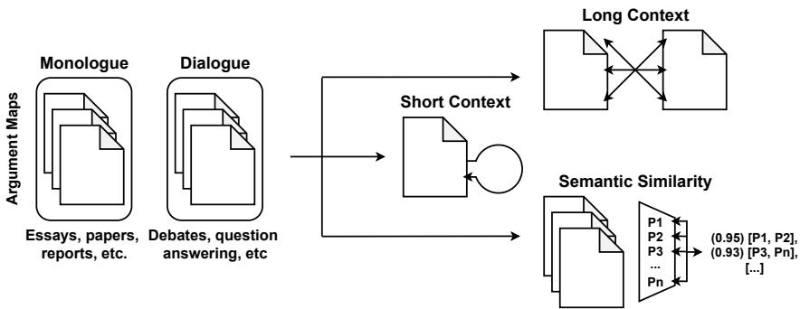

# Looking at the Unseen: Effective Sampling of Non-Related Propositions for Argument Mining

Ramon Ruiz-Dolz<sup>1</sup>, Debela Gemechu<sup>1</sup>, Zlata Kikteva<sup>2</sup>, Chris Reed<sup>1</sup>,

<sup>1</sup> Centre for Argument Technology (ARG-tech), University of Dundee, United Kingdom <sup>2</sup> University of Passau, Germany Correspondence: rruizdolz001@dundee.ac.uk

## Abstract

Traditionally, argument mining research has approached the task of automatic identification of argument structures by using existing definitions of what constitutes an argument, while leaving the equally important matter of what does not qualify as an argument unaddressed. With the ability to distinguish between what is and what is not a natural language argument being at the core of argument mining as a field, it is interesting that no previous work has explored approaches to effectively select nonrelated propositions (i.e., propositions that are not connected through an argumentative relation, such as support or attack) that improve the data for learning argument mining tasks better. In this paper, we address the question of how to effectively sample non-related propositions from six different argument mining corpora belonging to different domains and encompassing both monologue and dialogue forms of argumentation. To that end, in addition to considering undersampling baselines from previous work, we propose three new sampling strategies relying on context (i.e., short/long) and the semantic similarity between propositions. Our results indicate that using more informed sampling strategies improves the performance, not only when evaluating models on their respective test splits, but also in the case of crossdomain evaluation.

## 1 Introduction

Argument mining is the Natural Language Processing (NLP) task of automatically identifying argumentative structures in natural language documents (Lawrence and Reed, 2020). In order to identify these structures, we need to analyse the existing argumentative relations between the previously segmented argument propositions (Ruiz-Dolz et al., 2021). For that purpose, it is fundamental to be able to distinguish between argumentatively related and non-related pairs of propositions. While the argumentative relations are well defined and represented in most of the work as supports and attacks (Cocarascu and Toni, 2017a; Chakrabarty et al., 2019a; Mayer et al., 2020; Morio et al., 2022; Kawarada et al., 2024), the question of how to effectively sample non-related propositions (i.e., propositions that are not linked by an argumentative relation of support or attack) has never been addressed before. This question is, however, highly relevant for argument mining for many reasons including such issues as class imbalance, the introduction of unwanted biases in the training data, or the addition of redundant information and noise to the training process. Without thoroughly considering this issue, previous work has commonly addressed the sampling of non-related propositions by either including all the possible combinations of propositions without relational labels into the training dataset (Chakrabarty et al., 2019a), or by randomly undersampling this large set in an attempt to prevent the class imbalance from being too strong (Ruiz-Dolz et al., 2021). In both cases, no additional aspects such as context or similarity are brought into consideration when sampling non-related propositions, which may result in the loss of features relevant to distinguishing argument propositions from non-related ones.

Recent findings highlight the limitations of argument mining systems in terms of generalisability (Gemechu et al., 2024). This issue can be directly related to the limitations described above, which add difficulty to the task of argument detection (Kikteva et al., 2023). Randomly sampling nonrelated propositions can lead to biased models that fail to learn features that are highly relevant to distinguishing between argumentatively related and non-related components. Instead, such models focus on often misleading features such as semantic similarity which can be indicative of either an argumentative relation or discourse proximity. In contrast, an informed sampling approach allows us to better account for issues like this by allowing models to assign higher importance to more discriminative features. Furthermore, as observed in Ruiz-Dolz et al. (2024), argument mining systems’ performance drops even when evaluated in a different scenario belonging to the same domain as the training data, meaning that even very minor changes in the nature of the data have a notable impact on the results. Given these factors, we maintain that developing effective strategies for sampling representative non-related propositions to enhance the learning process of argument mining systems by minimising biases and highlighting more representative features in the training data is of utmost importance.

In this paper, we address the research question of how to effectively sample non-related pairs of argumentative propositions for mining argument structures in natural language. With that in mind, we propose three different sampling strategies and compare them with a baseline that includes a set of non-related propositions. With the proposed sampling strategies, it is our objective to investigate the effect of undersampling, long-term and short-term argumentative contexts, and the semantic similarity of argument propositions in the learning process of the argument mining task. In our analysis, we include six different standard corpora for argument mining and carry out in-dataset and cross-dataset evaluations to examine whether different non-related proposition sampling strategies enhance the models’ generalization abilities. Our contribution is therefore threefold: (i) we propose and evaluate three different sampling strategies for non-related argument propositions; (ii) we investigate the impact of the different strategies in the argument mining learning process; and (iii) we analyse how these three strategies can help the trained models to generalise across different domains.

## 2 Related Work

A significant amount of research in the field of argument mining focuses on distinguishing argumentative units from non-argumentative content followed by identifying the types of argumentative relations between said units. There are a few ways of going about the tasks: some works focus solely on the identification of the argumentative components such as claims and premises (or evidence) (Lippi and Torroni, 2016; Haddadan et al., 2019), while others address both tasks by first identifying the argument components and then predicting the argumentative relation, most frequently of support and attack (Stab and Gurevych, 2014; Persing and Ng, 2016; Eger et al., 2017; Habernal and Gurevych, 2017; Morio and Fujita, 2018; Chakrabarty et al., 2019a; Mancini et al., 2022). Finally, some proceed directly to the argument relation identification task with an additional category for the not argumentative elements instead of a two-step approach with first identifying the components (Cocarascu and Toni, 2017b; Stab et al., 2018; Mestre et al., 2021; Ruiz-Dolz et al., 2021; Kikteva et al., 2023).

When it comes to the identification of the nonargumentative components, there are a few approaches to sampling them, mainly by either annotating them along with the related components at the data collection stage or annotating only the related components and using the rest as nonrelated. For example in the case of the first approach, Menini et al. (2018) defined non-related components as “arguments ... neither supporting, nor attacking each other, tackling different issues of the same topic"; Mestre et al. (2021) annotated “unrelated" and “related, but not in an argumentative manner" components for this category; Morio and Fujita (2018) considered components to be not related if the type of relation could not be decided by majority vote. Alternatively, Ruiz-Dolz et al. (2021) extracted a random sample of components not annotated with a relation for the non-related category while Persing and Ng (2016) and Kikteva et al. (2023) used adjacent and dialogically adjacent components without a relation respectively.

When it comes to the matter of different approaches to sampling, it has long been a subject of investigation in the field of machine learning given its impact on the outcomes of the experiments. Some studies explored a variety of underand oversampling techniques such as random sampling and more complex approaches like one-sided selection (Kubat et al., 1997) and SMOTE (Chawla et al., 2002) to address data imbalance (Batista et al., 2004; Junsomboon and Phienthrakul, 2017; Mohammed et al., 2020; Johnson and Khoshgoftaar, 2020). Others addressed the increasing size of the datasets and explored various strategies for scaling down experiments such as active learning (Settles, 2009) with more recent efforts focused on identifying and scoring samples of higher importance or complexity for training (Paul et al., 2021; Agarwal et al., 2022).

<table><tr><td>Dataset</td><td>Domain</td><td>Format</td><td>Supports</td><td>Attacks</td></tr><tr><td>MTC</td><td>Structured Argumentation</td><td>Monologue</td><td>272</td><td>108</td></tr><tr><td>AAEC</td><td>Essay</td><td>Monologue</td><td>4,841</td><td>497</td></tr><tr><td>ACSP</td><td>Scientific</td><td>Monologue</td><td>8,069</td><td>697</td></tr><tr><td>ABSTRCT</td><td>Medical</td><td>Monologue</td><td>2,290</td><td>344</td></tr><tr><td>US2016</td><td>Political</td><td>Dialogue</td><td>3,083</td><td>650</td></tr><tr><td>QT30</td><td>Question Answering</td><td>Dialogue</td><td>7,501</td><td>737</td></tr></table>

Table 1: Summary of the six corpora included in our experiments.

## 3 Data

Aimed at providing solid results and making our findings easy to compare and relativise with previous work, we include six widely used datasets for argument mining: MTC (Peldszus and Stede, 2015), AAEC (Stab and Gurevych, 2017), ACSP (Lauscher et al., 2018), ABSTRCT (Mayer et al., 2020), US2016 (Visser et al., 2020), and QT30 (Hautli-Janisz et al., 2022). These datasets are also included in the ARIES benchmark for argument mining (Gemechu et al., 2024), which provides the baseline results for our experiments<sup>1</sup>. We distinguish between monologue and dialogue forms of argumentation, and cover six different argumentation domains as follows:

MTC. The microtexts corpus consists of 112 short argumentative texts in German and their professional translations into English. The argumentative structure of these texts has been annotated according to Freeman’s theory of the macro-structure of argumentation, providing short structured arguments. It contains a total of 272 supports and 108 attacks between argumentative propositions.

AAEC. The argumentative essay corpus consists of 402 persuasive essays annotated with discourse-level argumentation structures. The annotation process is divided into three steps: first, the topic and stance of the essay are identified; second, the argument components (i.e., premises and claims) are segmented; and third, the relations considering supports and attacks between components are annotated. In the end, this corpus contains 4,841 supports and 497 attacks between propositions.

ACSP. This argumentative corpus of scientific publications consists of 40 publications from the field of computer graphics. The relational annotation captures three types of relations: supports, contradictions, and semantic equivalence. For our work, we focus on the two former types. This corpus contains 8,069 support and 697 attack (i.e., contradiction) relations between propositions.

ABSTRCT. This corpus consists of 500 abstracts from randomised controlled trials covering five different diseases. These abstracts were annotated with argumentative information in a process involving the identification of argument components and the annotation of argumentative relations. It contains a total of 2,290 supports and 344 attacks between argument propositions.

US2016. The US2016 corpus comprises transcripts of the debates for the 2016 US presidential elections (Democratic primary, Republic primary, and general election debates) and related Reddit conversations. The transcripts are annotated using Inference Anchoring Theory (IAT) (Budzynska et al., 2014, 2016), a framework that captures how argumentation unfolds and is reacted to in dialogue, anchoring argument structure in dialogue structure by way of illocutionary connections. The corpus contains 3,083 support (referred to in the corpus as inferences and rephrases) and 650 attack (or conflict) relations between propositions.

QT30. The QT30 corpus consists of transcripts of 30 episodes of the UK’s topical debate program ‘Question Time’ (QT) where a panel of political and other prominent figures in the UK respond to the audience’s questions on a range of societal issues. Similarly to US2016, it is annotated with IAT and contains 7,501 support (referred to in the corpus as inferences and rephrases) and 737 attack (or conflict) relations between argument propositions.

<table><tr><td>Strategy</td><td>Non-related propositions</td></tr><tr><td>Long Context</td><td>2,940,943</td></tr><tr><td>Short Context</td><td>1,745,314</td></tr><tr><td>Semantic Similarity</td><td>3,362,934</td></tr></table>

Table 2: Summary of the distribution of Non-related propositions for each sampling strategy.

This way, MTC, AAEC, ACSP, and ABSTRCT contain argumentation in a monological format, while US2016 and QT30 annotate argumentation in spoken dialogues. We emphasise this distinction because argumentation is sensitive to the medium, presenting significant differences between monologue and dialogue (O’Keefe, 1977), thus affecting in some cases results from our sampling strategies. A comprehensive summary of the most relevant features from the six corpora included in our experiments and analysis is included in Table 1.

## 4 Strategies

In this paper, we explore three different strategies plus an undersampling baseline for extracting nonrelated argument proposition pairs from the previously described corpora. Aimed at having more balanced training data, we analyse a common strategy of undersampling the complete set of all possible pairs of non-related propositions. Furthermore, we also investigate how context can be leveraged for sampling non-related propositions. We specifically compare short context sampling for propositions close in the discourse, and long context sampling for propositions distributed farther apart within the discourse. Finally, our last proposed sampling strategy consists of looking at the semantic similarity of the propositions. To achieve this, we select the pairs of propositions with higher semantic similarity found across different datasets. Figure 1 depicts the three strategies we are proposing. A summary of the differences between sampling strategies can be found in Table 2.

<table><tr><td>Corpus</td><td>Non-related propositions</td><td>Ratio</td></tr><tr><td>MTC</td><td>2,976</td><td>0.88</td></tr><tr><td>AAEC</td><td>92,581</td><td>0.95</td></tr><tr><td>ACSP</td><td>2,230,313</td><td>0.99</td></tr><tr><td>ABSTRCT</td><td>18,093</td><td>0.87</td></tr><tr><td>US2016</td><td>149,642</td><td>0.97</td></tr><tr><td>QT30</td><td>447,338</td><td>0.98</td></tr></table>

Table 3: Results of LCS in each corpora.

## 4.1 Undersampling Baseline (UB)

In order to have a more balanced class distribution, previous work (Ruiz-Dolz et al., 2021; Gemechu et al., 2024) addresses sampling by randomly undersampling non-related propositions from a complete set of all possible combinations. As our baseline, we adopt this strategy, and to ensure comparison with the state-of-the-art results available in the literature, we use the data and results reported in the ARIES benchmark for argument mining (Gemechu et al., 2024). In this approach, the complete set of non-related propositions is randomly undersampled from the dataset which accounts for around 65% of the total distribution of samples included in it.

## 4.2 Long Context Sampling (LCS)

In this approach, non-related propositions are sampled by pairing propositions from one argument map with those from different argument maps within the same dataset. In monologue datasets, an argument map represents a self-contained text, such as an essay in the AAEC, scientific publication in the ACSP, or medical abstracts in the AbstRCT. In dialogue datasets, each argument map corresponds to a segment of a larger piece of discourse (e.g., a debate transcript), which has been divided into smaller segments to facilitate annotation. To avoid generating an excessively high number of non-related pairs, which would result in a highly skewed class distribution, we employ a selective sampling strategy. Specifically, for each argument map, we randomly select one other argument map and perform a Cartesian pairing of propositions between the two maps to generate the non-related samples. The distribution of the non-related samples across the corpora is shown in Table 3.

## 4.3 Short Context Sampling (SCS)

In our next sampling strategy, we consider a more narrow context window to sample non-related argument propositions. Specifically, we define short context in terms of information contained within a single argument map. For monologue datasets, each map represents an independently annotated document, i.e., each argument in MTC, essay in AAEC, publication in ACSP, and medical abstract in ABSTRCT. For dialogue data, given the large size of individual debates, we cannot use an entire debate for the short context window, as doing so would result in an overwhelming number of non-related pairs of propositions. Instead, in both US2016 and QT30, we define the short context by selecting pre-segmented text chunks (which correspond to argument maps), each ranging from 150 to 400 words.

  
Figure 1: Outline of the proposed sampling strategies.

<table><tr><td>Corpus</td><td>Non-related propositions</td><td>Ratio</td></tr><tr><td>MTC</td><td>852</td><td>0.69</td></tr><tr><td>AAEC</td><td>40,451</td><td>0.88</td></tr><tr><td>ACSP</td><td>1,173,544</td><td>0.99</td></tr><tr><td>ABSTRCT</td><td>6,074</td><td>0.69</td></tr><tr><td>US2016</td><td>172,494</td><td>0.98</td></tr><tr><td>QT30</td><td>351,899</td><td>0.98</td></tr></table>

Table 4: Results of SCS in each corpora.

With this sampling strategy, we generate all possible combinations of propositions within an argument map which are not connected through an argument relation of support or attack. A summary of the results for the SCS can be found in Table 4, where, for the most part, we observe significantly lower number of non-related proposition pairs than in our baseline and long context approaches. It is important to note that with the short context approach, we not only reduce the number of nonrelated samples but also capture information with greater contextual proximity, forcing the models trained using this sampling approach to discriminate between non-related and related propositions which are contextually connected within discourse

<table><tr><td>Corpus</td><td>Non-related propositions</td><td>Ratio</td></tr><tr><td>MTC</td><td>2,468</td><td>0.87</td></tr><tr><td>AAEC</td><td>161,719</td><td>0.97</td></tr><tr><td>ACSP</td><td>646,965</td><td>0.99</td></tr><tr><td>ABSTRCT</td><td>9,295</td><td>0.78</td></tr><tr><td>US2016</td><td>377,341</td><td>0.99</td></tr><tr><td>QT30</td><td>2,165,146</td><td>0.99</td></tr></table>

Table 5: Results of SSS in each corpora.

to a similar degree.

## 4.4 Semantic Similarity Sampling (SSS)

Finally, our last sampling strategy considers the semantic similarity of the propositions so that a model can learn to differentiate between argumentatively related propositions and semantically similar non-related propositions. The rationale behind this strategy is an assumption that distinguishing between two sparse propositions that are very dissimilar in terms of discussed topics and used vocabulary may be a trivial task, while doing so when the propositions are semantically closer can prove to be much more difficult. While in most of the previous sampling strategies the non-related propositions mostly belong to the former case, with the similarity-based approach we make sure that these cases are not predominant in our data.

The similarity-based sampling method is designed to identify pairs of propositions that are either highly similar or entirely unrelated, using thresholds denoted by $\alpha$ and $\beta ,$ respectively. The similarity is computed for all possible proposition pairs, and those with similarity scores above α and below $\beta$ that are not related via the relation of either support or attack are selected. Table 5 provides a summary of the semantic similarity sampling process.

The similarity thresholds α and $\beta$ are determined by tuning the similarity scores that distinguish highly similar from highly unrelated propositions, as detailed in Appendix A. STSB,<sup>2</sup> a standard sentence similarity dataset annotated with similarity scores indicating the degree of similarity between sentences, is employed for this purpose. Sentence embeddings are generated using the Sentencetransformer (Reimers and Gurevych, 2019), and the cosine similarity between pairs of sentences is calculated. The optimal similarity thresholds, α and β, which yield the highest F1-scores for identifying both similar and unrelated sentences, are selected. The F1-score is computed by evaluating the number of correctly identified similar and unrelated sentence pairs out of the total pairs retrieved across 40 different similarity thresholds, ranging from -1 to 1 in increments of 0.05.

## 5 Experiments

## 5.1 Experimental Setup

We utilise the Adam optimizer (Kingma and Ba, 2014) to minimize the loss function, with a learning rate of $1 \times 1 0 ^ { - 5 }$ and categorical cross-entropy loss, using a batch size of 32. The datasets are randomly partitioned into training, validation, and testing subsets, allocated as 70%, 10%, and 20%, respectively, ensuring consistency throughout the dataset. Performance metrics, including macro precision, recall, and F1-score, are computed, with macro-averaged F1-scores reported for the test-set. Results are averaged over two runs with different random seeds to ensure robustness. The code used for these experiments is publicly available at https://github.com/ raruidol/COLING25-EffectiveSampling.

## 5.2 Evaluation Setup

We fine-tune and evaluate two large language model (LLM) architectures – DialoGPT (Zhang et al., 2020), and RoBERTa (Liu et al., 2019) – on standard sequence classification tasks to classify argument relations into three categories: nonrelation, support, and attack. To unify the annotation schemes across datasets, rephrase and inference relations are merged into the support class for the US2016, QT30, and AAEC datasets. For certain sampling strategies, the number of non-related propositions is notably high. For example, shortcontext sampling on ACSP yields more than 1.3 million non-argument relations, while semanticsimilarity sampling on QT30 results in over 2.1 million samples. To address class imbalance during model training while ensuring full coverage of non-relations, we randomly sample a subset of non-relations for each epoch. Sampling is done without replacement when the number of unique non-relations is sufficient to cover an entire epoch; otherwise, it is performed with replacement. This approach progressively spans the entire set of nonrelations by the end of the training loop, capturing the necessary variance and diversity. Both indataset and cross-dataset evaluations are performed to assess the robustness of each sampling strategy: undersampling baseline (UB), short-context sampling (SCS), long-context sampling (LCS), and semantic-similarity sampling (SSS).

In-Dataset Evaluation. In the in-dataset (ID) evaluation, models are trained and evaluated on the same dataset, enabling the assessment of performance within a single dataset. Accordingly, each model is trained and evaluated on every dataset using all sampling strategies, resulting in 72 distinct evaluation configurations (3 models × 6 corpora × 4 sampling strategies).

Cross-Dataset Evaluation. The cross-dataset (CD) evaluation entails training each model on one dataset and evaluating it on the remaining datasets, providing insights into the models’ generalisation and domain adaptability. Each model is trained on an individual dataset for each sampling strategy and then evaluated on the test-set of the remaining corpora using an N-1 approach, where N represents the number of datasets. However, evaluations are conducted only on test-sets prepared using the SCS strategy to simulate real-world scenarios. This method of sampling short context better reflects argument mining in such scenarios, as both argument and non-related proposition pairs are drawn from the same argumentative document (e.g., in AAEC, proposition pairs are sampled within the same essay). This setup results in 18 evaluation configurations (3 models × 6 corpora × 1 sampling strategy).

## 5.3 Results

Table 6 presents the macro F1-scores obtained for both ID and CD evaluations. As shown in the table, the models’ performance varies significantly depending on the sampling strategy, with differences in F1-score reaching up to 26%. The effectiveness of each sampling strategy is discussed in relation to each evaluation method. We use the results reported by ARIES (Gemechu et al., 2024) as a baseline. However, direct comparison is only made for the ID evaluation using the RoBERTa-based configuration. A direct comparison for the CD evaluation is not possible due to differences in the dataset sampling. Specifically, ARIES does not use a realistic evaluation setup where argumentation is analysed within an atomic argumentative document similar to our SCS strategy but rather considers a large pool of samples extracted from the complete corpora more similar to the LCS strategy. Furthermore, we also could not directly compare the DialoGPT models. This is due to the fact that in this paper we use DialoGPT-small for computational reasons, while ARIES reports results using DialoGPT-medium, having an important advantage.

<table><tr><td rowspan="2">Sampling</td><td rowspan="2">Model</td><td rowspan="2">Eval.</td><td colspan="6">Dataset</td><td rowspan="2">Avg.</td></tr><tr><td>MTC</td><td>AAEC</td><td>ACSP</td><td>AbstRCT</td><td>US2016</td><td>QT30</td></tr><tr><td rowspan="2">UB</td><td>RoBERTa</td><td>ID</td><td>63</td><td>75</td><td>82</td><td>84</td><td>76</td><td>83</td><td>77.17</td></tr><tr><td>DialoGPT</td><td>ID</td><td>66</td><td>78</td><td>84</td><td>82</td><td>79</td><td>85</td><td>79.00</td></tr><tr><td rowspan="4">SCS</td><td rowspan="2">RoBERTa</td><td>ID</td><td>47</td><td>52</td><td>51</td><td>69</td><td>57</td><td>61</td><td>56.17</td></tr><tr><td>CD</td><td>41</td><td>42</td><td>45</td><td>40</td><td>43</td><td>47</td><td>43.00</td></tr><tr><td rowspan="2">DialoGPT</td><td>ID</td><td>31</td><td>45</td><td>70</td><td>60</td><td>64</td><td>62</td><td>55.33</td></tr><tr><td>CD</td><td>30</td><td>40</td><td>51</td><td>35</td><td>48</td><td>50</td><td>42.33</td></tr><tr><td rowspan="4">LCS</td><td rowspan="2">RoBERTa</td><td>ID</td><td>67</td><td>67</td><td>75</td><td>87</td><td>87</td><td>91</td><td>79.00</td></tr><tr><td>CD</td><td>38</td><td>37</td><td>44</td><td>41</td><td>40</td><td>50</td><td>41.67</td></tr><tr><td rowspan="2">DialoGPT</td><td>ID</td><td>49</td><td>79</td><td>75</td><td>76</td><td>81</td><td>86</td><td>74.33</td></tr><tr><td>CD</td><td>29</td><td>30</td><td>40</td><td>32</td><td>34</td><td>39</td><td>34.00</td></tr><tr><td rowspan="4">SSS</td><td rowspan="2">RoBERTa</td><td>ID</td><td>71</td><td>90</td><td>70</td><td>84</td><td>81</td><td>94</td><td>81.67</td></tr><tr><td>CD</td><td>35</td><td>29</td><td>36</td><td>29</td><td>33</td><td>36</td><td>33.00</td></tr><tr><td rowspan="2">DialoGPT</td><td>ID</td><td>52</td><td>84</td><td>59</td><td>78</td><td>81</td><td>83</td><td>72.83</td></tr><tr><td>CD</td><td>31</td><td>30</td><td>43</td><td>33</td><td>38</td><td>40</td><td>35.83</td></tr></table>

Table 6: Macro-averaged F1-score results for in-dataset (ID) and cross-dataset (CD) evaluations across various sampling strategies on each dataset. Numbers in bold represent best scores in ID and numbers underlined highlight the best scores in CD.

## 5.3.1 ID Evaluation

As shown in Table 6, in the ID evaluation, the RoBERTa-based configurations employing the LCS and SSS strategies achieve an average macro F1-score of 79.00% and 81.67% respectively, reflecting around a 2% and 4% improvement over the baseline considering the same model. On the other hand, with regard to the DialoGPT-based configurations, none of our approaches could beat the baseline results. This is, however, most likely due to the difference in size of the two models. While the baseline reported in ARIES corresponds to a DialoGPT-medium model, in our experiments we could only use a DialoGPT-small model for computational reasons. This points out the important margin of improvement that model size can have in this task.

To facilitate a direct comparison among the three sampling strategies, we calculate the average performance across the different datasets included in our experiments. The SCS strategy yields an average F1-score of 56.17% with RoBERTa, reflecting a 21% decrease compared to the baseline. This decrease underscores the increased challenge of SCS sampling, where both argumentatively related and non-related propositions are drawn from the same document. This difficulty stems from the need to accurately distinguish between argument relations within a consistent contextual environment, which can increase the likelihood of confusion and lead to comparatively lower performance. This setup is particularly relevant to the identification of the relations in a real-world scenario, where the propositions are in contextual proximity to each other, a setting that we attempt to model with the SCS approach. While LCS outperforms SCS with an average F1-score of 79.00% for RoBERTa and 74.33% for DialoGPT, this performance gain can be a bit tricky to interpret. The LCS strategy, which samples non-related propositions belonging to different argumentative contexts (i.e., different essays, debates, etc.), may result in the model relying on superficial cues and context regularities rather than learning robust underlying argumentative mechanisms. This shortcut learning approach, exploiting topical and contextual similarities, might not generalise well to real-world scenarios, potentially limiting the model’s robustness and effectiveness across diverse datasets.

The SSS strategy surpasses both SCS and LCS, achieving an average F1-score of 81.67% for RoBERTa and 72.83% for DialoGPT. This outcome indicates that SSS effectively harnesses the advantages of the other two strategies while minimising their drawbacks. By sampling proposition pairs from the entire corpus, SSS naturally integrates a blend of both within-document and crossdocument examples. Moreover, the approach enhances the model’s ability to distinguish between semantically similar proposition pairs that involve argument relations and those that do not. Additionally, it improves the model’s capacity to differentiate semantically dissimilar proposition pairs that exhibit argument relations from those that do not.

## 5.3.2 CD Evaluation

In the CD evaluation, where models are trained on one dataset and evaluated on others, we observe a significant drop of macro F1-scores throughout all the experimental configurations. This decrease highlights the challenge of generalising across diverse datasets with potentially varying argumentative styles, domain and contexts, aligned with the findings reported in Gemechu et al. (2024).

The best results in this evaluation setup have been consistently achieved by the models trained under the SCS strategy with 43.00% and 42.33% for RoBERTa and DialoGPT respectively. The reason behind improved performance can be attributed to the fact that models trained with SCS data are modelling a closer version of the argument mining problem that we would find in real-world scenarios (i.e., like the test data we use for CD evaluation). This modelling approach allows for an improved generalisation by sacrificing the performance on the dataset-specific evaluation (see ID evaluation), pointing out the relevance of selecting adequate data sampling to evaluate argument models on. This phenomenon can be perfectly observed with our other two sampling strategies, which consistently outperform the baseline, but exhibit a significant drop in performance in the CD evaluation experiments. The LCS shows an average F1-score of 41.67% for RoBERTa and 34.00% for DialoGPT, highlighting an issue with generalising to other datasets. This issue can be attributed to the fact that models trained on LCS data learn what is not an argument (i.e., non-related propositions)

from sparse propositions belonging to different contexts (e.g., different essays or debates). Therefore, when evaluated in a real-world scenario with data belonging to different domains, the models can not generalise well. It is also worth noting that the SSS strategy results in the worst performance scores in the CD evaluation setting while being the best strategy in our ID experiments. This further supports our previous claim that, that depending on the data sampling method, the difficulty of the argument mining task might be reduced (or increased it in the case of SCS strategy), which is directly reflected with higher scores for easier task configurations and lower for the harder ones in the CD evaluation setting. This is why, without an evaluation that considers a broad range of argumentation domains and takes into account how argumentation is processed in real-world scenarios, excellent results in a specific instance of the task may hold little value when applied beyond the test data.

Several studies in natural language inference (NLI), a task closely related to argument relation prediction, reveal that models struggle to learn robust, generalisable features due to shortcut learning and the adoption of invalid, shallow heuristics by exploiting dataset-specific artefacts instead of understanding discourse-level context (McCoy et al., 2019; Wu et al., 2023; McCoy et al., 2023; Naik et al., 2018; Poliak et al., 2018; Nie et al., 2019). The more challenging and realistic sampling of SCS helps models avoid over-fitting to specific regularities in the data and instead encourages them to focus on features relevant to argumentation (a point that requires further investigation).

## 6 Discussion

From our analysis, we draw two key observations. First, the method used to sample non-related propositions has a considerable impact on the models performance. In fact, our results indicate that selecting a carefully designed and appropriate sampling strategy can have a substantial effect on both corpus-specific performance and the generalisation ability of the trained models across different corpora. We observe how the random undersampling baseline reported in the ARIES benchmark is beaten by our SSS-based RoBERTa model. In fact, looking exclusively at the RoBERTa architecture, both LCS and SSS outperform the results reported in ARIES. We note that the higher performance of DialoGPT model in the baseline scenario can be attributed to the use of a larger model for the ARIES benchmark.

The second observation concerns the CD evaluation of the SCS strategy. We note that the highestperforming model is not always the optimal choice. In some cases, the highest-performing model is determined by the way we sample or pre-process our data. We observe that the same model with a specific sampling strategy may not consistently surpass the baseline across all datasets. As discussed in the previous sections, the effectiveness of sampling strategies often depends on the evaluation setting - whether it is CD or ID. For instance, when averaging across the datasets, RoBERTa-based models using LCS and SSS demonstrate improvements of 2% and 4% over the baseline, respectively. Moreover, the SSS generally achieves stronger performance in ID settings. In CD evaluation, however, SCS strategy excels by achieving F1-scores of 43% for RoBERTa and 42.33% for DialoGPT.

## 7 Conclusion

This paper lays the foundations for a previously unexplored aspect of argument mining: data sampling. We specifically investigate how to sample nonrelated pairs of propositions to develop datasets. We find that different sampling strategies can impact the results in diverse ways, emphasizing the need for a thorough evaluation to identify misleading outcomes. For instance, while SCS may be the most challenging strategy for in-dataset evaluation, it allows for better generalisation compared to other strategies that achieve higher performance in dataset-specific evaluations.The results and discussion presented in this paper point towards a need for a more robust evaluation of argument mining systems, considering the sampling of the data used for training as an important part of the process.

## Acknowledgments

The work reported on in this paper was funded in part by the VolkswagenStiftung under grants 98543 and 98544 ‘Deliberation Laboratory’, in part by the Swiss National Science Foundation under grant 10001FM\_200857, and in part by the European Media Information Fund under grant 268755.

## Limitations

Despite positive results, our paper presents two main limitations. First, we have exclusively focused on the three proposed strategies and the undersampling baseline, which we evaluated independently. It might be the case that certain combinations of strategies may lead to better results. Second, despite having covered a wide set of corpora belonging to different domains and genres, natural language argumentation is very sensitive and our experimental analysis would benefit from expanding its scope and including additional argument contexts to improve the robustness of experiments. Complex tasks such as argument mining require a careful evaluation process that reinforces the significance of the reported results and findings. Otherwise, there is a risk of reporting results of a model that excels in one specific setting but fails to generalize effectively.

## References

Chirag Agarwal, Daniel D’souza, and Sara Hooker. 2022. Estimating example difficulty using variance of gradients. In Proceedings ofthe IEEE/CVF Conference on Computer Vision and Pattern Recognition, pages 10368–10378.

Gustavo EAPA Batista, Ronaldo C Prati, and Maria Carolina Monard. 2004. A study of the behavior of several methods for balancing machine learning training data. ACM SIGKDD explorations newsletter, 6(1):20–29.

Katarzyna Budzynska, Mathilde Janier, Juyeon Kang, Chris Reed, Patrick Saint-Dizier, Manfred Stede, and Olena Yaskorska. 2014. Towards argument mining from dialogue. In Proceedings of the Fifth International Conference on Computational Models of Argument (COMMA 2014), pages 185–196. IOS Press.

Katarzyna Budzynska, Mathilde Janier, Chris Reed, and Patrick Saint Dizier. 2016. Theoretical foundations for illocutionary structure parsing. Argument & Computation, 7(1):91–108.

Tuhin Chakrabarty, Christopher Hidey, Smaranda Muresan, Kathleen Mckeown, and Alyssa Hwang. 2019a. Ampersand: Argument mining for persuasive online discussions. In Proceedings of the 2019 Conference on Empirical Methods in Natural Language Processing and the 9th International Joint Conference on Natural Language Processing (EMNLP-IJCNLP), pages 2933–2943.

Tuhin Chakrabarty, Christopher Hidey, Smaranda Muresan, Kathy McKeown, and Alyssa Hwang. 2019b. AMPERSAND: Argument mining for PERSuAsive oNline discussions. In Proceedings of the 2019 Conference on Empirical Methods in Natural Language Processing and the 9th International Joint Conference on Natural Language Processing (EMNLP-IJCNLP), pages 2933–2943, Hong Kong, China. Association for Computational Linguistics.

Nitesh V Chawla, Kevin W Bowyer, Lawrence O Hall, and W Philip Kegelmeyer. 2002. Smote: synthetic minority over-sampling technique. Journal ofartificial intelligence research, 16:321–357.

Oana Cocarascu and Francesca Toni. 2017a. Identifying attack and support argumentative relations using deep learning. In Proceedings ofthe 2017 Conference on Empirical Methods in Natural Language Processing, pages 1374–1379.

Oana Cocarascu and Francesca Toni. 2017b. Identifying attack and support argumentative relations using deep learning. In Proceedings ofthe 2017 Conference on Empirical Methods in Natural Language Processing, pages 1374–1379, Copenhagen, Denmark. Association for Computational Linguistics.

Steffen Eger, Johannes Daxenberger, and Iryna Gurevych. 2017. Neural end-to-end learning for computational argumentation mining. In Proceedings ofthe 55th Annual Meeting ofthe Association for Computational Linguistics (Volume 1: Long Papers), pages 11–22, Vancouver, Canada. Association for Computational Linguistics.

Debela Gemechu, Ramon Ruiz-Dolz, and Chris Reed. 2024. Aries: A general benchmark for argument relation identification. In Proceedings of the 11th Workshop on Argument Mining (ArgMining 2024), pages 1–14.

Ivan Habernal and Iryna Gurevych. 2017. Argumentation mining in user-generated web discourse. Computational Linguistics, 43(1):125–179.

Shohreh Haddadan, Elena Cabrio, and Serena Villata. 2019. Yes, we can! mining arguments in 50 years of US presidential campaign debates. In Proceedings of the 57th Annual Meeting of the Association for Computational Linguistics, pages 4684–4690, Florence, Italy. Association for Computational Linguistics.

Annette Hautli-Janisz, Zlata Kikteva, Wassiliki Siskou, Kamila Gorska, Ray Becker, and Chris Reed. 2022. Qt30: A corpus of argument and conflict in broadcast debate. In Proceedings of the 13th Language Resources and Evaluation Conference, pages 3291– 3300. European Language Resources Association (ELRA).

Justin M Johnson and Taghi M Khoshgoftaar. 2020. The effects of data sampling with deep learning and highly imbalanced big data. Information Systems Frontiers, 22(5):1113–1131.

Nutthaporn Junsomboon and Tanasanee Phienthrakul. 2017. Combining over-sampling and under-sampling techniques for imbalance dataset. In Proceedings of the 9th international conference on machine learning and computing, pages 243–247.

Masayuki Kawarada, Tsutomu Hirao, Wataru Uchida, and Masaaki Nagata. 2024. Argument mining as a text-to-text generation task. In Proceedings of the

18th Conference ofthe European Chapter ofthe Associationfor Computational Linguistics (Volume 1: Long Papers), pages 2002–2014.

Zlata Kikteva, Alexander Trautsch, Patrick Katzer, Mirko Oest, Steffen Herbold, and Annette Hautli. 2023. On the impact of reconstruction and context for argument prediction in natural debate. In Proceedings of the 10th Workshop on Argument Mining, pages 100–106.

Diederik P Kingma and Jimmy Ba. 2014. Adam: A method for stochastic optimization. arXiv preprint arXiv:1412.6980.

Miroslav Kubat, Stan Matwin, et al. 1997. Addressing the curse of imbalanced training sets: one-sided selection. In Icml, volume 97, page 179. Citeseer.

Anne Lauscher, Goran Glavaš, and Simone Paolo Ponzetto. 2018. An argument-annotated corpus of scientific publications. In Proceedings of the 5th Workshop on Argument Mining, pages 40–46.

John Lawrence and Chris Reed. 2020. Argument mining: A survey. Computational Linguistics, 45(4):765– 818.

Marco Lippi and Paolo Torroni. 2016. Argument mining from speech: Detecting claims in political debates. In Proceedings of the AAAI conference on artificial intelligence, volume 30.

Yinhan Liu, Myle Ott, Naman Goyal, Jingfei Du, Mandar Joshi, Danqi Chen, Omer Levy, Mike Lewis, Luke Zettlemoyer, and Veselin Stoyanov. 2019. Roberta: A robustly optimized bert pretraining approach. arXiv preprint arXiv:1907.11692.

Eleonora Mancini, Federico Ruggeri, Andrea Galassi, and Paolo Torroni. 2022. Multimodal argument mining: A case study in political debates. In Proceedings ofthe 9th Workshop on Argument Mining, pages 158– 170, Online and in Gyeongju, Republic of Korea. International Conference on Computational Linguistics.

Tobias Mayer, Elena Cabrio, and Serena Villata. 2020. Transformer-based argument mining for healthcare applications. In ECAI 2020, pages 2108–2115. IOS Press.

R Thomas McCoy, Ellie Pavlick, and Tal Linzen. 2019. Right for the wrong reasons: Diagnosing syntactic heuristics in natural language inference. arXiv preprint arXiv:1902.01007.

R Thomas McCoy, Shunyu Yao, Dan Friedman, Matthew Hardy, and Thomas L Griffiths. 2023. Embers of autoregression: Understanding large language models through the problem they are trained to solve. arXiv preprint arXiv:2309.13638.

Stefano Menini, Elena Cabrio, Sara Tonelli, and Serena Villata. 2018. Never retreat, never retract: Argumentation analysis for political speeches. Proceedings of the AAAI Conference on Artificial Intelligence, 32(1).

Rafael Mestre, Razvan Milicin, Stuart E. Middleton, Matt Ryan, Jiatong Zhu, and Timothy J. Norman. 2021. M-arg: Multimodal argument mining dataset for political debates with audio and transcripts. In Proceedings ofthe 8th Workshop on Argument Mining, pages 78–88, Punta Cana, Dominican Republic. Association for Computational Linguistics.

Roweida Mohammed, Jumanah Rawashdeh, and Malak Abdullah. 2020. Machine learning with oversampling and undersampling techniques: overview study and experimental results. In 2020 11th international conference on information and communication systems (ICICS), pages 243–248. IEEE.

Gaku Morio and Katsuhide Fujita. 2018. End-to-end argument mining for discussion threads based on parallel constrained pointer architecture. In Proceedings ofthe 5th Workshop on Argument Mining, pages 11–21, Brussels, Belgium. Association for Computational Linguistics.

Gaku Morio, Hiroaki Ozaki, Terufumi Morishita, and Kohsuke Yanai. 2022. End-to-end argument mining with cross-corpora multi-task learning. Transactions ofthe Associationfor Computational Linguistics, 10:639–658.

Aakanksha Naik, Abhilasha Ravichander, Norman Sadeh, Carolyn Rose, and Graham Neubig. 2018. Stress test evaluation for natural language inference. arXiv preprint arXiv:1806.00692.

Yixin Nie, Adina Williams, Emily Dinan, Mohit Bansal, Jason Weston, and Douwe Kiela. 2019. Adversarial nli: A new benchmark for natural language understanding. arXiv preprint arXiv:1910.14599.

Daniel J O’Keefe. 1977. Two concepts of argument. The Journal of the American Forensic Association, 13(3):121–128.

Joonsuk Park and Claire Cardie. 2018. A corpus of eRulemaking user comments for measuring evaluability of arguments. In Proceedings of the Eleventh International Conference on Language Resources and Evaluation (LREC 2018), Miyazaki, Japan. European Language Resources Association (ELRA).

Mansheej Paul, Surya Ganguli, and Gintare Karolina Dziugaite. 2021. Deep learning on a data diet: Finding important examples early in training. Advances in neural information processing systems, 34:20596– 20607.

Andreas Peldszus and Manfred Stede. 2015. An annotated corpus of argumentative microtexts. In Argumentation and Reasoned Action: Proceedings of the 1st European Conference on Argumentation, Lisbon, volume 2, pages 801–815.

Isaac Persing and Vincent Ng. 2016. End-to-end argumentation mining in student essays. In Proceedings

ofthe 2016 Conference ofthe North American Chapter of the Association for Computational Linguistics: Human Language Technologies, pages 1384– 1394, San Diego, California. Association for Computational Linguistics.

Adam Poliak, Jason Naradowsky, Aparajita Haldar, Rachel Rudinger, and Benjamin Van Durme. 2018. Hypothesis only baselines in natural language inference. arXiv preprint arXiv:1805.01042.

Nils Reimers and Iryna Gurevych. 2019. Sentence-bert: Sentence embeddings using siamese bert-networks. arXiv preprint arXiv:1908.10084.

Ramon Ruiz-Dolz, Jose Alemany, Stella M Heras Barberá, and Ana García-Fornes. 2021. Transformerbased models for automatic identification of argument relations: A cross-domain evaluation. IEEE Intelligent Systems, 36(6):62–70.

Ramon Ruiz-Dolz, John Lawrence, Ella Schad, and Chris Reed. 2024. Overview of dialam-2024: Argument mining in natural language dialogues. In Proceedings of the 11th Workshop on Argument Mining (ArgMining 2024), pages 83–92.

Burr Settles. 2009. Active learning literature survey.

Christian Stab and Iryna Gurevych. 2014. Identifying argumentative discourse structures in persuasive essays. In Proceedings of the 2014 Conference on Empirical Methods in Natural Language Processing (EMNLP), pages 46–56, Doha, Qatar. Association for Computational Linguistics.

Christian Stab and Iryna Gurevych. 2017. Parsing argumentation structures in persuasive essays. Computational Linguistics, 43(3):619–659.

Christian Stab, Tristan Miller, Benjamin Schiller, Pranav Rai, and Iryna Gurevych. 2018. Cross-topic argument mining from heterogeneous sources. In Proceedings ofthe 2018 Conference on Empirical Methods in Natural Language Processing, pages 3664– 3674, Brussels, Belgium. Association for Computational Linguistics.

Jacky Visser, Barbara Konat, Rory Duthie, Marcin Koszowy, Katarzyna Budzynska, and Chris Reed. 2020. Argumentation in the 2016 us presidential elections: annotated corpora of television debates and social media reaction. Language Resources and Evaluation, 54(1):123–154.

Zhaofeng Wu, Linlu Qiu, Alexis Ross, Ekin Akyürek, Boyuan Chen, Bailin Wang, Najoung Kim, Jacob Andreas, and Yoon Kim. 2023. Reasoning or reciting? exploring the capabilities and limitations of language models through counterfactual tasks. arXiv preprint arXiv:2307.02477.

Yizhe Zhang, Siqi Sun, Michel Galley, Yen-Chun Chen, Chris Brockett, Xiang Gao, Jianfeng Gao, Jingjing

Liu, and William B Dolan. 2020. Dialogpt: Largescale generative pre-training for conversational response generation. In Proceedings of the 58th Annual Meeting of the Association for Computational Linguistics: System Demonstrations, pages 270–278.

## A Similarity Thresholds

We leverage embeddings derived from Sentence-Transformers, particularly the all-roberta-large-$\nu I ^ { 3 }$ variant, to determine similarity thresholds α and $\beta .$ . These thresholds are used to identify highly similar and highly unrelated propositions, respectively. To set these thresholds, we conduct experiments using a standard sentence similarity dataset, the STSB dataset<sup>4</sup>, which is annotated with similarity scores ranging from 0 to 5.

The original 5-class labels are transformed into binary labels to refine the criteria for determining similarity and dissimilarity. Sentences with labels 4 and above are categorized as highly related, while those with labels 1 and below are considered highly unrelated. This stricter criterion helps to establish more precise thresholds for identifying similar and dissimilar pairs.

We then calculate the cosine similarity between sentence pairs in the training dataset and identify the optimal thresholds $\alpha$ (for similarity) and $\beta$ (for dissimilarity) that maximize the F1-scores. This is achieved by computing F1-scores across 40 different similarity threshold points, ranging from -1 to 1 in increments of 0.05, as described in Algorithm 1. The thresholds $\alpha$ and $\beta$ are selected based on the maximum F1-scores obtained for identifying similar and unrelated sentence pairs, respectively.

```csv
Algorithm 1 Find Optimal Similarity Thresholds α and β
Require: List of sentence pairs (s , s ), similarity scores
Ensure: Thresholds α, β
best_alpha ← min_thr
best_beta ← min_thr
max_f_score_alpha ← 0
max_f_score_beta ← 0
for thr ← −1 to 1 by 0.05 do
tp_alpha ← 0
f p_alpha ← 0
fn_alpha ← 0
tp_beta ← 0
f p_beta ← 0
fn_beta ← 0
for each sentence pair (s , s ) in data do
sim_score ← cosinesimilarity(s<sub>1</sub>, s<sub>2</sub>)
if sim_score ≥ thr then
if pairissimilar then
tp_alpha ← tp_alpha + 1
else
f p_alpha ← f p_alpha + 1
end if
else
if pairisdissimilar then
tp_beta ← tp_beta + 1
else
fn_beta ← fn_beta + 1
end if
end if
end for
tp_alpha
precision_alpha ← tp_alpha+f p_alpha
tp_alpha
recall_alpha ← <sub>tp_alpha+fn_alpha</sub>
f1_score_alpha ← 2 × <sup>precision_alpha×recall_alpha</sup> precision_alpha+recall_alpha
precision_beta ← <sup>tp_beta</sup>tp_beta+fp_beta
recall_beta ← <sup>tp_beta</sup>tp_beta+fn_beta
f1_score_beta ← 2 × <sup>precision_beta×recall_beta</sup>
precision_beta+recall_beta
if f1_score_alpha > max_f_score_alpha then
max_f_score_alpha ← f1_score_alpha
best_alpha ← thr
end if
if f1_score_beta > max_f_score_beta then
max_f_score_beta ← f1_score_beta
best_beta ← thr
end if
end for
return best_alpha, best_beta
```