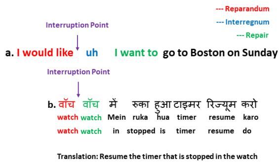
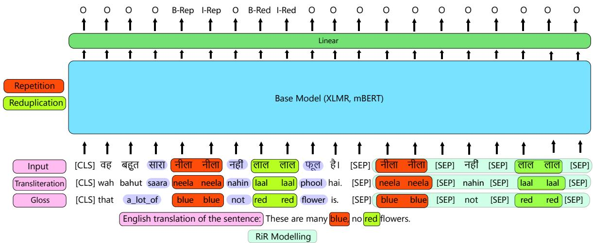
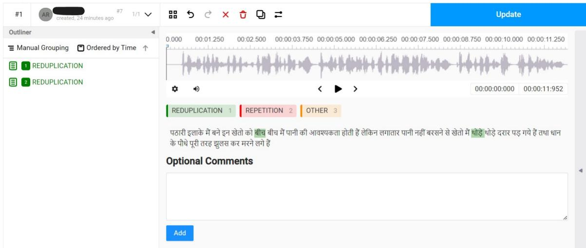
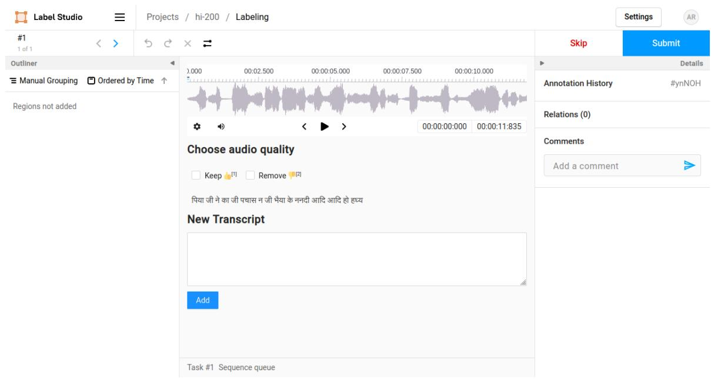

# Looks can be Deceptive: Distinguishing Repetition Disfluency from Reduplication

Arif Ahmad Mothika Gayathri Khyathi Pushpak Bhattacharyya

CFILT, Indian Institute of Technology Bombay

190110010@iitb.ac.in, khyathimothika3@gmail.com, pb@cse.iitb.ac.in

## Abstract

Reduplication and repetition, though similar in form, serve distinct linguistic purposes. Reduplication is a deliberate morphological process used to express grammatical, semantic, or pragmatic nuances, while repetition is often unintentional and indicative of disfluency. This paper presents the first large-scale study of reduplication and repetition in speech using computational linguistics. We introduce IndicRedRep, a new publicly available dataset containing Hindi, Telugu, and Marathi text annotated with reduplication and repetition at the word level. We evaluate transformer-based models for multi-class reduplication and repetition token classification, utilizing the Reparandum-Interregnum-Repair structure to distinguish between the two phenomena. Our models achieve macro F1 scores of up to 85.62% in Hindi, 83.95% in Telugu, and 84.82% in Marathi for reduplication-repetition classification. Our dataset and code are available at: https://github.com/arifahmad-py/ IndicRedRep/

## 1 Introduction

Research shows that speech disfluencies, such as repetitions, can notably increase Word Error Rates (WER) by up to 15% (Goldwater et al., 2008). Addressing these disfluencies in ASR systems can improve performance, as demonstrated by enhancements in Machine Translation (MT) systems’ BLEU scores (Cho et al., 2014). This paper focuses on repetition—a type of disfluency characterized by the unintended recurrence of words or phrases, which typically occurs during moments of cognitive processing, such as recalling a word or structuring a thought (Tree, 1995).

Interestingly, repetition shares structural similarities with reduplication—a deliberate linguistic process used globally to alter word meanings, indicating attributes like plurality or intensity. While both processes involve word duplication, their functions and implications differ significantly, with reduplication playing a grammatical and semantic role in languages and repetition often marking interruptions in speech flow (Newman, 2000; Bauer, 2003; Xu, 2012; Kajitani, 2005).

  
Figure 1: Examples showing the four regions of any disfluency: Reparandum, Interruption Point, Interregnum, and Repair. Not all parts are necessary to be present in every example of a disfluency; as can be seen in Example (b) in the Figure, with no interregnum.

Language Word (Meaning) Reduplicated Word (Meaning)
<table><tr><td>Indonesian/Malay</td><td>orang (person)</td><td>orang-orang (people)</td></tr><tr><td>Tagalog</td><td>bili (buy)</td><td>bili-bili (to buy here and there)</td></tr><tr><td>Tamil</td><td>kaal (leg)</td><td>kaal-kaal (legs)</td></tr><tr><td>Punjabi</td><td>xushii (happy)</td><td>xushii-xushii (happily)</td></tr><tr><td>Mandarin Chinese</td><td> (mā, mother)</td><td> (māma, mommy)</td></tr><tr><td>Hawaiian</td><td>wiki (quick)</td><td>wiki-wiki (very quick)</td></tr><tr><td>Samoan</td><td>pili (cling)</td><td>pili-pili (to cling repeatedly)</td></tr><tr><td>Turkish</td><td>ev (house)</td><td>ev-ev (every house)</td></tr></table>

Table 1: Examples of Morphological Reduplication in Various Languages Demonstrating Pluralization, Intensification, and Other Grammatical or Semantic Changes

Existing research indicates that disfluencies, including reduplication and repetition, can constitute up to 5.9% of words in spontaneous speech, with repetitions accounting for over half of these disfluencies (Godfrey et al., 1992; Shriberg, 1996). IndicRedRep aims to facilitate the development of models capable of distinguishing between reduplication and repetition, treating it as a sequence la-

beling problem.

The contributions of this work are summarized below:

• Creation of “IndicRedRep,” a novel dataset released publicly that includes over 4.5K Hindi, 1.6K Telugu, and 1.6K Marathi sentences, all annotated with labels for reduplication and repetition. This is the first dataset ofits kind to offer token-level annotations for these features in any language (Section 4).

• Propose a novel methodology using the Reparandum-Interregnum-Repair (RiR) structure, which improves the macro F1 score by 3% across all the three languages. This improvement is supported by an empirical evaluation of both classical sequence labeling models and transformer-based models for token-level classification tasks. (Section 7).

• Detailed linguistic analysis of the dataset across three languages—Hindi, Telugu, and Marathi—to understand the unique challenges and behaviors of models when dealing with different linguistic contexts (Section 7.3).

We model the problem as a sequence tagging task, which allows direct and explicit word-level tagging of disfluencies. The input is the speech transcript in text form, and the output is BIO labels for reduplication and repetition.

## 2 Background and Definitions

In this section, we define reduplication and repetition, discussing their roles in language and speech. Understanding these definitions is essential for recognizing the differences between these two linguistic phenomena, which is a key focus of this study.

## 2.1 Reduplication.

Reduplication is a morphological process in which a part or the entirety of a word’s phonological material is systematically repeated, carrying semantic or grammatical significance. This mechanism is prevalent across numerous global languages, serving diverse linguistic purposes including (plurality, distribution, intensity, aspect (continued or repeated occurrence), reciprocity and more. (Rubino, 2005; Spaelti, 1997).

Examples of complete reduplication in sentences:

3TT40hT बहुत बहुत शुिक्रया   
1. aapka bohot bohot shukriya   
Your very very thanks   
Translation from Hindi: Thank you very much.

जल्दी जल्दी काम खतम करो   
2. jaldi jaldi kaam khatam karo   
quickly quickly work finish do   
Translation from Hindi: Finish your work quickly.

కిȨకెట్‍ ఆడి ఆడి ఆయాసం అనిపిసుత్ ంది   
3. cricket aadi aadi aayasam anipisthundi   
cricket play play tiredness feeling   
Translation from Telugu: I feel tired after playing   
cricket.

िक्रके ट खेळतखेळत थकलो   
4. cricket khelt khelt thaklo   
cricket play play tired   
Translation from Marathi: I’m tired after playing   
cricket.

In these examples, the complete repetition of the base word adds emphasis and intensity to the action or state described, enhancing the overall meaning of the sentences.

In this study, we focus only on full or total reduplication, as this is the case that is confused with repetition. So, from here on whenever we discuss about reduplication, it will mean full reduplication.

## 2.2 Repetition

Repetition is a type of Speech Disfluency. Speech Disfluencies are geneally defined as phenomena that interrupt the flow of speech and do not add propositional content to an utterance. Repetition, refers to the unintentional recurrence of whole words, phrases, or segments during spontaneous speech. This form of disfluency often occurs when speakers are trying to recall a word, grappling with a complex thought, or deciding how to phrase something (Tree, 1995).

Examples of word repetition disfluencies:

घर जा रहा हूँ।   
1. mai mai ghar ja raha hoon   
I I home am going   
Translation from Hindi: I-I am going home.   
वह मेरा दोस्त दोस्त है।   
2. vah mera dost dost hai   
He my friend friend is   
Translation from Hindi: He is my friend friend.

In these examples, the repetition of the word does not hold any semantic meaning. Thus examples here are considered an error and hence classified as repetition, unlike examples from Section 3.1.

## 3 Related Work

Reduplication and repetition are well-studied phenomena in the domains of morphology and speech disfluencies, respectively.

## 3.1 Reduplication as Multiword Expression

Multiword expressions (MWEs) are a cornerstone of linguistic studies and pose significant challenges in natural language processing (NLP) due to their complex, non-compositional nature. Recent research highlights a framework for integrating MWE processing into NLP systems to improve linguistic understanding (Baldwin and Kim, 2010; Sag et al., 2002).

Significant efforts have been made to computationally address reduplication across languages such as Bengali, Cantonese, Mandarin Chinese, Indonesian, Sanskrit, Hindi, and Marathi (Chakraborty and Bandyopadhyay, 2010; Lam, 2013; Chen et al., 1992; Mistica et al., 2009; Kulkarni et al., 2012; Singh et al., 2016).

The creation of the RedTyp database marks a significant advancement in the cataloging of reduplicative morphemes, aiding both theoretical and computational studies (Dolatian and Heinz, 2019). While these studies offer significant theoretical insights, no previous work has released a large-scale dataset specifically for the study of reduplication and repetition.

## 3.2 Repetition as Speech Disfluency

Repetition is a well-known speech disfluency often observed in spontaneous and unscripted speech (Shriberg, 1994). It refers to the unintentional recurrence of words, phrases, or sounds, which may occur due to hesitations, corrections, or cognitive processing.

It is tackled using various computational techniques aimed at enhancing speech recognition and processing. These techniques include Sequence Tagging, Parsing-based, and Noisy Channel models, each leveraging different aspects of machine learning and syntactic analysis (Liu et al., 2006; Georgila et al., 2010; Ostendorf and Hahn, 2013; Zayats et al., 2016, 2014; Ferguson et al., 2015; Wang et al., 2018, 2020) Inspired from these works, we move forward with sequence tagging based modeling as this approach has its merits of allowing direct and explicit tagging of disfluencies at the word level, which enables fine-grained detection and classification, critical for developing robust speech recognition systems.

## 4 IndicRedRep Dataset

This section discusses the formation of the IndicRedRep dataset, which includes data collection, annotation, and key statistics across three Indic languages: Hindi, Marathi, and Telugu, focusing on token-level labels for reduplication and repetition. Hindi resources are more plentiful, necessitating different collection strategies compared to Marathi and Telugu.

## 4.1 Data Collection

To the best ofour knowledge, there currently exists no dataset explicitly annotated for both reduplication and repetition. We employed the GramVaani (GV) corpus<sup>1</sup>, a spontaneous telephone speech corpus in Hindi, to establish the Hindi subset ofthe dataset, addressing the lack of datasets annotated for reduplication and repetition (Deekshitha et al., 2022). For Marathi and Telugu, similar datasets are absent, hence we extrapolated from the Hindi data using the Gemma Instruction Tuned models (Team et al., 2024) for sentence generation and engaged annotators who are native speakers ofthe respective languages for manual creation of test sets.

It was important to use a dataset containing spontaneous speech rather than read speech, as disfluencies are more commonly observed in spontaneous speech. However, in datasets such as the Shrutilipi corpus (Bhogale et al., 2023), Indian Language Corpora (Abraham et al., 2020), and Mozilla Common Voice (Ardila et al., 2020), which predominantly feature read speech, the majority of word duplications are the result of either reduplication or transcription errors. True instances of repetition were significantly rarer in these sources.

## 4.2 Annotation and Quality Control Process

The collected data was annotated by three trained linguists in Hindi, who observed significant errors and poor quality in the transcripts of the Gram-Vaani (GV) corpus. To address these issues, the annotation process was conducted in two stages: first, correcting the speech transcripts, and then labeling the tokens as reduplication, repetition, or other.

The annotation and quality control process involved the following key steps:

• Filtering the Corpus: The GV corpus, consisting of 39.8K Hindi audio-transcript pairs, was filtered down to 5.3K prospective pairs likely containing reduplication or repetition. This filtering was based on adjacent word duplication as a heuristic.

• Manual Annotation: The filtered sentences contained many transcription errors. Therefore, three trained Hindi linguists manually annotated the data to correct these errors, further filtering out sentences without reduplication or repetition. They marked spans with reduplication and repetition, resulting in a well-annotated subset of 4.5K sentences in Hindi. The annotation guidelines are detailed in Appendix B, and the annotation interface is depicted in Figure 3.

• Translation and Cross-Language Annotation: Using the annotated Hindi sentences, translations were generated into Telugu and Marathi using Gemma Instruction Tuned models (Team et al., 2024). Since this translated data was synthetic, it underwent a secondary filtering and correction process by two native speakers of each language, respectively. This resulted in a high-quality dataset of 1.5K sentences in each language, with reduplication and repetition spans marked.

• Language Selection and Constraints: The decision to focus on Hindi, Marathi, and Telugu was driven by the availability of language expertise. We hope that future work will build upon our efforts to expand the dataset to additional languages and explore new modeling approaches.

Annotation guidelines, based on existing works (Murthy et al., 2022), are provided in Appendix B. To ensure annotation consistency, we assessed interannotator agreement using Fleiss’ kappa, achieving a substantial agreement level of 83.29%. Quality control was maintained through independent re-annotation and resolution of discrepancies during regular meetings (Sabou et al., 2014). Details of the Gemma prompting process used for generating Marathi and Telugu sentences are included in Appendix E. Follow up filtering and annotation instructions are same as those for Hindi language.

## 4.3 Data Splits

The data was divided into training, validation, and test sets following the standard 80:10:10 ratio. The splits were stratified to ensure that the distribution of reduplication and repetition instances was similar across all subsets as can be seen in Table 3.

## 4.4 Dataset Statistics

The GramVaani corpus, inherently rich in colloquial expressions and spontaneous speech patterns, provided an ideal foundation for our specific annotations. Table 2 shows the number ofsentences and words, across each split in the dataset. As showcased in Table 3, our annotated dataset comprises of labels: reduplication, repetition and other. The presence of 3,263 instances of repetition and 2,340 ofreduplication underscores the diversity and richness of this corpus in capturing these linguistic phenomena.

<table><tr><td rowspan=1 colspan=1>Language</td><td rowspan=1 colspan=1>Data Splits</td><td rowspan=1 colspan=1>#sentences</td><td rowspan=1 colspan=1>#words</td><td rowspan=1 colspan=1>Split Size</td></tr><tr><td rowspan=3 colspan=1>Hindi</td><td rowspan=1 colspan=1>Training</td><td rowspan=1 colspan=1>3622</td><td rowspan=1 colspan=1>103602</td><td rowspan=1 colspan=1>80%</td></tr><tr><td rowspan=1 colspan=1>Validation</td><td rowspan=1 colspan=1>453</td><td rowspan=1 colspan=1>12950</td><td rowspan=1 colspan=1>10%</td></tr><tr><td rowspan=1 colspan=1>Test</td><td rowspan=1 colspan=1>453</td><td rowspan=1 colspan=1>12950</td><td rowspan=1 colspan=1>10%</td></tr><tr><td rowspan=3 colspan=1>Telugu</td><td rowspan=1 colspan=1>Training</td><td rowspan=1 colspan=1>1289</td><td rowspan=1 colspan=1>36860</td><td rowspan=1 colspan=1>80%</td></tr><tr><td rowspan=1 colspan=1>Validation</td><td rowspan=1 colspan=1>161</td><td rowspan=1 colspan=1>4608</td><td rowspan=1 colspan=1>10%</td></tr><tr><td rowspan=1 colspan=1>Test</td><td rowspan=1 colspan=1>161</td><td rowspan=1 colspan=1>4608</td><td rowspan=1 colspan=1>10%</td></tr><tr><td rowspan=3 colspan=1>Marathi</td><td rowspan=1 colspan=1>Training</td><td rowspan=1 colspan=1>1322</td><td rowspan=1 colspan=1>37822</td><td rowspan=1 colspan=1>80%</td></tr><tr><td rowspan=1 colspan=1>Validation</td><td rowspan=1 colspan=1>165</td><td rowspan=1 colspan=1>4728</td><td rowspan=1 colspan=1>10%</td></tr><tr><td rowspan=1 colspan=1>Test</td><td rowspan=1 colspan=1>165</td><td rowspan=1 colspan=1>4728</td><td rowspan=1 colspan=1>10%</td></tr></table>

Table 2: Dataset statistics across three languages for a token classification task

<table><tr><td></td><td>Training</td><td>Validation</td><td>Test</td><td>Total</td></tr><tr><td>repetition</td><td>2598</td><td>335</td><td>330</td><td>3263</td></tr><tr><td>reduplication</td><td>1875</td><td>230</td><td>235</td><td>2340</td></tr><tr><td>Total</td><td>4935</td><td>627</td><td>627</td><td>6189</td></tr></table>

Table 3: Number of labels of each type in Training, Validation, Test splits for the IndicRedRep dataset

## 5 Modelling

In this section, we detail our approach to differentiate between reduplication and repetition, with a particular focus on utilizing the Reparandum-Interregnum-Repair (RiR) structure. We believe that by considering the context surrounding the repeated elements, we can disambiguate intricate cases where reduplication and repetition coexist. This is also supported by an analysis of the disfluency structure by Shriberg (1994), which we discuss in detail here.

  
Figure 2: Overview of RiR (Reparandum-Interregnum-Repair) modeling. An end-to-end example showing passing ofadditional tokens, corresponding to: Reparandum, Interregnum, and Repair; seperated by seperator token: [SEP] . Transliteration, gloss, and translation are included for clarity but are not part of the actual input. Tagging follows the BIO scheme: ‘B-Rep’ for ‘B-Repetition’ and ‘B-Red’ for ‘B-Reduplication,’ with similar ‘I-’ tag designations.

## 5.1 RiR Structure

Shriberg (1994) describes the structure ofdisfluencies, to consist of four parts: Redarandum, Interruption Point, Interregnum, and Repair. Figure 1 shows an eaxmple of a disfluency following this structure in English as well as in Hindi. Interruption Point is equivalent to the “moment of interruption” and is not explicity present in the transcript, but is a part of the speech signal. Hence, we don’t capture it in our modelling strategy.

The Reparandum-Interregnum-Repair structure serves as the foundation of our classification methodology. It captures the distinctive patterns associated with reduplication and repetition:

• Reparandum: Reparandum contains those words which are originally not intended to be in the utterance. Thus this section consists of one or more words that will be repeated or corrected (in case of Repetition) or abandoned completely (in case of other types of disfluencies).

• Interregnum: Interregnum consists of an editing term, or a non-lexicalized filler pause like “uh”, “um” or discourse markers like “well”, “you know” or interjections or simply an empty pause, i.e., a short moment of silence.

• Repair: Words from the reparandum are finally corrected, or a completely new sentence is started in the repair section.

Interregnum plays a crucial role in distinguishing the two phenomena, as it often contains disfluent elements or markers. The RiR structure is provided in the training and test corpus using regular expression as mentioned in Appendix D.

## 5.2 Importance of the RiR Structure

Figure 2 illustrates our integration ofthe RiR structure into the classification model. The motivation behind using the RiR structure comes from the linguistic theory on disfluency structures from Shriberg (1994) where it breaks down complex linguistic patterns in disfluencies. This is particularly helpful when both reduplication and repetition coexist within a single sentence. The figure demonstrates how our model processes input sequences by breaking them down into Reparandum, Interregnum, and Repair components. This structured approach allows the model to differentiate between subtle linguistic nuances, improving the accuracy ofclassification. In the provided figure, we see a detailed example where additional tokens are passed through the model, corresponding to each component of the RiR structure.

The notation below is commonly used to represent the structure of a disfluency:

$$
\left. \int r e p a r a n d u m + \right. \left\{ i n t e r r e g n u m \right\} \ : r e p a i r \ : J
$$

The square brackets denote the entire disfluency structure, the plus sign indicates the sequence of components, and the curly brackets highlight the optional presence of the interregnum within the structure.

Consider the example sentence from Figure 2:

वह बहुत सारा [नीला नीला + { नहीं } लाल लाल ] फू ल है।

vah bahut saara [neela neela + nahi laal laal] phool hai.

That a\_lot\_of [blue blue + not red red] flower is.

Translation: These are many blue, no many red flowers.

In this example, we retain the disfluency in the original sentence in the English translation as well. In this example, “नीला नीला'” (neela neela) represents repetition, where the word “नीला” (blue) is repeated as a speech disfluency. On the other hand, “लाल लाल” (laal laal) is a case of reduplication, where the word “लाल” (red) is repeated in a pattern that is commonly used in certain languages to indicate plurality or intensity. It is interesting to note that indian language reduplication phenomena appears as plurality in English. The simultaneous occurrence of both repetition and reduplication in a sentence creates ambiguity, which the RiR structure effectively resolves.

## 5.3 Modeling Approach

To use the RiR structure, our feature extraction process involved capturing information from the Reparandum, Interregnum, and Repair segments. To do so, we provide the model separate features using regular expression, the words surrounding the repeated words. These are highlighted in green, in the example in Section 5.2. This helps especially in intricate cases, where both phenomena overlap as in the above example.

This approach is highly motivated by linguistics and disfluency theory, recognizing the importance of these structural components in language processing. Importantly, the explicit modeling of the RiR structure addresses gaps in previous works that did not adequately account for the nuanced differences between repetition and reduplication. It allows the model to detect subtle differences in how repetition and reduplication manifest, particularly when both occur in close proximity. By leveraging this structure, our model not only improves classification accuracy but also offers a more comprehensive understanding of these linguistic phenomena, particularly in complex scenarios where both repetition and reduplication overlap. This makes our method both innovative and theoretically grounded, contributing significantly to the field of computational linguistics. In Section 7.3 we discuss this in more detail along with qualitative examples.

## 6 Experimental Setup

This section details the methodology adopted to distinguish between reduplication, repetition, and other phenomena in speech transcripts.

## 6.1 Data Processing

Speech transcripts were preprocessed by removing punctuation to ensure consistency in the dataset. This step also made the task more challenging and realistic.

## 6.2 Baseline Models

We evaluated two baseline models: Logistic Regression for linear separability and BiLSTM-CRF for handling sequential dependencies, both commonly used in NLP sequence labeling tasks. (Huang et al., 2015).

## 6.3 Transformer-Based Models

Further, we used the bert-base-multilingual, XLMR models, mT0, BloomZ, Gemma and Chat-GPT models with and without RiR, to evaluate their performance and the possible advantages of the RiR structure.

## 6.4 Training and Finetuning Setup

Models were trained using a batch size of 8 for a maximum of 5 epochs. The AdamW optimizer was used with a learning rate of 1e-5. Models were fine-tuned on a dataset specific to reduplication and repetition.

## 7 Results and Analysis

In this section, we thoroughly analyse all experiments on reduplication-repetition classification. Results for all the models across the three languages, fine-tuned on the IndicRedRep dataset, are shown in Table 4. For a more detailed examination of the language-wise results, readers can refer to Appendix A. This section also discusses some qualitative examples across languages as given in Table 5, providing interesting insights of confusion cases, and our analysis of how RiR modelling helps in resolving these cases.

To evaluate the performance of all models used in our experiments, we use precision, recall, and F1 score; metrics that are commonly used across classification tasks in natural language processing (Manning and Schutze, 1999; Jurafsky, 2000). These metrics have also been used in previous related works focusing on disfluency detection and similar tasks (Jamshid Lou and Johnson, 2017; Passali et al., 2022).

<table><tr><td rowspan="2">Model</td><td colspan="3">Hindi</td><td colspan="3">Telugu</td><td colspan="3">Marathi</td><td rowspan="2">avg. F1</td></tr><tr><td>R</td><td></td><td></td><td>P</td><td></td><td>F1</td><td>P</td><td>R</td><td>F1</td></tr><tr><td colspan="10">Baseline Models</td></tr><tr><td>Logistic Regression</td><td>29.76</td><td>18.20</td><td>22.59</td><td>28.82</td><td>14.95</td><td>19.69</td><td>24.52</td><td>18.39</td><td>21.02</td><td>21.10</td></tr><tr><td>BiLSTM-CRF</td><td>52.51</td><td>58.10</td><td>55.16</td><td>53.67</td><td>47.54</td><td>50.42</td><td>61.44</td><td>45.28</td><td>52.14</td><td>52.57</td></tr><tr><td>BiLSTM-CRF + RiR</td><td>56.78</td><td>60.32</td><td>58.50</td><td>55.92</td><td>50.70</td><td>53.20</td><td>64.10</td><td>48.95</td><td>55.44</td><td>55.71↑</td></tr><tr><td colspan="10">Comparison of multilingual transformer model performance with and without RiR structure</td></tr><tr><td>bert-base-multilingual</td><td>81.30</td><td>75.57</td><td>78.33</td><td>76.08</td><td>75.74</td><td>75.91</td><td>77.54</td><td>76.75</td><td>77.14</td><td>77.13</td></tr><tr><td>bert-base-multilingual + RiR</td><td>84.24</td><td>77.52</td><td>80.74</td><td>82.45</td><td>74.88</td><td>78.48</td><td>85.47</td><td>74.80</td><td>79.78</td><td>79.67↑</td></tr><tr><td>XLMR-base</td><td>85.18</td><td>80.30</td><td>82.67</td><td>84.16</td><td>75.19</td><td>79.42</td><td>89.67</td><td>74.27</td><td>81.25</td><td>81.11</td></tr><tr><td>XLMR-base + RiR</td><td>95.41</td><td>74.06</td><td>83.39</td><td>86.12</td><td>75.60</td><td>80.52</td><td>93.04</td><td>73.12</td><td>81.89</td><td>81.93 ↑</td></tr><tr><td>XLMR-large</td><td>84.44</td><td>86.32</td><td>85.37</td><td>94.44</td><td>75.19</td><td>83.72</td><td>88.92</td><td>80.51</td><td>84.51</td><td>84.53</td></tr><tr><td>XLMR-large + RiR</td><td>89.33</td><td>82.21</td><td>85.62</td><td>89.60</td><td>78.97</td><td>83.95</td><td>85.49</td><td>84.16</td><td>84.82</td><td>84.80↑</td></tr><tr><td>mT0 mT0 + RiR</td><td>86.10</td><td>81.20</td><td>83.59</td><td>85.02</td><td>76.50</td><td>80.51 82.19</td><td>90.20</td><td>75.15</td><td>82.01</td><td>82.04</td></tr><tr><td></td><td>88.45</td><td>83.22</td><td>85.75</td><td>87.11</td><td>77.85</td><td></td><td>92.02</td><td>76.50</td><td>83.84</td><td>83.93 ↑</td></tr><tr><td>BloomZ BloomZ + RiR</td><td>88.55 90.22</td><td>83.60</td><td>86.00</td><td>87.50 89.14</td><td>78.10 79.30</td><td>82.55 83.94</td><td>92.50 94.00</td><td>76.85 78.10</td><td>84.00</td><td>84.18</td></tr><tr><td></td><td></td><td>84.80</td><td>87.44</td><td></td><td></td><td></td><td></td><td></td><td>85.57</td><td>85.65↑</td></tr><tr><td>Gemma Gemma + RiR</td><td>90.60 92.18</td><td>85.20</td><td>87.82</td><td>89.80 91.00</td><td>79.75 80.80</td><td>84.47 85.64</td><td>94.30 95.60</td><td>78.50 79.70</td><td>85.98</td><td>86.09</td></tr><tr><td></td><td></td><td>86.40</td><td>89.15</td><td></td><td></td><td></td><td></td><td></td><td>87.07</td><td>87.28↑</td></tr><tr><td>ChatGPT (gpt-3.5-turbo) ChatGPT (gpt-3.5-turbo) + RiR</td><td>92.50 94.00</td><td>87.10 88.20</td><td>89.73 90.97</td><td>91.50 93.00</td><td>81.50 82.40</td><td>86.19 87.34</td><td>95.80 97.00</td><td>80.00 81.30</td><td>87.63 88.82</td><td>87.85 89.04↑</td></tr></table>

Table 4: Complete results across languages for baseline models and RiR models. Precision (P), Recall (R) and F1- score (F1) for reduplication, repetition, and other predictions at word level, including the Overall macro F1-score averaged over 5 runs are mentioned. The best results are in bold. Language-wise detailed breakdown of the results is provided in Appendix A.
<table><tr><td>Lang</td><td>Type of Error</td><td>Sentence</td><td>Transliteration</td><td>Gloss</td><td>Translation</td><td>Prediction</td><td>Comments</td></tr><tr><td>Hi</td><td>Reduplication</td><td>平市 R H</td><td>Ko ghar ghar ye sevā pahunchē to iske mādhyam se main ye batānā chāhtā hūn ki hāmare jo Jharkhand Jharkhand</td><td>To home home this service reaches so through this I want to convey that our Jharkhand Jharkhand</td><td>When this service reaches each home, I want to convey through this that our Jhark- hand, Jharkhand...</td><td>平 RSHE</td><td>(ghar, &#x27;house&#x27;) is an exam- ple of reduplication class, but is confused with repetition.</td></tr><tr><td>Hi</td><td>Repetition</td><td>R可3对可</td><td>Yah hamāre samāj ke liye nahīn balki prāchīn samay samay se hī hamārā samāj jūjh rahā hai agar hamāre samāj mein kahīn bhī koī gharelū hisā hotī hai to iskā shikār</td><td>This is not for our society but from ancient time time since only our society struggling is if our society in anywhere any domestic violence happens is</td><td>This is not for our society but from ancient times our society has been struggling, if there is any domestic violence any- where in our society, then it is the women who are the vic-</td><td>RR</td><td>(samay, &#x27;time&#x27;) is is an example of repetition, but in- correctly predicted as redupli- cation.</td></tr></table>

Table 5: Inference examples from RiR models for cases where the baseline model XLMR-base failed, but XLMRbase + RiR predicted correctly. Language codes are Hi for Hindi. In the prediction column, the black-colored text stands for the $\mathbf { \bar { \Psi } O } _ { } ^ { \ast }$ (no label) class, while blue-colored text stands for reduplication class prediction, and red color stands for repetition class prediction. Words that are potential candidates for reduplication or repetition are highlighted in green in the Sentence, Transliteration, and Gloss columns for easier readability. Further examples in all three languages are given in Appendix C, Table 9

## 7.1 Baseline Models

Results in Table 4 show average F1 scores of 21.10 for Logistic Regression and 52.57 for BiLSTM-CRF, highlighting the latter’s superiority in handling complex linguistic tasks. Analysis across Hindi, Telugu, and Marathi indicated superior performance in Hindi, attributed to better data resources, whereas Telugu and Marathi posed additional challenges due to their linguistic complexities.

## 7.2 Multilingual Transformer Models

We observed that fine-tuning pre-trained models on the IndicRedRep test set, specifically for detecting and identifying reduplication and repetition, yielded significantly higher accuracy compared to baseline Logistic Regression and BiLSTM-CRF models. Incorporating the Reparandum-Interregnum-Repair (RiR) structure into these multilingual transformer models further enhanced their performance, as detailed in Table 4. Specifically, models employing the RiR structure achieved superior results over standard models trained on the same dataset.

Our experiments highlighted a notable increase in performance metrics with the RiR structure. For example, the bert-base-multilingual model saw its average F1 score improve from 77.13% to 79.67% with RiR, and similar enhancements were noted with the XLMR models: the F1 score for the XLMR-base model rose from 81.11% to 81.93%, and for the XLMR-large from 84.53% to 84.80%.

This improvement was not uniform across all languages, reflecting the varied complexities and characteristics of Hindi, Telugu, and Marathi, which underscores the nuanced challenges of language-specific processing in NLP. Further qualitative analysis on the impact of RiR structure integration is elaborated in Section 7.3.

## 7.3 Qualitative Analysis

Table 5 presents a detailed examination of specific inference cases from our model, which was applied to unseen test sentences across Hindi, Telugu, and Marathi. It highlights some consistent misclassifications that are crucial for understanding its limitations and illustrating how RiR modeling contributes to improvement.

For example, in the first row featuring a Hindi reduplication type error, घर (ghar, ’house’) is misclassified as repetition. This error may be due to the model’s oversensitivity to the presence of another repetition instance in the same sentence. A similar pattern of errors is observed in the Telugu and Marathi examples within Table 5. The RiR modeling approach enhances focus on the local context of the word, resulting in correct classification when the XLMR-base + RiR model is employed. The misclassifications in other examples can be explained along similar lines, underscoring the effectiveness ofRiR modeling in improving the accuracy of linguistic phenomenon classification.

## 8 Conclusions and Future Work

Our study introduced and validated a model that employs the Reparandum-Interregnum-Repair (RiR) structure to enhance the classification of linguistic phenomena such as reduplication and repetition in multilingual contexts. Our experiments, as detailed in the table, demonstrated that incorporating the RiR structure consistently improves the performance across multiple languages and multiple model architectures, as evidenced by higher F1 scores when compared to baseline models (without RiR).

The RiR structure’s utility in distinguishing complex linguistic patterns is particularly notable. This approach provided clear benefits over traditional models like Logistic Regression and BiLSTM-CRF, and even showed marked improvement over advanced models like the multilingual BERT and XLMR in their standard configurations. The most significant improvements were observed with the XLMR-large + RiR model, highlighting the effectiveness of integrating structural linguistic insights into sophisticated neural architectures for NLP tasks. With the ongoing development of large-scale language models like ChatGPT-4.0 and beyond, future systems could incorporate interactive refinement of RiR structures.

Future research should expand our approach to include more languages, especially those underrepresented in NLP, and explore additional linguistic structures beyond the RiR to enhance understanding of language processing.

## 9 Limitations

Given the complexities of disambiguating reduplication and repetition in different languages, our study, while rigorous, presents limitations that are acknowledged below:

• Generalization across Languages: Our experiments were limited to three languages: Hindi, Telugu, and Marathi. We restrict ourselves to these languages due to well established linguistic expertise in these languages required for our task. Future studies should explore the application of the RiR structure in a broader linguistic context to verify its effectiveness across a wider array of language families.

• Other Subword Representations: Our study focused exclusively on transformerbased models (BERT and XLMR) with the addition of the RiR structure. We did not include other potent subword representations like ELMo (Peters et al., 1802) and contextual string embeddings (Akbik et al., 2018), which might offer different advantages in handling complex language phenomena. The lack of availability of these models in multiple languages restricted their inclusion in our study.

To address these limitations, future research should aim to include a more diverse set of languages and linguistic structures. Moreover, experimenting with additional subword representations and extending the RiR framework to accommodate more varied disfluency types could enhance model robustness. An exploration ofthe impacts ofdifferent preprocessing techniques on the model’s ability to recognize and classify speech patterns accurately would also be beneficial.

## Acknowledgements

This annotated corpora has been developed under the Bhashini project funded by Ministry of Electronics and Information Technology (MeitY), Government of India. We thank MeitY for funding this work. We sincerely thank the annotators who helped develop the IndicRedRep corpora.

## References

Basil Abraham, Danish Goel, Divya Siddarth, Kalika Bali, Manu Chopra, Monojit Choudhury, Pratik Joshi, Preethi Jyoti, Sunayana Sitaram, and Vivek Seshadri. 2020. Crowdsourcing speech data for low-resource languages from low-income workers. In Proceedings of the Twelfth Language Resources and Evaluation Conference, pages 2819–2826, Marseille, France. European Language Resources Association.

Alan Akbik, Duncan Blythe, and Roland Vollgraf. 2018. Contextual string embeddings for sequence labeling. In Proceedings ofthe 27th international conference on computational linguistics, pages 1638–1649.

Rosana Ardila, Megan Branson, Kelly Davis, Michael Kohler, Josh Meyer, Michael Henretty, Reuben Morais, Lindsay Saunders, Francis Tyers, and Gregor Weber. 2020. Common voice: A massivelymultilingual speech corpus. In Proceedings of the Twelfth Language Resources and Evaluation Conference, pages 4218–4222, Marseille, France. European Language Resources Association.

Timothy Baldwin and Su Nam Kim. 2010. Multiword expressions. Handbook of natural language processing, 2:267–292.

L. Bauer. 2003. Introducing Linguistic Morphology. Introducing Linguistic Morphology. Edinburgh University Press.

Kaushal Bhogale, Abhigyan Raman, Tahir Javed, Sumanth Doddapaneni, Anoop Kunchukuttan, Pratyush Kumar, and Mitesh M. Khapra. 2023. Effectiveness of mining audio and text pairs from public data for improving asr systems for lowresource languages. In ICASSP 2023 - 2023 IEEE International Conference on Acoustics, Speech and Signal Processing (ICASSP), pages 1–5.

Tanmoy Chakraborty and Sivaji Bandyopadhyay. 2010. Identification of reduplication in bengali corpus and their semantic analysis: A rule based approach. In

Proceedings ofthe 2010 Workshop on Multiword Expressions: from Theory to Applications, pages 73– 76.

Feng-yi Chen, Ruo-ping Mo, Chu-Ren Huang, and Keh-Jiann Chen. 1992. Reduplication in mandarin chinese: Their formation rules, syntactic behavior and icg representation. In Proceedings ofrocling v computational linguistics conference v, pages 217–233.

Eunah Cho, Jan Niehues, and Alex Waibel. 2014. Tight integration of speech disfluency removal into SMT. In Proceedings ofthe 14th Conference ofthe European Chapter ofthe Associationfor Computational Linguistics, volume 2: Short Papers, pages 43– 47, Gothenburg, Sweden. Association for Computational Linguistics.

G Deekshitha, A Singh, et al. 2022. Gram vaani asr challenge on spontaneous telephone speech recordings in regional variations of hindi. In Proceedings of the Annual Conference of the International Speech Communication Association, INTERSPEECH, volume 2022, pages 3548–3552. International Speech Communication Association.

Hossep Dolatian and Jeffrey Heinz. 2019. Redtyp: A database of reduplication with computational models. Societyfor Computation in Linguistics, 2(1).

James Ferguson, Greg Durrett, and Dan Klein. 2015. Disfluency detection with a semi-Markov model and prosodic features. In Proceedings ofthe 2015 Conference ofthe North American Chapter ofthe Associationfor Computational Linguistics: Human Language Technologies, pages 257–262, Denver, Colorado. Association for Computational Linguistics.

Kallirroi Georgila, Ning Wang, and Jonathan Gratch. 2010. Cross-domain speech disfluency detection. In Proceedings of the SIGDIAL 2010 Conference, pages 237–240, Tokyo, Japan. Association for Computational Linguistics.

John J Godfrey, Edward C Holliman, and Jane Mc-Daniel. 1992. Switchboard: Telephone speech corpus for research and development. In Acoustics, speech, and signal processing, ieee international conference on, volume 1, pages 517–520. IEEE Computer Society.

Sharon Goldwater, Dan Jurafsky, and Christopher D. Manning. 2008. Which words are hard to recognize? prosodic, lexical, and disfluency factors that increase ASR error rates. In Proceedings ofACL-08: HLT, pages 380–388, Columbus, Ohio. Association for Computational Linguistics.

Zhiheng Huang, Wei Xu, and Kai Yu. 2015. Bidirectional lstm-crf models for sequence tagging. arXiv preprint arXiv:1508.01991.

Paria Jamshid Lou and Mark Johnson. 2017. Disfluency detection using a noisy channel model and a deep neural language model. In Proceedings ofthe

55th Annual Meeting ofthe Associationfor Computational Linguistics (Volume 2: Short Papers), pages 547–553, Vancouver, Canada. Association for Computational Linguistics.

Dan Jurafsky. 2000. Speech & language processing. Pearson Education India.

Motomi Kajitani. 2005. Semantic properties of reduplication among the world’s languages. In Proceedings of the Workshop in General Linguistics.

Amba Kulkarni, Soma Paul, Malhar Kulkarni, Anil Kumar Nelakanti, and Nitesh Surtani. 2012. Semantic processing of compounds in indian languages. In Proceedings of COLING 2012, pages 1489–1502.

Charles Lam. 2013. Reduplication across categories in cantonese. In Proceedings of the 27th Pacific Asia Conference on Language, Information, and Computation (PACLIC 27), pages 277–286.

Yang Liu, Elizabeth Shriberg, Andreas Stolcke, Dustin Hillard, Mari Ostendorf, and Mary Harper. 2006. Enriching speech recognition with automatic detection of sentence boundaries and disfluencies. IEEE Transactions on audio, speech, and language processing, 14(5):1526–1540.

Christopher Manning and Hinrich Schutze. 1999. Foundations of statistical natural language processing. MIT press.

Meladel Mistica, I Wayan Arka, Timothy Baldwin, and Avery Andrews. 2009. Double double, morphology and trouble: Looking into reduplication in indonesian. In Proceedings ofthe Australasian Language Technology Association Workshop 2009, pages 44– 52.

Rudra Murthy, Pallab Bhattacharjee, Rahul Sharnagat, Jyotsana Khatri, Diptesh Kanojia, and Pushpak Bhattacharyya. 2022. Hiner: A large hindi named entity recognition dataset. arXiv preprint arXiv:2204.13743.

P. Newman. 2000. The Hausa Language: An Encyclopedic Reference Grammar. Yale language series. Yale University Press.

Mari Ostendorfand Sangyun Hahn. 2013. A sequential repetition model for improved disfluency detection. In Proc. Interspeech 2013, pages 2624–2628.

Tatiana Passali, Thanassis Mavropoulos, Grigorios Tsoumakas, Georgios Meditskos, and Stefanos Vrochidis. 2022. LARD: Large-scale artificial disfluency generation. In Proceedings of the Thirteenth Language Resources and Evaluation Conference, pages 2327–2336, Marseille, France. European Language Resources Association.

Matthew E Peters, Mark Neumann, Mohit Iyyer, Matt Gardner, Christopher Clark, Kenton Lee, and Luke Zettlemoyer. 1802. Deep contextualized word representations. corr abs/1802.05365 (2018). arXiv preprint arXiv:1802.05365, 42.

Carl Rubino. 2005. Reduplication: Form, function and distribution. Studies on reduplication, 28:11–29.

Marta Sabou, Kalina Bontcheva, Leon Derczynski, and Arno Scharl. 2014. Corpus annotation through crowdsourcing: Towards best practice guidelines. In Proceedings of the Ninth International Conference on Language Resources and Evaluation (LREC’14), pages 859–866, Reykjavik, Iceland. European Language Resources Association (ELRA).

Ivan A Sag, Timothy Baldwin, Francis Bond, Ann Copestake, and Dan Flickinger. 2002. Multiword expressions: A pain in the neck for nlp. In Computational Linguistics and Intelligent Text Processing: Third International Conference, CICLing 2002 Mexico City, Mexico, February 17–23, 2002 Proceedings 3, pages 1–15. Springer.

Elizabeth Shriberg. 1996. Disfluencies in switchboard. In Proceedings of international conference on spoken language processing, volume 96, pages 11–14. Citeseer.

Elizabeth Ellen Shriberg. 1994. Preliminaries to a theory ofspeech disfluencies. Ph.D. thesis, Citeseer.

Dhirendra Singh, Sudha Bhingardive, and Pushpak Bhattacharyya. 2016. Multiword expressions dataset for indian languages. In Proceedings of the Tenth International Conference on Language Resources and Evaluation (LREC’16), pages 2331– 2335.

Philip Spaelti. 1997. Dimensions of variation in multipattern reduplication. Ph.D. thesis.

Gemma Team, Thomas Mesnard, Cassidy Hardin, Robert Dadashi, Surya Bhupatiraju, Shreya Pathak, Laurent Sifre, Morgane Rivière, Mihir Sanjay Kale, Juliette Love, et al. 2024. Gemma: Open models based on gemini research and technology. arXiv preprint arXiv:2403.08295.

Jean E Fox Tree. 1995. The effects of false starts and repetitions on the processing of subsequent words in spontaneous speech. Journal of memory and language, 34(6):709–738.

Feng Wang, Wei Chen, Zhen Yang, Qianqian Dong, Shuang Xu, and Bo Xu. 2018. Semi-supervised disfluency detection. In Proceedings ofthe 27th International Conference on Computational Linguistics, pages 3529–3538, Santa Fe, New Mexico, USA. Association for Computational Linguistics.

Shaolei Wang, Wangxiang Che, Qi Liu, Pengda Qin, Ting Liu, and William Yang Wang. 2020. Multi-task self-supervised learning for disfluency detection. In Proceedings of the AAAI Conference on Artificial Intelligence, volume 34, pages 9193–9200.

Dan Xu. 2012. Reduplication in languages: A case study of languages of china. Plurality and classifiers across languages in China, pages 43–66.

Vicky Zayats, Mari Ostendorf, and Hannaneh Hajishirzi. 2016. Disfluency Detection Using a Bidirectional LSTM. In Proc. Interspeech 2016, pages 2523–2527.

Victoria Zayats, Mari Ostendorf, and Hannaneh Hajishirzi. 2014. Multi-domain disfluency and repair detection. In INTERSPEECH, pages 2907–2911.

## A Detailed Results

The complete table with the overall results including all models are in Table 4. In this section we expand Table 4 and give label-wise results for each language. Tables 6, 7, 8 contains results for Hindi, Marathi and Telugu respectively.

## B Annotation Guidelines

Thank you for participating in our study, on identifying reduplication and repetition in speech. During this task, you will be presented with an interface (see Fig. 3), which shows you an audio file as well as the corresponding transcript for that audio.

Instructions You need to identify whether a word being repeated in the text transcript is reduplication or repetition. These are defined as below.

Reduplication When we say, reduplication in this study, we mean complete reduplication. Complete reduplication, also known as full reduplication, is a linguistic process in which the entire base word is repeated to create a new word or form. In Hindi, complete reduplication is commonly used to express intensity, repetition, or to emphasize a particular action or state.

Examples of complete reduplication in Hindi sentences:

1. वे रो रहे थे, िचल्ला िचल्ला कर।

Transliteration: Ve ro rahe the, chilla chilla kar.

Gloss: They were crying, scream scream (intensely).

Translation: They were crying loudly, screaming and screaming.

2. उसने धीरे धीरे सबको चुप करा िदया।

Transliteration: Usne dheere dheere sabko chup kara diya.

Gloss: He slowly slowly everyone silent made.

Translation: He gradually silenced everyone.

3. वह िबलकुल िबलकुल सही था।

Transliteration: Vah bilkul bilkul sahi tha. Gloss: He completely completely correct was.

Translation: He was absolutely correct.

In these examples, the complete repetition of the base word adds emphasis and intensity to the action or state described, enhancing the overall meaning of the sentences.

Repetition Repetition is a speech disfluency. Disfluencies are interruptions or disturbances that occur during speech, causing a break in the normal flow of language. Repetition, specifically word repetition, occurs when a speaker repeats a single word one or more times in their speech. This type of disfluency can happen due to hesitation, uncertainty, nervousness, lack of confidence, speech disorders, cognitive processing issues or as a natural part of the speech process.

Examples of word repetition disfluencies in Hindi:

1. मैं मैं घर जा रहा हूँ।

Transliteration: Mai mai ghar ja raha hoon.   
Gloss: I I home going am.

Translation: I I am going home.

2. मैं घर घर जा रहा हूँ।

Transliteration: Mai ghar ghar ja raha hoon.   
Gloss: I home home going am.

Translation: I am going home home.

## Examples where neither Reduplication nor Repetition exists

1. िदलकीबाताें उसे दे रही मातमात से कोईबनेगीनहींबात पलायन छोड़े करें िदल की बात रेकॉडर् बनाया था पलायन ने।

Transliteration: Dil ki baaton use de rahi maat maat se koi banegi nahi baat, palayan chhode karein dil ki baat, record banaya tha palayan ne.

Gloss: Heart’s talks to him giving defeat defeat, no solution will be made, avoidance leave do heart’s talk, record made had avoidance.

Translation: The matters of the heart were defeating him, with no solution in sight; he was urged to stop avoiding the issue and speak his heart, as avoidance had set a record.

<table><tr><td rowspan="2">Model</td><td colspan="3">Reduplication</td><td colspan="3">Repetition</td><td colspan="3">Other</td><td rowspan="2">macro F1</td></tr><tr><td>P</td><td>R</td><td>F1</td><td>P</td><td>F1</td><td></td><td></td><td>R</td><td>F1</td></tr><tr><td colspan="10">Baseline Models</td></tr><tr><td>Logistic Regression</td><td>14.21</td><td>51.36</td><td>22.26</td><td>15.32</td><td>45.51</td><td>22.92</td><td>13.00</td><td>40.00</td><td>20.00</td><td>22.59</td></tr><tr><td>BiLSTM-CRF</td><td>65.41</td><td>51.93</td><td>57.90</td><td>62.14</td><td>45.32</td><td>52.41</td><td>60.00</td><td>42.00</td><td>50.00</td><td>55.16</td></tr><tr><td>BiLSTM-CRF + RiR</td><td>68.23</td><td>55.10</td><td>60.88</td><td>64.79</td><td>48.21</td><td>55.27</td><td>62.15</td><td>44.50</td><td>51.89</td><td>58.50↑</td></tr><tr><td colspan="10">Comparison of multilingual transformer model performance with and without RiR structure</td></tr><tr><td>bert-base-multilingual</td><td>81.64</td><td>86.44</td><td>83.97</td><td>81.84</td><td>83.89</td><td>82.85</td><td>62.09</td><td>76.99</td><td>68.18</td><td>78.33</td></tr><tr><td>bert-base-multilingual + RiR</td><td>83.71</td><td>82.86</td><td>83.27</td><td>86.18</td><td>85.74</td><td>85.96</td><td>69.62</td><td>76.99</td><td>73.00</td><td>80.74↑</td></tr><tr><td>XLMR-base</td><td>80.28</td><td>90.14</td><td>85.00</td><td>83.61</td><td>84.58</td><td>84.09</td><td>77.74</td><td>80.44</td><td>79.05</td><td>82.67</td></tr><tr><td>XLMR-base + RiR</td><td>78.86</td><td>92.96</td><td>85.33</td><td>91.27</td><td>83.37</td><td>87.12</td><td>82.77</td><td>73.91</td><td>77.74</td><td>83.39↑</td></tr><tr><td>XLMR-large</td><td>84.45</td><td>95.42</td><td>89.60</td><td>86.36</td><td>88.92</td><td>87.59</td><td>82.26</td><td>76.09</td><td>78.92</td><td>85.37</td></tr><tr><td>XLMR-large + RiR</td><td>88.54</td><td>89.79</td><td>89.16</td><td>88.48</td><td>92.53</td><td>90.46</td><td>87.52</td><td>69.57</td><td>77.24</td><td>85.62 ↑</td></tr><tr><td>mT0</td><td>86.70</td><td>91.30</td><td>88.93</td><td>85.20</td><td>85.70</td><td>85.45</td><td>74.50</td><td>77.00</td><td>75.73</td><td>83.59</td></tr><tr><td>mT0 + RiR</td><td>88.90</td><td>90.50</td><td>89.69</td><td>87.60</td><td>86.50</td><td>87.04</td><td>78.80</td><td>78.10</td><td>78.45</td><td>85.75↑</td></tr><tr><td>BloomZ BloomZ + RiR</td><td>88.50</td><td>92.00</td><td>90.21</td><td>88.00</td><td>87.90</td><td>87.95</td><td>76.10</td><td>76.00</td><td>76.05</td><td>86.00</td></tr><tr><td></td><td>90.30</td><td>91.80</td><td>91.05</td><td>89.70</td><td>88.90</td><td>89.29</td><td>78.00</td><td>77.20</td><td>77.60</td><td>87.44↑</td></tr><tr><td>Gemma Gemma + RiR</td><td>90.60</td><td>93.10</td><td>91.83</td><td>89.50</td><td>89.00</td><td>89.25</td><td>80.40</td><td>77.30</td><td>78.82</td><td>87.82</td></tr><tr><td></td><td>92.00</td><td>92.50</td><td>92.25</td><td>91.00</td><td>90.20</td><td>90.59</td><td>82.00</td><td>78.30</td><td>80.10</td><td>89.16↑</td></tr><tr><td>ChatGPT (gpt-3.5-turbo) ChatGPT (gpt-3.5-turbo) + RiR</td><td>92.50 94.00</td><td>93.00 92.80</td><td>92.75 93.39</td><td>91.50 93.00</td><td>91.00 92.10</td><td>91.25 92.54</td><td>84.50 85.50</td><td>78.80 79.50</td><td>81.53 82.39</td><td>89.73 90.97↑</td></tr></table>

Table 6: Detailed results for Hindi Language. Precision (P), Recall (R) and F1-score (F1) for reduplication, repetition, and other predictions at word level, including the Overall macro F1-score averaged over 5 runs. Best results are in bold.

## 2. मैं एन सी सी का छात्र हूं।

Transliteration: Main NCC ka chhatra hoon.

Gloss: I NCC’s student am.

Translation: I am a student of NCC.

3. मेरा फोन नंबर है नौ दो एक एक।

Transliteration: Mera phone number hai nau do ek ek.

Gloss: My phone number is nine two one one.

Translation: My phone number is 9211.

4. के िलए आज परीक्षा आयोिजत की गई िजसमें अभ्यर्िथयाें काप्रमाणपत्रवेिरिफके शनिलिखतपरीक्षाएवं साक्षात्कार का आयोजन िकया गया िवद्यालय पिरसर में हीिकयागयाइस आयोजनमें लगभगसाठ अिभयार्िथयाें ने योगदानिकयामैं राजीवकु मारठाकु रग्रामराइसेरपोस्ट वािजपुर िज़ला मुंगेर मुंगेर मोबाइल वाणी से धन्यवाद।

Transliteration: Ke liye aaj pariksha aayojit ki gayi jismein abhyarthiyon ka pramanpatra verification, likhit pariksha evam sakshatkar ka aayojan kiya gaya, vidyalaya parisar mein hi kiya gaya. Is aayojan mein lagbhag saath abhyarthiyon ne yogdan kiya. Main Rajeev Kumar Thakur, gram Raiser, post Wazipur, zila Munger Munger, Mobile Vaani se dhanyavaad.

Gloss: For today exam organized was in which candidates’ certificate verification, written exam and interview organized was, school premises in was done. In this event around sixty candidates contributed. I Rajeev Kumar Thakur, village Raiser, post Wazipur, district Munger Munger, Mobile Vaani from thanks.

Translation: For today, an exam was organized, where candidates’ certificate verification, written exam, and interview were conducted within the school premises. Around sixty candidates participated. I am Rajeev Kumar Thakur from village Raiser, post Wazipur, district Munger Munger, thanks to Mobile Vaani.

Instructions for transcript correction in annotation We need to correct the speech transcripts before labelling them for reduplication and repetition as the speech transcripts have a lot of errors. To do, so we use the interface as shown in Fig. 4.

Please follow the following steps while annotating the data:

• First, copy and paste the text in the box below the title New Transcript

• Next, play the audio and listen to it carefully, while also reading the hindi text.

• – If the hindi text is correct, then submit the simple copy paste of the hindi text as it is, checkbox the Keep button and click on the Submit Button.

<table><tr><td rowspan="2">Model</td><td colspan="3">Reduplication</td><td colspan="3">Repetition</td><td colspan="3">Other</td><td rowspan="2">macro F1</td></tr><tr><td>P</td><td>R</td><td>F1</td><td>P</td><td>F1</td><td></td><td></td><td>R</td><td>F1</td></tr><tr><td colspan="10">Baseline Models</td></tr><tr><td>Logistic Regression</td><td>12.23</td><td>50.41</td><td>20.37</td><td>13.72</td><td>44.67</td><td>20.89</td><td>11.45</td><td>39.56</td><td>17.81</td><td>19.69</td></tr><tr><td>BiLSTM-CRF</td><td>60.58</td><td>50.74</td><td>54.87</td><td>57.42</td><td>43.91</td><td>49.58</td><td>55.17</td><td>40.73</td><td>46.82</td><td>50.42</td></tr><tr><td>BiLSTM-CRF + RiR</td><td>63.12</td><td>53.05</td><td>57.64</td><td>59.89</td><td>46.25</td><td>52.22</td><td>58.00</td><td>42.67</td><td>49.32</td><td>53.20 ↑</td></tr><tr><td colspan="10">Comparison of multilingual transformer model performance with and without RiR structure</td></tr><tr><td>bert-base-multilingual</td><td>77.89</td><td>84.67</td><td>80.43</td><td>77.35</td><td>82.14</td><td>79.92</td><td>60.76</td><td>75.23</td><td>67.39</td><td>75.91</td></tr><tr><td>bert-base-multilingual + RiR</td><td>80.43</td><td>80.55</td><td>80.22</td><td>84.68</td><td>84.32</td><td>84.47</td><td>67.85</td><td>75.04</td><td>70.76</td><td>78.48↑</td></tr><tr><td>XLMR-base</td><td>75.96</td><td>88.45</td><td>80.63</td><td>80.34</td><td>83.27</td><td>81.79</td><td>73.58</td><td>78.39</td><td>75.84</td><td>79.42</td></tr><tr><td>XLMR-base + RiR</td><td>73.81</td><td>91.07</td><td>80.97</td><td>89.24</td><td>82.46</td><td>85.67</td><td>78.14</td><td>72.68</td><td>74.93</td><td>80.52↑</td></tr><tr><td>XLMR-large XLMR-large + RiR</td><td>82.75</td><td>93.39</td><td>87.92</td><td>84.15</td><td>87.04</td><td>85.67 88.99</td><td>80.33 84.29</td><td>74.87 68.74</td><td>77.56</td><td>83.72 83.95↑</td></tr><tr><td></td><td>86.32</td><td>88.67</td><td>87.44</td><td>86.57</td><td>91.48</td><td></td><td></td><td></td><td>75.41</td><td></td></tr><tr><td>mT0 mT0 + RiR</td><td>83.50</td><td>88.50</td><td>85.92</td><td>82.10</td><td>83.90 84.70</td><td>83.00 84.55</td><td>71.20 75.50</td><td>75.30 76.10</td><td>73.20 75.80</td><td>80.51 82.19↑</td></tr><tr><td></td><td>85.80</td><td>88.00</td><td>86.88</td><td>84.40</td><td></td><td></td><td></td><td></td><td></td><td></td></tr><tr><td>BloomZ BloomZ + RiR</td><td>86.00 87.80</td><td>89.50 87.70</td><td>87.71 87.75</td><td>85.50 87.00</td><td>85.00 86.20</td><td>85.25 86.59</td><td>73.80 76.50</td><td>75.40 76.00</td><td>74.59 76.25</td><td>82.55 83.94↑</td></tr><tr><td></td><td></td><td></td><td></td><td></td><td></td><td></td><td></td><td></td><td></td><td></td></tr><tr><td>Gemma Gemma + RiR</td><td>88.00 89.50</td><td>90.00 88.80</td><td>88.99 89.14</td><td>87.30 88.60</td><td>86.70 87.40</td><td>87.00 88.00</td><td>75.60 77.80</td><td>76.50 77.00</td><td>76.05 77.39</td><td>84.47 85.64 ↑</td></tr><tr><td></td><td></td><td></td><td></td><td></td><td></td><td></td><td></td><td></td><td></td><td></td></tr><tr><td>ChatGPT (gpt-3.5-turbo) ChatGPT (gpt-3.5-turbo) + RiR</td><td>91.00 92.50</td><td>90.50 91.20</td><td>90.75 91.84</td><td>89.50 91.00</td><td>88.80 89.60</td><td>89.14 90.29</td><td>82.50 83.50</td><td>76.50 77.20</td><td>79.37 80.22</td><td>86.19 87.34↑</td></tr></table>

Table 7: Detailed results for Telugu Language. Precision (P), Recall (R) and F1-score (F1) for reduplication, repetition, and other predictions at word level, including the Overall macro F1-score averaged over 5 runs. Best results are in bold.

– Else, Correct the words in the box, based on the audio. Make sure to not add any punctuations like (|,-.) and also donot use any numerals in 0-9.

If after correcting the hindi text, you find that reduplication / repetition word is removed, then click on the Remove check box and then on the blue Submit buttion

Else, if there is still reduplication or repetition in the corrected text, click on Keep checkbox and then click on the Blue Submit button.

## C Qualitative analysis

Qualitatibe examples in all three languages are further given in Table 9.

## D Regular Expression for RiR

Below is the regular expression used as a part of pre-processing to identify RiR structure:

([0̆900-0̆97F]+)+(+(arey|matlab|to|nahin|   
[0̆900-0̆97F]+))\*+(?!) [0̆900-0̆97F]+

We use the below function to get the three preprocessed parts from the input sentence for Hindi Language:

```python
import re
def identify_repair_parts_hindi(
, sentence):
pattern = r'([\u0900-\u097F]+)\s
, +\1(\s+(arey|matlab|to|nahin
, |[\u0900-\u097F]+))*\s
, +(?!\1)[\u0900-\u097F]+'
match = re.search(pattern,
, sentence)
if match:
reparandum = match.group(1)
interregnum = match.group(2)
repair = match.group(4)
return reparandum, interregnum,
, repair
else:
return None, None, None
```

This function is explained below:

• ([\u0900-\u097F]+) captures a Hindi word in Devanagari script.

• \s+\1 matches the repetition of that Hindi word.

• (\s+(मतलब|तो|नहीं|[0900-097F]+))\*| matches optional interregnum words or phrases, now including ”” (nahin).

<table><tr><td rowspan="2">Model</td><td colspan="3">Reduplication</td><td colspan="3">Repetition</td><td colspan="3">Other</td><td rowspan="2">macro F1</td></tr><tr><td>P</td><td>R</td><td>F1</td><td>P</td><td></td><td></td><td></td><td>R</td><td>F1</td></tr><tr><td colspan="10">Baseline Models</td></tr><tr><td>Logistic Regression</td><td>13.67</td><td>52.00</td><td>21.58</td><td>14.76</td><td>46.82</td><td>22.45</td><td>12.59</td><td>41.33</td><td>19.04</td><td>21.02</td></tr><tr><td>BiLSTM-CRF</td><td>63.00</td><td>51.75</td><td>56.82</td><td>59.18</td><td>44.90</td><td>51.00</td><td>57.65</td><td>41.58</td><td>48.61</td><td>52.14</td></tr><tr><td>BiLSTM-CRF + RiR</td><td>65.87</td><td>54.10</td><td>59.34</td><td>61.50</td><td>46.70</td><td>53.07</td><td>60.12</td><td>43.00</td><td>50.24</td><td>55.44↑</td></tr><tr><td colspan="10">Comparison of multilingual transformer model performance with and without RiR structure</td></tr><tr><td>bert-base-multilingual</td><td>79.40</td><td>85.23</td><td>82.21</td><td>79.12</td><td>82.78</td><td>80.90</td><td>61.85</td><td>76.46</td><td>68.32</td><td>77.14</td></tr><tr><td>bert-base-multilingual + RiR</td><td>82.05</td><td>81.90</td><td>82.00</td><td>85.53</td><td>84.67</td><td>85.10</td><td>68.73</td><td>75.98</td><td>72.25</td><td>79.78↑</td></tr><tr><td>XLMR-base</td><td>77.89</td><td>89.33</td><td>83.11</td><td>82.25</td><td>84.42</td><td>83.33</td><td>75.58</td><td>79.04</td><td>77.31</td><td>81.25</td></tr><tr><td>XLMR-base + RiR</td><td>75.76</td><td>92.22</td><td>82.99</td><td>90.17</td><td>82.59</td><td>86.28</td><td>79.90</td><td>73.12</td><td>76.41</td><td>81.89↑</td></tr><tr><td>XLMR-large</td><td>83.67</td><td>94.21</td><td>88.69</td><td>85.22</td><td>88.06</td><td>86.63</td><td>81.40</td><td>75.25</td><td>78.22</td><td>84.51</td></tr><tr><td>XLMR-large + RiR</td><td>87.21</td><td>89.58</td><td>88.39</td><td>87.05</td><td>91.97</td><td>89.49</td><td>85.33</td><td>69.38</td><td>76.58</td><td>84.82↑</td></tr><tr><td>mT0</td><td>84.10</td><td>88.00</td><td>86.00</td><td>83.10</td><td>84.00</td><td>83.54</td><td>71.70</td><td>75.00</td><td>73.31</td><td>82.01</td></tr><tr><td>mT0 + RiR</td><td>86.30</td><td>87.60</td><td>86.94</td><td>85.50</td><td>84.70</td><td>85.09</td><td>74.80</td><td>76.20</td><td>75.49</td><td>83.84↑</td></tr><tr><td>BloomZ</td><td>86.50</td><td>89.10</td><td>87.78</td><td>86.00</td><td>85.50</td><td>85.75</td><td>73.90</td><td>75.60</td><td>74.74</td><td>84.00</td></tr><tr><td>BloomZ + RiR</td><td>88.20</td><td>87.90</td><td>88.04</td><td>87.50</td><td>86.40</td><td>86.94</td><td>75.40</td><td>76.20</td><td>75.79</td><td>85.57↑</td></tr><tr><td>Gemma Gemma + RiR</td><td>88.50</td><td>90.30</td><td>89.38</td><td>87.70</td><td>86.90</td><td>87.30</td><td>75.80</td><td>76.40</td><td>76.09</td><td>85.98</td></tr><tr><td></td><td>90.00</td><td>89.50</td><td>89.74</td><td>89.00</td><td>88.10</td><td>88.54</td><td>77.20</td><td>77.30</td><td>77.25</td><td>87.07↑</td></tr><tr><td>ChatGPT (gpt-3.5-turbo) ChatGPT (gpt-3.5-turbo) + RiR</td><td>91.50 93.00</td><td>91.00 90.80</td><td>91.25 91.88</td><td>90.00 91.50</td><td>89.50 90.20</td><td>89.75 90.84</td><td>83.00 84.00</td><td>77.00 78.10</td><td>79.88 80.92</td><td>87.63 88.82↑</td></tr></table>

Table 8: Detailed results for Marathi Language. Precision (P), Recall (R) and F1-score (F1) for reduplication, repetition, and other predictions at word level, including the Overall macro F1-score averaged over 5 runs. Best results are in bold.

• \s+(?!\1)[\u0900-\u097F]+ ensures that the word following the interregnum is different from the reparandum, capturing the repair.

## E LLM Prompting Details

This section provides the details of the prompts used to generate sentences with reduplication and repetition in Marathi and Telugu using the Gemma Instruction Tuned models. The prompts are designed to elicit specific linguistic phenomena from the model, ensuring the generated sentences closely mimic the structures observed in the Hindi subset of the IndicRedRep dataset.

The exact prompts used are listed below in a formatted box to highlight their syntactic structure and key phrases, which can be directly replicated for similar tasks.

### Instruction:   
Reduplication is defined as a word or   
, part of a word is repeated to   
, convey nuances such as emphasis,   
, intensity, plurality, or   
, grammatical aspects.   
Generate examples of natural sentences   
, , that use reduplication. The   
, sentence should be meaningful.

\### \*\*Input:\*\*

\- [Hindi sentence 1 from GV corpuse , here]

\- [Hindi sentence 2 from GV corpuse , here]

  
Figure 3: Interface for adding reduplication and repetition labels

  
Figure 4: Interface for transcript correction of audio files

<table><tr><td>Lang</td><td>Type of Error</td><td>Sentence</td><td>Transliteration</td><td>Gloss</td><td>Translation</td><td>Prediction</td><td>Comments</td></tr><tr><td>Hi</td><td>Reduplication</td><td>平平市 </td><td>Ko ghar ghar ye sevā pahunchē to iske mādhyam se main ye batānā chāhtā hūn ki hāmare jo Jharkhand Jharkhand</td><td>To home home this service reaches so through this I want to convey that our Jharkhand Jharkhand</td><td>When this service reaches each home, I want to convey through this that our Jhark- hand, Jharkhand...</td><td>平平市 SSRE</td><td>(ghar, &#x27;house&#x27;) is an exam- ple of reduplication class, but is confused with repetition.</td></tr><tr><td>Hi</td><td>Repetition</td><td>市 RR研可可</td><td>Yah hamāre samāj ke liye nahīn balki prāchīn samay samay se hī hamārā samāj jūjh rahā hai agar hamāre samāj mein kahīn bhī koī gharelū hisā hotī hai to iskā shikār</td><td>This is not for our society but from ancient time time since only our society struggling is if our society in anywhere any domestic violence happens is then its victim women to only</td><td>This is not for our society but from ancient times our society has been struggling, if there is any domestic violence any- where in our society. then it is the women who are the vic-</td><td>市 R</td><td>(samay, &#x27;time&#x27;) is is an example of repetition, but in- correctly predicted as redupli- cation.</td></tr><tr><td>Te</td><td>Reduplication</td><td>soe soe 230 335os sgate Sgqe</td><td>Marala marala sahāyam chēsinanduku dhanyavādālu dhanyavādālu</td><td>Again again help for given thanks thanks</td><td>Thank you again and again for the help.</td><td>so8e ye 350 335os sgaqc igte</td><td>(marala, ‘again&#x27;) is in- correctly predicted as repeti- tion, while the correct label is reduplication</td></tr><tr><td>Te</td><td>Repetition</td><td>a o    Goo</td><td>Udayam udayam good morn- ing cheppāli endukatē nā nammakamñ pillalu pillalu toli pāthaśāla ille ille untundi</td><td>Morning morning good morn- ing say should because my belief children children first school house house is</td><td>Say good morning every morn- ing because my belief is that children&#x27;s first school is the home, home, and the teacher is the mother.</td><td>oo a0o o 85 woSo q o   </td><td>(ille, &#x27;house&#x27;)is predicted as reduplication by the model, but it is an example of repeti- tion.</td></tr><tr><td>Mr</td><td>Reduplication</td><td> fat at aa ae </td><td>Dūdh vikat asatānā rugnālayāchyā vibhāgāsāthī vegvegaļī vegvegaļī tārīkh tharavalī āhe</td><td>Milk selling while hospital de- partment for different different date fixed is</td><td>Different dates have been set for the hospital&#x27;s department while selling milk.</td><td>.  fat  art at e 3</td><td>ao (vegvegali, differ- ent&#x27;) is an example of redu- plication in Marathi which is incorrectly predicted as repeti- tion.</td></tr><tr><td>Mr</td><td>Repetition</td><td>HR 3   , ERTT.</td><td>Satarā ādi ādi jilhyānmadhūn donaśe donaśe kāryakarte sahbhāgī hotīl, dhanyavād</td><td>Seventeen etc. etc. districts from two hundred two hun- dred workers participate will, thanks.</td><td>From seventeen etc., etc., dis- tricts, two hundred two hun- dred workers will participate, ERT. thank you.</td><td>R3 </td><td>(ādi, so on&#x27;) is an ex- ample of repetition in Marathi, but it is mis-classified as redu- plication.</td></tr></table>

Table 9: Inference examples from RiR models for cases where the baseline model XLMR-base failed, but XLMRbase + RiR predicted correctly. Language codes are Hi-Hindi, Te-Telugu, and Mr-Marathi. In the prediction column, the black-colored text stands for the $\cdot \mathrm { o } ^ { \mathrm { * } }$ (no label) class, while blue-colored text stands for reduplication class prediction, and red color stands for repetition class prediction. Words that are potential candidates for reduplication or repetition are highlighted in green in the Sentence, Transliteration, and Gloss columns for easier readability.