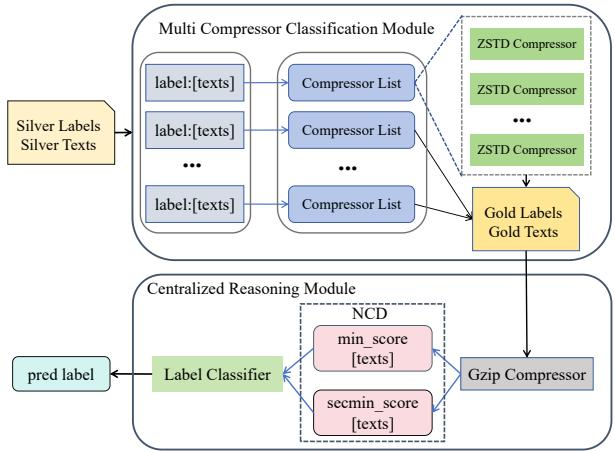
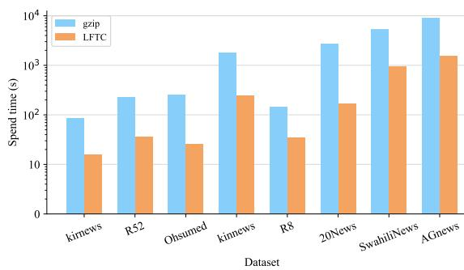
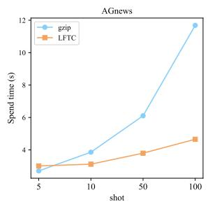
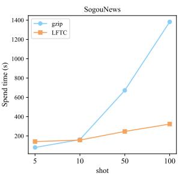

# Low-Resource Fast Text Classification Based on Intra-Class and Inter-Class Distance Calculation

Yanxu Mao1\*, Peipei Liu2,3\*†, Tiehan Cui1, Congying Liu3, Datao You1† 1School of Software, Henan University, China

2Institute of Information Engineering, Chinese Academy of Sciences, China 3University of Chinese Academy of Sciences, China Correspondence: peipliu@yeah.net

## Abstract

In recent years, text classification methods based on neural networks and pre-trained models have gained increasing attention and demonstrated excellent performance. However, these methods still have some limitations in practical applications: (1) They typically focus only on the matching similarity between sentences. However, there exists implicit high-value information both within sentences of the same class and across different classes, which is very crucial for classification tasks. (2) Existing methods such as pre-trained language models and graph-based approaches often consume substantial memory for training and text-graph construction. (3) Although some low-resource methods can achieve good performance, they often suffer from excessively long processing times. To address these challenges, we propose a low-resource and fast text classification model called LFTC. Our approach begins by constructing a compressor list for each class to fully mine the regularity information within intra-class data. We then remove redundant information irrelevant to the target classification to reduce processing time. Finally, we compute the similarity distance between text pairs for classification. We evaluate LFTC on 9 publicly available benchmark datasets, and the results demonstrate significant improvements in performance and processing time, especially under limited computational and data resources, highlighting its superior advantages.

## 1 Introduction

Text classification aims to categorize natural language texts into predefined classes (Minaee et al., 2021), and it is widely used in various fields such as sentiment analysis, topic classification (Yang et al., 2016), and news classification. Currently, deep learning based methods represented by neural networks dominate in text classification tasks (Lin et al., 2021; Li et al., 2022). Existing methods can be divided into two categories (Ding et al., 2020; Lin et al., 2021; Jiang et al., 2023): transductive learning, represented by graph neural networks, and inductive learning, represented by recurrent neural networks and convolutional neural networks. However, transductive learning methods require access to the test dataset during the training phase (Li et al., 2021), which means that when encountering new text data, the existing model needs to be retrained. This limitation reduces the practical applicability of these methods. Therefore, this paper focuses on inductive learning methods for text classification.

Existing text classification models (Lin et al., 2021; Devlin et al., 2019) typically rely on large amounts of labeled data and high-performance computing resources to achieve their superior performance. While these models excel at handling large-scale data, their application in low-resource settings (e.g., when labeled data is scarce or computational power is limited) is constrained (Zhao et al., 2022). In cases of few-shot learning, these neural network-based models exhibit a certain degree of robustness. However, their limited feature representation often falls short of meeting practical application needs. Recently, Jiang et al. (2023) proposed a classification method based on a single compressor, which to some extent alleviates the issues of data scarcity and limited computational resources. Wen and Fang (2023) employed graph-based pre-training and prompts to enhance low-resource text classification. These methods not only achieve efficient classification results on limited datasets but also significantly reduce model complexity and computational costs.

Despite previous research achieving breakthrough results, real-world applications may face significant limitations in terms of speed and resource requirements (Liu et al., 2024; Ding et al., 2020). These methods have the following three main limitations: (1) Existing deep learning methods mainly focus on simple pairwise sentence matching within texts (i.e., inter-sentence relationships). However, in natural language texts, the interactions between sentence pairs are not merely binary as a single sentence may have close connections with many other sentences within the texts. This necessitates greater attention to intra-class regularities and inter-class differences to more effectively complete the classification task. (2) Current methods often have high computational resource requirements. Approaches based on pre-trained language models (Lin et al., 2021) and graph-based methods (Wang et al., 2022) can result in significant memory consumption during training and text word graph construction. (3) Some low-resource methods (i.e., methods with limited data and computational resources (Ding et al., 2020)) still require significant time consumption in pursuit of higher efficiency. The time costs associated with these methods limit their practicality in real-time applications. Therefore, although these methods offer certain solutions in resource-constrained environments, there is still a need to balance efficiency with time consumption in practical applications to enhance their real-world value.

To mitigate the limitations of existing methods, we propose an efficient and rapid text classification approach that does not require a pre-training process and is parameter-free. This approach achieves rapid processing in environments with constrained computational and data resources by optimizing data handling and classification strategies. Specifically, by employing innovative and efficient data structures, we significantly reduce time complexity and computational overhead. Additionally, this approach is adaptable to various text classification tasks without relying on large-scale pre-trained models, thus reducing the complexity of implementation and maintenance. Experiments on multiple benchmark datasets demonstrate that this method enhances classification accuracy while significantly improving processing speed and resource utilization. Our main contributions can be summarized as follows:

• We propose LFTC (Low-Resource Fast Text Classification), which utilizes a text compression method to calculate the compression distance of global and local text information. The approach fully leverages multiple inter-class and intra-class correlations to achieve text

classification tasks.

• LFTC is a lightweight model, especially suitable for scenarios with scarce labeled data and limited computational resources. The model effectively eliminates redundant data irrelevant to predictions, thereby completing text classification tasks in a relatively short time and demonstrating high practicality in realworld applications.

• We conduct extensive experiments on nine benchmark datasets, and our method achieves SOTA scores on multiple datasets among nonpretrained models. The method also significantly outperforms others in few-shot experiments, demonstrating the model’s superiority.

## 2 Related Work

Our research is closely related to text classification methods based on data compression, low-resource, and deep learning. Therefore, we have provided a brief overview of these three methods.

## 2.1 Text Classification Based on Data Compression

This is a relatively uncommon approach, where methods calculate the similarity score between texts based on the compression distance derived from a specific compression technique, thereby accomplishing text classification tasks (Keogh et al., 2004). Initially, Benedetto et al. (2002) proposed a text classification method that combined entropy estimation and the open Gzip compressor with text similarity measurement. Subsequently, Coutinho and Figueiredo (2015) introduced a text classification method based on information-theoretic dissimilarity measures, mapping texts into a feature space defined by these measures to represent dissimilarity. Later, Kasturi and Markov (2022) presented a language-agnostic technique called Zest, which further improved the performance of text classification tasks by simplifying configuration and enhancing text representation, thus avoiding meticulous feature extraction and large models. Recently, Jiang et al. (2023) proposed a single-compressor model called gzip, which combines the open Gzip compressor and a classifier for text classification tasks without any training parameters. However, although existing methods can provide excellent performance, they often require longer processing times.

## 2.2 Low Resource Text Classification

Low-resource text classification refers to the task of classifying text when labeled data (i.e., text samples with classification labels) is extremely limited, and it can also be considered as having limited computational resources. These situations are quite common in practical applications, as collecting large amounts of labeled data is often timeconsuming and computational resources are expensive. Ding et al. (2020) proposed a principled model called Hypergraph Attention Networks, which can achieve greater expressive power with less computational cost, used for text representation learning. In low-resource text classification, the scarcity of labeled data can lead to poor performance in traditional classification models that require large amounts of labeled data for training, and may even result in overfitting issues (Hedderich et al., 2021). Chen et al. (2022) introduced a contrastive learning framework called Contrast-Net, which addresses the issues of discriminative representation and overfitting in text classification by learning to pull together text representations of the same class and push apart those of different classes.

## 2.3 Text Classification Based on Deep Learning

Zhang et al. (2015); Adhikari et al. (2019) utilized CNN convolutional layers to extract local features from text, capturing n-gram features for classification. Wang et al. (2016) proposed an attentionbased LSTM that processes text sequence data and captures long-distance dependencies within the text, demonstrating competitive performance in aspect-level text classification. Subsequently, Devlin et al. (2019) introduced the pre-trained language model BERT, which uses the self-attention mechanism to capture contextual dependencies in text, achieving high performance in text classification. Later, Lin et al. (2021); Sun et al. (2023); Liu et al. (2024) proposed methods that leverage largescale pre-training on massive raw data and jointly learn representations for both labeled training data and unlabeled test data through label propagation using graph convolutional networks (GCNs). However, these methods typically require substantial computational and data resources, making them challenging to apply effectively in low-resource environments.

Compared to the existing methods mentioned above, our method not only improves performance but also reduces time consumption, achieving dual optimization.

  
Figure 1: The overall architecture of LFTC.

## 3 Method

Figure 1 presents the overall framework of our proposed LFTC model, and Algorithm 1 shows the pseudocode corresponding to the model’s execution process (Due to space limitations, we have included it in Appendix A). In this section, we first describe the construction process of the compressor list, followed by a detailed explanation of the two execution modules of LFTC: the Multi Compressor Classification Module and the Centralized Reasoning Module.

## 3.1 Compressor List Construction

Text compression algorithms reduce the storage space of text by removing redundant data. The different compression lengths produced by applying the same compression algorithm to different texts can reflect the varying characteristics of the text content (Kasturi and Markov, 2022). Texts within the same class exhibit more regularity compared to those from different classes (Jiang et al., 2023). Therefore, to better utilize the intra-class information, we find and concatenate the all texts belonging to each class $C _ { i }$ from the training data with m texts $\{ T _ { 1 } , T _ { 2 } , \dots , T _ { m } \}$ $T s _ { C _ { i } } = \{ T _ { 1 _ { C _ { i } } } , T _ { 2 _ { C _ { i } } } , . . . , T _ { l _ { C _ { i } } } \}$ , where $T s _ { C _ { i } }$ represents all the intra-class texts of $C _ { i }$ class.

We divide the data of each class into $N _ { C _ { i } }$ segments based on the given step size S:

$$
N _ { C _ { i } } = \left\lceil \frac { l e n ( T s _ { C _ { i } } ) } { | S | } \right\rceil\tag{1}
$$

For each segment, a compressor is constructed:

$$
Z _ { C _ { i } , N _ { C _ { i } } } = Z s t d \left( T s _ { C _ { i } } \left[ x \cdot S : \left( x + 1 \right) \cdot S \right] \right)\tag{2}
$$

where x is the segment index. Zstd is a high-speed lossless data compression algorithm (Chen et al., 2021).

Suppose the text $T = \{ L _ { 1 } , L _ { 2 } , \ldots , L _ { n } \}$ , where $L _ { n }$ is the n-th substring of the text. A compression dictionary $\mathcal { D }$ is constructed, assigning corresponding labels $p$ to the substrings appearing in the text. Finally, we integrate these compressors built based on intra-class regularities of the same text and obtain a set of compressors corresponding to each class $C _ { i }$ :

$$
Z _ { C _ { i } } = \{ Z _ { C _ { i } , 0 } , Z _ { C _ { i } , 1 } , \ldots , Z _ { C _ { i } , N _ { C _ { i } } - 1 } \} .\tag{3}
$$

## 3.2 Multi Compressor Classification Module

We input the data to be classified, $T _ { C _ { i } }$ , into the constructed compressors. Based on the characteristics of the input data, we use Zstd’s adaptive algorithm to adjust the compression level for optimizing both compression speed and compression ratio. Each text $T _ { C _ { i } }$ is processed through all the compressors corresponding to the each label. The compressors maintain a sliding window $W$ , which is used to store and search for recently seen strings. This allows us to compute the longest matching substring $\mathrm { L } _ { \mathrm { m a x } }$ in the current text $T _ { C _ { i } }$

$$
\operatorname { L } _ { \operatorname* { m a x } } = \operatorname* { m a x } \{ \mathrm { L } : T _ { C _ { i } } [ j : j + W ] = { \mathcal { D } } [ k , k + W ] \}\tag{4}
$$

where $W \in [ 1$ , len $\left( T _ { C _ { i } } \right) ]$ , len(·) calculates the length of the text, $j \in [ 0 , l e n ( T _ { C _ { i } } ) \mathrm { ~ - ~ } W ]$ , k ∈ $[ 1 , j )$ , and L is a substring of the text $T _ { C _ { i } }$

We replace the repeated strings with the corresponding labels $p$ from the compression dictionary D based on the maximum matching substring, thereby reducing the data volume. The replaced string $L _ { \mathrm { d } }$ can be represented as:

$$
L _ { \mathsf { d } } = T _ { C _ { i } } : \mathrm { R e } ( \mathrm { \Delta L _ { \mathrm { \ m a x } } } , p )\tag{5}
$$

During the compression process, entropy coding is used to assign shorter codes to high-probability symbols and longer codes to low-probability symbols, further reducing the data size. The memory size obtained by entropy encoding $T _ { C _ { i } }$ is:

$$
\mathcal { L } e = - \sum _ { d = 1 } ^ { n } P _ { ( L _ { d } ) } \cdot \log _ { 2 } P _ { ( L _ { d } ) }\tag{6}
$$

where n is the number of $T _ { C _ { i } } \mathrm { { ' s } }$ substrings $L _ { d } ,$ and $P _ { ( L _ { d } ) }$ is the probability of occurrence of substring $L _ { d }$

Subsequently, we can calculate the final compression length of the input text $T _ { C _ { i } }$ after dictionary replacement and entropy encoding. The value, defined as the final score of compressor $Z _ { C _ { i } , N _ { C _ { i } } }$ with class $C _ { i } .$ , can be expressed as follows:

$$
S c o r e ( Z _ { C _ { i } , N _ { C _ { i } } } ) = \mathcal { L } e ( T _ { C _ { i } } ) + O ( \mathcal { D } )\tag{7}
$$

where $\mathcal { L } e ( T _ { C _ { i } } )$ is the actual space occupied by the compressed data. And $O ( \mathcal { D } )$ represents the additional memory overhead required for using the compression dictionary, which includes the storage overhead of the dictionary itself and other metadata costs associated with the compression process.

Finally, we sum the compression scores for each compressor list $Z _ { C _ { i } }$ to obtain the final score for the current text under each label. The shorter the compression length, the lower the score, indicating that the model is more familiar with the text of that category (Kasturi and Markov, 2022; Jiang et al., 2023). We search the Silver data for the two texts $T _ { p }$ and $T _ { q }$ corresponding to the lowest scores, with their category labels denoted as $p$ and q, respectively.

## 3.3 Centralized Reasoning Module

To achieve more accurate predictions, we extract the text data with classification labels p and q from the training data for centralized information inference. This approach better utilizes the relevant information between two classes and requires only localized computations, thereby excluding redundant data and significantly improving the model’s prediction speed. To search for other text data most similar to the true class of the current text $T _ { C _ { i } }$ we remove $T _ { p }$ and $T _ { q }$ while extracting data with class labels $p$ and $q .$ The remaining data is used as supporting evidence for focused inference, and we refer to this text data as Gold data.

First, the Gold data undergoes a simple compression process using the Gzip compressor. Second, we use the Normalized Compression Distance (NCD) (Cohen and Vitanyi, 2015) to measure the similarity between the prediction text $T$ and the Gold data. It is computed as follows:

$$
\begin{array} { r } { N C D \left( T _ { C _ { i } } , \mathcal { Y } \right) = \frac { C \left( T _ { C _ { i } } \mathcal { Y } \right) - \operatorname* { m i n } \left( C ( \mathcal { Y } ) , C \left( T _ { C _ { i } } \right) \right) } { \operatorname* { m a x } \left( C ( \mathcal { Y } ) , C \left( T _ { C _ { i } } \right) \right) } } \end{array}\tag{8}
$$

where $C ( \cdot )$ represents the compression size, and $\mathcal { Y } = ( T s _ { C _ { p } } : T s _ { C _ { q } } )$ is the concatenation of the two labeled datasets.

Through the above steps, we can obtain the compression distance between the input text and the Gold data. We use the KNN algorithm to classify a data point based on its distance from other points. Given a sample $T _ { C _ { i } }$ to be classified, the algorithm identifies the K nearest samples in the Gold data that are most similar to $T _ { C _ { i } }$ (i.e., the K nearest neighbors). The class of the sample is then determined by voting or weighting based on the labels of these neighboring samples.

## 4 Experiments

## 4.1 Datasets

To validate the effectiveness of LFTC, we conducted experiments on nine benchmark datasets widely used in text classification tasks. These datasets cover a range of content from technical reports to medical literature, and provide social news from different languages and cultural backgrounds. These characteristics make them ideal for assessing the effectiveness and generalization capability of text classification models. A summary of the statistics on categories, sample sizes, and other details for each dataset is presented in Table 1, with a detailed description provided below. (1) R8 and R52 (Joachims, 1998) are two Reuters datasets used for news classification. (2) AGnews (Del Corso et al., 2005) is sourced from the online academic news search engine comeToMyHead, featuring a moderate amount of data, balanced category distribution, and text content covering multiple domains. (3) Ohsumed (Hersh et al., 1994) is a medical dataset containing 270 types of medical literature. (4) SogouNews (Zhang et al., 2015) is a Chinese news classification dataset provided by Sogou, including news articles collected from the Sogou News web site. (5) 20News (LANG, 1995) is a classic English text classification dataset containing posts from 20 different newsgroups. (6) SwahiliNews (Martin et al., 2022) is a dataset for Swahili news classification, while kirnews and kinnews (Niyongabo et al., 2020) are datasets for news classification in Kirundi and Kinyarwanda, respectively. These datasets were created to support NLP research for minority languages.

## 4.2 Baselines

We compare the proposed LFTC with the following two categories of models:

<table><tr><td>Dataset</td><td>Train</td><td>Test</td><td>Class</td><td>Word</td></tr><tr><td>R8</td><td>5.5K</td><td>2.2K</td><td>8</td><td>24K</td></tr><tr><td>R52</td><td>6.5K</td><td>2.6K</td><td>52</td><td>26K</td></tr><tr><td>Ohsumed</td><td>3.4K</td><td>4K</td><td>23</td><td>55K</td></tr><tr><td>20News</td><td>11K</td><td>7.5K</td><td>20</td><td>277K</td></tr><tr><td>AGnews</td><td>120K</td><td>7.6K</td><td>4</td><td>128K</td></tr><tr><td>kirnews</td><td>3.7K</td><td>0.9K</td><td>14</td><td>63K</td></tr><tr><td>kinnews</td><td>17K</td><td>4.3K</td><td>14</td><td>240K</td></tr><tr><td>SwahiliNews</td><td>22.2K</td><td>7.3K</td><td>6</td><td>570K</td></tr><tr><td>SogouNews</td><td>450K</td><td>60K</td><td>5</td><td>611K</td></tr></table>

Table 1: Summary statistics of the evaluation datasets.

## 4.2.1 Non-Pre-training Models.

TF-IDF + LR combines TF-IDF (Term Frequency-Inverse Document Frequency) feature extraction with LR (Logistic Regression) classification algorithm. CNNs and LSTM use pre-trained GloVe word embeddings to initialize the text, which is then input into the respective deep networks. For CNNs, we compare various versions, including very deep CNNs (VDCNN) (Conneau et al., 2017), character CNNs (charCNN) (Zhang et al., 2015), recurrent CNNs (RCNN) (Lai et al., 2015), and textCNN. For LSTM, we compare the Bi-LSTM with attention (Wang et al., 2016). Additionally, we compare the mainstream frameworks fast-Text (Joulin et al., 2017), Hierarchical Attention Networks (HAN) (Yang et al., 2016), and the lightweight model gzip (Jiang et al., 2023).

## 4.2.2 Pre-training Models.

BERT (Devlin et al., 2019) is a powerful baseline model in text classification, consistently demonstrating excellent performance due to its extensive resource support. Comparing our lightweight approach with BERT highlights the advantages of our proposed method more significantly. We also compare SentBERT (Reimers and Gurevych, 2019), which fine-tunes the pre-trained BERT model to generate high-quality sentence representations tailored for specific tasks, and mBERT (Pires et al., 2019), which handles text data in multiple languages and has cross-lingual representation capabilities. Word2Vec (W2V) is also considered, as it is highly useful in text classification tasks for generating word embeddings that map words into high-dimensional vector spaces, capturing semantic relationships between words.

## 4.3 Implementation Details

In our model evaluation, we conducted experiments using both the full dataset and few-shot dataset. For the kirnews, kinnews and SwahiliNews datasets, we set the shot size to 5 for the experiments. For the AGNews and SogouNews datasets, we experimented with shot sizes of 5, 10, 50 and 100. It is worth noting that when a tie occurs in KNN (i.e., when two or more nearest neighbor labels appear with the same frequency), we only use the closest one as the final prediction. This ensures a fairer comparison of performance differences between models. This approach avoids the accuracy inflation observed in the method proposed by (Jiang et al., 2023), where they selected the two closest distances as the prediction result.

Additionally, the LFTC model does not require extensive computational resources and can efficiently complete text classification tasks even using only a CPU. We set the same number of threads to compare the speed with other lightweight models.

## 5 Results and Analyses

In this section, we report the results of LFTC on both in-distribution (ID) datasets and out-ofdistribution (OOD) datasets. ID datasets refer to those where the data distribution seen during training is similar to that encountered during testing. In other words, the patterns and features learned by the model during training are also present in the test data. Conversely, OOD datasets refer to datasets where the data distribution significantly differs from the training data. Testing LFTC on OOD datasets helps evaluate the model’s generalization ability, that is, its performance when encountering new data that differ from the training data.

## 5.1 Result on ID Datasets

Table 2 presents the results of LFTC on ID datasets. It can be observed that our method has surpassed all non pre-training models on the R8 and AGnews datasets. We also achieve competitive results on the R52 and 20News datasets. Overall, BERT-based models demonstrate strong robustness on ID datasets. However, it is known that pre-training models often require substantial data and computational resources. Our model, without any pre-training or additional data augmentation, still achieves commendable performance on ID datasets. This advancement promotes the application of parameter-free methods in text classification and inspires that efficient task processing can be achieved without relying on traditional complex model stacking. In Table 4, we present the average performance of all baseline models. It is evident that our method significantly exceeds the average on all datasets, except for the Ohsumed dataset.

  
Figure 2: Time consumption of the two lightweight models across different datasets. The vertical axis is displayed in exponential form.

  
Figure 3: Comparison of time consumption of the two models in the few-shot experiments.

## 5.2 Result on OOD Datasets

Table 3 presents the performance of LFTC on the OOD datasets. We observe that LFTC achieves SOTA results on the KirNews, KinNews, and SwahiliNews datasets, both in the full dataset and 5-shot experiments. In the full dataset experiments, LFTC scores 3.5%, 8.7%, and 1.9% higher than BERT (Devlin et al., 2019), respectively. Although LFTC performs less well on the SogouNews full dataset, it still achieves competitive scores. In the 5-shot experiments across the four datasets, LFTC outperforms the second-place scores by 16.1%, 6.5%, 8.4%, and 5.6%, respectively.

## 5.3 Result on Few-Shot Experiment

Due to the limited number of samples in some datasets, which prevents reaching the 100-shot sample size requirement for certain categories, we selected the larger datasets, SogouNews and AGnews, for the few-shot experiment. Tables 5 and 6 present the few-shot experiment results of LFTC on SogouNews and AGnews, respectively. It can be seen that on the SogouNews dataset, LFTC achieves state-of-the-art performance regardless of the shot settings. On the AGnews dataset, LFTC achieves competitive scores in the 5-shot and 10-shot experiments, although it does not surpass the Sent-BERT (Reimers and Gurevych, 2019) pre-trained language model. However, in the 50-shot and 100- shot experiments, LFTC performed exceptionally well, achieving the best performance.

<table><tr><td rowspan="2">Category</td><td rowspan="2">Model</td><td colspan="5">Dataset</td></tr><tr><td>R52</td><td>Ohsumed</td><td>20News</td><td>AGnews</td><td>R8</td></tr><tr><td rowspan="10">Non Pre-training</td><td>TFIDF+LR</td><td>0.874</td><td>0.549</td><td>0.827</td><td>0.898</td><td>0.949</td></tr><tr><td>LSTM</td><td>0.855</td><td>0.411</td><td>0.657</td><td>0.861</td><td>0.937</td></tr><tr><td>Bi-LSTM+Attn</td><td>0.886</td><td>0.481</td><td>0.667</td><td>0.917</td><td>0.943</td></tr><tr><td>HAN</td><td>0.914</td><td>0.462</td><td>0.646</td><td>0.896</td><td>0.960</td></tr><tr><td>charCNN</td><td>0.724</td><td>0.269</td><td>0.401</td><td>0.914</td><td>0.823</td></tr><tr><td>textCNN</td><td>0.895</td><td>0.570</td><td>0.751</td><td>0.817</td><td>0.951</td></tr><tr><td>RCNN</td><td>0.773</td><td>0.472</td><td>0.716</td><td>0.912</td><td>0.810</td></tr><tr><td>fastText</td><td>0.571</td><td>0.218</td><td>0.690</td><td>0.911</td><td>0.827</td></tr><tr><td>VDCNN</td><td>0.750</td><td>0.237</td><td>0.491</td><td>0.913</td><td>0.858</td></tr><tr><td>gzip</td><td>0.852</td><td>0.365</td><td>0.608</td><td>0.835</td><td>0.913</td></tr><tr><td>Pre-training</td><td>BERT</td><td>0.960</td><td>0.741</td><td>0.868</td><td>0.944</td><td>0.982</td></tr><tr><td rowspan="2"></td><td>SentBERT</td><td>0.910</td><td>0.719</td><td>0.778</td><td>0.940</td><td>0.947</td></tr><tr><td>W2V</td><td>0.856</td><td>0.284</td><td>0.460</td><td>0.892</td><td>0.930</td></tr><tr><td>Non Pre-training</td><td>LFTC(Ours)</td><td>0.906</td><td>0.435</td><td>0.814</td><td>0.919</td><td>0.965</td></tr></table>

Table 2: The accuracy of text classification by different models on the ID dataset. We test the model’s performance using KNN with K=1.
<table><tr><td rowspan="2">Category</td><td rowspan="2">Model</td><td colspan="7">Dataset</td></tr><tr><td colspan="2">kirnews</td><td colspan="2">kinnews</td><td colspan="2">SwahiliNews</td><td colspan="2">SogouNews</td></tr><tr><td rowspan="4">Non Pre-training</td><td></td><td>Full</td><td>5-shot</td><td>Full</td><td>5-shot</td><td>Full</td><td>5-shot</td><td>Full</td><td>5-shot</td></tr><tr><td>Bi-LSTM+Attn</td><td>0.872</td><td>0.254</td><td>0.843</td><td>0.253</td><td>0.863</td><td>0.357</td><td>0.952</td><td>0.534</td></tr><tr><td>HAN</td><td>0.881</td><td>0.190</td><td>0.820</td><td>0.137</td><td>0.887</td><td>0.264</td><td>0.957</td><td>0.425</td></tr><tr><td>fastText</td><td>0.883</td><td>0.245</td><td>0.869</td><td>0.170</td><td>0.874</td><td>0.347</td><td>0.930</td><td>0.545</td></tr><tr><td></td><td>gzip</td><td>0.858</td><td>0.416</td><td>0.835</td><td>0.326</td><td>0.850</td><td>0.467</td><td>0.957</td><td>0.507</td></tr><tr><td rowspan="4">Pre-training</td><td>BERT</td><td>0.879</td><td>0.386</td><td>0.838</td><td>0.240</td><td>0.897</td><td>0.396</td><td>0.952</td><td>0.221</td></tr><tr><td>W2V</td><td>0.904</td><td>0.288</td><td>0.874</td><td>0.281</td><td>0.892</td><td>0.373</td><td>0.943</td><td>0.141</td></tr><tr><td>SentBERT</td><td>0.886</td><td>0.314</td><td>0.788</td><td>0.314</td><td>0.822</td><td>0.436</td><td>0.860</td><td>0.485</td></tr><tr><td>mBERT</td><td>0.874</td><td>0.324</td><td>0.835</td><td>0.229</td><td>0.906</td><td>0.558</td><td>0.953</td><td>0.282</td></tr><tr><td>Non Pre-training</td><td>LFTC(Ours)</td><td>0.914</td><td>0.577</td><td>0.925</td><td>0.391</td><td>0.916</td><td>0.642</td><td>0.935</td><td>0.601</td></tr></table>

Table 3: The accuracy of text classification by different models on the OOD dataset. We test the model’s performance using KNN with K=1. We conduct ten experiments with 5-shot settings based on 95% confidence and report the average accuracy, with the best performance highlighted in bold.

<table><tr><td>Dataset</td><td>Average</td><td>LFTC(Ours)</td></tr><tr><td>R8</td><td>0.910</td><td>0.965</td></tr><tr><td>R52</td><td>0.832</td><td>0.906</td></tr><tr><td>Ohsumed</td><td>0.445</td><td>0.435</td></tr><tr><td>20News</td><td>0.704</td><td>0.810</td></tr><tr><td>AGnews</td><td>0.896</td><td>0.919</td></tr></table>

Table 4: Comparison of LFTC and the average accuracy scores of all baseline models.

## 5.4 Comparison of Model Speed

To explore the high availability of LFTC in industrial production, we compared its speed with gzip (Jiang et al., 2023), another lightweight model, using the same parameters. Figure 2 shows the time consumption of the two models across different datasets. We observe that on the KirNews dataset, LFTC completes the classification task in approximately 10 seconds, whereas gzip requires about 10 times longer. On other datasets, LFTC’s runtime is faster than gzip by the following multiples: 6.24 times on R52, 9.74 times on KinNews, 7.29 times on Ohsumed, 4.12 times on R8, 15.80 times on 20News, 5.54 times on SwahiliNews, and 5.91 times on AGNews. Figure 3 shows the time consumption of the two models in the few-shot experiments. It can be observed that as the sample size increases, gzip’s time consumption increases dramatically, whereas LFTC does not exhibit this

<table><tr><td rowspan="3">Model</td><td colspan="2"></td><td colspan="2">SogouNews</td></tr><tr><td>5-shot</td><td>10-shot</td><td> $5 0 \mathrm { - } \mathrm { s h o t }$ </td><td>100-shot</td></tr><tr><td>Bi-LSTM+Attn</td><td> $\overline { { 0 . 5 3 4 \pm 0 . 0 4 2 } }$ </td><td> $\overline { { 0 . 6 1 4 \pm \scriptscriptstyle 0 . 0 4 7 } }$ </td><td> $\overline { { 0 . 7 7 1 \pm 0 . 0 2 1 } }$ </td><td> $\overline { { 0 . 8 1 2 \pm 0 . 0 0 8 } }$ </td></tr><tr><td>HAN</td><td> $0 . 4 2 5 \pm { \ : } 0 . 0 7 2$ </td><td> $0 . 5 4 2 \pm { \ : } 0 . 1 1 8$ </td><td> $0 . 6 7 1 \pm \ : 0 . 1 0 2$ </td><td> $0 . 8 0 8 \pm \mathrm { { 0 . 0 2 0 } }$ </td></tr><tr><td>fastText</td><td> $0 . 5 4 5 \pm { \ : } 0 . 0 5 3$ </td><td> $0 . 6 5 2 \pm { 0 . 0 5 1 }$ </td><td> $0 . 7 8 2 \pm { \ : } 0 . 0 3 4$ </td><td> $0 . 8 0 9 \pm { \ : } 0 . 0 1 2$ </td></tr><tr><td>BERT</td><td> $0 . 2 2 1 \pm { 0 . 0 4 1 }$ </td><td> $0 . 2 2 6 \pm \ : 0 . 0 6 0$ </td><td> $0 . 3 9 2 \pm { _ { 0 . 2 7 6 } }$ </td><td> $0 . 6 7 9 \pm \upsilon . 0 7 3$ </td></tr><tr><td>W2V</td><td> $0 . 1 4 1 \pm \phantom { 0 . 0 0 5 }$ </td><td> $0 . 1 2 4 \pm { \ : } 0 . 0 4 8$ </td><td> $0 . 1 3 3 \pm \ : 0 . 0 1 6$ </td><td> $0 . 3 9 5 \pm { \ : } 0 . 0 8 9$ </td></tr><tr><td>SentBERT</td><td> $0 . 4 8 5 \pm { 0 . 0 4 3 }$ </td><td> $0 . 5 0 1 \pm 0 . 0 4 1$ </td><td> $0 . 5 6 5 \pm { \ : } 0 . 0 1 3$ </td><td> $0 . 5 7 2 \pm { \ : } 0 . 0 0 3$ </td></tr><tr><td>gzip</td><td> $0 . 5 0 7 \pm { \ : } 0 . 0 4 2$ </td><td> $0 . 5 7 4 \pm 0 . 0 6 4$ </td><td> $0 . 7 1 0 \pm \ : 0 . 0 1 0$ </td><td> $0 . 7 5 9 \pm \phantom { 0 . 0 0 7 }$ </td></tr><tr><td>LFTC(Ours)</td><td> $\mathbf { 0 . 6 0 } \bar { 1 } \bar { \pm } \bar { 0 . 1 1 } 6$ </td><td> $\mathbf { \bar { 0 . 6 5 4 } } \pm \mathbf { \bar { 0 . 0 7 3 } }$ </td><td> $\mathbf { 0 . 8 0 } 7 \pm \mathbf { \tilde { 0 . 0 2 2 } }$ </td><td> $\mathbf { 0 . 8 } \hat { 4 } \hat { 2 } \hat { \pm } \mathbf { \Lambda } _ { 0 . 0 1 8 } ^ { - }$ </td></tr></table>

Table 5: Few-shot experiment on the SogouNews dataset, reporting the average accuracy of ten trials.

<table><tr><td rowspan="2">Model</td><td rowspan="2"></td><td colspan="2">AGNews</td><td></td></tr><tr><td>10-shot</td><td>50-shot</td><td>100-shot</td></tr><tr><td>Bi-LSTM+Attn</td><td> $0 . 2 6 9 \pm { \ : } 0 . 0 2 2$ </td><td> $0 . 3 3 1 \pm \ : 0 . 0 2 8$ </td><td> $0 . 5 4 9 \pm \upsilon . 0 2 8$ </td><td> $0 . 6 6 5 \pm { \ : } 0 . 0 1 9$ </td></tr><tr><td>HAN</td><td> $0 . 2 7 4 \pm \phantom { 0 . 0 2 4 }$ </td><td> $0 . 2 8 9 \pm { \ : } 0 . 0 2 0$ </td><td> $0 . 3 4 0 \pm { _ { 0 . 0 7 3 } }$ </td><td> $0 . 5 4 8 \pm 0 . 0 3 1$ </td></tr><tr><td>fastText</td><td> $0 . 2 7 3 \pm { } _ { 0 . 0 2 1 }$ </td><td> $0 . 3 2 9 \pm \phantom { 0 } 0 . 0 3 6$ </td><td> $0 . 5 5 0 \pm \phantom { 0 } 0 . 0 0 8$ </td><td> $0 . 6 8 4 \pm { \ : } 0 . 0 1 0$ </td></tr><tr><td>W2V</td><td> $0 . 3 8 8 \pm 0 . 1 8 6$ </td><td> $0 . 5 4 6 \pm \ : 0 . 1 6 2$ </td><td> $0 . 5 3 1 \pm { } _ { 0 . 2 7 2 }$ </td><td> $0 . 3 9 5 \pm { \ : } 0 . 0 8 9$ </td></tr><tr><td>SentBERT</td><td> ${ \bf 0 . 5 8 9 \pm 0 . 0 3 8 }$ </td><td> $\mathbf { 0 . 6 1 7 \pm { 0 . 0 3 4 } }$ </td><td> $0 . 7 0 6 \pm \ : 0 . 0 2 6$ </td><td> $0 . 7 1 3 \pm 0 . 0 1 1$ </td></tr><tr><td>gzip</td><td> $0 . 3 6 2 \pm { \ : } 0 . 0 3 5$ </td><td> $0 . 4 0 5 \pm \mathrm { { 0 . 0 6 0 } }$ </td><td> $0 . 5 1 7 \pm \ : 0 . 0 1 6$ </td><td> $0 . 5 6 6 \pm \upsilon . 0 2 2$ </td></tr><tr><td>LFTC(Ours)</td><td> $\bar { 0 . 5 3 0 } \bar { \pm } \bar { 0 . 0 9 4 }$ </td><td> $\bar { 0 } . \bar { 5 } \bar { 9 } 4 \bar { \pm } \bar { 0 . 1 0 2 }$ </td><td> $\mathbf { 0 . 7 6 2 } \pm \mathbf { \tilde { 0 . 0 5 9 } }$ </td><td> $\mathbf { 0 . 7 6 1 } \pm \mathbf { 0 . 0 4 3 }$ </td></tr></table>

Table 6: Few-shot experiment on the AGNews dataset, reporting the average accuracy of ten trials.

<table><tr><td rowspan="2">Model</td><td colspan="4">Dataset</td></tr><tr><td>kirnews</td><td>kinnews</td><td>R8</td><td>R52</td></tr><tr><td>LFTC</td><td>0.914</td><td>0.925</td><td>0.965</td><td>0.906</td></tr><tr><td>LFTC-MCC</td><td>0.903</td><td>0.878</td><td>0.933</td><td>0.871</td></tr><tr><td>LFTC-CR</td><td>0.883</td><td>0.867</td><td>0.938</td><td>0.848</td></tr></table>

Table 7: Ablation results of various experimental settings.

phenomenon.

These results demonstrate that we have successfully achieved an optimal balance between performance and resource consumption. The LFTC model significantly reduces computation time while maintaining high performance and low complexity. This time-saving not only enhances overall efficiency but also validates the efficiency of LFTC in handling large-scale text classification tasks.

datasets, with the largest drop of 4.7% observed on the kinnews dataset. This indirectly confirms the effectiveness of our compressor structure.

The second experiment removes Centralized Reasoning (CR) from LFTC. In this case, we select only the result with the smallest compression length from the compressor list as the final prediction, without considering the second possible result. We observe that this leads to a significant decline in model performance, indicating that the ignored result could potentially be the correct prediction label. Based on this observation, we also attempted to consider the third similar result but did not achieve the expected scores, so we discarded this idea.

## 5.5 Ablation Study

We consider two ablation experiments on the LFTC model. We first remove the Multi Compressor Classification (MCC), meaning that we only use a single Zstd compressor for text compression instead of constructing multiple compressor lists for each label. The results in Table 7 show that the absence of the compressor structure leads to a noticeable decrease in performance across all

## 6 Conclusion

In this work, we propose a text classification model LFTC based on the compressor structure which computes compression distances through intraclass and inter-class text information. Extensive experiments show that, compared to other methods, our method requires less computational and data resources while achieving more efficient text classification within a shorter time frame, resulting in dual optimization in performance and resource usage. This method provides an insight: rather than relying on traditional complex pre-training processes and large model structures, high-efficiency text classification can be achieved through innovative compressor structure design and utilization of valuable information. Such a strategy not only enhances the practical applicability of the model but also offers a new perspective for machine learning tasks in resource-constrained environments.

## Limitations

LFTC emphasizes dual optimization of both speed and performance for text classification tasks, and we have not pursued extreme performance optimization at the expense of reduced speed. For example, when constructing the compressor list, we considered that having too many compressors in the list could affect the model’s speed, so we limited the number of compressors in the list. This approach limits our performance scores in some experiments. Another limitation of LFTC is that we adjusted the compression levels according to different datasets, but we did not adjust the compression levels for each individual data point within the datasets. We speculate that more targeted adjustments of compression levels for specific data points could obtain better performance scores.

## Ethics Statement

Our proposed LFTC demonstrates outstanding advantages and is an excellent solution for text classification tasks. This method is only evaluated on publicly available datasets to ensure that personal privacy is not compromised. In addition, we also provide the source code implementation of LFTC, enabling researchers to realistically reproduce its performance and promote academic exchange in the field of text classification.

## References

Ashutosh Adhikari, Achyudh Ram, Raphael Tang, and Jimmy Lin. 2019. Rethinking complex neural network architectures for document classification. In Proceedings ofthe 2019 Conference ofthe NAACL: Human Language Technologies, Volume 1 (Long and Short Papers), pages 4046–4051.

Dario Benedetto, Emanuele Caglioti, and Vittorio Loreto. 2002. Language trees and zipping. Physical review letters, 88(4):048702.

Jianyu Chen, Maurice Daverveldt, and Zaid Al-Ars. 2021. Fpga acceleration of zstd compression algorithm. In 2021 IEEE International Parallel and Distributed Processing Symposium Workshops (IPDPSW), pages 188–191. IEEE.

Junfan Chen, Richong Zhang, Yongyi Mao, and Jie Xu. 2022. Contrastnet: A contrastive learning framework for few-shot text classification. In Proceedings ofthe AAAI Conference on Artificial Intelligence, 10, pages 10492–10500.

Andrew R Cohen and Paul MB Vitanyi. 2015. Normalized compression distance of multisets with applications. IEEE transactions on pattern analysis and machine intelligence, 37(8):1602–1614.

Alexis Conneau, Holger Schwenk, Loïc Barrault, and Yann Lecun. 2017. Very deep convolutional networks for text classification. In Proceedings of the 15th Conference of the European Chapter of the ACL: Volume 1, Long Papers, pages 1107–1116.

David Pereira Coutinho and Mario AT Figueiredo. 2015. Text classification using compression-based dissimilarity measures. International Journal of Pattern Recognition and Artificial Intelligence, 29(05):1553004.

Gianna M Del Corso, Antonio Gulli, and Francesco Romani. 2005. Ranking a stream of news. In Proceedings of the 14th international conference on World Wide Web, pages 97–106.

Jacob Devlin, Ming-Wei Chang, Kenton Lee, and Kristina Toutanova. 2019. Bert: Pre-training of deep bidirectional transformers for language understanding. In Proceedings of the 2019 Conference of the NAACL: Human Language Technologies, Volume 1 (Long and Short Papers), pages 4171–4186.

Kaize Ding, Jianling Wang, Jundong Li, Dingcheng Li, and Huan Liu. 2020. Be more with less: Hypergraph attention networks for inductive text classification. In Proceedings ofthe 2020 Conference on EMNLP, pages 4927–4936.

Michael A Hedderich, Lukas Lange, Heike Adel, Jannik Strötgen, and Dietrich Klakow. 2021. A survey on recent approaches for natural language processing in low-resource scenarios. In Proceedings ofthe 2021 Conference of the North American Chapter of the ACL: Human Language Technologies, pages 2545– 2568.

William Hersh, Chris Buckley, TJ Leone, and David Hickam. 1994. Ohsumed: An interactive retrieval evaluation and new large test collection for research. In SIGIR’94: Proceedings ofthe Seventeenth Annual International ACM-SIGIR Conference on Research and Development in Information Retrieval, organised by Dublin City University, pages 192–201. Springer.

Zhiying Jiang, Yiqin Dai, Ji Xin, Ming Li, and Jimmy Lin. 2022. Few-shot non-parametric learning with deep latent variable model. Advances in NeurIPS, 35:26448–26461.

Zhiying Jiang, Matthew Yang, Mikhail Tsirlin, Raphael Tang, Yiqin Dai, and Jimmy Lin. 2023. “lowresource” text classification: A parameter-free classification method with compressors. In Findings of the ACL 2023, pages 6810–6828.

Thorsten Joachims. 1998. Text categorization with support vector machines: Learning with many relevant features. In European conference on machine learning, pages 137–142. Springer.

Armand Joulin, Édouard Grave, Piotr Bojanowski, and Tomáš Mikolov. 2017. Bag of tricks for efficient text classification. In Proceedings ofthe 15th Conference ofthe European Chapter ofthe ACL: Volume 2, Short Papers, pages 427–431.

Nitya Kasturi and Igor L Markov. 2022. Text ranking and classification using data compression. In I (Still) Can’t Believe It’s Not Better! Workshop at NeurIPS 2021, pages 48–53. PMLR.

Eamonn Keogh, Stefano Lonardi, and Chotirat Ann Ratanamahatana. 2004. Towards parameter-free data mining. In Proceedings of the tenth ACM SIGKDD international conference on Knowledge discovery and data mining, pages 206–215.

Kamran Kowsari, Kiana Jafari Meimandi, Mojtaba Heidarysafa, Sanjana Mendu, Laura Barnes, and Donald Brown. 2019. Text classification algorithms: A survey. Information, 10(4):150.

Siwei Lai, Liheng Xu, Kang Liu, and Jun Zhao. 2015. Recurrent convolutional neural networks for text classification. In Proceedings ofthe AAAI conference on artificial intelligence, 1.

K LANG. 1995. Newsweeder: Learning to filter netnews. In Proc. 12th International Conference on Machine Learning, 1995.

Chen Li, Xutan Peng, Hao Peng, Jianxin Li, and Lihong Wang. 2021. Textgtl: Graph-based transductive learning for semi-supervised text classification via structure-sensitive interpolation. In IJCAI, pages 2680–2686.

Qian Li, Hao Peng, Jianxin Li, Congying Xia, Renyu Yang, Lichao Sun, Philip S Yu, and Lifang He. 2022. A survey on text classification: From traditional to deep learning. ACM Transactions on Intelligent Systems and Technology (TIST), 13(2):1–41.

Yuxiao Lin, Yuxian Meng, Xiaofei Sun, Qinghong Han, Kun Kuang, Jiwei Li, and Fei Wu. 2021. Bertgcn: Transductive text classification by combining gnn and bert. In Findings ofthe Associationfor Computational Linguistics: ACL 2021, pages 1456–1462.

Yonghao Liu, Lan Huang, Fausto Giunchiglia, Xiaoyue Feng, and Renchu Guan. 2024. Improved graph contrastive learning for short text classification. In Proceedings ofthe AAAI Conference on Artificial Intelligence, 17, pages 18716–18724.

Gati Martin, Medard Edmund Mswahili, Young-Seob Jeong, and Jiyoung Woo. 2022. Swahbert: Language model of swahili. In Proceedings ofthe 2022 Conference of the North American Chapter of the ACL, pages 303–313.

Shervin Minaee, Nal Kalchbrenner, Erik Cambria, Narjes Nikzad, Meysam Chenaghlu, and Jianfeng Gao. 2021. Deep learning–based text classification: a comprehensive review. ACM computing surveys (CSUR), 54(3):1–40.

Rubungo Andre Niyongabo, Qu Hong, Julia Kreutzer, and Li Huang. 2020. Kinnews and kirnews: Benchmarking cross-lingual text classification for kinyarwanda and kirundi. In Proceedings of the 28th International Conference on Computational Linguistics, pages 5507–5521.

Telmo Pires, Eva Schlinger, and Dan Garrette. 2019. How multilingual is multilingual bert? In Proceedings of the 57th Annual Meeting of the ACL, pages 4996–5001.

Nils Reimers and Iryna Gurevych. 2019. Sentence-bert: Sentence embeddings using siamese bert-networks. In Proceedings ofthe 2019 Conference on EMNLP-IJCNLP, pages 3982–3992.

Xiaofei Sun, Xiaoya Li, Jiwei Li, Fei Wu, Shangwei Guo, Tianwei Zhang, and Guoyin Wang. 2023. Text classification via large language models. In Findings of the Association for Computational Linguistics: EMNLP 2023, pages 8990–9005.

Kunze Wang, Soyeon Caren Han, and Josiah Poon. 2022. Induct-gcn: Inductive graph convolutional networks for text classification. In 2022 26th International Conference on Pattern Recognition (ICPR), pages 1243–1249. IEEE Computer Society.

Yequan Wang, Minlie Huang, Xiaoyan Zhu, and Li Zhao. 2016. Attention-based lstm for aspect-level sentiment classification. In Proceedings ofthe 2016 conference on empirical methods in natural language processing, pages 606–615.

Zhihao Wen and Yuan Fang. 2023. Augmenting lowresource text classification with graph-grounded pretraining and prompting. In Proceedings of the 46th International ACM SIGIR Conference on Research and Development in Information Retrieval, pages 506–516.

Zichao Yang, Diyi Yang, Chris Dyer, Xiaodong He, Alex Smola, and Eduard Hovy. 2016. Hierarchical attention networks for document classification. In Proceedings of the 2016 conference of the NAACL, pages 1480–1489.

Xiang Zhang, Junbo Zhao, and Yann LeCun. 2015. Character-level convolutional networks for text classification. Advances in neural information processing systems, 28.

Yingxiu Zhao, Zhiliang Tian, Huaxiu Yao, Yinhe Zheng, Dongkyu Lee, Yiping Song, Jian Sun, and Nevin Zhang. 2022. Improving meta-learning for lowresource text classification and generation via memory imitation. In Proceedings of the 60th Annual Meeting of the ACL, pages 583–595.

## A Execution Process

The pseudocode for the LFTC model execution process is shown in Algorithm 1.

Algorithm 1 The execution process of LFTC   
Compressor List Construction   
1: Input: Texts from each class $C _ { i } ,$ step size $S .$   
2: Output: Compressor set $Z _ { C _ { i } }$ for each class.   
3: for each category $C _ { i }$ do   
4: Divide texts $T s _ { C _ { i } }$ into $N _ { C _ { i } }$ blocks.   
5: For each block:   
6: for $x \gets 0$ to $N _ { C _ { i } } - 1$ do   
7: Build compressor:   
8: $Z _ { C _ { i } , N _ { C _ { i } } }$ =   
$Z s t d ( T s _ { C _ { i } } [ x \cdot S : ( x + 1 ) \cdot S ] )$   
9: end for   
10: Save compressors list:   
11: $Z _ { C _ { i } } = \{ Z _ { C _ { i } , 0 } , Z _ { C _ { i } , 1 } , \ldots , Z _ { C _ { i } , N _ { C _ { i } } - 1 } \} .$   
12: end for   
13: Return Compressor set $Z _ { C _ { i } }$ for each class.   
Multi Compressor Classification   
1: Input: Prediction text $T _ { C _ { i } }$   
2: Output: The two labels with the lowest scores,   
p and q.   
3: Calculate $\mathrm { L } _ { \mathrm { m a x } }$ using Eq.4.   
4: Compressed substring   
$L _ { \mathsf { d } } = T _ { C _ { i } } : \mathrm { R e } ( \mathrm { \Delta L _ { \mathrm { \ m a x } } } , p )$   
5: Entropy encoding:   
$\begin{array} { r } { \mathcal { L } e = - \sum _ { i = 1 } ^ { n } P _ { ( L _ { d } ) } \cdot \log _ { 2 } P _ { ( L _ { d } ) } . } \end{array}$   
6: Score $\left( Z _ { C _ { i } , N _ { C _ { i } } } \right) = \mathcal { L } e ( T _ { C _ { i } } ) + O ( \mathcal { D } )$   
7: $p , q = m i n ( S c o r e ) .$   
8: Return p and $q .$   
Centralized Reasoning   
1: Input: Text labeled as $p$ and $q ,$ test text $T _ { C _ { i } }$   
2: Output: Predicted label for text $T _ { C _ { i } }$   
3: Extracts text with labels p and q from training   
data.   
4: Excludes $T _ { p }$ and $T _ { q }$ , Obtain Gold data.   
5: Calculate NCD between $T _ { C _ { i } }$ and Gold data   
using Eq.8.   
6: Use KNN to determine the classification of   
$T _ { C _ { i } }$   
7: Return Predicted label for text $T _ { C _ { i } }$

## B Detail Display

Figures 4 and 5 respectively show the performance scores of different models in the Few shot experiment on two datasets. It can be seen that LFTC has achieved good results.

Table 8, 9, and 10 provide detailed information on the time required for the model in different experiments. We conducted ten experiments and took the average. We can observe that compared to gzip (Jiang et al., 2023), which is also a lightweight model, we greatly reduce the time consumption.

Few-shot Experiment Results on SogouNews Dataset   
Model   
0.8 Bi-LSTM+Attn   
HAN   
fastText   
0.7 ★ BERT   
W2V   
0.6 SentBERT   
gzip   
0.5cores LFTC (Ours)   
0.4   
0.3   
0.2   
0.1   
5-shot 10-shot 50-shot 100-shot   
Shot Type

Figure 4: Comparison of Few-shot experimental performance between different methods on SogouNews.  
Few-shot Experiment Results on AGNews Dataset   
Model   
Bi-LSTM+Attn   
0.7 HAN   
fastText   
W2V   
SentBERT   
0.6   
gzip   
LFTC (Ours)   
core 0.5   
0.4   
  
0.3   
  
5-shot 10-shot 50-shot 100-shot   
Shot Type  
Figure 5: Comparison of Few-shot experimental performance between different methods on AGNews.

## C Experiment Replication

In this appendix, we provide the process for reproducing the experimental results.

To reproduce the experimental results from the paper “Low-Resource Fast Text Classification Based on Intra-Class and Inter-Class Distance Calculation", you should first execute the ‘main\_text.py’ file located in the root directory of the code. By default, the experiments will conduct text classification on the ‘kirnews’ dataset. If you wish to experiment with other datasets, you can change the ‘dataset’ parameter in the code to specify the desired dataset name. For example, if you want to use the ‘R8’ dataset, simply modify the ‘dataset’ parameter to ‘R8’.

For datasets downloaded in parquet format from

<table><tr><td>Dataset</td><td>kirnews</td><td>R52</td><td>Ohsumed</td><td>kinnews</td><td>R8</td><td>20News</td><td>SwahiliNews</td><td>AGNews</td></tr><tr><td>gzip_spent</td><td>85.74</td><td>225.66</td><td>252.74</td><td>1794.90</td><td>143.37</td><td>2690.40</td><td>5243.49</td><td>9085.00</td></tr><tr><td>LFTC_spent</td><td>16.08</td><td>36.17</td><td>25.95</td><td>246.18</td><td>34.78</td><td>170.27</td><td>946.16</td><td>1537.32</td></tr></table>

Table 8: Comparison of the time spent (in seconds) by gzip (Jiang et al., 2023) and LFTC across various datasets.

<table><tr><td>AGNews</td><td>gzip Time</td><td>LFTC Time</td></tr><tr><td>5-shot</td><td>2.70</td><td>3.01</td></tr><tr><td>10-shot</td><td>3.85</td><td>3.12</td></tr><tr><td>50-shot</td><td>6.10</td><td>3.79</td></tr><tr><td>100-shot</td><td>11.68</td><td>4.65</td></tr></table>

Table 9: Comparison of time spent by gzip and LFTC models in AGNews Few-shot experiment.
<table><tr><td>SogouNews</td><td>gzip Time</td><td>LFTC Time</td></tr><tr><td>5-shot</td><td>80.84</td><td>141.61</td></tr><tr><td>10-shot</td><td>162.40</td><td>157.40</td></tr><tr><td>50-shot</td><td>672.41</td><td>246.67</td></tr><tr><td>100-shot</td><td>1381.72</td><td>322.99</td></tr></table>

Table 10: Comparison of time spent by gzip and LFTC models in SogouNews Few-shot experiment.

Huggingface, you will need to convert them to CSV format using the simple preprocessing script ‘parquet\_to\_csv.py’ in the root directory of the code. After conversion, you can directly use the converted CSV dataset for the experiments.

To conduct Few-Shot experiments, set the ‘all\_train’ parameter to ‘False’ and the ‘num\_train parameter to the desired number of Few-Shot samples. This will allow you to train and evaluate the model with a limited number of samples.

Make sure to standardize the data before running the experiments and to thoroughly document the experimental configuration and process to ensure reproducibility and reliability of the results. By maintaining a modular structure and detailed documentation, the experiments can be made more maintainable and scalable for future work.

## D Advantages of LFTC

With the continuous development of society, the amount of information across various fields is experiencing exponential growth. We not only need to constantly improve the performance of text classification models but also must focus on their processing speed and generalization capabilities (Kowsari et al., 2019).

We have designed a unique compressor structure for LFTC, which maximizes the utilization of intra-class regularity information to achieve efficient classification tasks. Additionally, we have minimized the inclusion of redundant data irrelevant to classification, relying solely on inter-class information from Gold data to obtain the final prediction. These two modules not only enhance the performance of the original lightweight classification model but also significantly reduce processing time. It can be said that LFTC provides a dual optimization solution for text classification tasks.

The LFTC model has demonstrated outstanding performance across multiple text classification datasets, particularly in minority language classification tasks such as kinnews and kirnews, where it has achieved results surpassing those of large pretrained language models like BERT. This further proves LFTC’s high generalization ability.

## E Future Work Discussion

AI tasks typically rely on algorithm optimization and resource investment. On one hand, it is necessary to continuously improve algorithms and model architectures to enhance performance. On the other hand, high-quality data and powerful computational resources are also essential. The LFTC model, as a parameter-free text classification model, surpasses the BERT model, which has a large number of parameters, to a certain extent. This achievement suggests that, while optimizing algorithms and model architectures, we can also effectively mitigate resource constraints, which is particularly important in the era of large-scale language models (LLMs).

In the future, we plan to extend the compressor architecture from LFTC to the image classification domain. Recent research indicates that existing neural network compressors and combinations based on compressor distance metrics can outperform traditional models in image classification tasks (Jiang et al., 2022). We believe that by applying the compression technology from LFTC to image classification, we can further improve model performance while reducing computational resource requirements.