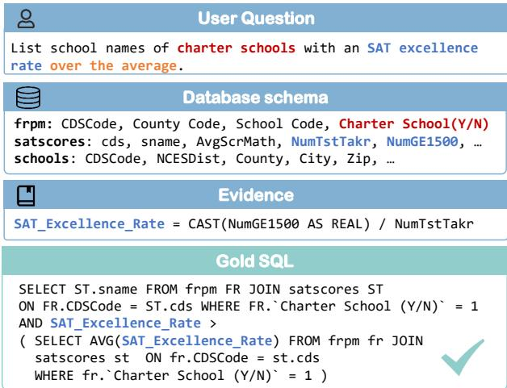
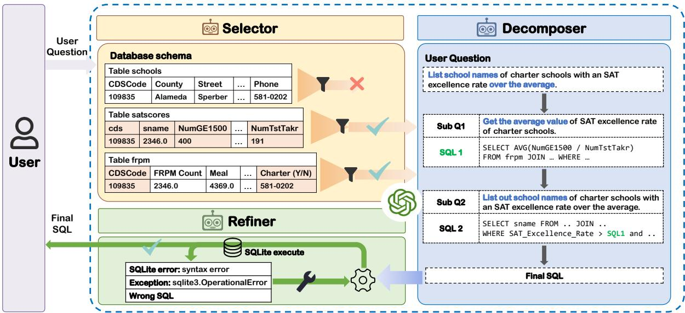
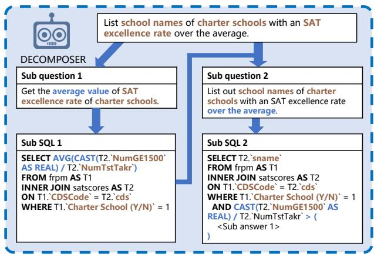
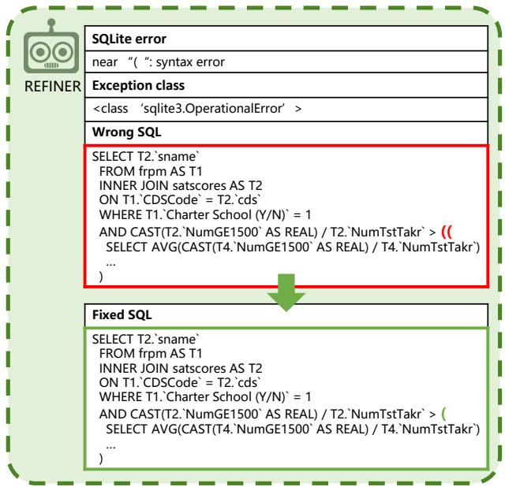
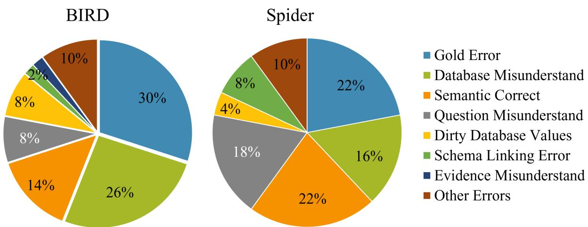

# MAC-SQL: A Multi-Agent Collaborative Framework for Text-to-SQL

Bing Wang<sup>1</sup>, Changyu Ren<sup>1</sup>, Jian Yang<sup>1</sup>, Xinnian Liang<sup>1</sup>, Jiaqi Bai<sup>1</sup>, Linzheng Chai<sup>1</sup> Zhao Yan<sup>2</sup>, Qian-Wen Zhang<sup>2</sup>, Di Yin<sup>2</sup>, Xing Sun<sup>2</sup>, Zhoujun Li<sup>1</sup> <sup>†</sup>

<sup>1</sup>Beihang University <sup>2</sup>Tencent Youtu Lab

{bingwang,cyren,jiaya,xnliang,bjq,challenging,lizj}@buaa.edu.cn {zhaoyan,cowenzhang,endymecyyin,winfredsun}@tencent.com

## Abstract

Recent LLM-based Text-to-SQL methods usually suffer from significant performance degradation on “huge" databases and complex user questions that require multi-step reasoning. Moreover, most existing methods neglect the crucial importance of LLMs using external tools and model collaboration. To address these challenges, we introduce MAC-SQL, a novel LLM-based multi-agent collaborative framework. Our framework comprises a core decomposer agent for Text-to-SQL generation with few-shot chain-of-thought reasoning, accompanied by two auxiliary agents that utilize external tools or models to acquire smaller subdatabases and refine erroneous SQL queries. The decomposer agent collaborates with auxiliary agents, which are activated as needed and can be expanded to accommodate new features or tools for effective Text-to-SQL parsing. In our framework, we initially leverage GPT-4 as the strong backbone LLM for all agent tasks to determine the upper bound of our framework. We then fine-tune an open source instructionfollowed model, SQL-Llama, by leveraging Code Llama 7B, to accomplish all tasks as GPT-4 does. Experiments show that SQL-Llama achieves a comparable execution accuracy of 43.94, compared to the baseline accuracy of 46.35 for vanilla GPT-4. At the time of writing, MAC-SQL+GPT-4 achieves an execution accuracy of 59.59 when evaluated on the BIRD benchmark, establishing a new state-of-the-art (SOTA) in its holdout test set. <sup>1</sup>

## 1 Introduction

Text-to-SQL aims to automate the process of generating Structured Query Language (SQL) queries for databases from natural language text. This long-standing challenge is essential to improve database accessibility without requiring knowledge of SQL (Qin et al., 2022; Sun et al., 2023).

  
Figure 1: A complex example of Text-to-SQL. In the Gold SQL, we use SAT\_Excellence\_Rate to represent "CAST(NumGE1500 AS REAL)/NumTstTakr" for the sake of brevity.

Over the past decade, research in this field has progressed through three stages. In the initial phase, systems encode the input sequence using pre-trained models, and SQL queries are decoded using either abstract syntax trees (Xu et al., 2017; Guo et al., 2019; Wang et al., 2021) or predefined sketches (He et al., 2019). More recent systems (Raffel et al., 2023; Xie et al., 2022; Scholak et al., 2021) have adopted sequence-to-sequence methodologies. The latest research (Ouyang et al., 2022; OpenAI, 2023; Rozière et al., 2023) has demonstrated the remarkable capabilities of Large Language Models (LLMs) in this task. The success of these models can be attributed to their emerging abilities (Wei et al., 2023; Brown et al., 2020) and the robust reasoning capabilities inherent in LLMs.

Recent research on LLM-based Text-to-SQL (Dong et al., 2023; Pourreza and Rafiei, 2023; Gao et al., 2023) has mainly concentrated on In-Context Learning prompt strategies and supervised fine-tuning using data derived from the target domain. However, these approaches usually suffer from significant performance degradation in “huge” databases and complex user questions that require multi-step reasoning, as demonstrated in Figure 1. Moreover, most existing methods neglect the crucial importance of LLMs utilizing external tools and model collaboration.

  
Figure 2: The overview of our MAC-SQL framework, which comprises three agents: (i) the Selector, which decomposes a large database into a smaller sub-database to mitigate the interference of irrelevant information, and (ii) the Decomposer, which breaks down a complex question into simpler sub-questions and resolves them progressively by chain-of-thought reasoning, and (iii) the Refiner, which uses an external tool for SQL execution and obtains feedback, then refines faulty SQL queries.

To alleviate the above challenges, we introduce MAC-SQL, a novel LLM-based multi-agent collaborative framework, which exploits LLMs as intelligent agents with different functionalities for effective Text-to-SQL parsing. Our framework comprises a core Decomposer agent for Text-to-SQL generation, accompanied by two auxiliary agents, the Selector and the Refiner, for tool usage and SQL refinement. Specifically, the Decomposer breaks down a complex question into simpler sub-questions and resolves them progressively by chain-of-thought reasoning. When necessary, the Selector decomposes a large database into a smaller sub-database to minimize the interference of irrelevant information, while the Refiner employs an external tool for SQL execution, obtains feedback, and refines erroneous SQL queries.

Furthermore, we have fine-tuned an instructionfollowed model, SQL-Llama, by leveraging Code Llama 7B, using agent instruction data from MAC-SQL, thus enabling capabilities in database simplification, question decomposition, SQL generation, and SQL correction.

In our experiments, we initially leverage GPT-

4 as a strong backbone LLM for all agent tasks to determine the upper bound of our MAC-SQL framework on the widely used BIRD and Spider dataset. Experimental results demonstrate that MAC-SQL+GPT-4 achieves an execution accuracy of 59.59 on the BIRD holdout test set, establishing a new state-of-the-art (SOTA) at the time of writing. Furthermore, we utilize SQL-Llama (7B) to perform all tasks such as GPT-4. Surprisingly, despite SQL-Llama having an order of magnitude fewer parameters than GPT-4, its execution accuracy reaches 43.94, which is remarkably close to the accuracy of GPT-4 (46.35).

Contribution Our main contributions and results are summarized as follows:

1. We propose MAC-SQL, a novel multi-agent collaborative framework for Text-to-SQL, which integrates external tools and facilitates model collaboration to address intricate scenarios.

2. We introduce an instruction-tuning model, named SQL-Llama, to fill in the gaps in opensource agent-instruction-following models for the task of Text-to-SQL.

3. Experimental results demonstrate that MAC-SQL achieves state-of-the-art execution accuracy of 59.59% on the BIRD test set at the time of writing.

Algorithm 1 The algorithm of MAC-SQL   
Input: question q, database db, knowledge   
kg   
Output: sql   
1: if need simplify to database then   
2: db = LLM<sub>Selector</sub>(q, db, kg)   
3: end if   
4: dbDesc = getDbRepresenation(db, kg)   
5: subQs, subSQLs = LLM<sub>Decomposer</sub>(q, dbDesc)   
6: sql = subSQLs[-1]   
7: count = 0   
8: while count < maxTryTimes do   
9: ok, err = executeAndAnalyze(sql, db)   
10: if ok then   
11: return sql   
12: else   
13: sql = LLM<sub>Refiner</sub>(q, dbDesc, sql,   
err)   
14: end if   
15: end while   
16: return sql

## 2 Preliminaries

## 2.1 Problem Definition of Text-to-SQL

Given a triple $\mathcal { X } = ( \mathcal { Q } , \mathcal { S } , \mathcal { K } )$ , where Q, S and K are natural language questions, database schema and external knowledge (optional), the database schema S is defined as $\{ \tau , \mathcal { C } \}$ , where T represents multiple tables $\{ \mathcal { T } _ { 1 } , \mathcal { T } _ { 2 } , \ldots , \mathcal { T } _ { | T | } \}$ and C represents columns $\{ \mathcal { C } _ { 1 } , \mathcal { C } _ { 2 } , \ldots , \mathcal { C } _ { | C | } \}$ . The purpose of Textto-SQL task is to generate the correct SQL Y corresponding to the question Q.

## 2.2 Large Language Model for Text-to-SQL

The Text-to-SQL task has recently been formulated as a generation task (Dong et al., 2023; Pourreza and Rafiei, 2023), designing appropriate prompts to guide a large language model M generating SQL queries token-by-token. The generation process can be formulated as follows.

$$
P _ { \mathcal M } ( \mathcal y | \mathcal x ) = \prod _ { i = 1 } ^ { | \mathcal y | } P _ { \mathcal M } ( \mathcal y _ { i } | \mathcal y _ { < i } ; \mathcal x )\tag{1}
$$

where $\ y < i$ is the prefix of the SQL query Y and $P _ { \mathcal { M } } ( \mathcal { V } _ { i } | \cdot )$ is the conditional probability of the i-th token in the SQL query $\mathcal { V }$ given the prefix $\mathscr { y } _ { < i }$ and the triple $\mathcal { X } = ( \mathcal { Q } , \mathcal { S } , \mathcal { K } )$

## 3 MAC-SQL Framework

## 3.1 Overview

In Figure 2, we introduce MAC-SQL, a novel LLMbased multi-agent collaborative framework, which exploits LLMs as intelligent agents with different functionalities for effective Text-to-SQL parsing. MAC-SQL comprises a core Decomposer agent for Text-to-SQL generation, accompanied by two auxiliary agents, the Selector and the Refiner, for tool usage and SQL refinement. In Algorithm 1, we present the collaboration process of three agents in MAC-SQL. In the following section, a detailed introduction of three agents will be presented.

## 3.2 Selector

Given an input triple $\mathcal { X } = ( \mathcal { Q } , \mathcal { S } , \mathcal { K } )$ , where the schema of the database $S = \{ \mathcal { T } , \mathcal { C } \}$ , the Selector agent aims to locate the minimal schema $\boldsymbol { \mathcal { S } } ^ { \prime } =$ $\{ \mathcal { T } ^ { \prime } , \mathcal { C } ^ { \prime } \}$ , where $T ^ { \prime } \subseteq T$ and $C ^ { \prime } \subseteq C$ , to answer the question Q with knowledge K. The function of the Selector agent can be described as:

$$
\pmb { S } ^ { ' } = f _ { s e l e c t o r } ( \ k _ { 2 } , \pmb { S } , \kappa | \mathcal { M } )\tag{2}
$$

where $f _ { s e l e c t o r } ( \cdot | \mathcal { M } )$ denotes the function of the selector prompting the LLM M. The motivation behind designing the selector involves primarily two key factors. Firstly, introducing too many irrelevant schema items in the prompt increases the likelihood of LLM generating irrelevant schema items in the output SQL. Secondly, using the complete database schema results in excessive text length, leading to unnecessary API costs, and may exceed the maximum context length of LLM. It is important to note that the Selector will only be activated when the length of the database schema prompt exceeds the length threshold; otherwise, the original database schema S will be used for the subsequent process. More details about agent variables and prompts can be found in the Appendix A.

## 3.3 Decomposer

The purpose of the Decomposer is to enhance LLM’s reasoning ability by generating a series of intermediate steps (i.e. sub-questions and SQLs) before predicting the final SQL. As shown in Figure 3, the decomposer instructs the LLM to decompose the original complex question Q as reasoning steps and gets the final SQL query Y in a single pass. It can be described as follows.

  
Figure 3: The Decomposer Agent Illustration.

$$
P _ { \mathcal M } ( \mathcal y | \mathcal Q , \mathcal S ^ { ' } , \mathcal K ) = \prod _ { j = 1 } ^ { L } P _ { \mathcal M } ( \mathcal y ^ { j } | \mathcal y ^ { < j } ; \mathcal Q ^ { j } , \mathcal S ^ { ' } , \mathcal K )\tag{3}
$$

where $\boldsymbol { \mathcal { Q } ^ { j } }$ and $\mathcal { V } ^ { j }$ are the j-th sub-question and sub-SQL generated by the LLM M given the previous sub- $. \mathrm { { S Q L s } } \mathrm { { } } \mathcal { { V } } ^ { < j }$ , the filtered database schema $\boldsymbol { S ^ { \prime } }$ and knowledge K, L is the number of subquestions.

The decomposer pattern can be approached in two prompting methods for text-to-SQL parsing: chain-of-thought (CoT) prompting (Wei et al., 2023) and least-to-most prompting (Zhou et al., 2022). The former involves generating thinking and reasoning once to obtain an answer, while the latter brings about higher computational costs to generate each SQL query due to the iterative process.

Due to the inefficiency of the iterative method and the necessity to determine the stopping criteria, we adopt the CoT approach to generate subquestions and their corresponding SQL queries. The specific implementation is as follows: dynamically judging the difficulty of the user’s question, if it can be answered by a simple SQL query, then the SQL is generated directly. If the question is more complex, the corresponding SQL is generated starting from the simplest sub-question, and then gradually broken down to obtain progressive subquestions until the final SQL corresponding to the question is obtained. Additionally, we leverage the few-shot approach to enhance LLM’s understanding of instructions through in-context learning.

## 3.4 Refiner

The primary function of the Refiner is to detect and automatically correct SQL errors, as illustrated in

  
Figure 4: The Refiner Agent Illustration.

Figure 4. In a comprehensive multi-agent collaborative framework, particularly within the context of Text-to-SQL tasks, the refiner is essential for the inspection and correction of generated answers. For instance, in the ChatDev project (Qian et al., 2024), intelligent agents are responsible for conducting overall and functional module testing in addition to overall architectural design and code writing for game software development tasks. Similarly, in Text-to-SQL tasks, the Refiner can be used to make appropriate adjustments for the different datasets, database schemas, SQL generation styles, and specific inductive biases.

Given a flawed SQL query $\mathcal { V } ^ { ' }$ and the error message feedback E, obtained from external SQL tools, the Refiner instructs the LLM M to generate the correct SQL query Y. It can be described as follows.

$$
\mathcal { V } = f _ { r e f i n e r } ( \mathcal { E } , \mathcal { y } ^ { \prime } , \mathcal { Q } , \mathcal { S } ^ { \prime } , \mathcal { K } | \mathcal { M } )\tag{4}
$$

where $f _ { r e f i n e r } ( \cdot | \mathcal { M } )$ denotes the function of the Refiner by prompting the LLM M.

As shown in Figure 2, upon receiving an SQL query, the Refiner diagnoses the SQL statement to assess its syntactic correctness, execution feasibility, and retrieval of non-empty results from the database. In general, the purpose of the Refiner is to achieve self-checking and self-correction of the model to enhance the overall framework’s fault tolerance and accuracy. Using the selector agent, there is a significant reduction in syntax errors, schema linking, and other simple errors.

## 4 SQL-Llama Model

## 4.1 Instruction Dataset Construction

To construct the Agent-Instruct dataset, we instruct the GPT-4 with the training set of the BIRD and Spider dataset through multi-agent tasks. We collect the generated instruction data according to the level of difficulty and filter out those with incorrect SQL query output. Finally, the curated Agent-Instruct dataset D with instruction tasks N (N = 3), $\mathcal { D } = \{ \mathcal { D } _ { i } \} _ { i = 1 } ^ { N }$ contains 10,000 high-quality instruction data with 3 agent-instruction tasks, covering the distribution of the BIRD and Spider dataset.

## 4.2 Multi-task Supervised Fine-tuning

Our research has primarily focused on the development of open source models within the MAC-SQL framework, to achieve performance levels comparable to closed source models such as GPT-4. To achieve this, we have put significant effort into preparing the data for model training and have open-sourced SQL-Llama, a model that has been fine-tuned using three intelligent agent instruction data. The SQL-Llama model, based on Code Llama 7B, has undergone supervised fine-tuning using agent instruction data from MAC-SQL, which has enhanced its capabilities in database simplification, question decomposition, SQL generation, and SQL correction.

Given the Agent-Instruct dataset with instruction tasks N (N = 3), $\mathcal { D } = \{ \mathcal { D } _ { i } \} _ { i = 1 } ^ { N }$ , the LLM trained in D can learn from these tasks and complete agent tasks. The supervised fine-tuning process can be described as:

$$
\mathcal { L } = - \sum _ { i = 1 } ^ { N } \mathbb { E } _ { \mathcal { Q } , \mathcal { S } ^ { i } , \mathcal { K } , \mathcal { V } ^ { i } \sim \mathcal { D } } \left[ \log P ( \mathcal { V } ^ { i } | \mathcal { Q } , \mathcal { S } ^ { i } , \mathcal { K } ; \mathcal { M } ) \right]\tag{5}
$$

where $\mathcal { L }$ is the training objective of $N$ tasks, $S ^ { i }$ and $\mathcal { V } ^ { i }$ are the selected database schema and the intermediate SQL query of the i-th task.

One of the key challenges we encountered during the model training process was balancing model complexity with performance. We had to carefully optimize the model architecture and parameters to ensure that it could effectively handle the complexities of database-related tasks while still maintaining high-performance levels. Additionally, ensuring the quality and relevance of the instruction dataset for training was crucial, as it directly impacted the model’s performance.

Despite these challenges, our work on instruction-tuned models represents a significant step towards democratizing access to highperformance language models for database-related tasks. By open-sourcing both the model and the instruction dataset, we aim to provide valuable resources for further research and development in this area, ultimately leading to more accessible and effective tools for database query processing and related tasks.

## 5 Experiments

## 5.1 Experimental Setup

Datasets The Spider (Yu et al., 2018) dataset is frequently used to assess the performance of textto-SQL parsing across multiple databases, which requires models to demonstrate adaptability to unfamiliar database structures. The dataset comprises 7,000 question-query pairs in the training set and 1,034 pairs in the development set, covering 200 distinct databases and 138 domains.

The BIRD (Li et al., 2023) dataset released by Alibaba DAMO Academy is a new benchmark for real large-scale databases, containing 95 large-scale databases and high-quality Text-SQL pairs, with a data storage volume of up to 33.4GB covering 37 professional domains. Unlike Spider, BIRD focuses on massive and real database content, external knowledge reasoning between natural language questions and database content, and new challenges in SQL efficiency when dealing with large databases.

Evaluation Metrics Following BIRD (Li et al., 2023) and Test-suite (Zhong et al., 2020), we consider three metrics, exact match accuracy (EM), execution accuracy (EX), and valid efficiency score (VES) to evaluate text-to-SQL models faced with real-world scenarios with large database contents. Exact Match Accuracy (EM) treats each clause as a set and compares the prediction for each clause with its corresponding clause in the reference query. A predicted SQL query is considered correct only if all of its components match the ground truth. This metric does not take values into account. Execution Accuracy (EX) is defined as the proportion of questions in the evaluation set for which the execution results of both the predicted and ground truth inquiries are identical, relative to the total number of queries. Valid Efficiency Score (VES) is designed to measure the efficiency of valid SQLs generated by models. It is important to note that "valid SQL $\ . s "$

<table><tr><td rowspan="2">Method</td><td colspan="2">Dev</td><td colspan="2">Test</td></tr><tr><td>EX</td><td>VES</td><td>EX</td><td>VES</td></tr><tr><td>Palm-2</td><td>27.38</td><td></td><td>33.04</td><td></td></tr><tr><td>ChatGPT + CoT</td><td>36.64</td><td>42.30</td><td>40.08</td><td>56.56</td></tr><tr><td>Claude-2</td><td>42.70</td><td></td><td>49.02</td><td></td></tr><tr><td>GPT-4</td><td>46.35</td><td>49.77</td><td>54.89</td><td>60.77</td></tr><tr><td>DIN-SQL + GPT-4</td><td>50.72</td><td>58.79</td><td>55.90</td><td>59.44</td></tr><tr><td>DAIL-SQL + GPT-4</td><td>54.76</td><td>56.08</td><td>57.41</td><td>61.95</td></tr><tr><td>SQL-Llama</td><td>32.87</td><td>55.67</td><td>一</td><td></td></tr><tr><td>MAC-SQL + SQL-Llama</td><td>43.94</td><td>57.36</td><td>一</td><td></td></tr><tr><td>+ Oracle Schema</td><td>51.43</td><td>58.24</td><td></td><td></td></tr><tr><td>MAC-SQL+GPT-3.5-Turbo</td><td>50.56</td><td>61.25</td><td></td><td></td></tr><tr><td>+ Oracle Schema</td><td>65.78</td><td>60.62</td><td></td><td></td></tr><tr><td>MAC-SQL + GPT-4</td><td>59.39</td><td>66.39</td><td>59.59</td><td>67.68</td></tr><tr><td>+ Oracle Schema</td><td>70.28</td><td>62.63</td><td>一</td><td></td></tr></table>

Table 1: Execution accuracy(EX) and Valid efficiency score (VES) on both dev and test set of BIRD dataset. The SQL-Llama model refers to version 7B. The term "Oracle Schema" refers to the utilization of a ground truth sub-database as the input for the Decomposer, rather than employing the results obtained from the Selector.

refers to predicted SQL queries whose result sets align with those of the ground-truth SQLs.

Baselines We conduct experiments on both BIRD and Spider datasets and compare our method with the following baseline:

• GPT-4 (OpenAI, 2023) uses a simple zeroshot text-to-SQL prompt for SQL generation.

• DIN-SQL (Pourreza and Rafiei, 2023) decomposes the text-to-SQL task into smaller subtasks and designs different prompts for each subtask to instruct GPT-4 to complete each subtask and obtain the final SQL.

• DAIL-SQL (Gao et al., 2023) encodes structure knowledge as SQL statements, selects few-shot demonstrations based on their skeleton similarities, and removes cross-domain knowledge from examples for token efficiency.

• C3-SQL (Dong et al., 2023) first performs schema linking filtering and then directs GPT-4 with a calibration bias prompt designed for Spider using a self-consistency strategy.

## 5.2 Overall Performance

It is important to note that the experiment utilized the 32k version of GPT-4 and the 16k version of GPT-3.5-Turbo.

<table><tr><td>Method</td><td>Dev</td><td>Test</td></tr><tr><td> $\mathbf { C } 3 + \mathbf { C h a t G P T }$ </td><td>81.80</td><td>82.30</td></tr><tr><td> $\mathrm { D I N - S Q L + G P T - 4 }$ </td><td>82.80</td><td>85.30</td></tr><tr><td> $\mathrm { \Delta D A I L  – S Q L + G P T  – 4 }$ </td><td>84.40</td><td>86.60</td></tr><tr><td>SQL-Llama</td><td>65.48</td><td>61.63</td></tr><tr><td>MAC-SQL+SQL-Llama</td><td>76.25</td><td>70.58</td></tr><tr><td>MAC-SQL+GPT-3.5-Turbo</td><td>80.56</td><td>75.53</td></tr><tr><td>MAC-SQL + GPT-4</td><td>86.75</td><td>82.80</td></tr></table>

Table 2: Execution accuracy(EX) on both dev and test set of Spider. The SQL-Llama model refers to version 7B.
<table><tr><td>Method</td><td>Simple</td><td>Mod.</td><td>Chall.</td><td>All</td></tr><tr><td>MAC-SQL+GPT-4</td><td>65.73</td><td>52.69</td><td>40.28</td><td>59.39</td></tr><tr><td>w/o Selector</td><td>65.73</td><td>52.04</td><td>35.14</td><td>57.28</td></tr><tr><td>w/o Decomposer</td><td>61.51</td><td>48.82</td><td>38.89</td><td>55.54</td></tr><tr><td>w/o Refiner</td><td>63.24</td><td>44.52</td><td>33.33</td><td>54.76</td></tr></table>

Table 3: Execution accuracy of MAC-SQL ablation study in BIRD dev set. For brevity, the abbreviation "Mod." stands for "Moderate" while "Chall." denotes "Challenging".

BIRD Results In Table 1, we report the performance of our method and baseline methods on the BIRD dataset. It is evident that our method surpasses all LLM-based methods in terms of execution accuracy (EX) and valid efficiency score (VES) in both the development and test sets. Specifically, our method outperforms the second-best method by 4. 63% in the development set and by 2. 18% in the test set. At the time of writing, MAC-SQL+GPT-4 achieves an execution accuracy of 59.59 when evaluated on the BIRD benchmark, establishing a new state-of-the-art (SOTA) in its holdout test set.

Spider Results Currently, Spider has opensourced the test set, so we can evaluate our method in both the development and the test set. As shown in Table 2, for the Spider dev set (Yu et al., 2018), our method achieves the highest execution accuracy using GPT-4. These results demonstrate the generalization ability of our MAC-SQL framework.

## 5.3 Ablation Study

Table 3 presents the results of an ablation study for the MAC-SQL model in the BIRD dev set. The table lists different variations of the MAC-SQL model, including with and without certain components such as Selector, Decomposer, and Refiner. The other columns represent the accuracy of the model at different levels of difficulty: Simple, Moderate, and Challenging, as well as the overall accuracy (All).

<table><tr><td rowspan="2">Few-shot</td><td colspan="2">BIRD</td><td colspan="2">Spider</td></tr><tr><td>EX</td><td>VES</td><td>EM</td><td>EX</td></tr><tr><td>0-shot</td><td>55.54</td><td>63.31</td><td>58.42</td><td>74.22</td></tr><tr><td>1-shot</td><td>57.26</td><td>64.32</td><td>59.68</td><td>78.35</td></tr><tr><td>2-shot</td><td>59.39</td><td>66.24</td><td>63.20</td><td>86.75</td></tr></table>

Table 4: Results of MAC-SQL+GPT-4 on the dev set of BIRD and Spider with few-shot evaluation.

The findings show that the original MAC-SQL + GPT-4 model achieves an accuracy of 65. 73% in Simple, 52. 69% in Moderate and 40. 28% in Challenging, with an overall accuracy of 59.39%. When removing the Selector component, the accuracy remained the same for Simple, but decreased to 52.04% for Moderate and 35.14% for Challenging, resulting in an overall accuracy of 57.28% (a decrease of 2.11%). Similarly, removing the Decomposer and Refiner components also led to decreased accuracy across all difficulty levels.

In general, the ablation study indicates that each component of the MAC-SQL model (Selector, Decomposer, and Refiner) plays a crucial role in achieving high accuracy, as their removal resulted in decreased performance at all difficulty levels.

## 5.4 Discussion

Impact on the number of demonstrations Table 4 shows the evaluation results of MAC-SQL with different numbers of demonstrations in the BIRD and Spider datasets. As the number of shots increases from 0 to 2, there is a consistent improvement in the performance metrics (EX, VES, and EM) for both BIRD and Spider. This indicates that the model benefits from additional demonstration examples and is able to generalize better with more data. The highest performance is achieved with 2-shot evaluation, indicating that the model is capable of effectively learning from a small number of examples. The high cost of the GPT-4 interface results in a significant consumption of tokens during a full test of the dev set for Spider and BIRD, estimated at approximately 6 million and 10 million tokens, respectively. Due to cost constraints, our analysis is limited to a maximum of 2 shots, and further experiments involving more shots (e.g., shot k > 2) will have to await a more budget-friendly implementation of GPT-4.

## 5.5 Error Analysis

In order to thoroughly assess the limitations of our method, we begin by choosing two datasets (BIRD and Spider) that contain various types of structured data, as shown in Figure 5.

Figure 5 displays the error type distribution in the BIRD and Spider datasets. "Gold Error" is the most common error type, accounting for 30% and 22% in BIRD and Spider, respectively, signifying the significance of gold standard annotations. "Semantic Correct" is another prevalent error type, representing 14% and 22% in BIRD and Spider, respectively, indicating the importance of semantic understanding and correctness. However, the "Schema Linking Error" is more frequent in BIRD (2%) than in Spider (8%), demonstrating differences in schema linking errors. This analysis underscores the need for addressing gold standard annotations, semantic correctness, and schema linking in dataset development and evaluation, thereby improving their quality and reliability. The Appendix C contains detailed examples of error types.

## 6 Related Work

LLMs for Text-to-SQL Recent advancements in text-to-SQL tasks using large language models (LLMs) have focused on improving prompt design and developing multi-stage refined frameworks. In the early stages of the emergence of large language models, research efforts primarily focused on designing high-quality prompts to better exploit the potential of LLMs for SQL generation. For example, (Tai et al., 2023) systematically studied how to enhance LLM’s reasoning ability through chain-of-thought style prompting, including the original chain-of-thought prompting and least-to-most prompting. Similarly, (Chang and Fosler-Lussier, 2023) comprehensively investigated the impact of prompt constructions in various settings when constructing the prompt text for text-to-SQL input. Furthermore, DAIL-SQL (Gao et al., 2023) systematically examined prompt engineering for LLM-based Text-to-SQL methods, including question representations, prompt components, example selections, and example organizations. Later studies, such as C3-SQL (Dong et al., 2023), DIN-SQL (Pourreza and Rafiei, 2023), and StructGPT (Jiang et al., 2023), proposed frameworks for simplifying databases, generating SQL, verifying queries, and integrating answers through zero-shot approaches, query decomposition, and specialized interfaces for structured data access.

  
Figure 5: Error Distributions of MAC-SQL on dev set of BIRD and Spider.

However, the aforementioned methods have several issues. Firstly, the experiments were conducted solely on the Spider family dataset, failing to demonstrate their generalization to more complex datasets like BIRD, hence limiting their real-world applicability. Secondly, certain methods depend on difficulty-level classifiers and customized biases specific to the Spider dataset for error correction, thus lacking the ability to generalize to a broader spectrum of error types. Third, these methods neglect the utilization of external tools and the collaboration of different modules. Thus, we propose a framework centered on multiagent collaboration that can be utilized for more intricate data scenarios and a broader spectrum of error types for detection and correction.

LLM-based Agents LLM-based agents have been a prominent area of study in both the academic and industry communities for an extended period (Wang et al., 2023). Recently, through the acquisition of vast amounts of web knowledge, LLMs have demonstrated remarkable potential in achieving human-level intelligence. This development has led to a surge in research exploring LLMbased autonomous agents. AutoGPT (Team, 2023) is an open-source implementation of an AI agent and follows a single-agent paradigm in which it augments the AI model with many useful tools, and does not support multi-agent collaboration. Similarly, OpenAgents (Xie et al., 2023) develops three distinct agents, the Data Agent for data analysis, the Plugins Agent for plugin integration, and the Web Agent for autonomous web browsing, each specializing in different domains, similar to

OpenAI’s ChatGPT Plugins. Additionally, Auto-Gen (Wu et al., 2023) is an open source framework that enables developers to build customizable, conversable agents that can operate in various modes, employing combinations of LLMs, human input, and tools to perform tasks. However, how to apply LLM-based agents to Text-to-SQL parsing remains under-explored.

While previous studies have focused on singleagent paradigms or domain-specific applications, there is a lack of research on multi-agent collaborative frameworks for Text-to-SQL parsing. We aim to address this gap by proposing a novel approach that integrates multiple LLM-based agents to collectively interpret SQL queries. By leveraging the strengths of different agents specialized in various aspects of Text-to-SQL parsing, our framework aims to improve the accuracy and efficiency of SQL query interpretation in real-world scenarios.

## 7 Conclusion

In summary, this paper proposes the MAC-SQL framework, which utilizes multi-agent collaboration to address challenges in Text-to-SQL tasks. The framework, along with the open source SQL-Llama model, achieved an execution accuracy of 59.59 when evaluated on the BIRD benchmark, establishing a new state-of-the-art (SOTA) on its holdout test set. This work presents a novel approach to Text-to-SQL and provides practical guidance to achieve high performance in this domain. Furthermore, our framework can be expanded to support a broader spectrum of scenarios.

## Limitations

The agent prompts utilized in the work may benefit from further optimization and might not represent the most optimal choice. Furthermore, this paper reports the fine-tuning results of the 7B CodeLLama model. Although it performs at a comparable level, we believe its performance can be further improved by using larger models.

## Ethics Statement

The datasets and models utilized in this paper, and the implementation of the code and the resulting models, are not associated with any ethical concerns.

## Acknowledgments

This work was partially supported by the National Natural Science Foundation of China (Grant Nos. 62276017, 62406033, U1636211, 61672081), and the State Key Laboratory of Complex& Critical Software Environment (Grant No. SKLCCSE-2024ZX-18).

## References

Tom B. Brown, Benjamin Mann, Nick Ryder, Melanie Subbiah, Jared Kaplan, Prafulla Dhariwal, Arvind Neelakantan, Pranav Shyam, Girish Sastry, Amanda Askell, Sandhini Agarwal, Ariel Herbert-Voss, Gretchen Krueger, Tom Henighan, Rewon Child, Aditya Ramesh, Daniel M. Ziegler, Jeffrey Wu, Clemens Winter, Christopher Hesse, Mark Chen, Eric Sigler, Mateusz Litwin, Scott Gray, Benjamin Chess, Jack Clark, Christopher Berner, Sam Mc-Candlish, Alec Radford, Ilya Sutskever, and Dario Amodei. 2020. Language models are few-shot learners. Preprint, arXiv:2005.14165.

Shuaichen Chang and Eric Fosler-Lussier. 2023. How to prompt llms for text-to-sql: A study in zero-shot, single-domain, and cross-domain settings. Preprint, arXiv:2305.11853.

Xuemei Dong, Chao Zhang, Yuhang Ge, Yuren Mao, Yunjun Gao, lu Chen, Jinshu Lin, and Dongfang Lou. 2023. C3: Zero-shot text-to-sql with chatgpt. Preprint, arXiv:2307.07306.

Dawei Gao, Haibin Wang, Yaliang Li, Xiuyu Sun, Yichen Qian, Bolin Ding, and Jingren Zhou. 2023. Text-to-sql empowered by large language models: A benchmark evaluation. Preprint, arXiv:2308.15363.

Jiaqi Guo, Zecheng Zhan, Yan Gao, Yan Xiao, Jian-Guang Lou, Ting Liu, and Dongmei Zhang. 2019. Towards complex text-to-sql in cross-domain database with intermediate representation. Preprint, arXiv:1905.08205.

Pengcheng He, Yi Mao, Kaushik Chakrabarti, and Weizhu Chen. 2019. X-sql: reinforce schema representation with context. Preprint, arXiv:1908.08113.

Jinhao Jiang, Kun Zhou, Zican Dong, Keming Ye, Wayne Xin Zhao, and Ji-Rong Wen. 2023. Structgpt: A general framework for large language model to reason over structured data. Preprint, arXiv:2305.09645.

Jinyang Li, Binyuan Hui, Ge Qu, Binhua Li, Jiaxi Yang, Bowen Li, Bailin Wang, Bowen Qin, Rongyu Cao, Ruiying Geng, Nan Huo, Xuanhe Zhou, Chenhao Ma, Guoliang Li, Kevin C. C. Chang, Fei Huang, Reynold Cheng, and Yongbin Li. 2023. Can llm already serve as a database interface? a big bench for large-scale database grounded text-to-sqls. Preprint, arXiv:2305.03111.

OpenAI. 2023. Gpt-4 technical report. ArXiv.

Long Ouyang, Jeff Wu, Xu Jiang, Diogo Almeida, Carroll L. Wainwright, Pamela Mishkin, Chong Zhang, Sandhini Agarwal, Katarina Slama, Alex Ray, John Schulman, Jacob Hilton, Fraser Kelton, Luke Miller, Maddie Simens, Amanda Askell, Peter Welinder, Paul Christiano, Jan Leike, and Ryan Lowe. 2022. Training language models to follow instructions with human feedback. Preprint, arXiv:2203.02155.

Mohammadreza Pourreza and Davood Rafiei. 2023. Din-sql: Decomposed in-context learning of text-tosql with self-correction. Preprint, arXiv:2304.11015.

Chen Qian, Wei Liu, Hongzhang Liu, Nuo Chen, Yufan Dang, Jiahao Li, Cheng Yang, Weize Chen, Yusheng Su, Xin Cong, Juyuan Xu, Dahai Li, Zhiyuan Liu, and Maosong Sun. 2024. Chatdev: Communicative agents for software development. Preprint, arXiv:2307.07924.

Bowen Qin, Binyuan Hui, Lihan Wang, Min Yang, Jinyang Li, Binhua Li, Ruiying Geng, Rongyu Cao, Jian Sun, Luo Si, et al. 2022. A survey on text-to-sql parsing: Concepts, methods, and future directions. arXiv preprint arXiv:2208.13629.

Colin Raffel, Noam Shazeer, Adam Roberts, Katherine Lee, Sharan Narang, Michael Matena, Yanqi Zhou, Wei Li, and Peter J. Liu. 2023. Exploring the limits of transfer learning with a unified text-to-text transformer. Preprint, arXiv:1910.10683.

Baptiste Rozière, Jonas Gehring, Fabian Gloeckle, Sten Sootla, Itai Gat, Xiaoqing Ellen Tan, Yossi Adi, Jingyu Liu, Tal Remez, Jérémy Rapin, Artyom Kozhevnikov, Ivan Evtimov, Joanna Bitton, Manish Bhatt, Cristian Canton Ferrer, Aaron Grattafiori, Wenhan Xiong, Alexandre Défossez, Jade Copet, Faisal Azhar, Hugo Touvron, Louis Martin, Nicolas Usunier, Thomas Scialom, and Gabriel Synnaeve. 2023. Code llama: Open foundation models for code. Preprint, arXiv:2308.12950.

Torsten Scholak, Nathan Schucher, and Dzmitry Bahdanau. 2021. Picard: Parsing incrementally for

constrained auto-regressive decoding from language models. Preprint, arXiv:2109.05093.

Ruoxi Sun, Sercan O. Arik, Hootan Nakhost, Hanjun Dai, Rajarishi Sinha, Pengcheng Yin, and Tomas Pfister. 2023. Sql-palm: Improved large language model adaptation for text-to-sql. Preprint, arXiv:2306.00739.

Chang-You Tai, Ziru Chen, Tianshu Zhang, Xiang Deng, and Huan Sun. 2023. Exploring chain-ofthought style prompting for text-to-sql. Preprint, arXiv:2305.14215.

AutoGPT Team. 2023. Autogpt: build and use ai agents.

Bailin Wang, Richard Shin, Xiaodong Liu, Oleksandr Polozov, and Matthew Richardson. 2021. Rat-sql: Relation-aware schema encoding and linking for textto-sql parsers. Preprint, arXiv:1911.04942.

Lei Wang, Chen Ma, Xueyang Feng, Zeyu Zhang, Hao Yang, Jingsen Zhang, Zhiyuan Chen, Jiakai Tang, Xu Chen, Yankai Lin, et al. 2023. A survey on large language model based autonomous agents. arXiv preprint arXiv:2308.11432.

Jason Wei, Xuezhi Wang, Dale Schuurmans, Maarten Bosma, Brian Ichter, Fei Xia, Ed Chi, Quoc Le, and Denny Zhou. 2023. Chain-of-thought prompting elicits reasoning in large language models. Preprint, arXiv:2201.11903.

Qingyun Wu, Gagan Bansal, Jieyu Zhang, Yiran Wu, Beibin Li, Erkang Zhu, Li Jiang, Xiaoyun Zhang, Shaokun Zhang, Jiale Liu, Ahmed Hassan Awadallah, Ryen W White, Doug Burger, and Chi Wang. 2023. Autogen: Enabling next-gen llm applications via multi-agent conversation. Preprint, arXiv:2308.08155.

Tianbao Xie, Chen Henry Wu, Peng Shi, Ruiqi Zhong, Torsten Scholak, Michihiro Yasunaga, Chien-Sheng Wu, Ming Zhong, Pengcheng Yin, Sida I. Wang, Victor Zhong, Bailin Wang, Chengzu Li, Connor Boyle, Ansong Ni, Ziyu Yao, Dragomir Radev, Caiming Xiong, Lingpeng Kong, Rui Zhang, Noah A. Smith, Luke Zettlemoyer, and Tao Yu. 2022. Unifiedskg: Unifying and multi-tasking structured knowledge grounding with text-to-text language models. Preprint, arXiv:2201.05966.

Tianbao Xie, Fan Zhou, Zhoujun Cheng, Peng Shi, Luoxuan Weng, Yitao Liu, Toh Jing Hua, Junning Zhao, Qian Liu, Che Liu, Leo Z. Liu, Yiheng Xu, Hongjin Su, Dongchan Shin, Caiming Xiong, and Tao Yu. 2023. Openagents: An open platform for language agents in the wild. Preprint, arXiv:2310.10634.

Xiaojun Xu, Chang Liu, and Dawn Song. 2017. Sqlnet: Generating structured queries from natural language without reinforcement learning. Preprint, arXiv:1711.04436.

Tao Yu, Rui Zhang, Kai Yang, Michihiro Yasunaga, Dongxu Wang, Zifan Li, James Ma, Irene Li, Qingning Yao, Shanelle Roman, Zilin Zhang, and Dragomir Radev. 2018. Spider: A large-scale human-labeled dataset for complex and cross-domain semantic parsing and text-to-sql task. In Proc. ofEMNLP.

Ruiqi Zhong, Tao Yu, and Dan Klein. 2020. Semantic evaluation for text-to-SQL with distilled test suites. In Proc. ofEMNLP.

Denny Zhou, Nathanael Sch<sup>¨</sup>"arli, Le Hou, Jason Wei, Nathan Scales, Xuezhi Wang, Dale Schuurmans, Claire Cui, Olivier Bousquet, Quoc Le, et al. 2022. Least-to-most prompting enables complex reasoning in large language models. arXiv preprint arXiv:2205.10625.

## A Implementation Details

## A.1 Selector Agent

The selector Agent is activated only when encountering large databases. In the specific implementation, there are two methods to determine whether the current database is large. The first method involves calculating the token count of the database schema string, such as len(tokens) > (0.8 \* max\_sequence\_length\_of\_model) (for example, in this study, using GPT-4-32k, len(tokens) > 25k is considered a large database); the second method involves counting the total number of columns and the average number of columns in the tables, which can be adjusted based on the situation. The experimental results in this study are obtained using the first method. For a specific code implementation, the \_is\_need\_prune function in agents.py can be modified accordingly. In the design of the selector prompt, in order to guide the model to output in the specified JSON format, we provide a one-shot example, as detailed in the appendix B.1. After the database is filtered by the selector, to ensure completeness, each table will retain at least 6 column names, preventing missing columns.

## A.2 Decomposer Agent

The decomposer utilizes a maximum of two shots, as outlined in the appendix B.2. The database schema comprises the database ID, table name, column name, full column name/description, and high-frequency cell values. When examining cell values, we consider the column type, unique values, and maximum length. Columns containing only numerical values, as well as unconventional values, such as URLs and emails, are ignored. The decomposer breaks down the original question into multiple sub-questions, ranging from one to five. In the case of a single sub-question, it denotes a straightforward question that can be directly solved in one step without further decomposition into finer ones.

## A.3 Refiner Agent

The refiner is tasked with rectifying problematic SQL queries. If the SQL query contains multiple issues, it may require multiple correction processes. To ensure practical efficiency, a maximum of three rounds of error correction will be performed. Common error types include SQL syntax errors, schema illusions (such as non-existent table and column names), and empty query results. Presently, the limitation of the refiner is that in cases where the SQL query runs without error and generates non-empty results, even if the SQL does not align with the intended question, the refiner will not make further corrections. We will continue to investigate how to address such ambiguous scenarios in future research.

## B Prompt Details

## B.1 Selector Prompt

As an experienced and professional database administrator, your task is to analyze a user question and a database schema to provide relevant information. The database schema consists of table descriptions, each containing multiple column descriptions. Your goal is to identify the relevant tables and columns based on the user question and evidence provided.

## [Instruction]

1. Discard any table schema that is not related to the user question and evidence.

2. Sort the columns in each relevant table in descending order of relevance and keep the top 6 columns.

3. Ensure that at least 3 tables are included in the final output JSON.

4. The output should be in JSON format.

## [Requirements]

1. If a table has less than or equal to 10 columns, mark it as "keep\_all".

2. If a table is completely irrelevant to the user question and evidence, mark it as "drop\_all".

<table><tr><td>3. Prioritize the columns in each relevant table based on their relevance.</td></tr><tr><td>Here is a typical example:</td></tr><tr><td></td></tr><tr><td>[DB_ID] banking_system [Schema]</td></tr><tr><td># Table: account [ (account_id, the id of the account. Value examples: [11382, 11362, 2, 1, 2367].),</td></tr><tr><td>(district_id, location of branch. Value examples: [77, 76, 2, 1, 39].), (frequency, frequency of the acount. Value examples: [&#x27;POPLATEK MESICNE’, &#x27;POPLATEK</td></tr><tr><td>TYDNE&#x27;, &#x27;POPLATEK PO OBRATU&#x27;].), (date, the creation date of the account. Value examples: [&#x27;1997-12-29’, &#x27;1997-12-28’].)</td></tr><tr><td>] # Table: client</td></tr><tr><td>[ (client_id, the unique number. Value examples: [13998, 13971, 2, 1, 2839].), (gender, gender. Value examples: [&#x27;M&#x27;, &#x27;F’]. And F:female . M:male ),</td></tr><tr><td>(birth_date, birth date. Value examples: [&#x27;1987-09-27&#x27;, &#x27;1986-08-13&#x27;].),(district_id, location of branch. Value examples: [77, 76, 2, 1, 39].)</td></tr><tr><td>] # Table: loan</td></tr><tr><td>1 (loan_id, the id number identifying the loan data. Value examples: [4959, 4960, 4961].), (account_id, the id number identifying the account. Value examples: [10, 80, 55, 43].),</td></tr><tr><td>(date, the date when the loan is approved. Value examples: [&#x27;1998-07-12’, &#x27;1998-04-19’].), (amount, the id number identifying the loan data. Value examples: [1567, 7877, 9988].),</td></tr><tr><td>(duration, the id number identifying the loan data. Value examples: [60, 48, 24, 12, 36].), (payments, the id number identifying the loan data. Value examples: [3456, 8972, 9845].),</td></tr><tr><td>(status, the id number identifying the loan data. Value examples: [&#x27;C&#x27;, &#x27;A&#x27;, &#x27;D&#x27;, &#x27;B’].) 1</td></tr><tr><td># Table: district [ (district_id, location of branch. Value examples: [77, 76].), (A2, area in square kilometers. Value examples: [50.5, 48.9].),</td></tr></table>

[Question]   
What is the gender of the youngest client who opened account in the lowest average salary branch?   
[Evidence]   
Later birthdate refers to younger age; A11 refers to average salary   
[Answer]   
”’json   
"account": "keep\_all",   
"client": "keep\_all",   
"loan": "drop\_all",   
"district": ["district\_id", "A11", "A2", "A4", "A6", "A7"]   
}   
,,,   
Question Solved.   
Here is a new example, please start answering:   
[DB\_ID] {db\_id}   
[Schema]   
{desc\_str}   
[Foreign keys]   
{fk\_str}   
[Question]   
{query}   
[Evidence]   
{evidence}   
[Answer]

## B.2 Decomposer Prompt

Given a [Database schema] description, a knowledge [Evidence] and the [Question], you need to   
use valid SQLite and understand the database and knowledge, and then decompose the question   
into subquestions for text-to-SQL generation.   
When generating SQL, we should always consider constraints:   
[Constraints]   
- In ‘SELECT <column>‘, just select needed columns in the [Question] without any unnecessary   
column or value   
- In ‘FROM <table>‘ or ‘JOIN <table>‘, do not include unnecessary table   
- If use max or min func, ‘JOIN <table>‘ FIRST, THEN use ‘SELECT MAX(<column>)‘ or   
‘SELECT MIN(<column>)‘   
- If [Value examples] of <column> has ’None’ or None, use ‘JOIN <table>‘ or ‘WHERE <column>   
is NOT NULL‘ is better   
- If use ‘ORDER BY <column> ASC|DESC‘, add ‘GROUP BY <column>‘ before to select distinct   
values

[Database schema]   
# Table: frpm   
[   
(CDSCode, CDSCode. Value examples: [’01100170109835’, ’01100170112607’].),   
(Charter School (Y/N), Charter School (Y/N). Value examples: [1, 0, None]. And 0: N;. 1: Y),   
(Enrollment (Ages 5-17), Enrollment (Ages 5-17). Value examples: [5271.0, 4734.0].),   
(Free Meal Count (Ages 5-17), Free Meal Count (Ages 5-17). Value examples: [3864.0, 2637.0].   
And eligible free rate = Free Meal Count / Enrollment)   
# Table: satscores   
[   
(cds, California Department Schools. Value examples: [’10101080000000’,   
’10101080109991’].),   
(sname, school name. Value examples: [’None’, ’Middle College High’, ’John F. Kennedy   
High’, ’Independence High’, ’Foothill High’].),   
(NumTstTakr, Number of Test Takers in this school. Value examples: [24305, 4942, 1, 0, 280].   
And number of test takers in each school),   
(AvgScrMath, average scores in Math. Value examples: [699, 698, 289, None, 492]. And   
average scores in Math), (NumGE1500, Number of Test Takers Whose Total SAT Scores Are   
Greater or Equal to 1500. Value examples: [5837, 2125, 0, None, 191]. And Number of Test Takers   
Whose Total SAT Scores Are Greater or Equal to 1500. . commonsense evidence:. . Excellence   
Rate = NumGE1500 / NumTstTakr)   
[Foreign keys]   
frpm.‘CDSCode‘ = satscores.‘cds‘   
[Question]   
List school names of charter schools with an SAT excellence rate over the average.   
[Evidence]   
Charter schools refers to ‘Charter School (Y/N)‘ = 1 in the table frpm; Excellence rate =   
NumGE1500 / NumTstTakr   
Decompose the question into sub questions, considering [Constraints], and generate the SQL after   
thinking step by step:   
Sub question 1: Get the average value of SAT excellence rate of charter schools.   
SQL   
”’ sql   
SELECT AVG(CAST(T2.‘NumGE1500‘ AS REAL) / T2.‘NumTstTakr‘)   
FROM frpm AS T1   
INNER JOIN satscores AS T2   
ON T1.‘CDSCode‘ = T2.‘cds‘   
WHERE T1.‘Charter School (Y/N)‘ = 1   
,,,   
Sub question 2: List out school names of charter schools with an SAT excellence rate over the   
average.   
SQL   
,,, sql   
SELECT T2.‘sname‘

FROM frpm AS T1   
INNER JOIN satscores AS T2   
ON T1.‘CDSCode‘ = T2.‘cds   
WHERE T2.‘sname‘ IS NOT NULL   
AND T1.‘Charter School (Y/N)‘ = 1   
AND CAST(T2.‘NumGE1500‘ AS REAL) / T2.‘NumTstTakr‘ > (   
SELECT AVG(CAST(T4.‘NumGE1500‘ AS REAL) / T4.‘NumTstTakr‘)   
FROM frpm AS T3   
INNER JOIN satscores AS T4   
ON T3.‘CDSCode‘ = T4.‘cds‘   
WHERE T3.‘Charter School (Y/N)‘ = 1   
)   
,,,   
Question Solved.   
[Database schema]   
# Table: account   
[   
(account\_id, the id of the account. Value examples: [11382, 11362, 2, 1, 2367].),   
(district\_id, location of branch. Value examples: [77, 76, 2, 1, 39].),   
(frequency, frequency of the acount. Value examples: [’POPLATEK MESICNE’, ’POPLATEK   
TYDNE’, ’POPLATEK PO OBRATU’].),   
(date, the creation date of the account. Value examples: [’1997-12-29’, ’1997-12-28’].)   
]   
# Table: client   
[   
(client\_id, the unique number. Value examples: [13998, 13971, 2, 1, 2839].),   
(gender, gender. Value examples: [’M’, ’F’]. And F:female . M:male ),   
(birth\_date, birth date. Value examples: [’1987-09-27’, ’1986-08-13’].),   
(district\_id, location of branch. Value examples: [77, 76, 2, 1, 39].)   
]   
# Table: district   
[   
(district\_id, location of branch. Value examples: [77, 76, 2, 1, 39].),   
(A4, number of inhabitants . Value examples: [’95907’, ’95616’, ’94812’].),   
(A11, average salary. Value examples: [12541, 11277, 8114].) ]   
[Foreign keys]   
account.‘district\_id‘ = district.‘district\_id‘   
client.‘district\_id‘ = district.‘district\_id‘   
[Question]   
What is the gender of the youngest client who opened account in the lowest average salary branch?   
[Evidence]   
Later birthdate refers to younger age; A11 refers to average salary   
Decompose the question into sub questions, considering [Constraints], and generate the SQL after   
thinking step by step:

Sub question 1: What is the district\_id of the branch with the lowest average salary?   
SQL   
”’ sql   
SELECT ‘district\_id‘   
FROM district   
ORDER BY ‘A11‘ ASC   
LIMIT 1   
,,,   
Sub question 2: What is the youngest client who opened account in the lowest average   
salary branch?   
SQL   
,,, sql   
SELECT T1.‘client\_id‘   
FROM client AS T1   
INNER JOIN district AS T2   
ON T1.‘district\_id‘ = T2.‘district\_id‘   
ORDER BY T2.‘A11‘ ASC, T1.‘birth\_date‘ DESC   
LIMIT 1   
,,,   
Sub question 3: What is the gender of the youngest client who opened account in the lowest   
average salary branch?   
SQL   
”’ sql   
SELECT T1.‘gender‘   
FROM client AS T1   
INNER JOIN district AS T2   
ON T1.‘district\_id‘ = T2.‘district\_id‘   
ORDER BY T2.‘A11‘ ASC, T1.‘birth\_date‘ DESC   
LIMIT 1   
,,,   
Question Solved.   
[Database schema]   
{desc\_str}   
[Foreign keys]   
{fk\_str}   
[Question]   
{query}   
[Evidence]   
{evidence}

Decompose the question into sub questions, considering [Constraints], and generate the SQL after   
thinking step by step:

## B.3 Refiner Prompt

```ini
[Instruction]
When executing SQL below, some errors occurred, please fix up SQL based on query and database
info. Solve the task step by step if you need to. Using SQL format in the code block, and indicate
script type in the code block. When you find an answer, verify the answer carefully. Include
verifiable evidence in your response if possible.
[Constraints]
- In ‘SELECT <column>‘, just select needed columns in the [Question] without any unnecessary
column or value
- In ‘FROM <table>‘ or ‘JOIN <table>‘, do not include unnecessary table
- If use max or min func, ‘JOIN <table>‘ FIRST, THEN use ‘SELECT MAX(<column>)‘ or
‘SELECT MIN(<column>)‘
- If [Value examples] of <column> has ’None’ or None, use ‘JOIN <table>‘ or ‘WHERE <column>
is NOT NULL‘ is better
- If use ‘ORDER BY <column> ASC|DESC‘, add ‘GROUP BY <column>‘ before to select distinct
values
[Query]
{query}
[Evidence]
{evidence}
[Database info]
{desc_str}
[Foreign keys]
{fk_str}
[old SQL]
sql
{sql}
,,,
[SQLite error]
{sqlite_error}
[Exception class]
{exception_class}
Now please fixup old SQL and generate new SQL again.
[correct SQL]
```

## C Error Type Examples

Examples of error types can be observed in Figure 6 (next page).

<table><tr><td rowspan=1 colspan=5>Gold Error</td></tr><tr><td rowspan=1 colspan=1>Question</td><td rowspan=1 colspan=1>Evidence             [</td><td rowspan=1 colspan=1>Gold SQL</td><td rowspan=1 colspan=1>Pred SQL</td><td rowspan=1 colspan=1>Error Description</td></tr><tr><td rowspan=1 colspan=1>How many male patients have anormal level of both albuminand total protein?</td><td rowspan=1 colspan=1>male refers to Sex = &#x27;M&#x27;;normal level of bothalbumin and total proteinrefers to ALB &gt; 3.5 andALB &lt; 5.5 AND TPbetween 6.0 and 8.5;</td><td rowspan=1 colspan=1>SELECT COUNT (T1.ID)FROMPatient AS T1 INNERJOINLaboratory AS T2 ON T1.ID =T2.ID WHERE T1.SEX = &#x27;M&#x27; ANDT2.ALB BETWEEN 3.5 AND 5.5AND T2.TP BETWEEN 6.0 AND8.5</td><td rowspan=1 colspan=1>SELECT COUNT(*) FROMLaboratory WHERE`IDIN ( SELECT...ANDALB&gt; 3.5 ANDALB&lt; 5.5 AND `TP &gt;= 6.0ANDTP&lt;= 8.5</td><td rowspan=1 colspan=1>Gold SQL uses &quot;ALBBETWEEN 3.5 AND5.5&quot;, which is conflictwith evidence &quot;3.5 &lt;ALB &lt; 5.5&quot;.</td></tr><tr><td rowspan=1 colspan=1>How many artists have designeda card with a black bordercolor and is available in both&quot;arena&quot; and &quot;mtgo&quot; printingtype?</td><td rowspan=1 colspan=1>available in both &quot;arena&quot;and &quot;mtgo&quot; refers toavailability like&#x27;% arena,mtgo%&#x27;</td><td rowspan=1 colspan=1>SELECT COUNT (CASE WHENavailability LIKE%arena,mtgo%THEN 1 ELSENULL END) FROM cards</td><td rowspan=1 colspan=1>SELECT COUNT (DISTINCTartist`) FROM cardsWHEREborderColor=&#x27;black&#x27;AND...</td><td rowspan=1 colspan=1>Gold SQL missing theborderColor constraint.</td></tr><tr><td rowspan=1 colspan=1></td><td rowspan=1 colspan=1></td><td rowspan=1 colspan=1>Database Misunderstand</td><td rowspan=1 colspan=1></td><td rowspan=1 colspan=1></td></tr><tr><td rowspan=1 colspan=1>Question</td><td rowspan=1 colspan=1>Evidence             Gold</td><td rowspan=1 colspan=1>SQL</td><td rowspan=1 colspan=1>Pred SQL</td><td rowspan=1 colspan=1>Error Description</td></tr><tr><td rowspan=1 colspan=1>What is the total score of theposts edited by Yevgeny andinclude the user&#x27;s websiteURL.</td><td rowspan=1 colspan=1>&quot;Yevgeny&quot; is theDisplayName; edited refersto LastEditorUserId</td><td rowspan=1 colspan=1>SELECT SUM(T1.Score),T2.WebsiteUrl FROM posts AST1 INNER JOIN users AS T2 ONT1.OwnerUserId = T2.Id WHERET2.DisplayName = &#x27;Yevgeny&#x27;GROUP BY T2.WebsiteUrl</td><td rowspan=1 colspan=1>SELECT    ONT1.`LastEditorUserId= T2.`Id&#x27;WHERET2.`DisplayName =&#x27;Yevgeny&#x27;</td><td rowspan=1 colspan=1>Use wrong db foreignkey</td></tr><tr><td rowspan=1 colspan=1></td><td rowspan=1 colspan=1></td><td rowspan=1 colspan=1>Semantic Correct</td><td rowspan=1 colspan=1></td><td rowspan=1 colspan=1></td></tr><tr><td rowspan=1 colspan=1>Question</td><td rowspan=1 colspan=1>Evidence             Gold</td><td rowspan=1 colspan=1>SQL                       Pred</td><td rowspan=1 colspan=1>SQL</td><td rowspan=1 colspan=1>Error Description</td></tr><tr><td rowspan=1 colspan=1>Which budget allowed the mostmoney for water, chips, andcookies?</td><td rowspan=1 colspan=1>budget allowed refers toexpense_description;expense_description =&#x27;Water, chips, cookies&#x27;;most money refers to</td><td rowspan=1 colspan=1>SELECT T2.budget id, T1.costFROM expense AS T1 INNERJOIN budget AS T2 ONT1.link to budget =T2.budget id WHERE</td><td rowspan=1 colspan=1>SELECT T1.cost,T2.budget id FROMexpense AS T1 INNERJOIN budget AS T2 ON</td><td rowspan=1 colspan=1>Same answer, but withdifferent order</td></tr><tr><td rowspan=1 colspan=1></td><td rowspan=1 colspan=1></td><td rowspan=1 colspan=1>Question Misunderstand</td><td rowspan=1 colspan=1></td><td rowspan=1 colspan=1></td></tr><tr><td rowspan=1 colspan=1>Question</td><td rowspan=1 colspan=1>Evidence             Gold</td><td rowspan=1 colspan=1>SQL</td><td rowspan=1 colspan=1>Pred SQL</td><td rowspan=1 colspan=1>Error Description</td></tr><tr><td rowspan=1 colspan=1>Which user has a higherreputation, Harlan or JarrodDixon?</td><td rowspan=1 colspan=1>&quot;Harlan&quot; and &quot;JarrodDixon&quot; are bothDisplayName; highestreputation refers toMax(Reputation)</td><td rowspan=1 colspan=1>SELECT DisplayName FROMusers WHERE DisplayName IN(&#x27;Harlan&#x27;, &#x27;Jarrod Dixon&#x27;)AND Reputation = ( SELECTMAX(Reputation) FROM usersWHERE DisplayName IN(&#x27;Harlan&#x27;, &#x27;Jarrod Dixon&#x27;))</td><td rowspan=1 colspan=1>SELECTDisplayName,ReputationFROMusers WHERE`DisplayName 一&quot;Harlan&quot;</td><td rowspan=1 colspan=1>Pred SQL miss out oneof the names in thequestion.</td></tr><tr><td rowspan=1 colspan=1></td><td rowspan=1 colspan=1></td><td rowspan=1 colspan=1>Dirty Database Values</td><td rowspan=1 colspan=1></td><td rowspan=1 colspan=1></td></tr><tr><td rowspan=1 colspan=1>Question</td><td rowspan=1 colspan=1>Evidence             [</td><td rowspan=1 colspan=1>Gold SQL</td><td rowspan=1 colspan=1>Pred SQL</td><td rowspan=1 colspan=1>Error Description</td></tr><tr><td rowspan=1 colspan=1>What are the cards for setOGW? State the colour forthese cards.</td><td rowspan=1 colspan=1>set OGW refers to setCode= &#x27;OGW&#x27;;</td><td rowspan=1 colspan=1>SELECT id, colors FROM cardsWHERE id IN ( SELECT id FROMset_translations WHEREsetCode = &#x27;OGW&#x27;)</td><td rowspan=1 colspan=1>SELECTname`,colorsFROM cardsWHERE`setCode=&#x27;OGW&#x27;AND colorsISNOT NULL</td><td rowspan=1 colspan=1>Both table cards andtable set_translationshave the columnsetCode withinconsistent values.</td></tr><tr><td rowspan=1 colspan=1></td><td rowspan=1 colspan=1></td><td rowspan=1 colspan=1>Wrong Schema Linking</td><td rowspan=1 colspan=1></td><td rowspan=1 colspan=1></td></tr><tr><td rowspan=1 colspan=1>Question</td><td rowspan=1 colspan=1>Evidence</td><td rowspan=1 colspan=1>Gold SQL</td><td rowspan=1 colspan=1>Pred SQL</td><td rowspan=1 colspan=1>Error Description</td></tr><tr><td rowspan=1 colspan=1>What is the post ID and thecomments commented in thepost titled by &quot;Groupdifferences on a five pointLikert item&quot;?</td><td rowspan=1 colspan=1>Title = &#x27;Group differenceson a five point Likert item&#x27;;</td><td rowspan=1 colspan=1>SELECT T2.Id, T1.Text FROMcomments AS T1 INNER JOINposts AS T2ON T1.PostId =T2.Id WHERE T2.Title =&#x27;Group differences on a fivepoint Likert item&#x27;</td><td rowspan=1 colspan=1>SELECT T2. `Id`ASCommentId, T2.`TextAS CommentText FROMposts AS T1 INNERJOIN comments AS T2ON T1.`Id^ =T2.PostIdWHERE</td><td rowspan=1 colspan=1>Different table joinorder, use wrong table id</td></tr><tr><td rowspan=1 colspan=1></td><td rowspan=1 colspan=1></td><td rowspan=1 colspan=1>Evidence Misunderstand</td><td rowspan=1 colspan=1></td><td rowspan=1 colspan=1></td></tr><tr><td rowspan=1 colspan=1>Question</td><td rowspan=1 colspan=1>Evidence</td><td rowspan=1 colspan=1>Gold SQL</td><td rowspan=1 colspan=1>Pred SQL</td><td rowspan=1 colspan=1>Error Description</td></tr><tr><td rowspan=1 colspan=1>Which cities have the top 5lowest enrollment number forstudents in grades 1 through12?</td><td rowspan=1 colspan=1>K-12 refers to students ingrades 1 through 12.</td><td rowspan=1 colspan=1>SELECT T2.City FROM frpm AST1 INNER JOIN schools AS T2ON T1.CDSCode = T2.CDSCodeGROUP BY T2.City ORDER BYSUM(T1.Enrollment (K-12)`)ASC LIMIT 5</td><td rowspan=1 colspan=1>SELECT T1.City,JOIN frpm ONschools.CDSCode =frpm.CDSCode WHEREfrpm. `Low Grade=&#x27;1&#x27; AND frpm.HighGrade= &#x27;12&#x27;)ASC LIMIT 5</td><td rowspan=1 colspan=1>Misunderstandknowledge K-12</td></tr><tr><td rowspan=1 colspan=1></td><td rowspan=1 colspan=1></td><td rowspan=1 colspan=1>Other Errors</td><td rowspan=1 colspan=1></td><td rowspan=1 colspan=1></td></tr><tr><td rowspan=1 colspan=1>Question</td><td rowspan=1 colspan=1>Evidence</td><td rowspan=1 colspan=1>Gold SQL</td><td rowspan=1 colspan=1>Pred SQL</td><td rowspan=1 colspan=1>Error Description</td></tr><tr><td rowspan=1 colspan=1>What is the grade span offeredin the school with the highestlongitude?</td><td rowspan=1 colspan=1></td><td rowspan=1 colspan=1>SELECT GSoffered FROMschools ORDER BYABS(longitude) DESC LIMIT 1</td><td rowspan=1 colspan=1>SELECTGSofferedFROM schools WHERELongitude= (SELECTMAX(`Longitude`) FROMschools )</td><td rowspan=1 colspan=1>No information aboutABS(longtitude)</td></tr></table>

Figure 6: 8 major types of error cases of BIRD are presented. Some cases are shortcuts for better presentation.