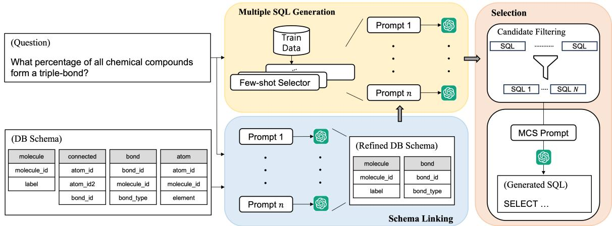
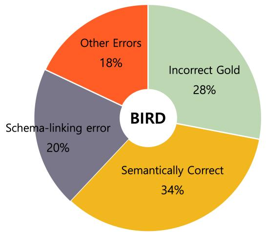
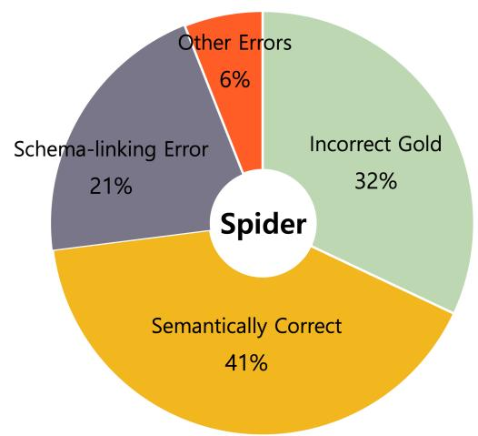

# MCS-SQL: Leveraging Multiple Prompts and Multiple-Choice Selection For Text-to-SQL Generation

Dongjun Lee, Choongwon Park, Jaehyuk Kim, Heesoo Park

Dunamu

{tonny, elvie, loki, belle}@dunamu.com

## Abstract

Recent advancements in large language models (LLMs) have enabled in-context learning (ICL)-based methods that significantly outperform fine-tuning approaches for text-to-SQL tasks. However, their performance is still considerably lower than that of human experts on benchmarks that include complex schemas and queries, such as BIRD. This study considers the sensitivity of LLMs to the prompts and introduces a novel approach that leverages multiple prompts to explore a broader search space for possible answers and effectively aggregate them. Specifically, we robustly refine the database schema through schema linking using multiple prompts. Thereafter, we generate various candidate SQL queries based on the refined schema and diverse prompts. Finally, the candidate queries are filtered based on their confidence scores, and the optimal query is obtained through a multiple-choice selection that is presented to the LLM. When evaluated on the BIRD and Spider benchmarks, the proposed method achieved execution accuracies of 65.5% and 89.6%, respectively, significantly outperforming previous ICL-based methods.

## 1 Introduction

The text-to-SQL task involves translating a natural language question into SQL and is crucial for natural language interfaces to databases (NLIDB) systems. With the recent advancements in large language models (LLMs), in-context learning (ICL)- based approaches for text-to-SQL (Pourreza and Rafiei, 2023a; Gao et al., 2023; Tai et al., 2023) have demonstrated significant performance improvements over traditional fine-tuning methods (Hui et al., 2022; Qi et al., 2022; Li et al., 2023a,b). Notably, Pourreza and Rafiei (2023b) showed that these methods even surpassed gold reference queries in terms of human evaluation within the Spider benchmark. However, for the more challenging BIRD (Li et al., 2023c) benchmark, characterized by its complex database (DB) schemas and queries, the accuracies of ICL-based methods have not exceeded 60%, which is significantly lower than the 93.0% achieved by humans. This gap underscores the need for further advancements in the ICL approach to serve as an NLIDB system.

A significant limitation of LLMs across various tasks is their sensitivity to the structure and content of prompts. Even for semantically identical prompts, LLMs can generate drastically varying responses because of factors such as the order of sentences (Jang and Lukasiewicz, 2023; Wang et al., 2023b), choice of demonstration examples (Liu et al., 2022; Nori et al., 2023), and the sequence in which these examples are presented (Lu et al., 2022). Our experiments confirmed a similar tendency in the text-to-SQL context, where alterations in the schema presentation (§5.3) and the choice of few-shot examples (§5.4) resulted in variations in LLM outputs.

In this study, to improve the accuracy and robustness of LLMs for text-to-SQL, we introduce a novel approach that leverages multiple prompts to generate various candidate answers and effectively aggregates them. We utilize the sensitivity of LLMs to prompts to explore a broader search space for answers using different prompts. As shown in Figure 1, the SQL generation process comprises three steps: schema linking, multiple SQL generation, and selection. Initially, the schema-linking phase robustly selects tables and columns relevant to the question from the DB schema using multiple prompts. Subsequently, the generation phase employs various prompts to produce diverse candidate SQL queries, ensuring a broader exploration of potential queries. Finally, the selection phase filters candidate queries based on confidence scores, and the optimal query is selected through multiplechoice selection (MCS) that is presented to the LLM.

We evaluated our methodology using two benchmarks, BIRD (Li et al., 2023c) and Spider (Yu et al., 2018). For BIRD, we achieved an execution accuracy (EX) of 65.5% and a valid efficiency score (VES) of 71.4%, which outperforms the previous state-of-the-art (SOTA) ICL-based method (Wang et al., 2023a) by +5.9% and +3.7%, respectively, setting a new SOTA performance for the BIRD. In addition, for the Spider test set, we achieved an EX of 89.6%, which outperforms the existing SOTA ICL-based approach (Gao et al., 2023) by 3.0%.

  
Figure 1: Overview of the proposed methodology, including three steps: schema linking, multiple SQL generation, and selection.

## 2 Related Work

Prompt Engineering Prompt engineering, which is the study of designing effective prompts, is an active research area as prompts significantly impact the performance of LLMs across various NLP tasks. A prominent example is the chain-ofthought (CoT) prompting (Wei et al., 2022), which employs manually crafted examples to guide the LLM to generate intermediate reasoning steps prior to deriving the answer. This technique has demonstrated significant performance enhancements across various tasks. Kojima et al. (2022) further demonstrated that LLMs can explain their reasoning steps even in the absence of human-annotated examples.

In addition to CoT, self-consistency decoding (Wang et al., 2022) has been proposed, wherein multiple answers are sampled from the LLM before selecting one through a majority vote. Compared with greedy decoding, this technique facilitates the exploration of various reasoning paths and has exhibited substantial performance gains. For more effective explorations of the reasoning steps, variations such as tree-of-thought (Wei et al., 2022)

and graph-of-thought (Besta et al., 2023) have also been proposed.

However, because these approaches rely on a single prompt to generate the reasoning steps, we hypothesize that they fail to mitigate the issue of LLMs’ high sensitivity to prompts, thereby exploring only a limited search space. Several studies have shown that even when presented with semantically identical prompts, the outputs of LLMs vary based on factors such as sentence structure (Webson and Pavlick, 2022), sequence of sentences (Jang and Lukasiewicz, 2023; Wang et al., 2023b; Pezeshkpour and Hruschka, 2023), choice of fewshot examples (Liu et al., 2022; Nori et al., 2023), and the order in which the examples are presented (Lu et al., 2022). Therefore, we use multiple distinct prompts for a wider exploration of potential answers, thereby mitigating the LLM’s sensitivity issue of LLMs to prompts and ensuring the generation of more robust answers.

ICL for Text-to-SQL As ICL-based approaches have shown remarkable performance in text-to-SQL tasks, various studies have focused on creating better prompts for text-to-SQL. Several studies have focused on applying prompting techniques such as CoT or least-to-most (Zhou et al., 2022) for text-to-SQL generation (Pourreza and Rafiei, 2023a; Tai et al., 2023; Wang et al., 2023a). However, these methods rely on fixed sets of manually crafted examples, and their performance can vary significantly depending on the selection of these examples. In this work, instead of relying on fixed human-labeled examples, we dynamically select few-shot examples from the training data based on the test sample. Some studies have aimed to determine a more effective few-shot selection strategy for text-to-SQL (Guo et al., 2023; Nan et al., 2023; Gao et al., 2023). However, unlike these studies, which focused on determining a single optimal selection strategy, we employ a parallel approach that employs various few-shot selection strategies with multiple prompts and effectively aggregates them.

## 3 Methodology

As shown in Figure 1, the proposed method comprises three steps: (1) schema linking, wherein tables and columns irrelevant to the question from the DB schema are excluded; (2) multiple SQL generation, wherein multiple candidate SQL queries are generated based on various prompts; and (3) selection, wherein the most accurate SQL query is selected from among the candidates.

## 3.1 Schema Linking

Schema linking involves identifying relevant tables and columns from a DB to convert a natural language question into an SQL query (Guo et al., 2019). The introduction of schema linking has significantly improved the performances of both finetuning-based (Lei et al., 2020; Xu et al., 2022; Qi et al., 2022; Li et al., 2023a) and ICL-based (Dong et al., 2023; Pourreza and Rafiei, 2023a; Wang et al., 2023a) approaches.

We perform schema linking in two steps: first, the tables related to the natural language query are extracted (table linking). Thereafter, the necessary columns within those tables are extracted (column linking). We employ multiple prompts in both phases with the aim of achieving a high recall.

## 3.1.1 Table Linking

In table linking, the DB schema and question are input into the LLM, which extracts a list of reference tables to generate the SQL query. Inspired by zeroshot-CoT (Kojima et al., 2022), we ask the LLM to explain why each table is necessary, instead of just selecting a list of tables. To easily parse the LLM’s answer, we ask it to respond in the JSON format, as described in Listing 1.

### For a given DB schema and question,   
extract the list of tables required   
to write the SQL query.   
### DB schema: ...   
### Question: ...   
Your answer should be in the json format   
:   
{

"reasoning": "..." # The reason for   
selecting each table.   
"answer": [...] # List of selected   
tables.   
### Your answer:  
Listing 1: Prompt template for table linking. An example of the full prompt is presented in Appendix B.1.1.

To enhance the robustness of table linking, we utilize multiple prompts. Various studies have demonstrated that LLM outputs are significantly affected by the sequence of input sentences (Jang and Lukasiewicz, 2023; Wang et al., 2023b; Liu et al., 2023). Similarly, our experiments (§5.3) revealed that the output of schema-linking output of LLMs also depends on the sequence in which the tables and columns are arranged in the prompts. To minimize the influence of the table order, we randomly shuffle the order of tables, generating $p _ { t }$ distinct prompts. For each prompt, we obtain n responses from the LLM by using a high sampling temperature. The final table-linking output is derived from the union of all responses, amounting to $p _ { t }$ · n table lists. We use a union operation because including unnecessary tables in table linking does not significantly impact the subsequent SQL-generation process; however, omitting the necessary tables prevents the generation of the correct SQL query.

## 3.1.2 Column Linking

For column linking, we ask the LLM to extract the columns required for converting a question into an SQL query using a prompt similar to that used in table linking. The prompt includes only the schemas of the tables selected during table linking, instead of the entire DB schema. Because the same column name can exist in different tables, we instruct the LLM to provide the answer in the [table\_name].[column\_name] format.

Similar to table linking, the order of the tables and columns is randomly shuffled to generate $p _ { c }$ unique prompts. Subsequently, n LLM responses are generated for each prompt, where each response represents a selected column list. The columnlinking output is the union of all $p _ { c } * n$ responses.

In the subsequent SQL-generation steps, when providing the DB schema to LLM, only the tables and columns selected through schema linking are provided instead of the full schema.

## 3.2 Multiple SQL Generation

To address the sensitivity of the LLM to prompts, we generate various SQL queries based on multiple, distinct prompts. Several studies have demonstrated that the output of an LLM can differ significantly depending on the few-shot examples provided (Liu et al., 2022; Wu et al., 2023), and even on the sequence in which these examples are presented (Lu et al., 2022; Zhao et al., 2021). To effectively leverage this variability, we generate multiple prompts by varying both the selection method of the few-shot examples and the order in which they are presented, thereby ensuring a broader exploration of potential SQL queries.

## 3.2.1 Few-Shot Examples Selection

For each test sample, a set of few-shot examples is selected from the training dataset. To generate multiple prompts with different examples, we use two distinct selection strategies: one that leverages question similarity and another that utilizes masked question similarity. In the question similarity-based approach, we select the top-k questions from the training dataset that have the nearest sentence embeddings to the natural language question of the test sample.

Similarly, the masked question similarity-based approach considers the embedding similarity of masked questions, wherein tokens specific to the DB schema in the question are masked. This masking allows determining the similarity of questions in terms of generating similar queries by disregarding schema-specific content. We employ an LLM for the masking process by presenting it with the DB schema and question, and asking it to replace the table names, column names, and values with special tokens. The prompt for this question masking is presented in Appendix B.2.

Through these two few-shot selection strategies, we generate $p _ { q }$ different prompts, including one derived exclusively from question similarity, another solely from masked question similarity, and additional prompts created by integrating examples from both strategies in various sequences.

## 3.2.2 SQL Generation

```markdown
### Generate the correct SQL query for a
given DB schema and question.
### Gold Examples:
Question: ...
Gold SQL: ...
```

```markdown
### DB Schema: ...
### Sample Table Contents: ...
### Question: ...
Your answer should be in the json format
:
"reasoning": ".." # The reasoning
steps behind the generated SQL query
"sql": ".." # The generated SQL query.
### Your answer:
```  
Listing 2: Prompt template for SQL generation. An example of the full prompt is presented in Appendix B.3.

As illustrated in Listing 2, our SQL-generation prompt includes few-shot examples, a DB schema, sample table contents, and a natural language question. The few-shot examples comprise questions and their corresponding gold SQL pairs. To conserve the limited length of the prompt, we exclude the schema of the target DB for each question. Regarding the DB schema, we selectively present only the tables and columns selected during the schemalinking process to avoid burdening the LLM with irrelevant information. Additionally, we embed sample table contents in the CSV format within the prompt to facilitate the LLM’s comprehension of potential values in each column, thereby providing practical insight into the data structure of the DB. Finally, we instruct LLM not only to produce the SQL query but also to explain the reasoning behind its generation, thereby enhancing the model’s interpretability and accuracy.

For each prompt, we generate n responses from the LLM using a high sampling temperature, resulting in $p _ { q } \cdot n$ candidate SQL queries being generated.

## 3.3 Selection

The selection step aims to select the most accurate query from the candidate queries. Initially, the candidate pool is filtered based on confidence scores, and the LLM is then tasked with selecting the most accurate query from the refined pool.

## 3.3.1 Candidate Filtering

To select the most accurate query among the candidates, we first narrow down the candidate pool. Queries with the same execution results are grouped together, and only the fastest query from each group is retained. Additionally, queries with low confidence scores are excluded from the candidates.

In detail, all candidate queries are executed on the DB, and queries that result in syntax errors or timeouts are removed from the candidate pool. Next, the confidence score for each query in the candidate pool is calculated, which is determined based on the number of queries that produce the same execution result. Formally, for a candidate pool C containing N queries $\{ q _ { 1 } , \dots , q _ { N } \}$ , the confidence of query q<sub>i</sub> is computed as follows:

$$
{ \mathrm { c o n f i d e n c e } } ( q _ { i } ) = { \frac { 1 } { N } } \sum _ { j = 1 } ^ { N } [ { \mathrm { e x e c } } ( q _ { j } ) = { \mathrm { e x e c } } ( q _ { i } ) ]\tag{1}
$$

where $\operatorname { e x e c } ( q _ { i } )$ denotes the execution result for query $q _ { i } .$

Among the queries in candidate pool $C$ with identical execution results, only the query with the minimum execution time is selected as follows:

$$
C ^ { \prime } = \bigcup _ { R \in { \mathcal R } ( C ) } \operatorname { a r g m i n } _ { q _ { i } \in C , \operatorname { e x e c } ( q _ { i } ) = R } \operatorname { e x e c \_ t i m e } ( q _ { i } )\tag{2}
$$

where R(C) represents the set of all unique execution results from all queries in C, and exec\_time $( q _ { i } )$ denotes the execution time for query q<sub>i</sub>.

Finally, all queries in $C ^ { \prime }$ with confidence score below threshold $T$ are excluded as follows:

$$
C ^ { \prime \prime } = \{ q _ { i } \in C ^ { \prime } \mid \mathrm { c o n f i d e n c e } ( q _ { i } ) \geq T \} ,\tag{3}
$$

resulting in a refined candidate pool $C ^ { \prime \prime } .$

## 3.3.2 Multiple-Choice Selection (MCS)

Following the filtering process, we utilize the LLM to select the most accurate query among the candidates through a multiple-choice question.

```markdown
### For a given DB schema and question,
select the most accurate query among
the candidate SQL queries.
### DB schema: ...
### Question: ...
### Candidate SQLs:
1. SQL1
2. SQL2
3. SQL3
Your answer should be in the json format
:
{
"reasoning": ".." # The reasoning
steps for selecting the correct SQL
query.
"sql": ".." # The selected SQL query.
```

```markdown
### Your answer:
```

Listing 3: Prompt template for SQL selection. An example of the full prompt is presented in Appendix B.4.

As shown in the Listing 3, we present a set of candidate SQL queries to the LLM and request it to select the most accurate query for a given DB schema and question. Candidate queries are provided in descending order of confidence scores, considering the tendency of LLMs to favor options that appear earlier in the multiple-choice questions (Wang et al., 2023b; Zheng et al., 2023). The LLM is required to not only select an SQL query but also provide the reasons for its selection. We sample n responses from the LLM and determine the final SQL query through a majority vote.

## 4 Experimental Setup

## 4.1 Datasets

Spider Spider (Yu et al., 2018) is a large-scale, complex, cross-domain text-to-SQL benchmark comprising 10,181 questions and 5,693 distinct queries across 200 databases, each with multiple tables. This benchmark requires the model to adapt to an unseen DB schema because different DBs are used for training and testing.

BIRD BIRD (Li et al., 2023c) is a new largescale, cross-domain text-to-SQL benchmark comprising 12,751 unique question-SQL pairs across 95 large real-world databases. Compared with Spider, BIRD comprises considerably more complex SQL queries with various SQL keywords (LEFT JOIN, PARTITION BY, etc.) and functions (IIF, CASE, ROUND, etc.) that are not included in Spider. In addition, BIRD requires reasoning using external knowledge (such as synonym knowledge and value illustrations) to generate accurate SQL queries.

## 4.2 Evaluation Metrics

Execution Accuracy (EX) EX indicates whether the SQL execution result generated by the model is identical to the gold SQL query. Because an SQL query can be written in various forms to produce the same result, evaluation metrics based on string matching significantly underestimate model performance.

Valid Efficiency Score (VES) For the BIRD dataset, Li et al. (2023c) proposed an additional evaluation metric called VES that measures the efficiency of a valid model-generated query based on the execution time. A query is considered invalid and assigned a score of zero if its execution result differs from that of the gold SQL. Therefore, VES considers both the model accuracy and efficiency for the generated query.

<table><tr><td></td><td colspan="2">Dev</td><td colspan="2">Test</td></tr><tr><td>Model</td><td>EX</td><td>VES</td><td>EX</td><td>VES</td></tr><tr><td>GPT-4 (zero-shot)</td><td>46.4</td><td>49.8</td><td>54.9</td><td>60.8</td></tr><tr><td>DIN-SQL + GPT-4 (Pourreza and Rafiei, 2023a)</td><td>50.7</td><td>58.8</td><td>55.9</td><td>59.4</td></tr><tr><td>DAIL-SQL + GPT-4 (Gao et al., 2023)</td><td>54.8</td><td>56.1</td><td>57.4</td><td>62.0</td></tr><tr><td> $\mathrm { M A C - S Q L + G P T - 4 }$  (Wang et al., 2023a)</td><td>57.7</td><td>58.8</td><td>59.6</td><td>67.7</td></tr><tr><td> $\mathrm { M C S - S Q L + G P T - 4 \left( O u r s \right) }$ </td><td>63.4</td><td>64.8</td><td>65.5</td><td>71.4</td></tr></table>

Table 1: Execution accuracies (EX) and valid efficiency scores (VES) for the BIRD dev and test sets.

<table><tr><td>Model</td><td>Dev</td><td>Test</td></tr><tr><td>GPT-4 (zero-shot)</td><td>74.6</td><td>一</td></tr><tr><td>DIN-SQL + GPT-4 (Pourreza and Rafiei, 2023a)</td><td>82.8</td><td>85.3</td></tr><tr><td>DAIL-SQL + GPT-4</td><td>84.4</td><td>86.6</td></tr><tr><td>(Gao et al., 2023) MAC-SQL + GPT-4</td><td>86.8</td><td></td></tr><tr><td>(Wang et al., 2023a)  $\mathrm { M C S - S Q L + G P T - 4 \left( O u r s \right) }$ </td><td>89.5</td><td>89.6</td></tr></table>

Table 2: Execution accuracies for the Spider dev and test sets. "-" denotes that the model did not report performance for the test set.

## 4.3 Implementation Details

In all of our experiments, we used the GPT-4 8K as the LLM and text-embedding-ada-002 as the sentence embedding model, which was accessed via Azure OpenAI API. Additionally, we employed the FAISS (Douze et al., 2024) library for the embedding similarity search. In schema linking, we used $p _ { t } = 3$ prompts for table linking and $p _ { c } = 3$ prompts for column linking. To generate multiple candidate SQL queries, we use $p _ { q } = 5$ distinct prompts. For each GPT API call, we used a temperature of 1.0 and generated n=20 responses. In both the SQL-generation and MCS steps, we used k=20 question-SQL pairs as few-shot examples. We executed all candidate SQL queries with a timeout of 180s and filtered out queries with a confidence score lower than the threshold T=0.2.

## 4.4 Baselines

We compare the proposed MCS-SQL approach with ICL-based methods based on GPT-4.

GPT-4 (Achiam et al., 2023) uses the zero-shot prompt provided in OpenAI’s text-to-SQL demo<sup>1</sup>.

DIN-SQL (Pourreza and Rafiei, 2023a) classifies the complexity of the question and generates an SQL query by applying different prompts based on the classification result. In each step, it uses a prompt with fixed few-shot examples that are manually written in the CoT style.

DAIL-SQL (Gao et al., 2023) employs dynamic few-shot examples by considering the similarity of both the questions and the queries. For additional performance improvement, self-consistency (Wang et al., 2022) is introduced.

MAC-SQL (Wang et al., 2023a) decomposes the question into sub-questions and sequentially generates SQL queries for each sub-question using manually crafted few-shot samples. Additionally, in case of a syntax error, it uses a prompt to correct the generated query.

## 5 Results and Analysis

## 5.1 Main Results

BIRD Table 1 presents the EX and VES of the proposed and baseline models for the BIRD dev and test sets. The results demonstrate that the proposed approach significantly outperforms existing ICL-based approaches in both metrics. Specifically, the proposed method achieved an EX of 65.45% and a VES of 71.35% on the holdout test set, surpassing the performance of the previous SOTA ICLbased approach (Wang et al., 2023a) by significant margins of 5.86% and 3.67%, respectively. Furthermore, the proposed method established a new

<table><tr><td>Method</td><td>Simple</td><td>Moderate</td><td>Challenging</td><td>ALL</td></tr><tr><td>zero-shot</td><td>59.0</td><td>40.2</td><td>30.6</td><td>50.7</td></tr><tr><td>+ schema linking</td><td>61.4</td><td>41.1</td><td>35.4</td><td>52.8 (+2.1)</td></tr><tr><td>+ sample table contents</td><td>64.1</td><td>42.6</td><td>38.9</td><td>55.2 (+2.4)</td></tr><tr><td>+ few-shot examples</td><td>67.1</td><td>51.6</td><td>41.0</td><td>60.0 (+4.8)</td></tr><tr><td>+ MCS  $( p _ { q } { = } 1 , n { = } 2 0 )$ </td><td>69.3</td><td>52.0</td><td>48.6</td><td>62.1 (+2.1)</td></tr><tr><td> $+ \mathrm { M C S } \ ( p _ { q } = 5 , n { = } 2 0 )$ </td><td>70.4</td><td>53.1</td><td>51.4</td><td>63.4 (+1.3)</td></tr></table>

Table 3: Execution accuracies for the ablation analysis on the BIRD dev set across various difficulty levels.
<table><tr><td>Method</td><td>Easy</td><td>Medium</td><td>Hard</td><td>Extra Hard</td><td>ALL</td></tr><tr><td>zero-shot</td><td>79.0</td><td>83.4</td><td>66.7</td><td>52.4</td><td>74.6</td></tr><tr><td>+ schema linking</td><td>86.7</td><td>85.0</td><td>67.2</td><td>57.2</td><td>77.9 (+3.3)</td></tr><tr><td>+ sample table contents</td><td>89.9</td><td>88.6</td><td>69.0</td><td>59.0</td><td>80.9 (+3.0)</td></tr><tr><td>+ few-shot examples</td><td>94.0</td><td>90.4</td><td>86.2</td><td>66.3</td><td>86.7 (+5.8)</td></tr><tr><td>+ MCS  $( p _ { q } { = } 1 , n { = } 2 0 )$ </td><td>93.1</td><td>92.6</td><td>88.5</td><td>72.2</td><td>88.8 (+2.1)</td></tr><tr><td>+ MCS  $( p _ { q } = 5 , n = 2 0 )$ </td><td>94.0</td><td>93.5</td><td>88.5</td><td>72.9</td><td>89.5 (+0.7)</td></tr></table>

Table 4: Execution accuracies for the ablation analysis on the Spider dev set across various difficulty levels.

SOTA performance on the BIRD, surpassing the former SOTA method with a substantial margin of 4.74% in EX and 3.67% in VES.

Spider Table 2 presents the EX of the proposed and baseline methods for the Spider dev and test sets. Similar to the results obtained for BIRD, the proposed approach significantly outperforms all existing ICL-based approaches. Specifically, on the dev set, our approach achieved an EX of 89.5, which exceeds that of the former SOTA ICL-based approach (Wang et al., 2023a) by +2.7%.

## 5.2 Ablation Study

We conducted an ablation study to investigate the incremental impact of each component of the proposed approach on the EX. The ablation results for the BIRD dev set are presented in Table 3. The addition of schema linking to the baseline zero-shot setting resulted in a 2.1% improvement. This underscores the importance of refining the schema prior to SQL generation and shows that the proposed schema-linking process effectively selects relevant tables and columns. The inclusion of the sample table contents in the prompt further amplified this gain by +2.4%. The introduction of dynamic fewshot examples that were selected based on masked question similarity resulted in the largest performance improvement of +4.8%. Moreover, when we sampled multiple answers from the LLM using the same prompt and employed the proposed MCS method, the performance further improved by 2.1%. This demonstrates the capability of the proposed SQL selection method in discerning and selecting the most accurate query from a set of candidates. Finally, introducing multiple prompts led to further enhancements of +1.3%, particularly showing significant performance improvement on challenging queries. This improvement demonstrates that broadening the search space using various prompts significantly boosted the SQL-generation accuracy.

Table 4 lists the ablation results for the Spider dev set, wherein it is evident that each component of the proposed approach contributed to significant performance gains, similar to the results obtained for BIRD. This consistent performance enhancement across different benchmarks confirms the effectiveness and adaptability of the proposed approach for the text-to-SQL task.

## 5.3 Impact of Using Multiple Prompts in Schema Linking

We conducted a comparative analysis of the following three cases to investigate the impact of using multiple prompts in schema linking: (1) greedy decoding with a single prompt; (2) taking the union of multiple answers generated from a single prompt; and (3) taking the union of multiple answers generated from multiple prompts. Table 5 lists the recall of schema linking for each case, which was calculated based on whether the predicted list of tables and columns included those used in the gold query.

The results demonstrate that sampling multiple responses using the same prompt and aggregating them led to notable performance gains of +15.8% for BIRD and +4.7% for Spider. However, leveraging multiple prompts contributed to further significant improvements, with gains of +12.7% for BIRD and +2.7% for Spider. These results indicate that the order of tables and columns in the prompt affects the schema-linking results of the LLM and that the proposed multiple-prompt approach effectively mitigates this sensitivity. This improvement was particularly noticeable in BIRD, implying that the effectiveness of using multiple prompts increases for larger and more complex DB schemas.

As it is impossible to generate accurate SQL queries in subsequent processes if the necessary tables or columns are omitted in schema linking, our proposal of using the union of various responses from multiple prompts is pivotal for enhancing the SQL-generation performance.

<table><tr><td>Method</td><td>BIRD</td><td>Spider</td></tr><tr><td> $p _ { t } = p _ { c } = 1 , n = 1$ </td><td>61.3</td><td>91.8</td></tr><tr><td> $p _ { t } = p _ { c } = 1 , n = 2 0$ </td><td>77.1</td><td>96.5</td></tr><tr><td> $p _ { t } = p _ { c } = 3 , n = 2 0$ </td><td>89.8</td><td>99.2</td></tr><tr><td>(proposed)</td><td></td><td></td></tr></table>

Table 5: Recall of schema linking for the BIRD and Spider dev sets under three different settings: (1) greedy decoding with a single prompt, (2) sampling multiple answers from the same prompt, and (3) employing multiple prompts.

## 5.4 Impacts of Different Few-shot Selection Strategies

Table 6 presents the EXs when different few-shot strategies were employed. The performance improved significantly by selecting few-shot examples based on question similarity instead of random selection, with an increase of 2.3% for BIRD and 4.2% for Spider. Additionally, a further performance boost was noted by predicating the selection on the similarity of the masked question rather than the original question, with enhancements of 0.7% and 0.5% for BIRD and Spider, respectively.

## 5.5 Impact of MCS

During the SQL selection phase (§3.3), we explored whether the proposed MCS via LLM was more effective than a majority vote, which selects the query with the highest confidence score. As presented in Table 7, the proposed MCS approach outperformed the majority vote approach by +0.6% and +0.3% for the BIRD and Spider, respectively. Notably, in the absence of confidence-based filtering, as expressed in Eq. (3), the efficacy of the MCS method decreased significantly. This result underscores the importance of employing confidencebased filtering to effectively narrow down the candidate pool when using MCS.

<table><tr><td>Method</td><td>BIRD Spider</td></tr><tr><td>Random 57.0</td><td>82.0</td></tr><tr><td>Question Similarity</td><td>59.3 86.2</td></tr><tr><td>Masked Question Similarity 60.0</td><td>86.7</td></tr></table>

Table 6: Execution accuracies under different few-shot examples selection strategies for the BIRD and Spider dev sets.

<table><tr><td>Method</td><td>BIRD</td><td>Spider</td></tr><tr><td>Majority Vote</td><td>62.8</td><td>89.2</td></tr><tr><td>MCS w/o confidence filtering</td><td>62.5</td><td>85.4</td></tr><tr><td>MCS w/ confidence filtering (proposed)</td><td>63.4</td><td>89.5</td></tr></table>

Table 7: Execution accuracies under different SQL selection strategies for the BIRD and Spider dev sets.

## 6 Conclusion

This study introduces a novel method that leverages multiple prompts to enhance the accuracy and robustness of ICL-based text-to-SQL generation. Specifically, the proposed approach performs robust schema linking using distinct prompts. In addition, we employ different few-shot selection strategies to generate multiple query generation prompts, which yield various candidate SQL queries. These candidates are subsequently filtered based on their confidence scores, and the optimal query is selected using the LLM with MCS. Evaluations on the BIRD and Spider benchmarks showed that the proposed approach significantly outperforms existing ICL-based approaches and achieved a new SOTA performance on the BIRD.

## Limitations

Our SQL-generation process is costly due to (1) requiring three to four consecutive API calls to the LLM and (2) utilizing multiple prompts and generating diverse LLM responses for each prompt. As the LLM advances, the cost will decrease, but a more cost-effective approach could be a future research direction.

## References

Josh Achiam, Steven Adler, Sandhini Agarwal, Lama Ahmad, Ilge Akkaya, Florencia Leoni Aleman, Diogo Almeida, Janko Altenschmidt, Sam Altman, Shyamal Anadkat, et al. 2023. Gpt-4 technical report. arXiv preprint arXiv:2303.08774.

Maciej Besta, Nils Blach, Ales Kubicek, Robert Gerstenberger, Lukas Gianinazzi, Joanna Gajda, Tomasz Lehmann, Michal Podstawski, Hubert Niewiadomski, Piotr Nyczyk, et al. 2023. Graph of thoughts: Solving elaborate problems with large language models. arXiv preprint arXiv:2308.09687.

Xuemei Dong, Chao Zhang, Yuhang Ge, Yuren Mao, Yunjun Gao, Jinshu Lin, Dongfang Lou, et al. 2023. C3: Zero-shot text-to-sql with chatgpt. arXiv preprint arXiv:2307.07306.

Matthijs Douze, Alexandr Guzhva, Chengqi Deng, Jeff Johnson, Gergely Szilvasy, Pierre-Emmanuel Mazaré, Maria Lomeli, Lucas Hosseini, and Hervé Jégou. 2024. The faiss library.

Dawei Gao, Haibin Wang, Yaliang Li, Xiuyu Sun, Yichen Qian, Bolin Ding, and Jingren Zhou. 2023. Text-to-sql empowered by large language models: A benchmark evaluation. arXiv preprint arXiv:2308.15363.

Chunxi Guo, Zhiliang Tian, Jintao Tang, Pancheng Wang, Zhihua Wen, Kang Yang, and Ting Wang. 2023. Prompting gpt-3.5 for text-to-sql with desemanticization and skeleton retrieval. In Pacific Rim International Conference on Artificial Intelligence, pages 262–274. Springer.

Jiaqi Guo, Zecheng Zhan, Yan Gao, Yan Xiao, Jian-Guang Lou, Ting Liu, and Dongmei Zhang. 2019. Towards complex text-to-SQL in cross-domain database with intermediate representation. In Proceedings of the 57th Annual Meeting of the Association for Computational Linguistics, pages 4524–4535, Florence, Italy. Association for Computational Linguistics.

Binyuan Hui, Ruiying Geng, Lihan Wang, Bowen Qin, Yanyang Li, Bowen Li, Jian Sun, and Yongbin Li. 2022. S2sql: Injecting syntax to question-schema interaction graph encoder for text-to-sql parsers. In Findings of the Association for Computational Linguistics: ACL 2022, pages 1254–1262.

Myeongjun Jang and Thomas Lukasiewicz. 2023. Consistency analysis of ChatGPT. In Proceedings of the 2023 Conference on Empirical Methods in Natural Language Processing, pages 15970–15985, Singapore. Association for Computational Linguistics.

Takeshi Kojima, Shixiang Shane Gu, Machel Reid, Yutaka Matsuo, and Yusuke Iwasawa. 2022. Large language models are zero-shot reasoners. Advances in neural information processing systems, 35:22199– 22213.

Wenqiang Lei, Weixin Wang, Zhixin Ma, Tian Gan, Wei Lu, Min-Yen Kan, and Tat-Seng Chua. 2020. Reexamining the role of schema linking in text-to-sql. In Proceedings ofthe 2020 Conference on Empirical Methods in Natural Language Processing (EMNLP), pages 6943–6954.

Haoyang Li, Jing Zhang, Cuiping Li, and Hong Chen. 2023a. Resdsql: Decoupling schema linking and skeleton parsing for text-to-sql. In Proceedings of the AAAI Conference on Artificial Intelligence, volume 37, pages 13067–13075.

Jinyang Li, Binyuan Hui, Reynold Cheng, Bowen Qin, Chenhao Ma, Nan Huo, Fei Huang, Wenyu Du, Luo Si, and Yongbin Li. 2023b. Graphix-t5: Mixing pretrained transformers with graph-aware layers for textto-sql parsing. arXiv preprint arXiv:2301.07507.

Jinyang Li, Binyuan Hui, Ge Qu, Binhua Li, Jiaxi Yang, Bowen Li, Bailin Wang, Bowen Qin, Rongyu Cao, Ruiying Geng, Nan Huo, Chenhao Ma, Kevin C. C. Chang, Fei Huang, Reynold Cheng, and Yongbin Li. 2023c. Can llm already serve as a database interface? a big bench for large-scale database grounded textto-sqls.

Jiachang Liu, Dinghan Shen, Yizhe Zhang, William B Dolan, Lawrence Carin, and Weizhu Chen. 2022. What makes good in-context examples for gpt-3? In Proceedings of Deep Learning Inside Out (Dee-LIO 2022): The 3rd Workshop on Knowledge Extraction and Integration for Deep Learning Architectures, pages 100–114.

Nelson F Liu, Kevin Lin, John Hewitt, Ashwin Paranjape, Michele Bevilacqua, Fabio Petroni, and Percy Liang. 2023. Lost in the middle: How language models use long contexts. arXiv preprint arXiv:2307.03172.

Yao Lu, Max Bartolo, Alastair Moore, Sebastian Riedel, and Pontus Stenetorp. 2022. Fantastically ordered prompts and where to find them: Overcoming fewshot prompt order sensitivity. In Proceedings ofthe 60th Annual Meeting ofthe Associationfor Computational Linguistics (Volume 1: Long Papers), pages 8086–8098.

Linyong Nan, Yilun Zhao, Weijin Zou, Narutatsu Ri, Jaesung Tae, Ellen Zhang, Arman Cohan, and Dragomir Radev. 2023. Enhancing text-to-sql capabilities of large language models: A study on prompt

design strategies. In Findings of the Association for Computational Linguistics: EMNLP 2023, pages 14935–14956.

Harsha Nori, Yin Tat Lee, Sheng Zhang, Dean Carignan, Richard Edgar, Nicolo Fusi, Nicholas King, Jonathan Larson, Yuanzhi Li, Weishung Liu, et al. 2023. Can generalist foundation models outcompete special-purpose tuning? case study in medicine. arXiv preprint arXiv:2311.16452.

Pouya Pezeshkpour and Estevam Hruschka. 2023. Large language models sensitivity to the order of options in multiple-choice questions. arXiv preprint arXiv:2308.11483.

Mohammadreza Pourreza and Davood Rafiei. 2023a. Din-sql: Decomposed in-context learning of textto-sql with self-correction. arXiv preprint arXiv:2304.11015.

Mohammadreza Pourreza and Davood Rafiei. 2023b. Evaluating cross-domain text-to-sql models and benchmarks. In Proceedings of the 2023 Conference on Empirical Methods in Natural Language Processing, pages 1601–1611.

Jiexing Qi, Jingyao Tang, Ziwei He, Xiangpeng Wan, Yu Cheng, Chenghu Zhou, Xinbing Wang, Quanshi Zhang, and Zhouhan Lin. 2022. Rasat: Integrating relational structures into pretrained seq2seq model for text-to-sql. In Proceedings of the 2022 Conference on Empirical Methods in Natural Language Processing, pages 3215–3229.

Chang-Yu Tai, Ziru Chen, Tianshu Zhang, Xiang Deng, and Huan Sun. 2023. Exploring chain of thought style prompting for text-to-SQL. In Proceedings of the 2023 Conference on Empirical Methods in Natural Language Processing, pages 5376–5393, Singapore. Association for Computational Linguistics.

Bing Wang, Changyu Ren, Jian Yang, Xinnian Liang, Jiaqi Bai, Qian-Wen Zhang, Zhao Yan, and Zhoujun Li. 2023a. Mac-sql: Multi-agent collaboration for text-to-sql. arXiv preprint arXiv:2312.11242.

Xuezhi Wang, Jason Wei, Dale Schuurmans, Quoc Le, Ed Chi, Sharan Narang, Aakanksha Chowdhery, and Denny Zhou. 2022. Self-consistency improves chain of thought reasoning in language models. arXiv preprint arXiv:2203.11171.

Yiwei Wang, Yujun Cai, Muhao Chen, Yuxuan Liang, and Bryan Hooi. 2023b. Primacy effect of chatgpt. In Proceedings ofthe 2023 Conference on Empirical Methods in Natural Language Processing, pages 108– 115.

Albert Webson and Ellie Pavlick. 2022. Do promptbased models really understand the meaning of their prompts? In Proceedings of the 2022 Conference of the North American Chapter of the Association for Computational Linguistics: Human Language Technologies, pages 2300–2344.

Jason Wei, Xuezhi Wang, Dale Schuurmans, Maarten Bosma, Fei Xia, Ed Chi, Quoc V Le, Denny Zhou, et al. 2022. Chain-of-thought prompting elicits reasoning in large language models. Advances in Neural Information Processing Systems, 35:24824–24837.

Zhiyong Wu, Yaoxiang Wang, Jiacheng Ye, and Lingpeng Kong. 2023. Self-adaptive in-context learning: An information compression perspective for incontext example selection and ordering. In Proceedings ofthe 61st Annual Meeting ofthe Associationfor Computational Linguistics (Volume 1: Long Papers), pages 1423–1436, Toronto, Canada. Association for Computational Linguistics.

Kuan Xu, Yongbo Wang, Yongliang Wang, Zihao Wang, Zujie Wen, and Yang Dong. 2022. Sead: End-to-end text-to-sql generation with schema-aware denoising. In Findings of the Association for Computational Linguistics: NAACL 2022, pages 1845–1853.

Tao Yu, Rui Zhang, Kai Yang, Michihiro Yasunaga, Dongxu Wang, Zifan Li, James Ma, Irene Li, Qingning Yao, Shanelle Roman, et al. 2018. Spider: A large-scale human-labeled dataset for complex and cross-domain semantic parsing and text-to-sql task. In Proceedings of the 2018 Conference on Empirical Methods in Natural Language Processing, pages 3911–3921.

Zihao Zhao, Eric Wallace, Shi Feng, Dan Klein, and Sameer Singh. 2021. Calibrate before use: Improving few-shot performance of language models. In International Conference on Machine Learning, pages 12697–12706. PMLR.

Chujie Zheng, Hao Zhou, Fandong Meng, Jie Zhou, and Minlie Huang. 2023. Large language models are not robust multiple choice selectors. arXiv e-prints, pages arXiv–2309.

Denny Zhou, Nathanael Schärli, Le Hou, Jason Wei, Nathan Scales, Xuezhi Wang, Dale Schuurmans, Claire Cui, Olivier Bousquet, Quoc Le, et al. 2022. Least-to-most prompting enables complex reasoning in large language models. arXiv preprint arXiv:2205.10625.

## A Error Analysis

We performed an error analysis to gain a deeper understanding of the instances in which the proposed method failed to accurately predict the SQL query. This analysis was conducted on a random sample of 100 examples from both the Spider and BIRD dev sets, where the execution results of the predicted query and gold SQL differed. Failure cases were categorized into four distinct categories as follows:

• Incorrect Gold: The gold SQL query provided by human annotators in the dataset was incorrect.

• Semantically Correct: The predicted SQL query was semantically equivalent to the gold SQL query, but the execution result differed owing to factors such as ties in the output (Pourreza and Rafiei, 2023b), the order of columns in the SELECT clause, or the inclusion of additional columns in the SELECT clause.

• Schema Linking Error: The predicted SQL query referred to different tables or columns than those referred to in the gold SQL query.

• Other Errors: The predicted SQL contained errors other than schema linking.

Examples from each category are listed in Table 8.

The results of manually classifying the failure cases are depicted in Figure 2. The 62 and 73% failure cases in the BIRD and Spider benchmarks, respectively, were those wherein the correct query was generated but they were still considered failures owing to inaccuracies in the gold queries or limitations of the method used to calculate the EX. When these cases were excluded, the most prevalent error was schema linking, which involved selecting incorrect tables or columns (20% for BIRD and 21% for Spider). However, even for human experts, referencing the exact tables and columns as the gold query is a challenging task because of inherent ambiguities. Such ambiguities arise when multiple columns in a DB share the same semantic meaning, or when the question does not explicitly specify the columns to be included in the SELECT clause. Other errors, excluding schema linking, accounted for only 6% and 18% of the errors for Spider and BIRD, respectively. These errors encompassed cases in which the question or evidence was misinterpreted, incorrect assumptions were made regarding the DB content, or a syntactically correct SQL query could not be generated.

These results indicate that the EX of the proposed approach was significantly underestimated for both datasets. Furthermore, this analysis underscores the need for more precise gold queries and robust evaluation methodologies for text-to-SQL tasks.



  
Figure 2: Error analysis for the Spider and BIRD dev sets.

<table><tr><td colspan="2">Incorrect Gold</td></tr><tr><td>Question</td><td>List out the code for drivers who have nationality in America.</td></tr><tr><td>Evidence</td><td>nationality = &#x27;America</td></tr><tr><td>GOLD</td><td>SELECT code FROM drivers WHERE Nationality = &#x27;American</td></tr><tr><td>PRED</td><td>SELECT code FROM drivers WHERE nationality = &#x27;America&#x27;</td></tr><tr><td>Question</td><td>Which customer paid the most in 2012/8/25?</td></tr><tr><td>Evidence</td><td>&#x27;2012/8/25’ can be represented by  $2 0 1 2 \cdot 0 8 \cdot 2 5 ^ { \circ }$ </td></tr><tr><td>GOLD</td><td>SELECT CustomerID FROM transactions_1k WHERE Date = &#x27;2012-08-25’ GROUP BY</td></tr><tr><td>PRED</td><td>CustomerID ORDER BY SUM(Price) DESC LIMIT 1 SELECT CustomerID FROM transactions_1k WHERE  $\mathrm { D a t e } = { } ^ { \cdot } 2 0 1 2 { \cdot } 0 8 { \cdot } 2 5 ^ { \circ }$  GROUP BY</td></tr><tr><td>Semantically Correct</td><td>CustomerID ORDER BY SUM(Amount * Price) DESC LIMIT 1</td></tr><tr><td>Question</td><td></td></tr><tr><td></td><td>What is the phone number and extension number for the school with the zip code 95203-3704? Indicate the school&#x27;s name.</td></tr><tr><td>GOLD PRED</td><td>SELECT Phone, Ext, School FROM schools WHERE  $\mathrm { Z i p } = { } ^ { \cdot } 9 5 2 0 3 { - } 3 7 0 4 ^ { \cdot }$ </td></tr><tr><td></td><td>SELECT School, Phone, Ext FROM schools WHERE  $\mathrm { Z i \hat { p } } = { } ^ { \cdot } 9 5 2 0 3 { - } 3 7 0 4 ^ { \cdot }$ </td></tr><tr><td>Question</td><td>List the card names with value that cost more converted mana for the face.</td></tr><tr><td>Evidence</td><td>more converted mana for the face refers to Max(faceConvertedManaCost);</td></tr><tr><td>GOLD PRED</td><td>SELECT name FROM cards ORDER BY faceConvertedManaCost LIMIT 1</td></tr><tr><td></td><td>SELECT name FROM cards WHERE faceConvertedManaCost 二 7 SELECT MAX(faceConvertedManaCost) FROM cards)</td></tr><tr><td colspan="2">Schema Linking Error</td></tr><tr><td>Question GOLD</td><td>Which constructor has the highest point?</td></tr><tr><td></td><td>SELECT T2.name FROM constructorStandings AS T1 INNER JOIN constructors AS T2 on T1.constructorId = T2.constructorId ORDER BY T1.points DESC LIMIT 1</td></tr><tr><td>PRED</td><td>SELECT T2.name FROM constructorResults AS T1 INNER JOIN constructors AS T2 ON T1.constructorId = T2.constructorId ORDER BY T1.points DESC LIMIT 1</td></tr><tr><td>Question</td><td>List all the mythic rarity print cards banned in gladiator format. in</td></tr><tr><td>Evidence</td><td>mythic rarity printing refers to rari  $\mathrm { t y } = \mathrm { \cdot } \mathrm { m y t h i c } ^ { \mathrm { , } }$  ; card banned refers to  ${ \mathrm { s t a t u s } } = { \mathrm { \mathbf { \bar { B } a n n e d } } } ^ { \prime } { \mathrm { . } }$  gladiator format refers to format = &#x27;gladiator&#x27;;</td></tr><tr><td>GOLD</td><td>SELECT DISTINCT T1.id FROM cards AS T1 INNER JOIN legalities AS T2 ON T1.uuid =</td></tr><tr><td>PRED</td><td>T2.uuid WHERE T2.format = &#x27;gladiator&#x27; AND T2.status = &#x27;Banned&#x27; AND T1.rarity = &#x27;mythic&#x27; SELECT DISTINCT cards.name FROM cards INNER JOIN legalities ON cards.uuid = le-</td></tr><tr><td>Other Errors</td><td>galities.uuid WHERE legalities.format = &#x27;gladiator&#x27;AND legalities.status = &#x27;Banned’ AND  ${ \mathrm { c a r d s . r a r i t y } } = \mathbf { \bar { \ t m y t h i c } } ^ { \mathbf { \bar { \ t } } }$ </td></tr><tr><td colspan="2">Question</td></tr><tr><td></td><td>What is the lowest grade for the District Special Education Consortia School with National Center for Educational Statistics school district identification number of 613360?</td></tr><tr><td>Evidence</td><td>District Special Education Consortia School refers to  $\mathrm { E d O p s C o d e } = \mathrm { ^ { \circ } S P E C O N } ^ { \prime }$ </td></tr><tr><td>GOLD</td><td>SELECT MIN(T1.&#x27;Low Grade) FROM frpm AS T1 INNER JOIN schools AS T2 ON T1.CDSCode = T2.CDSCode WHERE  $\mathrm { T } \hat { 2 } . \mathrm { N C E S D i s t } = 6 1 3 3 6 0$  AND T2.EdOpsCode =</td></tr><tr><td>PRED</td><td>&#x27;SPECON&#x27; SELECT frpm.Low Grade FROM frpm INNER JOIN schools ON frpm.CDSCode =</td></tr><tr><td></td><td>schools.CDSCode WHERE schools.EdOpsCode = &#x27;SPECON’ AND schools.NCESDist = &#x27;613360&#x27;</td></tr><tr><td>Question</td><td>What type of promotion is of card &#x27;Duress&#x27;?</td></tr><tr><td>Evidence</td><td>card Duress refers to name = &#x27;Duress&#x27;; type of promotion refers to promoTypes;</td></tr><tr><td>GOLD PRED</td><td>SELECT promoTypes FROM cards WHERE name = &#x27;Duress&#x27; AND promoTypes IS NOT NULL SELECT promoTypes FROM cards WHERE name = &#x27;Duress&#x27;</td></tr></table>

Table 8: Examples of each error case in the BIRD dev set.

## B Prompts

## B.1 Prompt for Schema Linking

## B.1.1 Prompt for Table Linking

```markdown
### Given a database schema, question, and knowledge evidence, extract a list of
tables that should be referenced to convert the question into SQL.
### SQLite SQL tables, with their properties:
# molecule ( molecule_id, label )
# connected ( atom_id, atom_id2, bond_id )
bond ( bond_id, molecule_id, bond_type )
atom ( atom_id, molecule_id, element )
atom.molecule_id = molecule.molecule_id
bond.molecule_id = molecule.molecule_id
connected.bond_id = bond.bond_id
connected.atom_id2 = atom.atom_id
connected.atom_id = atom.atom_id
### Question: Among all chemical compounds identified in the database, what percent
of compounds form a triple-bond.
### Knowledge Evidence: triple bond refers to bond_type = ’#’;
You need to not only select the required tables, but also explain in detail why each
table is needed.
Your answer should strictly follow the following json format.
{
"reasoning": "", // The reason for choosing each table.
"tables": [], // List of selected tables.
### Your Answer:
```

## B.1.2 Prompt for Column Linking

```markdown
### Given a database schema, question, and knowledge evidence, extract a list of
columns that should be referenced to convert the question into SQL.
### SQLite SQL tables, with their properties:
# molecule ( molecule_id, label )
# bond ( bond_id, molecule_id, bond_type )
bond.molecule_id = molecule.molecule_id
### Question: Among all chemical compounds identified in the database, what percent
of compounds form a triple-bond.
### Knowledge Evidence: triple bond refers to bond_type = ’#’;
You need to not only select the required columns, but also explain in detail why
each column is needed.
Your answer should strictly follow the following json format.
{{
"reasoning": "", // The reason for choosing each column.
"columns": ["table_name_i.column_name_j", ...], // List of selected columns
}}
### Your Answer:
```

## B.2 Prompt for Question Masking

### Given a DB schema and a question, mask the table name, column name, and values   
in the question.   
<example1>   
### SQLite SQL tables, with their properties:   
# customers ( CustomerID: integer, Segment: text, Currency: text )

# gasstations ( GasStationID: integer, ChainID: integer, Country: text, Segment:   
text )   
# products ( ProductID: integer, Description: text )   
# transactions\_1k ( TransactionID: integer, Date: date, Time: text, CustomerID:   
integer, CardID: integer, GasStationID: integer, ProductID: integer, Amount:   
integer, Price: real )   
# yearmonth ( CustomerID: integer, Date: text, Consumption: real )   
### Question: For all the people who paid more than 29.00 per unit of product id No   
.5. Give their consumption status in the August of 2012.   
### Masked Question: For all the [TABLE] who paid more than [VALUE] per unit of [   
COLUMN] [VALUE]. Give their consumption status in the [VALUE].   
</example1>   
<example2>   
### SQLite SQL tables, with their properties:   
# customers ( CustomerID: integer, Segment: text, Currency: text )   
# gasstations ( GasStationID: integer, ChainID: integer, Country: text, Segment:   
text )   
# products ( ProductID: integer, Description: text )   
# transactions\_1k ( TransactionID: integer, Date: date, Time: text, CustomerID:   
integer, CardID: integer, GasStationID: integer, ProductID: integer, Amount:   
integer, Price: real )   
# yearmonth ( CustomerID: integer, Date: text, Consumption: real )   
### Question: How much did customer 6 consume in total between August and November   
2013?   
### Masked Question: How much did [TABLE] [VALUE] consume in total between [VALUE]   
and [VALUE]?   
</example2>   
<example3>   
### SQLite SQL tables, with their properties:   
# drivers ( driverId: integer, driverRef: text, number: integer, code: text,   
forename: text, surname: text, dob: date, nationality: text, url: text )   
### Question: How many Australian drivers who were born in 1980?   
### Masked Question: How many [VALUE] [TABLE] who were born in [VALUE]?   
</example3>   
### SQLite SQL tables, with their properties:   
# molecule ( molecule\_id, label )   
# bond ( bond\_id, molecule\_id, bond\_type )   
# bond.molecule\_id = molecule.molecule\_id   
### Question: Among all chemical compounds identified in the database, what percent   
of compounds form a triple-bond.   
### Knowledge Evidence: triple bond refers to bond\_type = ’#’;   
### Masked Question:

Listing 4: An example of a full prompt for question masking.

## B.3 Prompt for SQL Generation

### Given a database schema, question, and knowledge evidence, generate the correct   
sqlite SQL query for the question.   
<examples>   
# Question: Among all the customers, what is the percentage of the customer’s nation   
being Germany?   
# Knowledge Evidence: DIVIDE(COUNT(c\_custkey when n\_name = ’GERMANY’), COUNT(   
c\_custkey)) as percentage;   
# Gold SQL: SELECT CAST(SUM(IIF(T2.n\_name = ’GERMANY’, 1, 0)) AS REAL) 100 / COUNT   
(T1.c\_custkey) FROM customer AS T1 INNER JOIN nation AS T2 ON T1.c\_nationkey =   
T2.n\_nationkey

Question: Among the schools whose donators are teachers, what is the percentage of   
schools that are in Brooklyn?   
Knowledge Evidence: donors are teachers refers to is\_teacher\_acct = ’t’; Brooklyn   
is school\_city; percentage = Divide(Count(school\_city-’Brooklyn’),Count(   
school\_city))<sub>\*</sub>100   
# Gold SQL: SELECT CAST(SUM(CASE WHEN T1.school\_city LIKE ’Brooklyn’ THEN 1 ELSE 0   
END) AS REAL) <sub>\*</sub> 100 / COUNT(T1.teacher\_acctid) FROM projects AS T1 INNER JOIN   
donations AS T2 ON T1.projectid = T2.projectid WHERE T2.is\_teacher\_acct = ’t’   
</examples>   
### SQLite SQL tables, with their properties:   
# molecule ( molecule\_id, label )   
# bond ( bond\_id, molecule\_id, bond\_type )   
#   
# bond.molecule\_id = molecule.molecule\_id   
### The type and description of each column:   
[molecule]   
molecule\_id (text): unique id of molecule   
label (text): whether this molecule is carcinogenic or not   
# [bond]   
bond\_id (text): unique id representing bonds   
molecule\_id (text): identifying the molecule in which the bond appears   
bond\_type (text): type of the bond   
### Sample rows of each table in csv format:   
# [molecule]   
molecule\_id,label   
TR000,+   
TR001,+   
TR002,-   
# [bond]   
bond\_id,molecule\_id,bond\_type   
TR000\_1\_2,TR000,-   
TR000\_2\_3,TR000,-   
TR000\_2\_4,TR000,-   
### Question: Among all chemical compounds identified in the database, what percent   
of compounds form a triple-bond.   
### Knowledge Evidence: triple bond refers to bond\_type = ’#’;   
You need to not only create the SQL, but also provide the detailed reasoning steps   
required to create the SQL. Your answer should strictly follow the following   
json format:   
"reasoning": "", // The reasoning steps for generating SQL.   
"sql": "", // The final generated SQL.   
### Your Answer:   
B.4 Prompt for SQL Selection   
### When a DB schema, a question, and a knowledge evidence are given, and up to   
three SQLite queries expressing the question are given, please choose the most   
accurate SQL based on the Checklist.   
<examples>   
# Question: Among all the customers, what is the percentage of the customer’s nation   
being Germany?   
# Knowledge Evidence: DIVIDE(COUNT(c\_custkey when n\_name = ’GERMANY’), COUNT(   
c\_custkey)) as percentage;

# Gold SQL: SELECT CAST(SUM(IIF(T2.n\_name = ’GERMANY’, 1, 0)) AS REAL) 100 / COUNT   
(T1.c\_custkey) FROM customer AS T1 INNER JOIN nation AS T2 ON T1.c\_nationkey =   
T2.n\_nationkey   
Question: Among the schools whose donators are teachers, what is the percentage of   
schools that are in Brooklyn?   
Knowledge Evidence: donors are teachers refers to is\_teacher\_acct = ’t’; Brooklyn   
is school\_city; percentage = Divide(Count(school\_city-’Brooklyn’),Count(   
school\_city))<sub>\*</sub>100   
Gold SQL: SELECT CAST(SUM(CASE WHEN T1.school\_city LIKE ’Brooklyn’ THEN 1 ELSE 0   
END) AS REAL) <sub>\*</sub> 100 / COUNT(T1.teacher\_acctid) FROM projects AS T1 INNER JOIN   
donations AS T2 ON T1.projectid = T2.projectid WHERE T2.is\_teacher\_acct = ’t’   
</examples>   
### SQLite SQL tables, with their properties:   
# molecule ( molecule\_id, label )   
# bond ( bond\_id, molecule\_id, bond\_type )   
#   
# bond.molecule\_id = molecule.molecule\_id   
### The type and description of each column:   
# [molecule]   
molecule\_id (text): unique id of molecule   
label (text): whether this molecule is carcinogenic or not   
# [bond]   
bond\_id (text): unique id representing bonds   
molecule\_id (text): identifying the molecule in which the bond appears   
bond\_type (text): type of the bond   
### Sample rows of each table in csv format:   
# [molecule]   
molecule\_id,label   
TR000,+   
TR001,+   
TR002,-   
# [bond]   
bond\_id,molecule\_id,bond\_type   
TR000\_1\_2,TR000,-   
TR000\_2\_3,TR000,-   
TR000\_2\_4,TR000,-   
### Question: Among all chemical compounds identified in the database, what percent   
of compounds form a triple-bond.   
### Knowledge Evidence: triple bond refers to bond\_type = ’#’;   
### Candidate SQLs:   
1. SELECT CAST(COUNT(CASE WHEN bond\_type = ’#’ THEN 1 ELSE NULL END) AS REAL) <sub>\*</sub> 100   
/ COUNT(<sub>\*</sub>) FROM bond   
SELECT CAST(COUNT(DISTINCT CASE WHEN bond\_type = ’#’ THEN molecule\_id ELSE NULL   
END) AS REAL) <sub>\*</sub> 100 / COUNT(DISTINCT molecule\_id) FROM bond   
### Checklist:   
1. The SQL should accurately represent the question.   
2. The SQL should accurately use the given knowledge evidence.   
3. The SELECT clause should not include any additional columns that are not included   
in the question.   
4. The order of columns in the SELECT clause must be the same as the order in the   
question.   
5. Check if the operations are being performed correctly according to the column   
type.   
### Instruction:   
- If the first SQL satisfies all the conditions of the checklist, please choose the

first SQL. If not, move on to the next SQL.   
If there’s no SQL that satisfies all the requirements on the checklist, just   
choose the first SQL.   
Provide a detailed step-by-step explanation following the order of the checklist   
when checking whether each SQL satisfies the checklist.   
Your answer should strictly follow the following json format.   
{{   
"reasoning": "", // The reasoning steps for choosing the best SQL.   
"sql": "", // The final chosen SQL.   
}}   
### Your Answer: