# MIDLM: Multi-Intent Detection with Bidirectional Large Language Models

Shangjian Yin, Peijie Huang \*, Yuhong Xu

College of Mathematics and Informatics, South China Agricultural University, China sjy8460@163.com, {pjhuang, xuyuhong}@scau.edu.cn

## Abstract

Decoder-only Large Language Models (LLMs) have demonstrated exceptional performance in language generation, exhibiting broad capabilities across various tasks. However, the application to labelsensitive language understanding tasks remains challenging due to the limitations of their autoregressive architecture, which restricts the sharing of token information within a sentence. In this paper, we address the Multi-Intent Detection (MID) task and introduce MIDLM, a bidirectional LLM framework that incorporates intent number detection and multi-intent selection. This framework allows autoregressive LLMs to leverage bidirectional information awareness through post-training, eliminating the need for training the models from scratch. Comprehensive evaluations across 8 datasets show that MIDLM consistently outperforms both existing vanilla models and pretrained baselines, demonstrating its superior performance in the MID task.

## 1 Introduction

In task-oriented dialogue (TOD), accurately discerning user intent from utterances remains a fundamental challenge. Traditionally, it has been assumed that each utterance conveys a singular intent (Goo et al., 2018; Coucke et al., 2018; Mansour and Haider, 2021). While this assumption simplifies design, it overlooks the complexity of real-world communication, where users frequently express multiple intentions within a single spoken or written statement (Gangadharaiah and Narayanaswamy, 2019). As a result, research has increasingly focused on MID, which aims to address this gap by enabling the recognition and processing of multiple intents within a single interaction (Qin et al., 2021; Yin et al., 2023, 2024a).

Despite the growing interest in MID, resources in this area remain limited. Most studies rely on the MixATIS and MixSNIPS datasets (Qin et al., 2020), which were adapted from the singleintent ATIS (Mansour and Haider, 2021) and SNIPS (Coucke et al., 2018) datasets to incorporate multiple intents. However, these datasets primarily use only four types of coordinating conjunctions: “and,” “and then,” “and also,” and “,” (comma). This limited variety in connective expressions raises concerns about the validity of evaluations conducted using these datasets. To address the limitation, Yoon et al. (2024) recently introduced BlendX, a series of datasets designed to offer greater diversity in coordinating conjunctions and soft links. These datasets build upon existing multi-intent resources, referred to as the MixX series, but provide more varied connective expressions. For instance, an utterance like “give me the round trip flights from Cleveland to Miami, and give me the fares for round trip flights from Cleveland to Miami” in the MixX datasets was restructured in BlendX to “give me the fares and round trip flights from Cleveland to Miami,” while maintaining the same intents: {atis flight, atis airfare}. This makes the MID dataset more representative of real-world interactions and pushes forward research in the field. However, the benchmarks developed thus far primarily focus on vanilla (e.g., BiLSTM-based) models or pretrained (e.g., BERT-based) models (Cheng et al., 2023; Cai et al., 2022), leaving the application of LLMs largely unexplored.

Pretrained on vast amounts of data, LLMs have made significant strides in language generation by effectively leveraging in-context learning (Peng et al., 2023; Jiang et al., 2023; Touvron et al., 2023; Geogle., 2023). A straightforward method to adapt LLMs to language understanding tasks is through in-context learning with fewshot prompt templates. However, this approach may not perform as expected when dealing with label-sensitive tasks, especially when the prompt length exceeds predefined limits. Additionally, the autoregressive architecture of LLMs restricts the sharing of token information within a sentence, unlike encoder-only models. Although training a bidirectional LLM from scratch is possible, it is often unaffordable for individuals or small institutions with limited resources. To address these challenges, we introduce MIDLM, a bidirectional LLM framework that integrates intent number detection and multi-intent selection. This framework enables autoregressive LLMs to leverage bidirectional information awareness through posttraining, eliminating the need for training models from scratch. Our model outperforms strong baselines across 8 datasets, setting a new benchmark for MID using LLM-based methods. Further experiments revealed varying model performance depending on different intent numbers and data ratios, as well as the model’s adaptability in transitioning from the MixX datasets to the more complex BlendX series, demonstrating the robustness and potential of MIDLM.

To summarize, our contributions can be outlined as follows: (1) We introduce the first approach to integrating LLMs into the MID domain, using a novel post-training bidirectional LLM framework that effectively reconciles the rich information in LLMs and adapts it in a bidirectional manner. (2) Our extensive evaluation across 8 datasets demonstrates that our model outperforms both vanilla models and pre-trained baselines, achieving superior performance in the MID task. (3) Additional experiments demonstrate the adaptability of our model, highlighting its capability to handle varying numbers of intents and different data ratios, as well as its smooth transition from the MixX datasets to the more complex BlendX datasets.

## 2 Related Work

Background: MID is typically considered a subtask of multi-intent spoken language understanding (SLU), a widely studied but complex problem that treats intent detection and slot filling as a joint optimization task, leveraging their interdependence to enhance overall model performance. Within the MID domain, several advanced methods have emerged recently, including tokenlevel voting (Qin et al., 2021), chunk-level detection (Yin et al., 2024a), and multi-task classification (Cheng et al., 2023). In line with current trends, we adopt the multi-task classification approach in this paper due to its practicality and effectiveness.

Resources: The resources available for MID are notably limited. MixATIS and MixSNIPS (Qin et al., 2020) have played a pivotal role in supporting nearly every experiment in MID. However, Larson and Leach (2022) highlight several limitations in these datasets. For example, they include only up to three intents per utterance, and the distribution of inputs with different numbers of intents follows a fixed ratio of 3:5:2. Moreover, the datasets predominantly rely on the conjunction “and” (and its variations) to merge multiple utterances into a single statement. Additionally, a comma (“,”) is used exclusively to concatenate three utterances, which may lead to biases such as models over-fitting to the frequency of “and” or interpreting a comma as indicating exactly three intents. To address these limitations, Yoon et al. (2024) introduced BlendX, an upgraded suite of datasets. BlendX leverages Chat-GPT and a similarity-based strategy for utterance selection, incorporating a broader range of coordinating conjunctions and soft links. This provides a more realistic and varied setting for models while keeping human labeling costs low.

LLMs for Understanding Tasks: The evaluation of LLMs’ understanding capabilities often relies on in-context learning through few-shot templates (Hendrycks et al., 2021) or downstream supervised fine-tuning (Yin et al., 2024b). However, these approaches become less effective when dealing with label-sensitive tasks and cannot be easily extended with existing model architectures.

## 3 Approach

As illustrated in Figure 1, our approach introduces an intuitive post-training framework that enables autoregressive LLMs to share bidirectional information. It includes both a semantic-level intent number detection and an intent selection, facilitating more effective detection of multiple intents.

## 3.1 Problem Definition

Given an input sequence $ { \boldsymbol { { x } } } ~ = ~ ( x _ { 1 } , . . . , x _ { n } )$ , the problem is framed as a multi-label classification task. The goal is to predict a set of intent labels

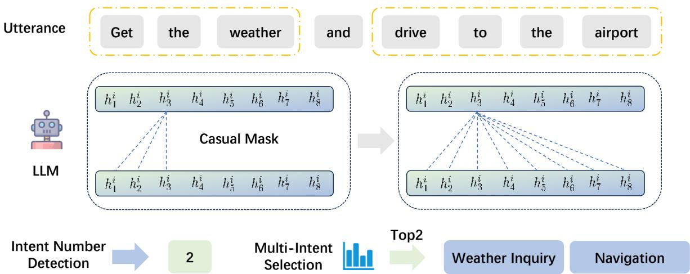  
Figure 1: The MIDLM framework illustrated with a multi-intent SLU example. By transitioning from a causal attention to global attention, MIDLM can leverage bidirectional information within an utterance.

$o = ( o _ { 1 } , . . . , o _ { m } )$ , where n represents the length of the discourse and m denotes the number of distinct intents within the given discourse.

## 3.2 Bidirectional Information Flow

In our approach, we introduce a novel Bidirectional Information Flow that replaces the vanilla causal attention mechanism used in existing LLMs with context-aware bidirectional attention during the post-training stage. This allows the model to retain the rich knowledge acquired during pretraining while facilitating unrestricted information exchange among all sequence tokens.

Vanilla LLMs typically use a causal mask M in autoregressive frameworks to prevent future tokens from influencing the generation of present tokens, enforcing a strict left-to-right information flow. In a standard masked attention mechanism, the attention scores A are computed as follows:

$$
A = \mathrm { s o f t m a x } \left( \frac { Q K ^ { T } } { \sqrt { d _ { k } } } + { \mathcal { M } } \right) V\tag{1}
$$

where Q, K, and V represent the query, key, and value, and $d _ { k }$ is the dimension of the key vectors.

Traditionally, the M is defined as:

$$
{ \mathcal { M } } _ { i j } = { \left\{ \begin{array} { l l } { 0 } & { { \mathrm { i f ~ } } i \geq j } \\ { - \infty } & { { \mathrm { i f ~ } } i < j } \end{array} \right. }\tag{2}
$$

where i represents the position of the token currently attending, and j represents the position of the token being attended to in the sequence.

This limitation can hinder performance in language understanding tasks, where understanding the context from both preceding and following tokens is crucial. To address this, we focus on an attention mechanism by setting all elements of the utterance M to zero. The post-training attention computation becomes:

$$
\mathcal { M } _ { i j } = 0 \quad \forall i , j \in \{ 1 , \dots , n \}\tag{3}
$$

$$
A _ { p } = \operatorname { s o f t m a x } \left( { \frac { Q K ^ { T } } { \sqrt { d _ { k } } } } \right) V\tag{4}
$$

## 3.3 Intent Number Detection

Intent number detection aims to determine the total number of distinct intents within a user’s expression. This can be formulated as follows:

$$
y _ { I } = \mathrm { A g g r e g a t e d } ( \mathbf { H } )\tag{5}
$$

$$
K = \mathrm { C l a s s i f i e r } ( y _ { I } )\tag{6}
$$

where H denotes the hidden states from the final layer corresponding to the input token sequence (token length: l, hidden dimension: s). yI represents the aggregated token-level logits with shape (1, s), where s corresponds to the size of the intent vocabulary. K denotes the total number of predicted intent labels obtained by the classifier.

## 3.4 Multi-Intent Selection

The most probable intents are selected based on their corresponding scores, as described by the following equation:

$$
o _ { I } = \mathrm { T o p } _ { K } ( y _ { I } )\tag{7}
$$

where $o _ { I } = \{ o _ { 1 } , o _ { 2 } , . . . , o _ { m } \}$ represents the final predicted intent labels, and m denotes the number of selected intents.

## 3.5 Joint Training

To achieve synchronized model refinement, we employ joint optimization for the dual tasks of intent classification and intent number detection.

For the intent classification loss $L _ { \mathrm { i n t e n t } }$ , it can be computed as follow:

$$
\begin{array} { r } { L _ { \mathrm { i n t e n t } } = - \displaystyle \sum _ { i = 1 } ^ { M } \Bigl [ y _ { i } \log ( \sigma ( p _ { i } ) ) + } \\ { ( 1 - y _ { i } ) \log ( 1 - \sigma ( p _ { i } ) ) \Bigr ] } \end{array}\tag{8}
$$

where M is the total number of possible intents, $p _ { i }$ represents the predicted logits for the i-th intent, $y _ { i }$ is the binary indicator for the presence of the ith intent, and $\sigma ( \cdot )$ denotes the sigmoid activation function applied to the logits.

For the intent number loss $L _ { \mathrm { n u m } } .$ , it can be computed as follows:

$$
L _ { \mathrm { n u m } } = - \sum _ { i = 1 } ^ { C } \mathbf { 1 } ( y = i ) \log ( \hat { p } _ { i } )\tag{9}
$$

where $C$ is the maximum number of possible intent occurrences, $y$ is the true number of intent occurrences in the sentence, and $\hat { p } _ { i }$ represents the model’s predicted probability for the number of intent occurrences being i.

The overall loss L combines both losses, and the hyperparameters α and $\beta$ are generally set to 1, but further analysis of different weightings is provided in Section 5.3:

$$
L = \alpha L _ { \mathrm { i n t e n t } } + \beta L _ { \mathrm { n u m } } .\tag{10}
$$

## 4 Experiments

## 4.1 Dataset

We evaluate the experiment on 8 datasets from both the BlendX and MixX series, as summarized in Table 1. These datasets cover a diverse range of user intents, allowing for a comprehensive assessment of MID models across various domains.

## 4.2 Baselines

Following Yoon et al. (2024), we compare our method with the following baselines: (1) TFMN (Cheng et al., 2023): The vanilla baseline first predicts the number of intents, k, in a multiintent utterance, and then selects the top-k intents based on the predicted probability. (2) SLIM (Cai et al., 2022): A pretrained baseline that decomposes multi-label classification into a set of binary classification tasks, using the sigmoid function to estimate the probability of each intent and selecting intents that exceed a specified probability threshold. (3) gpt3.5-turbo (0613): A few-shot LLM baseline.

<table><tr><td>Dataset</td><td>Intents</td><td>Training</td><td>Test</td></tr><tr><td>BlendATIS</td><td>18</td><td>20,250</td><td>1,125</td></tr><tr><td>MixATIS</td><td>18</td><td>18,000</td><td>1,000</td></tr><tr><td>BlendSNIPS</td><td>7</td><td>50,625</td><td>2,615</td></tr><tr><td>MixSNIPS</td><td>7</td><td>45,000</td><td>2,500</td></tr><tr><td>BlendBanking77</td><td>77</td><td>36,390</td><td>2,021</td></tr><tr><td>MixBanking77</td><td>77</td><td>32,340</td><td>1,795</td></tr><tr><td>BlendCLINC150</td><td>147</td><td>54,896</td><td>2,977</td></tr><tr><td>MixCLINC150</td><td>147</td><td>48,824</td><td>2,638</td></tr></table>

Table 1: Statistics of datasets used in the experiment.

## 4.3 Experiment Settings

We used Mistral-7B-instruct-v0.1 (Jiang et al., 2023) as the foundational backbone model for our MIDLM model. For fine-tuning, we applied LoRA (Hu et al., 2022), setting the LoRA rank through a grid search over {16, 32} and selecting an alpha scaling parameter from {32, 64}. We also implemented a dropout rate of 0.05. The optimization process involved learning rates of {1e-4, 2e-4} and a weight decay of 0.05. Parameter optimization was performed using the Adam optimizer (Kingma and Ba, 2015). The model was trained for 1 epoch.

## 4.4 Main Results

As shown in Table 2, MIDLM establishes state-ofthe-art (SOTA) performance benchmarks across a range of datasets, significantly outperforming existing strong baselines. Specifically, MIDLM demonstrates substantial performance improvements across all datasets and splits: (1) On the SNIPS dataset, MIDLM achieved an accuracy of 96.8% on the MixX split and 96.7% on the BlendX split, surpassing SLIM by +0.8% and +1.0%, respectively. (2) For the ATIS dataset, MIDLM reached 88.5% accuracy on MixX and 88.4% on BlendX, showing an improvement of +11.4% and +11.5% over SLIM. (3) On the Banking77 dataset, MIDLM achieved 89.1% accuracy on MixX and 79.2% on BlendX, translating to improvements of +5.4% and +3.9%, respectively. (4) For the CLINC150 dataset, MIDLM scored 95.6% on MixX and 92.0% on BlendX, outperforming SLIM by +6.9% and +6.4%.

<table><tr><td rowspan="2">Model</td><td colspan="2">Split</td><td colspan="4">Dataset (Metric: Accuracy)</td></tr><tr><td>Training</td><td>Test</td><td>SNIPS</td><td>ATIS</td><td>Banking77</td><td>CLINC150</td></tr><tr><td rowspan="2">gpt-3.5-turbo</td><td>1</td><td>MixX</td><td>81.7</td><td>40.3</td><td>30.9</td><td>49.2</td></tr><tr><td>-</td><td>BlendX</td><td>76.2</td><td>38.8</td><td>22.7</td><td>37.6</td></tr><tr><td rowspan="2">TFMN</td><td>MixX</td><td>MixX</td><td> $9 5 . 7 \pm 0 . 5 7$ </td><td> $7 8 . 0 \pm 0 . 5 7$ </td><td> $7 6 . 6 \pm 1 . 1 7$ </td><td> $8 5 . 9 \pm 1 . 0 3 $ </td></tr><tr><td>BlendX</td><td>BlendX</td><td> $9 4 . 9 \pm 0 . 8 5$ </td><td> $7 6 . 5 \pm 0 . 8 3$ </td><td> $6 4 . 0 \pm 0 . 8 1$ </td><td> $7 8 . 0 \pm 0 . 8 2$ </td></tr><tr><td rowspan="2">SLIM</td><td>MixX</td><td>MixX</td><td> $9 6 . 0 \pm 0 . 2 3$ </td><td> $7 7 . 1 \pm 0 . 2 8 $ </td><td> $8 3 . 7 \pm 0 . 8 8$ </td><td> $8 8 . 7 \pm 0 . 5 6 $ </td></tr><tr><td>BlendX</td><td>BlendX</td><td> $9 5 . 7 \pm 0 . 8 6 $ </td><td> $7 6 . 9 \pm 0 . 8 4$ </td><td> $7 5 . 3 \pm 0 . 7 1$ </td><td> $8 5 . 6 \pm 0 . 5 1$ </td></tr><tr><td rowspan="2">MIDLM</td><td>MixX</td><td>MixX</td><td> ${ \bf 9 6 . 8 ^ { * } \pm 0 . 2 8 }$ </td><td> $\mathbf { 8 8 . 5 ^ { * } \pm 1 . 7 7 }$ </td><td> $\mathbf { 8 9 . 1 ^ { * } \pm 0 . 2 7 }$ </td><td> ${ \pm } 0 5 . 6 ^ { * } \pm 0 . 2 7$ </td></tr><tr><td>BlendX</td><td>BlendX</td><td> ${ \bf 9 6 . 7 ^ { * } \pm 0 . 4 6 }$ </td><td> $\pm 8 . 4 ^ { * } \pm 1 . 8 4 $ </td><td> $\mathbf { 7 9 . 2 ^ { * } \pm 1 . 0 9 }$ </td><td> $\mathbf { 9 2 . 0 ^ { * } \pm 1 . 4 1 }$ </td></tr><tr><td rowspan="2">Improvement over SLIM</td><td>MixX</td><td>MixX</td><td> $+ 0 . 8 \%$ </td><td>+11.4%</td><td> $+ 5 . 4 \%$ </td><td>+6.9%</td></tr><tr><td>BlendX</td><td>BlendX</td><td> $+ 1 . 0 \%$ </td><td>+11.5%</td><td>+3.9%</td><td>+6.4%</td></tr></table>

Table 2: Evaluation of competitive MID models on MixX and BlendX datasets. The reported values are the averages and standard deviations from five separate runs. Values marked with \* denote statistically significant improvements of our model over all baselines $( p < 0 . 0 5$ under a t-test). Baseline results are sourced from Yoon et al. (2024).

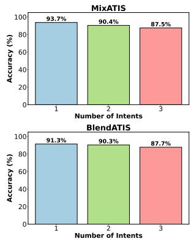

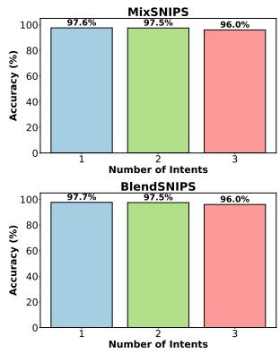

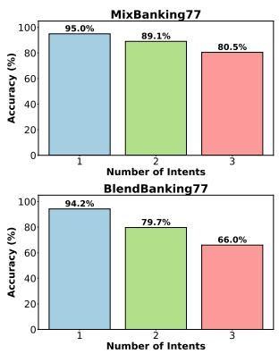

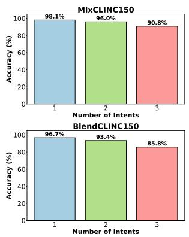  
Figure 2: Performance of MIDLM in Intent Accuracy across Different Numbers of Intents.

## 4.5 Performance on Different Intent Settings

To further explore MIDLM’s performance under different difficulty settings, we conduct experiments with varying numbers of intents. In these experiments, we use the same training data but split the test data according to the number of intents. As shown in Figure 2, the results are as follows: (1) On the MixATIS dataset, MIDLM demonstrates robust performance, achieving an accuracy of 93.7% for single-intent utterances, which slightly decreases to 90.4% for two-intent utterances and 87.5% for three-intent utterances. (2) For MixSNIPS, the model maintains high accuracy rates, achieving 97.6% for single-intent, 97.5% for two-intents, and 96.0% for threeintents. (3) On the MixBanking77 dataset, accuracy decreases from 95.0% for single-intent to 89.1% for two-intents and 80.5% for threeintents. (4) In the MixCLINC150 dataset, MIDLM achieves 98.1% accuracy for single-intent, 96.0% for dual-intent, and 90.8% for triple-intent utterances. A similar trend is observed in the BlendX series datasets. These results underscore the significant influence of intent number variation on model performance, with accuracy generally declining as the number of intents increases. This highlights the potential for future work to address and alleviate this challenge.

## 4.6 Performance of Scaling Law

To explore whether downstream MID training follows a scaling law with respect to data volume, we conducted a comprehensive evaluation by systematically varying the proportion of training data at levels of 0.2, 0.4, 0.6, 0.8, and 1.0. As shown in Figure 3, the performance of MIDLM improves as the proportion of training data increases across all datasets. The results are analyzed in detail as follows: (1) For the MixATIS dataset, accuracy improved from 78.8% at 20% of the training data to 93.1% at 60% of the data, before stabilizing around 90.8% as the training data proportion reached 1.0. Similarly, the BlendATIS dataset showed an increase from 75.4% at 20% of the training data to 88.5% at 60%, with a slight dip to 85.9% at full data proportion. (2) For the MixSNIPS dataset, accuracy consistently increased from 91.2% at 20% of the training data to a high of 96.6% at full data proportion. The BlendSNIPS dataset exhibited a similar trend, rising from 89.7% to 96.8% as the data proportion increased. (3) The MixBanking77 dataset saw a notable improvement in accuracy, from 63.4% at 20% of the training data to 89.1% at the full data proportion. The BlendBanking77 dataset displayed a similar upward trend, increasing from 44.1% to 78.3%. (4) For the CLINC150 dataset, the MixCLINC150 accuracy scaled from 79.5% at 20% of the training data to 96.0% at full data proportion. The BlendCLINC150 dataset also showed an increase from 74.0% to 93.4%. These findings underscore the critical importance of training data volume in enhancing the performance of MIDLM across diverse datasets. The improvements are consistent, affirming that larger training data proportions substantially boost the model’s intent accuracy in most datasets. Interestingly, we observed that the model began to overfit on the MixATIS and BlendATIS datasets when the training data ratio reached 0.6. We believe that more efficient data selection methods could help mitigate this issue, and we consider this an area for future work.

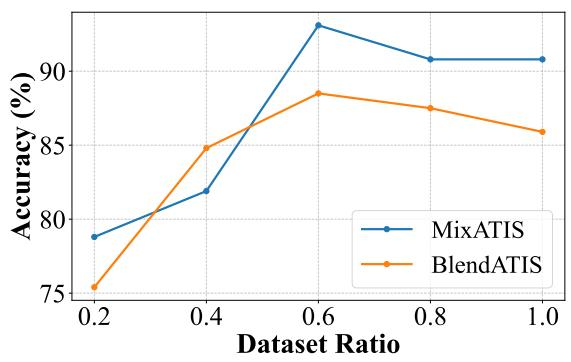

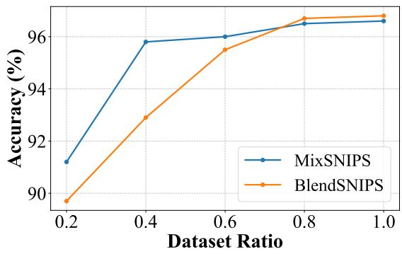

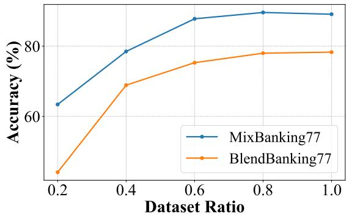

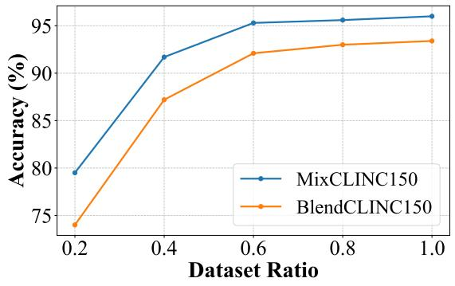  
Figure 3: Performance comparison of models on MixX and BlenX datasets. This visualization illustrates the intent accuracy across different training data proportions for the MIDLM.

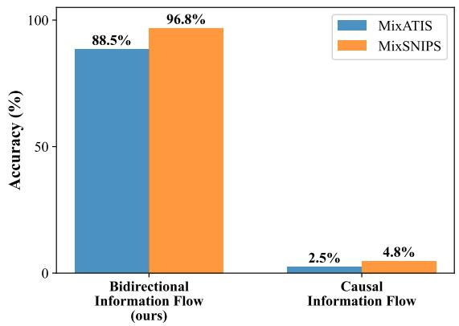  
Figure 4: Performance comparison of Bidirectional Information Flow and Causal Information Flow on Mix-ATIS and MixSNIPS datasets.

## 5 Different Information Flow

To evaluate the impact of the bidirectional information flow proposed in MIDLM, we compared the performance of the vanilla LLM model, which uses the default causal information flow, with

<table><tr><td rowspan="2">Model</td><td colspan="2">Split</td><td colspan="4">Dataset (Metric: Accuracy)</td></tr><tr><td>Training</td><td>Test</td><td>SNIPS</td><td>ATIS</td><td>Banking77</td><td>CLINC150</td></tr><tr><td>TFMN</td><td>MixX</td><td>BlendX</td><td>52.5</td><td>42.5</td><td>37.3</td><td>42.5</td></tr><tr><td>SLIM</td><td>MixX</td><td>BlendX</td><td>93.5</td><td>72.8</td><td>69.9</td><td>73.4</td></tr><tr><td>MIDLM (Ours)</td><td>MixX</td><td>BlendX</td><td>95.7</td><td>84.3</td><td>80.2</td><td>93.6</td></tr><tr><td>% Increase</td><td></td><td></td><td>+2.2%</td><td>+11.5%</td><td>+10.3%</td><td>+20.2%</td></tr></table>

Table 3: Evaluation of Transfer Pattern Learning Ability

MIDLM on the MixATIS and MixSNIPS datasets. As shown in Figure 4, the causal mask struggles significantly in MID, achieving only 2.5% and 4.8% accuracy on the MixATIS and MixSNIPS datasets, respectively, compared to the 88.5% and 96.8% accuracy achieved by our bidirectional information flow. This highlights a key limitation of the causal mask, particularly for tasks that require natural language understanding. In such tasks, the model needs full visibility of the entire utterance to accurately interpret context and detect multiple intents. By restricting the model to a unidirectional view, the causal mask hinders its ability to capture the nuanced, interconnected nature of the input.

## 5.1 Transfer Patterns learning ability

To investigate the generalization capability of MID models, we conducted transfer learning experiments across different training and testing splits. Specifically, models were trained on the MixX split and tested on the BlendX split. Due to different connectors in different pattern datasets, we give the number of instances to our model, mainly focusing on intent detection. As shown in Table 3 ， the results demonstrate the superior performance of MIDLM compared to TFMN and SLIM. For the SNIPS dataset, MIDLM achieved an accuracy of 95.7%, representing a 2.2% improvement over SLIM. In the ATIS dataset, MIDLM outperformed SLIM with an accuracy of 84.3%, marking a substantial 11.5% increase. The Banking77 dataset saw MIDLM reaching 80.2% accuracy, indicating a 10.3% gain over SLIM. Finally, for the CLINC150 dataset, MIDLM achieved an impressive 93.6% accuracy, showing a remarkable 20.2% improvement over SLIM. These findings highlight the robustness and effectiveness of the MIDLM model in transferring knowledge from easier to more difficult patterns, outperforming strong baselines.

<table><tr><td>Model</td><td>MixATIS</td><td>MixSNIPS</td></tr><tr><td>Llama-3.1-8B</td><td>86.6</td><td>97.0</td></tr><tr><td>Llama-3.1-8B-Instruct Mistral-7B-v0.1</td><td>87.8</td><td>96.9</td></tr><tr><td></td><td>89.5</td><td>97.8</td></tr><tr><td>Mistral-7B-v0.1-Instruct</td><td>88.5</td><td>96.8</td></tr></table>

Table 4: Intent accuracy with different LLM backbones of MIDLM on MixATIS and MixSNIPS datasets.

## 5.2 Different LLM Backbones for MIDLM

To evaluate the generalization capability of the MID framework, we conducted experiments using various backbone models of MIDLM on the MixATIS and MixSNIPS datasets. No additional parameter tuning was performed during these evaluations. As shown in Table 4, all models demonstrate strong intent detection performance across both datasets. Specifically, Llama-3.1-8B achieved 86.6% accuracy on MixATIS and 97.0% on MixSNIPS, while Llama-3.1-8B-Instruct improved the performance to 87.8% and 96.9%, respectively. Among the Mistral series, Mistral-7Bv0.1 delivered the best overall accuracy, achieving 89.5% on MixATIS and 97.8% on MixSNIPS, followed closely by Mistral-7B-v0.1-Instruct at 88.5% and 96.8%. These results highlight the robustness of the MID framework across different backbone models, confirming its suitability for general-purpose intent detection tasks.

## 5.3 The Influence of Different Weight Factors

To investigate the effect of different weight factors, we set $\beta ~ = ~ 1 - \alpha$ and conducted further experiments on the MixATIS and MixSNIPS datasets. As shown in Figure 5, we found that the intent detection accuracy approaches nearly 100% in both datasets. However, the model is more sensitive to the weight factor in MixATIS than in MixSNIPS, with $\alpha = 0 . 7$ achieving the best intent accuracy of 91.0% on MixATIS. In contrast, on MixSNIPS, the model’s performance remains consistently around 97.0% across different weight factors. Given that directly setting these two factors to 1 yields promising performance, we leave further exploration of this aspect for future work.

<table><tr><td>Utterances</td><td>True Labels</td><td>Predictions</td></tr><tr><td>show me the cheapest round trip fares from san fran- cisco to houston and then how many passengers can an 11011 aircraft hold</td><td>atis_airfare atis_capacity</td><td>atis_airfare atis_capacity</td></tr><tr><td>how much is limousine service in los angeles</td><td>atis_ground_fare</td><td>atis_ground_fare</td></tr><tr><td>i d like to eat at an internet restaurant with a party of four and also play jawad ahmad</td><td>BookRestaurant PlayMusic</td><td>BookRestaurant PlayMusic</td></tr><tr><td>coon chicken inn restaurant for 1 am for me clarice and debbie and also find now and forever</td><td>BookRestaurant SearchScreeningEvent</td><td>BookRestaurant SearchCreativeWork</td></tr></table>

Table 5: Sample Example with True Labels and MIDLM Predictions

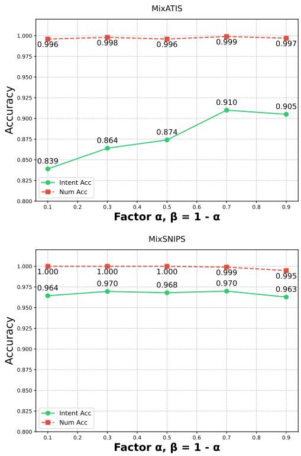  
Figure 5: Performance with different weight factors on MixATIS and MixSNIPS datasets.

## 5.4 Case Analysis

In this section, we present a detailed analysis of the MIDLM’s performance by examining specific cases. As shown in Table 5, each row of the table represents a sample query along with its true labels and the model’s predictions. For instance, in the query “show me the cheapest round trip fares from San Francisco to Houston and then how many passengers can an L1011 aircraft hold,” MIDLM correctly classified it into two categories:

atis airfare and atis capacity. A similar level of accuracy is noted for the query “how much is limousine service in los angeles,” which was correctly labeled as atis ground fare. Another accurate classification is seen in the query “i d like to eat at an internet restaurant with a party of four and also play jawad ahmad,” which was correctly identified as BookRestaurant and PlayMusic. However, a misclassification is evident in the fourth case. The query “coon chicken inn restaurant for 1 am for me clarice and debbie and also find now and forever” was incorrectly predicted. The true labels are BookRestaurant and SearchScreeningEvent, but the model predicted BookRestaurant and SearchCreativeWork. This misclassification suggests the model confuses similar categories, indicating a need for better differentiation. This insight can guide future improvements to reduce such errors.

## 6 Conclusion

In this paper, we propose a bidirectional LLM framework for Multi-Intent Detection (MID), which integrates intent number detection and multi-intent selection. Extensive evaluations across 8 datasets show that MIDLM consistently outperforms several strong baselines. Further experiments demonstrate its adaptability to varying numbers of intents and data proportions. Additionally, MIDLM exhibits remarkable versatility and resilience, effectively transitioning between the MixX and BlendX datasets, highlighting its robustness in diverse settings.

## Acknowledgments

This work was supported by the National Natural Science Foundation of China (71472068 and 62306119).

## Limitations

(1) Impact ofLoRA on Performance: While leveraging LoRA affords improved training efficiency and reduced memory usage, it does not always achieve the full performance potential afforded by tuning all model parameters. LoRA strictly focuses on the most impactful parameters, which, though efficient, can sometimes lead to a loss of subtle linguistic detail that comprehensive parameter tuning might capture. (2) Prospects for Improvement through Data Curation and Prompt Optimization: Our current research framework does not extend to the advanced strategies of selective data curation or intricate prompt engineering. Recognizing this as a limitation, we propose that future investigations will embrace these crucial techniques.

## References

Fengyu Cai, Wanhao Zhou, Fei Mi, and Boi Faltings. 2022. Slim: Explicit slot-intent mapping with bert for joint multi-intent detection and slot filling. In IEEE International Conference on Acoustics, Speech and Signal Processing, ICASSP 2022, Virtual and Singapore, 23-27 May 2022, pages 7607– 7611.

Lizhi Cheng, Wenmian Yang, and Weijia Jia. 2023. A scope sensitive and result attentive model for multiintent spoken language understanding. In Thirty-Seventh AAAI Conference on Artificial Intelligence, AAAI 2023, Washington, DC, USA, February 7-14, 2023, pages 12691–12699.

Alice Coucke, Alaa Saade, Adrien Ball, Theodore´ Bluche, Alexandre Caulier, David Leroy, Clement´ Doumouro, Thibault Gisselbrecht, Francesco Caltagirone, Thibaut Lavril, Mael Primet, and Joseph¨ Dureau. 2018. Snips voice platform: an embedded spoken language understanding system for private-by-design voice interfaces. Preprint, arXiv:1805.10190.

Rashmi Gangadharaiah and Balakrishnan Narayanaswamy. 2019. Joint multiple intent detection and slot labeling for goal-oriented dialog. In Proceedings of the 2019 Conference of the North American Chapter of the Association for Computational Linguistics: Human Language Technologies, Volume 1 (Long and Short Papers), pages 564–569, Minneapolis, Minnesota. Association for Computational Linguistics.

Geogle. 2023. Palm 2 technical report. CoRR, abs/2305.10403.

Chih-Wen Goo, Guang Gao, and Yun-Kai Hsu. 2018. Slot-gated modeling for joint slot filling and intent

prediction. In Proceedings of the 2018 Conference of the North American Chapter of the Associationfor Computational Linguistics: Human Language Technologies, NAACL-HLT, New Orleans, Louisiana, USA, June 1-6, 2018, Volume 2 (Short Papers), pages 753–757.

Dan Hendrycks, Collin Burns, Steven Basart, Andy Zou, Mantas Mazeika, Dawn Song, and Jacob Steinhardt. 2021. Measuring massive multitask language understanding. In 9th International Conference on Learning Representations, ICLR 2021, Virtual Event, Austria, May 3-7, 2021.

Edward J. Hu, Yelong Shen, Phillip Wallis, Zeyuan Allen-Zhu, Yuanzhi Li, Shean Wang, Lu Wang, and Weizhu Chen. 2022. Lora: Low-rank adaptation of large language models. In The Tenth International Conference on Learning Representations, ICLR 2022, Virtual Event, April 25-29, 2022. Open-Review.net.

Albert Q. Jiang, Alexandre Sablayrolles, Arthur Mensch, Chris Bamford, Devendra Singh Chaplot, Diego de Las Casas, Florian Bressand, Gianna Lengyel, Guillaume Lample, Lucile Saulnier, Lelio Re-´ nard Lavaud, Marie-Anne Lachaux, Pierre Stock, Teven Le Scao, Thibaut Lavril, Thomas Wang, Timothee Lacroix, and William El Sayed. 2023.´ Mistral 7b. CoRR, abs/2310.06825.

Diederik P. Kingma and Jimmy Ba. 2015. Adam: A method for stochastic optimization. In 3rd International Conference on Learning Representations, ICLR 2015, San Diego, CA, USA, May 7-9, 2015, Conference Track Proceedings.

Stefan Larson and Kevin Leach. 2022. A survey of intent classification and slot-filling datasets for taskoriented dialog. arXiv preprint arXiv:2207.13211.

Saab Mansour and Batool Haider. 2021. Atis - seven languages.

Baolin Peng, Chunyuan Li, Pengcheng He, Michel Galley, and Jianfeng Gao. 2023. Instruction tuning with GPT-4. CoRR, abs/2304.03277.

Libo Qin, Fuxuan Wei, Tianbao Xie, Xiao Xu, Wanxiang Che, and Ting Liu. 2021. GL-GIN: fast and accurate non-autoregressive model for joint multiple intent detection and slot filling. In Proceedings of the 59th Annual Meeting of the Association for Computational Linguistics and the 11th International Joint Conference on Natural Language Processing, ACL/IJCNLP 2021, (Volume 1: Long Papers), Virtual Event, August 1-6, 2021, pages 178– 188.

Libo Qin, Xiao Xu, Wanxiang Che, and Ting Liu. 2020. AGIF: An adaptive graph-interactive framework for joint multiple intent detection and slot filling. In Findings of the Association for Computational Linguistics: EMNLP 2020, pages 1807–1816, Online. Association for Computational Linguistics.

Hugo Touvron, Louis Martin, Kevin Stone, Peter Albert, Amjad Almahairi, Yasmine Babaei, Nikolay Bashlykov, Soumya Batra, Prajjwal Bhargava, Shruti Bhosale, Dan Bikel, Lukas Blecher, Cristian Canton-Ferrer, Moya Chen, Guillem Cucurull, David Esiobu, Jude Fernandes, Jeremy Fu, Wenyin Fu, Brian Fuller, Cynthia Gao, Vedanuj Goswami, Naman Goyal, Anthony Hartshorn, Saghar Hosseini, Rui Hou, Hakan Inan, Marcin Kardas, Viktor Kerkez, Madian Khabsa, Isabel Kloumann, Artem Korenev, Punit Singh Koura, Marie-Anne Lachaux, Thibaut Lavril, Jenya Lee, Diana Liskovich, Yinghai Lu, Yuning Mao, Xavier Martinet, Todor Mihaylov, Pushkar Mishra, Igor Molybog, Yixin Nie, Andrew Poulton, Jeremy Reizenstein, Rashi Rungta, Kalyan Saladi, Alan Schelten, Ruan Silva, Eric Michael Smith, Ranjan Subramanian, Xiaoqing Ellen Tan, Binh Tang, Ross Taylor, Adina Williams, Jian Xiang Kuan, Puxin Xu, Zheng Yan, Iliyan Zarov, Yuchen Zhang, Angela Fan, Melanie Kambadur, Sharan Narang, Aurelien Rodriguez, Robert Stojnic, Sergey´ Edunov, and Thomas Scialom. 2023. Llama 2: Open foundation and fine-tuned chat models. CoRR, abs/2307.09288.

Shangjian Yin, Peijie Huang, Dongzhu Liang, Zhuoqi He, Qianer Li, and Yuhong Xu. 2023. A multiintent fusion framework for joint intent detection and slot filling. In Proceedings ofthe 22nd Chinese National Conference on Computational Linguistics, pages 54–63, Harbin, China.

Shangjian Yin, Peijie Huang, and Yuhong Xu. 2024a. Uni-mis: United multiple intent spoken language understanding via multi-view intent-slot interaction. In Thirty-Eighth AAAI Conference on Artificial Intelligence, AAAI 2024, February 20-27, 2024, Vancouver, Canada, pages 19395–19403.

Shangjian Yin, Peijie Huang, Yuhong Xu, Haojing Huang, and Jiatian Chen. 2024b. Do large language model understand multi-intent spoken language? arXiv preprint arXiv:2403.04481.

Yejin Yoon, Jungyeon Lee, Kangsan Kim, Chanhee Park, and Taeuk Kim. 2024. Blendx: Complex multi-intent detection with blended patterns. In Proceedings ofthe 2024 Joint International Conference on Computational Linguistics, Language Resources and Evaluation, LREC/COLING 2024, 20-25 May, 2024, Torino, Italy, pages 2428–2439. ELRA and ICCL.