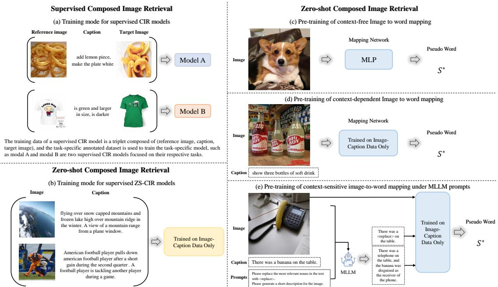
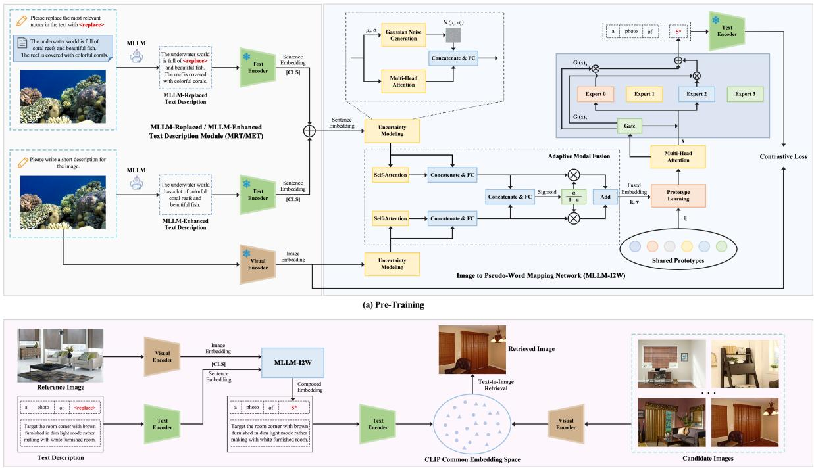
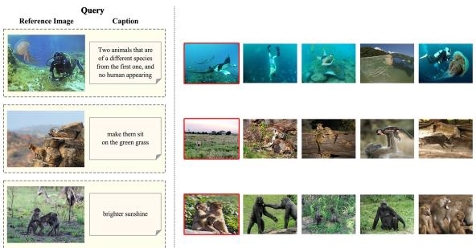
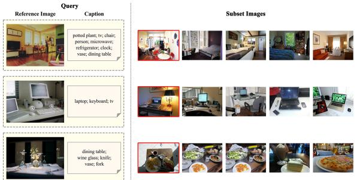
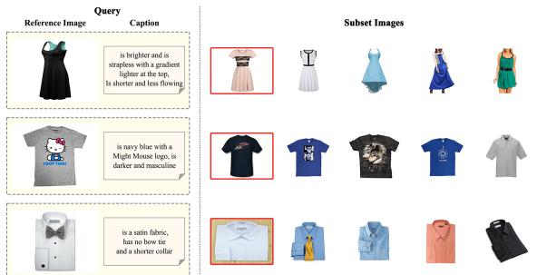

# MLLM-I2W: Harnessing Multimodal Large Language Model for Zero-Shot Composed Image Retrieval

Tong Bao, Che Liu, Derong Xu, Zhi Zheng\*, Tong Xu\* State Key Laboratory of Cognitive Intelligence School of Computer Science and Technology University of Science and Technology of China {baot, lc\_1172, derongxu, zhengzhi97}@mail.ustc.edu.cn, tongxu@ustc.edu.cn

## Abstract

Combined Image Retrieval (CIR) involves retrieving an image based on a reference image and a brief text description, which is widely present in various scenarios such as fashion recommendation. Existing methods can be mainly divided into two categories, respectively supervised CIR methods and Zero-Shot CIR (ZS-CIR) methods. In contrast to supervised CIR methods, which need manually annotated triples for training task-specific models, ZS-CIR models can be trained using images datasets only and performs well. However, ZS-CIR still faces the primary challenge of learning how to map pseudo-words to images within the joint image-text embedding space. Therefore, in this paper, we propose a novel imagetext mapping network, named MLLM-I2W, which adaptively converts description-related image information into pseudo-word markers for precise ZS-CIR. Specifically, the image and text encoding enhancement module within the MLLM prompt selects subject headings and generates text descriptions. It then reduces the modality gap between images and text using uncertainty modeling. An adaptive weighting module and a prototype are proposed to adjust and learn the deep fusion features, which are further mapped to pseudo-word markers via well-designed MOE-based mapping network. Our model demonstrates consistent improvements across common CIR benchmarks, including COCO, CIRR, and Fashion-IQ.

## 1 Introduction

Combined Image Retrieval (CIR), also known as Image Retreival conditioned on Language Feedback, involves retrieving an image based on a reference image and a brief text description (Vo et al., 2019; Li et al., 2024). Specifically, the reference image captures the overall scene, while the text description provides specific modification details. The CIR task is widely present in various real-world scenarios. For example, in fashion recommendation and shopping scenarios (Wu et al., 2021), there are often specific requirements, such as finding other clothing items that are similar to a given style but have a different logo. A major challenge of this task is distinguishing between crucial information (e.g., objects of interest) and irrelevant details (e.g., background elements). There are two categories of approaches to addressing the above challenge, respectively supervised CIR methods and Zero-Shot CIR (ZS-CIR) methods. As illustrated in Figure 1 (a), supervised CIR methods use triples consisting of reference images, text descriptions, and target images, while Zero-Shot CIR methods utilize images or image-text pairs for training. Although supervised CIR models excel in retrieval tasks, however, annotating triples are required for training these models, which involves two costly processes (Liu et al., 2021a): collecting reference and target image pairs and providing descriptions of modifications. Additionally, models trained on labeled data are often tailored to specific use cases and may not generalize well to other CIR tasks (Saito et al., 2023; Baldrati et al., 2023). To address this issue, researchers have turned their attention to ZS-CIR methods (Saito et al., 2023) which do not need a task-specific annotated dataset. Instead, these methods employ readily available image-text pairs to train a general model applicable across various tasks.

The basic workflow of ZS-CIR methods involves two stages. In the initial stage, a dual-stream model was trained to enhance the similarity between images and text. This was achieved using an imagetext pre-training model, such as CLIP (Radford et al., 2021), on an image-text pair dataset. In the second stage, the language encoder in CLIP is used to map images to pseudo-word tags. This approach allows the language encoder to effectively integrate query image features with text descriptions. In the ZS-CIR task, we use pseudo-words to represent text features that closely match the query image’s embedded features in CLIP’s public image embedding space. The core task of ZS-CIR is to establish a combined understanding between image and text, specifically capturing text features that closely align with image features in the image-text joint embedding space. These mapped text features are referred to as pseudo-words. Figure 1 (c) and (d) illustrate two typical ZS-CIR model paradigms, while Figure 1 (e) demonstrates the role of the MLLM model in our proposed MLLM-I2W framework. Previous work encountered several issues: the absence of visual guidance caused model to struggle with focusing on relevant content, particularly in images with multiple objects. Additionally, the integration of image and text features lacked thorough exploration of deep semantic information. Furthermore, the mapping network relies on a single fully connected layer, which limits model performance.

  
Figure 1: CIR differs from ZS-CIR in both training and processing due to variations in mapping strategies.

This paper focuses on pseudo-word generation for the ZS-CIR task. We use a pre-trained CLIP model as the backbone of our mapping network. To enable the model to concentrate on key visual elements, we use a learnable token <replace> to direct its attention to specific parts of the image, rather than broadly analyzing global image features. To select tags effectively, we designed a prompt that directs MLLM to base its selections on image content, rather than relying solely on parts of speech. Additionally, subtitles generated by CLIP and similar zero-shot models are often overly simplistic, coarse, and lacking in context. Automated or semi-automated annotations for large-scale graphic datasets also frequently result in overly abbreviated text. To address this issue, we leverage MLLM to image and text understanding capabilities, along with its modality generation features, to design prompts that enhance text data augmentation. To summarize, we designed a image encoding enhancement module within MLLM prompts. This module comprises two components: subject word selection and text enhancement. Like other image and text retrieval tasks, ZS-CIR encounters modal gaps (Liang et al., 2022), where fine-grained image features and coarse-grained text features are located in different clusters within a shared feature space. To address this issue, we incorporate uncertainty modeling to both the visual and textual feature branches. Specifically, adding Gaussian noise to the feature increases its dispersion in the feature space, leading to greater overlap among features from different modes. Our experiments revealed that visual features are not as significant as text features, and the query results depend on the weights assigned to these features. Based on these observations, we have designed an adaptive fusion module that assigns varying weights to query images and texts based on their respective contributions, thereby generating optimized fusion features. To further enhance performance, we developed a set of prototypes for querying and learning deep fusion features. We also modified the mapping network to an Mixture of Experts (MOE) structure to improve generalization capabilities.

• In this paper, we propose a novel mapping network that translates images into pseudo-words using MLLM. This network leverages MLLM for subject word selection and text enhancement in image and text encoding.

• We addresse the modality gap by incorporating uncertainty modeling in feature fusion and improves feature learning through this modeling approach. This approach offers a novel perspective on aligning visual and textual information.

• We merge prototype learning to extract deep fusion features within the MLLM-I2W framework. Additionally, we design the mapping network component as an MOE model, which enhances the performance of MLLM-I2W.

• The proposed MLLM-I2W mapping network performs effectively in ZS-CIR tasks, demonstrating superior results across three CIR benchmarks: object composition, object/scene operation, and attribute operation. It outperforms context-independent mapping methods and most supervised approaches.

## 2 Related Work

## 2.1 Multimodal Large Language Models

Multimodal large language models (MLLMs) (Yin et al., 2023) build upon pre-trained large language models (LLMs) as their unimodal components. LLMs are designed for semantic understanding, reasoning, and decision-making, generating text outputs and signal labels from various modalities (Zhao et al., 2023). LLMs offer key features including robust language generation (Yin et al., 2023), zero-shot transfer capabilities, and contextual learning (ICL) (Kojima et al., 2022). While LLMs typically handle natural language processing (NLP) tasks, MLLMs support a broader range of applications. Given MLLM success in image-to-text understanding and modality-specific generation, researchers have sought to enhance CIR models using MLLM. Examples include HyCIR (Jiang et al., 2024), which generates query text for image pairs using visual language models and LLMs, and the use of synthetic CIR triplets to boost CIR performance. CIREVL (Karthik et al., 2023) employs pre-trained generative VLMs to caption reference images and uses LLMs to reassemble these captions according to text modifications, facilitating subsequent retrieval with models like CLIP (Radford et al., 2021). LDRE (Yang et al., 2024) employs a pre-trained title model to generate detailed titles for reference images. It then prompts LLMs to perform combinatorial inference based on these titles and modified texts, producing various editing titles that cover potential semantics of the combined target.

These studies explored the use of MLLM and LLM models in CIR tasks but did not leverage MLLM’s capabilities for detailed analysis and processing of image-text pairs. Therefore, we propose that MLLM should use the image to identify relevant subject words in the text. This approach will help guide the model in focusing on pertinent information, generating accurate visual modalities, and improving the text description of the image.

## 2.2 Zero-Shot Composed Image Retrieval

Combined Image Retrieval (CIR) (Wu et al., 2021; Ilharco et al., 2021) leverages both text-based and image-based retrieval methods. It uses fine-grained image details to address gaps in coarse-grained text descriptions, allowing users to refine query images through interactive conversations to retrieve specific items. Training a CIR model requires a triplet consisting of a query image, description text, and a target image. Annotating this triplet involves two steps (Liu et al., 2021a): collecting relevant reference and target image pairs for the CIR system, and providing a description of the modified reference image for the target. Both steps involve substantial labeling costs. Additionally, models trained on la beled data are often tailored to specific use cases and may not generalize well to other CIR tasks. Recent research in visual language models has led to interest in zero-shot combined image retrieval methods that do not rely on task-specific models. Previous works can be categorized based on their data usage during training. Some use only images, such as Pic2Word (Saito et al., 2023), which employs a pre-trained visual language model to convert images into language markers, enabling flexible combinations of images and text queries. Textonly approaches, like LinCIR (Gu et al., 2024), use a self-supervised dataset known as Self-Masking Projection (SMP). This method projects latent text embeddings into a marker embedding space and generates new text by replacing keyword tags from the original text. This process ensures that the new text has the same potential embedding vector as the original text. Methods trained on image-text pairs include Context-I2W (Tang et al., 2024), which introduces a novel image-to-context word map ping network. This network enhances performance through view selection and target extraction and uses operation descriptions and learnable queries as multi-level constraints for visual information filtering, offering a new approach to visual-to-language alignment.

These methods have limitations: using imageonly training lacks interaction between query images and text descriptions, and does not fully leverage textual information. Text-only methods emphasize generating new text and descriptions but also lack interaction between query images and text, missing fine-grained information provided by images. Training methods with image-text pairs fall into two categories: those using human annotation and those using automated or semi-automated text generation or correction. Automated methods often overlook contextual cues from visual content, introducing irrelevant noise and leading to inaccurate query results.

## 3 Methodology

## 3.1 Overview

To address the challenge of ZS-CIR, we propose the MLLM-I2W framework. This framework includes enhanced encoding with MLLM, an uncertainty modeling module, adaptive modal fusion, a prototype learning module, and an MOE-based mapping network, as illustrated in Figure 2. We will now provide a detailed description of each module in the model.

## 3.2 Enhanced Encoding with MLLM

In CIR tasks, text descriptions typically target specific objects within an image. Directly using these descriptions as visual guides can lead the model to focus on global visual features, such as background elements and irrelevant objects. To overcome this issue, prior research employed contextual features as mapping rules. These rules translate image representations into text-specific views that interact with visual features in complementary ways, enhancing the accuracy of pseudo-word mapping. For instance, in Context-I2W, the part-of-speech annotator Spacy (Honnibal et al., 2020) replaces the first noun in the context with a learnable tag [replace] during training. However, this approach does not ensure that the first noun in the context will be the most relevant subject for the image’s main content. Leveraging the superior performance of MLLMs in image-to-text tasks, we designed the Enhanced Encoding with MLLM module. This module comprises two components: the MR/ME Text Description Module (MRT/MET). The MRT component prompts: "Please replace the most relevant nouns in the <replace> text with learnable markers [replace] using MLLM," while the MET component prompts: "Please generate a brief description of the image." Finally, the text was input into the frozen visual encoder of CLIP, and the [CLS] tag embedding $t = \{ t _ { i } \} _ { i = 1 } ^ { d } \in \mathbb { R } ^ { d \times 1 }$ was obtained to guide visual feature extraction.

## 3.3 Uncertainty Modeling

The core task of ZS-CIR is to map text features corresponding to image feature I to pseudo-word markers $S ^ { * }$ in the shared embedding space of images and text. However, previous studies have shown that text and image embeddings, such as those in CLIP, often cluster separately in the feature space. This issue is commonly referred to as a modal gap (Liang et al., 2022; Gu et al., 2023). To address this issue, (Chen et al., 2022) combines uncertainty modeling and regularization to tackle the challenges of both coarse-grained and fine-grained image retrieval in real-world scenarios. Specifically, adding Gaussian noise to the feature increases its dispersion in the feature space, leading to greater overlap among features from different modes. This approach involves generating uncertainty features to describe and dynamically adjust weights according to fluctuations. Inspired by this approach, we redesigned the Uncertainty Modeling module, illustrated in Figure 2. This redesign involves adding Gaussian noise to the target features derived from the original feature distribution, calculating the mean and standard deviation of this noise, and incorporating multi-head attention to enhance the representation of visual and textual features. Simply put, adding noise disperses the eigenvectors of this modality in the eigenspace, leading to increased overlap with eigenvectors of other modalities.

## 3.4 Adaptive Modal Fusion

Previous studies often treated visual and text features as equally important. However, our experiments revealed that varying the weights assigned to image and text features influenced retrieval performance. We tested this hypothesis using COCO and CIRR datasets, with detailed results provided in Table 1. For the COCO dataset, the optimal performance of 11.2 was achieved with text and image weights of 0.6 and 0.4, respectively. In contrast, for the CIRR dataset, the highest performance of 24.7 was observed with text and image weights of 0.8 and 0.2, respectively, compared to 13.0 with equal weights of 0.5. These results indicate that appropriately allocating modal weights can significantly enhance performance. Therefore, different weights should be assigned to query images and texts based on their relative contributions. Inspired by the work of (Huang et al., 2024), we have developed an adaptive modal fusion module, as illustrated in Figure 2 (d). This module uses an attention mechanism to effectively represent both text feature t and visual feature v, the attention module is used to represent t∗, v∗,

  
Figure 2: Architecture of the proposed MLLM-I2W framework.

$$
\mathbf { t _ { a t t } } = A t t ( Q , K , V ) = s o f t m a x \left( \frac { Q K ^ { T } } { \sqrt { d } } \right) V ,\tag{1}
$$

$$
\mathbf { v _ { a t t } } = A t t ( Q , K , V ) = s o f t m a x \left( \frac { Q K ^ { T } } { \sqrt { d } } \right) V ,
$$

$$
\begin{array} { r } { \tilde { \mathbf { t } } = F F W ( \mathbf { t } _ { \mathrm { a t t } } + \mathbf { t } ) + \mathbf { t } _ { \mathrm { a t t } } , } \\ { \tilde { \mathbf { v } } = F F W ( \mathbf { v } _ { \mathrm { a t t } } + \mathbf { t } ) + \mathbf { v } _ { \mathrm { a t t } } , } \end{array}\tag{2}
$$

where FFW (·) denotes 2-layer feed-forward networks.

$$
\begin{array} { r } { \mathbf { t } ^ { * } = M L P \left[ C o n c a t \left( \mathbf { t _ { a t t } } , \tilde { \mathbf { t } } \right) \right] , } \\ { \mathbf { v } ^ { * } = M L P \left[ C o n c a t \left( \mathbf { v _ { a t t } } , \tilde { \mathbf { v } } \right) \right] . } \end{array}\tag{3}
$$

Specifically, we use α for the importance of the text and 1 − α for the importance of the image. α is calculated as:

$$
\alpha = S i g m o i d \left( F C \left( \mathbf { t } ^ { * } , \mathbf { v } ^ { * } \right) \right) .\tag{4}
$$

The final fusion feature f is represented as:

$$
\mathbf { f } = \alpha \cdot \mathbf { t } ^ { * } + ( 1 - \alpha ) \cdot \mathbf { v } ^ { * } .\tag{5}
$$

## 3.5 Prototype Learning Modeling

Prototype learning simulates human generalization to new situations by learning from typical examples. Its core idea is to optimize a set of representative samples (archetypes) and use them for tasks such as classification, regression, or clustering. The main advantage of prototype learning is its ability to manage complex data distributions, particularly when there is overlap or imbalance among categories. In this subsection, we aim to extract more robust features for ZS-CIR tasks using prototype-based learning modules. Specifically, we designed a set of randomly initialized prototypes $P = [ p _ { 1 } , p _ { 2 } , \cdot \cdot \cdot , p _ { k } ] \in \mathbb { R } ^ { d \times k }$ . Each prototype contains distinct semantic information. To enable these archetypes to capture deep features, each archetype acts as a query in the converter layer, with the fusion feature f serving as the key and value. The deep fusion feature $\bar { \tilde { \mathbf { f } } } \in \mathbb { R } ^ { k \times \bar { d } }$ obtained through prototype learning is expressed as follows:

$$
{ \tilde { \bf f } } = { \cal P } L \left( { \cal P } , { \bf f } \right) = { \cal C } o n c a t \left( { g _ { 1 } } \left( { p _ { 1 } } , f \right) , \cdots , { g _ { k } } \left( { p _ { k } } , f \right) \right) ,\tag{6}
$$

$$
g _ { i } \left( p _ { i } , f \right) = W _ { k } \left( M H A ( p _ { i } , f , f ) \right) ,\tag{7}
$$

$$
M H A \left( Q , K , V \right) = M L P \left( M u l t i H e a d \left( Q , K , V \right) \right) ,\tag{8}
$$

where $W ^ { k } \in \mathbb { R } ^ { \bar { d } \times d }$ denotes an FC layer for the $k ^ { t h }$ query p. Formally, MHA represents a transformer block, comprising a multi-head attention mechanism and a feed-forward network, where Q, K, and V are abbreviations for query, key, and value.

<table><tr><td rowspan=2 colspan=2>Dataset</td><td rowspan=1 colspan=1></td><td rowspan=1 colspan=8>Text weights/Image weights</td></tr><tr><td rowspan=1 colspan=1>0.9/0.1</td><td rowspan=1 colspan=1>0.8/0.2</td><td rowspan=1 colspan=1>0.7/0.3</td><td rowspan=1 colspan=1>0.6/0.4</td><td rowspan=1 colspan=1>0.5/0.5</td><td rowspan=1 colspan=1>0.4/0.6</td><td rowspan=1 colspan=1>0.3/0.7</td><td rowspan=1 colspan=1>0.2/0.8</td><td rowspan=1 colspan=1>0.1/0.9</td></tr><tr><td rowspan=1 colspan=2>COCO</td><td rowspan=1 colspan=1>7.2</td><td rowspan=1 colspan=1>9.4</td><td rowspan=1 colspan=1>10.8</td><td rowspan=1 colspan=1>11.2</td><td rowspan=1 colspan=1>11.0</td><td rowspan=1 colspan=1>10.4</td><td rowspan=1 colspan=1>9.9</td><td rowspan=1 colspan=1>9.6</td><td rowspan=1 colspan=1>9.6</td></tr><tr><td rowspan=1 colspan=2>CIRR</td><td rowspan=1 colspan=1>24.3</td><td rowspan=1 colspan=1>24.7</td><td rowspan=1 colspan=1>20.5</td><td rowspan=1 colspan=1>16.0</td><td rowspan=1 colspan=1>13.0</td><td rowspan=1 colspan=1>10.7</td><td rowspan=1 colspan=1>9.4</td><td rowspan=1 colspan=1>8.6</td><td rowspan=1 colspan=1>7.8</td></tr></table>

Table 1: The results of R1 on the COCO and CIRR datasets when the text image is assigned with different weights.

## 3.6 Mapping network of the MOE model

The primary challenge in ZS-CIR is to develop a combinatorial understanding between image and text. To address this issue, previous work (Saito et al., 2023; Cohen et al., 2022) proposed a method based on pseudo-word markers, which uses a projection module to convert VLP image encoder outputs into pseudo-word markers. Specifically, the mapping network consists of three fully connected layers. The pseudo-word tag is combined with the text tag and then forwarded to the VLP text encoder to generate a representation embedding for image-text ZS-CIR. To enhance the performance of MLLM-I2W across various tasks, we will replace the MLP network with an MOE model. Specifically, each expert model is a three-layer fully connected network. In our experiments, we define four experts, routing inputs to the first two experts. Additionally, to prevent all tokens from being processed by only one or a few experts, we establish an expert capacity limit. If an expert exceeds its capacity, it will truncate the excess tokens.

## 3.7 Loss Function

As shown in Figure 2 (a), we add $S ^ { * }$ to the end of the token embedding in the prompt, i.e., a photo of, to get s˜. We then input s˜ into the language encoder to get the language embeddingsˆ, hoping that sˆ will represent the input image embedding v. To achieve this, we recommend minimizing the loss of contrast relative to the mapped network, i.e.

$$
\mathcal { L } = \mathcal { L } _ { t 2 i } ( \hat { s } , v ) + \mathcal { L } _ { i 2 t } ( \hat { s } , v ) .\tag{9}
$$

The two contrastive loss terms with a temperature hyperparameter τ that controls strength of penalties on hard negative samples are defined as:

$$
\mathcal { L } _ { t 2 i } ( \bar { \hat { s } } , \overline { { v } } ) = - \frac { 1 } { \vert \mathcal { B } \vert } \sum _ { i \in \mathcal { B } } \log \frac { \exp \left( \tau \bar { s } _ { i } ^ { T } \overline { { v } } _ { i } \right) } { \sum _ { j \in \mathcal { B } } \exp \left( \tau \overline { { \hat { s } _ { i } } } ^ { T } \overline { { v } } _ { j } \right) } ,\tag{10}
$$

$$
\mathcal { L } _ { i 2 t } ( \bar { s } , \overline { { v } } ) = - \frac { 1 } { \vert \mathcal { B } \vert } \sum _ { i \in \mathcal { B } } \log \frac { \exp { \left( \tau \overline { { v } } _ { i } ^ { T } \bar { \hat { s } } _ { i } \right) } } { \sum _ { j \in \mathcal { B } } \exp { \left( \tau \overline { { v _ { i } } } ^ { T } \bar { \hat { s } } _ { j } \right) } } ,\tag{11}
$$

<table><tr><td rowspan=1 colspan=1>Dataset</td><td rowspan=1 colspan=1>Query images</td><td rowspan=1 colspan=1>Candidate images</td></tr><tr><td rowspan=1 colspan=1>COCO</td><td rowspan=1 colspan=1>4766</td><td rowspan=1 colspan=1>4766</td></tr><tr><td rowspan=1 colspan=1>CIRR(test)</td><td rowspan=1 colspan=1>4148</td><td rowspan=1 colspan=1>2315</td></tr><tr><td rowspan=1 colspan=1>Fashion(Dress)</td><td rowspan=1 colspan=1>2017</td><td rowspan=1 colspan=1>3817</td></tr><tr><td rowspan=1 colspan=1>Fashion(Shirt)</td><td rowspan=1 colspan=1>2038</td><td rowspan=1 colspan=1>6346</td></tr><tr><td rowspan=1 colspan=1>Fashion(Toptee)</td><td rowspan=1 colspan=1>1961</td><td rowspan=1 colspan=1>5373</td></tr></table>

Table 2: The number of images used for evaluation in each dataset.

where $\begin{array} { r } { \overline { { \hat { s } } } = \frac { \hat { s } _ { i } } { \| \hat { s } _ { i } \| } , \overline { { v } } = \frac { v _ { j } } { \| v _ { j } \| } } \end{array}$ are the normalized features of $i ^ { t h }$ prompt sentence embedding ${ \hat { s } } _ { i } ,$ , and the $j ^ { t h }$ image global embedding $v _ { j }$ in a batch B.

## 3.8 Inference

During the inference process, our objective is to extract combined features and calculate similarity metrics for the candidate image features. As illustrated in Figure 2 (b), we developed a prompt input CLIP text encoder featuring a [replace] tag as a visual guide. The pseudo-word label $S ^ { * }$ , mapped through the MLLM-I2W network, is then combined with the visual features as input. Subsequently, the [replace] tag in the text is substituted with $S ^ { * }$ , and the resulting combination feature is queried. For each task, we design our prompts as follows: Object/scene composition: "a photo of [replace], [obj1 tag], . . . , and $[ o b j _ { n }$ tag];" Sentence manipulation: "a photo of [replace], [sentence]."

## 4 Experiment

## 4.1 Experimental Setup

Datasets. The Conceptual Captions (Sharma et al., 2018) consists of 3 million image-caption pairs, designed for training and evaluating machine learning-based image captioning systems. The MS COCO (Microsoft Common Objects in Context) dataset (Lin et al., 2014) is a large-scale dataset for object detection, segmentation, keypoint detection, and image captioning. It contains 328,000 images. The CIRR (Compose Image Retrieval on Real-life images) dataset (Liu et al., 2021b) contains over 36,000 pairs of crowd-sourced, opendomain images with human-generated descriptive text. This dataset aims to incorporate linguistic context into visual reasoning research. Fashion IQ (Wu et al., 2021) is the first fashion dataset to offer human-generated captions that differentiate similar garment images. It also includes side information such as real-world product descriptions and derived visual attribute labels for these images.

<table><tr><td>Supervision</td><td>Methods</td><td>R1</td><td>R5</td><td>R10</td></tr><tr><td rowspan="6">Zero-shot</td><td>Image-only</td><td>8.6</td><td>15.4</td><td>18.9</td></tr><tr><td>Text-only</td><td>6.1</td><td>15.7</td><td>23.5</td></tr><tr><td>Image+Text</td><td>10.2</td><td>20.2</td><td>26.6</td></tr><tr><td>Pic2word</td><td>11.5</td><td>24.8</td><td>33.4</td></tr><tr><td>Context-I2W</td><td>13.5</td><td>28.5</td><td>38.1</td></tr><tr><td>MLLM-I2W</td><td>15.7</td><td>31.2</td><td>40.9</td></tr><tr><td>CIRR</td><td>Combiner</td><td>9.9</td><td>22.8</td><td>32.3</td></tr><tr><td>Fashion-IQ</td><td>Combiner</td><td>13.2</td><td>27.1</td><td>35.2</td></tr></table>

Table 3: Results of the object composition task using COCO.  
  
Figure 3: Retrieved results on the object composition task using COCO.

Evaluation Dataset. Table 2 describes the details of the dataset, i.e., number of query images and candidate images used for evaluation.

## Baseline.

• Images only: This baseline calculates the features of both the target image and the query image using CLIP visual encoder, then computes the similarity between these features.

• Text only: This baseline computes features for the text using CLIP text encoder and features for the image using CLIP visual encoder, then calculates the similarity between these features.

• Image + text: This baseline uses CLIP to extract features from both the text and the query image, averages these features to form a combined query feature, and then computes the similarity with the target image features.

Evaluation Metrics. As in previous studies, we evaluate model performance on the CIR dataset using Recall@K. Recall@K measures the ratio of relevant results among the top K retrieved results to the total number of relevant results in the database, indicating the retrieval system’s recall rate.

Figure 4: Retrieved results on the object/scene manipulation task using CIRR.  
  
Figure 5: Retrieved results on the attribute manipulation task using Fashion-IQ.

Implementation Details. We use the ViT-L/14 CLIP model (Radford et al., 2021), pre-trained on 400 million image-text pairs. For training MLLM-I2W, we use the Conceptual Captions dataset (Sharma et al., 2018). We set the number of shared prototypes K to 6 and use 4 experts in the MOE model, with each expert being a three-layer MLP with a hidden dimension of 512. To enhance training stability, we initialize the learnable scalar of the tanh-gating to 0 (Bachlechner et al., 2021). We use AdamW (Loshchilov, 2017) with a learning rate of 5× 10−6, a weight decay of 0.1, and a linear warmup over 10,000 steps. The batch size for contrastive learning is 512, and we train the model on 4 Tesla A6000 (48G) GPUs. Performance results are reported as the average over three trials to ensure reliability.

## 4.2 Main Results

To assess the validity of our model design, we evaluated it on three distinct ZS-CIR datasets: COCO (Lin et al., 2014) for object composition, CIRR (Liu et al., 2021b) for object and scene manipulation, and Fashion-IQ (Wu et al., 2021) for attribute manipulation. To ensure a fair comparison, we adhered to the dataset configurations used in recent studies. The baselines we selected for comparison included both a zero-shot baseline and a partially supervised model. The specific baselines are as follows:

<table><tr><td>Supervision</td><td>Methods</td><td>R1</td><td>R5</td><td>R10</td><td>R50</td></tr><tr><td rowspan="10">Zero-shot</td><td>Image-only</td><td>7.4</td><td>23.6</td><td>34.0</td><td>57.4</td></tr><tr><td>Text-only</td><td>20.9</td><td>44.8</td><td>56.7</td><td>79.1</td></tr><tr><td>Image+Text</td><td>12.4</td><td>36.2</td><td>49.1</td><td>78.2</td></tr><tr><td>PALAVRA</td><td>16.0</td><td>-</td><td>58.5</td><td>83.9</td></tr><tr><td>Pic2word</td><td>23.9</td><td>51.7</td><td>65.3</td><td>87.8</td></tr><tr><td>Searle-xl</td><td>24.2</td><td>52.4</td><td>66.3</td><td>88.6</td></tr><tr><td>CIReVL</td><td>24.6</td><td>52.3</td><td>64.9</td><td>86.3</td></tr><tr><td>Context-I2W</td><td>25.6</td><td>55.1</td><td>68.5</td><td>89.8</td></tr><tr><td>PM</td><td>26.1</td><td>一</td><td>67.5</td><td>90.2</td></tr><tr><td>MLLM-I2W</td><td>28.3</td><td>57.9</td><td>70.2</td><td>93.9</td></tr><tr><td>CIRR</td><td>Combiner</td><td>30.3</td><td>60.4</td><td>73.2</td><td>92.6</td></tr><tr><td>Fashion-IQ</td><td>Combiner</td><td>20.1</td><td>47.7</td><td>61.6</td><td>85.9</td></tr><tr><td>CIRR</td><td>Combiner*</td><td>33.6</td><td>65.4</td><td>77.4</td><td>95.2</td></tr><tr><td>CIRR</td><td>TIRG</td><td>14.6</td><td>48.4</td><td>64.1</td><td>90.0</td></tr><tr><td>CIRR</td><td>ARTEMIS</td><td>17.0</td><td>46.1</td><td>61.3</td><td>87.7</td></tr><tr><td>CIRR</td><td>CIRPLANT</td><td>19.6</td><td>52.6</td><td>68.4</td><td>92.4</td></tr></table>

Table 4: Results on CIRR for object/scene manipulation.

• Image only, Text only and Image+Text: we use CLIP encoder extract relevant features for retrieval tasks.

• ZS-CIR: We compare our method with recent zero-shot combined image retrieval approaches, including Pic2word (Saito et al., 2023), iSEARLE (Agnolucci et al., 2024), Context-I2W (Tang et al., 2024), PM (Zhang et al., 2024), CIReVL (Karthik et al., 2023) and LinCIR (Gu et al., 2024).

• Supervised combined image retrieval: We also compare several classic supervised models for comparison, including Combiner (Baldrati et al., 2022) (Combiner\* in tables indicates using ResNet50x4 as a backbone), TIRG (Vo et al., 2019), ARTEMIS (Delmas et al., 2022), CIR-PLANT (Liu et al., 2021a) and MAAF (Dodds et al., 2020).

Object composition. Figure 3 illustrates the identification of specific objects within complex, everyday scenes containing common natural elements. In the Object composition results (Table 3), MLLM-I2W consistently outperforms existing approaches, including the supervised ones, and remarkably outperforms the State-of-the-Art (SoTA) Context-I2W by 2.57% on average.

Object/scene manipulation. Figure 4 demonstrates the identification of visually similar images from real-world datasets, where sentences have been artificially modified. In the object/scene manipulation results (Table 4), MLLM-I2W consistently outperforms existing approaches, including the supervised ones, and remarkably outperforms the State-of-the-Art (SoTA) Context-I2W by 2.83% on average.

Attribute manipulation. Figure 5 focuses on differentiating similar clothing image pairs using side information derived from real-world product descriptions and visual attribute labels. In the attribute manipulation results (Table 5), MLLM-I2W consistently outperforms existing approaches, including the supervised ones, and remarkably outperforms the State-of-the-Art (SoTA) CIReVL by 1.61% on average.

We have performed a paired t-test for the indicators of the best and suboptimal results on all datasets, specifically, we have conducted five experiments and tested them according to the experimental results The test p-values of R1, R2, and R10 on the COCO dataset are: $2 . 2 3 \times 1 0 ^ { - 5 } , 2 . 5 5 \times 1 0 ^ { - 5 }$ $4 . 3 3 \times 1 0 ^ { - 4 }$ , respectively; The p-values of R1, R5, R10 and R50 on the CIRR dataset were 3.286, $1 . 9 9 \times 1 0 ^ { - 4 }$ , 0.0094 and 0.0011, respectively. The average R10 and R50 test p-values on the Fashion-IQ dataset were $8 . 3 9 \times 1 0 ^ { - 5 }$ and $5 . 5 5 \times 1 0 ^ { - 5 }$ respectively, and all p-values were less than 0.05, indicating that the optimal results were significantly better than the suboptimal results.

Our proposed MLLM-I2W outperforms the zeroshot baseline and several ZS-CIR models, and even surpasses some supervised methods. Pic2Word fails to focus on the relevant visual parts because it only maps global image features and lacks object selection capabilities. Context-I2W specially designed VTE addresses this issue but is overly simplistic in selecting subject headings. Nevertheless, it effectively mitigates dataset-specific biases by selecting context-relevant visual information before mapping, making it the best model for various tasks. Our designed MLLM-I2W leverages latent world knowledge to select optimal subject words and generate detailed text descriptions, resulting in improved performance. Experimental results demonstrate that MLLM-I2W achieves varying degrees of improvement across different tasks.

## 4.3 Ablation Study

To understand the contributions of each component in our framework, we conduct a detailed empirical analysis in this section.Specifically, Table 6 presents the results of various components of our framework on the CIRR (Liu et al., 2021b) dataset. For the baseline, we use the image and text encoders from CLIP to extract features from imagetext pairs. These features are averaged and then processed through a mapping network with three fully connected layers to generate pseudo-word markers. In ablation 1., we incorporated the MLLM to enhance the coding module. This included substituting subject words in the text and augmenting the text data, which improved the extraction of visual information related to the target. In ablation 2., we introduced uncertainty modeling to bridge the modal gap between image and text features. In ablation 3., we implemented an adaptive weighting module to replace the average of visual and text features. This change led to improved performance and validated the hypothesis that different modal weights should be assigned to images and texts based on their contributions. In ablation 4. and ablation 5., we applied prototype learning to capture deep semantic information from the fused features, followed by a mapping network with MOE structures, which improved the performance of MLLM-I2W.

<table><tr><td rowspan="2">Supervision</td><td rowspan="2">Methods</td><td colspan="2">Dress</td><td colspan="2">Shirt</td><td colspan="2">Toptee Average</td></tr><tr><td>R10 R50</td><td>R10</td><td>R50</td><td>R10 R50</td><td>R10</td><td>R50</td></tr><tr><td rowspan="10">Zero-shot</td><td>Image-only</td><td>5.4 13.9</td><td>9.9</td><td>20.8</td><td>8.3</td><td>17.7</td><td>7.9 17.5</td></tr><tr><td>Text-only</td><td>13.6 29.7</td><td>18.9</td><td>31.8</td><td>19.3 37.0</td><td>17.3</td><td>32.9</td></tr><tr><td>Image+Text</td><td>16.3 33.6</td><td>21.0</td><td>34.5</td><td>22.2</td><td>39.0 19.8</td><td>35.7</td></tr><tr><td>Pic2word</td><td>20.0 40.2</td><td>26.2</td><td>43.6</td><td>27.9 47.4</td><td>24.7</td><td>43.7</td></tr><tr><td>Searle-xl</td><td>20.3 43.2</td><td>27.4</td><td>45.7</td><td>29.3</td><td>50.2</td><td>25.7 46.3</td></tr><tr><td>PALAVRA</td><td>21.5 37.0</td><td>17.3</td><td>35.9</td><td>20.6 38.8</td><td>19.8</td><td>37.3</td></tr><tr><td>Context-I2W</td><td>23.1 45.3</td><td>29.7</td><td>48.6</td><td>30.6 52.9</td><td>27.8</td><td>48.9</td></tr><tr><td>PM</td><td>27.1 43.8</td><td>21.4</td><td>41.7</td><td>28.9</td><td>47.3 25.8</td><td>44.2</td></tr><tr><td>CIReVL</td><td>29.5 47.4</td><td>24.8</td><td>44.8</td><td>31.4</td><td>53.7 28.6</td><td>48.6</td></tr><tr><td>MLLM-I2W</td><td>29.9 48.6</td><td>27.3</td><td>46.5</td><td>33.8</td><td>55.2 30.3</td><td>50.1</td></tr><tr><td>CIRR</td><td>Combiner</td><td>17.2 37.9</td><td>23.7</td><td>39.4</td><td>24.1</td><td>43.9 21.7</td><td>40.4</td></tr><tr><td>Fashion-IQ</td><td>Combiner</td><td>30.3 54.5</td><td>37.2</td><td>55.8</td><td>39.2 61.3</td><td>35.6</td><td>57.2</td></tr><tr><td>Fashion-IQ</td><td>Combiner*</td><td>31.6 56.7</td><td>36.4</td><td>58.0</td><td>38.2</td><td>62.4 35.4</td><td>59.0</td></tr><tr><td>Fashion-IQ</td><td>CIRPLANT</td><td>17.5 40.4</td><td>17.5</td><td>38.8</td><td>21.6</td><td>45.4 18.9</td><td>41.5</td></tr><tr><td>Fashion-IQ</td><td>ARTEMIS</td><td>27.2 52.4</td><td>21.8</td><td>43.6</td><td>29.2</td><td>54.8 26.1</td><td>50.3</td></tr><tr><td>Fashion-IQ</td><td>MAAF</td><td>23.8 48.6</td><td>21.3</td><td>44.2</td><td>27.8</td><td>53.6 24.3</td><td>48.8</td></tr></table>

Table 5: Results on Fashion-IQ for attribute manipulation.

<table><tr><td rowspan="2"></td><td rowspan="2">Methods</td><td colspan="3">CIRR</td></tr><tr><td>R1</td><td>R5</td><td>R10</td></tr><tr><td>0.</td><td>baseline</td><td>20.6</td><td>48.6</td><td>57.6</td></tr><tr><td>1.</td><td>MRT+MET</td><td>22.8</td><td>50.4</td><td>60.5</td></tr><tr><td>2.</td><td>Uncertainty Modeling</td><td>24.2</td><td>52.3</td><td>63.7</td></tr><tr><td>3.</td><td>Adaptive Modal Fusion</td><td>24.8</td><td>54.0</td><td>64.5</td></tr><tr><td>4.</td><td>Prototype Learning Modeling</td><td>25.7</td><td>55.4</td><td>65.2</td></tr><tr><td>5.</td><td>MOE</td><td>27.1</td><td>56.7</td><td>68.8</td></tr><tr><td>6.</td><td>full model</td><td>28.3</td><td>57.9</td><td>70.2</td></tr></table>

Table 6: Ablation study on CIRR.

## 5 Conclusion

In this paper, we propose a novel image to pseudo-word mapping network, nammed MLLM-I2W, which incorporates Enhanced Encoding with MLLM for improved text and subject word selection, employs uncertainty modeling to address modal gaps, utilizes an adaptive fusion model, and explores deep information through prototype learning. The network maps features to pseudo-words using an MOE-based mapping network. MLLM-

I2W demonstrates superior generalization, achieving the best performance across three distinct ZS-CIR tasks compared to existing methods.

## 6 Limitations

Our mapping network, similar to previous approaches, utilizes a fully connected layer network. However, in the shared embedding space for images and text, the features are distributed across different clusters. Consequently, mapping image features to text features via this network results in some information loss. Future work could focus on designing a more effective optimization problem for the mapping network, specifically a nonlinear optimization problem.

## Acknowledgments

This work was supported in part by the grants from National Natural Science Foundation of China (No.62222213,U22B2059, 62072423).

## References

Lorenzo Agnolucci, Alberto Baldrati, Marco Bertini, and Alberto Del Bimbo. 2024. isearle: Improving textual inversion for zero-shot composed image retrieval. arXiv preprint arXiv:2405.02951.

Thomas Bachlechner, Bodhisattwa Prasad Majumder, Henry Mao, Gary Cottrell, and Julian McAuley. 2021. Rezero is all you need: Fast convergence at large depth. In Uncertainty in Artificial Intelligence, pages 1352–1361. PMLR.

Alberto Baldrati, Lorenzo Agnolucci, Marco Bertini, and Alberto Del Bimbo. 2023. Zero-shot composed image retrieval with textual inversion. In Proceedings ofthe IEEE/CVF International Conference on Computer Vision, pages 15338–15347.

Alberto Baldrati, Marco Bertini, Tiberio Uricchio, and Alberto Del Bimbo. 2022. Effective conditioned and composed image retrieval combining clip-based features. In Proceedings of the IEEE/CVF conference on computer vision and pattern recognition, pages 21466–21474.

Yiyang Chen, Zhedong Zheng, Wei Ji, Leigang Qu, and Tat-Seng Chua. 2022. Composed image retrieval with text feedback via multi-grained uncertainty regularization. ArXiv, abs/2211.07394.

Niv Cohen, Rinon Gal, Eli A Meirom, Gal Chechik, and Yuval Atzmon. 2022. “this is my unicorn, fluffy”: Personalizing frozen vision-language representations. In European conference on computer vision, pages 558–577. Springer.

Ginger Delmas, Rafael Sampaio de Rezende, Gabriela Csurka, and Diane Larlus. 2022. Artemis: Attentionbased retrieval with text-explicit matching and implicit similarity. arXiv preprint arXiv:2203.08101.

Eric Dodds, Jack Culpepper, Simao Herdade, Yang Zhang, and Kofi Boakye. 2020. Modality-agnostic attention fusion for visual search with text feedback. Preprint, arXiv:2007.00145.

Geonmo Gu, Sanghyuk Chun, Wonjae Kim, Yoohoon Kang, and Sangdoo Yun. 2024. Language-only training of zero-shot composed image retrieval. In Proceedings of the IEEE/CVF Conference on Computer Vision and Pattern Recognition, pages 13225–13234.

Sophia Gu, Christopher Clark, and Aniruddha Kembhavi. 2023. I can’t believe there’s no images! learning visual tasks using only language supervision. In Proceedings ofthe IEEE/CVF International Conference on Computer Vision, pages 2672–2683.

Matthew Honnibal, Ines Montani, Sofie Van Landeghem, and Adriane Boyd. 2020. spaCy: Industrialstrength Natural Language Processing in Python.

Fuxiang Huang, Lei Zhang, Xiaowei Fu, and Suqi Song. 2024. Dynamic weighted combiner for mixed-modal image retrieval. In Proceedings of the AAAI Conference on Artificial Intelligence, volume 38, pages 2303–2311.

Gabriel Ilharco, Mitchell Wortsman, Nicholas Carlini, Rohan Taori, Achal Dave, Vaishaal Shankar, Hongseok Namkoong, John Miller, Hannaneh Hajishirzi, Ali Farhadi, and Ludwig Schmidt. 2021. Openclip.

Yingying Jiang, Hanchao Jia, Xiaobing Wang, and Peng Hao. 2024. Hycir: Boosting zero-shot composed image retrieval with synthetic labels. arXiv preprint arXiv:2407.05795.

Shyamgopal Karthik, Karsten Roth, Massimiliano Mancini, and Zeynep Akata. 2023. Vision-bylanguage for training-free compositional image retrieval. arXiv preprint arXiv:2310.09291.

Takeshi Kojima, Shixiang Shane Gu, Machel Reid, Yutaka Matsuo, and Yusuke Iwasawa. 2022. Large language models are zero-shot reasoners. ArXiv, abs/2205.11916.

Shenshen Li, Xing Xu, Xun Jiang, Fumin Shen, Zhe Sun, and Andrzej Cichocki. 2024. Cross-modal attention preservation with self-contrastive learning for composed query-based image retrieval. ACM Transactions on Multimedia Computing, Communications and Applications, 20(6):1–22.

Victor Weixin Liang, Yuhui Zhang, Yongchan Kwon, Serena Yeung, and James Y Zou. 2022. Mind the gap: Understanding the modality gap in multi-modal contrastive representation learning. Advances in Neural Information Processing Systems, 35:17612–17625.

Tsung Yi Lin, Michael Maire, Serge Belongie, James Hays, and C. Lawrence Zitnick. 2014. Microsoft coco: Common objects in context. In European Conference on Computer Vision.

Zheyuan Liu, Cristian Rodriguez-Opazo, Damien Teney, and Stephen Gould. 2021a. Image retrieval on reallife images with pre-trained vision-and-language models. In Proceedings of the IEEE/CVF International Conference on Computer Vision, pages 2125– 2134.

Zheyuan Liu, Cristian Rodriguez-Opazo, Damien Teney, and Stephen Gould. 2021b. Image retrieval on real-life images with pre-trained vision-and-language models. In Proceedings of the IEEE/CVF International Conference on Computer Vision (ICCV), pages 2125–2134.

I Loshchilov. 2017. Decoupled weight decay regularization. arXiv preprint arXiv:1711.05101.

Alec Radford, Jong Wook Kim, Chris Hallacy, Aditya Ramesh, Gabriel Goh, Sandhini Agarwal, Girish Sastry, Amanda Askell, Pamela Mishkin, Jack Clark, Gretchen Krueger, and Ilya Sutskever. 2021. Learning transferable visual models from natural language supervision. In Proceedings ofthe 38th International Conference on Machine Learning, volume 139 of Proceedings of Machine Learning Research, pages 8748–8763. PMLR.

Kuniaki Saito, Kihyuk Sohn, Xiang Zhang, Chun-Liang Li, Chen-Yu Lee, Kate Saenko, and Tomas Pfister. 2023. Pic2word: Mapping pictures to words for zeroshot composed image retrieval. In Proceedings of the IEEE/CVF Conference on Computer Vision and Pattern Recognition, pages 19305–19314.

Piyush Sharma, Nan Ding, Sebastian Goodman, and Radu Soricut. 2018. Conceptual captions: A cleaned, hypernymed, image alt-text dataset for automatic image captioning. In Proceedings of ACL.

Yuanmin Tang, Jing Yu, Keke Gai, Jiamin Zhuang, Gang Xiong, Yue Hu, and Qi Wu. 2024. Contexti2w: Mapping images to context-dependent words for accurate zero-shot composed image retrieval. In

Proceedings of the AAAI Conference on Artificial Intelligence, volume 38, pages 5180–5188.

Nam Vo, Lu Jiang, Chen Sun, Kevin Murphy, Li-Jia Li, Li Fei-Fei, and James Hays. 2019. Composing text and image for image retrieval-an empirical odyssey. In CVPR.

Hui Wu, Yupeng Gao, Xiaoxiao Guo, Ziad Al-Halah, Steven Rennie, Kristen Grauman, and Rogerio Feris. 2021. The fashion iq dataset: Retrieving images by combining side information and relative natural language feedback. CVPR.

Zhenyu Yang, Dizhan Xue, Shengsheng Qian, Weiming Dong, and Changsheng Xu. 2024. Ldre: Llm-based divergent reasoning and ensemble for zero-shot composed image retrieval. In Proceedings of the 47th International ACM SIGIR Conference on Research and Development in Information Retrieval, pages 80–90.

Shukang Yin, Chaoyou Fu, Sirui Zhao, Ke Li, Xing Sun, Tong Xu, and Enhong Chen. 2023. A survey on multimodal large language models. ArXiv, abs/2306.13549.

Huaying Zhang, Rintaro Yanagi, Ren Togo, Takahiro Ogawa, and Miki Haseyama. 2024. Zero-shot composed image retrieval considering query-target relationship leveraging masked image-text pairs. Preprint, arXiv:2406.18836.

Wayne Xin Zhao, Kun Zhou, Junyi Li, Tianyi Tang, Xiaolei Wang, Yupeng Hou, Yingqian Min, Beichen Zhang, Junjie Zhang, Zican Dong, Yifan Du, Chen Yang, Yushuo Chen, Z. Chen, Jinhao Jiang, Ruiyang Ren, Yifan Li, Xinyu Tang, Zikang Liu, Peiyu Liu, Jianyun Nie, and Ji rong Wen. 2023. A survey of large language models. ArXiv, abs/2303.18223.