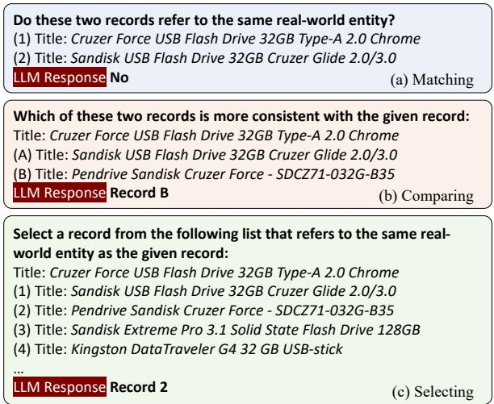
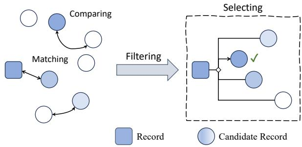
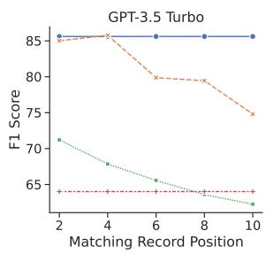
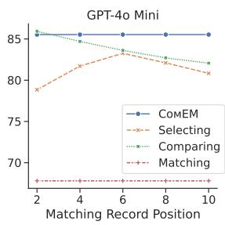
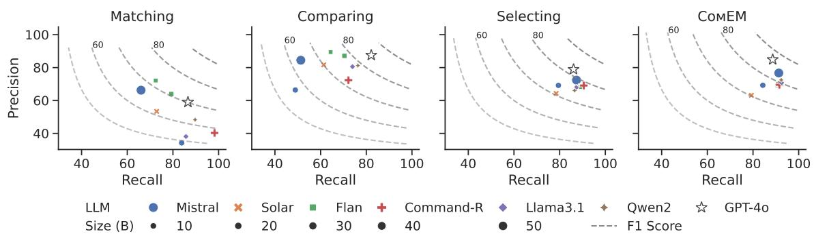
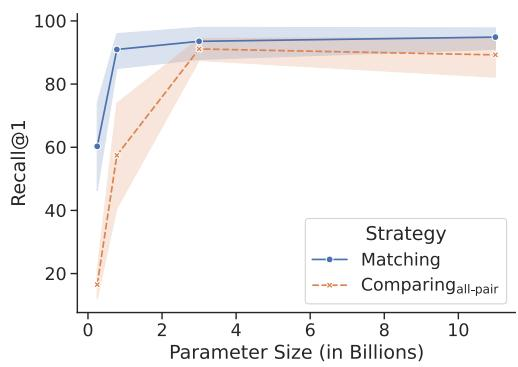
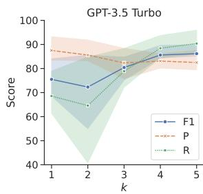
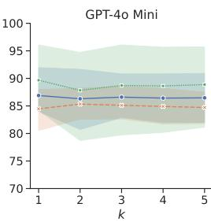

# Match, Compare, or Select? An Investigation of Large Language Models for Entity Matching

Tianshu Wang1,2, Xiaoyang Chen3, Hongyu Lin1, Xuanang Chen1\*, Xianpei Han1,4\*, Hao Wang5, Zhenyu Zeng5, Le Sun1,4

1Chinese Information Processing Laboratory, Institute of Software, Chinese Academy of Sciences

2Hangzhou Institute for Advanced Study, University of Chinese Academy of Sciences

3University of Chinese Academy of Sciences

4State Key Laboratory of Computer Science, Institute of Software, Chinese Academy of Sciences 5Alibaba Cloud Intelligence Group

{tianshu2020, hongyu, chenxuanang, xianpei, sunle}@iscas.ac.cn, chenxiaoyang19@mails.ucas.ac.cn, cashenry@126.com, zhenyu.zzy@alibaba-inc.com

## Abstract

Entity matching (EM) is a critical step in entity resolution (ER). Recently, entity matching based on large language models (LLMs) has shown great promise. However, current LLMbased entity matching approaches typically follow a binary matching paradigm that ignores the global consistency among record relationships. In this paper, we investigate various methodologies for LLM-based entity matching that incorporate record interactions from different perspectives. Specifically, we comprehensively compare three representative strategies: matching, comparing, and selecting, and analyze their respective advantages and challenges in diverse scenarios. Based on our findings, we further design a compound entity matching framework (COMEM) that leverages the composition of multiple strategies and LLMs. COMEM benefits from the advantages of different sides and achieves improvements in both effectiveness and efficiency. Experimental results on 8 ER datasets and 10 LLMs verify the superiority of incorporating record interactions through the selecting strategy, as well as the further cost-effectiveness brought by COMEM.

## 1 Introduction

Entity resolution (ER), also known as record linkage (Fellegi and Sunter, 1969) or deduplication (Elmagarmid et al., 2007), aims to identify and canonicalize records that refer to the same real-world entity. ER is a fundamental task of data integration and cleansing, with broad applications in maintaining data consistency, accurate data analysis, and informed decision making. Entity matching (EM) serves as a critical step in entity resolution that uses complex techniques to identify matching records from potential matches filtered by the blocking step (Papadakis et al., 2021). The recent emergence of large language models (LLMs) has introduced a new zero- or few-shot paradigm to EM, showing great promise (Narayan et al., 2022; Peeters and Bizer, 2023; Fan et al., 2024; Li et al., 2024; Peeters et al., 2025). LLM-based entity matching methods can achieve similar or even better performance than deep learning methods trained on large amounts of data, and are less susceptible to the unseen entity problem (Wang et al., 2022; Peeters et al., 2024).

  
Figure 1: Three strategies for LLM-based entity matching. We omit other attributes of records for simplicity.

However, current LLM-based entity matching methods identify matches by classifying each pair of records independently. This matching strategy ignores the global consistency1 among record relationships and thus leads to suboptimal results. On the one hand, entity resolution requires more than independent classification due to the interconnected nature of record relationships (Getoor and Machanavajjhala, 2012). For example, in record linkage (i.e., clean-clean ER), a single record from one data source typically matches at most one record from another data source, since there are usually no duplicates in a single database. Unfortunately, matching-based approaches do not take advantage of this nature of record linkage. On the other hand, this strategy ignores the capabilities of LLMs to handle multiple records simultaneously to distinguish similar records. Using the records in Figure 1(c) as an example, if “Cruzer Glide”, “Cruzer Force”, and “Extreme Pro” appear in different records of the same context, LLMs are more likely to recognize that they are different San-Disk flash drive models, which helps with accurate matching. As a result, the matching strategy cannot fully unleash the potential of LLMs in EM.

In this paper, we thoroughly investigate three strategies for LLM-based entity matching that incorporate record interactions from different perspectives, as shown in Figure 1. Specifically, apart from the conventional matching strategy shown in Figure 1(a), we investigate two additional strategies that leverage information from other records: 1) the comparing strategy, which identifies the record out of two that is more likely to match the anchor record, as shown in Figure 1(b); 2) the selecting strategy, which directly chooses the record from a list that is most likely to match the anchor record, as shown in Figure 1(c). Our research suggests that for LLM-based entity matching, incorporating record interactions is critical and can significantly improve entity matching performance in various scenarios. Among these strategies, the selecting strategy is often the most cost-effective. Nevertheless, we also observe that the selection accuracy varies significantly as the position of the matching record increases in the candidate list. The position bias and limited long context understanding of current LLMs (Levy et al., 2024) hinder the generality of the selecting strategy.

Based on our findings, we design a compound entity matchingframework (COMEM) that leverages the composition of multiple strategies and LLMs. Specifically, given an entity record and its n potential matches obtained from the blocking step, we first preliminarily rank and filter these candidates using the local matching or comparing strategy, implemented with a medium-sized LLM. We then perform fine-grained identification on only the top k candidates using the global selecting strategy, facilitated by a more powerful LLM. This approach not only mitigates the challenges and biases faced by the selecting strategy with too many options, but also reduces the cost of LLM invocations caused by composing multiple strategies. Consequently, by integrating the advantages of different strategies and LLMs, COMEM achieves a more effective and cost-efficient entity matching process.

To investigate different strategies and to evaluate COMEM, we conducted in-depth experiments on eight ER datasets. Experimental results verify the effectiveness of incorporating record interactions through the selecting strategy, with an average 16.02% improvement in F1 over the current matching strategy. In addition, we examined the effect of 10 different LLMs using these strategies on identification or ranking. Ultimately, COMEM is able to further improve average F1 of the single selecting strategy by up to 4% while reducing the cost.

Contributions. In general, our contributions can be summarized as follows2:

• We investigate three strategies for LLM-based entity matching, and delve into their advantages and shortcomings in different scenarios.

• We design a COMEM framework by integrating the advantages of different strategies and LLMs to address the challenges of EM.

• We conduct thorough experiments to investigate these strategies for EM and verify the effectiveness of our proposed framework.

## 2 Related Work

## 2.1 Entity Resolution

Entity resolution has received extensive attention over the past decades (Fellegi and Sunter, 1969; Getoor and Machanavajjhala, 2012; Papadakis et al., 2021; Binette and Steorts, 2022). The blocking-and-matching pipeline has become the mainstream of entity resolution, where blocking filters out obviously dissimilar records and matching identifies duplicates through complex techniques. Blocking. Traditional blocking approaches group records into blocks by shared signatures, followed by cleaning up unnecessary blocks and comparisons (Papadakis et al., 2022). Meta-blocking further reduces superfluous candidates by weighting potential record pairs and graph pruning (Papadakis et al., 2014). Recently, nearest-neighbor search techniques, especially cardinality-based ones, have gained more attention and achieved state-of-the-art

<table><tr><td>Records</td><td>Title</td><td>Authors</td><td>Venue</td><td>Year</td></tr><tr><td>Anchor</td><td>Lineage Tracing for General Data Warehouse Transformations</td><td>Yingwei Cui, Jennifer Widom</td><td>VLDB</td><td>2001</td></tr><tr><td rowspan="3">Potential Matches</td><td>Lineage Tracing for General Data Warehouse Transformations</td><td>Yingwei Cui, Jennifer Widom</td><td>VLDB Journal</td><td>2003</td></tr><tr><td>Tracing the lineage of view data in a warehousing environment</td><td>Yingwei Cui, Jennifer Widom, et al.</td><td>TODS</td><td>2000</td></tr><tr><td>Lineage tracing for general data warehouse transformations</td><td>Y. Cui, J. Widom</td><td>VLDB</td><td>2001</td></tr></table>

Table 1: Example of our formulation for entity matching: Given an anchor record, identify the matching record (if any) from its potential matches. This example is taken from the DBLP-ACM dataset.

(SOTA) results (Thirumuruganathan et al., 2021;   
Paulsen et al., 2023; Wang and Zhang, 2024).

Entity Matching. The open and complex nature of entity matching has spurred the development of various approaches to address this persistent challenge, including rule-based (Benjelloun et al., 2009; Li et al., 2015), distance-based (Bilenko et al., 2003), and probabilistic methods (Fellegi and Sunter, 1969; Wu et al., 2020), etc. With the advent of deep learning methods (Mudgal et al., 2018), especially pre-trained language models (PLMs) (Li et al., 2020), entity matching has made significant progress (Barlaug and Gulla, 2021; Tu et al., 2023; Wu et al., 2023; Zhang et al., 2024). The emergence of LLMs brings a new zero- or few-shot paradigm to entity matching (Narayan et al., 2022; Xu et al., 2024; Peeters et al., 2025), alleviating training data requirements. Most deep learning and LLM-based approaches treat entity matching as an independent binary classification problem, except for GNEM (Chen et al., 2021), which models this task as a collective classification task on graphs.

## 2.2 Large Language Model

The advent of LLMs such as ChatGPT marks a significant advance in artificial intelligence, offering unprecedented natural language understanding and generation capabilities. By scaling up the model and data size of PLMs, LLMs exhibit emergent abilities (Wei et al., 2022) and can thus solve a variety of complex tasks by prompt engineering. For more technical details on LLMs, we refer the reader to the related survey (Zhao et al., 2023).

While LLMs have shown promising results in classification and ranking tasks (Sun et al., 2023; Qin et al., 2024), applying LLMs to entity matching presents unique challenges and opportunities. Our work differs from previous research in three aspects: First, we propose a novel paradigm that formulates entity matching as a comparison or selection task. Second, we demonstrate that the effectiveness of pairwise and listwise strategies in entity matching exhibits different patterns compared to ranking. Finally, through a comprehensive crossmodel and cross-strategy evaluation, we reveal several key insights about LLM-based EM, which motivate the design of our COMEM framework.

## 3 Entity Matching with LLMs

In this section, we first present the problem formulation. Then, we introduce three strategies for LLM-based entity matching. Finally, we propose our COMEM framework, which leverages the composition of multiple strategies and LLMs.

## 3.1 Problem Formulation

We formulate the task of entity matching as the process of identifying matching records from a given anchor record r and its n potential matches $R = \{ r _ { 1 } , r _ { 2 } , . . . , r _ { n } \}$ obtained from blocking, as illustrated in Table 1. This formulation mitigates the limitations of independent pairwise matching and fits real-world ER scenarios. First, current SOTA blocking methods adhere to the k-nearest neighbor (kNN) search paradigm, which retrieves a list of potential matches for each entity record. In addition, this formulation accommodates both single-source deduplication and dual-source record linkage, and makes good use of the one-to-one assumption, i.e., record r matches at most one of the records in potential matches R. This assumption is widespread in record linkage, and deduplication with canonicalization.

## 3.2 LLM as a Matcher

Recent work formulates entity matching as a binary classification task based on LLMs (Narayan et al., 2022; Peeters and Bizer, 2023; Fan et al., 2024; Li et al., 2024; Peeters et al., 2025). In this strategy, an LLM acts as a pairwise matcher to determine whether two records match. Specifically, given an entity record r and its potential matches R = $\{ r _ { 1 } , r _ { 2 } , \ldots , r _ { n } \}$ , this approach independently classifies each pair of records $( r , r _ { i } ) _ { 1 \leq i \leq n }$ as matching or not by interfacing LLMs with an appropriate matching prompt, as shown in Figure 1(a):

$$
\mathrm { L L M } _ { m } \colon \{ ( r , r _ { i } ) \mid r _ { i } \in R \} \to \{ \mathrm { Y e s } , \mathrm { N o } \}
$$

Unlike previous studies, the core of LLM-based applications is to prompt LLMs to generate the correct answer, namely prompt engineering. An appropriate prompt should include the task instruction, such as “Do these two records refer to the same real-world entity? Answer Yes or No”. Optionally, a prompt could include detailed rules or several in-context learning examples to guide LLMs in performing this task. Given the need for long contexts in other strategies, and the instability of existing prompt engineering methods for entity matching (Peeters et al., 2025), we only attempt few-shot prompting for the matching strategy and leave the exploration of better prompt engineering with different strategies to future work.

This independent matching strategy ignores the global consistency of ER, as well as the capabilities of LLMs to incorporate record interactions. The traditional solution to satisfy these constraints is to construct a graph based on the similarity scores $s _ { i }$ of record pairs $( r , r _ { i } )$ and to further cluster on the similarity graph. We can obtain the similarity scores from LLMs by calibrating the generated probabilities $p$ of labels (Liang et al., 2023). Formally, the similarity score $s _ { i }$ can be defined as:

$$
s _ { i } = { \left\{ \begin{array} { l l } { 1 + p ( { \mathrm { Y e s ~ } } | ( r , r _ { i } ) ) , } & { { \mathrm { i f ~ g e n e r a t e ~ } } ^ { \cdots } { \mathrm { Y e s } } ^ { , } } \\ { 1 - p ( { \mathrm { N o ~ } } | ( r , r _ { i } ) ) , } & { { \mathrm { i f ~ g e n e r a t e ~ } } ^ { \cdots } { \mathrm { N o } } ^ { , } } \end{array} \right. }
$$

Unfortunately, the generation probabilities are not available for many black-box commercial LLMs. Moreover, the probabilities on short-form labels are misaligned for common open-source chat-tuned LLMs because they are fine-tuned to respond in detail. The need to investigate better strategies for LLM-based entity matching arises in ER.

## 3.3 LLM as a Comparator

In this section, we introduce a comparing strategy for LLM-based entity matching that simultaneously compares two potential matches to a given record. Specifically, given an entity record $r$ and its potential matches $R = \{ r _ { 1 } , r _ { 2 } , . . . , r _ { n } \}$ , the comparing strategy compares two records $r _ { i }$ and $r _ { j }$ from potential matches R to determine which is more consistent with record r by interfacing LLMs with a comparison prompt, as shown in Figure 1(b):

$$
\operatorname { L L M } _ { c } \colon \{ ( r , r _ { i } , r _ { j } ) \mid r _ { i , j } \in R \} \to \{ \mathrm { A , B } \}
$$

where A and B are labels corresponding to record $r _ { i }$ and $r _ { j } .$ . Since LLMs may be sensitive to the prompt order, we compare the record pair $( r _ { i } , r _ { j } )$ to record r twice by swapping their order.

Compared to the matching strategy, this comparing strategy introduces an additional record for more record interactions and shifts the task paradigm. It focuses on indicating the relative relationship between two potential matches of a given record, rather than making a direct match or no match decision. Therefore, this strategy is suitable for ranking and fine-grained filtering to determine the most likely records for identification.

To rank candidate records using the comparing strategy, we can compute similarity scores to estimate how closely each candidate matches the anchor record. Unlike the matching strategy, the comparing strategy can obtain similarity scores of record pairs using black-box LLMs, which do not provide probabilities. In such case, the similarity score $s _ { i }$ of record pair $( r , r _ { i } )$ can be defined as:

$$
\begin{array} { r } { s _ { i } = 2 \times \sum _ { j \neq i } \mathbb { 1 } _ { r _ { i } > _ { r } r _ { j } } + \sum _ { j \neq i } \mathbb { 1 } _ { r _ { i } = _ { r } r _ { j } } } \end{array}
$$

where $\mathbb { 1 } _ { r _ { i } > _ { r } r _ { j } }$ and $\mathbb { 1 } _ { r _ { i } = r _ { j } }$ indicate that record $r _ { i }$ wins twice and once in comparison with record $r _ { j }$ to record r. When LLMs do provide probabilities, the similarity score $s _ { i }$ can be defined as:

$$
\begin{array} { r } { s _ { i } = \sum _ { j \neq i } \left( p ( \mathrm { A } \mid ( r , r _ { i } , r _ { j } ) ) + p ( \mathrm { B } \mid ( r , r _ { j } , r _ { i } ) ) \right) } \end{array}
$$

However, the advantage of the comparing strategy in obtaining similarity scores comes at the cost of using LLMs as the basic unit of comparison and $O ( n ^ { 2 } )$ complexity. Fortunately, for entity matching, we only care about a small number of most similar candidates, and there are many comparison sort algorithms available to find the top-k elements efficiently. In this paper, we use the bubble sort algorithm to find the top-k elements, optimizing the complexity of the comparing strategy to $\mathcal { O } ( k n )$ To avoid confusion, we refer to the comparison of all pairs as compa $\cdot \mathrm { i n g } _ { \mathrm { a l l - p a i r } }$ in our experiments.

## 3.4 LLM as a Selector

In this section, we introduce a selecting strategy that uses an LLM to select the matching record of a given record from a list of potential matches. Specifically, given an entity record r and its potential matches $R = \{ r _ { 1 } , r _ { 2 } , . . . , r _ { n } \}$ , this strategy directly selects the match of record r from R by interfacing LLMs with an appropriate selection prompt, as shown in Figure 1(c):

$$
\operatorname { L L M } _ { s } \colon \{ ( r , R ) \} \to \{ 1 , 2 , \ldots , n \}
$$

<table><tr><td>Strategy</td><td>Score</td><td>Similarity Interaction Level</td><td>#LLM Invocations</td><td># Input Records</td></tr><tr><td>Matching</td><td>一</td><td>+</td><td>O(n)</td><td>2n</td></tr><tr><td>Comparing</td><td>√</td><td>++</td><td>O(kn)</td><td>3k(2n − k − 1)</td></tr><tr><td>Selecting</td><td>x</td><td> $\mathbf { \nabla } \mathbf { + + }$ </td><td>O(1)</td><td>n + 1</td></tr></table>

Table 2: Comparison of different strategies. “–” means that the matching strategy can only calibrate similarity scores if the generation probability is available. “# LLM Invocations” and “# Input Records” represent the number of (#) LLM invocations and records input to LLMs using different strategies for record r and its n potential matches R, respectively. k denotes the number of top candidates considered by the comparing strategy.

where 1, . . . , n indicates the corresponding record.

In this way, LLMs can be explicitly required to identify only one match per record r from the potential matches R. Furthermore, feeding LLMs all potential matches in the same context at a time allows LLMs to make better decisions by considering interactions between records (Chen et al., 2022). Using Table 1 as an example, it is easier for LLMs to recognize the less critical attributes, such as authors, and identify the third record as the true match by comparing the values of title and year across different records.

One challenge in applying the selecting strategy to LLM-based entity matching is that sometimes there is no actual match of record r in potential matches R. A trivial solution to this challenge could be to perform a pairwise matching after the selection, which would undermine the advantages of the selecting strategy. Another method could be to add “none of the above” as an additional option to allow LLMs to refuse to select any record from the potential matches, which can be formulated as:

$$
\mathrm { L L M } _ { s _ { N } } \colon \{ ( r , R ) \} \to \{ 0 , 1 , 2 , \ldots , n \}
$$

where 0 indicates the “none of the above” option.

However, the selecting strategy relies heavily on the capabilities of LLMs for fine-grained understanding and implicit ranking in long contexts. Our experimental results show that current LLMs suffer from position bias, with the selection accuracy varying significantly as the position of the matching record increases in the candidate list (§ 4.3). In practice, the recall-oriented blocking step often generates a considerable number of potential matches for each record, exceeding the context length that LLMs can effectively reason (Levy et al., 2024). Therefore, it is a challenge to mitigate the position bias and the long context requirement for the selecting strategy.

  
Figure 2: Illustration of COMEM. It first filters candidate records by matching or comparing strategies and then identifies the match via the selecting strategy.

## 3.5 Compound Entity Matching Framework

Based on the advantages and shortcomings of different strategies, we further propose a compound entity matching framework (COMEM). COMEM addresses various challenges in LLM-based entity matching by integrating the advantages of different strategies and LLMs. Table 2 shows a comparison of these strategies. The matching and comparing strategies are applicable for local ranking, while the selecting strategy is suitable for fine-grained identification. Therefore, as shown in Figure 2, we first utilize a medium-sized LLM to rank and filter potential matches R of record r with the matching or comparing strategy. We then utilize an LLM to identify the match of record r from only the top k candidates with the selecting strategy.

Our COMEM integrates the advantages of different strategies through a filtering then identifying pipeline. It first utilizes the local matching or comparing strategy to rank potential matches for preliminary screening, which can effectively mitigate the position bias and the long context requirement of the selecting strategy. It then utilizes the global selecting strategy to incorporate record interactions for fine-grained optimization, which can effectively mitigate the consistency ignorance of the matching strategy. Therefore, COMEM is able to strike a balance between entity matching requirements and current LLM capabilities, achieving significant performance improvements.

By integrating LLMs of different sizes, COMEM can also effectively reduce the cost of LLM invocations for entity matching. In practice, direct use of commercial LLMs is expensive because entity matching is a computationally intensive task. COMEM delegates a significant part of the computation to medium-sized LLMs. Experimental results show that the ranking process can be performed well by using open-source medium-sized (3B\~11B) LLMs (§ 4.4). As a result, the proper integration of LLMs not only improves the performance of entity matching, but also reduces the cost for practical application.

<table><tr><td>Dataset</td><td>Domain</td><td># D1</td><td>#D2</td><td># Attr</td><td># Pos</td></tr><tr><td>Abt-Buy (AB)</td><td>Product</td><td>1076</td><td>1076</td><td>3</td><td>1076</td></tr><tr><td>Amazon-Google (AG)</td><td>Software</td><td>1354</td><td>3039</td><td>4</td><td>1103</td></tr><tr><td>DBLP-ACM (DA)</td><td>Citation</td><td>2616</td><td>2294</td><td>4</td><td>2224</td></tr><tr><td>DBLP-Scholar (DS)</td><td>Citation</td><td>2516</td><td>61353</td><td>4</td><td>2308</td></tr><tr><td>IMDB-TMDB (IM)</td><td>Movie</td><td>5118</td><td>6056</td><td>5</td><td>1968</td></tr><tr><td>IMDB-TVDB (IV)</td><td>Movie</td><td>5118</td><td>7810</td><td>4</td><td>1072</td></tr><tr><td>TMDB-TVDB (TT)</td><td>Movie</td><td>6056</td><td>7810</td><td>6</td><td>1095</td></tr><tr><td>Walmart-Amazon (WA)</td><td>Electronics</td><td>2554</td><td>22074</td><td>6</td><td>853</td></tr></table>

Table 3: Statistics of experimental datasets. # denotes “number of”, D1 and D2 represent records from the 1st and 2nd sources, respectively. Attr and Pos refer to attributes of structured records and positive (matching) record pairs, respectively.

## 4 Experiments

In this section, we conduct thorough experiments to investigate three strategies for LLM-based entity matching. First, we present the main experimental results (§ 4.2). Next, we perform the analysis of different strategies (§ 4.3). Finally, we examine the effect of different LLMs on these strategies (§ 4.4).

## 4.1 Experimental Setup

Datasets. We focused on record linkage, a common form of entity resolution that identifies matching records between two data sources. Specifically, we used eight clean-clean ER datasets collected by pyJedAI (Nikoletos et al., 2022). Table 3 shows the statistics of these datasets, where record collections D1 and D2 represent records from the first and second sources, respectively. For each dataset, we applied the SOTA blocking method Sparkly (Paulsen et al., 2023) as preprocessing to retrieve 10 potential matches from D2 for each record in D1. The recall@10 of Sparkly on all datasets ranges from 86.57% to 99.96%, demonstrating its effectiveness in retrieving potential matches. We sampled 400 records from D1 for evaluation, 300 of which had matches, and formed 4,000 pairs of records by combining them with their potential matches from D2. To build training sets for learning-based methods, we further sampled 5,000 record pairs from the remaining records and their potential matches.

Through this process, we constructed entity matching datasets that satisfied our formulation, with all methods evaluating on the same datasets after blocking to ensure a fair comparison.

Baseline. We considered several SOTA methods as our baselines, including the unsupervised ZeroER (Wu et al., 2020), the self-supervised Sudowoodo (Wang et al., 2023), and the LLM-based matching strategy (Peeters et al., 2025). For a comprehensive comparison, we also included two representative supervised methods, Ditto (Li et al., 2020) and HierGAT (Yao et al., 2022).3

Evaluation Metrics. Consistent with prior studies, we report the F1 score as performance measure. We also report the cost (\$) of LLM invocations. For the compute cost of open-source LMs, we estimated it based on the training or inference time required and the hourly price of the cloud NVIDIA A40.

Implementation Details. We used GPT-4o Mini (0718) and GPT-3.5 Turbo (0613) as the main LLMs for analysis. We also examined the effect of eight open-source instruction-tuned LLMs, including Llama-3.1-8B (Dubey et al., 2024), Qwen2-7B (Yang et al., 2024), Mistral-7B (Jiang et al., 2023), Mixtral-8x7B (Jiang et al., 2024), Command-R-35B, Flan-T5-XXL (Chung et al., 2024), Flan-UL2 (Tay et al., 2023) and Solar-10.7B (Kim et al., 2024). The specific prompts can be found in Appendix B, with the generation temperature of all LLMs set to 0 for reproducibility. For in-context learning, we retrieve 3 positives and 3 negatives as few-shot examples based on record similarity as Peeters et al. (2025). Since the comparing strategy produces only relative orders, we applied the matching strategy to the top 1 candidate after bubble sort comparing. In COMEM, we used Flan-T5-XL to rank candidates with the matching strategy and kept the top 4 candidates for selection.

## 4.2 Main Results

We first compare the performance and cost of different methods, with the following findings.

Finding 1. Incorporating record interactions is essential for LLM-based entity matching. As shown in Table 4, the performance of LLM-based entity matching increases with incorporating record interaction. The comparing strategy outperforms the independent matching strategy by an average of 10.7% F1 score, and the selecting strategy further improves the F1 score by an average of 5.32% over the comparing strategy. The advantages of the comparing and selecting strategies over the matching strategy are also evident across different LLMs in Figure 4. To further verify that these improvements are due to the strategy, we perform 6-shot matching, ensuring that the number of records is consistent with the selecting strategy. We can see that the selecting strategy still outperforms 6-shot matching by 7.97% in F1. Moreover, the proposed strategies enable LLM-based entity matching to surpass SOTA un/self-supervised methods and to be comparable to supervised methods that require extensive labeling data. These results highlight the effectiveness of our proposed strategies and open new avenuesfor LLM-based entity matching.

<table><tr><td></td><td>AB</td><td>AG</td><td>DA</td><td>DS</td><td>IM</td><td>IV</td><td>TT</td><td>WA</td><td>Mean</td><td>Cost</td></tr><tr><td>Supervised</td><td></td><td></td><td></td><td></td><td></td><td></td><td></td><td></td><td></td><td></td></tr><tr><td>Ditto (Li et al., 2020)</td><td>77.34</td><td>63.79</td><td>93.80</td><td>90.02</td><td>97.06</td><td>78.59</td><td>87.15</td><td>57.75</td><td>80.69</td><td>0.29</td></tr><tr><td>HierGAT (Yao et al., 2022)</td><td>75.51</td><td>64.45</td><td>98.01</td><td>89.47</td><td>97.69</td><td>77.73</td><td>85.34</td><td>78.55</td><td>83.34</td><td>1.10</td></tr><tr><td>Un/Self-supervised</td><td></td><td></td><td></td><td></td><td></td><td></td><td></td><td></td><td></td><td></td></tr><tr><td>ZeroER (Wu et al., 2020)</td><td>32.66</td><td>22.14</td><td>99.32</td><td>84.14</td><td>43.32</td><td>0.50</td><td>53.76</td><td>61.52</td><td>49.67</td><td>1</td></tr><tr><td>Sudowoodo (Wang et al., 2023)</td><td>58.82</td><td>50.45</td><td>90.97</td><td>77.06</td><td>84.72</td><td>71.88</td><td>76.32</td><td>52.36</td><td>70.32</td><td>0.63</td></tr><tr><td>GPT-3.5 Turbo</td><td></td><td></td><td></td><td></td><td></td><td></td><td></td><td></td><td></td><td></td></tr><tr><td>Matching (Peeters et al., 2025)</td><td>56.03</td><td>44.36</td><td>78.93</td><td>71.89</td><td>72.05</td><td>61.11</td><td>77.05</td><td>50.77</td><td>64.02</td><td>4.52</td></tr><tr><td>Matching (6-shot) (Peeters et al., 2025)</td><td>77.59</td><td>60.21</td><td>73.13</td><td>52.88</td><td>84.05</td><td>71.45</td><td>71.21</td><td>69.37</td><td>69.99</td><td>32.75</td></tr><tr><td>Comparing</td><td>79.45</td><td>51.61</td><td>76.61</td><td>65.59</td><td>62.92</td><td>46.12</td><td>87.27</td><td>65.34</td><td>66.86</td><td>11.75</td></tr><tr><td>Selecting</td><td>80.31</td><td>63.65</td><td>88.62</td><td>80.61</td><td>92.43</td><td>83.36</td><td>83.66</td><td>80.18</td><td>81.60</td><td>1.71</td></tr><tr><td>CoMEM</td><td>87.62</td><td>69.63</td><td>90.85</td><td>84.68</td><td>96.74</td><td>84.16</td><td>84.82</td><td>86.37</td><td>85.61</td><td>0.92</td></tr><tr><td>GPT-4o Mini</td><td></td><td></td><td></td><td></td><td></td><td></td><td></td><td></td><td></td><td></td></tr><tr><td>Matching (Peeters et al., 2025)</td><td>81.37</td><td>51.95</td><td>61.28</td><td>48.76</td><td>89.64</td><td>61.65</td><td>72.84</td><td>74.92</td><td>67.80</td><td>0.46</td></tr><tr><td>Matching (6-shot) (Peeters et al., 2025)</td><td>83.03</td><td>63.63</td><td>84.50</td><td>71.37</td><td>95.70</td><td>71.82</td><td>72.54</td><td>80.97</td><td>77.94</td><td>3.21</td></tr><tr><td>Comparing</td><td>89.24</td><td>65.61</td><td>93.04</td><td>88.41</td><td>89.86</td><td>75.05</td><td>89.80</td><td>83.85</td><td>84.36</td><td>1.21</td></tr><tr><td>Selecting</td><td>82.37</td><td>69.01</td><td>83.28</td><td>81.11</td><td>94.43</td><td>83.61</td><td>87.58</td><td>76.66</td><td>82.26</td><td>0.17</td></tr><tr><td>COMEM</td><td>88.24</td><td>71.47</td><td>90.58</td><td>87.84</td><td>95.62</td><td>78.07</td><td>90.97</td><td>88.56</td><td>86.42</td><td>0.09</td></tr></table>

Table 4: Overall performance and cost of different methods. We bold the best F1 score and underline the second best for non-supervised methods. The cost of learning-based methods includes both the training and testing GPU costs.

Finding 2. By integrating the advantages of different strategies and LLMs, COMEM can accomplish entity matching more effectively and costefficiently. As shown in Table 4, compared to the single comparing and selecting strategies, COMEM achieves 2\~18% F1 improvements while spending less. The filtering and identifying pipeline improves precision considerably without sacrificing the high recall of the selecting strategy. These results reveal that integrating multiple strategies can complement single strategies and mitigate the position bias of the selecting strategy in long contexts. However, using a single powerful but costly commercial LLM to complete the entire pipeline obscures the cost efficiency of the selecting strategy. By introducing a medium-sized LLM for preliminary filtering, COMEM improves performance while spending less than direct selection. As a result, COMEM underscores the importance of task decomposition and LLM composition, illuminating an effective route for compound EM using LLMs.

  
Figure 3: F1 score w.r.t. matching record positions.

## 4.3 Analysis of Strategies

We then analyze the advantages and shortcomings of different strategies from different perspectives.

Finding 3. The selecting strategy is the most cost-effective strategy for LLM-based entity matching. Monetary cost is also an important factor when interfacing LLMs for entity matching in practice, as it is computationally intensive. As shown in Table 4, the selecting strategy costs less than half of the matching strategy. This is because the selecting strategy saves n − 1 times of repeatedly inputting anchor records and task instructions into LLMs.

  
Figure 4: Effect of open-source LLMs on different strategies and COMEM.

The comparing strategy, however, considers two potential matches at a time and interfaces the LLM twice, making its cost more than twice that of the matching strategy. Therefore, the selecting strategy stands out for its effectiveness and efficiency.

Finding 4. Strategies that incorporate multiple records sufferfrom the position bias ofLLMs. As shown in Figure 3, the performance of the comparing and selecting strategies varies significantly as the position of the matching records moves down in the candidate list. For the comparing strategy optimized with bubble sort, matching records cannot be ranked at the top if there is any incorrect comparison. The selecting strategy is also highly sensitive to the matching record positions, while COMEM can alleviate this. Therefore, the position bias of LLMs limits the performance and generality of the comparing and selecting strategies.

## 4.4 Effect of LLMs

We further examine the effect of open-source LLMs on these strategies to identify matches or rank.

Finding 5. There is no single LLM that is uniformly dominant across all strategies. Figure 4 shows the efficacy of proposed strategies for opensource LLMs, with detailed results in Appendix C. We can see that the F1 scores of the matching, comparing, and selecting strategies for different LLMs mostly fall between 50%\~70%, 60%\~80%, and 70%\~80%, respectively. In general, similar to GPT-3.5 Turbo, the comparing strategy is better than the matching strategy, while the selecting strategy is further better than the comparing strategy. The consistent performance between strategies confirms the effectiveness of incorporating record interactions in these ways. Concretely, some chat LLMs, such as Llama3-8B and Mistral-7B, produce numerous false positives and thus perform poorly with the matching strategy. Nevertheless, they achieve significant improvement and satisfactory performance by comparing and selecting strategies, respectively. Moreover, although Flan-T5-XXL and Flan-UL2 lag behind GPT-4o by about 5% F1 in the selecting strategy, we find that they perform quite well in the matching and comparing strategies. These tasktuned LLMs follow instructions better than chattuned LLMs, and can output only the requested labels instead of long-form responses, making it convenient to utilize label generation probabilities. In conclusion, there is a noticeable variance in the capabilities of different LLMs for a single strategy, and the efficacy of different strategies for a single LLM can also be significantly distinct.

  
Figure 5: Ranking recall@1 w.r.t. model parameters.

Finding 6. Matching strategy is better for ranking and filtering than comparing strategy. The superiority of Flan-T5 in the matching and comparing strategies leads us to explore the possibility of using it to rank and filter potential matches for the selecting strategy. As shown in Figure 5, the matching strategy outperforms the comparing strategy under different model parameter sizes, even though the latter performs $O ( n ^ { 2 } )$ comparisons. The difference is small on Flan-T5-XL (3B) and Flan-T5-XXL (11B), but significant on smaller models. This may be due to the fact that these models are trained on many pairwise tasks, such as natural language inference and question answering, but few triplewise tasks. Therefore, in terms of effectiveness and efficiency, the matching strategy is more suitable for ranking and filtering potential matches.

  
Figure 6: Average F1, Precision, and Recall w.r.t. number of candidate retained (k) for further selection.

## 4.5 Ablation Study

We perform ablation studies on the number of candidate records for further identification. As shown in Figure 6, the performance of GPT-3.5 Turbo is highly variable, while that of GPT-4o Mini is relatively stable. These results suggest that as LLMs evolve, COMEM may become more robust to the number of potential matches retained.

## 5 Conclusion

In this paper, we investigate three strategies of LLMs for entity matching to bridge the gap between local matching and global consistency of ER. Our research shows that incorporating record interactions is essential for LLM-based entity matching. By examining the effect of broad LLMs on these strategies, we further design a COMEM framework that integrates the advantages of multiple strategies and LLMs. The effectiveness and cost-efficiency of COMEM highlight the importance of task decomposition and LLM composition, opening up new avenues for entity matching using LLMs.

## Limitations

This study aims to investigate different strategies for LLM-based entity matching. We conducted thorough experiments with two commercial LLMs and eight open-source LLMs to provide a broad base for our analysis. The selection of LLMs is based on considerations of popularity, availability, and cost. Future research could explore whether similar findings hold as LLMs evolve and how performance changes relative to our results.

Since LLMs were trained on massive amount of web data, they are likely to have seen similar and same records, or even some matching results, even though the labels of the matches are stored separately. Nevertheless, the performance of these strategies is relatively consistent across 10 LLMs and varies greatly for the same LLM when using different strategies, highlighting that data exposure is not the determining factor in their effectiveness. In the future, it will be valuable to evaluate LLMbased entity matching on new or non-public data.

The investigation of different strategies was conducted using basic zero- or few-shot prompting, a simple and effective paradigm for applying LLMs. We could not ignore the role of potential advanced prompt engineering methods in improving the accuracy and robustness of LLMs. In addition, finetuning LLMs for better execution of different strategies is also a worthwhile direction.

Finally, we have demonstrated the effectiveness of the compound framework in entity matching that integrates different strategies and LLMs. We would like to continue to develop specific modules for entity matching and extend this paradigm to different stages of entity resolution.

## Acknowledgments

We sincerely thank the reviewers for their insightful comments and valuable suggestions. This work was supported by the Natural Science Foundation of China (No. 62122077, 62106251) and Beijing Natural Science Foundation (L243006).

## References

Nils Barlaug and Jon Atle Gulla. 2021. Neural networks for entity matching: A survey. ACM Trans. Knowl. Discov. Data, 15(3):52:1–52:37.

Omar Benjelloun, Hector Garcia-Molina, David Menestrina, Qi Su, Steven Euijong Whang, and Jennifer Widom. 2009. Swoosh: a generic approach to entity resolution. VLDB J., 18(1):255–276.

Mikhail Bilenko, Raymond J. Mooney, William W. Cohen, Pradeep Ravikumar, and Stephen E. Fienberg. 2003. Adaptive name matching in information integration. IEEE Intell. Syst., 18(5):16–23.

Olivier Binette and Rebecca C. Steorts. 2022. (almost) all of entity resolution. Science Advances, 8(12).

Runjin Chen, Yanyan Shen, and Dongxiang Zhang. 2021. GNEM: A generic one-to-set neural entity matching framework. In WWW ’21: The Web Conference 2021, Virtual Event / Ljubljana, Slovenia, April 19-23, 2021, pages 1686–1694. ACM / IW3C2.

Xiaoyang Chen, Kai Hui, Ben He, Xianpei Han, Le Sun, and Zheng Ye. 2022. Incorporating ranking context for end-to-end BERT re-ranking. In Advances in Information Retrieval - 44th European Conference on IR Research, ECIR 2022, Stavanger, Norway, April 10-14, 2022, Proceedings, Part I, volume 13185 of Lecture Notes in Computer Science, pages 111–127. Springer.

Hyung Won Chung, Le Hou, Shayne Longpre, Barret Zoph, Yi Tay, William Fedus, Yunxuan Li, Xuezhi Wang, Mostafa Dehghani, Siddhartha Brahma, Albert Webson, Shixiang Shane Gu, Zhuyun Dai, Mirac Suzgun, Xinyun Chen, Aakanksha Chowdhery, Alex Castro-Ros, Marie Pellat, Kevin Robinson, Dasha Valter, Sharan Narang, Gaurav Mishra, Adams Yu, Vincent Y. Zhao, Yanping Huang, Andrew M. Dai, Hongkun Yu, Slav Petrov, Ed H. Chi, Jeff Dean, Jacob Devlin, Adam Roberts, Denny Zhou, Quoc V. Le, and Jason Wei. 2024. Scaling instruction-finetuned language models. J. Mach. Learn. Res., 25:70:1– 70:53.

Abhimanyu Dubey, Abhinav Jauhri, Abhinav Pandey, Abhishek Kadian, Ahmad Al-Dahle, Aiesha Letman, Akhil Mathur, Alan Schelten, Amy Yang, Angela Fan, Anirudh Goyal, Anthony Hartshorn, Aobo Yang, Archi Mitra, Archie Sravankumar, Artem Korenev, Arthur Hinsvark, Arun Rao, Aston Zhang, Aurélien Rodriguez, Austen Gregerson, Ava Spataru, Baptiste Rozière, Bethany Biron, Binh Tang, Bobbie Chern, Charlotte Caucheteux, Chaya Nayak, Chloe Bi, Chris Marra, Chris McConnell, Christian Keller, Christophe Touret, Chunyang Wu, Corinne Wong, Cristian Canton Ferrer, Cyrus Nikolaidis, Damien Allonsius, Daniel Song, Danielle Pintz, Danny Livshits, David Esiobu, Dhruv Choudhary, Dhruv Mahajan, Diego Garcia-Olano, Diego Perino, Dieuwke Hupkes, Egor Lakomkin, Ehab AlBadawy, Elina Lobanova, Emily Dinan, Eric Michael Smith, Filip Radenovic, Frank Zhang, Gabriel Synnaeve, Gabrielle Lee, Georgia Lewis Anderson, Graeme Nail, Grégoire Mialon, Guan Pang, Guillem Cucurell, Hailey Nguyen, Hannah Korevaar, Hu Xu, Hugo Touvron, Iliyan Zarov, Imanol Arrieta Ibarra, Isabel M. Kloumann, Ishan Misra, Ivan Evtimov, Jade Copet, Jaewon Lee, Jan Geffert, Jana Vranes, Jason Park, Jay Mahadeokar, Jeet Shah, Jelmer van der Linde, Jennifer Billock, Jenny Hong, Jenya Lee, Jeremy Fu, Jianfeng Chi, Jianyu Huang, Jiawen Liu, Jie Wang, Jiecao Yu, Joanna Bitton, Joe Spisak, Jongsoo Park, Joseph Rocca, Joshua Johnstun, Joshua Saxe, Junteng Jia, Kalyan Vasuden Alwala, Kartikeya Upasani, Kate Plawiak, Ke Li, Kenneth Heafield, Kevin Stone, and et al. 2024. The llama 3 herd of models. CoRR, abs/2407.21783.

Ahmed K. Elmagarmid, Panagiotis G. Ipeirotis, and Vassilios S. Verykios. 2007. Duplicate record detection: A survey. IEEE Trans. Knowl. Data Eng., 19(1):1–16.

Meihao Fan, Xiaoyue Han, Ju Fan, Chengliang Chai, Nan Tang, Guoliang Li, and Xiaoyong Du. 2024.

Cost-effective in-context learning for entity resolution: A design space exploration. In 40th IEEE International Conference on Data Engineering, ICDE 2024, Utrecht, The Netherlands, May 13-16, 2024, pages 3696–3709. IEEE.

Ivan P. Fellegi and Alan B. Sunter. 1969. A theory for record linkage. Journal of the American Statistical Association, 64(328):1183–1210.

Lise Getoor and Ashwin Machanavajjhala. 2012. Entity resolution: Theory, practice & open challenges. Proc. VLDB Endow., 5(12):2018–2019.

Albert Q. Jiang, Alexandre Sablayrolles, Arthur Mensch, Chris Bamford, Devendra Singh Chaplot, Diego de Las Casas, Florian Bressand, Gianna Lengyel, Guillaume Lample, Lucile Saulnier, Lélio Renard Lavaud, Marie-Anne Lachaux, Pierre Stock, Teven Le Scao, Thibaut Lavril, Thomas Wang, Timothée Lacroix, and William El Sayed. 2023. Mistral 7b. CoRR, abs/2310.06825.

Albert Q. Jiang, Alexandre Sablayrolles, Antoine Roux, Arthur Mensch, Blanche Savary, Chris Bamford, Devendra Singh Chaplot, Diego de Las Casas, Emma Bou Hanna, Florian Bressand, Gianna Lengyel, Guillaume Bour, Guillaume Lample, Lélio Renard Lavaud, Lucile Saulnier, Marie-Anne Lachaux, Pierre Stock, Sandeep Subramanian, Sophia Yang, Szymon Antoniak, Teven Le Scao, Théophile Gervet, Thibaut Lavril, Thomas Wang, Timothée Lacroix, and William El Sayed. 2024. Mixtral of experts. CoRR, abs/2401.04088.

Sanghoon Kim, Dahyun Kim, Chanjun Park, Wonsung Lee, Wonho Song, Yunsu Kim, Hyeonwoo Kim, Yungi Kim, Hyeonju Lee, Jihoo Kim, Changbae Ahn, Seonghoon Yang, Sukyung Lee, Hyunbyung Park, Gyoungjin Gim, Mikyoung Cha, Hwalsuk Lee, and Sunghun Kim. 2024. SOLAR 10.7b: Scaling large language models with simple yet effective depth upscaling. In Proceedings of the 2024 Conference of the North American Chapter of the Association for Computational Linguistics: Human Language Technologies: Industry Track, NAACL 2024, Mexico City, Mexico, June 16-21, 2024, pages 23–35. Association for Computational Linguistics.

Mosh Levy, Alon Jacoby, and Yoav Goldberg. 2024. Same task, more tokens: the impact of input length on the reasoning performance of large language models. In Proceedings of the 62nd Annual Meeting of the Association for Computational Linguistics (Volume 1: Long Papers), ACL 2024, Bangkok, Thailand, August 11-16, 2024, pages 15339–15353. Association for Computational Linguistics.

Huahang Li, Longyu Feng, Shuangyin Li, Fei Hao, Chen Jason Zhang, Yuanfeng Song, and Lei Chen. 2024. On leveraging large language models for enhancing entity resolution. CoRR, abs/2401.03426.

Lingli Li, Jianzhong Li, and Hong Gao. 2015. Rulebased method for entity resolution. IEEE Trans. Knowl. Data Eng., 27(1):250–263.

Yuliang Li, Jinfeng Li, Yoshihiko Suhara, AnHai Doan, and Wang-Chiew Tan. 2020. Deep entity matching with pre-trained language models. Proc. VLDB Endow., 14(1):50–60.

Percy Liang, Rishi Bommasani, Tony Lee, Dimitris Tsipras, Dilara Soylu, Michihiro Yasunaga, Yian Zhang, Deepak Narayanan, Yuhuai Wu, Ananya Kumar, Benjamin Newman, Binhang Yuan, Bobby Yan, Ce Zhang, Christian Cosgrove, Christopher D. Manning, Christopher Ré, Diana Acosta-Navas, Drew A. Hudson, Eric Zelikman, Esin Durmus, Faisal Ladhak, Frieda Rong, Hongyu Ren, Huaxiu Yao, Jue Wang, Keshav Santhanam, Laurel J. Orr, Lucia Zheng, Mert Yüksekgönül, Mirac Suzgun, Nathan Kim, Neel Guha, Niladri S. Chatterji, Omar Khattab, Peter Henderson, Qian Huang, Ryan Chi, Sang Michael Xie, Shibani Santurkar, Surya Ganguli, Tatsunori Hashimoto, Thomas Icard, Tianyi Zhang, Vishrav Chaudhary, William Wang, Xuechen Li, Yifan Mai, Yuhui Zhang, and Yuta Koreeda. 2023. Holistic evaluation of language models. Trans. Mach. Learn. Res., 2023.

Sidharth Mudgal, Han Li, Theodoros Rekatsinas, An-Hai Doan, Youngchoon Park, Ganesh Krishnan, Rohit Deep, Esteban Arcaute, and Vijay Raghavendra. 2018. Deep learning for entity matching: A design space exploration. In Proceedings of the 2018 International Conference on Management ofData, SIG-MOD Conference 2018, Houston, TX, USA, June 10-15, 2018, pages 19–34. ACM.

Avanika Narayan, Ines Chami, Laurel J. Orr, and Christopher Ré. 2022. Can foundation models wrangle your data? Proc. VLDB Endow., 16(4):738–746.

Konstantinos Nikoletos, George Papadakis, and Manolis Koubarakis. 2022. pyjedai: a lightsaber for link discovery. In Proceedings ofthe ISWC 2022 Posters, Demos and Industry Tracks: From Novel Ideas to Industrial Practice co-located with 21st International Semantic Web Conference (ISWC 2022), Virtual Conference, Hangzhou, China, October 23-27, 2022, volume 3254 of CEUR Workshop Proceedings. CEUR-WS.org.

George Papadakis, Marco Fisichella, Franziska Schoger, George Mandilaras, Nikolaus Augsten, and Wolfgang Nejdl. 2022. How to reduce the search space of entity resolution: with blocking or nearest neighbor search? CoRR, abs/2202.12521.

George Papadakis, Ekaterini Ioannou, Emanouil Thanos, and Themis Palpanas. 2021. The Four Generations ofEntity Resolution. Synthesis Lectures on Data Management. Morgan & Claypool Publishers.

George Papadakis, Georgia Koutrika, Themis Palpanas, and Wolfgang Nejdl. 2014. Meta-blocking: Taking entity resolutionto the next level. IEEE Trans. Knowl. Data Eng., 26(8):1946–1960.

Derek Paulsen, Yash Govind, and AnHai Doan. 2023. Sparkly: A simple yet surprisingly strong TF/IDF

blocker for entity matching. Proc. VLDB Endow., 16(6):1507–1519.

Ralph Peeters and Christian Bizer. 2023. Using chatgpt for entity matching. In New Trends in Database and Information Systems - ADBIS 2023 Short Papers, Doctoral Consortium and Workshops: AIDMA, DO-ING, K-Gals, MADEISD, PeRS, Barcelona, Spain, September 4-7, 2023, Proceedings, volume 1850 of Communications in Computer and Information Science, pages 221–230. Springer.

Ralph Peeters, Reng Chiz Der, and Christian Bizer. 2024. WDC products: A multi-dimensional entity matching benchmark. In Proceedings 27th International Conference on Extending Database Technology, EDBT 2024, Paestum, Italy, March 25 - March 28, pages 22–33. OpenProceedings.org.

Ralph Peeters, Aaron Steiner, and Christian Bizer. 2025. Entity matching using large language models. In Proceedings 28th International Conference on Extending Database Technology, EDBT 2025, Barcelona, Spain, March 25-28, 2025, pages 529–541. OpenProceedings.org.

Zhen Qin, Rolf Jagerman, Kai Hui, Honglei Zhuang, Junru Wu, Le Yan, Jiaming Shen, Tianqi Liu, Jialu Liu, Donald Metzler, Xuanhui Wang, and Michael Bendersky. 2024. Large language models are effective text rankers with pairwise ranking prompting. In Findings ofthe Associationfor Computational Linguistics: NAACL 2024, Mexico City, Mexico, June 16-21, 2024, pages 1504–1518. Association for Computational Linguistics.

Weiwei Sun, Lingyong Yan, Xinyu Ma, Shuaiqiang Wang, Pengjie Ren, Zhumin Chen, Dawei Yin, and Zhaochun Ren. 2023. Is chatgpt good at search? investigating large language models as re-ranking agents. In Proceedings of the 2023 Conference on Empirical Methods in Natural Language Processing, EMNLP 2023, Singapore, December 6-10, 2023, pages 14918–14937. Association for Computational Linguistics.

Yi Tay, Mostafa Dehghani, Vinh Q. Tran, Xavier Garcia, Jason Wei, Xuezhi Wang, Hyung Won Chung, Dara Bahri, Tal Schuster, Huaixiu Steven Zheng, Denny Zhou, Neil Houlsby, and Donald Metzler. 2023. UL2: unifying language learning paradigms. In The Eleventh International Conference on Learning Representations, ICLR 2023, Kigali, Rwanda, May 1-5, 2023. OpenReview.net.

Saravanan Thirumuruganathan, Han Li, Nan Tang, Mourad Ouzzani, Yash Govind, Derek Paulsen, Glenn Fung, and AnHai Doan. 2021. Deep learning for blocking in entity matching: A design space exploration. Proc. VLDB Endow., 14(11):2459–2472.

Jianhong Tu, Ju Fan, Nan Tang, Peng Wang, Guoliang Li, Xiaoyong Du, Xiaofeng Jia, and Song Gao. 2023. Unicorn: A unified multi-tasking model for supporting matching tasks in data integration. Proc. ACM Manag. Data, 1(1):84:1–84:26.

Runhui Wang, Yuliang Li, and Jin Wang. 2023. Sudowoodo: Contrastive self-supervised learning for multi-purpose data integration and preparation. In 39th IEEE International Conference on Data Engineering, ICDE 2023, Anaheim, CA, USA, April 3-7, 2023, pages 1502–1515. IEEE.

Runhui Wang and Yongfeng Zhang. 2024. Pre-trained language models for entity blocking: A reproducibility study. In Proceedings of the 2024 Conference of the North American Chapter of the Association for Computational Linguistics: Human Language Technologies (Volume 1: Long Papers), NAACL 2024, Mexico City, Mexico, June 16-21, 2024, pages 8720– 8730. Association for Computational Linguistics.

Tianshu Wang, Hongyu Lin, Cheng Fu, Xianpei Han, Le Sun, Feiyu Xiong, Hui Chen, Minlong Lu, and Xiuwen Zhu. 2022. Bridging the gap between reality and ideality of entity matching: A revisting and benchmark re-constrcution. In Proceedings of the Thirty-First International Joint Conference on Artificial Intelligence, IJCAI 2022, Vienna, Austria, 23-29 July 2022, pages 3978–3984. ijcai.org.

Jason Wei, Yi Tay, Rishi Bommasani, Colin Raffel, Barret Zoph, Sebastian Borgeaud, Dani Yogatama, Maarten Bosma, Denny Zhou, Donald Metzler, Ed H. Chi, Tatsunori Hashimoto, Oriol Vinyals, Percy Liang, Jeff Dean, and William Fedus. 2022. Emergent abilities of large language models. Trans. Mach. Learn. Res., 2022.

Renzhi Wu, Sanya Chaba, Saurabh Sawlani, Xu Chu, and Saravanan Thirumuruganathan. 2020. Zeroer: Entity resolution using zero labeled examples. In Proceedings of the 2020 International Conference on Management ofData, SIGMOD Conference 2020, online conference [Portland, OR, USA], June 14-19, 2020, pages 1149–1164. ACM.

Shiwen Wu, Qiyu Wu, Honghua Dong, Wen Hua, and Xiaofang Zhou. 2023. Blocker and matcher can mutually benefit: A co-learning framework for lowresource entity resolution. Proc. VLDB Endow., 17(3):292–304.

Yongqin Xu, Huan Li, Ke Chen, and Lidan Shou. 2024. Kcmf: A knowledge-compliant framework for schema and entity matching with fine-tuning-free llms. CoRR, abs/2410.12480.

An Yang, Baosong Yang, Binyuan Hui, Bo Zheng, Bowen Yu, Chang Zhou, Chengpeng Li, Chengyuan Li, Dayiheng Liu, Fei Huang, Guanting Dong, Haoran Wei, Huan Lin, Jialong Tang, Jialin Wang, Jian Yang, Jianhong Tu, Jianwei Zhang, Jianxin Ma, Jianxin Yang, Jin Xu, Jingren Zhou, Jinze Bai, Jinzheng He, Junyang Lin, Kai Dang, Keming Lu, Keqin Chen, Kexin Yang, Mei Li, Mingfeng Xue, Na Ni, Pei Zhang, Peng Wang, Ru Peng, Rui Men, Ruize Gao, Runji Lin, Shijie Wang, Shuai Bai, Sinan Tan, Tianhang Zhu, Tianhao Li, Tianyu Liu, Wenbin Ge, Xiaodong Deng, Xiaohuan Zhou, Xingzhang Ren, Xinyu Zhang, Xipin Wei, Xuancheng Ren, Xuejing

Liu, Yang Fan, Yang Yao, Yichang Zhang, Yu Wan, Yunfei Chu, Yuqiong Liu, Zeyu Cui, Zhenru Zhang, Zhifang Guo, and Zhihao Fan. 2024. Qwen2 technical report. CoRR, abs/2407.10671.

Dezhong Yao, Yuhong Gu, Gao Cong, Hai Jin, and Xinqiao Lv. 2022. Entity resolution with hierarchical graph attention networks. In SIGMOD ’22: International Conference on Management ofData, Philadelphia, PA, USA, June 12 - 17, 2022, pages 429–442. ACM.

Zeyu Zhang, Paul Groth, Iacer Calixto, and Sebastian Schelter. 2024. Anymatch - efficient zero-shot entity matching with a small language model. CoRR, abs/2409.04073.

Wayne Xin Zhao, Kun Zhou, Junyi Li, Tianyi Tang, Xiaolei Wang, Yupeng Hou, Yingqian Min, Beichen Zhang, Junjie Zhang, Zican Dong, Yifan Du, Chen Yang, Yushuo Chen, Zhipeng Chen, Jinhao Jiang, Ruiyang Ren, Yifan Li, Xinyu Tang, Zikang Liu, Peiyu Liu, Jian-Yun Nie, and Ji-Rong Wen. 2023. A survey of large language models. CoRR, abs/2303.18223.

<table><tr><td>Matching Do the two entity records refer to the same real-world entity? Answer &quot;Yes&quot; if they do and &quot;No&quot; if they do not. Record 1: {{ record_left }} Record 2: {{ record_right }}</td></tr><tr><td>Which of the following two records is more likely to refer to the same real-world entity as the given record? Answer with the corresponding record identifier &quot;Record A&quot; or &quot;Record B&quot;. Given entity record: {{ anchor }} Record A: {{ candidate_left }} Record B: {{ candidate_right }}</td></tr><tr><td>Selecting Select a record from the following candidates that refers to the same real-world entity as the given record. Answer with the corresponding record number surrounded by &quot;[]&quot; or &quot;[0]&quot; if there is none. Given entity record: {{ anchor }} Candidate records:  [{ { loop.index } }] { { candidate } } {% endfor % }</td></tr></table>

Table 5: Specific prompts of different strategies. We use JinJa template syntax to display the placeholders for the anchor record and potential matches (candidates).

## A Global Consistency of ER

In this paper, we refer to the interdependence of matching decisions in entity resolution as global consistency. This means that whether two records match is not an isolated decision, but is influenced by the matching results of other record pairs. This includes properties such as: 1) Reflexive: A record always matches itself; 2) Symmetric: If record A matches record B, then B also matches A; 3) Transitive: If A matches B, and B matches C, then A should match C; 4) Mutually exclusive: In some cases such as clean-clean ER, if A matches B, it cannot match C. Global consistency motivates the incorporation of more record interactions for LLMbased entity matching, rather than just considering two records independently.

## B Strategy Prompts

The prompts for different strategies of LLM-based entity matching used in this paper are presented in Table 5. To ensure fairness, the same prompts were used for all experimental LLMs. These prompts were constructed through a manual process of prompt engineering, which involved the testing and comparing of multiple variations to determine the most effective ones. In addition to the task description, we included specific response instructions such as “Answer "Yes" if they do and "No"

if they do not” to guide the responses of LLMs. For in-context learning, prompts and labels were repeatedly inputted for each example, followed by the records to be matched. We post-processed the LLM responses to obtain the final predicted labels.

## C Detailed Results of Open-Source LLMs under Different Strategies

We provide the detailed F1 scores of open-source LLMs under different strategies and COMEM in Table 6. Among the eight LLMs evaluated in our experiment, six achieve the best performance through the selecting strategy, and two achieve better performance through the comparing strategy. In summary, our proposed strategies are universally applicable across different LLMs for entity matching. We have observed that it is difficult to limit the output of many chat-tuned LLMs simply by prompts, which may affect their actual performance. Therefore, how to calibrate the label probabilities from the long-form responses of LLMs is also important for performance improvement.

<table><tr><td>LLM</td><td>Strategy</td><td>AB</td><td>AG</td><td>DA</td><td>DS</td><td>IM</td><td>IV</td><td>TT</td><td>WA</td><td>Mean</td></tr><tr><td rowspan="4">Mistral-Instruct-7B</td><td>Matching</td><td>40.70</td><td>37.77</td><td>24.68</td><td>28.89</td><td>64.86</td><td>64.49</td><td>49.91</td><td>55.96</td><td>45.91</td></tr><tr><td>Comparing</td><td>54.68</td><td>32.10</td><td>49.28</td><td>49.75</td><td>74.38</td><td>52.25</td><td>81.69</td><td>44.39</td><td>54.82</td></tr><tr><td>Selecting</td><td>67.26</td><td>57.31</td><td>83.36</td><td>74.27</td><td>87.84</td><td>76.95</td><td>80.89</td><td>62.54</td><td>73.80</td></tr><tr><td>COMEM</td><td>70.33</td><td>61.52</td><td>83.12</td><td>78.05</td><td>87.10</td><td>76.85</td><td>83.54</td><td>66.97</td><td>75.94</td></tr><tr><td rowspan="4">Mixtral-Instruct-8x7B</td><td>Matching Comparing</td><td>77.67 67.81</td><td>34.76</td><td>67.20</td><td>60.09</td><td>82.26</td><td>53.57</td><td>72.99</td><td>50.57</td><td>62.39</td></tr><tr><td></td><td></td><td>25.20</td><td>81.48</td><td>75.54</td><td>75.15</td><td>54.05</td><td>73.93</td><td>41.22</td><td>61.80</td></tr><tr><td>Selecting</td><td>79.58</td><td>61.16</td><td>85.05</td><td>79.37</td><td>90.34</td><td>77.15</td><td>81.23</td><td>78.84</td><td>79.09</td></tr><tr><td>COMEM</td><td>84.13</td><td>72.51</td><td>87.32</td><td>82.03</td><td>92.33</td><td>81.67</td><td>83.82</td><td>82.48</td><td>83.29</td></tr><tr><td rowspan="4">Solar-Instruct-10.7B</td><td>Matching</td><td>68.80</td><td>45.60</td><td>47.02</td><td>38.32</td><td>70.35</td><td>40.49</td><td>75.18</td><td>70.57</td><td>57.04</td></tr><tr><td>Comparing</td><td>86.22</td><td>49.14</td><td>84.70</td><td>75.16</td><td>61.68</td><td>32.57</td><td>77.49</td><td>74.41</td><td>67.67</td></tr><tr><td>Selecting</td><td>74.27</td><td>62.05</td><td>74.93</td><td>65.50</td><td>79.56</td><td>59.68</td><td>73.96</td><td>74.89</td><td>70.60</td></tr><tr><td>COMEM</td><td>78.83</td><td>61.01</td><td>62.25</td><td>61.92</td><td>79.52</td><td>67.48</td><td>76.46</td><td>74.85</td><td>70.29</td></tr><tr><td rowspan="4">Flan-T5-XXL (11B)</td><td>Matching</td><td>77.85</td><td>58.35</td><td>87.63</td><td>80.34</td><td>71.82</td><td>51.62</td><td>74.62</td><td>67.23</td><td>71.18</td></tr><tr><td>Comparing</td><td>84.21</td><td>56.85</td><td>94.49</td><td>85.82</td><td>65.33</td><td>49.88</td><td>84.28</td><td>67.89</td><td>73.60</td></tr><tr><td>Selecting</td><td>77.52</td><td>69.83</td><td>84.77</td><td>80.29</td><td>85.07</td><td>68.05</td><td>78.90</td><td>77.33</td><td>77.72</td></tr><tr><td>COMEM</td><td>80.23</td><td>72.29</td><td>84.81</td><td>82.18</td><td>79.59</td><td>71.16</td><td>79.77</td><td>78.05</td><td>78.51</td></tr><tr><td rowspan="4">Flan-UL2 (20B)</td><td>Matching</td><td>83.39</td><td>52.73</td><td>81.97</td><td>67.53</td><td>82.35</td><td>40.56</td><td>70.88</td><td>74.07</td><td>69.19</td></tr><tr><td>Comparing</td><td>88.09</td><td>64.52</td><td>94.81</td><td>88.26</td><td>71.43</td><td>39.51</td><td>83.66</td><td>80.66</td><td>76.37</td></tr><tr><td>Selecting</td><td>80.34</td><td>71.82</td><td>84.00</td><td>80.57</td><td>84.09</td><td>65.70</td><td>80.99</td><td>71.94</td><td>77.43</td></tr><tr><td>COMEM</td><td>81.27</td><td>74.27</td><td>85.14</td><td>81.71</td><td>80.52</td><td>68.13</td><td>81.42</td><td>80.98</td><td>79.18</td></tr><tr><td rowspan="4">Command-R-35B</td><td>Matching</td><td>49.87</td><td>32.87</td><td>47.87</td><td>44.46</td><td>91.45</td><td>69.69</td><td>63.14</td><td>36.81</td><td>54.52</td></tr><tr><td>Comparing</td><td>72.31</td><td>51.27</td><td>76.82</td><td>65.91</td><td>90.91</td><td>77.00</td><td>86.09</td><td>57.24</td><td>72.20</td></tr><tr><td>Selecting</td><td>78.16</td><td>65.52</td><td>83.67</td><td>79.54</td><td>85.26</td><td>75.33</td><td>79.06</td><td>80.58</td><td>78.39</td></tr><tr><td>COMEM</td><td>78.34</td><td>69.24</td><td>84.29</td><td>80.97</td><td>85.80</td><td>76.81</td><td>78.39</td><td>78.44</td><td>79.03</td></tr><tr><td rowspan="4">Llama-3.1-8B-Instruct</td><td>Matching</td><td>53.97</td><td>29.93</td><td>22.97</td><td>26.54</td><td>80.14</td><td>62.00</td><td>65.94</td><td>40.56</td><td>47.75</td></tr><tr><td>Comparing</td><td>84.41</td><td>55.27</td><td>85.80</td><td>75.49</td><td>72.20</td><td>70.33</td><td>78.39</td><td>85.30</td><td>75.90</td></tr><tr><td>Selecting</td><td>78.29</td><td>68.00</td><td>81.16</td><td>75.57</td><td>79.65</td><td>75.68</td><td>77.45</td><td>74.82</td><td>76.33</td></tr><tr><td>COMEM</td><td>80.86</td><td>70.86</td><td>84.57</td><td>81.14</td><td>85.01</td><td>79.34</td><td>79.53</td><td>80.06</td><td>80.17</td></tr><tr><td rowspan="4">Qwen2-7B-Instruct</td><td>Matching</td><td>63.41</td><td>47.33</td><td>68.35</td><td>52.46</td><td>82.89</td><td>55.54</td><td>71.84</td><td>55.06</td><td>62.11</td></tr><tr><td>Comparing</td><td>84.32</td><td>56.88</td><td>88.78</td><td>76.57</td><td>93.17</td><td>65.07</td><td>86.50</td><td>75.39</td><td>78.34</td></tr><tr><td>Selecting</td><td>72.39</td><td>61.03</td><td>81.49</td><td>76.57</td><td>82.97</td><td>73.48</td><td>78.55</td><td>72.96</td><td>74.93</td></tr><tr><td>COMEM</td><td>82.46</td><td>70.69</td><td>86.68</td><td>82.68</td><td>88.26</td><td>79.22</td><td>80.06</td><td>79.88</td><td>81.24</td></tr></table>

Table 6: F1 score of open-source LLMs under different strategies and COMEM.